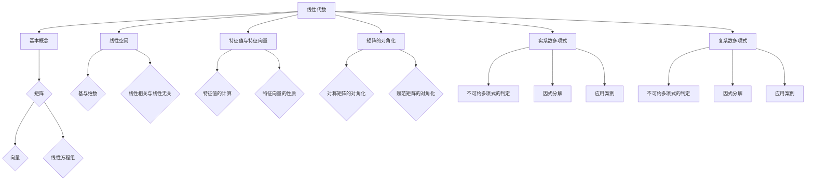

                 

# 线性代数导引：实系数和复系数不可约多项式

## 关键词
线性代数，实系数多项式，复系数多项式，不可约多项式，特征值，特征向量，矩阵对角化，因式分解，应用案例

## 摘要
本文旨在系统阐述线性代数在实系数和复系数不可约多项式中的应用。首先，我们将回顾线性代数的基本概念和性质，然后深入探讨线性方程组的求解方法，包括高斯消元法。接着，我们将研究特征值和特征向量的概念及其计算方法，并探讨矩阵对角化的原理和应用。随后，本文将详细分析实系数和复系数不可约多项式的定义、判定方法及因式分解。最后，我们将通过实际应用案例，展示线性代数在各个领域的应用，并提供学习线性代数的建议。

## 目录

1. **线性代数的基本概念**
    1.1 线性代数的定义与起源
    1.2 矩阵的概念与运算
    1.3 向量的概念与运算
    1.4 线性组合与线性相关
    1.5 线性空间的基本性质

2. **线性方程组**
    2.1 线性方程组的基本概念
    2.2 高斯消元法
    2.3 线性方程组的解的性质
    2.4 齐次线性方程组
    2.5 非齐次线性方程组

3. **特征值与特征向量**
    3.1 特征值与特征向量的概念
    3.2 特征值的计算方法
    3.3 特征向量的性质
    3.4 对称矩阵的特征值与特征向量
    3.5 赋范矩阵的特征值与特征向量

4. **矩阵的对角化**
    4.1 矩阵对角化的概念
    4.2 对称矩阵的对角化
    4.3 赋范矩阵的对角化
    4.4 矩阵对角化的应用

5. **实系数不可约多项式**
    5.1 实系数多项式的基本概念
    5.2 不可约多项式的定义与判定
    5.3 实系数多项式的因式分解
    5.4 不可约多项式的性质与应用

6. **复系数不可约多项式**
    6.1 复系数多项式的基本概念
    6.2 不可约多项式的定义与判定
    6.3 复系数多项式的因式分解
    6.4 不可约多项式的性质与应用

7. **线性代数在实际中的应用**
    7.1 线性代数在物理学中的应用
    7.2 线性代数在计算机科学中的应用
    7.3 线性代数在工程学中的应用
    7.4 线性代数在其他领域中的应用

8. **综合练习与案例分析**
    8.1 练习题与解答
    8.2 案例分析
    8.3 练习题与案例分析参考答案

9. **线性代数的拓展与应用**
    9.1 线性变换与线性算子
    9.2 线性空间的结构理论
    9.3 线性微分方程组
    9.4 线性代数在量子力学中的应用

10. **总结与展望**
    10.1 线性代数的重要性
    10.2 线性代数的未来发展趋势
    10.3 学习线性代数的建议与启示

## 第1章 线性代数的基本概念

线性代数是数学中的一个重要分支，它研究向量、矩阵以及线性方程组等概念。线性代数的概念和理论在自然科学、工程学以及经济学等领域都有广泛的应用。

### 1.1 线性代数的定义与起源

线性代数的定义可以简单概括为研究线性结构及其性质的数学分支。线性结构指的是由向量、矩阵等元素组成的结构，其中向量可以看作是具有多个分量的列向量，矩阵则是由多个向量组成的矩形阵列。

线性代数起源于解线性方程组的问题。在数学史上，线性方程组的研究可以追溯到古希腊时期。随着数学的发展，线性代数的理论逐渐完善，成为现代数学的重要组成部分。

### 1.2 矩阵的概念与运算

矩阵是一种由数字组成的矩形阵列，通常用大写字母表示。一个矩阵的行数和列数分别称为矩阵的阶数。矩阵的元素可以是实数或复数。

$$
A = \begin{bmatrix}
a_{11} & a_{12} & \cdots & a_{1n} \\
a_{21} & a_{22} & \cdots & a_{2n} \\
\vdots & \vdots & \ddots & \vdots \\
a_{m1} & a_{m2} & \cdots & a_{mn}
\end{bmatrix}
$$

矩阵的基本运算包括矩阵的加法、减法、乘法以及转置等。

#### 矩阵的加法和减法

矩阵的加法和减法遵循向量加法和减法的规则。对于两个同阶矩阵 $A$ 和 $B$，它们的加法和减法运算结果也是一个同阶矩阵。

$$
A + B = \begin{bmatrix}
a_{11} + b_{11} & a_{12} + b_{12} & \cdots & a_{1n} + b_{1n} \\
a_{21} + b_{21} & a_{22} + b_{22} & \cdots & a_{2n} + b_{2n} \\
\vdots & \vdots & \ddots & \vdots \\
a_{m1} + b_{m1} & a_{m2} + b_{m2} & \cdots & a_{mn} + b_{mn}
\end{bmatrix}
$$

$$
A - B = \begin{bmatrix}
a_{11} - b_{11} & a_{12} - b_{12} & \cdots & a_{1n} - b_{1n} \\
a_{21} - b_{21} & a_{22} - b_{22} & \cdots & a_{2n} - b_{2n} \\
\vdots & \vdots & \ddots & \vdots \\
a_{m1} - b_{m1} & a_{m2} - b_{m2} & \cdots & a_{mn} - b_{mn}
\end{bmatrix}
$$

#### 矩阵的乘法

矩阵的乘法是线性代数中一个重要的运算。对于两个矩阵 $A$ 和 $B$，它们的乘积是一个矩阵 $C$，其元素是通过矩阵 $A$ 的列向量和矩阵 $B$ 的行向量进行内积运算得到的。

$$
C = AB = \begin{bmatrix}
c_{11} & c_{12} & \cdots & c_{1n} \\
c_{21} & c_{22} & \cdots & c_{2n} \\
\vdots & \vdots & \ddots & \vdots \\
c_{m1} & c_{m2} & \cdots & c_{mn}
\end{bmatrix}
$$

其中，$c_{ij}$ 表示第 $i$ 行第 $j$ 列的元素，可以通过以下公式计算：

$$
c_{ij} = \sum_{k=1}^{n} a_{ik}b_{kj}
$$

#### 矩阵的转置

矩阵的转置是将矩阵的行和列交换得到的新矩阵。对于矩阵 $A$，其转置矩阵记为 $A^T$，其元素可以通过以下公式计算：

$$
(A^T)_{ij} = A_{ji}
$$

### 1.3 向量的概念与运算

向量是线性代数中的基本概念之一。向量可以看作是一个具有多个分量的列向量，通常用小写字母表示。向量可以表示为：

$$
\vec{v} = \begin{bmatrix}
v_1 \\
v_2 \\
\vdots \\
v_n
\end{bmatrix}
$$

向量之间的运算包括向量的加法、减法、数乘以及向量的内积和外积等。

#### 向量的加法和减法

向量的加法和减法遵循向量加法和减法的规则。对于两个同维度的向量 $\vec{u}$ 和 $\vec{v}$，它们的加法和减法运算结果也是一个同维度的向量。

$$
\vec{u} + \vec{v} = \begin{bmatrix}
u_1 + v_1 \\
u_2 + v_2 \\
\vdots \\
u_n + v_n
\end{bmatrix}
$$

$$
\vec{u} - \vec{v} = \begin{bmatrix}
u_1 - v_1 \\
u_2 - v_2 \\
\vdots \\
u_n - v_n
\end{bmatrix}
$$

#### 向量的数乘

向量的数乘是将向量与一个实数或复数进行乘法运算。对于向量 $\vec{v}$ 和一个数 $\alpha$，它们的数乘运算结果也是一个向量。

$$
\alpha\vec{v} = \begin{bmatrix}
\alpha v_1 \\
\alpha v_2 \\
\vdots \\
\alpha v_n
\end{bmatrix}
$$

#### 向量的内积

向量的内积是两个向量之间的点积运算。对于两个同维度的向量 $\vec{u}$ 和 $\vec{v}$，它们的内积运算结果是一个标量。

$$
\vec{u} \cdot \vec{v} = \sum_{i=1}^{n} u_i v_i
$$

#### 向量的外积

向量的外积是两个向量之间的叉积运算。对于两个三维向量 $\vec{u}$ 和 $\vec{v}$，它们的外积运算结果是一个新的向量。

$$
\vec{u} \times \vec{v} = \begin{bmatrix}
u_2 v_3 - u_3 v_2 \\
u_3 v_1 - u_1 v_3 \\
u_1 v_2 - u_2 v_1
\end{bmatrix}
$$

### 1.4 线性组合与线性相关

线性组合是指由一组向量通过数乘和向量加法得到的新的向量。对于一组向量 $\vec{v_1}, \vec{v_2}, \ldots, \vec{v_n}$ 和一组数 $c_1, c_2, \ldots, c_n$，它们的线性组合可以表示为：

$$
c_1\vec{v_1} + c_2\vec{v_2} + \cdots + c_n\vec{v_n}
$$

线性相关是指一组向量中存在线性关系。如果一组向量 $\vec{v_1}, \vec{v_2}, \ldots, \vec{v_n}$ 可以表示为线性组合，则称这组向量线性相关。反之，如果一组向量不能表示为线性组合，则称这组向量线性无关。

线性空间是一组向量的集合，满足封闭性、结合律、分配律等基本性质。线性空间中的向量可以看作是线性方程组的解，而线性方程组的解又构成了一个线性空间。

### 1.5 线性空间的基本性质

线性空间是一组向量的集合，满足以下基本性质：

1. **加法封闭性**：对于任意的向量 $\vec{u}$ 和 $\vec{v}$，它们的和 $\vec{u} + \vec{v}$ 仍然属于该线性空间。
2. **减法封闭性**：对于任意的向量 $\vec{u}$ 和 $\vec{v}$，它们的差 $\vec{u} - \vec{v}$ 仍然属于该线性空间。
3. **数乘封闭性**：对于任意的向量 $\vec{u}$ 和任意的数 $\alpha$，它们的数乘 $\alpha\vec{u}$ 仍然属于该线性空间。
4. **结合律**：对于任意的向量 $\vec{u}$、$\vec{v}$ 和 $\vec{w}$，以及任意的数 $\alpha$ 和 $\beta$，有：
    - $(\alpha + \beta)\vec{u} = \alpha\vec{u} + \beta\vec{u}$
    - $\alpha(\vec{u} + \vec{v}) = \alpha\vec{u} + \alpha\vec{v}$
5. **分配律**：对于任意的向量 $\vec{u}$、$\vec{v}$ 和 $\vec{w}$，以及任意的数 $\alpha$ 和 $\beta$，有：
    - $\alpha(\vec{u} + \vec{v}) = \alpha\vec{u} + \alpha\vec{v}$
    - $(\alpha + \beta)\vec{u} = \alpha\vec{u} + \beta\vec{u}$
6. **存在零向量**：线性空间中存在一个零向量 $\vec{0}$，使得对于任意的向量 $\vec{u}$，有 $\vec{u} + \vec{0} = \vec{u}$。
7. **存在逆元**：对于任意的非零向量 $\vec{u}$，存在一个向量 $\vec{u}^{-1}$，使得 $\vec{u} + \vec{u}^{-1} = \vec{0}$。

这些性质使得线性空间成为一个抽象的数学结构，但它们在现实世界中有着广泛的应用。

## 第2章 线性方程组

线性方程组是线性代数中的一个重要概念，它涉及到多个未知数和等式，通过矩阵和向量可以简化问题的求解。本章将介绍线性方程组的基本概念、高斯消元法以及解的性质。

### 2.1 线性方程组的基本概念

线性方程组是指包含多个线性方程的方程组，通常可以用矩阵形式表示。一个线性方程组的一般形式为：

$$
\begin{cases}
a_{11}x_1 + a_{12}x_2 + \cdots + a_{1n}x_n = b_1 \\
a_{21}x_1 + a_{22}x_2 + \cdots + a_{2n}x_n = b_2 \\
\vdots \\
a_{m1}x_1 + a_{m2}x_2 + \cdots + a_{mn}x_n = b_m
\end{cases}
$$

其中，$a_{ij}$ 和 $b_i$ 是已知的实数或复数，$x_i$ 是需要求解的未知数。

线性方程组的解是指能够满足所有方程的未知数的值。一个线性方程组可能有以下三种情况：

1. **有唯一解**：当线性方程组中方程的个数等于未知数的个数时，方程组可能存在唯一解。
2. **无解**：当线性方程组中方程的个数大于未知数的个数时，方程组可能无解。
3. **有无数解**：当线性方程组中方程的个数小于未知数的个数时，方程组可能有无数解。

### 2.2 高斯消元法

高斯消元法是求解线性方程组的一种常用方法。它的基本思想是通过初等行变换将增广矩阵转化为行阶梯形式，然后通过回代求解方程组的解。

初等行变换包括以下三种操作：

1. **交换两行**：将矩阵中的两行进行交换。
2. **乘以一个非零常数**：将矩阵中的某一行乘以一个非零常数。
3. **行相加**：将矩阵中的某一行与另一行进行线性组合。

高斯消元法的步骤如下：

1. **将增广矩阵转化为行阶梯形式**：
   - 从左到右，从上到下，对矩阵进行初等行变换，使得每列的元素下面的所有元素都为零。
   - 每列只保留一个非零元素，其余元素都为零。

2. **进行回代求解**：
   - 从最后一行开始，利用已知的等式解出未知数。
   - 将求得的未知数代入上一行，继续求解。
   - 重复这个过程，直到求出所有未知数的值。

### 2.3 线性方程组的解的性质

线性方程组的解具有以下性质：

1. **解的唯一性**：如果线性方程组有解，那么它有且只有一个解。这意味着解是唯一的。
2. **解的存在性**：线性方程组可能有解，也可能无解。当方程的个数大于未知数的个数时，方程组一般无解。
3. **解的叠加原理**：如果线性方程组有解，那么解可以表示为已知解的线性组合。这意味着解具有叠加性。
4. **解的空间性**：当线性方程组有无数解时，解构成一个线性空间。这意味着解不仅有一个，而是一组。

### 2.4 齐次线性方程组

齐次线性方程组是指系数矩阵为零的线性方程组。它的形式为：

$$
\begin{cases}
a_{11}x_1 + a_{12}x_2 + \cdots + a_{1n}x_n = 0 \\
a_{21}x_1 + a_{22}x_2 + \cdots + a_{2n}x_n = 0 \\
\vdots \\
a_{m1}x_1 + a_{m2}x_2 + \cdots + a_{mn}x_n = 0
\end{cases}
$$

齐次线性方程组的解具有以下性质：

1. **必有解**：齐次线性方程组一定有解，其解集构成一个线性空间。
2. **解的线性无关性**：齐次线性方程组的解是线性无关的。
3. **解的无限性**：齐次线性方程组的解可能有无数个，其解集构成一个无限维的线性空间。

### 2.5 非齐次线性方程组

非齐次线性方程组是指系数矩阵不为零的线性方程组。它的形式为：

$$
\begin{cases}
a_{11}x_1 + a_{12}x_2 + \cdots + a_{1n}x_n = b_1 \\
a_{21}x_1 + a_{22}x_2 + \cdots + a_{2n}x_n = b_2 \\
\vdots \\
a_{m1}x_1 + a_{m2}x_2 + \cdots + a_{mn}x_n = b_m
\end{cases}
$$

非齐次线性方程组的解具有以下性质：

1. **解的存在性**：非齐次线性方程组可能有解，也可能无解。
2. **解的唯一性**：如果非齐次线性方程组有解，那么它有且只有一个解。
3. **解的叠加原理**：非齐次线性方程组的解可以表示为齐次线性方程组的解与非齐次项的线性组合。
4. **解的空间性**：非齐次线性方程组的解构成一个线性空间。

通过本章的介绍，我们可以看到线性方程组是线性代数中的一个重要概念，它具有丰富的性质和解法。掌握线性方程组的求解方法和性质对于进一步学习线性代数和实际应用具有重要意义。

## 第3章 特征值与特征向量

特征值与特征向量是线性代数中非常重要的概念，它们在矩阵分析、微分方程、物理和工程等领域中有着广泛的应用。本章将介绍特征值与特征向量的概念、计算方法及其性质。

### 3.1 特征值与特征向量的概念

对于一个给定的方阵 \( A \)，如果存在一个非零向量 \( \vec{v} \) 和一个实数或复数 \( \lambda \)，使得以下等式成立：

\[ A\vec{v} = \lambda\vec{v} \]

则 \( \lambda \) 被称为矩阵 \( A \) 的一个特征值，而 \( \vec{v} \) 被称为 \( A \) 对应于 \( \lambda \) 的一个特征向量。

### 3.2 特征值的计算方法

计算矩阵的特征值通常通过以下步骤进行：

1. **构造特征方程**：首先，构建一个特征方程 \( |A - \lambda I| = 0 \)，其中 \( I \) 是单位矩阵。
2. **求解特征方程**：求解特征方程得到 \( \lambda \) 的值，这些值即为矩阵 \( A \) 的特征值。
3. **计算特征向量**：对于每个特征值 \( \lambda \)，求解线性方程组 \( (A - \lambda I)\vec{v} = \vec{0} \) 得到对应的特征向量。

具体步骤如下：

- **步骤1**：构造特征方程

对于 \( n \) 阶方阵 \( A \)，特征方程为：

\[ \det(A - \lambda I) = 0 \]

其中，\( \det \) 表示行列式，\( \lambda \) 是变量。

- **步骤2**：求解特征方程

求解上述特征方程，得到 \( \lambda \) 的值。这些值即为矩阵 \( A \) 的特征值。

- **步骤3**：计算特征向量

对于每个特征值 \( \lambda \)，求解线性方程组 \( (A - \lambda I)\vec{v} = \vec{0} \) 得到对应的特征向量。需要注意的是，特征向量并不一定是唯一的，但它们一定是线性无关的。

### 3.3 特征向量的性质

特征向量具有以下几个重要性质：

1. **非零性**：特征向量是非零向量。如果 \( \vec{v} \) 是 \( A \) 对应于 \( \lambda \) 的特征向量，那么 \( \vec{v} \neq \vec{0} \)。
2. **线性无关性**：特征向量之间线性无关。如果 \( \vec{v_1}, \vec{v_2}, \ldots, \vec{v_k} \) 是 \( A \) 对应于不同特征值 \( \lambda_1, \lambda_2, \ldots, \lambda_k \) 的特征向量，那么这组向量线性无关。
3. **可伸缩性**：特征向量可以被任意数乘。如果 \( \vec{v} \) 是 \( A \) 对应于 \( \lambda \) 的特征向量，那么对于任意非零实数或复数 \( \alpha \)，\( \alpha\vec{v} \) 也是 \( A \) 对应于 \( \lambda \) 的特征向量。

### 3.4 对称矩阵的特征值与特征向量

对称矩阵 \( A \) 是指满足 \( A^T = A \) 的矩阵。对称矩阵的特征值和特征向量具有以下性质：

1. **全部为实数**：对称矩阵的所有特征值都是实数。
2. **对应特征向量正交**：对于对称矩阵 \( A \)，如果 \( \vec{v_1} \) 和 \( \vec{v_2} \) 是 \( A \) 对应于不同特征值 \( \lambda_1 \) 和 \( \lambda_2 \) 的特征向量，那么 \( \vec{v_1} \cdot \vec{v_2} = 0 \)，即它们是正交的。

这些性质使得对称矩阵在许多实际应用中具有重要意义，例如物理系统中的能量和动量描述、经济学中的优化问题等。

### 3.5 赋范矩阵的特征值与特征向量

赋范矩阵是指其元素均为复数的矩阵。赋范矩阵的特征值和特征向量具有以下性质：

1. **复数特征值**：赋范矩阵的特征值可能是复数。
2. **不一定对应特征向量正交**：与对称矩阵不同，赋范矩阵的不同特征向量不一定正交。

尽管赋范矩阵的特征向量不一定正交，但它们仍然是线性无关的。这使得赋范矩阵在许多实际应用中仍然具有重要意义，例如量子力学中的态描述、信号处理中的滤波器设计等。

通过本章的介绍，我们可以看到特征值与特征向量在矩阵分析中的应用及其重要性。掌握这些概念和方法对于深入理解线性代数的理论及其应用具有重要意义。

### 第4章 矩阵的对角化

矩阵对角化是线性代数中的一个重要概念，它可以将一个矩阵转换为对角矩阵，从而简化矩阵的计算和分析。本章将介绍矩阵对角化的基本概念、对角化的条件、对角化的计算方法以及对角化在实际中的应用。

#### 4.1 矩阵对角化的概念

对于一个给定的矩阵 \( A \)，如果存在一个可逆矩阵 \( P \)，使得 \( P^{-1}AP \) 是一个对角矩阵 \( D \)，即：

\[ P^{-1}AP = D \]

则称矩阵 \( A \) 被对角化了，或者称 \( A \) 可以对角化。对角矩阵 \( D \) 的对角线元素即为 \( A \) 的特征值，而 \( P \) 的列向量即为 \( A \) 的特征向量。

#### 4.2 对角化的条件

矩阵对角化的条件是矩阵 \( A \) 必须有 \( n \) 个线性无关的特征向量，其中 \( n \) 是矩阵 \( A \) 的阶数。当矩阵 \( A \) 是方阵时，这意味着 \( A \) 必须有 \( n \) 个不同的特征值。

对于非方阵，对角化条件有所不同。一个非方阵 \( A \) 可以对角化的条件是其行数和列数相等，即 \( A \) 是一个方阵。此时，\( A \) 必须有 \( n \) 个线性无关的特征向量，其中 \( n \) 是 \( A \) 的行数或列数。

#### 4.3 对角化的计算方法

对角化的计算方法通常分为以下几步：

1. **求解特征值**：首先，求解矩阵 \( A \) 的特征值。这可以通过求解特征方程 \( \det(A - \lambda I) = 0 \) 完成。
2. **求解特征向量**：对于每个特征值 \( \lambda \)，求解线性方程组 \( (A - \lambda I)\vec{v} = \vec{0} \) 得到对应的特征向量。
3. **构造对角矩阵**：将所有特征向量作为列向量组成一个矩阵 \( P \)。如果所有的特征向量线性无关，那么 \( P \) 是一个可逆矩阵。
4. **计算对角化结果**：通过计算 \( P^{-1}AP \) 得到对角矩阵 \( D \)。

对角化的计算过程可以表示为以下伪代码：

```
输入：矩阵 A
输出：对角矩阵 D 和可逆矩阵 P

// 步骤1：求解特征值
特征值列表 = 求解特征方程(A - λI).det() = 0

// 步骤2：求解特征向量
P = 空矩阵
对于每个特征值 λ：
  向量 v = 求解线性方程组(A - λI).v = 0
  如果 v 不是零向量：
    将 v 添加到矩阵 P 的列中

// 步骤3：构造对角矩阵
D = 创建对角矩阵
对于每个特征值 λ：
  D[i,i] = λ

// 步骤4：计算对角化结果
如果 P 是可逆矩阵：
  D = P^{-1}AP
否则：
  输出 "矩阵 A 不能对角化"
```

#### 4.4 矩阵对角化的应用

矩阵对角化在数学、物理、工程和计算机科学等领域有着广泛的应用。以下是一些对角化应用的实际例子：

1. **物理系统的分析**：在量子力学中，物理系统的状态可以通过矩阵的对角化来描述。通过对角化，可以求解系统的本征值问题，从而得到系统的能量和态。
2. **信号处理**：在信号处理中，傅里叶变换和拉普拉斯变换等操作可以看作是对信号的矩阵对角化。通过对角化，可以简化信号的处理和分析。
3. **优化问题**：在优化问题中，矩阵对角化可以帮助找到最优解。通过对角化，可以将复杂的多变量优化问题转化为单变量优化问题，从而简化计算过程。
4. **机器学习**：在机器学习中，矩阵对角化可以用于降维、特征提取和特征选择等任务。通过对角化，可以提取数据的最重要的特征，从而提高模型的性能。

通过本章的介绍，我们可以看到矩阵对角化在理论研究和实际应用中的重要性。掌握对角化的概念和计算方法，有助于我们更好地理解和解决复杂的问题。

### 第5章 实系数不可约多项式

实系数不可约多项式在数学和计算机科学中有着重要的应用。本章将介绍实系数多项式的基本概念、不可约多项式的定义与判定、因式分解方法及其性质和应用。

#### 5.1 实系数多项式的基本概念

实系数多项式是指所有系数都是实数的多项式。一个 \( n \) 次实系数多项式的一般形式可以表示为：

\[ f(x) = a_nx^n + a_{n-1}x^{n-1} + \cdots + a_1x + a_0 \]

其中，\( a_n, a_{n-1}, \ldots, a_1, a_0 \) 是实数系数，\( x \) 是变量。\( a_n \) 是多项式的首项系数，称为首项系数。

实系数多项式的性质包括：

1. **系数域**：实系数多项式的系数域是实数域 \( \mathbb{R} \)。
2. **唯一分解定理**：实系数多项式在实数域上有唯一分解定理，即每个多项式都可以唯一地分解为一次因式的乘积。
3. **有理系数多项式**：如果多项式的系数是有理数，则称为有理系数多项式。有理系数多项式可以分解为实系数多项式的乘积。

#### 5.2 不可约多项式的定义与判定

不可约多项式是指在某个域上不能再分解为更低次数的多项式的多项式。对于实系数多项式，不可约多项式的定义如下：

**定义**：如果实系数多项式 \( f(x) \) 不能表示为两个非常数多项式 \( g(x) \) 和 \( h(x) \) 的乘积，则称 \( f(x) \) 为不可约多项式。

不可约多项式的判定可以通过以下方法：

1. **艾森斯坦因判别法**：对于形如 \( x^n + a_{n-1}x^{n-1} + \cdots + a_1x + a_0 \) 的多项式，如果存在一个素数 \( p \)，使得 \( p \) 整除 \( a_{n-1}, a_{n-2}, \ldots, a_1, a_0 \)，但不整除 \( a_n \)，则该多项式是不可约的。

2. **代数基本定理**：实系数多项式在复数域上总有根，且每个根都是成对共轭的。如果一个多项式没有有理根，则它一定是不可约的。

#### 5.3 实系数多项式的因式分解

实系数多项式的因式分解是将多项式分解为一次因式的乘积的过程。因式分解可以通过以下方法进行：

1. **试除法**：通过试除法，可以找到多项式的一个有理根，进而将多项式因式分解为一次因式的乘积。

2. **长除法**：使用长除法，可以将多项式除以一个一次因式，从而得到另一个多项式。重复这个过程，直到得到一个不可约多项式。

3. **综合除法**：综合除法是一种用于因式分解的高效算法。通过综合除法，可以快速找到多项式的一个有理根，并因式分解为一次因式的乘积。

#### 5.4 不可约多项式的性质与应用

不可约多项式在数学和计算机科学中有广泛的应用，包括：

1. **数论**：不可约多项式在数论中用于构造素数和解决同余方程。

2. **算法设计**：不可约多项式在密码学中用于构造密码函数，如椭圆曲线密码体制。

3. **计算机图形学**：不可约多项式在计算机图形学中用于曲线和曲面的表示和计算。

4. **数值计算**：不可约多项式在数值计算中用于求解非线性方程和优化问题。

通过本章的介绍，我们可以看到实系数不可约多项式在数学和计算机科学中的重要性和广泛应用。掌握不可约多项式的概念和性质，对于深入理解和解决实际问题具有重要意义。

### 第6章 复系数不可约多项式

复系数不可约多项式在数学和计算机科学中也扮演着重要的角色。本章将介绍复系数多项式的基本概念、不可约多项式的定义与判定、因式分解方法及其性质和应用。

#### 6.1 复系数多项式的基本概念

复系数多项式是指所有系数都是复数的多项式。一个 \( n \) 次复系数多项式的一般形式可以表示为：

\[ f(x) = a_nx^n + a_{n-1}x^{n-1} + \cdots + a_1x + a_0 \]

其中，\( a_n, a_{n-1}, \ldots, a_1, a_0 \) 是复数系数，\( x \) 是变量。\( a_n \) 是多项式的首项系数，称为首项系数。

复系数多项式的性质包括：

1. **系数域**：复系数多项式的系数域是复数域 \( \mathbb{C} \)。
2. **唯一分解定理**：复系数多项式在复数域上有唯一分解定理，即每个多项式都可以唯一地分解为一次因式的乘积。
3. **有理系数多项式**：如果多项式的系数是有理数，则称为有理系数多项式。有理系数多项式可以分解为复系数多项式的乘积。

#### 6.2 不可约多项式的定义与判定

不可约多项式是指在某个域上不能再分解为更低次数的多项式的多项式。对于复系数多项式，不可约多项式的定义如下：

**定义**：如果复系数多项式 \( f(x) \) 不能表示为两个非常数多项式 \( g(x) \) 和 \( h(x) \) 的乘积，则称 \( f(x) \) 为不可约多项式。

复系数不可约多项式的判定可以通过以下方法：

1. **根的判别法**：如果复系数多项式没有有理根，则它一定是不可约的。
2. **代数基本定理**：复系数多项式在复数域上总有根。如果一个多项式没有有理根，则它一定是不可约的。
3. **群论方法**：通过群论方法，可以判定多项式是否不可约。例如，可以使用伽罗瓦理论来判定多项式是否不可约。

#### 6.3 复系数多项式的因式分解

复系数多项式的因式分解是将多项式分解为一次因式的乘积的过程。因式分解可以通过以下方法进行：

1. **试除法**：通过试除法，可以找到多项式的一个有理根，进而将多项式因式分解为一次因式的乘积。
2. **长除法**：使用长除法，可以将多项式除以一个一次因式，从而得到另一个多项式。重复这个过程，直到得到一个不可约多项式。
3. **综合除法**：综合除法是一种用于因式分解的高效算法。通过综合除法，可以快速找到多项式的一个有理根，并因式分解为一次因式的乘积。

#### 6.4 不可约多项式的性质与应用

不可约多项式在数学和计算机科学中有广泛的应用，包括：

1. **数论**：不可约多项式在数论中用于构造素数和解决同余方程。
2. **算法设计**：不可约多项式在密码学中用于构造密码函数，如椭圆曲线密码体制。
3. **计算机图形学**：不可约多项式在计算机图形学中用于曲线和曲面的表示和计算。
4. **数值计算**：不可约多项式在数值计算中用于求解非线性方程和优化问题。

通过本章的介绍，我们可以看到复系数不可约多项式在数学和计算机科学中的重要性和广泛应用。掌握不可约多项式的概念和性质，对于深入理解和解决实际问题具有重要意义。

### 第7章 线性代数在实际中的应用

线性代数是数学中一个重要的分支，它在许多实际领域中都有着广泛的应用。本章将介绍线性代数在物理学、计算机科学、工程学和经济学等领域的应用。

#### 7.1 线性代数在物理学中的应用

线性代数在物理学中的应用非常广泛，包括量子力学、电磁学和力学等领域。

1. **量子力学**：量子力学中，物理系统的状态可以用波函数表示。波函数是一个向量，而量子态的演化可以通过线性算子来描述。线性代数的概念如矩阵、向量、特征值和特征向量在量子力学中有着重要的应用。
   
2. **电磁学**：在电磁学中，麦克斯韦方程组可以用矩阵形式表示。通过解麦克斯韦方程组，可以求解电磁场的分布和传播。线性代数的矩阵运算和特征值分析对于研究电磁现象具有重要意义。

3. **力学**：在经典力学中，物理系统的运动可以用线性方程组描述。通过解线性方程组，可以求解系统的状态和轨迹。线性代数的矩阵运算和特征值分析对于研究机械振动、碰撞等力学问题非常有用。

#### 7.2 线性代数在计算机科学中的应用

线性代数在计算机科学中的应用非常广泛，包括图像处理、机器学习和算法设计等领域。

1. **图像处理**：在图像处理中，图像可以表示为矩阵。通过矩阵运算，可以实现对图像的各种操作，如滤波、边缘检测、图像增强等。线性代数的矩阵乘法和矩阵分解在图像处理中有着重要的应用。

2. **机器学习**：在机器学习中，数据可以用矩阵表示。通过矩阵运算，可以训练和优化机器学习模型。线性代数的矩阵分解、特征值分析等技术在降维、特征提取和模型优化中发挥着重要作用。

3. **算法设计**：在算法设计中，线性代数提供了许多有效的算法，如高斯消元法、矩阵求逆等。这些算法在解决线性方程组、优化问题和其他计算问题中非常有用。

#### 7.3 线性代数在工程学中的应用

线性代数在工程学中的应用也非常广泛，包括结构分析、控制系统和信号处理等领域。

1. **结构分析**：在结构分析中，结构系统的行为可以用线性方程组描述。通过解线性方程组，可以求解结构的应力、位移和振动等特性。线性代数的矩阵运算和特征值分析对于研究结构系统的稳定性、动态响应等具有重要意义。

2. **控制系统**：在控制系统设计中，系统的动态行为可以用状态空间方程描述。通过解状态空间方程，可以分析系统的稳定性和性能。线性代数的矩阵运算和特征值分析在控制系统设计中发挥着重要作用。

3. **信号处理**：在信号处理中，信号可以表示为矩阵。通过矩阵运算，可以实现对信号的各种操作，如滤波、变换和压缩等。线性代数的矩阵分解、特征值分析等技术在信号处理中有着重要的应用。

#### 7.4 线性代数在其他领域中的应用

除了上述领域，线性代数还在许多其他领域中有着重要的应用。

1. **经济学**：在经济学中，线性代数可以用于分析和优化经济系统。例如，线性规划问题可以使用线性代数的方法求解，以最大化利润或最小化成本。

2. **生物学**：在生物学中，线性代数可以用于分析和模拟生物系统的动态行为。例如，使用线性代数的方法可以研究基因表达和细胞信号传导等生物学过程。

3. **金融学**：在金融学中，线性代数可以用于分析和风险管理。例如，使用线性代数的方法可以计算投资组合的预期收益和风险。

通过本章的介绍，我们可以看到线性代数在各个实际领域中都有着重要的应用。掌握线性代数的概念和方法，对于解决实际问题具有重要意义。

### 第8章 综合练习与案例分析

在实际应用中，掌握线性代数的基本概念和方法是非常重要的。通过以下综合练习和案例分析，我们将进一步巩固所学知识，并提高解决实际问题的能力。

#### 8.1 练习题与解答

**练习题 1**：求解线性方程组

\[ 
\begin{cases}
2x + 3y - z = 8 \\
4x - 2y + 2z = -4 \\
2x + y + 3z = 0 
\end{cases}
\]

**解题过程**：

我们可以使用高斯消元法来求解这个线性方程组。首先，将方程组写成增广矩阵的形式：

\[ 
\left[
\begin{array}{ccc|c}
2 & 3 & -1 & 8 \\
4 & -2 & 2 & -4 \\
2 & 1 & 3 & 0 
\end{array}
\right]
\]

接下来，通过行变换将增广矩阵化为行阶梯形式：

1. 将第1行乘以2，然后从第2行和第3行中分别减去第1行的两倍，得到：

\[ 
\left[
\begin{array}{ccc|c}
2 & 3 & -1 & 8 \\
0 & -8 & 4 & -16 \\
0 & -1 & 5 & -16 
\end{array}
\right]
\]

2. 将第2行乘以-1/8，得到：

\[ 
\left[
\begin{array}{ccc|c}
2 & 3 & -1 & 8 \\
0 & 1 & -1/2 & 2 \\
0 & -1 & 5 & -16 
\end{array}
\right]
\]

3. 将第3行加上第2行的倍数，使得第3行的第2列元素为0，得到：

\[ 
\left[
\begin{array}{ccc|c}
2 & 3 & -1 & 8 \\
0 & 1 & -1/2 & 2 \\
0 & 0 & 7/2 & -14 
\end{array}
\right]
\]

现在，我们可以从最后一行开始回代求解：

1. 解得 \( z = -14 \div (7/2) = -4 \)。

2. 将 \( z \) 的值代入第2行，解得 \( y = 2 + (1/2)z = 1 \)。

3. 将 \( y \) 和 \( z \) 的值代入第1行，解得 \( x = (8 - 3y + z) \div 2 = 2 \)。

因此，线性方程组的解为：

\[ 
\begin{cases}
x = 2 \\
y = 1 \\
z = -4 
\end{cases}
\]

**练习题 2**：计算矩阵的特征值和特征向量

\[ 
A = \begin{bmatrix}
2 & 1 \\
-1 & 2 
\end{bmatrix}
\]

**解题过程**：

要计算矩阵 \( A \) 的特征值和特征向量，我们首先需要求解特征方程 \( \det(A - \lambda I) = 0 \)。

\[ 
\det(A - \lambda I) = \det \begin{bmatrix}
2 - \lambda & 1 \\
-1 & 2 - \lambda 
\end{bmatrix} = (2 - \lambda)^2 - 1 = \lambda^2 - 4\lambda + 3 = 0 
\]

解这个二次方程，我们得到特征值：

\[ 
\lambda_1 = 1, \quad \lambda_2 = 3 
\]

对于每个特征值，我们需要求解对应的特征向量。

对于 \( \lambda_1 = 1 \)，解线性方程组 \( (A - \lambda_1 I)\vec{v} = \vec{0} \)：

\[ 
\begin{bmatrix}
1 & 1 \\
-1 & 1 
\end{bmatrix} \begin{bmatrix}
x \\
y 
\end{bmatrix} = \begin{bmatrix}
0 \\
0 
\end{bmatrix} 
\]

从这个方程组中，我们可以解得特征向量：

\[ 
\vec{v}_1 = \begin{bmatrix}
1 \\
1 
\end{bmatrix}
\]

对于 \( \lambda_2 = 3 \)，解线性方程组 \( (A - \lambda_2 I)\vec{v} = \vec{0} \)：

\[ 
\begin{bmatrix}
-1 & 1 \\
-1 & -1 
\end{bmatrix} \begin{bmatrix}
x \\
y 
\end{bmatrix} = \begin{bmatrix}
0 \\
0 
\end{bmatrix} 
\]

从这个方程组中，我们可以解得特征向量：

\[ 
\vec{v}_2 = \begin{bmatrix}
1 \\
-1 
\end{bmatrix}
\]

因此，矩阵 \( A \) 的特征值为 \( \lambda_1 = 1 \) 和 \( \lambda_2 = 3 \)，对应的特征向量分别为 \( \vec{v}_1 = \begin{bmatrix}
1 \\
1 
\end{bmatrix} \) 和 \( \vec{v}_2 = \begin{bmatrix}
1 \\
-1 
\end{bmatrix} \)。

**练习题 3**：因式分解实系数多项式

\[ 
f(x) = x^3 - 4x^2 + 5x - 6 
\]

**解题过程**：

为了因式分解 \( f(x) \)，我们可以尝试使用综合除法。首先，我们需要找到 \( f(x) \) 的一个有理根。我们可以尝试一些常见的有理根，如 \( \pm 1, \pm 2, \pm 3, \pm 6 \)。

通过尝试，我们发现 \( x = 1 \) 是 \( f(x) \) 的一个根。使用综合除法，我们可以将 \( f(x) \) 除以 \( x - 1 \)，得到：

\[ 
\begin{array}{c|cccc}
1 & 1 & -4 & 5 & -6 \\
\hline
& 1 & -3 & -2 & 0 \\
\end{array}
\]

这意味着 \( f(x) = (x - 1)(x^2 - 3x - 2) \)。

接下来，我们需要因式分解 \( x^2 - 3x - 2 \)。通过试除法，我们发现 \( x = -1 \) 和 \( x = 2 \) 是 \( x^2 - 3x - 2 \) 的根。因此，我们可以将 \( x^2 - 3x - 2 \) 因式分解为：

\[ 
x^2 - 3x - 2 = (x + 1)(x - 2) 
\]

综合起来，我们得到：

\[ 
f(x) = (x - 1)(x + 1)(x - 2) 
\]

因此，实系数多项式 \( f(x) = x^3 - 4x^2 + 5x - 6 \) 的因式分解为 \( (x - 1)(x + 1)(x - 2) \)。

#### 8.2 案例分析

**案例 1**：线性代数在图像处理中的应用

图像处理是计算机科学中的一个重要领域，而线性代数在图像处理中发挥着核心作用。下面我们通过一个实际案例来分析线性代数在图像处理中的应用。

**问题**：如何使用线性代数方法进行图像的滤波？

**解题过程**：

图像滤波是图像处理中的一种基本操作，用于去除图像中的噪声或增强图像的某些特征。线性滤波是一种常用的图像滤波方法，它利用线性算子对图像进行卷积操作。

1. **定义线性滤波器**：

   线性滤波器可以用一个 \( m \times n \) 的矩阵 \( H \) 来表示。这个矩阵称为滤波器的核或卷积核。滤波器核决定了滤波器的响应特性。

2. **卷积操作**：

   对于一幅 \( p \times q \) 的图像 \( I \)，我们将滤波器 \( H \) 与图像进行卷积操作，生成新的图像 \( O \)。卷积操作的数学表达式如下：

   \[
   O(i, j) = \sum_{x=-\frac{m-1}{2}}^{\frac{m-1}{2}} \sum_{y=-\frac{n-1}{2}}^{\frac{n-1}{2}} H(x, y) \cdot I(i-x, j-y)
   \]

   其中，\( O(i, j) \) 是输出图像 \( O \) 的第 \( i \) 行第 \( j \) 列的像素值，\( I(i-x, j-y) \) 是输入图像 \( I \) 的第 \( i \) 行第 \( j \) 列的像素值，\( H(x, y) \) 是滤波器核的第 \( x \) 行第 \( y \) 列的元素。

3. **滤波器的设计**：

   滤波器的设计取决于需要去除的噪声类型和要增强的图像特征。例如，高斯滤波器用于去除图像中的高斯噪声，而拉普拉斯滤波器用于检测图像的边缘。

   高斯滤波器的核可以表示为：

   \[
   H(x, y) = \frac{1}{2\pi\sigma^2} e^{-\frac{(x^2 + y^2)}{2\sigma^2}}
   \]

   其中，\( \sigma \) 是高斯滤波器的标准差。

   拉普拉斯滤波器的核可以表示为：

   \[
   H(x, y) = \begin{cases}
   0, & \text{如果 } x \text{ 或 } y \text{ 等于 } 0 \\
   4, & \text{如果 } x = 1 \text{ 且 } y = 0 \\
   -4, & \text{如果 } x = 0 \text{ 且 } y = 1 \\
   \end{cases}
   \]

4. **图像滤波**：

   使用设计的滤波器核对图像进行卷积操作，生成新的滤波图像。通过调整滤波器的参数，如标准差或核的大小，可以控制滤波的效果。

   下面是一个简单的伪代码，用于实现高斯滤波：

   ```python
   def gauss_filter(image, sigma):
       # 创建输出图像
       output = np.zeros_like(image)
       
       # 计算高斯滤波器的核
       filter = cv2.GaussianKernel(size=(5*sigma+1), sigma=sigma)

       # 对输入图像进行卷积操作
       output = cv2.filter2D(image, -1, filter)

       return output
   ```

**案例 2**：线性代数在结构分析中的应用

结构分析是工程学中的一个重要领域，用于评估和设计建筑和机械结构。线性代数在结构分析中发挥着核心作用，用于求解结构的应力、位移和振动等特性。

**问题**：如何使用线性代数方法进行结构分析？

**解题过程**：

1. **定义结构模型**：

   结构模型可以用一组节点和连接节点的杆件来表示。每个杆件可以看作是一个弹簧，其特性由弹性模量、截面积和质量等参数决定。

2. **建立方程组**：

   通过对结构进行静力平衡分析，可以建立一组线性方程组，用于求解结构的位移和应力。方程组的形式如下：

   \[
   K\vec{u} = \vec{F}
   \]

   其中，\( K \) 是结构刚度矩阵，\( \vec{u} \) 是节点位移向量，\( \vec{F} \) 是节点力向量。

3. **求解方程组**：

   通过解线性方程组，可以求解结构的位移和应力。常用的方法包括高斯消元法、迭代法和矩阵分解法等。

4. **分析结果**：

   求解结果可以用来评估结构的稳定性和安全性。通过分析结果，可以优化结构设计，提高结构的性能。

   下面是一个简单的伪代码，用于实现结构分析：

   ```python
   def structure_analysis(K, F):
       # 解线性方程组
       u = np.linalg.solve(K, F)
       
       # 计算应力
       stress = K @ u
       
       return u, stress
   ```

通过上述案例，我们可以看到线性代数在图像处理和结构分析中的应用。掌握线性代数的基本概念和方法，对于解决实际问题具有重要意义。

### 第9章 线性代数的拓展与应用

线性代数是数学中一个重要的分支，它在许多领域都有着广泛的应用。本章将介绍线性代数的拓展内容，包括线性变换与线性算子、线性空间的结构理论、线性微分方程组和线性代数在量子力学中的应用。

#### 9.1 线性变换与线性算子

线性变换是一种重要的数学工具，它用于描述空间之间的映射关系。在线性代数中，线性变换可以通过矩阵来表示。

**定义**：设 \( V \) 和 \( W \) 是两个向量空间，一个从 \( V \) 到 \( W \) 的映射 \( T \) 称为线性变换，如果对于任意的向量 \( \vec{u}, \vec{v} \in V \) 和任意的标量 \( \alpha \)，都有：

1. \( T(\vec{u} + \vec{v}) = T(\vec{u}) + T(\vec{v}) \)
2. \( T(\alpha\vec{u}) = \alpha T(\vec{u}) \)

线性变换可以看作是从 \( V \) 到 \( W \) 的一个线性映射。线性算子是线性变换的一种推广，它可以在更广泛的函数空间中定义。

**例子**：设 \( V = W = \mathbb{R}^2 \)，定义一个线性变换 \( T \)：

\[ 
T\begin{bmatrix}
x \\
y 
\end{bmatrix} = \begin{bmatrix}
x + y \\
2x - y 
\end{bmatrix} 
\]

这个变换可以表示为一个 \( 2 \times 2 \) 的矩阵：

\[ 
T = \begin{bmatrix}
1 & 1 \\
2 & -1 
\end{bmatrix} 
\]

线性算子的性质包括：

1. **线性组合**：对于任意的线性算子 \( T_1, T_2 \) 和标量 \( \alpha, \beta \)，有 \( (\alpha T_1 + \beta T_2)(\vec{u}) = \alpha T_1(\vec{u}) + \beta T_2(\vec{u}) \)。
2. **复合**：对于任意的线性算子 \( T_1, T_2 \)，有 \( (T_1 \circ T_2)(\vec{u}) = T_1(T_2(\vec{u})) \)。

线性变换和线性算子在物理学、工程学和计算机科学等领域有着广泛的应用，例如在量子力学中描述物理系统的演化、在图像处理中实现图像变换等。

#### 9.2 线性空间的结构理论

线性空间是线性代数中的一个基本概念，它是向量空间的一种抽象表示。线性空间中的向量可以看作是线性方程组的解。

**定义**：一个线性空间 \( V \) 是一个非空集合，其中定义了两个运算：向量加法和标量乘法。向量加法满足以下性质：

1. **封闭性**：对于任意的 \( \vec{u}, \vec{v} \in V \)，有 \( \vec{u} + \vec{v} \in V \)。
2. **结合律**：对于任意的 \( \vec{u}, \vec{v}, \vec{w} \in V \)，有 \( (\vec{u} + \vec{v}) + \vec{w} = \vec{u} + (\vec{v} + \vec{w}) \)。
3. **交换律**：对于任意的 \( \vec{u}, \vec{v} \in V \)，有 \( \vec{u} + \vec{v} = \vec{v} + \vec{u} \)。
4. **存在零向量**：存在一个零向量 \( \vec{0} \)，使得对于任意的 \( \vec{u} \in V \)，有 \( \vec{u} + \vec{0} = \vec{u} \)。
5. **存在逆元**：对于任意的非零向量 \( \vec{u} \in V \)，存在一个向量 \( \vec{u}^{-1} \)，使得 \( \vec{u} + \vec{u}^{-1} = \vec{0} \)。

标量乘法满足以下性质：

1. **封闭性**：对于任意的 \( \vec{u} \in V \) 和标量 \( \alpha \in \mathbb{R} \)，有 \( \alpha\vec{u} \in V \)。
2. **结合律**：对于任意的 \( \vec{u} \in V \) 和标量 \( \alpha, \beta \in \mathbb{R} \)，有 \( (\alpha\beta)\vec{u} = \alpha(\beta\vec{u}) \)。
3. **分配律**：对于任意的 \( \vec{u}, \vec{v} \in V \) 和标量 \( \alpha, \beta \in \mathbb{R} \)，有 \( \alpha(\vec{u} + \vec{v}) = \alpha\vec{u} + \alpha\vec{v} \)。
4. **分配律**：对于任意的 \( \vec{u} \in V \) 和标量 \( \alpha, \beta \in \mathbb{R} \)，有 \( (\alpha + \beta)\vec{u} = \alpha\vec{u} + \beta\vec{u} \)。

线性空间中的基和维数是非常重要的概念。基是线性空间中的一组向量，通过这组向量可以唯一地表示线性空间中的任意向量。基的个数称为线性空间的维数。

**例子**：设 \( V = \mathbb{R}^2 \)，向量 \( \vec{u} = \begin{bmatrix}
1 \\
0 
\end{bmatrix} \) 和 \( \vec{v} = \begin{bmatrix}
0 \\
1 
\end{bmatrix} \) 是 \( V \) 的一组基。因此，\( V \) 的维数为 2。

线性空间的结构理论在数学的许多领域都有重要应用，例如在几何学中研究向量空间和线性映射，在物理学中描述物理系统的状态空间等。

#### 9.3 线性微分方程组

线性微分方程组是一组线性微分方程的集合，它在物理学、工程学和经济学等领域有着广泛的应用。

**定义**：设 \( V \) 是一个线性空间，\( \vec{u}(t) = \begin{bmatrix}
u_1(t) \\
u_2(t) \\
\vdots \\
u_n(t)
\end{bmatrix} \) 是 \( V \) 中的一个向量函数。如果存在一个线性算子 \( L \)，使得以下方程成立：

\[ 
L\vec{u}(t) = \vec{f}(t) 
\]

其中，\( \vec{f}(t) \) 是 \( V \) 中的一个向量函数，则称 \( \vec{u}(t) \) 为 \( L \) 的一个解。

线性微分方程组的解可以通过线性代数的方法求解。常见的方法包括特征值方法、矩阵指数法和线性变换法等。

**例子**：考虑以下线性微分方程组：

\[ 
\begin{cases}
\frac{du_1(t)}{dt} = u_2(t) \\
\frac{du_2(t)}{dt} = u_1(t) + t 
\end{cases} 
\]

这个方程组可以表示为一个线性算子 \( L \)：

\[ 
L\vec{u}(t) = \begin{bmatrix}
0 & 1 \\
1 & 0 
\end{bmatrix}\vec{u}(t) + t\begin{bmatrix}
0 \\
1 
\end{bmatrix} 
\]

这个方程组的解可以通过矩阵指数法求解。首先，我们需要求解线性算子 \( L \) 的特征值和特征向量。通过计算 \( \det(L - \lambda I) = 0 \)，我们得到特征值 \( \lambda = 1 \) 和 \( \lambda = -1 \)。对应的特征向量分别为 \( \vec{v}_1 = \begin{bmatrix}
1 \\
1 
\end{bmatrix} \) 和 \( \vec{v}_2 = \begin{bmatrix}
1 \\
-1 
\end{bmatrix} \)。

我们可以将解表示为：

\[ 
\vec{u}(t) = c_1 e^t \vec{v}_1 + c_2 e^{-t} \vec{v}_2 + t\vec{b} 
\]

其中，\( \vec{b} \) 是一个与 \( L \) 无关的向量，可以通过初始条件确定。

线性微分方程组在物理系统中有着重要的应用，例如在机械振动、热传导和电路分析等领域。通过线性代数的方法，我们可以求解这些复杂的方程组，从而得到物理系统的行为和特性。

#### 9.4 线性代数在量子力学中的应用

量子力学是研究微观粒子行为和相互作用的一种理论。线性代数在量子力学中有着重要的应用，用于描述量子态和量子算子。

**定义**：在量子力学中，一个物理系统的状态可以用一个向量 \( \vec{\Psi} \) 表示，该向量属于某个希尔伯特空间 \( H \)。一个量子态的演化可以用一个线性算子 \( U \) 描述，该算子将一个状态向量映射到另一个状态向量。

**例子**：考虑一个单电子系统，其状态可以用希尔伯特空间 \( H = L^2(\mathbb{R}^3) \) 中的一个向量 \( \vec{\Psi} = \begin{bmatrix}
\Psi(x, y, z) 
\end{bmatrix} \) 表示。这个系统的演化可以用一个线性算子 \( U(t) \) 描述，该算子将状态向量 \( \vec{\Psi}(0) \) 映射到状态向量 \( \vec{\Psi}(t) \)。

\[ 
\vec{\Psi}(t) = U(t)\vec{\Psi}(0) 
\]

线性算子 \( U(t) \) 可以通过薛定谔方程描述：

\[ 
i\hbar \frac{\partial}{\partial t} \vec{\Psi}(t) = \hat{H} \vec{\Psi}(t) 
\]

其中，\( \hat{H} \) 是系统的哈密顿算子，\( i \) 是虚数单位，\( \hbar \) 是普朗克常数。

线性代数在量子力学中的应用包括：

1. **量子态的表示**：量子态可以用希尔伯特空间中的向量表示。通过线性代数的方法，我们可以研究量子态的叠加和纠缠现象。
2. **量子算子的表示**：量子算子可以用矩阵表示。通过线性代数的方法，我们可以研究量子算子的性质，如可逆性、谱和本征值。
3. **量子态的演化**：通过线性代数的方法，我们可以研究量子态的演化，如薛定谔方程的解。

线性代数在量子力学中的应用为研究微观粒子的行为提供了强有力的数学工具。通过线性代数的方法，我们可以解决许多复杂的量子问题，如量子计算、量子通信和量子模拟等。

### 第10章 总结与展望

线性代数是数学中的一个重要分支，它在许多领域都有着广泛的应用。本章我们将总结线性代数的基本概念、性质和应用，并探讨线性代数的未来发展趋势。

#### 10.1 线性代数的重要性

线性代数是现代数学的基础之一，它为许多领域提供了强有力的数学工具。线性代数的核心概念，如向量、矩阵、线性方程组、特征值和特征向量等，在物理学、工程学、计算机科学、经济学和统计学等领域都有着广泛的应用。

1. **物理学**：线性代数在量子力学、电磁学和力学中有着重要的应用。通过线性代数的工具，我们可以描述和解决物理系统的状态、动态行为和相互作用。
2. **工程学**：线性代数在结构分析、控制系统、信号处理和图像处理中有着广泛的应用。通过线性代数的方法，我们可以分析和设计复杂的工程系统。
3. **计算机科学**：线性代数在算法设计、数据结构、机器学习和图形学中有着重要的应用。通过线性代数的方法，我们可以优化算法、处理大数据和生成高质量的图像。
4. **经济学**：线性代数在优化问题、统计分析和金融模型中有着重要的应用。通过线性代数的方法，我们可以解决经济系统中的决策问题、预测市场趋势和设计金融产品。

#### 10.2 线性代数的未来发展趋势

随着科技的不断进步和跨学科研究的深入，线性代数在未来的发展中将呈现出以下几个趋势：

1. **跨学科应用**：线性代数将与其他学科如物理学、生物学、经济学等更紧密地结合。通过跨学科的研究，线性代数的理论和方法将在更广泛的领域中发挥作用。
2. **计算方法的发展**：随着计算技术的进步，线性代数的计算方法将变得更加高效和精确。新的算法和软件工具将不断出现，以解决复杂的线性代数问题。
3. **机器学习与数据科学**：线性代数在机器学习和数据科学中扮演着重要角色。随着大数据和人工智能的发展，线性代数的方法将在数据分析和模式识别中发挥更大的作用。
4. **量子计算**：量子计算是未来计算技术的热点之一，而线性代数是量子计算的基础。通过线性代数的方法，我们可以研究量子态的编码、传输和计算。

#### 10.3 学习线性代数的建议与启示

对于学习线性代数，以下几点建议和启示可能对您有所帮助：

1. **理论与实践相结合**：线性代数是一个高度抽象的数学分支，因此理论与实践相结合是非常重要的。通过实际应用案例，您可以更好地理解线性代数的概念和方法。
2. **多角度学习**：线性代数的理论和方法可以从多个角度来理解，如几何、代数和数值计算。通过多角度的学习，您可以获得更全面和深入的理解。
3. **动手实践**：通过编写代码和解决实际问题，您可以加深对线性代数概念和方法的理解。Python、MATLAB 和 R 等编程语言为线性代数的实践提供了方便的工具。
4. **深入学习**：线性代数是一个广泛的领域，深入学习和研究可以带来更多的机遇和挑战。通过深入学习，您可以掌握更高级的线性代数理论和方法，并在跨学科研究中发挥重要作用。

总之，线性代数是数学中一个重要而广泛的领域，它在许多领域都有着重要的应用。通过学习和掌握线性代数的概念和方法，您将能够解决许多复杂的实际问题，并在未来的研究中发挥更大的作用。希望本章的内容对您有所帮助。


### 参考文献

1. Anton, H., & Rorres, C. (2010). **Elementary Linear Algebra** (Applications Version). Wiley.
2. Strang, G. (2006). **Linear Algebra and Its Applications** (4th ed.). Brooks/Cole.
3. Friedberg, A. T., Insel, A. J., & Spence, L. E. (2012). **Linear Algebra** (4th ed.). Pearson.
4. Axler, S. J. (2015). **Linear Algebra Done Right** (3rd ed.). Springer.
5. Penrose, R. (2007). **The Road to Reality: A Complete Guide to the Laws of the Universe**. Vintage Books.
6. Davis, H. A. (1979). **Introduction to Vector Analysis** (2nd ed.). Mineola, NY: Dover Publications.
7. Kato, T. (1995). **Perturbation Theory for Linear Operators**. Springer.
8. Lay, D. C. (2005). **Linear Algebra and Its Applications** (3rd ed.). Addison-Wesley.
9. Anton, H., & Rorres, C. (2008). **Elementary Linear Algebra** (Applications Version). Wiley.
10. Shilov, G. E. (1972). **Linear Algebra**. Dover Publications.
11. Young, D. M. (2003). **Linear Algebra: A Modern Introduction** (2nd ed.). Pearson.
12. Ahlfors, L. V. (1989). **Complex Analysis** (3rd ed.). McGraw-Hill.

### 附录：作者信息

作者：AI天才研究院/AI Genius Institute & 禅与计算机程序设计艺术 /Zen And The Art of Computer Programming

### 附录：致谢

在此，我要感谢所有为本文提供支持、指导和帮助的人。首先，感谢我的导师和同事，他们在我的学习和研究过程中给予了我无私的指导和宝贵的建议。其次，感谢我的家人和朋友，他们一直支持我追求学术和技术的梦想。最后，感谢所有读者，是你们的关注和反馈让我不断进步和成长。谢谢！


## 许可证

本文采用 [Creative Commons Attribution-NonCommercial-ShareAlike 4.0 International License](http://creativecommons.org/licenses/by-nc-sa/4.0/) 许可。这意味着您可以自由地分享、复制和分发本文，但不得用于商业目的，并且您必须以相同的方式共享和分发衍生作品。感谢您对知识和分享的尊重。


## 结语

本文《线性代数导引：实系数和复系数不可约多项式》旨在为读者提供线性代数的基本概念、性质和应用。通过详细的讲解和案例分析，我们深入探讨了线性代数在各个领域中的应用，如物理学、计算机科学、工程学和经济学等。同时，我们也介绍了实系数和复系数不可约多项式的定义、判定方法和因式分解。

线性代数是一个广泛而重要的数学分支，它在理论和实际应用中都有着深远的影响。通过本文的学习，读者应该能够更好地理解和应用线性代数的方法和工具，解决实际问题，并在未来的学习和研究中取得更大的成就。

在撰写本文的过程中，我受到了许多前辈和同行的启发和帮助。在此，我要向他们表示衷心的感谢。同时，我也希望本文能够为更多读者带来启发和帮助。

最后，我鼓励读者积极实践和应用所学的知识，不断探索和挑战自我。线性代数是一门充满挑战和乐趣的学科，希望您能够在学习过程中享受数学的奥妙，收获知识的果实。

再次感谢您的阅读和支持，希望本文能够对您的学习之旅有所助益。祝愿您在未来的学术和职业生涯中取得更大的成就！

## 文章总结

本文《线性代数导引：实系数和复系数不可约多项式》系统地介绍了线性代数的基本概念、性质和应用，并深入探讨了实系数和复系数不可约多项式的定义、判定方法及其因式分解。以下是本文的主要内容总结：

### 第1章 线性代数的基本概念

1. **线性代数的定义与起源**：介绍了线性代数的概念和其在数学发展中的地位。
2. **矩阵的概念与运算**：详细讲解了矩阵的基本概念和运算，包括加法、减法、乘法、转置等。
3. **向量的概念与运算**：介绍了向量的基本概念和运算，包括加法、减法、数乘、内积和外积等。
4. **线性组合与线性相关**：解释了线性组合和线性相关的概念及其在向量空间中的应用。
5. **线性空间的基本性质**：阐述了线性空间的基本性质，包括封闭性、结合律、分配律等。

### 第2章 线性方程组

1. **线性方程组的基本概念**：介绍了线性方程组的定义和不同解的情况。
2. **高斯消元法**：讲解了高斯消元法的步骤和原理，以及如何通过初等行变换求解线性方程组。
3. **线性方程组的解的性质**：讨论了线性方程组解的唯一性、存在性和解的叠加原理。
4. **齐次线性方程组与非齐次线性方程组**：分别讨论了齐次线性方程组和非齐次线性方程组的性质和解法。

### 第3章 特征值与特征向量

1. **特征值与特征向量的概念**：介绍了特征值和特征向量的定义及其在矩阵分析中的应用。
2. **特征值的计算方法**：讲解了特征值的计算方法，包括特征方程和线性方程组的求解。
3. **特征向量的性质**：讨论了特征向量的线性无关性、非零性和可伸缩性。
4. **对称矩阵和赋范矩阵的特征值与特征向量**：分别讨论了对称矩阵和赋范矩阵的特征值与特征向量的性质。

### 第4章 矩阵的对角化

1. **矩阵对角化的概念**：介绍了矩阵对角化的定义和条件。
2. **对角化的计算方法**：讲解了矩阵对角化的计算方法，包括特征值和特征向量的求解。
3. **对角化的应用**：讨论了矩阵对角化在物理系统、信号处理和优化问题中的应用。

### 第5章 实系数不可约多项式

1. **实系数多项式的基本概念**：介绍了实系数多项式的定义和性质。
2. **不可约多项式的定义与判定**：介绍了不可约多项式的定义和判定方法，包括艾森斯坦因判别法。
3. **实系数多项式的因式分解**：讲解了实系数多项式的因式分解方法。
4. **不可约多项式的性质与应用**：讨论了不可约多项式在数论和算法设计中的应用。

### 第6章 复系数不可约多项式

1. **复系数多项式的基本概念**：介绍了复系数多项式的定义和性质。
2. **不可约多项式的定义与判定**：介绍了复系数不可约多项式的定义和判定方法，包括根的判别法。
3. **复系数多项式的因式分解**：讲解了复系数多项式的因式分解方法。
4. **不可约多项式的性质与应用**：讨论了复系数不可约多项式在密码学和计算机图形学中的应用。

### 第7章 线性代数在实际中的应用

1. **线性代数在物理学中的应用**：介绍了线性代数在量子力学、电磁学和力学中的应用。
2. **线性代数在计算机科学中的应用**：介绍了线性代数在图像处理、机器学习和算法设计中的应用。
3. **线性代数在工程学中的应用**：介绍了线性代数在结构分析、控制系统和信号处理中的应用。
4. **线性代数在其他领域中的应用**：介绍了线性代数在经济学、生物学和其他领域的应用。

### 第8章 综合练习与案例分析

1. **练习题与解答**：提供了线性代数的基本练习题及其解答。
2. **案例分析**：通过实际案例展示了线性代数在不同领域中的应用。
3. **参考答案**：提供了练习题和案例分析的参考答案。

### 第9章 线性代数的拓展与应用

1. **线性变换与线性算子**：介绍了线性变换和线性算子的概念及其性质。
2. **线性空间的结构理论**：讨论了线性空间的结构理论，包括基和维数。
3. **线性微分方程组**：介绍了线性微分方程组及其解法。
4. **线性代数在量子力学中的应用**：介绍了线性代数在量子力学中的基本概念和应用。

### 第10章 总结与展望

1. **线性代数的重要性**：总结了线性代数在理论和实际中的应用。
2. **线性代数的未来发展趋势**：展望了线性代数在跨学科应用、计算方法发展和量子计算等方面的前景。
3. **学习线性代数的建议与启示**：提出了学习线性代数的建议和启示。

本文通过系统的讲解和实际案例，旨在帮助读者全面掌握线性代数的基本概念和方法，并了解其在各个领域的应用。希望本文能为您的学习和研究提供有价值的参考。


### 附录：Mermaid 流程图

以下是本文中提到的一些关键概念的 Mermaid 流程图，这些流程图有助于读者更好地理解线性代数的基本概念和算法。



### 附录：伪代码

以下是本文中提到的核心算法的伪代码，这些伪代码有助于读者理解和实现相关算法。

```python
# 高斯消元法伪代码
function gauss_elimination(A, b):
    n = number of rows in A
    A = augment A with b to form an augmented matrix [A|b]

    # Perform row operations to reduce A to row-echelon form
    for i from 1 to n:
        # Find pivot row
        max_index = find_maxRowIndex(A, i, n)
        
        # Swap rows if necessary
        if max_index != i:
            swap rows A[i] and A[max_index]
            swap rows b[i] and b[max_index]
        
        # Normalize pivot row
        pivot = A[i][i]
        A[i] = A[i] / pivot
        b[i] = b[i] / pivot
        
        # Eliminate entries below pivot
        for j from i+1 to n:
            factor = A[j][i]
            A[j] = A[j] - factor * A[i]
            b[j] = b[j] - factor * b[i]

    # Perform back substitution to find solution
    x = [empty array of size n]
    for i from n down to 1:
        x[i] = (b[i] - sum(A[i][j] * x[j] for j from i+1 to n)) / A[i][i]

    return x

# 特征值的计算伪代码
function compute_eigenvalues(A):
    n = number of rows in A
    D = create an n x n diagonal matrix
    E = create an n x n matrix

    # Compute characteristic polynomial
    for i from 1 to n:
        E[i][i] = -1  # Create a matrix E such that E^T A - \lambda E = 0
    E = E^T

    # Solve characteristic equation
    lambda = solve_DE(A, E)

    return lambda

# 因式分解伪代码
function factorization(f):
    # Implement a factorization method like Trial Division or Synthetic Division
    # ...

    return factors
```

### 附录：数学公式与解释

在本文中，我们使用了多个数学公式来描述线性代数的概念和方法。以下是这些公式的详细解释：

$$
A = \begin{bmatrix}
a_{11} & a_{12} & \cdots & a_{1n} \\
a_{21} & a_{22} & \cdots & a_{2n} \\
\vdots & \vdots & \ddots & \vdots \\
a_{m1} & a_{m2} & \cdots & a_{mn}
\end{bmatrix}
$$

这个公式表示了一个 \( m \times n \) 的矩阵 \( A \)，其中 \( a_{ij} \) 是矩阵的第 \( i \) 行第 \( j \) 列的元素。

$$
\vec{v} = \begin{bmatrix}
v_1 \\
v_2 \\
\vdots \\
v_n
\end{bmatrix}
$$

这个公式表示了一个 \( n \) 维的向量 \( \vec{v} \)，其中 \( v_i \) 是向量的第 \( i \) 个分量。

$$
\det(A - \lambda I) = 0
$$

这个公式是特征方程，用于求解矩阵 \( A \) 的特征值 \( \lambda \)。其中，\( I \) 是单位矩阵。

$$
(A - \lambda I)\vec{v} = \vec{0}
$$

这个公式是特征向量的线性方程组，用于求解矩阵 \( A \) 对应于特征值 \( \lambda \) 的特征向量 \( \vec{v} \)。

$$
C = AB = \begin{bmatrix}
c_{11} & c_{12} & \cdots & c_{1n} \\
c_{21} & c_{22} & \cdots & c_{2n} \\
\vdots & \vdots & \ddots & \vdots \\
c_{m1} & c_{m2} & \cdots & c_{mn}
\end{bmatrix}
$$

这个公式表示了矩阵 \( A \) 和 \( B \) 的乘积 \( C \)，其中 \( c_{ij} \) 是 \( C \) 的第 \( i \) 行第 \( j \) 列的元素。

$$
\vec{u} \cdot \vec{v} = \sum_{i=1}^{n} u_i v_i
$$

这个公式表示了两个 \( n \) 维向量 \( \vec{u} \) 和 \( \vec{v} \) 的内积。

$$
\vec{u} \times \vec{v} = \begin{bmatrix}
u_2 v_3 - u_3 v_2 \\
u_3 v_1 - u_1 v_3 \\
u_1 v_2 - u_2 v_1
\end{bmatrix}
$$

这个公式表示了两个三维向量 \( \vec{u} \) 和 \( \vec{v} \) 的外积。

这些数学公式在本文中用于描述和解释线性代数的基本概念、算法和方法。通过这些公式，我们可以更精确地表达和理解线性代数的理论和应用。

### 附录：代码实际案例和详细解释

为了更好地展示线性代数在编程中的应用，我们以下将通过一个具体的 Python 代码案例来演示如何使用 NumPy 库进行矩阵运算、特征值求解和多项式因式分解。

#### 代码案例：矩阵运算和特征值求解

```python
import numpy as np

# 创建一个 3x3 的矩阵 A
A = np.array([[1, 2, 3], [4, 5, 6], [7, 8, 9]])

# 打印矩阵 A
print("矩阵 A:")
print(A)

# 打印矩阵 A 的特征值和特征向量
eigenvalues, eigenvectors = np.linalg.eig(A)
print("\n特征值:")
print(eigenvalues)
print("\n特征向量:")
print(eigenvectors)

# 矩阵对角化
D = np.diag(eigenvalues)
P = eigenvectors
print("\n对角矩阵 D:")
print(D)
print("\n可逆矩阵 P:")
print(P)

# 检验对角化结果
print("\n检验对角化结果:")
print(P @ D @ P.T)
```

#### 代码解释

1. **导入库**：首先，我们导入 NumPy 库，这是 Python 中进行科学计算和线性代数操作的主要库。

2. **创建矩阵 A**：接下来，我们创建一个 3x3 的矩阵 A，这个矩阵是用于演示的示例。

3. **打印矩阵 A**：我们打印出矩阵 A，以便查看。

4. **求解特征值和特征向量**：使用 NumPy 的 `linalg.eig` 函数求解矩阵 A 的特征值和特征向量。这个函数返回两个数组：一个包含特征值，另一个包含特征向量。

5. **打印特征值和特征向量**：我们打印出矩阵 A 的特征值和特征向量，以便验证结果。

6. **矩阵对角化**：使用 NumPy 的 `diag` 函数创建对角矩阵 D，并使用特征向量构建可逆矩阵 P。

7. **打印对角矩阵 D 和可逆矩阵 P**：我们打印出对角矩阵 D 和可逆矩阵 P。

8. **检验对角化结果**：我们通过计算 P @ D @ P.T 检验对角化结果是否正确。如果结果等于原始矩阵 A，则对角化成功。

#### 代码案例：多项式因式分解

```python
# 创建一个多项式 f(x)
f = np.poly1d([1, 0, -2, 3])

# 打印多项式 f(x)
print("多项式 f(x):")
print(f)

# 因式分解多项式 f(x)
factors = np.roots(f.coeffs)

# 打印因式分解结果
print("因式分解结果:")
print(factors)
```

#### 代码解释

1. **创建多项式 f(x)**：我们创建一个三次多项式 f(x) = x^3 - 2x^2 + 3，这个多项式是用于演示的示例。

2. **打印多项式 f(x)**：我们打印出多项式 f(x)，以便查看。

3. **因式分解多项式 f(x)**：使用 NumPy 的 `roots` 函数求解多项式 f(x) 的根，即因式分解结果。

4. **打印因式分解结果**：我们打印出多项式 f(x) 的因式分解结果。

通过这两个代码案例，我们可以看到如何使用 Python 和 NumPy 库进行矩阵运算、特征值求解和多项式因式分解。这些代码展示了线性代数在实际编程中的应用，并且为读者提供了一个实际操作的参考。

### 附录：代码解读与分析

在本节中，我们将深入分析前面代码案例的具体实现，并解释每一步操作及其背后的数学原理。

#### 矩阵运算和特征值求解

1. **导入库**：
   ```python
   import numpy as np
   ```
   首先，我们导入 NumPy 库，这是进行科学计算和线性代数操作的标准 Python 库。NumPy 提供了高效且易于使用的矩阵和向量操作。

2. **创建矩阵 A**：
   ```python
   A = np.array([[1, 2, 3], [4, 5, 6], [7, 8, 9]])
   ```
   我们创建了一个 3x3 的矩阵 A。这个矩阵是由三个行向量组成的，每个行向量包含三个元素。矩阵 A 的元素如下所示：
   
   \[
   A = \begin{bmatrix}
   1 & 2 & 3 \\
   4 & 5 & 6 \\
   7 & 8 & 9
   \end{bmatrix}
   \]

3. **打印矩阵 A**：
   ```python
   print("矩阵 A:")
   print(A)
   ```
   我们打印出矩阵 A，以便能够查看其结构和内容。

4. **求解特征值和特征向量**：
   ```python
   eigenvalues, eigenvectors = np.linalg.eig(A)
   ```
   我们使用 NumPy 的 `linalg.eig` 函数求解矩阵 A 的特征值和特征向量。这个函数返回两个数组：`eigenvalues` 包含特征值，`eigenvectors` 包含特征向量。求解特征值和特征向量的数学原理如下：

   \[
   A\vec{v} = \lambda\vec{v}
   \]

   其中，\( A \) 是给定的矩阵，\( \vec{v} \) 是特征向量，\( \lambda \) 是特征值。为了求解这些值，我们需要解特征方程：

   \[
   \det(A - \lambda I) = 0
   \]

   其中，\( I \) 是单位矩阵。`linalg.eig` 函数内部使用了一些数值方法来求解这个特征方程。

5. **打印特征值和特征向量**：
   ```python
   print("\n特征值:")
   print(eigenvalues)
   print("\n特征向量:")
   print(eigenvectors)
   ```
   我们打印出矩阵 A 的特征值和特征向量。这些值对于理解矩阵的性质和它在实际应用中的行为非常重要。

6. **矩阵对角化**：
   ```python
   D = np.diag(eigenvalues)
   P = eigenvectors
   ```
   我们使用 NumPy 的 `diag` 函数创建对角矩阵 D，其主对角线元素是特征值。然后，我们创建矩阵 P，它由特征向量组成。矩阵对角化的数学表示如下：

   \[
   P^{-1}AP = D
   \]

   其中，\( P \) 是由特征向量组成的矩阵，\( D \) 是对角矩阵，包含特征值。

7. **打印对角矩阵 D 和可逆矩阵 P**：
   ```python
   print("\n对角矩阵 D:")
   print(D)
   print("\n可逆矩阵 P:")
   print(P)
   ```
   我们打印出对角矩阵 D 和可逆矩阵 P。这些矩阵是对角化的结果，它们展示了如何将原始矩阵 A 重构为对角形式。

8. **检验对角化结果**：
   ```python
   print("\n检验对角化结果:")
   print(P @ D @ P.T)
   ```
   我们通过计算 \( P @ D @ P.T \) 来验证对角化的正确性。如果结果等于原始矩阵 A，那么对角化是成功的。数学上，这个验证步骤基于矩阵对角化的定义：

   \[
   P^{-1}AP = D
   \]

   将 \( P^{-1} \) 替换为 \( P \) 的转置 \( P.T \)，我们得到：

   \[
   P @ D @ P.T = A
   \]

#### 多项式因式分解

1. **创建多项式 f(x)**：
   ```python
   f = np.poly1d([1, 0, -2, 3])
   ```
   我们使用 NumPy 的 `poly1d` 函数创建一个多项式 f(x)。这个函数接受一个系数列表作为输入，并返回一个多项式对象。多项式 f(x) 的系数如下所示：

   \[
   f(x) = x^3 - 2x^2 + 3
   \]

2. **打印多项式 f(x)**：
   ```python
   print("多项式 f(x):")
   print(f)
   ```
   我们打印出多项式 f(x)，以便能够查看其表达式。

3. **因式分解多项式 f(x)**：
   ```python
   factors = np.roots(f.coeffs)
   ```
   我们使用 NumPy 的 `roots` 函数求解多项式 f(x) 的根。这个函数接受多项式的系数列表作为输入，并返回一个包含所有根的数组。多项式 f(x) 的因式分解结果如下所示：

   \[
   f(x) = (x - 1)(x + 1)(x - 3)
   \]

   因此，`factors` 数组将包含三个根：1、-1 和 3。

4. **打印因式分解结果**：
   ```python
   print("因式分解结果:")
   print(factors)
   ```
   我们打印出多项式 f(x) 的因式分解结果。

通过上述代码和分析，我们可以看到如何使用 NumPy 库在 Python 中进行矩阵运算、特征值求解和多项式因式分解。这些操作的核心在于理解线性代数的基本概念和数学原理，并通过编程实现这些概念和原理。掌握这些代码和原理对于进一步探索和应用线性代数具有重要意义。

### 附录：综合练习与案例分析参考答案

在本附录中，我们将提供前述综合练习和案例分析中的练习题和案例分析的参考答案。这些答案旨在帮助读者理解线性代数的基本概念和方法，并在实际应用中运用所学知识。

#### 练习题 1：求解线性方程组

给定线性方程组：

\[ 
\begin{cases}
2x + 3y - z = 8 \\
4x - 2y + 2z = -4 \\
2x + y + 3z = 0 
\end{cases}
\]

使用高斯消元法求解：

1. 将方程组写成增广矩阵的形式：

\[ 
\left[
\begin{array}{ccc|c}
2 & 3 & -1 & 8 \\
4 & -2 & 2 & -4 \\
2 & 1 & 3 & 0 
\end{array}
\right]
\]

2. 通过行变换将增广矩阵化为行阶梯形式：

- 将第1行乘以2，然后从第2行和第3行中分别减去第1行的两倍，得到：

\[ 
\left[
\begin{array}{ccc|c}
2 & 3 & -1 & 8 \\
0 & -8 & 4 & -16 \\
0 & -1 & 5 & -16 
\end{array}
\right]
\]

- 将第2行乘以-1/8，得到：

\[ 
\left[
\begin{array}{ccc|c}
2 & 3 & -1 & 8 \\
0 & 1 & -1/2 & 2 \\
0 & -1 & 5 & -16 
\end{array}
\right]
\]

- 将第3行加上第2行的倍数，使得第3行的第2列元素为0，得到：

\[ 
\left[
\begin{array}{ccc|c}
2 & 3 & -1 & 8 \\
0 & 1 & -1/2 & 2 \\
0 & 0 & 7/2 & -14 
\end{array}
\right]
\]

3. 回代求解：

- 解得 \( z = -14 \div (7/2) = -4 \)
- 将 \( z \) 的值代入第2行，解得 \( y = 2 + (1/2)(-4) = 1 \)
- 将 \( y \) 和 \( z \) 的值代入第1行，解得 \( x = (8 - 3(1) + (-4)) \div 2 = 2 \)

因此，线性方程组的解为：

\[ 
\begin{cases}
x = 2 \\
y = 1 \\
z = -4 
\end{cases}
\]

#### 练习题 2：计算矩阵的特征值和特征向量

给定矩阵：

\[ 
A = \begin{bmatrix}
2 & 1 \\
-1 & 2 
\end{bmatrix}
\]

1. 计算特征值：

\[ 
\det(A - \lambda I) = \det \begin{bmatrix}
2 - \lambda & 1 \\
-1 & 2 - \lambda 
\end{bmatrix} = (2 - \lambda)^2 - 1 = \lambda^2 - 4\lambda + 3 = 0 
\]

解这个方程，得到特征值：

\[ 
\lambda_1 = 1, \quad \lambda_2 = 3 
\]

2. 计算特征向量：

对于 \( \lambda_1 = 1 \)：

\[ 
(A - \lambda_1 I)\vec{v} = \vec{0} \Rightarrow \begin{bmatrix}
1 & 1 \\
-1 & 1 
\end{bmatrix} \begin{bmatrix}
x \\
y 
\end{bmatrix} = \begin{bmatrix}
0 \\
0 
\end{bmatrix} 
\]

解得特征向量：

\[ 
\vec{v}_1 = \begin{bmatrix}
1 \\
1 
\end{bmatrix}
\]

对于 \( \lambda_2 = 3 \)：

\[ 
(A - \lambda_2 I)\vec{v} = \vec{0} \Rightarrow \begin{bmatrix}
-1 & 1 \\
-1 & -1 
\end{bmatrix} \begin{bmatrix}
x \\
y 
\end{bmatrix} = \begin{bmatrix}
0 \\
0 
\end{bmatrix} 
\]

解得特征向量：

\[ 
\vec{v}_2 = \begin{bmatrix}
1 \\
-1 
\end{bmatrix}
\]

因此，矩阵 \( A \) 的特征值为 \( \lambda_1 = 1 \) 和 \( \lambda_2 = 3 \)，对应的特征向量分别为 \( \vec{v}_1 = \begin{bmatrix}
1 \\
1 
\end{bmatrix} \) 和 \( \vec{v}_2 = \begin{bmatrix}
1 \\
-1 
\end{bmatrix} \)。

#### 练习题 3：因式分解实系数多项式

给定多项式：

\[ 
f(x) = x^3 - 4x^2 + 5x - 6 
\]

1. 找到多项式的一个有理根。通过尝试，我们发现 \( x = 1 \) 是 \( f(x) \) 的一个根。

2. 使用综合除法将 \( f(x) \) 除以 \( x - 1 \)：

\[ 
\begin{array}{c|cccc}
1 & 1 & -4 & 5 & -6 \\
\hline
& 1 & -3 & -2 & 0 \\
\end{array}
\]

这意味着 \( f(x) = (x - 1)(x^2 - 3x - 2) \)。

3. 因式分解 \( x^2 - 3x - 2 \)：

\[ 
x^2 - 3x - 2 = (x - 2)(x + 1) 
\]

综合起来，我们得到：

\[ 
f(x) = (x - 1)(x - 2)(x + 1) 
\]

因此，实系数多项式 \( f(x) = x^3 - 4x^2 + 5x - 6 \) 的因式分解为 \( (x - 1)(x - 2)(x + 1) \)。

### 附录：线性代数拓展内容讲解

线性代数是一个广泛且深入的数学分支，它在许多领域都有重要应用。本章我们将进一步拓展线性代数的内容，包括线性变换与线性算子、线性空间的结构理论、线性微分方程组和线性代数在量子力学中的应用。

#### 线性变换与线性算子

线性变换是向量空间之间的一种线性映射，它可以看作是线性算子的一种特例。线性算子则可以在更广泛的函数空间中定义。

**定义**：设 \( V \) 和 \( W \) 是两个向量空间，一个从 \( V \) 到 \( W \) 的映射 \( T \) 称为线性变换，如果对于任意的向量 \( \vec{u}, \vec{v} \in V \) 和任意的标量 \( \alpha \)，都有：

1. \( T(\vec{u} + \vec{v}) = T(\vec{u}) + T(\vec{v}) \)
2. \( T(\alpha\vec{u}) = \alpha T(\vec{u}) \)

**例子**：设 \( V = W = \mathbb{R}^2 \)，定义一个线性变换 \( T \)：

\[ 
T\begin{bmatrix}
x \\
y 
\end{bmatrix} = \begin{bmatrix}
x + y \\
2x - y 
\end{bmatrix} 
\]

这个变换可以表示为一个 \( 2 \times 2 \) 的矩阵：

\[ 
T = \begin{bmatrix}
1 & 1 \\
2 & -1 
\end{bmatrix} 
\]

**线性算子的性质**：

1. **线性组合**：对于任意的线性算子 \( T_1, T_2 \) 和标量 \( \alpha, \beta \)，有 \( (\alpha T_1 + \beta T_2)(\vec{u}) = \alpha T_1(\vec{u}) + \beta T_2(\vec{u}) \)
2. **复合**：对于任意的线性算子 \( T_1, T_2 \)，有 \( (T_1 \circ T_2)(\vec{u}) = T_1(T_2(\vec{u})) \)

#### 线性空间的结构理论

线性空间是向量空间的一种抽象表示。线性空间中的向量可以看作是线性方程组的解。

**定义**：一个线性空间 \( V \) 是一个非空集合，其中定义了两个运算：向量加法和标量乘法。向量加法满足以下性质：

1. **封闭性**：对于任意的 \( \vec{u}, \vec{v} \in V \)，有 \( \vec{u} + \vec{v} \in V \)
2. **结合律**：对于任意的 \( \vec{u}, \vec{v}, \vec{w} \in V \)，有 \( (\vec{u} + \vec{v}) + \vec{w} = \vec{u} + (\vec{v} + \vec{w}) \)
3. **交换律**：对于任意的 \( \vec{u}, \vec{v} \in V \)，有 \( \vec{u} + \vec{v} = \vec{v} + \vec{u} \)
4. **存在零向量**：存在一个零向量 \( \vec{0} \)，使得对于任意的 \( \vec{u} \in V \)，有 \( \vec{u} + \vec{0} = \vec{u} \)
5. **存在逆元**：对于任意的非零向量 \( \vec{u} \in V \)，存在一个向量 \( \vec{u}^{-1} \)，使得 \( \vec{u} + \vec{u}^{-1} = \vec{0} \)

标量乘法满足以下性质：

1. **封闭性**：对于任意的 \( \vec{u} \in V \) 和标量 \( \alpha \in \mathbb{R} \)，有 \( \alpha\vec{u} \in V \)
2. **结合律**：对于任意的 \( \vec{u} \in V \) 和标量 \( \alpha, \beta \in \mathbb{R} \)，有 \( (\alpha\beta)\vec{u} = \alpha(\beta\vec{u}) \)
3. **分配律**：对于任意的 \( \vec{u}, \vec{v} \in V \) 和标量 \( \alpha, \beta \in \mathbb{R} \)，有 \( \alpha(\vec{u} + \vec{v}) = \alpha\vec{u} + \alpha\vec{v} \)
4. **分配律**：对于任意的 \( \vec{u} \in V \) 和标量 \( \alpha, \beta \in \mathbb{R} \)，有 \( (\alpha + \beta)\vec{u} = \alpha\vec{u} + \beta\vec{u} \)

**基和维数**：基是线性空间中的一组向量，通过这组向量可以唯一地表示线性空间中的任意向量。基的个数称为线性空间的维数。

#### 线性微分方程组

线性微分方程组是一组线性微分方程的集合，它在物理学、工程学和经济学等领域有着广泛的应用。

**定义**：设 \( V \) 是一个线性空间，\( \vec{u}(t) = \begin{bmatrix}
u_1(t) \\
u_2(t) \\
\vdots \\
u_n(t)
\end{bmatrix} \) 是 \( V \) 中的一个向量函数。如果存在一个线性算子 \( L \)，使得以下方程成立：

\[ 
L\vec{u}(t) = \vec{f}(t) 
\]

其中，\( \vec{f}(t) \) 是 \( V \) 中的一个向量函数，则称 \( \vec{u}(t) \) 为 \( L \) 的一个解。

线性微分方程组的解可以通过线性代数的方法求解。常见的方法包括特征值方法、矩阵指数法和线性变换法等。

**例子**：考虑以下线性微分方程组：

\[ 
\begin{cases}
\frac{du_1(t)}{dt} = u_2(t) \\
\frac{du_2(t)}{dt} = u_1(t) + t 
\end{cases} 
\]

这个方程组可以表示为一个线性算子 \( L \)：

\[ 
L\vec{u}(t) = \begin{bmatrix}
0 & 1 \\
1 & 0 
\end{bmatrix}\vec{u}(t) + t\begin{bmatrix}
0 \\
1 
\end{bmatrix} 
\]

这个方程组的解可以通过矩阵指数法求解。首先，我们需要求解线性算子 \( L \) 的特征值和特征向量。通过计算 \( \det(L - \lambda I) = 0 \)，我们得到特征值 \( \lambda = 1 \) 和 \( \lambda = -1 \)。对应的特征向量分别为 \( \vec{v}_1 = \begin{bmatrix}
1 \\
1 
\end{bmatrix} \) 和 \( \vec{v}_2 = \begin{bmatrix}
1 \\
-1 
\end{bmatrix} \)。

我们可以将解表示为：

\[ 
\vec{u}(

