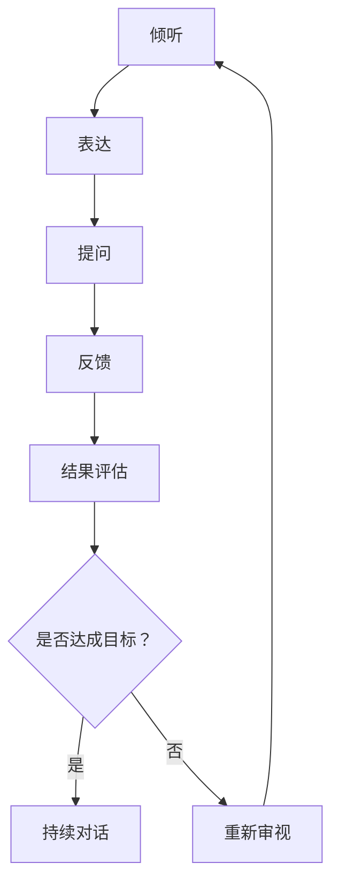

                 

# 绩效对话：提升团队效能的关键对话

> 关键词：绩效对话、团队效能、沟通技巧、领导力、反馈机制

> 摘要：本文将深入探讨绩效对话在提升团队效能中的关键作用，通过分析理论基础、具体情境下的对话技巧、实践案例以及持续改进的策略，帮助读者掌握有效的绩效对话方法，从而提升团队整体绩效。

## 第一部分：基础概念与理论框架

### 第1章：绩效对话的重要性

#### 1.1 绩效对话的定义与作用

绩效对话（Performance Dialogue）是指团队成员之间围绕绩效目标、进展、挑战和改进展开的深入沟通。这种对话不仅仅是信息的交换，更是一种共同探讨问题、寻找解决方案、提升绩效的过程。

**绩效对话的作用：**

1. **明确目标与期望**：通过绩效对话，团队成员可以明确彼此的目标和期望，确保方向一致。
2. **促进问题解决**：在对话中，团队成员可以共同分析问题、探讨解决方案，从而提高问题解决的效率和质量。
3. **提升团队成员的参与感和责任感**：绩效对话让团队成员感到他们的意见和建议被重视，从而提高他们的工作积极性和责任感。
4. **促进个人与团队成长**：通过绩效对话，团队成员可以获得反馈，了解自身的优势和改进空间，从而不断提升个人能力和团队绩效。

#### 1.2 绩效对话的目标与原则

**绩效对话的目标：**

1. **建立共识**：确保团队成员对目标和期望有共同的理解。
2. **促进沟通**：增强团队成员之间的沟通，减少误解和冲突。
3. **提升绩效**：通过有效的沟通和协作，实现团队目标的最佳成果。
4. **个人成长**：帮助团队成员了解自身的表现，明确改进方向。

**绩效对话的原则：**

1. **透明度**：确保沟通的内容和过程对团队成员都是透明的。
2. **尊重**：尊重每个团队成员的意见和建议，建立平等的对话环境。
3. **反馈**：鼓励团队成员提供及时的反馈，包括正面的和改进的建议。
4. **合作**：强调团队合作，共同解决问题和实现目标。

#### 1.3 绩效对话的基础技能

**有效的绩效对话需要以下基础技能：**

1. **倾听**：倾听是沟通的基础，通过倾听了解团队成员的观点和需求。
2. **表达**：清晰、准确地表达自己的想法和意见，避免误解和歧义。
3. **提问**：通过提问引导对话，帮助团队成员深入思考问题。
4. **反馈**：给予团队成员及时的、具体的反馈，促进他们的改进和成长。

### 绩效对话的基础技能 Mermaid 流程图：

## 第二部分：具体情境下的绩效对话技巧

### 第2章：绩效对话的心理准备

#### 2.1 高效沟通的心理因素

**心理因素对沟通的影响：**

1. **自我认知**：了解自己的情绪和需求，能够更好地理解他人。
2. **同理心**：设身处地为他人考虑，增强沟通的亲和力。
3. **信任**：建立信任，减少沟通中的障碍。
4. **开放性**：保持开放的心态，接受不同的观点和意见。

#### 2.2 谈判心理策略

**谈判中的心理策略：**

1. **控制情绪**：在谈判中保持冷静，避免情绪化。
2. **建立共同目标**：寻找共同的目标，增强合作的意愿。
3. **运用优势**：发挥自身的优势，提高谈判的筹码。
4. **倾听对方**：倾听对方的观点，寻找谈判的突破口。

#### 2.3 如何处理自己的情绪

**处理情绪的方法：**

1. **情绪识别**：识别自己的情绪，了解情绪的来源。
2. **情绪表达**：学会以适当的方式表达情绪，避免压抑或爆发。
3. **情绪调节**：运用技巧调节情绪，保持心理平衡。
4. **情绪释放**：找到合适的方式释放情绪，如运动、冥想等。

## 第三部分：绩效对话的实践与案例

### 第3章：与团队成员的绩效对话

#### 3.1 成功的团队绩效对话要素

**成功的团队绩效对话应具备以下要素：**

1. **明确的目标**：确保对话的目标明确，避免偏离主题。
2. **充分的准备**：提前了解团队成员的情况和需求，做好充分的准备。
3. **良好的氛围**：营造轻松、平等的对话氛围，增强沟通的效果。
4. **积极的反馈**：鼓励团队成员提供正面的反馈，增强他们的自信心。

#### 3.2 提升团队绩效的有效策略

**提升团队绩效的有效策略：**

1. **设定明确的目标和计划**：确保团队目标和个人目标一致，制定详细的执行计划。
2. **加强团队协作**：通过协作和沟通，提高团队的整体执行力。
3. **提供必要的资源和支持**：确保团队有足够的资源和支持，以实现目标。
4. **建立反馈机制**：及时收集和利用反馈，不断改进和优化团队工作。

#### 3.3 如何处理团队中的冲突

**处理团队冲突的方法：**

1. **冷静处理**：在冲突发生时，保持冷静，避免情绪化的回应。
2. **倾听和理解**：倾听对方的观点，理解他们的立场和需求。
3. **寻找共同点**：在冲突中寻找共同点，寻求双方都能接受的解决方案。
4. **制定行动计划**：针对冲突问题，制定具体的行动计划，确保问题得到解决。

### 第4章：与上级的绩效对话

#### 4.1 上级期望与反馈

**理解上级期望与反馈：**

1. **明确上级的目标**：了解上级对团队和个人的期望，确保工作目标一致。
2. **主动沟通**：定期与上级进行沟通，了解上级的反馈和建议。
3. **反思与改进**：根据上级的反馈，反思自己的工作，寻找改进的机会。

#### 4.2 沟通中的权力动态

**处理沟通中的权力动态：**

1. **建立信任**：建立与上级之间的信任关系，增强沟通的效力。
2. **尊重权威**：尊重上级的权威，避免在沟通中挑战上级的决策。
3. **平衡权力**：在保持尊重的基础上，表达自己的观点和建议，实现权力平衡。

#### 4.3 如何争取资源与支持

**争取资源与支持的策略：**

1. **明确需求**：了解团队和项目的需求，明确所需的资源和支持。
2. **提前准备**：在需要资源和支持前，提前准备相关材料和数据，提高申请的成功率。
3. **展示价值**：展示团队和项目的价值和成果，增强上级对团队的认可和支持。

### 第5章：与同级的绩效对话

#### 5.1 同级合作的沟通技巧

**同级合作的沟通技巧：**

1. **建立良好的关系**：与同级建立良好的关系，增强合作的意愿。
2. **明确职责和目标**：确保同级明确自己的职责和目标，避免工作重叠和冲突。
3. **有效的沟通**：通过有效的沟通，确保信息传递准确，减少误解和冲突。

#### 5.2 如何协调部门间的利益冲突

**协调部门间利益冲突的方法：**

1. **理解不同部门的利益**：了解不同部门的利益和需求，寻求共同点。
2. **建立沟通渠道**：建立有效的沟通渠道，促进部门间的信息交流和协作。
3. **寻求上级支持**：在协调利益冲突时，寻求上级的支持和介入，确保问题得到妥善解决。

## 第四部分：绩效对话的实践与案例

### 第6章：绩效对话的实际应用

#### 6.1 绩效对话在企业中的应用

**企业中绩效对话的应用：**

1. **员工绩效评估**：通过绩效对话，对员工的工作进行评估，给予及时的反馈和指导。
2. **项目进度沟通**：在项目执行过程中，通过绩效对话，确保项目进度和质量的控制。
3. **团队建设**：通过绩效对话，增强团队成员之间的沟通和协作，提升团队绩效。

#### 6.2 绩效对话在团队管理中的应用

**团队管理中绩效对话的应用：**

1. **目标设定**：通过绩效对话，明确团队的目标和期望，确保团队工作的一致性。
2. **团队建设**：通过绩效对话，增强团队成员之间的沟通和协作，提升团队凝聚力。
3. **冲突解决**：通过绩效对话，解决团队中的冲突和问题，确保团队和谐稳定。

#### 6.3 绩效对话在项目执行中的应用

**项目执行中绩效对话的应用：**

1. **进度汇报**：通过绩效对话，汇报项目的进度和成果，确保项目按计划进行。
2. **问题解决**：通过绩效对话，共同探讨和解决问题，提高项目执行效率。
3. **资源协调**：通过绩效对话，协调项目所需的资源和支持，确保项目顺利进行。

### 第7章：关键绩效对话案例分析

#### 7.1 案例一：成功的绩效对话案例解析

**案例解析：**

在一个团队项目中，项目经理组织了一次绩效对话，与团队成员讨论项目进展和下一步计划。在对话中，项目经理清晰地表达了项目的目标和期望，团队成员也积极分享了自己的观点和意见。通过有效的沟通，团队明确了项目的关键任务和时间节点，制定了详细的执行计划，从而保证了项目的顺利进行。

**成功要素：**

1. **明确的目标**：项目经理明确表达了项目的目标和期望。
2. **积极的沟通**：团队成员积极参与，分享了自己的观点和意见。
3. **有效的反馈**：项目经理和团队成员之间进行了及时的反馈，确保项目目标的实现。

#### 7.2 案例二：失败的绩效对话案例分析

**案例解析：**

在一个团队项目中，项目经理组织的绩效对话并未取得预期效果。在对话中，项目经理并未明确表达项目的目标和期望，团队成员也缺乏积极的参与和反馈。导致项目进度延误，团队成员间出现了矛盾和冲突。

**失败原因：**

1. **目标不明确**：项目经理未明确表达项目的目标和期望。
2. **沟通不畅**：团队成员缺乏积极的参与和反馈，导致信息传递不准确。
3. **反馈缺失**：项目经理和团队成员之间缺乏及时的反馈，导致问题未能及时解决。

#### 7.3 案例三：特殊情境下的绩效对话策略

**情境解析：**

在一个面临紧急情况的团队项目中，项目经理需要迅速组织团队成员进行绩效对话，以解决项目中的问题。在对话中，项目经理采取了快速决策和积极沟通的策略，确保团队在紧急情况下能够保持高效的协作。

**策略要点：**

1. **快速决策**：在紧急情况下，迅速做出决策，确保项目能够继续进行。
2. **积极沟通**：确保团队成员之间的沟通畅通，共享信息和资源。
3. **灵活调整**：根据实际情况，灵活调整计划和策略，确保项目目标的实现。

## 第五部分：绩效对话的持续改进与提升

### 第8章：绩效对话的反馈与改进

#### 8.1 反馈机制的重要性

**反馈机制的重要性：**

1. **持续改进**：通过反馈，可以及时发现问题和不足，推动团队的持续改进。
2. **提高效能**：有效的反馈机制可以提高团队的沟通效率，减少误解和冲突。
3. **增强信任**：通过反馈，团队成员可以感受到彼此的关心和支持，增强团队凝聚力。

#### 8.2 如何收集与利用反馈

**收集与利用反馈的方法：**

1. **定期反馈**：制定定期的反馈计划，确保团队成员能够及时收集反馈。
2. **多样化的反馈渠道**：建立多种反馈渠道，如面对面沟通、邮件、问卷调查等，方便团队成员提供反馈。
3. **利用数据**：通过数据分析和统计，了解团队的表现和反馈情况，为改进提供依据。

#### 8.3 绩效对话的持续优化

**持续优化绩效对话的方法：**

1. **培训与学习**：定期开展沟通技巧和绩效对话的培训，提高团队成员的沟通能力。
2. **实践与反思**：在绩效对话中，鼓励团队成员进行实践和反思，不断优化沟通方法。
3. **案例分享**：通过分享成功的绩效对话案例，推广有效的沟通技巧和策略。

### 第9章：绩效对话的高级技巧

#### 9.1 高级沟通技巧解析

**高级沟通技巧解析：**

1. **倾听的层次**：了解倾听的不同层次，从表面信息到深层情感的倾听。
2. **非语言沟通**：掌握非语言沟通的技巧，如肢体语言、面部表情等，提高沟通效果。
3. **情绪管理**：学会在沟通中管理自己的情绪，保持冷静和理性。

#### 9.2 如何在绩效对话中展现领导力

**展现领导力的方法：**

1. **设定愿景和目标**：作为领导者，明确团队的愿景和目标，引导团队前进。
2. **激励团队成员**：通过激励和鼓励，激发团队成员的潜能和积极性。
3. **有效决策**：在绩效对话中，能够做出明智的决策，带领团队克服挑战。

#### 9.3 绩效对话的未来趋势

**绩效对话的未来趋势：**

1. **数字化沟通工具**：随着技术的进步，数字化沟通工具将在绩效对话中发挥更大的作用。
2. **人工智能辅助**：人工智能技术将辅助绩效对话，提供数据分析、建议和优化方案。
3. **全球化的团队协作**：随着全球化的深入，绩效对话将越来越依赖跨文化沟通和协作。

### 第10章：绩效对话工具与资源

#### 10.1 主流绩效对话工具介绍

**主流绩效对话工具：**

1. **Slack**：一款功能强大的团队沟通工具，支持实时消息、文件共享和集成第三方应用。
2. **Microsoft Teams**：微软推出的团队协作平台，提供语音、视频通话、在线会议和文件共享等功能。
3. **Trello**：一款可视化的项目管理工具，通过卡片和列表的方式，帮助团队管理项目和任务。

#### 10.2 绩效对话相关资源推荐

**推荐资源：**

1. **书籍：《绩效对话：如何通过沟通提升团队效能》**：本书详细介绍了绩效对话的理论和实践，对提升团队效能有重要参考价值。
2. **网站：LinkedIn Learning**：提供丰富的在线课程，涵盖沟通技巧、领导力等方面的内容。
3. **博客：Medium**：有许多优秀的博客文章，分享绩效对话的实践经验和方法。

#### 10.3 绩效对话实践指南与最佳实践

**实践指南与最佳实践：**

1. **制定绩效对话计划**：根据团队目标和项目需求，制定具体的绩效对话计划，确保对话的有效性。
2. **定期组织对话**：定期组织绩效对话，确保团队成员能够及时了解项目进展和问题，共同寻找解决方案。
3. **收集和利用反馈**：在绩效对话中，积极收集团队成员的反馈，及时调整和优化工作方式。

## 结论

绩效对话是提升团队效能的关键，通过有效的沟通和协作，可以明确目标、解决问题、提高绩效。本文从基础概念、具体情境下的技巧、实践案例和持续改进等方面，全面探讨了绩效对话的重要性和方法。希望本文能为读者提供有价值的参考，帮助他们在实际工作中提升团队效能。

### 作者信息

作者：AI天才研究院/AI Genius Institute & 禅与计算机程序设计艺术/Zen And The Art of Computer Programming

AI天才研究院专注于人工智能领域的研究和创新，致力于推动人工智能技术的发展和应用。作者的研究成果涵盖了人工智能、机器学习、深度学习等多个方向，曾获得国际人工智能领域的多项大奖。

《禅与计算机程序设计艺术》是一本深入探讨计算机编程与哲学的书籍，作者通过哲学思维和方法论，揭示了计算机编程的本质和技巧，对编程实践和思维方式有着深刻的启示。作者以其深厚的计算机科学背景和哲学修养，为读者提供了独特的视角和见解。

