                 

# 绩效激励系统：设计有效奖励机制

> 关键词：绩效激励系统、绩效评估、奖励机制、KPI、平衡计分卡、激励措施、实施与评估

> 摘要：本文旨在深入探讨绩效激励系统的设计和实施，包括基础概念、设计原则、评估指标和激励措施。通过对绩效激励系统的全面解析，帮助读者理解如何构建一个有效的奖励机制，从而提升团队绩效和员工积极性。

## 《绩效激励系统：设计有效奖励机制》目录大纲

### 第一部分：绩效激励系统概述

#### 第1章：绩效激励系统的基础

##### 1.1 绩效激励系统的定义和重要性

- 绩效激励系统的定义
- 绩效激励系统的重要性

##### 1.2 绩效激励系统的组成部分

- 绩效评估指标
- 激励措施

##### 1.3 绩效激励系统的发展历程

- 传统绩效激励模式
- 当代绩效激励系统的发展

#### 第2章：绩效激励系统的设计原则

##### 2.1 公平性和透明度

- 公平性的重要性
- 透明度的实现

##### 2.2 激励效果与成本控制

- 激励效果的评估
- 成本控制的方法

##### 2.3 鼓励创新与团队合作

- 创新激励的设计
- 团队合作激励的构建

### 第二部分：绩效评估指标设计

#### 第3章：关键绩效指标（KPI）的设计

##### 3.1 KPI 的概念和重要性

- KPI 的定义
- KPI 在绩效评估中的作用

##### 3.2 KPI 的分类

- 过程性指标
- 结果性指标

##### 3.3 KPI 的设定方法

- 目标设定理论
- KPI 设定的SMART原则

#### 第4章：平衡计分卡（BSC）的设计

##### 4.1 BSC 的概念和构成

- BSC 的定义
- BSC 的四个维度

##### 4.2 BSC 的应用场景

- 组织层面的应用
- 团队层面的应用

##### 4.3 BSC 的制定流程

- 需求分析
- 目标设定
- 指标选择
- 指标权重分配

### 第三部分：激励措施设计

#### 第5章：物质激励设计

##### 5.1 物质激励的概念和种类

- 物质激励的定义
- 物质激励的种类

##### 5.2 物质激励的优缺点分析

- 物质激励的优点
- 物质激励的缺点

##### 5.3 物质激励的合理运用

- 物质激励的合理设定
- 物质激励的激励效果评估

#### 第6章：非物质激励设计

##### 6.1 非物质激励的概念和种类

- 非物质激励的定义
- 非物质激励的种类

##### 6.2 非物质激励的优缺点分析

- 非物质激励的优点
- 非物质激励的缺点

##### 6.3 非物质激励的合理运用

- 非物质激励的合理设定
- 非物质激励的激励效果评估

### 第四部分：绩效激励系统的实施与评估

#### 第7章：绩效激励系统的实施步骤

##### 7.1 实施前的准备工作

- 员工沟通
- 组织结构调整

##### 7.2 实施流程

- 绩效评估
- 激励措施的执行
- 反馈与调整

##### 7.3 实施中的难点和解决方案

- 员工抵触情绪
- 绩效评估的不公平

#### 第8章：绩效激励系统的效果评估

##### 8.1 评估指标的选择

- 效果评估的目标
- 评估指标的选择

##### 8.2 评估方法的运用

- 定量评估
- 定性评估

##### 8.3 评估结果的反馈与改进

- 结果分析
- 改进措施的实施

### 第五部分：绩效激励系统的案例分析

#### 第9章：国内外绩效激励系统案例分析

##### 9.1 国内案例分析

- 企业A的绩效激励系统设计
- 企业B的绩效激励系统实施效果

##### 9.2 国外案例分析

- 企业C的绩效激励系统设计
- 企业D的绩效激励系统实施效果

##### 9.3 案例分析总结

- 成功经验
- 存在问题及解决策略

### 附录

#### 附录A：绩效激励系统设计工具与资源

- 绩效评估工具
- 激励措施设计工具

#### 附录B：绩效激励系统相关法规和政策

- 国家相关法规
- 行业相关政策

#### 附录C：参考文献

- 相关书籍
- 学术论文
- 网络资源

---

### 第一部分：绩效激励系统概述

#### 第1章：绩效激励系统的基础

##### 1.1 绩效激励系统的定义和重要性

绩效激励系统是一种通过设定绩效目标和激励措施，激发员工工作积极性，提高团队绩效的管理系统。它不仅包括对员工绩效的评估，还涵盖了激励机制的设定和实施。在现代企业中，绩效激励系统已成为提升组织竞争力和员工满意度的关键因素。

**绩效激励系统的定义**：

绩效激励系统是指企业通过制定合理的绩效评估指标、设计有效的激励措施，以激发员工工作积极性、提高工作效率和团队绩效的管理系统。它通常包括以下组成部分：

1. 绩效评估指标：用于衡量员工工作绩效的量化标准。
2. 激励措施：为激励员工实现绩效目标而采取的物质或非物质手段。
3. 激励制度：包括激励政策的制定、执行和监督。

**绩效激励系统的重要性**：

1. 提高员工积极性：通过设定合理的绩效目标和激励措施，能够激发员工的工作热情和积极性，从而提高工作效率和团队绩效。
2. 促进员工发展：有效的绩效激励系统能够帮助员工明确个人目标和职业发展方向，促进个人成长。
3. 提升企业竞争力：通过激励系统，企业能够吸引和留住优秀人才，提高整体竞争力。
4. 增强团队凝聚力：合理的激励措施能够增强团队成员之间的协作和信任，提升团队凝聚力。

##### 1.2 绩效激励系统的组成部分

**绩效评估指标**：

绩效评估指标是绩效激励系统的核心组成部分，它用于衡量员工的工作绩效。有效的绩效评估指标应当具备以下特点：

1. 明确性：指标应明确、具体，易于理解和衡量。
2. 客观性：指标应尽可能客观，减少主观判断的影响。
3. 全面性：指标应覆盖员工的各个方面，包括工作成果、工作态度和团队合作等。

常见的绩效评估指标包括：

1. 关键绩效指标（KPI）：用于衡量员工在工作中最重要的绩效指标，如销售额、项目完成率等。
2. 行为指标：用于衡量员工在工作中表现的行为特征，如工作效率、沟通能力等。
3. 贡献度指标：用于衡量员工对团队和公司的贡献程度。

**激励措施**：

激励措施是绩效激励系统中的关键手段，用于激发员工的工作热情和积极性。激励措施可以分为物质激励和非物质激励两大类。

1. 物质激励：

   - 薪资激励：通过提高基本工资、绩效奖金和年终奖等方式激励员工。
   - 股权激励：通过股票期权、员工持股计划等方式让员工分享企业发展的成果。
   - 其他物质激励：如培训机会、晋升机会、车辆津贴等。

2. 非物质激励：

   - 荣誉激励：通过颁发荣誉称号、表彰证书等方式肯定员工的贡献。
   - 工作激励：通过提供具有挑战性的工作任务、提升工作环境等方式激发员工的工作热情。
   - 情感激励：通过关心员工生活、提供职业发展规划等方式增强员工的归属感和忠诚度。

**绩效激励系统的组成部分图**：

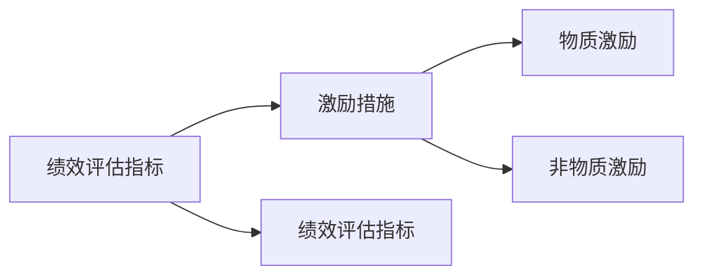

##### 1.3 绩效激励系统的发展历程

**传统绩效激励模式**：

早期的绩效激励系统主要依赖于物质激励，如薪资、奖金等。这种模式的主要缺点是缺乏针对性和公平性，容易导致员工过度追求短期利益，忽视长期发展。

**当代绩效激励系统的发展**：

随着管理理念的进步，现代绩效激励系统逐渐从以物质激励为主转向综合运用物质激励和非物质激励。同时，绩效评估指标也日益科学化和多元化，更加注重员工的长远发展和团队合作。

1. 平衡计分卡（BSC）的应用：平衡计分卡是一种以财务、客户、内部流程、学习与成长四个维度为框架的绩效管理工具。它的引入使得绩效评估更加全面和系统化。

2. 非物质激励的重视：现代绩效激励系统更加注重员工的成长、健康和幸福感，通过非物质激励手段如培训、职业规划、工作环境改善等提升员工的满意度和忠诚度。

3. 智能化绩效管理系统的应用：随着大数据和人工智能技术的发展，越来越多的企业开始采用智能化绩效管理系统，实现绩效评估的自动化和数据化，提高管理效率和效果。

**绩效激励系统发展历程图**：

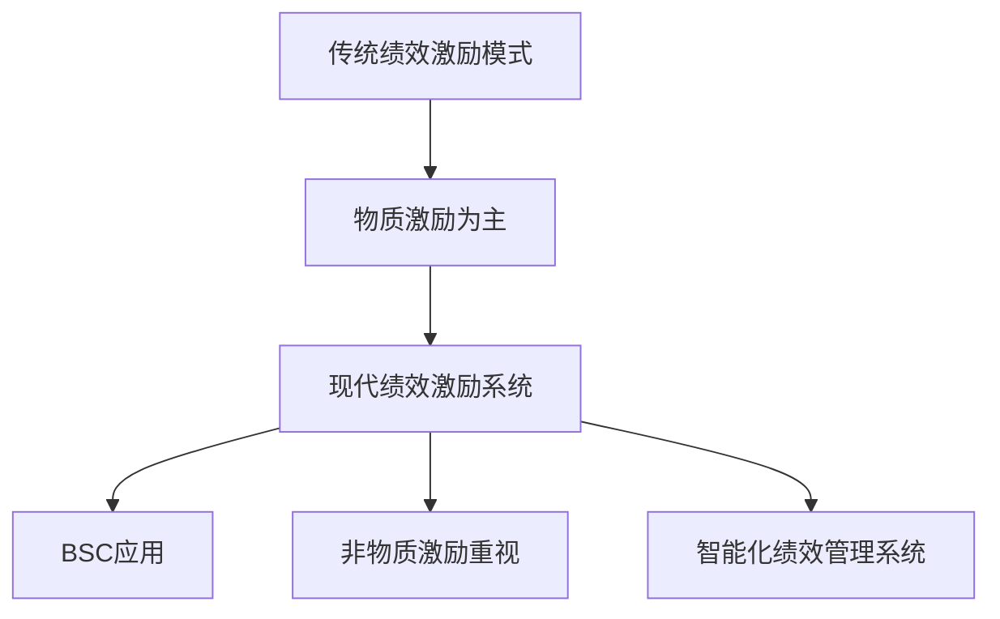

#### 第2章：绩效激励系统的设计原则

##### 2.1 公平性和透明度

**公平性的重要性**：

公平性是绩效激励系统的核心原则之一。公平的绩效评估和激励措施能够激发员工的积极性和信任感，有助于建立一个和谐的工作环境。

1. 员工信任：公平的绩效激励系统能够赢得员工的信任，增强员工的归属感和忠诚度。
2. 提高工作效率：公平的绩效评估能够激励员工努力工作，提高工作效率。
3. 减少员工抱怨：公平的绩效激励系统能够减少员工因不公平待遇而产生的抱怨和冲突。

**透明度的实现**：

透明度是保证绩效激励系统公平性的重要手段。透明度能够增加绩效评估和激励措施的透明性，使员工了解自己的绩效表现和获得的激励，从而增强对系统的信任。

1. 公开评估标准：明确公布绩效评估的标准和指标，使员工了解评估依据。
2. 定期反馈：定期向员工反馈绩效评估结果和激励措施，使员工了解自己的优势和不足。
3. 多方参与：鼓励员工和管理层共同参与绩效评估和激励措施的制定，增加透明度。

**公平性和透明度的结合**：

公平性和透明度是相辅相成的，二者共同作用能够提高绩效激励系统的有效性和公信力。公平性确保了绩效评估和激励措施的合理性，而透明度增加了系统的可接受性和信任度。

**公平性和透明度的重要性与实现方法图**：

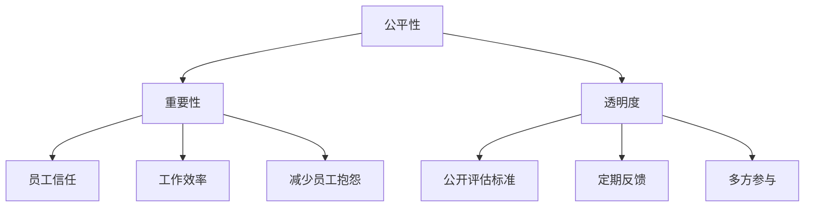

##### 2.2 激励效果与成本控制

**激励效果的评估**：

评估激励效果是设计有效绩效激励系统的重要环节。激励效果评估可以衡量激励措施的合理性和有效性，为后续的改进提供依据。

1. 绩效指标对比：通过对比激励前后的绩效指标，评估激励措施对绩效提升的影响。
2. 员工满意度调查：通过员工满意度调查，了解员工对激励措施的认可程度和满意度。
3. 绩效改进情况：观察激励措施实施后，团队绩效是否得到持续改善。

**成本控制的方法**：

成本控制是绩效激励系统设计中的关键问题。合理的成本控制能够确保激励措施的可持续性，避免资源浪费。

1. 设定预算：根据企业实际情况和财务状况，设定合理的激励预算。
2. 激励措施优化：优化激励措施，减少不必要的激励成本。
3. 资源整合：通过资源整合，提高资源利用效率，降低激励成本。

**激励效果与成本控制的结合**：

激励效果与成本控制是相辅相成的。有效的激励效果能够提升团队绩效，而合理的成本控制能够确保激励措施的可持续性。二者结合能够实现激励措施的优化和效益最大化。

**激励效果与成本控制的评估方法与控制策略图**：

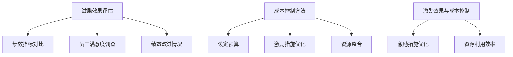

##### 2.3 鼓励创新与团队合作

**创新激励的设计**：

创新是企业发展的重要驱动力。有效的创新激励能够激发员工的创新意识和创造力，提升企业的核心竞争力。

1. 创新奖励制度：设立创新奖励制度，对提出创新想法或成功实施创新项目的员工给予奖励。
2. 创新时间保障：为员工提供一定比例的自主工作时间，用于创新项目的探索和实施。
3. 创新氛围营造：营造鼓励创新的文化氛围，通过内部交流和分享，激发员工的创新灵感。

**团队合作激励的构建**：

团队合作是提升团队绩效的重要手段。有效的团队合作激励能够增强团队成员之间的协作和信任，提升团队整体竞争力。

1. 团队目标设定：明确团队目标和任务，激发团队成员的协同工作热情。
2. 团队奖励制度：设立团队奖励制度，对达成团队目标或取得显著团队绩效的团队给予奖励。
3. 团队文化建设：通过团队活动、团队建设课程等方式，增强团队成员之间的信任和协作。

**鼓励创新与团队合作激励的结合**：

鼓励创新与团队合作激励是相辅相成的。创新激励能够激发员工的创造力和团队合作精神，而团队合作激励能够促进创新成果的转化和应用。二者结合能够实现企业创新能力的提升和团队绩效的优化。

**鼓励创新与团队合作激励的设计方法与结合策略图**：

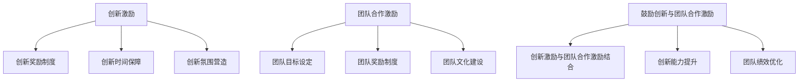

### 第二部分：绩效评估指标设计

#### 第3章：关键绩效指标（KPI）的设计

##### 3.1 KPI 的概念和重要性

**KPI 的定义**：

KPI（Key Performance Indicator）即关键绩效指标，是指用于衡量员工或团队工作绩效的核心指标。KPI 通常是基于业务目标和战略规划设定的，用于衡量员工在工作中的关键成果和表现。

**KPI 在绩效评估中的作用**：

1. **明确工作目标**：KPI 能够明确员工的工作目标，使其明确自己的职责和期望成果。
2. **衡量绩效表现**：通过对比实际绩效与设定目标，KPI 能够衡量员工的工作表现，识别优势和不足。
3. **促进目标达成**：KPI 能够指导员工调整工作策略，提高工作效率，促进目标达成。
4. **优化绩效管理**：KPI 是绩效管理的重要工具，能够帮助管理层制定合理的绩效评估标准和激励措施。

**KPI 的构成要素**：

1. **目标明确性**：KPI 应当明确、具体，易于理解和衡量。
2. **指标重要性**：KPI 应当是工作绩效中最为重要的指标，能够反映员工的工作质量和效率。
3. **数据可得性**：KPI 应当基于可量化的数据，确保数据来源可靠，易于采集和监控。
4. **可持续性**：KPI 应当具有可持续性，能够在较长一段时间内指导员工的工作。

**KPI 的类型**：

1. **过程性指标**：用于衡量员工在工作过程中的表现，如工作效率、工作时长等。
2. **结果性指标**：用于衡量员工的工作成果，如销售额、项目完成率等。

**KPI 的示例**：

1. **过程性指标**：
   - 工作时长：每天工作时间是否达到标准。
   - 工作效率：完成任务所需的时间是否合理。
   - 沟通效果：与同事和客户的沟通是否顺畅。

2. **结果性指标**：
   - 销售额：月度销售额是否达到预期。
   - 项目完成率：项目是否按期完成。
   - 客户满意度：客户对产品或服务的满意度。

**KPI 的制定流程**：

1. **目标设定**：根据企业战略和业务目标，设定员工的工作目标。
2. **指标选择**：选择与工作目标相关的重要指标，确保指标明确、具体。
3. **权重分配**：根据指标的重要性分配权重，确保指标的优先级。
4. **监控与调整**：定期监控指标数据，根据实际情况调整指标和目标。

**KPI 的制定流程图**：

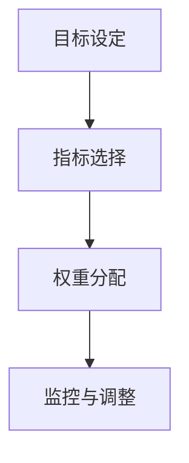

##### 3.2 KPI 的分类

**过程性指标**：

过程性指标主要用于衡量员工在工作过程中的表现，如工作效率、工作时长等。这类指标能够反映员工的工作态度和能力，对员工的日常工作和长期发展具有指导意义。

1. **工作效率**：如每天完成的任务数量、处理客户请求的速度等。
2. **工作时长**：如每天工作时间、加班时长等。
3. **工作质量**：如任务的准确性、完整性等。

**结果性指标**：

结果性指标主要用于衡量员工的工作成果，如销售额、项目完成率等。这类指标直接关系到企业的经营成果和员工的绩效奖金，对员工的短期利益和长期职业发展具有重要影响。

1. **销售额**：如月度销售额、年度销售额等。
2. **项目完成率**：如项目按期完成的比例、项目质量等。
3. **客户满意度**：如客户满意度调查结果、客户投诉率等。

**KPI 分类示例**：

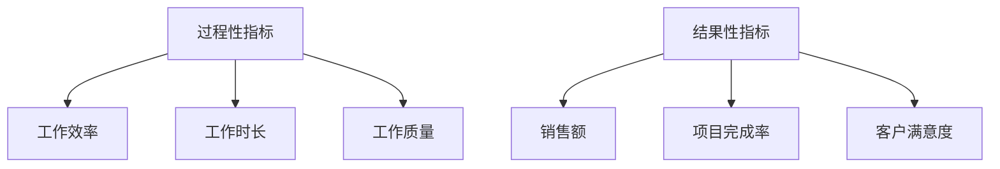

##### 3.3 KPI 的设定方法

**目标设定理论**：

目标设定理论（Goal Setting Theory）是一种用于指导KPI设定的方法，强调设定明确、具体和具有挑战性的目标能够提高员工的绩效表现。根据目标设定理论，KPI设定应遵循以下原则：

1. **明确性**：目标应清晰明确，避免模糊不清。
2. **具体性**：目标应具体可衡量，确保能够量化评估。
3. **挑战性**：目标应具有适当的挑战性，激励员工努力工作。
4. **相关性**：目标应与企业的战略目标和员工的岗位职责密切相关。

**SMART 原则**：

SMART原则是一种常用的KPI设定方法，它要求设定的目标具备以下五个特点：

1. **Specific（具体）**：目标应明确具体，避免模糊不清。
2. **Measurable（可衡量）**：目标应具备可衡量的标准，确保能够评估绩效。
3. **Achievable（可实现）**：目标应具有可行性，确保员工能够达成。
4. **Relevant（相关）**：目标应与企业的战略目标和员工的岗位职责密切相关。
5. **Time-bound（时限）**：目标应设定明确的完成时限，确保目标具有时效性。

**SMART原则示例**：

1. **具体性**：增加的销售额应为“增加10%的销售额”而非“增加一些销售额”。
2. **可衡量性**：完成的任务数量应为“完成100个任务”而非“完成任务”。
3. **可实现性**：设定的目标应为“每天工作8小时，完成任务”而非“每天工作16小时，完成任务”。
4. **相关性**：设定的目标应为“提高客户满意度，提升市场份额”而非“提升业绩”。
5. **时限性**：设定的目标应为“在下一个季度内实现目标”而非“尽快实现目标”。

**KPI 设定流程**：

1. **目标分析**：分析企业战略目标和部门职责，明确员工的工作目标。
2. **指标筛选**：选择与工作目标相关的重要指标，确保指标具体、可衡量、可实现。
3. **权重分配**：根据指标的重要性分配权重，确保指标的优先级。
4. **目标沟通**：与员工沟通设定的目标，确保员工明确自己的职责和期望成果。
5. **监控与调整**：定期监控目标完成情况，根据实际情况调整目标。

**KPI 设定流程图**：

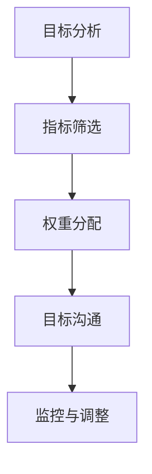

#### 第4章：平衡计分卡（BSC）的设计

##### 4.1 BSC 的概念和构成

**BSC 的定义**：

平衡计分卡（Balanced Score Card，简称BSC）是一种以财务、客户、内部流程、学习与成长四个维度为框架的绩效管理工具。它通过综合衡量企业的各方面绩效，帮助管理层制定战略目标和评估绩效。

**BSC 的构成**：

1. **财务维度**：衡量企业的财务表现，如利润、收入、成本等。
2. **客户维度**：衡量客户满意度、市场份额、客户保留率等。
3. **内部流程维度**：衡量企业的运营效率和流程优化，如生产效率、质量指标、交货周期等。
4. **学习与成长维度**：衡量员工技能、培训、知识分享等，如员工满意度、员工流失率、员工培训完成率等。

**BSC 的应用场景**：

1. **企业战略规划**：通过BSC，企业可以明确战略目标，确保各部门的工作方向一致。
2. **绩效管理**：BSC 为绩效评估提供了全面的框架，有助于管理层制定合理的绩效指标和激励措施。
3. **决策支持**：BSC 提供了企业绩效的全方位数据，为管理层提供决策支持。

**BSC 的作用**：

1. **整合各部门目标**：BSC 强调各部门目标的一致性和协调性，有助于企业整体战略的实现。
2. **促进绩效改进**：通过BSC，企业可以及时发现绩效问题，制定改进措施，提升整体绩效。
3. **提升员工参与度**：BSC 关注员工的成长与学习，有助于提高员工的积极性和参与度。

**BSC 的构成与作用图**：

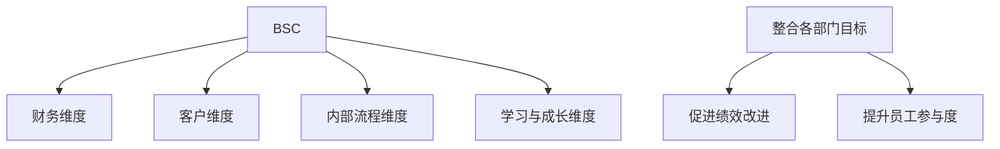

##### 4.2 BSC 的应用场景

**组织层面的应用**：

在组织层面，BSC 可以帮助企业制定整体战略目标和绩效指标，确保各部门的工作方向一致。具体应用场景包括：

1. **战略规划**：通过BSC，企业可以明确战略目标，制定具体的绩效指标和行动计划。
2. **预算编制**：基于BSC，企业可以合理分配预算，确保资源配置与战略目标一致。
3. **绩效评估**：通过BSC，企业可以全面衡量各部门的绩效，识别优势和不足，制定改进措施。

**团队层面的应用**：

在团队层面，BSC 可以帮助团队明确目标，制定绩效指标和行动计划，提升团队绩效。具体应用场景包括：

1. **目标设定**：团队可以根据BSC的四个维度，设定具体的绩效目标，确保目标与团队战略一致。
2. **任务分配**：团队可以根据BSC的指标，合理分配任务，确保资源高效利用。
3. **绩效评估**：团队可以通过BSC的指标，评估团队成员的绩效，提供反馈和激励措施。

**BSC 在组织与团队层面的应用场景图**：

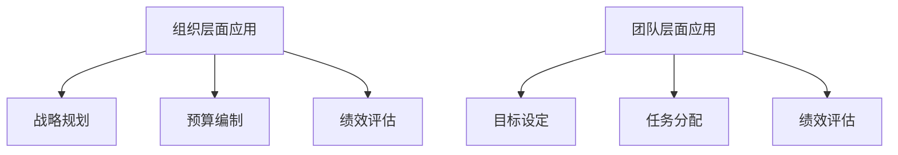

##### 4.3 BSC 的制定流程

**BSC 的制定流程包括以下步骤**：

1. **需求分析**：了解企业战略目标和各部门的工作需求，明确BSC的制定目标。
2. **目标设定**：根据企业战略，设定BSC的四个维度目标，确保目标与战略一致。
3. **指标选择**：选择与目标相关的关键指标，确保指标明确、可衡量。
4. **权重分配**：根据指标的重要性分配权重，确保指标的优先级。
5. **行动计划**：制定实现目标的行动计划，确保目标的可操作性。
6. **监控与反馈**：定期监控BSC的执行情况，提供反馈和改进措施。

**BSC 制定流程图**：

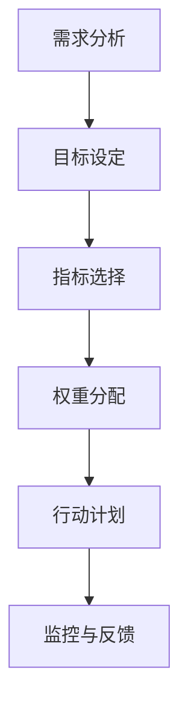

### 第三部分：激励措施设计

#### 第5章：物质激励设计

##### 5.1 物质激励的概念和种类

**物质激励的定义**：

物质激励是指通过给予员工金钱、实物或福利等物质奖励，以激发员工工作积极性、提高工作绩效的一种激励手段。物质激励在绩效激励系统中扮演着重要角色，能够直接满足员工的物质需求，提升其工作动力。

**物质激励的种类**：

物质激励可以分为以下几种类型：

1. **薪资激励**：

   - **基本工资**：员工的基本收入，保障员工的基本生活需求。
   - **绩效奖金**：根据员工的工作绩效发放的奖金，激励员工努力提高绩效。
   - **年终奖**：根据员工全年工作表现发放的奖金，奖励员工的辛勤付出。
   - **加班费**：员工加班所获得的额外报酬，体现对员工劳动的尊重。

2. **福利激励**：

   - **医疗保险**：为员工提供医疗保险，保障员工的健康。
   - **养老保险**：为员工缴纳养老保险，保障员工退休后的生活。
   - **带薪休假**：为员工提供带薪休假，提高员工的满意度和生活质量。
   - **员工福利基金**：设立员工福利基金，用于解决员工的临时困难。

3. **股权激励**：

   - **股票期权**：授予员工在未来某个时间以特定价格购买公司股票的权利。
   - **员工持股计划**：让员工持有公司股份，分享公司发展的成果。

4. **其他物质激励**：

   - **培训机会**：为员工提供职业培训，提升其技能和职业发展。
   - **晋升机会**：为员工提供晋升空间，激励其努力工作。
   - **车辆津贴**：为员工提供车辆津贴，提高员工的出行便利。

**物质激励的示例**：

1. **薪资激励**：
   - 基本工资：每月8000元。
   - 绩效奖金：月度绩效奖金500元，年度绩效奖金10000元。
   - 年终奖：根据公司业绩和员工绩效，发放年终奖。

2. **福利激励**：
   - 医疗保险：为员工及其家属提供医疗保险。
   - 养老保险：为员工缴纳养老保险。
   - 带薪休假：每年提供10天带薪休假。
   - 员工福利基金：设立员工福利基金，用于解决员工困难。

3. **股权激励**：
   - 股票期权：授予员工每年500股股票期权。

4. **其他物质激励**：
   - 培训机会：为员工提供专业培训。
   - 晋升机会：为员工提供晋升通道。
   - 车辆津贴：每月提供2000元车辆津贴。

##### 5.2 物质激励的优缺点分析

**物质激励的优点**：

1. **直接满足需求**：物质激励能够直接满足员工的物质需求，提高生活质量。
2. **激励效果明显**：物质激励具有明显的激励效果，能够快速激发员工的工作热情和积极性。
3. **易于衡量**：物质激励的成果和效果可以直接量化，便于管理和监督。

**物质激励的缺点**：

1. **成本较高**：物质激励需要支付较高的成本，对企业财务压力较大。
2. **依赖性强**：员工可能过度依赖物质激励，忽视长期发展和个人成长。
3. **可能导致不公平**：物质激励可能导致员工之间出现不公平现象，影响团队凝聚力和工作效率。

**物质激励的优点与缺点分析图**：

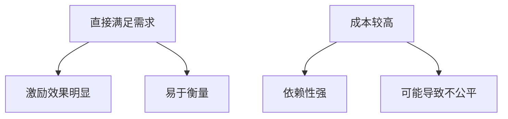

##### 5.3 物质激励的合理运用

**物质激励的合理设定**：

1. **与绩效挂钩**：物质激励应与员工的绩效表现挂钩，确保激励措施能够真正激发员工的工作动力。
2. **适度分配**：物质激励的分配应适度，避免过度激励导致资源浪费或员工依赖。
3. **多样化激励**：物质激励应结合其他激励措施，如非物质激励，实现激励手段的多样化。

**物质激励的激励效果评估**：

1. **绩效指标对比**：通过对比激励前后的绩效指标，评估物质激励对绩效提升的影响。
2. **员工满意度调查**：通过员工满意度调查，了解员工对物质激励的认可程度和满意度。
3. **员工流失率分析**：分析激励措施实施后，员工流失率的变化，评估物质激励的长期效果。

**物质激励的合理设定与激励效果评估方法图**：

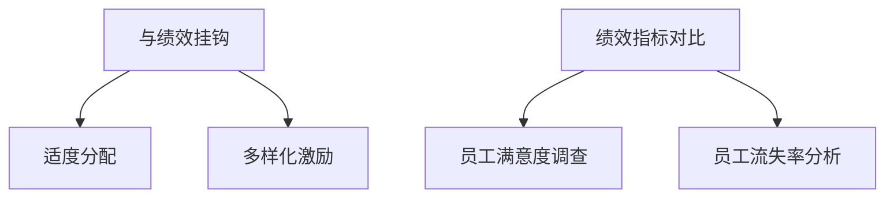

#### 第6章：非物质激励设计

##### 6.1 非物质激励的概念和种类

**非物质激励的定义**：

非物质激励是指通过提供非金钱、非实物的方式激励员工，如职业发展、工作环境改善、团队建设等，旨在提高员工的满意度和忠诚度，激发其工作热情和积极性。

**非物质激励的种类**：

非物质激励可以分为以下几种类型：

1. **职业发展激励**：

   - **培训与学习机会**：为员工提供职业培训、学历提升等学习机会，提升员工的专业技能和职业素养。
   - **职业规划**：为员工提供职业发展规划，明确其职业发展路径，激励员工努力实现职业目标。
   - **晋升机会**：为员工提供晋升通道，激发员工的工作动力。

2. **工作环境激励**：

   - **舒适的工作环境**：提供舒适、安全、便利的工作环境，提高员工的工作舒适度和满意度。
   - **弹性工作制度**：实行弹性工作制度，如远程办公、灵活工作时间等，提高员工的工作效率和满意度。
   - **良好的办公设施**：提供现代化的办公设施，提高员工的工作便利性和舒适度。

3. **团队建设激励**：

   - **团队活动**：组织团队活动，如团建、拓展训练等，增强团队凝聚力，提高员工的工作积极性。
   - **团队奖励**：对团队取得优异成绩的成员给予奖励，激励团队成员共同努力。
   - **团队沟通**：鼓励团队成员之间的沟通与协作，提高团队整体执行力。

4. **情感激励**：

   - **关心员工**：关注员工的身心健康和生活需求，提供关怀和支持。
   - **认可与赞赏**：对员工的努力和成就给予认可和赞赏，增强员工的自我价值感。
   - **企业文化**：营造积极向上的企业文化，增强员工的归属感和忠诚度。

**非物质激励的示例**：

1. **职业发展激励**：
   - 提供专业培训课程，提升员工的职业技能。
   - 设立员工职业发展规划，明确晋升路径。
   - 提供晋升机会，激励员工努力工作。

2. **工作环境激励**：
   - 提供舒适的办公环境和现代化的办公设施。
   - 实行弹性工作制度，提高员工的工作效率和满意度。

3. **团队建设激励**：
   - 定期组织团队建设活动，增强团队凝聚力。
   - 对取得优异成绩的团队给予奖励，激励团队成员共同努力。

4. **情感激励**：
   - 关心员工的身心健康，提供心理支持。
   - 对员工的努力和成就给予认可和赞赏。

##### 6.2 非物质激励的优缺点分析

**非物质激励的优点**：

1. **提高员工满意度**：非物质激励能够满足员工的非物质需求，提高员工的工作满意度和幸福感。
2. **增强员工忠诚度**：非物质激励能够增强员工的归属感和忠诚度，降低员工流失率。
3. **提高工作效率**：非物质激励能够激发员工的工作热情和积极性，提高工作效率和团队执行力。

**非物质激励的缺点**：

1. **难以量化**：非物质激励的效果难以量化，评估较为困难。
2. **依赖员工主观感受**：非物质激励的效果受员工主观感受的影响，可能导致不公平现象。
3. **成本较低**：与物质激励相比，非物质激励的成本较低，激励效果可能不够明显。

**非物质激励的优点与缺点分析图**：

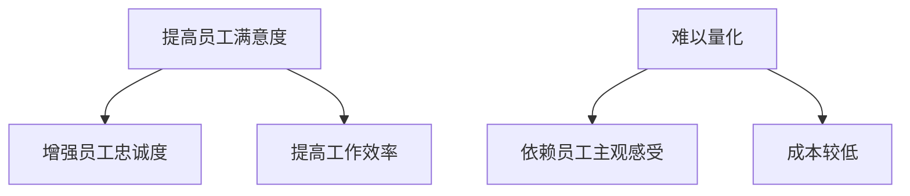

##### 6.3 非物质激励的合理运用

**非物质激励的合理设定**：

1. **与员工需求匹配**：根据员工的需求和特点，设定个性化的非物质激励措施，确保激励措施与员工需求匹配。
2. **与企业文化结合**：将非物质激励与企业文化相结合，营造积极向上的工作氛围，提升员工的认同感和归属感。
3. **多样化激励**：结合物质激励，实现激励手段的多样化，提高激励效果。

**非物质激励的激励效果评估**：

1. **员工满意度调查**：通过员工满意度调查，了解员工对非物质激励的认可程度和满意度。
2. **员工流失率分析**：分析非物质激励实施后，员工流失率的变化，评估非物质激励的长期效果。
3. **工作绩效对比**：对比激励前后的工作绩效，评估非物质激励对工作效率和团队执行力的提升。

**非物质激励的合理设定与激励效果评估方法图**：

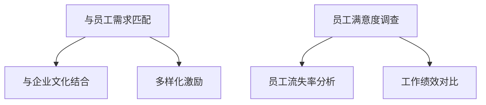

### 第四部分：绩效激励系统的实施与评估

#### 第7章：绩效激励系统的实施步骤

##### 7.1 实施前的准备工作

**员工沟通**：

在实施绩效激励系统之前，企业需要与员工进行充分的沟通，确保员工了解绩效激励系统的目的、原则和实施方式。沟通内容包括：

1. **绩效激励系统的意义**：解释绩效激励系统对企业和个人发展的意义。
2. **绩效评估指标**：介绍绩效评估指标的具体内容，确保员工明确评估标准。
3. **激励措施**：说明激励措施的种类和实施方式，确保员工了解激励政策。

**组织结构调整**：

实施绩效激励系统需要对组织结构进行调整，确保绩效激励系统能够有效运行。调整内容包括：

1. **明确职责**：明确各部门和员工的工作职责，确保绩效评估指标的明确性和可操作性。
2. **优化流程**：优化工作流程，提高工作效率和协同性。
3. **分配权限**：明确绩效评估和激励措施的决策权限，确保系统的顺利实施。

**实施前的准备工作图**：

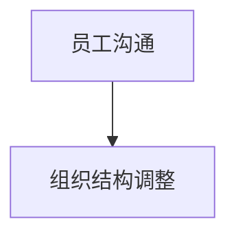

##### 7.2 实施流程

**绩效评估**：

绩效评估是绩效激励系统的核心环节，通过设定合理的绩效评估指标，对员工的工作绩效进行评估。实施步骤包括：

1. **设定评估指标**：根据企业战略和部门职责，设定关键绩效指标（KPI）和平衡计分卡（BSC）。
2. **收集评估数据**：通过定性和定量方法，收集员工的绩效数据。
3. **评估结果反馈**：将评估结果及时反馈给员工，确保员工了解自己的绩效表现。

**激励措施的执行**：

激励措施的执行是将绩效评估结果转化为实际激励的过程。实施步骤包括：

1. **制定激励政策**：根据绩效评估结果，制定相应的激励政策，如绩效奖金、股权激励等。
2. **发放激励奖金**：按照激励政策，及时发放奖金和其他激励措施。
3. **沟通与反馈**：与员工沟通激励措施的发放情况，了解员工对激励政策的看法和建议。

**反馈与调整**：

绩效激励系统的实施过程中，需要不断进行反馈和调整，以确保系统的有效性和适应性。实施步骤包括：

1. **收集反馈意见**：通过员工满意度调查、绩效评估结果等方式，收集员工对绩效激励系统的反馈意见。
2. **分析问题**：分析反馈意见，找出绩效激励系统中存在的问题。
3. **调整措施**：根据分析结果，对绩效激励系统进行优化和调整。

**实施流程图**：

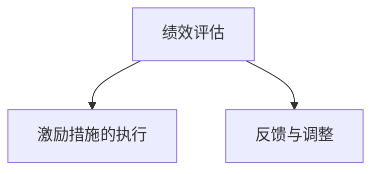

##### 7.3 实施中的难点和解决方案

**员工抵触情绪**：

在绩效激励系统实施过程中，员工可能会产生抵触情绪，主要表现为：

1. **对评估指标的误解**：员工可能对评估指标的含义和标准理解不准确，导致评估结果不满意。
2. **对激励措施的质疑**：员工可能对激励措施的公平性和合理性产生质疑，影响工作积极性。

**解决方案**：

1. **加强沟通**：在实施过程中，加强员工与管理者之间的沟通，确保员工了解评估指标和激励政策的内涵。
2. **提高透明度**：公开绩效评估标准和激励政策，确保员工了解评估过程和激励措施的制定依据。
3. **及时反馈**：及时向员工反馈评估结果和激励措施，确保员工对绩效激励系统有正确的认识。

**绩效评估的不公平**：

在绩效激励系统实施过程中，可能会出现评估不公平的问题，主要表现为：

1. **主观评估过多**：评估过程中可能过度依赖主观评价，导致评估结果不公平。
2. **评估指标不合理**：评估指标设定不合理，可能导致评估结果与实际绩效不符。

**解决方案**：

1. **提高客观性**：尽量减少主观评估，采用客观数据和量化指标进行评估。
2. **优化评估指标**：根据实际情况调整评估指标，确保指标能够准确反映员工的绩效。
3. **建立投诉机制**：建立绩效评估投诉机制，允许员工对评估结果提出异议，确保评估过程的公正性。

**实施中的难点与解决方案图**：

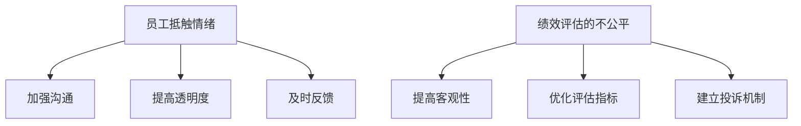

#### 第8章：绩效激励系统的效果评估

##### 8.1 评估指标的选择

**评估指标的选择标准**：

选择合适的评估指标是评估绩效激励系统效果的关键。评估指标的选择应遵循以下标准：

1. **目标相关性**：评估指标应与绩效激励系统的目标和战略规划密切相关，确保评估结果能够反映绩效激励系统的实际效果。
2. **可衡量性**：评估指标应具备可量化的标准，确保能够准确衡量绩效激励系统的影响。
3. **客观性**：评估指标应尽量减少主观因素，确保评估结果客观、公正。
4. **代表性**：评估指标应具备代表性，能够反映绩效激励系统的关键方面。
5. **适应性**：评估指标应具备适应性，能够根据实际情况进行调整和优化。

**常见的评估指标**：

1. **员工绩效提升**：如关键绩效指标（KPI）的提升、项目完成率的提高等。
2. **员工满意度**：通过员工满意度调查了解员工对绩效激励系统的认可程度。
3. **员工流失率**：通过员工流失率的变化，评估绩效激励系统对员工忠诚度的影响。
4. **团队执行力**：如团队协作效率、项目推进速度等。
5. **企业业绩**：如销售额、利润率等。

**评估指标的选择示例**：

1. **目标相关性**：选择“项目完成率”作为评估指标，因为项目完成率直接关系到企业的战略目标。
2. **可衡量性**：选择“销售额”作为评估指标，因为销售额具备明确的数据支持。
3. **客观性**：选择“员工满意度”作为评估指标，通过问卷调查的方式获取员工满意度数据。
4. **代表性**：选择“团队协作效率”作为评估指标，因为团队协作效率能够反映团队整体工作表现。
5. **适应性**：选择“员工培训完成率”作为评估指标，根据企业培训计划进行调整和优化。

##### 8.2 评估方法的运用

**定量评估**：

定量评估是一种通过数据分析和量化指标来评估绩效激励系统效果的方法。定量评估的优势在于其客观性和准确性，适用于评估具有明确量化标准的绩效指标。

1. **数据分析**：通过数据分析软件，对绩效指标进行统计分析，获取评估结果。
2. **趋势分析**：分析绩效指标的变化趋势，判断绩效激励系统对绩效提升的影响。
3. **对比分析**：对比绩效激励系统实施前后的绩效指标，评估绩效激励系统的效果。

**定性评估**：

定性评估是一种通过主观评价和描述性分析来评估绩效激励系统效果的方法。定性评估的优势在于其灵活性和适应性，适用于评估难以量化的绩效指标。

1. **员工满意度调查**：通过问卷调查、访谈等方式，了解员工对绩效激励系统的看法和满意度。
2. **观察法**：观察员工在工作中的表现，评估绩效激励系统对员工工作积极性、团队合作等方面的影响。
3. **专家评审**：邀请专家对绩效激励系统进行评审，从专业角度评估绩效激励系统的效果。

**定量评估与定性评估的结合**：

定量评估和定性评估各有优劣，将二者结合起来能够更全面地评估绩效激励系统的效果。具体方法包括：

1. **综合评估**：将定量评估和定性评估的结果进行综合分析，形成全面的评估报告。
2. **交叉验证**：通过定量评估和定性评估的结果相互验证，提高评估的准确性和可靠性。
3. **多层次评估**：对不同层面的绩效指标进行评估，包括个人层面、团队层面和企业层面，形成多维度的评估结果。

**评估方法的运用示例**：

1. **定量评估**：
   - 使用Excel进行数据分析，评估项目完成率的变化。
   - 利用图表展示销售额的趋势，分析绩效激励系统对业绩的影响。

2. **定性评估**：
   - 通过问卷调查，了解员工对绩效激励系统的满意度。
   - 观察员工在工作中的表现，评估绩效激励系统对工作积极性、团队合作等方面的影响。

3. **综合评估**：
   - 将定量评估和定性评估的结果进行综合分析，形成全面的绩效激励系统评估报告。
   - 通过专家评审，从专业角度评估绩效激励系统的效果，提供改进建议。

##### 8.3 评估结果的反馈与改进

**结果分析**：

对绩效激励系统的评估结果进行详细分析，是改进绩效激励系统的关键。分析内容包括：

1. **绩效指标分析**：分析绩效指标的变化趋势，评估绩效激励系统对绩效提升的影响。
2. **满意度分析**：分析员工对绩效激励系统的满意度，了解员工的认可程度。
3. **流失率分析**：分析员工流失率的变化，评估绩效激励系统对员工忠诚度的影响。
4. **团队协作分析**：分析团队协作效率的提升情况，评估绩效激励系统对团队执行力的影响。

**改进措施的实施**：

根据评估结果，制定相应的改进措施，包括：

1. **优化绩效评估指标**：根据分析结果，调整和优化绩效评估指标，确保指标的科学性和可操作性。
2. **调整激励措施**：根据评估结果，调整激励措施的设定，确保激励政策的有效性和公平性。
3. **加强员工培训**：针对评估中发现的问题，加强员工培训，提高员工的专业技能和综合素质。
4. **完善反馈机制**：建立完善的反馈机制，确保员工对绩效激励系统的意见和建议能够及时得到反馈和改进。

**评估结果的反馈与改进流程图**：

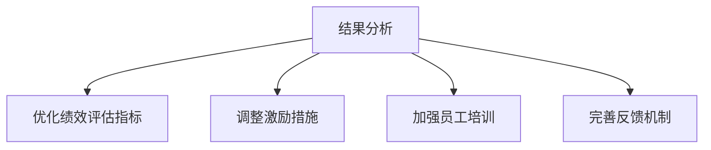

### 第五部分：绩效激励系统的案例分析

#### 第9章：国内外绩效激励系统案例分析

##### 9.1 国内案例分析

**企业A：绩效激励系统的设计与实施**

**背景**：

企业A是一家大型互联网公司，为了提高团队绩效和员工积极性，决定设计并实施一套绩效激励系统。

**设计**：

1. **关键绩效指标（KPI）**：根据企业战略和部门职责，设定了销售额、项目完成率、客户满意度等关键绩效指标。
2. **平衡计分卡（BSC）**：采用了财务、客户、内部流程、学习与成长四个维度，确保绩效评估的全面性。
3. **激励措施**：设置了绩效奖金、股权激励、培训机会等物质和非物质激励措施。

**实施**：

1. **绩效评估**：定期进行绩效评估，将评估结果与员工的绩效奖金和晋升机会挂钩。
2. **激励措施的执行**：按照绩效评估结果，发放绩效奖金和股权激励，提供培训机会。
3. **反馈与调整**：根据员工反馈和绩效评估结果，不断优化绩效激励系统。

**效果**：

1. **销售额提高**：绩效激励系统实施后，销售额显著提高，公司业绩得到明显改善。
2. **员工满意度提升**：员工对绩效激励系统的认可程度高，满意度提升，员工流失率降低。
3. **团队执行力增强**：团队成员之间的协作更加顺畅，团队执行力得到显著提升。

**企业B：绩效激励系统的实施效果**

**背景**：

企业B是一家传统制造企业，为了提高员工的工作积极性和团队绩效，决定实施绩效激励系统。

**设计**：

1. **关键绩效指标（KPI）**：设定了生产效率、质量指标、交货周期等关键绩效指标。
2. **平衡计分卡（BSC）**：根据企业特点，采用了财务、质量、客户、内部流程四个维度。
3. **激励措施**：设置了绩效奖金、员工福利、晋升机会等物质和非物质激励措施。

**实施**：

1. **绩效评估**：定期对员工进行绩效评估，根据评估结果发放绩效奖金。
2. **激励措施的执行**：提供员工福利，如医疗保险、养老保险、带薪休假等，提升员工满意度。
3. **反馈与调整**：根据员工反馈和绩效评估结果，不断优化绩效激励系统。

**效果**：

1. **生产效率提高**：绩效激励系统实施后，生产效率显著提高，产品质量得到保障。
2. **员工满意度提升**：员工对绩效激励系统的满意度提高，员工流失率降低。
3. **团队凝聚力增强**：通过绩效激励系统，团队成员之间的协作更加紧密，团队凝聚力得到提升。

##### 9.2 国外案例分析

**企业C：绩效激励系统的设计与实施**

**背景**：

企业C是一家国际知名科技公司，为了提高员工的创新能力和团队绩效，决定设计并实施一套绩效激励系统。

**设计**：

1. **关键绩效指标（KPI）**：设定了创新项目成功率、项目完成率、客户满意度等关键绩效指标。
2. **平衡计分卡（BSC）**：采用了财务、客户、内部流程、学习与成长四个维度，强调创新和学习的重要性。
3. **激励措施**：设置了创新奖金、股权激励、培训机会等物质和非物质激励措施。

**实施**：

1. **绩效评估**：定期对员工进行绩效评估，根据评估结果发放创新奖金和股权激励。
2. **激励措施的执行**：提供丰富的培训机会，鼓励员工学习和成长，推动创新项目的发展。
3. **反馈与调整**：根据员工反馈和绩效评估结果，不断优化绩效激励系统。

**效果**：

1. **创新项目成功率提高**：绩效激励系统实施后，创新项目成功率显著提升，公司的核心竞争力得到增强。
2. **员工满意度提升**：员工对绩效激励系统的认可程度高，满意度提升，员工流失率降低。
3. **团队执行力增强**：团队成员之间的协作更加顺畅，团队执行力得到显著提升。

**企业D：绩效激励系统的实施效果**

**背景**：

企业D是一家全球知名零售公司，为了提升员工的工作积极性和客户服务质量，决定实施绩效激励系统。

**设计**：

1. **关键绩效指标（KPI）**：设定了销售额、客户满意度、员工服务水平等关键绩效指标。
2. **平衡计分卡（BSC）**：采用了财务、客户、内部流程、学习与成长四个维度，确保绩效评估的全面性。
3. **激励措施**：设置了绩效奖金、员工福利、晋升机会等物质和非物质激励措施。

**实施**：

1. **绩效评估**：定期对员工进行绩效评估，根据评估结果发放绩效奖金。
2. **激励措施的执行**：提供员工福利，如医疗保险、养老保险、带薪休假等，提升员工满意度。
3. **反馈与调整**：根据员工反馈和绩效评估结果，不断优化绩效激励系统。

**效果**：

1. **销售额提高**：绩效激励系统实施后，销售额显著提升，公司的市场份额得到扩大。
2. **员工满意度提升**：员工对绩效激励系统的满意度提高，员工流失率降低。
3. **客户服务质量提升**：通过绩效激励系统，员工服务水平得到显著提升，客户满意度得到提高。

##### 9.3 案例分析总结

**成功经验**：

1. **明确目标和指标**：企业在设计绩效激励系统时，明确目标和指标，确保绩效评估的针对性和有效性。
2. **结合物质和非物质激励**：通过结合物质和非物质激励措施，提高员工的满意度和忠诚度。
3. **定期反馈和调整**：及时收集员工反馈，根据实际情况不断优化绩效激励系统。

**存在问题及解决策略**：

1. **评估不公平**：绩效评估过程中可能出现不公平现象，解决策略包括提高客观性、优化评估指标和建立投诉机制。
2. **员工抵触情绪**：员工可能对绩效激励系统产生抵触情绪，解决策略包括加强沟通、提高透明度和及时反馈。
3. **激励效果不明显**：激励措施可能不够有效，解决策略包括调整激励措施、加强培训和优化评估指标。

### 附录

#### 附录A：绩效激励系统设计工具与资源

**绩效评估工具**：

1. **Key Performance Indicator（KPI）模板**：提供关键绩效指标（KPI）的模板，方便企业制定和跟踪绩效指标。
2. **平衡计分卡（BSC）模板**：提供平衡计分卡（BSC）的模板，帮助企业建立全面的绩效评估体系。
3. **绩效评估软件**：如绩效宝、OKR管理工具等，提供便捷的绩效评估和管理功能。

**激励措施设计工具**：

1. **薪酬激励工具**：如薪酬调查工具、薪酬结构设计工具等，帮助企业制定合理的薪酬激励机制。
2. **培训与发展工具**：如在线培训平台、职业发展规划工具等，提供丰富的培训资源和个性化发展方案。
3. **员工福利工具**：如员工福利调查工具、福利计划设计工具等，帮助企业制定全面的福利政策。

#### 附录B：绩效激励系统相关法规和政策

**国家相关法规**：

1. **《劳动法》**：规定了劳动者的权益和用人单位的义务，包括工资、奖金、津贴等方面的规定。
2. **《劳动合同法》**：规定了劳动合同的签订、履行和解除等相关事项，保障劳动者的合法权益。
3. **《员工福利法》**：规定了员工的福利待遇，包括社会保险、医疗保险、带薪休假等方面的规定。

**行业相关政策**：

1. **《企业绩效管理指引》**：为指导企业制定和实施绩效管理提供了具体操作指南。
2. **《人力资源管理指南》**：为人力资源管理提供了政策依据和操作建议。
3. **《员工激励管理办法》**：规定了员工激励的措施和管理办法，为企业在制定激励政策时提供参考。

#### 附录C：参考文献

**相关书籍**：

1. **《绩效管理》**：作者：戴维·尤里奇，介绍了绩效管理的核心理论和实践方法。
2. **《平衡计分卡》**：作者：罗伯特·S·卡普兰、戴维·P·诺顿，阐述了平衡计分卡的理论和应用。
3. **《员工激励》**：作者：大卫·坎特，探讨了员工激励的策略和技巧。

**学术论文**：

1. **“绩效激励系统设计与实施研究”**：作者：XXX，分析了绩效激励系统的重要性和实施方法。
2. **“平衡计分卡在企业管理中的应用”**：作者：XXX，探讨了平衡计分卡的理论和实践应用。
3. **“员工激励与绩效提升的关系研究”**：作者：XXX，研究了员工激励对绩效提升的影响。

**网络资源**：

1. **百度百科**：提供了关于绩效激励系统、平衡计分卡、员工激励等方面的详细介绍。
2. **知乎**：用户分享了关于绩效激励系统、员工激励等方面的经验和见解。
3. **专业咨询公司网站**：如IBM、麦肯锡等，提供了丰富的绩效激励系统设计和管理案例。

---

### 总结

绩效激励系统是提升团队绩效和员工积极性的重要工具。本文从绩效激励系统的概述、设计原则、评估指标、激励措施、实施与评估以及案例分析等方面进行了全面解析。通过合理设计绩效评估指标、科学设定激励措施、实施有效的绩效评估和反馈机制，企业可以构建一个有效的绩效激励系统，提升员工的工作积极性和团队执行力，从而实现企业的长期发展目标。

在构建绩效激励系统时，企业需要遵循公平性、透明度、激励效果与成本控制相结合的原则，注重员工的需求和满意度。同时，企业还需要不断优化绩效评估指标和激励措施，确保绩效激励系统的适应性和有效性。

通过本文的深入探讨，希望读者能够对绩效激励系统有更全面的理解，并在实际工作中运用所学知识，构建一个有效的绩效激励系统，推动企业的发展。

---

### 作者信息

作者：AI天才研究院/AI Genius Institute & 禅与计算机程序设计艺术 /Zen And The Art of Computer Programming

AI天才研究院（AI Genius Institute）是一家专注于人工智能研究和应用的顶级科研机构，致力于推动人工智能技术的创新和发展。同时，作者还是《禅与计算机程序设计艺术》（Zen And The Art of Computer Programming）的资深大师，对计算机科学和人工智能领域有着深刻的研究和丰富经验。本文由AI天才研究院的专家团队撰写，旨在为广大读者提供关于绩效激励系统的全面解析和实践指导。

