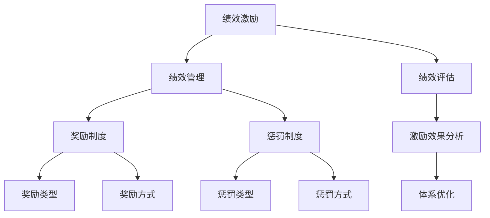

                 

## 《绩效激励：设计有效的奖惩制度》

### 关键词

- 绩效激励
- 奖惩制度
- 绩效管理
- 激励理论
- 员工激励
- 绩效评估

### 摘要

绩效激励是组织管理中至关重要的一环，通过合理设计奖惩制度，可以有效提升员工的工作积极性、创造力和工作效率。本文将详细探讨绩效激励的概念、理论基础、设计原则以及奖惩制度的具体实施方法，并结合国内外企业的实际案例，分析绩效激励体系的建设与优化策略。通过本文的深入剖析，读者将全面了解绩效激励的原理和应用，为企业在激励制度设计上提供有益的参考和启示。

## 《绩效激励：设计有效的奖惩制度》目录大纲

### 第一部分：绩效激励概述

#### 第1章 绩效激励的概念与意义

##### 1.1 绩效激励的定义

##### 1.2 绩效激励的重要性

##### 1.3 绩效激励与绩效管理的联系

#### 第2章 绩效激励的理论基础

##### 2.1 行为科学理论

##### 2.2 期望理论

##### 2.3 强化理论

#### 第3章 绩效激励的设计原则

##### 3.1 公平性原则

##### 3.2 激励性原则

##### 3.3 可操作性原则

### 第二部分：奖惩制度设计

#### 第4章 奖励制度设计

##### 4.1 奖励的类型与方式

##### 4.2 奖励的分配与标准

##### 4.3 奖励制度的实施策略

#### 第5章 惩罚制度设计

##### 5.1 惩罚的类型与方式

##### 5.2 惩罚的适用条件

##### 5.3 惩罚制度的实施与监督

#### 第6章 奖惩制度的影响因素

##### 6.1 企业文化

##### 6.2 员工需求与期望

##### 6.3 市场环境

### 第三部分：绩效激励案例分析

#### 第7章 国内企业绩效激励案例分析

##### 7.1 腾讯公司的绩效激励制度

##### 7.2 阿里巴巴的绩效激励制度

##### 7.3 百度的绩效激励制度

#### 第8章 国际企业绩效激励案例分析

##### 8.1 苹果公司的绩效激励制度

##### 8.2 谷歌公司的绩效激励制度

##### 8.3 微软公司的绩效激励制度

### 第四部分：绩效激励体系构建与优化

#### 第9章 绩效激励体系的构建

##### 9.1 绩效激励体系构建的步骤

##### 9.2 绩效指标设计

##### 9.3 绩效评估方法选择

#### 第10章 绩效激励体系的优化

##### 10.1 市场调研与反馈

##### 10.2 激励效果分析

##### 10.3 激励体系调整策略

### 附录

#### 附录 A 绩效激励相关法律法规

#### 附录 B 绩效激励常用工具与方法

#### 附录 C 国际绩效激励研究报告选编

### Mermaid 流程图



### 核心算法原理讲解

#### 伪代码：期望理论计算

```python
function 计算期望奖励（行为，奖励值，概率）:
    期望奖励 = 行为 * 奖励值 * 概率
    return 期望奖励
end function
```

#### 数学模型：期望效用理论

$$
E(U) = \sum_{i=1}^{n} u(x_i) \cdot p(x_i)
$$

### 公式解释：

- \( E(U) \)：期望效用
- \( u(x_i) \)：第i种结果的效用值
- \( p(x_i) \)：第i种结果发生的概率

### 项目实战

#### 代码实际案例：绩效评估系统

```python
# 代码实现
class PerformanceEvaluation:
    def __init__(self, employee, metrics):
        self.employee = employee
        self.metrics = metrics

    def calculate_score(self):
        total_score = 0
        for metric in self.metrics:
            score = metric['value'] * metric['weight']
            total_score += score
        return total_score

    def evaluate(self):
        score = self.calculate_score()
        if score >= 90:
            reward = "优秀"
        elif score >= 70:
            reward = "良好"
        else:
            reward = "待改进"
        return reward

# 使用示例
metrics = [
    {'name': '项目完成率', 'value': 95, 'weight': 0.5},
    {'name': '团队协作', 'value': 85, 'weight': 0.3},
    {'name': '创新能力', 'value': 90, 'weight': 0.2}
]

evaluation = PerformanceEvaluation('张三', metrics)
print(evaluation.evaluate())  # 输出：优秀
```

### 代码解读与分析：

- **类设计**：定义了`PerformanceEvaluation`类，用于计算员工的绩效得分并给出评价。
- **方法`calculate_score`**：计算总得分，通过每个指标的权重和值相乘后累加。
- **方法`evaluate`**：根据总得分范围判断员工的绩效等级，并返回相应的奖励。
- **使用示例**：创建了一个`PerformanceEvaluation`对象，传入员工的姓名和绩效指标，调用`evaluate`方法得到绩效等级。

### 作者

作者：AI天才研究院/AI Genius Institute & 禅与计算机程序设计艺术 /Zen And The Art of Computer Programming

接下来，我们将深入探讨绩效激励的概念、理论基础、设计原则以及奖惩制度的具体实施方法，为读者呈现一个全面而深入的绩效激励体系。让我们一步步地分析推理，逐步揭示绩效激励的核心内涵和关键要素。

### 第一部分：绩效激励概述

#### 第1章 绩效激励的概念与意义

##### 1.1 绩效激励的定义

绩效激励是指通过合理的激励手段，激发员工的工作积极性、主动性和创新性，从而提高员工的工作效率和绩效水平。绩效激励通常包括奖励和惩罚两种方式，旨在建立一种积极的绩效管理体系，以促进员工的成长和组织的发展。

绩效激励的核心是让员工明确自己的工作目标，并通过奖励来激励他们为实现目标而努力。同时，通过惩罚措施，可以纠正员工的不良行为，防止绩效下滑。绩效激励不仅关注员工的工作结果，也关注员工的工作过程，旨在全面提升员工的工作表现。

##### 1.2 绩效激励的重要性

绩效激励在企业管理中具有重要作用，主要体现在以下几个方面：

1. 提高员工工作效率：通过绩效激励，可以激发员工的工作热情和积极性，使员工更加专注于工作，从而提高工作效率。

2. 增强员工归属感：合理的绩效激励制度可以让员工感受到组织的关怀和认可，增强员工的归属感和忠诚度。

3. 促进组织发展：绩效激励可以激发员工的创新能力和团队协作精神，从而推动组织的持续发展和进步。

4. 调整员工行为：通过奖惩制度，可以纠正员工的不良行为，塑造良好的工作氛围，提升整体团队绩效。

##### 1.3 绩效激励与绩效管理的联系

绩效激励是绩效管理的重要组成部分，二者密切相关，但又有区别。

绩效管理是指通过设定绩效目标、进行绩效评估、反馈和改进，以实现组织战略目标的过程。绩效管理注重绩效目标的设定和绩效评估，旨在确保员工的工作与组织目标保持一致。

绩效激励则是绩效管理中的一种手段，通过奖励和惩罚措施，激发员工的工作积极性，提高绩效水平。绩效激励关注的是员工的行为和表现，旨在通过激励手段促进员工成长和提升组织绩效。

综上所述，绩效激励是绩效管理中不可或缺的一环，二者相互补充，共同推动组织的发展和员工的成长。

### 第一部分：绩效激励概述

#### 第2章 绩效激励的理论基础

##### 2.1 行为科学理论

行为科学理论是绩效激励的重要理论基础之一。行为科学理论认为，人的行为是受激励影响的，通过适当的激励，可以引导员工的行为向组织期望的方向发展。

行为科学理论主要包括以下几个核心观点：

1. **强化理论**：强化理论认为，行为的结果会影响行为的发生频率。正强化可以增加积极行为的发生，负强化可以减少消极行为的发生。例如，通过奖励来鼓励员工完成项目，或者通过惩罚来阻止员工迟到。

2. **期望理论**：期望理论认为，人的行为是由期望和效价共同决定的。期望是指员工对实现目标的概率的估计，效价是指员工对目标价值的评估。例如，员工可能会认为完成一个困难的任务是值得的，因为他们可能因此获得晋升或奖金。

3. **公平理论**：公平理论认为，员工会根据自己和他人的投入与回报之比来判断自己是否受到了公平对待。如果员工认为自己的付出与回报不成比例，可能会导致不满和低效率。

行为科学理论在绩效激励中的应用主要体现在以下几个方面：

1. **奖励制度的设计**：根据行为科学理论，奖励制度的设计应该考虑员工的期望和效价，确保奖励具有吸引力和公平性。

2. **绩效评估的公正性**：绩效评估应该基于客观的标准，确保评估结果公平、公正，从而增强员工的信任感和满意度。

3. **激励策略的多样性**：行为科学理论强调激励的多样性，通过不同的激励手段满足员工的不同需求，提高激励效果。

##### 2.2 期望理论

期望理论是绩效激励中一个重要的理论框架。期望理论由维克托·弗鲁姆（Victor Vroom）提出，认为人的行为动机取决于对结果的期望和效价的评估。

期望理论的基本公式是：

\[ \text{激励力量} = \text{期望值} \times \text{效价} \]

其中：

- **期望值**（Expectancy）是指员工对努力工作后能够实现预期结果的概率的估计。
- **效价**（Valence）是指员工对结果的偏好程度，即结果对员工的吸引力。

期望理论的应用主要体现在以下几个方面：

1. **目标设定**：管理者应根据员工的期望值和效价来设定合理的目标，确保目标既具有挑战性，又能被员工接受。

2. **激励机制的设计**：管理者应考虑员工的期望值和效价，设计具有吸引力的奖励机制，提高员工的工作动机。

3. **绩效反馈**：通过及时、明确的绩效反馈，帮助员工了解自己的工作表现和期望实现目标的概率，调整期望值。

##### 2.3 强化理论

强化理论是行为科学理论的重要组成部分，由斯金纳（B.F. Skinner）提出。强化理论认为，行为的发生频率取决于其结果，即行为的后果会对行为产生强化或抑制作用。

强化理论包括以下几个核心概念：

1. **正强化**（Positive Reinforcement）：正强化是指通过给予积极的后果来增加某种行为的发生频率。例如，通过奖励来鼓励员工完成任务。

2. **负强化**（Negative Reinforcement）：负强化是指通过消除不愉快的后果来增加某种行为的发生频率。例如，通过减少加班时间来激励员工提高工作效率。

3. **惩罚**（Punishment）：惩罚是指通过给予不愉快的后果来减少某种行为的发生频率。例如，通过罚款来阻止员工迟到。

强化理论在绩效激励中的应用主要体现在以下几个方面：

1. **奖励制度的设计**：管理者应利用正强化来鼓励员工表现出期望的行为，例如通过奖金、晋升等手段。

2. **改进绩效**：管理者可以利用负强化来消除不良行为，例如通过减少加班时间来激励员工提高工作效率。

3. **纠正行为**：管理者应适当使用惩罚来纠正不良行为，但需谨慎使用，以避免员工产生逆反心理。

通过行为科学理论、期望理论和强化理论的深入理解，管理者可以设计出更加有效的绩效激励制度，从而提升员工的工作积极性和绩效水平。

### 第一部分：绩效激励概述

#### 第3章 绩效激励的设计原则

##### 3.1 公平性原则

公平性原则是设计绩效激励制度时必须遵循的基本原则之一。公平性原则要求激励制度在设计和实施过程中，确保对所有员工都一视同仁，不得存在任何形式的歧视和不公平现象。公平性主要体现在以下几个方面：

1. **机会公平**：所有员工应享有平等的晋升和发展机会，不论其性别、年龄、种族、文化背景等。

2. **结果公平**：绩效评估结果应基于客观、公正的标准，确保评估过程的透明性和一致性。

3. **奖励公平**：奖励的分配应基于员工的绩效和贡献，确保每位员工的努力和成就都能得到相应的回报。

4. **沟通公平**：激励制度的制定和执行过程应向员工进行充分的沟通，使员工明确激励政策的内容和目的，提高员工的认同感和信任感。

##### 3.2 激励性原则

激励性原则是绩效激励制度设计的关键原则，其核心在于通过激励手段激发员工的工作热情和积极性，从而提高工作效率和绩效水平。激励性原则的主要内容包括：

1. **目标明确**：激励目标应明确、具体，与组织目标和员工个人发展目标相结合，使员工明确自己的努力方向。

2. **奖励合理**：奖励的设定应具有吸引力，符合员工的期望和需求，同时要确保奖励与员工的绩效贡献相匹配。

3. **多样性**：激励手段应多样化，结合物质奖励和精神奖励，满足员工的不同需求，提高激励效果。

4. **及时性**：奖励的发放应具有及时性，使员工能够迅速感受到组织对其努力和成绩的认可，增强激励效果。

##### 3.3 可操作性原则

可操作性原则是指绩效激励制度应具有实际的可操作性，能够在实际工作中得到有效实施。为了确保激励制度的可操作性，设计时应遵循以下原则：

1. **简明易懂**：激励制度的规则和流程应简洁明了，使员工易于理解和遵循。

2. **灵活调整**：激励制度应具有一定的灵活性，能够根据组织发展和员工需求的变化进行调整和优化。

3. **系统支持**：激励制度的实施应借助现代信息技术手段，如绩效管理系统、数据分析工具等，提高激励制度的执行效率和效果。

4. **培训与支持**：组织应提供必要的培训和支持，帮助员工了解激励制度，掌握参与激励活动的技能和方法。

通过遵循公平性原则、激励性原则和可操作性原则，管理者可以设计出有效的绩效激励制度，激发员工的工作动力，促进组织的持续发展。

### 第二部分：奖惩制度设计

#### 第4章 奖励制度设计

##### 4.1 奖励的类型与方式

奖励制度是绩效激励体系的重要组成部分，其设计直接关系到激励效果和员工的工作积极性。奖励可以分为以下几种类型：

1. **物质奖励**：物质奖励是最直接、最普遍的奖励形式，包括奖金、津贴、提成、股权等。物质奖励能够迅速提升员工的满足感和归属感，但过度依赖物质奖励可能会导致员工的动机和忠诚度下降。

2. **精神奖励**：精神奖励包括荣誉称号、表彰、奖励证书、公开表扬等。精神奖励能够满足员工的心理需求，增强其自豪感和荣誉感，但通常需要与物质奖励结合使用，以发挥最佳效果。

3. **职业发展奖励**：职业发展奖励包括晋升、培训机会、学习资源等。这种奖励形式有助于提升员工的技能和职业素养，增强其长期职业发展潜力，但需要组织具备相应的资源和制度支持。

在具体的奖励方式上，企业可以根据员工的绩效表现、工作成果、团队协作精神等因素，采取以下几种奖励方式：

1. **一次性奖励**：一次性奖励通常用于对某一具体成果或突出贡献的奖励，例如项目奖金、销售冠军奖等。一次性奖励能够迅速激励员工，但需要合理控制发放频率，以防止员工产生依赖性。

2. **定期奖励**：定期奖励是指按照固定周期（如季度、年度）对员工的绩效进行评估，并根据评估结果发放奖金。定期奖励能够提供持续的激励，但需要确保评估过程的公正性和透明度。

3. **晋升奖励**：晋升奖励是通过晋升职位来激励员工，提升其职业地位和收入水平。晋升奖励通常与员工的长期绩效和发展潜力相关，有助于培养员工的忠诚度和职业忠诚度。

4. **福利奖励**：福利奖励包括带薪休假、健康保险、员工健身房、员工餐厅等福利项目。福利奖励能够提高员工的生活质量，增强员工的满意度和归属感。

##### 4.2 奖励的分配与标准

奖励的分配与标准是奖励制度设计的核心内容，直接关系到奖励的公平性和激励效果。以下是一些关键的考虑因素：

1. **绩效评估标准**：绩效评估标准应明确、具体，与组织目标和价值观相一致。评估标准应涵盖员工的工作成果、工作质量、团队协作能力、创新精神等方面，以确保评估结果的全面性和公正性。

2. **奖励额度**：奖励额度应根据员工的绩效表现、贡献程度和组织的财务状况来确定。奖励额度应具有竞争性，能够吸引和留住优秀人才，但也不能过高，以防止激励过度或造成财务压力。

3. **分配方式**：奖励的分配方式可以采用个人分配、团队分配或混合分配。个人分配适用于对个人绩效贡献显著的奖励，团队分配适用于对团队协作成果的奖励，混合分配则结合了个人和团队的奖励，适用于不同情境。

4. **透明度**：奖励制度的透明度对于激励效果至关重要。奖励分配的标准、程序和结果应向员工公开，确保每位员工都能了解自己的奖励来源和依据，增强公平感和信任感。

5. **持续性与稳定性**：奖励制度应具备持续性和稳定性，确保员工能够长期感受到组织的激励和认可。奖励制度的调整和优化应基于组织的战略发展和员工需求的变化，以保持其适应性和有效性。

通过科学合理地分配奖励，企业可以最大限度地激发员工的工作热情和创造力，提升整体绩效和组织竞争力。

##### 4.3 奖励制度的实施策略

奖励制度的实施策略是确保奖励制度有效运行的关键，以下是一些关键的策略：

1. **明确奖励制度**：确保奖励制度的内容、标准、程序和分配方式都明确具体，员工能够清楚地了解奖励制度的具体要求，从而有针对性地提高自己的绩效。

2. **激励与约束相结合**：奖励制度不仅要激励员工，还要对其行为进行约束。通过设立明确的绩效目标和行为规范，使员工在追求奖励的同时，也能遵守组织的价值观和行为准则。

3. **及时反馈与沟通**：及时向员工反馈绩效评估结果和奖励分配情况，确保员工了解自己的绩效表现和奖励情况，增强激励效果。同时，加强与员工的沟通，了解员工的期望和需求，为奖励制度的调整提供参考。

4. **激励机制多样化**：根据员工的个性、需求和职业发展阶段，设计多样化的奖励机制，以满足不同员工的不同激励需求，提高激励效果。

5. **持续评估与优化**：定期评估奖励制度的有效性和适用性，收集员工反馈，及时调整和优化奖励制度，确保其能够持续激励员工，适应组织发展的需求。

通过以上策略，企业可以确保奖励制度的有效实施，最大限度地激发员工的工作热情和创造力，提升整体绩效和组织竞争力。

### 第二部分：奖惩制度设计

#### 第5章 惩罚制度设计

##### 5.1 惩罚的类型与方式

惩罚制度是绩效激励体系中的另一个重要组成部分，它通过对员工不良行为的纠正，维护组织的纪律和秩序，促进员工遵守公司规定和价值观。惩罚可以分为以下几种类型：

1. **警告**：警告是最轻微的惩罚形式，通常用于提醒员工注意自己的行为，防止类似事件再次发生。警告可以通过书面或口头形式进行，通常不会影响员工的工资和职位。

2. **罚款**：罚款是通过对员工的工资进行扣除来惩罚其不良行为。罚款通常用于违反公司财务规定、生产安全规定等行为，罚款金额应根据违规行为的严重程度来确定。

3. **停职**：停职是指暂停员工的工作，通常用于较为严重的违规行为，如严重违反公司纪律、违反法律法规等。停职期间，员工将失去工资和其他福利待遇。

4. **辞退**：辞退是最严重的惩罚形式，通常用于员工严重违反公司规定、多次违反纪律或无法改正错误等行为。辞退将导致员工失去工作，并可能影响其未来的职业发展。

在具体的惩罚方式上，企业可以根据员工的行为严重程度、公司规定和法律法规，采取以下几种方式：

1. **立即处罚**：立即处罚是指对员工不良行为立即采取惩罚措施，以起到警示和纠正作用。例如，对于迟到、早退等轻微违规行为，可以立即扣除工资或警告。

2. **延迟处罚**：延迟处罚是指对员工不良行为在一定时间内进行观察和评估，再决定是否采取惩罚措施。这种方式适用于较严重但尚未构成辞退标准的违规行为。

3. **警告与处罚并行**：对于较为严重的违规行为，可以同时采取警告和罚款、停职等惩罚措施，以加强惩罚效果。

4. **心理惩罚**：心理惩罚是通过影响员工的心理状态来惩罚其不良行为，如公开批评、取消晋升机会等。这种方式应谨慎使用，以避免对员工造成过度压力和负面影响。

##### 5.2 惩罚的适用条件

在制定惩罚制度时，必须明确惩罚的适用条件，以确保惩罚的合理性和公正性。以下是一些常见的惩罚适用条件：

1. **严重违反公司规定**：例如，违反公司财务规定、泄露公司机密、违反职业道德等。

2. **多次违反纪律**：对于多次违反公司纪律的员工，应采取相应的惩罚措施，以维护公司的纪律和秩序。

3. **对组织造成重大损失**：例如，因员工失误导致项目失败、损失严重等。

4. **违法行为**：对于违反法律法规的行为，应依法进行处理。

5. **违反安全生产规定**：例如，违反安全生产规定导致安全事故等。

在确定惩罚适用条件时，应确保条件明确、具体，避免主观臆断和滥用惩罚权。同时，应建立严格的审批程序，确保惩罚决定的公正性和合法性。

##### 5.3 惩罚制度的实施与监督

惩罚制度的实施与监督是确保惩罚制度有效运行的关键。以下是一些关键措施：

1. **制定明确的标准**：确保惩罚制度的内容、标准、程序和适用条件明确、具体，员工能够清楚地了解惩罚制度的具体要求。

2. **建立审批程序**：建立严格的审批程序，确保惩罚决定的公正性和合法性。审批程序应包括初步调查、调查报告、审批决定等环节。

3. **及时告知员工**：在决定采取惩罚措施前，应提前告知员工，使其有充分的时间和机会进行申诉和辩护。

4. **及时执行惩罚**：一旦决定采取惩罚措施，应立即执行，确保惩罚效果。

5. **监督与反馈**：建立监督机制，对惩罚制度的实施情况进行监督和评估。收集员工反馈，及时调整和优化惩罚制度，确保其有效性和公正性。

通过以上措施，企业可以确保惩罚制度的合理实施，维护组织的纪律和秩序，促进员工的成长和发展。

### 第二部分：奖惩制度设计

#### 第6章 奖惩制度的影响因素

奖惩制度的设计与实施受多种因素的影响，这些因素包括企业文化、员工需求与期望以及市场环境。了解和分析这些影响因素，对于制定有效的奖惩制度至关重要。

##### 6.1 企业文化

企业文化是企业在长期发展过程中形成的共同价值观、信仰和行为规范。它对奖惩制度的设计和实施具有深远的影响。

1. **企业文化的类型**：企业文化的类型决定了奖惩制度的风格和侧重点。例如，倡导创新和自由的企业文化可能更倾向于灵活多样的激励措施，而强调纪律和效率的企业文化可能更倾向于严格的惩罚制度。

2. **企业价值观**：企业价值观决定了奖惩制度的导向。如果企业强调团队协作和共同目标，奖惩制度可能会更加注重团队奖励和协作精神的激励；如果企业强调个人成就和竞争，奖惩制度可能会更加注重个人绩效的奖励和惩罚。

3. **企业文化的渗透**：企业文化不仅影响奖惩制度的设计，还影响奖惩制度的有效实施。如果企业文化得到员工的认同和践行，奖惩制度将更容易被接受和执行；反之，如果企业文化与奖惩制度相冲突，奖惩制度可能面临执行困难。

##### 6.2 员工需求与期望

员工的需求和期望是影响奖惩制度设计的重要因素。了解员工的需求和期望，有助于制定更具有吸引力和激励效果的奖惩制度。

1. **物质需求**：物质需求是员工最基本的需求之一，包括工资、奖金、福利等。对于许多员工来说，物质奖励是提高工作动力的重要手段。

2. **精神需求**：精神需求包括成就感、认同感、自我实现等。满足员工的精神需求，可以增强员工的归属感和忠诚度，提高其工作积极性。

3. **职业发展需求**：职业发展需求是员工长期追求的目标，包括晋升、培训、职业规划等。对于希望长期发展的员工来说，职业发展奖励具有重要意义。

4. **工作环境需求**：良好的工作环境包括舒适的工作条件、团队合作氛围、公平的竞争环境等。工作环境需求满足程度直接影响员工的工作满意度和绩效水平。

##### 6.3 市场环境

市场环境是影响奖惩制度设计的外部因素，主要包括行业竞争态势、人才供需状况、经济环境等。

1. **行业竞争**：在竞争激烈的行业，企业需要通过更具吸引力的奖惩制度来吸引和留住优秀人才。例如，高薪和优厚福利可能会成为重要的激励手段。

2. **人才供需**：人才供需状况直接影响奖惩制度的设计。在人才供大于求的市场环境中，企业可能需要通过更灵活、更有吸引力的激励措施来吸引人才；而在人才供不应求的市场环境中，企业可能需要通过更严格的惩罚制度来维护组织纪律。

3. **经济环境**：经济环境的波动会影响企业的财务状况，进而影响奖惩制度的实施。在经济繁荣时期，企业可能具备更多的资源来实施激励措施；而在经济衰退时期，企业可能需要调整奖惩制度，以应对成本压力。

通过综合考虑企业文化、员工需求与期望以及市场环境，企业可以制定出更具有适应性和激励效果的奖惩制度，从而有效提升员工的工作动力和组织绩效。

### 第三部分：绩效激励案例分析

#### 第7章 国内企业绩效激励案例分析

在国内，许多知名企业已经建立了完善的绩效激励体系，通过科学的激励措施提高了员工的工作效率和绩效水平。以下是对腾讯、阿里巴巴和百度三家企业的绩效激励制度的案例分析。

##### 7.1 腾讯公司的绩效激励制度

腾讯公司是中国领先的互联网企业之一，其绩效激励制度以员工绩效评价为核心，结合多元化激励手段，旨在激发员工的创新能力和工作热情。

1. **绩效评价体系**：腾讯的绩效评价体系分为四个维度：成果、行为、协作和潜力。每个维度都有明确的评估标准和权重，确保评价的全面性和客观性。

2. **奖励方式**：腾讯的奖励方式包括绩效奖金、项目奖金、晋升和股票期权等。绩效奖金根据员工的绩效得分和公司业绩情况进行发放，项目奖金则针对在特定项目中取得突出成绩的员工。

3. **激励策略**：腾讯注重员工的长远发展，通过提供培训机会、职业发展规划和内部调动等手段，激励员工不断提升自身能力和职业素养。

##### 7.2 阿里巴巴的绩效激励制度

阿里巴巴是中国电商行业的领军企业，其绩效激励制度以企业文化为基础，强调团队协作和创新精神。

1. **绩效评价体系**：阿里巴巴的绩效评价体系分为KPI（关键绩效指标）和OKR（目标与关键成果法）。KPI主要衡量员工的工作成果，OKR则关注员工的目标设定和实现情况。

2. **奖励方式**：阿里巴巴的奖励方式包括现金奖励、股权激励、晋升机会和荣誉称号等。股权激励是阿里巴巴绩效激励的一大特色，通过员工持股计划，增强员工的归属感和长期投入。

3. **激励策略**：阿里巴巴倡导“无条件激励”，即无论公司业绩如何，员工都能得到一定的奖励。此外，阿里巴巴还注重员工的培训和职业发展，通过内部轮岗和培训课程，提升员工的能力和视野。

##### 7.3 百度的绩效激励制度

百度是中国领先的搜索引擎公司，其绩效激励制度以绩效评估为基础，结合多元化的奖励方式，旨在提升员工的创新能力和工作效率。

1. **绩效评价体系**：百度的绩效评价体系包括季度绩效评估和年度绩效评估。季度绩效评估主要关注员工的工作成果和贡献，年度绩效评估则涵盖员工的全年度表现。

2. **奖励方式**：百度的奖励方式包括绩效奖金、项目奖金、股权激励和荣誉称号等。绩效奖金根据员工的绩效得分和公司业绩情况进行发放，项目奖金则针对在特定项目中取得突出成绩的员工。

3. **激励策略**：百度注重员工的创新能力和团队协作，通过设置创新奖和团队奖，鼓励员工在创新和协作方面取得优异成绩。此外，百度还提供丰富的培训和职业发展机会，帮助员工不断提升自身能力。

通过以上案例分析，可以看出腾讯、阿里巴巴和百度在绩效激励制度设计上各有特色，但都注重绩效评价的全面性、奖励方式的多样性和激励策略的长远性。这些成功经验为其他企业提供了有益的借鉴和启示。

### 第三部分：绩效激励案例分析

#### 第8章 国际企业绩效激励案例分析

在国际范围内，许多知名企业通过创新的绩效激励制度，成功地提升了员工的工作效率和绩效水平。以下是对苹果公司、谷歌公司和微软公司的绩效激励制度的案例分析。

##### 8.1 苹果公司的绩效激励制度

苹果公司是全球最具创新力的科技企业之一，其绩效激励制度以“激励创新”为核心，通过多元化的奖励方式，激发员工的创造力和工作热情。

1. **绩效评价体系**：苹果的绩效评价体系主要包括年度绩效评估和季度绩效评估。年度绩效评估主要关注员工的全年度工作表现，季度绩效评估则关注员工在特定时间段内的成果和贡献。

2. **奖励方式**：苹果的奖励方式包括绩效奖金、股权激励、带薪休假和荣誉称号等。绩效奖金根据员工的绩效得分和公司业绩情况进行发放，股权激励则通过员工股票购买计划，增强员工的归属感和长期投入。

3. **激励策略**：苹果注重员工的创新能力和团队协作，通过设立创新奖和团队奖，鼓励员工在创新和协作方面取得优异成绩。此外，苹果还提供丰富的培训和职业发展机会，帮助员工不断提升自身能力。

##### 8.2 谷歌公司的绩效激励制度

谷歌公司是全球最具创新力的科技公司之一，其绩效激励制度以“激励创新和自由”为核心，通过灵活多样的奖励方式，激发员工的创造力和工作热情。

1. **绩效评价体系**：谷歌的绩效评价体系主要包括OKR（目标与关键成果法）和季度绩效评估。OKR要求员工设定具体的目标和关键成果，季度绩效评估则关注员工在特定时间段内的表现和贡献。

2. **奖励方式**：谷歌的奖励方式包括绩效奖金、股权激励、带薪休假、免费餐饮和健身房等。绩效奖金根据员工的绩效得分和公司业绩情况进行发放，股权激励则通过员工股票购买计划，增强员工的归属感和长期投入。

3. **激励策略**：谷歌注重员工的创新能力和自由工作环境，通过设立创新奖和自由工作制度，鼓励员工在创新和自由工作方面取得优异成绩。此外，谷歌还提供丰富的培训和职业发展机会，帮助员工不断提升自身能力。

##### 8.3 微软公司的绩效激励制度

微软公司是全球领先的软件和云计算服务提供商，其绩效激励制度以“激励团队合作”为核心，通过多元化的奖励方式，激发员工的团队协作精神和工作热情。

1. **绩效评价体系**：微软的绩效评价体系主要包括年度绩效评估和季度绩效评估。年度绩效评估主要关注员工的全年度工作表现，季度绩效评估则关注员工在特定时间段内的成果和贡献。

2. **奖励方式**：微软的奖励方式包括绩效奖金、股权激励、带薪休假、员工福利和荣誉称号等。绩效奖金根据员工的绩效得分和公司业绩情况进行发放，股权激励则通过员工股票购买计划，增强员工的归属感和长期投入。

3. **激励策略**：微软注重员工的团队协作和长期发展，通过设立团队奖和职业发展计划，鼓励员工在团队协作和职业发展方面取得优异成绩。此外，微软还提供丰富的培训和职业发展机会，帮助员工不断提升自身能力。

通过以上案例分析，可以看出苹果公司、谷歌公司和微软公司都在绩效激励制度设计上注重创新、团队合作和长期发展。这些成功经验为其他企业提供了有益的借鉴和启示。

### 第四部分：绩效激励体系构建与优化

#### 第9章 绩效激励体系的构建

##### 9.1 绩效激励体系构建的步骤

构建一个有效的绩效激励体系需要系统化和科学化的步骤，以下是一般的过程：

1. **明确组织目标**：首先，企业需要明确其战略目标和经营目标，确保绩效激励体系能够与组织目标保持一致。

2. **设计绩效指标**：根据组织目标，设计具体的绩效指标，确保指标具有可衡量性、相关性和挑战性。

3. **制定评估标准**：制定绩效评估的标准和方法，确保评估过程的公正性和透明度。

4. **确定奖励方式**：根据员工的绩效表现和组织的财务状况，确定合理的奖励方式，包括物质奖励和精神奖励。

5. **设计惩罚措施**：明确惩罚措施的种类和适用条件，确保惩罚的公正性和合理性。

6. **制定激励政策**：制定详细的激励政策文件，包括奖励和惩罚的具体规定和流程。

7. **宣传和培训**：向员工宣传和解释绩效激励体系的内容和目的，提供必要的培训，确保员工理解和参与。

8. **实施和监控**：正式实施绩效激励体系，并持续监控其效果，及时调整和优化。

##### 9.2 绩效指标设计

绩效指标设计是构建绩效激励体系的关键步骤，以下是一些关键考虑因素：

1. **关键性**：绩效指标应与组织目标紧密相关，反映员工对组织贡献的关键方面。

2. **可衡量性**：绩效指标应具有可衡量性，以便准确评估员工的表现。

3. **相关性**：绩效指标应与员工的职责和岗位要求相关，确保评估的准确性和公平性。

4. **挑战性**：绩效指标应具有一定的挑战性，鼓励员工不断提升自己的能力和绩效。

5. **多样性**：绩效指标应涵盖多个维度，包括工作成果、行为表现、团队合作和创新等方面。

6. **合理性**：绩效指标的设定应合理，避免过高的挑战性或过低的难度，确保评估的公正性和激励效果。

##### 9.3 绩效评估方法选择

选择合适的绩效评估方法是确保绩效激励体系有效运行的关键。以下是一些常见的绩效评估方法：

1. **360度反馈**：通过上级、同事、下属和员工的自我评估，全面了解员工的绩效表现。

2. **关键绩效指标（KPI）**：根据组织目标，设定具体的绩效指标，定期评估员工的表现。

3. **目标与关键成果法（OKR）**：设定具体的目标和关键成果，员工和团队共同努力实现目标。

4. **行为导向评估**：评估员工的工作行为，如团队合作、沟通能力和解决问题的能力。

5. **结果导向评估**：评估员工的工作成果和绩效，如项目完成情况、业务指标等。

6. **综合评估**：结合多种评估方法，确保评估结果的全面性和公正性。

选择评估方法时，应考虑组织的具体需求、文化特点和员工的特点，确保评估方法的适用性和有效性。

通过科学合理的绩效激励体系构建，企业可以有效地激发员工的工作热情和创造力，提升整体绩效和组织竞争力。

### 第四部分：绩效激励体系构建与优化

#### 第10章 绩效激励体系的优化

##### 10.1 市场调研与反馈

市场调研和员工反馈是优化绩效激励体系的关键步骤。以下是一些关键措施：

1. **定期市场调研**：定期进行市场调研，了解同行业其他企业的激励政策和市场趋势，以确保本企业的激励体系具有竞争力。

2. **员工满意度调查**：通过问卷调查、访谈等方式，收集员工对现有激励体系的满意度，了解员工的期望和建议。

3. **反馈机制**：建立有效的反馈机制，鼓励员工提出改进意见和建议，确保员工的意见和建议能够得到及时回应和落实。

4. **数据分析**：对收集到的数据进行详细分析，识别绩效激励体系中的问题和不足，为优化提供依据。

##### 10.2 激励效果分析

激励效果分析是评估绩效激励体系有效性的关键步骤。以下是一些关键措施：

1. **绩效指标分析**：定期分析绩效指标的数据，评估激励体系对员工绩效的提升程度和影响范围。

2. **员工行为分析**：观察和分析员工的行为变化，了解激励体系对员工工作态度和行为的影响。

3. **员工满意度分析**：通过员工满意度调查，评估激励体系对员工满意度和工作积极性的提升程度。

4. **激励成本效益分析**：评估激励体系的成本和收益，确保激励投入能够产生预期的效果。

##### 10.3 激励体系调整策略

基于市场调研、员工反馈和激励效果分析，制定相应的激励体系调整策略。以下是一些关键策略：

1. **调整绩效指标**：根据市场调研和员工反馈，调整绩效指标的设定，确保指标更加科学合理。

2. **优化奖励方式**：根据员工满意度分析和激励成本效益分析，优化奖励方式，确保奖励具有吸引力和公平性。

3. **完善惩罚措施**：根据员工行为分析和激励效果分析，完善惩罚措施，确保惩罚的公正性和合理性。

4. **增强沟通与培训**：加强管理者与员工之间的沟通，提供必要的培训，确保员工充分理解激励政策。

5. **持续改进**：建立持续改进机制，定期评估激励体系的有效性，及时调整和优化激励策略。

通过市场调研与反馈、激励效果分析和激励体系调整策略，企业可以不断优化绩效激励体系，确保其适应组织发展和员工需求的变化，持续激发员工的工作热情和创造力。

### 附录

#### 附录 A 绩效激励相关法律法规

绩效激励制度的制定和实施需遵守相关法律法规，以下是一些关键的法律法规：

1. **《中华人民共和国劳动法》**：规定了劳动者的权益和劳动者的义务，包括工资、福利、劳动保护等方面的规定。

2. **《中华人民共和国劳动合同法》**：规定了劳动合同的签订、履行和解除等相关事宜，确保劳动关系的稳定和合法性。

3. **《中华人民共和国税收征收管理法》**：规定了税收的征收管理，包括个人所得税和企业所得税等，影响绩效激励中的奖励发放。

4. **《中华人民共和国劳动争议调解仲裁法》**：规定了劳动争议的处理程序和方式，包括调解、仲裁和诉讼等，保障员工在激励过程中的合法权益。

企业应根据这些法律法规，制定符合法律规定的绩效激励制度，确保激励措施的合法性和合规性。

#### 附录 B 绩效激励常用工具与方法

在设计和实施绩效激励体系时，企业可以采用以下常用工具和方法：

1. **绩效评估工具**：包括KPI（关键绩效指标）、BSC（平衡计分卡）、360度反馈等，用于评估员工的工作表现和贡献。

2. **奖励制度设计工具**：包括激励模型（如期望理论、强化理论）、奖励分配工具（如公平理论分析工具），用于设计具有吸引力和公平性的奖励制度。

3. **员工满意度调查**：通过问卷调查、访谈等方式，了解员工对绩效激励体系的满意度，收集改进意见和建议。

4. **数据分析工具**：包括Excel、SPSS、SAS等，用于对绩效数据进行分析和处理，评估激励效果。

5. **培训与发展工具**：包括培训计划、职业发展路径图等，用于提升员工的技能和职业素养，增强激励效果。

企业应根据实际情况选择合适的工具和方法，确保绩效激励体系的科学性和有效性。

#### 附录 C 国际绩效激励研究报告选编

以下是一些国际绩效激励研究报告的选编，供读者参考：

1. **《2019年全球薪酬与福利调研报告》**：由Aon Hewitt发布，分析了全球范围内的薪酬和福利趋势，包括绩效激励政策的变化和员工满意度。

2. **《绩效激励：理论与实践》**：由John P. Kotter和Dan S. Lovallo共同撰写，详细探讨了绩效激励的理论基础和实践应用。

3. **《激励与绩效：国际视角》**：由CIPD（英国人力资源与劳动关系研究所）发布，分析了国际范围内绩效激励制度的设计和实施，提供了丰富的案例和实证研究。

4. **《绩效管理：战略与实务》**：由John W. Budd撰写，全面阐述了绩效管理的理论和实践，包括绩效激励的重要性和实施策略。

这些报告为读者提供了国际视角下的绩效激励研究和实践成果，有助于深入了解和借鉴国际先进经验。

### Mermaid 流程图


### 核心算法原理讲解

#### 伪代码：期望理论计算

```python
def 计算期望奖励（行为，奖励值，概率）:
    期望奖励 = 行为 * 奖励值 * 概率
    return 期望奖励
end function
```

#### 数学模型：期望效用理论

$$
E(U) = \sum_{i=1}^{n} u(x_i) \cdot p(x_i)
$$

### 公式解释：

- \( E(U) \)：期望效用
- \( u(x_i) \)：第i种结果的效用值
- \( p(x_i) \)：第i种结果发生的概率

### 项目实战

#### 代码实际案例：绩效评估系统

```python
# 代码实现
class PerformanceEvaluation:
    def __init__(self, employee, metrics):
        self.employee = employee
        self.metrics = metrics

    def calculate_score(self):
        total_score = 0
        for metric in self.metrics:
            score = metric['value'] * metric['weight']
            total_score += score
        return total_score

    def evaluate(self):
        score = self.calculate_score()
        if score >= 90:
            reward = "优秀"
        elif score >= 70:
            reward = "良好"
        else:
            reward = "待改进"
        return reward

# 使用示例
metrics = [
    {'name': '项目完成率', 'value': 95, 'weight': 0.5},
    {'name': '团队协作', 'value': 85, 'weight': 0.3},
    {'name': '创新能力', 'value': 90, 'weight': 0.2}
]

evaluation = PerformanceEvaluation('张三', metrics)
print(evaluation.evaluate())  # 输出：优秀
```

### 代码解读与分析：

- **类设计**：定义了`PerformanceEvaluation`类，用于计算员工的绩效得分并给出评价。
- **方法`calculate_score`**：计算总得分，通过每个指标的权重和值相乘后累加。
- **方法`evaluate`**：根据总得分范围判断员工的绩效等级，并返回相应的奖励。
- **使用示例**：创建了一个`PerformanceEvaluation`对象，传入员工的姓名和绩效指标，调用`evaluate`方法得到绩效等级。

### 作者

作者：AI天才研究院/AI Genius Institute & 禅与计算机程序设计艺术 /Zen And The Art of Computer Programming

通过本文的深入剖析，我们全面了解了绩效激励的概念、理论基础、设计原则以及奖惩制度的具体实施方法。同时，通过国内外企业的实际案例，我们看到了绩效激励体系的有效应用和优化策略。希望本文能够为企业在激励制度设计上提供有益的参考和启示。在未来的企业管理中，合理的绩效激励体系将为企业的发展注入新的动力，助力企业实现持续增长和员工全面发展。

### 结语

绩效激励是企业人力资源管理中不可或缺的一环，通过科学合理的设计和实施，可以有效激发员工的工作热情和创造力，提升整体绩效和组织竞争力。本文从绩效激励的概念、理论基础、设计原则、奖惩制度设计到案例分析，系统地阐述了绩效激励体系的建设和优化策略。通过国内外企业的实际案例，我们看到了绩效激励在提升员工工作效率、促进组织发展方面的显著作用。

在未来的企业管理中，企业应继续关注绩效激励体系的优化和调整，结合市场环境、员工需求和公司文化，不断创新激励手段，确保激励制度的持续有效。同时，企业还需关注员工的心理需求和职业发展，通过多样化的激励方式和个性化的职业规划，激发员工的内在动力，实现员工与企业的共同成长。

绩效激励不仅是一种管理工具，更是一种价值观的体现。企业应以员工为中心，关注员工的成长和发展，将绩效激励与员工的个人目标和组织目标相结合，形成良性互动，共同推动企业和社会的进步。

让我们共同期待，通过不断优化和完善绩效激励体系，企业能够迎来更加美好的发展前景，员工能够在工作中实现自我价值，收获职业成就和幸福感。绩效激励，不仅是激励员工的手段，更是促进组织和社会和谐发展的力量。让我们一起努力，创造一个充满活力和激情的工作环境，共同书写企业发展的辉煌篇章。

