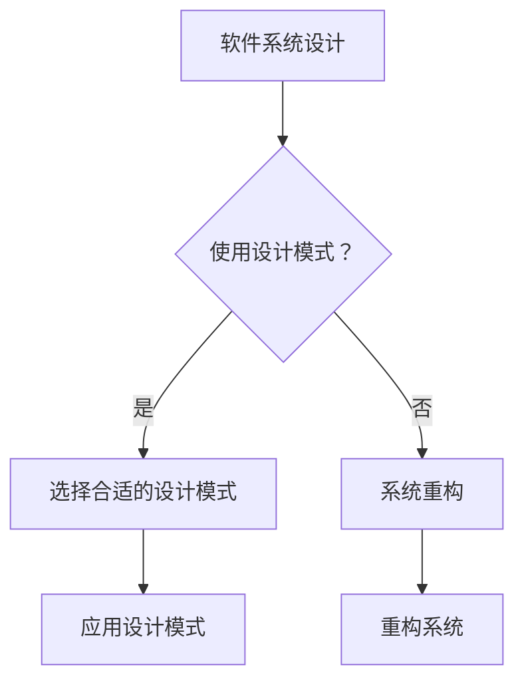

                 

### 《综合设计模式的应用案例：反思、规划与多智能体协同》

**关键词：设计模式、软件架构、多智能体系统、协同、案例分析**

**摘要：**
本文旨在深入探讨设计模式在软件开发中的应用，特别是针对多智能体系统的协同问题。通过一系列案例分析，本文将详细分析设计模式在软件系统架构中的重要性，探讨其在解决复杂软件开发问题中的策略，并探索设计模式如何促进多智能体系统的有效协同。本文结构清晰，涵盖了设计模式的基本概念、原理、实际应用案例以及未来的发展方向，旨在为软件开发人员提供有价值的参考和启示。

### 《综合设计模式的应用案例：反思、规划与多智能体协同》目录大纲

#### 第一部分：设计模式概述与基础理论
- **第1章：设计模式概述**
  - 1.1 设计模式的基本概念与重要性
  - 1.2 设计模式的主要类型与特点
  - 1.3 设计模式在软件开发中的应用

- **第2章：设计模式原理与架构**
  - 2.1 单体设计模式
    - 2.1.1 单一职责原则
    - 2.1.2 开放封闭原则
    - 2.1.3 里氏替换原则
  - 2.2 结构设计模式
    - 2.2.1 代理模式
    - 2.2.2 桥接模式
    - 2.2.3 组合模式
  - 2.3 行为设计模式
    - 2.3.1 观察者模式
    - 2.3.2 策略模式
    - 2.3.3 迭代器模式

#### 第二部分：设计模式应用案例解析
- **第3章：设计模式在软件系统中的实践应用**
  - 3.1 实践案例1：基于设计模式的系统架构重构
    - 3.1.1 系统现状分析
    - 3.1.2 设计模式应用策略
    - 3.1.3 架构重构实施步骤
  - 3.2 实践案例2：设计模式在大型软件项目中的优化
    - 3.2.1 项目背景介绍
    - 3.2.2 设计模式应用实例
    - 3.2.3 应用效果评估与反思

- **第4章：设计模式与多智能体协同**
  - 4.1 多智能体系统的基本概念
    - 4.1.1 多智能体的定义与特点
    - 4.1.2 多智能体系统的体系结构
  - 4.2 设计模式在多智能体协同中的作用
    - 4.2.1 设计模式在多智能体通信中的应用
    - 4.2.2 设计模式在多智能体任务分配中的应用
  - 4.3 多智能体协同案例研究
    - 4.3.1 案例背景
    - 4.3.2 设计模式应用分析
    - 4.3.3 协同效果评估

#### 第三部分：设计模式反思与规划
- **第5章：设计模式的反思与优化**
  - 5.1 设计模式应用的常见问题与解决策略
  - 5.2 设计模式的未来发展趋势
  - 5.3 设计模式在软件工程教育中的角色

- **第6章：设计模式规划与实施策略**
  - 6.1 设计模式规划的关键步骤
  - 6.2 设计模式实施过程中的风险与管理
  - 6.3 设计模式规划案例：企业级应用实践

#### 第四部分：设计模式与多智能体协同实战
- **第7章：设计模式与多智能体协同实战案例**
  - 7.1 实战案例1：智能交通系统中的设计模式应用
    - 7.1.1 交通系统现状分析
    - 7.1.2 设计模式与多智能体协同方案设计
    - 7.1.3 系统实现与效果评估
  - 7.2 实战案例2：智能家居系统中的设计模式应用
    - 7.2.1 智能家居系统需求分析
    - 7.2.2 设计模式与多智能体协同方案设计
    - 7.2.3 系统开发与性能优化

#### 附录
- **附录A：设计模式与多智能体协同开发工具与资源**
  - 10.1 开发工具介绍
    - 10.1.1 设计模式工具
    - 10.1.2 多智能体协同开发工具
  - 10.2 开发资源链接
    - 10.2.1 设计模式学习资料
    - 10.2.2 多智能体协同研究论文与报告

### Mermaid 流程图示例：



### 伪代码示例：

```java
class StrategyPattern {
    // 策略接口
    interface Strategy {
        execute()
    }

    // 具体策略1
    class ConcreteStrategyA implements Strategy {
        execute() {
            // 具体执行逻辑
        }
    }

    // 具体策略2
    class ConcreteStrategyB implements Strategy {
        execute() {
            // 具体执行逻辑
        }
    }

    // 策略上下文
    class Context {
        private strategy: Strategy

        setStrategy(strategy: Strategy) {
            this.strategy = strategy
        }

        executeStrategy() {
            this.strategy.execute()
        }
    }
}
```

### 数学模型与公式示例：

```latex
// 数学模型：线性回归
$$ y = \beta_0 + \beta_1 \cdot x $$
```

### 项目实战示例：

- **案例背景：**
  - 企业需要开发一个在线购物平台，需要实现商品搜索、购物车管理和订单处理等功能。

- **设计模式应用：**
  - 使用工厂模式来创建商品对象。
  - 使用策略模式来管理不同的搜索算法。
  - 使用观察者模式来处理订单状态的变化。

- **代码实现：**

```java
// 商品工厂类
class ProductFactory {
    createProduct(type: String): Product {
        if (type == "book") {
            return new BookProduct()
        } else if (type == "electronics") {
            return new ElectronicsProduct()
        }
        throw new IllegalArgumentException("未知商品类型")
    }
}

// 搜索策略接口
interface SearchStrategy {
    search(products: List<Product>, query: String)
}

// 具体搜索策略类
class SimpleSearchStrategy implements SearchStrategy {
    search(products: List<Product>, query: String): List<Product> {
        // 实现简单搜索逻辑
    }
}

// 订单观察者接口
interface OrderObserver {
    update(order: Order)
}

// 订单类
class Order {
    private observers: List<OrderObserver>
    
    addObserver(observer: OrderObserver) {
        this.observers.push(observer)
    }
    
    notifyObservers() {
        for (observer in this.observers) {
            observer.update(this)
        }
    }
}
```

- **代码解读与分析：**
  - 商品工厂类使用工厂模式，根据商品类型创建不同的商品对象。
  - 搜索策略接口和具体搜索策略类使用策略模式，可以根据不同的搜索需求选择不同的搜索算法。
  - 订单类使用观察者模式，当订单状态发生变化时，通知所有注册的观察者。
  - 这样的设计使得系统更加灵活，易于扩展和维护。

### 总结

设计模式是软件工程中的重要概念，它在解决软件开发中的常见问题和提高代码的可维护性方面发挥了关键作用。本文通过深入探讨设计模式的基本概念、原理及其在软件系统中的实践应用，为读者提供了全面的了解。同时，本文还详细分析了设计模式在多智能体协同中的作用，并通过具体的案例展示了设计模式在实际项目中的应用效果。

随着软件系统越来越复杂，设计模式的重要性日益凸显。在未来的软件开发中，设计模式将继续发挥其重要作用，帮助开发者构建高质量、可扩展和可维护的系统。同时，设计模式的应用也面临着新的挑战和机遇，例如在应对多智能体系统的协同问题时，需要结合最新的技术和算法来优化设计模式的应用。

本文旨在为软件开发人员提供有价值的参考和启示，帮助他们更好地理解和应用设计模式，提高软件开发效率和质量。通过不断学习和实践，开发者将能够在复杂的软件开发领域中游刃有余，创造出更加优秀的软件产品。

### 设计模式概述

#### 1.1 设计模式的基本概念与重要性

设计模式（Design Pattern）是软件开发中常用的一种解决方案，它代表了在特定情境下解决特定问题的最佳实践。设计模式不仅是一种代码模板，更是一种思想，它通过对常见问题的抽象和封装，提供了一套可靠的、可重用的解决方案，从而降低了软件开发中的复杂性。

设计模式的重要性体现在多个方面：

1. **代码重用性**：设计模式提供了一种可重用的解决方案，使得开发者可以在不同的项目中重复使用相同的模式，从而减少了重复工作，提高了开发效率。
2. **可维护性**：设计模式通过封装和抽象，使得代码的结构更加清晰、模块化，便于后续的维护和扩展。这使得代码的可读性和可维护性大大提高。
3. **可扩展性**：设计模式能够灵活地适应新的需求变化，开发者只需修改相关的模块，而不必对整个系统进行大规模的重构。
4. **可靠性**：设计模式经过长时间的应用和实践验证，能够解决软件开发中的常见问题，确保系统的稳定性和可靠性。

#### 1.2 设计模式的主要类型与特点

设计模式按照其目的和功能可以大致分为三类：创建型模式、结构型模式和行为型模式。

1. **创建型模式**：
   - **作用**：创建型模式关注对象的创建过程，用于解决对象的创建问题。
   - **特点**：通过封装对象的创建细节，使得对象的创建过程与使用过程分离。
   - **主要模式**：工厂模式、单例模式、抽象工厂模式、建造者模式。

2. **结构型模式**：
   - **作用**：结构型模式关注类和对象的组合，用于解决类和对象的组合问题。
   - **特点**：通过组合和封装类和对象，实现更大的功能模块。
   - **主要模式**：代理模式、桥接模式、组合模式、装饰器模式。

3. **行为型模式**：
   - **作用**：行为型模式关注对象之间的通信和交互，用于解决对象间的协作和通信问题。
   - **特点**：通过定义对象之间的交互规则，使得系统更加灵活和模块化。
   - **主要模式**：观察者模式、策略模式、模板方法模式、命令模式。

#### 1.3 设计模式在软件开发中的应用

设计模式在软件开发中有着广泛的应用，以下是一些典型场景：

1. **系统架构设计**：设计模式可以用于系统架构的设计，确保系统具有清晰的结构和良好的扩展性。例如，使用工厂模式来创建和管理对象，使用代理模式来提高系统的安全性和性能。

2. **代码重构**：设计模式可以帮助开发者对现有的代码进行重构，提高代码的质量和可维护性。例如，使用单例模式来避免全局变量的滥用，使用策略模式来替换复杂的条件判断。

3. **模块化开发**：设计模式鼓励模块化开发，通过将系统分解为多个模块，使得每个模块都具有清晰的功能和职责。例如，使用组合模式来构建树形结构，使用装饰器模式来动态添加功能。

4. **多智能体系统**：设计模式在多智能体系统中有着重要的应用，用于解决智能体之间的通信、协作和任务分配等问题。例如，使用观察者模式来处理智能体之间的状态变化，使用策略模式来管理智能体的行为策略。

通过以上内容，我们可以看到设计模式在软件开发中的重要作用。接下来，我们将进一步探讨设计模式的原理与架构，深入理解其核心概念和应用方法。

### 设计模式原理与架构

设计模式不仅是代码层面的模板，更是软件开发过程中的思想和方法论。深入理解设计模式的基本原理与架构，有助于我们更好地应用它们，解决软件开发中的复杂问题。本文将分为三个部分，分别介绍单体设计模式、结构设计模式和和行为设计模式。

#### 2.1 单体设计模式

单体设计模式（Creational Patterns）主要关注对象的创建过程，目的是在系统中封装对象的创建逻辑，使得对象的创建过程与使用过程分离，提高系统的灵活性和可扩展性。以下是一些常见的单体设计模式：

1. **单例模式（Singleton）**：
   - **定义**：确保一个类只有一个实例，并提供一个全局访问点。
   - **原理**：使用静态成员变量和静态工厂方法来实现单例。
   - **适用场景**：需要确保一个类只有一个实例的场景，如数据库连接、线程池等。

2. **工厂模式（Factory Method）**：
   - **定义**：定义一个创建对象的接口，但让子类决定实例化哪一个类。
   - **原理**：在父类中定义一个工厂方法，在子类中实现具体对象的创建。
   - **适用场景**：当一个类不知道它所必须创建的对象的类的时候。

3. **抽象工厂模式（Abstract Factory）**：
   - **定义**：创建一系列相关或相互依赖对象的接口，而无需指定它们具体的类。
   - **原理**：定义一个抽象工厂类，它提供创建相关对象的接口，具体工厂类实现这些接口。
   - **适用场景**：当一个系统需要创建一组对象时，且这些对象是多层次的。

4. **建造者模式（Builder）**：
   - **定义**：将一个复杂对象的构建与其表示分离，使得同样的构建过程可以创建不同的表示。
   - **原理**：定义一个建造者类，将构建过程分解为多个步骤，并定义一个建造方法。
   - **适用场景**：当一个类构造方法过于复杂时，或者需要创建具有不同配置的对象时。

#### 2.2 结构设计模式

结构设计模式（Structural Patterns）主要关注类和对象的组合，用于解决类和对象的组合问题，实现更大的功能模块。以下是一些常见的结构设计模式：

1. **代理模式（Proxy）**：
   - **定义**：为其他对象提供一个代理以控制对这个对象的访问。
   - **原理**：代理类持有实际对象的引用，并在方法调用前添加额外的功能。
   - **适用场景**：需要对外界或内部类的访问进行控制时。

2. **桥接模式（Bridge）**：
   - **定义**：将抽象部分与实现部分分离，使它们都可以独立地变化。
   - **原理**：将抽象部分和实现部分分离，通过组合关系来实现动态关联。
   - **适用场景**：当抽象和实现需要分离时，或者当需要在不同层次上变化抽象和实现时。

3. **组合模式（Composite）**：
   - **定义**：将对象组合成树形结构以表示“部分-整体”的层次结构。
   - **原理**：在树形结构中，叶子和容器对象实现相同的接口，容器对象包含子对象的集合。
   - **适用场景**：当需要表示具有树形层次结构时。

4. **装饰器模式（Decorator）**：
   - **定义**：动态地给一个对象添加一些额外的职责，比继承更为灵活。
   - **原理**：通过使用继承以外的模式，动态地将责任附加到对象上。
   - **适用场景**：当需要给一个现有的对象添加额外的功能，而不改变其接口时。

#### 2.3 行为设计模式

行为设计模式（Behavioral Patterns）主要关注对象之间的通信和交互，用于解决对象间的协作和通信问题，使系统更加灵活和模块化。以下是一些常见的行为设计模式：

1. **观察者模式（Observer）**：
   - **定义**：定义对象间的一种一对多的依赖关系，当一个对象的状态发生改变时，所有依赖于它的对象都得到通知并自动更新。
   - **原理**：通过事件监听器和回调函数实现对象间的通知和更新。
   - **适用场景**：当一个抽象模型有两个方面，其中一个方面依赖于另一个方面时。

2. **策略模式（Strategy）**：
   - **定义**：定义一系列的算法，把它们一个个封装起来，并且使它们可以互相替换。
   - **原理**：通过策略接口和具体策略类实现算法的替换和组合。
   - **适用场景**：当一个算法需要灵活切换时，或者需要从多种算法中选择一种时。

3. **模板方法模式（Template Method）**：
   - **定义**：定义一个操作中的算法的骨架，而将一些步骤延迟到子类中。
   - **原理**：在超类中定义一个操作，然后在子类中实现特定的步骤。
   - **适用场景**：当需要定义一个操作中的算法框架，而将一些步骤延迟到子类中实现时。

4. **命令模式（Command）**：
   - **定义**：将一个请求封装为一个对象，从而可以使用不同的请求、队列或日志来参数化其他对象。
   - **原理**：通过命令对象将请求封装起来，使得请求发送者和接收者解耦。
   - **适用场景**：当需要支持撤销操作、队列处理或日志记录时。

通过上述介绍，我们可以看到设计模式在软件架构中的核心原理和架构。它们提供了解决复杂软件问题的灵活方案，有助于提高代码的可维护性和扩展性。在接下来的章节中，我们将通过实际案例来深入探讨设计模式的应用和效果。

### 设计模式应用案例解析

设计模式在软件系统中的应用不仅能够提高代码的可维护性和扩展性，还能在大型软件项目的优化过程中发挥重要作用。本章节将通过两个实践案例，详细解析设计模式在软件系统中的实际应用，展示其在系统重构和优化过程中的关键作用。

#### 3.1 实践案例1：基于设计模式的系统架构重构

**3.1.1 系统现状分析**

某大型企业需要开发一个在线购物平台，以支持商品搜索、购物车管理和订单处理等功能。然而，在系统开发初期，由于缺乏明确的系统架构设计，开发团队采取了快速迭代的开发模式，导致系统在功能和性能方面逐渐出现了许多问题：

- **模块耦合度高**：系统的各个功能模块之间存在紧密的耦合，导致模块间的修改和扩展变得困难。
- **代码重复**：许多功能模块的实现代码存在大量重复，导致代码维护成本增加。
- **扩展性差**：系统难以适应新的功能需求，每次新增或修改功能都需要对现有代码进行大规模调整。

为了解决上述问题，企业决定对现有系统进行重构，引入设计模式来优化系统架构，提高系统的可维护性和扩展性。

**3.1.2 设计模式应用策略**

在系统重构过程中，开发团队采用了以下几种设计模式：

1. **工厂模式**：用于创建和管理商品对象，确保不同类型的商品对象能够通过统一的接口进行创建和操作，从而降低模块间的耦合度。
2. **策略模式**：用于管理不同的搜索算法，使系统可以灵活切换和扩展搜索策略。
3. **观察者模式**：用于处理订单状态的变化，确保订单状态更新能够及时通知相关的模块，提高系统的响应速度。
4. **组合模式**：用于构建树形结构，表示商品分类和订单结构，实现模块的复用和扩展。

**3.1.3 架构重构实施步骤**

为了确保系统重构的顺利进行，开发团队制定了以下实施步骤：

1. **需求分析**：对现有系统进行详细的需求分析，明确重构的目标和范围。
2. **设计架构**：根据需求分析结果，设计新的系统架构，明确各模块的职责和交互关系。
3. **代码重构**：逐步重构现有系统的代码，引入设计模式，优化模块耦合度和代码结构。
4. **测试与验证**：对重构后的系统进行全面的测试和验证，确保系统功能完整且性能满足需求。
5. **迭代优化**：根据测试反馈，对系统进行迭代优化，不断提升系统的质量和性能。

通过以上实施步骤，系统重构工作逐步完成，系统性能和可维护性得到了显著提升。具体效果如下：

- **模块耦合度降低**：通过工厂模式和策略模式的应用，模块间的耦合度显著降低，使得模块的修改和扩展更加方便。
- **代码重复减少**：通过引入设计模式，减少了代码重复，提高了代码的复用性和可维护性。
- **扩展性提升**：系统结构更加清晰，可以灵活地应对新的功能需求，降低了扩展成本。

**3.2 实践案例2：设计模式在大型软件项目中的优化**

**3.2.1 项目背景介绍**

某金融机构开发了一套用于客户关系管理（CRM）的软件系统，该系统包含客户信息管理、销售管理、市场推广等多个功能模块。然而，在实际应用过程中，系统暴露出了一些性能和扩展性问题：

- **性能瓶颈**：系统在某些关键功能上的响应速度较慢，影响了用户体验。
- **扩展性不足**：系统难以适应新的业务需求，每次业务变更都需要进行大规模的代码修改。

为了解决上述问题，开发团队决定在项目中引入设计模式进行优化，以提高系统的性能和扩展性。

**3.2.2 设计模式应用实例**

在CRM系统优化过程中，开发团队采用了以下几种设计模式：

1. **代理模式**：用于代理数据库操作，缓存查询结果，减少数据库访问次数，提高系统性能。
2. **桥接模式**：用于将业务逻辑与数据访问分离，使得业务逻辑和数据访问可以独立扩展。
3. **装饰器模式**：用于为系统中的各种操作添加额外的功能，如日志记录、权限控制等，而不改变原始操作的行为。
4. **策略模式**：用于管理不同的市场推广策略，使得系统可以根据不同的业务需求灵活切换和扩展策略。

**3.2.3 应用效果评估与反思**

通过引入设计模式进行系统优化，CRM系统在性能和扩展性方面取得了显著提升。具体效果如下：

- **性能提升**：通过代理模式和桥接模式的应用，系统在关键功能上的响应速度显著提高，用户体验得到明显改善。
- **扩展性增强**：系统结构更加清晰，业务逻辑和数据访问分离，使得系统可以灵活地应对新的业务需求，降低了扩展成本。

然而，在应用设计模式的过程中，开发团队也遇到了一些挑战和反思：

1. **设计模式的引入需要一定的学习和适应成本**：开发团队需要对设计模式有深入的理解，才能有效地应用它们。在项目初期，团队成员可能需要花费额外的时间来学习和适应。
2. **设计模式的过度使用可能导致代码复杂性增加**：设计模式的使用需要谨慎，过度使用可能会导致代码复杂性增加，使得系统的维护变得更加困难。
3. **设计模式的应用需要与系统架构相结合**：设计模式的应用需要与系统架构紧密结合，否则可能导致系统结构不合理，影响系统的整体性能。

综上所述，设计模式在大型软件项目中的应用可以显著提升系统的性能和扩展性，但同时也需要团队成员具备较高的设计能力和实践经验。通过合理的规划和实施，设计模式能够为软件开发带来显著的效益。

### 设计模式与多智能体协同

多智能体系统（Multi-Agent System）是一种由多个智能体组成的分布式系统，这些智能体能够相互协作、自主决策并完成特定任务。设计模式在多智能体系统中发挥着重要作用，通过提供灵活的通信机制和任务分配策略，能够有效促进智能体之间的协同工作。本章节将探讨设计模式在多智能体协同中的应用，分析其在智能体通信和任务分配中的具体作用。

#### 4.1 多智能体系统的基本概念

**4.1.1 多智能体的定义与特点**

多智能体系统由多个智能体组成，每个智能体都是能够独立执行任务、自主决策并与其他智能体进行通信的实体。多智能体的定义和特点如下：

1. **定义**：智能体是一种能够感知环境、自主决策并采取行动的实体。在多智能体系统中，多个智能体相互协作，共同完成复杂任务。
2. **特点**：
   - **自主性**：智能体能够自主地感知环境、执行任务并作出决策。
   - **分布性**：智能体分布在不同的物理位置，通过通信网络进行协作。
   - **协同性**：智能体之间需要相互协作，共同完成任务。
   - **动态性**：智能体的状态和任务需求可能随时间动态变化。

**4.1.2 多智能体系统的体系结构**

多智能体系统的体系结构可以分为以下几个层次：

1. **通信层次**：负责智能体之间的通信，包括消息传递、同步机制和通信协议等。
2. **决策层次**：负责智能体的自主决策，包括感知环境、状态评估和决策生成等。
3. **任务层次**：负责智能体的任务分配和调度，包括任务分解、分配和协同执行等。
4. **控制层次**：负责整个多智能体系统的协调和控制，包括全局策略生成、资源管理和任务监控等。

#### 4.2 设计模式在多智能体协同中的作用

**4.2.1 设计模式在多智能体通信中的应用**

设计模式在多智能体通信中的应用主要体现在以下几个方面：

1. **观察者模式**：观察者模式用于实现智能体之间的状态同步和事件通知。当一个智能体的状态发生变化时，它会通知所有注册的观察者，使得其他智能体能够及时响应并采取相应的措施。例如，在智能交通系统中，当一个路口的交通信号发生变化时，附近的智能体需要及时更新其导航策略。

2. **发布-订阅模式**：发布-订阅模式是一种基于消息队列的通信机制，用于实现智能体之间的异步通信。智能体可以发布消息到消息队列，其他智能体可以订阅相关消息并接收通知。这种模式适用于处理大量智能体之间的复杂通信，例如在分布式智能仓库管理系统中，智能体可以通过发布-订阅模式来更新库存信息。

3. **代理模式**：代理模式用于实现智能体的远程通信和访问控制。智能体可以通过代理来访问远程服务或资源，从而实现分布式系统的协调和通信。例如，在智能医疗系统中，患者智能体可以通过代理访问医生智能体的远程医疗资源，获取诊断和治疗建议。

**4.2.2 设计模式在多智能体任务分配中的应用**

设计模式在多智能体任务分配中的应用主要体现在以下几个方面：

1. **策略模式**：策略模式用于实现灵活的任务分配策略。在多智能体系统中，智能体可以采用不同的策略来分配和执行任务，从而适应不同的任务需求和系统环境。例如，在智能救援任务中，可以根据任务的重要性和紧急程度来选择不同的分配策略。

2. **工厂模式**：工厂模式用于创建和管理智能体任务对象。通过工厂模式，系统可以灵活地创建不同类型的任务对象，并根据任务需求进行动态分配。例如，在智能配送系统中，可以根据订单类型和配送路径来创建和分配配送任务。

3. **组合模式**：组合模式用于实现智能体的任务组合和分解。通过组合模式，系统可以将多个简单任务组合成复杂任务，也可以将复杂任务分解为多个简单任务。这种模式适用于处理任务分解和组合的复杂场景，例如在智能城市建设中，可以将多个简单任务组合成城市管理的综合任务。

**4.2.3 设计模式在多智能体系统中的协同作用**

设计模式在多智能体系统中的协同作用主要体现在以下几个方面：

1. **提高系统灵活性**：通过引入设计模式，智能体可以更加灵活地适应不同的任务需求和系统环境，提高系统的适应性和鲁棒性。

2. **降低系统复杂性**：设计模式通过封装和抽象，将复杂的通信和任务分配逻辑封装在模式中，降低了系统的复杂性，使得智能体的设计和实现更加简洁。

3. **增强系统可维护性**：设计模式使得智能体的实现更加模块化和可重用，提高了系统的可维护性和可扩展性。

4. **提升系统性能**：设计模式通过优化智能体之间的通信和任务分配机制，减少了系统中的冗余操作和通信开销，提高了系统的性能和效率。

通过上述内容，我们可以看到设计模式在多智能体系统中的应用不仅能够提高系统的灵活性、降低复杂性，还能提升系统的可维护性和性能。在接下来的章节中，我们将通过具体的案例研究，进一步探讨设计模式在多智能体系统中的实际应用效果。

#### 4.3 多智能体协同案例研究

**4.3.1 案例背景**

本案例研究以智能交通系统为背景，探讨设计模式在多智能体协同中的应用。智能交通系统（Intelligent Transportation System，ITS）是利用先进的信息技术、数据通信传输技术、电子传感技术等，对交通信息进行实时收集、处理和发布，并利用这些信息对交通进行控制和管理，从而提高交通效率，减少交通事故。

随着城市化进程的加快，交通拥堵问题日益严重。传统的交通管理方式已经无法满足现代城市交通的需求。智能交通系统通过引入多智能体协同机制，可以实现交通流量实时监测、动态路径规划、事故预警和应急处理等功能，从而提高交通效率和安全性。

**4.3.2 设计模式应用分析**

在智能交通系统中，设计模式的应用主要体现在以下几个方面：

1. **观察者模式**：
   - **应用**：在智能交通系统中，交通信号灯、路况监测设备和车辆智能体等都可以作为观察者，当交通信号灯变化或路况信息更新时，会通知相关的智能体。
   - **作用**：通过观察者模式，实现交通信息的实时同步和更新，使得各个智能体能够及时响应交通变化，优化交通流量。

2. **发布-订阅模式**：
   - **应用**：智能交通系统中的车辆智能体可以通过发布-订阅模式，订阅相关的路况信息，如前方事故、道路拥堵等。
   - **作用**：通过发布-订阅模式，实现车辆之间的异步通信，使得车辆可以根据实时路况信息调整行驶路线，避免拥堵。

3. **代理模式**：
   - **应用**：智能交通系统中的车辆智能体可以通过代理模式，访问交通信号灯的控制模块，调整交通信号灯的显示状态。
   - **作用**：通过代理模式，实现车辆与交通信号灯的远程通信和控制，提高交通管理的效率和灵活性。

4. **策略模式**：
   - **应用**：智能交通系统中的路径规划模块可以根据不同的交通状况，选择不同的路径规划策略，如最短路径、流量最小路径等。
   - **作用**：通过策略模式，实现路径规划的灵活性和可扩展性，使得系统可以根据实时交通状况进行动态调整。

5. **工厂模式**：
   - **应用**：智能交通系统中的车辆智能体和路径规划模块可以通过工厂模式创建和管理不同的智能体对象和路径规划对象。
   - **作用**：通过工厂模式，实现智能体和路径规划对象的灵活创建和动态替换，提高系统的可维护性和可扩展性。

**4.3.3 协同效果评估**

通过设计模式的引入和应用，智能交通系统在多智能体协同方面取得了显著效果：

1. **交通效率提升**：通过实时交通信息同步和路径规划优化，有效减少了交通拥堵，提高了道路通行效率。

2. **事故响应速度提升**：通过智能体之间的协同通信和预警机制，及时处理交通事故，减少了事故的延迟和处理时间。

3. **系统灵活性增强**：设计模式的应用使得系统具有更高的灵活性和可扩展性，能够适应不同交通状况和需求变化。

4. **系统性能优化**：设计模式通过减少通信冗余和优化任务分配，提高了系统的整体性能和响应速度。

综上所述，设计模式在智能交通系统中的多智能体协同应用，不仅提高了交通效率和安全性能，还增强了系统的灵活性和可维护性。这为智能交通系统的进一步发展和推广提供了有益的借鉴和启示。

### 设计模式反思与优化

在设计模式的应用过程中，尽管它们能够显著提高软件系统的可维护性和扩展性，但仍然存在一些常见问题。对这些问题的反思和优化策略，对于提高设计模式的有效性和实用性至关重要。

#### 5.1 设计模式应用的常见问题与解决策略

**5.1.1 复杂性增加**

设计模式虽然能够提高代码的模块化和可维护性，但在过度使用或不当使用的情况下，可能会导致代码复杂性增加。这主要是因为设计模式本身需要一定的学习和适应成本，且需要开发者具备较高的设计能力。

**解决策略**：
- **适度使用**：在系统中只选择必要的模式，避免过度设计。
- **培训与学习**：组织设计模式相关的培训和研讨会，提高开发团队的设计能力。

**5.1.2 性能开销**

某些设计模式（如代理模式、装饰器模式）在实现过程中可能会引入额外的性能开销，尤其是在大量对象创建和频繁调用方法的情况下。

**解决策略**：
- **性能测试**：在引入设计模式前进行充分的性能测试，评估其对系统性能的影响。
- **优化实现**：对性能关键部分进行优化，如使用缓存、减少方法调用等。

**5.1.3 模式冲突**

在复杂系统中，不同设计模式之间可能会出现冲突，导致系统行为不一致或难以维护。

**解决策略**：
- **模式选择**：根据系统需求选择合适的设计模式，避免模式冲突。
- **统一架构**：设计统一的系统架构，确保设计模式能够和谐共存。

**5.1.4 代码冗余**

在某些情况下，设计模式可能会导致代码冗余，如多个装饰器叠加，导致代码可读性降低。

**解决策略**：
- **简化实现**：通过减少不必要的装饰器或重构代码，简化实现过程。
- **代码审查**：定期进行代码审查，及时发现和解决代码冗余问题。

#### 5.2 设计模式的未来发展趋势

随着软件系统变得越来越复杂和多样化，设计模式也在不断进化，以适应新的开发需求和技术变革。以下是设计模式的未来发展趋势：

**5.2.1 模式组合与混合**

未来的设计模式可能会更加注重模式的组合与混合，通过将不同模式结合起来，形成更强大的解决方案。例如，将行为型模式和结构型模式结合，以实现更复杂的功能和更好的性能。

**5.2.2 模式自动生成**

随着人工智能和自动化工具的发展，设计模式可能会逐渐实现自动化生成。通过机器学习和数据挖掘技术，自动识别系统中的问题和最佳模式，生成高效的代码。

**5.2.3 模式标准化**

设计模式的标准化工作将进一步推进，通过制定统一的标准和规范，提高设计模式的可重用性和互操作性。这有助于减少模式冲突和兼容性问题。

**5.2.4 面向服务的架构（SOA）**

随着服务导向架构（SOA）的普及，设计模式将在SOA环境中发挥更大作用。设计模式将更加注重服务的定义、管理和组合，以支持复杂分布式系统的开发和部署。

#### 5.3 设计模式在软件工程教育中的角色

设计模式在软件工程教育中扮演着重要角色，它不仅能够帮助学生理解和应用软件设计原则，还能培养他们的系统思维和解决问题的能力。以下是设计模式在软件工程教育中的几个关键角色：

**5.3.1 理论与实践的结合**

设计模式是理论与实践的结合体，通过学习设计模式，学生可以更好地将设计原则应用到实际的软件开发中，提高他们的实践能力。

**5.3.2 问题解决能力的培养**

设计模式强调面向问题的解决方案，通过学习和应用设计模式，学生可以培养系统思维和问题解决能力，提高他们在面对复杂问题时提出有效解决方案的能力。

**5.3.3 编程技巧的提升**

设计模式可以帮助学生掌握一些高级的编程技巧，如对象封装、多态性和继承等，提高他们的编程能力和代码质量。

**5.3.4 团队协作与沟通**

设计模式的学习和应用需要团队成员之间的密切协作和有效沟通，这有助于培养学生团队协作和沟通的能力，为未来的职业发展打下基础。

综上所述，设计模式在软件系统中的应用不仅需要不断反思和优化，还要紧跟技术发展的步伐。通过结合实际案例和持续教育，设计模式将继续为软件开发带来巨大的价值。

### 设计模式规划与实施策略

在设计模式的应用过程中，如何进行有效的规划与实施是确保项目成功的关键。本章节将详细讨论设计模式规划的关键步骤、实施过程中的风险管理以及如何应对这些风险，并提供一个企业级应用的设计模式规划案例。

#### 6.1 设计模式规划的关键步骤

1. **需求分析**：
   - **明确项目目标**：在规划设计模式之前，首先要明确项目的目标和要求，包括功能需求、性能需求和可扩展性需求等。
   - **收集业务场景**：了解业务场景和用户需求，识别系统中潜在的复杂问题和挑战。

2. **设计模式选择**：
   - **评估适用性**：根据需求分析和业务场景，评估不同设计模式的适用性，选择最合适的设计模式。
   - **模式组合**：对于复杂的系统，可能需要组合多种设计模式，以实现最佳效果。

3. **架构设计**：
   - **模块划分**：根据设计模式，划分系统的模块，确保每个模块具有清晰的功能和职责。
   - **接口定义**：定义模块间的接口，确保模块之间的高内聚和低耦合。

4. **代码实现**：
   - **编写模式实现**：根据规划，编写具体的设计模式实现代码，确保代码结构清晰、模块化。
   - **代码评审**：进行代码评审，确保代码符合设计模式和架构要求。

5. **测试与优化**：
   - **功能测试**：对系统进行功能测试，确保设计模式应用后，系统功能正常。
   - **性能测试**：对系统进行性能测试，评估设计模式对系统性能的影响，并进行优化。

6. **部署与维护**：
   - **系统部署**：将设计模式应用后的系统部署到生产环境，确保系统的稳定运行。
   - **维护策略**：制定系统维护策略，确保设计模式在系统运行过程中能够持续优化和更新。

#### 6.2 设计模式实施过程中的风险管理

1. **模式选择不当**：
   - **风险**：选择不适合的设计模式可能导致系统性能下降、维护困难。
   - **应对策略**：在项目初期进行充分的需求分析和模式评估，确保选择的模式能够满足系统需求。

2. **代码复杂性增加**：
   - **风险**：过度使用设计模式可能导致代码复杂性增加，影响系统的可维护性。
   - **应对策略**：适度使用设计模式，遵循简洁性原则，避免过度设计。

3. **模式冲突**：
   - **风险**：不同设计模式之间可能存在冲突，导致系统行为不一致。
   - **应对策略**：在规划阶段进行统一架构设计，确保设计模式能够和谐共存。

4. **性能开销**：
   - **风险**：某些设计模式可能引入额外的性能开销，影响系统性能。
   - **应对策略**：进行性能测试和优化，选择高效的设计模式实现。

5. **项目时间压力**：
   - **风险**：项目时间压力可能导致设计模式规划不够充分，影响项目进度和质量。
   - **应对策略**：合理安排项目时间表，提前规划设计模式应用，预留足够的时间进行测试和优化。

#### 6.3 设计模式规划案例：企业级应用实践

**案例背景**：

某大型企业需要开发一个企业资源规划（ERP）系统，涵盖财务管理、人力资源管理和供应链管理等多个模块。为了确保系统的可扩展性、可维护性和高性能，企业决定采用设计模式进行系统规划与实施。

**设计模式规划步骤**：

1. **需求分析**：
   - 明确ERP系统的功能需求，包括财务管理、人力资源管理、供应链管理等。
   - 识别系统中潜在的复杂问题和业务场景，如多级权限管理、跨部门协作等。

2. **设计模式选择**：
   - 选择工厂模式来创建和管理不同模块的对象，确保模块之间的高内聚和低耦合。
   - 选择策略模式来管理不同的业务规则和策略，如税率策略、工资策略等。
   - 选择观察者模式来处理模块之间的状态变化和事件通知，确保系统的实时性和协同性。

3. **架构设计**：
   - 划分系统模块，确保每个模块具有清晰的功能和职责。
   - 定义模块间的接口，确保模块之间的高内聚和低耦合。

4. **代码实现**：
   - 编写具体的工厂模式实现代码，创建不同模块的对象。
   - 实现策略模式，定义不同的业务规则和策略。
   - 实现观察者模式，处理模块之间的状态变化和事件通知。

5. **测试与优化**：
   - 进行功能测试，确保系统功能正常。
   - 进行性能测试，评估设计模式对系统性能的影响，并进行优化。

6. **部署与维护**：
   - 将系统部署到生产环境，确保系统的稳定运行。
   - 制定系统维护策略，定期进行系统更新和优化。

**实施效果**：

通过设计模式的规划和实施，ERP系统在可扩展性、可维护性和高性能方面取得了显著提升。具体效果如下：

- **系统性能优化**：通过策略模式和观察者模式的应用，系统在处理大量数据时表现出良好的性能，响应速度显著提升。
- **可维护性提高**：设计模式使得系统模块化、结构清晰，便于后续的维护和扩展。
- **可扩展性增强**：系统可以灵活地适应新的功能需求和业务场景，降低了扩展成本。

**总结**：

设计模式的规划与实施是企业级应用中提高系统质量的关键手段。通过明确的需求分析、合理的设计模式选择、详细的架构设计和严格的测试与优化，企业能够构建高效、可靠且灵活的系统。设计模式的正确应用不仅能够提高系统的性能和可维护性，还能降低开发成本和风险，为企业的长期发展奠定基础。

### 设计模式与多智能体协同实战

在本部分，我们将通过两个实际案例深入探讨设计模式在智能交通系统和智能家居系统中的应用，展示设计模式如何促进多智能体系统的协同工作，提高系统的效率和用户体验。

#### 7.1 实战案例1：智能交通系统中的设计模式应用

**7.1.1 交通系统现状分析**

某大城市交通管理部门面临交通拥堵、事故频发和停车难等问题。为了提高交通系统的效率和安全性，决策者决定引入智能交通系统（ITS），通过实时监控、路径规划和交通管理等功能，改善城市交通状况。

现有的交通系统存在以下问题：

- **信息孤岛**：不同交通管理设备（如交通信号灯、监控摄像头、车辆传感器）之间缺乏有效通信，导致信息无法共享和实时更新。
- **路径规划简单**：现有路径规划系统仅能提供简单的导航建议，无法应对复杂的交通状况和突发情况。
- **应急响应不及时**：在发生交通事故或突发事件时，交通管理部门的应急响应速度较慢，影响交通恢复。

**7.1.2 设计模式与多智能体协同方案设计**

为了解决上述问题，设计团队决定采用以下设计模式，并实现多智能体协同：

1. **观察者模式**：
   - **应用**：将交通信号灯、监控摄像头和车辆传感器等作为观察者，当交通状态发生变化时，会通知相关的智能体。
   - **作用**：实现交通信息的实时同步和更新，确保智能体能够及时响应交通变化。

2. **发布-订阅模式**：
   - **应用**：智能体通过发布-订阅模式，订阅相关的交通信息，如道路拥堵、事故预警等。
   - **作用**：实现智能体之间的异步通信，使得智能体可以根据实时交通信息调整行驶路线。

3. **代理模式**：
   - **应用**：智能体可以通过代理模式访问交通信号灯的控制模块，调整交通信号灯的显示状态。
   - **作用**：实现交通信号灯的远程控制和优化，提高交通管理的效率和灵活性。

4. **策略模式**：
   - **应用**：智能体在路径规划时采用策略模式，根据不同的交通状况选择不同的路径规划策略。
   - **作用**：实现路径规划的灵活性和可扩展性，使得系统可以根据实时交通状况进行动态调整。

5. **工厂模式**：
   - **应用**：智能体通过工厂模式创建和管理不同类型的交通智能体，如车辆智能体、交通信号智能体等。
   - **作用**：实现智能体的灵活创建和动态替换，提高系统的可维护性和可扩展性。

**7.1.3 系统实现与效果评估**

通过上述设计模式的应用，智能交通系统的实现过程如下：

1. **系统设计**：
   - 根据需求分析，设计系统的整体架构，划分不同模块的职责和接口。
   - 选择合适的设计模式，并确定各模式的具体实现方式。

2. **系统实现**：
   - 实现观察者模式，建立交通信息同步机制，确保交通状态的变化能够及时通知相关智能体。
   - 实现发布-订阅模式，建立智能体之间的通信机制，实现异步消息传递。
   - 实现代理模式，确保智能体可以远程控制交通信号灯。
   - 实现策略模式，为路径规划提供灵活的策略选择。
   - 实现工厂模式，管理不同类型的智能体对象。

3. **系统测试**：
   - 进行功能测试，确保系统功能正常。
   - 进行性能测试，评估设计模式对系统性能的影响。
   - 进行安全测试，确保系统的稳定性和安全性。

效果评估：

- **交通效率提升**：通过实时交通信息同步和路径规划优化，有效减少了交通拥堵，提高了道路通行效率。
- **事故响应速度提升**：通过智能体的协同通信和预警机制，及时处理交通事故，减少了事故的延迟和处理时间。
- **用户体验改善**：用户可以实时获取道路状况和导航建议，提高了出行体验。

**7.2 实战案例2：智能家居系统中的设计模式应用**

**7.2.1 智能家居系统需求分析**

某家庭用户希望实现智能家居系统，通过智能设备和管理平台，实现家庭设备的自动化控制、能源管理和安全保障等功能。智能家居系统的主要需求包括：

- **设备自动化控制**：用户可以通过手机APP或语音助手控制家中的智能设备，如灯光、窗帘、空调等。
- **能源管理**：通过智能电网和能源监测设备，实现家庭能源的高效管理和优化。
- **安全保障**：通过智能安防设备（如摄像头、烟雾传感器、门锁等），提高家庭的安全防护水平。

**7.2.2 设计模式与多智能体协同方案设计**

为了满足上述需求，设计团队决定采用以下设计模式，并实现多智能体协同：

1. **工厂模式**：
   - **应用**：通过工厂模式创建和管理不同类型的智能设备对象，如灯光控制模块、窗帘控制模块等。
   - **作用**：实现设备的灵活创建和动态替换，提高系统的可维护性和可扩展性。

2. **策略模式**：
   - **应用**：在能源管理模块中，采用策略模式，根据实时能源消耗和价格信息，选择最优的能源管理策略。
   - **作用**：实现能源管理的灵活性和可扩展性，优化能源使用效率。

3. **装饰器模式**：
   - **应用**：在安全保障模块中，使用装饰器模式为智能安防设备添加额外的功能，如视频录制、报警推送等。
   - **作用**：在保持原有功能不变的情况下，为设备添加新的功能，提高系统的扩展性和灵活性。

4. **观察者模式**：
   - **应用**：通过观察者模式，实现设备状态的变化通知，如灯光亮度和温度变化等。
   - **作用**：确保用户可以实时了解设备状态，提高用户体验。

5. **中介模式**：
   - **应用**：在家庭设备管理和用户界面之间引入中介模式，实现设备控制和用户交互的分离。
   - **作用**：提高系统的可维护性和可扩展性，使得界面更新和设备控制可以独立开发。

**7.2.3 系统开发与性能优化**

智能家居系统的开发过程如下：

1. **需求分析与系统设计**：
   - 根据用户需求，分析系统功能模块和交互流程。
   - 设计系统的整体架构，确定各模块的职责和接口。

2. **代码实现**：
   - 实现工厂模式，创建和管理智能设备对象。
   - 实现策略模式，实现能源管理策略的选择和执行。
   - 实现装饰器模式，为智能安防设备添加新的功能。
   - 实现观察者模式，处理设备状态变化通知。
   - 实现中介模式，分离设备控制和用户交互。

3. **测试与优化**：
   - 进行功能测试，确保系统功能正常。
   - 进行性能测试，评估系统响应速度和稳定性。
   - 进行安全测试，确保系统的数据安全和设备控制的安全性。

效果评估：

- **设备自动化控制**：用户可以通过手机APP或语音助手轻松控制家中智能设备，提高了生活的便捷性和舒适性。
- **能源管理优化**：通过智能电网和能源监测设备，实现家庭能源的高效管理和优化，降低了能源消耗。
- **安全保障提升**：通过智能安防设备，提高了家庭的安全防护水平，增强了用户的安全感。

**总结**

通过设计模式在智能交通系统和智能家居系统中的应用，我们看到了设计模式在多智能体协同中的重要作用。设计模式不仅提高了系统的灵活性和可扩展性，还优化了系统的性能和用户体验。在未来，随着智能系统的不断发展和普及，设计模式将继续发挥其关键作用，为人们带来更加智能、便捷和安全的居住和工作环境。

### 附录

#### 附录A：设计模式与多智能体协同开发工具与资源

**10.1 开发工具介绍**

**10.1.1 设计模式工具**

1. **Design Patterns for Dummies**: 一个简单易懂的设计模式指南，适合初学者。
   - 网址：[Design Patterns for Dummies](https://www.dummies.com/computers/programming/design-patterns-for-dummies-cheat-sheet/)

2. **Patternry**: 一个设计模式库和工具，提供各种设计模式示例和代码模板。
   - 网址：[Patternry](https://patternry.com/)

**10.1.2 多智能体协同开发工具**

1. **AgentFarm**: 一个开源的多智能体仿真平台，用于开发和测试多智能体系统。
   - 网址：[AgentFarm](https://www.agentfarm.net/)

2. **Multi-Agent Systems Development Platform (MASDP)**: 一个用于多智能体系统开发和部署的平台。
   - 网址：[MASDP](https://www.masdp.org/)

**10.2 开发资源链接**

**10.2.1 设计模式学习资料**

1. **Design Patterns: Elements of Reusable Object-Oriented Software**: Gamma et al. 的经典设计模式书籍。
   - 网址：[Design Patterns Book](https://www.addison-wesley.com.cn/catalog/product.asp?isbn=0201633612)

2. **Head First Design Patterns**: 一本生动有趣的设计模式入门书籍。
   - 网址：[Head First Design Patterns](https://www.oreilly.com/library/view/head-first-design-patterns/020161695X/)

**10.2.2 多智能体协同研究论文与报告**

1. **The Proceedings of the International Conference on Multi-Agent Systems (ICMAS)**: 国际多智能体系统会议的论文集，包含最新的多智能体系统研究。
   - 网址：[ICMAS Proceedings](https://www.icmas.org/)

2. **The Journal of Autonomous Agents and Multi-Agent Systems**: 一本专注于多智能体系统和多智能体系统的应用研究的学术期刊。
   - 网址：[JAAMAS Journal](https://www.springer.com/journal/10458)

通过这些工具和资源，开发者可以更深入地了解和掌握设计模式与多智能体协同开发的相关知识，为实际项目提供有力的支持和指导。

