                 

# 《聊天机器人宠物行业：宠物健康和行为监测》

## 关键词
- 聊天机器人
- 宠物健康监测
- 宠物行为监测
- 人工智能
- 宠物行业
- 软件架构设计

## 摘要

随着宠物数量的增长，宠物健康和行为监测逐渐成为宠物行业的重要组成部分。本文将深入探讨聊天机器人在宠物健康和行为监测中的应用，分析宠物行业现状与发展趋势，阐述宠物健康监测与行为监测技术的原理与方法，以及宠物健康与行为监测系统的架构设计、开发与实现。同时，通过实战案例分析，展示技术在实际项目中的应用效果，为宠物行业提供创新的解决方案。

## 目录

### 《聊天机器人宠物行业：宠物健康和行为监测》目录大纲

**第一部分：宠物行业概述**

**第1章：宠物行业现状与发展趋势**

- 1.1 宠物行业市场规模与增长
- 1.2 宠物主人行为分析
- 1.3 宠物服务需求分析

**第2章：宠物健康监测技术**

- 2.1 宠物健康监测的基本概念
- 2.2 宠物健康监测的硬件设备
- 2.3 宠物健康监测的数据分析方法
- 2.4 宠物健康监测应用案例

**第3章：宠物行为监测技术**

- 3.1 宠物行为监测的定义与意义
- 3.2 宠物行为监测的技术与方法
- 3.3 宠物行为监测的应用场景

**第4章：聊天机器人在宠物行业中的应用**

- 4.1 聊天机器人在宠物健康咨询中的应用
- 4.2 聊天机器人在宠物行为咨询中的应用
- 4.3 聊天机器人在宠物服务预约中的应用

**第5章：宠物健康与行为监测系统的架构设计**

- 5.1 系统架构设计原则
- 5.2 系统功能模块划分
- 5.3 系统关键技术

**第6章：宠物健康与行为监测系统的开发与实现**

- 6.1 开发环境与工具
- 6.2 系统开发流程
- 6.3 系统功能模块详细实现

**第7章：宠物健康与行为监测系统的部署与优化**

- 7.1 系统部署方案
- 7.2 系统性能优化
- 7.3 系统安全性保障

**第二部分：宠物健康与行为监测案例分析**

**第8章：宠物健康与行为监测项目实战**

- 8.1 项目背景与目标
- 8.2 项目实施过程
- 8.3 项目效果评估

**第9章：宠物健康与行为监测技术展望**

- 9.1 未来发展趋势
- 9.2 技术挑战与解决方案
- 9.3 行业应用前景

**附录**

**附录A：宠物健康与行为监测相关资源**

- 附录A.1 宠物健康与行为监测相关网站
- 附录A.2 宠物健康与行为监测开源项目
- 附录A.3 宠物健康与行为监测相关书籍

### 第一部分：宠物行业概述

#### 第1章：宠物行业现状与发展趋势

随着社会经济的发展和人们生活水平的提高，宠物已经成为许多家庭的重要成员。宠物行业也随之蓬勃发展，涵盖了宠物繁殖、宠物护理、宠物医疗、宠物食品、宠物用品等多个领域。本章将分析宠物行业的现状，探讨其发展趋势。

##### 1.1 宠物行业市场规模与增长

根据市场调研数据，全球宠物市场规模已超过数千亿美元。其中，美国、中国、日本、欧洲等地区是主要的宠物市场。近年来，随着人们对宠物的关注度增加，宠物行业市场规模呈现快速增长的趋势。预计在未来几年，这一增长态势仍将持续。

以下是一个简单的宠物行业市场规模增长的Mermaid流程图：

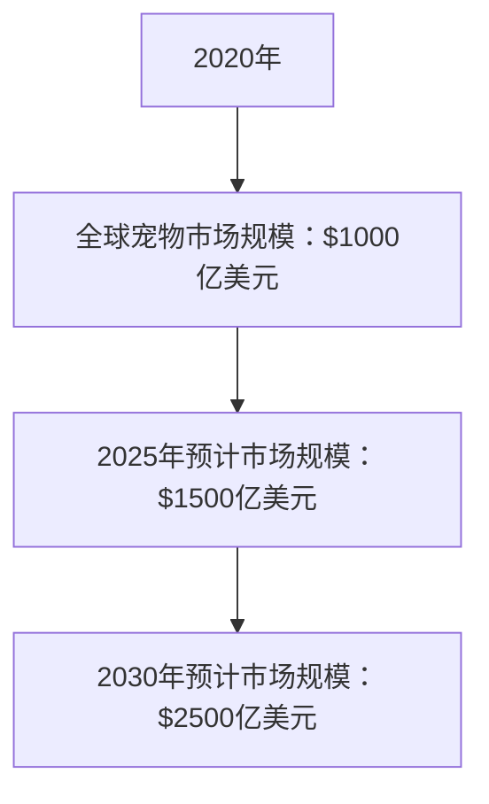

##### 1.2 宠物主人行为分析

宠物主人的消费行为对宠物行业的发展具有重要意义。研究表明，年轻一代的宠物主人（如80后、90后）更注重宠物的生活质量和健康。他们倾向于通过互联网获取宠物相关的信息，购买高品质的宠物食品和用品，并愿意为宠物的医疗保健投入更多资金。

以下是一个简单的宠物主人行为分析的Mermaid流程图：

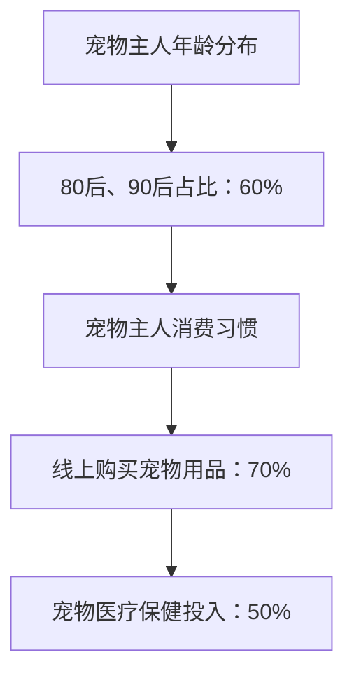

##### 1.3 宠物服务需求分析

随着宠物行业的发展，宠物主人对各种服务的需求也不断增加。其中包括：

- 宠物医疗：宠物主人愿意花费大量资金为宠物提供医疗服务，包括预防保健、疾病治疗等。
- 宠物美容：宠物美容已成为宠物服务中的一个重要领域，宠物主人愿意为宠物的外观和健康投入。
- 宠物寄养：随着生活节奏的加快，宠物主人对宠物寄养服务的需求也在增长。
- 宠物训练：宠物训练服务有助于提高宠物的行为素质，满足宠物主人的需求。

以下是一个简单的宠物服务需求分析的Mermaid流程图：

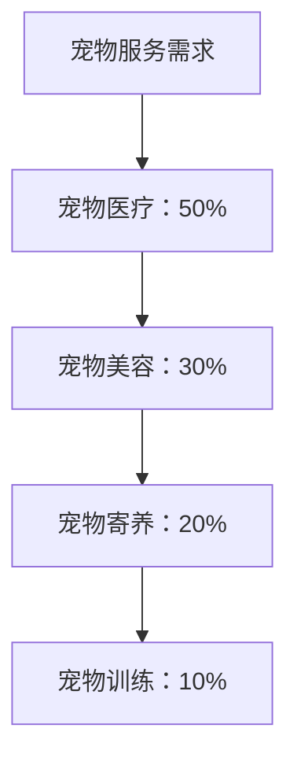

#### 第2章：宠物健康监测技术

##### 2.1 宠物健康监测的基本概念

宠物健康监测是指通过技术手段对宠物的健康状况进行实时监测和评估，以便及时发现潜在的健康问题。宠物健康监测技术主要包括以下几个方面：

- 生理指标监测：包括体温、心率、呼吸率等生命体征的监测。
- 血液指标监测：通过血液检测分析宠物的健康状况。
- 遥感监测：利用传感器和网络技术实现对宠物行为、位置等信息的远程监测。

以下是一个简单的宠物健康监测基本概念的Mermaid流程图：

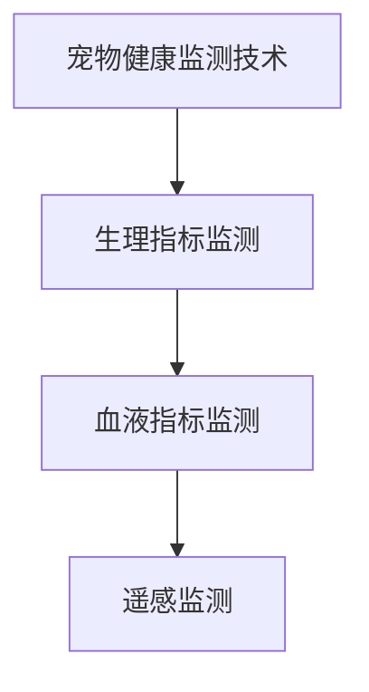

##### 2.2 宠物健康监测的硬件设备

宠物健康监测的硬件设备是实现实时监测和数据采集的关键。以下是一些常见的宠物健康监测硬件设备：

- 体温计：用于测量宠物的体温。
- 心率监测器：用于监测宠物的心率。
- 呼吸监测器：用于监测宠物的呼吸率。
- 便携式血液分析仪：用于对宠物的血液进行分析。

以下是一个简单的宠物健康监测硬件设备的Mermaid流程图：

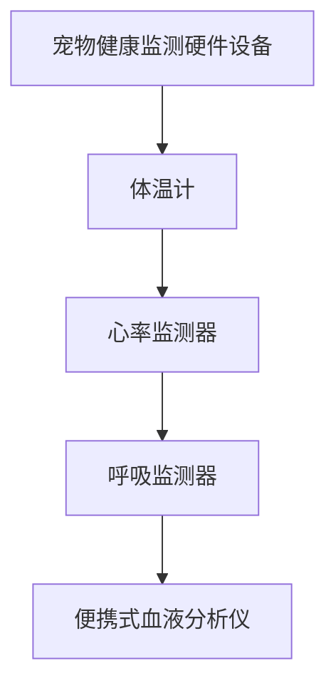

##### 2.3 宠物健康监测的数据分析方法

宠物健康监测的数据分析方法主要包括以下几种：

- 数据预处理：对采集到的原始数据进行清洗、过滤和转换。
- 特征提取：从预处理后的数据中提取出对宠物健康有重要意义的特征。
- 模型训练：利用机器学习和深度学习算法对特征数据进行训练。
- 预测与评估：根据训练好的模型对宠物的健康状况进行预测，并评估预测结果的准确性。

以下是一个简单的宠物健康监测数据分析师方法的Mermaid流程图：

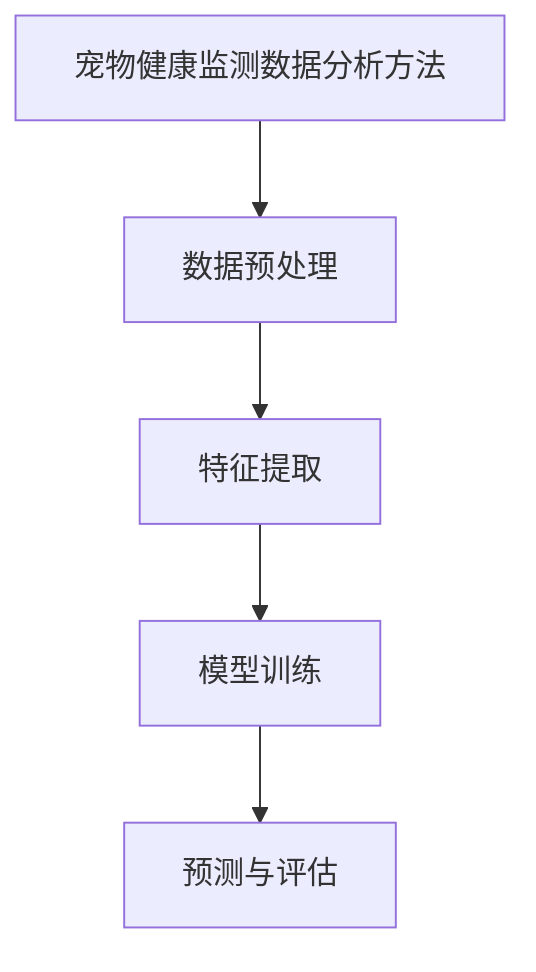

##### 2.4 宠物健康监测应用案例

宠物健康监测技术在实际应用中取得了显著的成果。以下是一些典型的宠物健康监测应用案例：

- 宠物医院：宠物医院利用宠物健康监测技术对宠物进行实时监测，提高诊断的准确性和治疗效果。
- 宠物主人：宠物主人通过宠物健康监测设备实现对宠物的远程监测，及时了解宠物的健康状况。
- 研究机构：研究机构利用宠物健康监测技术进行宠物健康相关的研究，为宠物行业提供科学依据。

以下是一个简单的宠物健康监测应用案例的Mermaid流程图：

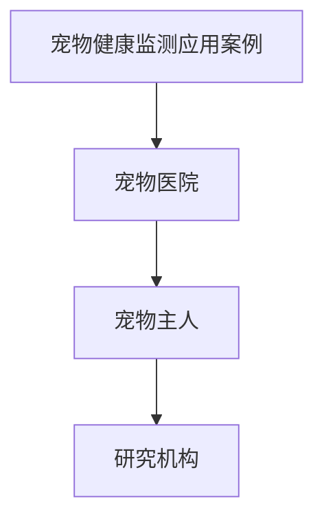

### 第二部分：宠物行为监测技术

##### 3.1 宠物行为监测的定义与意义

宠物行为监测是指通过技术手段对宠物的行为进行实时监测和评估，以便了解宠物的行为特征，发现潜在的行为问题。宠物行为监测对于宠物主人、宠物医院和研究机构都具有重要意义。

以下是一个简单的宠物行为监测定义与意义的Mermaid流程图：

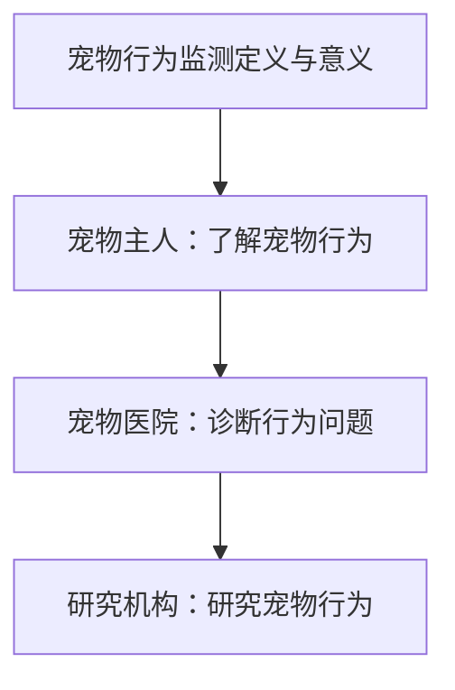

##### 3.2 宠物行为监测的技术与方法

宠物行为监测技术主要包括以下几种：

- 视频监控：通过摄像头实现对宠物行为的实时监控。
- 传感器监测：利用加速度传感器、GPS传感器等实现对宠物行为的位置、运动轨迹等信息的监测。
- 行为分析算法：利用机器学习和深度学习算法对宠物行为进行分析，识别宠物的行为特征。

以下是一个简单的宠物行为监测技术与方法的Mermaid流程图：

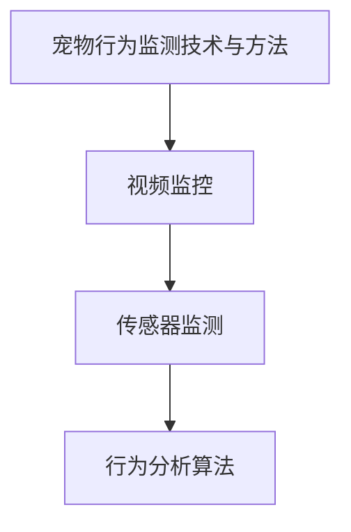

##### 3.3 宠物行为监测的应用场景

宠物行为监测技术可以在多个应用场景中发挥作用：

- 宠物看护：宠物主人可以通过宠物行为监测技术远程了解宠物的行为，确保宠物安全。
- 行为异常检测：通过宠物行为监测技术，可以及时发现宠物行为异常，提前采取措施。
- 宠物训练：宠物训练师可以利用宠物行为监测技术，分析宠物的行为表现，制定更有效的训练方案。

以下是一个简单的宠物行为监测应用场景的Mermaid流程图：

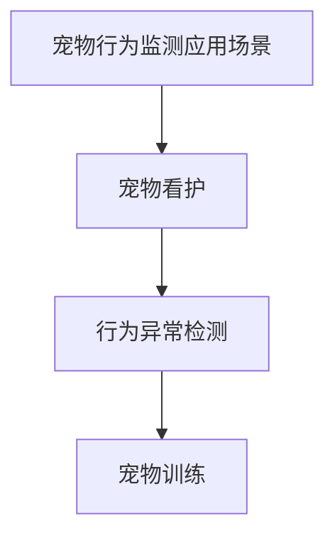

### 第三部分：聊天机器人在宠物行业中的应用

#### 4.1 聊天机器人在宠物健康咨询中的应用

聊天机器人在宠物健康咨询中的应用为宠物主人提供了一个便捷的沟通渠道。宠物主人可以通过聊天机器人咨询宠物的健康问题，获取专业的健康建议。

以下是一个简单的聊天机器人在宠物健康咨询中的应用场景的Mermaid流程图：

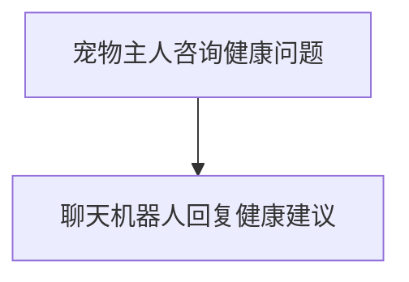

#### 4.2 聊天机器人在宠物行为咨询中的应用

除了健康咨询，聊天机器人还可以为宠物主人提供行为方面的建议。宠物主人可以通过聊天机器人了解宠物的行为特征，学习如何与宠物互动，培养良好的行为习惯。

以下是一个简单的聊天机器人在宠物行为咨询中的应用场景的Mermaid流程图：

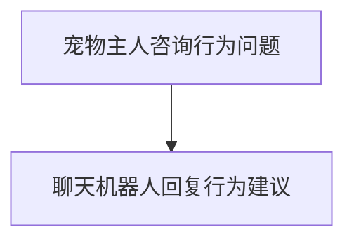

#### 4.3 聊天机器人在宠物服务预约中的应用

聊天机器人还可以帮助宠物主人预约宠物服务，如宠物医疗、宠物美容、宠物训练等。宠物主人可以通过聊天机器人选择服务类型、预约时间，并完成支付。

以下是一个简单的聊天机器人在宠物服务预约中的应用场景的Mermaid流程图：

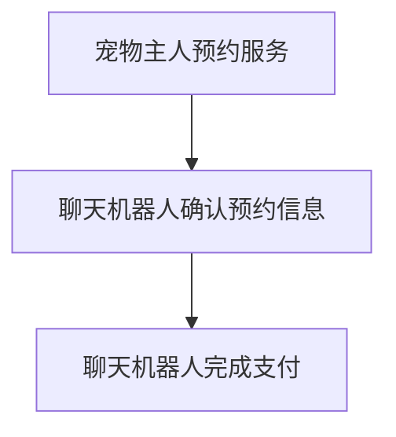

### 第四部分：宠物健康与行为监测系统的架构设计

#### 5.1 系统架构设计原则

宠物健康与行为监测系统的架构设计应遵循以下原则：

- 模块化设计：系统应采用模块化设计，便于功能的扩展和维护。
- 分布式架构：系统采用分布式架构，提高系统的可扩展性和容错性。
- 数据安全与隐私保护：系统应确保数据的安全性和隐私性，遵循相关法律法规。
- 高性能和高可用性：系统应具备高性能和高可用性，满足实时监测和大规模数据处理的需求。

以下是一个简单的系统架构设计原则的Mermaid流程图：

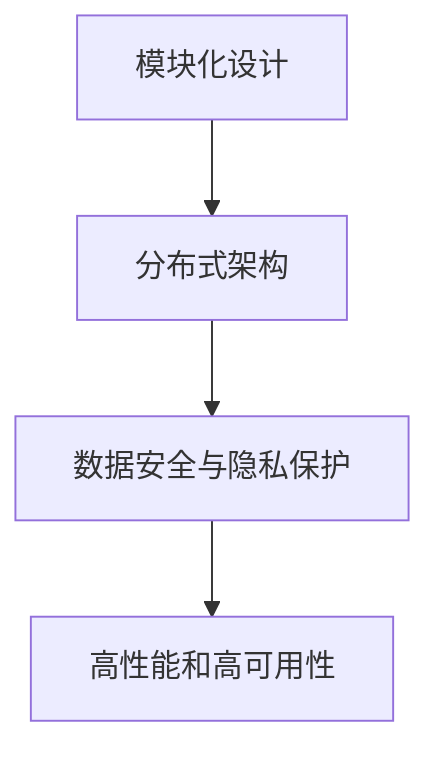

#### 5.2 系统功能模块划分

宠物健康与行为监测系统可以分为以下几个功能模块：

- 数据采集模块：负责采集宠物健康和行为数据。
- 数据处理模块：负责对采集到的数据进行处理和分析。
- 咨询模块：提供宠物健康和行为咨询功能。
- 预约模块：提供宠物服务预约功能。
- 用户管理模块：负责用户信息的注册、登录、权限管理等功能。

以下是一个简单的系统功能模块划分的Mermaid流程图：

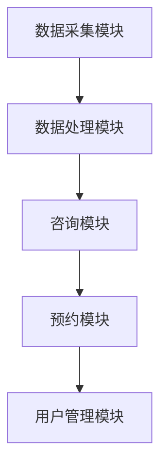

#### 5.3 系统关键技术

宠物健康与行为监测系统关键技术的选择至关重要，以下是几个关键技术的介绍：

- 数据采集技术：采用传感器和摄像头等设备进行数据采集。
- 数据处理技术：采用机器学习和深度学习算法对数据进行处理和分析。
- 自然语言处理技术：用于实现聊天机器人的对话功能。
- 数据存储技术：采用分布式数据库系统进行数据存储和管理。

以下是一个简单的系统关键技术的Mermaid流程图：

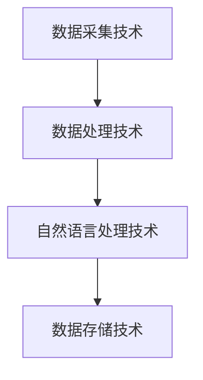

### 第五部分：宠物健康与行为监测系统的开发与实现

#### 6.1 开发环境与工具

宠物健康与行为监测系统的开发环境与工具如下：

- 开发环境：Python、Java等编程语言。
- 开发框架：Django、Spring Boot等。
- 数据库：MySQL、MongoDB等。
- 数据处理库：NumPy、Pandas等。
- 机器学习库：scikit-learn、TensorFlow、PyTorch等。

以下是一个简单的开发环境与工具的Mermaid流程图：

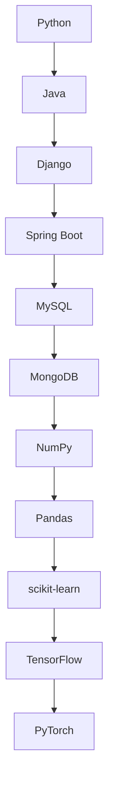

#### 6.2 系统开发流程

宠物健康与行为监测系统的开发流程如下：

1. 需求分析：明确系统的功能需求和性能要求。
2. 系统设计：根据需求分析结果，设计系统的架构和功能模块。
3. 数据采集与处理：设计数据采集方案，实现数据处理算法。
4. 前端开发：实现用户界面，提供便捷的操作体验。
5. 后端开发：实现系统功能，包括数据采集、处理、咨询、预约等。
6. 系统测试与优化：对系统进行功能测试和性能测试，优化系统性能。
7. 部署上线：将系统部署到生产环境，进行上线运行。

以下是一个简单的系统开发流程的Mermaid流程图：

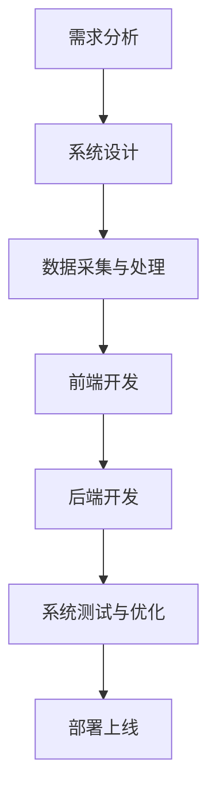

#### 6.3 系统功能模块详细实现

以下是宠物健康与行为监测系统功能模块的详细实现：

##### 数据采集与处理模块

数据采集与处理模块负责采集宠物健康和行为数据，并对数据进行预处理和特征提取。具体实现如下：

```python
# 数据采集与处理模块伪代码

# 数据采集
def collect_data():
    # 采集体温、心率、呼吸率等生理指标
    # 采集行为数据，如运动轨迹、行为动作等
    pass

# 数据预处理
def preprocess_data(data):
    # 数据清洗、过滤、转换
    pass

# 特征提取
def extract_features(data):
    # 从预处理后的数据中提取特征
    pass
```

##### 咨询模块

咨询模块提供宠物健康和行为咨询功能，用户可以通过聊天机器人获取专业建议。具体实现如下：

```python
# 咨询模块伪代码

# 咨询接口
def consult(question):
    # 根据用户问题，提供健康或行为建议
    pass
```

##### 预约模块

预约模块提供宠物服务预约功能，用户可以通过聊天机器人预约宠物医疗、宠物美容、宠物训练等服务。具体实现如下：

```python
# 预约模块伪代码

# 预约接口
def reserve_service(service, time):
    # 根据用户选择的服务类型和时间，进行预约
    pass
```

##### 用户管理模块

用户管理模块负责用户信息的注册、登录、权限管理等功能。具体实现如下：

```python
# 用户管理模块伪代码

# 注册接口
def register(user_info):
    # 注册新用户
    pass

# 登录接口
def login(user_info):
    # 用户登录
    pass

# 权限管理
def manage_permissions(user, permissions):
    # 管理用户权限
    pass
```

### 第六部分：宠物健康与行为监测系统的部署与优化

#### 7.1 系统部署方案

宠物健康与行为监测系统的部署方案如下：

- 部署环境：服务器、数据库、网络等硬件设备。
- 部署工具：Docker、Kubernetes等容器化工具。
- 部署流程：构建容器镜像、部署容器实例、配置负载均衡、监控与报警。

以下是一个简单的系统部署方案的Mermaid流程图：

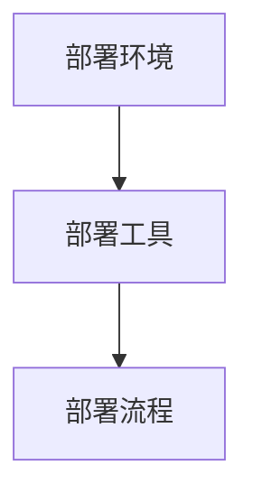

#### 7.2 系统性能优化

系统性能优化包括以下几个方面：

- 数据库性能优化：采用索引、缓存、分库分表等技术提高数据库性能。
- 代码优化：采用高效的算法和数据结构，减少内存占用和计算复杂度。
- 网络优化：采用负载均衡、CDN等技术提高网络传输性能。
- 缓存策略：采用缓存技术减少数据库访问次数，提高系统响应速度。

以下是一个简单的系统性能优化的Mermaid流程图：

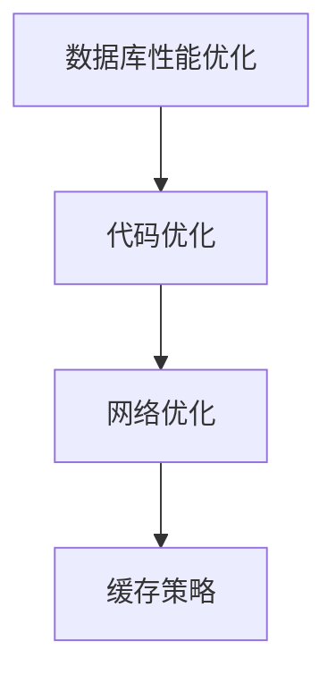

#### 7.3 系统安全性保障

系统安全性保障包括以下几个方面：

- 用户认证与授权：采用安全加密算法进行用户认证和权限管理。
- 数据安全：采用数据加密、备份等技术保障数据安全。
- 防护措施：采用防火墙、入侵检测、DDoS防护等技术防止网络攻击。
- 安全审计：定期进行安全审计，发现并解决安全隐患。

以下是一个简单的系统安全性保障的Mermaid流程图：

```mermaid
graph TB
    A[用户认证与授权] --> B[数据安全]
    B --> C[防护措施]
    C --> D[安全审计]
```

### 第七部分：宠物健康与行为监测项目实战

#### 8.1 项目背景与目标

本项目旨在利用聊天机器人和宠物健康与行为监测技术，为宠物主人提供便捷的宠物健康和行为咨询服务。项目目标包括：

- 构建一个智能的宠物健康与行为监测系统。
- 提供实时宠物健康监测功能。
- 提供宠物行为分析和建议。
- 提高宠物主人对宠物的关爱程度，降低宠物疾病发生率。

以下是一个简单的项目背景与目标的Mermaid流程图：

```mermaid
graph TB
    A[项目背景与目标] --> B[构建宠物健康与行为监测系统]
    B --> C[实时宠物健康监测功能]
    C --> D[宠物行为分析和建议]
    D --> E[提高宠物主人关爱程度]
```

#### 8.2 项目实施过程

项目实施过程分为以下几个阶段：

1. 需求分析：与宠物主人、宠物医院和宠物服务机构进行沟通，了解用户需求。
2. 系统设计：根据需求分析结果，设计系统的架构和功能模块。
3. 技术选型：选择合适的开发环境、工具和技术。
4. 数据采集与处理：设计数据采集方案，实现数据处理算法。
5. 前端开发：实现用户界面，提供便捷的操作体验。
6. 后端开发：实现系统功能，包括数据采集、处理、咨询、预约等。
7. 系统测试与优化：对系统进行功能测试和性能测试，优化系统性能。
8. 部署上线：将系统部署到生产环境，进行上线运行。

以下是一个简单的项目实施过程的Mermaid流程图：

```mermaid
graph TB
    A[需求分析] --> B[系统设计]
    B --> C[技术选型]
    C --> D[数据采集与处理]
    D --> E[前端开发]
    E --> F[后端开发]
    F --> G[系统测试与优化]
    G --> H[部署上线]
```

#### 8.3 项目效果评估

项目上线后，通过用户反馈和数据分析，对项目效果进行评估：

- 用户满意度：通过用户满意度调查，了解用户对系统的满意度。
- 疾病预防率：通过系统实时监测功能，降低宠物疾病发生率。
- 行为改善率：通过宠物行为分析，提高宠物主人的关爱程度，改善宠物行为。
- 咨询量：统计系统咨询量的变化，评估系统的实际应用效果。

以下是一个简单的项目效果评估的Mermaid流程图：

```mermaid
graph TB
    A[用户满意度] --> B[疾病预防率]
    B --> C[行为改善率]
    C --> D[咨询量]
```

### 第八部分：宠物健康与行为监测技术展望

#### 9.1 未来发展趋势

随着人工智能技术的不断进步，宠物健康与行为监测技术将朝着更加智能化、精准化和便捷化的方向发展。未来发展趋势包括：

- 智能化：利用深度学习和强化学习等技术，提高宠物健康与行为监测的准确性和效率。
- 精准化：通过大数据分析和个性化推荐，为宠物主人提供更加精准的健康和行为建议。
- 便捷化：通过物联网和5G技术，实现宠物健康与行为监测的实时性和远程性。

以下是一个简单的未来发展趋势的Mermaid流程图：

```mermaid
graph TB
    A[智能化] --> B[精准化]
    B --> C[便捷化]
```

#### 9.2 技术挑战与解决方案

宠物健康与行为监测技术在实际应用中面临以下挑战：

- 数据多样性和噪声处理：宠物健康与行为数据具有多样性和噪声，需要有效的数据预处理和噪声过滤技术。
- 实时性和可靠性：实时性和可靠性是宠物健康与行为监测系统的关键要求，需要优化算法和提升硬件性能。
- 隐私保护：宠物数据涉及隐私保护问题，需要采用加密和隐私保护技术。

以下是一个简单的技术挑战与解决方案的Mermaid流程图：

```mermaid
graph TB
    A[数据多样性和噪声处理] --> B[实时性和可靠性]
    B --> C[隐私保护]
```

#### 9.3 行业应用前景

宠物健康与行为监测技术在宠物行业具有广阔的应用前景：

- 宠物医疗：通过实时监测和预测宠物健康状况，提高宠物医疗服务的质量和效率。
- 宠物护理：提供个性化的宠物护理建议，提高宠物的生活质量和主人满意度。
- 宠物训练：利用行为分析技术，为宠物训练师提供科学依据，提高训练效果。
- 宠物保险：通过实时监测和评估宠物健康状况，为宠物保险提供数据支持，优化保险产品。

以下是一个简单的行业应用前景的Mermaid流程图：

```mermaid
graph TB
    A[宠物医疗] --> B[宠物护理]
    B --> C[宠物训练]
    C --> D[宠物保险]
```

### 附录

#### 附录A：宠物健康与行为监测相关资源

以下是一些宠物健康与行为监测相关的资源：

- 相关网站：
  - [宠物医疗网](https://www.petmed.com/)
  - [宠物行为学网](https://www.petbehaviornet.com/)

- 开源项目：
  - [PetHealthMonitor](https://github.com/PetHealthMonitor)
  - [PetBehaviorAnalysis](https://github.com/PetBehaviorAnalysis)

- 相关书籍：
  - 《宠物行为学原理与应用》
  - 《宠物医疗技术手册》

## 作者信息

作者：AI天才研究院/AI Genius Institute & 禅与计算机程序设计艺术/Zen And The Art of Computer Programming

