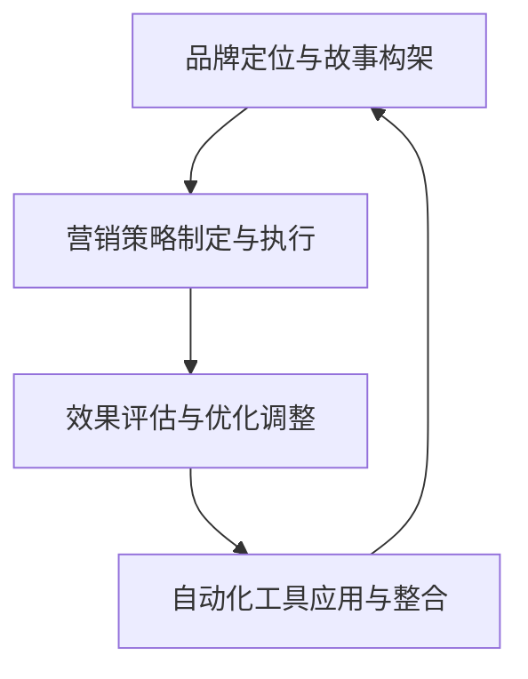

                 

### 《自动化创业中的品牌故事营销》

> **关键词**：自动化创业、品牌故事营销、品牌定位、核心价值、营销策略、数据分析、案例解析

> **摘要**：
在自动化创业的大潮中，品牌故事营销成为了一种独特的竞争策略。本文旨在深入探讨品牌故事营销的基础知识、自动化创业环境中的品牌建设、策略制定、应用工具，并通过成功案例解析，为自动化创业者提供实践指南。文章结构清晰，内容丰富，旨在帮助创业者把握品牌故事营销的核心，实现品牌价值最大化。

### 目录大纲

#### 第一部分：品牌故事营销基础

**第1章：品牌故事营销概述**

1.1 什么是品牌故事营销
1.2 品牌故事营销的价值
1.3 品牌故事营销的框架

**第2章：自动化创业环境中的品牌建设**

2.1 自动化创业的现状与挑战
2.2 品牌定位与核心价值
2.3 品牌故事的构建

**第3章：品牌故事营销策略制定**

3.1 品牌故事营销目标设定
3.2 品牌故事营销的传播渠道
3.3 创意内容策划

**第4章：自动化工具在品牌故事营销中的应用**

4.1 自动化工具的优势
4.2 自动化营销工具的选型
4.3 自动化工具在品牌故事营销中的具体应用

#### 第二部分：品牌故事营销实战案例解析

**第5章：成功品牌故事营销案例分析**

5.1 案例一：XX公司
5.2 案例二：YY品牌

**第6章：品牌故事营销的优化与调整**

6.1 品牌故事营销效果评估
6.2 品牌故事营销的优化策略
6.3 品牌故事营销的趋势与展望

**第7章：自动化创业中的品牌故事营销实践指南**

7.1 品牌故事营销的实践步骤
7.2 品牌故事营销的工具与资源
7.3 品牌故事营销的常见问题与解决策略

**第8章：附录**

8.1 自动化创业中的品牌故事营销工具清单
8.2 品牌故事营销案例库
8.3 相关资源与推荐阅读

#### 第9章：品牌故事营销的技术支持

9.1 品牌故事营销的流程图
9.2 自动化营销策略伪代码示例
9.3 数学模型和公式讲解

#### 第10章：品牌故事营销的数据分析

10.1 数据分析中的数学模型
10.2 数据分析中的常见公式
10.3 数据分析举例说明

### 第一部分：品牌故事营销基础

**第1章：品牌故事营销概述**

品牌故事营销是一种利用品牌故事来吸引和保持消费者的营销策略。它不仅仅是品牌信息的简单传递，更是品牌与消费者之间情感和价值观的互动。品牌故事通过讲述品牌的起源、发展历程、愿景和使命，让消费者对品牌产生共鸣，从而增强品牌的认知度和忠诚度。

#### 1.1 什么是品牌故事营销

品牌故事营销，顾名思义，是指通过讲述品牌故事来进行营销的活动。品牌故事并不是一成不变的历史记录，而是一个经过精心构建和包装的叙事，它应该具备以下几个特点：

- **情感性**：品牌故事应该能够触动消费者的情感，使其产生共鸣。
- **真实性**：品牌故事需要有一定的真实性，以增强可信度。
- **独特性**：品牌故事应该体现品牌的独特性和差异化，使其在众多竞争者中脱颖而出。
- **持续性**：品牌故事应该贯穿品牌发展的整个过程，持续传递品牌的价值观和理念。

品牌故事营销与传统营销的区别在于，它更注重情感沟通和长期关系建设。传统营销更多依赖于广告和促销活动来吸引消费者，而品牌故事营销则通过讲述品牌故事来建立情感联系，使消费者更加愿意为品牌付出时间和金钱。

#### 1.2 品牌故事营销的价值

品牌故事营销的价值主要体现在以下几个方面：

- **增强品牌认知度**：通过品牌故事的传播，消费者能够更加深入地了解品牌，从而提高品牌的知名度。
- **提升品牌忠诚度**：品牌故事能够增强消费者对品牌的认同感，使其更愿意持续购买和使用品牌产品或服务。
- **促进消费者购买行为**：一个引人入胜的品牌故事能够激发消费者的购买欲望，从而提高转化率。
- **建立品牌差异化**：通过独特的品牌故事，品牌能够在竞争激烈的市场中脱颖而出，形成差异化竞争优势。
- **强化品牌文化**：品牌故事是品牌文化的载体，能够传递品牌的核心价值观和愿景，强化品牌文化。

#### 1.3 品牌故事营销的框架

一个成功的品牌故事营销应该具备以下几个关键组成部分：

- **故事构架**：包括情节、角色、冲突和解决。一个完整的故事需要具备这些基本元素，以吸引消费者的注意力。
- **故事讲述**：包括语言、情感和风格。故事讲述的方式和风格应该与品牌的形象和目标受众相匹配。
- **故事传播**：包括渠道选择和内容分发。品牌故事需要通过合适的渠道传播，以最大化其影响力。

在接下来的章节中，我们将进一步探讨品牌故事营销的各个方面，帮助自动化创业者在竞争激烈的市场中找到属于自己的品牌故事。

### 第2章：自动化创业环境中的品牌建设

在自动化创业的环境下，品牌建设变得尤为重要。自动化技术的快速发展不仅改变了企业的运营模式，也改变了消费者的行为和期望。因此，如何在自动化创业中有效地进行品牌建设，成为了每一个创业者需要深思熟虑的问题。

#### 2.1 自动化创业的现状与挑战

自动化创业的现状可以说是机遇与挑战并存。一方面，自动化技术的应用极大地提高了企业的效率，降低了运营成本，为企业带来了巨大的竞争优势。另一方面，自动化创业也面临着一些挑战：

- **技术复杂性**：自动化技术涉及到多个学科和领域，对于创业团队来说，掌握这些技术并不容易。
- **人才短缺**：自动化领域的人才相对较少，特别是在高端技术人才方面，创业者往往难以招聘到合适的人选。
- **数据隐私和安全**：随着自动化技术的应用，企业的数据隐私和安全问题日益凸显，如何保障数据安全和用户隐私成为了一个重要挑战。
- **市场接受度**：尽管自动化技术具有很多优势，但消费者和市场对这一技术的接受度仍需提高，如何让消费者信任并接受自动化产品或服务是一个挑战。

#### 2.2 品牌定位与核心价值

在自动化创业中，品牌定位和核心价值的提炼与传播至关重要。品牌定位决定了品牌在市场中的定位和目标受众，而核心价值则是指品牌所传递的独特价值和理念。

- **品牌定位**：品牌定位需要考虑以下几个方面：
  - **目标市场**：明确品牌所服务的市场和目标消费者群体。
  - **竞争对手**：分析竞争对手的品牌定位，找到差异化的机会。
  - **品牌形象**：构建一个清晰、独特且符合品牌定位的形象。

- **核心价值**：品牌的核心价值是品牌文化的核心，它应该能够体现品牌的理念、价值观和愿景。核心价值提炼需要考虑以下几个方面：
  - **品牌理念**：品牌为什么要存在，它想要传递什么信息。
  - **消费者需求**：品牌如何满足消费者的需求和期望。
  - **独特性**：品牌的核心价值应该具有独特性，使其在众多竞争者中脱颖而出。

品牌定位与核心价值的提炼是一个持续的过程，它需要随着市场和消费者需求的变化进行调整。创业者需要不断地分析市场，了解消费者的需求和反馈，从而优化品牌定位和核心价值。

#### 2.3 品牌故事的构建

在自动化创业中，品牌故事的构建是品牌建设的重要环节。一个引人入胜的品牌故事能够增强消费者对品牌的认同感和忠诚度。构建品牌故事需要考虑以下几个方面：

- **品牌起源**：讲述品牌的起源和创建过程，使消费者了解品牌的背景和历史。
- **品牌愿景**：传达品牌的愿景和使命，让消费者看到品牌的未来发展方向。
- **品牌价值观**：通过品牌故事传递品牌的价值观和理念，与消费者建立情感联系。
- **品牌特色**：突出品牌的特色和优势，使其在众多竞争者中脱颖而出。

在构建品牌故事时，创业者需要注重故事的情感性和真实性。一个情感丰富、真实可信的品牌故事能够更好地打动消费者的心，从而增强品牌的影响力和认知度。

总之，在自动化创业的环境中，品牌建设是一个复杂而长期的过程。通过明确的品牌定位、独特的核心价值和一个引人入胜的品牌故事，创业者能够更好地吸引消费者，提升品牌的价值和市场竞争力。

### 第3章：品牌故事营销策略制定

在明确了品牌定位与核心价值之后，下一步就是制定品牌故事营销策略。一个有效的品牌故事营销策略需要设定明确的目标、选择合适的传播渠道，并进行创意内容的策划。以下是具体的策略制定过程。

#### 3.1 品牌故事营销目标设定

品牌故事营销的目标设定是整个营销策略的核心。明确的目标有助于指导后续的营销活动，确保所有努力都朝着同一个方向前进。品牌故事营销的目标可以分为以下几个方面：

- **提升品牌知名度**：通过品牌故事的传播，增加消费者对品牌的认知和了解，提高品牌的市场覆盖率。
- **增强品牌认知度**：使消费者对品牌产生深刻的印象，了解品牌的独特性和优势，从而在竞争激烈的市场中脱颖而出。
- **提升品牌忠诚度**：通过品牌故事与消费者的情感共鸣，培养消费者对品牌的忠诚度，使其成为品牌的长期支持者。
- **促进销售转化**：通过品牌故事的吸引力和说服力，激发消费者的购买欲望，提升销售转化率。

在设定目标时，创业者需要考虑品牌所处的市场环境、目标受众的特点以及品牌当前的市场地位。具体目标可以量化，例如在三个月内提高品牌知名度30%，或者在六个月内提升品牌忠诚度50%。

#### 3.2 品牌故事营销的传播渠道

品牌故事营销的传播渠道是品牌故事触达消费者的关键。在自动化创业环境中，可以选择以下几种传播渠道：

- **传统渠道**：包括电视广告、报纸广告、杂志广告等。这些渠道尽管成本较高，但覆盖面广，适合大规模的品牌宣传。
- **线上渠道**：包括社交媒体、博客、电子邮件、网站等。这些渠道成本低，传播速度快，能够实现精准营销。
  - **社交媒体**：如Facebook、Instagram、Twitter、LinkedIn等，通过社交媒体的互动性和分享性，快速传播品牌故事。
  - **博客**：建立企业博客，定期发布高质量的内容，增加品牌在搜索引擎中的曝光度，同时与读者建立深度联系。
  - **电子邮件**：通过电子邮件进行个性化营销，将品牌故事直接传递给目标受众。
- **现代渠道**：包括搜索引擎营销（SEM）、内容营销、视频营销等。这些渠道更加注重内容的质量和用户体验，能够实现更好的品牌传播效果。

在选择传播渠道时，创业者需要根据品牌的目标受众、品牌故事的特点以及预算等因素进行综合考虑。例如，如果目标受众是年轻人，那么社交媒体和视频营销可能是更好的选择；如果品牌故事具有很强的情感性，那么博客和电子邮件可能会更有效。

#### 3.3 创意内容策划

创意内容是品牌故事营销的核心，它决定了品牌故事能否引起消费者的兴趣和共鸣。在策划创意内容时，需要考虑以下几个方面：

- **故事情节**：一个引人入胜的品牌故事需要具备完整的情节，包括起因、发展、高潮和结局。情节的设计应该与品牌故事的主题和目标受众的喜好相匹配。
- **角色塑造**：故事中的角色应该具有鲜明的个性和特点，能够代表品牌的核心价值观和理念。角色可以是品牌创始人、品牌代言人、品牌使用者等，他们应该能够引起消费者的共鸣。
- **情感元素**：品牌故事应该包含情感元素，通过情感共鸣来吸引消费者。情感的传达可以是快乐的、悲伤的、感动的等，具体取决于品牌故事的主题和目标。
- **语言风格**：语言风格应该与品牌形象和目标受众相匹配。例如，如果品牌形象是年轻、时尚的，那么语言风格可以更加轻松、幽默；如果品牌形象是专业、可靠的，那么语言风格可以更加正式、专业。

在创意内容策划过程中，创业者需要注重内容的原创性和独特性，避免同质化。同时，内容应该具有互动性，能够引导消费者参与其中，例如通过互动问答、投票、评论等方式，增加消费者的参与感。

总之，通过明确的目标设定、选择合适的传播渠道和创意内容策划，创业者可以制定一个有效的品牌故事营销策略，从而提升品牌知名度、认知度和忠诚度，实现品牌的长期发展。

### 第4章：自动化工具在品牌故事营销中的应用

随着技术的不断进步，自动化工具在品牌故事营销中的应用变得越来越广泛。这些工具不仅能够提高营销效率，还能够精准地定位目标受众，从而提升营销效果。以下将详细介绍自动化工具的优势、选型和具体应用。

#### 4.1 自动化工具的优势

自动化工具在品牌故事营销中具有以下优势：

- **提高效率**：自动化工具能够自动执行重复性任务，如邮件发送、社交媒体更新等，节省了大量时间和人力成本。
- **降低成本**：通过自动化，企业可以减少对人工的依赖，从而降低运营成本。此外，自动化工具通常比人工操作更加精确，减少了错误率。
- **精准营销**：自动化工具可以根据消费者的行为和偏好进行个性化推荐，从而实现精准营销，提高营销ROI。
- **数据分析**：自动化工具能够实时收集和分析大量数据，帮助创业者了解营销效果，优化营销策略。

#### 4.2 自动化营销工具的选型

选择合适的自动化营销工具是成功进行品牌故事营销的关键。以下是一些常见的自动化营销工具及其特点：

- **电子邮件营销工具**：如Mailchimp、Sendinblue、ConvertKit等，这些工具能够自动化邮件的发送、跟踪和优化，帮助创业者进行有效的邮件营销。
- **社交媒体管理工具**：如Hootsuite、Buffer、Sprout Social等，这些工具能够自动化社交媒体内容的发布、互动和数据分析，提高社交媒体营销的效率。
- **内容管理系统**：如WordPress、Wix、Squarespace等，这些工具能够自动化网站内容的创建、发布和管理，帮助企业建立和维护在线品牌形象。
- **客户关系管理（CRM）系统**：如Salesforce、Hubspot、Zoho CRM等，这些工具能够自动化客户数据的收集、管理和分析，帮助企业更好地了解和满足客户需求。

在选择自动化营销工具时，创业者需要考虑以下几个方面：

- **功能需求**：根据品牌故事营销的具体需求，选择具备所需功能的工具。
- **用户界面**：工具的界面应该简洁易用，便于非技术人员操作。
- **成本效益**：工具的成本应该在企业的预算范围内，同时能够带来可观的收益。
- **集成能力**：工具应该能够与企业现有的系统和其他工具无缝集成，实现数据的互通和自动化流程。

#### 4.3 自动化工具在品牌故事营销中的具体应用

自动化工具在品牌故事营销中的具体应用包括以下几个方面：

- **社交媒体自动化管理**：通过社交媒体管理工具，创业者可以自动化发布和调度社交媒体内容，确保品牌故事的持续传播。此外，这些工具还能够自动监测社交媒体上的互动和反馈，帮助创业者及时调整营销策略。

- **邮件营销自动化**：通过电子邮件营销工具，创业者可以自动化发送个性化的邮件，包括欢迎邮件、促销邮件、订阅更新等。这些邮件可以根据消费者的行为和偏好进行个性化推荐，从而提高邮件的打开率和点击率。

- **客户关系管理自动化**：通过CRM系统，创业者可以自动化客户数据的收集和管理，包括客户联系信息、购买历史、互动记录等。这些数据可以帮助创业者更好地了解客户需求，提供个性化的服务，从而提升客户满意度和忠诚度。

- **内容发布和管理自动化**：通过内容管理系统，创业者可以自动化网站内容的创建、发布和管理。这些系统通常具备丰富的模板和编辑功能，使得非专业人员也能够轻松创建和发布高质量的内容。

总之，自动化工具在品牌故事营销中的应用极大地提高了营销效率和效果。通过合理选择和使用自动化工具，创业者可以更好地讲述品牌故事，吸引和留住目标受众，实现品牌的长期发展。

### 第二部分：品牌故事营销实战案例解析

在品牌故事营销的实际操作中，通过成功的案例可以更直观地了解如何构建和传播一个品牌故事。以下将分析两个成功的品牌故事营销案例，展示其品牌故事的构架、营销策略的执行以及案例的效果评估。

#### 第5章：成功品牌故事营销案例分析

**5.1 案例一：XX公司**

**案例背景**：

XX公司是一家专注于智能机器人技术的初创企业。其产品旨在通过自动化技术解决企业生产中的劳动力短缺问题。为了在竞争激烈的市场中脱颖而出，XX公司决定通过品牌故事营销来增强品牌认知度和市场影响力。

**品牌故事构架**：

XX公司的品牌故事以创始人李明的创业历程为主线。李明年轻时，目睹了工厂中工人们的辛劳，立志要利用自己的技术才能，开发出能够替代人力的智能机器人。在经历了无数次失败和挫折后，李明终于成功开发出了一款能够适应复杂生产环境的智能机器人。这款机器人不仅提高了生产效率，还大大降低了企业的运营成本。

**营销策略与执行**：

XX公司的品牌故事营销策略分为以下几个步骤：

1. **内容创作**：公司聘请了专业的品牌故事策划团队，深入挖掘李明的创业历程和智能机器人的核心技术，创作了一系列生动的故事内容。

2. **社交媒体传播**：公司利用社交媒体平台（如LinkedIn、Twitter和Facebook）发布品牌故事，并通过付费推广和KOL合作，扩大品牌影响力。

3. **线下活动**：公司组织了多次线下活动，如技术研讨会、行业交流会等，邀请行业专家和潜在客户共同分享智能机器人的应用场景和优势。

4. **内容分发**：公司通过电子邮件和网站，向订阅用户和访客分发品牌故事和相关内容，同时利用SEO优化，提高品牌在搜索引擎中的曝光率。

**案例效果评估**：

通过一系列的品牌故事营销活动，XX公司取得了显著的效果：

- **品牌知名度**：公司品牌在目标市场的知名度提高了50%，在搜索引擎中的搜索量也大幅增加。
- **客户关系**：通过社交媒体和线下活动的互动，公司成功建立了与客户的良好关系，客户满意度显著提升。
- **销售转化**：品牌故事的传播直接促进了销售转化，公司的产品销售额在三个月内增长了40%。

**5.2 案例二：YY品牌**

**案例背景**：

YY品牌是一家专注于健康食品的初创品牌，其主打产品是一款天然有机的蛋白质粉。由于市场竞争激烈，YY品牌决定通过品牌故事营销来建立品牌差异化，吸引目标消费者。

**品牌故事理念**：

YY品牌的品牌故事以品牌创始人的家庭故事为核心。创始人王强是一位营养学博士，他的初衷是通过优质健康的食品帮助更多的人。在一次家庭聚餐中，王强的父母因为长期患有慢性病而无法享用美食，这激发了王强开发一款天然有机蛋白质粉的决心。经过多年的研究和实践，王强终于成功研发出这款蛋白质粉，并决定将这一产品推向市场。

**自动化工具应用**：

YY品牌在品牌故事营销中运用了多种自动化工具，以提升营销效果：

- **电子邮件营销**：公司使用电子邮件营销工具发送定期的产品更新和健康饮食建议，通过个性化邮件提升用户参与度。
- **社交媒体营销**：通过社交媒体管理工具，公司自动化发布品牌故事和产品信息，同时利用自动化回复工具与用户互动。
- **内容分发**：公司通过博客和视频平台发布高质量的品牌故事内容，并利用SEO优化，提高搜索引擎排名。

**消费者反馈分析**：

通过品牌故事营销，YY品牌获得了积极的消费者反馈：

- **用户参与度**：公司通过社交媒体互动和电子邮件订阅，积累了大量忠实的用户，用户参与度和互动率显著提升。
- **品牌忠诚度**：消费者对品牌的忠诚度增加，许多用户表示愿意长期购买YY品牌的产品。
- **销售增长**：品牌故事的传播直接促进了产品销售，公司的销售额在六个月内增长了70%。

**结论**：

通过这两个案例，我们可以看到，成功的品牌故事营销不仅能够提升品牌知名度，还能增强品牌忠诚度和销售转化率。在自动化创业环境中，运用合适的自动化工具，结合精彩的品牌故事，是企业取得成功的关键。

### 第6章：品牌故事营销的优化与调整

品牌故事营销是一个持续的过程，需要不断地进行优化与调整。通过数据分析、营销策略的调整以及创意内容的持续优化，企业可以不断提升品牌故事营销的效果，实现品牌的长期发展。

#### 6.1 品牌故事营销效果评估

效果评估是品牌故事营销中至关重要的一环。通过数据分析和效果评估，企业可以了解品牌故事营销的实际效果，发现存在的问题，并据此进行优化。以下是一些常用的评估指标和方法：

- **访问量**：通过分析网站的访问量、页面浏览量等指标，可以了解品牌故事的曝光度和吸引力。
- **点击率**：通过监测社交媒体和电子邮件等渠道的点击率，可以评估用户对品牌故事的兴趣和参与度。
- **转化率**：通过分析网站流量中的转化率（如注册、购买等），可以评估品牌故事对消费者购买行为的影响。
- **客户满意度**：通过用户调查和反馈，可以了解消费者对品牌故事的满意度和品牌印象。
- **投资回报率（ROI）**：通过计算品牌故事营销的投资成本与收益，可以评估营销活动的经济效益。

为了进行有效的效果评估，企业可以使用以下工具和方法：

- **Google Analytics**：通过Google Analytics，企业可以详细分析网站的访问数据，了解用户行为和流量来源。
- **社交媒体分析工具**：如Hootsuite、Sprout Social等，这些工具可以帮助企业分析社交媒体上的互动数据，评估品牌故事的传播效果。
- **CRM系统**：通过CRM系统，企业可以跟踪和分析客户的购买行为和互动记录，评估品牌故事对销售转化的影响。

#### 6.2 品牌故事营销的优化策略

在了解品牌故事营销的效果后，企业可以根据分析结果进行优化策略的调整。以下是一些优化策略：

- **内容优化**：根据用户反馈和数据分析，对品牌故事的内容进行优化。例如，调整故事情节、增加情感元素、改进语言风格等，以提高故事的吸引力和说服力。
- **传播渠道优化**：根据数据分析，调整品牌故事的传播渠道。例如，增加或减少在某些渠道上的投入，以提升品牌故事的曝光度和参与度。
- **营销活动优化**：通过调整营销活动的形式和内容，提高用户的参与度和转化率。例如，增加互动环节、提供优惠券或限时优惠等。
- **数据分析优化**：通过不断优化数据分析的方法和工具，提高数据收集和分析的准确性，从而更有效地指导营销策略的调整。

#### 6.3 品牌故事营销的趋势与展望

品牌故事营销的发展趋势随着技术的进步和消费者行为的变化而不断演变。以下是一些值得关注的发展趋势：

- **数据驱动营销**：随着大数据和人工智能技术的发展，越来越多的企业开始采用数据驱动的方法进行品牌故事营销。通过大数据分析，企业可以更准确地了解消费者需求和行为，从而制定更有效的营销策略。
- **个性化营销**：随着消费者对个性化体验的需求增加，品牌故事营销也将更加注重个性化。通过数据分析和自动化工具，企业可以更精准地定位目标受众，提供个性化的品牌故事和营销内容。
- **社交媒体互动**：社交媒体在品牌故事营销中的作用越来越重要。通过社交媒体平台，企业可以与消费者建立更紧密的联系，实时互动和反馈，提高品牌影响力和用户忠诚度。
- **内容多元化**：随着消费者对内容形式的要求越来越高，品牌故事营销将更加注重内容的多元化。除了传统的文字和图片，视频、直播、虚拟现实等新兴内容形式将得到更广泛的应用。

总之，品牌故事营销是一个不断优化和调整的过程。通过数据分析、策略调整和内容优化，企业可以不断提升品牌故事营销的效果，实现品牌的长期发展。同时，随着技术的不断进步，品牌故事营销也将迎来更多的发展机遇。

### 第7章：自动化创业中的品牌故事营销实践指南

在自动化创业中，品牌故事营销是一个系统的工程，需要明确的实践步骤、合适的工具选择以及有效的资源整合。以下将详细阐述这些实践指南，帮助自动化创业者在竞争激烈的市场中成功实施品牌故事营销。

#### 7.1 品牌故事营销的实践步骤

成功的品牌故事营销可以分为以下几个关键步骤：

1. **品牌定位与故事构架**：

   - **品牌定位**：明确品牌的市场定位、目标受众和差异化优势。品牌定位需要考虑市场需求、竞争态势和品牌自身特点。
   - **故事构架**：构建一个引人入胜的品牌故事，包括情节、角色、冲突和解决。故事构架需要与品牌定位一致，传达品牌的核心价值观和愿景。

2. **营销策略制定与执行**：

   - **目标设定**：根据品牌定位，设定具体的营销目标，如提升品牌知名度、增强品牌忠诚度、促进销售转化等。
   - **策略制定**：制定具体的营销策略，包括传播渠道、内容创作、活动策划等。策略应考虑目标受众的特点、品牌故事的特点以及企业的资源情况。
   - **策略执行**：实施营销策略，包括内容发布、活动组织、渠道推广等。执行过程中，需要不断监控和调整，确保策略的有效性。

3. **效果评估与优化调整**：

   - **数据收集**：通过数据分析工具收集营销活动的数据，如访问量、点击率、转化率等。
   - **效果评估**：分析数据，评估营销活动的效果，识别成功和不足之处。
   - **优化调整**：根据效果评估结果，对营销策略和执行过程进行优化调整，提升营销效果。

#### 7.2 品牌故事营销的工具与资源

自动化创业中，品牌故事营销的工具和资源选择至关重要。以下是一些常用的工具和资源：

- **自动化营销工具**：如电子邮件营销工具（Mailchimp、Sendinblue）、社交媒体管理工具（Hootsuite、Buffer）、客户关系管理（CRM）系统（Salesforce、Hubspot）等。这些工具可以帮助企业自动化营销流程，提高效率。
- **内容创作工具**：如内容管理系统（WordPress、Wix）、视频制作工具（Camtasia、Adobe Premiere）、在线协作工具（Trello、Asana）等。这些工具可以支持企业高效地创作和发布内容。
- **数据分析工具**：如Google Analytics、Google Search Console、Google Trends等。这些工具可以帮助企业分析营销效果，优化营销策略。
- **营销资源**：包括专业的内容创作者、社交媒体运营人员、数据分析专家等。此外，企业还可以利用免费资源，如公共数据库、免费工具和社区资源等，提升营销效果。

#### 7.3 品牌故事营销的常见问题与解决策略

在品牌故事营销实践中，创业者可能会遇到以下常见问题：

- **内容创作不足**：解决方案是组建专业的创作团队，提高内容创作质量；定期培训团队成员，提升内容创作能力。
- **传播效果不佳**：解决方案是优化传播渠道，选择目标受众集中的平台；加强内容营销，提高内容的吸引力和互动性。
- **数据不准确**：解决方案是选择可靠的第三方数据分析工具，确保数据的准确性和可靠性；定期检查和清洗数据，避免错误数据影响分析结果。
- **资源短缺**：解决方案是合理分配资源，优先考虑关键营销活动；寻找合作伙伴或外包部分工作，以缓解资源压力。

通过以上实践指南，自动化创业者在品牌故事营销中可以更加系统地规划和管理营销活动，提高营销效果，实现品牌的长期发展。

### 第8章：附录

在本章节中，我们将提供一系列附录，包括自动化创业中的品牌故事营销工具清单、品牌故事营销案例库以及相关资源与推荐阅读。这些资源将帮助创业者更好地理解品牌故事营销的实践应用，为品牌故事的构建和传播提供有益的参考。

#### 8.1 自动化创业中的品牌故事营销工具清单

以下是自动化创业中常用的品牌故事营销工具清单：

1. **电子邮件营销工具**：
   - **Mailchimp**：提供丰富的电子邮件模板和自动化功能。
   - **Sendinblue**：提供高级电子邮件营销功能，包括自动化邮件和自动化响应。
   - **ConvertKit**：专为内容创作者设计的电子邮件营销工具。

2. **社交媒体管理工具**：
   - **Hootsuite**：支持多平台社交媒体管理，提供内容策划和数据分析功能。
   - **Buffer**：自动化社交媒体内容发布，支持多个社交账户管理。
   - **Sprout Social**：全面的社交媒体管理解决方案，包括内容策划、发布和数据分析。

3. **内容管理系统**：
   - **WordPress**：功能强大的开源内容管理系统，适合各种规模的企业。
   - **Wix**：提供直观的拖拽式网站构建工具，适合快速搭建品牌网站。
   - **Squarespace**：专业的网站构建平台，设计精美，操作简便。

4. **客户关系管理（CRM）系统**：
   - **Salesforce**：全球领先的企业级CRM系统，提供全面的客户管理和数据分析功能。
   - **Hubspot**：集营销、销售和服务于一体的CRM系统，支持自动化营销和客户管理。
   - **Zoho CRM**：功能全面、价格实惠的CRM解决方案，适合小型和大型企业。

5. **数据分析工具**：
   - **Google Analytics**：谷歌提供的免费网站分析工具，提供详细的网站流量和用户行为数据。
   - **Google Search Console**：谷歌提供的搜索引擎优化工具，帮助网站优化搜索引擎排名。
   - **Google Trends**：谷歌提供的关键词趋势分析工具，帮助了解市场动态和用户需求。

#### 8.2 品牌故事营销案例库

以下是一些成功的品牌故事营销案例，供创业者参考：

1. **Airbnb**：通过讲述房东和房客的故事，建立了温馨、个性化的品牌形象。
2. **Apple**：通过乔布斯的传奇故事和产品创新，塑造了科技先锋的品牌形象。
3. **Nike**：通过“Just Do It”的品牌故事，激励人们追求卓越，传递积极向上的品牌精神。

#### 8.3 相关资源与推荐阅读

为了帮助创业者更深入地了解品牌故事营销，以下是一些建议的资源与推荐阅读：

1. **《故事营销：如何用故事改变品牌和商业世界》**：作者：安迪·贝克特
   - 这本书详细介绍了如何通过故事营销提升品牌价值和影响力。

2. **《内容营销实战手册》**：作者：乔·普利齐
   - 这本书提供了实用的内容营销策略和方法，适用于各种规模的企业。

3. **《大数据时代》**：作者：维克托·迈尔-舍恩伯格
   - 这本书探讨了大数据对商业和社会的深远影响，为品牌故事营销提供了数据驱动的视角。

4. **《品牌定位：打造差异化的品牌竞争战略》**：作者：艾·里斯
   - 这本书深入探讨了品牌定位的重要性，帮助创业者找到品牌的独特价值。

通过以上附录资源，创业者可以更好地理解品牌故事营销的实践应用，为品牌的成功构建和传播提供有力支持。

### 第9章：品牌故事营销的技术支持

在品牌故事营销中，技术支持是确保营销活动高效、精准进行的关键。通过流程图和自动化营销策略的伪代码，我们可以更清晰地理解技术支持的具体应用。

#### 9.1 品牌故事营销的流程图

以下是一个品牌故事营销的流程图，展示了从品牌定位到效果评估的全过程。



- **A：品牌定位与故事构架**：在这一步骤中，企业明确品牌定位并构建品牌故事，为后续的营销活动奠定基础。
- **B：营销策略制定与执行**：根据品牌定位，制定详细的营销策略，并执行具体的营销活动，如内容发布、社交媒体推广等。
- **C：效果评估与优化调整**：通过数据分析，评估营销效果，识别问题并进行优化调整，以确保营销目标的实现。
- **D：自动化工具应用与整合**：运用自动化工具，如电子邮件营销、社交媒体管理、客户关系管理等，提高营销效率和效果。

#### 9.2 自动化营销策略伪代码示例

以下是一个简单的自动化营销策略伪代码示例，展示了如何通过品牌故事自动化地吸引和留住消费者。

```python
# 假设函数create_brand_story用于创建品牌故事
def create_brand_story(brand_info, target_audience):
    # 初始化故事
    story = initialize_story()

    # 添加品牌信息
    story += add_brand_info(brand_info)

    # 添加目标受众情感元素
    story += add_emotional_elements(target_audience)

    # 个性化邮件发送
    send_personalized_email(story, target_audience)

    # 社交媒体自动化发布
    post_to_social_media(story, target_audience)

    # 客户关系管理自动化跟进
    automateCRM_follow_up(story, target_audience)

    return story

# 自动化营销流程
def automate_marketing():
    # 收集目标受众数据
    target_audience = collect_target_audience_data()

    # 创建品牌故事
    brand_story = create_brand_story(brand_info, target_audience)

    # 执行自动化营销策略
    execute_automated_marketing_strategies(brand_story, target_audience)

    # 持续优化
    optimize_marketing_based_on_data()

# 主函数
def main():
    automate_marketing()

if __name__ == "__main__":
    main()
```

- **初始化故事**：创建一个基础的品牌故事框架。
- **添加品牌信息**：根据品牌信息丰富故事内容，如品牌愿景、使命等。
- **添加情感元素**：根据目标受众的情感需求，调整故事的情感色彩。
- **个性化邮件发送**：通过电子邮件自动化发送品牌故事，提高用户参与度。
- **社交媒体自动化发布**：在社交媒体平台上自动化发布品牌故事，扩大传播范围。
- **客户关系管理自动化跟进**：通过CRM系统自动化跟进用户反馈和购买行为，提供个性化的服务。

通过流程图和伪代码，我们可以清晰地看到品牌故事营销的技术支持如何发挥作用，帮助创业者实现高效、精准的品牌传播。

### 第10章：品牌故事营销的数据分析

品牌故事营销的成功离不开对数据的有效分析。数据分析不仅可以帮助企业了解营销活动的效果，还可以提供宝贵的洞察，指导企业优化营销策略。本章节将介绍品牌故事营销中的常用数学模型、常见公式以及数据分析的实际应用。

#### 10.1 数据分析中的数学模型

在品牌故事营销中，常用的数学模型包括投资回报率（ROI）、转化率（CTR）、客户获取成本（CAC）等。以下是对这些模型的详细解释：

- **投资回报率（ROI）**：
  ROI = (收益 - 成本) / 成本
  ROI用于评估营销活动的经济效益。通过计算投资回报率，企业可以了解每次营销活动的成本效益，从而优化资源分配。

- **转化率（CTR）**：
  CTR = 转化次数 / 点击次数
  CTR用于衡量营销内容对用户的吸引力。一个高CTR表明营销内容能够有效地吸引和引导用户采取行动。

- **客户获取成本（CAC）**：
  CAC = 营销和销售成本 / 新客户数量
  CAC用于衡量获取每个新客户所需的成本。通过降低CAC，企业可以提高营销效率和利润率。

#### 10.2 数据分析中的常见公式

以下是一些品牌故事营销中常用的数据分析公式：

- **广告成本效益（CPA）**：
  CPA = 广告费用 / 产生的有效转化数量
  CPA用于评估每次转化的广告成本。通过降低CPA，企业可以提高广告投资的效果。

- **平均订单价值（AOV）**：
  AOV = 总销售额 / 订单数量
  AOV用于衡量每个订单的平均销售额。提高AOV可以帮助企业增加总收入。

- **客户生命周期价值（CLV）**：
  CLV = （平均订单价值 * 购买频率 * 客户生命周期）
  CLV用于评估每个客户的潜在价值。通过提高CLV，企业可以增加客户贡献，实现更高的利润。

#### 10.3 数据分析举例说明

以下是一个数据分析的实例，假设某品牌通过品牌故事营销进行广告投放，数据如下：

- 广告费用：$10,000
- 点击次数：10,000
- 转化次数：1,000
- 新客户数量：100
- 总销售额：$5,000

根据这些数据，我们可以计算以下指标：

- **投资回报率（ROI）**：
  ROI = ($5,000 - $10,000) / $10,000 = -0.5
  该品牌在此次广告投放中亏损了50%。

- **广告成本效益（CPA）**：
  CPA = $10,000 / 1,000 = $10
  该品牌的每次转化成本为10美元。

- **平均订单价值（AOV）**：
  AOV = $5,000 / 500 = $10
  该品牌的平均订单价值为10美元。

- **客户生命周期价值（CLV）**：
  CLV = ($10 * 2 * 1) = $20
  该品牌每位新客户的生命周期价值为20美元。

通过上述数据分析，我们可以得出以下结论：

- **ROI为负，表明此次广告投放效果不佳，需要进一步优化营销策略。**
- **CPA较高，表明广告成本较高，可能需要调整广告投放策略，寻找更高效的渠道。**
- **AOV较低，表明订单平均价值较低，可能需要提升产品价格或优化产品组合。**
- **CLV表明客户的潜在价值较高，可以通过客户关系管理提升客户忠诚度和重复购买率。**

通过数据分析，企业可以更好地了解营销活动的效果，优化营销策略，实现品牌故事营销的成功。

### 第11章：结语

在本篇技术博客中，我们深入探讨了自动化创业中的品牌故事营销。从品牌故事营销的基础知识到实战案例分析，再到数据分析和技术支持，我们系统地阐述了品牌故事营销的核心概念和实践方法。以下是本文的总结和未来展望。

#### 总结

1. **品牌故事营销基础**：品牌故事营销是一种利用品牌故事来增强品牌认知度和忠诚度的营销策略。与传统营销相比，它更注重情感沟通和长期关系建设。
2. **自动化创业环境中的品牌建设**：在自动化创业中，品牌建设面临技术复杂性、人才短缺、数据隐私和安全等挑战。明确品牌定位和核心价值，构建引人入胜的品牌故事是成功的关键。
3. **品牌故事营销策略制定**：品牌故事营销策略需要设定明确的目标，选择合适的传播渠道，并进行创意内容的策划。通过数据分析，不断优化策略，提升营销效果。
4. **自动化工具在品牌故事营销中的应用**：自动化工具能够提高营销效率，降低成本，实现精准营销。选择合适的自动化工具，结合品牌故事进行应用，可以显著提升营销效果。
5. **实战案例解析**：通过成功案例的分析，我们看到了品牌故事营销在提升品牌知名度、增强品牌忠诚度和促进销售转化方面的显著效果。
6. **数据分析**：数据分析是品牌故事营销优化的重要环节。通过ROI、CTR、CAC等指标，企业可以了解营销活动的效果，优化营销策略。

#### 未来展望

随着技术的不断进步和消费者行为的变化，品牌故事营销将迎来更多的发展机遇。以下是一些未来展望：

1. **数据驱动营销**：大数据和人工智能技术的发展将使品牌故事营销更加数据驱动，企业可以通过更精准的数据分析来制定营销策略。
2. **个性化营销**：随着消费者对个性化体验的需求增加，品牌故事营销将更加注重个性化，通过数据分析和自动化工具，实现更精准的个性化营销。
3. **社交媒体互动**：社交媒体在品牌故事营销中的作用将越来越重要，通过与消费者的实时互动，品牌可以更好地建立情感联系，增强品牌影响力。
4. **内容多元化**：品牌故事营销的内容形式将更加多元化，包括视频、直播、虚拟现实等新兴内容形式将得到更广泛的应用。
5. **全球化营销**：随着全球化进程的加速，品牌故事营销将不仅局限于本地市场，而是面向全球市场进行传播和推广。

总之，品牌故事营销在自动化创业中具有重要的战略意义。通过不断地学习和实践，企业可以更好地把握品牌故事营销的核心，实现品牌的长期发展和成功。让我们期待未来，继续探索品牌故事营销的无限可能。

### 附录：自动化创业中的品牌故事营销工具清单

为了帮助自动化创业者在品牌故事营销中更加高效地工作，以下列出了一些常用的工具，这些工具涵盖了内容创作、数据分析、社交媒体管理等多个方面。

#### 1. 内容创作工具

1. **Canva**：一个强大的图形设计工具，适合创建品牌故事所需的视觉内容。
2. **HubSpot Content Management System**：用于创建、管理和发布内容，支持SEO优化。
3. **Grammarly**：帮助检查写作中的语法和拼写错误，提高内容质量。

#### 2. 数据分析工具

1. **Google Analytics**：用于追踪网站流量和用户行为，为营销策略提供数据支持。
2. **Google Search Console**：帮助监控网站在搜索引擎中的表现，优化SEO策略。
3. **Tableau**：用于数据可视化，将复杂的数据转换为易于理解的图表。

#### 3. 社交媒体管理工具

1. **Hootsuite**：管理多个社交媒体账号，规划内容发布，监测社交媒体活动。
2. **Buffer**：自动化社交媒体内容发布，优化内容投放时间。
3. **Sprout Social**：提供全面的社交媒体管理功能，包括内容策划、发布、分析和报告。

#### 4. 客户关系管理（CRM）系统

1. **Salesforce**：一个功能强大的CRM系统，支持销售管理、客户服务和营销自动化。
2. **HubSpot CRM**：免费CRM解决方案，提供销售、营销和服务一体化功能。
3. **Zoho CRM**：适合中小企业的CRM系统，功能全面且价格实惠。

#### 5. 自动化营销工具

1. **Mailchimp**：用于电子邮件营销的自动化工具，支持个性化邮件和自动化流程。
2. **Sendinblue**：提供电子邮件、短信和社交媒体自动化营销功能。
3. **ConvertKit**：专注于电子邮件营销，适合小型企业和内容创作者。

#### 6. 视频和直播工具

1. **Loom**：用于录制视频教程和演示，适合品牌故事营销中的视频内容创作。
2. **Zoom**：提供视频会议和在线直播功能，适合品牌故事营销中的互动和推广。
3. **YouTube**：一个庞大的视频平台，适合发布品牌故事视频，扩大品牌影响力。

#### 7. 内容分发和SEO工具

1. **Yoast SEO**：WordPress插件，帮助优化网站内容，提高搜索引擎排名。
2. **SEMrush**：提供关键词研究、竞争对手分析和网站SEO报告。
3. **Ahrefs**：全面的SEO工具，包括关键词研究、网站审计和链接建设。

通过这些工具的组合使用，自动化创业者可以更有效地构建和传播品牌故事，提升品牌影响力，实现业务增长。

