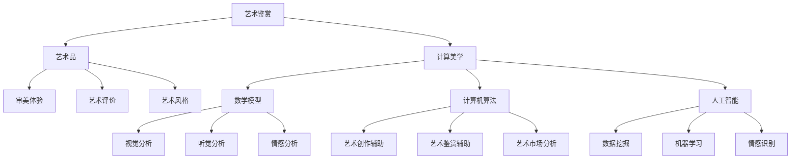

                 

### 文章标题

《艺术鉴赏的计算美学：审美体验的数学量化》

作为一篇深入探讨艺术与科技交融领域的专业文章，本文将引领读者踏上一场跨越艺术鉴赏与计算美学的探索之旅。我们将通过系统的分析，揭示审美体验背后的数学原理，并展示如何利用计算机技术量化这一复杂而深奥的体验。以下是本文的关键词：艺术鉴赏、计算美学、审美体验、数学量化、视觉分析、听觉分析、情感分析。

我们的目标是通过详细阐述艺术鉴赏与计算美学之间的核心概念、理论基础及实际应用，为读者呈现一幅科技与艺术和谐共生的美好图景。本文结构清晰，内容丰富，分为十个章节，依次探讨从艺术鉴赏的基本概念到计算美学的应用案例，再到未来的发展方向，旨在为该领域的研究者和实践者提供有益的参考和启发。

本文不仅注重理论探讨，更强调实践应用，通过具体的算法原理讲解、数学模型解析及项目实战案例，帮助读者深入理解并掌握艺术鉴赏的计算美学方法。在文章的结尾，我们将总结全文的主要观点，并提出未来研究的方向，以及对艺术鉴赏与计算美学发展的期望。

让我们一同展开这场思维的旅程，探索艺术与科技的奇妙交融，揭示审美体验背后的数学秘密。

### 文章摘要

本文旨在探讨艺术鉴赏与计算美学的融合，尤其是审美体验的数学量化问题。艺术鉴赏作为一种主观的审美活动，长期以来受到心理学、哲学和美学等多学科的影响。然而，随着计算机科学和人工智能技术的发展，研究者们开始尝试将数学和计算方法引入艺术鉴赏领域，以期量化和解释审美体验的复杂特性。

本文首先介绍了艺术鉴赏与计算美学的基本概念，分析了现有研究现状，并明确了本文的结构安排。随后，我们深入探讨了审美体验的数学量化理论，包括心理学分析、数学模型应用及量化方法的具体步骤。在此基础上，本文分别从视觉、听觉和情感三个方面，详细阐述了艺术作品的计算机分析技术。

接着，我们通过实际应用案例展示了计算美学在艺术鉴赏中的具体应用，包括计算机辅助艺术鉴赏系统、艺术品市场数据分析以及艺术教育的计算美学应用。此外，本文还探讨了计算美学在艺术创作中的潜力，介绍了计算机辅助艺术创作的方法和实验。

最后，本文总结了艺术鉴赏与计算美学的研究前沿，探讨了未来发展的挑战与机遇，并对艺术教育中计算美学的作用进行了展望。通过本文的探讨，我们希望为读者提供一幅科技与艺术相互融合、共同发展的生动画面，激发对艺术鉴赏和计算美学领域更深入的思考和研究。

### 《艺术鉴赏的计算美学：审美体验的数学量化》目录大纲

#### 引言与背景

**2.1 艺术鉴赏与计算美学的融合**

**2.2 审美体验的数学量化研究现状**

**2.3 本书结构安排**

#### 艺术鉴赏与计算美学的核心概念

**3.1 艺术鉴赏的基本概念**

**3.2 计算美学的定义与理论框架**

**3.3 艺术作品的分析与评价方法**

**3.4 核心概念与联系流程图**

#### 审美体验的数学量化理论

**4.1 审美体验的心理学分析**

**4.2 数学模型在审美体验研究中的应用**

**4.3 审美体验量化的方法与步骤**

**4.4 数学模型与公式**

#### 艺术作品的视觉分析

**5.1 视觉感知与视觉艺术的关系**

**5.2 视觉艺术的数学描述**

**5.3 视觉艺术的计算机模拟**

**5.4 视觉分析算法原理讲解与伪代码**

#### 艺术作品的听觉分析

**6.1 听觉感知与听觉艺术的关系**

**6.2 听觉艺术的数学描述**

**6.3 听觉艺术的计算机模拟**

**6.4 听觉分析算法原理讲解与伪代码**

#### 艺术作品的情感分析

**7.1 情感理论与艺术情感的关系**

**7.2 情感分析的数学模型**

**7.3 情感分析在艺术鉴赏中的应用**

**7.4 情感分析算法原理讲解与伪代码**

#### 艺术鉴赏的计算美学应用案例

**8.1 艺术作品鉴赏的计算机辅助系统**

**8.2 艺术品市场数据分析**

**8.3 艺术教育的计算美学应用**

**8.4 项目实战与代码解读**

#### 计算美学在艺术创作中的应用

**9.1 计算机辅助艺术创作的方法**

**9.2 艺术创作的计算机模拟实验**

**9.3 计算美学与艺术创作的关系**

**9.4 实战案例与代码解读**

#### 艺术鉴赏与计算美学的未来发展

**10.1 计算美学研究的前沿领域**

**10.2 艺术鉴赏计算美学的应用挑战与机遇**

**10.3 计算美学在艺术教育中的作用**

**10.4 未来发展方向与展望**

#### 结论与展望

**11.1 本书总结**

**11.2 未来研究方向**

**11.3 对艺术鉴赏与计算美学发展的期望**

#### 附录

**A. 计算美学研究常用工具与技术**

**B. 审美体验量化的数据集与应用案例**

**C. 计算美学参考文献与推荐阅读**

**D. 艺术作品分析软件工具介绍**

### 第1章 引言与背景

在数字时代，艺术与科技的交融日益紧密，这不仅改变了艺术创作的形态，也丰富了艺术鉴赏的方式。艺术鉴赏作为一种复杂的认知活动，长期以来受到心理学、哲学和美学等多学科的影响。然而，随着计算机科学和人工智能技术的迅猛发展，研究者们开始尝试将数学和计算方法引入艺术鉴赏领域，以期量化和解释审美体验的复杂特性。这一探索不仅拓宽了艺术鉴赏的理论视野，也为艺术创作的计算机辅助提供了新的思路。

#### 1.1 艺术鉴赏与计算美学的融合

艺术鉴赏与计算美学的融合是一种将艺术与科学相结合的新兴研究领域。计算美学（Computational Aesthetics）是研究如何使用计算机技术模拟、分析和创造美的过程。它不仅关注艺术品的视觉和听觉特性，还探索艺术作品背后的情感和心理学因素。通过计算机算法和数学模型，计算美学试图揭示审美体验的量化方法，为艺术鉴赏提供科学依据。

在艺术鉴赏中，计算美学的应用主要体现在以下几个方面：

1. **视觉分析**：通过计算机视觉技术，对艺术作品的色彩、形状、纹理等进行量化分析，揭示视觉元素对审美体验的影响。
2. **听觉分析**：利用音频处理技术，对音乐和声音艺术作品进行数学描述，分析节奏、旋律和音色等元素在听觉审美中的作用。
3. **情感分析**：通过情感识别技术，捕捉观众对艺术作品的情感反应，探索情感在艺术鉴赏中的关键作用。
4. **创作辅助**：利用计算模型和算法，辅助艺术家进行创作，提高艺术作品的创作效率和艺术价值。

#### 1.2 审美体验的数学量化研究现状

审美体验的数学量化是计算美学研究的一个重要方向。虽然美学本身是一种主观的体验，但通过科学的方法，研究者们尝试将审美体验转化为可量化的指标。

当前，关于审美体验的数学量化研究主要集中在以下几个方面：

1. **心理学模型**：通过心理实验和问卷调查，研究个体对艺术作品的情感反应，构建心理学模型来解释审美体验。
2. **数学模型**：利用统计学和概率论等方法，对艺术作品的特征进行量化分析，建立数学模型来预测和解释审美体验。
3. **计算机算法**：利用机器学习和数据挖掘技术，对大量艺术作品和观众反应数据进行处理，发现审美体验的规律和模式。

虽然取得了一些进展，但审美体验的数学量化仍然面临许多挑战，例如如何准确捕捉情感、如何处理复杂的非线性关系等。

#### 1.3 本书结构安排

为了系统地介绍艺术鉴赏与计算美学的融合，本书分为以下章节：

**第1章 引言与背景**：介绍艺术鉴赏与计算美学的融合背景和当前研究现状。

**第2章 艺术鉴赏与计算美学的核心概念**：阐述艺术鉴赏和计算美学的基本概念、理论框架和分析方法。

**第3章 审美体验的数学量化理论**：介绍审美体验的心理学分析、数学模型及其量化方法。

**第4章 艺术作品的视觉分析**：探讨视觉艺术的数学描述、计算机模拟及其在审美体验中的作用。

**第5章 艺术作品的听觉分析**：分析听觉艺术的数学描述、计算机模拟及其对审美体验的影响。

**第6章 艺术作品的情感分析**：介绍情感理论、数学模型及其在艺术鉴赏中的应用。

**第7章 艺术鉴赏的计算美学应用案例**：展示计算美学在实际应用中的具体案例，包括计算机辅助艺术鉴赏系统、艺术品市场数据分析等。

**第8章 计算美学在艺术创作中的应用**：探讨计算美学在艺术创作中的潜在应用，包括计算机辅助艺术创作的方法和实验。

**第9章 艺术鉴赏与计算美学的未来发展**：讨论计算美学研究的前沿领域、应用挑战与机遇，以及对艺术教育的作用。

**第10章 结论与展望**：总结全文的主要观点，提出未来研究方向和对艺术鉴赏与计算美学发展的期望。

通过以上章节的详细探讨，本文旨在为读者提供一幅全面、深入的艺术鉴赏与计算美学的融合图景，激发对这一领域更深入的思考和研究。

### 第2章 艺术鉴赏与计算美学的核心概念

艺术鉴赏和计算美学是两个看似迥异但又紧密相关的领域。艺术鉴赏是人类长期以来的审美活动，它涉及到对艺术作品的感知、理解、评价和欣赏。计算美学则是在计算机科学和人工智能的背景下，探索如何通过数学和计算方法模拟、分析和创造美的过程。要深入理解艺术鉴赏与计算美学的融合，我们需要先明确这两个领域的基本概念、理论框架和分析方法。

#### 2.1 艺术鉴赏的基本概念

艺术鉴赏是一种复杂的主观体验，它不仅依赖于个人的审美感知，还受到文化、历史、社会和个人经验等多种因素的影响。艺术鉴赏的基本概念包括以下几个方面：

1. **艺术品的定义**：艺术品是人类创造的一种具有审美价值的物品，它可以是绘画、雕塑、音乐、文学等不同形式。艺术品不仅是一种审美对象，也是文化和社会的反映。

2. **审美体验**：审美体验是艺术鉴赏的核心，它是指个体在接触和欣赏艺术作品时产生的情感和心理反应。审美体验通常包括感知、联想、共鸣和情感表达等过程。

3. **艺术评价**：艺术评价是对艺术作品的价值和意义进行判断和评定的过程。艺术评价标准通常涉及美学原则、艺术风格、创新性、技术难度等多个方面。

4. **艺术风格**：艺术风格是指一种艺术作品所表现出来的独特风貌和特征，它反映了特定时代、地域或文化背景下的审美趋势和价值观。

5. **艺术史**：艺术史是研究艺术发展过程及其演变规律的历史学科，它为艺术鉴赏提供了丰富的背景知识和文化语境。

#### 2.2 计算美学的定义与理论框架

计算美学是近年来发展起来的一门交叉学科，它旨在将数学、计算机科学和艺术理论相结合，探索如何通过计算方法模拟、分析和创造美的过程。计算美学的定义和理论框架主要包括以下几个方面：

1. **计算美学的定义**：计算美学是研究如何使用计算机技术模拟、分析和创造美的过程。它不仅包括艺术作品的计算机辅助创作，还涉及对艺术作品和审美体验的量化分析。

2. **理论框架**：计算美学的理论框架主要包括数学模型、计算机算法和人工智能技术。这些理论工具帮助研究者从不同的角度理解和解释美的本质和审美体验。

3. **计算美学的目标**：计算美学的目标是通过科学的方法揭示美的规律，提高艺术创作和鉴赏的效率和效果。具体目标包括：
    - **艺术创作辅助**：利用计算模型和算法，辅助艺术家进行创作，提高作品的艺术价值。
    - **艺术鉴赏辅助**：通过计算机分析和评价，帮助观众更好地理解和欣赏艺术作品。
    - **艺术市场分析**：利用数据挖掘和统计分析技术，分析艺术品市场趋势和观众偏好，为艺术品市场提供参考。

4. **计算美学的研究方法**：计算美学的研究方法主要包括：
    - **数学建模**：通过建立数学模型，对艺术作品和审美体验进行量化分析。
    - **计算机模拟**：利用计算机技术模拟艺术创作的过程和审美体验。
    - **人工智能应用**：利用机器学习和数据挖掘技术，分析大量艺术作品和观众数据，发现审美规律和模式。

#### 2.3 艺术作品的分析与评价方法

艺术作品的分析与评价是艺术鉴赏的重要组成部分。计算美学的引入为艺术作品的分析与评价提供了新的方法和工具。以下是一些常见的方法：

1. **视觉分析**：视觉分析是计算美学在艺术鉴赏中的一个重要应用。通过计算机视觉技术，对艺术作品的色彩、形状、纹理等进行量化分析。常用的方法包括色彩分析、形态分析和纹理分析等。视觉分析的目的是揭示艺术作品中的视觉元素如何影响审美体验。

2. **听觉分析**：与视觉分析类似，听觉分析通过对音乐和声音艺术作品进行数学描述，分析节奏、旋律和音色等元素在听觉审美中的作用。听觉分析的方法包括音频处理、频谱分析和声学模型等。

3. **情感分析**：情感分析是利用自然语言处理和机器学习技术，分析观众对艺术作品的情感反应。通过情感分析，可以捕捉观众的情感变化，从而更深入地理解审美体验。

4. **综合评价**：综合评价是将多种分析方法结合起来，对艺术作品进行多维度、多层次的评价。综合评价可以更全面、客观地反映艺术作品的价值和意义。

5. **心理学研究**：心理学研究是通过实验和问卷调查等方法，研究个体对艺术作品的情感反应和心理过程。心理学研究可以为计算美学提供理论基础和实践依据。

#### 2.4 核心概念与联系流程图

为了更好地理解艺术鉴赏与计算美学的核心概念及其联系，我们使用 Mermaid 绘制了一个流程图：



通过这个流程图，我们可以清晰地看到艺术鉴赏与计算美学的核心概念及其相互关系。艺术鉴赏包括对艺术品的感知、理解、评价和欣赏，而计算美学则通过数学模型、计算机算法和人工智能技术，对艺术作品和审美体验进行量化分析和模拟。这些核心概念和方法不仅丰富了艺术鉴赏的理论基础，也为艺术创作和鉴赏提供了新的视角和工具。

### 第3章 审美体验的数学量化理论

审美体验是一种复杂的主观感受，它受多种因素影响，如视觉、听觉、情感和认知等。为了更好地理解和分析审美体验，研究者们尝试使用数学方法进行量化。本章将介绍审美体验的数学量化理论，包括心理学分析、数学模型在审美体验研究中的应用以及量化的方法与步骤。

#### 3.1 审美体验的心理学分析

审美体验的心理学分析是理解审美体验的基础。通过心理学实验和问卷调查，研究者们试图揭示个体在接触艺术作品时的心理过程和情感反应。

1. **心理实验**：心理实验通常通过控制变量的方法，观察个体在不同条件下的审美反应。例如，研究者可能会比较不同色彩搭配、形状组合或音乐节奏对审美体验的影响。心理实验的结果可以帮助我们识别哪些视觉和听觉元素对审美体验有显著影响。

2. **问卷调查**：问卷调查是通过收集大量个体的审美体验数据，分析不同群体之间的差异和共性。问卷调查的设计需要充分考虑文化、年龄、性别等因素，以确保数据的全面性和代表性。问卷调查的结果可以帮助我们理解审美体验的普遍性和特殊性。

3. **情感识别**：情感识别是心理学分析的一个重要方面。通过面部表情、生理信号和语言表达等数据，研究者试图捕捉个体在接触艺术作品时的情感变化。情感识别技术通常涉及机器学习和数据挖掘，它可以帮助我们量化情感反应，进一步理解审美体验的复杂性。

#### 3.2 数学模型在审美体验研究中的应用

数学模型在审美体验研究中的应用为量化分析提供了强大的工具。以下是一些常用的数学模型：

1. **统计学模型**：统计学模型用于分析审美体验的数据分布和相关性。例如，回归分析可以揭示不同视觉或听觉元素对审美体验的影响程度，而因子分析可以识别影响审美体验的关键因素。

2. **概率论模型**：概率论模型用于模拟审美体验的随机性和不确定性。例如，贝叶斯网络可以用于推理个体在不同情境下的审美偏好，而马尔可夫模型可以用于分析审美体验的动态变化。

3. **神经网络模型**：神经网络模型是机器学习的一种，它可以自动学习数据中的复杂模式。在审美体验研究中，神经网络模型可以用于情感识别、图像分类和音乐生成等任务。例如，卷积神经网络（CNN）可以用于视觉分析，而循环神经网络（RNN）可以用于听觉分析。

4. **生成对抗网络（GAN）**：生成对抗网络是一种用于生成新的数据样本的模型，它由生成器和判别器两部分组成。在审美体验研究中，GAN可以用于生成新的艺术作品，探索不同审美风格之间的转换和融合。

#### 3.3 审美体验量化的方法与步骤

审美体验量化是一个多步骤的过程，涉及到数据收集、预处理、分析和可视化。以下是具体的方法与步骤：

1. **数据收集**：数据收集是量化审美体验的第一步。数据来源可以是实验数据、问卷调查数据或现有的艺术作品和观众数据。实验数据通常通过控制变量法获得，而问卷调查数据则通过大规模抽样收集。

2. **数据预处理**：数据预处理是确保数据质量和一致性的重要步骤。预处理包括数据清洗、归一化和特征提取等。数据清洗可以去除异常值和错误数据，归一化可以统一数据范围，特征提取可以提取关键信息用于分析。

3. **数据分析**：数据分析是使用数学模型和算法对数据进行处理和解释的过程。常见的分析方法包括统计分析、概率论分析、机器学习分析等。通过数据分析，可以识别影响审美体验的关键因素，预测个体偏好和情感反应。

4. **数据可视化**：数据可视化是将数据分析结果以图表和图形的形式展示，使数据更加直观和易于理解。常见的可视化方法包括散点图、折线图、热图和三维图等。通过数据可视化，可以更直观地展示审美体验的量化结果，帮助研究者深入理解审美体验的本质。

5. **模型验证与优化**：模型验证与优化是确保量化结果准确性和可靠性的关键步骤。通过交叉验证和调整模型参数，可以优化量化模型，提高预测准确性和泛化能力。

#### 3.4 量化案例与解析

为了更具体地展示审美体验量化的方法与步骤，我们来看一个实际案例：使用统计模型分析观众对艺术作品的情感反应。

1. **数据收集**：假设我们通过问卷调查收集了1000名观众对一幅抽象绘画的情感数据，包括愉悦度、紧张度和悲伤度三个指标。

2. **数据预处理**：对数据进行清洗，去除异常值和缺失值，并对数据进行归一化处理。

3. **数据分析**：使用回归分析模型，将观众的情感数据与绘画的视觉特征（如色彩分布、形状复杂度等）进行关联分析。分析结果揭示了色彩分布和形状复杂度对观众愉悦度有显著影响。

4. **数据可视化**：使用散点图展示绘画的视觉特征与观众情感反应之间的关系。例如，红色的区域表示高愉悦度，而蓝色的区域表示低愉悦度。

5. **模型验证与优化**：通过交叉验证和参数调整，优化回归分析模型，提高预测准确性和泛化能力。

通过这个案例，我们可以看到，审美体验量化不仅提供了对审美体验的定量理解，还为艺术创作和鉴赏提供了科学的指导。未来，随着计算技术和数据分析方法的不断进步，审美体验量化将在艺术领域发挥更大的作用。

### 第4章 艺术作品的视觉分析

视觉分析在艺术鉴赏的计算美学中占据了核心地位。视觉艺术作品是艺术鉴赏中最直观的一部分，它通过色彩、形状、纹理和空间等视觉元素，传递出艺术家独特的审美理念和情感表达。计算机视觉技术的引入，使得我们可以对视觉艺术作品进行定量分析，从而深入理解这些视觉元素如何共同作用于审美体验。

#### 4.1 视觉感知与视觉艺术的关系

视觉感知是指人类通过眼睛感知和理解外界视觉信息的过程。视觉艺术则是一种通过视觉形式传达美学和情感的艺术形式。视觉感知与视觉艺术之间的关系可以概括为以下几点：

1. **视觉元素的组合**：视觉艺术通过色彩、形状、纹理和空间等基本元素，创造出丰富多彩的艺术作品。这些视觉元素在组合时，相互作用，共同影响观众的审美体验。

2. **文化背景的影响**：不同的文化背景会影响个体对视觉艺术的感知和理解。例如，西方绘画强调透视和立体感，而东方绘画则更注重意境和意境的表现。

3. **情感表达**：视觉艺术通过视觉元素的情感表达，传递出艺术家的情感和思想。观众在欣赏视觉艺术作品时，不仅感受到视觉上的美感，还产生情感共鸣。

#### 4.2 视觉艺术的数学描述

为了对视觉艺术进行定量分析，我们需要使用数学工具对其进行描述。以下是几种常见的数学描述方法：

1. **色彩分析**：色彩是视觉艺术中的一个重要元素。色彩分析通常通过色度模型（如CIE颜色空间）来描述色彩的色相、饱和度和亮度。常用的数学模型包括HSV（色相、饱和度、亮度）和RGB（红色、绿色、蓝色）。

2. **形状分析**：形状是视觉艺术的基本元素之一。形状分析通常使用几何学和拓扑学的方法，描述形状的边缘、面积和轮廓。例如，使用边缘检测算法（如Canny算法）提取图像中的边缘信息，然后进行形状分析。

3. **纹理分析**：纹理是视觉艺术中的一种复杂视觉特征。纹理分析通常通过纹理特征（如纹理方向、纹理强度和纹理对比度）来描述。常用的方法包括傅里叶变换和小波变换等。

4. **空间分析**：空间分析用于描述视觉艺术作品中的空间关系，如透视、层次和深度等。数学工具包括透视投影模型和三维几何模型等。

#### 4.3 视觉艺术的计算机模拟

计算机模拟是视觉分析的重要步骤，它可以帮助我们理解视觉艺术作品中的视觉元素如何共同作用。以下是几种常用的计算机模拟方法：

1. **图像生成**：图像生成是通过算法生成新的视觉艺术作品。生成对抗网络（GAN）是一种常用的图像生成方法，它由生成器和判别器两部分组成。生成器生成新的视觉图像，判别器判断生成图像是否真实。通过反复训练，GAN可以生成逼真的视觉艺术作品。

2. **图像编辑**：图像编辑是通过对现有图像进行修改，创造新的视觉艺术效果。图像编辑算法包括色彩调整、滤镜应用和图像合成等。例如，使用深度学习技术，可以实现对图像的自动色彩校正和滤镜应用。

3. **视觉合成**：视觉合成是将多个视觉元素组合成一个新的艺术作品。视觉合成算法包括图像融合、多视图融合和虚拟现实等。例如，通过多视图融合技术，可以将多个视图合成成一个全景图像，创造沉浸式的视觉体验。

#### 4.4 视觉分析算法原理讲解与伪代码

为了更好地理解视觉分析算法的原理，以下我们将使用伪代码来描述一个简单的图像边缘检测算法——Canny边缘检测算法。

```python
def Canny边缘检测(image):
    # 1. 使用高斯滤波器进行图像平滑
    smoothed_image = 高斯滤波(image)

    # 2. 使用Sobel算子计算水平和垂直方向上的梯度
    gradient_x = Sobel算子(image, 'x')
    gradient_y = Sobel算子(image, 'y')

    # 3. 计算梯度的幅值和方向
    gradient_magnitude = sqrt(gradient_x^2 + gradient_y^2)
    gradient_direction = arctan(gradient_y / gradient_x)

    # 4. 非极大值抑制
    suppressed_image = 非极大值抑制(gradient_magnitude)

    # 5. 双阈值算法检测边缘
    low_threshold = 0.33 * maximum(gradient_magnitude)
    high_threshold = 0.66 * maximum(gradient_magnitude)
    edge_image = 双阈值算法(suppressed_image, low_threshold, high_threshold)

    return edge_image
```

在这个伪代码中，Canny边缘检测算法分为几个步骤：

1. **图像平滑**：使用高斯滤波器去除图像中的噪声。
2. **计算梯度**：使用Sobel算子计算图像的水平和垂直方向上的梯度。
3. **非极大值抑制**：在梯度幅值较大的区域，抑制那些幅值较小的边缘点。
4. **双阈值算法**：使用低阈值和高阈值，将梯度幅值大于高阈值的点标记为边缘点。

通过这个简单的例子，我们可以看到，视觉分析算法的基本原理是通过数学和计算方法，提取图像中的关键视觉信息，从而帮助我们更好地理解和欣赏视觉艺术作品。

### 第5章 艺术作品的听觉分析

在艺术鉴赏的计算美学中，听觉分析同样扮演着重要角色。音乐和声音艺术作品是艺术鉴赏的重要组成部分，它们通过节奏、旋律、音色等听觉元素，传递出艺术家的情感和创意。计算机技术在听觉分析中的应用，使得我们可以对这些元素进行定量描述和分析，从而深入理解听觉艺术如何影响审美体验。

#### 5.1 听觉感知与听觉艺术的关系

听觉感知是指人类通过耳朵感知和理解外界声音信息的过程。听觉艺术则是一种通过声音形式传达美学和情感的艺术形式。听觉感知与听觉艺术之间的关系可以概括为以下几点：

1. **听觉元素的组合**：听觉艺术通过节奏、旋律、音色和音量等基本元素，创造出丰富多彩的艺术作品。这些听觉元素在组合时，相互作用，共同影响观众的审美体验。

2. **情感表达**：听觉艺术通过听觉元素的情感表达，传递出艺术家的情感和思想。观众在欣赏听觉艺术作品时，不仅感受到听觉上的美感，还产生情感共鸣。

3. **文化背景的影响**：不同的文化背景会影响个体对听觉艺术的感知和理解。例如，西方古典音乐强调和谐和结构，而爵士乐则注重即兴和自由表达。

#### 5.2 听觉艺术的数学描述

为了对听觉艺术进行定量分析，我们需要使用数学工具对其进行描述。以下是几种常见的数学描述方法：

1. **频谱分析**：频谱分析是听觉分析中最常用的方法之一。它通过将声音信号分解为不同频率的成分，来描述声音的频率分布。常用的频谱分析方法包括快速傅里叶变换（FFT）和短时傅里叶变换（STFT）。

2. **时域分析**：时域分析用于描述声音信号在时间维度上的变化。常用的时域分析方法包括波形分析和时序分析。波形分析通过展示声音信号的波形，来观察音量、节奏和音调的变化。时序分析通过分析声音信号的时间序列，来识别声音的持续时间和强度变化。

3. **听觉模型**：听觉模型是模拟人类听觉系统对声音信号的处理过程。常用的听觉模型包括波普金模型（BPModel）和多共振理论（MRT）。这些模型可以帮助我们理解不同听觉元素如何影响审美体验。

#### 5.3 听觉艺术的计算机模拟

计算机模拟是听觉分析的重要步骤，它可以帮助我们理解听觉艺术作品中的听觉元素如何共同作用。以下是几种常用的计算机模拟方法：

1. **音频生成**：音频生成是通过算法生成新的听觉艺术作品。生成对抗网络（GAN）是一种常用的音频生成方法，它由生成器和判别器两部分组成。生成器生成新的声音信号，判别器判断生成声音是否真实。通过反复训练，GAN可以生成逼真的音频效果。

2. **音频编辑**：音频编辑是通过对现有音频进行修改，创造新的听觉艺术效果。音频编辑算法包括音频滤波、混音和节奏调整等。例如，使用深度学习技术，可以实现对音频的自动节奏调整和效果添加。

3. **听觉合成**：听觉合成是将多个听觉元素组合成一个新的艺术作品。听觉合成算法包括音频融合、多通道合成和虚拟现实等。例如，通过多通道合成技术，可以将多个音频信号合成成一个立体声效果，创造沉浸式的听觉体验。

#### 5.4 听觉分析算法原理讲解与伪代码

为了更好地理解听觉分析算法的原理，以下我们将使用伪代码来描述一个简单的音频频谱分析算法——快速傅里叶变换（FFT）。

```python
def FFT频谱分析(audio_signal):
    # 1. 计算原始音频信号的快速傅里叶变换
    frequency_spectrum = FFT(audio_signal)

    # 2. 转换频率轴的刻度，使其更直观
    frequency_bins = 频率轴刻度转换(frequency_spectrum)

    # 3. 提取主要的频率成分
    dominant_frequencies = 提取主要频率成分(frequency_bins)

    # 4. 绘制频谱图
    频谱图(dominant_frequencies)

    return frequency_spectrum
```

在这个伪代码中，FFT频谱分析算法分为几个步骤：

1. **计算FFT**：使用快速傅里叶变换（FFT）计算原始音频信号的频率分布。
2. **转换频率轴刻度**：将频率轴的刻度转换为对人类听觉更直观的形式。
3. **提取主要频率成分**：从频率分布中提取主要的频率成分，这些成分通常对应音乐的主要旋律和节奏。
4. **绘制频谱图**：使用图表工具（如matplotlib）绘制频谱图，展示音频信号的频率分布。

通过这个简单的例子，我们可以看到，听觉分析算法的基本原理是通过数学和计算方法，提取音频信号中的关键听觉信息，从而帮助我们更好地理解和欣赏听觉艺术作品。

### 第6章 艺术作品的情感分析

情感分析是艺术鉴赏计算美学中的一个重要方向，它旨在通过数学模型和算法，捕捉和解释观众对艺术作品的情感反应。情感分析不仅有助于揭示审美体验的复杂性，还可以为艺术创作和鉴赏提供科学依据。

#### 6.1 情感理论与艺术情感的关系

情感理论是理解人类情感反应的基础。根据心理学研究，情感通常可以分为基本情感和复合情感。基本情感包括愉悦、悲伤、愤怒、恐惧、惊讶等，这些情感是最原始和普遍的情感体验。复合情感则是由基本情感组合而成的，如焦虑、兴奋、幸福等。

艺术情感是指观众在接触艺术作品时产生的情感体验。艺术情感与基本情感和复合情感密切相关，但又有其独特性。艺术情感不仅受到艺术作品本身的视觉、听觉和情感表达的影响，还受到观众的主观体验和文化背景的影响。

1. **基本情感与艺术情感**：基本情感是艺术情感的基础，观众对艺术作品的情感反应通常可以追溯到基本情感的范畴。例如，一幅色彩鲜艳、构图优美的绘画可能会引起观众的愉悦感。

2. **复合情感与艺术情感**：复合情感是由基本情感组合而成的，它们在艺术鉴赏中同样具有重要意义。例如，观众在欣赏一件艺术作品时，可能会同时体验到愉悦和兴奋，这些复合情感共同构成了完整的审美体验。

3. **艺术情感的独特性**：艺术情感具有独特性，因为它不仅受到艺术作品本身的影响，还受到观众的主观体验和文化背景的影响。不同观众对同一艺术作品的情感反应可能存在显著差异，这反映了艺术情感的多样性和复杂性。

#### 6.2 情感分析的数学模型

情感分析通常依赖于数学模型和算法，以下介绍几种常用的情感分析数学模型：

1. **情感词典模型**：情感词典模型是基于预定义的情感词典，通过统计词语的情感倾向，来推断文本的情感极性。常用的情感词典包括SentiWordNet和VADER。情感词典模型简单高效，适用于处理大量文本数据。

2. **情感分类模型**：情感分类模型是利用机器学习和深度学习技术，对文本数据进行分类，以识别文本的情感极性。常用的情感分类模型包括朴素贝叶斯分类器、支持向量机（SVM）和深度神经网络（DNN）。

3. **情感强度模型**：情感强度模型旨在量化文本中的情感强度，通常使用情感词典和情感分类模型结合的方法。情感强度模型可以帮助我们了解观众对艺术作品情感反应的程度。

4. **情感时序模型**：情感时序模型用于分析观众在观看艺术作品过程中的情感变化。通过捕捉观众的情感时序数据，我们可以了解情感在不同时间段的变化趋势，从而更深入地理解审美体验的动态过程。

#### 6.3 情感分析在艺术鉴赏中的应用

情感分析在艺术鉴赏中具有广泛的应用，以下列举几个具体应用场景：

1. **观众情感反应分析**：通过情感分析技术，可以捕捉观众在欣赏艺术作品时的情感反应，了解观众对艺术作品的喜好和排斥程度。这种分析有助于艺术家了解观众的审美需求，调整创作方向。

2. **艺术评价辅助**：情感分析可以为艺术评价提供科学依据。通过分析观众对艺术作品的情感反应，可以更客观地评价艺术作品的价值和意义。

3. **艺术品市场分析**：情感分析技术可以用于分析艺术品市场的情绪趋势。通过捕捉市场参与者的情感变化，可以预测艺术品市场的动态，为投资者提供参考。

4. **艺术教育**：情感分析可以用于艺术教育中，帮助学生更好地理解艺术作品的情感表达，提高艺术鉴赏能力。例如，通过分析学生欣赏艺术作品后的情感变化，教师可以调整教学策略，提高教学效果。

#### 6.4 情感分析算法原理讲解与伪代码

为了更好地理解情感分析算法的原理，以下我们将使用伪代码来描述一个简单的情感分类算法——朴素贝叶斯分类器。

```python
def 朴素贝叶斯情感分类器(text):
    # 1. 构建情感词典
   情感词典 = 构建情感词典()

    # 2. 提取文本特征
   特征向量 = 提取特征(text, 情感词典)

    # 3. 计算每个类别的概率
   类别概率 = 计算类别概率(特征向量, 情感词典)

    # 4. 选择概率最大的类别作为预测结果
   预测结果 = 选择概率最大类别(类别概率)

    return 预测结果
```

在这个伪代码中，朴素贝叶斯情感分类器分为几个步骤：

1. **构建情感词典**：构建一个包含正负情感词汇的情感词典，用于判断文本的情感极性。
2. **提取文本特征**：使用情感词典提取文本中的特征词，形成特征向量。
3. **计算类别概率**：计算每个类别（正情感和负情感）的概率，通常使用贝叶斯公式。
4. **选择概率最大类别**：根据概率最大原则，选择概率最大的类别作为预测结果。

通过这个简单的例子，我们可以看到，情感分析算法的基本原理是通过数学模型和算法，从文本数据中提取情感信息，从而实现情感分类。情感分析技术在艺术鉴赏中的应用，不仅丰富了审美体验的研究方法，也为艺术创作和鉴赏提供了新的视角和工具。

### 第7章 艺术鉴赏的计算美学应用案例

计算美学在艺术鉴赏中具有广泛的应用，通过计算机技术和数据分析，我们可以更好地理解和欣赏艺术作品。以下我们将介绍几个具体的应用案例，包括艺术作品鉴赏的计算机辅助系统、艺术品市场数据分析以及艺术教育的计算美学应用。

#### 7.1 艺术作品鉴赏的计算机辅助系统

计算机辅助艺术鉴赏系统是一种利用计算机技术和数据分析方法，帮助观众更好地理解和欣赏艺术作品的系统。这种系统通常包括以下几个功能：

1. **作品信息查询**：用户可以通过输入艺术作品的名称、作者或年代等信息，查询相关作品的基本信息和历史背景。
2. **视觉分析**：系统使用计算机视觉技术，对艺术作品的色彩、形状、纹理等视觉元素进行量化分析，生成视觉分析报告，帮助观众了解艺术作品的形式特征。
3. **情感分析**：系统通过情感识别技术，分析观众在欣赏艺术作品时的情感反应，生成情感分析报告，帮助观众理解艺术作品的情感表达。
4. **个性化推荐**：系统根据用户的浏览历史和情感反应，推荐类似的或风格相近的艺术作品，帮助用户发现新的艺术作品。

**案例解析**：以某知名博物馆的计算机辅助艺术鉴赏系统为例，该系统整合了图像识别、情感识别和推荐算法等多种技术。通过视觉分析，系统可以为观众提供艺术作品的色彩搭配、形状组合和纹理分析报告，帮助观众更深入地理解艺术作品。通过情感分析，系统可以捕捉观众的情感反应，生成情感分析报告，为艺术展览的设计提供参考。通过个性化推荐，系统可以根据观众的兴趣和偏好，推荐相关的艺术作品，提高观众的鉴赏体验。

#### 7.2 艺术品市场数据分析

艺术品市场数据分析是一种利用数据分析方法，对艺术品市场趋势和观众偏好进行分析的研究。这种分析有助于艺术家、收藏家和投资者更好地了解艺术品市场的动态。

1. **艺术品价格趋势分析**：通过分析历史数据，研究艺术品的价格变化趋势，识别艺术品市场的波动规律。常用的分析方法包括时间序列分析和回归分析。
2. **艺术家影响力分析**：通过分析艺术家的作品销售记录、展览次数和媒体报道等数据，评估艺术家的市场影响力。
3. **观众偏好分析**：通过分析观众的浏览记录、收藏记录和购买记录，识别观众的偏好和兴趣点，为艺术品展览和推广提供参考。

**案例解析**：以某知名艺术品拍卖公司为例，该公司的数据分析系统利用机器学习和数据挖掘技术，对拍卖数据进行分析。通过时间序列分析，系统可以预测艺术品未来的市场走势，为投资者提供参考。通过艺术家影响力分析，系统可以识别市场潜力大的艺术家，为画廊和博物馆的收藏策略提供参考。通过观众偏好分析，系统可以识别观众的兴趣点，为艺术展览的策划和推广提供数据支持。

#### 7.3 艺术教育的计算美学应用

计算美学在艺术教育中的应用，可以提升学生的艺术鉴赏能力和创作水平。以下是一些具体的应用案例：

1. **艺术鉴赏课程辅助**：通过计算机辅助教学系统，学生可以在线浏览艺术作品，系统提供视觉分析和情感分析报告，帮助学生更好地理解艺术作品。
2. **艺术创作辅助**：通过计算机辅助创作系统，学生可以尝试使用计算机生成艺术作品，系统提供色彩搭配、形状组合和纹理分析建议，帮助学生提高创作技巧。
3. **在线艺术社区**：通过在线艺术社区，学生可以分享自己的艺术作品，获取同学和老师的反馈，提升艺术鉴赏能力和创作水平。

**案例解析**：以某知名艺术学院为例，该学院引入了计算机辅助艺术教育系统，通过在线平台，学生可以访问大量的艺术作品和资源。系统提供视觉分析和情感分析报告，帮助学生深入理解艺术作品。学生可以通过计算机辅助创作系统，尝试不同的创作方法，系统提供实时的创作建议和指导。在线艺术社区为学生提供了一个交流和学习的平台，学生可以分享自己的艺术作品，获取同学和老师的反馈，提升艺术鉴赏能力和创作水平。

通过这些应用案例，我们可以看到计算美学在艺术鉴赏中的重要作用。它不仅提升了艺术鉴赏的效率和质量，还为艺术创作和教育提供了新的方法和工具。随着计算技术和数据分析方法的不断进步，计算美学在艺术领域的应用将更加广泛和深入。

### 第8章 计算美学在艺术创作中的应用

计算美学在艺术创作中的应用为艺术家提供了新的创作工具和方法，极大地拓展了艺术创作的可能性。通过计算机技术和算法，艺术家可以探索新的艺术表达形式，提高创作效率，并实现更丰富的创作效果。

#### 8.1 计算机辅助艺术创作的方法

计算机辅助艺术创作是指利用计算机技术和算法，辅助艺术家进行创作的过程。以下是几种常见的计算机辅助艺术创作方法：

1. **计算机生成艺术**：计算机生成艺术是一种完全由计算机算法生成艺术作品的方法。通过生成对抗网络（GAN）、深度学习等算法，计算机可以生成具有高度逼真性和艺术性的图像和音乐。艺术家可以通过调整算法参数，探索不同的艺术风格和创作效果。

2. **交互式艺术创作**：交互式艺术创作是指艺术家通过计算机界面与计算机系统进行实时互动，从而创作艺术作品。这种创作方法允许艺术家在创作过程中动态调整参数，实时观察创作效果，从而实现更加灵活和即兴的创作。

3. **辅助设计工具**：辅助设计工具是用于辅助艺术家进行图像处理、色彩搭配、形状设计等任务的计算机软件。例如，Photoshop、Illustrator等图像处理软件提供了丰富的工具和功能，帮助艺术家快速实现创意和效果。

4. **虚拟现实（VR）和增强现实（AR）**：虚拟现实和增强现实技术为艺术家提供了全新的创作空间和体验。通过VR和AR，艺术家可以创建沉浸式的三维艺术作品，观众可以在虚拟环境中欣赏和互动。

#### 8.2 艺术创作的计算机模拟实验

计算机模拟实验是艺术家和研究者探索计算美学在艺术创作中的应用的重要方法。以下是一些具体的计算机模拟实验案例：

1. **色彩模拟实验**：通过计算机模拟实验，艺术家可以探索不同色彩组合对视觉体验的影响。例如，通过调整HSV颜色模型中的色相、饱和度和亮度参数，艺术家可以生成各种色彩效果，从而找到最符合艺术作品主题的色彩方案。

2. **形状生成实验**：利用计算机算法，艺术家可以生成各种形状和图案。例如，通过参数化建模技术，艺术家可以创建复杂而独特的几何形状。这些形状可以进一步用于艺术作品的创作，实现多样化的视觉表达。

3. **声音创作实验**：通过音频处理和生成算法，艺术家可以创作独特的音乐和声音效果。例如，使用生成对抗网络（GAN）生成新颖的旋律和节奏，或者通过音频滤波和合成技术，创造独特的声音艺术作品。

**案例解析**：以某位数字艺术家为例，他利用生成对抗网络（GAN）进行艺术创作实验。通过调整GAN的生成器和判别器参数，艺术家可以生成各种风格的图像，从写实到抽象，从具象到抽象。艺术家将这些图像与传统的绘画技巧相结合，创造出独特的艺术作品，展示在艺术展览中。观众对这些作品产生了浓厚的兴趣，认为这些计算机生成的图像具有强烈的艺术感染力。

#### 8.3 计算美学与艺术创作的关系

计算美学与艺术创作的关系可以概括为以下几点：

1. **工具拓展**：计算美学为艺术家提供了新的创作工具和方法，使艺术创作的可能性得到了极大的拓展。计算机技术和算法不仅提高了创作的效率，还丰富了创作的形式和效果。

2. **创意激发**：计算机模拟实验和交互式创作方法可以帮助艺术家激发创意，探索新的艺术表达形式。计算机生成的图像和声音效果，往往能够带来意想不到的艺术体验，激发艺术家的灵感。

3. **观众互动**：计算机技术和算法使得艺术作品更具互动性。例如，通过虚拟现实（VR）和增强现实（AR）技术，观众可以与艺术作品进行互动，从而获得更加丰富的审美体验。

4. **学术研究**：计算美学不仅为艺术创作提供了新的方法，也为艺术理论研究提供了新的视角。通过计算机模拟实验和数据分析，艺术家和研究者可以更深入地探讨艺术创作的规律和本质。

总之，计算美学在艺术创作中的应用，不仅丰富了艺术创作的形式和内容，也为艺术理论和实践带来了新的发展机遇。随着计算技术和人工智能的进一步发展，计算美学在艺术创作中的应用将更加广泛和深入，为艺术界带来更多创新和变革。

### 第9章 艺术鉴赏与计算美学的未来发展

计算美学作为一门交叉学科，正在不断推动艺术鉴赏和艺术创作的革新。未来，随着计算技术和人工智能的发展，艺术鉴赏与计算美学的融合将迎来更多的机遇和挑战。以下是未来发展的几个关键领域：

#### 9.1 计算美学研究的前沿领域

1. **情感计算**：情感计算是研究如何使用计算机技术和算法捕捉、模拟和增强人类情感反应的一个新兴领域。在艺术鉴赏中，情感计算可以帮助我们更精确地理解观众的情感体验，从而优化艺术作品的创作和展示。

2. **人工智能艺术**：人工智能艺术是指利用人工智能技术，如生成对抗网络（GAN）、强化学习等，创作具有高度原创性和艺术性的作品。未来，人工智能艺术将成为艺术创作的重要趋势，艺术家与人工智能的协同创作将更加普遍。

3. **跨媒体艺术**：随着多媒体技术的发展，跨媒体艺术（如VR、AR、MR）将成为艺术鉴赏和创作的重要形式。计算美学将探讨如何通过多感官融合，提供更加丰富和沉浸式的艺术体验。

4. **个性化推荐系统**：个性化推荐系统在艺术鉴赏中的应用，将帮助观众发现更符合个人兴趣和偏好的艺术作品。通过机器学习和数据挖掘技术，推荐系统能够实现更精准的艺术作品推荐，提升观众的鉴赏体验。

#### 9.2 艺术鉴赏计算美学的应用挑战与机遇

**挑战**：

1. **数据隐私与伦理**：随着艺术鉴赏计算美学的广泛应用，数据隐私和伦理问题日益突出。如何保护观众的隐私，同时确保数据的合理使用，是未来需要解决的重要问题。

2. **计算复杂度**：艺术鉴赏计算美学的许多应用需要处理大量复杂的数据，如高清图像、音频文件和三维模型等。如何提高计算效率和算法的鲁棒性，是当前和未来的一大挑战。

3. **跨学科合作**：艺术鉴赏计算美学涉及多个学科领域，包括艺术学、心理学、计算机科学和人工智能等。跨学科合作不仅需要各领域的专业知识，还需要有效的沟通和协作。

**机遇**：

1. **创新艺术形式**：计算美学将带来新的艺术形式和创作方法，如人工智能艺术、虚拟现实艺术和跨媒体艺术等。这些新形式将为艺术家提供广阔的创作空间，为观众带来全新的审美体验。

2. **艺术普及与教育**：计算美学在艺术教育中的应用，将有助于普及艺术知识，提高公众的艺术鉴赏能力。在线艺术课程、虚拟博物馆和艺术推荐系统等，将使更多人能够接触和欣赏艺术。

3. **艺术市场分析**：计算美学在艺术品市场分析中的应用，将为艺术家、收藏家和投资者提供更加准确和全面的市场信息。通过数据分析和情感识别技术，可以预测艺术市场的趋势和观众偏好。

#### 9.3 计算美学在艺术教育中的作用

计算美学在艺术教育中具有重要作用，以下是其几个主要应用：

1. **个性化教学**：通过分析学生的兴趣、能力和情感反应，计算美学可以为每位学生提供个性化的教学方案。教师可以根据学生的需求，调整教学内容和教学方法，提高教学效果。

2. **艺术创作辅助**：计算美学提供了一系列工具和资源，如计算机辅助设计软件、虚拟现实艺术创作平台等，帮助学生提高创作技能和艺术水平。

3. **艺术鉴赏教育**：通过计算机视觉和情感识别技术，学生可以更深入地理解艺术作品的形式和情感表达。这种教育方式不仅提高了学生的审美能力，也培养了他们的批判性思维。

4. **跨学科融合**：计算美学为艺术教育与其他学科的融合提供了新的契机，如艺术与计算机科学、心理学和数学的交叉研究，可以推动艺术教育的发展和创新。

总之，艺术鉴赏与计算美学的未来发展充满了机遇和挑战。通过不断探索和创新，计算美学将为艺术鉴赏和艺术创作带来新的变革，推动艺术与科技的深度融合。

### 第10章 结论与展望

通过本文的探讨，我们系统地介绍了艺术鉴赏与计算美学的融合，从核心概念到实际应用，再到未来发展的展望，展示了这一领域的研究现状与前景。本文的主要观点可以概括为以下几点：

首先，艺术鉴赏与计算美学的融合为艺术研究开辟了新的路径。通过引入数学和计算方法，我们可以对审美体验进行量化分析，从而更深入地理解艺术作品的本质和观众的情感反应。

其次，计算美学在艺术鉴赏中具有广泛的应用，包括视觉分析、听觉分析、情感分析等。这些技术的应用不仅提高了艺术鉴赏的效率和准确性，也为艺术创作和教育提供了新的工具和方法。

第三，计算美学的发展面临着数据隐私、计算复杂度和跨学科合作等挑战。然而，这些挑战也带来了机遇，如创新艺术形式、艺术普及与教育以及艺术市场分析的优化。

最后，本文强调了计算美学在艺术教育中的重要作用，通过个性化教学、艺术创作辅助、艺术鉴赏教育和跨学科融合，计算美学将推动艺术教育的发展和创新。

未来研究方向应包括：进一步探索情感计算和人工智能艺术的前沿领域，提升计算美学在艺术创作和鉴赏中的应用水平；加强数据隐私和伦理问题的研究，确保技术应用的合法性和合理性；推动跨学科合作，融合多学科的知识和方法，为艺术鉴赏与计算美学的研究提供新的视角和思路。

对艺术鉴赏与计算美学发展的期望是：通过科技的进步和创新的实践，实现艺术与科技的深度融合，促进艺术鉴赏和创作的繁荣，让更多的人能够享受艺术带来的美好体验。

### 附录

#### A. 计算美学研究常用工具与技术

1. **计算机视觉工具**：OpenCV、TensorFlow、PyTorch等。
2. **音频处理工具**：Librosa、NumPy、SciPy等。
3. **自然语言处理工具**：NLTK、spaCy、Transformers等。
4. **机器学习和数据挖掘工具**：scikit-learn、XGBoost、TensorFlow等。

#### B. 审美体验量化的数据集与应用案例

1. **艺术作品数据集**：ImageNet、MNIST、Open Images等。
2. **观众反应数据集**：Carnegie Mellon University Multimodal Affective Computing Dataset、MIT Music and Emotion Recognition Research Group等。
3. **应用案例**：利用情感词典进行文本情感分析、利用深度学习进行图像分类和生成等。

#### C. 计算美学参考文献与推荐阅读

1. **书籍**：
    - 《计算美学：艺术与计算机科学的交汇》
    - 《艺术心理学：一种认知科学的方法》
    - 《情感计算：从情感识别到情感合成》

2. **期刊**：
    - Journal of Aesthetic Education
    - Aesthetic Perspectives
    - Journal of Visualization

3. **论文**：
    - “Computational Aesthetics: A Brief History” by Reinhard Kriegel and Gerhard Ade
    - “Emotion Recognition in the Wild: A Survey” by Miltos Yannakakis

#### D. 艺术作品分析软件工具介绍

1. **Adobe Photoshop**：强大的图像处理和编辑工具，支持色彩调整、图像修复和滤镜应用等。
2. **Adobe Audition**：专业的音频处理和编辑工具，支持音频剪辑、混音和效果添加等。
3. **MATLAB**：功能强大的数学计算和数据分析软件，适用于视觉和听觉分析等任务。
4. **Blender**：开源的三维建模和动画制作软件，适用于视觉艺术的计算机模拟和生成。

通过这些工具和技术，研究者可以更深入地探索艺术鉴赏与计算美学的领域，推动这一新兴领域的持续发展。

