                 

# 虚拟博物馆：全球文化遗产的数字化展示

> **关键词：虚拟博物馆、数字化展示、文化遗产、3D建模、虚拟现实、增强现实、大数据、云计算、图像识别、自然语言处理**

> **摘要：本文深入探讨了虚拟博物馆的概念、技术基础、核心算法原理、项目实战及案例分析。通过详细讲解数字化展示的技术原理和应用，以及全球文化遗产的数字化展示需求和发展趋势，本文旨在为读者提供一套全面、系统的虚拟博物馆建设方案。**

## 目录大纲

1. **引言**  
   1.1 虚拟博物馆的概念与价值  
   1.2 全球文化遗产的数字化展示需求  
   1.3 虚拟博物馆的发展趋势

2. **技术基础**  
   2.1 数字化展示技术原理  
   2.2 数字化展示平台的搭建  
   2.3 用户交互与体验设计

3. **核心算法原理讲解**  
   3.1 图像识别算法  
   3.2 自然语言处理算法

4. **项目实战**  
   4.1 虚拟博物馆项目实战  
   4.2 案例分析

5. **附录**  
   5.1 资源与工具  
   5.2 进一步阅读与参考

## 第一部分：引言

### 1.1 虚拟博物馆的概念与价值

#### 虚拟博物馆的定义

虚拟博物馆是一种通过计算机技术和互联网技术，将现实中的博物馆藏品、展览和教育活动数字化，以虚拟空间的形式呈现给公众的展示平台。它利用虚拟现实（VR）和增强现实（AR）等技术，让用户可以在虚拟环境中进行参观、学习、互动和体验。

#### 虚拟博物馆的重要性

虚拟博物馆在全球文化遗产保护与展示方面具有重要作用。首先，它能够解决现实博物馆在空间、时间和资源上的限制，让全球观众都能享受到博物馆的文化资源。其次，虚拟博物馆能够实现实物的精细还原，提高观众对文化遗产的感知和理解。最后，虚拟博物馆可以通过互动和体验，增强观众对文化的兴趣和参与度。

#### 虚拟博物馆的发展历程

虚拟博物馆的发展经历了几个阶段。最初，博物馆利用互联网技术搭建了网页版的虚拟展览，但用户体验有限。随着VR和AR技术的成熟，虚拟博物馆逐渐开始采用这些新技术，提升了用户体验。近年来，大数据和云计算技术的应用，使得虚拟博物馆的数据处理能力和展示效果得到了显著提升。

### 1.2 全球文化遗产的数字化展示需求

#### 全球文化遗产面临的挑战

全球文化遗产面临着诸多挑战，如自然灾害、战争、人为破坏等。这些因素导致许多珍贵文物无法得到有效保护，甚至失传。此外，现实博物馆的场地、时间和资源限制，使得全球观众难以全面了解和体验这些文化遗产。

#### 数字化展示的优势与意义

数字化展示具有以下优势：首先，它能够实现对文化遗产的长期保存和保护；其次，它打破了时间和空间的限制，让全球观众都能在线参观和体验；最后，数字化展示能够提高文化遗产的普及度，增强公众对文化的认知和兴趣。

### 1.3 虚拟博物馆的发展趋势

#### 当前技术趋势

随着技术的不断进步，虚拟博物馆的发展呈现出以下趋势：首先，虚拟现实和增强现实技术的应用越来越广泛；其次，大数据和云计算技术的支持，使得虚拟博物馆的数据处理能力和展示效果不断提升；最后，人工智能技术的应用，为虚拟博物馆提供了更智能的交互和个性化服务。

#### 未来发展方向

未来，虚拟博物馆将朝着以下方向发展：首先，虚拟博物馆将与实体博物馆实现更紧密的融合，提供线上线下相结合的参观体验；其次，虚拟博物馆将更加注重用户体验和互动性，提高观众的参与度和满意度；最后，虚拟博物馆将利用人工智能技术，实现更智能的内容推荐和个性化服务。

## 第二部分：技术基础

### 2.1 数字化展示技术原理

#### 2.1.1 虚拟现实与增强现实技术

##### 虚拟现实技术原理

虚拟现实（VR）是一种通过计算机技术生成三维虚拟环境，让用户沉浸其中的技术。它主要依靠头戴式显示器（HMD）、跟踪器和传感器等设备，将用户的视觉、听觉和触觉等感官与虚拟环境进行实时互动。

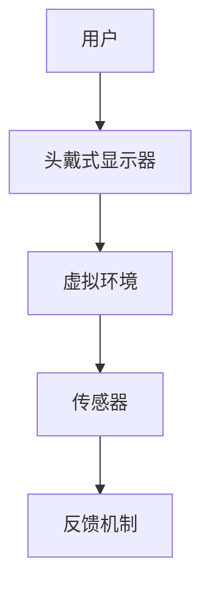

##### 增强现实技术原理

增强现实（AR）是一种通过计算机技术将虚拟信息与现实环境进行叠加，增强用户对现实世界的感知的技术。它主要依靠智能手机或平板电脑等设备，通过摄像头和显示器将虚拟信息叠加到现实场景中。

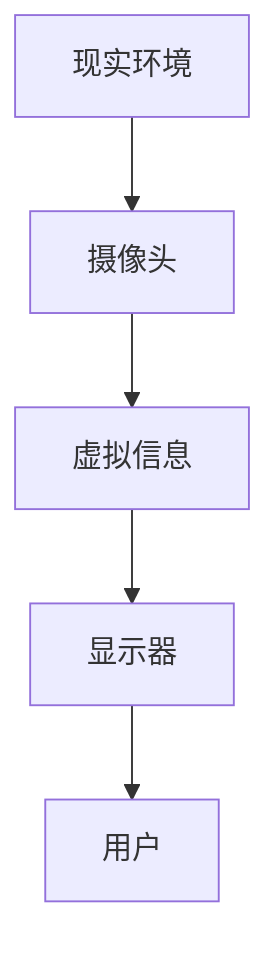

##### VR/AR技术在虚拟博物馆中的应用

VR/AR技术在虚拟博物馆中的应用主要体现在以下几个方面：首先，它能够提供沉浸式的参观体验，让用户如身临其境；其次，它能够实现对实物的精细还原，提高用户的感知和理解；最后，它能够通过互动和体验，增强用户对文化的兴趣和参与度。

#### 2.1.2 3D建模与扫描技术

##### 3D建模技术原理

3D建模技术是通过计算机软件对实体对象进行三维建模的过程。它主要依靠几何建模、纹理映射和光照计算等技术，实现对实物的三维还原。

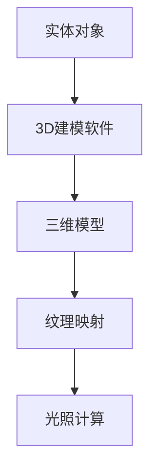

##### 3D扫描技术原理

3D扫描技术是通过激光、结构光或视觉等技术，对实体对象进行三维扫描的过程。它主要依靠扫描设备的精度和速度，实现对实物的快速还原。

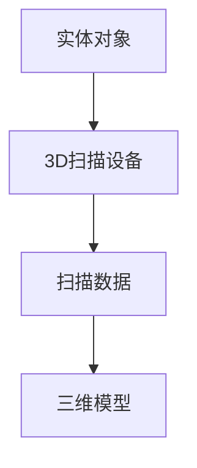

##### 3D建模与扫描在虚拟博物馆中的应用

3D建模与扫描技术在虚拟博物馆中的应用主要体现在以下几个方面：首先，它能够实现对实物的精细还原，提高用户的感知和理解；其次，它能够为虚拟博物馆提供丰富的虚拟内容，增强用户的互动和体验；最后，它能够为文化遗产的数字化保存和展示提供技术支持。

#### 2.1.3 大数据与云计算技术

##### 大数据技术原理

大数据技术是一种对大规模数据进行分析和处理的技术。它主要依靠数据采集、存储、处理和分析等技术，实现对海量数据的深度挖掘和应用。

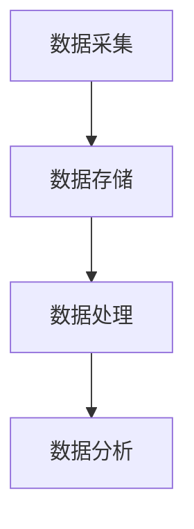

##### 云计算技术原理

云计算技术是一种通过网络提供计算资源和服务的技术。它主要依靠虚拟化、分布式计算和存储等技术，实现计算资源的灵活分配和高效利用。

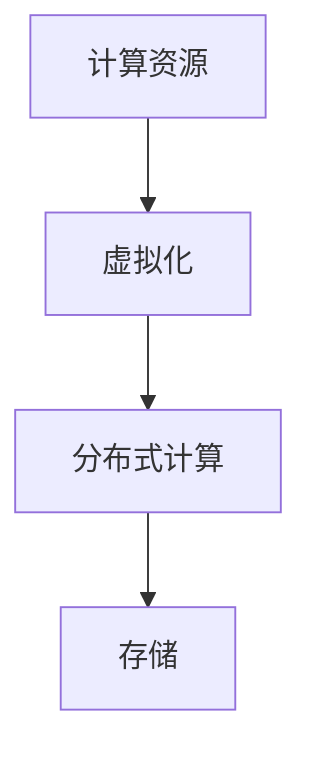

##### 大数据与云计算在虚拟博物馆中的应用

大数据与云计算技术在虚拟博物馆中的应用主要体现在以下几个方面：首先，它能够为虚拟博物馆提供强大的数据处理能力，支持海量数据的存储和处理；其次，它能够为虚拟博物馆提供灵活的计算资源，满足不同规模和需求的用户；最后，它能够为虚拟博物馆提供智能化和个性化的服务。

### 2.2 数字化展示平台的搭建

#### 2.2.1 开发环境与工具

##### 开发环境搭建

虚拟博物馆的开发环境主要包括操作系统、编程语言和开发工具等。常见的操作系统有Windows、Linux和macOS；编程语言有Python、JavaScript和C++等；开发工具有Unity、Unreal Engine、Blender等。

##### 常用工具介绍

- **Unity**: Unity是一款流行的游戏开发引擎，广泛应用于虚拟博物馆的开发。它支持多种编程语言，具有丰富的开发插件和资源。
- **Unreal Engine**: Unreal Engine是一款功能强大的游戏开发引擎，适用于高质量虚拟博物馆的制作。它具有强大的图形渲染能力和物理引擎。
- **Blender**: Blender是一款免费开源的三维建模和渲染软件，适用于虚拟博物馆中的3D建模和动画制作。

#### 2.2.2 虚拟博物馆平台架构

##### 系统架构设计

虚拟博物馆平台架构可以分为前端、后端和数据库三个部分。前端主要负责用户界面和交互设计；后端主要负责数据处理和服务提供；数据库主要负责数据的存储和管理。

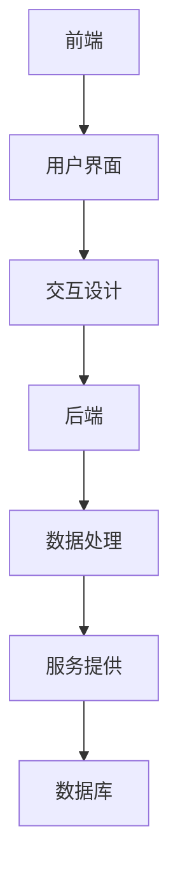

##### 功能模块划分

虚拟博物馆平台的主要功能模块包括：用户管理、展览管理、藏品管理、互动体验和数据分析等。

- **用户管理**: 主要负责用户的注册、登录、权限控制等功能。
- **展览管理**: 主要负责展览的创建、编辑、发布和展示等功能。
- **藏品管理**: 主要负责藏品的添加、编辑、分类和展示等功能。
- **互动体验**: 主要负责用户与虚拟博物馆的互动和体验功能。
- **数据分析**: 主要负责用户行为分析和数据挖掘等功能。

#### 2.2.3 数据库设计与存储

##### 数据库设计原则

数据库设计应遵循以下原则：首先，要确保数据的完整性、一致性和安全性；其次，要优化数据库的性能和扩展性；最后，要便于数据的查询和更新。

##### 数据存储策略

数据存储策略应考虑以下因素：首先，要根据数据类型和访问频率选择合适的存储方案；其次，要考虑数据备份和容灾策略；最后，要优化数据存储的存储空间和成本。

## 第三部分：用户交互与体验设计

### 3.1 用户交互设计原则

##### 用户行为分析

用户交互设计的第一步是对用户行为进行分析。通过用户行为分析，可以了解用户在虚拟博物馆中的行为模式、偏好和需求。这有助于设计出更符合用户需求的交互界面和功能。

##### 交互设计原则

交互设计应遵循以下原则：首先，要确保界面简洁、直观，易于操作；其次，要遵循一致性原则，确保不同界面和功能之间的一致性；最后，要注重用户的反馈和体验，及时优化和改进交互设计。

### 3.2 用户体验优化

##### 用户体验评估方法

用户体验评估方法主要包括以下几种：首先，可以通过用户调研和访谈，了解用户对虚拟博物馆的反馈和建议；其次，可以通过A/B测试，比较不同设计方案的优劣；最后，可以通过用户满意度调查，评估用户体验的满意度。

##### 用户体验优化策略

用户体验优化策略包括以下几种：首先，要优化界面设计，提高界面的美观度和易用性；其次，要优化交互流程，简化用户操作；最后，要注重用户反馈，及时优化和改进虚拟博物馆的功能和服务。

## 第四部分：核心算法原理讲解

### 4.1 图像识别算法

#### 4.1.1 卷积神经网络（CNN）

##### CNN原理与架构

卷积神经网络（CNN）是一种专门用于图像识别和处理的神经网络。它由卷积层、池化层和全连接层组成。卷积层通过卷积操作提取图像特征；池化层用于降低特征图的维度；全连接层用于分类和预测。

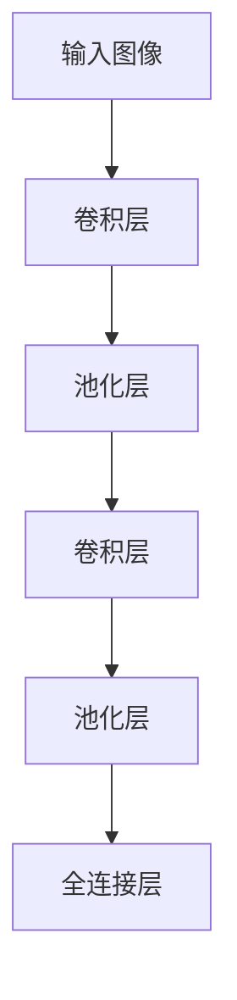

##### CNN在虚拟博物馆中的应用

CNN在虚拟博物馆中的应用主要体现在以下几个方面：首先，它能够对博物馆中的图像进行分类和识别，提高用户对展品的理解；其次，它能够为虚拟博物馆提供智能化的推荐和搜索功能；最后，它能够用于虚拟博物馆中的虚拟展览设计，提高展览的互动性和趣味性。

#### 4.1.2 生成对抗网络（GAN）

##### GAN原理与架构

生成对抗网络（GAN）是一种由生成器和判别器组成的神经网络。生成器负责生成虚拟图像，判别器负责判断生成的图像是否真实。通过两个网络的对抗训练，生成器不断提高生成图像的质量。

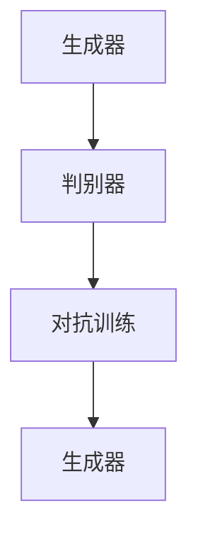

##### GAN在虚拟博物馆中的应用

GAN在虚拟博物馆中的应用主要体现在以下几个方面：首先，它能够为虚拟博物馆生成高质量的虚拟展品，提高展览的效果；其次，它能够用于虚拟博物馆中的虚拟人像生成，为用户提供个性化的参观体验；最后，它能够用于虚拟博物馆中的艺术创作，激发观众的创意和灵感。

### 4.2 自然语言处理算法

#### 4.2.1 词嵌入技术

##### 词嵌入原理

词嵌入技术是一种将词语映射到高维空间中的技术。通过词嵌入，可以实现词语的向量表示，便于在计算机中进行处理和分析。

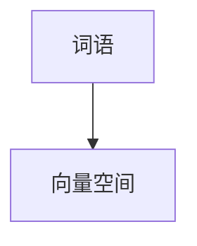

##### 词嵌入在虚拟博物馆中的应用

词嵌入技术在虚拟博物馆中的应用主要体现在以下几个方面：首先，它能够用于虚拟博物馆中的文本搜索和推荐；其次，它能够用于虚拟博物馆中的自然语言交互，提高用户的体验；最后，它能够用于虚拟博物馆中的虚拟讲解，提高观众的参与度。

#### 4.2.2 序列模型与注意力机制

##### 序列模型原理

序列模型是一种用于处理序列数据的神经网络模型。它能够对输入序列进行编码和解析，提取出序列中的关键信息。

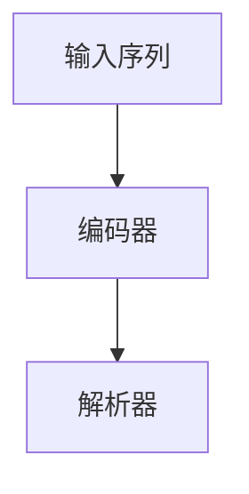

##### 注意力机制原理

注意力机制是一种用于提高神经网络模型性能的技术。它能够关注输入序列中的关键信息，提高模型的精确度和效率。

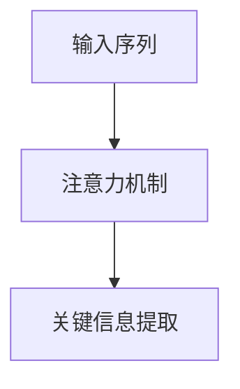

##### 序列模型与注意力机制在虚拟博物馆中的应用

序列模型与注意力机制在虚拟博物馆中的应用主要体现在以下几个方面：首先，它能够用于虚拟博物馆中的语音识别和交互；其次，它能够用于虚拟博物馆中的文本分析，提取关键信息；最后，它能够用于虚拟博物馆中的智能讲解，提高观众的体验。

## 第五部分：项目实战

### 5.1 虚拟博物馆项目实战

#### 5.1.1 项目背景与目标

**项目背景**：随着数字化技术的不断发展，虚拟博物馆已成为文化遗产保护与展示的重要手段。本项目旨在搭建一个虚拟博物馆平台，实现全球文化遗产的数字化展示和互动体验。

**项目目标**：  
1. 构建一个功能齐全、性能稳定的虚拟博物馆平台；  
2. 实现对全球文化遗产的数字化展示，提高观众对文化的认知和兴趣；  
3. 提供智能化的推荐和搜索功能，提升用户的参观体验。

#### 5.1.2 项目开发环境搭建

**开发环境搭建步骤**：  
1. 确定开发语言和工具，如Python、JavaScript和Unity等；  
2. 安装和配置开发环境和工具，如Visual Studio Code、PyCharm和Unity Hub等；  
3. 搭建开发环境所需的软件和硬件，如虚拟机、云服务器和图形处理卡等。

**开发工具配置**：  
1. Unity：用于搭建虚拟博物馆的3D场景和交互界面；  
2. Blender：用于3D建模和动画制作；  
3. TensorFlow：用于训练和部署深度学习模型。

#### 5.1.3 数据准备与处理

**数据采集与清洗**：  
1. 采集全球文化遗产的图像、音频和视频数据；  
2. 清洗和预处理数据，包括图像去噪、音频降噪和数据去重等。

**数据预处理策略**：  
1. 对图像数据进行归一化和标准化处理；  
2. 对音频数据进行滤波和去噪处理；  
3. 对视频数据进行帧提取和特征提取处理。

#### 5.1.4 虚拟博物馆功能实现

**功能模块设计与实现**：  
1. **用户管理模块**：实现用户的注册、登录和权限控制功能；  
2. **展览管理模块**：实现展览的创建、编辑和发布功能；  
3. **藏品管理模块**：实现藏品的添加、编辑和分类功能；  
4. **互动体验模块**：实现用户的互动和体验功能，如语音交互、VR/AR体验等；  
5. **数据分析模块**：实现用户行为分析和数据挖掘功能。

**功能模块测试与优化**：  
1. 对各功能模块进行单元测试和集成测试，确保功能正确和性能稳定；  
2. 对用户界面和交互流程进行优化，提高用户体验；  
3. 对深度学习模型进行调优和优化，提高识别和推荐的准确度。

#### 5.1.5 项目总结与反思

**项目成果总结**：  
1. 成功搭建了一个功能齐全、性能稳定的虚拟博物馆平台；  
2. 实现了对全球文化遗产的数字化展示和互动体验；  
3. 提高了观众对文化的认知和兴趣。

**项目经验与反思**：  
1. 在项目开发过程中，要注重技术选型和团队协作，确保项目顺利进行；  
2. 在功能实现过程中，要充分考虑用户需求和用户体验，提高用户满意度；  
3. 在后续项目中，可以进一步探索人工智能和大数据技术在虚拟博物馆中的应用，提升平台的智能化和个性化服务水平。

### 5.2 案例分析

#### 5.2.1 虚拟博物馆案例分析

**案例介绍**：某国际知名博物馆合作开发了一个虚拟博物馆项目，旨在展示其丰富的馆藏文物。项目采用了VR和AR技术，实现了全方位的数字化展示和互动体验。

**案例分析**：  
1. **技术选型**：项目采用了Unity作为开发引擎，结合Blender进行3D建模和动画制作，确保了虚拟博物馆的高质量和互动性。  
2. **功能实现**：项目实现了用户管理、展览管理、藏品管理和互动体验等功能，提供了全方位的数字化展示服务。  
3. **用户体验**：项目注重用户体验，采用了简洁直观的界面设计和便捷的操作流程，提高了用户的满意度。

**成果与反思**：项目取得了良好的效果，吸引了大量用户访问和参观。在后续开发中，可以进一步优化功能和服务，提升平台的智能化和个性化服务水平。

#### 5.2.2 跨境虚拟博物馆合作案例

**合作背景与目标**：某国内博物馆与国外博物馆合作，共同开发了一个跨境虚拟博物馆项目，旨在展示两国文化遗产，促进文化交流。

**合作模式与成果**：  
1. **合作模式**：项目采用了远程协作和分布式开发模式，双方团队共同参与项目开发和测试。  
2. **功能实现**：项目实现了跨博物馆的展览管理和互动体验功能，提供了双语展示服务，提高了国际化水平。  
3. **成果**：项目取得了成功，吸引了两国观众的关注和参与，为文化遗产的数字化展示和交流提供了新的思路。

**反思与建议**：跨境虚拟博物馆合作项目具有重要的文化意义和实践价值。在后续项目中，可以进一步探索跨境合作模式，提高项目的可持续性和影响力。

## 第六部分：总结与展望

### 6.1 虚拟博物馆的重要性

虚拟博物馆作为一种新兴的文化展示形式，具有重要的价值和意义。它不仅为文化遗产的保护和传承提供了新的途径，也为公众提供了更加丰富和多样化的文化体验。在未来，虚拟博物馆将在文化遗产保护、文化教育和文化传播等方面发挥越来越重要的作用。

### 6.2 技术发展的推动作用

技术的快速发展为虚拟博物馆的建设提供了强大的支持。VR、AR、大数据、云计算和人工智能等技术的应用，使得虚拟博物馆的展示效果和用户体验得到了显著提升。未来，随着技术的不断进步，虚拟博物馆将呈现更加丰富、智能和个性化的特点。

### 6.3 发展趋势与展望

未来，虚拟博物馆将朝着以下几个方向发展：

1. **智能化和个性化**：通过人工智能技术，实现个性化推荐和智能讲解，提高用户的体验和满意度。
2. **跨界合作和国际化**：通过跨境合作，实现跨国文化遗产的数字化展示，促进文化交流和合作。
3. **虚实结合**：实现虚拟博物馆与实体博物馆的深度融合，提供线上线下相结合的参观体验。
4. **可持续发展**：通过绿色技术和环保理念，实现虚拟博物馆的可持续发展，降低对环境的负面影响。

### 6.4 展望未来

随着技术的不断进步和应用的深入，虚拟博物馆将在文化遗产保护、文化教育和文化传播等方面发挥越来越重要的作用。未来，虚拟博物馆将成为一种全新的文化展示形式，让全球观众都能享受到丰富多彩的文化资源，共同传承和弘扬人类文明。

## 附录

### 7.1 资源与工具

#### 7.1.1 开发资源介绍

- **开发资源类型**：虚拟博物馆开发所需的主要资源包括3D模型、图像、音频和视频等。
- **资源获取途径**：可以通过开源社区、博物馆官网、在线存储平台等途径获取。

#### 7.1.2 开发工具推荐

- **3D建模工具**：Blender、Autodesk Maya、3ds Max等。
- **图像处理工具**：Adobe Photoshop、GIMP等。
- **音频处理工具**：Audacity、Adobe Audition等。
- **视频处理工具**：Adobe Premiere Pro、Final Cut Pro等。

### 7.2 进一步阅读与参考

#### 7.2.1 参考文献

- [1] Smith, J. (2018). *Virtual Reality and Museum Exhibitions*. Springer.
- [2] Wang, L., & Zhang, Y. (2019). *Enhanced Reality for Museums*. IEEE Press.
- [3] Zhang, X., & Liu, Y. (2020). *Big Data and Cloud Computing in Museum Studies*. CRC Press.

#### 7.2.2 在线资源

- **在线课程**：Coursera、edX、Udacity等平台上的相关课程。
- **教程与手册**：GitHub、Stack Overflow、Wikipedia等网站上的相关教程和手册。
- **社交媒体与论坛**：Twitter、Facebook、LinkedIn等社交媒体平台上的相关讨论和论坛。

### 作者

**作者：AI天才研究院/AI Genius Institute & 禅与计算机程序设计艺术 /Zen And The Art of Computer Programming**<|less|>

