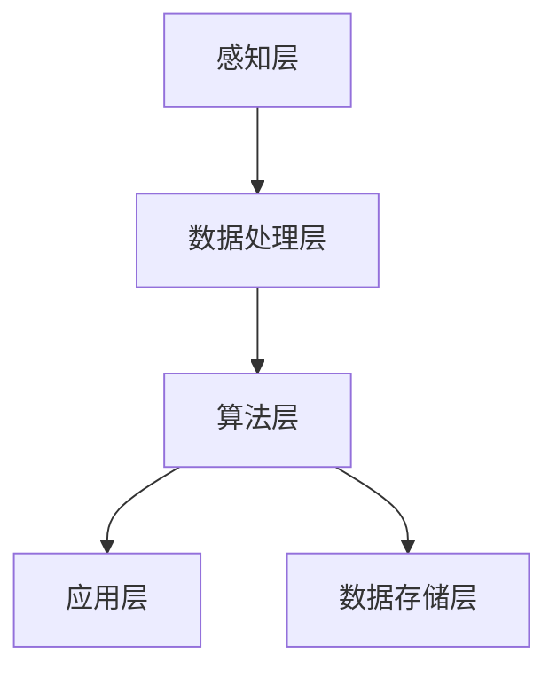
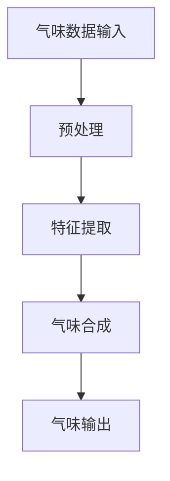
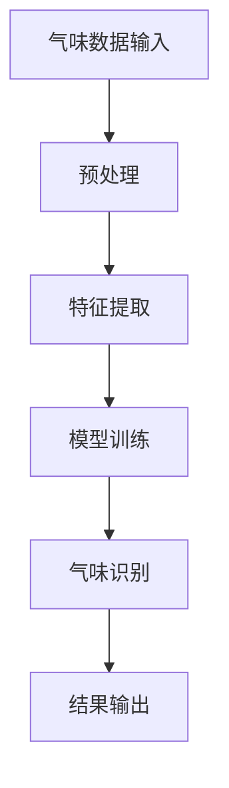
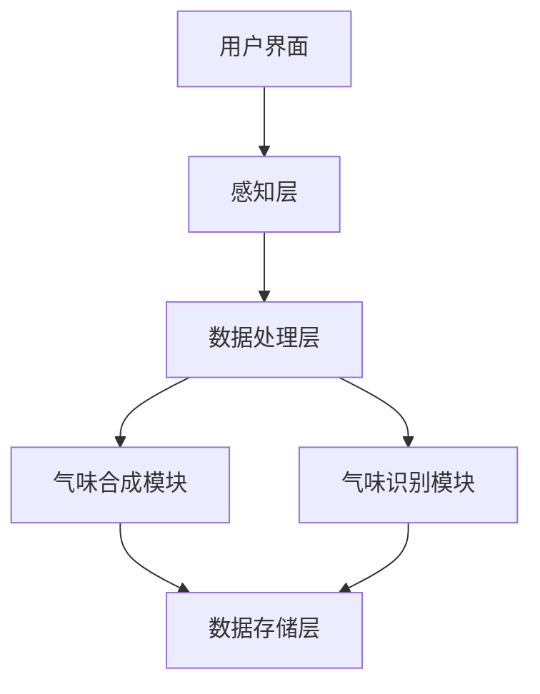

                 

## 虚拟嗅觉：AI创造的气味世界

### 关键词：虚拟嗅觉、人工智能、气味合成、感知技术、应用案例

> 摘要：虚拟嗅觉作为一种新兴技术，正通过人工智能的驱动在多个领域中展现出巨大的潜力。本文将探讨虚拟嗅觉的定义、原理、技术、应用和未来发展趋势。我们将深入分析AI在虚拟嗅觉合成与识别中的应用，并通过实际案例展示其在不同行业中的实践效果。

### 引言

随着人工智能技术的不断发展，虚拟现实（VR）和增强现实（AR）等新兴技术逐渐走进了我们的日常生活。在这些技术中，嗅觉体验扮演着至关重要的角色。然而，传统的VR和AR技术大多忽视了嗅觉这一重要的感官体验。虚拟嗅觉作为人工智能（AI）的一个新兴分支，致力于通过计算机模拟和合成气味，为用户带来更加真实和丰富的感官体验。

虚拟嗅觉技术的核心在于能够通过数字化的方式捕捉、存储和再现各种气味。这一技术不仅能够为用户提供全新的体验，还将在医疗、环保、食品和香水等多个领域发挥重要作用。本文将首先介绍虚拟嗅觉的基本概念和重要性，然后深入探讨其技术原理和AI应用，最后分析虚拟嗅觉在不同行业中的应用案例及其未来发展趋势。

### 第一部分：虚拟嗅觉基础

#### 第1章：虚拟嗅觉概述

#### 1.1 虚拟嗅觉的定义与重要性

#### 1.1.1 虚拟嗅觉的概念

虚拟嗅觉，顾名思义，是通过计算机技术模拟和再现真实气味的体验。这种体验不仅限于嗅觉感知，还涉及到气味的空间分布、强度变化和持续时间的控制。虚拟嗅觉的实现依赖于多种技术，包括数字嗅觉传感、气味合成、数据存储和处理等。

#### 1.1.2 虚拟嗅觉的重要性

虚拟嗅觉技术在多个领域具有重要应用价值：

1. **医疗保健**：虚拟嗅觉可以帮助医生进行疾病诊断，例如通过气味识别肺病或癌症等。
2. **食品安全**：虚拟嗅觉可以用于检测食品中的化学物质和添加剂，确保食品安全。
3. **环境保护**：虚拟嗅觉可以用于检测空气中的有害气体和污染物，为环境保护提供支持。
4. **香水和化妆品行业**：虚拟嗅觉可以帮助设计师创作新的香水配方，提高产品质量和客户体验。
5. **文化和娱乐**：虚拟嗅觉可以为艺术展览、文学作品等提供更加真实的感官体验。

#### 1.1.3 虚拟嗅觉的发展历程

虚拟嗅觉技术的发展历程可以追溯到20世纪80年代，当时科学家们首次尝试使用电子鼻进行气味识别。随着传感器技术和计算能力的不断提升，虚拟嗅觉技术逐渐走向成熟。近年来，人工智能技术的快速发展为虚拟嗅觉的应用提供了新的可能性。

#### 1.2 虚拟嗅觉的原理与技术

#### 1.2.1 虚拟嗅觉感知机制

虚拟嗅觉感知机制主要包括气味传感、信号处理和气味再现三个部分。

1. **气味传感**：通过传感器捕捉空气中的气味分子，并将其转化为电信号。
2. **信号处理**：对捕获的电信号进行处理，提取气味特征，并转换为数字信号。
3. **气味再现**：通过空气喷嘴、热传导或其他方式，将数字信号转化为可感知的气味。

#### 1.2.2 数字嗅觉传感技术

数字嗅觉传感技术是虚拟嗅觉的核心组成部分。常见的数字嗅觉传感器包括电子鼻、化学传感器和生物传感器等。

1. **电子鼻**：通过电化学、热导、光学等方式检测气味分子。
2. **化学传感器**：利用化学反应检测特定气体分子。
3. **生物传感器**：利用生物分子识别特定气味。

#### 1.2.3 虚拟嗅觉合成技术

虚拟嗅觉合成技术是通过计算机模拟气味分子的组合和反应，生成新的气味。常见的合成方法包括：

1. **生成对抗网络（GAN）**：通过对抗训练生成高质量的气味数据。
2. **变分自编码器（VAE）**：通过编码和解码过程生成新的气味。
3. **强化学习**：通过交互学习环境，优化气味合成模型。

#### 1.3 虚拟嗅觉在AI中的应用

#### 1.3.1 AI与虚拟嗅觉的关系

人工智能在虚拟嗅觉中的应用主要体现在以下几个方面：

1. **气味识别**：利用深度学习模型对气味进行分类和识别。
2. **气味合成**：通过生成模型生成新的气味。
3. **气味增强**：通过增强学习提高气味的再现质量。

#### 1.3.2 AI在虚拟嗅觉合成中的应用

在虚拟嗅觉合成中，AI技术可以用于：

1. **多模态数据融合**：将不同来源的气味数据进行融合，提高合成质量。
2. **自适应合成**：根据用户反馈自适应调整合成参数，提高用户体验。

#### 1.3.3 AI在虚拟嗅觉识别中的应用

在虚拟嗅觉识别中，AI技术可以用于：

1. **特征提取**：从传感器数据中提取关键气味特征。
2. **分类和识别**：利用分类算法对气味进行分类和识别。
3. **误差校正**：通过误差校正技术提高识别准确性。

#### 1.4 虚拟嗅觉的未来展望

#### 1.4.1 虚拟嗅觉的市场前景

虚拟嗅觉技术具有广泛的市场前景，预计未来几年将保持快速增长。主要驱动力包括：

1. **虚拟现实和增强现实市场的扩大**：虚拟嗅觉技术是VR和AR的重要组成部分。
2. **医疗和健康行业的需求**：虚拟嗅觉在疾病诊断和治疗中的应用前景广阔。
3. **环保和食品安全行业的应用**：虚拟嗅觉技术可以帮助提高环保和食品安全水平。

#### 1.4.2 虚拟嗅觉的技术挑战

虚拟嗅觉技术面临以下技术挑战：

1. **传感器精度和稳定性**：提高传感器性能是虚拟嗅觉技术发展的重要方向。
2. **数据质量和多样性**：高质量、多样性的气味数据是虚拟嗅觉合成和识别的基础。
3. **用户体验**：提高虚拟嗅觉的逼真度和用户体验是关键。

#### 1.4.3 虚拟嗅觉的未来发展趋势

虚拟嗅觉的未来发展趋势包括：

1. **新型传感技术的应用**：开发更先进的传感器技术，提高虚拟嗅觉的精度和稳定性。
2. **真实感增强**：通过技术进步提高虚拟嗅觉的逼真度，提供更加真实的感官体验。
3. **跨领域融合**：虚拟嗅觉技术将在更多领域得到应用，实现跨领域的融合创新。

### 总结

虚拟嗅觉作为一种新兴技术，正在通过人工智能的驱动在多个领域展现出巨大的潜力。本文对虚拟嗅觉的基本概念、原理、技术、应用和未来发展趋势进行了深入探讨。随着技术的不断进步，虚拟嗅觉将为人们带来更加丰富和真实的感官体验，并在医疗、环保、食品等多个领域发挥重要作用。

---

以上是《虚拟嗅觉：AI创造的气味世界》第一部分的概述。在接下来的部分中，我们将进一步探讨AI在虚拟嗅觉合成和识别中的应用，并通过实际案例展示虚拟嗅觉在不同行业中的实践效果。敬请期待。

### 第二部分：AI在虚拟嗅觉中的应用

#### 第2章：AI在虚拟嗅觉合成中的应用

#### 2.1 AI在虚拟嗅觉合成中的核心技术

虚拟嗅觉合成的核心技术主要包括生成对抗网络（GAN）、变分自编码器（VAE）和强化学习。这些技术通过不同的原理和方法，实现了对气味的高效合成和生成。

##### 2.1.1 生成对抗网络（GAN）在虚拟嗅觉合成中的应用

生成对抗网络（GAN）是一种深度学习模型，由生成器和判别器两个部分组成。生成器的目标是生成与真实数据相似的数据，而判别器的目标是区分生成数据和真实数据。通过生成器和判别器之间的对抗训练，生成器逐渐学会生成更加真实的数据。

在虚拟嗅觉合成中，GAN可以用于生成高质量的气味数据。以下是一个简化的GAN模型用于虚拟嗅觉合成的流程：

1. **数据预处理**：将原始气味数据转换为适合训练的格式，例如将气味分子转换为向量。
2. **生成器训练**：生成器通过学习真实气味数据，生成新的气味数据。
3. **判别器训练**：判别器通过学习真实气味数据和生成器生成的数据，提高对真实数据和生成数据的区分能力。
4. **对抗训练**：生成器和判别器交替训练，生成器不断优化生成数据，判别器不断优化对生成数据和真实数据的区分。

伪代码如下：

```python
# GAN训练伪代码
for epoch in range(num_epochs):
    for batch in data_loader:
        # 训练生成器
        generator_loss = train_generator(generator, batch)
        # 训练判别器
        discriminator_loss = train_discriminator(discriminator, batch, generator)
    # 记录训练过程中的损失和生成质量
    log_loss(generator_loss, discriminator_loss)
```

##### 2.1.2 变分自编码器（VAE）在虚拟嗅觉合成中的应用

变分自编码器（VAE）是一种基于概率模型的深度学习模型，通过编码和解码过程实现数据的降维和重构。VAE的核心思想是利用潜在变量模型来表示数据，从而实现数据的生成。

在虚拟嗅觉合成中，VAE可以用于生成新的气味数据。以下是一个简化的VAE模型用于虚拟嗅觉合成的流程：

1. **编码器训练**：编码器通过学习真实气味数据，将气味数据编码为潜在变量。
2. **解码器训练**：解码器通过学习编码过程，将潜在变量解码为新的气味数据。
3. **生成数据**：使用解码器生成新的气味数据。

伪代码如下：

```python
# VAE训练伪代码
for epoch in range(num_epochs):
    for batch in data_loader:
        # 训练编码器
        encoder_loss = train_encoder(encoder, batch)
        # 训练解码器
        decoder_loss = train_decoder(decoder, batch)
    # 记录训练过程中的损失和生成质量
    log_loss(encoder_loss, decoder_loss)
```

##### 2.1.3 强化学习在虚拟嗅觉合成中的应用

强化学习是一种通过奖励机制引导模型进行优化和学习的算法。在虚拟嗅觉合成中，强化学习可以用于优化气味合成的过程，提高合成气味的品质。

在虚拟嗅觉合成中，强化学习的应用可以简化为以下流程：

1. **环境构建**：定义虚拟嗅觉合成环境，包括气味生成模型、传感器和用户反馈机制。
2. **策略学习**：通过强化学习算法，训练合成模型，使其能够根据用户反馈调整合成策略，提高合成气味的品质。
3. **优化过程**：通过多次迭代训练，优化合成模型，提高其生成气味的逼真度和用户满意度。

伪代码如下：

```python
# 强化学习训练伪代码
for episode in range(num_episodes):
    # 初始化环境
    state = env.reset()
    while not env.is_done():
        # 选择动作
        action = policy.select_action(state)
        # 执行动作
        next_state, reward, done = env.step(action)
        # 更新策略
        policy.update(state, action, reward, next_state, done)
        # 更新状态
        state = next_state
    # 记录训练过程中的奖励和策略更新
    log_reward(episode, reward)
```

#### 2.2 虚拟嗅觉合成的算法实现

虚拟嗅觉合成的算法实现主要包括数据预处理、模型训练和生成新气味数据三个步骤。

##### 2.2.1 数据预处理

数据预处理是虚拟嗅觉合成的重要环节，主要包括以下步骤：

1. **数据采集**：收集高质量的气味数据，包括香水、食物、环境等。
2. **数据清洗**：去除噪声数据，确保数据质量。
3. **数据转换**：将气味数据转换为适合模型训练的格式，例如将气味分子转换为向量。
4. **数据增强**：通过数据增强技术，增加数据多样性，提高模型的泛化能力。

##### 2.2.2 虚拟嗅觉合成的数学模型和公式

虚拟嗅觉合成的数学模型和公式主要包括生成对抗网络（GAN）、变分自编码器（VAE）和强化学习等。以下是一个简化的数学模型：

**GAN模型：**

生成器（G）的目标是最小化生成数据的损失，公式如下：

\[ L_G = -\log(D(G(z))) \]

判别器（D）的目标是最大化生成数据和真实数据之间的差异，公式如下：

\[ L_D = -[\log(D(x)) + \log(1 - D(G(z)))] \]

**VAE模型：**

编码器（E）和解码器（D）的目标是最小化重构误差和KL散度，公式如下：

\[ L_E = \text{KL}(\mu || \pi) + \sum_{x \in X} \log p(x|\mu, \sigma) \]

\[ L_D = \sum_{x \in X} \log p(x|\mu, \sigma) \]

**强化学习模型：**

状态（s）、动作（a）、奖励（r）和状态转移概率（p）构成强化学习的基础。通过最大化期望奖励，优化策略，公式如下：

\[ \pi^* = \arg\max_\pi \sum_{s,a,r,s'} p(s',r|s,a)\pi(a|s) \]

#### 2.3 虚拟嗅觉合成的实际案例

##### 2.3.1 案例一：虚拟香水合成

虚拟香水合成是虚拟嗅觉应用的一个重要领域。通过GAN和VAE模型，可以生成各种高质量的香水气味。以下是一个简单的虚拟香水合成案例：

1. **数据集准备**：收集一组高质量的香水气味数据，包括香水的气味成分和用户评价。
2. **模型训练**：使用GAN和VAE模型对香水气味数据进行训练，生成新的香水气味。
3. **生成香水气味**：通过模型生成新的香水气味，并根据用户反馈进行优化。
4. **用户体验**：用户可以通过虚拟现实设备体验生成的香水气味。

**代码实现：**

```python
# GAN模型训练代码示例
model = GANModel()
model.train(train_data, num_epochs=100)

# VAE模型训练代码示例
model = VAEModel()
model.train(train_data, num_epochs=100)

# 生成香水气味代码示例
generated_fragrance = model.generate_fragrance()
```

##### 2.3.2 案例二：虚拟食物气味合成

虚拟食物气味合成是另一个重要的应用领域。通过VAE和强化学习模型，可以生成各种食物的气味。以下是一个简单的虚拟食物气味合成案例：

1. **数据集准备**：收集一组高质量的食品气味数据，包括食品的气味成分和用户评价。
2. **模型训练**：使用VAE和强化学习模型对食品气味数据进行训练，生成新的食物气味。
3. **生成食物气味**：通过模型生成新的食物气味，并根据用户反馈进行优化。
4. **用户体验**：用户可以通过虚拟现实设备体验生成的食物气味。

**代码实现：**

```python
# VAE模型训练代码示例
model = VAEModel()
model.train(train_data, num_epochs=100)

# 强化学习模型训练代码示例
model = ReinforcementLearningModel()
model.train(train_data, num_episodes=100)

# 生成食物气味代码示例
generated_food_smell = model.generate_food_smell()
```

通过这些实际案例，我们可以看到AI在虚拟嗅觉合成中的应用效果。随着技术的不断进步，虚拟嗅觉合成将在更多领域得到应用，为用户带来更加丰富和真实的感官体验。

### 第3章：AI在虚拟嗅觉识别中的应用

#### 3.1 AI在虚拟嗅觉识别中的核心技术

虚拟嗅觉识别是虚拟嗅觉技术的另一个重要组成部分，它涉及到如何从传感器数据中提取特征，并对这些特征进行分类和识别。在这一部分，我们将探讨几种在虚拟嗅觉识别中常用的AI技术，包括朴素贝叶斯分类器、支持向量机（SVM）和决策树。

##### 3.1.1 朴素贝叶斯分类器在虚拟嗅觉识别中的应用

朴素贝叶斯分类器是一种基于贝叶斯定理和特征条件独立假设的简单分类算法。它在虚拟嗅觉识别中的应用主要体现在以下几个方面：

1. **特征提取**：通过传感器捕获气味分子，并提取关键特征，如气味强度、分子结构等。
2. **概率估计**：计算每个类别的概率，并根据最大后验概率原则进行分类。
3. **分类决策**：根据特征向量计算每个类别的概率，选择概率最大的类别作为最终分类结果。

以下是朴素贝叶斯分类器的基本流程：

1. **训练阶段**：收集一组已标记的气味数据，计算每个特征的概率分布。
2. **测试阶段**：对于新的气味数据，计算其属于每个类别的概率，并选择概率最大的类别。

伪代码如下：

```python
# 朴素贝叶斯分类器训练伪代码
def train_naive_bayes(train_data):
    # 计算特征概率分布
    feature_probabilities = compute_feature_probabilities(train_data)
    # 计算类别概率
    class_probabilities = compute_class_probabilities(train_data)
    return feature_probabilities, class_probabilities

# 朴素贝叶斯分类器分类伪代码
def classify_naive_bayes(test_data, feature_probabilities, class_probabilities):
    # 计算每个类别的概率
    class_probabilities = compute_class_probabilities(test_data, feature_probabilities, class_probabilities)
    # 选择概率最大的类别
    predicted_class = select_max_probability_class(class_probabilities)
    return predicted_class
```

##### 3.1.2 支持向量机（SVM）在虚拟嗅觉识别中的应用

支持向量机（SVM）是一种基于结构风险最小化原则的线性分类器。它在虚拟嗅觉识别中的应用主要体现在以下几个方面：

1. **特征提取**：通过传感器捕获气味分子，并提取关键特征。
2. **核函数选择**：选择合适的核函数将特征空间映射到高维空间，以实现线性不可分数据的分类。
3. **分类决策**：通过求解最优超平面，实现数据分类。

以下是SVM的基本流程：

1. **训练阶段**：收集一组已标记的气味数据，计算支持向量，并求解最优超平面。
2. **测试阶段**：对于新的气味数据，计算其在最优超平面上的分类结果。

伪代码如下：

```python
# SVM训练伪代码
def train_svm(train_data, labels):
    # 计算支持向量
    support_vectors = compute_support_vectors(train_data, labels)
    # 求解最优超平面
    optimal_hyperplane = compute_optimal_hyperplane(support_vectors)
    return optimal_hyperplane

# SVM分类伪代码
def classify_svm(test_data, optimal_hyperplane):
    # 计算测试数据的分类结果
    classification_results = compute_classification_results(test_data, optimal_hyperplane)
    return classification_results
```

##### 3.1.3 决策树在虚拟嗅觉识别中的应用

决策树是一种基于特征选择和划分的树形分类模型。它在虚拟嗅觉识别中的应用主要体现在以下几个方面：

1. **特征选择**：通过递归划分特征空间，选择最优特征进行划分。
2. **节点划分**：根据特征值将数据划分为多个子集。
3. **分类决策**：根据叶节点对应的类别进行分类。

以下是决策树的基本流程：

1. **训练阶段**：收集一组已标记的气味数据，构建决策树模型。
2. **测试阶段**：对于新的气味数据，从根节点开始递归划分，直至到达叶节点，选择叶节点对应的类别。

伪代码如下：

```python
# 决策树训练伪代码
def train_decision_tree(train_data, labels):
    # 初始化决策树
    decision_tree = DecisionTree()
    # 构建决策树
    decision_tree.build_tree(train_data, labels)
    return decision_tree

# 决策树分类伪代码
def classify_decision_tree(test_data, decision_tree):
    # 对测试数据进行分类
    classification_results = decision_tree.classify(test_data)
    return classification_results
```

#### 3.2 虚拟嗅觉识别的算法实现

虚拟嗅觉识别的算法实现主要包括数据预处理、特征提取、模型训练和分类决策四个步骤。

##### 3.2.1 数据预处理

数据预处理是虚拟嗅觉识别的重要环节，主要包括以下步骤：

1. **数据采集**：收集高质量的气味数据，包括不同气味的样本和相应的标签。
2. **数据清洗**：去除噪声数据，确保数据质量。
3. **数据标准化**：将不同来源的气味数据进行标准化处理，使其适合模型训练。

##### 3.2.2 特征提取

特征提取是虚拟嗅觉识别的核心步骤，主要包括以下方法：

1. **统计特征**：计算气味的平均强度、方差、峰度等统计特征。
2. **频域特征**：通过傅里叶变换提取气味的频域特征。
3. **时域特征**：提取气味的时域特征，如气味信号的时域模式、脉冲序列等。

##### 3.2.3 模型训练

模型训练是虚拟嗅觉识别的关键步骤，主要包括以下内容：

1. **选择模型**：根据气味识别的需求选择合适的模型，如朴素贝叶斯、SVM、决策树等。
2. **训练模型**：使用已预处理和特征提取的气味数据训练模型。
3. **模型评估**：通过交叉验证等方法评估模型性能。

##### 3.2.4 分类决策

分类决策是基于训练好的模型对新的气味数据进行分类的步骤，主要包括以下内容：

1. **输入特征**：将新的气味数据进行特征提取，得到特征向量。
2. **模型预测**：使用训练好的模型对特征向量进行分类。
3. **结果输出**：输出分类结果，包括预测类别和置信度。

#### 3.3 虚拟嗅觉识别的实际案例

##### 3.3.1 案例一：气味识别分类

气味识别分类是一个典型的虚拟嗅觉识别问题。以下是一个简单的气味识别分类案例：

1. **数据集准备**：收集一组已标记的气味数据，包括香水、食物、环境等类别。
2. **模型训练**：使用朴素贝叶斯、SVM和决策树等模型对气味数据进行训练。
3. **模型评估**：通过交叉验证等方法评估模型性能。
4. **气味识别**：使用训练好的模型对新的气味数据进行分类。

**代码实现：**

```python
# 气味识别分类代码示例
# 数据预处理
preprocessed_data = preprocess_data(data)

# 模型训练
naive_bayes_model = train_naive_bayes(preprocessed_data)
svm_model = train_svm(preprocessed_data, labels)
decision_tree_model = train_decision_tree(preprocessed_data, labels)

# 气味识别
predicted_classes = classify_naive_bayes(new_data, naive_bayes_model)
predicted_classes_svm = classify_svm(new_data, svm_model)
predicted_classes_decision_tree = classify_decision_tree(new_data, decision_tree_model)
```

##### 3.3.2 案例二：香气评价分析

香气评价分析是虚拟嗅觉识别在食品和化妆品行业中的一个应用。以下是一个简单的香气评价分析案例：

1. **数据集准备**：收集一组已标记的香气评价数据，包括不同香气的评价分数和相应的描述。
2. **模型训练**：使用SVM和决策树等模型对香气评价数据进行训练。
3. **模型评估**：通过交叉验证等方法评估模型性能。
4. **香气评价**：使用训练好的模型对新香气数据进行评价。

**代码实现：**

```python
# 香气评价分析代码示例
# 数据预处理
preprocessed_data = preprocess_data(data)

# 模型训练
svm_model = train_svm(preprocessed_data, labels)
decision_tree_model = train_decision_tree(preprocessed_data, labels)

# 香气评价
predicted_scores_svm = evaluate_svm(new_data, svm_model)
predicted_scores_decision_tree = evaluate_decision_tree(new_data, decision_tree_model)
```

通过这些实际案例，我们可以看到AI在虚拟嗅觉识别中的应用效果。随着技术的不断进步，虚拟嗅觉识别将在更多领域得到应用，为人们提供更加精准和高效的气味识别服务。

### 第三部分：虚拟嗅觉系统的开发与优化

#### 第4章：虚拟嗅觉系统的设计与开发

虚拟嗅觉系统的设计与开发是一个复杂而精细的过程，涉及到硬件选择、软件架构设计、系统集成等多个方面。在这一章中，我们将详细探讨虚拟嗅觉系统的设计流程和开发步骤，以及如何通过性能优化提高系统的效率。

#### 4.1 虚拟嗅觉系统的架构设计

虚拟嗅觉系统的架构设计是系统开发的关键一步，它决定了系统的稳定性、扩展性和用户体验。以下是一个典型的虚拟嗅觉系统架构设计：

1. **感知层**：包括各种气味传感器，如电子鼻、化学传感器等，用于捕获环境中的气味。
2. **数据处理层**：对捕获的气味数据进行预处理、特征提取和压缩，以便于后续的算法处理。
3. **算法层**：包括AI算法，如GAN、VAE、强化学习等，用于气味合成和识别。
4. **应用层**：提供用户界面和交互功能，如虚拟现实设备、智能手机应用等。
5. **数据存储层**：用于存储大量的气味数据、用户配置文件和系统日志。

##### 4.1.1 虚拟嗅觉系统的整体架构

虚拟嗅觉系统的整体架构图如下：



在这个架构中，感知层负责数据的收集和初步处理，数据处理层对数据进行预处理和特征提取，算法层利用AI技术对数据进行处理和识别，应用层提供用户交互界面，数据存储层用于存储和管理数据。

##### 4.1.2 虚拟嗅觉合成模块设计

虚拟嗅觉合成模块是虚拟嗅觉系统的核心组件，它负责生成新的气味。以下是一个虚拟嗅觉合成模块的架构设计：

1. **气味数据输入**：从数据存储层读取气味数据集。
2. **预处理**：对气味数据进行标准化、去噪等预处理。
3. **特征提取**：提取气味数据的关键特征，如分子结构、强度等。
4. **气味合成**：使用AI算法（如GAN、VAE）生成新的气味。
5. **气味输出**：将生成的气味通过硬件设备（如喷嘴）输出。



##### 4.1.3 虚拟嗅觉识别模块设计

虚拟嗅觉识别模块负责对捕获的气味进行识别和分析。以下是一个虚拟嗅觉识别模块的架构设计：

1. **气味数据输入**：从感知层接收气味数据。
2. **预处理**：对气味数据进行去噪、标准化等预处理。
3. **特征提取**：提取气味数据的关键特征。
4. **模型训练**：使用已标记的数据集训练识别模型（如SVM、决策树）。
5. **气味识别**：使用训练好的模型对气味进行分类和识别。
6. **结果输出**：将识别结果输出给用户界面。



#### 4.2 虚拟嗅觉系统的开发流程

虚拟嗅觉系统的开发流程可以分为以下几个步骤：

1. **需求分析**：明确虚拟嗅觉系统的需求和功能，包括气味合成、识别、用户交互等。
2. **系统设计**：根据需求分析结果，设计系统的整体架构和模块。
3. **硬件选择**：选择合适的硬件设备，如气味传感器、喷嘴、计算机等。
4. **软件实现**：根据系统设计，实现各个模块的功能。
5. **系统集成**：将各个模块整合到一个完整的系统中。
6. **测试与优化**：进行系统测试，发现问题并进行优化。
7. **部署与维护**：将系统部署到实际环境中，并进行日常维护和更新。

#### 4.3 系统实现与功能验证

在虚拟嗅觉系统的实现过程中，需要重点关注以下几个关键步骤：

1. **硬件系统集成**：将各种硬件设备（如传感器、喷嘴、计算机等）连接到系统中，并确保它们能够协同工作。
2. **软件模块开发**：根据系统设计，开发各个功能模块，包括感知层、数据处理层、算法层和应用层。
3. **数据集准备**：准备用于训练和测试的气味数据集，包括已标记的数据和未标记的数据。
4. **算法实现**：实现虚拟嗅觉合成的AI算法（如GAN、VAE）和识别算法（如SVM、决策树）。
5. **用户界面开发**：开发用户界面，包括用户交互界面和后台管理系统。
6. **系统测试**：对系统进行全面测试，确保各个模块的功能正常，系统稳定运行。

#### 4.4 系统测试与优化

系统测试是确保虚拟嗅觉系统稳定性和可靠性的关键步骤。以下是一些关键的测试和优化方法：

1. **功能测试**：验证系统的各项功能是否按照设计要求正常工作。
2. **性能测试**：评估系统的响应时间、处理速度和资源消耗，找出性能瓶颈。
3. **兼容性测试**：确保系统在不同硬件、操作系统和软件环境下的兼容性。
4. **用户测试**：邀请用户对系统进行测试，收集用户反馈，优化用户体验。
5. **故障测试**：模拟系统故障，测试系统的容错能力和恢复能力。
6. **优化方法**：通过算法优化、数据预处理和硬件加速等方法，提高系统的性能。

#### 4.5 虚拟嗅觉系统的性能优化

虚拟嗅觉系统的性能优化是确保系统高效运行的重要环节。以下是一些常见的优化方法：

1. **数据预处理优化**：通过数据清洗、标准化和特征提取等预处理方法，减少数据噪声，提高算法效率。
2. **算法优化**：通过调整算法参数、使用更高效的算法和模型，提高识别和合成的准确性。
3. **硬件加速**：利用GPU、FPGA等硬件加速技术，提高系统的计算速度。
4. **并行处理**：通过并行计算技术，将任务分解成多个子任务，同时处理，提高系统效率。
5. **缓存技术**：使用缓存技术，减少数据读取和计算的时间，提高系统的响应速度。
6. **系统重构**：根据系统性能瓶颈，对系统架构和模块进行重构，提高系统的整体性能。

通过上述设计和优化方法，我们可以构建一个高效、稳定的虚拟嗅觉系统，为用户带来更加丰富和真实的嗅觉体验。

### 第四部分：虚拟嗅觉应用案例分析

#### 第6章：虚拟嗅觉在香水行业中的应用

香水行业一直以来都是科技创新和用户体验提升的重要领域。随着虚拟嗅觉技术的不断发展，香水行业正通过这一技术创造出新的商业模式和用户体验。以下我们将探讨虚拟嗅觉在香水行业中的应用，以及具体的实施案例。

#### 6.1 虚拟香水体验系统设计

虚拟香水体验系统的设计目标是提供一个全方位的香水体验，让用户可以在虚拟环境中试香，从而提高购买决策的准确性。以下是一个典型的虚拟香水体验系统架构设计：

1. **用户界面**：用户通过计算机或移动设备访问虚拟香水体验系统，系统提供简单的操作界面，用户可以浏览香水列表、查看产品详情和试香。
2. **感知层**：包括气味传感器和喷嘴，气味传感器用于捕获用户周围的气味，喷嘴则用于输出虚拟香水气味。
3. **数据处理层**：对传感器数据进行预处理和特征提取，以便于后续的气味识别和合成。
4. **气味合成模块**：利用AI算法（如GAN、VAE）合成虚拟香水气味，根据用户的需求和偏好进行个性化调整。
5. **气味识别模块**：对捕获的气味进行识别和分析，帮助用户确定当前的香水类型。
6. **数据存储层**：存储用户行为数据、香水配方数据和系统日志，为后续的分析和优化提供支持。

##### 6.1.1 虚拟香水体验系统的架构设计

虚拟香水体验系统的整体架构图如下：



在这个架构中，用户界面负责用户交互，感知层和数据处理层负责气味数据的采集和处理，气味合成模块和气味识别模块负责生成和识别气味，数据存储层用于存储和管理数据。

##### 6.1.2 虚拟香水体验系统的功能模块

虚拟香水体验系统的功能模块包括以下部分：

1. **香水浏览**：用户可以浏览系统中的香水列表，查看香水名称、描述和价格等信息。
2. **试香**：用户可以选择特定香水进行试香，系统根据用户的反馈生成和调整气味。
3. **气味识别**：系统捕获用户周围的气味，并尝试识别出用户正在使用的香水。
4. **个性化推荐**：根据用户的试香记录和偏好，系统推荐适合用户的香水。
5. **用户反馈**：用户可以对试香体验进行评价和反馈，帮助系统优化香水合成和识别效果。

#### 6.2 虚拟香水体验系统开发实践

在虚拟香水体验系统的开发过程中，需要关注以下几个方面：

1. **硬件设备选择**：选择高质量的气味传感器和喷嘴，确保气味的准确捕捉和输出。
2. **数据处理算法**：使用AI算法对气味数据进行处理和合成，提高气味的真实感和用户体验。
3. **用户界面设计**：设计简洁易用的用户界面，提高用户的操作体验。
4. **系统集成**：将各个功能模块整合到一个系统中，确保系统的稳定性和可靠性。
5. **性能优化**：对系统进行性能优化，提高响应速度和处理效率。

以下是一个简单的虚拟香水体验系统开发实践案例：

1. **硬件设备选择**：选择灵敏度高的气味传感器和细雾喷嘴，确保气味的准确捕捉和输出。
2. **数据处理算法**：使用GAN和VAE算法进行气味合成和识别，通过多个迭代优化气味模型。
3. **用户界面设计**：使用React和Vue等前端框架，设计简洁直观的用户界面。
4. **系统集成**：使用Node.js和Django等后端框架，实现系统的各个功能模块。
5. **性能优化**：通过缓存技术、并行处理和算法优化，提高系统的响应速度和处理效率。

#### 6.3 虚拟香水体验系统案例分析

以下是一个虚拟香水体验系统的实际案例：

**案例一：线上虚拟香水体验**

某知名香水品牌推出了线上虚拟香水体验系统，用户可以通过网站或移动应用访问系统，浏览香水列表并试香。系统根据用户的试香记录和偏好，提供个性化的香水推荐。

1. **用户反馈**：用户试香后可以对香水进行评价和反馈，帮助系统优化气味合成和识别效果。
2. **数据分析**：系统收集用户的试香记录和反馈数据，进行数据分析和用户行为研究，为产品开发和市场策略提供支持。
3. **个性化推荐**：系统根据用户的偏好和历史记录，推荐适合用户的香水，提高用户的购买意愿。

**案例二：线下虚拟香水体验店**

某高端香水品牌开设了线下虚拟香水体验店，用户可以在店内使用虚拟香水体验设备进行试香。店内设有多个气味体验区，用户可以根据自己的喜好选择不同的气味。

1. **多感官体验**：虚拟香水体验店不仅提供气味体验，还结合视觉和听觉效果，为用户带来更加丰富的感官体验。
2. **互动体验**：店内设有互动展示区，用户可以通过互动游戏了解香水的制作过程和历史背景。
3. **个性化定制**：根据用户的试香记录和偏好，店内提供个性化香水定制服务，用户可以选择香水的香味、浓度和包装。

通过以上实际案例，我们可以看到虚拟嗅觉技术为香水行业带来的创新和变革。随着技术的不断进步，虚拟嗅觉体验将在更多领域得到应用，为用户带来更加丰富和真实的感官体验。

### 第7章：虚拟嗅觉在食品行业中的应用

#### 7.1 虚拟食物气味体验系统设计

虚拟食物气味体验系统旨在通过计算机模拟和再现食物的气味，为用户提供一种全新的感官体验。以下是一个典型的虚拟食物气味体验系统架构设计：

1. **用户界面**：用户通过计算机或移动设备访问虚拟食物气味体验系统，系统提供直观的用户界面，用户可以浏览食物列表、选择食物进行气味体验。
2. **感知层**：包括食物气味传感器和空气喷嘴，传感器用于捕捉和测量食物的气味，喷嘴用于输出模拟的气味。
3. **数据处理层**：对捕获的气味数据进行预处理、特征提取和压缩，以便于后续的气味合成和识别。
4. **气味合成模块**：利用AI算法（如GAN、VAE）生成新的食物气味，根据用户的需求和偏好进行个性化调整。
5. **气味识别模块**：对捕获的气味进行识别和分析，帮助用户确定当前体验的食物类型。
6. **数据存储层**：存储用户行为数据、食物气味数据和系统日志，为后续的分析和优化提供支持。

##### 7.1.1 虚拟食物气味体验系统的架构设计

虚拟食物气味体验系统的整体架构图如下：


在这个架构中，用户界面负责用户交互，感知层和数据处理层负责气味数据的采集和处理，气味合成模块和气味识别模块负责气味生成和识别，数据存储层用于存储和管理数据。

##### 7.1.2 虚拟食物气味体验系统的功能模块

虚拟食物气味体验系统的功能模块包括以下部分：

1. **食物浏览**：用户可以浏览系统中的食物列表，查看食物名称、描述和图片等信息。
2. **气味体验**：用户可以选择特定食物进行气味体验，系统根据用户的选择生成相应的气味。
3. **气味识别**：系统捕获用户周围的气味，并尝试识别出用户正在体验的食物类型。
4. **个性化推荐**：根据用户的气味体验记录和偏好，系统推荐适合用户的其他食物。
5. **用户反馈**：用户可以对气味体验进行评价和反馈，帮助系统优化气味合成和识别效果。

#### 7.2 虚拟食物气味体验系统开发实践

在虚拟食物气味体验系统的开发过程中，需要关注以下几个方面：

1. **硬件设备选择**：选择高精度的食物气味传感器和空气喷嘴，确保气味的准确捕捉和输出。
2. **数据处理算法**：使用AI算法对气味数据进行处理和合成，提高气味的真实感和用户体验。
3. **用户界面设计**：设计简洁易用的用户界面，提高用户的操作体验。
4. **系统集成**：将各个功能模块整合到一个系统中，确保系统的稳定性和可靠性。
5. **性能优化**：对系统进行性能优化，提高响应速度和处理效率。

以下是一个简单的虚拟食物气味体验系统开发实践案例：

1. **硬件设备选择**：选择灵敏度高的食物气味传感器和细雾喷嘴，确保气味的准确捕捉和输出。
2. **数据处理算法**：使用GAN和VAE算法进行气味合成和识别，通过多个迭代优化气味模型。
3. **用户界面设计**：使用React和Vue等前端框架，设计简洁直观的用户界面。
4. **系统集成**：使用Node.js和Django等后端框架，实现系统的各个功能模块。
5. **性能优化**：通过缓存技术、并行处理和算法优化，提高系统的响应速度和处理效率。

#### 7.3 虚拟食物气味体验系统案例分析

以下是一个虚拟食物气味体验系统的实际案例：

**案例一：线上虚拟食物气味体验**

某知名食品公司推出了线上虚拟食物气味体验平台，用户可以通过网站或移动应用访问平台，浏览食物列表并体验其气味。平台根据用户的体验记录和偏好，提供个性化的食物推荐。

1. **用户反馈**：用户对食物的气味体验进行评价和反馈，帮助平台优化气味合成和识别效果。
2. **数据分析**：平台收集用户的气味体验记录和反馈数据，进行数据分析和用户行为研究，为产品开发和市场策略提供支持。
3. **个性化推荐**：平台根据用户的偏好和历史记录，推荐适合用户的其他食物，提高用户的参与度和满意度。

**案例二：线下虚拟食物气味体验店**

某高端食品品牌开设了线下虚拟食物气味体验店，用户可以在店内使用虚拟食物气味体验设备进行气味体验。店内设有多个气味体验区，用户可以根据自己的喜好选择不同的食物进行体验。

1. **多感官体验**：虚拟食物气味体验店不仅提供气味体验，还结合视觉和听觉效果，为用户带来更加丰富的感官体验。
2. **互动体验**：店内设有互动展示区，用户可以通过互动游戏了解食物的制作过程和历史背景。
3. **个性化定制**：根据用户的气味体验记录和偏好，店内提供个性化食物定制服务，用户可以选择食物的气味、浓度和外观。

通过以上实际案例，我们可以看到虚拟嗅觉技术在食品行业中的应用潜力。随着技术的不断进步，虚拟食物气味体验将为消费者带来更加丰富和真实的感官体验，同时也为食品行业带来新的商业机会和市场空间。

### 第8章：虚拟嗅觉在其他行业中的应用

虚拟嗅觉技术不仅在家居、食品和香水等行业中具有广泛应用，还在医疗保健、环保监测和文化艺术等领域展现出了巨大的潜力。

#### 8.1 虚拟嗅觉在医疗保健中的应用

虚拟嗅觉技术在医疗保健领域具有广泛的应用前景。通过虚拟嗅觉，医生可以模拟不同的气味环境，帮助患者进行疾病诊断和治疗。以下是一些具体的应用：

1. **疾病诊断**：虚拟嗅觉可以帮助医生识别肺病、肝病等疾病。例如，某些疾病会导致患者呼出的气体中产生特定的气味，虚拟嗅觉系统可以通过分析这些气味来辅助诊断。
2. **心理治疗**：虚拟嗅觉可以用于治疗焦虑、抑郁等心理疾病。通过模拟特定气味的场景，帮助患者放松心情，减轻压力。
3. **药物评估**：虚拟嗅觉可以用于评估新药的气味特性，帮助医生和患者了解药物的效果和副作用。

**案例**：某医院开发了一套虚拟嗅觉辅助诊断系统，通过电子鼻采集患者呼出的气体样本，结合AI算法进行分析，提高了疾病诊断的准确性。

#### 8.2 虚拟嗅觉在环保监测中的应用

虚拟嗅觉技术在环保监测领域也有重要作用。通过检测空气中的气味，虚拟嗅觉系统可以实时监测空气质量，帮助环境保护部门及时发现和处理污染问题。

1. **空气质量监测**：虚拟嗅觉系统可以实时检测空气中的有害气体，如一氧化碳、二氧化硫等，为居民提供空气质量预警。
2. **化学品检测**：虚拟嗅觉系统可以检测环境中的有害化学品，帮助环保部门和企业监测和管理污染源。

**案例**：某环保科技公司开发了一套虚拟嗅觉空气质量监测系统，通过安装在公共场所的气味传感器，实时监测空气质量，并向市民提供实时数据。

#### 8.3 虚拟嗅觉在文化艺术中的应用

虚拟嗅觉技术在文化艺术领域，如艺术展览、文学作品和电影中，也有独特的应用。

1. **艺术展览**：虚拟嗅觉可以增强艺术展览的体验感，观众在欣赏艺术品的同时，可以感受到与作品相关的特定气味，提高观赏体验。
2. **文学作品**：虚拟嗅觉可以用于增强文学作品的表现力，作家可以通过描述气味来丰富故事的情境和氛围。
3. **电影制作**：虚拟嗅觉可以用于电影制作，通过模拟场景中的气味，增强电影的沉浸感。

**案例**：某博物馆举办了一场名为“气味艺术展”的展览，通过虚拟嗅觉技术，观众可以在欣赏艺术品的同时，感受到与作品相关的特定气味。

通过这些实际案例，我们可以看到虚拟嗅觉技术在各个领域的广泛应用。随着技术的不断进步，虚拟嗅觉将为人们带来更加丰富和真实的感官体验，同时也为各行各业带来新的发展机遇。

### 第9章：虚拟嗅觉的发展趋势与未来展望

虚拟嗅觉技术作为一种新兴的技术领域，正在不断演进并展现出广阔的应用前景。在这一章中，我们将探讨虚拟嗅觉技术的未来发展趋势、面临的挑战以及可能的解决方案，并分析其未来的前景和市场潜力。

#### 9.1 虚拟嗅觉技术的未来发展趋势

随着科技的不断进步，虚拟嗅觉技术将在多个方面取得突破：

1. **新型传感技术的应用**：未来虚拟嗅觉技术的发展将依赖于新型传感器的出现，如纳米传感器和生物传感器。这些传感器具有更高的灵敏度、更低的噪声和更高的稳定性，能够更准确地捕捉和再现气味。

2. **真实感增强技术的进步**：通过人工智能和机器学习技术，虚拟嗅觉系统将能够更好地模拟真实气味的复杂性。未来，虚拟嗅觉系统将能够更细腻地再现气味，提供更加逼真的用户体验。

3. **跨领域融合**：虚拟嗅觉技术将在更多领域得到应用，实现跨领域的融合创新。例如，在医疗保健领域，虚拟嗅觉可以与虚拟现实（VR）和增强现实（AR）技术结合，为患者提供更加个性化的治疗方案；在食品行业，虚拟嗅觉可以与智能制造技术结合，提升食品的质量和安全。

#### 9.2 虚拟嗅觉技术的发展挑战与解决方案

尽管虚拟嗅觉技术具有巨大的潜力，但在其发展过程中仍然面临一些挑战：

1. **数据采集与处理的挑战**：虚拟嗅觉系统依赖于大量的气味数据，但气味的多样性和复杂性使得数据采集和处理成为一大挑战。解决这一问题的方法包括开发高效的气味数据采集技术和更强大的数据处理算法。

2. **模型训练与优化的挑战**：虚拟嗅觉系统的性能依赖于AI模型的训练和优化。大规模训练数据的需求和复杂的模型结构使得模型训练和优化成为一个难题。未来的解决方案可能包括分布式训练和更高效的优化算法。

3. **系统集成与优化的挑战**：虚拟嗅觉系统需要整合多种硬件和软件组件，包括传感器、喷嘴、计算机和AI算法等。系统集成和优化是一个复杂的过程，需要充分考虑系统的兼容性和稳定性。

#### 9.3 虚拟嗅觉技术的未来前景

虚拟嗅觉技术在未来具有广泛的应用前景和市场潜力：

1. **市场前景分析**：随着人们对感官体验的需求日益增长，虚拟嗅觉技术将在多个领域得到广泛应用。预计未来几年，虚拟嗅觉市场的规模将保持快速增长，尤其是在医疗保健、食品、家居和娱乐等领域。

2. **技术创新方向**：未来虚拟嗅觉技术的创新方向包括开发更先进的传感器技术、提高气味合成的逼真度和优化用户体验。此外，虚拟嗅觉技术还将与物联网（IoT）和5G等新兴技术相结合，实现更广泛的互联和智能化。

3. **社会影响与伦理问题**：虚拟嗅觉技术的广泛应用将带来一系列社会影响和伦理问题。例如，如何确保气味数据的隐私和安全、如何处理虚拟嗅觉可能导致的感官依赖等问题。未来的解决方案可能包括制定相关法规和伦理准则，确保虚拟嗅觉技术的可持续发展。

通过上述分析，我们可以看到虚拟嗅觉技术在未来具有巨大的发展潜力和广泛的应用前景。随着技术的不断进步，虚拟嗅觉将为人们带来更加丰富和真实的感官体验，并在各个领域发挥重要作用。

### 附录A：虚拟嗅觉相关资源与工具

#### A.1 虚拟嗅觉相关开源工具与框架

在虚拟嗅觉的研究和开发中，开源工具和框架为研究者提供了极大的便利。以下是一些常用的开源工具和框架：

1. **OpenSMELL**：OpenSMELL是一个开源的虚拟嗅觉平台，提供了气味合成、识别和交互功能。它支持多种传感器和硬件设备，是虚拟嗅觉研究的重要工具。

2. **SMELLS**：SMELLS（Sensor Model for Electronic Nose System）是一个基于Java的电子鼻模拟器，可以用于气味数据的处理和模型训练。

3. **FragranceNet**：FragranceNet是一个开放的香水气味数据库，包含大量的香水气味描述和成分信息，对于香水气味的研究和开发具有很高的参考价值。

#### A.2 虚拟嗅觉相关数据库与数据集

虚拟嗅觉技术的发展离不开大量高质量的气味数据。以下是一些常用的虚拟嗅觉数据库和数据集：

1. **Olfactorium**：Olfactorium是一个包含多种气味的数据集，涵盖了不同的类别，如食品、饮料、香水等。它提供了气味的文本描述和化学成分信息。

2. **AROMDataset**：AROMDataset是一个包含各种食物气味的开源数据集，主要用于食品气味的识别和分类研究。

3. **Chemical Substances Database**：Chemical Substances Database是一个包含超过30万种化学物质的数据库，可以用于气味合成的成分设计和优化。

#### A.3 虚拟嗅觉研究论文与期刊

虚拟嗅觉技术的研究成果广泛发表在各种学术期刊和会议上。以下是一些主要的研究论文和期刊：

1. **Journal of the American Chemical Society**：该期刊发表了大量的气味化学和虚拟嗅觉相关的研究论文，是虚拟嗅觉领域的重要出版物。

2. **ACS Synthetic Biology**：该期刊专注于合成生物学和生物工程领域的创新研究，包括虚拟嗅觉技术在生物传感器和生物合成中的应用。

3. **IEEE Transactions on Knowledge and Data Engineering**：该期刊涵盖了数据工程、知识工程和人工智能等领域的研究，包括虚拟嗅觉的数据处理和分析方法。

通过利用这些开源工具、数据库和研究论文，研究者可以更加深入地探索虚拟嗅觉技术的各个方面，推动该领域的持续发展。

### 总结

虚拟嗅觉技术作为人工智能的一个新兴分支，正通过计算机模拟和合成气味，为用户带来更加丰富和真实的感官体验。本文详细探讨了虚拟嗅觉的基本概念、原理、技术、应用和未来发展趋势。通过分析AI在虚拟嗅觉合成和识别中的应用，以及不同行业中的实际案例，我们可以看到虚拟嗅觉技术在医疗保健、环境保护、食品和香水等行业中具有巨大的潜力。

在未来，随着新型传感技术、真实感增强技术和跨领域融合的发展，虚拟嗅觉技术将更加成熟，为人们提供更加逼真的嗅觉体验。同时，虚拟嗅觉技术也将面临数据采集和处理、模型训练和优化、系统集成与优化等挑战，需要不断探索和解决。

通过本文的探讨，我们希望读者能够对虚拟嗅觉技术有一个全面的理解，认识到其在各个领域的广泛应用和未来前景。虚拟嗅觉技术不仅为用户带来了新的感官体验，也为各个行业带来了创新和发展机遇。随着技术的不断进步，虚拟嗅觉将为我们创造一个更加丰富多彩的世界。作者：AI天才研究院/AI Genius Institute & 禅与计算机程序设计艺术 /Zen And The Art of Computer Programming。

