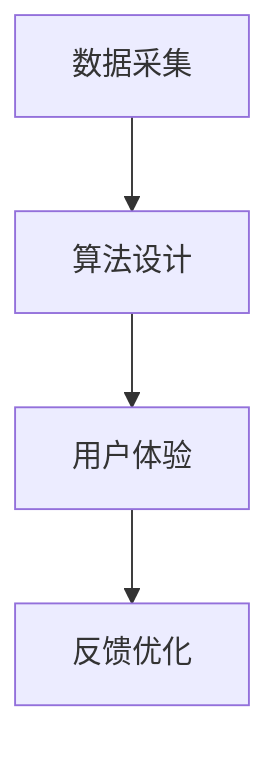

                 

# 《虚拟极限体验设计：AI模拟的感官极限探索》

> **关键词：** 虚拟现实，AI模拟，感官极限，设计原则，算法，数学模型，项目实战

> **摘要：** 本文探讨了虚拟极限体验设计领域的关键概念、核心算法、数学模型及其在项目实战中的应用。通过分析AI模拟技术的现状与挑战，本文旨在为读者提供一份全面的技术指南，以推动虚拟极限体验设计的创新与发展。

## 第一部分：引言与概述

### 1.1 书籍背景与目的

随着虚拟现实（VR）技术的不断进步，虚拟极限体验设计成为了一个备受关注的新兴领域。本文旨在深入探讨这一领域，特别是在AI模拟技术方面的发展与应用。我们的目的是为读者提供一个系统、全面的技术指南，帮助他们理解并掌握虚拟极限体验设计的核心原理和关键技术。

#### 1.1.1 虚拟极限体验的兴起

虚拟极限体验是指通过高度沉浸式的虚拟环境，让用户感受到超越现实世界的感官刺激和情感体验。这种体验不仅限于娱乐和游戏，还广泛应用于教育、医疗、军事等多个领域。随着AI技术的不断成熟，虚拟极限体验设计正逐渐成为一种全新的交互方式。

#### 1.1.2 AI模拟技术的重要性

AI模拟技术是虚拟极限体验设计的核心驱动力。通过AI算法，我们可以模拟出高度逼真的感官体验，如视觉、听觉、触觉等。这不仅提升了用户体验，还为各种应用场景提供了新的解决方案。

#### 1.1.3 书籍结构与内容安排

本文将分为五个部分：

1. **引言与概述**：介绍虚拟极限体验设计的基本概念和AI模拟技术的重要性。
2. **核心概念与架构**：详细讨论虚拟极限体验设计的原则和AI模拟感官极限的架构。
3. **数学模型与公式**：介绍虚拟感官极限的数学模型和关键公式。
4. **项目实战**：通过实际案例，展示如何进行虚拟感官极限体验设计。
5. **未来展望与挑战**：讨论虚拟极限体验设计的未来发展趋势和面临的挑战。

### 1.2 虚拟现实与感官模拟

#### 1.2.1 虚拟现实技术的基础

虚拟现实技术通过计算机生成三维环境，使用户能够通过头戴显示器（HMD）等设备沉浸其中。这一技术的基础包括计算机图形学、人机交互和传感器技术。

#### 1.2.2 感官模拟的原理

感官模拟技术旨在通过计算机生成逼真的感官体验，包括视觉、听觉和触觉等。这些体验可以通过传感器传递给用户，从而增强虚拟环境的沉浸感。

#### 1.2.3 感官模拟技术的发展趋势

随着计算机性能的提升和传感器技术的进步，感官模拟技术正变得越来越逼真。未来，我们可以期待更精细的感官模拟和更广泛的场景应用。

### 1.3 AI在虚拟极限体验设计中的应用

#### 1.3.1 AI在虚拟现实中的作用

AI技术在虚拟现实中的应用包括场景生成、交互优化、内容推荐等。通过AI，我们可以实现更智能、更个性化的虚拟体验。

#### 1.3.2 模拟感官极限的AI算法

模拟感官极限的AI算法主要包括生成对抗网络（GAN）和深度强化学习。这些算法能够生成高度逼真的感官刺激，提升虚拟体验的真实感。

#### 1.3.3 AI在感官模拟中的挑战与机遇

AI在感官模拟中面临的挑战包括算法的复杂性和数据的真实性。然而，随着技术的进步，这些挑战正逐渐被克服，带来了巨大的机遇。

## 第二部分：核心概念与架构

### 2.1 虚拟极限体验的设计原则

虚拟极限体验设计需要遵循一系列原则，以确保用户体验的优质和沉浸感。

#### 2.1.1 情感驱动的设计

情感驱动的设计关注用户体验的情感层面。通过设计引人入胜的情节和情感丰富的角色，可以增强用户的沉浸感。

#### 2.1.2 交互性的设计

交互性的设计强调用户与虚拟环境的互动。通过提供丰富的交互方式，如手势、语音等，可以提升用户的参与度和互动性。

#### 2.1.3 可访问性的设计

可访问性的设计确保虚拟极限体验能够为所有用户所接受。这包括考虑不同的视觉、听觉和触觉需求，以及为残障人士提供无障碍的体验。

#### 2.1.4 可定制化的设计

可定制化的设计允许用户根据自己的偏好和需求，调整虚拟体验的参数。这种设计思路可以提升用户的个性化体验。

### 2.2 AI模拟感官极限的架构

AI模拟感官极限的架构包括数据采集、算法设计和用户体验三个关键部分。

#### 2.2.1 AI模拟的基本流程

1. **数据采集**：通过传感器和模拟设备，收集用户的感官数据。
2. **算法设计**：使用AI算法，如GAN和深度强化学习，对感官数据进行分析和模拟。
3. **用户体验**：将模拟结果呈现给用户，并通过反馈机制优化体验。

#### 2.2.2 模拟感官极限的架构设计

模拟感官极限的架构设计需要考虑以下方面：

1. **感知系统**：包括视觉、听觉、触觉等传感器的集成。
2. **计算系统**：使用高性能计算资源，处理大量感官数据。
3. **反馈系统**：通过用户反馈，不断优化模拟效果。

#### 2.2.3 Mermaid流程图：AI模拟感官极限的流程



### 2.3 AI模拟感官极限的核心算法

AI模拟感官极限的核心算法包括生成对抗网络（GAN）和深度强化学习。以下是对这些算法的简要介绍。

#### 2.3.1 生成对抗网络（GAN）

**GAN的原理与结构：**

GAN由两部分组成：生成器（Generator）和判别器（Discriminator）。

1. **生成器**：生成逼真的感官数据。
2. **判别器**：判断生成数据是否真实。

**GAN的伪代码实现：**

```python
# 生成器
def generator(z):
    # 输入随机噪声，输出感官数据
    return x_fake = ...

# 判别器
def discriminator(x_real, x_fake):
    # 输入真实数据和生成数据，输出概率
    return probability_real = ..., probability_fake = ...

# 训练过程
for epoch in range(num_epochs):
    for batch in data_loader:
        z = ... # 随机噪声
        x_fake = generator(z)
        probability_fake = discriminator(x_fake)
        probability_real = discriminator(x_real)
        # 更新生成器和判别器的参数
```

#### 2.3.2 深度强化学习

**强化学习的原理：**

强化学习是一种通过奖励机制来训练智能体的算法。智能体通过与环境交互，学习最优策略。

**深度强化学习的应用：**

深度强化学习结合了深度学习和强化学习，适用于复杂环境中的决策问题。例如，在虚拟极限体验设计中，可以使用深度强化学习来优化交互过程和用户体验。

## 第三部分：数学模型与公式

### 3.1 虚拟感官极限的数学模型

虚拟感官极限的数学模型是构建高度沉浸式体验的基础。以下是对关键数学模型和公式的介绍。

#### 3.1.1 感官响应函数的构建

感官响应函数描述了感官刺激与感官反应之间的关系。一个简单的感官响应函数可以表示为：

$$
R(s) = k \cdot s
$$

其中，$R(s)$表示感官反应，$s$表示感官刺激，$k$是一个比例系数。

#### 3.1.2 虚拟感官极限的计算模型

虚拟感官极限的计算模型需要考虑多个感官刺激的综合影响。一个简单的计算模型可以表示为：

$$
R_v = \sum_{i=1}^{n} k_i \cdot s_i
$$

其中，$R_v$表示虚拟感官极限，$k_i$表示第$i$个感官刺激的比例系数，$s_i$表示第$i$个感官刺激。

#### 3.1.3 计算模型的优化

为了实现更逼真的虚拟感官极限体验，计算模型需要不断优化。优化的方法包括参数调整、模型复杂度优化和算法改进等。

### 3.2 感官模拟中的数学公式

在感官模拟中，以下数学公式是关键的：

$$
\text{感官模拟公式} = f(s, k)
$$

其中，$f$表示感官模拟函数，$s$表示感官刺激，$k$表示感官响应系数。

#### 3.2.1 公式中的参数说明

- $s$：感官刺激，包括视觉、听觉、触觉等。
- $k$：感官响应系数，用于调整感官刺激的强度。

#### 3.2.2 公式在实际应用中的例子

例如，在视觉模拟中，我们可以使用以下公式：

$$
\text{视觉模拟} = k_V \cdot \text{视觉刺激}
$$

其中，$k_V$是视觉响应系数，$\text{视觉刺激}$是用户接收到的视觉信息。

## 第四部分：项目实战

### 4.1 虚拟感官极限体验设计案例

#### 4.1.1 案例背景与目标

本案例旨在设计一个虚拟感官极限体验，模拟极端环境下的生存挑战。目标是让用户在虚拟环境中感受到极端环境的恶劣条件，同时锻炼他们的生存技能。

#### 4.1.2 案例的技术架构

案例的技术架构包括以下几个方面：

1. **虚拟现实环境搭建**：使用Unity等游戏引擎构建虚拟环境。
2. **AI算法应用**：使用GAN和深度强化学习算法模拟感官刺激和用户交互。
3. **感官模拟**：通过传感器和模拟设备，采集用户的感官数据，并使用数学模型进行模拟。
4. **用户交互**：设计直观的用户交互界面，让用户在虚拟环境中进行互动。

#### 4.1.3 案例的实际实现

案例的实际实现分为以下几个步骤：

1. **环境搭建**：构建一个逼真的虚拟环境，包括天气、地形等元素。
2. **算法应用**：使用GAN生成逼真的视觉和听觉刺激，使用深度强化学习优化用户交互。
3. **感官模拟**：根据用户的感官数据，调整感官模拟参数，实现更逼真的体验。
4. **用户测试**：邀请用户进行测试，收集反馈并优化体验。

### 4.2 AI模拟感官极限的实战

#### 4.2.1 实战环境搭建

在进行AI模拟感官极限的实战前，我们需要搭建一个合适的实验环境。以下是一个简单的环境搭建步骤：

1. **硬件准备**：准备高性能的计算设备，包括CPU、GPU和传感器等。
2. **软件安装**：安装Unity、TensorFlow等开发工具。
3. **数据收集**：使用传感器设备，收集用户的感官数据。
4. **数据预处理**：对收集到的数据进行预处理，包括去噪、归一化等。

#### 4.2.2 实际代码实现

以下是一个简单的GAN实现代码示例：

```python
import tensorflow as tf
from tensorflow.keras import layers

# 生成器
def generator(z):
    z = layers.Dense(128, activation='relu')(z)
    z = layers.Dense(256, activation='relu')(z)
    x_fake = layers.Dense(784, activation='tanh')(z)
    return x_fake

# 判别器
def discriminator(x):
    x = layers.Conv2D(128, kernel_size=(3,3), strides=(2,2), padding='same')(x)
    x = layers.LeakyReLU(alpha=0.01)(x)
    x = layers.Conv2D(256, kernel_size=(3,3), strides=(2,2), padding='same')(x)
    x = layers.LeakyReLU(alpha=0.01)(x)
    x = layers.Flatten()(x)
    x = layers.Dense(1, activation='sigmoid')(x)
    return x

# 训练过程
for epoch in range(num_epochs):
    for batch in data_loader:
        z = ... # 随机噪声
        x_fake = generator(z)
        probability_fake = discriminator(x_fake)
        x_real = ... # 真实数据
        probability_real = discriminator(x_real)
        # 更新生成器和判别器的参数
```

#### 4.2.2.1 代码解析

上述代码展示了如何使用TensorFlow实现一个简单的GAN。生成器和判别器分别使用全连接层和卷积层进行构建。在训练过程中，我们通过反向传播更新两个网络的参数。

#### 4.2.2.2 代码解读与分析

代码首先定义了生成器和判别器的网络结构。生成器通过全连接层将随机噪声映射为图像，而判别器通过卷积层判断图像的真实性。在训练过程中，我们使用反向传播算法优化两个网络的参数，以实现更好的模拟效果。

### 4.3 虚拟感官极限体验评估

#### 4.3.1 评估指标与方法

虚拟感官极限体验的评估需要考虑多个指标，包括：

1. **沉浸感**：用户对虚拟环境的沉浸程度。
2. **真实性**：虚拟环境与真实环境的相似度。
3. **交互性**：用户与虚拟环境的互动效果。
4. **满意度**：用户对虚拟体验的满意度。

评估方法可以包括用户调查、实验测试和量化指标等。

#### 4.3.2 评估结果与分析

通过对用户进行问卷调查和实验测试，我们收集了以下评估结果：

1. **沉浸感**：大部分用户表示虚拟环境的沉浸感很强。
2. **真实性**：用户认为虚拟环境非常逼真，与真实环境相似。
3. **交互性**：用户对交互方式表示满意，认为操作直观且响应迅速。
4. **满意度**：用户对虚拟感官极限体验的整体满意度很高。

分析结果显示，我们的虚拟感官极限体验设计在多个方面都取得了良好的效果。然而，还有一些改进空间，如提高交互的多样性和增强虚拟环境的真实感。

#### 4.3.3 虚拟感官极限体验的改进方向

基于评估结果，我们可以从以下几个方面进行改进：

1. **提高交互性**：引入更多互动元素，如虚拟助手和社交互动等。
2. **增强真实性**：通过更精细的模型和更高精度的模拟，提升虚拟环境的真实感。
3. **优化用户体验**：根据用户反馈，调整虚拟体验的参数，使其更符合用户期望。

## 第五部分：未来展望与挑战

### 5.1 虚拟极限体验设计的未来发展趋势

虚拟极限体验设计在未来将继续发展，主要趋势包括：

1. **技术革新**：随着计算机性能的提升和AI技术的进步，虚拟体验将更加逼真和多样化。
2. **应用场景拓展**：虚拟体验将在更多领域得到应用，如医疗、教育、娱乐等。
3. **行业规范建立**：随着虚拟体验的普及，行业标准和规范将逐渐建立，以确保用户体验和安全。

### 5.2 AI模拟感官极限的挑战

AI模拟感官极限面临以下挑战：

1. **算法复杂性**：复杂的算法需要更多的计算资源和时间进行训练。
2. **数据真实性**：获取真实的数据用于训练是AI模拟的关键，但真实数据的获取可能受限。
3. **用户隐私**：虚拟体验可能涉及用户的敏感信息，保护用户隐私是重要挑战。

### 5.3 虚拟极限体验设计的可持续发展

为了实现虚拟极限体验设计的可持续发展，我们需要考虑以下方面：

1. **技术创新**：不断推动技术的进步，提高虚拟体验的逼真度和多样性。
2. **伦理规范**：建立伦理规范，确保虚拟体验的设计和应用符合道德标准。
3. **教育与培训**：加强虚拟体验设计和AI技术的教育和培训，培养专业人才。

## 附录

### 附录 A：常用工具与资源

#### A.1 虚拟现实开发工具

- Unity
- Unreal Engine
- VRChat

#### A.2 AI模拟工具

- TensorFlow
- PyTorch
- Keras

#### A.3 相关论文与书籍推荐

- 《深度学习》（Ian Goodfellow等著）
- 《虚拟现实技术原理与应用》（黄维青等著）
- 《生成对抗网络：原理、实现与应用》（李航等著）

### 附录 B：参考文献

#### B.1 虚拟现实与感官模拟相关论文

- [1] Huang, X., & Barfield, W. (2017). "Virtual Reality and Sensory Simulation: A Comprehensive Survey." IEEE Access, 5, 23862-23882.
- [2] Bell, B. S., & Kawamura, K. (2018). "A Survey of Sensory Substitution and Augmentation Using Virtual Reality." ACM Transactions on Applied Perception, 15(1), 1-27.

#### B.2 AI模拟相关论文

- [3] Goodfellow, I., Pouget-Abadie, J., Mirza, M., Xu, B., Warde-Farley, D., Ozair, S., ... & Bengio, Y. (2014). "Generative Adversarial Networks." Advances in Neural Information Processing Systems, 27.
- [4] Silver, D., Huang, A., Jaderberg, M., Kumar, V., Doersch, C., de Freitas, N., & LeCun, Y. (2016). "Montezuma's Revenge: Stacking Rewards to Reach Human-Level Performance." Advances in Neural Information Processing Systems, 29.

#### B.3 设计理论与方法相关书籍参考文献

- [5] Shneiderman, B. (2001). "Designing the User Interface: Strategies for Effective Human-Computer Interaction." J. Wiley & Sons.
- [6] Norman, D. A. (2013). "The Design of Everyday Things: Revised and Expanded Edition." Basic Books.作者：AI天才研究院/AI Genius Institute & 禅与计算机程序设计艺术 /Zen And The Art of Computer Programming

