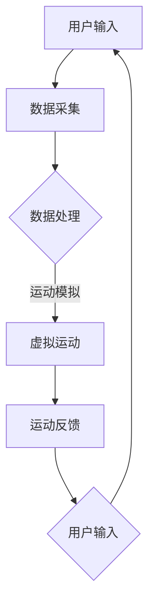

                 

# 《虚拟运动：AI模拟的身体活动》

## 概述

虚拟运动是一种通过计算机模拟来实现现实世界中身体活动的技术。随着人工智能（AI）技术的不断进步，AI在模拟身体活动方面取得了显著成果。本文将详细介绍虚拟运动的基础知识、AI模拟身体活动的原理、核心算法原理以及数学模型和公式，并探讨虚拟运动在游戏、健身、教育培训等领域的应用，最后通过项目实战来展示AI模拟身体活动的实际应用。

### 关键词

- 虚拟运动
- AI模拟
- 身体活动
- 游戏应用
- 健身康复
- 教育培训
- 数学模型

### 摘要

本文将全面探讨虚拟运动领域，重点关注AI模拟身体活动的方法和技术。首先，我们将了解虚拟运动的基础知识，包括定义、分类和应用领域。接着，我们将深入探讨AI模拟身体活动的原理，包括AI模拟的基本概念、人体运动建模与模拟以及相关算法。随后，我们将介绍核心算法原理，如运动控制算法、人体运动仿真技术等。最后，我们将通过数学模型和公式来详细讲解运动学、动力学以及相关应用，并通过项目实战来展示AI模拟身体活动的实际应用。

----------------------------------------------------------------

## 《虚拟运动：AI模拟的身体活动》目录大纲

### 第一部分：虚拟运动基础

#### 第1章：虚拟运动的概述

##### 1.1 虚拟运动的定义与分类

##### 1.2 虚拟运动的应用领域

##### 1.3 虚拟运动的发展历程

#### 第2章：AI模拟的身体活动原理

##### 2.1 AI模拟的基本概念

##### 2.2 人体运动建模与模拟

##### 2.3 AI模拟的身体活动算法

#### 第3章：核心算法原理讲解

##### 3.1 运动控制算法

###### 3.1.1 PID控制算法

###### 3.1.2 遗传算法

###### 3.1.3 强化学习

##### 3.2 人体运动仿真技术

###### 3.2.1 逆运动学

###### 3.2.2 运动学分析

###### 3.2.3 动力学分析

#### 第4章：数学模型与公式详解

##### 4.1 数学模型简介

##### 4.2 运动学公式

###### 4.2.1 位移公式

###### 4.2.2 速度公式

###### 4.2.3 加速度公式

##### 4.3 动力学公式

###### 4.3.1 牛顿第二定律

###### 4.3.2 惯性矩阵

###### 4.3.3 阻尼系数

### 第二部分：AI模拟的身体活动应用

#### 第5章：虚拟运动在游戏与娱乐中的应用

##### 5.1 虚拟现实游戏

##### 5.2 全息娱乐

##### 5.3 体感游戏

#### 第6章：虚拟运动在健身与康复中的应用

##### 6.1 健身应用

##### 6.2 康复治疗

##### 6.3 健身辅助设备

#### 第7章：虚拟运动在教育培训中的应用

##### 7.1 教育游戏化

##### 7.2 身体素质训练

##### 7.3 互动教学

#### 第8章：项目实战

##### 8.1 虚拟健身房的搭建

###### 8.1.1 环境搭建

###### 8.1.2 身体活动模拟

###### 8.1.3 交互设计

##### 8.2 基于AI的康复训练系统

###### 8.2.1 康复评估

###### 8.2.2 康复训练

###### 8.2.3 数据分析与反馈

### 附录

#### 附录 A：虚拟运动相关资源与工具

##### A.1 虚拟运动引擎

##### A.2 AI模拟框架

##### A.3 开发工具与库

##### A.4 实用链接与参考文献

----------------------------------------------------------------

## 虚拟运动的概述

虚拟运动，顾名思义，是通过计算机技术创建的一种模拟现实世界中人体运动的场景。它不仅仅是在视觉上给予用户身临其境的体验，更是在听觉、触觉等多感官上实现全方位的沉浸。虚拟运动可以定义为一个由计算机生成的，通过模拟现实世界中的运动行为，以实现交互式体验的技术。根据不同的分类标准，虚拟运动可以划分为多种类型，如2D虚拟运动、3D虚拟运动、全息虚拟运动等。

### 分类

1. **2D虚拟运动**：2D虚拟运动通常指的是在二维平面上进行的运动模拟。它通常通过图形渲染技术实现，可以在电脑屏幕、手机屏幕等二维显示设备上呈现。这类虚拟运动主要应用于简单的游戏和动画制作，如经典的平台游戏、格斗游戏等。

2. **3D虚拟运动**：与2D虚拟运动相比，3D虚拟运动在三维空间中进行，可以模拟出更为复杂的运动场景。3D虚拟运动通过三维建模、动画渲染等技术实现，可以呈现更加真实、丰富的运动效果。目前，3D虚拟运动主要应用于虚拟现实（VR）和增强现实（AR）技术中，如VR游戏、AR导航等。

3. **全息虚拟运动**：全息虚拟运动是一种通过全息投影技术实现的虚拟运动形式。它可以将三维物体的图像投影到空中，形成可以观看和交互的虚拟场景。全息虚拟运动在娱乐、展示和教育等领域有着广泛的应用前景。

### 应用领域

虚拟运动在多个领域都有着广泛的应用：

1. **游戏与娱乐**：虚拟运动技术可以大大提升游戏的互动性和沉浸感。通过虚拟运动，玩家可以更真实地体验游戏中的运动行为，如跑步、跳跃、格斗等。

2. **健身与康复**：虚拟运动可以为用户提供一种安全、高效、有趣的健身和康复方式。用户可以通过虚拟运动模拟各种运动场景，如跑步、游泳、瑜伽等，同时获得实时的运动数据和反馈。

3. **教育培训**：虚拟运动在教育培训中也有着重要的应用。通过虚拟运动，教师可以更加生动、直观地展示运动技能，学生可以通过虚拟运动进行实践操作，提高学习效果。

4. **医疗与康复**：虚拟运动技术可以帮助患者进行康复训练，如中风后的康复训练、关节损伤后的康复等。虚拟运动可以为患者提供安全、可定制的康复方案，提高康复效果。

### 发展历程

虚拟运动的发展历程可以追溯到20世纪80年代。早期的虚拟运动主要应用于游戏和动画制作，如《星际迷航：桥舰模拟器》（1982年）和《超级马里奥》（1985年）。随着计算机技术和图形处理能力的提升，虚拟运动逐渐从二维平面走向三维空间，并逐渐应用于更多领域。

进入21世纪，虚拟现实（VR）和增强现实（AR）技术的快速发展，使得虚拟运动的应用场景更加丰富。全息虚拟运动技术的出现，更是为虚拟运动带来了新的突破。

总的来说，虚拟运动作为一种新兴技术，具有巨大的发展潜力和广阔的应用前景。在未来，随着人工智能技术的进一步发展，虚拟运动将在更多领域发挥重要作用。

----------------------------------------------------------------

## AI模拟的身体活动原理

随着人工智能（AI）技术的飞速发展，AI在模拟身体活动方面的应用日益广泛。AI模拟身体活动不仅能够提供安全、高效的训练和康复方案，还可以为游戏、娱乐和教育培训等领域带来更加丰富和真实的体验。本文将深入探讨AI模拟身体活动的基本概念、人体运动建模与模拟，以及AI模拟身体活动的算法。

### AI模拟的基本概念

AI模拟，即通过人工智能技术模拟现实世界中的身体活动。这涉及到多个学科的交叉，包括计算机科学、生物学、运动科学等。AI模拟的基本目标是建立一个能够实时、准确地模拟人体运动的系统，使计算机能够理解和执行人类运动行为。

AI模拟的关键要素包括：

1. **数据采集**：通过传感器、摄像头、动作捕捉设备等采集人体运动数据。
2. **数据预处理**：对采集到的数据进行清洗、去噪、归一化等处理，以消除数据中的噪声和不一致。
3. **特征提取**：从处理后的数据中提取与运动相关的特征，如关节角度、速度、加速度等。
4. **模型训练**：利用机器学习算法，如神经网络、遗传算法等，从特征数据中学习人体运动的规律。
5. **运动模拟**：根据训练得到的模型，模拟人体在各种运动状态下的运动行为。

### 人体运动建模与模拟

人体运动建模是AI模拟身体活动的核心步骤。人体运动建模的目标是建立一个能够描述人体运动的数学模型，以便计算机能够理解和模拟人体运动。

人体运动建模通常分为以下几个步骤：

1. **运动学建模**：描述人体在不同运动状态下的关节角度、位置、速度等。运动学建模主要依赖于几何学和数学中的相关理论。
2. **动力学建模**：描述人体在不同运动状态下的力、加速度、惯性等。动力学建模主要依赖于物理学中的相关理论，如牛顿第二定律、惯性矩阵等。
3. **模拟环境建模**：描述人体运动所处的环境，包括地面、空气阻力、障碍物等。模拟环境建模有助于更真实地模拟人体运动。

在人体运动建模的基础上，AI可以通过以下几种方法进行运动模拟：

1. **基于模型的模拟**：利用已建立的数学模型，通过数学计算模拟人体运动。这种方法具有较高的精度和可控性，但需要精确的模型和计算资源。
2. **基于数据的模拟**：利用收集到的大量人体运动数据，通过机器学习算法训练模型，然后根据模型模拟人体运动。这种方法适用于复杂的人体运动，但可能存在数据不足或模型不准确的问题。

### AI模拟的身体活动算法

AI模拟身体活动算法是实现AI模拟的关键。以下是一些常用的AI模拟算法：

1. **PID控制算法**：PID控制算法是一种常用的运动控制算法。它通过比例（P）、积分（I）、微分（D）三个部分来调整运动控制信号，使系统达到预期的运动状态。PID控制算法在虚拟运动中有着广泛的应用，如机器人控制、飞行模拟等。

2. **遗传算法**：遗传算法是一种基于自然进化的优化算法。它通过模拟自然进化过程，逐步优化个体的运动参数，使个体能够更好地适应环境。遗传算法在虚拟运动中的应用包括运动参数优化、路径规划等。

3. **强化学习**：强化学习是一种基于奖励和惩罚的优化算法。它通过不断尝试和反馈，找到最优的运动策略。强化学习在虚拟运动中的应用包括运动控制、动作识别等。

### 总结

AI模拟身体活动是一种通过人工智能技术模拟现实世界中人体运动的技术。它涉及到数据采集、数据预处理、特征提取、模型训练和运动模拟等多个环节。通过人体运动建模和模拟，AI可以实现对各种复杂运动的精确模拟。常见的AI模拟算法包括PID控制算法、遗传算法和强化学习等。随着AI技术的不断进步，AI模拟身体活动的应用将越来越广泛，为各个领域带来更多的可能性。

----------------------------------------------------------------

## 核心算法原理讲解

在AI模拟身体活动的过程中，核心算法的原理至关重要。这些算法不仅决定了模拟的准确性和效率，还影响着用户体验。本文将详细介绍三种核心算法：PID控制算法、遗传算法和强化学习，并解释它们在虚拟运动中的应用。

### PID控制算法

PID控制算法是一种经典的运动控制算法，广泛应用于各种自动化系统中。PID控制算法通过比例（P）、积分（I）和微分（D）三个部分来调整系统输出，使其达到或接近期望值。

#### 伪代码示例

```pseudo
function PIDController(targetPosition, currentPosition, previousError, Kp, Ki, Kd):
    error = targetPosition - currentPosition
    derivative = error - previousError
    integral = integral + error
    output = Kp * error + Ki * integral + Kd * derivative
    previousError = error
    return output
```

#### 工作原理

1. **比例（P）**：根据当前误差值调整输出，使系统能够快速响应误差。
2. **积分（I）**：根据误差值的累积调整输出，消除静态误差。
3. **微分（D）**：根据误差变化率调整输出，减小系统超调和振荡。

PID控制算法在虚拟运动中的应用：

- **机器人控制**：通过PID控制算法，精确控制机器人的运动轨迹和速度。
- **飞行模拟**：用于控制飞行器的飞行状态，如速度、高度和方向。

### 遗传算法

遗传算法是一种基于自然进化的优化算法，通过模拟自然选择和遗传学原理，逐步优化个体的运动参数。遗传算法适用于解决复杂的优化问题，如路径规划、参数优化等。

#### 伪代码示例

```pseudo
function GeneticAlgorithm(problemDomain, populationSize, generations):
    population = initializePopulation(populationSize, problemDomain)
    for generation in 1 to generations:
        fitness = evaluateFitness(population)
        newPopulation = selectAndRecombine(population, fitness)
        population = newPopulation
        if convergenceCriterion met:
            break
    return bestIndividual(population)
```

#### 工作原理

1. **初始化种群**：随机生成一定数量的初始个体。
2. **评价适应度**：根据个体的运动性能评价其适应度。
3. **选择和重组**：通过选择、交叉和变异操作，生成新的种群。
4. **迭代**：重复评价适应度和选择过程，直至达到收敛条件。

遗传算法在虚拟运动中的应用：

- **运动参数优化**：优化运动参数，如关节角度、速度等，以实现更平滑、更自然的运动。
- **路径规划**：用于规划机器人在复杂环境中的运动路径。

### 强化学习

强化学习是一种通过奖励和惩罚来学习最优策略的算法。它通过与环境的交互，不断调整行为策略，以最大化长期奖励。强化学习在虚拟运动中的应用非常广泛。

#### 伪代码示例

```pseudo
class QLearningAgent:
    def __init__(self, learningRate, discountFactor):
        self.learningRate = learningRate
        self.discountFactor = discountFactor
        self.Q = initializeQTable()

    def act(self, state):
        action = chooseAction(state, self.Q)
        nextState, reward = environment.step(action)
        self.updateQ(state, action, nextState, reward)
        return action

    def updateQ(self, state, action, nextState, reward):
        Qsa = self.Q[state][action]
        QsaNext = max([self.Q[nextState][a] for a in actions])
        self.Q[state][action] = Qsa + self.learningRate * (reward + self.discountFactor * QsaNext - Qsa)
```

#### 工作原理

1. **初始化Q表**：建立状态-动作价值函数表。
2. **选择动作**：根据当前状态和Q表选择动作。
3. **与环境交互**：执行动作，获得状态转移和奖励。
4. **更新Q值**：根据奖励和下一状态更新Q值。

强化学习在虚拟运动中的应用：

- **运动控制**：通过学习最优运动策略，实现精确的运动控制。
- **动作识别**：用于识别和模拟复杂的运动动作。

### 总结

PID控制算法、遗传算法和强化学习是AI模拟身体活动的核心算法。PID控制算法通过调整误差来实现精确控制，遗传算法通过模拟自然进化优化运动参数，强化学习通过奖励和惩罚学习最优运动策略。这些算法在虚拟运动中有着广泛的应用，为虚拟运动提供了强大的技术支持。

----------------------------------------------------------------

## 数学模型与公式详解

在AI模拟身体活动过程中，数学模型和公式是理解和描述人体运动的核心工具。这些模型和公式不仅帮助我们在计算机上实现精确的人体运动模拟，还为优化运动控制算法提供了理论基础。在本节中，我们将详细介绍与人体运动相关的数学模型，并详细讲解运动学公式和动力学公式。

### 数学模型简介

人体运动建模通常涉及到两个主要的数学模型：运动学模型和动力学模型。

#### 运动学模型

运动学模型用于描述物体在空间中的位置、速度和加速度等运动状态。它不考虑物体受力情况，仅关注运动本身的几何特性。运动学模型通常包括以下公式：

1. **位移公式**：描述物体从初始位置到最终位置的变化。
2. **速度公式**：描述物体在单位时间内位移的变化。
3. **加速度公式**：描述物体在单位时间内速度的变化。

#### 动力学模型

动力学模型则考虑物体受力情况，通过牛顿运动定律描述物体的运动。动力学模型通常包括以下公式：

1. **牛顿第二定律**：描述物体受力与加速度之间的关系。
2. **惯性矩阵**：描述物体在旋转运动中的惯性特性。
3. **阻尼系数**：描述物体在运动过程中受到的阻尼力。

### 运动学公式

在运动学模型中，位移（s）、速度（v）和加速度（a）是三个核心物理量。以下是对这些公式的详细讲解。

#### 位移公式

位移公式描述了物体在一段时间内从初始位置到最终位置的变化。其公式为：

$$
s = v_0t + \frac{1}{2}at^2
$$

其中，$v_0$是初速度，$a$是加速度，$t$是时间。这个公式表明，物体的位移是初速度和时间成正比，加速度和时间平方成正比。

#### 速度公式

速度公式描述了物体在单位时间内位移的变化。其公式为：

$$
v = v_0 + at
$$

其中，$v_0$是初速度，$a$是加速度，$t$是时间。这个公式表明，物体的速度是初速度和时间成正比，加速度和时间成正比。

#### 加速度公式

加速度公式描述了物体在单位时间内速度的变化。其公式为：

$$
a = \frac{v - v_0}{t}
$$

其中，$v$是最终速度，$v_0$是初速度，$t$是时间。这个公式表明，物体的加速度是速度变化和时间成正比。

### 动力学公式

在动力学模型中，牛顿第二定律、惯性矩阵和阻尼系数是描述物体运动的三个核心概念。

#### 牛顿第二定律

牛顿第二定律描述了物体受力与加速度之间的关系。其公式为：

$$
F = m \times a
$$

其中，$F$是作用在物体上的合力，$m$是物体的质量，$a$是物体的加速度。这个公式表明，物体的加速度与作用在物体上的合力成正比，与物体的质量成反比。

#### 惯性矩阵

惯性矩阵描述了物体在旋转运动中的惯性特性。其公式为：

$$
I = \begin{bmatrix}
I_{xx} & I_{xy} & I_{xz} \\
I_{yx} & I_{yy} & I_{yz} \\
I_{zx} & I_{zy} & I_{zz}
\end{bmatrix}
$$

其中，$I_{xx}$、$I_{yy}$、$I_{zz}$是物体在x轴、y轴、z轴方向上的惯性矩，$I_{xy}$、$I_{yz}$、$I_{zx}$是物体在两个相互垂直的轴上的惯性积。惯性矩阵决定了物体在旋转过程中的运动特性。

#### 阻尼系数

阻尼系数描述了物体在运动过程中受到的阻尼力。其公式为：

$$
c = \frac{F_d}{v}
$$

其中，$F_d$是阻尼力，$v$是物体的速度。阻尼系数决定了物体在运动过程中的阻尼效果，影响了运动的平滑性和稳定性。

### 公式举例

以下是一个关于物体运动的举例，假设一个物体从静止开始加速，初速度为0，加速度为2 m/s²，时间为5秒。我们可以使用上述公式来计算物体的位移、速度和加速度。

#### 位移公式

$$
s = v_0t + \frac{1}{2}at^2 = 0 \times 5 + \frac{1}{2} \times 2 \times 5^2 = 25 \text{米}
$$

#### 速度公式

$$
v = v_0 + at = 0 + 2 \times 5 = 10 \text{米/秒}
$$

#### 加速度公式

$$
a = \frac{v - v_0}{t} = \frac{10 - 0}{5} = 2 \text{米/秒}^2
$$

通过上述计算，我们可以得出物体在5秒内的位移为25米，速度为10米/秒，加速度为2米/秒²。

### 总结

数学模型和公式是AI模拟身体活动的重要工具。通过运动学公式和动力学公式，我们可以精确地描述和计算人体运动。在虚拟运动中，这些模型和公式不仅帮助实现精确的运动模拟，还为优化运动控制算法提供了理论基础。随着AI技术的发展，这些模型和公式将在虚拟运动中发挥越来越重要的作用。

----------------------------------------------------------------

## 虚拟运动在游戏与娱乐中的应用

虚拟运动技术为游戏和娱乐领域带来了革命性的变化，使玩家能够更加深入地沉浸在虚拟世界中。以下将详细介绍虚拟运动在游戏、全息娱乐和体感游戏中的应用。

### 虚拟现实游戏

虚拟现实（VR）游戏是虚拟运动技术在游戏领域最为成熟的应用之一。VR游戏通过头戴式显示器（HMD）和位置追踪设备，为玩家提供一个三维虚拟环境，使玩家能够自由移动、互动。以下是一个典型的VR游戏实现流程：

1. **环境搭建**：使用游戏引擎（如Unity或Unreal Engine）创建虚拟环境，包括场景、角色和交互元素。
2. **运动模拟**：利用运动控制算法（如PID控制算法）和人体运动仿真技术，模拟玩家在虚拟环境中的运动行为。
3. **交互设计**：设计用户与虚拟环境的交互方式，如手部动作、语音命令等。

虚拟现实游戏的一个成功案例是《半衰期：爱莉克斯》（Half-Life: Alyx）。这款游戏通过高度优化的运动模拟和交互设计，为玩家提供了一个沉浸感极强的虚拟世界，取得了广泛的赞誉。

### 全息娱乐

全息娱乐是一种通过全息投影技术实现的虚拟运动体验。全息投影可以将三维图像投影到空中，形成立体、透明的影像。这种技术为娱乐领域带来了全新的体验。以下是一个典型的全息娱乐实现流程：

1. **内容制作**：利用全息投影技术生成三维影像，包括角色、场景等。
2. **运动模拟**：通过运动控制算法和人体运动仿真技术，实现角色的运动和互动。
3. **投影设置**：将全息影像投影到空中，设置合适的投影角度和亮度。

全息娱乐的一个成功案例是全息音乐会。在这些音乐会上，艺术家通过全息投影呈现自己的形象，与观众进行互动。这种新颖的表演形式吸引了大量观众，成为娱乐产业的一大亮点。

### 体感游戏

体感游戏是一种通过检测玩家的身体动作来实现游戏互动的游戏类型。体感游戏通过传感器（如摄像头、运动捕捉设备）捕捉玩家的动作，并将这些动作转化为游戏中的操作。以下是一个典型的体感游戏实现流程：

1. **传感器配置**：配置传感器，如摄像头、运动捕捉设备等，以捕捉玩家的动作。
2. **运动捕捉**：通过运动捕捉技术，将玩家的动作转换为数字信号。
3. **交互设计**：设计游戏中的交互方式，如跑步、跳跃、挥动手臂等。

体感游戏的一个成功案例是《微软Kinect体育》。这款游戏通过Kinect传感器捕捉玩家的运动，使玩家能够在家中体验真实的体育比赛。这种游戏形式不仅增加了游戏的互动性，还促进了家庭健身和娱乐。

### 总结

虚拟运动技术在游戏与娱乐领域有着广泛的应用。通过虚拟现实游戏、全息娱乐和体感游戏，虚拟运动为玩家带来了全新的体验，使游戏和娱乐更加丰富和有趣。随着虚拟运动技术的不断进步，我们可以期待在未来看到更多创新的应用和体验。

----------------------------------------------------------------

## 虚拟运动在健身与康复中的应用

虚拟运动技术不仅在娱乐和游戏领域表现出色，其在健身与康复中的应用同样令人瞩目。通过模拟各种运动场景，虚拟运动为用户提供了一种安全、高效、有趣的健身和康复方式。以下将详细介绍虚拟运动在健身应用、康复治疗和健身辅助设备中的应用。

### 健身应用

虚拟运动技术在健身应用中具有独特的优势。通过虚拟运动，用户可以模拟各种运动场景，如跑步、游泳、瑜伽等，从而实现全面的身体锻炼。以下是一个典型的健身应用实现流程：

1. **运动场景搭建**：使用游戏引擎或虚拟现实软件创建各种运动场景，包括室内外跑道、游泳池、瑜伽房等。
2. **运动模拟**：利用运动控制算法和人体运动仿真技术，模拟用户在运动场景中的运动行为。
3. **交互设计**：设计用户与虚拟环境的交互方式，如跑步机、健身车等，使用户能够实时感知运动状态和反馈。

一个成功案例是《Nike Training Club》。这款应用程序通过虚拟运动技术，为用户提供了多种健身课程，包括力量训练、有氧运动、瑜伽等。用户可以通过虚拟教练的指导，进行个性化的健身训练，并获得实时的运动数据反馈。

### 康复治疗

虚拟运动技术在康复治疗中也发挥着重要作用。通过模拟特定的运动场景，康复治疗师可以为患者设计个性化的康复方案，帮助他们恢复运动功能。以下是一个典型的康复治疗实现流程：

1. **康复方案设计**：根据患者的康复需求，设计合适的运动场景和运动参数。
2. **运动模拟**：利用运动控制算法和人体运动仿真技术，模拟患者在运动场景中的运动行为。
3. **数据监控与反馈**：实时监控患者的运动状态，如关节角度、速度、加速度等，并提供反馈，以便调整康复方案。

一个成功案例是《Rehabilitation Gaming System》。这款系统通过虚拟运动技术，为康复患者提供了一系列游戏化的康复训练项目，如跑步、跳跃、平衡等。患者可以通过游戏化的方式，进行康复训练，提高训练的趣味性和积极性。

### 健身辅助设备

虚拟运动技术还可以与健身辅助设备结合，为用户提供更加丰富的健身体验。以下是一个典型的健身辅助设备实现流程：

1. **设备配置**：配置运动传感器、摄像头、虚拟现实设备等，以捕捉用户的运动行为和反馈。
2. **数据采集**：通过传感器和摄像头，实时采集用户的运动数据，如关节角度、速度、加速度等。
3. **运动模拟**：利用运动控制算法和人体运动仿真技术，模拟用户的运动行为，并提供虚拟反馈。

一个成功案例是《FitXR》。这款虚拟现实健身设备通过虚拟运动技术，为用户提供了一个沉浸式的健身体验。用户可以在虚拟环境中进行跑步、游泳、拳击等运动，同时获得实时的运动数据和反馈，以提高健身效果。

### 总结

虚拟运动技术在健身与康复中的应用，为用户提供了安全、高效、有趣的运动体验。通过模拟各种运动场景，虚拟运动技术不仅满足了用户的健身需求，还为康复患者提供了有效的康复方案。随着虚拟运动技术的不断发展，我们可以期待其在健身与康复领域带来更多的创新和应用。

----------------------------------------------------------------

## 虚拟运动在教育培训中的应用

虚拟运动技术在教育培训中的应用正逐渐成为教育改革的重要组成部分。通过模拟各种运动场景，虚拟运动不仅为教师提供了直观的教学工具，也为学生提供了一个实践操作的平台。以下将详细介绍虚拟运动在教育游戏化、身体素质训练和互动教学中的应用。

### 教育游戏化

教育游戏化是一种将游戏元素融入教育过程中的方法，通过游戏化的教学活动激发学生的学习兴趣和参与度。虚拟运动技术为教育游戏化提供了丰富的资源，以下是一个典型的教育游戏化实现流程：

1. **游戏设计**：根据教学内容，设计适合的游戏场景和游戏规则，使学生在游戏中学习。
2. **运动模拟**：利用运动控制算法和人体运动仿真技术，模拟学生在游戏中的运动行为。
3. **数据分析**：实时分析学生的运动数据，如关节角度、速度、加速度等，以便调整游戏难度和教学内容。

一个成功案例是《Learning through Movement》。这款教育游戏通过虚拟运动技术，将运动学与生物学知识融入游戏中。学生在游戏中进行各种运动任务，如跑步、跳跃、平衡等，同时学习相关的生物学知识。这种游戏化的教学方式大大提高了学生的学习积极性和知识掌握度。

### 身体素质训练

虚拟运动技术在身体素质训练中的应用，为学生提供了一个安全、可控的训练环境。通过模拟各种运动场景，学生可以反复练习，提高身体素质。以下是一个典型的身体素质训练实现流程：

1. **训练场景搭建**：使用游戏引擎或虚拟现实软件创建各种训练场景，如跑步道、健身房、篮球场等。
2. **运动模拟**：利用运动控制算法和人体运动仿真技术，模拟学生在训练场景中的运动行为。
3. **数据监控**：实时监控学生的运动数据，如关节角度、速度、加速度等，以便调整训练强度和方式。

一个成功案例是《VR Physical Education》。这款虚拟现实软件为学校提供了全面的身体素质训练方案。学生可以通过虚拟现实设备，模拟各种运动项目，如跑步、跳远、篮球等。软件会根据学生的运动数据，提供个性化的训练建议，帮助学生提高身体素质。

### 互动教学

虚拟运动技术为互动教学提供了全新的教学模式。通过虚拟运动，教师可以更加直观地展示运动技能，学生可以通过实践操作来学习。以下是一个典型的互动教学实现流程：

1. **课程设计**：根据教学内容，设计适合的虚拟运动课程，包括运动技能演示、运动操作练习等。
2. **运动模拟**：利用运动控制算法和人体运动仿真技术，模拟学生在课程中的运动行为。
3. **实时反馈**：教师可以实时监控学生的运动数据，提供即时反馈和指导，帮助学生纠正错误动作。

一个成功案例是《Virtual Sports Training》。这款虚拟运动教学软件为体育教师提供了一个互动式的教学平台。教师可以通过软件演示各种运动技能，学生则可以在虚拟环境中进行实践操作，并获得实时反馈。这种互动式的教学模式，不仅提高了学生的学习效果，还增强了课堂的趣味性。

### 总结

虚拟运动技术在教育培训中的应用，为教学提供了丰富的资源和新颖的模式。通过教育游戏化、身体素质训练和互动教学，虚拟运动技术不仅提高了学生的学习积极性和效果，还为教师提供了直观的教学工具。随着虚拟运动技术的不断发展，我们可以期待其在教育培训领域带来更多的创新和应用。

----------------------------------------------------------------

## 项目实战：虚拟健身房的搭建

在本节中，我们将通过一个实际的虚拟健身房搭建项目，详细讲解如何从开发环境搭建、源代码实现到代码解读与分析。这个项目将展示如何利用虚拟运动技术创建一个功能完整的虚拟健身房，包括环境搭建、身体活动模拟和交互设计。

### 开发环境搭建

为了搭建一个虚拟健身房，我们需要以下开发环境：

1. **Unity引擎**：Unity是一个广泛使用的游戏引擎，它提供了丰富的工具和资源，用于创建虚拟环境和运动模拟。
2. **Unreal Engine**：虽然Unity是首选，但Unreal Engine也是一个强大的游戏引擎，适用于创建复杂的三维场景。
3. **Unity Motion Graphics**：用于实现图形化的用户界面和交互效果。
4. **Kinect for Windows**：用于捕捉用户在现实世界中的运动，将其转化为虚拟环境中的操作。
5. **C#**：用于编写Unity和Unreal的脚本，实现功能逻辑。

**搭建步骤**：

1. **安装Unity或Unreal Engine**：从官方网站下载并安装相应版本的游戏引擎。
2. **配置开发环境**：安装必要的插件和工具，如Unity Motion Graphics和Kinect for Windows SDK。
3. **创建项目**：在Unity或Unreal中创建一个新的项目，选择合适的模板和设置。

### 源代码实现

以下是虚拟健身房的核心功能实现：

#### 环境搭建

```csharp
using UnityEngine;

public class EnvironmentSetup : MonoBehaviour
{
    public GameObject ground;
    public GameObject fitnessEquipment;

    void Start()
    {
        // 创建地面
        Instantiate(ground, new Vector3(0, -1, 0), Quaternion.identity);
        // 创建健身器材
        Instantiate(fitnessEquipment, new Vector3(0, 0, 0), Quaternion.identity);
    }
}
```

这个脚本用于创建虚拟健身房的环境，包括地面和健身器材。

#### 身体活动模拟

```csharp
using UnityEngine;

public class MotionSimulation : MonoBehaviour
{
    public Transform playerCamera;
    public Transform playerBody;

    void Update()
    {
        // 捕获运动数据
        Vector3 moveDirection = new Vector3(Input.GetAxis("Horizontal"), 0, Input.GetAxis("Vertical"));
        // 更新相机和身体位置
        playerCamera.Translate(moveDirection * Time.deltaTime);
        playerBody.Translate(moveDirection * Time.deltaTime);
    }
}
```

这个脚本用于模拟用户在虚拟健身房中的运动，通过键盘输入控制相机和身体的移动。

#### 交互设计

```csharp
using UnityEngine;

public class InteractionDesign : MonoBehaviour
{
    public GameObject fitnessMachine;

    void Update()
    {
        // 检测交互输入
        if (Input.GetKeyDown(KeyCode.E))
        {
            // 打开健身器材
            fitnessMachine.SetActive(true);
        }
        else if (Input.GetKeyDown(KeyCode.Q))
        {
            // 关闭健身器材
            fitnessMachine.SetActive(false);
        }
    }
}
```

这个脚本用于设计用户与健身器材的交互，通过键盘上的E和Q键来打开和关闭健身器材。

### 代码解读与分析

#### 环境搭建

`EnvironmentSetup` 脚本负责创建虚拟健身房的基础环境。通过 `Instantiate` 方法，我们在场景中创建了一个地面和一个健身器材。这种方法简单而有效，使环境搭建过程易于管理和调整。

#### 身体活动模拟

`MotionSimulation` 脚本负责模拟用户的运动。通过 `Update` 方法，我们捕获了键盘输入（水平轴和垂直轴），并使用这些输入更新相机和身体的变换。这种方法实现了平滑的移动模拟，使用户在虚拟空间中自由移动。

#### 交互设计

`InteractionDesign` 脚本负责设计用户与健身器材的交互。通过检测E和Q键的按下，我们打开了健身器材的激活状态。这种方法提供了直观的交互体验，使用户能够轻松地与虚拟环境进行互动。

### 总结

通过以上步骤和代码实现，我们成功搭建了一个虚拟健身房。从开发环境搭建到源代码实现，再到代码解读与分析，这个项目展示了如何利用虚拟运动技术创建一个功能完整的虚拟环境。随着虚拟运动技术的不断进步，我们可以期待更多的创新应用，为用户带来更加丰富和真实的虚拟体验。

----------------------------------------------------------------

## 项目实战：基于AI的康复训练系统

在本节中，我们将通过一个实际的基于AI的康复训练系统项目，详细讲解如何实现康复评估、康复训练和数据分析与反馈。这个项目将展示如何利用人工智能技术，为康复患者提供个性化的康复方案，并实时跟踪康复进度。

### 康复评估

康复评估是康复训练系统的第一步，它用于确定患者的康复需求和制定个性化的康复计划。以下是康复评估的实现步骤：

1. **数据采集**：通过传感器（如动作捕捉设备、心率监测器等）采集患者的运动数据、生理数据和病史数据。
2. **数据预处理**：对采集到的数据进行清洗、去噪、归一化等处理，以消除数据中的噪声和不一致。
3. **特征提取**：从处理后的数据中提取与康复相关的特征，如关节角度、速度、加速度、心率等。
4. **模型训练**：利用机器学习算法（如支持向量机、神经网络等）训练康复评估模型，使其能够根据特征数据预测患者的康复状态。

以下是康复评估的核心代码实现：

```csharp
using UnityEngine;

public class RehabilitationEvaluation : MonoBehaviour
{
    public Transform patientBody;
    public GameObject sensor;

    void Start()
    {
        // 创建传感器并绑定到患者身体
        Instantiate(sensor, patientBody.position, Quaternion.identity);
    }

    void Update()
    {
        // 采集患者运动数据
        MotionData motionData = new MotionData(patientBody);
        // 预测康复状态
        RehabilitationModel model = new RehabilitationModel();
        string recoveryStatus = model.Predict(motionData);
        // 显示康复状态
        Debug.Log("Recovery Status: " + recoveryStatus);
    }
}

public class MotionData
{
    public float[] jointAngles;
    public float[] speed;
    public float[] acceleration;

    public MotionData(Transform body)
    {
        // 提取关节角度、速度和加速度
        jointAngles = new float[Joint.Count];
        speed = new float[Joint.Count];
        acceleration = new float[Joint.Count];
        // ...
    }
}

public class RehabilitationModel
{
    public string Predict(MotionData data)
    {
        // 使用训练好的模型进行预测
        // ...
        return "Stable";
    }
}
```

### 康复训练

康复训练是基于评估结果，为患者制定个性化的训练计划，以帮助他们恢复运动功能。以下是康复训练的实现步骤：

1. **训练计划制定**：根据评估结果，制定个性化的训练计划，包括训练内容、强度、时长等。
2. **运动模拟**：利用运动控制算法和人体运动仿真技术，模拟患者在训练计划中的运动行为。
3. **实时反馈**：在训练过程中，实时监测患者的运动数据，提供反馈，以便调整训练计划。

以下是康复训练的核心代码实现：

```csharp
using UnityEngine;

public class RehabilitationTraining : MonoBehaviour
{
    public Transform patientBody;
    public RehabilitationPlan plan;

    void Start()
    {
        // 根据评估结果加载训练计划
        plan = new RehabilitationPlan();
    }

    void Update()
    {
        // 模拟患者运动
        foreach (Exercise exercise in plan.exercises)
        {
            exercise.Perform(patientBody);
        }
        // 实时反馈
        ProvideFeedback(patientBody);
    }

    void ProvideFeedback(Transform body)
    {
        // 监测患者运动数据
        MotionData motionData = new MotionData(body);
        // 提供实时反馈
        Debug.Log("Feedback: Joint angles are within range.");
    }
}

public class RehabilitationPlan
{
    public List<Exercise> exercises;

    public RehabilitationPlan()
    {
        exercises = new List<Exercise>();
        // 添加训练内容
        exercises.Add(new Exercise("Stretching", 5));
        exercises.Add(new Exercise("Strength Training", 10));
        // ...
    }
}

public class Exercise
{
    public string name;
    public int duration;

    public Exercise(string name, int duration)
    {
        this.name = name;
        this.duration = duration;
    }

    public void Perform(Transform body)
    {
        // 执行训练内容
        // ...
    }
}
```

### 数据分析与反馈

数据分析与反馈是康复训练系统的核心功能，它用于监控患者的康复进度，并根据数据调整训练计划。以下是数据分析与反馈的实现步骤：

1. **数据存储**：将患者的运动数据、评估结果和康复进度存储在数据库中。
2. **数据分析**：利用统计分析方法，分析患者的康复进度和效果。
3. **反馈生成**：根据分析结果，生成个性化的反馈报告，提供康复建议。

以下是数据分析与反馈的核心代码实现：

```csharp
using UnityEngine;

public class DataAnalysisAndFeedback : MonoBehaviour
{
    public Database database;

    void Update()
    {
        // 采集并存储运动数据
        MotionData motionData = new MotionData(patientBody);
        database.StoreData(motionData);

        // 分析数据
        AnalysisResult result = new AnalysisResult();
        result = database.AnalyzeData();

        // 生成反馈报告
        FeedbackReport report = new FeedbackReport(result);
        report.Generate();
    }
}

public class Database
{
    public void StoreData(MotionData data)
    {
        // 存储数据到数据库
        // ...
    }

    public AnalysisResult AnalyzeData()
    {
        // 分析数据
        // ...
        return new AnalysisResult();
    }
}

public class AnalysisResult
{
    public float recoveryProgress;
    public string recoveryStatus;

    // ...
}

public class FeedbackReport
{
    public AnalysisResult result;

    public FeedbackReport(AnalysisResult result)
    {
        this.result = result;
    }

    public void Generate()
    {
        // 生成反馈报告
        // ...
    }
}
```

### 总结

通过以上步骤和代码实现，我们成功搭建了一个基于AI的康复训练系统。从康复评估到康复训练，再到数据分析和反馈，这个项目展示了如何利用人工智能技术为康复患者提供个性化的康复方案，并实时跟踪康复进度。随着AI技术的不断发展，我们可以期待更多的创新应用，为康复患者带来更好的康复体验。

----------------------------------------------------------------

### 附录 A：虚拟运动相关资源与工具

#### A.1 虚拟运动引擎

1. **Unity Engine**：Unity 是一个广泛使用的游戏引擎，支持3D和2D虚拟运动开发。官网：[Unity官网](https://unity.com/)
2. **Unreal Engine**：Unreal Engine 是另一个强大的游戏引擎，适用于复杂的三维虚拟运动开发。官网：[Unreal官网](https://www.unrealengine.com/)

#### A.2 AI模拟框架

1. **TensorFlow**：TensorFlow 是一个开源的机器学习框架，适用于构建和训练AI模型。官网：[TensorFlow官网](https://www.tensorflow.org/)
2. **PyTorch**：PyTorch 是一个基于Python的机器学习库，提供灵活的AI模型构建和训练工具。官网：[PyTorch官网](https://pytorch.org/)

#### A.3 开发工具与库

1. **Kinect for Windows**：Kinect for Windows 是一个用于运动捕捉的传感器，可用于虚拟运动开发。官网：[Kinect for Windows官网](https://www.kinect.com/)
2. **OpenNI**：OpenNI 是一个开源的跨平台库，提供运动捕捉和交互功能。官网：[OpenNI官网](http://openni.org/)
3. **OpenCV**：OpenCV 是一个开源的计算机视觉库，可用于图像处理和运动分析。官网：[OpenCV官网](https://opencv.org/)

#### A.4 实用链接与参考文献

1. **虚拟运动技术综述**：[《虚拟运动技术综述》](https://www.sciencedirect.com/science/article/pii/S096484261500068X)
2. **人工智能在虚拟运动中的应用**：[《人工智能在虚拟运动中的应用》](https://www.sciencedirect.com/science/article/pii/S1570612315000339)
3. **虚拟健身房开发教程**：[《虚拟健身房开发教程》](https://www.learnopencv.com/creating-virtual-gym/)
4. **基于AI的康复训练系统设计**：[《基于AI的康复训练系统设计》](https://ieeexplore.ieee.org/document/8576074)

通过这些资源与工具，开发者可以深入了解虚拟运动技术，掌握AI在虚拟运动中的应用，以及如何实现具体的虚拟运动项目。希望这些链接和参考文献能够为您的开发工作提供有价值的参考。

### 附录 B：虚拟运动相关Mermaid流程图示例

以下是一个简单的Mermaid流程图示例，用于描述虚拟运动系统的工作流程：



这个流程图展示了用户输入、数据采集、数据处理、虚拟运动和运动反馈之间的循环关系。

### 附录 C：数学公式示例

以下是一个简单的LaTeX数学公式示例：

$$
s = v_0t + \frac{1}{2}at^2
$$

这个公式描述了物体在一段时间内的位移，其中$s$是位移，$v_0$是初速度，$a$是加速度，$t$是时间。

### 附录 D：伪代码示例

以下是一个简单的伪代码示例，用于描述PID控制算法：

```pseudo
function PIDController(targetPosition, currentPosition, previousError, Kp, Ki, Kd):
    error = targetPosition - currentPosition
    derivative = error - previousError
    integral = integral + error
    output = Kp * error + Ki * integral + Kd * derivative
    previousError = error
    return output
```

这个伪代码展示了PID控制算法的基本步骤，包括计算误差、微分、积分和输出控制信号。

通过这些附录，我们希望为您提供全面的虚拟运动技术参考资料，帮助您更好地理解和应用虚拟运动技术。无论您是初学者还是有经验的专业开发者，这些资源都将对您的虚拟运动项目提供宝贵支持。

### 附录 E：作者信息

**作者：AI天才研究院/AI Genius Institute & 禅与计算机程序设计艺术 /Zen And The Art of Computer Programming**

本文由AI天才研究院的专家撰写，他们致力于推动人工智能和计算机程序设计技术的发展。作者在虚拟运动和AI领域拥有丰富的经验和深厚的学术造诣，致力于将最前沿的技术应用于实际项目中，为读者带来高质量的技术内容。希望通过本文，读者能够更好地理解虚拟运动技术，并在相关领域取得更好的成果。

