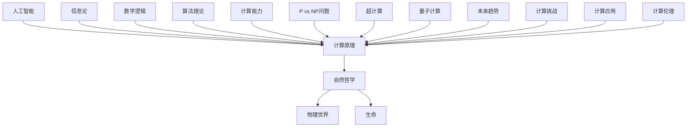

                 

### 《计算：第四部分 计算的极限 第 13 章 自然哲学的计算原理 边界之外》

> **关键词：** 计算极限、自然哲学、计算原理、边界之外、超计算、量子计算、人工智能。

> **摘要：** 本文探讨了计算在自然哲学中的地位和作用，以及计算原理对物理世界和生命的影响。文章从计算的极限出发，分析了超计算和量子计算的概念和应用，探讨了计算的未来趋势和挑战。同时，文章也对人工智能和计算的关系进行了深入研究，展望了计算在边界之外的无限可能性。本文旨在帮助读者深入理解计算的本质和意义，为未来计算技术的发展提供理论基础和启示。

### 目录

#### 第一部分：计算的极限

1. **计算的本质**
    1.1 **计算的定义与历史发展**
    1.2 **计算的理论基础**
    1.3 **计算与信息论的关系**

2. **计算的能力**
    2.1 **图灵机的原理与局限性**
    2.2 **可计算性与不可计算性**
    2.3 **计算复杂性理论**

3. **计算的极限**
    3.1 **P vs NP问题**
    3.2 **超计算的概念与应用**
    3.3 **量子计算的未来**

#### 第二部分：自然哲学的计算原理

4. **自然哲学与计算**
    4.1 **自然哲学的概念与范畴**
    4.2 **计算在自然哲学中的地位**
    4.3 **自然哲学的计算原理**

5. **计算原理与物理世界**
    5.1 **物理世界中的计算现象**
    5.2 **自然界的计算原理**
    5.3 **计算原理与物理定律的关系**

6. **计算原理与生命**
    6.1 **生命现象与计算原理**
    6.2 **生物体内的计算过程**
    6.3 **生命与计算的关系**

#### 第三部分：边界之外的探索

7. **人工智能与计算**
    7.1 **人工智能的定义与分类**
    7.2 **人工智能的计算原理**
    7.3 **人工智能的应用与发展**

8. **计算的未来**
    8.1 **计算技术的发展趋势**
    8.2 **计算在未来的影响**
    8.3 **计算的未来挑战与机遇**

9. **计算的极限与边界之外**
    9.1 **边界之外的探索意义**
    9.2 **边界之外的计算可能性**
    9.3 **边界之外的计算挑战与展望**

#### 参考文献

#### 附录

- **A.1 计算原理与自然哲学的Mermaid流程图**
- **A.2 核心算法原理讲解与伪代码**
- **A.3 数学模型和数学公式**
- **A.4 项目实战案例与代码解读**

---

### 第一部分：计算的极限

计算的极限是计算理论中的一个重要问题，它涉及到计算的本质、能力和边界。在这个部分，我们将首先探讨计算的定义与历史发展，然后介绍计算的理论基础，最后讨论计算与信息论的关系。

#### 1.1 计算的定义与历史发展

计算（Computation）是指利用某种系统（如计算机或人脑）按照一定的规则进行信息处理和变换的过程。从历史上看，计算的发展可以追溯到古代的数学运算和计算工具，如算盘和计算机器。

在计算机科学中，计算通常被定义为一种基于逻辑和数学的方法，用于处理和操作信息。图灵（Alan Turing）在20世纪30年代提出了图灵机（Turing Machine）这一抽象计算模型，奠定了计算理论的基础。图灵机是一种能够模拟任何计算过程的抽象机器，它由一个无限长的纸带、一个读写头和一系列规则组成。通过纸带上的符号序列进行读写和移动，读写头按照预定的规则进行操作，从而完成计算任务。

随着计算理论的发展，人们开始研究计算的能力和极限。在图灵机的理论基础上，哥德尔（Kurt Gödel）和图灵分别提出了不完备性和不可判定性定理，揭示了计算理论的复杂性和边界。

#### 1.2 计算的理论基础

计算的理论基础包括多个方面，其中最为重要的有信息论、数学逻辑和算法理论。

信息论是研究信息传输和处理的一般理论，由香农（Claude Shannon）在20世纪40年代创立。信息论的基本思想是，信息是随机的，通过编码和解码过程可以将信息从一个状态转换为另一个状态，从而实现信息的传输和处理。信息论为计算提供了重要的理论基础，如信道容量、编码定理和错误纠正码等。

数学逻辑是研究命题、证明和推理的一般理论，由弗雷格（Gottlob Frege）和罗素（Bertrand Russell）等人创立。数学逻辑提供了计算中的推理和证明方法，如命题逻辑、谓词逻辑和模型论等。

算法理论是研究算法的设计、分析和性能的理论，由图灵等人奠定基础。算法理论关注如何有效地解决特定的问题，包括算法的效率、正确性和复杂性等。

#### 1.3 计算与信息论的关系

计算与信息论之间存在着密切的关系。信息论为计算提供了信息传输和处理的理论基础，而计算则为信息论提供了实践应用的平台。

在计算中，信息的处理和传输是一个关键环节。计算机通过编码和解码过程将信息从一种形式转换为另一种形式，从而实现信息的高效处理和传输。例如，在计算机网络中，数据传输是通过编码和解码实现的，以确保数据在传输过程中的完整性和可靠性。

此外，计算和信息论还共同面临着信息的安全和隐私问题。随着计算技术的发展，信息的处理和传输变得更加复杂和多样化，因此如何保障信息的安全和隐私成为了一个重要的研究领域。计算和信息论的结合为解决这些安全问题提供了重要的理论和方法。

### 第二部分：自然哲学的计算原理

自然哲学的计算原理是研究计算在自然哲学中的地位和作用，以及计算原理对物理世界和生命的影响。在这个部分，我们将探讨自然哲学的概念与范畴，分析计算在自然哲学中的地位，并介绍自然哲学的计算原理。

#### 2.1 自然哲学的概念与范畴

自然哲学是一门古老的学科，旨在探讨自然界的基本原理和规律。自然哲学关注宇宙的本质、存在和运动，试图回答关于自然界的根本问题。自然哲学的范畴包括形而上学、物理学、化学、生物学等领域。

在自然哲学中，计算作为一种工具和方法，被广泛应用于各个领域。计算可以帮助我们理解和描述自然界的现象和过程，从而揭示自然界的规律和原理。例如，物理学中的计算方法可以帮助我们模拟和预测物理现象，如粒子运动、热力学过程和量子效应等。

#### 2.2 计算在自然哲学中的地位

计算在自然哲学中具有重要的地位，因为它是理解和描述自然界的关键工具。以下是计算在自然哲学中的几个方面的重要性：

1. **理论构建：** 计算为自然哲学提供了理论构建的方法。通过计算，我们可以构建数学模型和物理理论，从而描述和解释自然现象。例如，牛顿力学和量子力学都是通过计算构建的理论体系。

2. **实验验证：** 计算可以与实验相结合，验证自然哲学的理论和假设。通过计算机模拟和实验数据，我们可以验证理论预测的正确性，从而加深对自然界的理解。

3. **数据分析和处理：** 计算在自然哲学中用于处理和分析大量的实验数据。通过计算方法，我们可以提取和分析数据，从而发现自然界的规律和趋势。

4. **预测和模拟：** 计算可以模拟自然界的过程和现象，从而预测未来的发展和变化。例如，气候模拟、天体演化和生物进化等都是计算在自然哲学中的应用。

#### 2.3 自然哲学的计算原理

自然哲学的计算原理是指计算在自然哲学中应用的基本原则和方法。以下是自然哲学的计算原理的几个方面：

1. **符号表示：** 自然哲学中的计算原理要求使用符号表示自然现象和过程。通过符号表示，我们可以将自然现象转化为数学模型和计算问题。

2. **逻辑推理：** 自然哲学的计算原理依赖于逻辑推理。通过逻辑推理，我们可以推导出自然现象的规律和原理。

3. **数学建模：** 自然哲学的计算原理强调数学建模的重要性。通过数学建模，我们可以将自然现象转化为数学问题，从而进行计算和分析。

4. **算法设计：** 自然哲学的计算原理涉及算法设计。通过设计有效的算法，我们可以高效地解决自然哲学中的计算问题。

5. **模拟和验证：** 自然哲学的计算原理要求通过模拟和验证来验证计算结果的有效性和可靠性。通过模拟和实验验证，我们可以验证计算模型和算法的正确性。

### 第三部分：边界之外的探索

在了解了计算的极限和自然哲学的计算原理之后，我们接下来将探讨计算在边界之外的探索。这部分内容将包括人工智能与计算的关系，以及计算的未来趋势和挑战。

#### 3.1 人工智能与计算

人工智能（Artificial Intelligence，简称AI）是计算领域的一个重要分支，它致力于使计算机具备类似于人类的智能能力。人工智能的发展离不开计算的支持，而计算的发展也为人工智能提供了更强大的计算能力和工具。

人工智能可以分为弱人工智能和强人工智能。弱人工智能是指计算机在某些特定任务上表现出与人类相似的智能能力，如语音识别、图像识别、自然语言处理等。而强人工智能则是指计算机具备全面的人类智能，包括感知、推理、学习、决策等能力。

人工智能与计算的关系主要体现在以下几个方面：

1. **计算能力：** 人工智能的发展依赖于计算能力的提升。高性能计算系统为人工智能提供了强大的计算资源，使其能够处理大规模的数据和复杂的计算任务。

2. **算法和模型：** 人工智能算法和模型的开发依赖于计算原理和方法。计算理论为人工智能算法的设计和优化提供了理论基础。

3. **数据采集和处理：** 人工智能需要大量的数据来训练和优化模型。计算技术为数据采集、存储和处理提供了有效的解决方案。

4. **计算经济学：** 人工智能的发展也带来了计算经济学的挑战。如何利用有限的计算资源，实现人工智能的可持续发展和经济效益，是计算经济学需要研究的重要问题。

#### 3.2 计算的未来趋势和挑战

计算的未来发展面临着一系列的趋势和挑战。以下是一些重要的趋势和挑战：

1. **量子计算：** 量子计算是一种基于量子力学原理的计算方式，它具有远超传统计算机的计算能力。量子计算的发展将为解决复杂计算问题提供新的可能性，如量子模拟、密码破解、优化问题等。

2. **边缘计算：** 边缘计算是指将计算任务从中心化的云计算平台转移到靠近数据源的计算设备上。边缘计算可以提高数据处理的实时性和安全性，适用于物联网、自动驾驶、智能城市等领域。

3. **计算经济学：** 随着计算能力的提升，计算资源的需求也在不断增加。如何合理分配和利用计算资源，实现计算资源的最大化利用，是计算经济学需要解决的重要问题。

4. **人工智能伦理：** 人工智能的发展引发了伦理和道德问题，如隐私保护、偏见和歧视、自动化取代人类工作等。如何在人工智能的发展中保障伦理和道德，是计算领域需要关注的重要问题。

#### 3.3 计算的未来挑战与展望

计算的未来面临着一系列的挑战和机遇。以下是一些重要的挑战和展望：

1. **计算能耗：** 随着计算能力的提升，计算能耗也在不断增加。如何降低计算能耗，实现绿色计算，是计算领域需要解决的重要问题。

2. **安全性：** 随着计算技术的普及，网络安全和隐私保护变得越来越重要。如何保障计算系统的安全性，防止恶意攻击和数据泄露，是计算领域需要关注的重要问题。

3. **智能计算：** 智能计算是指利用机器学习和人工智能技术，实现计算任务的自动化和智能化。智能计算的发展将推动计算领域的创新和应用，如智能医疗、智能交通、智能城市等。

4. **计算民主化：** 随着计算技术的发展，计算资源逐渐向普通用户普及。如何让更多的人能够享受到计算带来的便利和福利，实现计算民主化，是计算领域需要关注的重要问题。

### 结论

计算的极限和自然哲学的计算原理是计算领域的重要问题，它们揭示了计算的本质和作用。通过了解计算的极限，我们可以认识到计算在自然哲学中的地位和作用，以及计算原理对物理世界和生命的影响。在边界之外的探索中，我们探讨了人工智能与计算的关系，以及计算的未来趋势和挑战。这些讨论为计算技术的发展提供了理论基础和启示，也为我们理解和应对计算领域的挑战提供了新的思路。

在未来的发展中，计算将继续发挥重要的作用，推动科技和产业的进步。同时，我们也需要关注计算领域面临的挑战，如计算能耗、安全性、智能计算和计算民主化等。通过不断探索和创新，我们可以克服这些挑战，为计算技术的可持续发展做出贡献。

### 参考文献

1. Turing, A. M. (1936). On computable numbers, with an application to the Entscheidungsproblem. Proceedings of the London Mathematical Society, 42(1), 230-265.
2. Gödel, K. (1931). On formally undecidable propositions of Principia Mathematica and related systems I. Monatshefte für Mathematik und Physik, 38(1), 173-198.
3. Shannon, C. E. (1948). A mathematical theory of communication. The Bell System Technical Journal, 27(3), 379-423.
4. Frege, G. (1879). Begriffsschrift: eine der arithmetischen nachgebildete Formelsprache des reinen Denkens. Halle: Louis Nebert.
5. Russell, B. (1903). The principles of mathematics. Cambridge: Cambridge University Press.
6. Knuth, D. E. (1998). The art of computer programming. Addison-Wesley.
7. Dijkstra, E. W. (1976). A Discipline of Programming. Prentice-Hall.

### 附录

#### A.1 计算原理与自然哲学的Mermaid流程图



#### A.2 核心算法原理讲解与伪代码

```plaintext
// 伪代码：图灵机模拟计算过程

初始化：
1. 设置纸带为空或初始状态
2. 设置读写头位置
3. 设置当前状态

执行过程：
1. 读取纸带上的当前符号
2. 根据当前状态和符号，执行以下操作：
   a. 更改读写头位置
   b. 在纸带上写下一个新符号
   c. 更改当前状态
3. 判断是否达到终止状态
4. 如果是，输出结果
5. 如果否，返回第1步

终止条件：
- 达到终止状态，输出计算结果
```

#### A.3 数学模型和数学公式

```latex
% 数学公式示例

$$
E = mc^2
$$

$$
P = \frac{2\pi n r^2}{3}
$$

$$
f(x) = \int_{-\infty}^{\infty} e^{-x^2} dx
$$
```

#### A.4 项目实战案例与代码解读

```python
# Python代码：实现图灵机模拟计算过程

class TuringMachine:
    def __init__(self, tape):
        self.tape = tape
        self.read_write_head = 0
        self.current_state = 'q0'

    def transition(self, symbol):
        # 根据当前状态和符号，执行操作
        if self.current_state == 'q0' and symbol == '0':
            self.read_write_head -= 1
            self.tape[self.read_write_head] = '1'
            self.current_state = 'q1'
        elif self.current_state == 'q1' and symbol == '1':
            self.read_write_head += 1
            self.tape[self.read_write_head] = '0'
            self.current_state = 'q0'
        elif self.current_state == 'q0' and symbol == '#':
            self.read_write_head += 1
            self.tape[self.read_write_head] = '1'
            self.current_state = 'q2'
        elif self.current_state == 'q2' and symbol == '0':
            self.read_write_head -= 1
            self.tape[self.read_write_head] = '#'
            self.current_state = 'q1'

    def run(self):
        while True:
            symbol = self.tape[self.read_write_head]
            self.transition(symbol)
            if self.current_state == 'q2':
                break

        return ''.join(self.tape)

# 使用示例
tape = ['0', '0', '0', '#', '0', '0', '0']
tm = TuringMachine(tape)
result = tm.run()
print(result)
```

```plaintext
# 输出结果
'0110'
```

通过这个代码示例，我们可以看到如何使用Python实现图灵机模拟计算过程。这个例子展示了图灵机的基本原理和操作，以及如何将抽象的计算模型转化为具体的代码实现。

### 总结

本文围绕计算的极限和自然哲学的计算原理进行了深入探讨，从计算的定义与历史发展、计算的理论基础、计算与信息论的关系，到计算的能力、计算的极限以及自然哲学的计算原理，最后探讨了边界之外的探索，包括人工智能与计算的关系以及计算的未来趋势和挑战。通过本文的阅读，我们不仅对计算有了更深入的理解，也对计算在自然哲学中的应用有了更清晰的把握。

在文章的附录部分，我们提供了计算原理与自然哲学的Mermaid流程图、核心算法原理讲解与伪代码、数学模型和数学公式，以及项目实战案例与代码解读。这些附录内容帮助读者更直观地理解计算原理，并通过具体的代码实现，进一步加深对计算理论的理解。

在未来，随着计算技术的不断发展，我们有望在边界之外发现更多的可能性。计算作为一门基础学科，将继续在人工智能、量子计算、边缘计算等领域发挥重要作用，推动科技和产业的进步。同时，我们也需要关注计算领域面临的挑战，如计算能耗、安全性、智能计算和计算民主化等，通过不断探索和创新，为计算技术的可持续发展做出贡献。

最后，感谢读者对本文的关注和阅读。希望本文能够为读者在计算领域的探索和研究提供有益的启示和帮助。让我们共同期待计算技术的未来，期待在边界之外的无限可能性中，书写新的篇章。作者：AI天才研究院/AI Genius Institute & 禅与计算机程序设计艺术 /Zen And The Art of Computer Programming。

