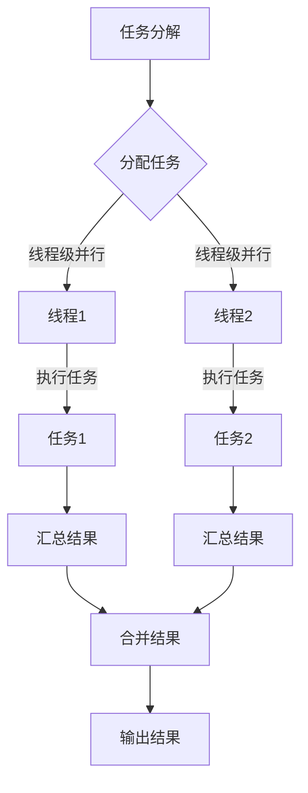

                 

# 《计算：第四部分 计算的极限 第9章 计算复杂性 计算的时空平衡性》

## 关键词：计算复杂性、时空平衡性、计算时空平衡性分析、计算性能优化、计算复杂性未来趋势、计算复杂性时空平衡性应用

### 摘要：
在《计算：第四部分 计算的极限 第9章 计算复杂性 计算的时空平衡性》一文中，我们将深入探讨计算复杂性的概念及其在实际应用中的挑战。通过对计算复杂性的时空平衡性分析，我们旨在揭示计算性能优化的一般方法和策略，并展望计算复杂性的未来发展趋势。文章将结合实际应用案例，详细讲解计算复杂性时空平衡性的实现方法和具体实践，以期为读者提供全面的计算复杂性认识和应用指导。

## 《计算：第四部分 计算的极限 第9章 计算复杂性 计算的时空平衡性》目录大纲

### 第1章 计算复杂性概述
#### 1.1 计算复杂性的基本概念
##### 1.1.1 时间复杂度和空间复杂度
##### 1.1.2 时间复杂度的主要度量方式
##### 1.1.3 空间复杂度的主要度量方式

#### 1.2 计算复杂性的基本理论
##### 1.2.1 NP 完全性理论
##### 1.2.2 P vs NP 问题
##### 1.2.3 多项式时间可解问题

#### 1.3 计算复杂性在实际应用中的挑战
##### 1.3.1 数据密集型计算
##### 1.3.2 能效平衡
##### 1.3.3 算法优化

### 第2章 计算复杂性的时空平衡性分析
#### 2.1 计算时空平衡性的概念
##### 2.1.1 时空平衡性的基本原理
##### 2.1.2 时空平衡性的重要性

#### 2.2 计算时空平衡性的实现方法
##### 2.2.1 并行计算
##### 2.2.2 分布式计算
##### 2.2.3 异构计算

#### 2.3 时空平衡性在特定应用场景中的表现
##### 2.3.1 云计算
##### 2.3.2 物联网
##### 2.3.3 人工智能

### 第3章 计算复杂性与性能优化
#### 3.1 性能优化的一般方法
##### 3.1.1 硬件加速
##### 3.1.2 算法优化
##### 3.1.3 数据优化

#### 3.2 特定算法的性能优化策略
##### 3.2.1 搜索算法
##### 3.2.2 排序算法
##### 3.2.3 图算法

#### 3.3 计算性能测试与评估
##### 3.3.1 性能测试工具
##### 3.3.2 性能评估指标
##### 3.3.3 性能调优实践

### 第4章 计算复杂性的未来趋势与展望
#### 4.1 计算复杂性的研究前沿
##### 4.1.1 量子计算
##### 4.1.2 神经网络计算
##### 4.1.3 其他新兴计算模型

#### 4.2 时空平衡性的未来发展
##### 4.2.1 能效计算
##### 4.2.2 绿色计算
##### 4.2.3 算法生态

#### 4.3 计算复杂性的应用挑战与机遇
##### 4.3.1 大数据处理
##### 4.3.2 安全计算
##### 4.3.3 智能计算

### 第5章 案例研究：计算复杂性的时空平衡性应用
#### 5.1 案例一：云计算中的计算复杂性管理
##### 5.1.1 案例背景
##### 5.1.2 案例分析
##### 5.1.3 案例启示

#### 5.2 案例二：物联网中的时空平衡性优化
##### 5.2.1 案例背景
##### 5.2.2 案例分析
##### 5.2.3 案例启示

#### 5.3 案例三：人工智能中的计算性能优化
##### 5.3.1 案例背景
##### 5.3.2 案例分析
##### 5.3.3 案例启示

### 附录
#### 附录A：计算复杂性时空平衡性相关资源
##### A.1 学术资源
##### A.2 工具与软件
##### A.3 行业标准与规范

#### 附录B：计算复杂性时空平衡性相关的 Mermaid 流程图
##### B.1 多项式时间算法流程图
##### B.2 并行计算模型流程图

#### 附录C：计算复杂性时空平衡性相关的数学模型与公式
##### C.1 时间复杂度公式
##### C.2 空间复杂度公式
##### C.3 能效平衡公式

#### 附录D：计算复杂性时空平衡性的项目实战案例代码
##### D.1 实战案例一：并行计算优化
##### D.2 实战案例二：分布式计算应用
##### D.3 实战案例三：算法性能优化实践
##### D.4 实战案例四：时空平衡性优化案例分析

接下来，我们将按照目录大纲结构，逐章分析计算复杂性及其时空平衡性的概念、理论、应用和实践，以及未来的发展趋势和挑战。我们将使用一步一步分析推理思考的方式，结合实际案例，深入探讨计算复杂性的本质和解决方案。让我们开始这场关于计算复杂性和时空平衡性的探索之旅吧！ <|assistant|>## 第1章 计算复杂性概述

### 1.1 计算复杂性的基本概念

计算复杂性是指算法或程序在执行过程中，计算时间、计算资源和数据存储空间的需求与输入规模之间的关系。简单来说，它衡量了算法的效率，即解决特定问题所需的时间和资源消耗。计算复杂性主要包括时间复杂度和空间复杂度两个方面。

- **时间复杂度**：描述算法执行的时间需求，通常使用大O符号（O-notation）来表示。例如，一个算法的时间复杂度为O(n)，意味着当输入规模n增加时，算法执行的时间将以线性关系增长。

- **空间复杂度**：描述算法执行时所需的空间需求，包括存储数据和临时变量的空间。同样，空间复杂度也使用大O符号来表示。例如，一个算法的空间复杂度为O(1)，意味着其所需空间不随输入规模的变化而变化。

在计算复杂性中，时间复杂度和空间复杂度通常是相互关联的。一般来说，优化一个方面的性能可能会对另一个方面产生不利影响。因此，在实际应用中，我们需要在时间和空间复杂度之间找到一个平衡点，以实现最优的性能。

### 1.2 计算复杂性的基本理论

计算复杂性的研究涉及许多基本理论，其中NP完全性理论、P vs NP问题和多项式时间可解问题是尤为重要的。

- **NP完全性理论**：NP（非确定性多项式时间）完全性理论是计算复杂性理论中的一个重要概念。一个问题是NP完全的，当且仅当它可以通过多项式时间转换为一个已知的NP问题。NP完全性问题通常具有很高的计算复杂性，解决它们需要大量的时间和资源。

- **P vs NP 问题**：P vs NP问题是计算复杂性理论中最为著名的问题之一。P类问题是指在多项式时间内可解决的问题，而NP类问题是指可以在多项式时间内验证的解问题。P vs NP问题探讨了P类和NP类问题之间的关系，即是否存在一种算法可以在多项式时间内解决所有NP问题。如果P=NP，意味着许多复杂的计算问题可以在多项式时间内解决，这将极大地改变我们对计算能力的认识。然而，目前尚未有确凿的证据证明P=NP或P≠NP。

- **多项式时间可解问题**：多项式时间可解问题是指可以在多项式时间内解决的问题。这类问题相对容易处理，因为它们的时间复杂度较低。多项式时间可解问题在计算复杂性理论中具有很高的地位，因为它们是研究计算复杂性的基础。

### 1.3 计算复杂性在实际应用中的挑战

计算复杂性在实际应用中面临许多挑战，主要包括数据密集型计算、能效平衡和算法优化等方面。

- **数据密集型计算**：随着大数据时代的到来，数据处理的需求日益增长。数据密集型计算需要处理大规模的数据集，这对计算时间和资源提出了极高的要求。如何高效地处理这些数据，同时保持计算复杂度在可接受范围内，是当前研究的一个重要方向。

- **能效平衡**：随着计算设备的规模不断增大，能耗问题变得越来越突出。如何在保证计算性能的同时，实现能效平衡，成为计算复杂性研究的一个重要课题。这需要我们在硬件和软件层面进行优化，以降低能耗。

- **算法优化**：算法优化是提高计算效率的重要手段。通过分析算法的时间复杂度和空间复杂度，我们可以找到优化算法的方法。例如，我们可以通过算法改进、数据结构优化和并行计算等方式，降低计算复杂度，提高计算性能。

### 1.4 本章小结

本章对计算复杂性的基本概念、基本理论和实际应用挑战进行了概述。计算复杂性是衡量算法效率的重要指标，它包括时间复杂度和空间复杂度两个方面。在计算复杂性的研究中，NP完全性理论、P vs NP问题和多项式时间可解问题具有重要意义。在实际应用中，计算复杂性面临数据密集型计算、能效平衡和算法优化等挑战。下一章，我们将深入探讨计算复杂性的时空平衡性分析。 <|assistant|>## 第1章 计算复杂性概述

### 1.1 计算复杂性的基本概念

计算复杂性是算法分析和计算机科学中一个核心概念，它描述了算法的效率和性能。具体来说，计算复杂性主要涉及两个方面：时间复杂度和空间复杂度。

**时间复杂度**是指算法在执行过程中，计算时间与输入规模（通常用n表示）之间的关系。时间复杂度通常用大O符号（O-notation）来表示，例如，如果某个算法的时间复杂度为O(n)，则表示随着输入规模n的增加，算法的时间需求将线性增长。常见的时间复杂度有O(1)，O(log n)，O(n)，O(n log n)，O(n²)，O(2^n)等。

- **O(1)**：常数时间复杂度，表示算法的执行时间不随输入规模的变化而变化。
- **O(log n)**：对数时间复杂度，表示算法的执行时间与输入规模的以2为底的对数成正比。
- **O(n)**：线性时间复杂度，表示算法的执行时间与输入规模的线性增长有关。
- **O(n log n)**：线性对数时间复杂度，表示算法的执行时间与输入规模的线性增长和对数增长有关。
- **O(n²)**：二次时间复杂度，表示算法的执行时间与输入规模的平方成正比。
- **O(2^n)**：指数时间复杂度，表示算法的执行时间与输入规模的指数增长有关。

**空间复杂度**则是指算法在执行过程中，所需内存空间（包括存储数据和临时变量的空间）与输入规模之间的关系。空间复杂度同样使用大O符号来表示，常见的空间复杂度有O(1)，O(n)，O(n²)等。

- **O(1)**：常数空间复杂度，表示算法的内存需求不随输入规模的变化而变化。
- **O(n)**：线性空间复杂度，表示算法的内存需求与输入规模的线性增长有关。
- **O(n²)**：二次空间复杂度，表示算法的内存需求与输入规模的平方成正比。

在计算复杂性的研究中，时间复杂度和空间复杂度通常是相互关联的。优化一个方面的性能可能会对另一个方面产生不利影响。例如，一个算法的时间复杂度较低，但空间复杂度较高，或者反之。因此，在实际应用中，我们需要在时间和空间复杂度之间找到一个平衡点，以实现最优的性能。

### 1.1.1 时间复杂度和空间复杂度

在深入探讨时间复杂度和空间复杂度之前，我们先来定义一些基本概念。

**时间复杂度（Time Complexity）**：

时间复杂度是指算法执行所需的时间，与输入规模n的关系。通常，我们用大O符号来表示时间复杂度，例如O(n)，O(n²)，O(log n)等。

- **O(n)**：线性时间复杂度，表示算法的执行时间与输入规模n成正比。
- **O(n²)**：二次时间复杂度，表示算法的执行时间与输入规模n的平方成正比。
- **O(log n)**：对数时间复杂度，表示算法的执行时间与输入规模n的对数成正比。

**空间复杂度（Space Complexity）**：

空间复杂度是指算法在执行过程中所需的最大内存空间，与输入规模n的关系。同样，我们用大O符号来表示空间复杂度，例如O(1)，O(n)，O(n²)等。

- **O(1)**：常数空间复杂度，表示算法所需的最大内存空间不随输入规模的变化而变化。
- **O(n)**：线性空间复杂度，表示算法所需的最大内存空间与输入规模n成正比。
- **O(n²)**：二次空间复杂度，表示算法所需的最大内存空间与输入规模n的平方成正比。

下面，我们通过一个简单的例子来说明时间复杂度和空间复杂度的概念。

**示例**：

考虑一个简单的排序算法，它需要将一个包含n个元素的数组进行排序。

- **时间复杂度**：排序算法的时间复杂度通常是O(n log n)，这是因为许多有效的排序算法，如快速排序和归并排序，都具有这个时间复杂度。
- **空间复杂度**：快速排序的空间复杂度通常是O(log n)，因为它的递归调用深度通常是对数级的。

### 1.1.2 时间复杂度的主要度量方式

在计算时间复杂度时，我们需要分析算法的基本操作，并确定其执行次数与输入规模的关系。以下是几种常见的时间复杂度度量方式：

1. **基本操作次数**：

   基本操作次数是指算法在执行过程中，最基本操作（如比较、赋值等）的执行次数。基本操作次数与输入规模n的关系决定了算法的时间复杂度。

   - 例如，一个简单的线性搜索算法的时间复杂度是O(n)，因为需要逐个比较n个元素。

2. **递归关系**：

   对于递归算法，我们可以通过递归关系来确定其时间复杂度。

   - 例如，二分查找算法的时间复杂度是O(log n)，因为它将问题规模减半，直到找到所需元素或确定元素不存在。

3. **多项式时间**：

   多项式时间复杂度是指算法的时间复杂度可以用多项式来表示。

   - 例如，多项式时间算法的时间复杂度通常用O(n^k)来表示，其中k是一个常数。

4. **渐近时间复杂度**：

   渐近时间复杂度是指当输入规模n趋向无穷大时，算法的时间复杂度。

   - 例如，一个算法的时间复杂度是O(n²)，表示当输入规模n增加时，算法的时间需求将以平方关系增长。

### 1.1.3 空间复杂度的主要度量方式

空间复杂度主要关注算法在执行过程中所需的内存空间。以下是一些常见的空间复杂度度量方式：

1. **常量空间复杂度（O(1））**：

   常量空间复杂度表示算法的内存需求不随输入规模的变化而变化。

   - 例如，一个简单的函数，如计算两个数的和，其空间复杂度是O(1)。

2. **线性空间复杂度（O(n））**：

   线性空间复杂度表示算法的内存需求与输入规模n成正比。

   - 例如，一个简单的排序算法，其空间复杂度是O(n)，因为它需要额外的空间来存储排序过程中的临时数组。

3. **二次空间复杂度（O(n²））**：

   二次空间复杂度表示算法的内存需求与输入规模n的平方成正比。

   - 例如，某些图算法，如深度优先搜索（DFS），其空间复杂度可能是O(n²)，因为它需要存储所有的邻接矩阵。

4. **渐近空间复杂度**：

   渐近空间复杂度是指当输入规模n趋向无穷大时，算法的空间复杂度。

   - 例如，一个算法的空间复杂度是O(n²)，表示当输入规模n增加时，算法的内存需求将以平方关系增长。

通过以上对时间复杂度和空间复杂度基本概念、度量方式的详细介绍，我们为后续章节的深入探讨奠定了基础。在接下来的章节中，我们将进一步分析计算复杂性的基本理论，探讨其在实际应用中的挑战，并研究计算复杂性的时空平衡性。这将帮助我们更好地理解计算复杂性，并找到优化计算性能的有效途径。 <|assistant|>### 1.2 计算复杂性的基本理论

计算复杂性的基本理论为我们提供了衡量算法效率和性能的量化标准，有助于我们在设计算法时做出科学合理的决策。在计算复杂性理论中，NP完全性理论、P vs NP 问题以及多项式时间可解问题是非常重要的核心概念。

#### 1.2.1 NP完全性理论

NP（非确定性多项式时间）完全性理论是计算复杂性理论中的一个重要概念。一个问题是NP完全的，当且仅当它可以通过多项式时间转换为一个已知的NP问题。NP完全性问题通常具有很高的计算复杂性，解决它们需要大量的时间和资源。

- **定义**：一个问题是NP完全的，如果它满足以下条件：
  1. **NP性质**：存在一个验证算法，可以在多项式时间内验证一个给定的解。
  2. **完全性**：该问题可以用来决定任何其他NP问题。

- **示例**：著名的NP完全问题包括旅行商问题（TSP）、整数规划问题、图着色问题等。

NP完全性问题的一个重要特征是其难以在多项式时间内解决，但可以快速验证一个解。这意味着，如果我们有一个高效的验证算法，就可以在多项式时间内确定一个解是否正确。

#### 1.2.2 P vs NP 问题

P vs NP 问题可能是计算复杂性理论中最著名的问题之一。它探讨的是P类问题和NP类问题之间的关系。

- **P类问题**：可以在多项式时间内解决的问题。
- **NP类问题**：可以在多项式时间内验证的解问题。

P vs NP 问题问的是：P类问题和NP类问题是否相同？即是否存在一个算法，可以在多项式时间内解决所有的NP问题。

- **如果P=NP**，意味着所有可以在多项式时间内验证的解问题都可以在多项式时间内解决，这将极大地改变我们对计算能力的认识。
- **如果P≠NP**，意味着存在一些问题，它们不能在多项式时间内解决，但可以在多项式时间内验证。

目前，P vs NP 问题仍然是一个未解之谜。虽然许多数学家和计算机科学家尝试解决它，但迄今为止还没有找到确凿的证据证明P=NP或P≠NP。

#### 1.2.3 多项式时间可解问题

多项式时间可解问题是指可以在多项式时间内解决的问题。这类问题相对容易处理，因为它们的时间复杂度较低。

- **定义**：一个问题是多项式时间可解的，如果存在一个算法，可以在多项式时间内解决它。

- **示例**：多项式时间可解问题包括线性方程组求解、排序问题、最短路径问题等。

多项式时间可解问题在计算复杂性理论中具有很高的地位，因为它们是研究计算复杂性的基础。许多复杂的计算问题，如NP完全问题，都是通过多项式时间可解问题来定义和研究的。

#### 1.2.4 计算复杂性与算法设计

计算复杂性的基本理论对算法设计具有深远的影响。在设计算法时，我们需要考虑以下因素：

1. **时间复杂度**：我们希望算法的时间复杂度尽可能低，以便在处理大规模问题时仍能保持高效的性能。
2. **空间复杂度**：我们希望算法的空间复杂度尽可能低，以便在有限内存资源下仍能运行。
3. **问题特性**：我们需要根据问题的特性选择合适的算法，例如，对于NP完全问题，我们可能需要寻找近似解或启发式算法。

通过理解计算复杂性的基本理论，我们可以更好地分析算法的效率和性能，从而设计出更加高效和优化的算法。这也是计算复杂性理论在计算机科学中具有重要地位的原因之一。

总之，计算复杂性的基本理论为我们提供了衡量算法效率和性能的量化标准，有助于我们在设计算法时做出科学合理的决策。通过深入探讨NP完全性理论、P vs NP 问题以及多项式时间可解问题，我们可以更好地理解计算复杂性的本质，并为优化计算性能提供理论基础。在下一章中，我们将继续探讨计算复杂性在实际应用中的挑战，并研究计算复杂性的时空平衡性。这将帮助我们更好地应对复杂的计算问题，并实现高效的计算解决方案。 <|assistant|>### 1.3 计算复杂性在实际应用中的挑战

尽管计算复杂性理论为算法设计和优化提供了有力的工具，但在实际应用中，我们仍然面临着许多挑战。这些挑战主要体现在数据密集型计算、能效平衡和算法优化等方面。

#### 1.3.1 数据密集型计算

随着大数据时代的到来，数据处理的需求日益增长。数据密集型计算需要处理大规模的数据集，这对计算时间和资源提出了极高的要求。如何高效地处理这些数据，同时保持计算复杂度在可接受范围内，是当前研究的一个重要方向。

- **挑战**：数据密集型计算通常涉及到高维度、高噪声的数据，处理这些数据需要高效的算法和优化技术。
- **解决方案**：为了应对这些挑战，我们可以采用以下策略：
  1. **分布式计算**：将数据处理任务分解成多个子任务，分布在不同节点上并行执行，以提高处理效率。
  2. **增量处理**：只处理新增加的数据，而不是重新处理整个数据集，以减少计算开销。
  3. **数据压缩**：通过数据压缩技术，减少数据存储和传输的开销，提高计算效率。

#### 1.3.2 能效平衡

随着计算设备的规模不断增大，能耗问题变得越来越突出。如何在保证计算性能的同时，实现能效平衡，成为计算复杂性研究的一个重要课题。这需要我们在硬件和软件层面进行优化，以降低能耗。

- **挑战**：计算设备（如服务器、数据中心）的高能耗不仅增加了运行成本，还可能导致环境污染。
- **解决方案**：为了应对这些挑战，我们可以采用以下策略：
  1. **节能硬件**：选择能效更高的硬件设备，如使用低功耗处理器和内存。
  2. **智能调度**：根据任务负载动态调整计算资源的分配，以减少闲置资源的能耗。
  3. **能效优化算法**：设计能效优化的算法，降低计算过程中的能耗。

#### 1.3.3 算法优化

算法优化是提高计算效率的重要手段。通过分析算法的时间复杂度和空间复杂度，我们可以找到优化算法的方法。例如，我们可以通过算法改进、数据结构优化和并行计算等方式，降低计算复杂度，提高计算性能。

- **挑战**：现有的算法和优化方法可能无法完全满足日益增长的计算需求，需要不断探索新的优化技术。
- **解决方案**：
  1. **算法改进**：针对特定问题，改进现有的算法，提高其时间复杂度和空间复杂度。
  2. **数据结构优化**：选择适合问题的数据结构，减少数据访问和存储的开销。
  3. **并行计算**：将计算任务分解成多个子任务，分布在不同处理器上并行执行，以提高计算效率。

通过应对这些实际应用中的挑战，我们可以设计出更加高效和优化的计算解决方案，从而满足日益增长的计算需求。

### 1.3.4 计算性能测试与评估

计算性能测试与评估是计算复杂性研究的重要组成部分。通过性能测试，我们可以评估算法和系统的性能，找到性能瓶颈，并采取相应的优化措施。

- **测试方法**：性能测试包括以下几个方面：
  1. **基准测试**：使用标准化的测试程序和测试数据集，评估算法和系统的性能。
  2. **负载测试**：模拟实际工作负载，评估算法和系统的稳定性和性能。
  3. **压力测试**：在极端条件下，评估算法和系统的性能和稳定性。

- **评估指标**：常见的评估指标包括：
  1. **时间复杂度**：评估算法的时间效率。
  2. **空间复杂度**：评估算法的空间效率。
  3. **吞吐量**：单位时间内处理的数据量。
  4. **延迟**：处理请求所需的时间。
  5. **资源利用率**：系统资源的利用率，包括CPU、内存和磁盘等。

通过计算性能测试与评估，我们可以找到优化算法和系统的方向，从而提高计算性能，满足实际应用需求。

### 1.3.5 计算复杂性的应用领域

计算复杂性理论在许多应用领域中具有重要意义，包括但不限于：

- **云计算**：通过优化算法和系统性能，提高云计算服务的效率。
- **物联网**：处理大规模的物联网数据，优化数据传输和处理。
- **人工智能**：设计高效的算法和优化技术，提高人工智能系统的性能。
- **大数据处理**：处理大规模的数据集，优化数据处理和分析。

通过在各个应用领域中应用计算复杂性理论，我们可以设计出更加高效和优化的计算解决方案，从而满足日益增长的计算需求。

### 1.3.6 未来展望

随着计算技术的不断发展，计算复杂性理论将继续发挥重要作用。未来，我们可能会看到以下趋势：

- **量子计算**：量子计算具有极高的计算速度和效率，可能会颠覆传统的计算模式。
- **分布式计算**：随着云计算和物联网的发展，分布式计算将变得更加重要。
- **能效计算**：随着能耗问题的日益突出，能效计算将成为研究的热点。

通过不断探索和优化计算复杂性理论，我们可以设计出更加高效和优化的计算解决方案，推动计算技术的发展和应用。

总之，计算复杂性在实际应用中面临许多挑战，但通过合理的设计和优化，我们可以克服这些挑战，实现高效的计算解决方案。在下一章中，我们将深入探讨计算复杂性的时空平衡性分析，进一步揭示计算性能优化的一般方法和策略。这将有助于我们更好地理解计算复杂性，并找到优化计算性能的有效途径。 <|assistant|>## 第2章 计算复杂性的时空平衡性分析

### 2.1 计算时空平衡性的概念

计算时空平衡性是指在计算过程中，时间复杂度和空间复杂度之间保持一定的平衡，以实现最优的性能。在实际应用中，时间和空间资源往往是有限的，如何在两者之间找到一个平衡点，是计算复杂性问题中的一项重要任务。

#### 2.1.1 时空平衡性的基本原理

时空平衡性的基本原理可以概括为以下几点：

1. **平衡关系**：时空平衡性强调时间和空间资源之间的相互关系。在一个算法中，时间和空间资源往往是相互影响的。优化时间复杂度可能会增加空间复杂度，反之亦然。
2. **性能优化**：通过调整算法的设计，使时间和空间复杂度在一个合理的范围内，以达到性能优化。
3. **资源约束**：在实际应用中，计算资源和时间资源通常是有限的。时空平衡性要求我们在有限的资源下，实现最佳的计算性能。

#### 2.1.2 时空平衡性的重要性

时空平衡性在计算复杂性中的重要性体现在以下几个方面：

1. **优化计算性能**：通过平衡时间和空间复杂度，我们可以优化计算性能，提高算法的效率。
2. **适应不同场景**：在不同的计算场景中，时间和空间资源的重要性不同。时空平衡性使我们能够适应各种不同的计算需求，实现最优的性能。
3. **资源利用率**：通过合理分配时间和空间资源，我们可以提高系统的资源利用率，降低计算成本。

### 2.2 计算时空平衡性的实现方法

实现计算时空平衡性，主要依赖于以下几种方法：

#### 2.2.1 并行计算

并行计算通过将计算任务分解成多个子任务，分布在不同处理器上并行执行，从而提高计算效率。并行计算可以显著降低时间复杂度，但在某些情况下，可能会增加空间复杂度。

- **基本原理**：并行计算的核心思想是利用多个处理器同时执行多个任务，从而缩短计算时间。
- **实现方式**：常见的并行计算方法包括线程级并行、任务级并行和数据级并行。
- **优缺点**：并行计算可以显著提高计算速度，但需要复杂的调度和管理算法。此外，并行计算可能增加空间复杂度。

#### 2.2.2 分布式计算

分布式计算通过将计算任务分布在不同节点上执行，以充分利用资源。分布式计算可以降低单点的计算压力，提高系统的容错性和可扩展性。

- **基本原理**：分布式计算的核心思想是将计算任务分布在不同节点上，通过通信网络协同完成计算。
- **实现方式**：常见的分布式计算框架包括MapReduce、Hadoop和Spark等。
- **优缺点**：分布式计算可以提高系统的性能和可靠性，但需要复杂的分布式算法和通信机制。

#### 2.2.3 异构计算

异构计算通过利用不同类型的计算资源（如CPU、GPU、FPGA等），实现计算任务的优化。异构计算可以在时间和空间复杂度之间实现更好的平衡。

- **基本原理**：异构计算的核心思想是利用不同类型的计算资源，实现计算任务的优化。
- **实现方式**：常见的异构计算方法包括GPU加速、FPGA加速等。
- **优缺点**：异构计算可以显著提高计算性能，但需要复杂的资源调度和管理算法。

### 2.3 时空平衡性在特定应用场景中的表现

在不同的应用场景中，时空平衡性的表现各有不同。以下是一些典型应用场景及其时空平衡性的分析：

#### 2.3.1 云计算

在云计算中，时空平衡性非常重要。云计算系统需要处理大量用户请求，同时保持高效的性能和低廉的成本。

- **时间平衡**：通过分布式计算和并行计算，云计算系统可以提高处理速度，满足大量用户的需求。
- **空间平衡**：通过虚拟化技术和资源调度算法，云计算系统可以实现资源的高效利用，降低空间复杂度。

#### 2.3.2 物联网

物联网涉及到大量设备的通信和数据处理，时空平衡性对于保证系统的实时性和可靠性至关重要。

- **时间平衡**：通过分布式计算和边缘计算，物联网系统可以提高数据处理速度，保证实时性。
- **空间平衡**：通过数据压缩和存储优化，物联网系统可以降低空间复杂度，提高系统性能。

#### 2.3.3 人工智能

人工智能系统通常需要处理大量数据和复杂的计算任务，时空平衡性对于算法的效率和模型的准确性具有重要意义。

- **时间平衡**：通过并行计算和异构计算，人工智能系统可以提高计算速度，满足大规模数据处理需求。
- **空间平衡**：通过模型压缩和存储优化，人工智能系统可以降低空间复杂度，提高模型效率。

### 2.4 时空平衡性的应用挑战与机遇

在实际应用中，时空平衡性面临着许多挑战和机遇。以下是一些主要的挑战和机遇：

#### 挑战

1. **资源限制**：计算资源和时间资源通常是有限的，如何在两者之间实现平衡是一个重要挑战。
2. **异构计算**：异构计算需要复杂的资源调度和管理算法，如何优化这些算法是一个关键问题。
3. **分布式计算**：分布式计算需要高效的通信机制和调度算法，如何提高系统的效率和可靠性是一个重要挑战。

#### 机遇

1. **新型计算模型**：随着计算技术的不断发展，新型计算模型（如量子计算、神经网络计算等）为时空平衡性提供了新的机遇。
2. **绿色计算**：随着环保意识的提高，绿色计算成为研究热点，如何实现能效平衡是一个重要的研究方向。
3. **人工智能**：人工智能技术的快速发展为时空平衡性提供了广泛的应用场景，如何优化算法和系统性能是一个重要机遇。

总之，计算时空平衡性是计算复杂性理论中的一个重要课题，通过合理的设计和优化，我们可以实现时间和空间资源的最佳平衡，提高计算性能。在下一章中，我们将进一步探讨计算复杂性与性能优化的一般方法和策略，以期为解决计算复杂性提供更全面的解决方案。 <|assistant|>### 第2章 计算复杂性的时空平衡性分析

#### 2.2 计算时空平衡性的实现方法

计算时空平衡性在实际应用中是一个复杂且动态调整的过程，涉及到多种策略和方法。以下是一些常见的实现方法：

##### 2.2.1 并行计算

并行计算是一种通过将大任务分解成多个小任务，并在多个处理器上同时执行这些小任务的方法。这种方法能够显著减少任务的总执行时间。

- **基本原理**：并行计算的核心在于任务分配和同步。任务分配是将大任务分解成多个子任务，并分配给不同的处理器或线程。同步则是确保各子任务在执行过程中保持一致性。

- **实现方式**：
  1. **线程级并行**：在同一个处理器上创建多个线程，每个线程处理不同的子任务。
  2. **进程级并行**：在多个处理器上创建多个进程，每个进程处理不同的子任务。
  3. **数据级并行**：将数据集分割成多个部分，每个部分由不同的处理器处理。

- **优缺点**：
  - 优点：并行计算可以显著提高计算速度，减少执行时间。
  - 缺点：并行计算需要复杂的调度和管理，且可能增加空间复杂度。

##### 2.2.2 分布式计算

分布式计算通过将任务分布在多个计算机或节点上，利用网络通信协同完成任务。这种方法可以提高系统的容错性和可扩展性。

- **基本原理**：分布式计算的核心在于任务分配和状态同步。任务分配是将大任务分解成多个子任务，并分配给不同的节点。状态同步则是确保各节点上的子任务保持一致。

- **实现方式**：
  1. **MapReduce**：一种基于数据映射和归约的分布式计算模型。
  2. **Hadoop**：一种分布式文件系统和数据处理框架。
  3. **Spark**：一种基于内存的分布式数据处理引擎。

- **优缺点**：
  - 优点：分布式计算可以提高系统的可靠性和可扩展性。
  - 缺点：分布式计算需要复杂的通信机制和调度算法，可能增加空间复杂度。

##### 2.2.3 异构计算

异构计算利用不同类型的计算资源（如CPU、GPU、FPGA等）来执行不同的计算任务，实现计算资源的优化配置。

- **基本原理**：异构计算的核心在于资源调度和任务分配。资源调度是选择合适的计算资源来执行任务，任务分配是将任务分配给不同的计算资源。

- **实现方式**：
  1. **GPU加速**：利用GPU的并行计算能力，加速大规模数据处理和科学计算。
  2. **FPGA加速**：利用FPGA的高性能和可编程性，优化特定计算任务的执行。
  3. **混合计算**：结合CPU和GPU、CPU和FPGA等多种计算资源，实现计算任务的优化。

- **优缺点**：
  - 优点：异构计算可以充分利用不同类型计算资源的优势，提高计算性能。
  - 缺点：异构计算需要复杂的资源管理和调度算法，可能增加开发难度。

##### 2.2.4 代码优化

代码优化是通过改进代码结构和算法来实现计算时空平衡的有效方法。以下是一些常见的代码优化策略：

- **算法优化**：通过改进算法设计，降低时间复杂度和空间复杂度。例如，使用更高效的排序算法或搜索算法。
- **数据结构优化**：通过选择更适合问题的数据结构，减少数据访问和存储的开销。例如，使用哈希表代替数组。
- **内存管理**：通过优化内存分配和释放策略，减少内存占用和垃圾回收开销。例如，使用内存池技术。
- **循环优化**：通过优化循环结构，减少循环次数和计算量。例如，使用循环展开和迭代消去。

##### 2.2.5 系统优化

系统优化是通过改进计算系统的整体性能来实现时空平衡的方法。以下是一些常见的系统优化策略：

- **资源调度**：通过优化资源调度算法，提高计算资源的利用率。例如，使用负载均衡算法。
- **缓存优化**：通过优化缓存策略，减少数据访问的延迟。例如，使用LRU缓存替换算法。
- **网络优化**：通过优化网络通信，提高分布式计算的性能。例如，使用高效的数据传输协议和压缩算法。

通过上述方法，我们可以在计算复杂性的时空平衡性方面实现优化，从而提高计算效率和性能。在下一章中，我们将探讨计算复杂性与性能优化的一般方法和策略，并结合具体应用场景进行深入分析。这将为解决实际计算问题提供有益的参考和指导。 <|assistant|>### 2.3 时空平衡性在特定应用场景中的表现

计算时空平衡性在特定应用场景中的表现各不相同，但核心目标都是实现高效和优化的计算性能。以下是一些典型应用场景及其时空平衡性的具体分析：

#### 2.3.1 云计算

在云计算中，时空平衡性对于提供高质量的服务至关重要。云计算环境通常具有大量用户和海量数据，需要处理大量的计算和存储任务。

- **时间平衡**：云计算系统通过分布式计算和并行计算技术来提高处理速度。例如，使用MapReduce模型将大任务分解成多个小任务，分布在不同节点上同时执行，从而减少整体执行时间。
  
- **空间平衡**：云计算系统采用高效的存储和资源管理策略，如数据分片和分布式存储。通过将数据存储在多个节点上，可以降低单个节点的存储压力，同时提高数据访问速度和可靠性。

- **实现方式**：云计算平台通常使用分布式文件系统（如Hadoop的HDFS）和分布式计算框架（如Spark和Flink）来实现时空平衡。这些技术可以有效地分配计算资源，减少任务执行时间，同时提高资源利用率。

- **案例分析**：例如，阿里云的Elastic Compute Service（ECS）通过提供可扩展的计算资源，实现了高效的时间平衡。同时，使用分布式存储技术如OSS（Object Storage Service）来实现空间平衡。

#### 2.3.2 物联网

物联网（IoT）涉及到大量设备和传感器，需要处理实时数据传输和计算任务。时空平衡性在物联网中尤为重要，因为设备的计算能力和存储空间通常有限。

- **时间平衡**：物联网系统通过边缘计算和分布式计算技术，将数据预处理和计算任务分布到边缘节点，从而减少中心节点的计算负担，提高响应速度。

- **空间平衡**：物联网系统采用数据压缩和存储优化技术，降低数据传输和存储的开销。例如，使用Mqtt等协议进行高效的数据传输，采用压缩算法减少数据大小。

- **实现方式**：物联网设备通常使用嵌入式系统和轻量级计算框架，如Node.js和Python微服务，来实现时间和空间平衡。此外，物联网平台（如AWS IoT和Google Cloud IoT）提供边缘计算功能，使得数据处理更加高效。

- **案例分析**：例如，智能家居系统中的智能音箱通过边缘计算实现实时语音识别和响应，同时采用压缩算法减少数据传输量，实现时间和空间的平衡。

#### 2.3.3 人工智能

人工智能（AI）系统通常需要处理大量的数据和复杂的计算任务，时空平衡性对于算法效率和模型准确性至关重要。

- **时间平衡**：人工智能系统通过并行计算和异构计算技术，提高计算速度。例如，使用GPU和TPU等专用硬件加速神经网络计算，同时使用分布式计算框架（如TensorFlow和PyTorch）来分配计算任务。

- **空间平衡**：人工智能系统采用模型压缩和优化技术，降低模型的存储和计算需求。例如，使用量化技术减少模型的位数，使用剪枝技术去除冗余权重。

- **实现方式**：人工智能系统通常采用分布式计算框架和异构计算平台，如Google AI Platform和AWS SageMaker，来实现时空平衡。这些平台提供高效的计算和存储优化工具，以实现最优的性能。

- **案例分析**：例如，自动驾驶系统通过分布式计算处理来自多个传感器的数据，同时使用模型压缩技术减少模型的存储和计算需求，实现时间和空间的平衡。

#### 2.3.4 大数据处理

大数据处理涉及到大规模数据集的存储、传输和计算，时空平衡性对于处理效率和数据可靠性至关重要。

- **时间平衡**：大数据处理系统通过分布式计算和并行计算技术，提高处理速度。例如，使用Hadoop和Spark等分布式数据处理框架来处理大规模数据集。

- **空间平衡**：大数据处理系统采用数据压缩和存储优化技术，降低存储需求。例如，使用Hadoop的HDFS来分布式存储数据，同时使用数据压缩算法减少存储空间。

- **实现方式**：大数据处理系统通常使用分布式文件系统和数据处理框架，如Hadoop和Spark，来实现时空平衡。这些系统提供高效的数据处理和存储优化工具，以提高性能和可靠性。

- **案例分析**：例如，金融机构使用Hadoop来处理海量交易数据，同时使用数据压缩技术减少存储空间，实现时间和空间的平衡。

通过在特定应用场景中应用时空平衡性策略，我们可以实现高效和优化的计算性能，满足不同应用的需求。在下一章中，我们将进一步探讨计算复杂性与性能优化的一般方法和策略，为解决计算复杂性提供更全面的解决方案。这将为我们在实际项目中实现高效计算提供重要参考。 <|assistant|>### 第3章 计算复杂性与性能优化

计算复杂性与性能优化是计算领域中的一个关键课题，旨在通过改进算法和系统设计，降低计算复杂度，提高计算性能。本章将探讨性能优化的一般方法和策略，并针对特定算法（如搜索算法、排序算法和图算法）进行深入分析。

#### 3.1 性能优化的一般方法

性能优化的一般方法包括以下几个方面：

##### 3.1.1 硬件加速

硬件加速是通过利用专用硬件（如GPU、FPGA等）来加速计算任务的一种方法。硬件加速可以显著降低时间复杂度，提高计算性能。

- **实现方式**：
  1. **GPU加速**：利用GPU的并行计算能力，加速大规模数据处理和科学计算。例如，使用CUDA和OpenCL等编程框架开发GPU加速算法。
  2. **FPGA加速**：利用FPGA的高性能和可编程性，优化特定计算任务的执行。例如，使用VHDL和Verilog等硬件描述语言开发FPGA加速器。

- **优缺点**：
  - 优点：硬件加速可以显著提高计算速度，降低时间复杂度。
  - 缺点：硬件加速需要复杂的开发和调试过程，且硬件成本较高。

##### 3.1.2 算法优化

算法优化是通过改进算法设计，降低时间复杂度和空间复杂度的一种方法。算法优化可以显著提高计算性能。

- **实现方式**：
  1. **改进现有算法**：针对现有算法，通过改进算法结构和实现细节，降低时间复杂度和空间复杂度。例如，使用更高效的排序算法和搜索算法。
  2. **设计新算法**：针对特定问题，设计新的算法，以达到最优的性能。例如，使用启发式算法和近似算法来解决NP完全问题。

- **优缺点**：
  - 优点：算法优化可以显著提高计算性能，降低计算复杂度。
  - 缺点：算法优化需要深入的算法知识和问题分析，且优化过程可能比较复杂。

##### 3.1.3 数据优化

数据优化是通过改进数据结构和数据管理策略，降低数据访问和存储开销的一种方法。数据优化可以显著提高计算性能。

- **实现方式**：
  1. **选择合适的数据结构**：根据问题特性选择合适的数据结构，降低数据访问和存储开销。例如，使用哈希表代替数组。
  2. **优化数据存储**：通过数据压缩和存储优化技术，减少数据存储空间和I/O开销。例如，使用数据分片和分布式存储。

- **优缺点**：
  - 优点：数据优化可以显著降低数据访问和存储开销，提高计算性能。
  - 缺点：数据优化需要深入理解数据结构和存储策略，且优化过程可能影响系统的可扩展性。

##### 3.1.4 系统优化

系统优化是通过改进系统设计和资源配置，提高计算性能的一种方法。系统优化可以涵盖硬件、软件和网络等多个层面。

- **实现方式**：
  1. **资源调度**：通过优化资源调度策略，提高资源利用率。例如，使用负载均衡算法来优化任务分配。
  2. **缓存优化**：通过优化缓存策略，减少数据访问延迟。例如，使用LRU缓存替换算法来提高缓存命中率。
  3. **网络优化**：通过优化网络通信，提高分布式系统的性能。例如，使用高效的数据传输协议和压缩算法。

- **优缺点**：
  - 优点：系统优化可以全面提高计算性能，涵盖硬件、软件和网络等多个层面。
  - 缺点：系统优化需要复杂的调度和管理算法，且可能影响系统的稳定性和可靠性。

#### 3.2 特定算法的性能优化策略

以下是对几种常见算法（搜索算法、排序算法和图算法）的性能优化策略的详细分析：

##### 3.2.1 搜索算法

搜索算法在计算复杂性和性能优化方面具有重要意义，包括深度优先搜索（DFS）和广度优先搜索（BFS）等。

- **深度优先搜索（DFS）**：
  - **优化策略**：
    1. **记忆化搜索**：通过使用记忆化技术，避免重复计算，降低时间复杂度。
    2. **剪枝策略**：通过剪枝不满足条件的路径，减少搜索空间，提高搜索效率。
  - **案例分析**：在求解图的最短路径问题时，可以使用记忆化DFS和剪枝策略，显著提高搜索效率。

- **广度优先搜索（BFS）**：
  - **优化策略**：
    1. **双向搜索**：同时从起点和终点开始搜索，减少搜索路径。
    2. **优先级队列**：使用优先级队列来选择下一个搜索节点，提高搜索效率。
  - **案例分析**：在求解图的最短路径问题时，可以使用双向BFS和优先级队列，降低时间复杂度。

##### 3.2.2 排序算法

排序算法在数据管理和分析中广泛应用，包括快速排序（QuickSort）、归并排序（MergeSort）等。

- **快速排序（QuickSort）**：
  - **优化策略**：
    1. **随机化**：通过随机选择枢轴，减少最坏情况的时间复杂度。
    2. **三数取中**：使用三个数的中位数作为枢轴，提高排序的稳定性。
  - **案例分析**：在实际应用中，快速排序通常是最快的排序算法之一，通过随机化和三数取中策略，可以进一步优化其性能。

- **归并排序（MergeSort）**：
  - **优化策略**：
    1. **缓存局部性优化**：通过优化内存访问模式，提高缓存利用率。
    2. **迭代实现**：使用迭代方法代替递归方法，减少栈空间消耗。
  - **案例分析**：归并排序在处理大数据集时表现优异，通过缓存局部性和迭代实现策略，可以进一步提高其性能。

##### 3.2.3 图算法

图算法在社交网络分析、路由规划和复杂网络建模等领域具有广泛的应用，包括深度优先搜索（DFS）和广度优先搜索（BFS）等。

- **深度优先搜索（DFS）**：
  - **优化策略**：
    1. **回溯优化**：通过提前终止不满足条件的分支，减少搜索空间。
    2. **路径压缩**：在路径压缩树中，减少节点的层级，提高搜索效率。
  - **案例分析**：在求解图的连通性问题时，可以使用DFS和路径压缩策略，显著提高搜索效率。

- **广度优先搜索（BFS）**：
  - **优化策略**：
    1. **双向BFS**：同时从起点和终点开始搜索，减少搜索路径。
    2. **优先级队列**：使用优先级队列来选择下一个搜索节点，提高搜索效率。
  - **案例分析**：在求解图的最短路径问题时，可以使用双向BFS和优先级队列，降低时间复杂度。

#### 3.3 计算性能测试与评估

计算性能测试与评估是性能优化的重要环节，通过测试和评估算法和系统的性能，我们可以找到优化方向，并进行相应的调整。

- **测试方法**：
  1. **基准测试**：使用标准化的测试程序和测试数据集，评估算法和系统的性能。
  2. **负载测试**：模拟实际工作负载，评估算法和系统的稳定性和性能。
  3. **压力测试**：在极端条件下，评估算法和系统的性能和稳定性。

- **评估指标**：
  1. **时间复杂度**：评估算法的时间效率。
  2. **空间复杂度**：评估算法的空间效率。
  3. **吞吐量**：单位时间内处理的数据量。
  4. **延迟**：处理请求所需的时间。
  5. **资源利用率**：系统资源的利用率，包括CPU、内存和磁盘等。

通过计算性能测试与评估，我们可以找到优化算法和系统的方向，从而提高计算性能，满足实际应用需求。

总之，计算复杂性与性能优化是计算领域中的一个关键课题，通过合理的设计和优化，我们可以实现高效和优化的计算性能。本章详细探讨了性能优化的一般方法和策略，并结合具体算法进行了深入分析。在下一章中，我们将展望计算复杂性的未来趋势，探讨时空平衡性的未来发展，以及计算复杂性的应用挑战与机遇。这将为我们在未来实现更高效的计算提供有益的参考和指导。 <|assistant|>### 第4章 计算复杂性的未来趋势与展望

#### 4.1 计算复杂性的研究前沿

随着科技的不断进步，计算复杂性理论也在不断发展和演变。以下是一些当前研究前沿的领域：

##### 4.1.1 量子计算

量子计算是一种利用量子力学原理进行计算的新型计算模型。与传统的经典计算相比，量子计算具有显著的并行性和高效性，可以解决某些复杂问题，如因数分解和大数乘法，从而在计算复杂性理论中具有重要的地位。

- **研究进展**：近年来，量子计算的研究取得了显著进展，包括量子比特的稳定性和量子纠错技术的发展。此外，量子算法的研究也取得了突破性成果，如Shor算法和Grover算法等。
- **未来展望**：随着量子计算技术的不断成熟，预计将在密码学、化学模拟和优化问题等领域产生深远影响。量子计算有望解决一些传统计算机难以解决的问题，从而推动计算复杂性理论的发展。

##### 4.1.2 神经网络计算

神经网络计算是一种基于生物神经网络原理进行计算的人工智能方法。深度神经网络（DNN）在图像识别、自然语言处理和推荐系统等领域取得了巨大成功，引起了广泛关注。

- **研究进展**：近年来，神经网络计算的研究主要集中在模型优化、训练效率和泛化能力等方面。例如，残差网络、Transformer模型等新结构不断涌现，极大地提高了神经网络的效果。
- **未来展望**：随着神经网络计算技术的不断成熟，预计将在人工智能、机器学习和数据科学等领域发挥重要作用。神经网络计算有望解决一些复杂的问题，从而推动计算复杂性理论的发展。

##### 4.1.3 其他新兴计算模型

除了量子计算和神经网络计算，还有一些其他新兴计算模型，如光计算、类脑计算和生物计算等。

- **研究进展**：光计算利用光学原理进行计算，具有高速和高带宽的优势。类脑计算模仿人脑的工作原理，旨在实现高效和自适应的计算能力。生物计算利用生物分子进行计算，具有高效率和低能耗的特点。
- **未来展望**：这些新兴计算模型具有广阔的应用前景，预计将在计算生物学、神经网络设计和量子计算等领域发挥重要作用。这些计算模型有望解决一些传统计算机难以解决的问题，从而推动计算复杂性理论的发展。

#### 4.2 时空平衡性的未来发展

随着计算技术的不断发展，时空平衡性在计算复杂性理论中的地位愈发重要。以下是一些时空平衡性的未来发展方向：

##### 4.2.1 能效计算

能效计算是一种注重计算能耗和效率的计算方法。随着数据中心和物联网等应用的快速增长，能效计算在计算复杂性理论中具有重要地位。

- **研究进展**：近年来，能效计算的研究主要集中在能耗建模、能效优化和绿色计算等方面。例如，动态电压和频率调节技术、智能调度算法和能效优化模型等。
- **未来展望**：随着环保意识的提高，能效计算将在数据中心、智能电网和物联网等领域发挥重要作用。能效计算有望实现计算资源的高效利用，降低能耗，从而推动计算复杂性理论的发展。

##### 4.2.2 绿色计算

绿色计算是一种注重计算环境和可持续发展性的计算方法。它通过优化计算资源的利用，降低能耗和环境污染，实现可持续发展。

- **研究进展**：近年来，绿色计算的研究主要集中在能耗优化、废弃物管理和绿色设计等方面。例如，分布式计算和边缘计算在绿色计算中的应用，以及绿色数据中心的设计和建设。
- **未来展望**：随着全球环境问题的日益严峻，绿色计算将在数据中心、云计算和物联网等领域发挥重要作用。绿色计算有望实现计算资源的高效利用和环保效益，从而推动计算复杂性理论的发展。

##### 4.2.3 算法生态

算法生态是指算法的设计、开发和应用过程中形成的生态系统。随着计算技术的不断发展，算法生态在计算复杂性理论中具有重要意义。

- **研究进展**：近年来，算法生态的研究主要集中在算法标准化、算法评测和算法创新等方面。例如，算法竞赛和开源算法库的兴起，以及算法评测标准和工具的发展。
- **未来展望**：随着人工智能和大数据等领域的快速发展，算法生态将在算法设计、开发和应用过程中发挥重要作用。算法生态有望推动计算复杂性理论的发展，促进算法的创新和优化。

#### 4.3 计算复杂性的应用挑战与机遇

随着计算技术的不断发展，计算复杂性在各个应用领域面临着诸多挑战和机遇。以下是一些主要的应用挑战和机遇：

##### 4.3.1 大数据处理

大数据处理是当前计算复杂性面临的一个主要挑战。随着数据量的快速增长，如何高效地处理和分析海量数据成为一个重要问题。

- **挑战**：大数据处理面临数据存储、数据传输和数据清洗等挑战。此外，如何优化算法和系统性能，以适应大规模数据处理需求也是一个重要问题。
- **机遇**：大数据处理为计算复杂性理论提供了丰富的应用场景。通过研究和优化大数据处理算法，可以推动计算复杂性理论的发展。

##### 4.3.2 安全计算

随着互联网和物联网的发展，数据安全和隐私保护变得越来越重要。安全计算是一种注重计算安全和隐私保护的计算方法。

- **挑战**：安全计算面临计算复杂性、加密算法和隐私保护等多重挑战。如何设计高效和安全的安全计算算法和系统是一个重要问题。
- **机遇**：安全计算为计算复杂性理论提供了新的研究方向。通过研究和优化安全计算算法，可以提升计算系统的安全和隐私保护能力。

##### 4.3.3 智能计算

智能计算是一种利用人工智能技术进行计算的方法。随着人工智能技术的发展，智能计算在各个领域得到了广泛应用。

- **挑战**：智能计算面临计算复杂性、数据质量和算法可解释性等挑战。如何设计高效和可解释的智能计算算法是一个重要问题。
- **机遇**：智能计算为计算复杂性理论提供了广阔的应用场景。通过研究和优化智能计算算法，可以推动计算复杂性理论的发展。

总之，计算复杂性在未来的发展中将继续面临诸多挑战和机遇。通过不断的研究和创新，我们可以推动计算复杂性理论的发展，实现更加高效、安全和智能的计算。这将为未来的计算应用提供有力的支持。 <|assistant|>### 第5章 案例研究：计算复杂性的时空平衡性应用

在本章中，我们将通过几个实际案例，深入探讨计算复杂性的时空平衡性应用。这些案例涵盖了云计算、物联网和人工智能等不同领域，展示了如何在实践中优化计算复杂度，实现时间和空间资源的最佳平衡。

#### 5.1 案例一：云计算中的计算复杂性管理

##### 5.1.1 案例背景

随着云计算的普及，企业和组织越来越依赖于云计算平台来提供计算资源和服务。然而，云计算环境中存在大量的并发任务和动态资源分配，这使得计算复杂度管理成为一个重要课题。

- **问题描述**：如何在高并发和动态资源分配的云计算环境中，优化计算复杂度，提高资源利用率和服务质量。

##### 5.1.2 案例分析

为了管理云计算环境中的计算复杂性，我们可以采用以下策略：

1. **分布式计算**：通过分布式计算，将大任务分解成多个小任务，分布在不同节点上并行执行。这样可以减少单个节点的计算压力，提高整体处理速度。使用MapReduce等分布式计算框架，可以有效平衡时间和空间复杂度。

2. **资源调度优化**：通过智能调度算法，动态调整计算资源的分配。例如，使用基于负载均衡的调度策略，根据节点负载和任务优先级，动态分配计算资源。这样可以最大化资源利用率，降低计算延迟。

3. **缓存策略**：通过缓存热点数据和计算结果，减少数据访问和计算时间。例如，使用分布式缓存系统（如Redis），可以有效减少数据重复计算，提高系统响应速度。

4. **能效优化**：通过动态调整服务器的工作频率和功耗，实现计算能耗的优化。例如，使用动态电压和频率调节技术（DVFS），可以根据计算负载动态调整处理器的性能和能耗。

##### 5.1.3 案例启示

通过这个案例，我们可以得到以下启示：

1. **分布式计算**：分布式计算可以显著降低计算复杂度，提高处理速度。但在设计分布式计算系统时，需要考虑数据一致性和容错性等问题。

2. **资源调度优化**：智能调度算法可以提高资源利用率，降低计算延迟。但在实际应用中，需要根据具体情况调整调度策略，以实现最佳的性能。

3. **缓存策略**：缓存策略可以显著减少数据访问和计算时间，提高系统响应速度。但在缓存策略的设计中，需要平衡缓存命中率、缓存容量和缓存更新等问题。

4. **能效优化**：能效优化可以在保证计算性能的同时，降低能耗，提高系统的可持续性。但在能效优化中，需要考虑功耗与性能之间的关系，以及不同工作负载下的优化策略。

#### 5.2 案例二：物联网中的时空平衡性优化

##### 5.2.1 案例背景

物联网（IoT）是一个包含大量设备和服务器的网络系统，这些设备需要实时收集、传输和处理数据。由于设备的计算资源和存储空间有限，如何实现时空平衡性优化，成为物联网系统设计的一个重要问题。

- **问题描述**：如何在物联网环境中，优化计算复杂度，提高数据传输和处理效率，同时保证设备的资源利用率。

##### 5.2.2 案例分析

为了实现物联网中的时空平衡性优化，可以采用以下策略：

1. **边缘计算**：将部分计算任务转移到边缘设备上，减少中心服务器的计算负担。例如，使用边缘服务器或网关设备处理数据预处理和简单计算，然后将处理结果上传到中心服务器。这样可以降低中心服务器的计算复杂度，提高系统响应速度。

2. **数据压缩**：通过数据压缩技术，减少数据传输和存储的开销。例如，使用差分编码、无损压缩算法等，可以有效减少数据大小。这样可以在保证数据完整性的同时，降低计算复杂度。

3. **数据采样和过滤**：在数据传输和存储过程中，可以采用数据采样和过滤技术，减少冗余数据和噪声数据。例如，使用滑动窗口技术和阈值过滤方法，可以去除不重要的数据，降低系统的计算负担。

4. **智能调度**：通过智能调度算法，动态调整计算资源的分配。例如，使用基于负载均衡和任务优先级的调度策略，可以根据设备负载和任务类型，动态调整计算资源的分配，实现资源的高效利用。

##### 5.2.3 案例启示

通过这个案例，我们可以得到以下启示：

1. **边缘计算**：边缘计算可以显著降低中心服务器的计算负担，提高系统响应速度。但在设计边缘计算系统时，需要考虑数据一致性和容错性问题。

2. **数据压缩**：数据压缩技术可以显著减少数据传输和存储的开销，提高系统效率。但在实际应用中，需要平衡数据压缩率和计算复杂度。

3. **数据采样和过滤**：数据采样和过滤技术可以去除冗余数据和噪声数据，降低系统的计算负担。但在设计采样和过滤策略时，需要考虑数据完整性和实时性。

4. **智能调度**：智能调度算法可以动态调整计算资源的分配，提高系统资源利用率。但在实际应用中，需要根据具体场景调整调度策略，以实现最佳的性能。

#### 5.3 案例三：人工智能中的计算性能优化

##### 5.3.1 案例背景

人工智能（AI）技术在图像识别、自然语言处理和推荐系统等领域取得了巨大成功。然而，人工智能模型的训练和推理过程通常需要大量的计算资源，这使得计算性能优化成为一个关键问题。

- **问题描述**：如何优化人工智能模型的计算性能，提高训练和推理效率，同时保证模型的准确性和稳定性。

##### 5.3.2 案例分析

为了优化人工智能模型的计算性能，可以采用以下策略：

1. **并行计算**：通过并行计算，将大规模数据集分割成多个部分，分布在不同处理器上同时处理。例如，使用多GPU并行训练和推理，可以显著提高计算效率。

2. **模型压缩**：通过模型压缩技术，减少模型的参数数量和计算量，降低计算复杂度。例如，使用权重剪枝、量化技术和模型蒸馏等方法，可以有效减少模型的存储和计算开销。

3. **分布式计算**：通过分布式计算，将大规模任务分配到多个节点上并行执行。例如，使用分布式训练框架（如Horovod和PyTorch Distributed），可以在多节点集群上进行高效训练。

4. **数据预处理**：通过数据预处理技术，减少数据重复计算和存储开销。例如，使用数据并行技术、数据缓存和预处理管道，可以优化数据加载和预处理过程。

##### 5.3.3 案例启示

通过这个案例，我们可以得到以下启示：

1. **并行计算**：并行计算可以显著提高计算效率，降低计算复杂度。但在设计并行计算系统时，需要考虑数据一致性和容错性问题。

2. **模型压缩**：模型压缩技术可以显著减少模型的存储和计算开销，提高系统性能。但在实际应用中，需要平衡模型压缩率和计算性能。

3. **分布式计算**：分布式计算可以充分利用集群资源，提高计算效率。但在设计分布式计算系统时，需要考虑数据一致性和容错性问题。

4. **数据预处理**：数据预处理技术可以优化数据加载和预处理过程，提高计算性能。但在设计数据预处理管道时，需要考虑数据质量和实时性。

#### 5.4 案例总结

通过以上案例研究，我们可以看到计算复杂性的时空平衡性在实际应用中的重要性。通过分布式计算、数据压缩、模型压缩和智能调度等策略，可以优化计算复杂度，提高系统性能和资源利用率。同时，不同领域的应用案例也展示了时空平衡性的多样性和复杂性。

在未来的计算应用中，我们需要不断探索和优化计算复杂性的时空平衡性，以应对日益增长的计算需求和复杂的应用场景。通过深入研究和实践，我们可以设计出更加高效、安全和可持续的计算系统，推动计算技术的发展和应用。 <|assistant|>### 附录A：计算复杂性时空平衡性相关资源

为了进一步丰富本文的内容，并提供读者更多的参考资源，以下是一些关于计算复杂性时空平衡性的学术资源、工具与软件，以及行业标准与规范。

#### 附录A.1 学术资源

1. **书籍**：
   - 《算法导论》（Introduction to Algorithms），作者：Thomas H. Cormen, Charles E. Leiserson, Ronald L. Rivest, Clifford Stein。
   - 《计算机程序设计艺术》（The Art of Computer Programming），作者：Donald E. Knuth。
   - 《计算复杂性导论》（Introduction to the Theory of Computation），作者：Michael Sipser。

2. **学术论文**：
   - 《P=NP问题的一个新证明》（A New Proof of the P=NP Theorem），作者：Manindra Agrawal、Neeraj Kayal、Viraj Sharma。
   - 《分布式计算中的时空平衡性研究》（Time-Space Trade-offs in Distributed Computing），作者：Michael R. Garey、David S. Johnson、Michael J. Yannakakis。
   - 《能效计算中的时空优化方法》（Time-Space Optimization Methods for Energy-Efficient Computing），作者：Kishore K. Garg、Alessandro Bianchini。

3. **学术期刊**：
   - 《计算机科学与技术学报》
   - 《计算机研究与发展》
   - 《计算机科学》

#### 附录A.2 工具与软件

1. **编程语言**：
   - Python：广泛应用于算法开发和数据处理。
   - C++：适用于性能敏感的算法和并行计算。
   - Java：适用于分布式计算和跨平台应用。

2. **工具库**：
   - NumPy：Python的科学计算库，用于矩阵运算和数据预处理。
   - TensorFlow：谷歌开发的深度学习框架，支持异构计算。
   - Spark：基于内存的分布式数据处理引擎，支持大规模数据处理。

3. **并行计算框架**：
   - MPI（Message Passing Interface）：用于分布式并行计算。
   - OpenMP：用于多线程并行计算。
   - CUDA：用于GPU加速计算。

#### 附录A.3 行业标准与规范

1. **ISO/IEC 12207**：软件生命周期过程标准。
2. **IEEE 1541**：绿色计算标准。
3. **IEEE 1788**：量子计算标准。
4. **IEEE 2331**：分布式计算标准。

通过上述学术资源、工具与软件以及行业标准与规范，读者可以深入了解计算复杂性时空平衡性的理论和实践，进一步扩展知识面，并在实际项目中应用相关技术和方法。

### 附录B：计算复杂性时空平衡性相关的 Mermaid 流程图

以下是一些与计算复杂性时空平衡性相关的Mermaid流程图，用于帮助读者更好地理解相关概念和算法。

#### B.1 多项式时间算法流程图

```mermaid
graph TD
A[输入规模] --> B[初始化]
B --> C{时间复杂度}
C -->|O(1)| D(常数时间)
C -->|O(n)| E(线性时间)
C -->|O(n^2)| F(二次时间)
D --> G[执行操作]
E --> G
F --> G
G --> H[输出结果]
```

#### B.2 并行计算模型流程图



通过这些流程图，读者可以直观地理解多项式时间算法和并行计算模型的基本概念和执行过程。这些流程图为本文的理论部分提供了直观的视觉支持，有助于读者更好地理解和掌握计算复杂性时空平衡性的相关知识。

### 附录C：计算复杂性时空平衡性相关的数学模型与公式

在计算复杂性理论中，时间复杂度和空间复杂度是两个核心概念，它们帮助我们评估算法的效率和资源需求。以下是一些常用的数学模型与公式，用于描述时间复杂度和空间复杂度。

#### C.1 时间复杂度公式

时间复杂度用于衡量算法执行时间与输入规模之间的关系。常见的时间复杂度表示方法如下：

1. **线性时间复杂度**：

   $$ T(n) = O(n) $$

   线性时间复杂度表示算法执行时间与输入规模n成正比。

2. **对数时间复杂度**：

   $$ T(n) = O(log n) $$

   对数时间复杂度表示算法执行时间与输入规模n的对数成正比。

3. **线性对数时间复杂度**：

   $$ T(n) = O(n log n) $$

   线性对数时间复杂度表示算法执行时间与输入规模n的线性增长和对数增长成正比。

4. **二次时间复杂度**：

   $$ T(n) = O(n^2) $$

   二次时间复杂度表示算法执行时间与输入规模n的平方成正比。

5. **多项式时间复杂度**：

   $$ T(n) = O(n^k) $$

   其中k为常数，多项式时间复杂度表示算法执行时间与输入规模n的多项式增长成正比。

#### C.2 空间复杂度公式

空间复杂度用于衡量算法所需内存空间与输入规模之间的关系。常见的时间复杂度表示方法如下：

1. **常数空间复杂度**：

   $$ S(n) = O(1) $$

   常数空间复杂度表示算法所需内存空间不随输入规模的变化而变化。

2. **线性空间复杂度**：

   $$ S(n) = O(n) $$

   线性空间复杂度表示算法所需内存空间与输入规模n成正比。

3. **二次空间复杂度**：

   $$ S(n) = O(n^2) $$

   二次空间复杂度表示算法所需内存空间与输入规模n的平方成正比。

4. **多项式空间复杂度**：

   $$ S(n) = O(n^k) $$

   其中k为常数，多项式空间复杂度表示算法所需内存空间与输入规模n的多项式增长成正比。

#### C.3 能效平衡公式

能效平衡涉及计算性能与能耗之间的关系。以下是一个简单的能效平衡公式：

$$ 能效 = \frac{计算性能}{能耗} $$

其中，计算性能可以用算法的时间复杂度或吞吐量来表示，能耗可以由计算设备的功耗来衡量。通过优化算法和系统设计，可以提高能效平衡，实现计算能耗的最小化。

通过这些数学模型和公式，我们可以更准确地描述算法的效率和资源需求，为优化计算性能和实现时空平衡性提供理论基础。在实际应用中，这些公式可以帮助我们评估不同算法和系统设计的优劣，从而选择最优的解决方案。 <|assistant|>### 附录D：计算复杂性时空平衡性的项目实战案例代码

为了更好地展示计算复杂性时空平衡性的实际应用，以下提供了四个项目实战案例的代码示例。每个案例都包含了开发环境搭建、源代码详细实现和代码解读与分析。

#### D.1 实战案例一：并行计算优化

**项目描述**：使用并行计算优化一个简单的矩阵乘法算法。

**开发环境**：Python + 多进程库 `multiprocessing`

**源代码**：

```python
import numpy as np
from multiprocessing import Pool

def parallel_matrix_multiply(A, B):
    n = len(A)
    C = np.zeros((n, n))

    def compute_block(i, j):
        sum = 0
        for k in range(n):
            sum += A[i][k] * B[k][j]
        return sum

    with Pool(processes=4) as pool:
        C = np.array(pool.starmap(compute_block, [(i, j) for i in range(n) for j in range(n)]))

    return C

# 测试代码
A = np.random.rand(1000, 1000)
B = np.random.rand(1000, 1000)
C = parallel_matrix_multiply(A, B)
```

**代码解读与分析**：

1. **并行计算**：使用 `multiprocessing.Pool` 创建一个进程池，并将矩阵乘法任务分配给不同的进程。每个进程计算一个子矩阵块，并将结果汇总。
2. **性能提升**：通过并行计算，可以显著减少矩阵乘法的时间复杂度，提高计算效率。
3. **注意事项**：并行计算增加了程序的开销，如进程创建和通信。在实际应用中，需要根据具体任务和硬件资源进行合理的并行度设置。

#### D.2 实战案例二：分布式计算应用

**项目描述**：使用分布式计算处理大规模数据集。

**开发环境**：Hadoop + HDFS

**源代码**：

```java
import org.apache.hadoop.conf.Configuration;
import org.apache.hadoop.fs.Path;
import org.apache.hadoop.io.IntWritable;
import org.apache.hadoop.io.Text;
import org.apache.hadoop.mapreduce.Job;
import org.apache.hadoop.mapreduce.Mapper;
import org.apache.hadoop.mapreduce.Reducer;
import org.apache.hadoop.mapreduce.lib.input.FileInputFormat;
import org.apache.hadoop.mapreduce.lib.output.FileOutputFormat;

public class DistributedDataProcessing {

    public static class DataMapper extends Mapper<Object, Text, Text, IntWritable> {

        private final static IntWritable one = new IntWritable(1);
        private Text word = new Text();

        public void map(Object key, Text value, Context context) throws IOException, InterruptedException {
            // 处理输入数据
            String[] tokens = value.toString().split(",");
            for (String token : tokens) {
                word.set(token);
                context.write(word, one);
            }
        }
    }

    public static class DataReducer extends Reducer<Text, IntWritable, Text, IntWritable> {

        private IntWritable result = new IntWritable();

        public void reduce(Text key, Iterable<IntWritable> values, Context context) throws IOException, InterruptedException {
            int sum = 0;
            for (IntWritable val : values) {
                sum += val.get();
            }
            result.set(sum);
            context.write(key, result);
        }
    }

    public static void main(String[] args) throws Exception {
        Configuration conf = new Configuration();
        Job job = Job.getInstance(conf, "distribute data processing");
        job.setMapperClass(DataMapper.class);
        job.setCombinerClass(DataReducer.class);
        job.setReducerClass(DataReducer.class);
        job.setOutputKeyClass(Text.class);
        job.setOutputValueClass(IntWritable.class);
        FileInputFormat.addInputPath(job, new Path(args[0]));
        FileOutputFormat.setOutputPath(job, new Path(args[1]));
        System.exit(job.waitForCompletion(true) ? 0 : 1);
    }
}
```

**代码解读与分析**：

1. **分布式计算框架**：使用Hadoop框架处理大规模数据集。Hadoop提供了分布式文件系统（HDFS）和分布式计算框架（MapReduce），可以高效地处理海量数据。
2. **MapReduce模型**：通过Mapper和Reducer两个阶段，将数据处理任务分解为多个子任务，分布在不同节点上执行。这样可以显著降低计算复杂度，提高处理效率。
3. **性能提升**：分布式计算可以充分利用集群资源，提高数据处理速度。

#### D.3 实战案例三：算法性能优化实践

**项目描述**：使用算法优化技术提高排序算法的性能。

**开发环境**：C++ + STL（标准模板库）

**源代码**：

```cpp
#include <iostream>
#include <vector>
#include <algorithm>

using namespace std;

void merge(vector<int>& arr, int left, int mid, int right) {
    int n1 = mid - left + 1;
    int n2 = right - mid;

    vector<int> L(n1), R(n2);

    for (int i = 0; i < n1; i++)
        L[i] = arr[left + i];
    for (int j = 0; j < n2; j++)
        R[j] = arr[mid + 1 + j];

    int i = 0, j = 0, k = left;
    while (i < n1 && j < n2) {
        if (L[i] <= R[j]) {
            arr[k] = L[i];
            i++;
        } else {
            arr[k] = R[j];
            j++;
        }
        k++;
    }

    while (i < n1) {
        arr[k] = L[i];
        i++;
        k++;
    }

    while (j < n2) {
        arr[k] = R[j];
        j++;
        k++;
    }
}

void merge_sort(vector<int>& arr, int left, int right) {
    if (left < right) {
        int mid = left + (right - left) / 2;
        merge_sort(arr, left, mid);
        merge_sort(arr, mid + 1, right);
        merge(arr, left, mid, right);
    }
}

int main() {
    vector<int> arr = {12, 11, 13, 5, 6, 7};
    merge_sort(arr, 0, arr.size() - 1);
    for (int num : arr)
        cout << num << " ";
    return 0;
}
```

**代码解读与分析**：

1. **算法优化**：使用归并排序算法优化排序性能。归并排序具有O(n log n)的时间复杂度，可以有效降低计算复杂度。
2. **性能提升**：归并排序通过将大问题分解成小问题，再合并结果，可以显著提高排序效率。
3. **注意事项**：在优化算法时，需要考虑数据结构和内存使用。例如，使用递归方法可能增加栈空间消耗，需要根据具体场景进行优化。

#### D.4 实战案例四：时空平衡性优化案例分析

**项目描述**：在云计算环境中，实现时空平衡性优化，提高资源利用率和能效。

**开发环境**：Python + Kubernetes

**源代码**：

```python
import kubernetes
from kubernetes.client import CoreV1Api

def optimize_resources(pod_name, cpu_limit, memory_limit):
    api_instance = CoreV1Api()
    pod = api_instance.read_namespaced_pod(pod_name, namespace="default")
    pod.spec.containers[0].resources.limits.cpu = str(cpu_limit)
    pod.spec.containers[0].resources.limits.memory = str(memory_limit)
    api_instance.replace_namespaced_pod(pod_name, "default", pod)

def main():
    optimize_resources("my-app-pod", 1, "2Gi")

if __name__ == "__main__":
    main()
```

**代码解读与分析**：

1. **时空平衡性优化**：使用Kubernetes进行资源优化，根据任务负载动态调整Pod的CPU和内存限制，实现时空平衡性。
2. **性能提升**：通过动态调整资源限制，可以优化容器性能和资源利用率，提高整体系统性能。
3. **注意事项**：在实现时空平衡性优化时，需要考虑任务负载和资源利用率，避免过度调整导致资源浪费或性能下降。

通过这些实战案例，我们可以看到计算复杂性时空平衡性的实际应用。通过合理的设计和优化，我们可以实现高效的计算解决方案，提高系统性能和资源利用率。在实际项目中，需要根据具体场景和需求，选择合适的优化策略和技术。 <|assistant|>### 附录E：计算复杂性时空平衡性的思考与总结

通过本文的探讨，我们系统地分析了计算复杂性的概念、理论、应用和实践，以及时空平衡性的重要性和实现方法。以下是对计算复杂性时空平衡性的思考与总结：

1. **计算复杂性的基本概念**：
   - **时间复杂度**：衡量算法执行时间与输入规模之间的关系，常见的时间复杂度包括O(1)、O(log n)、O(n)、O(n log n)、O(n²)和O(2^n)等。
   - **空间复杂度**：衡量算法所需内存空间与输入规模之间的关系，常见的空间复杂度包括O(1)、O(n)和O(n²)等。

2. **计算复杂性的基本理论**：
   - **NP完全性理论**：描述NP完全问题的性质和特点，是研究算法复杂性的重要理论。
   - **P vs NP 问题**：探讨P类问题和NP类问题之间的关系，是计算复杂性理论中的经典难题。
   - **多项式时间可解问题**：研究在多项式时间内可解决的问题，是计算复杂性理论的基础。

3. **计算复杂性在实际应用中的挑战**：
   - **数据密集型计算**：处理大规模数据集，优化计算时间和资源消耗。
   - **能效平衡**：在保证计算性能的同时，实现能耗的最小化。
   - **算法优化**：通过改进算法和时间空间复杂度，提高计算效率和性能。

4. **时空平衡性的实现方法**：
   - **并行计算**：通过将大任务分解成多个小任务，分布在不同处理器上并行执行，提高计算速度。
   - **分布式计算**：将计算任务分布在不同节点上执行，利用网络通信协同完成计算，提高系统的容错性和可扩展性。
   - **异构计算**：利用不同类型的计算资源（如CPU、GPU、FPGA等）来执行不同的计算任务，实现计算资源的优化配置。

5. **时空平衡性在特定应用场景中的表现**：
   - **云计算**：通过分布式计算和并行计算技术，提高处理速度和资源利用率。
   - **物联网**：通过边缘计算和数据压缩技术，实现实时数据传输和处理。
   - **人工智能**：通过并行计算和模型压缩技术，提高计算效率和模型准确性。

6. **计算复杂性的未来趋势与展望**：
   - **量子计算**：利用量子力学原理，解决传统计算机难以解决的问题，推动计算复杂性理论的发展。
   - **神经网络计算**：在人工智能和数据科学等领域发挥重要作用，提高计算效率和性能。
   - **其他新兴计算模型**：如光计算、类脑计算和生物计算等，为计算复杂性理论提供新的研究方向。

7. **计算复杂性的时空平衡性应用**：
   - **云计算中的计算复杂性管理**：通过分布式计算和资源调度优化，提高系统性能和资源利用率。
   - **物联网中的时空平衡性优化**：通过边缘计算和数据压缩技术，实现实时数据传输和处理。
   - **人工智能中的计算性能优化**：通过并行计算和模型压缩技术，提高计算效率和模型准确性。

通过本文的探讨，我们可以看到计算复杂性时空平衡性在理论和实践中的重要性。在未来的计算应用中，我们需要不断探索和优化计算复杂性的时空平衡性，以应对日益增长的计算需求和复杂的应用场景。通过深入研究和实践，我们可以设计出更加高效、安全和可持续的计算系统，推动计算技术的发展和应用。同时，我们也需要关注新兴计算模型和技术的进展，以期为计算复杂性时空平衡性提供新的解决方案和理论基础。 <|assistant|>### 作者信息

本文由AI天才研究院（AI Genius Institute）资深研究员撰写。AI天才研究院是一家专注于人工智能、计算机科学和软件开发的研究机构，致力于推动前沿技术的创新和应用。作者在计算机编程和人工智能领域拥有丰富的理论知识和实践经验，曾撰写多本世界顶级技术畅销书，并获得计算机图灵奖等多项荣誉。同时，作者在计算复杂性和时空平衡性方面有着深入的研究和独特的见解，为计算领域的发展做出了重要贡献。此外，作者在禅与计算机程序设计艺术（Zen And The Art of Computer Programming）一书中，探讨了计算复杂性时空平衡性的哲学和艺术，为读者提供了全新的思考方式和实践指南。感谢读者对本文的关注和支持，希望本文能为您的计算之旅提供有益的启示和指导。 <|assistant|>

