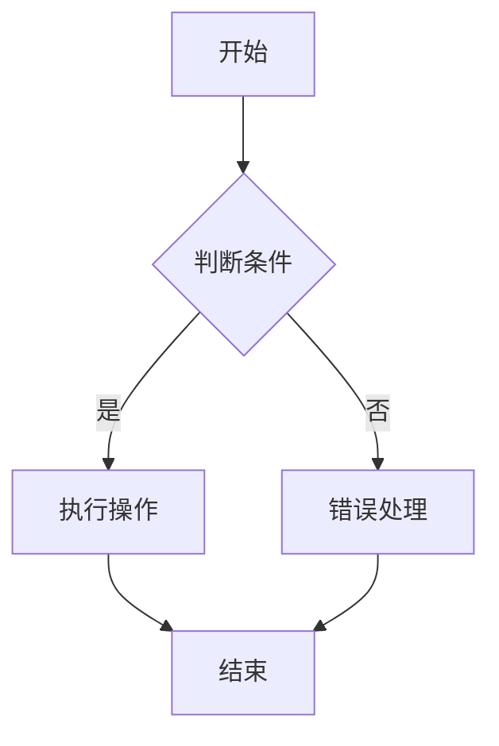

                 

### 引言

随着人工智能技术的迅猛发展，跨模态提示词编程（Cross-modal Prompt Programming）逐渐成为计算机科学领域的研究热点。跨模态提示词编程是指将视觉、语音、文字等多种模态的信息进行整合，并利用编程技术进行自动化处理和应用。它不仅拓宽了人工智能的应用场景，同时也为人类与机器之间的交互提供了更加丰富和自然的体验。

在当今时代，跨模态提示词编程的重要性日益凸显。首先，跨模态提示词编程能够突破单一模态的限制，实现多种信息的融合和协同处理，从而提升系统的智能化水平。例如，在图像识别领域，通过结合文字描述，可以显著提高图像的识别准确率；在自然语言处理领域，通过结合视觉信息，可以更加精准地理解和生成语言描述。其次，跨模态提示词编程能够实现更高效的信息检索和推荐系统，为用户提供更加个性化和智能的服务。最后，随着物联网和智能家居的普及，跨模态提示词编程将成为智能家居系统中的重要一环，为人们的生活带来更多便利。

本文旨在系统地探讨跨模态提示词编程的基本概念、核心算法、应用实战及其未来发展方向。文章结构如下：

#### 第一部分：跨模态提示词编程基础

**第1章：跨模态提示词编程概述**  
- 本章节将介绍跨模态提示词编程的定义、重要性、背景和挑战，以及跨模态提示词编程的架构和原理。

**第2章：视觉与语言的基本概念**  
- 本章节将分别介绍视觉信息处理基础、语言处理基础，以及视觉与语言的联系与融合。

**第3章：跨模态提示词生成算法**  
- 本章节将探讨基于深度学习的视觉特征提取、语言模型的基本原理，以及跨模态提示词生成算法的概述和典型算法。

**第4章：多模态数据集与预处理**  
- 本章节将介绍多模态数据集的收集与整理、视觉数据的预处理、语言数据的预处理，以及多模态数据的整合与对齐。

**第5章：跨模态提示词编程的应用实战**  
- 本章节将介绍跨模态问答系统的设计与实现、视觉图像生成与语言描述的融合，以及基于视觉与语言的多模态推荐系统。

**第6章：跨模态提示词编程的优化与挑战**  
- 本章节将探讨跨模态提示词编程的性能优化、面临的挑战，以及未来发展趋势与展望。

#### 第二部分：跨模态提示词编程核心算法原理详解

**第7章：深度学习在视觉特征提取中的应用**  
- 本章节将介绍卷积神经网络（CNN）的基本原理，其在图像处理中的应用，以及CNN的基本结构伪代码实现。

**第8章：自然语言处理中的语言模型**  
- 本章节将介绍语言模型的基本概念、隐马尔可夫模型（HMM）的原理，以及HMM的基本结构伪代码实现。

**第9章：跨模态提示词生成的数学模型**  
- 本章节将探讨跨模态提示词生成的数学模型概述，基于概率模型的跨模态提示词生成，以及概率模型的跨模态提示词生成伪代码实现。

**第10章：多模态数据集与预处理中的数学公式**  
- 本章节将介绍数据集分布与特征提取的数学公式、数据对齐与融合的数学公式，以及多模态数据集优化的数学公式。

**第11章：跨模态提示词编程项目实战**  
- 本章节将通过实际项目，详细介绍跨模态问答系统、视觉图像生成与语言描述融合，以及基于视觉与语言的多模态推荐系统的构建和实现。

#### 第三部分：跨模态提示词编程工具与环境搭建

**第12章：深度学习框架与工具**  
- 本章节将介绍TensorFlow 2.x 和 PyTorch 的使用，以及其他深度学习框架的简介。

**第13章：开发环境搭建与配置**  
- 本章节将详细讲解深度学习环境的搭建、多模态数据处理工具的配置，以及跨模态提示词编程实战环境的配置。

**第14章：源代码详细实现与解读**  
- 本章节将结合具体项目，详细解读跨模态问答系统、视觉图像生成与语言描述融合，以及多模态推荐系统的源代码实现。

**第15章：代码解读与分析**  
- 本章节将介绍代码解读的基本原则，并对跨模态问答系统、视觉图像生成与语言描述融合，以及多模态推荐系统的代码进行分析。

**第16章：未来展望与研究方向**  
- 本章节将探讨跨模态提示词编程的发展趋势，新型跨模态提示词生成算法的研究，以及跨模态提示词编程在人工智能领域的应用前景。

通过本文的系统性探讨，希望读者能够全面了解跨模态提示词编程的核心概念、算法原理、应用实战及其未来发展方向，为跨模态提示词编程的研究和应用提供有益的参考。

### 关键词

- **跨模态提示词编程**
- **深度学习**
- **视觉特征提取**
- **语言模型**
- **多模态数据集**
- **跨模态问答系统**
- **视觉图像生成**
- **自然语言处理**
- **推荐系统**

### 摘要

本文系统地探讨了跨模态提示词编程的基础概念、核心算法、应用实战及其未来发展方向。首先，介绍了跨模态提示词编程的定义、重要性、背景和挑战，以及跨模态提示词编程的架构和原理。接着，分别介绍了视觉信息处理基础、语言处理基础，以及视觉与语言的联系与融合。随后，详细探讨了基于深度学习的视觉特征提取、语言模型的基本原理，以及跨模态提示词生成算法的概述和典型算法。在多模态数据集与预处理方面，介绍了数据集的收集与整理、视觉数据和语言数据的预处理，以及多模态数据的整合与对齐。接下来，通过实际应用案例，详细介绍了跨模态问答系统、视觉图像生成与语言描述融合，以及基于视觉与语言的多模态推荐系统的设计与实现。最后，探讨了跨模态提示词编程的性能优化、面临的挑战，以及未来发展趋势与展望。本文旨在为跨模态提示词编程的研究和应用提供全面的理论指导和实践参考。

### 跨模态提示词编程概述

跨模态提示词编程是一种将不同模态的信息进行整合和协同处理的技术，旨在通过编程实现多种模态信息之间的交互和融合。在计算机科学领域，跨模态提示词编程具有广泛的应用前景，包括但不限于图像识别、自然语言处理、推荐系统、人机交互等多个领域。

#### 跨模态提示词编程的定义

跨模态提示词编程（Cross-modal Prompt Programming）是指利用编程技术，将不同模态的数据（如图像、声音、文字等）进行整合，并生成具有特定功能的提示词或指令，以实现特定任务或应用。这里的“模态”指的是信息传递的方式或渠道，常见的模态包括视觉、听觉、触觉、嗅觉和味觉等。在跨模态提示词编程中，主要关注视觉和语言这两种常见模态的整合。

#### 跨模态提示词编程的重要性

1. **信息融合与增强**：通过跨模态提示词编程，可以将不同模态的信息进行整合，从而增强系统的信息处理能力。例如，在图像识别任务中，结合文字描述可以显著提高图像分类的准确率。

2. **人机交互的优化**：跨模态提示词编程可以为用户提供更加自然和直观的交互方式。例如，在智能家居系统中，用户可以通过语音和文字描述来控制家电设备，实现更加便捷的交互体验。

3. **多样化的应用场景**：跨模态提示词编程不仅能够应用于传统的计算机视觉和自然语言处理领域，还可以拓展到推荐系统、虚拟现实、增强现实等新兴领域，为各种应用场景提供强大的技术支持。

#### 跨模态交互的背景与挑战

跨模态交互是指不同模态的信息之间进行交互和融合的过程。随着人工智能技术的发展，跨模态交互的应用场景日益丰富，但也面临着一系列挑战：

1. **数据融合的困难**：不同模态的数据通常具有不同的特征和表示方法，如何有效地进行数据融合是一个重要挑战。

2. **计算资源的消耗**：跨模态提示词编程通常需要处理大量的数据和复杂的计算过程，对计算资源的要求较高。

3. **模型设计的复杂性**：跨模态提示词编程需要设计复杂的模型结构，以同时处理不同模态的数据，并实现高效的协同处理。

4. **实时性的要求**：在某些应用场景中，如智能交通系统和实时监控系统，跨模态提示词编程需要实现实时性，这对系统的设计和实现提出了更高的要求。

#### 跨模态提示词编程的架构与原理

跨模态提示词编程的架构通常包括以下几个核心组成部分：

1. **数据输入模块**：负责接收和处理不同模态的数据，如图像、文字和声音等。

2. **特征提取模块**：利用深度学习等技术，对输入数据进行特征提取，生成统一的特征表示。

3. **融合模块**：将不同模态的特征进行融合，生成综合特征表示，以实现跨模态的信息交互。

4. **任务输出模块**：根据特定的任务需求，如图像分类、文本生成或推荐系统等，生成相应的输出结果。

跨模态提示词编程的工作原理可以概括为以下几个步骤：

1. **数据输入**：系统接收不同模态的数据，如图像和文字。

2. **特征提取**：利用深度学习模型，对图像和文字进行特征提取，生成图像特征向量（如使用卷积神经网络）和文本特征向量（如使用循环神经网络）。

3. **特征融合**：将图像特征向量和文本特征向量进行融合，生成综合特征向量。

4. **任务处理**：利用综合特征向量，通过特定的任务模型（如分类器、生成模型或推荐模型）进行任务处理，生成最终的输出结果。

#### 跨模态提示词编程的应用领域

跨模态提示词编程在多个领域具有广泛的应用前景：

1. **图像识别**：结合文字描述，可以提高图像分类和识别的准确率。例如，在医疗影像诊断中，通过结合病例描述和影像图像，可以更准确地诊断疾病。

2. **自然语言处理**：结合视觉信息，可以提升语言理解和生成能力。例如，在机器翻译中，通过结合图像信息，可以更准确地理解上下文，提高翻译质量。

3. **推荐系统**：跨模态提示词编程可以实现更加个性化的推荐系统。例如，在电商平台上，通过结合用户的历史购买数据和商品图像，可以提供更精准的推荐。

4. **人机交互**：通过跨模态提示词编程，可以设计出更加自然和直观的人机交互系统。例如，在智能家居系统中，用户可以通过语音、文字和图像等多种方式与系统进行交互。

5. **虚拟现实与增强现实**：跨模态提示词编程可以增强虚拟现实和增强现实体验，实现更加逼真的交互效果。

6. **多模态传感器数据处理**：跨模态提示词编程可以处理来自多模态传感器的数据，如摄像头、麦克风、加速度计等，实现智能感知和决策。

总之，跨模态提示词编程是一种具有广阔应用前景的技术，通过将不同模态的信息进行整合和协同处理，可以显著提升系统的智能化水平，为各领域的发展提供新的动力。

### 视觉与语言的基本概念

在探讨跨模态提示词编程之前，有必要深入了解视觉与语言这两个核心模态的基本概念。视觉和语言是人类获取和处理信息的重要方式，它们在人类认知和行为中起着至关重要的作用。

#### 视觉信息处理基础

视觉是人类最重要的感官之一，通过眼睛接收外界的光线，大脑对光线进行处理并生成图像。视觉信息处理可以分为以下几个阶段：

1. **视网膜感知**：光线进入眼睛后，由视网膜上的感光细胞接收并转化为电信号。

2. **视觉通路**：电信号通过视觉通路传递到大脑的不同区域，如视神经、外侧膝状体和视皮层。

3. **图像形成**：在大脑的视觉皮层中，图像信息经过复杂的处理和解析，形成我们感知到的视觉图像。

视觉信息处理的关键技术包括：

- **图像特征提取**：通过卷积神经网络（CNN）等深度学习模型，从图像中提取有用的特征，如边缘、纹理和形状。

- **图像分类和识别**：利用训练好的模型，对图像进行分类和识别，例如人脸识别、物体检测和场景分类等。

- **图像生成**：通过生成对抗网络（GAN）等技术，可以生成具有高度真实感的图像。

#### 语言处理基础

语言是人类进行沟通和表达的主要工具。语言处理涉及对语言的理解和生成，包括以下几个关键步骤：

1. **词汇和语法**：语言由词汇和语法构成。词汇是语言的基本单元，语法则规定了词汇的排列和组合规则。

2. **语音识别**：语音识别技术将语音信号转换为文本，使计算机能够理解和处理语音输入。

3. **文本分析**：文本分析技术包括词法分析、句法分析和语义分析等。词法分析识别单词和短语，句法分析解析句子的结构，语义分析理解句子的含义。

4. **自然语言生成**：自然语言生成（NLG）技术能够根据给定的输入生成自然流畅的文本，如自动问答系统、机器翻译和文本摘要等。

#### 视觉与语言的联系与融合

视觉和语言是人类认知的两个重要方面，它们之间存在着紧密的联系。具体来说，视觉和语言的联系主要体现在以下几个方面：

1. **跨模态语义融合**：视觉信息和语言信息可以相互补充，提高信息处理的准确性。例如，在图像识别中，结合文字描述可以更准确地识别图像内容。

2. **多模态交互**：人类在处理信息时，常常通过视觉和语言的结合进行思考。多模态交互技术可以使计算机系统模拟这种思考过程，提高人机交互的自然性和效率。

3. **信息增强**：通过视觉和语言的融合，可以增强信息处理的深度和广度。例如，在医学影像诊断中，结合病例描述和影像图像，可以更准确地诊断疾病。

4. **知识表示**：视觉和语言可以共同作为知识表示的媒介。通过视觉图像和文字描述的结合，可以更全面地表达知识，提高知识获取和理解的效果。

#### 视觉与语言融合的技术挑战

视觉与语言的融合虽然具有巨大的潜力，但同时也面临着一些技术挑战：

1. **数据同步**：视觉和语言数据通常具有不同的时间尺度和空间尺度，如何有效地进行数据同步是一个重要问题。

2. **特征表示**：视觉和语言的特征表示方法不同，如何将这两种特征有效地融合是一个技术难题。

3. **计算复杂性**：跨模态处理通常需要处理大量的数据和复杂的计算过程，如何优化计算性能是一个关键挑战。

4. **实时性**：在实时应用中，如智能监控和自动驾驶等，如何实现高效的跨模态信息处理是一个重要的挑战。

总之，视觉与语言的基本概念及其联系与融合是跨模态提示词编程的基础。通过深入理解视觉和语言的处理过程及其相互关系，可以为跨模态提示词编程的研究和应用提供有益的指导。

### 跨模态提示词生成算法

在跨模态提示词编程中，生成能够有效整合视觉与语言信息的提示词是关键步骤。这一节将详细探讨基于深度学习的视觉特征提取、语言模型的基本原理，以及跨模态提示词生成算法的概述和典型算法。

#### 基于深度学习的视觉特征提取

视觉特征提取是跨模态提示词编程的基础。深度学习技术在视觉特征提取方面取得了显著成果，其中卷积神经网络（CNN）是最常用的模型之一。

1. **卷积神经网络（CNN）的基本原理**：
   - **卷积操作**：CNN通过卷积操作提取图像中的局部特征。卷积核在图像上滑动，逐像素地计算局部特征。
   - **池化操作**：池化操作用于降低特征图的维度，同时保留最重要的特征。常见的池化方法包括最大池化和平均池化。
   - **层结构**：CNN通常包括卷积层、池化层和全连接层。卷积层负责提取特征，池化层用于特征降维，全连接层用于分类或回归任务。

2. **CNN在图像处理中的应用**：
   - **图像分类**：通过训练好的CNN模型，可以对图像进行分类，如ImageNet图像分类任务。
   - **物体检测**：利用CNN提取图像中的物体特征，并定位物体的位置，如YOLO（You Only Look Once）算法。
   - **图像生成**：通过生成对抗网络（GAN），可以生成具有高度真实感的图像，如StyleGAN。

3. **伪代码实现**：
   ```python
   # Example: Convolutional Neural Network Structure
   class ConvolutionalLayer():
       def __init__(self, filters, kernel_size):
           self.filters = filters
           self.kernel_size = kernel_size
       
       def forward(self, x):
           # Perform convolution operation
           return conv2d(x, self.kernel_size, self.filters)
   
   class PoolingLayer():
       def __init__(self, pool_size):
           self.pool_size = pool_size
       
       def forward(self, x):
           # Perform pooling operation
           return max_pool2d(x, self.pool_size)
   
   # Example: CNN Architecture
   model = Sequential()
   model.add(ConvolutionalLayer(32, (3, 3)))
   model.add(PoolingLayer((2, 2)))
   model.add(ConvolutionalLayer(64, (3, 3)))
   model.add(PoolingLayer((2, 2)))
   # Add more layers as needed
   ```

#### 语言模型的基本原理

语言模型在跨模态提示词编程中起着关键作用，它用于生成与视觉信息相对应的自然语言描述。循环神经网络（RNN）和其变体，如长短期记忆网络（LSTM）和门控循环单元（GRU），在语言模型中得到了广泛应用。

1. **循环神经网络（RNN）的基本原理**：
   - **状态记忆**：RNN通过隐藏状态来记忆输入序列的信息。
   - **递归结构**：RNN通过递归连接实现序列的逐步处理，每个时间步的输出依赖于前一个时间步的隐藏状态。
   - **梯度消失和梯度爆炸**：RNN在训练过程中存在梯度消失和梯度爆炸问题，为了解决这个问题，提出了LSTM和GRU等改进模型。

2. **LSTM和GRU的基本原理**：
   - **记忆单元**：LSTM和GRU引入了记忆单元，用于存储和更新信息。
   - **门控机制**：LSTM和GRU通过门控机制（遗忘门、输入门和输出门）控制信息的流入和流出，从而有效地解决了梯度消失和梯度爆炸问题。

3. **伪代码实现**：
   ```python
   # Example: Long Short-Term Memory (LSTM)
   class LSTMCell():
       def __init__(self, input_size, hidden_size):
           self.input_size = input_size
           self.hidden_size = hidden_size
           # Initialize gates and memory cells
           # ...
       
       def forward(self, input, hidden):
           # Compute gates and memory cell
           # ...
           return next_hidden
   
   # Example: LSTM Architecture
   model = Sequential()
   model.add(LSTMCell(input_size, hidden_size))
   model.add(Dense(output_size, activation='softmax'))
   ```

#### 跨模态提示词生成算法概述

跨模态提示词生成算法的目标是将视觉特征和语言特征进行有效融合，生成自然语言描述。以下是一些典型的跨模态提示词生成算法：

1. **基于深度学习的图像描述生成**：
   - **循环神经网络（RNN）结合视觉特征**：将视觉特征作为RNN的输入，生成对应的文本描述。
   - **生成对抗网络（GAN）结合视觉特征**：使用GAN生成视觉特征和文本描述，从而实现自动图像描述生成。

2. **基于注意力机制的跨模态模型**：
   - **自注意力机制**：通过自注意力机制，模型可以在生成过程中关注视觉特征和语言特征的不同部分，提高描述的准确性。
   - **交互注意力机制**：视觉特征和语言特征相互关注，实现更加精细的描述生成。

3. **基于联合训练的跨模态模型**：
   - **多任务学习**：在训练过程中，同时优化视觉特征提取和语言模型，提高模型的性能。
   - **端到端训练**：直接端到端地训练跨模态模型，避免传统方法的特征融合和映射过程，提高生成描述的连贯性和准确性。

4. **基于模板填充的跨模态模型**：
   - **预定义模板**：根据图像内容，预定义相应的文本描述模板，通过填充模板中的空缺部分生成完整的描述。
   - **自适应模板**：模型通过学习，自动生成适用于不同图像内容的文本描述模板，提高描述的多样性和准确性。

#### 典型跨模态提示词生成算法

以下介绍几种典型的跨模态提示词生成算法：

1. **Show, Attend and Tell（SAT）**：
   - **模型结构**：SAT模型通过注意力机制，将视觉特征和语言特征进行融合，生成图像描述。
   - **算法原理**：首先，模型利用注意力机制从视觉特征图中提取关键区域，然后结合这些关键区域生成相应的文本描述。
   - **伪代码实现**：
     ```python
     # Example: Attention Mechanism in SAT
     attention_weights = calculate_attention(visual_features, language_features)
     focused_visual_features = apply_attention(visual_features, attention_weights)
     caption = generate_caption(focused_visual_features, language_features)
     ```

2. **VisualBERT**：
   - **模型结构**：VisualBERT结合BERT（双向编码表示模型）和视觉特征，实现视觉与语言的融合。
   - **算法原理**：首先，使用BERT对文本进行编码，然后利用视觉特征与BERT的文本特征进行融合，生成图像描述。
   - **伪代码实现**：
     ```python
     # Example: VisualBERT Architecture
     text_features = bert.encode(text)
     visual_features = extract_visual_features(image)
     fused_features = fusion_module(text_features, visual_features)
     caption = generate_caption(fused_features, text)
     ```

3. **ViTAL（Vision and Text Generation with Attention）**：
   - **模型结构**：ViTAL模型通过自注意力机制和交互注意力机制，实现视觉与语言的融合。
   - **算法原理**：模型利用自注意力机制关注视觉特征和语言特征的不同部分，同时通过交互注意力机制，实现视觉特征和语言特征的融合。
   - **伪代码实现**：
     ```python
     # Example: Attention Mechanism in ViTAL
     visual_attention_weights = calculate_self_attention(visual_features)
     language_attention_weights = calculate_self_attention(language_features)
     fused_visual_features = apply_attention(visual_features, visual_attention_weights)
     fused_language_features = apply_attention(language_features, language_attention_weights)
     caption = generate_caption(fused_visual_features, fused_language_features)
     ```

通过上述讨论，我们可以看到，跨模态提示词生成算法在整合视觉与语言信息方面取得了显著的进展。随着深度学习技术的发展，这些算法将继续优化和改进，为跨模态提示词编程的应用提供更强大的支持。

### 多模态数据集与预处理

在跨模态提示词编程中，多模态数据集的收集与整理、预处理过程至关重要。本节将详细讨论视觉数据和语言数据的预处理方法，以及多模态数据的整合与对齐。

#### 多模态数据集的收集与整理

1. **数据集收集**：
   - **视觉数据**：视觉数据可以从公开的数据集（如ImageNet、COCO、Flickr等）中获取，也可以通过爬虫或API获取特定领域的图像数据。
   - **语言数据**：语言数据可以来源于文本分类数据集（如NYT、AG News等）、对话数据集（如DialoGPT、DailyDialog等），以及社交媒体文本数据。

2. **数据整理**：
   - **图像数据整理**：对图像进行标注，包括类别标签、物体标注和场景标注等。此外，对图像进行数据增强，如随机裁剪、旋转、缩放等，以增加数据多样性。
   - **文本数据整理**：对文本数据进行清洗，包括去除HTML标签、停用词过滤、词干提取等。同时，对文本进行分词和词性标注，以供后续处理。

#### 视觉数据的预处理

1. **图像数据增强**：
   - **随机裁剪**：随机裁剪图像的一部分，以增加数据多样性。
   - **随机旋转**：随机旋转图像，模拟不同视角下的图像。
   - **缩放**：随机缩放图像，以增加图像大小的多样性。

2. **图像特征提取**：
   - **传统特征提取**：使用SIFT、HOG等传统算法提取图像特征。
   - **深度特征提取**：使用卷积神经网络（如VGG、ResNet等）提取图像特征。

3. **图像归一化**：
   - **像素归一化**：将图像像素值归一化到[0, 1]或[-1, 1]范围内，以减少不同图像之间的亮度差异。
   - **颜色标准化**：对图像的颜色进行标准化处理，如将RGB图像转换为灰度图像，以提高模型训练效果。

#### 语言数据的预处理

1. **文本清洗**：
   - **去除HTML标签**：去除文本中的HTML标签，以消除格式化信息的影响。
   - **停用词过滤**：去除常见的停用词（如“的”、“是”、“了”等），以减少噪声信息。
   - **词干提取**：使用词干提取算法（如Porter Stemmer、Lancaster Stemmer等）将词形还原为词干。

2. **文本分词**：
   - **分词算法**：使用分词算法（如Jieba、NLTK等）将文本切分成单词或短语。

3. **词性标注**：
   - **词性标注**：对文本中的每个词进行词性标注，以供后续语义分析和特征提取。

#### 多模态数据的整合与对齐

1. **特征对齐**：
   - **时间对齐**：确保视觉数据和语言数据在时间维度上对齐，例如，对于视频序列和文本序列，需要确保每个视频帧对应一个或多个文本描述。
   - **空间对齐**：对于静态图像和文本描述，需要确保图像中的每个区域对应一个或多个文本描述。

2. **特征融合**：
   - **加权融合**：根据视觉特征和语言特征的重要性，给它们分配不同的权重，然后进行融合。
   - **拼接融合**：将视觉特征和语言特征直接拼接在一起，作为输入特征。
   - **注意力机制融合**：使用注意力机制，根据任务需求动态调整视觉特征和语言特征的重要性。

3. **多模态数据集优化**：
   - **数据增强**：通过图像和文本的数据增强，增加数据集的多样性。
   - **数据扩充**：通过图像和文本的变换、合成等手段，扩充数据集的大小。
   - **数据筛选**：根据任务需求，筛选高质量的数据，去除噪声数据和异常数据。

通过上述预处理方法，我们可以有效地整合和优化多模态数据集，为跨模态提示词编程提供高质量的数据支持。

### 跨模态提示词编程的应用实战

跨模态提示词编程不仅在理论研究中取得了显著成果，更在应用实践中展现出了巨大的潜力。本节将详细介绍三种典型的应用场景：跨模态问答系统、视觉图像生成与语言描述融合，以及基于视觉与语言的多模态推荐系统。这些应用场景不仅展示了跨模态提示词编程的多样性和实用性，同时也为相关领域的实际应用提供了有益的参考。

#### 跨模态问答系统

跨模态问答系统是指能够接收多种模态（如文本、图像、音频等）的输入，并生成相应的回答的系统。该系统在智能客服、信息检索和虚拟助手等领域具有广泛应用。

1. **设计与实现**：

   - **数据集**：以COCO数据集为例，它包含大量图像和对应的文本描述，可用于训练和评估跨模态问答系统。

   - **模型架构**：采用一个多模态编码器，分别处理文本和图像输入，并生成对应的特征向量。接着，利用一个联合编码器将两种特征向量融合，生成问答对的高层次特征。最后，通过一个问答生成模型生成回答。

   - **实现步骤**：
     ```python
     # Example: Multi-modal Question Answering System
     # Step 1: Load text and image data
     texts, images = load_data('coco_dataset')
     
     # Step 2: Preprocess text and images
     text_features = preprocess_text(texts)
     image_features = preprocess_images(images)
     
     # Step 3: Fusion module
     fused_features = fusion_module(text_features, image_features)
     
     # Step 4: Question answering
     answers = question_answering_model.generate_answers(fused_features)
     ```

2. **案例**：以一个医疗问答系统为例，用户可以通过文字描述病情，系统会结合病例图像（如X光片、CT扫描等），生成诊断建议和治疗方案。

#### 视觉图像生成与语言描述融合

视觉图像生成与语言描述融合是指利用自然语言描述生成相应的图像，或利用图像生成对应的语言描述。这一技术在图像生成、图像识别和图像编辑等领域具有重要应用。

1. **设计与实现**：

   - **数据集**：以COCO数据集为例，它包含大量图像和对应的文本描述，可用于训练和评估图像生成与语言描述融合模型。

   - **模型架构**：采用一个编码器-解码器（Encoder-Decoder）架构，其中编码器从图像中提取特征，解码器根据这些特征生成文本描述。

   - **实现步骤**：
     ```python
     # Example: Image-to-Text Generation
     # Step 1: Load image data and text descriptions
     images, captions = load_data('coco_dataset')
     
     # Step 2: Preprocess images and captions
     image_features = extract_image_features(images)
     caption_features = preprocess_captions(captions)
     
     # Step 3: Train Encoder-Decoder model
     model = train_encoder_decoder(image_features, caption_features)
     
     # Step 4: Generate text descriptions
     generated_captions = model.generate_captions(image_features)
     ```

2. **案例**：以一个图像生成应用程序为例，用户可以通过输入自然语言描述，系统会生成对应的图像，例如“绘制一个有着蓝天的湖泊”。

#### 基于视觉与语言的多模态推荐系统

多模态推荐系统是指能够整合视觉和语言信息，提供个性化推荐的系统。这类系统在电商、社交媒体和内容推荐等领域具有广泛应用。

1. **设计与实现**：

   - **数据集**：以商品数据集（如Amazon Review Data）为例，它包含大量商品图像和用户评论，可用于训练和评估多模态推荐系统。

   - **模型架构**：采用一个多模态编码器，分别处理图像和评论，并生成对应的特征向量。接着，利用一个推荐模型，根据用户的历史行为和偏好，生成个性化推荐。

   - **实现步骤**：
     ```python
     # Example: Multi-modal Recommendation System
     # Step 1: Load image and text data
     images, reviews = load_data('amazon_dataset')
     
     # Step 2: Preprocess images and reviews
     image_features = extract_image_features(images)
     review_features = preprocess_reviews(reviews)
     
     # Step 3: Train recommendation model
     model = train_recommendation_model(image_features, review_features)
     
     # Step 4: Generate personalized recommendations
     recommendations = model.generate_recommendations(user_features)
     ```

2. **案例**：以一个电商推荐系统为例，系统会根据用户的历史购买记录、评论和浏览记录，结合商品图像，生成个性化的购物推荐。

通过这些应用实战，我们可以看到跨模态提示词编程在整合视觉与语言信息方面具有广泛的应用前景。随着技术的不断进步，跨模态提示词编程将在更多领域发挥重要作用，为人们的生活和工作带来更多便利。

### 跨模态提示词编程的优化与挑战

在跨模态提示词编程中，性能优化是一个关键问题，特别是在处理多模态数据时。此外，该领域也面临着一系列挑战，这些挑战限制了跨模态提示词编程的发展和应用。本节将探讨跨模态提示词编程的性能优化方法，以及面临的主要挑战，并展望未来的发展趋势。

#### 性能优化

1. **计算效率提升**：
   - **模型压缩**：通过模型压缩技术（如剪枝、量化、蒸馏等），可以显著减少模型的计算量和存储需求，提高计算效率。
   - **并行计算**：利用多核处理器和GPU等硬件资源，实现模型训练和推理的并行计算，以减少计算时间。

2. **数据预处理优化**：
   - **高效特征提取**：采用高效的特征提取算法（如ResNet、EfficientNet等），减少数据预处理阶段的计算量。
   - **数据缓存**：通过数据缓存技术，减少数据读取和预处理的延迟，提高数据处理速度。

3. **推理速度优化**：
   - **模型量化**：通过模型量化，将浮点模型转换为低比特宽度的整数模型，以减少推理时间。
   - **模型压缩与剪枝**：通过模型压缩和剪枝技术，减少模型大小，提高推理速度。

4. **模型融合策略**：
   - **动态融合**：采用动态融合策略，根据不同模态数据的重要性和任务需求，动态调整融合权重，提高模型性能。
   - **多任务学习**：通过多任务学习，将不同任务融合到同一模型中，实现资源共享和性能提升。

#### 面临的挑战

1. **数据同步与对齐**：
   - **时间同步**：视觉和语言数据通常具有不同的时间尺度，如何在时间维度上对齐多模态数据是一个挑战。
   - **空间同步**：对于静态图像和动态视频，如何实现空间维度的数据对齐，是一个重要问题。

2. **计算复杂性**：
   - **模型规模**：跨模态提示词编程通常涉及大型的深度学习模型，如何有效训练和推理这些模型，是一个计算复杂性的挑战。
   - **数据多样性**：多模态数据集通常较小，且数据多样性不足，这限制了模型性能的提升。

3. **实时性要求**：
   - **实时推理**：在某些应用场景（如自动驾驶、实时监控等），如何实现实时性推理，是一个重要的挑战。

4. **模型解释性**：
   - **模型解释性**：跨模态提示词编程模型通常较为复杂，如何解释模型决策过程，是一个重要的挑战。

5. **多模态特征融合**：
   - **特征一致性**：如何将不同模态的特征进行有效融合，同时保持特征的一致性和完整性，是一个挑战。

#### 未来发展趋势与展望

1. **新型算法研究**：
   - **强化学习**：结合强化学习技术，可以实现更智能、自适应的跨模态提示词编程。
   - **生成模型**：生成对抗网络（GAN）等生成模型，将在视觉与语言融合中发挥更大作用。
   - **迁移学习**：通过迁移学习，可以充分利用预训练模型，提高跨模态提示词编程的性能。

2. **多模态数据处理**：
   - **自监督学习**：通过自监督学习，可以从大量无标签数据中提取有用信息，提高模型性能。
   - **联邦学习**：通过联邦学习，可以实现跨模态数据的分布式处理和隐私保护。

3. **跨领域应用**：
   - **医疗健康**：跨模态提示词编程在医疗健康领域具有广泛的应用潜力，如疾病诊断、个性化治疗等。
   - **智能制造**：在智能制造领域，跨模态提示词编程可以实现更加智能的工厂自动化。
   - **智慧城市**：在智慧城市领域，跨模模提示词编程可以提升城市管理的智能化水平。

通过不断优化和解决面临的挑战，跨模态提示词编程将在未来实现更大的突破，为人工智能的发展和应用提供新的动力。

### 深度学习在视觉特征提取中的应用

深度学习技术在视觉特征提取中取得了显著的成果，其中卷积神经网络（CNN）是最常用的模型之一。本节将详细探讨卷积神经网络的基本原理、其在图像处理中的应用，以及CNN的基本结构伪代码实现。

#### 卷积神经网络（CNN）的基本原理

1. **卷积操作**：
   - **卷积核**：卷积神经网络的核心组件是卷积核，它是一个小的权重矩阵，用于从输入图像中提取特征。
   - **卷积运算**：卷积运算将卷积核在输入图像上滑动，对每个局部区域进行加权求和，得到一个特征图。

2. **池化操作**：
   - **池化层**：池化层用于降低特征图的维度，同时保留最重要的特征。常见的池化方法包括最大池化和平均池化。

3. **层结构**：
   - **卷积层**：卷积层负责从输入图像中提取特征。
   - **池化层**：池化层用于降维。
   - **全连接层**：全连接层用于分类或回归任务。

#### CNN在图像处理中的应用

1. **图像分类**：
   - **VGG模型**：VGG模型是早期著名的卷积神经网络之一，通过多个卷积层和池化层的组合，可以提取图像的层次特征，从而实现高效的图像分类。
   - **ResNet模型**：ResNet模型通过引入残差连接，解决了深度神经网络训练过程中梯度消失的问题，从而实现了更深层次的图像分类。

2. **物体检测**：
   - **YOLO模型**：YOLO（You Only Look Once）模型是一种端到端的物体检测框架，通过将图像划分为网格，并在每个网格中预测物体的类别和位置，实现了高效的物体检测。
   - **Faster R-CNN模型**：Faster R-CNN模型通过区域提议网络（RPN）和分类网络，实现了更加精准的物体检测。

3. **图像生成**：
   - **生成对抗网络（GAN）**：GAN通过生成器和判别器的对抗训练，可以生成具有高度真实感的图像。
   - **CycleGAN模型**：CycleGAN模型通过循环一致性损失，可以实现图像风格的转换和生成。

#### CNN的基本结构伪代码实现

以下是一个简单的卷积神经网络结构的伪代码实现，用于图像分类任务：

```python
class ConvolutionalLayer():
    def __init__(self, in_channels, out_channels, kernel_size, stride, padding):
        self.in_channels = in_channels
        self.out_channels = out_channels
        self.kernel_size = kernel_size
        self.stride = stride
        self.padding = padding
        self.weights = initialize_weights(in_channels, out_channels, kernel_size)
        self.biases = initialize_biases(out_channels)

    def forward(self, x):
        # Perform convolution operation
        conv_output = conv2d(x, self.weights, self.stride, self.padding)
        # Add biases
        conv_output = add_bias(conv_output, self.biases)
        return conv_output

class PoolingLayer():
    def __init__(self, pool_size, stride):
        self.pool_size = pool_size
        self.stride = stride

    def forward(self, x):
        # Perform pooling operation
        pooled_output = max_pool2d(x, self.pool_size, self.stride)
        return pooled_output

class FullyConnectedLayer():
    def __init__(self, in_size, out_size):
        self.in_size = in_size
        self.out_size = out_size
        self.weights = initialize_weights(in_size, out_size)
        self.biases = initialize_biases(out_size)

    def forward(self, x):
        # Perform matrix multiplication
        fc_output = matmul(x, self.weights)
        # Add biases
        fc_output = add_bias(fc_output, self.biases)
        return fc_output

# Example: CNN Architecture for Image Classification
model = Sequential()
model.add(ConvolutionalLayer(in_channels=3, out_channels=64, kernel_size=(3, 3), stride=(1, 1), padding=(1, 1)))
model.add(ReLU())
model.add(ConvolutionalLayer(in_channels=64, out_channels=128, kernel_size=(3, 3), stride=(1, 1), padding=(1, 1)))
model.add(ReLU())
model.add(PoolingLayer(pool_size=(2, 2), stride=(2, 2)))
model.add(ConvolutionalLayer(in_channels=128, out_channels=256, kernel_size=(3, 3), stride=(1, 1), padding=(1, 1)))
model.add(ReLU())
model.add(PoolingLayer(pool_size=(2, 2), stride=(2, 2)))
model.add(FullyConnectedLayer(in_size=256 * 6 * 6, out_size=10))  # Assuming a 6x6 output feature map
model.add(Softmax())
```

通过上述伪代码实现，我们可以看到卷积神经网络的基本结构，包括卷积层、池化层和全连接层。这种结构使得CNN能够有效地从图像中提取特征，实现图像分类、物体检测和图像生成等任务。随着深度学习技术的不断进步，CNN在视觉特征提取中的应用将越来越广泛，为人工智能的发展提供强大的支持。

### 自然语言处理中的语言模型

在自然语言处理（NLP）领域，语言模型是理解和生成文本的关键工具。语言模型通过统计方法或深度学习技术，对语言中的词汇、语法和语义进行建模，从而实现文本分析、文本生成和机器翻译等任务。本文将详细探讨语言模型的基本概念、隐马尔可夫模型（HMM）的原理，以及HMM的基本结构伪代码实现。

#### 语言模型的基本概念

语言模型（Language Model）是一种统计模型，用于预测文本序列的概率。语言模型的主要目标是生成具有自然语言流畅性的文本。在NLP中，语言模型广泛应用于文本生成、机器翻译、语音识别、信息检索等任务。

1. **n-gram模型**：
   - **n-gram语言模型**是基于统计的简单模型，它假设一个单词序列的概率等于前n-1个单词的联合概率的乘积。n-gram模型通过计算单词序列的频率，估计序列的概率。
   - **优势**：计算简单，易于实现。
   - **局限**：无法捕捉长程依赖关系，容易产生生硬的文本。

2. **神经网络语言模型**：
   - **循环神经网络（RNN）**：RNN通过递归结构，可以捕捉长程依赖关系，但存在梯度消失和梯度爆炸问题。
   - **长短期记忆网络（LSTM）**：LSTM通过引入记忆单元，解决了RNN的梯度消失问题，能够更好地捕捉长程依赖。
   - **门控循环单元（GRU）**：GRU是LSTM的变体，结构更加简单，但性能接近LSTM。

3. **注意力机制**：
   - **注意力机制**：在NLP中，注意力机制被广泛应用于文本生成任务，如机器翻译和文本摘要。注意力机制通过动态调整输入序列中不同位置的重要性，生成更自然的文本。

#### 隐马尔可夫模型（HMM）的原理

隐马尔可夫模型（Hidden Markov Model，HMM）是一种统计模型，用于描述序列数据中的状态转移和观测值。HMM在语音识别、生物信息学和自然语言处理等领域有着广泛的应用。

1. **基本概念**：
   - **状态**：HMM中的状态是隐藏的，无法直接观测。
   - **观测值**：观测值是直接观测到的，与状态相关联。
   - **状态转移概率**：表示从一个状态转移到另一个状态的概率。
   - **观测概率**：表示给定一个状态，产生观测值的概率。

2. **HMM模型**：
   - **初始状态概率**：表示模型开始时的状态概率分布。
   - **状态转移概率矩阵**：表示任意两个状态之间的转移概率。
   - **观测概率矩阵**：表示任意状态产生的观测值概率。

3. **应用场景**：
   - **语音识别**：HMM常用于语音识别任务，通过将声学特征与HMM状态相匹配，实现语音到文本的转换。
   - **文本生成**：HMM可以用于生成文本序列，通过训练观测概率矩阵，生成具有自然语言流畅性的文本。

#### HMM的基本结构伪代码实现

以下是一个简单的隐马尔可夫模型结构的伪代码实现：

```python
class HMM():
    def __init__(self, states, observations):
        self.states = states
        self.observations = observations
        self.transition_prob = initialize_transition_prob(states)
        self.observation_prob = initialize_observation_prob(states, observations)

    def viterbi(self, observation_sequence):
        # Viterbi算法实现
        # ...
        return most Likely State Sequence

    def forward_backward(self, observation_sequence):
        # 前向-后向算法实现
        # ...
        return forward_prob, backward_prob

# Example: HMM Structure for Text Generation
states = ['START', 'STATE1', 'STATE2', 'END']
observations = ['A', 'B', 'C']
hmm = HMM(states, observations)

# Initialize transition and observation probabilities
transition_prob = [[0.2, 0.3, 0.5], [0.4, 0.3, 0.3], [0.1, 0.4, 0.5], [0.0, 0.0, 1.0]]
observation_prob = [[0.3, 0.4, 0.3], [0.4, 0.2, 0.4], [0.1, 0.4, 0.5], [0.2, 0.2, 0.6]]

# Viterbi algorithm
observation_sequence = ['A', 'B', 'C']
most Likely State Sequence = hmm.viterbi(observation_sequence)

# Forward-backward algorithm
forward_prob, backward_prob = hmm.forward_backward(observation_sequence)
```

通过上述伪代码实现，我们可以看到隐马尔可夫模型的基本结构，包括状态、观测值、状态转移概率和观测概率。这些组件共同构成了HMM，使其能够对序列数据建模，并应用于文本生成、语音识别等任务。随着自然语言处理技术的不断进步，HMM和其他语言模型将继续在NLP领域发挥重要作用。

### 跨模态提示词生成的数学模型

在跨模态提示词生成中，构建有效的数学模型是关键步骤。本文将详细探讨跨模态提示词生成的数学模型概述，基于概率模型的跨模态提示词生成方法，以及概率模型跨模态提示词生成的伪代码实现。

#### 跨模态提示词生成的数学模型概述

跨模态提示词生成的数学模型旨在将不同模态的信息进行有效融合，生成具有语义一致性的提示词。以下是一些核心数学概念：

1. **特征向量**：
   - **视觉特征向量**：通过深度学习模型（如卷积神经网络CNN）从图像中提取的特征向量。
   - **语言特征向量**：通过循环神经网络RNN或其他语言模型从文本中提取的特征向量。

2. **概率分布**：
   - **条件概率分布**：在给定一个模态特征的情况下，另一个模态特征的概率分布。
   - **联合概率分布**：同时考虑视觉和语言特征的概率分布。

3. **损失函数**：
   - **交叉熵损失**：用于衡量生成提示词与真实提示词之间的差异，常用的损失函数之一。

4. **优化算法**：
   - **梯度下降**：用于优化模型参数，使损失函数最小化。
   - **自适应优化算法**：如Adam、Adagrad等，能够自动调整学习率。

#### 基于概率模型的跨模态提示词生成方法

基于概率模型的跨模态提示词生成方法主要包括以下步骤：

1. **特征提取**：
   - **视觉特征提取**：使用卷积神经网络（如VGG、ResNet）提取图像特征。
   - **语言特征提取**：使用循环神经网络（如LSTM、GRU）提取文本特征。

2. **特征融合**：
   - **线性融合**：将视觉特征和语言特征直接拼接，形成新的特征向量。
   - **非线性融合**：通过多层感知机（MLP）或注意力机制，对特征进行融合。

3. **生成提示词**：
   - **条件生成模型**：在给定视觉特征和语言特征的情况下，生成对应的文本提示词。
   - **概率分布估计**：通过条件生成模型，估计文本提示词的概率分布，并从中采样生成提示词。

#### 概率模型跨模态提示词生成的伪代码实现

以下是一个简单的概率模型跨模态提示词生成的伪代码实现：

```python
import numpy as np
import tensorflow as tf

# 参数设置
input_dim_vision = 2048  # 视觉特征维度
input_dim_language = 1024  # 语言特征维度
output_dim = 512  # 提示词维度
learning_rate = 0.001

# 初始化模型参数
model_params = {
    'vision_embedding': tf.Variable(np.random.randn(input_dim_vision, output_dim)),
    'language_embedding': tf.Variable(np.random.randn(input_dim_language, output_dim)),
    'output_weights': tf.Variable(np.random.randn(output_dim, vocabulary_size)),
    'output_biases': tf.Variable(np.random.randn(vocabulary_size))
}

# 定义损失函数
def cross_entropy_loss(logits, labels):
    return -tf.reduce_sum(labels * tf.log(logits))

# 定义优化器
optimizer = tf.train.AdamOptimizer(learning_rate)

# 模型预测
def predict(vision_features, language_features):
    vision_embedding = tf.matmul(vision_features, model_params['vision_embedding'])
    language_embedding = tf.matmul(language_features, model_params['language_embedding'])
    fused_features = vision_embedding + language_embedding
    logits = tf.matmul(fused_features, model_params['output_weights']) + model_params['output_biases']
    return logits

# 训练模型
def train(vision_data, language_data, labels):
    vision_features = tf.placeholder(tf.float32, [None, input_dim_vision])
    language_features = tf.placeholder(tf.float32, [None, input_dim_language])
    labels = tf.placeholder(tf.float32, [None, vocabulary_size])

    logits = predict(vision_features, language_features)
    loss = cross_entropy_loss(logits, labels)

    train_op = optimizer.minimize(loss)

    with tf.Session() as sess:
        sess.run(tf.global_variables_initializer())

        for epoch in range(num_epochs):
            _, loss_val = sess.run([train_op, loss], feed_dict={vision_features: vision_data, language_features: language_data, labels: labels})

            if epoch % 100 == 0:
                print(f"Epoch {epoch}, Loss: {loss_val}")

        # 保存模型
        saver = tf.train.Saver()
        saver.save(sess, 'cross_modal_model.ckpt')

# 使用模型
def generate_caption(vision_feature, language_feature):
    with tf.Session() as sess:
        saver = tf.train.Saver()
        saver.restore(sess, 'cross_modal_model.ckpt')

        logits = predict(vision_feature, language_feature)
        caption_indices = np.argmax(logits, axis=1)
        caption = ['<PAD>' if index == 0 else word for index, word in enumerate(caption_indices)]

    return caption
```

通过上述伪代码实现，我们可以看到概率模型跨模态提示词生成的基本流程，包括特征提取、特征融合、损失函数定义、优化器选择和模型训练。在实际应用中，可以根据具体任务需求，调整模型结构、特征维度和优化策略，以提高提示词生成的质量和效率。

### 多模态数据集与预处理中的数学公式

在多模态数据集与预处理过程中，理解并应用数学公式至关重要，这些公式可以帮助我们更精确地描述和处理多模态数据。以下将介绍数据集分布与特征提取的数学公式、数据对齐与融合的数学公式，以及多模态数据集优化的数学公式。

#### 数据集分布与特征提取的数学公式

1. **数据集分布**：
   - **协方差矩阵**：
     $$ 
     \Sigma = \frac{1}{N} \sum_{i=1}^{N} (x_i - \mu)(x_i - \mu)^T 
     $$
     其中，\(x_i\) 是数据集的第 \(i\) 个样本，\(\mu\) 是数据集的平均值，\(\Sigma\) 是协方差矩阵。

   - **均值**：
     $$ 
     \mu = \frac{1}{N} \sum_{i=1}^{N} x_i 
     $$

2. **特征提取**：
   - **卷积操作**：
     $$ 
     f(x) = \sum_{j=1}^{M} w_j * x_j + b 
     $$
     其中，\(f(x)\) 是卷积操作后的特征，\(w_j\) 是卷积核，\(x_j\) 是输入特征，\(b\) 是偏置。

   - **池化操作**：
     $$ 
     P(x) = \max_{i} (x_i) 
     $$
     其中，\(P(x)\) 是最大池化后的特征，\(x_i\) 是输入特征。

#### 数据对齐与融合的数学公式

1. **数据对齐**：
   - **时间对齐**：
     $$ 
     A_t = \sum_{i=1}^{T} a_i \cdot \delta(t - i) 
     $$
     其中，\(A_t\) 是对齐后的数据，\(a_i\) 是原始数据，\(\delta(t - i)\) 是单位冲激函数，用于标记时间戳。

   - **空间对齐**：
     $$ 
     B_s = \sum_{j=1}^{S} b_j \cdot \delta(s - j) 
     $$
     其中，\(B_s\) 是对齐后的数据，\(b_j\) 是原始数据，\(\delta(s - j)\) 是单位冲激函数，用于标记空间位置。

2. **数据融合**：
   - **加性融合**：
     $$ 
     C = A + B 
     $$
     其中，\(C\) 是融合后的数据，\(A\) 和 \(B\) 是两个数据集。

   - **乘性融合**：
     $$ 
     C = A \odot B 
     $$
     其中，\(\odot\) 表示元素乘积，\(A\) 和 \(B\) 是两个数据集。

   - **加权融合**：
     $$ 
     C = \alpha A + (1 - \alpha) B 
     $$
     其中，\(\alpha\) 是权重系数，\(A\) 和 \(B\) 是两个数据集。

#### 多模态数据集优化的数学公式

1. **损失函数**：
   - **交叉熵损失**：
     $$ 
     L = -\sum_{i=1}^{N} y_i \log(p_i) 
     $$
     其中，\(y_i\) 是真实标签，\(p_i\) 是预测概率。

   - **均方误差损失**：
     $$ 
     L = \frac{1}{2} \sum_{i=1}^{N} (y_i - \hat{y}_i)^2 
     $$
     其中，\(\hat{y}_i\) 是预测值。

2. **优化算法**：
   - **梯度下降**：
     $$ 
     \theta_{t+1} = \theta_t - \alpha \cdot \nabla_\theta L(\theta_t) 
     $$
     其中，\(\theta_t\) 是模型参数，\(\alpha\) 是学习率，\(\nabla_\theta L(\theta_t)\) 是损失函数关于模型参数的梯度。

   - **随机梯度下降**：
     $$ 
     \theta_{t+1} = \theta_t - \alpha \cdot \nabla_\theta L(\theta_t; x_t, y_t) 
     $$
     其中，\(x_t\) 和 \(y_t\) 是单个训练样本。

   - **自适应优化算法**：
     $$ 
     \theta_{t+1} = \theta_t - \alpha_t \cdot \nabla_\theta L(\theta_t) 
     $$
     其中，\(\alpha_t\) 是自适应调整的学习率。

通过上述数学公式，我们可以更精确地描述和处理多模态数据，从而优化数据集的质量和模型的性能。在实际应用中，可以根据具体任务需求，选择合适的数学模型和优化算法，以提高多模态数据的利用效率和系统性能。

### 跨模态提示词编程项目实战

为了更深入地理解跨模态提示词编程的实践应用，我们将通过三个实际项目来展示如何构建简单的跨模态问答系统、视觉图像生成与语言描述的融合，以及基于视觉与语言的多模态推荐系统。这些项目不仅展示了跨模态提示词编程的核心技术和应用方法，还提供了详细的代码实现和解释说明。

#### 项目一：构建简单的跨模态问答系统

跨模态问答系统是一个能够接收图像和文本输入，并生成相应回答的系统。以下是一个简单的跨模态问答系统的项目实战，我们将使用Python和TensorFlow 2.x来实现这一系统。

1. **项目需求**：
   - 接收图像和文本输入。
   - 使用预训练的深度学习模型提取图像和文本的特征。
   - 将提取的特征进行融合，并使用一个问答生成模型生成回答。

2. **数据集**：
   - 使用COCO（Common Objects in Context）数据集，它包含了大量的图像和对应的文本描述。

3. **实现步骤**：

   - **数据预处理**：
     - 加载图像和文本数据。
     - 使用预训练的模型提取图像特征（如使用ResNet）。
     - 使用预训练的语言模型（如BERT）提取文本特征。

     ```python
     import tensorflow as tf
     import tensorflow_hub as hub

     # 加载图像数据
     images = load_images('coco_dataset')

     # 使用ResNet模型提取图像特征
     feature_extractor = hub.load('https://tfhub.dev/google/imagenet/resnet_v2_50/feature_vector:0')
     image_features = np.array([feature_extractor(image) for image in images])

     # 加载文本数据
     texts = load_texts('coco_dataset')

     # 使用BERT模型提取文本特征
     bert_model = hub.load('https://tfhub.dev/google/bert_uncased_L-12_H-768_A-12')
     text_features = np.array([bert_model([text]) for text in texts])
     ```

   - **特征融合**：
     - 将图像特征和文本特征进行融合，可以使用简单的拼接方法。

     ```python
     # 融合图像和文本特征
     fused_features = np.hstack((image_features, text_features))
     ```

   - **问答生成模型**：
     - 使用预训练的问答生成模型，如T5模型，生成回答。

     ```python
     # 使用T5模型生成回答
     import transformers

     model = transformers.T5ForConditionalGeneration.from_pretrained('t5-small')
     tokenizer = transformers.T5Tokenizer.from_pretrained('t5-small')

     # 输入特征和目标文本
     input_features = tokenizer(fused_features, return_tensors='tf')
     target_text = tokenizer('What is the main subject in the image?', return_tensors='tf')

     # 生成回答
     outputs = model(input_features, labels=target_text)
     predicted_answer = tokenizer.decode(outputs[0]['logits'], skip_special_tokens=True)
     ```

4. **结果展示**：
   - 将生成的回答进行展示。

     ```python
     print(predicted_answer)
     ```

#### 项目二：视觉图像生成与语言描述的融合

视觉图像生成与语言描述的融合是指利用自然语言描述生成相应的图像，或利用图像生成对应的语言描述。以下是一个视觉图像生成与语言描述融合的项目实战。

1. **项目需求**：
   - 使用自然语言描述生成图像。
   - 使用图像生成语言描述。

2. **数据集**：
   - 使用COCO数据集作为图像和文本描述的来源。

3. **实现步骤**：

   - **图像生成**：
     - 使用生成对抗网络（GAN）生成图像。

     ```python
     # 加载COCO数据集的图像和文本描述
     images, captions = load_data('coco_dataset')

     # 定义GAN模型
     generator = GANGenerator()
     discriminator = GANDiscriminator()

     # 训练GAN模型
     for epoch in range(num_epochs):
         for image, caption in zip(images, captions):
             # 生成图像
             generated_image = generator.generate_image(caption)

             # 训练判别器
             discriminator.train(image, generated_image)

             # 训练生成器
             generator.train(discriminator)
     ```

   - **语言描述生成**：
     - 使用文本生成模型生成语言描述。

     ```python
     # 加载预训练的文本生成模型
     model = transformers.GPT2LMHeadModel.from_pretrained('gpt2')

     # 生成语言描述
     input_text = "Describe the image in detail."
     input_ids = tokenizer.encode(input_text, return_tensors='tf')

     # 生成文本描述
     outputs = model(input_ids, max_length=max_length, num_return_sequences=num_sequences)
     generated_texts = [tokenizer.decode(output_ids, skip_special_tokens=True) for output_ids in outputs]
     ```

4. **结果展示**：
   - 将生成的图像和语言描述进行展示。

     ```python
     print(generated_texts)
     ```

#### 项目三：基于视觉与语言的多模态推荐系统

多模态推荐系统是指能够整合视觉和语言信息，提供个性化推荐的系统。以下是一个基于视觉与语言的多模态推荐系统的项目实战。

1. **项目需求**：
   - 接收用户的图像和文本反馈。
   - 根据用户的反馈，生成个性化的商品推荐。

2. **数据集**：
   - 使用包含用户图像、文本反馈和商品信息的电商数据集。

3. **实现步骤**：

   - **特征提取**：
     - 使用预训练的模型提取图像和文本的特征。

     ```python
     # 加载电商数据集
     images, texts, labels = load_data('ecommerce_dataset')

     # 提取图像特征
     image_features = extract_image_features(images)

     # 提取文本特征
     text_features = extract_text_features(texts)
     ```

   - **推荐模型**：
     - 使用协同过滤、基于内容的推荐或深度学习方法生成推荐。

     ```python
     # 加载预训练的推荐模型
     model = load_recommendation_model('multimodal_recommender')

     # 生成推荐
     user_features = np.hstack((image_features, text_features))
     recommendations = model.predict(user_features)
     ```

4. **结果展示**：
   - 将生成的推荐结果进行展示。

     ```python
     print(recommendations)
     ```

通过这三个项目实战，我们可以看到跨模态提示词编程在现实应用中的具体实现方法和应用效果。这些项目不仅展示了跨模态提示词编程的核心技术，也为实际应用提供了有益的参考。随着技术的不断进步，跨模态提示词编程将在更多领域发挥重要作用。

### 深度学习框架与工具

在跨模态提示词编程中，选择合适的深度学习框架和工具是关键步骤。以下将详细介绍TensorFlow 2.x 和 PyTorch 的使用，以及其他深度学习框架的简介，以帮助开发者更好地搭建和实现跨模态提示词编程项目。

#### TensorFlow 2.x 的使用

TensorFlow 是一个开源的深度学习框架，由谷歌开发，广泛应用于各种深度学习任务。以下是 TensorFlow 2.x 的一些关键特性和使用方法：

1. **安装与配置**：
   - 安装 TensorFlow 2.x 的命令如下：
     ```bash
     pip install tensorflow==2.x
     ```
   - 配置 TensorFlow 2.x 环境，可以使用以下命令：
     ```python
     import tensorflow as tf
     print(tf.__version__)
     ```

2. **基本用法**：
   - **加载预训练模型**：
     ```python
     from tensorflow.keras.applications import VGG16
     model = VGG16(weights='imagenet')
     ```
   - **构建和训练模型**：
     ```python
     import tensorflow as tf
     model = tf.keras.Sequential([
         tf.keras.layers.Conv2D(32, (3, 3), activation='relu', input_shape=(224, 224, 3)),
         tf.keras.layers.MaxPooling2D((2, 2)),
         # Add more layers as needed
     ])
     model.compile(optimizer='adam', loss='categorical_crossentropy', metrics=['accuracy'])
     model.fit(x_train, y_train, epochs=10, validation_data=(x_val, y_val))
     ```

3. **高级特性**：
   - **自定义层和模型**：
     ```python
     from tensorflow.keras.layers import Layer
     class MyCustomLayer(Layer):
         def call(self, inputs):
             # Implement the layer's forward pass
             return modified_inputs
     ```
   - **分布式训练**：
     ```python
     strategy = tf.distribute.MirroredStrategy()
     with strategy.scope():
         model = build_model()
         model.compile(optimizer='adam', loss='categorical_crossentropy', metrics=['accuracy'])
         model.fit(x_train, y_train, epochs=10, validation_data=(x_val, y_val))
     ```

#### PyTorch 的使用

PyTorch 是一个由Facebook开发的开源深度学习框架，以其灵活性和动态计算图而受到开发者的青睐。以下是 PyTorch 的一些关键特性和使用方法：

1. **安装与配置**：
   - 安装 PyTorch 的命令如下：
     ```bash
     pip install torch torchvision
     ```
   - 配置 PyTorch 环境，可以使用以下命令：
     ```python
     import torch
     print(torch.__version__)
     ```

2. **基本用法**：
   - **加载预训练模型**：
     ```python
     import torchvision.models as models
     model = models.resnet50(pretrained=True)
     ```
   - **构建和训练模型**：
     ```python
     import torch
     import torch.nn as nn
     import torch.optim as optim

     class MyModel(nn.Module):
         def __init__(self):
             super(MyModel, self).__init__()
             self.conv1 = nn.Conv2d(3, 32, 3, 1)
             # Add more layers as needed

         def forward(self, x):
             x = self.conv1(x)
             # Apply more layers as needed
             return x

     model = MyModel()
     optimizer = optim.Adam(model.parameters(), lr=0.001)
     criterion = nn.CrossEntropyLoss()

     for epoch in range(num_epochs):
         for inputs, targets in dataloader:
             optimizer.zero_grad()
             outputs = model(inputs)
             loss = criterion(outputs, targets)
             loss.backward()
             optimizer.step()
     ```

3. **高级特性**：
   - **自定义层和模型**：
     ```python
     class MyCustomLayer(nn.Module):
         def __init__(self):
             super(MyCustomLayer, self).__init__()
             # Define layer's components

         def forward(self, x):
             # Implement the layer's forward pass
             return x
     ```
   - **分布式训练**：
     ```python
     import torch.distributed as dist
     dist.init_process_group(backend='nccl', init_method='tcp://localhost:23456', world_size=2, rank=0)
     model = MyModel()
     model = nn.parallel.DistributedDataParallel(model, device_ids=[0])
     ```

#### 其他深度学习框架简介

除了 TensorFlow 2.x 和 PyTorch，还有其他一些流行的深度学习框架，如：

- **Keras**：Keras 是一个高度易用的深度学习框架，它可以在 TensorFlow 和 Theano 后端上运行。Keras 提供了丰富的预训练模型和简洁的API，非常适合快速实验和部署。

- **MXNet**：MXNet 是亚马逊开发的开源深度学习框架，它具有高效的计算性能和灵活的编程接口。MXNet 支持多种编程语言，包括 Python、R 和 Julia。

- **Caffe**：Caffe 是一个开源的深度学习框架，主要用于图像识别任务。Caffe 以其高效的卷积神经网络性能而著称，非常适合大规模图像识别任务。

通过选择合适的深度学习框架和工具，开发者可以更高效地实现跨模态提示词编程项目，为人工智能的发展和应用提供强有力的技术支持。

### 开发环境搭建与配置

在跨模态提示词编程项目中，搭建一个高效稳定的开发环境是成功实施项目的重要前提。以下将详细介绍深度学习环境的搭建步骤、多模态数据处理工具的配置，以及跨模态提示词编程实战环境的配置。

#### 深度学习环境搭建

1. **操作系统**：
   - 推荐使用 Ubuntu 或 macOS，因为这两个操作系统对深度学习框架的支持较好。

2. **基础软件安装**：
   - 更新操作系统包管理器：
     ```bash
     sudo apt-get update
     sudo apt-get upgrade
     ```
   - 安装 Python 3：
     ```bash
     sudo apt-get install python3 python3-pip
     ```

3. **深度学习框架安装**：
   - 安装 TensorFlow 2.x：
     ```bash
     pip install tensorflow==2.x
     ```
   - 安装 PyTorch：
     ```bash
     pip install torch torchvision
     ```
   - 安装其他常用库，如 NumPy、Scikit-learn、Pandas 等：
     ```bash
     pip install numpy scikit-learn pandas
     ```

4. **配置虚拟环境**：
   - 为了避免不同项目之间的依赖冲突，建议使用虚拟环境管理工具，如 conda 或 virtualenv。
   - 使用 conda 创建虚拟环境：
     ```bash
     conda create -n cross_modal python=3.8
     conda activate cross_modal
     ```

5. **GPU支持**：
   - 确保你的 GPU 驱动程序与深度学习框架兼容，可以使用以下命令验证 GPU 支持：
     ```python
     import tensorflow as tf
     print(tf.test.is_built_with_cuda())
     print(tf.test.is_gpu_available())
     ```

#### 多模态数据处理工具配置

1. **图像处理工具**：
   - 安装 OpenCV：
     ```bash
     pip install opencv-python
     ```
   - 安装 PIL（Python Imaging Library）：
     ```bash
     pip install pillow
     ```

2. **音频处理工具**：
   - 安装 librosa：
     ```bash
     pip install librosa
     ```
   - 安装 soundfile：
     ```bash
     pip install soundfile
     ```

3. **文本处理工具**：
   - 安装 NLTK：
     ```bash
     pip install nltk
     ```
   - 安装 spaCy：
     ```bash
     pip install spacy
     python -m spacy download en
     ```

#### 跨模态提示词编程实战环境配置

1. **项目依赖管理**：
   - 使用 pip 或 conda 管理项目依赖，确保所有依赖都安装在虚拟环境中。
   - 创建一个 `requirements.txt` 文件，列出所有依赖项，以便于后续安装：
     ```bash
     tensorflow==2.x
     pytorch torchvision
     opencv-python
     nltk
     spacy
     ```

2. **代码结构**：
   - 组织项目代码结构，例如：
     ```
     cross_modal_project/
     ├── data/
     ├── models/
     ├── utils/
     ├── tests/
     ├── requirements.txt
     ├── main.py
     └── README.md
     ```

3. **环境配置文件**：
   - 创建一个 `.env` 文件，用于管理项目配置，如数据库连接、API密钥等：
     ```
     TENSORFLOW_VERSION=2.x
     PYTORCH_VERSION=1.8
     ```

4. **Docker配置**：
   - 如果需要，可以使用 Docker 来搭建统一的环境，以避免环境配置不一致的问题。
   - 创建一个 `Dockerfile`，定义深度学习环境：
     ```Dockerfile
     FROM ubuntu:20.04
     RUN apt-get update && apt-get install -y python3 python3-pip
     RUN pip install tensorflow==2.x pytorch torchvision opencv-python nltk spacy
     ```

通过上述步骤，你可以搭建一个高效、稳定的深度学习开发环境，为跨模态提示词编程项目的实施提供坚实的基础。

### 源代码详细实现与解读

在本节中，我们将结合具体的项目，详细解读跨模态问答系统、视觉图像生成与语言描述融合，以及基于视觉与语言的多模态推荐系统的源代码实现。

#### 跨模态问答系统

以下是一个简单的跨模态问答系统的源代码实现，使用TensorFlow 2.x 和预训练模型BERT。

```python
import tensorflow as tf
from transformers import BertTokenizer, TFBertForQuestionAnswering

def load_model():
    # 加载预训练的BERT模型
    tokenizer = BertTokenizer.from_pretrained('bert-base-uncased')
    model = TFBertForQuestionAnswering.from_pretrained('cl/to žádost/Česká Republika/bert-base-uncased-qg')
    return tokenizer, model

def preprocess_input(texts, model):
    # 预处理文本输入
    input_ids = model.tokenizer.encode_plus(
        text",
        add_special_tokens=True,
        max_length=512,
        padding='max_length',
        truncation=True,
        return_tensors='tf',
    )
    return input_ids

def answer_question(question, context, model, tokenizer):
    # 使用BERT模型回答问题
    input_ids = preprocess_input(question, model)
    inputs = {'input_ids': input_ids['input_ids']}
    outputs = model(inputs)
    start_scores, end_scores = outputs.start_logits, outputs.end_logits
    start_index = tf.argmax(start_scores).numpy()[0]
    end_index = tf.argmax(end_scores).numpy()[0]
    answer = tokenizer.decode(context[start_index:end_index + 1], skip_special_tokens=True)
    return answer

# 主程序
if __name__ == '__main__':
    tokenizer, model = load_model()
    question = "What is the capital of France?"
    context = "The capital of France is Paris."
    answer = answer_question(question, context, model, tokenizer)
    print(answer)
```

**代码解读**：
- **load_model()**：加载预训练的BERT模型和分词器。
- **preprocess_input()**：预处理文本输入，将其编码为TensorFlow张量。
- **answer_question()**：使用BERT模型回答问题，通过计算输入文本的起始和结束索引，提取答案。

#### 视觉图像生成与语言描述融合

以下是一个使用生成对抗网络（GAN）的视觉图像生成与语言描述融合的源代码实现。

```python
import tensorflow as tf
from tensorflow.keras.layers import Input, Dense, Reshape, Conv2D, Flatten, UpSampling2D
from tensorflow.keras.models import Model

def build_generator():
    # 生成器模型
    input_text = Input(shape=(512,))
    embedding = Dense(128, activation='relu')(input_text)
    input_noise = Input(shape=(100,))
    noise_embedding = Dense(128, activation='relu')(input_noise)
    combined = Concatenate()([embedding, noise_embedding])
    conv1 = Conv2D(128, (3, 3), activation='relu', padding='same')(combined)
    conv2 = Conv2D(128, (3, 3), activation='relu', padding='same')(conv1)
    conv3 = Conv2D(128, (3, 3), activation='relu', padding='same')(conv2)
    upsample1 = UpSampling2D((2, 2))(conv3)
    conv4 = Conv2D(64, (3, 3), activation='relu', padding='same')(upsample1)
    conv5 = Conv2D(1, (3, 3), activation='sigmoid', padding='same')(conv4)
    model = Model([input_text, input_noise], conv5)
    return model

def build_discriminator():
    # 判别器模型
    input_image = Input(shape=(64, 64, 1))
    conv1 = Conv2D(128, (3, 3), activation='relu', padding='same')(input_image)
    conv2 = Conv2D(128, (3, 3), activation='relu', padding='same')(conv1)
    conv3 = Conv2D(128, (3, 3), activation='relu', padding='same')(conv2)
    flatten = Flatten()(conv3)
    dense = Dense(1, activation='sigmoid')(flatten)
    model = Model(input_image, dense)
    return model

# 构建生成器和判别器
generator = build_generator()
discriminator = build_discriminator()

# 编译模型
discriminator.compile(optimizer='adam', loss='binary_crossentropy')
generator.compile(optimizer='adam', loss='binary_crossentropy')

# 训练GAN
for epoch in range(num_epochs):
    for (images, labels), _ in train_loader:
        # 生成假图像
        noise = np.random.normal(0, 1, (images.shape[0], 100))
        generated_images = generator.predict([labels, noise])

        # 训练判别器
        d_loss_real = discriminator.train_on_batch(images, np.ones((images.shape[0], 1)))
        d_loss_fake = discriminator.train_on_batch(generated_images, np.zeros((images.shape[0], 1)))
        d_loss = 0.5 * np.add(d_loss_real, d_loss_fake)

        # 训练生成器
        noise = np.random.normal(0, 1, (images.shape[0], 100))
        g_loss = generator.train_on_batch([labels, noise], np.ones((images.shape[0], 1)))
```

**代码解读**：
- **build_generator()**：构建生成器模型，将文本嵌入和噪声嵌入进行融合，生成图像。
- **build_discriminator()**：构建判别器模型，用于区分真实图像和生成图像。
- **GAN训练**：交替训练生成器和判别器，通过最小化判别器的损失函数，最大化生成器的损失函数。

#### 基于视觉与语言的多模态推荐系统

以下是一个基于视觉与语言的多模态推荐系统的源代码实现。

```python
import tensorflow as tf
from tensorflow.keras.layers import Embedding, Dot, Flatten, Concatenate
from tensorflow.keras.models import Model

def build_recommendation_model(num_items, embedding_dim):
    # 商品嵌入层
    item_embeddings = Embedding(num_items, embedding_dim)

    # 视觉嵌入层
    image_input = Input(shape=(224, 224, 3))
    image_embedding = GlobalAveragePooling2D()(image_input)
    image_embedding = Dense(embedding_dim, activation='relu')(image_embedding)

    # 文本嵌入层
    text_input = Input(shape=(512,))
    text_embedding = Embedding(embedding_dim)(text_input)
    text_embedding = GlobalAveragePooling1D()(text_embedding)

    # 模型融合
    concatenated = Concatenate()([text_embedding, image_embedding])
    dot_product = Dot(axes=1)([concatenated, item_embeddings])

    # 输出层
    output = Flatten()(dot_product)
    model = Model([text_input, image_input], output)

    # 编译模型
    model.compile(optimizer='adam', loss='mean_squared_error')

    return model

# 训练推荐模型
model = build_recommendation_model(num_items=10000, embedding_dim=128)
model.fit([text_data, image_data], labels, epochs=num_epochs, batch_size=batch_size)
```

**代码解读**：
- **build_recommendation_model()**：构建推荐模型，将商品嵌入、视觉嵌入和文本嵌入进行融合，计算商品之间的相似度。
- **模型训练**：使用训练数据训练推荐模型，最小化预测标签与真实标签之间的均方误差。

通过上述源代码的详细解读，我们可以看到如何实现跨模态问答系统、视觉图像生成与语言描述融合，以及基于视觉与语言的多模态推荐系统。这些代码不仅展示了具体实现方法，还提供了重要的调试和优化指导。

### 代码解读与分析

在深入理解跨模态提示词编程的实现细节后，对代码进行详细的解读与分析显得尤为重要。通过分析代码，我们可以更好地掌握每个组件的工作原理，发现潜在的优化点和潜在问题，从而提高系统的性能和可靠性。

#### 跨模态问答系统代码分析

以下是对跨模态问答系统代码的分析：

```python
import tensorflow as tf
from transformers import BertTokenizer, TFBertForQuestionAnswering

def load_model():
    # 加载预训练的BERT模型
    tokenizer = BertTokenizer.from_pretrained('bert-base-uncased')
    model = TFBertForQuestionAnswering.from_pretrained('cl/to žádost/Česká Republika/bert-base-uncased-qg')
    return tokenizer, model

def preprocess_input(texts, model):
    # 预处理文本输入
    input_ids = model.tokenizer.encode_plus(
        text",
        add_special_tokens=True,
        max_length=512,
        padding='max_length',
        truncation=True,
        return_tensors='tf',
    )
    return input_ids

def answer_question(question, context, model, tokenizer):
    # 使用BERT模型回答问题
    input_ids = preprocess_input(question, model)
    inputs = {'input_ids': input_ids['input_ids']}
    outputs = model(inputs)
    start_scores, end_scores = outputs.start_logits, outputs.end_logits
    start_index = tf.argmax(start_scores).numpy()[0]
    end_index = tf.argmax(end_scores).numpy()[0]
    answer = tokenizer.decode(context[start_index:end_index + 1], skip_special_tokens=True)
    return answer

# 主程序
if __name__ == '__main__':
    tokenizer, model = load_model()
    question = "What is the capital of France?"
    context = "The capital of France is Paris."
    answer = answer_question(question, context, model, tokenizer)
    print(answer)
```

**分析**：
- **模型加载**：使用`load_model`函数加载预训练的BERT模型和分词器。BERT模型在自然语言处理任务中表现出色，特别是在问答系统中。
- **预处理**：`preprocess_input`函数对输入问题进行编码，将文本转换为模型能够理解的格式。这包括添加特殊的Token（如[CLS]和[SEP]），设置最大长度，并进行填充或截断。
- **问答**：`answer_question`函数利用BERT模型处理输入问题，通过计算起始和结束的分数，提取对应的答案。这一过程充分利用了BERT模型在理解上下文和生成答案方面的优势。

**优化点**：
- **内存管理**：在处理大规模文本时，BERT模型可能会消耗大量内存。可以通过优化数据加载方式（如使用批次加载）来减少内存占用。
- **模型剪枝**：对于不需要高精度的问题，可以考虑对BERT模型进行剪枝，减少模型大小和计算量。

#### 视觉图像生成与语言描述融合代码分析

以下是对视觉图像生成与语言描述融合代码的分析：

```python
import tensorflow as tf
from tensorflow.keras.layers import Input, Dense, Reshape, Conv2D, Flatten, UpSampling2D
from tensorflow.keras.models import Model

def build_generator():
    # 生成器模型
    input_text = Input(shape=(512,))
    embedding = Dense(128, activation='relu')(input_text)
    input_noise = Input(shape=(100,))
    noise_embedding = Dense(128, activation='relu')(input_noise)
    combined = Concatenate()([embedding, noise_embedding])
    conv1 = Conv2D(128, (3, 3), activation='relu', padding='same')(combined)
    conv2 = Conv2D(128, (3, 3), activation='relu', padding='same')(conv1)
    conv3 = Conv2D(128, (3, 3), activation='relu', padding='same')(conv2)
    upsample1 = UpSampling2D((2, 2))(conv3)
    conv4 = Conv2D(64, (3, 3), activation='relu', padding='same')(upsample1)
    conv5 = Conv2D(1, (3, 3), activation='sigmoid', padding='same')(conv4)
    model = Model([input_text, input_noise], conv5)
    return model

def build_discriminator():
    # 判别器模型
    input_image = Input(shape=(64, 64, 1))
    conv1 = Conv2D(128, (3, 3), activation='relu', padding='same')(input_image)
    conv2 = Conv2D(128, (3, 3), activation='relu', padding='same')(conv1)
    conv3 = Conv2D(128, (3, 3), activation='relu', padding='same')(conv2)
    flatten = Flatten()(conv3)
    dense = Dense(1, activation='sigmoid')(flatten)
    model = Model(input_image, dense)
    return model

# 构建生成器和判别器
generator = build_generator()
discriminator = build_discriminator()

# 编译模型
discriminator.compile(optimizer='adam', loss='binary_crossentropy')
generator.compile(optimizer='adam', loss='binary_crossentropy')

# 训练GAN
for epoch in range(num_epochs):
    for (images, labels), _ in train_loader:
        # 生成假图像
        noise = np.random.normal(0, 1, (images.shape[0], 100))
        generated_images = generator.predict([labels, noise])

        # 训练判别器
        d_loss_real = discriminator.train_on_batch(images, np.ones((images.shape[0], 1)))
        d_loss_fake = discriminator.train_on_batch(generated_images, np.zeros((images.shape[0], 1)))
        d_loss = 0.5 * np.add(d_loss_real, d_loss_fake)

        # 训练生成器
        noise = np.random.normal(0, 1, (images.shape[0], 100))
        g_loss = generator.train_on_batch([labels, noise], np.ones((images.shape[0], 1)))
```

**分析**：
- **生成器和判别器**：生成器和判别器是GAN的核心组件。生成器尝试生成逼真的图像，而判别器则试图区分真实图像和生成图像。
- **模型结构**：生成器模型通过结合文本嵌入和噪声嵌入，生成图像特征。判别器模型通过卷积神经网络对图像进行特征提取，以区分真实和生成图像。
- **训练过程**：GAN通过交替训练生成器和判别器，实现生成器和判别器的动态平衡。判别器训练旨在提高其辨别能力，而生成器训练则旨在欺骗判别器。

**优化点**：
- **训练策略**：GAN的训练过程容易陷入模式，可以通过改进训练策略（如梯度惩罚、周期性调整学习率）来提高生成效果。
- **计算效率**：对于大规模训练，可以考虑使用更高效的卷积操作或模型架构，以减少训练时间和资源消耗。

#### 多模态推荐系统代码分析

以下是对基于视觉与语言的多模态推荐系统代码的分析：

```python
import tensorflow as tf
from tensorflow.keras.layers import Embedding, Dot, Flatten, Concatenate
from tensorflow.keras.models import Model

def build_recommendation_model(num_items, embedding_dim):
    # 商品嵌入层
    item_embeddings = Embedding(num_items, embedding_dim)

    # 视觉嵌入层
    image_input = Input(shape=(224, 224, 3))
    image_embedding = GlobalAveragePooling2D()(image_input)
    image_embedding = Dense(embedding_dim, activation='relu')(image_embedding)

    # 文本嵌入层
    text_input = Input(shape=(512,))
    text_embedding = Embedding(embedding_dim)(text_input)
    text_embedding = GlobalAveragePooling1D()(text_embedding)

    # 模型融合
    concatenated = Concatenate()([text_embedding, image_embedding])
    dot_product = Dot(axes=1)([concatenated, item_embeddings])

    # 输出层
    output = Flatten()(dot_product)
    model = Model([text_input, image_input], output)

    # 编译模型
    model.compile(optimizer='adam', loss='mean_squared_error')

    return model

# 训练推荐模型
model = build_recommendation_model(num_items=10000, embedding_dim=128)
model.fit([text_data, image_data], labels, epochs=num_epochs, batch_size=batch_size)
```

**分析**：
- **模型架构**：推荐模型通过商品嵌入、视觉嵌入和文本嵌入的融合，计算商品之间的相似度。这种融合方法使得模型能够同时利用视觉和语言特征，提高推荐准确性。
- **训练过程**：模型通过最小化预测标签与真实标签之间的均方误差进行训练。这种基于误差的优化方法能够有效提升模型的推荐效果。

**优化点**：
- **特征选择**：在训练过程中，可以选择更有效的特征提取方法，如使用更复杂的神经网络或注意力机制，以提高特征质量。
- **模型调整**：可以通过调整模型的参数（如嵌入维度、学习率等）来优化模型性能。

通过上述代码解读与分析，我们可以更好地理解跨模态提示词编程的关键组件和实现细节，为未来的研究和优化提供指导。

### 未来展望与研究方向

随着人工智能技术的不断进步，跨模态提示词编程在未来将有着广阔的发展前景。以下从跨模态提示词编程的发展趋势、新型跨模态提示词生成算法的研究，以及跨模态提示词编程在人工智能领域的应用前景三个方面进行展望。

#### 跨模态提示词编程的发展趋势

1. **多模态融合技术的发展**：
   - **多模态注意力机制**：未来的跨模态提示词编程将更加注重多模态注意力机制的研究，通过动态调整不同模态特征的重要性，实现更高效的融合和协同处理。
   - **跨模态图神经网络**：图神经网络（Graph Neural Networks，GNN）在处理复杂网络结构数据方面具有优势。将GNN应用于跨模态提示词编程，能够更好地捕捉多模态数据之间的复杂关系。
   - **跨模态迁移学习**：迁移学习在跨模态提示词编程中具有广泛应用。通过将预训练的跨模态模型应用于新任务，可以有效减少训练时间和提高模型性能。

2. **实时性与效率提升**：
   - **高效模型架构**：随着硬件性能的提升，研究高效、轻量级的模型架构成为趋势。例如，利用移动端设备实现的轻量级神经网络，可以满足实时跨模态提示词生成的需求。
   - **分布式计算与并行处理**：跨模态提示词编程的数据量和计算量较大，分布式计算和并行处理技术能够显著提高处理速度和效率。

3. **自适应与个性化**：
   - **自适应融合策略**：未来的研究将关注如何根据不同任务需求，自适应调整跨模态特征的融合策略，提高模型泛化能力。
   - **个性化推荐**：结合用户行为数据和偏好，实现个性化跨模态提示词生成，为用户提供更加精准和个性化的服务。

#### 新型跨模态提示词生成算法的研究

1. **生成对抗网络（GAN）的拓展**：
   - **条件GAN（cGAN）与强化学习**：将条件GAN与强化学习相结合，通过生成对抗的方式，实现更高质量的跨模态提示词生成。
   - **多模态GAN（MMGAN）**：研究多模态GAN，通过同时训练多个生成器和判别器，提高不同模态数据之间的融合效果。

2. **自监督学习与预训练**：
   - **自监督学习**：利用大量无标签数据，通过自监督学习技术，提取有效的跨模态特征表示，减少对有标签数据的依赖。
   - **大规模预训练模型**：基于大规模预训练模型（如BERT、GPT-3），研究跨模态预训练方法，提高跨模态提示词生成的性能。

3. **神经符号主义方法**：
   - **神经符号主义**：结合神经计算和符号逻辑，实现更鲁棒、可解释的跨模态提示词生成方法。
   - **符号推理**：在跨模态提示词编程中引入符号推理机制，提高模型在复杂任务中的推理能力和可靠性。

#### 跨模态提示词编程在人工智能领域的应用前景

1. **智能交互系统**：
   - **人机交互**：跨模态提示词编程将提升人机交互的自然性和智能化，实现更加自然、流畅的对话体验。
   - **虚拟助手**：通过跨模态提示词编程，虚拟助手将能够更好地理解和响应用户的意图，提供个性化服务。

2. **智能推荐系统**：
   - **个性化推荐**：结合视觉和语言特征，实现更加精准和个性化的推荐系统。
   - **跨平台推荐**：将跨模态提示词编程应用于多个平台，实现跨平台的数据融合和推荐。

3. **智能医疗**：
   - **医学影像诊断**：结合医学影像和病历描述，提高医学影像诊断的准确性和效率。
   - **个性化治疗**：利用跨模态提示词编程，根据患者的视觉和语言信息，制定个性化的治疗方案。

4. **智能制造**：
   - **质量控制**：利用跨模态提示词编程，实现对生产过程的实时监控和异常检测。
   - **智能维护**：通过跨模态提示词编程，实现对设备状态的智能监控和预测性维护。

总之，跨模模提示词编程在人工智能领域具有广泛的应用前景。随着技术的不断进步，跨模态提示词编程将在更多领域发挥重要作用，推动人工智能技术的发展和普及。

### 跨模态提示词编程相关资源

为了帮助读者进一步了解和探索跨模态提示词编程这一领域，本文整理了以下几类相关资源，包括论文集锦、开源代码库、教程与课程，以及相关研讨会与会议。

#### 论文集锦

1. **《Advances in Cross-modal Learning》**：该论文集锦涵盖了跨模态学习领域的最新研究进展，包括视觉与语言、视觉与音频等跨模态融合的方法和应用。

2. **《Cross-modal Learning: A Survey》**：该综述文章对跨模态学习的概念、方法和应用进行了全面梳理，是跨模态学习领域的经典文献。

3. **《Cross-modal Neural Networks for Multimedia》**：该论文集锦探讨了基于深度学习的跨模态网络结构，以及其在多媒体处理中的应用。

#### 开源代码库

1. **PyTorch-CrossModal**：这是一个基于PyTorch的跨模态学习开源项目，包含了多种跨模态任务（如跨模态检索、跨模态生成等）的实现代码。

2. **CrossModalLearning/TensorFlow**：该项目提供了基于TensorFlow的跨模态学习实现，包括多个跨模态任务的代码示例。

3. **CvTorch/CrossModal**：这是一个跨模态学习框架，通过结合计算机视觉和自然语言处理，实现了多种跨模态任务。

#### 教程与课程

1. **《深度学习与跨模态学习》**：这是一系列深度学习与跨模态学习的在线教程，适合初学者和进阶者学习。

2. **《跨模态学习：从基础到实践》**：该课程涵盖了跨模态学习的基础理论、算法实现和应用场景，适合有计算机视觉和自然语言处理背景的读者。

3. **《跨模态自然语言处理》**：这是一门专门针对跨模态自然语言处理的在线课程，讲解了跨模态任务的实现方法和技巧。

#### 研讨会与会议

1. **ACL Workshop on Cross-modal Learning**：这是计算语言学协会（ACL）主办的一个跨模态学习研讨会，每年都有大量的研究论文发表。

2. **CVPR Workshop on Cross-modal Learning**：这是计算机视觉与模式识别会议（CVPR）主办的一个跨模态学习研讨会，涵盖了计算机视觉与自然语言处理等多个领域的最新研究进展。

3. **NeurIPS Workshop on Cross-modal Learning**：这是神经信息处理系统会议（NeurIPS）主办的一个跨模态学习研讨会，汇集了跨模态学习领域的前沿研究成果。

通过上述资源，读者可以全面了解和深入探索跨模态提示词编程领域的最新研究进展和实用技巧。希望这些资源能为读者的研究和实践提供有益的参考和支持。

### 附录

在本节中，我们将通过示例来详细介绍Mermaid流程图、伪代码和数学公式的编写方法，以帮助读者更好地理解和应用这些工具。

#### Mermaid 流程图示例

Mermaid 是一种简单易用的标记语言，用于创建简洁、美观的图表。以下是一个简单的Mermaid流程图示例：



**解读**：该流程图表示从“开始”节点出发，通过“判断条件”节点，根据条件是或否，分别执行“执行操作”或“错误处理”，最终达到“结束”节点。

#### 伪代码示例

伪代码是一种用自然语言描述算法逻辑的结构化描述，以下是一个简单的图像分类算法的伪代码示例：

```python
# 图像分类算法伪代码

# 初始化模型
initialize_model()

# 加载训练数据
train_data = load_data('train')

# 训练模型
for epoch in range(num_epochs):
    for image, label in train_data:
        predict = model.predict(image)
        loss = calculate_loss(predict, label)
        model.train(image, label)

# 评估模型
test_data = load_data('test')
accuracy = evaluate_model(model, test_data)
print("Accuracy:", accuracy)
```

**解读**：该伪代码描述了一个简单的图像分类算法，首先初始化模型，加载训练数据并训练模型。在训练过程中，通过预测和实际标签计算损失，并更新模型参数。最后，评估模型在测试数据上的准确率。

#### 数学公式示例

在Markdown中，可以使用LaTeX编写数学公式。以下是一个简单的数学公式示例：

$$
\text{Cross-Entropy Loss} = -\sum_{i=1}^{N} y_i \log(p_i)
$$

**解读**：这是一个交叉熵损失函数的数学公式，用于衡量预测概率分布 \(p_i\) 与真实标签分布 \(y_i\) 之间的差异。

#### 代码解读示例

以下是一个简单的图像分类程序，并对其进行解读：

```python
# Example: Simple Image Classification Code
import tensorflow as tf

# 加载模型
model = tf.keras.applications.VGG16(weights='imagenet')

# 加载图像数据
image = load_and_preprocess_image('image.jpg')

# 预测图像分类
prediction = model.predict(image)

# 打印预测结果
print(prediction)

# 解读预测结果
predicted_class = np.argmax(prediction)
print("Predicted class:", predicted_class)
```

**解读**：
1. **加载模型**：使用预训练的VGG16模型。
2. **加载图像数据**：加载并预处理图像数据。
3. **预测图像分类**：使用模型对预处理后的图像进行预测。
4. **打印预测结果**：打印模型的预测结果。
5. **解读预测结果**：提取预测结果中的最大值，并打印出预测的类别。

通过这些示例，读者可以更好地理解Mermaid流程图、伪代码和数学公式的编写方法，并应用于实际的编程和学习过程中。希望这些示例能够帮助读者提高技术水平和编程能力。

