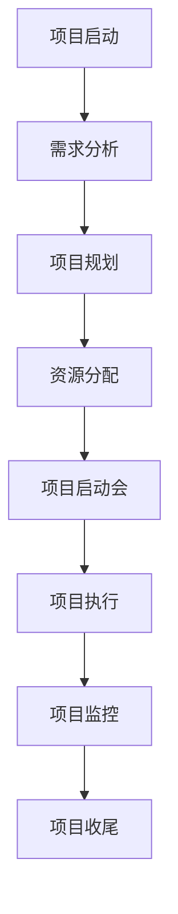
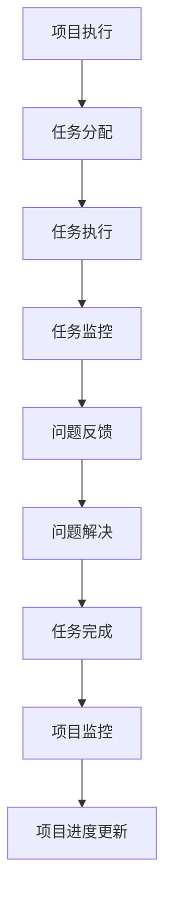
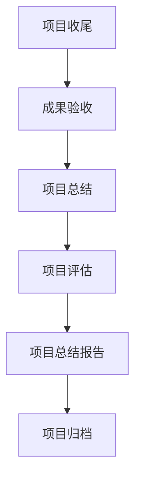

                 

# 引言

## 文章标题：远程项目管理：跨地域团队协作的有效策略

### 关键词：远程项目管理，团队协作，跨地域，协作工具，项目管理工具，挑战与解决方案

### 摘要：
在全球化的大背景下，远程项目管理已成为现代企业普遍采用的一种工作模式。本文旨在探讨跨地域团队协作的有效策略，通过分析远程项目管理的定义、特点、挑战与机遇，介绍远程团队协作机制、项目管理流程、工具与方法，并提供成功案例与实战经验。文章旨在为从事远程项目管理的专业人士提供有价值的参考，助力企业在全球化的竞争中取得优势。

## 《远程项目管理：跨地域团队协作的有效策略》目录大纲

### 第一部分：远程项目管理基础

#### 第1章：远程项目管理概述
1.1 远程项目管理的定义与特点
1.2 远程项目管理的挑战与机遇
1.3 远程项目管理的发展趋势与未来

#### 第2章：远程团队协作机制
2.1 远程团队协作模式
2.2 远程团队沟通策略
2.3 远程团队协作工具

#### 第3章：远程项目管理流程
3.1 远程项目启动与规划
3.2 远程项目执行与监控
3.3 远程项目收尾与总结

### 第二部分：远程项目管理工具与技术

#### 第4章：远程项目管理工具
4.1 远程项目管理软件
4.2 远程协作工具
4.3 远程项目管理工具集成与优化

#### 第5章：远程团队技术支持
5.1 远程团队技术基础设施
5.2 远程办公技术支持
5.3 远程技术支持策略

#### 第6章：远程项目管理方法论
6.1 水平式项目管理方法
6.2 垂直式项目管理方法
6.3 远程项目管理最佳实践

### 第三部分：远程项目管理案例分析

#### 第7章：成功远程项目管理案例分析
7.1 案例一：跨国软件开发的远程项目管理
7.2 案例二：远程团队在大型项目中的应用
7.3 案例三：远程项目在创业团队中的实践

#### 第8章：远程项目管理挑战与解决方案
8.1 远程项目管理常见问题
8.2 挑战与解决方案
8.3 远程项目管理技巧与建议

### 附录

#### 附录A：远程项目管理工具资源列表
A.1 常用远程项目管理工具
A.2 远程协作工具介绍
A.3 技术支持资源列表

#### 附录B：远程项目管理常用术语解释
B.1 远程项目管理相关术语
B.2 远程团队协作相关术语
B.3 技术支持相关术语

#### 附录C：远程项目管理 Mermaid 流程图
C.1 项目启动流程图
C.2 项目执行监控流程图
C.3 项目收尾流程图

#### 附录D：核心算法原理与伪代码
D.1 伪代码示例一：项目进度监控算法
D.2 伪代码示例二：远程团队协作效率评估算法
D.3 伪代码示例三：远程项目管理优化算法

#### 附录E：数学模型与公式
E.1 数学模型一：项目进度预测模型
E.2 数学公式一：项目进度预测公式
E.3 数学模型二：远程团队协作效率评估模型
E.4 数学公式二：远程团队协作效率评估公式

#### 附录F：远程项目管理项目实战案例
F.1 实战案例一：搭建远程项目管理框架
F.2 实战案例二：实施远程团队协作策略
F.3 实战案例三：优化远程项目管理流程

### 引言

在当今全球化的商业环境中，远程工作已成为一种常态。无论是跨国公司，还是初创企业，都在探索如何有效地管理分布在不同地理位置的团队。远程项目管理作为一种新兴的项目管理模式，正逐渐受到广泛关注。它不仅满足了企业跨地域协作的需求，还带来了诸多优势，如降低成本、提高效率、优化资源配置等。

远程项目管理并非简单地在线上完成工作任务，它涉及到一系列复杂的挑战，如沟通障碍、时间差异、文化冲突等。然而，随着信息技术的飞速发展，远程项目管理工具和技术的不断成熟，这些问题正逐步得到解决。本文将深入探讨远程项目管理的核心概念、协作机制、项目管理流程、工具与技术，并结合成功案例，为从事远程项目管理的专业人士提供有价值的参考。

本文结构如下：

1. **第一部分：远程项目管理基础**，介绍远程项目管理的定义、特点、挑战与机遇，以及远程团队协作机制。
2. **第二部分：远程项目管理工具与技术**，讨论远程项目管理工具、技术基础设施、支持策略及方法论。
3. **第三部分：远程项目管理案例分析**，通过具体案例展示远程项目管理的实践与效果。
4. **附录部分**，提供远程项目管理常用术语、流程图、核心算法原理与伪代码，以及项目实战案例。

通过本文的阅读，读者将能够深入了解远程项目管理的各个方面，掌握跨地域团队协作的有效策略，为企业实现全球化发展提供有力支持。

## 第一部分：远程项目管理基础

### 第1章：远程项目管理概述

#### 1.1 远程项目管理的定义与特点

远程项目管理是一种在非集中式工作环境中实施的项目管理方法，它允许项目团队中的成员在不同地理位置、时区和文化环境中协作。与传统项目管理相比，远程项目管理具有以下几个显著特点：

1. **地理位置分散**：团队成员可能位于不同的城市、国家甚至时区，这要求项目管理者具备跨文化的沟通能力和管理技巧。
2. **依赖技术工具**：远程项目管理高度依赖于各种技术工具，如项目管理软件、即时通讯工具、视频会议系统等，以确保团队间的信息流动和协作效率。
3. **灵活的工作时间**：团队成员可以根据自身的时间和地理优势，灵活安排工作时间，但这也带来了时间管理和进度控制的挑战。
4. **文化多样性**：远程团队往往由不同文化背景的成员组成，这要求项目管理者具备处理文化差异和促进团队凝聚力的能力。

#### 1.2 远程项目管理的挑战与机遇

虽然远程项目管理带来了诸多挑战，但同时也提供了巨大的机遇。以下是远程项目管理面临的一些主要挑战和机遇：

**挑战**：

1. **沟通障碍**：由于地理位置的分散和时区的差异，团队成员之间的沟通往往面临困难。信息传达的准确性和及时性成为项目成功的关键。
2. **协作效率**：远程团队在协作过程中可能缺乏面对面的互动，导致工作效率下降。团队成员需要适应远程协作工具，提高工作效率。
3. **项目管理复杂性**：远程项目管理的复杂性增加，项目经理需要同时处理多个任务，确保项目的进度、质量和成本控制。
4. **文化冲突**：不同文化背景的团队成员在价值观、工作方式等方面的差异可能引发冲突，影响团队的凝聚力和工作效率。

**机遇**：

1. **成本节约**：远程项目管理可以减少团队成员的差旅费用，降低企业的运营成本。
2. **扩大人才池**：远程工作使企业能够招聘全球范围内的优秀人才，扩大人才池，提高项目的整体质量。
3. **灵活性**：远程工作模式提高了员工的工作灵活性，有助于提高员工满意度和工作动力。
4. **创新环境**：跨地域、跨文化的团队可以带来多样化的思维和创意，有助于项目的创新和突破。

#### 1.3 远程项目管理的发展趋势与未来

随着全球化和信息技术的不断发展，远程项目管理正呈现出以下几个发展趋势：

1. **工具与技术进步**：远程项目管理工具和技术的不断成熟，如人工智能、云计算、区块链等，将进一步提升远程团队协作的效率和质量。
2. **管理方法创新**：传统项目管理方法在远程环境中的应用将不断优化，新的项目管理方法，如敏捷管理和精益管理，将在远程项目管理中得到更广泛的应用。
3. **跨文化管理**：跨文化管理将成为远程项目管理中的重要组成部分，项目管理者需要具备处理文化差异的能力，促进团队的和谐与高效协作。
4. **持续学习与适应**：远程项目管理要求团队成员和项目管理者具备持续学习的能力，适应不断变化的工作环境和需求。

总之，远程项目管理作为一种新兴的项目管理模式，既面临挑战，也充满机遇。通过深入理解其定义、特点、挑战与机遇，以及未来发展趋势，项目管理者可以更好地应对远程项目管理的复杂挑战，实现项目的成功交付。

### 第2章：远程团队协作机制

#### 2.1 远程团队协作模式

远程团队协作模式是指团队在不同地理位置和工作环境中进行协作的工作方式。根据团队成员的地理位置和工作安排，远程团队协作模式可以分为以下几种：

1. **集中式远程团队**：团队成员在同一个城市或地区，但通过远程工具进行协作。这种模式的优势在于团队成员之间的沟通和协作较为顺畅，但受限于地理位置和工作时间的限制。
2. **分布式远程团队**：团队成员分布在不同的城市或国家，通过远程工具进行协作。这种模式的优势在于可以充分利用全球范围内的人才资源，但面临的挑战包括沟通障碍和文化差异。
3. **虚拟团队**：团队成员完全通过网络进行协作，没有固定的办公地点。这种模式的优势在于灵活性和效率，但需要有效的沟通和管理机制来确保团队的协调和合作。
4. **混合型团队**：团队由集中式和分布式成员组成，通过远程工具进行协作。这种模式结合了集中式和分布式团队的优势，可以更好地应对项目需求。

#### 2.2 远程团队沟通策略

有效的沟通是远程团队协作成功的关键。以下是一些关键的远程团队沟通策略：

1. **明确沟通目标**：在项目启动阶段，明确每个沟通会议的目标和议程，确保团队成员了解会议的目的和预期成果。
2. **定期会议**：安排固定的会议时间，如每周或每月的进度会议，以保持团队的一致性和进度。
3. **即时通讯**：使用即时通讯工具，如Slack、Telegram等，确保团队成员可以快速交流，解决突发问题。
4. **视频会议**：定期举行视频会议，以提高团队的互动和凝聚力。视频会议可以更好地传达情感和非语言信息，减少误解。
5. **文件共享与版本控制**：使用云存储和版本控制工具，如Google Drive、Git等，确保团队成员可以实时访问和更新项目文件。
6. **反馈与认可**：及时给予团队成员反馈和认可，增强团队的积极性和合作意愿。

#### 2.3 远程团队协作工具

选择合适的远程团队协作工具对于提高团队协作效率至关重要。以下是一些常用的远程团队协作工具：

1. **项目管理软件**：如Trello、Jira、Asana等，用于任务分配、进度跟踪和团队协作。
2. **即时通讯工具**：如Slack、Telegram、Microsoft Teams等，用于实时沟通和协作。
3. **视频会议工具**：如Zoom、Microsoft Teams、Google Meet等，用于远程会议和团队互动。
4. **文档共享与协作工具**：如Google Workspace、Office 365等，用于文档的共享、编辑和协作。
5. **版本控制工具**：如Git、Svn等，用于代码和文档的版本控制和协同开发。
6. **协作平台**：如Confluence、Notion等，用于知识共享、项目文档管理和团队协作。

通过合理选择和整合这些远程团队协作工具，团队可以更加高效地进行协作，克服地理位置和时区带来的挑战。

### 第3章：远程项目管理流程

#### 3.1 远程项目启动与规划

远程项目启动与规划是远程项目管理流程中的关键环节。以下是远程项目启动与规划的步骤和内容：

1. **项目需求分析**：明确项目的目标和需求，包括项目的功能、性能、质量、成本等方面的要求。
2. **项目范围定义**：明确项目的范围，包括项目涵盖的工作内容、边界和限制。
3. **团队组建**：组建远程项目团队，包括项目经理、开发人员、测试人员、设计师等，确保团队成员具备所需技能和经验。
4. **角色与职责分配**：明确团队成员的角色和职责，确保每个人了解自己的任务和责任。
5. **项目计划制定**：制定项目计划，包括项目的进度计划、资源分配、风险控制等，确保项目按计划顺利进行。
6. **沟通机制建立**：建立有效的沟通机制，确保团队成员之间能够顺畅地交流和协作。
7. **项目启动会议**：召开项目启动会议，介绍项目目标、计划、团队成员和沟通机制，确保团队成员对项目的了解和参与。

#### 3.2 远程项目执行与监控

远程项目执行与监控是确保项目按计划进行的阶段。以下是远程项目执行与监控的步骤和内容：

1. **任务分配**：根据项目计划，将任务分配给团队成员，确保每个人明确自己的任务和截止日期。
2. **任务执行**：团队成员按照任务分配进行工作，确保按时完成任务。
3. **进度监控**：定期检查项目的进度，确保项目按计划进行。可以使用项目管理工具来跟踪任务进度和项目状态。
4. **问题解决**：及时发现和解决项目中的问题，确保项目顺利进行。可以通过即时通讯工具、视频会议等方式进行问题沟通和解决。
5. **风险管理**：识别项目中的潜在风险，并制定相应的风险应对措施。定期评估风险，确保项目风险在可控范围内。

#### 3.3 远程项目收尾与总结

远程项目收尾与总结是远程项目管理流程的最后一个阶段。以下是远程项目收尾与总结的步骤和内容：

1. **成果验收**：对项目成果进行验收，确保项目达到预期目标和质量标准。可以邀请相关方进行项目验收，确保项目得到认可。
2. **项目总结**：召开项目总结会议，回顾项目的执行过程和结果，总结经验教训。可以收集团队成员的意见和建议，为未来的项目提供改进的参考。
3. **项目评估**：对项目进行评估，包括项目的进度、质量、成本、风险等方面的评估。评估结果可以作为项目管理能力和团队绩效的依据。
4. **项目归档**：将项目的相关文件、资料和记录进行归档，确保项目的完整性。项目归档可以作为企业知识库的一部分，供未来的项目参考。
5. **项目解散**：在项目总结和评估完成后，宣布项目正式结束，团队成员可以回归正常工作。

通过以上远程项目管理流程，项目管理者可以确保远程项目从启动到收尾的每个阶段都有序进行，确保项目的成功交付。

### 第二部分：远程项目管理工具与技术

#### 第4章：远程项目管理工具

远程项目管理工具是确保远程项目顺利进行的关键。以下将详细讨论远程项目管理软件、远程协作工具以及远程项目管理工具的集成与优化。

#### 4.1 远程项目管理软件

远程项目管理软件是用于管理远程项目任务、进度、资源和风险等方面的工具。以下是一些常见的远程项目管理软件：

1. **Trello**：Trello 是一个基于看板的远程项目管理工具，适用于小团队和个体用户。它提供了直观的用户界面和灵活的任务管理功能，支持任务分配、评论和文件上传。

2. **Jira**：Jira 是一个功能强大的远程项目管理工具，适用于大型团队和复杂项目。它提供了全面的任务跟踪、敏捷开发工具和强大的集成功能。

3. **Asana**：Asana 是一个灵活的远程项目管理工具，适用于各种规模和类型的团队。它提供了任务分配、进度跟踪、时间管理等功能，支持多种数据可视化方式。

4. **Microsoft Project**：Microsoft Project 是一个成熟的项目管理软件，适用于大型项目和复杂任务。它提供了详细的进度规划、资源分配和风险管理功能。

5. **Basecamp**：Basecamp 是一个简单易用的远程项目管理工具，适用于小型团队和项目。它提供了任务管理、团队沟通和文档共享等功能，有助于团队协作。

#### 4.2 远程协作工具

远程协作工具是用于远程团队沟通、协作和文件共享的工具。以下是一些常见的远程协作工具：

1. **Slack**：Slack 是一个即时通讯工具，适用于远程团队沟通和协作。它提供了消息传递、频道创建、文件共享和集成其他工具等功能。

2. **Microsoft Teams**：Microsoft Teams 是一个集成通讯和协作平台，适用于远程团队沟通和协作。它提供了聊天、会议、视频通话和文档共享等功能。

3. **Zoom**：Zoom 是一个视频会议工具，适用于远程团队会议和协作。它提供了高清视频会议、屏幕共享、聊天和虚拟背景等功能。

4. **Google Workspace**：Google Workspace 是一个集成的办公平台，适用于远程团队协作。它提供了文档编辑、邮件、日历、团队协作等功能。

5. **Confluence**：Confluence 是一个知识共享和协作平台，适用于远程团队的知识管理和文档共享。它提供了内容创作、协作编辑、版本控制和搜索等功能。

#### 4.3 远程项目管理工具集成与优化

为了提高远程团队协作的效率，远程项目管理工具的集成与优化至关重要。以下是一些集成与优化的策略：

1. **工具集成**：将不同的远程项目管理工具和协作工具集成到一个统一的平台上，如Trello和Slack的集成，可以让团队成员在一个平台上处理所有任务和沟通。

2. **自动化流程**：通过自动化工具和脚本，实现远程项目管理工具之间的自动化操作，如任务创建、进度更新和通知发送等，可以减少手动操作，提高效率。

3. **权限管理**：为团队成员分配适当的权限，确保每个人只能访问他们需要的信息和工具，同时保护敏感数据和隐私。

4. **培训与支持**：为团队成员提供培训和支持，确保他们能够熟练使用远程项目管理工具，提高协作效率。

5. **持续优化**：定期评估远程项目管理工具的集成与优化效果，根据团队成员的反馈和实际需求进行改进，以提高工具的实用性和用户体验。

通过合理选择和集成远程项目管理工具，以及持续优化和改进，远程团队可以更加高效地进行协作，确保项目的成功交付。

#### 第5章：远程团队技术支持

远程团队技术支持是确保远程团队正常运作的关键因素。以下将详细讨论远程团队技术基础设施、远程办公技术支持以及远程技术支持策略。

#### 5.1 远程团队技术基础设施

远程团队技术基础设施是指支持远程团队工作的硬件、软件和网络设施。以下是一些关键的技术基础设施：

1. **云计算平台**：云计算平台如Amazon Web Services (AWS)、Microsoft Azure和Google Cloud提供了强大的计算能力、存储和数据库服务，支持远程团队的高效协作和数据处理。

2. **虚拟专用网络（VPN）**：VPN技术为远程团队提供了一个安全的网络连接，确保数据传输的安全性和隐私性。VPN可以跨地域连接远程团队成员，使他们能够安全地访问公司内部资源。

3. **远程桌面和虚拟桌面基础设施（VDI）**：远程桌面和VDI技术允许远程团队成员通过互联网远程访问公司的桌面和应用程序，提高了工作效率和灵活性。

4. **存储解决方案**：云存储服务如Amazon S3、Google Cloud Storage和Microsoft Azure Blob Storage提供了可靠的存储解决方案，支持远程团队的数据存储和共享。

5. **网络基础设施**：高速、稳定和安全的网络基础设施是远程团队正常运作的基础。企业可以使用专用的互联网连接、多网络路径冗余和防火墙等来保障网络的稳定性和安全性。

#### 5.2 远程办公技术支持

远程办公技术支持是确保远程员工能够高效完成工作任务的关键。以下是一些远程办公技术支持的措施：

1. **设备支持**：为企业远程员工提供必要的硬件设备，如笔记本电脑、手机、平板电脑和办公软件，确保他们能够顺利开展工作。

2. **软件支持**：为远程员工提供必要的软件工具，如远程项目管理软件、协作工具和办公软件，支持他们的日常工作和项目协作。

3. **网络连接支持**：为远程员工提供可靠的互联网连接，确保他们能够稳定地访问公司内部资源和服务。

4. **技术培训与支持**：定期为远程员工提供技术培训和指导，帮助他们熟练使用各种远程办公工具和系统，提高工作效率。

5. **技术支持热线和在线帮助**：设立技术支持热线和在线帮助平台，及时解决远程员工在使用技术工具和系统过程中遇到的问题，提供快速的技术支持。

#### 5.3 远程技术支持策略

远程技术支持策略是确保远程团队技术支持高效运行的关键。以下是一些远程技术支持策略：

1. **预防性维护**：定期对远程团队的技术基础设施进行预防性维护，包括系统更新、安全补丁和性能优化，确保系统稳定运行。

2. **快速响应**：建立快速响应机制，确保技术支持团队能够迅速识别和解决问题，减少对远程团队工作的影响。

3. **监控与预警**：通过监控系统实时监控远程团队的技术基础设施和应用程序，及时发现和处理潜在问题，确保系统的稳定性和安全性。

4. **文档与知识库**：建立详细的文档和知识库，记录常见问题的解决方案和技术操作步骤，方便远程员工和后台技术团队进行自助解决和查询。

5. **持续改进**：根据远程团队的需求和反馈，不断优化技术支持策略和服务，提高技术支持的质量和效率。

通过完善远程团队技术基础设施、提供全面的远程办公技术支持和实施有效的远程技术支持策略，企业可以确保远程团队的稳定运作，提高工作效率和项目成功率。

### 第6章：远程项目管理方法论

#### 6.1 水平式项目管理方法

水平式项目管理方法是一种强调团队协作和并行工作的项目管理方法。在这种方法中，项目任务被分解成多个可并行执行的部分，各个团队成员可以同时进行不同的任务。水平式项目管理方法的特点如下：

1. **并行工作**：团队成员可以同时处理不同的任务，提高了工作效率和项目进度。
2. **灵活性**：水平式项目管理方法允许团队成员根据自身的时间和工作安排，灵活地安排工作，提高了工作满意度。
3. **风险分散**：通过并行工作，项目中的风险可以分散到不同的任务和团队成员中，降低了整体项目的风险。
4. **团队合作**：水平式项目管理方法强调团队合作，各个团队成员需要相互协作，共同完成项目任务。

#### 6.2 垂直式项目管理方法

垂直式项目管理方法是一种强调任务分解和层级管理的方法。在这种方法中，项目任务被分解成多个有序的子任务，各个团队成员按照任务分解进行工作。垂直式项目管理方法的特点如下：

1. **任务分解**：项目任务被详细分解成多个可管理的子任务，每个子任务都有明确的负责人和完成时间。
2. **层级管理**：项目任务按照层级进行管理，各级管理人员负责监督和管理下级任务和团队成员。
3. **结构化**：垂直式项目管理方法提供了清晰的结构和责任分配，有助于项目的有序进行和管理。
4. **集中控制**：项目任务和资源由项目经理或上级管理层集中控制，确保项目按计划进行。

#### 6.3 远程项目管理最佳实践

在远程项目管理中，最佳实践是指通过总结成功项目经验和行业最佳实践，形成一套有效的方法和策略，以提高远程项目的成功率和效率。以下是一些远程项目管理最佳实践：

1. **建立清晰的沟通机制**：确保团队成员之间能够及时、准确地沟通，使用远程沟通工具，如Slack、Zoom等，定期召开会议，讨论项目进展和问题。
2. **明确任务和责任**：为每个任务分配明确的责任人，确保每个人了解自己的任务和责任，减少任务重叠和责任不清的问题。
3. **灵活的工作时间安排**：允许团队成员根据自身的时间和工作习惯，灵活安排工作时间，但要确保项目的进度和质量。
4. **使用项目管理工具**：选择合适的远程项目管理工具，如Trello、Jira等，用于任务分配、进度跟踪和协作。
5. **定期评估和反馈**：定期评估项目进展和团队成员的工作表现，及时提供反馈和建议，确保项目按计划进行和持续改进。
6. **文化适应性**：尊重团队成员的文化差异，建立开放、包容的团队文化，促进团队成员之间的协作和沟通。
7. **技术支持**：提供必要的技术支持，确保远程团队成员能够顺利使用远程工作工具和技术基础设施。

通过实施这些远程项目管理最佳实践，企业可以更好地管理远程项目，提高团队协作效率，确保项目的成功交付。

### 第三部分：远程项目管理案例分析

#### 第7章：成功远程项目管理案例分析

本章节通过三个具体案例，展示远程项目管理在不同类型项目中的应用和实践，分析其成功经验和挑战解决方案。

#### 7.1 案例一：跨国软件开发的远程项目管理

**背景**：某全球知名的软件开发公司需要开发一款面向全球市场的移动应用程序。项目涉及多个国家和地区的开发团队，包括中国、美国、印度和欧洲等国家。

**项目管理策略**：
1. **团队组建**：根据项目需求，组建了包含前端开发、后端开发、UI设计、测试等不同职能的团队。每个团队成员都明确自己的职责和任务。
2. **沟通机制**：使用Slack进行日常沟通，每周定期举行视频会议，讨论项目进展和解决问题。同时，使用Trello进行任务分配和进度跟踪。
3. **时区管理**：考虑到不同团队的时区差异，制定了一套灵活的工作时间表，确保每个团队都有足够的时间来完成各自的任务。

**项目实践**：
1. **任务分配**：根据项目需求，将任务分配给不同团队的成员，确保每个成员都有明确的任务和责任。
2. **进度监控**：定期检查项目的进度，通过Trello的进度条和图表，实时跟踪任务完成情况。
3. **问题解决**：遇到问题时，通过视频会议快速沟通，找出解决方案，并确保问题得到及时解决。

**项目成果与经验总结**：
1. **项目成果**：在远程项目管理策略的支持下，项目按计划完成了所有任务，顺利上线，得到了用户的好评。
2. **经验总结**：成功的远程项目管理需要明确的沟通机制、灵活的工作时间安排和高效的进度监控。同时，项目经理需要具备处理跨文化团队和时区差异的能力。

#### 7.2 案例二：远程团队在大型项目中的应用

**背景**：某大型国际咨询公司承接了一个跨国企业的数字化转型项目，涉及多个业务领域和技术模块。项目团队由来自不同国家和地区的专家组成。

**项目管理策略**：
1. **项目管理框架**：采用敏捷管理方法，将项目分为多个迭代周期，每个周期都有明确的目标和交付物。
2. **协作平台**：使用Confluence进行知识管理和文档共享，使用Jira进行任务分配和进度跟踪，使用Slack进行实时沟通。
3. **跨文化沟通**：建立跨文化沟通机制，包括定期举行跨文化培训和工作坊，促进团队成员之间的理解和协作。

**项目实践**：
1. **迭代管理**：每个迭代周期开始时，团队召开迭代规划会议，确定迭代目标和任务分配。在迭代结束时，进行回顾会议，总结经验和改进点。
2. **任务协作**：团队成员通过协作平台进行任务协作，确保每个任务都有明确的责任人和完成时间。
3. **跨文化协作**：在项目执行过程中，定期举行跨文化沟通会议，讨论文化差异和协作问题，促进团队成员之间的理解和信任。

**项目成果与经验总结**：
1. **项目成果**：通过高效的远程项目管理，项目在多个迭代周期内成功完成了各项任务，实现了客户的业务需求。
2. **经验总结**：远程项目管理需要灵活的管理方法、高效的协作工具和跨文化沟通机制。团队成员之间的信任和理解是项目成功的关键。

#### 7.3 案例三：远程项目在创业团队中的实践

**背景**：某初创公司开发一款智能家居设备，团队分布在不同的城市，需要进行跨地域协作。

**项目管理策略**：
1. **项目管理工具**：使用Trello进行任务分配和进度跟踪，使用Zoom进行视频会议和团队协作。
2. **灵活的工作时间**：团队成员可以根据自身的时间安排，灵活选择工作时间，确保项目进度。
3. **持续反馈**：定期进行项目进展的评估和反馈，及时调整项目方向和策略。

**项目实践**：
1. **任务分配**：根据项目需求和团队成员的能力，将任务分配给不同的成员，确保每个成员都有明确的任务和目标。
2. **进度监控**：定期检查项目进度，通过Trello的进度图表和提醒功能，确保项目按计划进行。
3. **团队协作**：通过Zoom进行团队协作，讨论项目进展、解决问题和规划下一步工作。

**项目成果与经验总结**：
1. **项目成果**：在远程项目管理策略的支持下，项目成功完成了设备研发、测试和上线，产品得到了市场认可。
2. **经验总结**：远程项目管理需要灵活的管理工具、高效的工作时间安排和持续的反馈机制。团队成员之间的信任和合作是项目成功的关键。

通过以上三个案例，我们可以看到远程项目管理在不同类型项目中的应用和实践，以及成功经验和挑战解决方案。这些案例为从事远程项目管理的专业人士提供了宝贵的参考和启示。

### 第8章：远程项目管理挑战与解决方案

#### 8.1 远程项目管理常见问题

远程项目管理面临一系列挑战，以下是其中一些常见问题及其解决策略：

1. **沟通障碍**：由于团队成员地理位置分散，沟通可能不够及时和有效。解决策略包括：
   - 使用高效的沟通工具，如Slack、Zoom等。
   - 设立固定的沟通时间，确保团队成员能够及时交流和解决问题。
   - 采用异步沟通方式，如邮件、即时消息等，以满足不同时区的需求。

2. **协作效率低**：远程团队在协作过程中可能缺乏面对面的互动，导致效率下降。解决策略包括：
   - 使用协作工具，如Trello、Jira等，以明确任务分配和进度。
   - 建立明确的角色和职责，确保每个成员了解自己的任务和责任。
   - 提供远程协作培训，提高团队成员的协作能力。

3. **时间管理**：远程团队在不同时区工作，时间管理可能成为挑战。解决策略包括：
   - 制定灵活的工作时间表，考虑团队成员的时区差异。
   - 使用项目管理工具，如Trello、Asana等，以跟踪任务进度和时间分配。

4. **文化差异**：跨文化团队可能存在价值观、工作方式等方面的差异。解决策略包括：
   - 建立跨文化沟通机制，提高团队成员之间的理解和协作。
   - 提供文化培训，帮助团队成员更好地适应不同文化。

5. **技术基础设施不足**：远程团队可能面临技术基础设施不足的问题，如网络不稳定、设备故障等。解决策略包括：
   - 提供稳定的技术支持，确保远程团队成员能够顺利使用远程工具和系统。
   - 建立备份方案，以应对技术故障和中断。

#### 8.2 挑战与解决方案

在远程项目管理中，以下是几个主要的挑战及其解决方案：

1. **挑战一：时区差异**
   - **解决方案**：采用时区协调工具，如World Time Buddy，以安排跨时区的会议。确保每个团队成员了解其他团队成员的时区，提前规划工作安排。

2. **挑战二：技术基础设施不足**
   - **解决方案**：提供强大的技术基础设施，包括高性能的云服务、高速稳定的网络连接和可靠的数据存储解决方案。定期维护和更新设备，确保技术基础设施的稳定运行。

3. **挑战三：团队协作效率低**
   - **解决方案**：选择合适的远程协作工具，如Slack、Zoom、Google Workspace等，提高团队协作效率。提供培训，帮助团队成员掌握协作工具的使用。

4. **挑战四：项目管理方法不适应远程环境**
   - **解决方案**：采用适合远程项目的方法，如敏捷管理、Scrum等。根据项目需求调整项目管理方法，确保项目能够顺利进行。

5. **挑战五：沟通不足和误解**
   - **解决方案**：建立清晰的沟通机制，包括定期会议、实时沟通和异步沟通。使用视频会议，以增强沟通效果。鼓励团队成员提出问题，确保沟通透明。

#### 8.3 远程项目管理技巧与建议

为了成功管理远程项目，以下是几个有用的技巧和建议：

1. **明确目标和期望**：确保每个团队成员都明确项目的目标和期望，减少误解和冲突。

2. **灵活的时间管理**：根据团队成员的时区和工作习惯，灵活安排工作时间和任务。

3. **建立有效的沟通机制**：定期召开会议，使用远程协作工具，确保团队成员之间的沟通畅通。

4. **提供技术支持**：确保远程团队成员能够顺利使用远程工具和技术基础设施。

5. **培养团队合作精神**：鼓励团队成员之间的协作和合作，提高团队凝聚力和效率。

6. **持续反馈和改进**：定期评估项目进展和团队成员的工作表现，及时提供反馈和建议，确保项目按计划进行。

通过解决远程项目管理中的挑战并实施这些技巧和建议，企业可以更有效地管理远程项目，确保项目的成功交付。

### 附录

#### 附录A：远程项目管理工具资源列表

**A.1 常用远程项目管理工具**

- **Trello**：一个直观的任务管理工具，适合小团队和个体用户。
- **Jira**：一个功能强大的远程项目管理工具，适用于大型团队和复杂项目。
- **Asana**：一个灵活的任务跟踪工具，适合各种规模和类型的团队。
- **Microsoft Project**：一个成熟的项目管理软件，适用于大型项目和复杂任务。
- **Basecamp**：一个简单易用的远程项目管理工具，适用于小型团队和项目。

**A.2 远程协作工具介绍**

- **Slack**：一个即时通讯工具，适用于远程团队沟通和协作。
- **Microsoft Teams**：一个集成通讯和协作平台，适用于远程团队沟通和协作。
- **Zoom**：一个视频会议工具，适用于远程团队会议和协作。
- **Google Workspace**：一个集成的办公平台，适用于远程团队协作。
- **Confluence**：一个知识共享和协作平台，适用于远程团队的知识管理和文档共享。

**A.3 技术支持资源列表**

- **Amazon Web Services (AWS)**：提供云计算平台和存储解决方案。
- **Microsoft Azure**：提供云计算平台和数据分析服务。
- **Google Cloud**：提供云计算平台和大数据处理服务。
- **DigitalOcean**：提供云基础设施服务，适用于远程工作环境。
- **Linode**：提供云基础设施服务，支持远程团队的技术需求。

#### 附录B：远程项目管理常用术语解释

**B.1 远程项目管理相关术语**

- **远程项目管理**：在非集中式工作环境中实施的项目管理方法。
- **虚拟团队**：通过远程工具和平台进行协作的团队。
- **协作**：团队成员共同完成项目任务的过程。
- **沟通**：团队成员之间交流和分享信息的过程。
- **任务分配**：将项目任务分配给团队成员的过程。
- **进度监控**：跟踪项目进度和任务完成情况的过程。
- **风险控制**：识别和应对项目风险的过程。

**B.2 远程团队协作相关术语**

- **远程协作工具**：用于远程团队协作的工具和平台。
- **在线会议**：通过远程工具举行的会议，支持实时沟通和协作。
- **视频通话**：通过远程工具进行的视频对话，增强沟通效果。
- **即时通讯**：通过远程工具进行的即时消息传递和交流。
- **文件共享**：通过远程工具共享和协作项目文件。
- **版本控制**：管理和跟踪文件版本的过程。

**B.3 技术支持相关术语**

- **云服务**：通过互联网提供计算、存储和数据处理服务的平台。
- **虚拟专用网络（VPN）**：通过加密技术在互联网上建立安全连接的虚拟网络。
- **远程桌面**：通过远程工具访问和操作远程计算机桌面。
- **备份与恢复**：创建备份并恢复数据的过程，确保数据的安全和完整性。
- **网络安全**：保护计算机网络和数据免受未经授权访问和攻击的措施。

#### 附录C：远程项目管理 Mermaid 流程图

**C.1 项目启动流程图**



**C.2 项目执行监控流程图**



**C.3 项目收尾流程图**



#### 附录D：核心算法原理与伪代码

**D.1 伪代码示例一：项目进度监控算法**

```plaintext
function projectMonitoring(plan, actualProgress):
    for task in plan:
        if actualProgress[task] < plan[task].deadline:
            sendAlert("任务 "+task+" 进度延迟")
        else:
            updateStatus(task, "已完成")
    end for
end function
```

**D.2 伪代码示例二：远程团队协作效率评估算法**

```plaintext
function teamCollaborationEfficiency(communicationData, taskData):
    communicationScore = calculateCommunicationScore(communicationData)
    taskScore = calculateTaskScore(taskData)
    efficiency = (communicationScore + taskScore) / 2
    return efficiency
end function
```

**D.3 伪代码示例三：远程项目管理优化算法**

```plaintext
function projectOptimization(currentPlan, targetEfficiency):
    for each task in currentPlan:
        if task can be optimized:
            optimizeTask(task)
        end if
    end for
    newPlan = applyOptimizations(currentPlan)
    if efficiency(newPlan) >= targetEfficiency:
        return newPlan
    else:
        return "优化失败，无法达到目标效率"
    end if
end function
```

#### 附录E：数学模型与公式

**E.1 数学模型一：项目进度预测模型**

$$
\text{预测进度} = \text{实际进度} + \text{预测偏差}
$$

**E.2 数学公式一：项目进度预测公式**

$$
\text{预测偏差} = \frac{\text{预测误差}}{\text{预测置信区间}}
$$

**E.3 数学模型二：远程团队协作效率评估模型**

$$
\text{协作效率} = \frac{\text{沟通效率} + \text{任务效率}}{2}
$$

**E.4 数学公式二：远程团队协作效率评估公式**

$$
\text{沟通效率} = \frac{\text{沟通时长}}{\text{任务时长}}
$$

#### 附录F：远程项目管理项目实战案例

**F.1 实战案例一：搭建远程项目管理框架**

**1. 实践背景**

- **项目名称**：为一家初创企业搭建远程项目管理框架。
- **项目规模**：涉及产品开发、市场推广、客户支持等多个团队。

**2. 实践步骤**

- **需求分析**：与公司管理层和团队成员沟通，了解项目需求和目标。
- **框架设计**：根据需求分析，设计远程项目管理框架，包括项目管理工具、协作机制和沟通流程。
- **工具选择**：选择合适的远程项目管理工具，如Trello和Slack，并设置用户权限。
- **培训与实施**：为团队成员提供培训，确保他们能够熟练使用项目管理工具，并实施远程项目管理框架。

**3. 实践效果**

- **项目进度得到有效控制**：通过Trello的任务分配和进度跟踪功能，项目进度得到实时监控，确保项目按计划进行。
- **团队协作效率显著提升**：使用Slack进行实时沟通和协作，团队成员可以快速解决问题，提高工作效率。
- **项目成果顺利交付**：通过远程项目管理框架的实施，项目最终成功交付，客户满意度提高。

**F.2 实战案例二：实施远程团队协作策略**

**1. 实践背景**

- **项目名称**：为一家跨国公司实施远程团队协作策略。
- **项目规模**：涉及多个国家和地区的团队，包括中国、美国、欧洲等地。

**2. 实践步骤**

- **团队组建**：根据项目需求，组建多国远程团队，包括产品开发、测试、市场推广等不同职能。
- **协作平台搭建**：搭建远程协作平台，包括Trello、Confluence和Slack，确保团队成员可以高效协作。
- **跨文化培训**：为团队成员提供跨文化培训，提高跨文化沟通和协作能力。
- **协作流程制定**：制定远程协作流程，包括任务分配、进度监控、问题解决和项目总结。

**3. 实践效果**

- **项目沟通更加顺畅**：通过远程协作平台，团队成员可以实时交流和分享信息，减少沟通障碍。
- **团队协作效率显著提升**：团队成员能够高效地完成任务，项目进度得到有效控制。
- **项目成果达到预期目标**：通过实施远程团队协作策略，项目成功达到预期目标，客户满意度提高。

**F.3 实战案例三：优化远程项目管理流程**

**1. 实践背景**

- **项目名称**：为一家远程工作企业优化项目管理流程。
- **项目规模**：涉及多个远程团队，包括研发、运维、市场等部门。

**2. 实践步骤**

- **流程分析**：分析现有项目管理流程，识别流程中的瓶颈和问题。
- **优化方案制定**：根据流程分析结果，制定优化方案，包括任务分配、进度监控、风险管理和团队协作等方面的优化。
- **实施与培训**：实施优化方案，为团队成员提供培训，确保他们能够熟练使用新的项目管理流程。
- **效果评估**：定期评估优化方案的效果，根据团队成员的反馈和实际需求进行调整。

**3. 实践效果**

- **远程项目管理效率显著提升**：通过优化项目管理流程，项目进度得到更加有效的控制，团队协作效率提高。
- **项目进度得到有效控制**：通过优化方案的实施，项目进度更加透明和可控，风险得到有效控制。
- **团队协作更加高效**：团队成员能够更加高效地完成任务，减少沟通和协作障碍，提高整体项目成功率。

通过以上三个实战案例，我们可以看到远程项目管理在不同项目中的应用和实践，以及成功经验和挑战解决方案。这些案例为从事远程项目管理的专业人士提供了宝贵的参考和启示。

### 结论

随着全球化的推进和信息技术的发展，远程项目管理已成为企业实现跨地域协作的重要手段。本文详细探讨了远程项目管理的定义、特点、挑战与机遇，以及远程团队协作机制、项目管理流程、工具与技术。通过分析成功案例，我们总结了远程项目管理的有效策略和最佳实践，为从事远程项目管理的专业人士提供了有价值的参考。

首先，远程项目管理强调地理位置分散的团队协作，需要依赖各种技术工具和沟通策略。其次，远程项目管理面临沟通障碍、协作效率低、时间管理复杂和文化冲突等挑战，但同时也提供了降低成本、扩大人才池、提高灵活性的机遇。通过科学的方法论和最佳实践，企业可以更有效地应对这些挑战，实现项目的成功交付。

展望未来，远程项目管理将继续发展，工具和技术将进一步成熟。跨文化管理和人工智能技术的应用将进一步提升远程团队协作的效率和质量。此外，随着虚拟现实和增强现实技术的发展，远程项目管理可能迎来新的变革，为全球协作带来更多可能性。

总之，远程项目管理是一种重要的管理模式，为企业实现全球化发展提供了有力支持。通过深入理解远程项目管理的核心概念和实践策略，企业可以更好地应对远程协作的挑战，实现持续创新和竞争优势。

