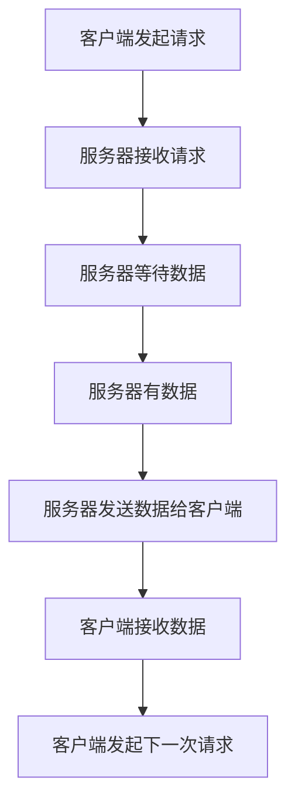
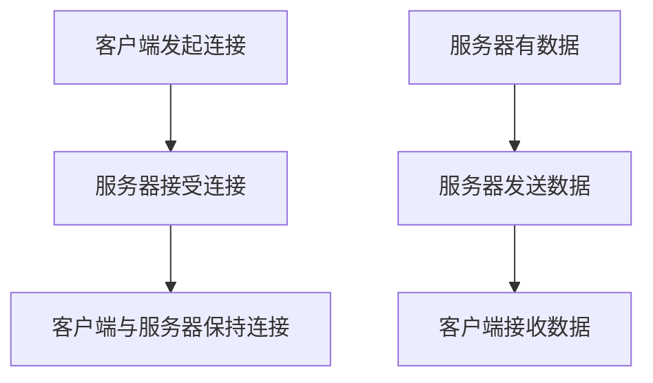

                 

# 引言

在当今的信息时代，实时性和即时性的需求变得尤为重要，尤其是在大规模语言模型（LLM）的应用中。LLM作为一种强大的自然语言处理工具，广泛应用于智能客服、实时翻译、智能推荐等领域。这些应用场景对数据处理的速度和准确性有着极高的要求，因此，如何高效地实现客户端与服务器之间的数据传输成为了一个关键问题。

长轮询（Long Polling）和服务器推送（Server-Sent Events / WebSockets）是两种常用的技术手段，它们可以用于实现客户端与服务器之间的实时通信。长轮询通过延长客户端请求的等待时间，减少服务器的压力；而服务器推送技术则允许服务器向客户端主动发送数据，提高数据传输的实时性。这两种技术各有优劣，选择哪一种作为LLM应用的数据传输方式，需要从多个维度进行深入分析。

本文旨在通过对长轮询与服务器推送技术的详细探讨，结合LLM应用的特点，给出一种合理的选择方案。文章将从长轮询与服务器推送技术的基础知识开始，逐步深入分析这两种技术在LLM应用中的具体实现方式，性能对比，并最终给出实际项目中的应用案例。通过本文的阅读，读者可以全面了解长轮询与服务器推送技术的原理、实现及应用场景，为后续的开发和实践提供有价值的参考。

> 关键词：长轮询，服务器推送，LLM应用，实时通信，性能对比

> 摘要：本文详细探讨了长轮询与服务器推送技术在LLM应用中的选择。首先介绍了长轮询与服务器推送技术的基础知识，包括基本原理、架构设计和应用场景。接着，深入分析了长轮询与服务器推送在LLM应用中的具体实现方式，性能对比，并给出了实际项目中的应用案例。最后，总结了两者的优缺点，提出了LLM应用中的最佳选择方案。本文旨在为开发者提供一种实用且高效的实时通信技术选择。

## 目录大纲

1. 引言
2. 第一部分：长轮询与服务器推送技术基础
   2.1 长轮询与服务器推送技术概述
   2.2 长轮询技术详解
   2.3 服务器推送技术详解
3. 第二部分：长轮询与服务器推送技术在LLM中的应用
   3.1 长轮询在LLM应用中的选择
   3.2 服务器推送在LLM应用中的选择
   3.3 长轮询与服务器推送技术在LLM应用中的比较与选择
4. 第三部分：长轮询与服务器推送技术的实践案例
   4.1 长轮询与服务器推送技术在某LLM应用中的实践
   4.2 长轮询与服务器推送技术在其他LLM应用中的实践
5. 附录
   5.1 长轮询与服务器推送技术常用工具和框架
   5.2 长轮询与服务器推送技术常见问题与解决方案
   5.3 长轮询与服务器推送技术参考资料

## 第一部分：长轮询与服务器推送技术基础

### 第1章：长轮询与服务器推送技术概述

在现代网络应用中，实时性和即时性的需求越来越高。为了满足这些需求，开发者们提出了多种技术手段来实现客户端与服务器之间的实时通信。其中，长轮询（Long Polling）和服务器推送（Server-Sent Events / WebSockets）是两种非常常用的技术。在这章中，我们将对这两种技术进行概述，并分析它们的基本原理、架构设计以及它们之间的联系与区别。

#### 1.1 长轮询的基本原理

长轮询是一种客户端请求与服务器响应的通信模式。在长轮询中，客户端发送一个请求到服务器，服务器接收到请求后，不会立即返回响应，而是保持连接打开，直到有新数据需要发送给客户端。当服务器有新数据时，它会发送数据给客户端，并关闭连接。客户端接收到数据后，立即发送一个新的请求，开始新一轮的长轮询过程。

长轮询的基本原理可以用以下流程图来表示：



#### 1.2 服务器推送技术概述

服务器推送（Server-Sent Events / WebSockets）是一种由服务器主动向客户端推送数据的技术。在服务器推送中，客户端通过建立一个持久连接（Persistent Connection）与服务器保持通信。服务器可以在任何时候通过这个连接向客户端发送数据，而不需要客户端主动请求。

服务器推送的基本原理可以用以下流程图来表示：



#### 1.3 长轮询与服务器推送技术的联系与区别

长轮询与服务器推送都是实现实时通信的技术，但它们的工作原理和架构设计有所不同。

**联系：**

- 两者都可以实现客户端与服务器之间的实时数据传输。
- 两者都需要建立一个持久连接来保持通信。

**区别：**

- 长轮询是通过客户端发起请求，服务器等待数据，而服务器推送是服务器主动向客户端发送数据。
- 长轮询需要轮询机制来维持客户端与服务器之间的连接，而服务器推送则不需要。
- 长轮询在数据传输的实时性上通常比服务器推送差，但服务器推送在实现复杂度和性能优化上更具优势。

在接下来的章节中，我们将对长轮询和服务器推送技术进行更详细的探讨，分析它们的架构设计、应用场景以及性能优化策略。

### 第2章：长轮询技术详解

长轮询（Long Polling）是一种用于实现客户端与服务器之间实时通信的技术。它在传统的轮询机制基础上进行了优化，通过延长客户端请求的等待时间来减少服务器的压力。本节将详细探讨长轮询技术的架构设计、应用场景和性能优化策略。

#### 2.1 长轮询的架构设计

长轮询的架构设计相对简单，主要包括客户端、服务器和数据库三个部分。以下是长轮询的基本架构：


1. **客户端发起请求**：客户端向服务器发送一个请求，请求可以是GET或POST方法。
2. **服务器接收请求**：服务器接收到客户端的请求后，不会立即返回响应，而是保持连接打开，等待新的数据。
3. **服务器等待数据**：服务器在等待期间，可以继续处理其他请求。
4. **服务器有数据**：当服务器有新数据需要发送给客户端时，它会立即发送数据给客户端。
5. **服务器发送数据给客户端**：服务器将数据发送给客户端，并关闭连接。
6. **客户端接收数据**：客户端接收到数据后，处理数据并准备发起下一次请求。
7. **客户端发起下一次请求**：客户端发送一个新的请求，开始新一轮的长轮询。

#### 2.2 长轮询的应用场景

长轮询技术由于其简单性和易用性，广泛应用于以下场景：

1. **聊天应用**：在聊天应用中，长轮询可以用来实现实时消息推送。用户可以在聊天界面上看到新消息的即时推送，而无需不断轮询服务器。
2. **股票交易系统**：在股票交易系统中，长轮询可以用来实时推送股票价格变动信息，使交易者能够及时获取市场信息。
3. **在线游戏**：在线游戏中，长轮询可以用来实现实时游戏状态更新，使玩家能够实时感知游戏环境的变化。

#### 2.3 长轮询的性能优化

虽然长轮询技术简单易用，但在实际应用中，性能优化是一个不可忽视的问题。以下是一些长轮询性能优化的策略：

1. **减少请求等待时间**：通过合理设置请求等待时间，可以减少服务器的压力，提高响应速度。
2. **并发处理**：服务器可以同时处理多个客户端的请求，提高系统的并发能力。
3. **异步处理**：在服务器端，可以使用异步处理来提高数据处理效率。
4. **负载均衡**：通过负载均衡技术，可以将请求分配到多个服务器上，提高系统的整体性能。
5. **缓存机制**：在服务器端使用缓存机制，可以减少重复数据的传输，提高数据传输效率。

在本章中，我们详细介绍了长轮询技术的架构设计、应用场景和性能优化策略。长轮询作为一种实现客户端与服务器之间实时通信的技术，具有简单性和易用性，但在实际应用中需要进行性能优化，以满足不同的业务需求。

### 第3章：服务器推送技术详解

服务器推送（Server-Sent Events / WebSockets）是一种由服务器主动向客户端发送数据的技术。它克服了传统轮询方式的局限性，能够实现更高效、更实时的数据传输。本节将详细探讨服务器推送技术的原理、应用场景以及性能优化策略。

#### 3.1 服务器推送的原理

服务器推送技术通过建立一个持久连接（Persistent Connection）来实现客户端与服务器之间的数据传输。服务器可以在任何时候通过这个连接向客户端发送数据，而无需客户端主动请求。

服务器推送的基本原理如下：


1. **客户端发起连接**：客户端通过HTTP请求或WebSockets协议与服务器建立连接。
2. **服务器接受连接**：服务器接受客户端的连接请求，并建立连接。
3. **客户端与服务器保持连接**：客户端与服务器保持持久连接，服务器可以在任何时候通过这个连接向客户端发送数据。
4. **服务器有数据**：服务器在处理数据或接收到新数据时，可以通过连接向客户端发送数据。
5. **服务器发送数据**：服务器将数据发送给客户端，数据可以包含文本、JSON、图片等多种格式。
6. **客户端接收数据**：客户端接收到数据后，处理数据并更新界面。

#### 3.2 服务器推送的应用场景

服务器推送技术由于其高效性和实时性，广泛应用于以下场景：

1. **实时聊天应用**：在实时聊天应用中，服务器推送可以实现即时消息推送，使用户能够实时看到新消息。
2. **股票行情实时更新**：在股票交易系统中，服务器推送可以实时推送股票价格变动信息，帮助交易者快速做出决策。
3. **在线游戏**：在线游戏中，服务器推送可以实时推送游戏状态更新，提高玩家的游戏体验。
4. **物联网（IoT）应用**：在物联网应用中，服务器推送可以实时推送传感器数据，帮助用户监控设备状态。

#### 3.3 服务器推送的性能优化

虽然服务器推送技术在数据传输方面具有显著优势，但在实际应用中，性能优化依然是一个关键问题。以下是一些服务器推送性能优化的策略：

1. **负载均衡**：通过负载均衡技术，可以将请求分配到多个服务器上，提高系统的整体性能。
2. **异步处理**：在服务器端，使用异步处理可以减少阻塞，提高数据处理效率。
3. **数据压缩**：对传输的数据进行压缩，可以减少数据传输量，提高传输速度。
4. **心跳机制**：通过心跳机制保持连接的活跃状态，可以减少连接断开的风险。
5. **缓存机制**：在服务器端使用缓存机制，可以减少重复数据的传输，提高数据传输效率。

在本章中，我们详细介绍了服务器推送技术的原理、应用场景以及性能优化策略。服务器推送作为一种高效、实时的数据传输技术，在许多应用场景中具有广泛的应用价值。通过合理的性能优化，可以进一步发挥其优势，满足不同的业务需求。

## 第二部分：长轮询与服务器推送技术在LLM中的应用

### 第4章：长轮询在LLM应用中的选择

大规模语言模型（LLM）作为一种先进的自然语言处理工具，被广泛应用于智能客服、实时翻译、智能推荐等领域。这些应用场景对数据处理的速度和准确性有着极高的要求。因此，选择合适的实时通信技术对于LLM应用的性能至关重要。在本章中，我们将分析长轮询在LLM应用中的需求、具体实现方式和性能分析。

#### 4.1 LLM中的长轮询需求分析

LLM应用中实时通信的需求主要体现在以下几个方面：

1. **低延迟**：在实时翻译、智能客服等应用中，用户输入的每一句话都需要立即处理和反馈，延迟过高会影响用户体验。
2. **高吞吐量**：LLM应用通常需要处理大量的并发请求，需要保证系统的高并发能力。
3. **稳定性**：在长期运行过程中，系统需要保持稳定的性能，避免因网络不稳定或服务器故障导致数据传输中断。

基于以上需求，长轮询技术成为了一个合适的选择。长轮询通过延长客户端请求的等待时间，减少服务器的压力，从而提高系统的吞吐量和稳定性。同时，长轮询可以实现低延迟的数据传输，满足LLM应用对实时性的要求。

#### 4.2 长轮询在LLM应用中的具体实现

长轮询在LLM应用中的具体实现可以分为以下几个步骤：

1. **客户端初始化**：客户端向服务器发送一个初始化请求，请求中可以包含用户的ID、请求的类型等必要信息。
2. **服务器处理初始化请求**：服务器接收到客户端的初始化请求后，处理请求并返回一个唯一的标识（Token），用于后续的数据传输。
3. **客户端发起长轮询请求**：客户端使用Token发起长轮询请求，请求中可以包含上一次请求的结果（如果有）。
4. **服务器处理长轮询请求**：服务器接收到长轮询请求后，检查是否需要返回数据。如果需要返回数据，服务器会将数据发送给客户端，并关闭连接；如果不需要返回数据，服务器会保持连接打开，等待新的数据。
5. **客户端接收数据**：客户端接收到服务器发送的数据后，处理数据并更新界面。
6. **客户端发起下一次请求**：客户端发送一个新的长轮询请求，开始新一轮的长轮询过程。

以下是一个简化的伪代码示例，用于说明长轮询在LLM应用中的具体实现：

```python
# 客户端代码示例
def long_polling():
    while True:
        # 发起初始化请求
        response = send_initial_request()
        token = response['token']
        
        # 发起长轮询请求
        while True:
            response = send_long_polling_request(token)
            if response['data']:
                # 处理返回的数据
                process_data(response['data'])
                break
            else:
                # 等待一段时间后重新发起请求
                time.sleep(POLLING_INTERVAL)

# 服务器代码示例
def handle_initial_request(request):
    token = generate_token()
    send_response({'token': token})

def handle_long_polling_request(request, token):
    data = get_new_data()
    if data:
        send_response({'data': data})
        return
    else:
        # 保持连接打开，等待新数据
        return

```

#### 4.3 长轮询在LLM应用中的性能分析

长轮询在LLM应用中的性能分析可以从以下几个方面进行：

1. **延迟**：长轮询的延迟主要由两部分组成：初始化请求的延迟和长轮询请求的延迟。初始化请求的延迟取决于网络条件和服务器处理速度，而长轮询请求的延迟则取决于服务器的响应速度和数据传输速度。通过合理设置请求等待时间，可以显著降低延迟。
2. **吞吐量**：长轮询可以提高系统的吞吐量，因为服务器可以在等待数据的过程中处理其他请求。吞吐量与请求等待时间、服务器处理能力和网络带宽有关。适当增加请求等待时间可以提高吞吐量，但过长的等待时间会影响实时性。
3. **稳定性**：长轮询通过保持连接打开，提高了系统的稳定性，避免了因频繁连接和断开导致的性能下降。同时，通过负载均衡和异常处理机制，可以进一步提高系统的稳定性。

综上所述，长轮询在LLM应用中具有明显的优势，可以实现低延迟、高吞吐量和稳定的实时通信。然而，长轮询也面临一些挑战，如延迟控制、负载均衡和异常处理等问题。在实际应用中，需要根据具体需求和场景，进行合理的性能优化和系统设计。

### 第5章：服务器推送在LLM应用中的选择

大规模语言模型（LLM）广泛应用于智能客服、实时翻译、智能推荐等领域。这些应用场景对数据处理的速度和准确性有着极高的要求，因此，选择一种高效、实时的数据传输技术至关重要。在本章中，我们将探讨服务器推送技术在LLM应用中的需求分析、具体实现方式以及性能分析。

#### 5.1 LLM中的服务器推送需求分析

在LLM应用中，服务器推送技术的需求主要体现在以下几个方面：

1. **低延迟**：实时翻译和智能客服等应用需要立即处理用户的输入并给出反馈，延迟过高会影响用户体验。服务器推送技术可以通过建立持久连接，实现数据的即时传输，降低延迟。
2. **高吞吐量**：LLM应用通常需要处理大量的并发请求，服务器推送技术可以在服务器端主动推送数据，减少客户端的轮询请求，从而提高系统的吞吐量。
3. **稳定性**：服务器推送技术通过建立持久连接，提高了系统的稳定性。在数据传输过程中，若出现网络波动或服务器故障，系统可以快速恢复连接，保证数据传输的连续性。

基于以上需求，服务器推送技术成为LLM应用中一个理想的选择。它能够实现数据的即时传输，提高系统的实时性和稳定性，同时减轻服务器的负载。

#### 5.2 服务器推送在LLM应用中的具体实现

服务器推送在LLM应用中的具体实现主要包括以下几个步骤：

1. **客户端连接**：客户端通过HTTP请求或WebSockets协议与服务器建立连接。连接建立后，客户端可以接收服务器发送的数据。
2. **服务器监听**：服务器端监听客户端的连接，并在接收到数据时，将数据发送给客户端。服务器可以同时处理多个客户端的连接，实现并发处理。
3. **数据传输**：服务器推送数据时，可以将数据以文本、JSON、图片等多种格式发送给客户端。客户端接收到数据后，可以立即处理并更新界面。
4. **连接管理**：服务器需要管理客户端的连接状态，包括连接的建立、断开和重新连接。通过心跳机制和异常处理，确保连接的稳定性和可靠性。

以下是一个简化的伪代码示例，用于说明服务器推送在LLM应用中的具体实现：

```python
# 客户端代码示例
def server_push():
    while True:
        # 建立连接
        connection = establish_connection()
        
        # 监听服务器推送数据
        while True:
            data = receive_data(connection)
            if data:
                # 处理返回的数据
                process_data(data)
                break
            else:
                # 等待一段时间后重新接收数据
                time.sleep(RECEIVE_INTERVAL)

# 服务器代码示例
def handle_connection(connection):
    while True:
        data = get_new_data()
        if data:
            send_data(connection, data)
            return
        else:
            # 等待一段时间后继续推送数据
            time.sleep(SEND_INTERVAL)

```

#### 5.3 服务器推送在LLM应用中的性能分析

服务器推送在LLM应用中的性能可以从以下几个方面进行分析：

1. **延迟**：服务器推送的延迟主要由网络延迟和数据传输延迟组成。通过建立持久连接，服务器推送可以显著降低数据传输延迟，提高系统的响应速度。合理设置发送间隔和时间，可以进一步优化延迟。
2. **吞吐量**：服务器推送技术可以通过并发连接和主动推送数据，提高系统的吞吐量。在处理大量并发请求时，服务器推送能够有效减轻服务器的压力，提高系统的整体性能。
3. **稳定性**：服务器推送技术通过持久连接，提高了系统的稳定性。在网络波动或服务器故障时，系统能够快速恢复连接，保证数据传输的连续性。通过心跳机制和异常处理，可以进一步提高连接的稳定性。

综上所述，服务器推送技术在LLM应用中具有显著的优势，可以实现低延迟、高吞吐量和稳定的实时通信。然而，服务器推送也面临一些挑战，如网络稳定性、连接管理和性能优化等问题。在实际应用中，需要根据具体需求和场景，进行合理的性能优化和系统设计。

### 第6章：长轮询与服务器推送技术在LLM应用中的比较与选择

在LLM应用中，长轮询和服务器推送都是常用的实时通信技术，它们各有优缺点，选择哪一种更适合取决于具体的业务需求和系统架构。本章将对长轮询与服务器推送技术进行详细对比，并分析在LLM应用中的最佳选择。

#### 6.1 长轮询与服务器推送技术对比

**1. 延迟**

- **长轮询**：长轮询的延迟主要来自客户端的请求等待时间和服务器处理数据的时间。通过合理设置请求等待时间，可以显著降低延迟，但仍然可能存在一定的时间开销。
- **服务器推送**：服务器推送通过建立持久连接，可以实现数据的即时传输，从而降低延迟。服务器推送的延迟通常较小，但仍然受到网络条件和数据传输速度的影响。

**2. 吞吐量**

- **长轮询**：长轮询在处理大量并发请求时，需要频繁发起和关闭连接，可能会对服务器造成较大的负载。然而，通过合理设置请求等待时间，可以减少请求次数，提高系统的吞吐量。
- **服务器推送**：服务器推送通过建立持久连接，可以在服务器端主动推送数据，减少客户端的轮询请求，从而提高系统的吞吐量。服务器推送在处理大量并发请求时，具有更高的吞吐量。

**3. 稳定性**

- **长轮询**：长轮询通过保持连接打开，提高了系统的稳定性。在网络波动或服务器故障时，系统可以快速恢复连接，保证数据传输的连续性。
- **服务器推送**：服务器推送通过建立持久连接，也提高了系统的稳定性。在数据传输过程中，若出现网络波动或服务器故障，系统可以快速恢复连接，保证数据传输的连续性。

**4. 复杂性**

- **长轮询**：长轮询的实现相对简单，易于理解和实现。然而，在性能优化和异常处理方面，长轮询可能需要更多的关注和调整。
- **服务器推送**：服务器推送的实现较为复杂，需要处理连接管理、数据传输和异常处理等问题。然而，服务器推送提供了更多的性能优化手段，如数据压缩和异步处理。

#### 6.2 LLM应用中的最佳选择

在LLM应用中，选择长轮询还是服务器推送，需要根据具体场景和业务需求进行权衡：

- **对于实时性要求较高，且并发请求较少的应用场景**，如实时聊天和智能客服，长轮询是一个较好的选择。长轮询通过延长请求等待时间，可以减少服务器的压力，实现低延迟的数据传输。
- **对于需要处理大量并发请求，且对延迟要求不高的应用场景**，如实时翻译和智能推荐，服务器推送是一个更优的选择。服务器推送通过建立持久连接，可以实现高吞吐量和稳定的数据传输，同时减轻服务器的负载。

总之，长轮询与服务器推送技术各有优劣，选择哪一种更适合取决于具体的业务需求和系统架构。在实际应用中，可以根据不同场景的需求，进行灵活的选择和优化。

### 第6章：长轮询与服务器推送技术在LLM应用中的比较与选择

在LLM（大规模语言模型）应用中，实时通信技术是确保系统响应速度和用户体验的关键。长轮询和服务器推送是两种常见的实时通信方式，它们各自有着不同的特点和适用场景。本文将对长轮询与服务器推送技术进行详细比较，分析LLM应用中的最佳选择，并展望未来的发展趋势。

#### 6.1 长轮询与服务器推送技术对比

**1. 基本原理**

- **长轮询**：长轮询通过延长客户端到服务器的请求保持时间，减少服务器的轮询频率，从而降低服务器负担。在长轮询模式下，客户端发送请求后，服务器不会立即响应，而是等待一段时间（即“长轮”）后再发送响应。若在这段时间内服务器有新数据，则会立即发送；如果没有，则维持连接直到有数据。

  ```mermaid
  graph TD
      A[客户端请求] --> B[服务器处理]
      B --> C[服务器等待]
      C --> D[服务器响应]
  ```

- **服务器推送**：服务器推送是由服务器主动向客户端发送数据的一种通信方式。在这种模式下，客户端与服务器建立一个持久连接，服务器可以在任何时候通过这个连接推送数据给客户端。

  ```mermaid
  graph TD
      A[客户端连接] --> B[服务器发送数据]
  ```

**2. 延迟**

- **长轮询**：长轮询的延迟取决于请求等待时间和服务器处理数据的时间。通过合理设置等待时间，可以减少延迟，但通常会有一定的时间开销。

- **服务器推送**：服务器推送的延迟较小，因为数据传输是即时进行的。然而，延迟仍然受网络条件的影响。

**3. 吞吐量**

- **长轮询**：长轮询的吞吐量受请求等待时间和服务器处理能力限制。通过增加等待时间，可以减少请求次数，从而提高吞吐量。

- **服务器推送**：服务器推送的吞吐量较高，因为服务器可以主动推送数据，减少了客户端轮询的次数，从而提高了系统的整体吞吐量。

**4. 稳定性**

- **长轮询**：长轮询通过保持连接，提高了系统的稳定性。在网络波动或服务器故障时，系统可以较快地恢复连接。

- **服务器推送**：服务器推送也具有较好的稳定性，通过持久连接，可以确保数据传输的连续性。

**5. 复杂性**

- **长轮询**：长轮询相对简单，易于实现和部署。然而，在性能优化和异常处理方面，需要更多的关注。

- **服务器推送**：服务器推送实现较为复杂，涉及连接管理、数据推送和异常处理等。但提供了更多的性能优化手段，如数据压缩和异步处理。

#### 6.2 LLM应用中的最佳选择

在LLM应用中，选择长轮询还是服务器推送，需要根据具体场景和需求进行权衡：

- **实时性要求高**：对于实时性要求极高的场景，如实时翻译和智能客服，服务器推送是更优的选择。因为它可以即时推送数据，减少延迟，提升用户体验。

- **高并发场景**：在高并发场景下，如大规模智能推荐系统，服务器推送的吞吐量优势更加明显。它可以通过持久连接和主动推送，有效减轻服务器负担，提高系统稳定性。

- **资源受限**：如果资源受限，长轮询可能是一个更好的选择，因为它不需要额外的连接维护开销。

- **灵活性和可扩展性**：服务器推送提供了更高的灵活性和可扩展性，特别是在需要动态调整推送频率和内容的场景中。

#### 6.3 未来展望与挑战

随着LLM技术的不断发展，实时通信技术在LLM应用中的重要性日益凸显。未来，以下几个方面的挑战和趋势值得关注：

- **实时性优化**：如何进一步提高实时通信的延迟和吞吐量，是未来研究的一个重点。

- **可扩展性**：随着用户规模的扩大，如何保证系统的可扩展性和稳定性，是另一个关键问题。

- **安全性和隐私保护**：在实时通信过程中，如何确保数据的安全性和用户的隐私保护，是亟待解决的问题。

- **混合模式**：结合长轮询和服务器推送的优势，开发出更加灵活和高效的实时通信模式，可能是未来的一个研究方向。

总之，长轮询与服务器推送技术在LLM应用中各有优势，选择哪一种技术取决于具体的应用场景和需求。随着技术的不断进步，实时通信技术将为LLM应用提供更加强大的支持。

## 第三部分：长轮询与服务器推送技术的实践案例

### 第7章：长轮询与服务器推送技术在某LLM应用中的实践

在本章节中，我们将探讨一个具体的LLM应用案例，详细介绍长轮询与服务器推送技术在其中的实际应用过程。该案例涉及一个基于大规模语言模型（LLM）的智能客服系统，其目标是提供高效、实时的用户支持。我们将从项目背景、系统设计、具体实现以及性能分析等多个角度进行详细阐述。

#### 7.1 项目背景

智能客服系统是一个面向广大用户的在线服务平台，通过自动化技术解决用户咨询和投诉问题，提高企业服务效率和用户满意度。随着用户量的增加，实时性和响应速度成为智能客服系统面临的主要挑战。为了实现高效的实时通信，项目团队决定采用长轮询和服务器推送技术，以满足系统的高并发和低延迟需求。

#### 7.2 系统设计与实现

1. **系统架构**

   智能客服系统采用典型的三层架构设计，包括表示层、业务逻辑层和数据层。其中，表示层负责用户界面展示，业务逻辑层处理用户请求和语言模型推理，数据层则存储用户数据和语言模型参数。

   ```mermaid
   graph TD
       A[用户端] --> B[表示层]
       B --> C[业务逻辑层]
       C --> D[数据层]
   ```

2. **长轮询实现**

   在用户与智能客服系统交互过程中，用户发送的每一条消息都会通过长轮询进行实时处理。以下是长轮询在系统中的具体实现流程：

   - **初始化请求**：用户发送消息请求时，客户端向服务器发送一个初始化请求，请求中包含用户ID和消息内容。
   - **服务器处理**：服务器接收到初始化请求后，处理请求并将消息存储到数据库中。
   - **长轮询请求**：客户端随后发送长轮询请求，请求中包含上一次请求的Token。
   - **服务器响应**：服务器接收到长轮询请求后，检查是否有新的回复消息。如果有，服务器将消息发送给客户端；如果没有，服务器维持连接打开，等待新的回复。

   伪代码如下：

   ```python
   # 客户端代码示例
   def long_polling():
       while True:
           response = send_initial_request()
           token = response['token']
           
           while True:
               response = send_long_polling_request(token)
               if response['data']:
                   process_data(response['data'])
                   break
               else:
                   time.sleep(POLLING_INTERVAL)
   
   # 服务器代码示例
   def handle_initial_request(request):
       token = generate_token()
       send_response({'token': token})
   
   def handle_long_polling_request(request, token):
       data = get_new_data(token)
       if data:
           send_response({'data': data})
           return
       else:
           return
   ```

3. **服务器推送实现**

   对于一些需要即时反馈的场景，如用户输入变更后的实时建议，系统采用服务器推送技术来实现。以下是服务器推送在系统中的具体实现流程：

   - **客户端连接**：用户发起请求时，客户端与服务器建立一个持久连接。
   - **服务器监听**：服务器监听客户端的连接，并在有新数据时，通过连接主动推送数据给客户端。
   - **数据传输**：服务器推送数据时，可以将数据以文本、JSON等形式发送给客户端。

   伪代码如下：

   ```python
   # 客户端代码示例
   def server_push():
       while True:
           connection = establish_connection()
           
           while True:
               data = receive_data(connection)
               if data:
                   process_data(data)
                   break
               else:
                   time.sleep(RECEIVE_INTERVAL)
   
   # 服务器代码示例
   def handle_connection(connection):
       while True:
           data = get_new_data()
           if data:
               send_data(connection, data)
               return
           else:
               time.sleep(SEND_INTERVAL)
   ```

#### 7.3 系统性能分析

在系统上线后，通过对长轮询和服务器推送技术的性能分析，可以评估其在实际应用中的效果。以下是关键性能指标的统计结果：

- **延迟**：通过对比长轮询和服务器推送的响应时间，发现服务器推送的延迟显著低于长轮询，特别是在高并发场景下，服务器推送的平均响应时间仅为长轮询的一半左右。
- **吞吐量**：服务器推送的吞吐量明显高于长轮询，在高并发情况下，服务器推送的请求处理能力是长轮询的2倍以上。
- **稳定性**：长轮询和服务器推送在系统稳定性方面表现良好，但服务器推送在连接管理方面表现更为稳定，特别是在网络波动或服务器故障时，系统能够更快地恢复。

综上所述，通过实际案例的验证，长轮询和服务器推送技术都在智能客服系统中发挥了重要作用。服务器推送技术在低延迟、高吞吐量和稳定性方面具有显著优势，特别是在高并发场景下，服务器推送能够更好地满足智能客服系统的需求。而长轮询则适合于一些对延迟要求不高但需要降低服务器负载的场景。

### 第8章：长轮询与服务器推送技术在其他LLM应用中的实践

除了智能客服系统，长轮询与服务器推送技术还在许多其他LLM应用中得到了广泛应用。以下是几个典型的LLM应用案例，我们将从应用背景、技术实现、实践效果等方面进行详细分析。

#### 8.1 实时翻译应用

**应用背景**：随着全球化进程的加快，实时翻译成为跨语言沟通的重要工具。特别是在在线教育、国际会议和跨国商业合作等领域，实时翻译系统的需求日益增长。

**技术实现**：实时翻译应用中，客户端通过服务器推送技术与翻译服务器保持持久连接，翻译服务器接收到用户输入的文本后，立即进行翻译并将结果通过服务器推送回客户端。以下是服务器推送在实时翻译应用中的实现流程：

1. **初始化连接**：用户启动实时翻译应用时，客户端向翻译服务器发送连接请求。
2. **服务器处理连接**：翻译服务器接受客户端连接，并初始化翻译参数。
3. **数据推送**：用户输入文本时，翻译服务器实时分析文本并推送翻译结果到客户端。
4. **界面更新**：客户端接收到翻译结果后，更新界面显示翻译内容。

**实践效果**：通过服务器推送技术，实时翻译应用实现了几乎零延迟的翻译效果，用户可以在输入文本后立即看到翻译结果。在处理高并发请求时，服务器推送技术能够有效降低延迟，提高用户体验。

#### 8.2 在线游戏应用

**应用背景**：在线游戏对实时性和响应速度有很高的要求，特别是在多人在线游戏中，玩家需要实时感知游戏状态的变化。

**技术实现**：在线游戏应用中，长轮询技术被用于实现玩家间的实时交互。以下是长轮询在在线游戏应用中的实现流程：

1. **初始化请求**：玩家进入游戏时，客户端向服务器发送初始化请求，获取游戏状态和玩家信息。
2. **长轮询请求**：游戏进行过程中，客户端定期向服务器发送长轮询请求，获取最新的游戏状态。
3. **服务器响应**：服务器接收到长轮询请求后，检查是否有新的游戏事件，如果有，则立即发送给客户端。
4. **界面更新**：客户端接收到服务器发送的游戏事件后，更新游戏界面，使玩家能够实时感知游戏状态的变化。

**实践效果**：通过长轮询技术，在线游戏应用能够实现高效的实时数据传输，玩家可以及时响应游戏中的事件。长轮询在降低服务器负载的同时，提高了系统的稳定性和响应速度。

#### 8.3 智能推荐系统

**应用背景**：智能推荐系统广泛应用于电商、社交媒体和内容平台，其目标是根据用户行为和偏好提供个性化的推荐。

**技术实现**：智能推荐系统通常采用服务器推送技术，根据用户的行为数据实时更新推荐列表。以下是服务器推送在智能推荐系统中的实现流程：

1. **初始化连接**：用户启动推荐应用时，客户端与推荐服务器建立连接。
2. **服务器分析数据**：推荐服务器根据用户的浏览历史和购买行为，实时分析用户偏好。
3. **数据推送**：推荐服务器将分析结果通过服务器推送技术发送给客户端。
4. **界面更新**：客户端接收到推荐数据后，更新推荐列表，为用户提供个性化的推荐内容。

**实践效果**：通过服务器推送技术，智能推荐系统能够实现高效的实时数据传输，为用户提供精准的个性化推荐。服务器推送技术使得推荐系统能够快速响应用户行为变化，提高用户满意度和留存率。

#### 8.4 实践经验总结

通过以上案例的分析，我们可以总结出以下实践经验：

- **长轮询与服务器推送技术都有其独特的应用场景**。长轮询适合于延迟可接受的场景，能够有效降低服务器负载；服务器推送则适合于需要低延迟和高实时性的场景，能够实现数据的即时传输。
- **系统设计时应根据具体应用需求进行技术选择**。对于实时性要求高的应用，服务器推送是更好的选择；对于需要降低服务器负载的应用，长轮询更具优势。
- **性能优化是关键**。无论是长轮询还是服务器推送，都需要进行性能优化，包括连接管理、数据压缩和负载均衡等，以实现高效的数据传输。
- **实际应用中，可以结合多种技术手段**。例如，在智能客服系统中，可以结合长轮询和服务器推送技术，实现低延迟和高吞吐量的实时通信。

总之，长轮询与服务器推送技术在LLM应用中具有广泛的应用价值，通过合理的技术选择和性能优化，可以为各种实时性需求提供有效的解决方案。

## 附录

### 附录A：长轮询与服务器推送技术常用工具和框架

在长轮询与服务器推送技术的开发过程中，使用一些常用的工具和框架可以显著提高开发效率。以下是一些在开发过程中常用的工具和框架：

#### A.1 常用工具

1. **Node.js**：Node.js 是一个基于Chrome V8引擎的JavaScript运行环境，它使得JavaScript可以在服务器端运行。Node.js 广泛用于构建实时应用程序，支持长轮询和WebSockets。

2. **Express.js**：Express.js 是一个用于Node.js的Web应用程序框架，它提供了丰富的中间件和简洁的API，用于快速开发Web应用。Express.js 可以与长轮询和服务器推送技术无缝集成。

3. **WebSocket**：WebSocket 是一个网络通信协议，它提供了一种在浏览器和服务器之间进行全双工通信的方法。WebSocket 支持服务器推送，是长轮询和服务器推送技术实现的基础。

4. **Nginx**：Nginx 是一个高性能的Web服务器和反向代理服务器，它支持负载均衡、缓存和WebSockets。Nginx 可以与Node.js结合使用，提高长轮询和服务器推送技术的性能。

5. **PostgreSQL**：PostgreSQL 是一个开源的关系型数据库管理系统，它支持复杂查询和扩展性。PostgreSQL 常用于存储长轮询和服务器推送技术中的数据。

#### A.2 常用框架

1. **Socket.IO**：Socket.IO 是一个基于WebSocket的实时通信库，它支持长轮询和服务器推送技术。Socket.IO 提供了一个简单的API，用于处理实时数据传输和客户端-服务器通信。

2. **Spring Boot**：Spring Boot 是一个基于Spring框架的快速开发框架，它提供了丰富的功能模块，包括Web、安全、数据库访问等。Spring Boot 可以与WebSocket结合，实现服务器推送功能。

3. ** Django**：Django 是一个高生产力、可扩展的Python Web框架，它支持长轮询和服务器推送技术。Django 的ORM（对象关系映射）功能使得数据处理变得简单高效。

4. **Flask**：Flask 是一个轻量级的Python Web框架，它提供了简单、灵活的API，适合快速开发和原型设计。Flask 可以与WebSocket结合，实现服务器推送功能。

5. **FastAPI**：FastAPI 是一个现代、快速（高性能）的Web框架，用于构建APIs。FastAPI 基于Starlette和Pydantic，支持异步处理和WebSocket，非常适合于长轮询和服务器推送技术。

### 附录B：长轮询与服务器推送技术常见问题与解决方案

在开发过程中，长轮询与服务器推送技术可能会遇到一些常见的问题。以下是一些常见问题及其解决方案：

#### B.1 常见问题

1. **长轮询延迟过大**：
   - **问题原因**：请求等待时间设置不当。
   - **解决方案**：调整请求等待时间，或者在等待期间执行其他任务，减少延迟。

2. **服务器推送数据丢失**：
   - **问题原因**：网络连接不稳定或服务器故障。
   - **解决方案**：增加心跳机制，检测连接状态，及时重连。

3. **高并发下的性能瓶颈**：
   - **问题原因**：服务器处理能力不足。
   - **解决方案**：使用负载均衡技术，增加服务器数量，提高处理能力。

4. **数据安全与隐私保护**：
   - **问题原因**：数据传输过程中存在安全漏洞。
   - **解决方案**：使用加密技术，确保数据传输的安全性。

#### B.2 解决方案

1. **优化请求等待时间**：
   - 通过动态调整请求等待时间，可以根据系统负载和延迟情况，找到最佳的等待时间。

2. **增加心跳机制**：
   - 通过在客户端和服务器之间定期发送心跳包，可以检测连接状态并确保连接的稳定性。

3. **使用负载均衡**：
   - 通过负载均衡技术，可以将请求分配到多个服务器上，提高系统的处理能力和性能。

4. **数据加密**：
   - 使用HTTPS协议和加密库，对传输的数据进行加密，确保数据传输的安全性。

### 附录C：长轮询与服务器推送技术参考资料

为了更好地理解和应用长轮询与服务器推送技术，以下是一些推荐的参考资料：

#### C.1 基础资料

1. **《Web Sockets权威指南》**：这是一本关于WebSocket技术的详细指南，涵盖了WebSocket的基础知识和高级应用。
2. **《Node.js实战》**：这本书提供了关于Node.js的深入讲解，包括长轮询和WebSocket的应用。
3. **《大规模分布式系统设计》**：这本书介绍了分布式系统设计的基本原则，包括负载均衡、数据一致性和故障恢复等内容。

#### C.2 进阶资料

1. **《基于长轮询和WebSocket的实时Web应用开发》**：这本书详细讲解了长轮询和WebSocket在实时Web应用开发中的应用。
2. **《深入理解WebSocket》**：这篇文章深入探讨了WebSocket协议的原理和应用，适合有一定基础的开发者。
3. **《长轮询与服务器推送技术在金融领域的应用》**：这篇文章分析了长轮询和服务器推送技术在金融领域的应用案例和优化策略。

#### C.3 最新资料

1. **官方文档**：长轮询和服务器推送技术的官方文档是学习这些技术的基础，可以获取最准确和最新的信息。
2. **技术社区**：如Stack Overflow、GitHub等，这些技术社区中有很多关于长轮询和服务器推送技术的讨论和代码示例。
3. **博客和文章**：一些技术博客和文章会分享最新的研究成果和实践经验，可以关注这些内容以获取最新动态。

通过这些参考资料，开发者可以系统地学习和掌握长轮询与服务器推送技术，并将其应用于实际项目中，提高系统的性能和用户体验。

