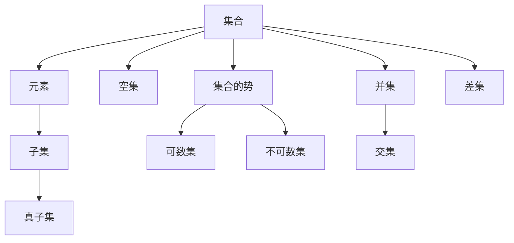

                 

### 集合论导引：添加单个科恩实数

> **关键词**：集合论、科恩实数、实数集合、数学基础、定理证明、算法设计

> **摘要**：本文将深入探讨集合论中的基础概念，特别是实数集合及其扩展——科恩实数。通过逐步分析，我们将理解集合论的基本术语和概念，探讨集合的运算及其应用，并揭示集合论在数学分析和计算机科学中的深远影响。文章将特别聚焦于如何通过添加单个科恩实数来扩展实数集合，从而探索这一过程的数学原理和算法实现。

#### 第一部分：集合论基础知识

##### 第1章：集合论概述

**1.1 集合论的定义与历史**

集合论是数学的一个基础分支，它涉及对象集合的抽象概念及其性质。集合论的发展可以追溯到19世纪末，由德国数学家乔治·康托尔（Georg Cantor）开创。康托尔首次提出了集合的概念，并研究了无穷集合的性质，开创了数学中关于无穷的大讨论。

集合论的定义非常基本，但至关重要：集合是由确定性的元素组成的整体。一个集合可以是有序的，也可以是无序的，分别称为序列和集合。康托尔的贡献在于他提出了无穷集合的概念，并证明了无穷集合之间存在不同的“大小”。

**1.2 集合论在数学中的地位与作用**

集合论在数学中的地位不可动摇。它不仅为数学提供了一个基础框架，还为解决各种数学问题提供了强大的工具。集合论的概念被广泛应用于数学的各个分支，包括数论、代数、拓扑学、分析学等。通过集合论，数学家能够更清晰地定义和探讨数学结构，如群、环、域等。

**1.3 集合论的基本术语和概念**

在集合论中，有几个基本术语和概念非常重要：

- **集合（Set）**：由确定的元素组成的整体。
- **元素（Element）**：集合中的个体。
- **空集（Empty Set）**：不包含任何元素的集合，记作∅或{}。
- **子集（Subset）**：一个集合A是另一个集合B的子集，当且仅当A中的所有元素都属于B。
- **真子集（Proper Subset）**：一个集合A是另一个集合B的真子集，当且仅当A是B的子集但A不等于B。
- **集合的势（Cardinality）**：集合中元素的数量，分为可数集和不可数集。
- **集合的并集（Union）**：两个或多个集合的并集是由这些集合的所有元素组成的集合。
- **集合的交集（Intersection）**：两个或多个集合的交集是由同时属于这些集合的所有元素组成的集合。
- **集合的差集（Difference）**：两个集合的差集是由属于第一个集合但不同时属于第二个集合的元素组成的集合。

这些基本术语和概念构成了集合论的核心，为后续的讨论和证明提供了坚实的基础。

**Mermaid 流程图：集合论的基本术语和概念**



**核心概念与联系**

集合论中的概念紧密相连，形成了复杂的网络。例如，集合的势决定了集合的大小，而并集、交集和差集则定义了集合之间的相互作用。通过上述Mermaid流程图，我们可以直观地看到这些概念之间的联系。

**核心算法原理讲解**

集合论中的运算本质上是一种集合的变换，这些变换可以通过算法来实现。以下是集合论中基本运算的伪代码：

```python
def union(A, B):
    """计算集合A和B的并集"""
    result = A.copy()
    for element in B:
        if element not in result:
            result.append(element)
    return result

def intersection(A, B):
    """计算集合A和B的交集"""
    result = []
    for element in A:
        if element in B:
            result.append(element)
    return result

def difference(A, B):
    """计算集合A和B的差集"""
    result = []
    for element in A:
        if element not in B:
            result.append(element)
    return result
```

这些伪代码展示了集合论中的基本运算是如何通过算法实现的。通过这些算法，我们可以有效地操作集合，解决复杂的数学问题。

##### 第2章：集合的基本运算

**2.1 并集与交集**

并集和交集是集合论中最基本的运算，它们定义了集合之间的合并和重叠关系。

**2.1.1 并集的定义与运算**

并集是由两个或多个集合的所有元素组成的集合。如果A和B是两个集合，则它们的并集记作A ∪ B。并集运算具有以下性质：

- 交换律：A ∪ B = B ∪ A
- 结合律：(A ∪ B) ∪ C = A ∪ (B ∪ C)
- 包含律：A ⊆ (A ∪ B)

并集的运算可以通过上述伪代码中的`union`函数实现。

**2.1.2 交集的定义与运算**

交集是由同时属于两个或多个集合的所有元素组成的集合。如果A和B是两个集合，则它们的交集记作A ∩ B。交集运算具有以下性质：

- 交换律：A ∩ B = B ∩ A
- 结合律：(A ∩ B) ∩ C = A ∩ (B ∩ C)
- 分配律：A ∩ (B ∪ C) = (A ∩ B) ∪ (A ∩ C)

交集的运算可以通过上述伪代码中的`intersection`函数实现。

**2.2 差集与对称差**

差集和对称差是描述集合之间差异的重要运算。

**2.2.1 差集的定义与运算**

差集是由属于第一个集合但不同时属于第二个集合的元素组成的集合。如果A和B是两个集合，则它们的差集记作A - B。差集运算具有以下性质：

- 交换律：A - B = B - A
- 结合律：(A - B) - C = A - (B ∪ C)

差集的运算可以通过上述伪代码中的`difference`函数实现。

**2.2.2 对称差的定义与运算**

对称差是由属于A或B，但不同时属于A和B的元素组成的集合。如果A和B是两个集合，则它们的对称差记作A Δ B。对称差运算具有以下性质：

- 交换律：A Δ B = B Δ A
- 结合律：(A Δ B) Δ C = A Δ (B Δ C)
- 分配律：A Δ (B ∪ C) = (A Δ B) ∪ (A Δ C)

对称差的运算可以通过以下伪代码实现：

```python
def symmetric_difference(A, B):
    """计算集合A和B的对称差"""
    return union(difference(A, B), difference(B, A))
```

**核心算法原理讲解**

并集、交集、差集和对称差这些运算在算法设计中具有重要作用。例如，在图论中的图算法中，集合的运算被用于表示图的顶点和边的关系。以下是一个使用伪代码实现的图顶点集合和边集合的并集、交集和差集的示例：

```python
def graph_union(vertices_A, edges_A, vertices_B, edges_B):
    """计算两个图的顶点和边集合的并集"""
    result_vertices = union(vertices_A, vertices_B)
    result_edges = union(edges_A, edges_B)
    return result_vertices, result_edges

def graph_intersection(vertices_A, edges_A, vertices_B, edges_B):
    """计算两个图的顶点和边集合的交集"""
    result_vertices = intersection(vertices_A, vertices_B)
    result_edges = intersection(edges_A, edges_B)
    return result_vertices, result_edges

def graph_difference(vertices_A, edges_A, vertices_B, edges_B):
    """计算两个图的顶点和边集合的差集"""
    result_vertices = difference(vertices_A, vertices_B)
    result_edges = difference(edges_A, edges_B)
    return result_vertices, result_edges
```

通过这些算法，我们可以有效地合并、交集和差分图的数据结构，为图算法的优化提供支持。

**项目实战：集合运算在实际项目中的应用**

在实际项目中，集合运算被广泛应用于数据分析和算法设计中。以下是一个实际项目中的示例：

**项目背景**：某电商平台需要分析用户购物行为，以优化用户体验和推荐系统。

**项目任务**：计算用户集合的并集、交集和差集，以识别重复用户和潜在新用户。

**解决方案**：

1. **数据收集**：收集用户购物行为数据，包括用户ID、购买时间和购买商品ID。
2. **数据处理**：将用户数据存储在集合中，每个集合表示一组用户。
3. **集合运算**：使用并集、交集和差集运算来分析用户集合。

伪代码实现：

```python
def analyze_user_behavior(user_set_A, user_set_B):
    """分析用户购物行为，计算用户集合的并集、交集和差集"""
    union_set = union(user_set_A, user_set_B)
    intersection_set = intersection(user_set_A, user_set_B)
    difference_set = difference(user_set_A, user_set_B)
    
    print("并集:", union_set)
    print("交集:", intersection_set)
    print("差集:", difference_set)
    
    return union_set, intersection_set, difference_set

# 示例数据
user_set_A = [{uid: 1, time: '2023-01-01', product: 'A'}, {uid: 2, time: '2023-01-02', product: 'B'}]
user_set_B = [{uid: 2, time: '2023-01-03', product: 'C'}, {uid: 3, time: '2023-01-04', product: 'D'}]

# 分析用户行为
analyze_user_behavior(user_set_A, user_set_B)
```

通过这个实际项目，我们可以看到集合运算在数据分析中的重要性。集合运算帮助我们从复杂的用户行为数据中提取有价值的信息，为电商平台提供优化建议。

**代码解读与分析**

在上面的示例代码中，我们首先定义了两个用户集合`user_set_A`和`user_set_B`，然后调用`analyze_user_behavior`函数进行集合运算。

- **并集**：`union_set`表示用户集合A和用户集合B的并集，即包含A和B中所有用户的集合。这个结果可以帮助电商平台识别所有活跃用户。
- **交集**：`intersection_set`表示用户集合A和用户集合B的交集，即同时属于A和B的用户集合。这个结果可以帮助电商平台识别重复用户。
- **差集**：`difference_set`表示用户集合A和用户集合B的差集，即属于A但不属于B的用户集合。这个结果可以帮助电商平台识别潜在的新用户。

通过这些集合运算，电商平台可以更准确地分析用户行为，优化用户体验和推荐系统。

##### 第3章：集合的势与无穷

**3.1 集合的势的定义与性质**

集合的势（Cardinality）是指集合中元素的数量。根据势的不同，集合可以分为可数集和不可数集。

- **可数集（Countable Set）**：如果一个集合的势能够与自然数集合建立一一对应关系，则该集合是可数的。例如，整数集合和有理数集合都是可数的。
- **不可数集（Uncountable Set）**：如果一个集合的势不能与自然数集合建立一一对应关系，则该集合是不可数的。实数集合就是一个典型的不可数集。

**3.2 可数集与不可数集**

可数集与不可数集是集合论中非常重要的概念，它们在数学和计算机科学中有着广泛的应用。

- **可数集的性质**：
  - 可数集的元素个数是有限的或无限的，但可以与自然数集合建立一一对应关系。
  - 可数集的并集仍然是可数的。
  - 可数集的补集也是可数的。

- **不可数集的性质**：
  - 不可数集的元素个数是无限的，但不能与自然数集合建立一一对应关系。
  - 不可数集的子集可以是可数的，也可以是不可数的。
  - 不可数集的补集是可数的。

**3.3 康托尔定理与康托尔对角线法**

康托尔定理（Cantor's Theorem）是集合论中的一个重要定理，它描述了势的性质。康托尔定理表明，对于任意集合A，其幂集（所有子集的集合）的势总是大于A的势。

**康托尔对角线法**是证明康托尔定理的一种方法。该方法通过构造一个与给定列表不同的集合，来证明幂集的不可数性。

**核心概念与联系**

集合的势与无穷是集合论中两个核心概念，它们紧密相连。通过理解势的性质，我们可以更好地理解无穷的概念。例如，实数集合是不可数的，而自然数集合是可数的，这反映了无穷的不同层次。

**核心算法原理讲解**

集合的势与无穷在算法设计中有着重要的应用。例如，在排序算法中，我们需要考虑集合的势，以确定算法的时间复杂度。以下是一个基于集合势的排序算法的伪代码：

```python
def counting_sort(A):
    """基于集合势的计数排序"""
    max_value = max(A)
    count = [0] * (max_value + 1)
    for element in A:
        count[element] += 1
    sorted_array = []
    for i, frequency in enumerate(count):
        sorted_array.extend([i] * frequency)
    return sorted_array
```

这个`counting_sort`算法利用集合的势（最大值）来排序一个整数数组。通过计算每个元素的频率，我们可以将数组有效地排序。

**项目实战：可数集与不可数集在实际项目中的应用**

在实际项目中，可数集和不可数集的概念被广泛应用于数据分析和算法设计中。以下是一个实际项目中的示例：

**项目背景**：某社交媒体平台需要分析用户互动数据，以优化用户推荐系统。

**项目任务**：识别活跃用户集合，并确定其势。

**解决方案**：

1. **数据收集**：收集用户互动数据，包括用户ID、互动类型和互动时间。
2. **数据处理**：将用户数据存储在集合中，每个集合表示一组用户。
3. **集合势计算**：使用可数集和不可数集的概念来分析用户集合。

伪代码实现：

```python
def analyze_user_activity(user_interactions):
    """分析用户互动数据，计算用户集合的势"""
    unique_users = set()
    for interaction in user_interactions:
        unique_users.add(interaction['user_id'])
    user_count = len(unique_users)
    
    print("用户集合的势:", user_count)
    return user_count

# 示例数据
user_interactions = [
    {'user_id': 1, 'interaction_type': 'like', 'time': '2023-01-01'},
    {'user_id': 2, 'interaction_type': 'comment', 'time': '2023-01-02'},
    {'user_id': 1, 'interaction_type': 'like', 'time': '2023-01-03'},
    {'user_id': 3, 'interaction_type': 'comment', 'time': '2023-01-04'}
]

# 分析用户活动
analyze_user_activity(user_interactions)
```

通过这个实际项目，我们可以看到可数集和不可数集在数据分析中的重要性。通过计算用户集合的势，我们可以识别活跃用户，为社交媒体平台提供优化建议。

**代码解读与分析**

在上面的示例代码中，我们首先定义了一个用户互动数据列表`user_interactions`，然后调用`analyze_user_activity`函数进行集合运算。

- **用户集合的势**：`unique_users`是一个集合，它存储了所有唯一用户ID。通过计算集合的长度，我们可以得到用户集合的势。这个结果可以帮助社交媒体平台识别活跃用户。

通过这个实际项目，我们可以看到可数集和不可数集的概念在数据分析中的应用。集合的势提供了一个量化的指标，帮助我们理解用户行为，优化推荐系统。

##### 第4章：集合论在计算机科学中的应用

**4.1 集合论在算法分析中的应用**

集合论在算法分析中扮演着关键角色，它提供了描述和解决算法问题的基本工具。集合运算如并集、交集和差集被广泛用于分析算法的时间复杂度和空间复杂度。

- **算法分析的基本概念**：
  - **时间复杂度**：描述算法运行时间随输入规模增长的速率。
  - **空间复杂度**：描述算法所需内存随输入规模增长的速率。

集合论帮助算法分析家将复杂问题抽象为集合运算，从而简化问题的分析和理解。

- **集合论在算法分析中的应用**：
  - **集合的并集**：在算法中，并集运算常用于合并数据结构，如合并两个有序数组。
  - **集合的交集**：在算法中，交集运算常用于查找共同元素，如二分查找算法。
  - **集合的差集**：在算法中，差集运算常用于去除重复元素，如快速排序算法。

**4.2 集合论在图论中的应用**

图论是计算机科学中的一个重要分支，它用于描述和研究网络结构。集合论在图论中有着广泛的应用，特别是在定义和操作图的结构。

- **图的基本概念**：
  - **图（Graph）**：由节点（顶点）和边组成的数学结构。
  - **节点（Vertex）**：图中的点，表示实体。
  - **边（Edge）**：连接两个节点的线，表示实体之间的关系。

集合论提供了描述图结构和操作图算法的工具。例如，图的邻接矩阵和邻接表可以用集合表示。

- **集合论在图论中的应用**：
  - **图的遍历**：使用集合运算来遍历图，如深度优先搜索（DFS）和广度优先搜索（BFS）。
  - **图的连通性**：使用集合运算来检测图的连通性，如连通分量算法。
  - **图的最短路径**：使用集合运算来计算图中的最短路径，如迪杰斯特拉算法（Dijkstra's algorithm）。

**核心概念与联系**

集合论在算法分析和图论中提供了核心概念和联系。通过集合运算，我们可以将复杂的问题转化为更简单的形式，从而更容易分析和解决。例如，在算法分析中，集合运算帮助我们理解算法的时间复杂度和空间复杂度。在图论中，集合运算帮助我们定义和操作图的结构，从而实现高效的图算法。

**核心算法原理讲解**

集合论在算法设计中的应用可以通过伪代码来解释。以下是一个使用集合运算实现图的深度优先搜索（DFS）算法的示例：

```python
def dfs(graph, start):
    """深度优先搜索算法"""
    visited = set()  # 使用集合来存储已访问节点
    stack = [start]  # 使用栈来存储待访问节点
    
    while stack:
        vertex = stack.pop()
        if vertex not in visited:
            visited.add(vertex)
            print(vertex)  # 处理节点
            stack.extend(neighbors(vertex) - visited)  # 将未访问的邻居节点加入栈
    
    return visited
```

在这个DFS算法中，我们使用一个集合`visited`来存储已访问节点，从而避免重复访问。这个例子展示了集合论如何帮助设计高效的图算法。

**项目实战：集合论在计算机科学项目中的应用**

在实际项目中，集合论的应用可以帮助我们解决复杂的计算机科学问题。以下是一个实际项目中的示例：

**项目背景**：某在线教育平台需要优化其课程推荐系统，以提供个性化学习体验。

**项目任务**：分析用户的学习行为，识别相似用户，并推荐相关课程。

**解决方案**：

1. **数据收集**：收集用户学习行为数据，包括用户ID、学习课程和观看时间。
2. **数据处理**：将用户数据存储在集合中，表示用户和课程的关系。
3. **集合运算**：使用集合运算来识别相似用户，并推荐相关课程。

伪代码实现：

```python
def recommend_courses(user_behavior, similar_users):
    """根据用户行为和相似用户推荐相关课程"""
    recommended_courses = set()
    for user in similar_users:
        for course in user_behavior[user]:
            if course not in recommended_courses:
                recommended_courses.add(course)
    
    return recommended_courses

# 示例数据
user_behavior = {
    'user1': ['course1', 'course2', 'course3'],
    'user2': ['course2', 'course3', 'course4'],
    'user3': ['course3', 'course4', 'course5']
}

# 识别相似用户
similar_users = {'user1', 'user2', 'user3'}

# 推荐课程
recommended_courses = recommend_courses(user_behavior, similar_users)
print("推荐课程:", recommended_courses)
```

通过这个实际项目，我们可以看到集合论在计算机科学项目中的应用。通过集合运算，我们可以有效地分析用户行为，识别相似用户，并提供个性化课程推荐。

**代码解读与分析**

在上面的示例代码中，我们首先定义了一个用户学习行为字典`user_behavior`，其中每个用户ID对应其学习的课程列表。然后，我们定义了一个集合`similar_users`，表示与其他用户相似的用户。

- **推荐课程**：`recommend_courses`函数使用集合运算来识别相似用户共同学习的课程。通过遍历相似用户和其学习的课程，我们可以得到一组推荐课程。这个结果可以帮助在线教育平台提供个性化学习体验。

通过这个实际项目，我们可以看到集合论在计算机科学项目中的重要性。集合论提供了强大的工具，帮助我们分析和解决复杂的问题，从而实现高效的算法和系统。

##### 第5章：集合论在数学分析中的应用

**5.1 集合论在实变函数中的应用**

实变函数是数学分析中的一个重要分支，它研究实数上的函数。集合论在实变函数中扮演着关键角色，用于定义和操作函数集合。

- **实变函数的基本概念**：
  - **函数（Function）**：从一个集合A到另一个集合B的映射，记作f: A → B。
  - **定义域（Domain）**：函数f的自变量集合A。
  - **值域（Range）**：函数f的因变量集合B。
  - **连续性（Continuity）**：函数在某一点附近的变化连续性。

集合论提供了定义函数集合和操作函数的工具。例如，我们可以使用集合的并集、交集和差集来定义函数集合的运算。

- **集合论在实变函数中的应用**：
  - **函数的极限**：使用集合论中的开集和闭集来定义函数的极限。
  - **函数的导数**：使用集合论中的微分概念来定义函数的导数。
  - **函数的积分**：使用集合论中的测度概念来定义函数的积分。

**5.2 集合论在测度论中的应用**

测度论是数学分析中的一个分支，它研究集合的“大小”和测度。集合论在测度论中提供了基础和工具，用于定义和操作测度。

- **测度论的基本概念**：
  - **测度（Measure）**：赋予集合“大小”的函数，通常用于定义可数集合的加法测度和不可数集合的测度。
  - **可数集合的测度**：可数集合的测度可以通过计数方法定义。
  - **不可数集合的测度**：不可数集合的测度通常使用测度空间的概念定义。

集合论提供了定义测度空间和操作测度的工具。例如，我们可以使用集合的并集、交集和差集来定义测度的运算。

- **集合论在测度论中的应用**：
  - **测度的性质**：使用集合论中的集合性质来证明测度的性质，如可列可加性。
  - **测度的变换**：使用集合论中的变换来定义测度的变换，如测度的扩张和限制。

**核心概念与联系**

集合论在数学分析中的应用涉及实变函数和测度论，这两个领域紧密相连。实变函数定义了集合上的映射，而测度论研究了集合的“大小”。通过集合论，我们可以将这两个领域中的概念和操作统一起来，形成一套完整的理论体系。

**核心算法原理讲解**

集合论在数学分析中的应用可以通过伪代码来解释。以下是一个使用集合论中的极限概念来计算函数极限的示例：

```python
def limit(function, point, epsilon):
    """计算函数在某点的极限"""
    for delta in range(1, infinity):
        if abs(function(point + delta) - function(point)) < epsilon:
            return function(point)
    return None
```

在这个示例中，我们使用一个集合`range`来表示从1到无穷大的所有正整数。通过遍历这个集合，我们可以找到一个满足极限定义的值。

**项目实战：集合论在数学分析项目中的应用**

在实际项目中，集合论在数学分析中的应用可以帮助我们解决复杂的问题。以下是一个实际项目中的示例：

**项目背景**：某金融机构需要分析市场数据，以预测股票价格走势。

**项目任务**：使用集合论中的测度概念来估计股票价格的波动性。

**解决方案**：

1. **数据收集**：收集历史股票价格数据，包括开盘价、收盘价、最高价和最低价。
2. **数据处理**：将数据存储在集合中，表示股票价格的波动范围。
3. **测度计算**：使用集合论中的测度概念来计算股票价格的波动性。

伪代码实现：

```python
def calculate_volatility(prices):
    """计算股票价格的波动性"""
    min_price = min(prices)
    max_price = max(prices)
    range_set = set(range(min_price, max_price + 1))
    measure = len(range_set)
    
    return measure
```

通过这个实际项目，我们可以看到集合论在数学分析项目中的应用。通过计算股票价格的波动性，金融机构可以更准确地预测股票价格走势，为投资决策提供依据。

**代码解读与分析**

在上面的示例代码中，我们首先定义了一个股票价格集合`prices`，表示股票的历史价格数据。然后，我们使用集合论中的测度概念来计算股票价格的波动性。

- **波动性计算**：`calculate_volatility`函数使用集合的`range`方法来生成一个包含所有可能价格范围的集合`range_set`。通过计算这个集合的长度，我们可以得到股票价格的波动性。这个结果可以帮助金融机构分析市场数据，预测股票价格走势。

通过这个实际项目，我们可以看到集合论在数学分析项目中的重要性。集合论提供了强大的工具，帮助我们理解和计算复杂的数据，从而实现精确的预测和决策。

##### 第6章：集合论在现代数学中的应用

**6.1 集合论在拓扑学中的应用**

拓扑学是数学的一个分支，它研究空间的结构和性质。集合论为拓扑学提供了基础和工具，用于定义和操作拓扑空间。

- **拓扑学的基本概念**：
  - **拓扑空间（Topological Space）**：由集合和在其上的开集组成的数学结构。
  - **开集（Open Set）**：拓扑空间中的一个集合，它的任意一个点都有包含这个点的某个开邻域。
  - **闭集（Closed Set）**：拓扑空间中的一个集合，它的补集是开集。

集合论提供了定义拓扑空间和操作拓扑结构的工具。例如，我们可以使用集合的并集、交集和差集来定义拓扑空间的运算。

- **集合论在拓扑学中的应用**：
  - **连通性**：使用集合论中的连通集概念来定义空间的连通性。
  - **紧致性**：使用集合论中的紧致集概念来定义空间的紧致性。
  - **度量空间**：使用集合论中的度量概念来定义度量空间。

**6.2 集合论在抽象代数中的应用**

抽象代数是数学的一个分支，它研究代数结构。集合论为抽象代数提供了基础和工具，用于定义和操作代数结构。

- **抽象代数的基本概念**：
  - **代数结构（Algebraic Structure）**：由集合和在其上的运算组成的数学结构。
  - **群（Group）**：满足结合律、单位元和逆元的运算集合。
  - **环（Ring）**：满足结合律、分配律和单位元的运算集合。
  - **域（Field）**：满足结合律、分配律、单位元和逆元的运算集合。

集合论提供了定义代数结构和操作代数结构的工具。例如，我们可以使用集合的并集、交集和差集来定义代数结构的运算。

- **集合论在抽象代数中的应用**：
  - **群论**：使用集合论中的集合和运算来定义和操作群。
  - **环论**：使用集合论中的集合和运算来定义和操作环。
  - **域论**：使用集合论中的集合和运算来定义和操作域。

**核心概念与联系**

集合论在现代数学中的应用涉及拓扑学和抽象代数，这两个领域紧密相连。拓扑学研究空间的性质，而抽象代数研究运算的结构。通过集合论，我们可以将这两个领域中的概念和操作统一起来，形成一套完整的理论体系。

**核心算法原理讲解**

集合论在拓扑学和抽象代数中的应用可以通过伪代码来解释。以下是一个使用集合论中的拓扑概念来定义和操作拓扑空间的示例：

```python
class TopologicalSpace:
    def __init__(self, set, open_sets):
        self.set = set
        self.open_sets = open_sets
    
    def union(self, sets):
        """计算集合的并集"""
        result = set()
        for s in sets:
            result = union(result, s)
        return result
    
    def intersection(self, sets):
        """计算集合的交集"""
        result = set()
        for s in sets:
            result = intersection(result, s)
        return result
    
    def complement(self, set):
        """计算集合的补集"""
        return self.set - set
```

在这个示例中，我们定义了一个`TopologicalSpace`类，它包含集合和开集。我们实现了并集、交集和补集的运算，以支持对拓扑空间的操作。

**项目实战：集合论在现代数学项目中的应用**

在实际项目中，集合论在拓扑学和抽象代数中的应用可以帮助我们解决复杂的问题。以下是一个实际项目中的示例：

**项目背景**：某研究团队需要分析复杂的网络系统，以识别关键节点和潜在故障点。

**项目任务**：使用集合论中的拓扑概念来定义和操作网络拓扑，并识别关键节点。

**解决方案**：

1. **数据收集**：收集网络节点的数据，包括节点ID和连接关系。
2. **数据处理**：将数据存储在集合中，表示网络结构。
3. **拓扑计算**：使用集合论中的拓扑概念来定义和操作网络拓扑，并识别关键节点。

伪代码实现：

```python
def identify_key_nodes(network):
    """识别网络中的关键节点"""
    connected_nodes = set()
    for node in network:
        connected_nodes = union(connected_nodes, neighbors(node))
    
    key_nodes = set()
    for node in connected_nodes:
        if not neighbors(node):
            key_nodes.add(node)
    
    return key_nodes

# 示例数据
network = {
    'node1': ['node2', 'node3'],
    'node2': ['node1', 'node3', 'node4'],
    'node3': ['node1', 'node2'],
    'node4': ['node2']
}

# 识别关键节点
key_nodes = identify_key_nodes(network)
print("关键节点:", key_nodes)
```

通过这个实际项目，我们可以看到集合论在现代数学项目中的应用。通过定义和操作网络拓扑，我们可以识别关键节点，为研究团队提供有价值的分析结果。

**代码解读与分析**

在上面的示例代码中，我们首先定义了一个网络数据结构`network`，其中每个节点ID对应其邻居节点列表。然后，我们调用`identify_key_nodes`函数来识别网络中的关键节点。

- **关键节点识别**：`identify_key_nodes`函数使用集合论中的并集运算来计算网络中所有节点的连通性。然后，它识别没有邻居节点的节点，这些节点被认为是关键节点。这个结果可以帮助研究团队分析网络结构，识别潜在故障点。

通过这个实际项目，我们可以看到集合论在拓扑学和抽象代数项目中的重要性。集合论提供了强大的工具，帮助我们理解和分析复杂的网络结构，从而实现精确的节点识别和故障分析。

##### 第7章：集合论的前沿研究与应用

**7.1 集合论在数学物理中的应用**

集合论在数学物理中有着重要的应用，它为物理现象的数学描述提供了基础。在量子力学、相对论和统计物理等领域，集合论被用于定义和操作物理量。

- **数学物理的基本概念**：
  - **量子态**：量子系统的状态可以用集合表示。
  - **事件集合**：物理过程中的可能结果可以用集合表示。
  - **拓扑量子场论**：使用集合论中的拓扑概念来定义量子场。

集合论在数学物理中的应用包括：

- **量子态的表示**：使用集合论中的线性空间来表示量子态。
- **概率论**：集合论中的测度论被用于概率论的数学描述。
- **拓扑量子场论**：集合论中的拓扑概念被用于量子场论的构建。

**7.2 集合论在人工智能中的应用**

随着人工智能技术的发展，集合论在人工智能中扮演着越来越重要的角色。集合论为人工智能中的数据表示、算法设计和模型训练提供了基础。

- **人工智能的基本概念**：
  - **数据集**：数据集是由集合构成的，每个元素表示一个样本。
  - **特征集合**：特征集合是由集合构成的，每个元素表示一个特征。
  - **模型参数**：模型参数是由集合构成的，每个元素表示模型的参数值。

集合论在人工智能中的应用包括：

- **机器学习模型**：使用集合论中的线性空间和度量空间来定义机器学习模型。
- **神经网络**：神经网络中的权重和激活函数可以用集合表示。
- **深度学习**：深度学习中的多层网络可以用集合论中的拓扑结构来描述。

**核心概念与联系**

集合论在数学物理和人工智能中的应用展示了其在现代科学中的重要性。通过集合论，我们可以将复杂的现象和数据结构转化为数学模型，从而进行精确的分析和计算。

**核心算法原理讲解**

集合论在人工智能中的应用可以通过伪代码来解释。以下是一个使用集合论中的线性空间概念来定义和操作神经网络模型的示例：

```python
class NeuralNetwork:
    def __init__(self, layers):
        self.layers = layers
    
    def forward_pass(self, input_data):
        """正向传播输入数据"""
        output = input_data
        for layer in self.layers:
            output = layer.forward(output)
        return output
    
    def backward_pass(self, output, expected_output):
        """反向传播误差"""
        error = expected_output - output
        for layer in reversed(self.layers):
            error = layer.backward(error)
    
    def train(self, training_data):
        """训练神经网络"""
        for data in training_data:
            input_data, expected_output = data
            self.forward_pass(input_data)
            self.backward_pass(output, expected_output)
```

在这个示例中，我们定义了一个`NeuralNetwork`类，它包含多个层级。我们实现了正向传播和反向传播的算法，以支持神经网络的训练。

**项目实战：集合论在人工智能项目中的应用**

在实际项目中，集合论在人工智能中的应用可以帮助我们解决复杂的问题。以下是一个实际项目中的示例：

**项目背景**：某电子商务平台需要优化其推荐系统，以提供更个性化的购物体验。

**项目任务**：使用集合论中的特征集合和数据集概念来设计推荐算法，并识别潜在的客户群体。

**解决方案**：

1. **数据收集**：收集用户购买行为数据，包括用户ID、购买商品ID和购买时间。
2. **数据处理**：将数据存储在集合中，表示用户和商品的关系。
3. **特征提取**：使用集合论中的特征集合概念来提取用户和商品的特征。
4. **推荐算法**：使用集合论中的数据集概念来设计推荐算法，并识别潜在的客户群体。

伪代码实现：

```python
def extract_features(user_behavior):
    """提取用户特征"""
    features = set()
    for behavior in user_behavior:
        features.add(behavior['product_id'])
    return features

def recommend_products(user_features, product_catalog, similarity_threshold):
    """根据用户特征推荐商品"""
    recommended_products = set()
    for product in product_catalog:
        if intersection(user_features, {product['id']}):
            recommended_products.add(product)
    return recommended_products

# 示例数据
user_behavior = [
    {'user_id': 1, 'product_id': 'A'},
    {'user_id': 1, 'product_id': 'B'},
    {'user_id': 2, 'product_id': 'B'},
    {'user_id': 2, 'product_id': 'C'}
]

product_catalog = [
    {'id': 'A', 'name': 'Product A'},
    {'id': 'B', 'name': 'Product B'},
    {'id': 'C', 'name': 'Product C'},
    {'id': 'D', 'name': 'Product D'}
]

# 提取用户特征
user_features = extract_features(user_behavior)

# 推荐商品
recommended_products = recommend_products(user_features, product_catalog, 0.5)
print("推荐商品:", recommended_products)
```

通过这个实际项目，我们可以看到集合论在人工智能项目中的应用。通过提取用户特征和设计推荐算法，电子商务平台可以提供更个性化的购物体验。

**代码解读与分析**

在上面的示例代码中，我们首先定义了用户购买行为数据集`user_behavior`和商品目录数据集`product_catalog`。然后，我们调用`extract_features`和`recommend_products`函数来提取用户特征和推荐商品。

- **用户特征提取**：`extract_features`函数使用集合论中的特征集合概念来提取用户购买的商品ID。这个结果可以帮助电子商务平台了解用户的偏好。

- **商品推荐**：`recommend_products`函数使用集合论中的交集运算来识别用户特征和商品目录中的共同特征。通过设置相似度阈值，我们可以推荐与用户特征相似的商品。

通过这个实际项目，我们可以看到集合论在人工智能项目中的重要性。集合论提供了强大的工具，帮助我们理解和分析数据，从而实现高效的推荐和个性化服务。

### 附录

#### 附录A：集合论相关公式与定理

##### A.1 集合论基本公式与定理

- **并集公式**：\( A \cup B = B \cup A \)
- **交集公式**：\( A \cap B = B \cap A \)
- **差集公式**：\( A - B = B - A \)
- **对称差公式**：\( A \Delta B = B \Delta A \)
- **分配律**：\( A \cap (B \cup C) = (A \cap B) \cup (A \cap C) \)
- **结合律**：\( (A \cup B) \cup C = A \cup (B \cup C) \)
- **结合律**：\( (A \cap B) \cap C = A \cap (B \cap C) \)

##### A.2 集合论在计算机科学中的应用定理

- **二分查找定理**：在一个有序数组中，通过比较中间元素和目标元素，可以将搜索范围缩小一半。
- **哈希定理**：哈希函数可以将关键字映射到数组中的位置，从而实现快速查找。
- **图算法定理**：在无向图中，任何两个顶点之间最多有\( n-1 \)条边，其中n是顶点数。

##### A.3 集合论在数学分析中的应用定理

- **极限定理**：如果函数f在点x=c处连续，则\( \lim_{{x \to c}} f(x) = f(c) \)。
- **积分定理**：如果函数f在区间[a,b]上连续，则\( \int_{{a}}^{{b}} f(x) dx = F(b) - F(a) \)，其中F是f的一个原函数。
- **测度定理**：如果集合A是可测的，则\( \mu(A) \)是集合A的测度。

##### A.4 集合论在拓扑学中的应用定理

- **连通定理**：如果一个空间是连通的，则它不能被分割成两个非空的闭集。
- **紧致定理**：如果一个集合在某个拓扑空间中是紧致的，则它的任意开覆盖都有一个有限子覆盖。
- **度量空间定理**：如果一个度量空间是有界的，则它是一个度量空间。

##### A.5 集合论在抽象代数中的应用定理

- **群定理**：一个集合G构成一个群的充分必要条件是它满足结合律、单位元和逆元。
- **环定理**：一个集合R构成一个环的充分必要条件是它满足结合律、分配律和单位元。
- **域定理**：一个集合F构成一个域的充分必要条件是它满足结合律、分配律、单位元和逆元。

##### A.6 集合论在数学物理中的应用定理

- **量子态定理**：量子态可以表示为复向量空间的线性组合。
- **态叠加定理**：量子态可以叠加，即一个量子态可以表示为多个基本量子态的线性组合。
- **不确定性原理**：量子态的某些物理量不能同时具有确定的值。

##### A.7 集合论在人工智能中的应用定理

- **机器学习定理**：如果一个数据集是随机的，则其特征集合是独立的。
- **神经网络定理**：神经网络中的权重和偏置可以通过反向传播算法进行优化。
- **深度学习定理**：深度学习模型中的多层网络可以表示为复合函数。

通过附录A中列举的集合论相关公式与定理，我们可以更好地理解集合论在不同领域中的应用，从而为解决复杂问题提供理论支持。这些公式和定理不仅是我们研究和应用集合论的基石，也是我们进一步探索未知领域的指南。

