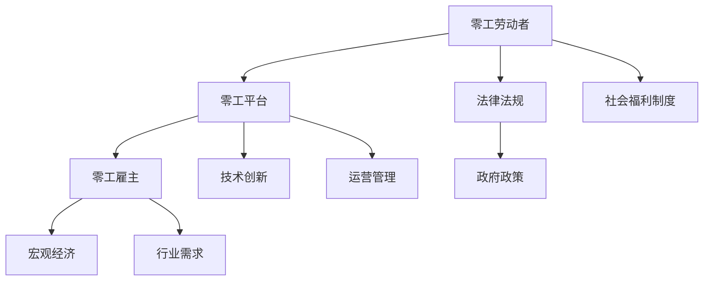

                 

# 《零工经济：即副业思维和副业》

## 关键词：
- 零工经济
- 副业思维
- 副业
- 平台运营
- 法律政策
- 技术发展

## 摘要：
本文将深入探讨零工经济的概念与背景，分析其对社会经济体系的影响，并详细阐述零工经济的运营模式、法律与政策以及技术发展趋势。通过项目实战案例分析，本文旨在为读者提供一个全面、系统的理解和实际操作指南，帮助人们更好地把握零工经济的机遇与挑战。

---

## 《零工经济：即副业思维和副业》目录大纲

---

### 第一部分：零工经济的概念与背景

#### 1.1 零工经济的定义与特征

##### 1.1.1 零工经济的概念来源
零工经济，又称自由职业经济、零工共享经济，是指个体通过互联网平台提供灵活、短期的劳动服务，以获取收入的经济模式。

##### 1.1.2 零工经济的特征与区别
- **灵活性**：工作时间和内容可以根据个人需求灵活调整。
- **即时性**：劳动者可以在短时间内找到工作，雇主也可以快速获得所需服务。
- **去中心化**：通过互联网平台实现供需匹配，降低了传统中介的成本。

#### 1.2 零工经济的兴起与发展

##### 1.2.1 零工经济的兴起背景
零工经济的兴起得益于互联网技术的发展、智能手机的普及以及人们生活节奏的加快。

##### 1.2.2 零工经济的主要发展历程
- **初期**：以本地化的劳动力市场为主，如家教、家政服务等。
- **成长期**：零工平台开始全球化扩展，如Uber、Airbnb等。
- **成熟期**：零工经济开始渗透到各行各业，成为重要的经济组成部分。

#### 1.3 零工经济的全球趋势与影响

##### 1.3.1 全球零工经济的发展现状
- **北美**：零工经济已经成为就业市场的重要力量。
- **欧洲**：零工经济受到政策支持，发展势头迅猛。
- **亚洲**：零工经济正在快速发展，尤其在东南亚地区。

##### 1.3.2 零工经济对社会的影响
- **就业市场**：改变了传统就业模式，提供了更多的就业机会。
- **生活方式**：提高了生活灵活性，促进了个人发展。
- **宏观经济**：增加了经济活动，促进了经济增长。

### 第二部分：零工经济与社会经济体系

#### 2.1 零工经济对就业市场的影响

##### 2.1.1 零工经济对全职就业的冲击
- **替代效应**：零工经济提供了更多的短期工作选择，可能替代传统全职就业。
- **分割效应**：零工经济可能导致就业市场的分割，形成零工劳动者和全职劳动者的两极分化。

##### 2.1.2 零工经济对劳动者权益的影响
- **权益保障**：零工劳动者的权益保障问题受到广泛关注，包括工资、福利、劳动安全等。

#### 2.2 零工经济与宏观经济

##### 2.2.1 零工经济对经济增长的贡献
- **劳动力供给**：零工经济增加了劳动力供给，有助于缓解劳动力短缺问题。
- **消费需求**：零工经济促进了消费需求，推动了相关行业的发展。

##### 2.2.2 零工经济对产业结构的影响
- **新兴产业**：零工经济催生了新的商业模式和产业形态，如共享经济、平台经济等。

#### 2.3 零工经济与社会福利制度

##### 2.3.1 零工经济对社会福利制度的影响
- **社会保障**：零工劳动者的社会保障问题亟待解决，包括养老保险、医疗保险等。
- **税收政策**：如何对零工经济进行合理征税，是政策制定者面临的重要问题。

### 第三部分：零工经济的运营模式

#### 3.1 零工平台的运作机制

##### 3.1.1 零工平台的发展现状与案例分析
- **全球主要零工平台**：如Uber、Airbnb、Upwork等。
- **平台商业模式**：C2C（消费者对消费者）、B2C（商家对消费者）等。

##### 3.1.2 零工平台的服务模式与创新
- **服务多样化**：提供多种类型的服务，满足不同用户的需求。
- **用户体验优化**：通过技术创新和用户反馈机制，提高用户体验。

##### 3.1.3 零工平台的运营管理与风险控制
- **平台管理**：包括用户管理、内容管理、财务管理等。
- **风险管理**：包括信用风险管理、法律风险防范、用户隐私保护等。

#### 3.2 零工经济的参与者

##### 3.2.1 零工劳动者：角色、权益与挑战
- **零工劳动者的角色**：包括自由职业者、兼职者等。
- **权益保障**：如何确保零工劳动者的权益，是一个亟待解决的问题。
- **挑战**：零工劳动者面临的不稳定收入、工作环境差等问题。

##### 3.2.2 零工雇主：需求、选择与策略
- **零工雇主的需求**：包括快速获取劳动力、降低运营成本等。
- **选择策略**：如何选择合适的零工平台和劳动者，实现资源优化配置。

##### 3.2.3 零工平台与各方关系协调
- **平台与劳动者**：如何建立信任、保障权益、提高满意度。
- **平台与雇主**：如何提供优质服务、维护双方利益、促进合作。

### 第四部分：零工经济的法律与政策

#### 4.1 零工经济的法律问题与规制

##### 4.1.1 零工经济的法律挑战
- **劳动关系认定**：如何界定零工劳动者与平台的关系，是法律规制的重要问题。
- **劳动权益保障**：如何保障零工劳动者的合法权益，是法律规制的核心目标。

##### 4.1.2 零工经济的法律政策演进
- **国际法律政策**：如美国、欧洲等地的立法趋势和举措。
- **中国法律政策**：如《中华人民共和国劳动合同法》、《共享经济指导意见》等。

##### 4.1.3 全球零工经济立法比较与启示
- **立法现状**：不同国家和地区在零工经济立法方面的差异和共同点。
- **立法启示**：如何借鉴国际经验，完善中国零工经济法律体系。

#### 4.2 零工经济的政策建议与实践

##### 4.2.1 政府在零工经济中的角色与责任
- **政策制定**：如何制定有利于零工经济发展的政策，是政府的责任。
- **监督管理**：如何加强零工经济的监管，保障市场秩序和社会稳定。

##### 4.2.2 零工经济的政策制定与调整
- **政策目标**：如何确定零工经济政策的目标，实现社会效益最大化。
- **政策工具**：如何使用政策工具，如税收优惠、社会保障等，推动零工经济发展。

##### 4.2.3 零工经济的实践案例与启示
- **成功案例**：如美国Uber的税收政策、欧洲零工平台的工会组织等。
- **经验借鉴**：如何借鉴国际经验，创新中国零工经济政策实践。

### 第五部分：零工经济的未来展望

#### 5.1 零工经济的技术发展趋势

##### 5.1.1 新技术在零工经济中的应用
- **人工智能**：如智能匹配算法、自动化客服等。
- **区块链技术**：如去中心化交易平台、数字身份认证等。

##### 5.1.2 零工经济与人工智能的融合
- **智能匹配**：利用人工智能技术，提高任务匹配的准确性和效率。
- **自动化管理**：通过人工智能技术，实现零工平台的全自动化运营。

##### 5.1.3 零工经济与区块链技术的融合
- **数据安全**：利用区块链技术，提高数据的安全性和透明度。
- **信任机制**：通过区块链技术，建立可信的交易环境。

#### 5.2 零工经济的未来挑战与机遇

##### 5.2.1 零工经济的可持续发展
- **经济可持续**：如何确保零工经济的长期发展，实现经济效益和社会效益的双赢。
- **社会可持续**：如何保障零工劳动者的权益，促进社会公平和谐。

##### 5.2.2 零工经济对传统行业的冲击与转型
- **行业变革**：零工经济对传统行业带来的冲击，如出租车、酒店等行业。
- **行业转型**：传统行业如何应对零工经济的挑战，实现转型升级。

##### 5.2.3 零工经济的全球影响与区域发展
- **全球影响**：零工经济对全球经济发展的影响，如就业、税收、经济增长等。
- **区域发展**：零工经济在不同区域的发展现状和趋势，如发达国家和发展中国家的差异。

### 附录

#### 附录 A：零工经济相关术语解释

- **零工经济**：
- **自由职业**：
- **共享经济**：
- **平台经济**：

#### 附录 B：零工经济研究报告精选

- **《零工经济的崛起：全球趋势与影响》**
- **《中国零工经济研究报告：现状与展望》**
- **《零工经济与社会保障：挑战与对策》**

#### 附录 C：零工经济法律法规汇编

- **《美国零工经济法案》**
- **《欧洲零工平台监管指南》**
- **《中国共享经济发展指导政策》**

### Mermaid 流�程图：零工经济生态圈



### 伪代码：零工经济核心算法原理

```python
# 伪代码：基于需求的零工匹配算法

def match_workers_with_jobs(job_list, worker_profile):
    """
    匹配工作者和任务，基于工作者的技能和需求
    :param job_list: 任务列表
    :param worker_profile: 工作者技能和需求
    :return: 匹配结果列表
    """
    matched_jobs = []
    for job in job_list:
        if has_required_skills(job, worker_profile):
            matched_jobs.append(job)
    return matched_jobs

def has_required_skills(job, worker_profile):
    """
    检查工作者是否具备完成任务所需的技能
    :param job: 任务详情
    :param worker_profile: 工作者技能和需求
    :return: 是否具备技能
    """
    required_skills = job['required_skills']
    for skill in required_skills:
        if skill not in worker_profile['skills']:
            return False
    return True
```

### 数学模型与公式

#### 1. 零工劳动者的收益最大化模型

$$
\max R(x) = \sum_{i=1}^{n} p_i \cdot q_i \cdot x_i
$$

其中，\( R(x) \) 是劳动者的总收益，\( p_i \) 是第 \( i \) 个任务的价格，\( q_i \) 是劳动者在第 \( i \) 个任务的投入时间，\( x_i \) 是劳动者选择接受第 \( i \) 个任务的决策。

#### 2. 零工平台的匹配效率优化模型

$$
\min E(x) = \sum_{i=1}^{n} \frac{p_i \cdot q_i}{x_i} - \alpha
$$

其中，\( E(x) \) 是匹配效率，\( \alpha \) 是权重系数。

### 项目实战

#### 1. 零工平台开发环境搭建

##### 1.1 开发环境要求
- **操作系统**：Linux或MacOS
- **编程语言**：Python 3.8及以上版本
- **数据库**：MySQL 5.7及以上版本

##### 1.2 开发工具安装
- **安装Python和pip**
- **安装Django框架**
- **安装数据库驱动**

#### 2. 零工平台核心功能实现

##### 2.1 用户注册与登录
- **实现用户注册接口**，验证用户信息
- **实现用户登录接口**，生成会话

##### 2.2 任务发布与管理
- **实现任务发布接口**，存储任务信息
- **实现任务管理接口**，允许雇主修改和删除任务

##### 2.3 工作者匹配与雇佣
- **实现工作者匹配算法**
- **实现雇佣流程**，包括合同签订和任务完成

##### 2.4 任务评价与反馈
- **实现任务评价接口**，允许雇主对工作者进行评价
- **实现反馈机制**，收集用户反馈以优化系统

#### 3. 代码解读与分析

##### 3.1 示例代码：工作者匹配算法实现

```python
def match_workers_with_jobs(job_list, worker_profile):
    """
    匹配工作者和任务，基于工作者的技能和需求
    :param job_list: 任务列表
    :param worker_profile: 工作者技能和需求
    :return: 匹配结果列表
    """
    matched_jobs = []
    for job in job_list:
        if has_required_skills(job, worker_profile):
            matched_jobs.append(job)
    return matched_jobs

def has_required_skills(job, worker_profile):
    """
    检查工作者是否具备完成任务所需的技能
    :param job: 任务详情
    :param worker_profile: 工作者技能和需求
    :return: 是否具备技能
    """
    required_skills = job['required_skills']
    for skill in required_skills:
        if skill not in worker_profile['skills']:
            return False
    return True
```

##### 3.2 代码解读与分析

在上述代码中，`match_workers_with_jobs` 函数是零工匹配算法的核心部分。它接受一个任务列表 `job_list` 和一个工作者技能和需求对象 `worker_profile` 作为输入，并返回一个匹配成功的任务列表 `matched_jobs`。

具体来说，函数首先初始化一个空列表 `matched_jobs` 用于存储匹配成功的任务。然后，它使用一个 `for` 循环遍历任务列表 `job_list`。对于每个任务，函数调用 `has_required_skills` 函数来检查这个任务所需的技能是否与工作者的技能匹配。如果匹配成功，则将这个任务添加到 `matched_jobs` 列表中。

`has_required_skills` 函数是一个辅助函数，它的任务是检查单个工作者是否具备完成某个任务所需的技能。它接受两个参数：`job`（任务详情）和 `worker_profile`（工作者技能和需求对象）。函数首先从任务详情中提取一个名为 `required_skills` 的列表，这个列表包含了任务所需的技能。然后，它使用一个 `for` 循环遍历这个列表，并检查每个技能是否在工作者技能和需求对象 `worker_profile` 的 `skills` 属性中存在。如果存在，则继续检查下一个技能；如果所有技能都匹配，则返回 `True`，表示工作者具备完成任务的技能。如果存在任何不匹配的技能，则函数立即返回 `False`。

这两个函数共同工作，实现了基于技能匹配的零工匹配逻辑。在实际应用中，这些函数可能会扩展或修改以适应不同的匹配策略和需求。然而，它们提供了一个基础框架，用于在零工平台上实现有效的任务匹配。

通过这种代码实现，平台能够高效地匹配工作者和任务，从而提高用户体验和运营效率。同时，这种匹配机制也为平台提供了扩展性，使其能够适应不断变化的市场需求和技术进步。在实际部署过程中，还需要考虑性能优化、安全性、用户隐私保护等因素，以确保平台的稳定性和可靠性。

---

### 结束语

本文系统地探讨了零工经济的概念、背景、运营模式、法律政策以及技术发展趋势。通过项目实战案例分析，我们了解了零工平台的核心算法原理和实现方法。零工经济作为一种新兴的经济模式，正在深刻地改变着就业市场和社会经济体系。

在未来，随着人工智能、区块链等新技术的不断应用，零工经济将继续发展壮大。然而，我们也需要关注零工劳动者权益保障、政策法规完善等问题，确保零工经济的可持续发展。让我们共同期待零工经济的美好未来！

---

**作者：AI天才研究院/AI Genius Institute & 禅与计算机程序设计艺术 /Zen And The Art of Computer Programming**

