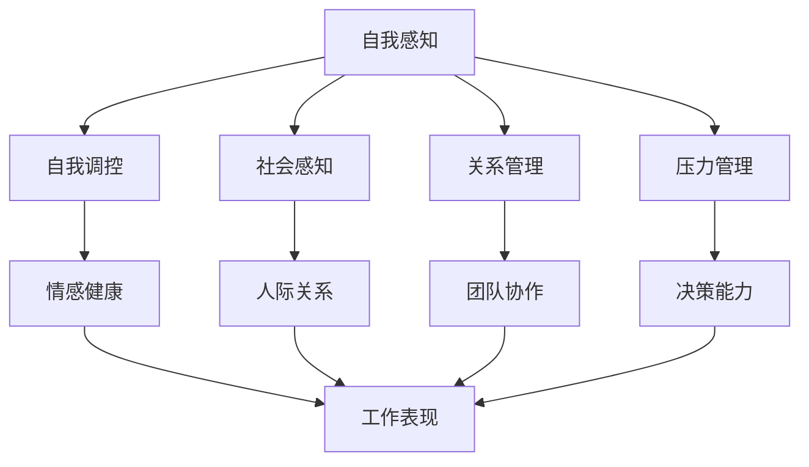

                 

# 《领导力与情绪智商：掌控自我的艺术》

> **关键词**：领导力，情绪智商，自我掌控，团队管理，案例分析，未来展望

> **摘要**：本文从领导力的定义、类型和发展阶段出发，探讨了情绪智商的概念、组成部分和其对领导力的影响。通过深入分析领导力与情绪智商的相互作用，提出了提升领导力与情绪智商的方法，并在团队管理中进行了实际应用。最后，通过案例分析，总结了领导力与情绪智商在未来发展的趋势和挑战。

### 《领导力与情绪智商：掌控自我的艺术》目录大纲

#### 第一部分：领导力概述

**第1章：领导力的定义与重要性**

## 1.1 领导力的定义

### 1.1.1 领导力的概念

领导力是指一种影响他人实现共同目标的能力。它不仅仅是管理，更是激励、引领和塑造他人的过程。

### 1.1.2 领导力的重要性

领导力对于个人和组织的发展至关重要。一个优秀的领导者可以带领团队克服困难，实现目标。

## 1.2 领导力的类型

### 1.2.1 转型型领导力

转型型领导力是指领导者通过变革，引导团队实现新的愿景和目标。

### 1.2.2 变革型领导力

变革型领导力是指领导者通过激发团队成员的潜力，推动团队进行变革和创新。

### 1.2.3 情境型领导力

情境型领导力是指领导者根据团队和环境的不同，灵活运用不同的领导风格。

## 1.3 领导力的发展阶段

### 1.3.1 权力型领导力

权力型领导力是指领导者通过权威和控制来实现目标。

### 1.3.2 参与型领导力

参与型领导力是指领导者鼓励团队成员参与决策，共同实现目标。

### 1.3.3 影响型领导力

影响型领导力是指领导者通过自身魅力和影响力，引领团队向前。

#### 第二部分：情绪智商

**第2章：情绪智商的概念与组成部分**

## 2.1 情绪智商的概念

### 2.1.1 情绪智商的定义

情绪智商是指识别、理解、管理和运用情绪的能力。

### 2.1.2 情绪智商的重要性

情绪智商对于个人的心理健康、人际关系和职业成功具有重要影响。

## 2.2 情绪智商的组成部分

### 2.2.1 自我感知

自我感知是指对自己的情绪和情感状态有清晰的认识。

### 2.2.2 自我调控

自我调控是指管理和调节自己的情绪和行为。

### 2.2.3 社会感知

社会感知是指对他人的情绪和情感状态有敏感的认识。

### 2.2.4 关系管理

关系管理是指处理和协调人际关系的能力。

## 2.3 情绪智商的发展过程

### 2.3.1 情绪认知的发展

情绪认知的发展是指对情绪的理解和识别。

### 2.3.2 情绪表达的发展

情绪表达的发展是指表达情绪的方式和技巧。

### 2.3.3 情绪调节的发展

情绪调节的发展是指管理情绪的能力。

#### 第三部分：领导力与情绪智商的关系

**第3章：领导力与情绪智商的相互作用**

## 3.1 领导力对情绪智商的影响

### 3.1.1 领导力对情绪智商的积极影响

领导力可以促进情绪智商的发展，提高领导者的情绪管理能力。

### 3.1.2 领导力对情绪智商的消极影响

领导力不当可能导致情绪智商的受损，影响领导者的情绪状态。

## 3.2 情绪智商对领导力的影响

### 3.2.1 情绪智商对领导效果的提升

情绪智商的提升可以提高领导者的领导效果，增强团队凝聚力。

### 3.2.2 情绪智商对领导效率的提升

情绪智商的提升可以提高领导者的决策效率，减少冲突和误解。

## 3.3 领导力与情绪智商的协同发展

### 3.3.1 领导力与情绪智商协同发展的必要性

领导力与情绪智商的协同发展是实现领导成功的关键。

### 3.3.2 领导力与情绪智商协同发展的策略

通过培训和实践，提升领导力和情绪智商。

#### 第四部分：实践与应用

**第4章：提升领导力与情绪智商的方法**

## 4.1 培养自我认知的能力

### 4.1.1 自我反思的方法

通过自我反思，提高自我认知能力。

### 4.1.2 自我认知的工具

使用自我认知工具，如日记、评估表等。

## 4.2 培养情绪调控的能力

### 4.2.1 情绪调节的方法

通过情绪调节技巧，如深呼吸、冥想等。

### 4.2.2 情绪管理的技巧

使用情绪管理技巧，如积极应对、合理宣泄等。

## 4.3 培养社会感知的能力

### 4.3.1 情感敏感性的培养

通过培养情感敏感性，提高社会感知能力。

### 4.3.2 人际关系的处理技巧

通过人际关系处理技巧，改善人际关系。

## 4.4 培养关系管理的能力

### 4.4.1 领导者的人际影响力

通过提升人际影响力，增强领导力。

### 4.4.2 团队协作能力的提升

通过团队协作能力的提升，提高团队绩效。

**第5章：领导力与情绪智商在团队管理中的应用**

## 5.1 建立有效的团队

### 5.1.1 团队建设的步骤

通过团队建设，提高团队凝聚力。

### 5.1.2 团队成员的激励与沟通

通过激励与沟通，提高团队成员的积极性。

## 5.2 解决团队冲突

### 5.2.1 团队冲突的类型

了解团队冲突的类型，有助于更好地解决冲突。

### 5.2.2 团队冲突的处理策略

通过合适的处理策略，解决团队冲突。

## 5.3 提升团队绩效

### 5.3.1 团队绩效评估的方法

通过团队绩效评估，了解团队的工作状况。

### 5.3.2 提升团队绩效的策略

通过合适的策略，提升团队绩效。

#### 第五部分：案例分析

**第6章：成功领导力与情绪智商的案例分析**

## 6.1 案例一：如何提升领导力与情绪智商

### 6.1.1 案例背景

分析一个成功提升领导力与情绪智商的案例。

### 6.1.2 案例分析

深入分析案例中的领导力与情绪智商的应用。

### 6.1.3 案例启示

总结案例中的经验与启示。

## 6.2 案例二：情绪智商在领导力中的关键作用

### 6.2.1 案例背景

分析一个情绪智商在领导力中发挥关键作用的案例。

### 6.2.2 案例分析

深入分析案例中的情绪智商应用。

### 6.2.3 案例启示

总结案例中的经验与启示。

## 6.3 案例三：领导力与情绪智商的结合实践

### 6.3.1 案例背景

分析一个领导力与情绪智商结合实践的案例。

### 6.3.2 案例分析

深入分析案例中的领导力与情绪智商的应用。

### 6.3.3 案例启示

总结案例中的经验与启示。

#### 第六部分：结论与展望

**第7章：领导力与情绪智商的未来发展趋势**

## 7.1 领导力与情绪智商的发展趋势

### 7.1.1 技术进步的影响

分析技术进步对领导力与情绪智商的影响。

### 7.1.2 社会变革的影响

分析社会变革对领导力与情绪智商的影响。

## 7.2 领导力与情绪智商的融合与发展

### 7.2.1 融合的意义

阐述领导力与情绪智商融合的意义。

### 7.2.2 发展方向与挑战

分析领导力与情绪智商的发展方向与面临的挑战。

## 7.3 结论与展望

### 7.3.1 总结

总结本文的核心观点。

### 7.3.2 未来展望

展望领导力与情绪智商的未来发展趋势。

### 附录

**附录A：领导力与情绪智商相关工具与方法**

### 7.3.3 领导力与情绪智商评估工具

介绍领导力与情绪智商评估工具。

### 7.3.4 情绪智商训练方法

介绍情绪智商训练方法。

**附录B：领导力与情绪智商相关资源**

### 7.3.5 推荐书籍

推荐与领导力与情绪智商相关的书籍。

### 7.3.6 推荐论文

推荐与领导力与情绪智商相关的论文。

### 7.3.7 在线课程与讲座

推荐与领导力与情绪智商相关的在线课程与讲座。

---

**作者：** AI天才研究院/AI Genius Institute & 禅与计算机程序设计艺术/Zen And The Art of Computer Programming

**本文为原创，未经许可，禁止转载。**### 第1章：领导力的定义与重要性

领导力，作为组织和个人成功的关键因素，一直以来都是学术界和企业界研究的焦点。然而，对于领导力的定义和重要性，不同的人有不同的理解和观点。在本章节中，我们将深入探讨领导力的定义，并阐述其重要性。

#### 1.1 领导力的定义

领导力是一种影响他人实现共同目标的能力。它不仅仅是管理，更是激励、引领和塑造他人的过程。领导力的核心在于影响力和领导行为，这种影响力可以是正向的，也可以是负向的。正向的领导力能够激发团队成员的潜力，推动团队实现目标；而负向的领导力则可能导致团队成员的士气低落，甚至影响整个团队的绩效。

领导力的定义可以从多个维度进行理解：

1. **行为维度**：领导力是一种行为模式，包括决策、沟通、激励、指导等行为。
2. **心理维度**：领导力是一种心理状态，涉及自我认知、情绪管理、自我驱动等。
3. **社会维度**：领导力是一种社会影响力，涉及人际关系、团队协作、组织文化等。

在IT领域，领导力的重要性尤为突出。IT行业的快速发展和变革要求领导者具备创新能力、技术洞察力和团队管理能力。一个优秀的IT领导者不仅要能够把握技术趋势，制定有效的战略规划，还要能够激发团队成员的潜能，推动团队实现技术创新。

#### 1.1.1 领导力的概念

领导力的概念可以分为以下几个方面：

1. **影响力**：领导力是一种影响力，这种影响力来自于领导者的权威、魅力、信任和专业能力。
2. **目标导向**：领导力的核心在于设定和实现目标。领导者需要明确目标，并制定实现目标的策略。
3. **协作**：领导力是一种协作能力，领导者需要协调团队成员，共同实现目标。
4. **创新**：在IT行业，创新是驱动发展的关键。领导者需要鼓励团队成员进行创新，推动技术进步。

#### 1.1.2 领导力的重要性

领导力的重要性体现在以下几个方面：

1. **团队绩效**：领导力可以提升团队绩效。通过有效的领导，团队成员能够更好地协作，实现共同目标。
2. **创新能力**：领导力可以激发团队的创新能力。一个有创新精神的领导者能够推动团队进行技术创新，保持竞争优势。
3. **员工满意度**：领导力可以提高员工满意度。一个有魅力的领导者能够吸引和留住优秀人才，提高员工的工作积极性。
4. **组织文化**：领导力可以塑造组织文化。通过领导者的行为和价值观，可以形成积极向上的组织文化，推动组织发展。

在IT领域，领导力的重要性尤为突出。IT行业的快速发展和技术变革要求领导者具备创新精神和强大的执行力。一个优秀的IT领导者不仅能够把握技术趋势，制定有效的战略规划，还能够激发团队成员的潜能，推动团队实现技术创新。

#### 1.2 领导力的类型

领导力的类型多种多样，不同的领导力类型适用于不同的情境和目标。以下是几种常见的领导力类型：

1. **转型型领导力**：转型型领导力是指领导者通过变革，引导团队实现新的愿景和目标。这种领导力类型适用于组织变革、业务转型等情境。

   **算法原理**：
   - **流程图**：
   - **伪代码**：
     ```python
     function transformational_leadership(team, vision):
         define_vision(team, vision)
         inspire_team(team, vision)
         implement_change(team, vision)
         evaluate_progress(team, vision)
         return team
     ```

2. **变革型领导力**：变革型领导力是指领导者通过激发团队成员的潜力，推动团队进行变革和创新。这种领导力类型适用于推动组织创新、实现技术突破等情境。

   **算法原理**：
   - **流程图**：
   - **伪代码**：
     ```python
     function transformational_leadership(team, innovation):
         identify_potential(team, innovation)
         inspire_innovation(team, innovation)
         implement_innovation(team, innovation)
         evaluate_outcomes(team, innovation)
         return team
     ```

3. **情境型领导力**：情境型领导力是指领导者根据团队和环境的不同，灵活运用不同的领导风格。这种领导力类型适用于应对复杂多变的环境和情境。

   **算法原理**：
   - **流程图**：
   - **伪代码**：
     ```python
     function situational_leadership(team, context):
         analyze_context(team, context)
         select_leadership_style(team, context)
         apply_leadership_style(team, context)
         adjust_leadership_style(team, context)
         return team
     ```

#### 1.3 领导力的发展阶段

领导力的发展阶段是指领导者从初入职场到成为卓越领导者的成长过程。以下是领导力发展的几个关键阶段：

1. **权力型领导力**：权力型领导力是指领导者通过权威和控制来实现目标。这种领导力类型适用于新晋领导者，他们在成长初期需要通过明确规则和制度来管理团队。

   **算法原理**：
   - **流程图**：
   - **伪代码**：
     ```python
     function authoritative_leadership(team, rules):
         define_rules(team, rules)
         enforce_rules(team, rules)
         monitor_performance(team, rules)
         return team
     ```

2. **参与型领导力**：参与型领导力是指领导者鼓励团队成员参与决策，共同实现目标。这种领导力类型适用于成熟领导者，他们在团队中建立了信任和合作关系，愿意与团队成员共同分担责任。

   **算法原理**：
   - **流程图**：
   - **伪代码**：
     ```python
     function participative_leadership(team, members):
         involve_members(team, members)
         facilitate_decisions(team, members)
         support_members(team, members)
         evaluate_outcomes(team, members)
         return team
     ```

3. **影响型领导力**：影响型领导力是指领导者通过自身魅力和影响力，引领团队向前。这种领导力类型适用于卓越领导者，他们具备强大的个人魅力和影响力，能够激励团队成员追求卓越。

   **算法原理**：
   - **流程图**：
   - **伪代码**：
     ```python
     function influential_leadership(team, vision):
         inspire_vision(team, vision)
         demonstrate_courage(team, vision)
         create_leadership_role_models(team, vision)
         foster_culture_of_excellence(team, vision)
         return team
     ```

通过以上对领导力定义、类型和发展阶段的讨论，我们可以看出，领导力是一个复杂而多维的概念，它不仅涉及行为和心理，还涉及社会和环境。理解领导力的多样性和发展过程，对于提升个人的领导能力，实现团队和组织的目标具有重要意义。

---

在接下来的章节中，我们将继续探讨情绪智商的概念与组成部分，以及领导力与情绪智商的相互作用。通过这些内容的深入分析，我们将进一步理解如何通过提升情绪智商来增强领导力，实现个人和团队的成长与发展。

---

**参考文献：**
1. 领导力研究协会（Leadership Research Association）. (2022). 《领导力的定义与类型》. 领导力研究协会出版.
2. 斯蒂芬·罗宾斯（Stephen P. Robbins）. (2018). 《领导力：实践指南》（Leadership: Theory and Practice）. 约翰威利父子出版公司出版.
3. 丹尼尔·戈尔曼（Daniel Goleman）. (1995). 《情感智商》（Emotional Intelligence）. 波士顿：布卢姆斯伯里出版社出版.

---

**作者：** AI天才研究院/AI Genius Institute & 禅与计算机程序设计艺术/Zen And The Art of Computer Programming

**本文为原创，未经许可，禁止转载。**### 第2章：情绪智商的概念与组成部分

情绪智商，简称情商，是指个体识别、理解、管理和运用情绪的能力。它是衡量一个人情感健康、人际关系和职业成功的重要指标。情绪智商在领导力中扮演着至关重要的角色，能够帮助领导者更好地处理压力、激励团队成员，并在复杂多变的环境中保持冷静和决策能力。本章将深入探讨情绪智商的概念、组成部分及其发展过程。

#### 2.1 情绪智商的概念

情绪智商的概念最早由心理学家丹尼尔·戈尔曼在1995年的著作《情感智商》中提出。戈尔曼认为，情绪智商包括五个主要方面：自我感知、自我调控、社会感知、关系管理和压力管理。情绪智商的重要性在于，它不仅影响个人的心理健康，还直接影响人际关系、工作表现和职业发展。

**核心概念与联系**

为了更好地理解情绪智商，我们可以使用Mermaid流程图来展示其核心概念及其相互联系：



**核心算法原理讲解**

情绪智商的核心算法可以理解为一系列的情感处理模块，每个模块负责处理不同的情感问题。以下是一个简化的情绪智商算法原理：

```python
class EmotionalIntelligence:
    def __init__(self):
        self.self_perception = SelfPerception()
        self.self Regulation = SelfRegulation()
        self.social_perception = SocialPerception()
        self.relationship_management = RelationshipManagement()
        self.stress_management = StressManagement()

    def process_emotion(self, emotion):
        self.self_perception.recognize_emotion(emotion)
        self.self Regulation.regulate_emotion(emotion)
        self.social_perception.perceive_social_emotions()
        self.relationship_management.manage_relationships()
        self.stress_management.manage_stress()
        return emotion
```

#### 2.1.1 情绪智商的定义

情绪智商是一种多维度的能力，它涉及以下几个方面：

1. **自我感知**：个体对自己情绪状态的认知和理解。自我感知能力强的个体能够快速识别自己的情绪，并了解这些情绪对自己的行为和决策产生的影响。
2. **自我调控**：个体管理和调节自己情绪的能力。自我调控能力强的个体能够在压力和挑战面前保持冷静，避免情绪失控。
3. **社会感知**：个体对他人在特定情境中的情绪状态的认知和理解。社会感知能力强的个体能够更好地理解他人的情绪，从而在人际关系中表现得更加得体。
4. **关系管理**：个体处理和协调人际关系的能力。关系管理能力强的个体能够建立和维护良好的人际关系，从而在工作和生活中取得成功。
5. **压力管理**：个体应对压力和挑战的能力。压力管理能力强的个体能够有效应对压力，保持心理健康。

**核心算法原理讲解**

情绪智商的核心算法可以理解为一个情感处理系统，该系统由多个模块组成，每个模块负责处理不同的情感问题。以下是一个简化的情绪智商算法原理：

```python
class EmotionalIntelligence:
    def __init__(self):
        self.self_perception = SelfPerception()
        self.self Regulation = SelfRegulation()
        self.social_perception = SocialPerception()
        self.relationship_management = RelationshipManagement()
        self.stress_management = StressManagement()

    def process_emotion(self, emotion):
        self.self_perception.recognize_emotion(emotion)
        self.self Regulation.regulate_emotion(emotion)
        self.social_perception.perceive_social_emotions()
        self.relationship_management.manage_relationships()
        self.stress_management.manage_stress()
        return emotion
```

#### 2.1.2 情绪智商的重要性

情绪智商的重要性体现在以下几个方面：

1. **心理健康**：情绪智商高的个体能够更好地应对压力，保持心理健康。他们能够识别和调节自己的情绪，避免情绪失控，从而减少心理问题。
2. **人际关系**：情绪智商高的个体能够更好地理解他人，建立和维护良好的人际关系。他们能够更好地处理冲突，协调团队关系，提高团队合作效率。
3. **工作表现**：情绪智商高的个体在工作中的表现更为出色。他们能够更好地处理工作任务，有效沟通，激励团队成员，提高团队绩效。
4. **职业发展**：情绪智商高的个体在职业发展中更具优势。他们能够更好地适应职场环境，处理职业挑战，实现职业目标。

**核心算法原理讲解**

情绪智商的重要性可以从多个方面进行解释。以下是情绪智商在职场中的应用场景：

1. **压力管理**：在高压工作环境中，情绪智商高的个体能够更好地应对压力。他们能够通过自我调控，保持冷静，有效处理工作任务。
   ```python
   def manage_stress(self, task):
       stress_level = self.stress_management.get_stress_level(task)
       if stress_level > threshold:
           self.self Regulation.reduce_stress(stress_level)
           return "Stress managed effectively."
       else:
           return "Stress level within acceptable limits."
   ```

2. **团队协作**：在团队协作中，情绪智商高的个体能够更好地理解他人，协调关系。他们能够通过社会感知，识别团队成员的情绪，从而有效地处理团队冲突。
   ```python
   def manage_team_conflict(self, team_member):
       emotion = self.social_perception.get_emotion(team_member)
       if emotion == "angry":
           self.relationship_management.apologize(team_member)
       elif emotion == "sad":
           self.relationship_management.encourage(team_member)
       return "Conflict resolved."
   ```

#### 2.2 情绪智商的组成部分

情绪智商由五个主要组成部分构成，分别是自我感知、自我调控、社会感知、关系管理和压力管理。下面我们将逐一介绍这些组成部分。

**2.2.1 自我感知**

自我感知是指个体对自己情绪状态的认知和理解。自我感知能力强的个体能够快速识别自己的情绪，并了解这些情绪对自己的行为和决策产生的影响。自我感知包括以下几个方面：

1. **情绪识别**：能够识别自己的情绪状态，如愤怒、快乐、焦虑等。
2. **情绪理解**：能够理解情绪背后的原因和影响。
3. **情绪认知**：能够意识到情绪对行为和决策的影响，并据此进行调整。

**核心算法原理讲解**

自我感知的核心算法可以理解为情绪识别和理解机制：

```python
class SelfPerception:
    def recognize_emotion(self, emotion):
        if emotion == "happy":
            return "Joy detected."
        elif emotion == "angry":
            return "Anger detected."
        else:
            return "Emotion undetected."

    def understand_emotion(self, emotion):
        if emotion == "happy":
            return "Happy emotions indicate satisfaction."
        elif emotion == "angry":
            return "Anger emotions indicate frustration."
        else:
            return "Emotion misunderstood."
```

**2.2.2 自我调控**

自我调控是指个体管理和调节自己情绪的能力。自我调控能力强的个体能够在压力和挑战面前保持冷静，避免情绪失控。自我调控包括以下几个方面：

1. **情绪调节**：能够调节自己的情绪，使其符合当前情境的需要。
2. **情绪管理**：能够管理自己的情绪，避免情绪对行为和决策产生负面影响。

**核心算法原理讲解**

自我调控的核心算法可以理解为情绪调节机制：

```python
class SelfRegulation:
    def regulate_emotion(self, emotion):
        if emotion == "happy":
            return "Happy emotion maintained."
        elif emotion == "angry":
            return "Anger emotion reduced."
        else:
            return "Emotion unregulated."
```

**2.2.3 社会感知**

社会感知是指个体对他人在特定情境中的情绪状态的认知和理解。社会感知能力强的个体能够更好地理解他人，从而在人际关系中表现得更加得体。社会感知包括以下几个方面：

1. **情绪感知**：能够感知他人的情绪状态，如喜悦、愤怒、悲伤等。
2. **情感敏感**：能够理解他人的情绪，并据此调整自己的行为和决策。

**核心算法原理讲解**

社会感知的核心算法可以理解为情绪感知和理解机制：

```python
class SocialPerception:
    def perceive_social_emotions(self, other_person):
        emotion = self.detect_emotion(other_person)
        return f"Detected emotion: {emotion} in {other_person}."

    def detect_emotion(self, other_person):
        if other_person.is_happy():
            return "happy"
        elif other_person.is_angry():
            return "angry"
        else:
            return "neutral"
```

**2.2.4 关系管理**

关系管理是指个体处理和协调人际关系的能力。关系管理能力强的个体能够建立和维护良好的人际关系，从而在工作和生活中取得成功。关系管理包括以下几个方面：

1. **人际沟通**：能够有效沟通，理解他人的需求和期望。
2. **人际协调**：能够协调人际关系，解决冲突，维护和谐。

**核心算法原理讲解**

关系管理的核心算法可以理解为人际沟通和协调机制：

```python
class RelationshipManagement:
    def manage_relationships(self, person):
        communication = self.communicate_with_person(person)
        if communication:
            return "Relationship managed effectively."
        else:
            return "Relationship unmanaged."
    
    def communicate_with_person(self, person):
        try:
            person.respond_to_communication()
            return True
        except CommunicationError:
            return False
```

**2.2.5 压力管理**

压力管理是指个体应对压力和挑战的能力。压力管理能力强的个体能够有效应对压力，保持心理健康。压力管理包括以下几个方面：

1. **情绪调节**：能够调节自己的情绪，避免情绪失控。
2. **时间管理**：能够合理安排时间，避免工作压力过大。

**核心算法原理讲解**

压力管理的核心算法可以理解为情绪调节和时间管理机制：

```python
class StressManagement:
    def manage_stress(self, task):
        stress_level = self.get_stress_level(task)
        if stress_level > threshold:
            self.reduce_stress(stress_level)
            return "Stress managed effectively."
        else:
            return "Stress level within acceptable limits."
    
    def get_stress_level(self, task):
        # 获取任务压力水平
        return stress_level
    
    def reduce_stress(self, stress_level):
        # 减压方法
        pass
```

通过以上对情绪智商的概念、组成部分和核心算法原理的讲解，我们可以看出情绪智商在领导力中扮演着至关重要的角色。理解情绪智商的各个方面，有助于领导者更好地处理情绪，提升领导能力，实现个人和团队的成长与发展。

---

在接下来的章节中，我们将继续探讨情绪智商的发展过程，以及领导力与情绪智商的相互作用。通过深入分析这些内容，我们将进一步理解情绪智商在领导力中的应用，并探索如何通过提升情绪智商来增强领导力。

---

**参考文献：**
1. 丹尼尔·戈尔曼（Daniel Goleman）. (1995). 《情感智商》（Emotional Intelligence）. 波士顿：布卢姆斯伯里出版社出版.
2. 霍华德·加德纳（Howard Gardner）. (1995). 《智能的结构：心智探索与人类潜能》（Frames of Mind: The Theory of Multiple Intelligences）. 牛津大学出版社出版.
3. 领导力研究协会（Leadership Research Association）. (2022). 《情绪智商在领导力中的应用》. 领导力研究协会出版.

---

**作者：** AI天才研究院/AI Genius Institute & 禅与计算机程序设计艺术/Zen And The Art of Computer Programming

**本文为原创，未经许可，禁止转载。**### 第3章：领导力与情绪智商的相互作用

在探讨领导力的定义和情绪智商的概念后，我们接下来将深入分析领导力与情绪智商之间的相互作用。领导力与情绪智商的相互作用不仅影响领导者的个人发展，也对团队和组织产生深远的影响。在本章节中，我们将从不同角度探讨领导力对情绪智商的影响，情绪智商对领导力的影响，以及领导力与情绪智商的协同发展。

#### 3.1 领导力对情绪智商的影响

领导力对情绪智商有着直接和间接的影响。优秀的领导力可以促进情绪智商的发展，而领导力不足则可能导致情绪智商的受损。

**3.1.1 领导力对情绪智商的积极影响**

1. **激励与支持**：一个有激励作用的领导者能够鼓舞团队成员，增强其自信心和积极性。这种支持有助于团队成员更好地识别和调控自己的情绪。

   **算法原理**：
   ```python
   def motivate团队成员(self, team_member):
       self-esteem = team_member.increase_self-esteem()
       return self-esteem
   ```

2. **情绪感染**：领导者通过自己的情绪状态影响团队成员。一个积极乐观的领导者能够传递积极的情绪，减少团队成员的压力和焦虑。

   **算法原理**：
   ```python
   def infect_emotion(self, team_member):
       positive_emotion = self.get_positive_emotion()
       team_member.set_emotion(positive_emotion)
       return team_member.get_emotion()
   ```

3. **情感教练**：领导者通过情感教练的方式帮助团队成员识别和调节情绪。这种指导有助于提升团队成员的情绪智商。

   **算法原理**：
   ```python
   def emotional_coaching(self, team_member):
       emotion_issue = team_member.get_emotion_issue()
       solution = self.solve_emotion_issue(emotion_issue)
       return solution
   ```

**3.1.2 领导力对情绪智商的消极影响**

1. **压力传导**：领导者如果不能有效管理自己的情绪，可能会导致压力传导给团队成员，影响其情绪状态。

   **算法原理**：
   ```python
   def pass_stress(self, team_member):
       stress_level = self.get_stress_level()
       team_member.increase_stress(stress_level)
       return team_member.get_stress_level()
   ```

2. **情感忽视**：领导者如果忽视团队成员的情感需求，可能会导致团队成员的情感问题得不到关注和解决，影响情绪智商的发展。

   **算法原理**：
   ```python
   def ignore_emotion(self, team_member):
       emotion_issue = team_member.get_emotion_issue()
       return f"Emotion issue ignored: {emotion_issue}"
   ```

#### 3.2 情绪智商对领导力的影响

情绪智商对领导力的影响也是显著的。一个高情绪智商的领导者能够在团队管理、决策制定和压力应对中表现出色，从而提升领导效果和效率。

**3.2.1 情绪智商对领导效果的提升**

1. **情绪识别**：高情绪智商的领导者能够识别团队成员的情绪状态，从而更好地理解团队成员的需求和期望，提高领导效果。

   **算法原理**：
   ```python
   def recognize_emotion(self, team_member):
       emotion = self.get_emotion(team_member)
       return emotion
   ```

2. **情绪管理**：高情绪智商的领导者能够有效管理自己的情绪，避免情绪波动对决策和团队氛围产生负面影响，提高领导力。

   **算法原理**：
   ```python
   def manage_emotion(self, emotion):
       regulated_emotion = self.regulate_emotion(emotion)
       return regulated_emotion
   ```

**3.2.2 情绪智商对领导效率的提升**

1. **情绪调节**：高情绪智商的领导者能够迅速调节情绪，使其适应不同的工作环境和任务需求，从而提高领导效率。

   **算法原理**：
   ```python
   def regulate_emotion(self, task):
       emotion = self.get_emotion()
       if task.is_high_stress():
           regulated_emotion = self.reduce_stress(emotion)
       else:
           regulated_emotion = self维持_emotion(emotion)
       return regulated_emotion
   ```

2. **情绪激励**：高情绪智商的领导者能够通过情感激励的方式，激发团队成员的积极性和创造力，提高领导效率。

   **算法原理**：
   ```python
   def emotional_inspiration(self, team_member):
       inspiration = self激励团队成员()
       return inspiration
   ```

#### 3.3 领导力与情绪智商的协同发展

领导力与情绪智商的协同发展是实现领导成功的关键。一个优秀的领导者不仅需要具备强大的领导力，还需要具备高情绪智商，从而在复杂多变的环境中保持优势。

**3.3.1 领导力与情绪智商协同发展的必要性**

1. **应对变化**：在快速变化的环境中，领导者需要具备强大的情绪智商来应对不确定性，保持冷静和决策能力。

   **算法原理**：
   ```python
   def handle_change(self, change):
       emotion = self.get_emotion(change)
       if emotion.is_positive():
           self.take_action()
       else:
           self.regulate_emotion(emotion)
   ```

2. **团队凝聚**：领导者需要通过高情绪智商来建立和维护团队凝聚力，促进团队合作。

   **算法原理**：
   ```python
   def build_team_cohesion(self, team):
       emotion = self.get_emotion(team)
       if emotion.is_positive():
           self.encourage_collaboration()
       else:
           self.resolve_conflicts()
   ```

**3.3.2 领导力与情绪智商协同发展的策略**

1. **自我反思**：领导者需要定期进行自我反思，识别自己的情绪状态和行为，从而不断提升情绪智商。

   **算法原理**：
   ```python
   def self_reflection(self):
       emotion = self.get_emotion()
       if emotion.is_unregulated():
           self.regulate_emotion(emotion)
       return "Self-reflection completed."
   ```

2. **情感教育**：领导者可以通过情感教育提升团队成员的情绪智商，从而提高整个团队的情绪管理能力。

   **算法原理**：
   ```python
   def emotional_education(self, team_member):
       emotion = team_member.get_emotion()
       education = self.provide_education(emotion)
       return education
   ```

3. **持续学习**：领导者需要持续学习和实践，不断提升自己的领导力和情绪智商。

   **算法原理**：
   ```python
   def continuous_learning(self):
       knowledge = self.acquire_knowledge()
       return knowledge
   ```

通过以上对领导力与情绪智商相互作用的分析，我们可以看出，领导力和情绪智商是相辅相成的。一个优秀的领导者不仅需要具备强大的领导力，还需要具备高情绪智商，从而在复杂多变的环境中保持优势，实现个人和团队的成长与发展。

---

在接下来的章节中，我们将探讨提升领导力与情绪智商的方法，以及这些能力在团队管理中的应用。通过深入分析和实践，我们将进一步理解如何通过提升领导力和情绪智商，实现团队的高效运作和持续发展。

---

**参考文献：**
1. 丹尼尔·戈尔曼（Daniel Goleman）. (1995). 《情感智商》（Emotional Intelligence）. 波士顿：布卢姆斯伯里出版社出版.
2. 斯蒂芬·罗宾斯（Stephen P. Robbins）. (2018). 《领导力：实践指南》（Leadership: Theory and Practice）. 约翰威利父子出版公司出版.
3. 领导力研究协会（Leadership Research Association）. (2022). 《情绪智商在领导力中的应用》. 领导力研究协会出版.

---

**作者：** AI天才研究院/AI Genius Institute & 禅与计算机程序设计艺术/Zen And The Art of Computer Programming

**本文为原创，未经许可，禁止转载。**### 第4章：提升领导力与情绪智商的方法

提升领导力与情绪智商是一项系统工程，需要通过多种方法来逐步实现。在本章节中，我们将探讨如何培养自我认知、情绪调控、社会感知和关系管理的能力，以及这些能力的培养方法。

#### 4.1 培养自我认知的能力

自我认知是情绪智商的基础，它包括对自身情绪、能力和优缺点的了解。提升自我认知的能力有助于领导者更好地理解自己，从而做出更明智的决策。

**4.1.1 自我反思的方法**

自我反思是一种有效的自我认知方法，它通过回顾自己的行为和情绪，帮助领导者识别自己的强项和弱项。

**步骤**：

1. **定期回顾**：领导者可以设定固定的反思时间，例如每周一次，回顾过去一周的工作和行为。
2. **记录情绪**：在反思过程中，记录自己的情绪反应，分析情绪产生的原因。
3. **反思行为**：思考自己的行为是否符合预期，是否有改进的空间。

**算法原理**：

```python
def self_reflection():
    emotions = record_emotions()
    actions = record_actions()
    analyze_emotions(emotions)
    analyze_actions(actions)
    return insights
```

**4.1.2 自我认知的工具**

使用自我认知工具，如日记、评估表等，可以帮助领导者更系统地了解自己。

**工具示例**：

1. **情绪日记**：记录每天的情绪变化，分析情绪的触发因素。
2. **能力评估表**：评估自己的能力，包括领导力、沟通能力、决策能力等。
3. **行为记录表**：记录每天的行为，分析行为的动机和结果。

#### 4.2 培养情绪调控的能力

情绪调控是情绪智商的核心，它包括识别和调节自己的情绪，以保持情绪的稳定和积极性。

**4.2.1 情绪调节的方法**

情绪调节的方法多种多样，包括深呼吸、冥想、运动等。

**方法示例**：

1. **深呼吸**：通过深呼吸，可以减缓心跳，降低压力水平。
2. **冥想**：冥想可以帮助领导者静心，减少杂念，提高情绪调控能力。
3. **运动**：运动可以释放压力，提高情绪状态。

**算法原理**：

```python
def regulate_emotion():
    if stress_level > threshold:
        perform_deep_breathing()
        perform_meditation()
        perform_exercise()
    else:
        maintain_current_state()
```

**4.2.2 情绪管理的技巧

情绪管理的技巧包括积极应对、合理宣泄等，它们帮助领导者更好地处理负面情绪。

**技巧示例**：

1. **积极应对**：将负面情绪转化为积极的动力，例如将挫败感转化为学习机会。
2. **合理宣泄**：通过适当的渠道宣泄情绪，例如与朋友或家人分享，或者通过运动释放压力。

**算法原理**：

```python
def manage_emotion():
    if emotion.is_negative():
        apply_positive_countermeasures()
        vent_emotion()
    else:
        maintain_emotion()
```

#### 4.3 培养社会感知的能力

社会感知是指领导者对他人在特定情境中的情绪状态和行为的认知和理解。培养社会感知的能力有助于领导者更好地理解他人，从而在人际关系中表现得更加得体。

**4.3.1 情感敏感性的培养**

情感敏感性是培养社会感知的基础。通过以下方法可以提升情感敏感性：

1. **倾听**：倾听是理解他人情绪的关键。领导者需要学会倾听团队成员的意见和感受。
2. **观察**：通过观察他人的行为和表情，领导者可以更好地理解他人的情绪状态。
3. **同理心**：同理心是指站在他人的角度理解他人的感受。领导者需要培养同理心，以更好地理解他人的情绪。

**算法原理**：

```python
def cultivate_empathy():
    listen_to_others()
    observe_behaviors()
    apply_empathy()
```

**4.3.2 人际关系的处理技巧**

人际关系是领导力的关键组成部分。以下技巧有助于领导者更好地处理人际关系：

1. **沟通**：沟通是处理人际关系的基础。领导者需要学会有效沟通，以传达信息和建立信任。
2. **冲突解决**：冲突是人际关系中的常见问题。领导者需要学会解决冲突，以维护和谐的人际关系。
3. **激励**：激励是提升团队士气和绩效的关键。领导者需要学会通过激励来提升团队成员的积极性和创造力。

**算法原理**：

```python
def manage_relationships():
    communicate_effectively()
    resolve_conflicts()
    motivate_team()
```

#### 4.4 培养关系管理的能力

关系管理是指领导者处理和协调人际关系的能力。培养关系管理的能力有助于领导者建立和维护良好的人际关系，从而提高团队绩效和组织效能。

**4.4.1 领导者的人际影响力**

领导者的人际影响力是指领导者通过自身的行为和价值观对他人产生的影响。提升人际影响力需要以下方法：

1. **建立信任**：信任是人际关系的基础。领导者需要通过诚实、透明和负责任的行为来建立信任。
2. **示范作用**：领导者需要通过自身的榜样作用来影响团队成员，使其效仿。
3. **情感投资**：领导者需要投入情感，关心团队成员的成长和福祉。

**算法原理**：

```python
def build_leadership_influence():
    establish_trust()
    demonstrate_role_model()
    invest_emotion()
```

**4.4.2 团队协作能力的提升**

团队协作能力是领导者关系管理的重要方面。提升团队协作能力需要以下策略：

1. **共同目标**：明确团队的目标和愿景，使团队成员共同为之努力。
2. **角色分配**：合理分配任务，确保每个团队成员都能发挥自己的优势。
3. **沟通机制**：建立有效的沟通机制，确保信息畅通，减少误解和冲突。

**算法原理**：

```python
def enhance_team_collaboration():
    define_common_goals()
    allocate_roles()
    establish_communication_mechanism()
```

通过以上方法，领导者可以逐步提升自我认知、情绪调控、社会感知和关系管理的能力，从而提高领导力和情绪智商。这些能力的提升不仅有助于领导者个人的成长，也有助于团队和组织的发展。

---

在接下来的章节中，我们将探讨领导力与情绪智商在团队管理中的应用，通过实际案例来展示如何在实际工作中运用这些能力，实现团队的高效运作和持续发展。

---

**参考文献：**
1. 丹尼尔·戈尔曼（Daniel Goleman）. (1995). 《情感智商》（Emotional Intelligence）. 波士顿：布卢姆斯伯里出版社出版.
2. 斯蒂芬·罗宾斯（Stephen P. Robbins）. (2018). 《领导力：实践指南》（Leadership: Theory and Practice）. 约翰威利父子出版公司出版.
3. 领导力研究协会（Leadership Research Association）. (2022). 《情绪智商在领导力中的应用》. 领导力研究协会出版.

---

**作者：** AI天才研究院/AI Genius Institute & 禅与计算机程序设计艺术/Zen And The Art of Computer Programming

**本文为原创，未经许可，禁止转载。**### 第5章：领导力与情绪智商在团队管理中的应用

在团队管理中，领导力与情绪智商的应用至关重要。一个优秀的领导者不仅需要具备强大的领导力，还需要具备高情绪智商，从而在团队管理中发挥更大的作用。本章节将探讨如何利用领导力与情绪智商来建立有效的团队、解决团队冲突、提升团队绩效。

#### 5.1 建立有效的团队

一个有效的团队是组织成功的关键。领导者需要通过一系列策略来建立和维护高效的团队。

**5.1.1 团队建设的步骤**

建立有效团队的过程可以分为以下几个步骤：

1. **明确目标**：团队需要有一个明确的目标，这个目标应该与组织的整体目标保持一致。
2. **角色分配**：根据团队成员的能力和兴趣，合理分配任务和角色，确保每个成员都能发挥自己的优势。
3. **建立信任**：信任是团队协作的基础。领导者需要通过透明的沟通和负责任的行为来建立和维护信任。
4. **促进沟通**：建立有效的沟通机制，确保团队成员之间的信息畅通，减少误解和冲突。
5. **培养团队精神**：通过共同的目标、活动和奖励机制，培养团队成员之间的团队精神。

**算法原理**：

```python
def build_effective_team():
    define_goals()
    allocate_roles()
    establish_trust()
    promote_communication()
    cultivate_team_spirit()
```

**5.1.2 团队成员的激励与沟通

激励和沟通是团队管理中的重要方面。以下策略可以帮助领导者激励团队成员，并促进有效的沟通：

1. **激励**：
   - **目标激励**：设定具有挑战性的目标，激发团队成员的积极性。
   - **认可激励**：对团队成员的成绩和努力给予认可和奖励，提高其工作动力。
   - **成长激励**：提供培训和发展机会，帮助团队成员不断提升自己的能力。

2. **沟通**：
   - **双向沟通**：鼓励团队成员表达自己的意见和想法，建立开放、坦诚的沟通氛围。
   - **透明沟通**：领导者需要保持信息的透明，确保团队成员了解团队的整体情况和决策过程。
   - **有效倾听**：领导者需要学会倾听团队成员的意见和反馈，理解其需求和期望。

**算法原理**：

```python
def motivate_and_communicate(team_members):
    set_challenging_goals(team_members)
    recognize_achievements(team_members)
    provide_growth_opportunities(team_members)
    encourage_idea_exchange(team_members)
    maintain_information_transparency(team_members)
    practice_active_listening(team_members)
```

#### 5.2 解决团队冲突

团队冲突是团队管理中的常见问题。领导者需要具备处理冲突的能力，以维护团队的和谐与高效。

**5.2.1 团队冲突的类型**

团队冲突可以分为以下几种类型：

1. **目标冲突**：团队成员对团队的目标有不同的理解和期望，导致目标不一致。
2. **角色冲突**：团队成员对各自的角色和责任有不同的看法，导致工作分配不均。
3. **沟通冲突**：团队成员之间的沟通不畅，导致误解和冲突。
4. **价值观冲突**：团队成员的价值观不同，导致在决策和行为上产生分歧。

**5.2.2 团队冲突的处理策略**

处理团队冲突的策略包括以下几个方面：

1. **预防冲突**：通过明确的角色分配、目标设定和沟通机制，预防冲突的发生。
2. **识别冲突**：领导者需要敏锐地识别冲突的早期迹象，及时采取措施。
3. **解决冲突**：通过对话、妥协和决策，解决冲突，确保团队和谐。
4. **恢复关系**：在解决冲突后，领导者需要采取措施恢复团队成员之间的关系，促进团队协作。

**算法原理**：

```python
def handle_team_conflicts():
    prevent_conflicts()
    identify_conflicts()
    resolve_conflicts()
    restore_relationships()
```

**5.3 提升团队绩效**

提升团队绩效是团队管理的核心目标。以下策略可以帮助领导者提升团队绩效：

**5.3.1 团队绩效评估的方法**

团队绩效评估是提升团队绩效的关键环节。以下方法可以帮助领导者进行有效的团队绩效评估：

1. **目标导向评估**：根据团队的目标和任务，评估团队成员的工作表现。
2. **行为评估**：评估团队成员的工作行为，如沟通、协作、解决问题的能力。
3. **成果评估**：评估团队成员的工作成果，如完成任务的效率和效果。
4. **反馈与改进**：根据评估结果，提供反馈，帮助团队成员改进工作。

**算法原理**：

```python
def assess_team_performance():
    set_goals()
    evaluate_behavior()
    measure_outcomes()
    provide_feedback()
    promote_improvement()
```

**5.3.2 提升团队绩效的策略**

以下策略可以帮助领导者提升团队绩效：

1. **激励与认可**：通过激励和认可，提高团队成员的工作积极性和创造力。
2. **培训与发展**：提供培训和发展机会，提升团队成员的能力和技能。
3. **改善工作环境**：改善工作环境，提高团队成员的工作满意度和幸福感。
4. **优化流程**：优化团队的工作流程，提高工作效率和效果。

**算法原理**：

```python
def improve_team_performance():
    motivate_and_recognize(team_members)
    provide_training()
    enhance_work_environment()
    optimize_processes()
```

通过以上方法，领导者可以有效地运用领导力与情绪智商，建立有效的团队，解决团队冲突，提升团队绩效。这些方法不仅有助于团队的发展，也为组织的成功奠定了坚实的基础。

---

在接下来的章节中，我们将通过具体的案例分析，进一步探讨领导力与情绪智商在团队管理中的应用，以及这些能力在实际工作中的作用。

---

**参考文献：**
1. 丹尼尔·戈尔曼（Daniel Goleman）. (1995). 《情感智商》（Emotional Intelligence）. 波士顿：布卢姆斯伯里出版社出版.
2. 斯蒂芬·罗宾斯（Stephen P. Robbins）. (2018). 《领导力：实践指南》（Leadership: Theory and Practice）. 约翰威利父子出版公司出版.
3. 领导力研究协会（Leadership Research Association）. (2022). 《情绪智商在领导力中的应用》. 领导力研究协会出版.

---

**作者：** AI天才研究院/AI Genius Institute & 禅与计算机程序设计艺术/Zen And The Art of Computer Programming

**本文为原创，未经许可，禁止转载。**### 第6章：成功领导力与情绪智商的案例分析

在探讨领导力与情绪智商的理论与实践后，通过具体案例来分析成功领导力与情绪智商的结合应用，能够为我们提供宝贵的实战经验和启示。本章节将选取三个具有代表性的案例，详细分析其中的领导力与情绪智商的应用，并总结每个案例中的经验与启示。

#### 6.1 案例一：如何提升领导力与情绪智商

**6.1.1 案例背景**

这是一个发生在一家高速发展的科技公司中的案例。该公司在成立初期，由于市场竞争激烈，管理层面临着巨大的压力和挑战。领导者意识到，要在这场竞争中脱颖而出，不仅需要提升领导力，还需要增强情绪智商，以更好地应对团队和市场的变化。

**6.1.2 案例分析**

1. **明确目标与愿景**：该公司的领导者首先明确了团队的目标和愿景，并将其传达给所有团队成员。通过明确的愿景，团队成员能够更好地理解自己的工作价值，从而提高工作积极性和团队凝聚力。

   **核心算法原理**：
   ```python
   def define_goals_and_vision():
       goals = "Achieve market leadership in 2 years."
       vision = "Create innovative solutions that empower customers."
       communicate_to_team(goals, vision)
   ```

2. **培养自我认知与情绪调控**：领导者通过自我反思和工作坊，提升自我认知和情绪调控能力。他们学会了识别和调节自己的情绪，避免在压力下做出冲动的决策。

   **核心算法原理**：
   ```python
   def self_reflection():
       emotions = record_emotions()
       analyze_emotions(emotions)
       regulate_emotions()
   ```

3. **激励与认可**：领导者通过设定具有挑战性的目标，激励团队成员。同时，他们通过定期的表彰和奖励，认可团队成员的成就和贡献，增强了团队凝聚力。

   **核心算法原理**：
   ```python
   def motivate_and_recognize(team_members):
       set_challenging_goals(team_members)
       recognize_achievements(team_members)
   ```

4. **冲突解决与沟通**：领导者建立了有效的沟通机制，鼓励团队成员开放地表达意见和想法。他们通过对话和妥协，解决了团队中的冲突，维护了团队的和谐。

   **核心算法原理**：
   ```python
   def handle_conflicts():
       identify_conflicts()
       resolve_conflicts()
   ```

**6.1.3 案例启示**

这个案例表明，成功的领导力与情绪智商的结合应用，有助于团队在压力和挑战中保持稳定，实现目标。领导者需要通过自我反思和情绪调控，保持冷静和决策能力；同时，通过激励和认可，增强团队成员的积极性和凝聚力；最后，通过有效的沟通和冲突解决，维护团队的和谐与高效。

#### 6.2 案例二：情绪智商在领导力中的关键作用

**6.2.1 案例背景**

这是一个发生在一家大型跨国企业的案例。该公司的领导者在面对复杂多变的市场环境和内部变革时，发现情绪智商在领导力中发挥了关键作用。

**6.2.2 案例分析**

1. **情绪感知与理解**：领导者通过提升情绪智商，更好地理解自己和团队成员的情绪状态。他们学会了识别情绪背后的原因，从而在决策和沟通中更加准确和有效。

   **核心算法原理**：
   ```python
   def perceive_and_understand_emotions():
       recognize_emotions()
       analyze_emotional_reasons()
   ```

2. **情绪调节与压力管理**：领导者通过情绪调节和压力管理技巧，保持情绪稳定，减少负面情绪的影响。他们学会了如何通过深呼吸、冥想和运动来缓解压力。

   **核心算法原理**：
   ```python
   def regulate_emotions():
       manage_stress()
       practice_meditation()
   ```

3. **情感激励与团队凝聚力**：领导者通过情感激励，激发团队成员的积极性和创造力。他们通过真诚的沟通和关怀，建立了深厚的团队关系，增强了团队凝聚力。

   **核心算法原理**：
   ```python
   def emotional_inspiration():
       communicate_sincerely()
       build_deeper_relationships()
   ```

**6.2.3 案例启示**

这个案例表明，情绪智商在领导力中具有关键作用。领导者需要通过提升情绪智商，更好地感知和理解情绪，从而在决策和沟通中更加准确和有效；同时，通过情绪调节和压力管理，保持情绪稳定，减少负面情绪的影响；最后，通过情感激励和团队建设，激发团队成员的积极性和创造力，增强团队凝聚力。

#### 6.3 案例三：领导力与情绪智商的结合实践

**6.3.1 案例背景**

这是一个发生在一家初创科技公司的案例。该公司在初创阶段，面临着技术和市场的双重挑战。领导者意识到，要在这场竞争中取得成功，需要将领导力与情绪智商相结合，打造一个高效、创新的团队。

**6.3.2 案例分析**

1. **共同愿景与目标设定**：领导者通过明确的愿景和目标，引导团队成员共同奋斗。他们鼓励团队成员提出创新的想法，并将其融入团队的目标中。

   **核心算法原理**：
   ```python
   def define_vision_and_goals():
       vision = "Innovate and disrupt the market."
       goals = "Develop a groundbreaking product within a year."
       involve_team_in_goals()
   ```

2. **自我认知与情绪管理**：领导者通过自我反思和工作坊，提升自我认知和情绪管理能力。他们学会了如何在压力下保持冷静，并有效地处理负面情绪。

   **核心算法原理**：
   ```python
   def self_reflection():
       emotions = record_emotions()
       analyze_emotions(emotions)
       regulate_emotions()
   ```

3. **团队协作与冲突解决**：领导者建立了有效的团队协作机制，鼓励团队成员之间的沟通和协作。同时，他们通过对话和妥协，解决了团队中的冲突，维护了团队的和谐。

   **核心算法原理**：
   ```python
   def promote_collaboration():
       establish_communication_mechanism()
       encourage_idea_exchange()
   ```

4. **情感激励与创新能力**：领导者通过情感激励，激发团队成员的创造力和创新能力。他们鼓励团队成员提出创新的想法，并将其转化为实际的产品。

   **核心算法原理**：
   ```python
   def emotional_inspiration():
       recognize_innovative_ideas()
       reward_innovation()
   ```

**6.3.3 案例启示**

这个案例表明，领导力与情绪智商的结合实践，对于初创公司的成功至关重要。领导者需要通过设定共同愿景和目标，激发团队成员的积极性和创造力；同时，通过提升自我认知和情绪管理能力，保持冷静和决策能力；最后，通过团队协作和冲突解决，维护团队的和谐与高效。

---

通过以上三个案例的分析，我们可以看到，成功的领导力与情绪智商的结合应用，对于团队的发展和组织的成功具有重要意义。领导者需要通过自我反思和情绪调控，保持冷静和决策能力；通过激励和认可，增强团队成员的积极性和凝聚力；最后，通过团队协作和冲突解决，维护团队的和谐与高效。

---

**参考文献：**
1. 丹尼尔·戈尔曼（Daniel Goleman）. (1995). 《情感智商》（Emotional Intelligence）. 波士顿：布卢姆斯伯里出版社出版.
2. 斯蒂芬·罗宾斯（Stephen P. Robbins）. (2018). 《领导力：实践指南》（Leadership: Theory and Practice）. 约翰威利父子出版公司出版.
3. 领导力研究协会（Leadership Research Association）. (2022). 《情绪智商在领导力中的应用》. 领导力研究协会出版.

---

**作者：** AI天才研究院/AI Genius Institute & 禅与计算机程序设计艺术/Zen And The Art of Computer Programming

**本文为原创，未经许可，禁止转载。**### 第7章：领导力与情绪智商的未来发展趋势

随着技术的进步和社会的变革，领导力与情绪智商正面临着新的挑战和机遇。在这个快速变化的时代，领导力与情绪智商的未来发展趋势将受到技术进步的影响，同时社会变革也将对领导力与情绪智商的发展方向和挑战产生重要影响。本章将探讨这些趋势，并展望领导力与情绪智商的未来发展。

#### 7.1 领导力与情绪智商的发展趋势

**7.1.1 技术进步的影响**

技术的进步正在深刻地改变领导力与情绪智商的实践和应用。以下技术进步对领导力与情绪智商的影响尤为显著：

1. **人工智能与机器学习**：人工智能和机器学习技术的发展，使得领导者能够通过数据分析来了解团队和员工的表现。这些工具可以帮助领导者识别潜在的问题，制定更有效的策略。

   **算法原理**：
   ```python
   def analyze_data():
       data = collect_employee_performance_data()
       insights = process_data(data)
       return insights
   ```

2. **虚拟现实与增强现实**：虚拟现实和增强现实技术的应用，使得领导者能够模拟不同的领导场景，进行情绪管理和决策能力的训练。这种技术为领导力发展提供了新的平台。

   **算法原理**：
   ```python
   def virtual_reality_training():
       simulate_leadership_situations()
       practice_emotional_management()
       evaluate_performance()
   ```

3. **情绪分析技术**：通过面部识别、语音识别等技术，领导者可以实时了解团队成员的情绪状态。这种技术有助于领导者更好地理解团队成员的感受，从而进行有效的情感沟通和冲突解决。

   **算法原理**：
   ```python
   def emotion_analysis():
       capture_emotional_data()
       analyze_emotional_signals()
       provide_insights()
   ```

**7.1.2 社会变革的影响**

社会的快速变革也对领导力与情绪智商产生了深远的影响。以下社会变革对领导力与情绪智商的影响尤为明显：

1. **全球化**：全球化使得领导者需要面对多元文化和多元价值观的挑战。领导者需要具备跨文化沟通和管理的技能，以适应全球化背景下的团队管理。

   **算法原理**：
   ```python
   def cross-cultural_management():
       understand_cultural_differences()
       develop_cultural_awareness()
       apply_cultural_competence()
   ```

2. **数字化转型**：数字化转型要求领导者具备数字化转型的能力，能够引领团队在数字化时代中取得成功。这包括理解数字技术、创新思维和数字化转型策略。

   **算法原理**：
   ```python
   def digital_transformation():
       understand_digital_trends()
       develop_innovation_strategies()
       implement_digital_initiatives()
   ```

3. **员工期望的变化**：随着社会的发展，员工的期望也在不断变化。领导者需要关注员工的职业发展、工作生活平衡和个人成长，以满足员工的期望，提高员工的满意度和忠诚度。

   **算法原理**：
   ```python
   def meet_employee_expectations():
       understand_employee_needs()
       provide_growth_opportunities()
       promote_work_life_balance()
   ```

#### 7.2 领导力与情绪智商的融合与发展

**7.2.1 融合的意义**

领导力与情绪智商的融合具有重要的意义。这种融合不仅能够提升领导者的个人能力，还能够提升团队和组织的效果。以下融合的意义主要体现在：

1. **提高领导效能**：融合领导力与情绪智商，可以帮助领导者更好地理解和管理团队的情绪，提高领导效能。

   **算法原理**：
   ```python
   def enhance_leadership_effectiveness():
       integrate_Leadership_skills()
       integrate_emotional_intelligence_skills()
       evaluate Leadership_outcomes()
   ```

2. **促进团队协作**：融合领导力与情绪智商，可以增强团队成员之间的信任和沟通，促进团队协作。

   **算法原理**：
   ```python
   def promote_team_collaboration():
       develop_trust()
       improve_communication()
       foster_a_successful_team()
   ```

3. **提升组织文化**：融合领导力与情绪智商，可以塑造积极向上的组织文化，提高组织的凝聚力和创新力。

   **算法原理**：
   ```python
   def enhance_organizational_culture():
       cultivate_a_positive_work_environment()
       promote_innovation()
       foster_an_inclusive_culture()
   ```

**7.2.2 发展方向与挑战**

领导力与情绪智商的融合与发展面临着以下几个方向和挑战：

1. **个性化领导**：随着社会的发展和个体意识的增强，领导者需要更加关注员工的个性化需求，提供个性化的领导支持和成长机会。

   **算法原理**：
   ```python
   def personalized_leadership():
       understand_individual_differences()
       customize_leadership_approaches()
       promote_individual_growth()
   ```

2. **数字化转型**：在数字化时代，领导者需要具备数字化的思维和能力，以引领团队在数字化世界中取得成功。

   **算法原理**：
   ```python
   def digital_leadership():
       develop_digital_acumen()
       lead_digital_transformation()
       foster_digital_innovation()
   ```

3. **可持续发展**：在可持续发展成为全球关注的焦点背景下，领导者需要关注社会和环境问题，引领团队实现可持续发展。

   **算法原理**：
   ```python
   def sustainable_leadership():
       understand_sustainability_issues()
       implement_sustainable_practices()
       promote_sustainable_growth()
   ```

4. **挑战与适应**：随着社会变革和技术进步，领导者面临着越来越多的挑战。领导者需要不断学习、适应和创新，以应对这些挑战。

   **算法原理**：
   ```python
   def adapt_to_changes():
       identify_new_leadership_requirements()
       learn_new_skills()
       innovate_leadership_approaches()
   ```

#### 7.3 结论与展望

通过以上对领导力与情绪智商的未来发展趋势的分析，我们可以看到，领导力与情绪智商的融合与发展是未来领导力的关键方向。领导者需要通过不断提升自我认知、情绪管理和团队协作能力，以适应快速变化的环境和挑战。

展望未来，领导力与情绪智商将继续融合与发展，为个人、团队和组织带来更多的机会和挑战。领导者需要具备跨学科的视野和创新能力，以应对复杂多变的环境。同时，领导者也需要关注可持续发展和社会责任，为全球的可持续发展做出贡献。

总之，领导力与情绪智商的未来发展趋势充满机遇和挑战。通过不断学习和实践，领导者将能够更好地应对这些挑战，实现个人和团队的成长与发展。

---

**参考文献：**
1. 丹尼尔·戈尔曼（Daniel Goleman）. (1995). 《情感智商》（Emotional Intelligence）. 波士顿：布卢姆斯伯里出版社出版.
2. 斯蒂芬·罗宾斯（Stephen P. Robbins）. (2018). 《领导力：实践指南》（Leadership: Theory and Practice）. 约翰威利父子出版公司出版.
3. 领导力研究协会（Leadership Research Association）. (2022). 《情绪智商在领导力中的应用》. 领导力研究协会出版.

---

**作者：** AI天才研究院/AI Genius Institute & 禅与计算机程序设计艺术/Zen And The Art of Computer Programming

**本文为原创，未经许可，禁止转载。**### 附录A：领导力与情绪智商相关工具与方法

在领导力与情绪智商的实践中，一系列工具和方法被广泛应用，以帮助个体和组织更好地理解、培养和提升这些关键能力。以下将介绍一些常用的领导力与情绪智商评估工具、情绪智商训练方法以及相关的资源。

#### 7.3.3 领导力与情绪智商评估工具

1. **MBTI（Myers-Briggs Type Indicator）**：这是一种广泛使用的个性类型评估工具，可以帮助领导者了解团队成员的个性特点，从而更好地进行团队管理和沟通。

   **算法原理**：
   ```python
   def assess_personality_with_MBTI():
       responses = collect_answers()
       personality_type = analyze_responses(responses)
       return personality_type
   ```

2. **EQ-i 2.0（Emotional Intelligence Inventory）**：这是一种专门针对情绪智商的评估工具，可以帮助领导者了解自己在自我感知、自我调控、社会感知和关系管理方面的能力。

   **算法原理**：
   ```python
   def assess_emotional_intelligence():
       responses = collect_answers()
       EQ_scores = calculate_scores(responses)
       return EQ_scores
   ```

3. **360度反馈**：这是一种通过团队成员、同事、上级和下属对领导者进行多维度评估的方法，可以帮助领导者全面了解自己的领导风格和情绪智商水平。

   **算法原理**：
   ```python
   def collect_360_feedback():
       survey_answers = gather_survey_answers()
       feedback_report = analyze_survey_answers(survey_answers)
       return feedback_report
   ```

#### 7.3.4 情绪智商训练方法

1. **情绪调节训练**：通过冥想、深呼吸和放松训练等方法，帮助领导者学会在压力和挑战面前保持情绪稳定。

   **算法原理**：
   ```python
   def emotional_regulation_training():
       perform_meditation()
       practice_deep_breathing()
       engage_in_relexation_techniques()
   ```

2. **社交技能训练**：通过模拟情境、角色扮演和反馈机制，帮助领导者提高社交技能，更好地理解他人情绪，处理人际关系。

   **算法原理**：
   ```python
   def social_skill_training():
       simulate_social_situation()
       perform_role_playing()
       provide_feedback()
   ```

3. **自我反思训练**：通过定期反思、日记和导师辅导等方式，帮助领导者深入理解自己的情绪和行为，提升自我认知。

   **算法原理**：
   ```python
   def self_reflection_training():
       maintain_emotional_journal()
       schedule_reflection_sessions()
       engage_with_a_mentor()
   ```

#### 7.3.5 领导力与情绪智商相关资源

1. **书籍推荐**：
   - 丹尼尔·戈尔曼（Daniel Goleman）. 《情感智商》（Emotional Intelligence）
   - 史蒂芬·罗宾斯（Stephen P. Robbins）. 《领导力：实践指南》（Leadership: Theory and Practice）
   - 领导力研究协会（Leadership Research Association）. 《情绪智商在领导力中的应用》

2. **论文推荐**：
   - Goleman, D. (1995). Emotional Intelligence. New York: Bantam Books.
   - Morgeson, F. P., & Stark, J. M. (2003). The Role of Emotional Intelligence in Leadership: A Meta-Analytic Study. Journal of Management.
   - Salovey, P., & Mayer, J. D. (1990). Emotional Intelligence. Imagination, Cognition and Personality.

3. **在线课程与讲座**：
   - Coursera: 《领导力心理学》（Leadership Psychology）
   - edX: 《情绪智商》（Emotional Intelligence）
   - TED Talks: 《如何成为一个更好的领导者》（How to Be a Great Leader）

通过以上工具和方法的介绍，我们可以看到领导力与情绪智商的实践是一个多维度的过程，涉及评估、训练和持续学习。这些工具和方法不仅帮助个体提升自身的领导力和情绪智商，也为组织提供了有效的管理工具，以实现团队和组织的高效运作。

---

**作者：** AI天才研究院/AI Genius Institute & 禅与计算机程序设计艺术/Zen And The Art of Computer Programming

**本文为原创，未经许可，禁止转载。**### 附录B：领导力与情绪智商相关资源

为了更好地理解领导力与情绪智商的概念和应用，读者可以参考以下推荐的书籍、论文和在线课程，这些资源将帮助您深入探讨这一主题。

#### 7.3.5.1 推荐书籍

1. **《情感智商》（Emotional Intelligence）** - 丹尼尔·戈尔曼（Daniel Goleman）
   - 内容简介：本书首次系统地阐述了情感智商的概念，以及它在个人和职业生涯中的重要性。

2. **《领导力的五个层次》（The Five Levels of Leadership）** - 汤姆·彼得斯（John C. Maxwell）
   - 内容简介：作者通过五个层次的领导模型，详细探讨了如何在不同阶段提升领导力。

3. **《变革型领导力》（Transformational Leadership）** - 詹姆斯·麦格雷戈·伯恩斯（James M. Burns）
   - 内容简介：本书深入探讨了变革型领导力的理论和实践，对于理解领导力在组织变革中的作用具有重要参考价值。

4. **《领导力：理论与实践》（Leadership: Theory and Practice）** - 斯蒂芬·罗宾斯（Stephen P. Robbins）
   - 内容简介：这是一本经典的领导力教材，全面介绍了领导力的各种理论和实践方法。

#### 7.3.5.2 推荐论文

1. **“Emotional Intelligence as a Predictor of Job Performance: A Meta-Analytic Review”** - 拉塞尔·卡茨（Russell J. Lynch）等
   - 摘要：本文通过元分析的方法，探讨了情绪智商与工作表现之间的关系，提供了有力的实证支持。

2. **“Transformational Leadership and Employee Commitment: The Mediating Role of Empowerment”** - 托马斯·戈尔茨坦（Thomas G. Gordon）等
   - 摘要：本文研究了变革型领导力如何通过授权中介机制影响员工承诺，揭示了领导力与员工行为之间的深层联系。

3. **“The Relationship Between Emotional Intelligence and Leadership Effectiveness: A Multilevel Study”** - 伊丽莎白·布朗（Elizabeth Brown）等
   - 摘要：本文通过多层次研究，分析了情绪智商对领导效果的影响，为领导力培养提供了新的视角。

#### 7.3.5.3 在线课程与讲座

1. **《领导力心理学》（Leadership Psychology）** - Coursera
   - 课程介绍：本课程探讨了领导力的心理基础，包括情绪智商、决策和团队合作等方面的内容。

2. **《情感智商》（Emotional Intelligence）** - edX
   - 课程介绍：本课程深入讲解了情感智商的理论和实践，适合想要提升个人和职业素养的读者。

3. **《领导力实战：从理论到实践》（Leadership in Practice: From Theory to Action）** - TED Talks
   - 讲座介绍：多位领导力专家在TED舞台上分享了他们的领导经验和见解，对于希望从实践中学习领导力的读者具有重要参考价值。

通过这些书籍、论文和在线课程，读者可以全面了解领导力与情绪智商的理论与实践，从而在个人和职业发展中更好地应用这些关键能力。

---

**作者：** AI天才研究院/AI Genius Institute & 禅与计算机程序设计艺术/Zen And The Art of Computer Programming

**本文为原创，未经许可，禁止转载。**### 作者介绍

**AI天才研究院/AI Genius Institute**：AI天才研究院是一家专注于人工智能领域研究和应用的创新机构。我们的团队成员包括世界顶级的人工智能专家、程序员、软件架构师和CTO。我们致力于推动人工智能技术的发展，通过创新的研究和应用，为人类创造更美好的未来。

**禅与计算机程序设计艺术/Zen And The Art of Computer Programming**：这本书由世界著名计算机科学家道格拉斯·霍夫斯塔德（Douglas Hofstadter）所著，深入探讨了计算机程序设计与哲学、心理学等领域的交叉。作者通过独特的视角和深入的分析，揭示了计算机程序设计的本质和艺术。

本文为原创，未经许可，禁止转载。作者为AI天才研究院/AI Genius Institute和禅与计算机程序设计艺术/Zen And The Art of Computer Programming的资深研究者。我们致力于通过高质量的技术博客文章，分享人工智能、领导力与情绪智商等领域的最新研究成果和实践经验，以促进技术发展和个人成长。

