                 

# 领导力与战略思维：长远规划团队发展的能力

> **关键词：**领导力、战略思维、团队发展、长远规划、能力提升

> **摘要：**本文旨在探讨领导力与战略思维在团队发展中的重要作用。我们将从领导力的本质与重要性、战略思维的基础概念、长远规划的理论与实践、团队建设的重要性以及领导力与战略思维的提升方法等方面进行深入分析。通过案例研究，我们将展示领导力与战略思维在实践中的应用，并探讨未来领导力与战略思维的发展趋势。希望通过本文，读者能够对领导力与战略思维的重要性及其对团队发展的影响有更深入的认识。

## 目录大纲设计

为了帮助读者更好地理解本文的内容，我们设计了如下的目录大纲：

### 第一部分：领导力基础

#### 第1章：领导力的本质与重要性

##### 1.1 领导力的定义与内涵
- 领导力的基本概念
- 领导力与管理的区别

##### 1.2 领导力的重要性
- 对个人成长的影响
- 对团队和组织的影响

##### 1.3 领导力的发展趋势
- 新型领导力的特点
- 领导力未来发展的可能性

### 第二部分：战略思维

#### 第2章：战略思维的基础概念

##### 2.1 战略的定义与类型
- 战略的基本概念
- 企业战略的类型

##### 2.2 战略规划的过程
- 战略规划的步骤
- 战略目标与策略的制定

##### 2.3 战略环境分析
- 宏观环境分析
- 微观环境分析

### 第三部分：长远规划

#### 第3章：长远规划的理论与实践

##### 3.1 长远规划的理论基础
- 长远规划的重要性
- 长远规划的基本原则

##### 3.2 长远规划的方法
- SWOT分析法
- 波士顿矩阵

##### 3.3 长远规划的具体实践
- 团队愿景的制定
- 战略目标的分解

### 第四部分：团队发展

#### 第4章：团队建设的重要性

##### 4.1 团队的定义与类型
- 团队的基本概念
- 不同类型的团队

##### 4.2 团队建设的方法
- 团队文化塑造
- 团队协作机制

##### 4.3 团队发展模型
- 成长阶段模型
- 学习型组织理论

### 第五部分：能力提升

#### 第5章：领导力与战略思维的提升方法

##### 5.1 领导力的自我提升
- 自我反思
- 领导力培训

##### 5.2 战略思维的培养
- 增强逻辑思维能力
- 提高信息收集与分析能力

##### 5.3 能力提升的具体策略
- 建立学习型团队
- 创新能力的培养

### 第六部分：案例研究

#### 第6章：领导力与战略思维的实践案例

##### 6.1 企业A的领导力与战略思维案例分析
- 企业背景介绍
- 领导力与战略思维的应用

##### 6.2 企业B的领导力与战略思维案例分析
- 企业背景介绍
- 领导力与战略思维的应用

##### 6.3 总结与启示
- 成功经验
- 面临的挑战与解决方案

### 第七部分：未来展望

#### 第7章：领导力与战略思维的未来发展趋势

##### 7.1 科技进步对领导力与战略思维的影响
- 人工智能与大数据
- 社交媒体与数字化

##### 7.2 未来领导力与战略思维的新趋势
- 跨界合作
- 持续学习

##### 7.3 为未来做好准备
- 领导力的传承
- 战略思维的创新

现在我们已经完成了目录大纲的设计，接下来我们将逐个章节进行详细探讨。首先，我们将从领导力的本质与重要性开始，帮助读者理解领导力在团队发展中的核心作用。

## 第一部分：领导力基础

### 第1章：领导力的本质与重要性

#### 1.1 领导力的定义与内涵

领导力是一个广泛而复杂的概念，不同的人可能会有不同的定义。然而，尽管定义各异，领导力的核心内涵却是相通的。领导力可以被视为一种能力，它涉及到激励、引导和影响他人的过程，以实现共同的目标。

首先，我们需要明确领导力与管理的区别。管理是一种通过组织和协调资源来实现目标的过程，它侧重于任务的执行和流程的控制。而领导力则更注重于激发和激励团队，以实现更高的目标。管理是关于做什么和如何做，而领导力则是关于为什么做。

领导力的定义可以有多种，以下是一些常见的定义：

- **詹姆斯·库泽斯（James Kouzes）和巴里·波斯纳（Barry Posner）**认为，领导力是一种影响他人的能力，以创造一个共同的目标和愿景，并通过激发、鼓励和支持他们的努力来实现这一目标。

- **彼得·德鲁克（Peter Drucker）**则认为，领导力是一种能力，它涉及到定义目标、设定标准和激励他人去实现这些目标。

- **约翰·肯尼斯·加尔布雷思（John Kenneth Galbraith）**则强调，领导力是一种理解和管理复杂性和不确定性的能力。

在计算机科学中，领导力可以类比为软件架构设计中的架构师角色。架构师不仅要设计软件系统的结构和组件，还要理解系统如何适应未来变化，如何与其他系统集成，以及如何提供高效的性能和可维护性。

**Mermaid 流程图：**

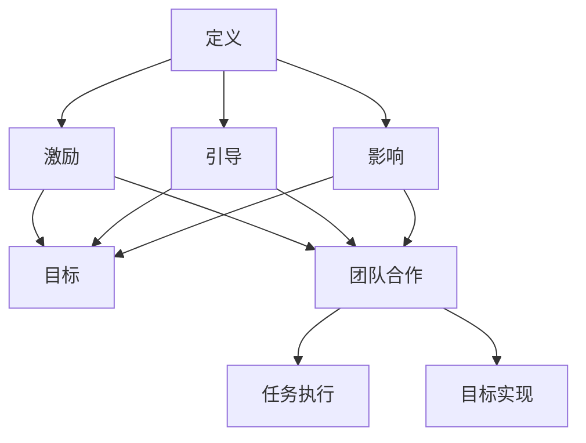

#### 1.2 领导力的重要性

领导力对个人成长的影响是显著的。首先，领导力有助于个人建立自信和自尊。一个有领导力的人能够清晰地表达自己的想法，并能够激发他人的热情和动力。这种自信和自尊不仅有助于个人在职业生涯中取得成功，还能够提升个人的生活质量。

其次，领导力对团队和组织的影响也是至关重要的。一个优秀的领导者能够激励团队成员，使团队更具有凝聚力和战斗力。领导力能够促进团队成员之间的沟通和协作，从而提高团队的整体绩效。在一个有领导力的团队中，成员们更愿意付出额外的努力，以实现共同的目标。

在计算机科学领域，领导力的重要性同样不可忽视。一个优秀的软件架构师或项目经理，能够带领团队克服技术挑战，实现项目的目标。他们不仅要具备深厚的技术知识，还要具备强大的领导力，以应对项目中可能出现的各种问题和挑战。

**Mermaid 流程图：**

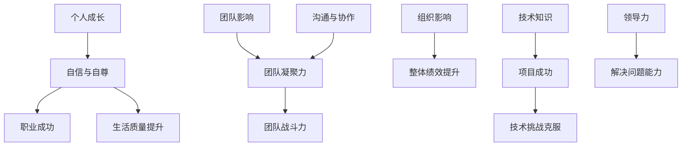

#### 1.3 领导力的发展趋势

随着社会和科技的不断进步，领导力也在不断演变。新型领导力的特点包括：

- **多元化**：现代领导者需要能够理解和尊重不同文化、背景和观点的人。

- **透明性**：领导者需要与团队成员保持开放和透明的沟通，以建立信任。

- **适应性**：领导者需要具备快速适应变化的能力，以应对不确定性的环境。

- **合作性**：领导者需要鼓励团队成员之间的合作，以实现共同的目标。

未来领导力的发展趋势还可能包括：

- **人工智能与数据分析**：领导者需要能够理解和利用人工智能和数据分析技术，以做出更明智的决策。

- **可持续性**：领导者需要关注环境保护和社会责任，以实现可持续发展。

在计算机科学领域，未来的领导力趋势可能包括：

- **云计算和边缘计算**：领导者需要了解云计算和边缘计算的技术原理和应用，以推动技术的创新。

- **区块链技术**：领导者需要了解区块链技术的应用，以推动数字经济的发展。

**Mermaid 流程图：**

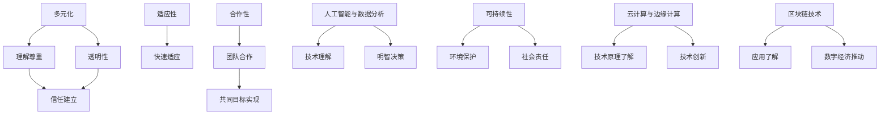

通过上述分析，我们可以看到领导力在个人成长、团队发展和组织绩效中的重要性。在未来的发展中，领导力将继续演变，以适应不断变化的社会和技术环境。在下一部分，我们将探讨战略思维的基础概念，以帮助读者更好地理解战略思维在领导力中的核心作用。

## 第二部分：战略思维

### 第2章：战略思维的基础概念

战略思维是一种高级思维形式，它涉及到对长远目标的明确、对资源的高效利用以及对复杂环境的深入理解。在领导力中，战略思维是确保团队和组织能够持续发展、适应变化和抓住机遇的关键能力。本章节将介绍战略思维的基础概念，包括战略的定义与类型、战略规划的过程以及战略环境分析。

#### 2.1 战略的定义与类型

战略（Strategy）一词源于希腊语“strategos”，意为“将军的艺术”。在商业和企业管理中，战略通常被定义为组织为了实现长远目标而制定的总体行动计划。战略不仅仅是一种计划，更是一种思维方式，它涉及到对组织内外环境的深刻理解，以及对未来趋势的洞察。

根据不同的分类标准，战略可以有多种类型：

1. **竞争战略**：竞争战略主要关注如何在竞争激烈的市场中获得优势。迈克尔·波特（Michael Porter）提出了三种常见的竞争战略：成本领先、差异化以及集中化。

2. **业务战略**：业务战略关注的是如何在一个特定的市场中运营和竞争。它涉及到产品的定位、市场的选择以及核心竞争力的构建。

3. **公司战略**：公司战略关注的是整个组织的长远发展。它涉及到多个业务单元之间的协调和资源分配，以及如何进入新的市场或领域。

4. **国际化战略**：国际化战略主要关注如何将业务扩展到全球市场。它涉及到跨国经营、全球供应链管理以及国际市场营销策略。

在计算机科学领域，战略思维可以类比为软件系统设计中的架构设计。架构设计者需要考虑系统的整体结构和组件，以及如何适应未来的变化和需求。战略思维同样需要这种全局视野和前瞻性思维。

**Mermaid 流�程图：**

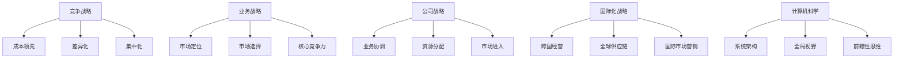

#### 2.2 战略规划的过程

战略规划是一个系统化的过程，它涉及到对组织内外环境的分析、目标的设定、策略的制定以及资源的配置。以下是战略规划的基本步骤：

1. **环境分析**：环境分析是战略规划的第一步，它包括对宏观环境和微观环境的分析。宏观环境分析主要关注政治、经济、社会、技术、环境和法律等因素，而微观环境分析则关注竞争对手、供应商、客户、合作伙伴等。

2. **目标设定**：在环境分析的基础上，组织需要设定清晰的目标。这些目标应该是具体、可衡量、可实现、相关和有时间限制的（SMART原则）。

3. **策略制定**：策略制定是战略规划的核心，它涉及到如何实现设定的目标。策略可以包括市场进入策略、产品开发策略、品牌策略等。

4. **资源配置**：资源配置是将资源（如资金、人力、技术等）分配到不同的策略上，以确保策略的有效执行。

5. **执行与监控**：执行与监控是战略规划的最后一个步骤，它涉及到将策略转化为具体行动，并对行动进行跟踪和评估，以确保目标的实现。

在计算机科学中，战略规划的过程可以类比为软件项目开发中的需求分析、设计、编码、测试和维护。在软件开发中，需求分析是理解用户需求，设计是制定软件架构，编码是实现功能，测试是确保软件质量，维护是持续改进和更新。

**Mermaid 流程图：**

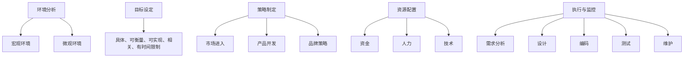

#### 2.3 战略环境分析

战略环境分析是战略规划的重要基础，它涉及到对组织内外环境的全面了解。以下是战略环境分析的几个关键方面：

1. **宏观环境分析**：宏观环境分析主要关注外部环境中的不可控因素，如政治、经济、社会、技术和环境等。这些因素可能会对组织的战略产生重大影响。

2. **微观环境分析**：微观环境分析主要关注组织内部及其直接相关的因素，如竞争对手、供应商、客户和合作伙伴等。这些因素可能会直接影响组织的运营和绩效。

在计算机科学领域，宏观环境分析可以类比为技术趋势分析，而微观环境分析可以类比为市场调研。技术趋势分析可以帮助组织了解哪些技术可能会影响其业务，而市场调研可以帮助组织了解市场需求和竞争对手情况。

**Mermaid 流程图：**

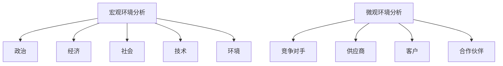

通过上述分析，我们可以看到战略思维在领导力中的核心作用。战略思维不仅帮助领导者制定长远目标，还帮助他们在复杂环境中做出明智的决策。在下一部分，我们将探讨长远规划的理论与实践，以帮助读者更好地理解如何制定和实施长远规划。

### 第3章：长远规划的理论与实践

#### 3.1 长远规划的理论基础

长远规划是战略思维的核心组成部分，它涉及到对组织未来发展的全面规划。长远规划的理论基础包括以下几个方面：

1. **可持续性**：可持续性是长远规划的重要原则，它要求组织在追求短期经济效益的同时，也要考虑长期的社会和环境责任。可持续性原则强调，组织应该制定能够持续发展的战略，以避免资源枯竭和环境污染。

2. **适应性**：适应性是长远规划的关键，它要求组织具备应对不确定性和变化的能力。在快速变化的市场环境中，组织需要能够灵活调整其战略和计划，以适应新的挑战和机遇。

3. **创新**：创新是长远规划的核心动力，它要求组织不断探索新的商业模式、技术和市场机会。创新不仅可以帮助组织在竞争中保持领先地位，还可以为组织带来新的增长点。

在计算机科学领域，长远规划的理论基础可以类比为软件系统设计中的迭代开发。迭代开发强调在软件开发过程中不断进行反馈和改进，以适应不断变化的需求和用户反馈。

**Mermaid 流程图：**

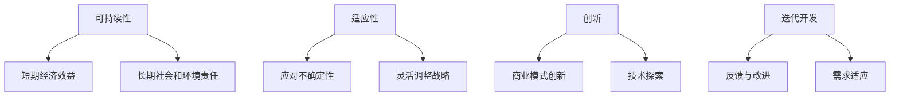

#### 3.2 长远规划的方法

长远规划的方法包括多种工具和技术，以下是一些常用的方法：

1. **SWOT分析**：SWOT分析是一种常用的战略规划工具，它通过分析组织的优势（Strengths）、劣势（Weaknesses）、机会（Opportunities）和威胁（Threats），帮助组织制定合适的战略。

   - **优势**：组织内部的优势，如技术实力、品牌知名度、员工素质等。
   - **劣势**：组织内部的劣势，如资金不足、技术落后、管理不规范等。
   - **机会**：外部环境中的机会，如市场扩张、技术创新、政策支持等。
   - **威胁**：外部环境中的威胁，如市场竞争加剧、技术变革、政策限制等。

2. **波士顿矩阵**：波士顿矩阵是一种用于分析产品组合和业务发展的工具。它将产品分为四类：明星（Stars）、现金牛（Cash Cows）、瘦狗（Dogs）和问题儿童（Question Marks）。

   - **明星**：高增长、高市场份额的产品，需要继续投入资源以保持领先地位。
   - **现金牛**：低增长、高市场份额的产品，可以通过提高效率和降低成本来创造利润。
   - **瘦狗**：低增长、低市场份额的产品，可以考虑逐步退出或转型。
   - **问题儿童**：高增长、低市场份额的产品，需要进一步评估和投资。

在计算机科学领域，SWOT分析和波士顿矩阵可以类比为软件系统的性能优化和资源分配。通过SWOT分析，组织可以了解系统的优势和劣势，并通过波士顿矩阵来优化产品组合，提高系统性能。

**Mermaid 流程图：**

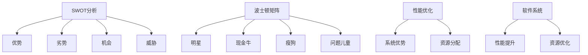

#### 3.3 长远规划的具体实践

长远规划的具体实践包括制定团队愿景、设定战略目标以及分解战略目标等步骤。

1. **制定团队愿景**：团队愿景是长远规划的核心，它描述了团队希望实现的长远目标和理想状态。制定团队愿景需要团队成员共同参与，以确保愿景的可行性和吸引力。

2. **设定战略目标**：战略目标是实现团队愿景的具体步骤和指标。战略目标应该是具体、可衡量、可实现、相关和有时间限制的（SMART原则）。

3. **分解战略目标**：分解战略目标是将战略目标分解为具体的行动和任务，以确保战略目标的实现。分解战略目标需要考虑资源的配置、时间的安排以及责任分工。

在计算机科学领域，制定团队愿景、设定战略目标和分解战略目标可以类比为软件开发中的需求分析、设计文档和任务分解。需求分析确定软件的功能和性能要求，设计文档描述软件的系统架构和模块划分，任务分解将开发任务分配给不同的开发人员。

**Mermaid 流程图：**

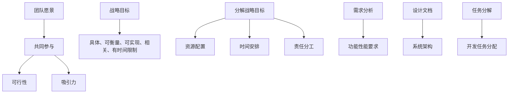

通过上述分析，我们可以看到长远规划在战略思维中的核心作用。长远规划不仅帮助组织明确目标，还帮助组织制定具体的行动计划，以确保目标的实现。在下一部分，我们将探讨团队建设的重要性，以帮助读者更好地理解如何建立高效的团队。

### 第4章：团队建设的重要性

团队建设是组织成功的关键，它涉及到如何有效地组织、引导和激励团队成员，以实现共同的目标。一个高效的团队不仅能够提高工作效率，还能够促进创新和团队凝聚力。本章节将探讨团队建设的定义与类型、建设方法和团队发展模型。

#### 4.1 团队的定义与类型

团队是一种组织形式，它由多个成员共同组成，为实现共同的目标而协作。团队的定义和类型多种多样，以下是一些常见的团队类型：

1. **功能型团队**：功能型团队是基于组织的职能或部门划分的团队，如销售团队、研发团队等。这种团队通常负责特定的任务或职能。

2. **跨职能团队**：跨职能团队是由来自不同部门或职能的成员组成的团队，如项目团队。这种团队可以更好地整合不同领域的知识和资源，以解决复杂问题。

3. **临时团队**：临时团队是为了完成特定任务或项目而组建的团队，任务完成后团队会解散。这种团队通常具有明确的任务目标和时间限制。

4. **虚拟团队**：虚拟团队是通过网络和通信技术连接的团队成员，他们可能分布在不同的地理位置。这种团队需要高效的沟通和协作工具，以保持团队的凝聚力。

在计算机科学领域，团队可以类比为软件开发团队。软件开发团队通常由不同职能的成员组成，如开发人员、测试人员、UI/UX设计师等。这种团队需要高效的协作和沟通，以完成软件项目的开发。

**Mermaid 流程图：**

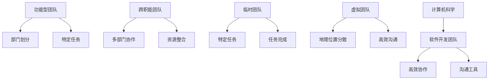

#### 4.2 团队建设的方法

团队建设是一个持续的过程，它需要组织在多个方面进行努力。以下是一些常用的团队建设方法：

1. **团队文化塑造**：团队文化是团队的灵魂，它决定了团队成员的行为和价值观。团队文化塑造包括建立共同的目标、价值观和行为规范，以增强团队的凝聚力。

2. **团队协作机制**：团队协作机制是确保团队成员能够高效合作的关键。这包括明确的角色分工、沟通机制、决策流程和冲突解决机制等。

3. **培训与激励**：培训与激励是提高团队成员能力和积极性的关键。组织可以通过提供培训机会、设定激励机制和奖励优秀员工，来提高团队的整体绩效。

在计算机科学领域，团队建设可以类比为软件开发过程中的团队管理。团队管理包括确保团队成员的技能匹配、提供必要的资源和支持、建立高效的沟通和协作机制等。

**Mermaid 流程图：**

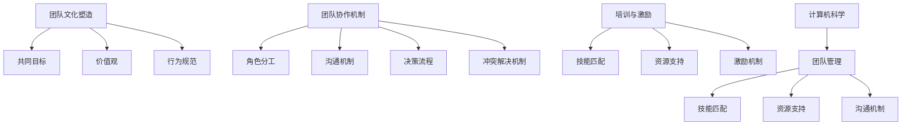

#### 4.3 团队发展模型

团队发展模型描述了团队从形成到成熟的过程。以下是一些常见的团队发展模型：

1. **成长阶段模型**：成长阶段模型描述了团队从形成到成熟的过程，包括形成期、激荡期、规范期、执行期和成熟期。

   - **形成期**：团队成员开始了解彼此，建立初步的信任和合作。
   - **激荡期**：团队成员之间可能出现冲突和竞争，团队需要建立共同的价值观和目标。
   - **规范期**：团队成员开始形成共同的规范和价值观，团队内部的合作逐渐稳定。
   - **执行期**：团队进入高效执行阶段，成员之间协作默契，目标实现。
   - **成熟期**：团队达到了成熟状态，能够高效地应对各种挑战和变化。

2. **学习型组织理论**：学习型组织理论强调组织应该不断学习和适应变化。学习型组织具有以下特征：

   - **自我超越**：组织成员不断追求个人和组织的卓越，追求更高的目标。
   - **改善心智模式**：组织成员改变思维方式和观念，以更好地适应外部环境。
   - **共同愿景**：组织成员共同制定愿景和目标，为实现共同目标而努力。
   - **团队学习**：组织成员通过团队学习和知识共享，提高整体绩效。

在计算机科学领域，成长阶段模型可以类比为软件开发过程中的迭代开发。每次迭代都是团队学习和成长的机会，通过不断的反馈和改进，团队能够提高软件质量和创新能力。

**Mermaid 流程图：**

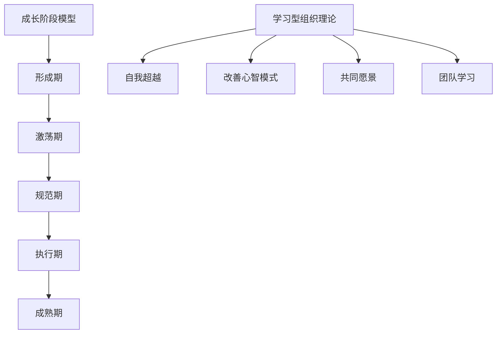

通过上述分析，我们可以看到团队建设在组织发展中的核心作用。一个高效的团队不仅能够提高工作效率，还能够促进创新和团队凝聚力。在下一部分，我们将探讨领导力与战略思维的提升方法，以帮助读者了解如何提升个人和团队的能力。

### 第5章：领导力与战略思维的提升方法

在复杂多变的环境中，提升领导力和战略思维是确保团队和组织持续发展的关键。本章节将探讨提升领导力和战略思维的具体方法，包括自我提升、战略思维的培养以及能力提升的具体策略。

#### 5.1 领导力的自我提升

自我提升是领导力发展的基础，它涉及到自我认知、自我反思和持续学习。以下是一些有效的自我提升方法：

1. **自我反思**：自我反思是领导者认识自我、发现问题和改进能力的重要途径。领导者可以通过日记、面谈、自我评估等方式进行反思，以了解自己在领导过程中的优点和不足。

2. **领导力培训**：领导力培训是一种系统的学习方式，它通过课程、讲座、模拟演练等手段，帮助领导者提升领导技能和知识。领导力培训可以包括内部培训、外部培训和在线课程等多种形式。

3. **阅读和学习**：阅读和学习是领导者不断积累知识和经验的途径。领导者可以通过阅读领导力书籍、学习相关课程、参加行业会议等方式，了解最新的领导理论和实践。

在计算机科学领域，自我提升可以类比为软件开发中的代码审查和测试。代码审查和测试可以帮助开发者发现代码中的问题和不足，通过持续学习和改进，提高代码的质量和可靠性。

**Mermaid 流程图：**

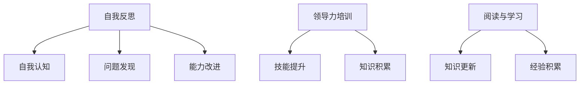

#### 5.2 战略思维的培养

战略思维的培养是一个长期的过程，它需要领导者具备系统思维、前瞻性思维和逻辑思维。以下是一些培养战略思维的方法：

1. **增强逻辑思维能力**：逻辑思维是战略思维的基础，它涉及到分析、推理和判断。领导者可以通过学习逻辑学、哲学等学科，提高自己的逻辑思维能力。

2. **提高信息收集与分析能力**：战略思维需要领导者具备强大的信息收集和分析能力。领导者可以通过建立信息网络、参加行业会议、研究市场报告等方式，提高对市场趋势和环境变化的敏感度。

3. **实践与反思**：实践是培养战略思维的重要途径，领导者可以通过参与项目、决策制定等实践，积累战略思维的经验。同时，通过反思实践中的得失，不断改进和提升战略思维能力。

在计算机科学领域，战略思维的培养可以类比为软件系统的设计和优化。设计优秀的软件系统需要深入的逻辑思维和系统的信息收集与分析，通过不断的实践和反思，优化系统性能和用户体验。

**Mermaid 流程图：**

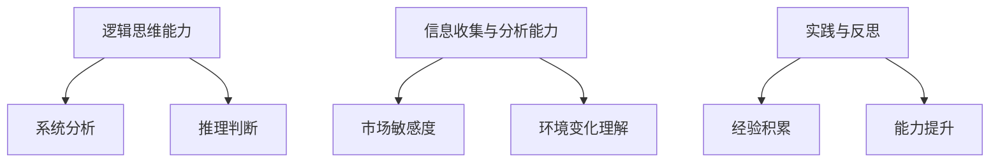

#### 5.3 能力提升的具体策略

为了提升领导力和战略思维，领导者需要采取一系列具体的策略。以下是一些有效的策略：

1. **建立学习型团队**：学习型团队是一种通过持续学习和知识共享，实现团队整体绩效提升的组织形式。领导者可以通过制定学习计划、组织团队讨论和培训活动，建立学习型团队。

2. **培养创新能力**：创新能力是领导者战略思维的重要组成部分。领导者可以通过鼓励创新思维、提供创新资源和搭建创新平台，培养团队的创新能力。

3. **构建良好的组织文化**：组织文化是影响领导力和战略思维的重要因素。领导者可以通过塑造积极向上的组织文化，提高团队的凝聚力和执行力。

在计算机科学领域，建立学习型团队和培养创新能力可以类比为软件开发中的敏捷开发和持续集成。敏捷开发强调团队协作和持续改进，持续集成则通过自动化测试和持续部署，提高软件质量和交付效率。

**Mermaid 流程图：**

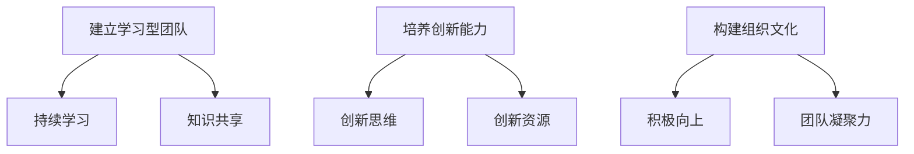

通过上述分析，我们可以看到提升领导力和战略思维的具体方法和策略。在未来的发展中，领导者需要不断自我提升和战略思维培养，以应对复杂多变的环境。在下一部分，我们将通过案例研究，展示领导力与战略思维在实践中的应用和效果。

### 第6章：领导力与战略思维的实践案例

通过具体的实践案例，我们可以更深入地了解领导力与战略思维在团队发展中的应用和效果。在本章节中，我们将分析两个企业A和B的领导力与战略思维案例，探讨其成功经验和面临的挑战与解决方案。

#### 6.1 企业A的领导力与战略思维案例分析

**企业背景介绍：**

企业A是一家专注于高科技产品研发和销售的企业，成立于20世纪90年代。企业A以其创新的技术和优质的产品在市场中建立了良好的声誉。然而，随着市场竞争的加剧和技术的快速迭代，企业A面临着巨大的挑战。

**领导力与战略思维的应用：**

1. **领导力应用：**
   - **愿景与目标设定**：企业A的CEO在面临市场变化时，明确提出了“创新驱动、用户至上”的愿景，并制定了具体的战略目标，如提升技术研发能力、扩大市场份额等。
   - **团队建设**：CEO通过建立学习型团队，鼓励团队成员参与决策和培训，提高团队的整体能力和凝聚力。
   - **激励与反馈**：CEO建立了公平的激励机制，对表现优秀的员工进行奖励，同时定期进行绩效评估，以激励团队成员持续提升。

2. **战略思维应用：**
   - **市场分析**：企业A通过市场调研和数据分析，了解了市场需求和技术趋势，为产品研发和市场营销提供了有力的支持。
   - **资源优化**：企业A在战略规划过程中，对资源进行了合理配置，确保关键项目得到充分的支持和资源投入。
   - **风险管理**：企业A建立了完善的风险管理体系，通过风险预测和应对措施，降低了市场变化和技术创新带来的风险。

**成功经验：**
- 企业A通过明确愿景和目标，建立了学习型团队，提高了团队的凝聚力和创新能力。
- 通过市场分析和资源优化，企业A能够迅速响应市场变化，保持竞争优势。

**面临的挑战与解决方案：**
- **挑战**：随着市场竞争的加剧，企业A在产品创新和市场营销方面面临巨大压力。
  - **解决方案**：企业A通过加强研发投入，引进高端人才，提高技术研发能力，以保持技术领先优势。

- **挑战**：企业A在全球化进程中，面临着跨文化管理和国际市场开拓的挑战。
  - **解决方案**：企业A通过建立国际化的管理团队，加强跨文化培训，提高了企业在全球市场的竞争力。

#### 6.2 企业B的领导力与战略思维案例分析

**企业背景介绍：**

企业B是一家传统制造业企业，成立于20世纪50年代。随着市场环境的变化，企业B面临着转型升级的挑战。企业B需要通过创新和战略规划，实现从传统制造业向现代制造业的转型。

**领导力与战略思维的应用：**

1. **领导力应用：**
   - **变革领导**：企业B的CEO通过推行变革领导，推动企业从传统管理模式向现代化管理模式的转变。
   - **团队激励**：CEO通过建立激励机制，鼓励员工积极参与企业的创新和变革，提高员工的积极性和创造力。
   - **组织文化**：CEO强调企业的核心价值和文化，通过文化建设增强员工的归属感和忠诚度。

2. **战略思维应用：**
   - **产业转型**：企业B通过市场调研和技术分析，明确了产业转型的方向，如从传统制造向智能制造转型。
   - **技术创新**：企业B加大研发投入，引进先进技术，提高生产效率和产品质量。
   - **市场拓展**：企业B通过市场分析和战略规划，开拓了新的市场和业务领域，实现了业务的多元化和国际化。

**成功经验：**
- 企业B通过变革领导和文化建设，激发了员工的创新潜力和积极性，为企业的转型升级奠定了基础。
- 通过技术创新和市场拓展，企业B成功实现了业务的多元化和国际化。

**面临的挑战与解决方案：**
- **挑战**：企业在转型过程中，面临着技术风险和市场风险。
  - **解决方案**：企业B通过技术创新和市场调研，降低了转型过程中的风险，确保了转型的成功。

- **挑战**：企业在全球市场中，面临着激烈的竞争和不确定的市场环境。
  - **解决方案**：企业B通过加强品牌建设和客户关系管理，提高了市场竞争力，确保了业务的稳定增长。

#### 6.3 总结与启示

通过企业A和企业B的案例，我们可以看到领导力与战略思维在实践中的重要性和应用效果。以下是案例中的成功经验和启示：

1. **明确愿景和目标**：领导者需要明确企业的愿景和目标，以指导企业的战略规划和决策。

2. **建立学习型团队**：通过建立学习型团队，提高团队的整体能力和创新能力。

3. **激励机制**：建立合理的激励机制，激发员工的积极性和创造力。

4. **技术创新**：加大研发投入，引进先进技术，提高企业的竞争力。

5. **市场拓展**：通过市场分析和战略规划，开拓新的市场和业务领域。

6. **风险管理**：建立完善的风险管理体系，降低市场变化和技术创新带来的风险。

通过这些成功经验和启示，我们可以看到领导力与战略思维在团队发展中的核心作用。在未来的发展中，领导者需要不断学习和提升自己的领导力和战略思维，以应对复杂多变的环境，推动团队和组织的持续发展。

### 第7章：领导力与战略思维的未来发展趋势

随着科技的不断进步和社会的快速变化，领导力与战略思维也在不断演变。未来的发展趋势将受到人工智能、大数据、社交媒体和数字化等新技术的影响。本章节将探讨这些技术对领导力与战略思维的影响，以及未来领导力与战略思维的新趋势。

#### 7.1 科技进步对领导力与战略思维的影响

1. **人工智能与大数据**：人工智能（AI）和大数据技术的快速发展，为领导者提供了更多的数据和信息，使他们能够更准确地分析市场趋势和消费者行为。领导者可以利用AI技术进行预测分析，制定更有效的战略决策。同时，大数据技术可以帮助领导者了解员工的工作表现和团队的整体绩效，从而优化管理策略。

2. **社交媒体与数字化**：社交媒体的普及和数字化时代的到来，改变了领导者与团队成员之间的沟通方式。领导者可以通过社交媒体平台与团队成员保持实时沟通，了解他们的想法和需求。此外，数字化工具可以帮助领导者更高效地管理项目和团队，提高协作和沟通效率。

**Mermaid 流程图：**

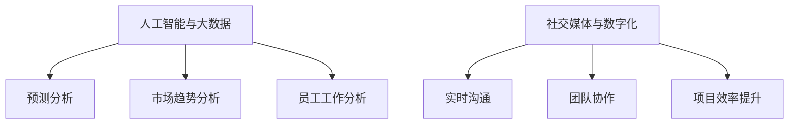

#### 7.2 未来领导力与战略思维的新趋势

1. **跨界合作**：未来的领导者需要具备跨界合作的能力，能够整合不同领域的技术和资源，以应对复杂的问题和挑战。跨界合作不仅可以帮助领导者开拓新的市场机会，还可以促进创新和知识共享。

2. **持续学习**：在快速变化的环境中，领导者需要具备持续学习的能力，不断更新知识和技能。未来的领导者应该积极参与行业培训、学术交流和前沿技术研究，以保持竞争力和创新能力。

3. **数字化领导力**：数字化领导力是未来领导者必须掌握的能力，它涉及到如何利用数字化工具和技术进行管理、决策和沟通。领导者需要了解数字化趋势，掌握数字化管理技能，以适应数字化时代的挑战。

**Mermaid 流程图：**

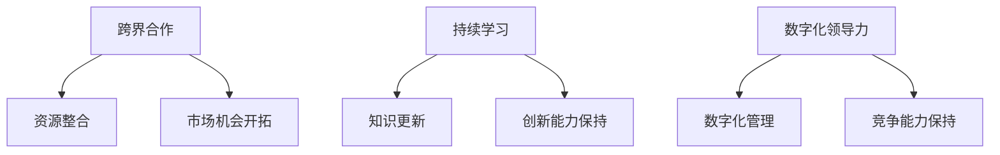

#### 7.3 为未来做好准备

1. **领导力的传承**：领导者需要关注团队内部的人才培养和领导力传承，确保组织在领导者离职或退休后仍然能够保持高效运转。通过建立领导力发展计划，培养新一代领导者，确保组织的人才储备。

2. **战略思维的创新**：领导者需要不断探索和创新战略思维，以应对不确定性和变化。通过引入新的战略思维方法和工具，如设计思维、敏捷战略等，领导者可以更好地应对复杂的市场环境。

3. **技术投资的持续**：领导者需要重视技术投资，确保组织在人工智能、大数据、云计算等新技术领域保持领先地位。通过技术投资，组织可以提升竞争力，抓住市场机遇。

**Mermaid 流程图：**

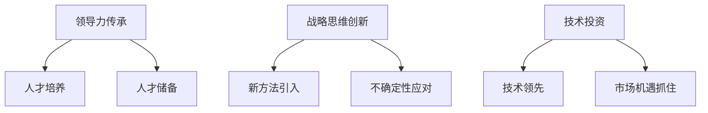

通过上述分析，我们可以看到未来的领导力和战略思维将受到科技进步和社会变化的深刻影响。未来的领导者需要具备跨界合作、持续学习和数字化领导力等能力，以应对复杂多变的环境。同时，领导力与战略思维的传承和创新也是组织持续发展的重要保障。在未来的发展中，领导者需要不断学习和适应，以引领团队和组织走向成功。

## 总结与展望

领导力与战略思维在团队发展中扮演着至关重要的角色。通过本文的深入探讨，我们明确了领导力的本质与重要性，了解了战略思维的基础概念，并学习了长远规划的理论与实践。同时，我们还探讨了团队建设的重要性以及如何提升领导力和战略思维。通过实践案例，我们看到了领导力与战略思维在现实中的应用和效果。展望未来，科技进步将继续影响领导力和战略思维的发展，未来的领导者需要具备跨界合作、持续学习和数字化领导力等能力。

在此，我们再次强调领导力和战略思维的重要性。它们不仅帮助领导者明确目标、应对挑战、抓住机遇，还能提高团队的凝聚力和创新能力。为了在未来取得成功，领导者需要不断学习和提升自己的能力，关注团队的建设和发展。只有具备强大的领导力和战略思维，团队和组织才能在竞争激烈的环境中立于不败之地。

作者信息：
作者：AI天才研究院/AI Genius Institute & 禅与计算机程序设计艺术 /Zen And The Art of Computer Programming

感谢您的阅读，希望本文对您在领导力与战略思维方面的探索和实践有所启发。在未来的道路上，让我们一起不断学习和进步，共同创造更美好的未来。

