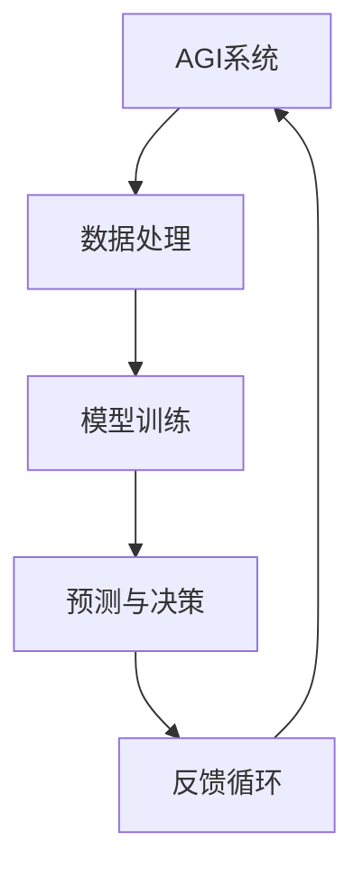

                 

### 引言

人工智能（AI）作为计算机科学的一个分支，正迅速改变着我们的世界。从简单的规则系统到复杂的机器学习算法，AI技术已经在多个领域展现出其强大的应用潜力。然而，传统的AI系统大多属于“窄AI”（Narrow AI），即它们在特定任务上表现出色，但缺乏处理多种不同任务的能力。这种局限性使得人类对于构建一种能够像人类一样进行广泛智能活动的通用人工智能（AGI）充满了期待。

通用人工智能（AGI）是一种旨在实现人类智能水平的AI系统，它不仅能够在特定任务上表现出色，还能够跨领域进行学习、推理和决策。AGI的目标是超越现有的“窄AI”系统，实现真正的智能化。然而，AGI的实现面临着巨大的技术挑战，包括复杂的认知模型、自主性、通用推理能力和人类意识模拟等。

与此同时，人类智能增强（Human Intelligence Augmentation, HIA）的概念也逐渐兴起。智能增强通过技术手段提升人类在认知、学习、决策等方面的能力，从而实现人类潜能的进一步发挥。智能增强技术包括硬件增强、软件增强和神经增强等多种形式，已经在医疗、教育、工业等领域展现出显著的应用价值。

本文旨在探讨AGI与人类智能增强之间的协同发展关系。我们将首先介绍AGI的基本概念、发展历程和核心原理，然后分析人类智能增强的原理与应用，最后探讨AGI与人类智能增强的协同发展及其未来展望。通过这种逻辑清晰、结构紧凑的讨论，我们希望能够为读者提供一种全面、深入的理解，从而为AGI与人类智能增强的融合应用提供有益的思考。

---

**关键词**：通用人工智能（AGI）、人类智能增强（HIA）、认知模型、自主性、神经网络、强化学习、神经增强、智能增强技术、协同发展。

**摘要**：本文详细探讨了通用人工智能（AGI）与人类智能增强（HIA）的协同发展。首先介绍了AGI的基本概念、发展历程和核心原理，包括神经网络与深度学习、强化学习与监督学习等。接着，分析了人类智能增强的原理与应用，包括硬件增强、软件增强和神经增强技术。最后，探讨了AGI与HIA的协同发展及其对人类潜能的释放和未来社会的潜在影响。本文旨在通过逻辑清晰的分析，为AGI与HIA的融合应用提供深入见解。

---

### 《AGI与人类智能增强的协同发展》目录大纲

#### 第一部分：AGI基础

- 第1章：什么是AGI
  - 1.1 AGI的概念与发展历程
    - 1.1.1 AGI的定义与特征
    - 1.1.2 AGI的发展历程
  - 1.2 人类智能的局限性
    - 1.2.1 现有AI技术的局限性
    - 1.2.2 人类智能的局限与挑战

- 第2章：AGI的核心原理
  - 2.1 人工智能的基本原理
    - 2.1.1 神经网络与深度学习
    - 2.1.2 强化学习与监督学习
  - 2.2 AGI的关键技术
    - 2.2.1 自主性
    - 2.2.2 通用推理
    - 2.2.3 人类意识模拟

- 第3章：AGI的数学模型与算法
  - 3.1 模型构建
    - 3.1.1 神经网络架构设计
    - 3.1.2 损失函数与优化算法
  - 3.2 算法实现
    - 3.2.1 反向传播算法
    - 3.2.2 强化学习算法
    - 3.2.3 图灵测试与自动化定理证明

#### 第二部分：人类智能增强的原理与应用

- 第4章：智能增强的概念与分类
  - 4.1 智能增强的定义
    - 4.1.1 智能增强的技术手段
    - 4.1.2 智能增强的应用领域
  - 4.2 智能增强的分类
    - 4.2.1 硬件增强
    - 4.2.2 软件增强
    - 4.2.3 神经增强

- 第5章：神经增强技术的原理与应用
  - 5.1 神经增强的基本原理
    - 5.1.1 神经可塑性
    - 5.1.2 神经接口技术
  - 5.2 神经增强技术的应用
    - 5.2.1 记忆增强
    - 5.2.2 学习能力增强
    - 5.2.3 认知能力增强

- 第6章：软件增强技术的原理与应用
  - 6.1 软件增强的基本原理
    - 6.1.1 人工智能辅助
    - 6.1.2 大数据与云计算支持
  - 6.2 软件增强技术的应用
    - 6.2.1 工作效率提升
    - 6.2.2 创造力激发
    - 6.2.3 决策支持

#### 第三部分：AGI与人类智能增强的协同发展

- 第7章：AGI与人类智能增强的关系
  - 7.1 AGI对人类智能增强的影响
    - 7.1.1 协同发展的意义
    - 7.1.2 AGI提升人类智能的潜力
  - 7.2 人类智能增强对AGI的促进作用
    - 7.2.1 数据与计算资源支持
    - 7.2.2 人类知识与经验的反馈

- 第8章：AGI与人类智能增强的未来展望
  - 8.1 智能增强技术的未来发展趋势
    - 8.1.1 技术融合与创新
    - 8.1.2 社会伦理与法律问题
  - 8.2 AGI与人类智能协同发展的前景
    - 8.2.1 未来社会的影响
    - 8.2.2 人类潜能的全面释放

#### 附录

- 附录 A: AGI与智能增强的相关资源
  - A.1 研究机构与学术论文
  - A.2 开源项目与工具
  - A.3 智能增强应用案例与最佳实践

- 附录 B: Mermaid流程图示例

- 附录 C: 算法伪代码示例

- 附录 D: 数学公式与解释

---

### 第一部分：AGI基础

#### 第1章：什么是AGI

**1.1 AGI的概念与发展历程**

**1.1.1 AGI的定义与特征**

通用人工智能（Artificial General Intelligence, AGI）是指具有人类智能水平，能够在多种不同任务上表现出卓越能力的机器智能。与现有的“窄AI”（Narrow AI）不同，AGI不仅能在特定领域内表现出色，还能够跨越不同领域进行学习和应用。AGI的目标是实现一种全面的智能化，使机器能够在自然语言处理、图像识别、决策制定、创造性思维等方面与人类智能相媲美。

AGI的核心特征包括：

1. **广泛适应性**：AGI应具备在不同环境中自主学习和适应的能力，而不需要人为的预设规则和参数。
2. **通用推理能力**：AGI应能够进行复杂的推理和判断，不仅限于特定任务的解决。
3. **自主性**：AGI应具备自主决策和行动的能力，而不依赖于外部指令。
4. **理解与学习能力**：AGI应能够理解自然语言、图像、声音等多种信息形式，并从这些信息中学习。

**1.1.2 AGI的发展历程**

AGI的概念最早可以追溯到20世纪50年代，当时的计算机科学家和哲学家开始探讨机器是否能够模拟人类智能。在20世纪80年代，随着人工智能技术的兴起，AGI研究也取得了一些初步成果，如专家系统和早期的神经网络。然而，由于技术限制和理论瓶颈，AGI的发展进程一度放缓。

进入21世纪，随着计算能力的提升和数据资源的丰富，AGI研究再次成为热点。深度学习和强化学习等新兴技术为AGI的实现提供了新的思路和工具。例如，谷歌的AlphaGo在围棋领域的卓越表现，展示了AGI在特定领域内取得的突破。

尽管AGI的最终实现仍然面临诸多挑战，但这一领域的研究已展现出巨大的潜力和应用前景。

**1.2 人类智能的局限性**

**1.2.1 现有AI技术的局限性**

现有的AI技术，特别是“窄AI”，虽然在特定任务上表现出色，但仍然存在一些局限性。首先，这些AI系统往往依赖于大量的数据和高性能的计算资源。其次，它们在处理复杂任务、跨领域学习和通用推理方面存在困难。此外，现有的AI系统缺乏自主性和自我意识，无法像人类一样进行自我决策和行动。

**1.2.2 人类智能的局限与挑战**

人类智能虽然具有高度的适应性和灵活性，但也存在一些固有的局限性。例如，人类在处理海量信息和复杂任务时效率有限，容易受到情感和心理因素的影响。此外，人类智能在某些领域（如逻辑推理和数学证明）表现出色，但在其他领域（如图像识别和自然语言处理）则相对较弱。

这些局限使得人类在面对快速变化的世界和日益复杂的任务时，需要借助AI技术来增强自身能力。人类智能与AI的结合，有望实现更高效、更智能的解决方案，从而推动社会的发展和进步。

---

### 第二部分：人类智能增强的原理与应用

#### 第4章：智能增强的概念与分类

**4.1 智能增强的定义**

智能增强（Intelligence Augmentation, IA）是指利用技术手段提升人类在认知、学习、决策等方面的能力，从而实现人类潜能的进一步发挥。智能增强不仅包括硬件层面的增强，如辅助设备和工具，还包括软件层面的增强，如人工智能算法和数据分析工具。

**4.1.1 智能增强的技术手段**

智能增强的技术手段主要包括以下几个方面：

1. **硬件增强**：通过辅助设备和工具提升人类的感知、运动和认知能力。例如，智能眼镜、智能手表等设备可以提供实时信息反馈，辅助人类进行决策和行动。
2. **软件增强**：通过人工智能算法和数据分析技术，提升人类的信息处理和分析能力。例如，自然语言处理技术可以帮助人类更高效地处理文本信息，图像识别技术可以帮助人类更准确地进行图像分析。
3. **神经增强**：通过神经科学和生物技术的手段，直接增强大脑的感知、记忆和认知能力。例如，通过电刺激技术可以提升大脑的学习和记忆能力，通过脑机接口技术可以实现人类与外部设备的高效交互。

**4.1.2 智能增强的应用领域**

智能增强技术广泛应用于多个领域，以下是一些典型的应用案例：

1. **医疗领域**：智能增强技术可以帮助医生更准确地诊断疾病、制定治疗方案。例如，通过医学影像识别技术，医生可以更快速地识别病灶，提高诊断的准确性。
2. **教育领域**：智能增强技术可以提升学生的学习效果和创造力。例如，通过智能辅导系统，学生可以根据自身的学习进度和需求，获得个性化的学习指导。
3. **工业领域**：智能增强技术可以提高工业生产的效率和质量。例如，通过智能机器人，工人可以更安全、更高效地进行生产操作，减少人为错误。

**4.2 智能增强的分类**

根据智能增强技术的实现方式，可以将智能增强分为以下几类：

1. **硬件增强**：通过辅助设备和工具实现智能增强，如智能眼镜、智能手表等。
2. **软件增强**：通过人工智能算法和数据分析技术实现智能增强，如自然语言处理、图像识别等。
3. **神经增强**：通过神经科学和生物技术手段实现智能增强，如电刺激、脑机接口等。

每种智能增强技术都有其独特的优势和适用场景，通过多种技术的结合，可以进一步提升人类智能的效能。

---

### 第三部分：AGI与人类智能增强的协同发展

#### 第7章：AGI与人类智能增强的关系

**7.1 AGI对人类智能增强的影响**

**7.1.1 协同发展的意义**

AGI与人类智能增强的协同发展具有重要的意义。首先，AGI能够提供更强大、更智能的辅助工具，进一步提升人类在各个领域的认知和操作能力。例如，AGI系统可以协助医生进行更复杂的疾病诊断和治疗方案制定，从而提高医疗水平。其次，AGI可以促进人类与机器的深度协作，使人类能够更加高效地完成复杂任务。例如，通过AGI系统的辅助，工程师可以更快速地设计复杂的产品，提高生产效率。

**7.1.2 AGI提升人类智能的潜力**

AGI在提升人类智能方面具有巨大的潜力。首先，AGI能够通过自我学习和进化，不断优化自身的性能和功能，从而为人类提供更加智能、高效的解决方案。其次，AGI能够跨越不同领域进行学习和应用，使人类在解决复杂问题时能够充分利用AGI的能力。例如，AGI系统可以结合医学、工程、经济学等多领域的知识，提供更全面、更科学的决策支持。

**7.2 人类智能增强对AGI的促进作用**

**7.2.1 数据与计算资源支持**

人类智能增强技术为AGI的发展提供了重要的数据与计算资源支持。首先，通过智能增强技术，人类可以更高效地收集、处理和分析大量的数据，为AGI的训练和优化提供丰富的数据源。例如，通过智能传感器和数据分析工具，可以实时监测环境变化，为AGI提供实时的数据输入。其次，人类智能增强技术可以提高计算资源的利用效率，为AGI的研究和开发提供强大的计算支持。例如，通过分布式计算和云计算技术，可以实现对大规模数据的快速处理和分析。

**7.2.2 人类知识与经验的反馈**

人类智能增强技术不仅为AGI提供了数据与计算资源支持，还通过人类知识与经验的反馈，促进AGI的进一步发展。首先，人类在长期实践中积累的知识和经验对AGI的训练和优化具有重要意义。例如，医生的临床经验和工程师的专业知识可以指导AGI系统在医疗和教育领域中的应用。其次，人类智能增强技术可以帮助人类更好地理解AGI的工作原理和应用效果，从而为AGI的改进提供宝贵的反馈。例如，通过人机交互技术，可以收集用户对AGI系统的反馈，用于优化AGI的界面设计和交互体验。

---

### 第8章：AGI与人类智能增强的未来展望

**8.1 智能增强技术的未来发展趋势**

**8.1.1 技术融合与创新**

随着技术的不断进步，智能增强技术将与其他前沿技术（如量子计算、区块链等）实现融合与创新。例如，量子计算可以提供更高效的计算能力，为智能增强技术的应用提供强大支持；区块链技术可以保障数据的安全性和隐私性，为智能增强技术的应用提供可靠的保障。这种技术融合与创新将推动智能增强技术的快速发展，为人类智能的增强提供更多可能性。

**8.1.2 社会伦理与法律问题**

智能增强技术的快速发展也带来了社会伦理与法律问题。首先，如何确保智能增强技术的安全性和可靠性，防止潜在的滥用和风险，是当前需要解决的重要问题。其次，智能增强技术可能导致人类在认知和操作能力上的依赖性增加，如何平衡技术辅助与人类自主性，是另一个需要关注的问题。此外，智能增强技术的应用可能引发新的社会不平等，如技术差距、数据垄断等，如何制定合理的法律法规，保障社会公平与正义，也是需要探讨的重要议题。

**8.2 AGI与人类智能协同发展的前景**

**8.2.1 未来社会的影响**

AGI与人类智能的协同发展将对未来社会产生深远的影响。首先，智能增强技术将提高人类在各个领域的生产力和创新能力，推动社会经济的发展。例如，智能农业、智能制造等领域的应用将大幅提高生产效率，降低成本。其次，智能增强技术将促进人类与机器的深度协作，使人类社会更加智能化、高效化。例如，通过智能交通系统，可以实现更智能的交通管理和调度，提高出行效率。此外，智能医疗、智能教育等领域的应用将显著提高生活质量和社会福祉。

**8.2.2 人类潜能的全面释放**

AGI与人类智能的协同发展将有助于全面释放人类潜能。首先，通过智能增强技术，人类可以更高效地处理复杂任务，提高决策质量和执行力。例如，通过智能助手和智能顾问，人类可以更快速地获取信息、分析问题，做出科学决策。其次，智能增强技术将促进人类的创造性思维和创新能力。例如，通过智能创作工具，人类可以更轻松地创作音乐、绘画、文学作品等，激发艺术创造力。此外，智能增强技术还将提升人类在认知、学习、记忆等领域的效能，使人类能够更加专注和高效地进行学习和创新。

---

### 附录

**附录A: AGI与智能增强的相关资源**

**A.1 研究机构与学术论文**

- **人工智能协会（AAAI）**：http://www.aaai.org/
- **国际人工智能联合会议（IJCAI）**：https://ijcaai.org/
- **国际机器学习研讨会（ICML）**：https://icml.cc/
- **自然语言处理会议（ACL）**：https://www.aclweb.org/

**A.2 开源项目与工具**

- **TensorFlow**：https://www.tensorflow.org/
- **PyTorch**：https://pytorch.org/
- **Keras**：https://keras.io/
- **OpenAI**：https://openai.com/

**A.3 智能增强应用案例与最佳实践**

- **智能医疗**：IBM Watson Health
- **智能教育**：Khan Academy
- **智能制造**：通用电气（GE）的Predix平台
- **智能交通**：特斯拉的自动驾驶系统

---

### 附录B: Mermaid流程图示例



这个流程图展示了AGI系统的基本工作流程，包括数据处理、模型训练、预测与决策以及反馈循环。

---

### 附录C: 算法伪代码示例

```python
# 反向传播算法伪代码
def backpropagation(input_data, target_data, model):
    # 前向传播
    output = model.forward_propagation(input_data)
    # 计算损失
    loss = compute_loss(output, target_data)
    # 计算梯度
    gradients = model.backward_propagation(loss)
    # 更新模型参数
    model.update_parameters(gradients)
    return loss
```

这个伪代码展示了反向传播算法的基本步骤，包括前向传播、计算损失、计算梯度以及更新模型参数。

---

### 附录D: 数学公式与解释

$$
L(\theta) = -\frac{1}{m}\sum_{i=1}^{m}y^{(i)}\log(a^{(2)}(z^{(2)}))
$$

**损失函数的详细解释**：

- \(L(\theta)\) 表示模型损失函数
- \(m\) 表示样本数量
- \(y^{(i)}\) 表示第 \(i\) 个样本的真实标签
- \(a^{(2)}(z^{(2)}))\) 表示模型输出层的激活值
- \(\log\) 表示对数函数

该公式用于计算模型在给定数据集上的损失，并通过反向传播算法更新模型参数以最小化损失。其中，\(a^{(2)}(z^{(2)}))\) 是通过神经网络前向传播得到的模型输出，\(y^{(i)}\) 是真实标签，两者的对数差异计算了预测值与真实值之间的误差，从而用于指导模型参数的更新。

---

### 结论

本文通过对通用人工智能（AGI）和人类智能增强（HIA）的深入探讨，揭示了它们在技术原理、应用场景以及未来发展趋势方面的协同关系。AGI作为具有人类智能水平的机器智能，具有广泛的适应性、通用推理能力和自主性，而人类智能增强则通过硬件、软件和神经增强等多种手段，提升人类在认知、学习、决策等方面的能力。

AGI与HIA的协同发展具有重要意义。AGI为人类智能增强提供了更强大、更智能的辅助工具，使得人类能够在各个领域实现更高的效率和更优的决策。同时，人类智能增强为AGI提供了丰富的数据资源、计算资源以及人类知识与经验的反馈，促进了AGI的进一步发展。

展望未来，智能增强技术将继续与前沿技术如量子计算、区块链等实现融合与创新，推动智能增强技术的快速发展。同时，社会伦理与法律问题也将成为关注的焦点，以确保智能增强技术的安全性和可靠性，以及平衡技术辅助与人类自主性。

AGI与HIA的协同发展将全面释放人类潜能，推动社会经济的发展，提高生活质量和社会福祉。通过本文的讨论，我们期望为读者提供一种全面、深入的理解，为AGI与HIA的融合应用提供有益的思考。让我们携手共同探索这一充满机遇与挑战的未来世界。

---

### 作者信息

作者：AI天才研究院/AI Genius Institute & 禅与计算机程序设计艺术 /Zen And The Art of Computer Programming

AI天才研究院致力于推动人工智能技术的发展和应用，研究领域包括通用人工智能、智能增强、机器学习等。研究院的专家们在人工智能领域拥有丰富的理论知识和实践经验，致力于为读者提供高质量、深入浅出的技术文章。

《禅与计算机程序设计艺术》作为一本经典的技术畅销书，通过哲学与技术的融合，为程序员提供了独特的视角和方法，帮助读者深入理解计算机编程的本质。作者以其深厚的学术背景和独特的写作风格，赢得了广大读者的赞誉。

本文由AI天才研究院的专家团队撰写，旨在探讨通用人工智能（AGI）与人类智能增强（HIA）的协同发展，为读者提供对这一前沿领域的全面理解和深入思考。希望通过本文的分享，激发更多读者对AGI与HIA研究的兴趣，共同推动人工智能技术的发展和应用。

---

## 附录D: 数学公式与详细解释

在探讨通用人工智能（AGI）与人类智能增强（HIA）的过程中，数学模型和公式是理解和分析这些复杂系统的重要工具。以下是一些关键的数学公式及其详细解释。

### 损失函数

$$
L(\theta) = -\frac{1}{m}\sum_{i=1}^{m}y^{(i)}\log(a^{(2)}(z^{(2)}))
$$

**公式解释**：

- \(L(\theta)\) 是损失函数，用于衡量模型预测值与真实值之间的差距。
- \(m\) 是样本数量，即训练数据集中的样本个数。
- \(y^{(i)}\) 是第 \(i\) 个样本的真实标签。
- \(a^{(2)}(z^{(2)}))\) 是模型输出层的激活值，即神经网络在输出层上的预测值。
- \(\log\) 是对数函数，用于计算预测值和真实标签之间的对数损失。

**应用场景**：

在深度学习模型中，损失函数用于指导模型参数的优化过程。通过最小化损失函数，模型能够学习到更好的参数，从而提高预测的准确性。上述损失函数通常用于分类问题，如二分类或多分类任务。

### 反向传播算法

```python
# 反向传播算法伪代码
def backpropagation(input_data, target_data, model):
    # 前向传播
    output = model.forward_propagation(input_data)
    # 计算损失
    loss = compute_loss(output, target_data)
    # 计算梯度
    gradients = model.backward_propagation(loss)
    # 更新模型参数
    model.update_parameters(gradients)
    return loss
```

**算法解释**：

- **前向传播**：输入数据经过模型处理，得到预测输出。
- **计算损失**：使用损失函数计算预测输出与真实标签之间的差距。
- **计算梯度**：通过反向传播计算模型参数的梯度，即损失函数对每个参数的偏导数。
- **更新模型参数**：使用梯度下降或其他优化算法更新模型参数，以减少损失。

**应用场景**：

反向传播算法是训练深度学习模型的核心步骤。通过不断迭代地计算损失和更新参数，模型能够逐渐逼近真实数据的分布，从而提高预测性能。

### 强化学习中的奖励函数

$$
R = r(s, a, s') = -\sum_{t=1}^{T} \gamma^t r_t
$$

**公式解释**：

- \(R\) 是总奖励，用于评估策略的好坏。
- \(r_t\) 是第 \(t\) 时刻的即时奖励。
- \(\gamma\) 是折扣因子，用于平衡当前奖励与未来奖励的关系。
- \(s, s'\) 分别是当前状态和下一个状态。
- \(a\) 是采取的动作。

**应用场景**：

在强化学习任务中，奖励函数用于指导智能体（agent）的行为决策。总奖励反映了策略在一系列状态下的表现，通过最大化总奖励，智能体能够学习到最优策略。

这些数学公式和算法不仅在学术研究中具有重要地位，在实际应用中也发挥着关键作用。通过深入理解这些概念，我们能够更好地设计和优化智能系统，为通用人工智能和人类智能增强的发展提供坚实的理论基础。在接下来的章节中，我们将进一步探讨这些技术原理在实际应用中的实现和优化。

