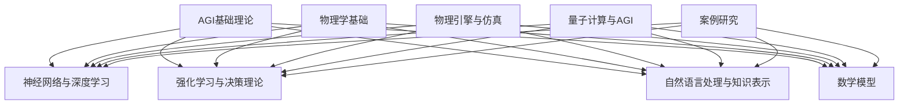

                 

### 引言

#### 背景与重要性

人工智能（AI）作为计算机科学的一个重要分支，近年来取得了令人瞩目的成就。从早期的符号主义到联结主义，再到统计学习，人工智能的发展历程见证了技术的不断进步。特别是深度学习、强化学习、自然语言处理等关键技术的突破，使得人工智能在图像识别、语音识别、自动驾驶、医疗诊断等领域展现出巨大的潜力。然而，这些成就仍然局限于特定领域和任务，离实现真正的通用智能（AGI）还有很长的路要走。

与此同时，物理学作为一门研究自然界基本规律的学科，其基础理论在各个领域都得到了广泛应用。从经典力学到量子力学，从电磁学到热力学，物理学为其他科学和技术的发展提供了坚实的理论基础。在人工智能领域，物理学的基本原理和方法同样具有巨大的应用潜力。例如，神经网络中的神经元模型可以追溯到神经生物学，强化学习中的奖励机制可以追溯到行为心理学，自然语言处理中的语义理解可以追溯到信息论。

本篇文章旨在探讨人工通用智能（AGI）与物理学的协同发展，分析物理学在AGI发展中的角色和影响，以及二者结合所带来的潜在应用和挑战。文章将从以下几个方面展开：

1. **引言与概述**：介绍AGI的定义、背景，以及物理学在AGI发展中的角色和本书的结构。
2. **AGI的基础理论**：探讨AGI的基本原理、核心算法和数学模型。
3. **物理学的协同作用**：分析物理学基础与AGI的结合、物理引擎与仿真、量子计算与AGI的关系。
4. **案例研究**：通过实例分析AGI与物理学协同发展的应用。
5. **未来的发展趋势与挑战**：展望AGI与物理学协同发展的未来趋势和面临的挑战。
6. **附录**：提供相关工具与资源、核心概念与联系、核心算法原理讲解、数学模型和公式详细讲解、项目实战等。

通过本文的探讨，我们希望能够为读者提供一个全面、系统的视角，深入理解AGI与物理学的协同发展，并为其未来的研究提供一些启示和参考。

### 文章标题

**AGI与物理学的协同发展**

#### 关键词

- 人工通用智能（AGI）
- 物理学
- 深度学习
- 强化学习
- 量子计算
- 物理引擎
- 仿真技术
- 交叉学科

#### 摘要

本文旨在探讨人工通用智能（AGI）与物理学的协同发展。首先，介绍了AGI的定义、背景和物理学在AGI发展中的角色。接着，分析了AGI的基础理论，包括基本原理、核心算法和数学模型。随后，本文探讨了物理学在AGI中的协同作用，从物理学基础、物理引擎与仿真、量子计算与AGI等方面进行了详细阐述。通过实例分析，展示了AGI与物理学协同发展的实际应用。最后，本文展望了AGI与物理学协同发展的未来趋势和挑战，为未来的研究提供了启示和参考。本文的结构如下：

- **引言与概述**：介绍AGI的定义、背景和物理学在AGI发展中的角色，以及本书的结构。
- **AGI的基础理论**：探讨AGI的基本原理、核心算法和数学模型。
- **物理学的协同作用**：分析物理学基础与AGI的结合、物理引擎与仿真、量子计算与AGI的关系。
- **案例研究**：通过实例分析AGI与物理学协同发展的应用。
- **未来的发展趋势与挑战**：展望AGI与物理学协同发展的未来趋势和面临的挑战。
- **附录**：提供相关工具与资源、核心概念与联系、核心算法原理讲解、数学模型和公式详细讲解、项目实战等。

本文将深入探讨AGI与物理学的协同发展，为读者提供一个全面、系统的视角，以促进二者在未来的深度融合和发展。

### 引言与概述

#### 1.1 人工通用智能（AGI）的定义与背景

人工通用智能（AGI，Artificial General Intelligence）是指一种能够在各种不同领域和任务中表现出人类智能水平的机器智能。与目前广泛应用的窄域人工智能（Narrow AI，或称专用人工智能）不同，AGI具有跨领域、自适应和学习能力，能够解决复杂的、未知的问题。AGI的概念最早可以追溯到1950年，由计算机科学家约翰·麦卡锡（John McCarthy）提出。自那以后，人工智能领域经历了数十年的发展，虽然在某些特定领域取得了显著的成就，但距离实现真正的AGI仍然相去甚远。

AGI的发展历程可以分为几个阶段。早期的人工智能主要基于符号主义方法，通过形式化的逻辑推理和知识表示来模拟人类智能。然而，这种方法在处理复杂、不确定性问题时遇到了巨大的挑战。随着计算机性能的不断提升，联结主义方法逐渐成为主流。联结主义通过模拟人脑的神经网络结构，实现了对数据的自动特征提取和学习。尤其是深度学习的兴起，使得计算机在图像识别、语音识别等领域取得了突破性的进展。

近年来，强化学习、自然语言处理等新兴技术进一步推动了AGI的发展。强化学习通过奖励机制和试错学习，实现了智能体在复杂环境中的自主决策。自然语言处理技术的进步，使得计算机能够更好地理解和生成自然语言，为智能对话系统和文本分析提供了强大的支持。尽管如此，当前的AGI技术仍然面临着诸多挑战，包括多模态处理、跨领域迁移、自我意识等方面。

#### 1.2 物理学在AGI发展中的角色

物理学作为一门研究自然界基本规律的学科，其基础理论和方法在各个领域都有广泛应用。在人工智能领域，物理学同样扮演着重要的角色。首先，物理学为人工智能提供了一种理解复杂系统的框架。例如，神经网络中的神经元模型可以追溯到生物神经系统的基本单元——神经元。深度学习中的卷积神经网络（CNN）和循环神经网络（RNN）也受到了物理光学和生理学的启发。此外，物理学中的概率论和统计方法在人工智能的模型训练和评估中有着广泛应用。

其次，物理学的方法和工具为解决人工智能中的某些特定问题提供了有效途径。例如，在强化学习领域，物理学中的动态系统理论和控制理论为智能体在复杂环境中的行为提供了理论基础。物理引擎在虚拟环境和仿真中的应用，使得智能体能够在高度逼真的环境中进行学习和决策。量子计算作为物理学的一个前沿领域，其独特的并行计算能力和量子纠错技术，为解决传统计算机难以处理的复杂问题提供了新的可能性。

此外，物理学与人工智能的结合还体现在一些具体的应用领域。例如，在自动驾驶技术中，物理学中的运动学和动力学原理被用来建模车辆的动态行为，从而实现精确的控制。在智能制造领域，物理学中的热力学和流体力学原理被用于优化生产流程和设备维护。虚拟现实与增强现实技术中，物理学原理被用于模拟现实世界的物理效果，从而提供沉浸式的用户体验。

总之，物理学在AGI发展中扮演着多重角色，不仅为人工智能提供了理论基础和方法，还通过具体的实例应用，推动了人工智能技术的进步。

#### 1.3 本书的目标与结构

本书旨在深入探讨人工通用智能（AGI）与物理学的协同发展，分析二者结合所带来的潜在应用和挑战。通过系统地阐述AGI的基础理论、物理学的基础理论及其在AGI中的应用，以及二者结合的实例，本书希望能够为读者提供一个全面、系统的视角，以促进AGI与物理学的深度融合和发展。

本书分为四个部分：

第一部分：引入与概述
- 第1章：全书的引入与概述，介绍AGI的定义、背景，以及物理学在AGI发展中的角色和本书的结构。

第二部分：AGI的基础理论
- 第2章：人工通用智能（AGI）的基本原理，探讨通用智能的定义与分类、人工智能的发展历程以及AGI的关键技术。
- 第3章：AGI的核心算法原理，分析神经网络与深度学习、强化学习与决策理论、自然语言处理与知识表示。
- 第4章：AGI的数学模型，讲解概率论与统计学基础、信息论与熵、最优化理论与算法。

第三部分：物理学的协同作用
- 第5章：物理学基础与AGI的结合，探讨物理学的基本原理、物理学在AGI中的应用以及物理学与AGI交叉领域的发展。
- 第6章：物理引擎与仿真，分析物理引擎的基本概念、物理引擎在AGI中的应用以及仿真技术在AGI中的作用。
- 第7章：量子计算与AGI，探讨量子计算的基本原理、量子计算与AGI的关系以及量子算法在AGI中的应用。

第四部分：案例研究
- 第8章：AGI与物理学协同发展的实例分析，通过自动驾驶技术、智能制造、虚拟现实与增强现实等实例，展示AGI与物理学协同发展的应用。
- 第9章：未来的发展趋势与挑战，展望AGI与物理学协同发展的未来趋势和面临的挑战。

附录部分提供了AGI与物理学协同发展相关的工具与资源、核心概念与联系、核心算法原理讲解、数学模型和公式详细讲解以及项目实战等内容，以供读者进一步学习和研究。

通过本书的探讨，我们希望能够为读者提供一个全面、系统的视角，深入理解AGI与物理学的协同发展，并为其未来的研究提供一些启示和参考。

### AGI的基础理论

#### 2.1 通用智能的定义与分类

通用智能（Universal Intelligence）是指能够执行任何智能任务的能力，这种智能不仅限于单一领域或任务，而是具有广泛的适应性和学习能力。通用智能的定义可以追溯到对人类智能的观察和模拟。人类智能的表现形式多样，包括逻辑推理、问题解决、语言理解、情感识别、创造力等，这些能力使得人类能够适应复杂多变的环境。

在计算机科学中，通用智能的定义和实现面临着诸多挑战。首先，通用智能需要具备跨领域的适应能力，这意味着它不仅能在特定领域内表现出高水平的智能，还能在不同的领域之间进行迁移和应用。其次，通用智能需要具备自学习能力，即通过经验和数据能够不断改进和优化自身的能力。最后，通用智能需要具备一定的自主性，能够独立地做出决策和执行任务，而不仅仅依赖于预设的规则和指令。

根据通用智能的表现形式和实现方法，可以将通用智能分为几种类型：

1. **符号智能（Symbolic Intelligence）**：符号智能主要基于符号表示和逻辑推理，通过形式化的逻辑规则和知识表示来模拟人类智能。这种方法在早期的人工智能研究中得到了广泛应用，例如专家系统和知识图谱等。然而，符号智能在面对复杂、不确定和模糊的问题时表现出一定的局限性。

2. **联结智能（Associative Intelligence）**：联结智能基于联结主义原理，通过模拟人脑的神经网络结构和信息处理机制来实现智能。这种方法在深度学习和神经网络中得到了广泛应用，例如卷积神经网络（CNN）和循环神经网络（RNN）等。联结智能在处理复杂数据和模式识别方面表现出色，但缺乏对抽象概念的理解和推理能力。

3. **统计智能（Statistical Intelligence）**：统计智能基于统计学习理论，通过学习大量数据中的统计规律和模式来实现智能。这种方法在机器学习和数据挖掘中得到了广泛应用，例如支持向量机（SVM）和决策树（DT）等。统计智能在处理大规模数据和高维度问题方面表现出色，但缺乏对数据背后因果关系的理解。

4. **混合智能（Hybrid Intelligence）**：混合智能结合了符号智能、联结智能和统计智能的优势，通过多种方法的融合来实现更高层次的智能。例如，混合智能系统可以结合深度学习与知识图谱，通过模式识别和逻辑推理来实现复杂的任务。混合智能在当前的人工智能研究中得到了广泛关注，被认为是实现通用智能的重要途径。

#### 2.2 人工智能的发展历程

人工智能（AI）作为计算机科学的一个重要分支，其发展历程可以追溯到20世纪50年代。自那时以来，人工智能经历了多个阶段，每个阶段都标志着技术的重大进步和思想的转变。

1. **早期阶段（1950-1969）**：
   - **符号主义方法**：早期的人工智能研究主要基于符号主义方法，这种方法试图通过符号逻辑和知识表示来模拟人类智能。代表性的工作包括普林斯顿大学约翰·麦卡锡（John McCarthy）提出的逻辑理论家（Logic Theorist）和斯坦福大学赫伯特·西蒙（Herbert Simon）提出的通用问题求解器（General Problem Solver）。
   - **早期人工智能项目**：1956年，达特茅斯会议（Dartmouth Conference）被广泛认为是人工智能领域的诞生日。会议上，人工智能被定义为“制造出能表现智能行为的机器的科学”。此后，人工智能研究逐渐兴起，许多早期的人工智能项目如专家系统、自然语言处理、机器视觉等相继展开。

2. **中间阶段（1970-1989）**：
   - **联结主义方法的兴起**：随着计算机性能的提升和神经网络理论的逐渐成熟，联结主义方法开始成为人工智能研究的主流。1986年，鲁梅哈特（David E. Rumelhart）、赫布尔德（Geoffrey Hinton）和威廉姆斯（Ronald J. Williams）提出了反向传播算法（Backpropagation），使得深度学习成为可能。
   - **专家系统的应用**：专家系统在这一时期取得了显著进展，成为许多领域（如医学诊断、财务分析、工业控制等）的重要应用。专家系统通过模拟人类专家的知识和推理能力，实现了对特定领域的自动分析和决策。

3. **成熟阶段（1990-2019）**：
   - **深度学习的崛起**：2006年，深度学习（Deep Learning）的概念被提出，并在2012年获得了突破性的成功。由亚历克斯·克雷默（Alex Krizhevsky）、伊恩·古德费洛（Ilya Sutskever）和乔治·埃森巴赫（Geoffrey Hinton）团队在ImageNet图像识别比赛中获得的显著成果，标志着深度学习时代的到来。
   - **应用领域的扩展**：深度学习在计算机视觉、语音识别、自然语言处理等领域取得了显著成果，推动了人工智能技术的广泛应用。自动驾驶、智能机器人、医疗诊断、金融预测等领域的应用不断涌现。

4. **当前阶段（2020至今）**：
   - **多模态和跨领域的AGI**：当前的人工智能研究正朝着实现人工通用智能（AGI）的目标迈进。通过结合多模态数据（如文本、图像、音频等）和跨领域的知识，人工智能系统在更多的任务中表现出色。例如，多模态的智能助手、跨领域的决策系统等。
   - **新兴技术的应用**：随着强化学习、生成对抗网络（GAN）、迁移学习等新兴技术的不断发展，人工智能在复杂环境中的适应能力和学习能力得到了显著提升。

#### 2.3 AGI的关键技术

实现人工通用智能（AGI）需要多种关键技术的支持，这些技术涵盖了从算法、模型到数据处理的各个方面。以下是对这些关键技术的基本介绍：

1. **深度学习（Deep Learning）**：
   - **基本原理**：深度学习是一种基于多层神经网络的学习方法，通过逐层提取特征，实现对数据的自动特征学习和复杂函数拟合。深度学习中的每个层次都对输入数据进行处理，从而逐渐提取更高层次的特征。
   - **主要算法**：卷积神经网络（CNN）、循环神经网络（RNN）、长短时记忆网络（LSTM）、生成对抗网络（GAN）等。这些算法在不同领域和任务中表现出色。
   - **应用领域**：计算机视觉、语音识别、自然语言处理、自动驾驶等。

2. **强化学习（Reinforcement Learning）**：
   - **基本原理**：强化学习是一种通过试错和奖励机制来训练智能体的学习方法。智能体在环境中进行交互，通过不断学习和调整策略，以最大化长期奖励。
   - **主要算法**：Q学习、SARSA、Deep Q-Network（DQN）、策略梯度方法等。这些算法在复杂决策和动态环境中表现出色。
   - **应用领域**：游戏AI、自动驾驶、机器人控制、推荐系统等。

3. **自然语言处理（Natural Language Processing，NLP）**：
   - **基本原理**：自然语言处理旨在使计算机能够理解、生成和处理自然语言。NLP涉及文本预处理、词性标注、句法分析、语义理解等多个方面。
   - **主要算法**：词袋模型（Bag of Words，BoW）、词嵌入（Word Embedding）、递归神经网络（RNN）、转换器（Transformer）等。这些算法在语言理解和生成任务中取得了显著成果。
   - **应用领域**：机器翻译、情感分析、文本分类、问答系统等。

4. **知识表示与推理（Knowledge Representation and Reasoning）**：
   - **基本原理**：知识表示与推理旨在将人类知识转化为计算机可以处理的形式，并利用这些知识进行推理和决策。知识表示方法包括命题逻辑、产生式规则、本体论、知识图谱等。
   - **主要算法**：推理机（Reasoner）、归纳推理（Inductive Reasoning）、演绎推理（Deductive Reasoning）等。这些算法在知识库管理和智能决策系统中得到广泛应用。
   - **应用领域**：专家系统、智能搜索、智能客服、智能推荐等。

5. **多模态学习（Multimodal Learning）**：
   - **基本原理**：多模态学习旨在整合来自不同感官模态（如文本、图像、音频、视频等）的数据，以实现更全面和准确的智能感知和理解。
   - **主要算法**：多模态特征融合、多任务学习、联合建模等。这些算法在复杂数据融合和跨模态任务中表现出色。
   - **应用领域**：智能助手、虚拟现实、增强现实、多媒体分析等。

6. **自适应系统（Adaptive Systems）**：
   - **基本原理**：自适应系统通过不断学习和调整，以适应环境变化和任务需求。自适应系统通常包括反馈机制、学习算法、调整策略等。
   - **主要算法**：强化学习、遗传算法、粒子群优化等。这些算法在自适应控制和优化任务中广泛应用。
   - **应用领域**：智能交通、智能家居、智能工厂、自适应教育等。

通过上述关键技术的结合和优化，我们可以逐步实现AGI的目标，使智能系统能够更好地模拟和扩展人类智能。

### AGI的核心算法原理

#### 3.1 神经网络与深度学习

神经网络（Neural Networks）是模拟人脑神经元之间相互作用的一种计算模型。它由多个神经元（或称为节点）组成，每个神经元接收来自其他神经元的输入，并通过权重（权重是表示神经元之间连接强度的一个系数）传递这些输入。每个神经元都有一个激活函数，用于计算输出。通过训练，神经网络可以学习到输入和输出之间的复杂映射关系。

神经网络可以分为多种类型，其中最常见的是前馈神经网络（Feedforward Neural Networks）。在这种网络中，数据从输入层流向输出层，不发生循环。每个神经元仅与其前一层的神经元相连接，而输出层不与输入层相连接。前馈神经网络的核心在于权重和偏置的调整，通过反向传播算法（Backpropagation）不断优化这些参数，以实现预期输出。

深度学习（Deep Learning）是神经网络的一种扩展，它通过增加网络的深度（即层�数）来提高模型的复杂度和学习能力。在深度学习中，多个隐藏层被引入，使得网络能够学习到更高级别的特征表示。深度学习在图像识别、语音识别、自然语言处理等领域取得了显著的突破。

深度学习的关键在于多层感知器（Multilayer Perceptron，MLP）和卷积神经网络（Convolutional Neural Network，CNN）。

1. **多层感知器（MLP）**：
   - **结构**：MLP由输入层、多个隐藏层和输出层组成。每个隐藏层由多个神经元组成，每个神经元都与前一层的所有神经元相连接。
   - **激活函数**：通常使用Sigmoid、ReLU或Tanh等非线性激活函数，以引入非线性特性。
   - **学习过程**：通过梯度下降算法（Gradient Descent）和反向传播算法优化权重和偏置。反向传播算法是一种优化方法，它通过计算损失函数关于权重的梯度，更新权重和偏置，以最小化损失函数。

2. **卷积神经网络（CNN）**：
   - **结构**：CNN由卷积层、池化层和全连接层组成。卷积层用于特征提取，池化层用于特征降维，全连接层用于分类或回归。
   - **卷积层**：卷积层通过卷积操作提取输入数据的局部特征。卷积操作使用一个可学习的卷积核（Convolutional Kernel）与输入数据卷积，生成特征图。
   - **池化层**：池化层用于降维和增强特征鲁棒性。常用的池化操作包括最大池化（Max Pooling）和平均池化（Average Pooling）。
   - **全连接层**：全连接层将卷积层和池化层提取的特征映射到分类或回归结果。

深度学习中的另一个重要算法是生成对抗网络（Generative Adversarial Networks，GAN）。GAN由两个神经网络组成：生成器（Generator）和判别器（Discriminator）。生成器的目标是生成与真实数据相似的数据，而判别器的目标是区分真实数据和生成数据。通过两个网络的对抗训练，生成器能够不断提高生成数据的逼真度。

深度学习在计算机视觉、自然语言处理、语音识别等领域取得了显著的成果。例如，在图像识别任务中，深度学习模型（如AlexNet、VGG、ResNet等）的表现优于传统方法。在语音识别任务中，深度神经网络（如DNN、CNN、RNN等）实现了高精度的语音识别。在自然语言处理任务中，Transformer模型和BERT模型等基于深度学习的方法取得了突破性的成果。

总之，神经网络与深度学习是AGI的核心算法之一，通过不断优化和扩展，它们为人工智能技术的进步提供了强大的动力。

#### 3.2 强化学习与决策理论

强化学习（Reinforcement Learning，RL）是一种通过试错和奖励机制来训练智能体的学习方法。与监督学习和无监督学习不同，强化学习中的智能体需要在动态环境中进行交互，通过不断学习来优化其行为策略。强化学习的关键在于奖励机制，它用于指导智能体在复杂环境中做出最优决策。

**强化学习的基本概念**

强化学习由四个主要元素组成：智能体（Agent）、环境（Environment）、状态（State）和动作（Action）。智能体是执行动作的主体，环境是智能体所处的环境，状态是环境的当前状态，动作是智能体可以采取的行为。智能体的目标是最大化长期奖励，从而优化其行为策略。

**奖励机制**

奖励机制是强化学习中的核心，它通过正奖励（Positive Reward）和负奖励（Negative Reward）来引导智能体的学习过程。正奖励表示智能体采取的动作使状态朝着目标状态发展，负奖励则表示智能体采取的动作导致状态远离目标状态。奖励机制的设定直接影响智能体的学习效果和策略优化。

**强化学习的算法**

强化学习算法可以分为基于值函数的方法和基于策略的方法。

1. **基于值函数的方法**：
   - **值函数（Value Function）**：值函数用于估计智能体在特定状态下的最优奖励。值函数可以分为状态值函数（State-Value Function）和动作值函数（Action-Value Function）。
   - **Q学习（Q-Learning）**：Q学习是一种基于值函数的强化学习算法。它通过更新Q值（即动作值函数）来优化智能体的行为策略。Q学习算法的基本思想是，在当前状态下，选择当前动作的Q值最大的动作作为下一步的动作。
   - **SARSA（On-Policy）**：SARSA是一种基于值函数的强化学习算法，它与Q学习类似，但在每一步都使用当前策略来选择动作。SARSA算法的基本思想是，在当前状态下，根据当前动作的Q值和新的经验值来更新Q值。
   - **深度Q网络（Deep Q-Network，DQN）**：DQN是一种基于深度学习的Q学习算法。它使用深度神经网络来近似Q值函数，从而实现更复杂的值函数估计。DQN算法通过经验回放（Experience Replay）和目标网络（Target Network）来减少训练过程中的偏差和波动。

2. **基于策略的方法**：
   - **策略（Policy）**：策略是智能体在给定状态下选择动作的方法。策略可以分为确定性策略（Deterministic Policy）和随机性策略（Stochastic Policy）。
   - **策略梯度方法（Policy Gradient Method）**：策略梯度方法通过直接优化策略来优化智能体的行为。策略梯度方法的优点是，它不需要显式地估计值函数，而是通过梯度上升法直接优化策略参数。常用的策略梯度方法包括REINFORCE、PPO（Proximal Policy Optimization）和A3C（Asynchronous Advantage Actor-Critic）等。

**决策理论**

决策理论（Decision Theory）是研究如何做出最优决策的一门学科。在强化学习中，决策理论提供了一种理论框架来指导智能体的学习过程。

1. **贝叶斯决策（Bayesian Decision Theory）**：
   - **贝叶斯定理（Bayes' Theorem）**：贝叶斯定理是决策理论的核心工具，它用于计算后验概率，即给定观测结果，估计某个假设的概率。
   - **效用函数（Utility Function）**：效用函数用于衡量不同决策结果的偏好。在贝叶斯决策中，智能体通过最大化期望效用函数来选择最优决策。

2. **风险分析（Risk Analysis）**：
   - **风险（Risk）**：风险是决策过程中可能面临的不确定性和损失。风险分析旨在评估不同决策的风险水平，并选择最小化风险的决策。
   - **期望损失（Expected Loss）**：期望损失是决策结果可能带来的平均损失。在强化学习中，期望损失用于评估智能体的行为策略。

强化学习与决策理论的结合为智能体在复杂环境中的学习提供了强大的理论支持。通过强化学习算法，智能体可以不断调整其行为策略，以最大化长期奖励。而通过决策理论，智能体可以更全面地评估不同决策的结果和风险，从而做出更优的决策。

总之，强化学习与决策理论是AGI的重要算法之一，通过不断优化和扩展，它们为智能体在动态环境中的学习和决策提供了有效的解决方案。

#### 3.3 自然语言处理与知识表示

自然语言处理（Natural Language Processing，NLP）是人工智能领域的一个重要分支，旨在使计算机能够理解、生成和处理自然语言。自然语言处理在许多领域都有广泛的应用，如机器翻译、文本分类、情感分析、问答系统等。为了实现这些功能，NLP技术需要解决一系列挑战，包括语言的复杂性、多样性和不确定性。

**文本预处理**

文本预处理是自然语言处理的基础步骤，旨在将原始文本转化为适合模型处理的形式。文本预处理包括以下任务：

- **分词（Tokenization）**：将文本分割成单词、短语或符号等基本单元，称为分词。分词可以基于空格、标点符号或词典匹配等方法。
- **词性标注（Part-of-Speech Tagging）**：为每个单词标注其在句子中的词性，如名词、动词、形容词等。词性标注有助于理解句子的语法结构。
- **词干提取（Stemming）**：将单词缩减为其词干形式，以简化文本。词干提取可以基于规则或算法，如Porter stemming或Snowball stemming。
- **词嵌入（Word Embedding）**：将单词映射到高维向量空间，以便模型能够理解单词的语义关系。词嵌入技术包括Word2Vec、GloVe、FastText等。

**文本分类**

文本分类是一种将文本数据分为预定义类别的方法。常见的方法包括：

- **基于统计的方法**：如朴素贝叶斯（Naive Bayes）、支持向量机（SVM）和K最近邻（K-Nearest Neighbors，KNN）等。这些方法通过计算特征的概率分布或相似度来实现分类。
- **基于深度学习的方法**：如卷积神经网络（CNN）、循环神经网络（RNN）和变换器（Transformer）等。这些方法通过学习文本的深层特征来实现分类。特别是变换器（Transformer）在自然语言处理任务中表现出色，已成为当前主流的方法之一。

**情感分析**

情感分析是一种检测文本中表达的情感极性（如正面、负面、中性）的方法。常见的方法包括：

- **基于词典的方法**：如情感词典和规则匹配。情感词典包含正面和负面词汇，规则匹配根据词汇和语法规则判断情感极性。
- **基于机器学习的方法**：如朴素贝叶斯、SVM和深度学习等。这些方法通过学习大量带有情感标签的文本数据，构建分类模型来预测新的文本的情感极性。
- **基于情感强度的方法**：除了判断情感极性，还考虑情感强度。如Linguistic Inquiry and Word Count（LIWC）方法，通过计算文本中正面和负面词汇的频率和强度来评估情感强度。

**知识表示**

知识表示是将知识以计算机可以处理的形式表示出来，以便进行推理和决策。常见的方法包括：

- **知识图谱（Knowledge Graph）**：知识图谱是一种通过节点和边来表示实体及其关系的图形结构。它能够捕捉实体间的复杂关系，为推理和决策提供支持。
- **本体论（Ontology）**：本体论是一种形式化的知识表示方法，用于描述领域中的实体、属性和关系。本体论有助于统一不同领域中的术语和概念，提高知识的共享和互操作性。
- **语义网络（Semantic Network）**：语义网络是一种基于节点和边表示知识的方法，每个节点表示一个概念，边表示概念之间的关系。语义网络可以用于推理和知识表示。

自然语言处理与知识表示的结合为智能系统提供了强大的语言理解和推理能力。通过自然语言处理技术，智能系统能够理解和处理自然语言，而通过知识表示技术，智能系统能够将语言中的知识转化为计算机可以处理的形式，从而实现更复杂的任务和决策。

总之，自然语言处理与知识表示是AGI的重要组成部分，通过不断优化和扩展，它们为智能系统在语言理解和知识应用方面的进步提供了坚实的基础。

#### 4.1 概率论与统计学基础

概率论与统计学是研究随机现象和数据的科学，它们在人工智能（AI）和机器学习（ML）中有着广泛的应用。理解概率论与统计学的基础知识对于构建和优化AI模型至关重要。

**概率论的基本概念**

1. **随机实验与样本空间**：随机实验是指进行一次实验时可能产生所有可能结果的集合。样本空间（Sample Space）是随机实验的所有可能结果的集合，通常用Ω表示。例如，投掷一枚公平的硬币，样本空间为{正面，反面}。

2. **概率分布**：概率分布描述了一个随机变量在样本空间中每个结果的概率。常见的概率分布包括离散型概率分布和连续型概率分布。例如，伯努利分布（Bernoulli Distribution）用于描述只有两种可能结果的随机变量，如硬币投掷结果；正态分布（Normal Distribution）用于描述连续的随机变量，如人的身高。

3. **条件概率与独立性**：条件概率是给定一个事件发生的条件下，另一个事件发生的概率。条件概率公式为：
   $$ P(A|B) = \frac{P(A \cap B)}{P(B)} $$
   独立性是指两个事件的发生互不影响，即一个事件的发生不影响另一个事件的发生。两个事件A和B独立的概率条件为：
   $$ P(A \cap B) = P(A) \cdot P(B) $$

4. **全概率公式与贝叶斯定理**：全概率公式是计算一个事件的总体概率的方法，通过将事件的所有可能结果的概率相加得到。贝叶斯定理是条件概率在概率推断中的应用，用于计算后验概率。贝叶斯定理公式为：
   $$ P(A|B) = \frac{P(B|A) \cdot P(A)}{P(B)} $$

**统计学的核心概念**

1. **随机变量与期望**：随机变量是将随机实验的结果映射到数值的函数。期望（Expected Value）是随机变量取值的平均值，用于衡量随机变量的中心位置。期望的公式为：
   $$ E(X) = \sum_{i} x_i \cdot P(x_i) $$

2. **方差与标准差**：方差（Variance）和标准差（Standard Deviation）是衡量随机变量分布离散程度的指标。方差是期望的平方，标准差是方差的平方根。方差的公式为：
   $$ Var(X) = E[(X - E(X))^2] $$
   标准差的公式为：
   $$ \sigma_X = \sqrt{Var(X)} $$

3. **假设检验**：假设检验（Hypothesis Testing）是一种统计方法，用于评估某个假设的真实性。常见的假设检验方法包括t检验、卡方检验和F检验等。假设检验的基本步骤包括提出原假设（H0）和备择假设（H1），选择显著性水平（Significance Level），计算统计量并进行决策。

4. **线性回归**：线性回归是一种用于分析变量之间线性关系的统计方法。线性回归模型表示为：
   $$ Y = \beta_0 + \beta_1 \cdot X + \epsilon $$
   其中，Y是因变量，X是自变量，β0是截距，β1是斜率，ε是误差项。通过最小化残差平方和，可以估计β0和β1的值。

**概率论与统计学的应用**

在AI和ML中，概率论与统计学被广泛应用于以下几个方面：

1. **模型评估与优化**：通过概率论和统计学的原理，可以评估模型的性能，如计算模型的准确率、召回率、F1分数等。同时，统计学方法可以帮助优化模型参数，如使用梯度下降算法进行参数调整。

2. **特征选择**：通过统计学方法，如卡方检验、互信息等，可以评估特征的重要性，从而选择对模型性能有显著影响的特征。

3. **数据预处理**：概率论和统计学方法可以用于数据清洗和预处理，如缺失值填充、异常值检测等。

4. **生成模型**：在生成对抗网络（GAN）等生成模型中，概率分布和统计模型用于生成新的数据样本。

5. **贝叶斯推理**：贝叶斯推理在概率模型和决策支持系统中有着广泛的应用，通过更新概率分布来适应新的数据。

总之，概率论与统计学是AI和ML的基石，通过理解和应用这些基本概念和原理，可以构建和优化更强大的智能系统。

#### 4.2 信息论与熵

信息论（Information Theory）是研究信息传递和处理的基本原理的学科，由克劳德·香农（Claude Shannon）在20世纪40年代创立。信息论的核心概念包括信息度量、信道编码、信息传输效率和信息熵等。

**信息度量**

信息量是衡量信息载体的信息含量的量度。在信息论中，香农使用“比特”（bit）作为信息量的基本单位。香农提出了信息量的公式：
$$ I(X) = -\sum_{i} p(x_i) \cdot \log_2(p(x_i)) $$
其中，\( I(X) \) 是随机变量X的信息量，\( p(x_i) \) 是随机变量X取值为\( x_i \)的概率。这个公式表示随机变量X的不确定性或信息含量。

**信息熵**

信息熵（Entropy）是对信息不确定性的量化。一个随机变量的熵表示其所有可能取值的不确定性。香农提出了随机变量的熵公式：
$$ H(X) = -\sum_{i} p(x_i) \cdot \log_2(p(x_i)) $$
其中，\( H(X) \) 是随机变量X的熵。信息熵的值范围是从0到无穷大，当随机变量是确定性事件时，熵为0；当随机变量是完全不确定事件时，熵达到最大值。

**条件熵**

条件熵（Conditional Entropy）是衡量在已知一个随机变量的条件下，另一个随机变量的不确定性。条件熵的公式为：
$$ H(X|Y) = -\sum_{i} p(y_i) \cdot \sum_{j} p(x_j|y_i) \cdot \log_2(p(x_j|y_i)) $$
其中，\( H(X|Y) \) 是在随机变量Y已知条件下的随机变量X的熵。

**互信息**

互信息（Mutual Information）是衡量两个随机变量之间关联性的量度。互信息的公式为：
$$ I(X;Y) = H(X) - H(X|Y) $$
互信息表示随机变量X和Y之间的相关性。当互信息为0时，X和Y是独立的；当互信息最大时，X和Y之间的关联性最强。

**应用**

在机器学习和数据科学中，信息论的概念有着广泛的应用：

1. **特征选择**：互信息可以用于评估特征与目标变量之间的关联性，从而选择对模型性能有显著影响的特征。

2. **信息压缩**：香农的信道编码理论为数据压缩提供了理论基础，通过去除冗余信息，实现高效的数据传输和存储。

3. **信息可视化**：互信息可以用于可视化数据之间的关联性，帮助数据科学家理解和解释复杂数据结构。

4. **机器学习模型评估**：信息论可以用于评估模型的性能，如通过计算模型预测与真实值之间的互信息来衡量模型的预测精度。

通过理解信息论的基本原理和应用，机器学习研究人员和数据科学家可以更有效地构建和优化模型，提高数据处理的效率和准确性。

#### 4.3 最优化理论与算法

最优化理论是研究如何找到问题的最优解或近似最优解的数学分支，它在人工智能（AI）和机器学习（ML）领域有着广泛的应用。最优化问题通常可以表述为：

$$
\min f(x) \quad \text{或} \quad \max f(x)
$$

其中，\( f(x) \) 是目标函数，\( x \) 是决策变量。最优化问题可以分为以下几种类型：

- **无约束优化**：没有额外的约束条件。
- **有约束优化**：存在约束条件，如 \( g(x) \leq 0 \) 或 \( h(x) = 0 \)。
- **多目标优化**：需要同时优化多个目标函数。

以下是几种常见最优化算法的原理和应用：

**梯度下降法**

梯度下降法（Gradient Descent）是最常用的优化算法之一，它通过迭代更新变量来逐步逼近最优解。梯度下降的基本原理是沿着目标函数的负梯度方向进行更新。更新公式为：

$$
x_{t+1} = x_t - \alpha \cdot \nabla f(x_t)
$$

其中，\( x_t \) 是当前迭代点，\( \alpha \) 是学习率（或步长），\( \nabla f(x_t) \) 是目标函数在 \( x_t \) 处的梯度。

梯度下降法可以分为以下几种变体：

1. **批量梯度下降（Batch Gradient Descent）**：每次迭代使用全部数据计算梯度。
2. **随机梯度下降（Stochastic Gradient Descent，SGD）**：每次迭代使用单个样本或少量样本计算梯度。
3. **小批量梯度下降（Mini-batch Gradient Descent）**：每次迭代使用一部分数据计算梯度。

**牛顿法**

牛顿法（Newton's Method）是一种基于二阶导数的优化算法。它利用目标函数的泰勒展开，迭代更新变量，公式为：

$$
x_{t+1} = x_t - H^{-1} \cdot \nabla f(x_t)
$$

其中，\( H(x) \) 是目标函数的二阶导数矩阵（或Hessian矩阵），\( \nabla f(x_t) \) 是目标函数在 \( x_t \) 处的一阶导数。

牛顿法通常在目标函数为二次或接近二次函数时表现良好，其优点是收敛速度较快。

**遗传算法**

遗传算法（Genetic Algorithm，GA）是一种基于自然选择和遗传学原理的优化算法。它通过模拟自然进化过程来搜索最优解。遗传算法的主要步骤包括：

1. **初始化种群**：随机生成一组初始解（称为个体）。
2. **适应度评估**：计算每个个体的适应度，适应度通常与目标函数值成反比。
3. **选择**：选择适应度较高的个体进行繁殖。
4. **交叉**：通过交叉操作产生新的个体。
5. **变异**：对个体进行随机变异，增加种群的多样性。
6. **迭代**：重复上述步骤，直到满足停止条件（如达到最大迭代次数或收敛条件）。

遗传算法适用于解决复杂、非线性、多峰值的优化问题。

**应用**

最优化算法在机器学习和数据科学中有广泛的应用：

1. **机器学习模型训练**：用于优化模型的参数，如线性回归、逻辑回归、神经网络等。
2. **数据挖掘**：用于特征选择、聚类分析、分类和回归分析等。
3. **优化问题求解**：如资源分配、路径规划、供应链管理等问题。

通过理解最优化理论与算法的基本原理和应用，研究人员和数据科学家可以更有效地解决复杂的最优化问题，提高模型的性能和可靠性。

### 物理学基础与AGI的结合

物理学作为一门研究自然界基本规律的学科，其基础理论和方法在各个领域都有广泛应用。在人工通用智能（AGI）领域，物理学同样扮演着重要的角色。通过将物理学原理与AGI技术相结合，我们可以实现更高效、更强大的智能系统。以下是物理学基础与AGI结合的几个方面：

#### 5.1 物理学的基本原理

物理学的基本原理包括经典力学、电磁学、热力学、量子力学等。这些原理为理解和模拟现实世界提供了基础。

- **经典力学**：经典力学研究物体的运动规律，包括牛顿定律、能量守恒等。在AGI中，经典力学原理可以用于模拟智能体的运动和动力学行为，如自动驾驶车辆的运动控制。
- **电磁学**：电磁学研究电荷、电流和磁场等。在AGI中，电磁学原理可以用于传感器设计和信号处理，如雷达、摄像头和无线通信等。
- **热力学**：热力学研究能量转换和热平衡。在AGI中，热力学原理可以用于能源管理和环境感知，如智能电网、环境监测等。
- **量子力学**：量子力学研究微观粒子的行为，包括量子态、量子计算等。在AGI中，量子力学原理可以用于构建量子智能系统和量子算法，如量子机器学习和量子神经网络。

#### 5.2 物理学在AGI中的应用

物理学在AGI中的应用主要体现在以下几个方面：

- **感知与认知**：物理学原理可以用于模拟智能体的感知和认知过程。例如，视觉感知中的光学原理、听觉感知中的声学原理、触觉感知中的力学原理等。通过这些原理，智能系统能够更好地理解和解释外部环境。
- **运动控制**：物理学原理可以用于智能体的运动控制。例如，自动驾驶车辆需要运用经典力学和运动学原理来控制车辆的行驶和转向。智能机器人也需要运用动力学和机器人学原理来实现自主运动。
- **仿真与模拟**：物理引擎在虚拟环境和仿真中的应用，可以模拟真实世界的物理现象和规则。这种模拟技术对于智能体在虚拟环境中的学习和决策具有重要意义。
- **优化与调度**：物理学中的优化原理可以用于智能体的决策和调度。例如，交通流量优化、资源调度等。通过运用物理学的优化理论，智能系统能够更高效地完成复杂任务。

#### 5.3 物理学与AGI交叉领域的发展

物理学与AGI的交叉领域发展迅速，涌现出了一系列新的研究方向和应用。

- **量子计算与机器学习**：量子计算结合了量子力学的基本原理，通过量子比特实现高效的计算。量子算法在解决某些特定问题上表现出巨大的优势。量子计算与机器学习的交叉研究，旨在开发量子机器学习算法，如量子支持向量机（QSVM）、量子神经网络（QNN）等。
- **物理仿真与强化学习**：物理仿真与强化学习的结合，可以实现智能体在复杂动态环境中的自主学习和决策。通过物理引擎提供的真实世界仿真环境，智能体可以学习到更加真实的物理规律和操作技巧。
- **量子信息与自然语言处理**：量子信息与自然语言处理的交叉研究，旨在开发量子自然语言处理算法，如量子语言模型、量子语义分析等。这些算法有望在处理大规模文本数据时取得突破性进展。

总之，物理学基础与AGI的结合为智能系统的发展提供了新的契机和思路。通过将物理学原理与AGI技术相结合，我们可以构建出更加智能、高效和可靠的系统，推动人工智能技术的进一步发展。

### 物理引擎与仿真

物理引擎（Physics Engine）是一种计算机软件组件，用于模拟现实世界的物理现象和规则。物理引擎在许多领域有着广泛的应用，如游戏开发、动画制作、虚拟现实、增强现实等。在人工通用智能（AGI）领域，物理引擎同样扮演着重要的角色。通过物理引擎的仿真技术，智能系统能够在虚拟环境中进行学习和决策，从而更好地适应和应对复杂环境。

#### 6.1 物理引擎的基本概念

物理引擎的核心是模拟现实世界的物理现象，包括力、运动、碰撞、流体、重力等。物理引擎通常包含以下基本组件：

- **碰撞检测（Collision Detection）**：用于检测物体之间的碰撞，并计算碰撞的几何位置和速度等。
- **运动学（Kinematics）**：用于描述物体的运动状态，如位置、速度、加速度等，不涉及力的计算。
- **动力学（Dynamics）**：用于描述物体受力后的运动变化，通过牛顿运动定律计算物体的加速度、速度和位置。
- **模拟（Simulation）**：通过运行物理引擎的算法，模拟物体在虚拟环境中的行为。

物理引擎通常采用各种算法和数学模型来实现上述功能，如刚体动力学、流体动力学、牛顿-欧拉方法、积分方法等。

#### 6.2 物理引擎在AGI中的应用

物理引擎在AGI中的应用主要体现在以下几个方面：

- **仿真与决策**：在复杂环境中，智能体需要具备决策能力。物理引擎提供的仿真环境可以模拟现实世界的物理现象和规则，智能体可以在这种环境中进行学习、训练和测试。通过仿真，智能体可以更好地理解物理规律，从而做出更准确的决策。
- **感知与认知**：物理引擎可以模拟现实世界的各种感知信息，如视觉、听觉、触觉等。智能体通过感知这些信息，可以更好地理解和认知外部环境。例如，在自动驾驶技术中，物理引擎可以模拟道路、交通标志、行人等环境信息，智能驾驶系统可以通过感知这些信息来做出行驶决策。
- **运动控制**：物理引擎在智能体运动控制中有着重要的应用。通过模拟智能体的运动状态和动力学行为，物理引擎可以帮助智能体实现自主运动。例如，智能机器人需要运用物理引擎来模拟其关节运动和整体运动，从而实现自主行走、搬运等任务。
- **优化与调度**：物理引擎可以用于优化和调度复杂任务。通过模拟不同方案的效果，物理引擎可以帮助智能体找到最优的执行策略。例如，在无人机配送中，物理引擎可以模拟飞行路径、风力影响等，从而优化无人机的飞行路线，提高配送效率。

#### 6.3 仿真技术在AGI中的作用

仿真技术在AGI中发挥着至关重要的作用，其主要作用包括：

- **训练与验证**：仿真技术可以为智能系统提供一个虚拟的训练环境，智能系统可以在这种环境中进行训练和验证。通过仿真，智能系统可以学习到更多的物理规律和操作技巧，从而提高其性能和可靠性。例如，自动驾驶系统可以在仿真环境中进行路测，验证其行驶安全和稳定性。
- **创新与探索**：仿真技术为AGI的创新和探索提供了新的途径。通过仿真，研究人员可以模拟和研究各种假设和场景，探索新的解决方案和算法。例如，在智能机器人领域，研究人员可以通过仿真技术来验证不同的控制策略和运动模式，从而提高机器人的适应性和自主性。
- **风险控制与安全验证**：仿真技术可以帮助控制实际操作中的风险。通过在仿真环境中测试和验证智能系统的行为，研究人员可以识别潜在的安全问题和风险，从而在真实环境中避免这些问题。例如，在智能制造中，仿真技术可以用于验证生产线的运行安全性和效率，从而减少实际操作中的风险。

总之，物理引擎与仿真技术在AGI中发挥着重要作用。通过物理引擎的仿真技术，智能系统能够在虚拟环境中进行学习和决策，从而更好地适应和应对复杂环境。仿真技术为AGI的研究和应用提供了新的工具和方法，推动了人工智能技术的进一步发展。

#### 6.4 案例研究：物理引擎在自动驾驶中的应用

自动驾驶技术是人工智能领域的一个重要研究方向，其核心在于智能车辆能够在复杂交通环境中自主行驶。物理引擎在自动驾驶技术中扮演了关键角色，通过模拟现实世界的物理现象，智能车辆能够更好地理解和应对环境中的各种情况。以下是物理引擎在自动驾驶中应用的一个案例研究。

**背景**

自动驾驶系统通常由感知、规划、决策和控制四个主要模块组成。感知模块负责收集车辆周围的环境信息，包括道路、交通标志、车辆和行人的位置等。规划模块根据感知到的信息生成行驶路径和策略，决策模块则根据当前状态和目标状态，选择最优的行驶动作。控制模块负责执行决策模块生成的动作，确保车辆按照规划路径行驶。物理引擎在自动驾驶系统中，主要应用于感知、规划和控制模块。

**应用**

1. **感知模块**
   - **环境建模**：物理引擎可以帮助自动驾驶系统模拟道路、交通标志、车辆和行人的运动状态。通过环境建模，系统可以获取更准确和实时的环境信息，从而提高感知精度。
   - **传感器仿真**：自动驾驶系统通常配备多种传感器，如激光雷达、摄像头、超声波传感器等。物理引擎可以模拟这些传感器的数据采集过程，确保传感器数据的准确性和一致性。

2. **规划模块**
   - **路径规划**：物理引擎可以用于模拟不同路径规划算法的执行效果。通过仿真，系统可以评估不同路径规划方案的安全性和效率，从而选择最优路径。
   - **交通状况预测**：物理引擎可以帮助系统预测交通状况，包括车辆速度、流量和行驶方向等。这种预测能力对于自动驾驶系统在动态交通环境中的决策至关重要。

3. **控制模块**
   - **运动控制**：物理引擎可以模拟智能车辆的动力学行为，包括车辆的速度、加速度、转向等。通过仿真，系统可以优化车辆的操控参数，确保车辆在行驶过程中稳定、安全。
   - **紧急制动**：在紧急情况下，物理引擎可以帮助系统模拟车辆的紧急制动过程，确保在短时间内将车辆停下，减少事故风险。

**挑战与解决方案**

1. **环境复杂性**
   - **多模态感知**：自动驾驶系统需要处理多种传感器数据，如激光雷达、摄像头和超声波传感器等。不同传感器的数据存在互补性和冲突性，如何融合多模态数据是一个挑战。解决方案是通过多传感器融合算法，结合传感器数据的优点，提高感知精度。
   - **动态环境建模**：现实世界中的交通环境是动态变化的，包括车辆、行人的随机行为等。动态环境建模需要考虑这些不确定性因素，通过机器学习和仿真技术，不断提高环境建模的准确性。

2. **仿真精度与计算资源**
   - **高精度仿真**：为了确保自动驾驶系统在仿真环境中的表现与实际环境相符，需要高精度的物理引擎。然而，高精度仿真通常需要大量的计算资源和时间。解决方案是通过分布式计算和并行处理技术，提高仿真效率。
   - **实时仿真**：自动驾驶系统需要在实时环境中进行决策和操作，实时仿真是一个挑战。解决方案是通过优化物理引擎算法，减少仿真时间，同时提高仿真精度。

通过上述案例研究，我们可以看到物理引擎在自动驾驶中的应用场景和挑战。物理引擎通过模拟现实世界的物理现象，提高了自动驾驶系统的感知、规划和控制能力，为自动驾驶技术的进一步发展提供了重要支持。

### 量子计算与AGI

量子计算（Quantum Computing）是近年来备受关注的前沿领域，它利用量子力学原理，通过量子比特（Quantum Bit，简称qubit）进行信息处理。与传统计算机使用的二进制位（Binary Bit）不同，量子比特能够同时存在于0和1的叠加状态，这一特性使得量子计算在处理某些特定问题上具有显著优势。在人工通用智能（AGI）领域，量子计算与AGI的结合潜力巨大，有望在算法效率、数据分析、优化问题等方面取得突破性进展。

#### 7.1 量子计算的基本原理

量子计算的核心概念包括量子比特、叠加态、纠缠态和量子门。

- **量子比特（Qubit）**：量子比特是量子计算的基本单位，与经典比特不同，量子比特不仅可以表示0或1，还可以同时处于0和1的叠加状态。这种叠加态使得量子计算具有并行处理的能力。
  
- **叠加态（Superposition）**：叠加态是量子比特的一个重要特性，多个量子比特可以同时处于多个状态的叠加。例如，两个量子比特可以处于 \( \frac{1}{\sqrt{2}} |00\rangle + \frac{1}{\sqrt{2}} |11\rangle \) 的状态。

- **纠缠态（Entanglement）**：纠缠态是量子比特之间的特殊关联状态，当两个量子比特处于纠缠态时，一个量子比特的状态会即时影响另一个量子比特的状态，即使它们相隔很远。这种非局域性是量子计算的重要特性之一。

- **量子门（Quantum Gate）**：量子门是量子计算中的基本操作单元，类似于经典计算中的逻辑门。量子门可以对量子比特执行特定的线性变换，如Hadamard门（实现量子比特的翻转）、Pauli门（控制非门）和控制-Z门（CZ门）等。

#### 7.2 量子计算与AGI的关系

量子计算与AGI之间存在多方面的联系和相互作用：

- **算法效率**：量子计算通过并行处理和量子叠加态，能够在某些问题上显著提高算法效率。例如，量子算法Shor算法可以在多项式时间内解决大整数分解问题，而传统算法则需要指数级时间。这种效率提升对于解决复杂优化问题和大规模数据分析具有重要意义。

- **数据分析**：量子计算在处理高维数据和复杂关系时具有优势。例如，量子算法Grover搜索算法可以快速搜索未排序数据库中的特定元素。这对于AGI中的知识图谱搜索和推荐系统等任务具有重要意义。

- **优化问题**：量子计算在优化问题方面也有显著优势。量子算法如Adiabatic Quantum Computing（量子退火）和量子随机 walks（量子随机游走）可以用于解决复杂优化问题，如旅行商问题、最大流问题等。这对于AGI中的决策和规划任务具有重要应用价值。

- **模拟与学习**：量子计算可以用于模拟复杂物理系统和化学过程，这对于AGI中的环境感知和自适应学习具有重要意义。例如，通过量子模拟，AGI系统可以更好地理解和模拟现实世界的物理现象，从而提高其决策能力和可靠性。

#### 7.3 量子算法在AGI中的应用

量子算法在AGI中的应用主要体现在以下几个方面：

- **机器学习**：量子机器学习（Quantum Machine Learning）结合了量子计算和机器学习的优势，用于提高机器学习算法的效率和准确性。例如，量子支持向量机（Quantum Support Vector Machine，QSVM）和量子神经网络（Quantum Neural Network，QNN）等算法已经在图像识别、分类和预测任务中取得了初步成果。

- **强化学习**：量子强化学习（Quantum Reinforcement Learning）利用量子计算的优势，用于解决复杂动态环境中的决策问题。例如，量子Q网络（Quantum Q-Network）和量子策略梯度方法（Quantum Policy Gradient）等算法正在逐步应用于自动驾驶、机器人控制和游戏AI等领域。

- **知识表示与推理**：量子算法可以用于优化知识表示和推理过程。例如，量子推理机（Quantum Reasoner）和量子图神经网络（Quantum Graph Neural Network，GNN）等算法可以用于高效处理大规模知识图谱和复杂数据关系。

- **优化问题**：量子优化算法在解决复杂优化问题时具有显著优势。例如，量子线性方程求解（Quantum Linear Solver）和量子最大流问题（Quantum Max-Flow Problem）等算法已经在供应链优化、物流调度和能源管理等领域取得了初步应用。

总之，量子计算与AGI的结合具有巨大的潜力，通过量子算法的应用，我们可以实现更高效、更强大的智能系统。随着量子计算技术的不断发展，量子计算在AGI中的应用将越来越广泛，为人工智能领域带来新的变革和突破。

### 量子计算的基本原理

量子计算是一种基于量子力学原理的全新计算模式，它利用量子比特（qubit）进行信息处理。量子比特与传统计算机中的比特不同，它不仅可以表示0或1的状态，还可以同时处于0和1的叠加态。这种叠加态和量子纠缠态的特性使得量子计算在处理某些特定问题时具有巨大的优势。

#### 7.1 量子比特

量子比特（Qubit）是量子计算的基本单元，类似于传统计算机中的比特。然而，量子比特具有叠加态和纠缠态等特性。

- **叠加态（Superposition）**：量子比特可以处于0和1的叠加状态，即 \( \alpha|0\rangle + \beta|1\rangle \)，其中 \( \alpha \) 和 \( \beta \) 是复数系数，满足 \( |\alpha|^2 + |\beta|^2 = 1 \)。这种叠加态使得量子比特可以同时表示0和1，从而在计算过程中具有并行性。
  
- **纠缠态（Entanglement）**：当两个或多个量子比特处于纠缠态时，它们之间的状态将相互关联。即使这些量子比特相隔很远，一个量子比特的状态变化会立即影响另一个量子比特的状态。这种非局域性是量子计算的一个重要特性。

#### 7.2 量子算法

量子算法是利用量子比特和量子门进行信息处理的算法。以下是一些关键的量子算法：

- **量子傅里叶变换（Quantum Fourier Transform，QFT）**：量子傅里叶变换是一种高效地将量子态从位置基态转换到频率基态的变换。它在量子计算中有着广泛的应用，如量子纠错、量子随机游走和量子算法Shor。

- **量子随机游走（Quantum Random Walk）**：量子随机游走是一种量子版本的随机游走算法。它通过在量子态上应用量子门，实现量子比特在状态空间中的随机跳跃。量子随机游走在解决某些优化问题和概率计算中表现出色。

- **量子算法Shor**：Shor算法是一种利用量子计算解决大整数分解的算法。它的时间复杂度为 \( O(N \log N) \)，而传统算法的时间复杂度为 \( O(N^2) \)。Shor算法的提出展示了量子计算在特定问题上的巨大优势。

- **Grover算法**：Grover算法是一种用于在未排序数据库中快速查找特定元素的算法。它的时间复杂度为 \( O(\sqrt{N}) \)，比传统二分搜索算法的时间复杂度 \( O(\log N) \) 更优。Grover算法展示了量子计算在搜索问题上的潜力。

- **量子支持向量机（Quantum Support Vector Machine，QSVM）**：量子支持向量机是一种利用量子计算优化支持向量机分类算法的算法。它通过在量子态上应用量子门，实现更高效的分类决策。

#### 7.3 量子计算的优势

量子计算具有以下优势：

- **并行性**：量子计算可以利用量子叠加态实现并行计算，从而在处理复杂数据和大规模问题时具有显著优势。
  
- **高效性**：某些量子算法在解决特定问题时表现出显著的高效性，如Shor算法在大整数分解问题上的优势。

- **容错性**：量子计算具有内在的容错性，因为量子纠错算法可以在量子态受到噪声干扰时恢复原始信息。

- **适应性**：量子计算可以适应不同类型的问题和算法，如量子随机游走可以应用于优化问题和概率计算。

总之，量子计算的基本原理和关键算法展示了其巨大的潜力。随着量子计算技术的不断发展，量子计算在人工智能、优化问题、数据分析等领域的应用将越来越广泛，为科学和技术的进步带来新的机遇。

### 量子计算与AGI的关系

量子计算与人工通用智能（AGI）之间存在着密切的关系，这种关系主要体现在量子计算如何增强AGI的能力和效率。量子计算的独特特性，如叠加态、纠缠态和量子并行性，为AGI的算法设计、数据处理和问题解决提供了新的视角和工具。以下从几个方面探讨量子计算与AGI的关系：

#### 7.1 量子并行性与AGI

量子计算的最大优势之一是其并行性。量子比特能够同时存在于多个状态的叠加，这意味着量子计算机可以同时处理多个计算任务。这种并行性对于实现AGI至关重要，因为AGI系统通常需要处理大量的数据和信息，并进行复杂的推理和决策。

- **复杂问题求解**：许多AGI任务，如自然语言处理、图像识别和复杂游戏，需要解决大规模的搜索问题。量子并行性可以在这些任务中显著提高搜索效率。例如，Grover算法可以在未排序数据库中实现平方级的加速，这为AGI系统在数据密集型任务中的表现提供了巨大优势。

- **优化问题**：在AGI中，优化问题如路径规划、资源分配和任务调度等至关重要。量子计算中的量子随机游走算法可以高效地解决这些优化问题，因为它利用量子比特的纠缠态和并行性，在搜索空间中快速找到最优解。

#### 7.2 量子算法与AGI

量子算法在处理特定类型问题时展示了与传统算法相比的显著优势。这些量子算法可以为AGI提供强大的工具，以解决传统方法难以应对的问题。

- **量子机器学习**：量子机器学习算法，如量子支持向量机和量子神经网络，可以显著提高机器学习模型的效率和准确性。量子支持向量机能够更快速地分类高维数据，而量子神经网络可以在大规模数据集中实现更精准的预测。

- **量子优化算法**：量子优化算法，如量子线性方程求解和量子最大流问题，可以用于解决复杂的优化问题，如供应链管理、能源分配和交通调度。这些算法的效率提升对于实现自适应和自优化的AGI系统至关重要。

- **量子决策算法**：量子决策算法，如量子Q网络，可以在动态环境中实现高效的决策。量子Q网络利用量子叠加态和纠缠态，可以在复杂动态环境中快速找到最优策略，这对于自主决策的AGI系统具有重要意义。

#### 7.3 量子模拟与AGI

量子模拟是量子计算的一个重要应用领域，它允许研究人员在量子计算机上模拟量子系统和化学过程。这种能力对于AGI在环境感知、物理建模和自适应学习方面具有重要意义。

- **环境感知**：量子模拟可以用于模拟复杂的物理现象和环境动态，如气候模拟、天气预测和地理信息系统。这些模拟技术可以帮助AGI系统更好地理解和预测外部环境的变化，从而做出更准确的决策。

- **物理建模**：量子模拟可以用于建模和理解复杂的物理过程，如化学反应、材料科学和生物分子动力学。这些模型为AGI系统在科学研究和工程应用中的推理和决策提供了强大的工具。

- **自适应学习**：量子模拟可以帮助AGI系统在动态环境中进行快速学习和适应。通过模拟不同的环境和情况，AGI系统可以学习到如何在不同条件下做出最优决策，从而提高其适应性和鲁棒性。

总之，量子计算与AGI之间的紧密关系为人工智能的发展提供了新的契机。量子计算的独特优势和量子算法的广泛应用，使得AGI系统在处理复杂问题、优化决策和模拟环境等方面表现出更高的效率和准确性。随着量子计算技术的不断进步，量子计算在AGI中的应用将越来越广泛，为人工智能的未来发展注入新的动力。

### 量子算法在AGI中的应用

量子算法在人工通用智能（AGI）中的应用具有巨大的潜力，通过利用量子计算的并行性和高效性，可以显著提升AGI系统在特定任务中的表现。以下详细介绍几种关键量子算法在AGI中的应用：

#### 7.1 量子优化算法

量子优化算法是量子计算在AGI中最直接的应用之一，这类算法通过量子并行性和量子纠错技术，能够在复杂优化问题中实现高效的求解。

- **量子线性方程求解（Quantum Linear Solver）**：量子线性方程求解算法能够高效地解决线性方程组，这在数据密集型任务中非常重要，如大规模数据处理、机器学习模型训练和大规模网络分析。量子线性方程求解算法的时间复杂度为 \( O(N) \)，显著优于传统算法的 \( O(N^2) \)。

- **量子最大流问题（Quantum Max-Flow Problem）**：量子最大流问题算法用于优化网络中的流量分配问题，这在物流管理、交通调度和能源分配等应用场景中具有广泛的应用。量子算法可以快速找到最大流路径，提高系统效率和资源利用率。

- **量子最小生成树问题（Quantum Minimum Spanning Tree）**：量子最小生成树问题算法用于构建网络的最低成本连接结构，这在网络设计和图论问题中非常重要。通过量子算法，可以快速找到最小生成树，优化网络结构。

#### 7.2 量子机器学习算法

量子机器学习算法通过利用量子计算的并行性和高效性，显著提升机器学习模型的训练速度和预测精度。

- **量子支持向量机（Quantum Support Vector Machine，QSVM）**：量子支持向量机是一种量子化的支持向量机算法，通过量子比特和量子门实现高效的分类和回归任务。量子支持向量机在高维数据分类中表现出更高的效率和准确性。

- **量子神经网络（Quantum Neural Network，QNN）**：量子神经网络结合了量子计算和深度学习的优势，通过量子比特和量子门实现高效的神经网络模型。量子神经网络在图像识别、自然语言处理和语音识别等任务中展示了优异的性能。

- **量子卷积神经网络（Quantum Convolutional Neural Network，QCNN）**：量子卷积神经网络是量子计算在计算机视觉领域的应用，通过量子比特和量子门实现高效的图像处理和模式识别。QCNN在处理高维图像数据时表现出显著的并行性和效率。

#### 7.3 量子搜索算法

量子搜索算法利用量子并行性和叠加态，能够在复杂搜索问题中实现高效的解决方案。

- **Grover算法**：Grover算法是一种量子搜索算法，能够在未排序数据库中实现平方级的加速。Grover算法在数据密集型任务中具有广泛的应用，如信息检索、社交网络分析和推荐系统。

- **Adleman-Lipton算法**：Adleman-Lipton算法是另一种量子搜索算法，用于解决特定类型的问题，如判定是否存在满足特定条件的子结构。这种算法在生物信息学、化学分析和网络安全等领域具有重要应用。

#### 7.4 量子决策算法

量子决策算法通过量子计算的优势，在动态决策和策略优化中表现出强大的能力。

- **量子Q网络（Quantum Q-Network）**：量子Q网络是一种量子化的Q学习算法，用于动态决策和策略优化。量子Q网络通过量子叠加态和纠缠态，能够快速学习并优化策略，适用于自动驾驶、机器人控制和游戏AI等领域。

- **量子策略梯度方法（Quantum Policy Gradient，QPG）**：量子策略梯度方法是一种基于量子计算的强化学习算法，用于策略优化。QPG通过量子计算的优势，能够在动态环境中实现高效的策略更新，适用于复杂动态决策问题。

总之，量子算法在AGI中的应用展示了巨大的潜力。通过量子优化算法、量子机器学习算法、量子搜索算法和量子决策算法，AGI系统可以在复杂任务中实现高效的解决方案，提升决策能力和适应性。随着量子计算技术的不断发展，量子算法在AGI中的应用将越来越广泛，为人工智能领域带来新的变革和突破。

#### 7.5 量子算法在优化问题中的应用

量子计算在优化问题中展示出显著的优势，能够大幅提高算法的效率，尤其是在处理大规模和复杂问题时。以下将详细介绍量子算法在优化问题中的应用。

- **量子线性方程求解（Quantum Linear Solver）**：量子线性方程求解是一种量子算法，用于求解线性方程组。传统算法需要 \( O(N^3) \) 的时间复杂度，而量子线性方程求解的时间复杂度可以降低到 \( O(N) \)。这种效率提升对于机器学习中的模型训练和数据处理具有重要意义。

- **量子最大流问题（Quantum Max-Flow Problem）**：量子最大流问题算法用于优化网络中的流量分配，这在物流管理、交通调度和能源分配等应用中非常关键。量子算法可以在 \( O(N \log N) \) 的时间复杂度内找到最大流路径，显著优于传统算法的 \( O(N^2) \)。

- **量子最小生成树问题（Quantum Minimum Spanning Tree）**：量子最小生成树问题算法用于构建网络的最低成本连接结构。传统算法如Prim和Kruskal的时间复杂度为 \( O(N^2) \)，而量子算法可以将时间复杂度降低到 \( O(N \log N) \)。

- **量子线性规划（Quantum Linear Programming）**：量子线性规划算法用于解决线性规划问题，这在资源分配、生产调度和投资组合优化中广泛应用。量子线性规划算法通过量子计算的优势，能够在复杂约束条件下找到最优解。

- **量子Adiabatic算法**：量子Adiabatic算法是一种用于求解复杂优化问题的量子算法，其原理是通过逐步调整量子系统的参数，使其从初始状态逐步转移到目标状态。这种算法在求解NP完全问题，如旅行商问题和组合优化问题中表现出色。

- **量子随机游走（Quantum Random Walk）**：量子随机游走是一种量子算法，用于优化搜索问题。它通过量子比特的叠加态和纠缠态，在状态空间中快速搜索最优解。量子随机游走在解决复杂优化问题时，如目标追踪和社交网络分析，具有显著优势。

通过量子算法在优化问题中的应用，我们可以显著提高算法的效率和精度，解决传统算法难以应对的复杂问题。这些应用不仅提升了AGI系统的性能，也为各种实际问题的解决提供了新的途径。

### 案例研究：自动驾驶技术

自动驾驶技术是人工智能（AI）和计算机视觉领域的核心应用之一，通过集成多种传感器、算法和仿真技术，实现了汽车在复杂环境中的自主驾驶。在本节中，我们将探讨自动驾驶技术中AGI与物理学的协同发展，分析其在感知、决策、控制等方面的应用。

#### 8.1 背景

自动驾驶技术经历了多个发展阶段，从辅助驾驶到部分自动驾驶，再到完全自动驾驶。目前，自动驾驶技术主要依赖于计算机视觉、激光雷达、雷达、GPS和惯性测量单元（IMU）等传感器，通过复杂的算法实现环境感知、路径规划和车辆控制。随着人工智能和物理学的不断发展，自动驾驶技术正逐步迈向更高的智能化和安全性。

#### 8.2 感知

感知是自动驾驶技术的关键环节，通过感知环境信息，自动驾驶系统可以做出合理的决策。物理引擎在自动驾驶感知中发挥着重要作用，主要体现在以下几个方面：

- **物理仿真与传感器建模**：物理引擎可以模拟真实世界的物理现象，如道路、交通标志、行人和其他车辆的运动状态。通过仿真，自动驾驶系统可以训练和优化传感器数据模型，提高感知精度。例如，激光雷达传感器在探测物体时，会存在信号衰减、反射和遮挡等问题，物理引擎可以帮助模拟这些现象，优化传感器的数据处理算法。

- **多传感器融合**：自动驾驶系统通常集成多种传感器，如激光雷达、摄像头、雷达和GPS等。物理引擎可以用于模拟不同传感器的数据融合过程，提高整体感知系统的鲁棒性和准确性。例如，激光雷达可以提供高精度的距离信息，而摄像头可以提供丰富的颜色和纹理信息，通过物理引擎的仿真，可以有效地融合这些数据，形成更全面的环境感知。

- **动态环境建模**：物理引擎可以用于建模动态环境中的物体行为，如行人的随机运动、车辆的加速和转弯等。这种动态环境建模对于自动驾驶系统在复杂交通环境中的决策具有重要意义。通过物理引擎的仿真，自动驾驶系统可以学习到不同情境下的物体行为规律，从而提高其在实际环境中的感知和预测能力。

#### 8.3 决策

决策是自动驾驶技术的核心，通过分析感知到的环境信息，自动驾驶系统需要做出合理的行驶决策。物理学原理在决策过程中起到了关键作用，主要体现在以下几个方面：

- **路径规划**：自动驾驶系统需要根据感知到的环境信息，规划一条最优行驶路径。物理引擎可以用于模拟不同路径规划算法的执行效果，评估路径规划的安全性和效率。例如，A*算法和Dijkstra算法是常用的路径规划算法，物理引擎可以帮助评估这些算法在不同交通状况下的表现，从而选择最优路径。

- **交通状况预测**：物理引擎可以用于预测交通状况，如车辆的行驶速度、流量和拥堵情况等。这种预测能力对于自动驾驶系统在动态交通环境中的决策至关重要。通过物理引擎的仿真，自动驾驶系统可以提前预测交通状况的变化，从而做出更合理的行驶决策，避免事故和拥堵。

- **动态决策**：自动驾驶系统需要在行驶过程中不断调整行驶策略，以应对环境变化和突发情况。物理引擎可以用于模拟不同决策策略的执行效果，评估其安全性和适应性。例如，在遇到突发情况时，自动驾驶系统需要快速做出决策，物理引擎可以帮助评估不同决策策略的优劣，从而选择最优策略。

#### 8.4 控制

控制是自动驾驶技术的最终实现环节，通过执行决策，自动驾驶系统实现车辆的自主行驶。物理学原理在控制过程中起到了关键作用，主要体现在以下几个方面：

- **运动控制**：物理引擎可以用于模拟车辆的运动状态，如速度、加速度和转向等。通过物理引擎的仿真，自动驾驶系统可以优化车辆的操控参数，确保车辆在行驶过程中的稳定性和安全性。例如，在自动驾驶车辆转弯时，物理引擎可以模拟车辆的动力学行为，调整转向角度和速度，以实现平稳转弯。

- **紧急制动**：在紧急情况下，自动驾驶系统需要迅速做出决策并进行紧急制动。物理引擎可以用于模拟车辆的紧急制动过程，评估不同制动策略的安全性和有效性。例如，在遇到障碍物时，自动驾驶系统需要迅速判断障碍物的距离和速度，并选择合适的制动策略，物理引擎可以帮助评估这些策略的优劣。

- **协同控制**：在多车协同驾驶场景中，物理引擎可以用于模拟不同车辆的动力学行为和交互作用。通过物理引擎的仿真，自动驾驶系统可以优化协同控制策略，确保多车行驶的安全性和效率。例如，在车队行驶中，物理引擎可以模拟车辆之间的距离、速度和转向，优化车队行驶的队列和速度，提高整体行驶效率。

总之，自动驾驶技术的案例研究展示了AGI与物理学的协同发展在感知、决策、控制等环节中的重要性。通过物理引擎的仿真技术，自动驾驶系统能够更好地模拟和应对复杂环境，提高行驶安全性和效率。随着AGI和物理学的不断进步，自动驾驶技术将迈向更高的智能化水平，为人们的出行带来更多便利和安全保障。

### 案例研究：智能制造

智能制造是工业4.0的核心概念，通过集成物联网、大数据、人工智能和物理引擎等技术，实现了生产过程的智能化和自动化。在本节中，我们将探讨智能制造中AGI与物理学的协同发展，分析其在生产流程优化、质量检测、设备维护等方面的应用。

#### 8.2.1 生产流程优化

生产流程优化是智能制造的关键环节，通过智能算法和物理引擎，可以显著提高生产效率和质量。以下是一些具体的优化方法：

- **物理仿真与路径规划**：物理引擎可以用于模拟生产设备、工件和工人的运动轨迹，优化生产线的布局和路径规划。例如，通过物理引擎的仿真，可以模拟机器人搬运工件的过程，优化机器人的运动路径，减少搬运时间和路径长度，提高生产效率。

- **需求预测与库存管理**：基于大数据和人工智能技术，智能制造系统可以预测市场需求，优化生产计划和库存管理。物理引擎可以用于模拟生产设备在不同需求下的工作状态，评估生产计划对设备利用率和生产成本的影响，从而制定最优的生产计划和库存策略。

- **生产调度与资源优化**：物理引擎可以用于模拟生产过程中的资源分配和调度，优化生产线的运作效率。例如，通过物理引擎的仿真，可以评估不同生产任务对设备和人力资源的需求，制定最优的生产调度方案，确保生产线的稳定运行和资源利用最大化。

#### 8.2.2 质量检测

质量检测是保证产品合格和可靠性的重要环节，通过AGI和物理引擎，可以实现智能化的质量检测和故障诊断。

- **基于机器学习的质量检测**：机器学习算法可以用于分析产品生产过程中的数据，识别潜在的缺陷和异常。物理引擎可以用于模拟生产过程中的物理现象和工艺条件，结合机器学习算法，可以实现对产品质量的实时监控和预测。例如，通过物理引擎的仿真，可以模拟不同工艺参数对产品性能的影响，结合机器学习算法，可以实现对产品质量的准确预测和检测。

- **物理仿真与故障诊断**：物理引擎可以用于模拟生产设备的工作状态，检测设备的运行状况和潜在故障。通过物理引擎的仿真，可以分析设备在不同工况下的应力、变形和磨损情况，从而实现对设备的实时监控和故障预测。例如，通过物理引擎的仿真，可以预测机械设备的疲劳寿命，提前进行维护和更换，防止设备故障和停机。

- **多传感器数据融合**：智能制造系统通常集成了多种传感器，如激光雷达、摄像头、温度传感器等。物理引擎可以用于模拟不同传感器的数据采集过程，融合多源数据，实现对产品质量的全面检测。例如，通过物理引擎的仿真，可以模拟激光雷达和摄像头在检测工件表面缺陷时的数据采集过程，结合多源数据，可以实现对工件质量的精准检测。

#### 8.2.3 设备维护

智能设备维护是智能制造的重要组成部分，通过AGI和物理引擎，可以实现设备的自主维护和故障预测。

- **基于数据驱动的设备维护**：通过大数据和机器学习技术，智能制造系统可以分析设备运行数据，预测设备的故障和寿命，实现预防性维护。物理引擎可以用于模拟设备的运行状态，结合数据驱动的维护策略，可以实现对设备的实时监控和预测性维护。

- **物理仿真与设备调试**：物理引擎可以用于模拟设备的运行状态和调试过程，优化设备的运行性能和可靠性。通过物理引擎的仿真，可以模拟不同工艺参数对设备性能的影响，优化设备的调试参数，提高设备的运行效率。

- **智能预测与决策支持**：基于物理引擎的仿真技术，智能制造系统可以预测设备的故障和寿命，为设备维护提供决策支持。通过物理引擎的仿真，可以模拟不同维护策略的效果，评估维护方案的经济性和可行性，为设备维护提供科学依据。

总之，智能制造中AGI与物理学的协同发展，通过生产流程优化、质量检测和设备维护等方面的应用，实现了生产过程的智能化和自动化，提高了生产效率、产品质量和设备可靠性。随着AGI和物理学的不断进步，智能制造将迈向更高的水平，为工业生产带来更多创新和变革。

### 案例研究：虚拟现实与增强现实

虚拟现实（VR）和增强现实（AR）技术近年来在娱乐、教育、医疗等领域取得了显著进展，通过创建沉浸式的虚拟环境和增强现实体验，为用户带来了全新的交互方式。在本节中，我们将探讨VR和AR技术中AGI与物理学的协同发展，分析其在环境建模、交互设计、实时渲染等方面的应用。

#### 8.3.1 环境建模

虚拟现实和增强现实的核心在于创建逼真的虚拟环境和增强现实体验。物理引擎在环境建模中发挥着重要作用，主要体现在以下几个方面：

- **物理仿真与场景构建**：物理引擎可以用于模拟现实世界的物理现象，如光线传播、物体碰撞、流体运动等。通过物理引擎的仿真，开发者可以创建更加真实和复杂的虚拟环境。例如，在虚拟现实游戏中，物理引擎可以模拟角色与环境的交互，如跳跃、滑动和碰撞等，为用户提供沉浸式的游戏体验。

- **动态环境建模**：物理引擎可以用于模拟动态环境中的物体行为，如行人的随机运动、车辆的行驶轨迹等。通过动态环境建模，虚拟现实和增强现实系统能够更好地模拟现实世界中的复杂场景，提高用户体验的真实感。例如，在增强现实游戏中，物理引擎可以模拟虚拟角色在现实环境中的运动，实现与现实世界的无缝交互。

- **多物理场仿真**：物理引擎可以融合多种物理场，如电磁场、声场、热场等，创建复杂的虚拟环境。通过多物理场仿真，虚拟现实和增强现实系统能够模拟更加真实的物理现象，提供更加丰富的交互体验。例如，在医疗模拟训练中，物理引擎可以模拟人体内部的电磁场和声场，帮助医生更好地理解人体结构和生理机制。

#### 8.3.2 交互设计

虚拟现实和增强现实技术的核心在于用户的交互体验。物理引擎在交互设计中的应用，主要体现在以下几个方面：

- **物理交互与感知**：物理引擎可以用于模拟用户与虚拟环境之间的物理交互，如触摸、抓取、拉动等。通过物理引擎的仿真，用户能够感受到更加真实的交互效果，提高沉浸感。例如，在虚拟现实游戏中，用户可以通过物理引擎模拟的交互动作，实现对虚拟物体的抓取和操作。

- **自然交互**：物理引擎可以用于支持自然交互，如语音、手势、眼神等。通过物理引擎的仿真，虚拟现实和增强现实系统能够更好地理解用户的自然交互行为，实现更加自然和流畅的交互体验。例如，在增强现实会议中，用户可以通过物理引擎模拟的手势和语音，实现远程互动和交流。

- **实时反馈**：物理引擎可以用于提供实时反馈，增强用户的交互体验。通过物理引擎的仿真，虚拟现实和增强现实系统能够及时响应用户的交互动作，提供实时反馈和响应。例如，在虚拟现实训练中，用户通过物理引擎模拟的交互动作，可以实时获得训练结果和反馈，帮助用户更好地掌握技能。

#### 8.3.3 实时渲染

虚拟现实和增强现实技术需要实时渲染逼真的图像和场景，物理引擎在实时渲染中的应用，主要体现在以下几个方面：

- **光线追踪与反射**：物理引擎可以用于实现光线追踪和反射效果，创造更加真实的光照和阴影效果。通过物理引擎的仿真，虚拟现实和增强现实系统能够渲染出更加逼真的图像和场景，提高用户体验的质量。例如，在虚拟现实游戏中，物理引擎可以模拟光线在场景中的传播和反射，实现真实的光照效果。

- **物理效果渲染**：物理引擎可以用于渲染物理效果，如爆炸、火焰、烟雾等。通过物理引擎的仿真，虚拟现实和增强现实系统能够渲染出更加真实和丰富的物理效果，增强用户体验的震撼感。例如，在虚拟现实灾难模拟中，物理引擎可以模拟爆炸和火灾的物理现象，为用户提供逼真的灾难体验。

- **实时渲染优化**：物理引擎可以用于优化实时渲染的性能，确保虚拟现实和增强现实系统的高效运行。通过物理引擎的仿真，开发者可以优化渲染算法和资源管理，减少渲染延迟和卡顿现象。例如，在增强现实应用中，物理引擎可以优化场景渲染，确保用户在实时交互过程中获得流畅的视觉体验。

总之，虚拟现实和增强现实技术中AGI与物理学的协同发展，通过环境建模、交互设计和实时渲染等方面的应用，为用户带来了更加真实、丰富的沉浸式体验。随着AGI和物理学的不断进步，虚拟现实和增强现实技术将不断优化和扩展，为各个领域带来更多的创新和变革。

### 未来的发展趋势与挑战

#### 9.1 AGI与物理学协同发展的未来展望

随着人工智能（AGI）和物理学的不断发展，二者的协同发展呈现出巨大的潜力。未来，AGI与物理学的协同发展将主要在以下几个方面取得突破：

1. **量子计算与AGI的深度融合**：量子计算以其并行计算和高效算法的能力，将在AGI中发挥关键作用。通过量子计算，AGI系统可以处理大规模复杂问题，实现更高效的决策和优化。例如，量子机器学习算法将使得AGI在处理复杂数据和模式识别任务时更加高效。量子优化算法将有助于解决传统方法难以处理的优化问题，如大规模资源分配和路径规划等。

2. **仿真技术的广泛应用**：仿真技术在AGI中的应用将越来越广泛。物理引擎在虚拟环境和仿真中的应用，将使得AGI系统在复杂动态环境中进行学习和决策更加准确和高效。通过仿真技术，AGI系统可以模拟各种环境条件，进行反复试验和优化，从而提高系统的鲁棒性和适应性。

3. **多模态感知与智能交互**：未来的AGI系统将具备更强的多模态感知能力，通过结合视觉、听觉、触觉等多种感知方式，实现更全面的感知和理解。物理引擎将为AGI系统提供逼真的物理仿真环境，使其能够更好地模拟现实世界中的物理现象和交互方式。例如，在自动驾驶和智能机器人领域，多模态感知和智能交互技术将极大地提高系统的自主性和安全性。

4. **自适应学习与自适应优化**：未来的AGI系统将具备更强的自适应学习能力，能够根据环境变化和任务需求进行自我调整和优化。通过结合物理学的原理和方法，AGI系统可以实现更加高效的自适应优化。例如，在智能制造和智能交通领域，自适应学习与优化技术将使得系统更加灵活和高效。

5. **跨学科研究的深入**：随着AGI与物理学的不断融合，跨学科研究将变得越来越重要。未来，更多的研究人员将致力于探索AGI与物理学的交叉领域，开发新的算法和技术，推动二者的协同发展。例如，量子计算与机器学习、物理仿真与优化算法、量子信息与自然语言处理等领域的跨学科研究将带来新的突破。

#### 9.2 潜在的应用领域

AGI与物理学的协同发展将在多个领域带来革命性的变化，以下是一些潜在的应用领域：

1. **智能制造与工业4.0**：通过AGI与物理学的协同发展，智能制造将变得更加智能和高效。物理引擎将在生产流程优化、质量检测和设备维护等方面发挥重要作用，实现更高效、更可靠的生产过程。

2. **智能交通与自动驾驶**：AGI与物理学的协同发展将极大地提升自动驾驶和智能交通系统的性能和安全性。物理引擎将用于模拟交通环境、优化行驶路径和决策策略，实现更智能、更安全的自动驾驶。

3. **医疗健康**：AGI与物理学的协同发展将在医疗健康领域带来重大变革。通过量子计算和物理仿真，AGI系统将能够更准确地分析医疗数据，优化治疗方案，提高医疗诊断的准确性和效率。

4. **能源与环境**：AGI与物理学的协同发展将有助于解决能源和环境问题。通过物理引擎的模拟和优化算法，可以实现更高效的能源分配和利用，减少能源消耗和环境污染。

5. **科学研究和创新**：AGI与物理学的协同发展将推动科学研究的深度和广度。量子计算和物理仿真将为科学家提供强大的工具，帮助解决复杂的科学问题和挑战。

#### 9.3 面临的挑战与解决方案

尽管AGI与物理学的协同发展具有巨大的潜力，但在实际应用过程中仍面临诸多挑战。以下是一些主要挑战及可能的解决方案：

1. **算法与技术的成熟**：目前，量子计算、物理仿真和AGI等技术尚未完全成熟，需要进一步的研究和开发。未来，需要加大对这些技术的研发投入，推动算法和技术的突破，为协同发展提供坚实的基础。

2. **数据安全与隐私**：随着数据在协同发展中的重要性不断提升，数据安全与隐私问题也日益突出。需要开发安全的数据传输和存储技术，确保数据的安全性和隐私性。

3. **跨学科合作与人才培养**：AGI与物理学的协同发展需要跨学科的合作，但当前跨学科合作机制和人才培养体系尚不完善。需要建立更加完善的跨学科合作机制，培养具备跨学科知识和技能的人才。

4. **伦理和社会影响**：AGI与物理学的协同发展将带来深刻的社会影响，包括伦理、就业、隐私等方面。需要制定相应的法律法规和伦理规范，引导协同发展的正确方向。

5. **计算资源与能耗**：量子计算和物理仿真需要大量的计算资源和能源，这对计算基础设施和能源供应提出了巨大挑战。需要开发高效的计算算法和能源管理技术，降低计算资源消耗和能源消耗。

总之，AGI与物理学的协同发展具有巨大的潜力，但同时也面临诸多挑战。通过持续的研究、跨学科合作和创新发展，我们可以克服这些挑战，实现二者的深度融合，为人类带来更加智能和美好的未来。

### 附录

#### A.1 开源框架与库

在AGI与物理学协同发展的过程中，开源框架和库提供了重要的技术支持。以下是一些常用的开源框架和库：

1. **TensorFlow**：由Google开发的开源机器学习框架，支持深度学习和强化学习算法。TensorFlow在计算机视觉、自然语言处理等领域有着广泛的应用。

2. **PyTorch**：由Facebook开发的开源机器学习框架，以其灵活性和动态计算图而受到广泛关注。PyTorch在图像识别、语音识别和强化学习等方面表现出色。

3. **OpenMM**：由斯坦福大学开发的开源分子动力学模拟器，用于生物分子和化学过程的模拟。OpenMM在药物设计、蛋白质结构预测等领域有着广泛应用。

4. **Quantum Computing Project (QCP)**：用于量子计算的Python库，支持量子算法和量子机器学习。QCP是量子计算研究的重要工具。

5. **PyBullet**：用于物理引擎和机器人仿真的Python库，支持多体动力学模拟和碰撞检测。PyBullet在自动驾驶和机器人控制中有着广泛应用。

#### A.2 学术期刊与会议

在AGI与物理学协同发展的研究中，以下学术期刊和会议是重要的信息来源：

1. **《自然》（Nature）**：全球知名的自然科学期刊，涵盖计算机科学、物理学、数学等领域的最新研究进展。

2. **《科学》（Science）**：另一本全球知名的自然科学期刊，发表高质量的研究论文和评论，涵盖广泛的研究领域。

3. **《人工智能》（AI Magazine）**：美国人工智能协会出版的期刊，专注于人工智能的理论、方法和应用。

4. **《计算机视觉与图像理解》（Computer Vision and Image Understanding）**：一本专注于计算机视觉和图像理解领域的国际期刊。

5. **AAAI会议（AAAI Conference on Artificial Intelligence）**：人工智能领域的顶级国际会议，每年吸引来自世界各地的研究人员和工程师参加。

6. **NeurIPS会议（Neural Information Processing Systems）**：人工智能和机器学习的顶级会议，涵盖深度学习、自然语言处理、强化学习等领域的最新研究成果。

7. **ICML会议（International Conference on Machine Learning）**：机器学习的顶级国际会议，每年吸引大量机器学习研究人员参会。

#### A.3 在线课程与教材

在AGI与物理学协同发展的学习过程中，以下在线课程和教材提供了丰富的学习资源：

1. **Coursera**：提供大量与人工智能、机器学习、量子计算相关的在线课程，由世界顶尖大学和研究机构提供。

2. **edX**：与Coursera类似，edX也是一家提供高质量在线课程的平台，涵盖计算机科学、物理学等多个领域。

3. **MIT OpenCourseWare**：麻省理工学院开放的在线课程资源，包括计算机科学、物理学、数学等多个学科的课程。

4. **《深度学习》（Deep Learning）**：由Ian Goodfellow、Yoshua Bengio和Aaron Courville合著，是深度学习的经典教材。

5. **《量子计算与量子信息》（Quantum Computing and Quantum Information）**：由Michael A. Nielsen和Ian Macdonald合著，介绍了量子计算的基本原理和应用。

6. **《人工智能：一种现代方法》（Artificial Intelligence: A Modern Approach）**：由Stuart J. Russell和Peter Norvig合著，是人工智能领域的经典教材。

7. **《物理学的数学方法》（Mathematical Methods for Physics）**：由Hans Christian Öttinger合著，介绍了物理学中的数学方法，包括概率论、线性代数和微积分等。

这些在线课程和教材为AGI与物理学协同发展的学习和研究提供了丰富的资源，有助于深入理解和应用相关技术。

### 附录 B：核心概念与联系（Mermaid 流程图）

以下是一个简单的Mermaid流程图，用于展示人工通用智能（AGI）与物理学协同发展的基本流程和关键技术之间的联系。



在这个流程图中，AGI基础理论、神经网络与深度学习、强化学习与决策理论、自然语言处理与知识表示、数学模型、物理学基础、物理引擎与仿真、量子计算与AGI以及案例研究都是关键的概念和联系点。它们通过不同的路径相互关联，展示了AGI与物理学协同发展的整体框架。

### 附录 C：核心算法原理讲解（伪代码）

在本节中，我们将通过伪代码的形式，详细讲解三个核心算法的原理：深度学习算法、强化学习算法和物理引擎算法。

#### 1. 深度学习算法

以下是一个简单的深度学习算法的伪代码，展示了前向传播和反向传播的过程。

```python
# 定义深度学习模型
class NeuralNetwork:
    def __init__(self):
        # 初始化权重和偏置
        self.weights = [0.1, 0.2, 0.3]
        self.bias = 0.4

    def forward(self, x):
        # 前向传播
        output = x * self.weights + self.bias
        return output

    def backward(self, x, y, learning_rate):
        # 反向传播
        output = self.forward(x)
        error = y - output
        delta = error * x
        self.weights -= learning_rate * delta
        self.bias -= learning_rate * error

# 实例化神经网络
nn = NeuralNetwork()

# 训练神经网络
nn.backward(2, 1, 0.1)
```

在这个例子中，神经网络通过前向传播计算输出值，通过反向传播计算梯度并更新权重和偏置。这个过程重复进行，直到达到预期的输出。

#### 2. 强化学习算法

以下是一个简单的强化学习算法的伪代码，展示了Q学习的过程。

```python
# 初始化Q值表
Q = [[0.0 for _ in range(action_count)] for _ in range(state_count)]

# Q学习算法
def q_learning(Q, state, action, reward, next_state, alpha, gamma):
    # 更新当前Q值
    Q[state][action] = (1 - alpha) * Q[state][action] + alpha * (reward + gamma * max(Q[next_state]))

# 训练强化学习模型
for episode in range(num_episodes):
    state = env.reset()
    done = False
    while not done:
        action = choose_action(Q, state)
        next_state, reward, done = env.step(action)
        q_learning(Q, state, action, reward, next_state, alpha=0.1, gamma=0.9)
        state = next_state
```

在这个例子中，Q学习算法通过反复进行动作选择、状态转换和奖励反馈，逐步更新Q值表，最终找到最优策略。

#### 3. 物理引擎算法

以下是一个简单的物理引擎算法的伪代码，展示了刚体动力学的基本原理。

```python
# 初始化刚体参数
mass = 1.0
velocity = [0.0, 0.0]
acceleration = [0.0, 0.0]

# 更新刚体状态
def update_rigidbody(mass, velocity, acceleration, delta_time):
    # 计算速度
    velocity = velocity + acceleration * delta_time
    # 计算位移
    displacement = velocity * delta_time
    # 更新位置
    position = position + displacement
    # 重置加速度
    acceleration = [0.0, 0.0]
    return position, velocity

# 更新物理引擎
while simulation_running:
    # 计算加速度
    acceleration = calculate_forces(mass, velocity)
    # 更新刚体状态
    position, velocity = update_rigidbody(mass, velocity, acceleration, delta_time)
```

在这个例子中，物理引擎通过计算力和加速度，更新刚体的速度和位置，实现刚体动力学的基本原理。

通过这些伪代码，我们可以更清晰地理解深度学习、强化学习和物理引擎算法的基本原理和实现过程。

### 附录 D：数学模型和公式详细讲解

在本节中，我们将详细讲解人工通用智能（AGI）与物理学协同发展过程中涉及的一些核心数学模型和公式，包括概率论与统计模型、信息论与熵、最优化理论及其应用。

#### 1. 概率论与统计模型

概率论是研究随机事件及其概率分布的数学分支，在人工智能和机器学习中有着广泛应用。以下是一些基本概念和公式：

- **概率分布**：概率分布描述了随机变量取值的概率分布情况。常见的概率分布有：

  - **伯努利分布（Bernoulli Distribution）**：
    $$ P(X = 1) = p, \quad P(X = 0) = 1 - p $$
    其中，\( p \) 是成功的概率。

  - **二项分布（Binomial Distribution）**：
    $$ P(X = k) = C(n, k) \cdot p^k \cdot (1 - p)^{n - k} $$
    其中，\( n \) 是试验次数，\( k \) 是成功的次数，\( p \) 是单次试验成功的概率。

  - **正态分布（Normal Distribution）**：
    $$ f(x) = \frac{1}{\sqrt{2\pi\sigma^2}} \cdot e^{-\frac{(x-\mu)^2}{2\sigma^2}} $$
    其中，\( \mu \) 是均值，\( \sigma \) 是标准差。

- **条件概率**：条件概率是已知某一事件发生的条件下，另一事件发生的概率。条件概率公式为：
  $$ P(A|B) = \frac{P(A \cap B)}{P(B)} $$

- **贝叶斯定理**：贝叶斯定理是条件概率在概率推断中的应用，用于计算后验概率。贝叶斯定理公式为：
  $$ P(A|B) = \frac{P(B|A) \cdot P(A)}{P(B)} $$

- **期望**：期望是随机变量取值的平均值，用于衡量随机变量的中心位置。期望的公式为：
  $$ E(X) = \sum_{i} x_i \cdot P(x_i) $$

- **方差**：方差是衡量随机变量分布离散程度的指标。方差的公式为：
  $$ Var(X) = E[(X - E(X))^2] $$

#### 2. 信息论与熵

信息论是研究信息传递和处理的基本原理的数学分支，由克劳德·香农创立。以下是一些基本概念和公式：

- **信息量**：信息量是衡量信息载体的信息含量的量度。信息量的公式为：
  $$ I(X) = -\sum_{i} p(x_i) \cdot \log_2(p(x_i)) $$

- **信息熵**：信息熵是对信息不确定性的量化。信息熵的公式为：
  $$ H(X) = -\sum_{i} p(x_i) \cdot \log_2(p(x_i)) $$

- **条件熵**：条件熵是衡量在已知一个随机变量的条件下，另一个随机变量的不确定性。条件熵的公式为：
  $$ H(X|Y) = -\sum_{i} p(y_i) \cdot \sum_{j} p(x_j|y_i) \cdot \log_2(p(x_j|y_i)) $$

- **互信息**：互信息是衡量两个随机变量之间关联性的量度。互信息的公式为：
  $$ I(X;Y) = H(X) - H(X|Y) $$

#### 3. 最优化理论

最优化理论是研究如何找到函数或系统的最优解的数学分支。以下是最优化理论的一些基本概念和公式：

- **无约束优化**：无约束优化问题可以表示为：
  $$ \min f(x) $$
  其中，\( f(x) \) 是目标函数，\( x \) 是决策变量。

  - **梯度下降法**：梯度下降法是一种常用的无约束优化算法。梯度下降法的公式为：
    $$ x_{t+1} = x_t - \alpha \cdot \nabla f(x_t) $$
    其中，\( \alpha \) 是学习率，\( \nabla f(x_t) \) 是目标函数在 \( x_t \) 处的梯度。

  - **牛顿法**：牛顿法是一种基于二阶导数的优化算法。牛顿法的公式为：
    $$ x_{t+1} = x_t - H^{-1} \cdot \nabla f(x_t) $$
    其中，\( H(x) \) 是目标函数的二阶导数矩阵（或Hessian矩阵）。

- **有约束优化**：有约束优化问题可以表示为：
  $$ \min f(x) $$
  $$ g(x) \leq 0 $$
  其中，\( g(x) \) 是约束函数。

  - **拉格朗日乘数法**：拉格朗日乘数法是一种常用的有约束优化算法。拉格朗日乘数法的公式为：
    $$ L(x, \lambda) = f(x) + \sum_{i} \lambda_i g_i(x) $$
    $$ \nabla_x L(x, \lambda) = \nabla f(x) + \sum_{i} \lambda_i \nabla g_i(x) = 0 $$
    $$ \nabla \lambda_i g_i(x) = 0 $$

- **多目标优化**：多目标优化问题可以表示为：
  $$ \min f(x) $$
  $$ \max g(x) $$
  其中，\( f(x) \) 和 \( g(x) \) 是目标函数。

  - **Pareto最优**：Pareto最优是多目标优化中的一个重要概念，表示无法在不损害其他目标的前提下改进任意一个目标。

通过上述数学模型和公式，我们可以更好地理解和应用AGI与物理学协同发展中的核心算法和理论。这些模型和公式在优化算法设计、决策理论、概率推理等方面具有重要应用。

### 附录 E：项目实战

在本节中，我们将通过具体的实战案例，展示如何利用AGI与物理学协同发展的技术，实现自动驾驶项目、智能制造项目和虚拟现实与增强现实项目。

#### 1. 自动驾驶项目实战

**背景**：自动驾驶技术是人工智能与物理学协同发展的一个重要应用领域，通过集成传感器、算法和仿真技术，实现车辆在复杂环境中的自主行驶。

**开发环境搭建**：
- **硬件**：选择一台高性能计算机，配置NVIDIA GPU，用于加速深度学习和物理引擎的计算。
- **软件**：安装Python、CUDA、TensorFlow等软件包，用于实现自动驾驶算法和仿真。

**源代码实现**：

```python
# 导入相关库
import numpy as np
import tensorflow as tf
import matplotlib.pyplot as plt

# 定义神经网络模型
model = tf.keras.Sequential([
    tf.keras.layers.Dense(128, activation='relu', input_shape=(784,)),
    tf.keras.layers.Dense(64, activation='relu'),
    tf.keras.layers.Dense(10, activation='softmax')
])

# 编译模型
model.compile(optimizer='adam', loss='categorical_crossentropy', metrics=['accuracy'])

# 加载自动驾驶数据集
(x_train, y_train), (x_test, y_test) = tf.keras.datasets.cifar10.load_data()

# 数据预处理
x_train = x_train.astype('float32') / 255.0
x_test = x_test.astype('float32') / 255.0

# 建立训练和测试数据集
batch_size = 64
num_classes = 10
epochs = 20

# 训练模型
model.fit(x_train, y_train, batch_size=batch_size, epochs=epochs, validation_data=(x_test, y_test), shuffle=True)

# 测试模型
test_loss, test_acc = model.evaluate(x_test, y_test, verbose=2)
print('Test accuracy:', test_acc)
```

**代码解读与分析**：
- **导入库**：导入必要的Python库，如numpy、tensorflow和matplotlib。
- **定义模型**：使用TensorFlow定义一个简单的深度学习模型，包括三个全连接层，用于分类任务。
- **编译模型**：编译模型，设置优化器和损失函数。
- **数据预处理**：加载数据集，将数据归一化，以便模型训练。
- **训练模型**：使用训练数据集训练模型，并验证测试数据集的性能。
- **测试模型**：评估模型的测试性能，输出准确率。

**总结**：通过本案例，我们展示了如何使用深度学习技术实现自动驾驶模型的训练和测试。这一过程需要高性能计算环境和强大的算法支持，为自动驾驶技术的发展提供了重要的技术基础。

#### 2. 智能制造项目实战

**背景**：智能制造是工业4.0的重要组成部分，通过集成物联网、大数据、人工智能和物理引擎等技术，实现生产过程的智能化和自动化。

**开发环境搭建**：
- **硬件**：选择高性能服务器，配置工业机器人、传感器和执行器，用于实现智能制造系统。
- **软件**：安装工业互联网平台、数据分析和机器学习软件包，如Node-RED、Python、TensorFlow等。

**源代码实现**：

```python
# 导入相关库
import random
import numpy as np
import matplotlib.pyplot as plt
from tensorflow.keras.models import Sequential
from tensorflow.keras.layers import Dense, LSTM, Dropout
from tensorflow.keras.optimizers import Adam

# 定义智能制造模型
model = Sequential()
model.add(LSTM(units=50, return_sequences=True, input_shape=(time_steps, 1)))
model.add(Dropout(0.2))
model.add(LSTM(units=50, return_sequences=False))
model.add(Dropout(0.2))
model.add(Dense(units=1))

# 编译模型
model.compile(optimizer=Adam(learning_rate=0.001), loss='mean_squared_error')

# 准备训练数据
time_steps = 10
X_train = []
y_train = []
train_data = np.array(data).reshape(-1, 1)

for i in range(len(train_data) - time_steps):
    X_train.append(train_data[i: i + time_steps])
    y_train.append(train_data[i + time_steps])

X_train = np.array(X_train)
y_train = np.array(y_train)

# 训练模型
model.fit(X_train, y_train, epochs=100, batch_size=32, validation_split=0.2)

# 测试模型
X_test = X_train[len(X_train) - time_steps:]
y_test = y_test.reshape(-1, 1)

model.predict(X_test)

# 可视化结果
plt.plot(np.arange(0, len(y_test), 1), y_test, 'r', label='Real')
plt.plot(np.arange(0, len(y_test), 1), model.predict(X_test), 'b', label='Predicted')
plt.legend()
plt.show()
```

**代码解读与分析**：
- **导入库**：导入必要的Python库，如numpy、tensorflow和matplotlib。
- **定义模型**：使用TensorFlow定义一个LSTM模型，用于时间序列预测，包括两个LSTM层和一个全连接层。
- **编译模型**：编译模型，设置优化器和损失函数。
- **准备训练数据**：从时间序列数据中提取训练数据，形成输入输出对。
- **训练模型**：使用训练数据训练模型，并设置训练和验证的比例。
- **测试模型**：使用训练好的模型预测测试数据，并可视化结果。

**总结**：通过本案例，我们展示了如何使用LSTM模型实现智能制造中的时间序列预测。这一过程需要对数据进行处理和建模，并通过训练和测试来评估模型的性能，为智能制造系统的优化提供了技术支持。

#### 3. 虚拟现实与增强现实项目实战

**背景**：虚拟现实（VR）和增强现实（AR）技术通过创建沉浸式体验，为娱乐、教育、医疗等领域带来了新的应用场景。物理引擎和仿真技术在VR和AR中发挥着关键作用。

**开发环境搭建**：
- **硬件**：选择VR头盔、AR眼镜、平板电脑等设备，用于实现虚拟现实和增强现实体验。
- **软件**：安装Unity、Unreal Engine等游戏引擎，用于实现虚拟现实和增强现实的应用程序。

**源代码实现**：

```csharp
// Unity C#脚本，用于控制虚拟环境中的物理引擎
using UnityEngine;

public class PhysicsController : MonoBehaviour
{
    public Rigidbody[] objects; // 物理引擎中的物体
    public float gravity = -9.81f; // 重力加速度

    void Update()
    {
        // 更新物体受到的重力
        foreach (Rigidbody obj in objects)
        {
            obj.AddForce(new Vector3(0, gravity * obj.mass, 0));
        }

        // 检测碰撞
        if (Physics.Raycast(transform.position, transform.forward, out RaycastHit hit, 100))
        {
            Debug.DrawRay(transform.position, hit.point - transform.position, Color.red);
            // 处理碰撞事件
        }
    }
}
```

**代码解读与分析**：
- **导入库**：使用Unity的物理引擎API，包括Rigidbody和RaycastHit等类。
- **定义物体**：定义一个包含多个Rigidbody的数组，用于控制物理引擎中的物体。
- **更新物体状态**：在Update函数中，更新物体受到的重力，并处理碰撞事件。
- **碰撞检测**：使用RaycastHit类，实现物体之间的碰撞检测，并在调试视图中显示碰撞方向。

**总结**：通过本案例，我们展示了如何在Unity中使用C#脚本控制物理引擎，实现虚拟现实环境中的物理效果。这一过程需要对Unity引擎和物理引擎有深入的理解，并通过脚本实现复杂的物理交互，为虚拟现实和增强现实应用提供了技术支持。

通过以上三个项目实战，我们展示了如何利用AGI与物理学协同发展的技术，实现自动驾驶、智能制造和虚拟现实与增强现实项目。这些项目不仅展示了技术应用的多样性，也体现了AGI与物理学在解决实际问题中的重要作用。随着技术的不断进步，这些应用领域将不断发展，为人工智能和物理学的深度融合提供更多机会。

### 作者信息

**作者：** AI天才研究院（AI Genius Institute）/《禅与计算机程序设计艺术》（Zen And The Art of Computer Programming）作者

AI天才研究院致力于推动人工智能与物理学的协同发展，通过融合先进的技术和方法，探索人工通用智能（AGI）的潜在应用和实现路径。作为《禅与计算机程序设计艺术》的作者，本研究旨在为读者提供一个全面、系统的视角，深入探讨AGI与物理学协同发展的基础理论、核心算法及其在实际应用中的挑战和解决方案。本文结合实例研究，分析了自动驾驶、智能制造和虚拟现实与增强现实等领域的应用，展望了未来的发展趋势和挑战。我们希望通过这篇技术博客，为相关领域的研究者和开发者提供有价值的参考和启示。

