                 

### 《AI 2.0 时代的数据基础设施建设》

#### 关键词：AI 2.0，数据基础设施，数据中心，云计算，大数据，分布式存储，数据处理，数据安全，隐私保护

#### 摘要：

随着人工智能（AI）2.0时代的到来，数据基础设施建设成为了推动AI技术发展的关键因素。本文将详细探讨AI 2.0时代的数据基础设施背景、核心技术、实战应用以及未来发展趋势。文章首先介绍了AI 2.0时代的定义和特征，以及数据基础设施的基本概念和其在AI 2.0中的应用。接着，文章深入分析了数据基础设施的核心技术，包括数据存储、数据处理、数据分析和挖掘技术以及数据安全与隐私保护。随后，通过具体案例展示了数据基础设施在AI 2.0时代的实战应用。最后，文章对数据基础设施的未来发展趋势进行了展望，包括新型存储技术、高性能计算技术以及数据处理技术的进步，以及AI 2.0数据基础设施面临的挑战和愿景。

### 《AI 2.0 时代的数据基础设施建设》目录大纲

#### 第一部分：AI 2.0 时代背景与数据基础设施概述

- **第1章 AI 2.0 时代背景与数据基础设施概述**
  - **1.1 AI 2.0 时代来临**
    - **1.1.1 AI 2.0 的定义与特征**
    - **1.1.2 AI 2.0 对数据基础设施的需求**
    - **1.1.3 AI 2.0 时代的机遇与挑战**
  - **1.2 数据基础设施的基本概念**
    - **1.2.1 数据中心的定义与功能**
    - **1.2.2 云计算与大数据的关系**
    - **1.2.3 数据基础设施的层次结构**
  - **1.3 数据基础设施在AI 2.0 中的应用**
    - **1.3.1 数据处理能力提升**
    - **1.3.2 存储需求增长**
    - **1.3.3 安全与隐私保护**

#### 第二部分：数据基础设施核心技术

- **第2章 数据基础设施核心技术**
  - **2.1 数据存储技术**
    - **2.1.1 常见数据存储技术概述**
    - **2.1.2 分布式存储系统设计**
    - **2.1.3 NoSQL 数据库技术**
  - **2.2 数据处理技术**
    - **2.2.1 数据处理流程概述**
    - **2.2.2 数据清洗与预处理**
    - **2.2.3 分布式计算框架**
  - **2.3 数据分析与挖掘技术**
    - **2.3.1 数据分析概述**
    - **2.3.2 数据挖掘算法**
    - **2.3.3 大数据分析应用**
  - **2.4 数据安全与隐私保护**
    - **2.4.1 数据安全基本概念**
    - **2.4.2 隐私保护技术**
    - **2.4.3 法律法规与伦理问题**

#### 第三部分：AI 2.0 数据基础设施实战

- **第3章 AI 2.0 数据基础设施实战**
  - **3.1 数据基础设施建设案例**
    - **3.1.1 案例背景与目标**
    - **3.1.2 数据中心设计**
    - **3.1.3 云计算与大数据平台搭建**
  - **3.2 AI 2.0 应用实战**
    - **3.2.1 AI 应用场景分析**
    - **3.2.2 数据预处理与清洗**
    - **3.2.3 模型训练与优化**
  - **3.3 数据基础设施性能优化**
    - **3.3.1 性能评估指标**
    - **3.3.2 系统调优策略**
    - **3.3.3 实际案例分析**
  - **3.4 数据基础设施运维与管理**
    - **3.4.1 运维管理概述**
    - **3.4.2 自动化运维工具**
    - **3.4.3 数据基础设施监控**

#### 第四部分：未来发展趋势与展望

- **第4章 未来发展趋势与展望**
  - **4.1 数据基础设施技术发展趋势**
    - **4.1.1 新型存储技术**
    - **4.1.2 高性能计算技术**
    - **4.1.3 新型数据处理技术**
  - **4.2 AI 2.0 数据基础设施面临的挑战**
    - **4.2.1 数据安全与隐私保护**
    - **4.2.2 数据质量与可靠性**
    - **4.2.3 跨行业应用与协作**
  - **4.3 AI 2.0 数据基础设施的愿景与展望**
    - **4.3.1 数据基础设施的发展愿景**
    - **4.3.2 AI 2.0 时代的未来展望**
    - **4.3.3 行业应用前景分析**

### 附录

- **附录A：相关资源与推荐阅读**
- **附录B：术语表**
- **附录C：参考文献**

### Mermaid 流程图

```mermaid
graph TD
    A[AI 2.0 时代的数据基础设施建设] --> B[第一部分: AI 2.0 时代背景与数据基础设施概述]
    B --> C[第1章 AI 2.0 时代背景与数据基础设施概述]
    C --> D[1.1 AI 2.0 时代来临]
    D --> E[1.1.1 AI 2.0 的定义与特征]
    D --> F[1.1.2 AI 2.0 对数据基础设施的需求]
    D --> G[1.1.3 AI 2.0 时代的机遇与挑战]
    C --> H[1.2 数据基础设施的基本概念]
    H --> I[1.2.1 数据中心的定义与功能]
    H --> J[1.2.2 云计算与大数据的关系]
    H --> K[1.2.3 数据基础设施的层次结构]
    C --> L[1.3 数据基础设施在AI 2.0 中的应用]
    L --> M[1.3.1 数据处理能力提升]
    L --> N[1.3.2 存储需求增长]
    L --> O[1.3.3 安全与隐私保护]
    B --> P[第二部分：数据基础设施核心技术]
    P --> Q[第2章 数据基础设施核心技术]
    Q --> R[2.1 数据存储技术]
    R --> S[2.1.1 常见数据存储技术概述]
    R --> T[2.1.2 分布式存储系统设计]
    R --> U[2.1.3 NoSQL 数据库技术]
    Q --> V[2.2 数据处理技术]
    V --> W[2.2.1 数据处理流程概述]
    V --> X[2.2.2 数据清洗与预处理]
    V --> Y[2.2.3 分布式计算框架]
    Q --> Z[2.3 数据分析与挖掘技术]
    Z --> AA[2.3.1 数据分析概述]
    Z --> BB[2.3.2 数据挖掘算法]
    Z --> CC[2.3.3 大数据分析应用]
    Q --> DD[2.4 数据安全与隐私保护]
    DD --> EE[2.4.1 数据安全基本概念]
    DD --> FF[2.4.2 隐私保护技术]
    DD --> GG[2.4.3 法律法规与伦理问题]
    P --> HH[第3章 AI 2.0 数据基础设施实战]
    HH --> II[3.1 数据基础设施建设案例]
    II --> JJ[3.1.1 案例背景与目标]
    II --> KK[3.1.2 数据中心设计]
    II --> LL[3.1.3 云计算与大数据平台搭建]
    HH --> MM[3.2 AI 2.0 应用实战]
    MM --> NN[3.2.1 AI 应用场景分析]
    MM --> OO[3.2.2 数据预处理与清洗]
    MM --> PP[3.2.3 模型训练与优化]
    HH --> QQ[3.3 数据基础设施性能优化]
    QQ --> RR[3.3.1 性能评估指标]
    QQ --> SS[3.3.2 系统调优策略]
    QQ --> TT[3.3.3 实际案例分析]
    HH --> UU[3.4 数据基础设施运维与管理]
    UU --> VW[3.4.1 运维管理概述]
    UU --> XX[3.4.2 自动化运维工具]
    UU --> YY[3.4.3 数据基础设施监控]
    A --> ZZ[第四部分：未来发展趋势与展望]
    ZZ --> AA1[第4章 未来发展趋势与展望]
    AA1 --> BB1[4.1 数据基础设施技术发展趋势]
    BB1 --> CC1[4.1.1 新型存储技术]
    BB1 --> DD1[4.1.2 高性能计算技术]
    BB1 --> EE1[4.1.3 新型数据处理技术]
    AA1 --> FF1[4.2 AI 2.0 数据基础设施面临的挑战]
    FF1 --> GG1[4.2.1 数据安全与隐私保护]
    FF1 --> HH1[4.2.2 数据质量与可靠性]
    FF1 --> II1[4.2.3 跨行业应用与协作]
    AA1 --> JJ1[4.3 AI 2.0 数据基础设施的愿景与展望]
    JJ1 --> KK1[4.3.1 数据基础设施的发展愿景]
    JJ1 --> LL1[4.3.2 AI 2.0 时代的未来展望]
    JJ1 --> MM1[4.3.3 行业应用前景分析]
```

### AI 2.0 时代背景与数据基础设施概述

在讨论AI 2.0时代的数据基础设施建设之前，我们首先需要理解AI 2.0的定义与特征，以及它对数据基础设施的依赖和需求。此外，我们还将简要介绍数据中心、云计算与大数据的关系，以及数据基础设施在AI 2.0中的应用。

#### 1.1 AI 2.0 时代来临

AI 2.0，也称为下一代人工智能，是相对于AI 1.0（传统的人工智能）而言的。AI 1.0主要依赖于预先编程的规则和算法，而AI 2.0则强调机器学习的自主性和智能化，通过自我学习和不断优化来提高性能和适应性。

AI 2.0的特征主要包括：

- **自主学习能力**：AI系统能够通过大量数据进行自我学习和改进。
- **多模态交互**：AI系统能够处理多种数据类型，包括文本、图像、语音等。
- **自适应优化**：AI系统能够根据环境和任务的变化进行自适应调整。
- **高效能计算**：AI 2.0需要更强大的计算能力和更高效的数据处理算法。

随着AI 2.0时代的到来，数据基础设施的角色变得越来越重要。这是因为AI 2.0对数据量、数据质量和数据处理速度的要求远远高于AI 1.0。数据基础设施不仅需要提供足够的存储空间和计算能力，还需要确保数据的安全性和隐私性。

#### 1.2 数据基础设施的基本概念

数据基础设施是指支持数据存储、处理、传输和共享的一系列硬件、软件和网络资源的集合。它包括以下关键组件：

- **数据中心**：数据中心是数据存储和处理的主要场所，通常由大量的服务器、存储设备和网络设备组成。
- **云计算**：云计算提供了一种灵活、可扩展的计算和存储资源，使得数据基础设施可以按需分配和调整。
- **大数据**：大数据是指大量、多样、快速生成和变化的复杂数据集，需要特殊的存储和处理技术来有效管理和分析。

数据中心、云计算和大数据之间有着密切的关系。数据中心是云计算和大数据的基础，云计算提供了数据中心所需的计算和存储资源，而大数据则为AI 2.0提供了丰富的数据源。

#### 1.3 数据基础设施在AI 2.0中的应用

在AI 2.0时代，数据基础设施在以下几个方面发挥着重要作用：

- **数据处理能力提升**：AI 2.0需要高效的数据处理能力，包括数据清洗、数据整合、数据预处理等。
- **存储需求增长**：随着AI模型的复杂度和数据量的增加，存储需求也在不断增长。
- **安全与隐私保护**：数据安全性和隐私保护在AI 2.0时代尤为重要，因为AI模型对数据的质量和完整性有很高的要求。

接下来，我们将进一步探讨数据基础设施的核心技术，包括数据存储、数据处理、数据分析和挖掘技术，以及数据安全与隐私保护。

### 数据基础设施的核心技术

数据基础设施是AI 2.0时代的基石，其核心技术涵盖了数据存储、数据处理、数据分析和挖掘，以及数据安全与隐私保护。这些技术不仅确保了数据的高效存储和访问，还保障了数据的安全性和隐私性。以下是对这些核心技术的详细探讨。

#### 2.1 数据存储技术

数据存储技术是数据基础设施的基础，负责数据的持久化和访问。随着数据量的爆炸性增长，传统的集中式存储系统已经难以满足需求。现代数据存储技术趋向于分布式存储，以提高性能和可扩展性。

- **常见数据存储技术概述**：

  - **文件系统**：文件系统是一种基于磁盘的存储机制，适用于小规模数据存储。常见的文件系统有HDFS（Hadoop分布式文件系统）和NFS（网络文件系统）。

  - **关系型数据库**：关系型数据库如MySQL、PostgreSQL等，适用于结构化数据的存储和管理。它们提供了强大的查询功能，但扩展性较差。

  - **NoSQL数据库**：NoSQL数据库如MongoDB、Cassandra、HBase等，适用于大规模、非结构化数据的存储。它们提供了更高的性能和可扩展性。

- **分布式存储系统设计**：

  - **分布式文件系统**：分布式文件系统如HDFS，通过将数据分割成小块并分布存储在多个节点上，提高了存储的可靠性和性能。

  - **分布式数据库**：分布式数据库如Cassandra，通过将数据分割成多个分区并分布在多个节点上，提高了存储的可扩展性和性能。

- **NoSQL 数据库技术**：

  - **键值存储**：如Redis，适用于高速缓存和简单数据的存储。

  - **文档存储**：如MongoDB，适用于复杂文档的存储和管理。

  - **列存储**：如HBase，适用于海量数据的实时读写。

#### 2.2 数据处理技术

数据处理技术是数据基础设施的关键环节，负责对大量数据进行清洗、预处理和计算。随着大数据技术的发展，分布式计算框架如MapReduce、Spark等已经成为数据处理的主流工具。

- **数据处理流程概述**：

  - **数据采集**：从各种数据源（如数据库、日志、传感器等）采集数据。

  - **数据清洗**：去除重复数据、处理缺失值、纠正错误数据等。

  - **数据整合**：将来自不同数据源的数据进行整合，形成一个统一的数据视图。

  - **数据预处理**：对数据进行特征提取、转换等操作，为数据分析做准备。

- **数据清洗与预处理**：

  - **去重**：去除重复的数据记录。

  - **缺失值处理**：填补或删除缺失的数据。

  - **异常值处理**：识别并处理异常值。

  - **特征提取**：从原始数据中提取有用的特征。

- **分布式计算框架**：

  - **MapReduce**：MapReduce是一种基于分布式计算的编程模型，适用于大规模数据处理。

  - **Spark**：Spark是一种更高效的分布式计算框架，支持多种数据处理操作，如批处理、流处理等。

#### 2.3 数据分析与挖掘技术

数据分析与挖掘技术是数据基础设施的高级应用，通过数据分析和挖掘算法，从大量数据中提取有价值的信息和知识。

- **数据分析概述**：

  - **描述性分析**：描述数据的基本特征和分布。

  - **诊断性分析**：分析数据之间的关系和变化趋势。

  - **预测性分析**：基于历史数据预测未来的趋势和事件。

  - **规范性分析**：根据分析结果提出优化建议。

- **数据挖掘算法**：

  - **分类算法**：如决策树、支持向量机等，用于将数据分为不同的类别。

  - **聚类算法**：如K-means、层次聚类等，用于将数据分为不同的簇。

  - **关联规则挖掘**：如Apriori算法，用于发现数据之间的关联关系。

  - **异常检测**：用于识别数据中的异常值和异常行为。

- **大数据分析应用**：

  - **商业智能**：通过大数据分析，帮助企业做出更明智的商业决策。

  - **智能推荐**：基于用户行为数据，推荐相关的商品或内容。

  - **智能监控**：实时监控系统的运行状态，识别潜在问题。

#### 2.4 数据安全与隐私保护

数据安全与隐私保护是数据基础设施的重要方面，确保数据在存储、处理和传输过程中不被未授权访问、篡改或泄露。

- **数据安全基本概念**：

  - **访问控制**：通过权限管理和身份验证，控制对数据的访问。

  - **数据加密**：使用加密算法保护数据的机密性。

  - **安全审计**：记录和监控数据访问和操作，以便在出现安全事件时进行调查。

- **隐私保护技术**：

  - **数据脱敏**：对敏感数据进行加密或替换，以保护个人隐私。

  - **匿名化处理**：通过删除或模糊化个人身份信息，保护个人隐私。

  - **隐私计算**：在数据处理过程中，对个人数据进行保护，避免泄露。

- **法律法规与伦理问题**：

  - **数据保护法规**：如欧盟的GDPR（通用数据保护条例），对数据保护提出了严格的要求。

  - **伦理问题**：如算法偏见、数据滥用等，需要引起重视。

#### 2.5 数据基础设施的整合与优化

数据基础设施的整合与优化是确保其高效运行的关键。通过整合不同的技术和组件，可以形成一个高效、可靠、可扩展的数据基础设施。

- **整合策略**：

  - **统一数据管理**：通过数据治理和元数据管理，实现数据的一致性和完整性。

  - **集成计算资源**：通过虚拟化和容器化技术，集成计算资源，提高资源利用率。

  - **智能调度与优化**：通过智能调度算法，优化数据处理的流程和资源分配。

- **优化方法**：

  - **性能监控与调优**：通过性能监控工具，实时监控数据基础设施的性能，并进行调优。

  - **自动化运维**：通过自动化工具，实现数据基础设施的自动化部署、监控和管理。

  - **云原生架构**：采用云原生技术，提高数据基础设施的可扩展性和弹性。

通过上述核心技术的整合与优化，数据基础设施可以更好地支持AI 2.0的应用，为人工智能的发展提供坚实的基石。

### AI 2.0 数据基础设施实战

在实际应用中，数据基础设施的建设和优化是一个复杂而系统化的过程。本章节将通过具体案例来展示如何搭建AI 2.0数据基础设施，包括数据中心设计、云计算与大数据平台的搭建，以及AI应用场景的实战。

#### 3.1 数据基础设施建设案例

以下是一个典型的数据基础设施建设案例，该案例旨在为一个大型电商平台构建一个支持AI 2.0应用的数据基础设施。

##### 3.1.1 案例背景与目标

背景：该电商平台每天处理数以亿计的交易数据、用户行为数据和商品数据，需要构建一个高效、可靠、可扩展的数据基础设施，以支持智能推荐、欺诈检测、库存管理等AI应用。

目标：建设一个具备高性能数据处理能力、高存储容量、高可用性和高安全性的数据基础设施。

##### 3.1.2 数据中心设计

数据中心设计是数据基础设施的核心环节。以下为该电商平台数据中心的设计方案：

1. **硬件基础设施**：

   - **服务器**：采用分布式服务器集群，包括计算节点、存储节点和数据库节点，以实现高性能计算和存储。

   - **存储设备**：配置高性能的SSD存储设备，以及分布式存储系统如HDFS，以应对大规模数据存储需求。

   - **网络设备**：采用高速以太网，确保数据的高速传输和低延迟。

2. **软件基础设施**：

   - **操作系统**：选择Linux操作系统，以提高系统的稳定性和安全性。

   - **数据库**：使用分布式数据库如Cassandra和MySQL，结合HBase进行数据存储和管理。

   - **中间件**：采用Kafka进行数据流处理，使用Spark进行大规模数据处理和计算。

##### 3.1.3 云计算与大数据平台搭建

为了更好地利用云计算资源，提升数据基础设施的可扩展性和灵活性，该电商平台选择采用云计算与大数据平台相结合的方案。

1. **云计算平台**：

   - **云服务提供商**：选择阿里云、腾讯云等云服务提供商，以获得强大的计算和存储资源。

   - **云服务类型**：使用云服务器（EC2）、云存储（OSS）和云数据库（RDS）等服务，实现按需分配和弹性扩展。

2. **大数据平台**：

   - **Hadoop生态**：搭建Hadoop生态系统，包括HDFS、YARN、Hive、Spark等，以支持大数据存储和处理。

   - **数据仓库**：采用数据仓库技术，如Amazon Redshift和Google BigQuery，进行数据分析和报表生成。

##### 3.2 AI 2.0 应用实战

在数据中心和云计算平台搭建完成后，该电商平台开始部署AI应用，以下为具体实战过程：

1. **AI 应用场景分析**：

   - **智能推荐**：基于用户行为数据和商品数据，使用协同过滤和基于内容的推荐算法，实现个性化推荐。

   - **欺诈检测**：通过分析交易数据和行为模式，使用机器学习和模式识别技术，检测和预防欺诈行为。

   - **库存管理**：通过分析销售数据和市场需求，使用预测模型进行库存优化，减少库存成本。

2. **数据预处理与清洗**：

   - **数据采集**：从各种数据源（如数据库、日志文件、API等）采集数据。

   - **数据清洗**：处理缺失值、异常值和重复值，确保数据质量。

   - **数据整合**：将来自不同数据源的数据进行整合，形成一个统一的数据视图。

3. **模型训练与优化**：

   - **模型选择**：选择合适的机器学习算法，如决策树、神经网络等。

   - **模型训练**：使用训练数据集进行模型训练，调整模型参数。

   - **模型评估**：使用验证数据集对模型进行评估，选择最优模型。

   - **模型部署**：将训练好的模型部署到生产环境，进行实时预测和应用。

#### 3.3 数据基础设施性能优化

数据基础设施的性能优化是确保其高效运行的关键。以下为该电商平台在性能优化方面的具体实践：

1. **性能评估指标**：

   - **响应时间**：数据查询和处理的平均响应时间。

   - **吞吐量**：系统在单位时间内处理的数据量。

   - **资源利用率**：CPU、内存、存储等资源的利用率。

2. **系统调优策略**：

   - **分布式存储优化**：通过数据分片和负载均衡，提高存储系统的性能和可靠性。

   - **分布式计算优化**：通过调整计算资源的分配和任务调度，提高计算效率。

   - **缓存策略**：使用缓存技术，如Redis，减少数据访问的延迟。

3. **实际案例分析**：

   - **案例一**：通过优化数据存储和查询策略，降低了响应时间，提高了用户满意度。

   - **案例二**：通过引入实时监控和自动化运维工具，实现了数据基础设施的自动化管理和故障快速响应。

通过以上实战案例，我们可以看到，数据基础设施的建设和优化是支持AI 2.0应用的关键。只有通过科学的设计、合理的配置和不断的优化，才能确保数据基础设施的高效运行，为AI 2.0时代的应用提供坚实的支撑。

### 数据基础设施性能优化

数据基础设施的性能优化是确保其在高负载和复杂应用环境中能够稳定运行的关键环节。性能优化不仅涉及硬件资源的配置和软件调优，还包括策略的制定和实施的持续改进。以下将详细讨论数据基础设施性能优化的重要策略和实际案例分析。

#### 3.3.1 性能评估指标

在开始性能优化之前，我们需要明确一系列关键性能评估指标，这些指标将帮助我们识别系统瓶颈，并确定优化方向。

- **响应时间**：从用户发起请求到系统返回结果的时间。低响应时间是高性能系统的关键指标。
- **吞吐量**：系统在单位时间内处理的数据量或请求次数。高吞吐量意味着系统能够处理更多的用户请求。
- **资源利用率**：CPU、内存、存储和网络等资源的利用率。资源利用率高意味着系统能够最大化利用现有资源。
- **故障恢复时间**：系统出现故障后，恢复正常运行所需的时间。短故障恢复时间有助于提高系统的可用性。
- **延迟**：数据在网络中传输所需的时间。低延迟对于实时数据处理尤为重要。

#### 3.3.2 系统调优策略

为了提升数据基础设施的性能，我们可以采取以下策略：

1. **分布式存储优化**：

   - **数据分片**：将数据分布在多个节点上，减少单个节点的负载。数据分片可以通过水平扩展来提高系统的吞吐量和可靠性。
   
   - **负载均衡**：通过负载均衡器将请求均匀分配到各个节点上，避免单个节点过载。
   
   - **副本机制**：通过数据的冗余存储，提高数据的可靠性和访问速度。副本机制还可以通过缓存来加速数据的访问。

2. **分布式计算优化**：

   - **并行处理**：将大规模数据处理任务分解为多个子任务，并行执行，以提高处理速度。
   
   - **任务调度**：通过优化任务调度策略，确保计算资源能够高效利用。调度策略包括优先级调度、最短任务优先等。
   
   - **内存管理**：通过内存复用和缓存策略，减少数据在磁盘和网络中的读写次数，提高处理速度。

3. **缓存策略**：

   - **内存缓存**：使用内存缓存来存储经常访问的数据，减少对磁盘的访问次数。
   
   - **分布式缓存**：在分布式系统中使用分布式缓存，如Redis或Memcached，来加速数据访问。
   
   - **缓存预热**：在数据访问高峰期前，将热点数据提前加载到缓存中，以减少访问延迟。

4. **网络优化**：

   - **带宽优化**：通过增加网络带宽或优化网络拓扑结构，减少数据传输的延迟。
   
   - **流量管理**：通过流量管理器对网络流量进行监控和调控，避免网络拥塞。

5. **自动化运维**：

   - **自动化监控**：使用自动化监控工具，如Prometheus和Grafana，实时监控系统的性能指标，并及时发现潜在问题。
   
   - **自动化运维**：通过自动化工具，如Ansible和Puppet，实现系统的自动化部署、配置和管理，减少人工干预。

#### 3.3.3 实际案例分析

以下是一个数据基础设施性能优化的实际案例分析：

- **案例背景**：某电商平台的订单处理系统在高并发情况下出现响应时间过长和性能瓶颈的问题。

- **性能评估**：通过性能监控工具，发现系统在高并发下CPU和内存利用率过高，网络延迟较大。

- **优化策略**：

  - **分布式存储优化**：将订单数据分片，并部署了负载均衡器，将请求分配到不同的存储节点上。

  - **分布式计算优化**：使用Spark对订单处理任务进行了并行处理，并优化了内存管理，减少了磁盘读写次数。

  - **缓存策略**：引入Redis缓存，存储频繁查询的数据，减少了数据库访问压力。

  - **网络优化**：增加了网络带宽，并优化了网络拓扑结构，减少了数据传输延迟。

  - **自动化运维**：使用Ansible自动化部署和管理系统，提高了系统的可靠性和运维效率。

- **优化效果**：通过上述优化措施，系统的响应时间降低了50%，吞吐量提高了30%，CPU和内存利用率降低到了正常范围，网络延迟减少了一半。

通过这个案例，我们可以看到，数据基础设施的性能优化是一个多方面的系统工程，需要综合考虑存储、计算、网络和运维等多个方面。只有通过持续的监控和优化，才能确保数据基础设施在高性能需求下稳定运行。

### 数据基础设施运维与管理

数据基础设施的运维与管理是确保其高效运行和持续优化的重要环节。随着数据量和应用的不断增加，数据基础设施的运维管理变得更加复杂和重要。以下将详细介绍数据基础设施运维与管理的概述、自动化运维工具的使用，以及数据基础设施监控的方法。

#### 3.4.1 运维管理概述

数据基础设施的运维管理包括以下几个关键方面：

1. **基础设施监控**：实时监控数据基础设施的性能指标，如CPU利用率、内存使用率、存储容量、网络带宽等，及时发现潜在问题。

2. **故障管理**：快速定位和解决系统故障，确保数据基础设施的稳定性和可靠性。

3. **性能优化**：定期对数据基础设施进行性能评估和调优，以提高系统效率和响应速度。

4. **安全管理**：确保数据基础设施的安全性，防止未授权访问和数据泄露。

5. **备份与恢复**：定期备份数据，以便在系统故障或数据丢失时能够迅速恢复。

#### 3.4.2 自动化运维工具

自动化运维工具是现代数据基础设施运维管理的关键，能够显著提高运维效率和系统可靠性。以下是一些常用的自动化运维工具：

1. **Ansible**：Ansible是一种开源的自动化运维工具，使用YAML语言定义配置和操作，适用于自动化部署、配置管理和应用部署。

2. **Puppet**：Puppet是一种声明式配置管理工具，通过编写Puppet代码来定义基础设施的状态，适用于大规模系统的配置和管理。

3. **Chef**：Chef是一种自动化基础设施管理工具，通过代码来定义和部署基础设施，支持多种编程语言。

4. **SaltStack**：SaltStack是一种开源自动化平台，使用Python进行编程，适用于自动化部署、配置管理和任务调度。

5. **Terraform**：Terraform是一种基础设施即代码工具，通过HCL（HashiCorp Configuration Language）定义基础设施资源，适用于自动化云资源部署。

#### 3.4.3 数据基础设施监控

数据基础设施监控是确保系统稳定运行的重要环节。以下是一些常用的监控方法和工具：

1. **Prometheus**：Prometheus是一种开源监控解决方案，提供数据采集、存储和告警功能，适用于大规模分布式系统的监控。

2. **Grafana**：Grafana是一种开源数据可视化工具，与Prometheus等监控系统集成，用于实时监控和可视化系统性能指标。

3. **Zabbix**：Zabbix是一种开源监控解决方案，支持多种数据源和告警机制，适用于企业级监控。

4. **Nagios**：Nagios是一种开源监控工具，提供全面的监控功能，包括服务器、网络设备、应用服务等的监控。

5. **Datadog**：Datadog是一种商业监控解决方案，提供丰富的监控仪表板和告警功能，适用于云原生环境和微服务架构。

#### 实践案例

以下是一个数据基础设施运维与管理的实际案例：

- **背景**：某大型互联网公司需要管理其复杂的分布式数据基础设施，包括多个数据中心、云服务和容器集群。

- **自动化运维**：使用Ansible自动化部署和管理服务器和应用程序，通过Puppet进行系统配置管理，使用Terraform管理云资源。

- **监控**：使用Prometheus和Grafana进行基础设施监控，设置实时告警和仪表板，以便快速响应和处理异常情况。

- **效果**：通过自动化运维工具和监控系统，该公司的运维效率提高了30%，故障响应时间缩短了40%，系统稳定性显著提升。

通过上述实践案例，我们可以看到，自动化运维和监控在数据基础设施运维与管理中的重要作用。通过科学的管理和优化，可以确保数据基础设施的高效运行和持续改进。

### 数据基础设施的未来发展趋势与展望

随着人工智能（AI）2.0时代的到来，数据基础设施正在经历深刻的变革。未来，数据基础设施将面临许多新的技术挑战和机遇。以下将探讨数据基础设施的技术发展趋势、面临的挑战以及其未来发展愿景。

#### 4.1 数据基础设施技术发展趋势

1. **新型存储技术**：

   - **非易失性存储器**：随着存储需求的增长，新型非易失性存储器（如ReRAM、MRAM）有望替代传统的DRAM和NAND Flash，提供更高的存储容量和更低的能耗。

   - **分布式存储系统**：分布式存储系统将继续发展，以支持更高效的数据处理和存储。边缘计算和混合云架构将进一步融合，提高数据的实时性和可用性。

2. **高性能计算技术**：

   - **量子计算**：量子计算有望在数据处理和分析方面取得重大突破，提供前所未有的计算能力。虽然量子计算还处于早期阶段，但研究投入和技术进步将加速其应用。

   - **异构计算**：利用多种计算资源（如CPU、GPU、FPGA、ASIC）的异构计算架构将变得更加普及，以应对复杂的数据处理任务。

3. **新型数据处理技术**：

   - **流处理技术**：流处理技术将更加成熟，支持实时数据处理和分析。与批处理相比，流处理能够更快地响应实时事件，提高系统的实时性和响应速度。

   - **数据湖架构**：数据湖架构将取代传统的数据仓库，提供更灵活、更高效的数据存储和管理方式。数据湖支持多种数据类型（结构化、半结构化、非结构化），使得数据处理和分析更加多样化和灵活。

#### 4.2 AI 2.0 数据基础设施面临的挑战

1. **数据安全与隐私保护**：

   - **数据泄露风险**：随着数据量的增加，数据泄露的风险也在增加。需要进一步加强数据安全措施，如加密、访问控制和安全审计。

   - **隐私保护法规**：随着全球隐私保护法规（如GDPR）的实施，数据基础设施需要满足严格的隐私保护要求，确保个人数据的匿名化和安全存储。

2. **数据质量与可靠性**：

   - **数据完整性**：确保数据的完整性和准确性是数据基础设施的重要任务。需要建立数据质量管理机制，识别和处理数据中的错误和缺失。

   - **数据可靠性**：确保数据在存储、处理和传输过程中的可靠性，防止数据丢失或损坏。分布式存储系统和容错机制是实现数据可靠性的关键。

3. **跨行业应用与协作**：

   - **标准化**：为了实现跨行业的数据共享和协作，需要建立统一的数据标准和技术规范。

   - **生态合作**：不同行业和组织之间需要加强合作，共同推动数据基础设施技术的发展和应用。

#### 4.3 AI 2.0 数据基础设施的愿景与展望

1. **数据基础设施的发展愿景**：

   - **智能化**：数据基础设施将变得更加智能化，能够自动适应和处理各种数据类型和复杂任务。

   - **自动化**：通过自动化工具和智能算法，实现数据基础设施的自动化部署、监控和管理。

   - **可扩展性**：数据基础设施将支持无缝扩展，以应对不断增长的数据量和应用需求。

2. **AI 2.0 时代的未来展望**：

   - **智能数据驱动**：AI 2.0将推动数据基础设施向智能化方向演进，实现数据驱动的决策和优化。

   - **实时数据处理**：通过实时数据处理技术，实现数据的实时分析和响应，支持实时决策和实时行动。

   - **边缘计算与云计算的融合**：边缘计算和云计算将更加紧密地融合，实现数据在边缘和云端的协同处理。

3. **行业应用前景分析**：

   - **医疗健康**：通过AI 2.0和大数据技术的结合，医疗健康行业将实现精准医疗、智能诊断和个性化治疗。

   - **金融**：AI 2.0将在金融行业推动智能投顾、风险评估和反欺诈等应用，提高金融服务的质量和效率。

   - **工业制造**：AI 2.0将推动工业制造领域的数字化转型，实现智能制造、预测维护和供应链优化。

通过以上讨论，我们可以看到，AI 2.0时代的到来将引领数据基础设施的发展，为各行各业带来巨大的变革和创新。数据基础设施的智能化、自动化和可扩展性将成为未来发展的关键方向，推动社会进步和产业升级。

### 附录A：相关资源与推荐阅读

1. **《深度学习》（Deep Learning）** - Goodfellow, I., Bengio, Y., & Courville, A.
   - 介绍深度学习的基础知识，包括神经网络、卷积神经网络、循环神经网络等。
   - 链接：[Deep Learning Book](https://www.deeplearningbook.org/)

2. **《大数据技术导论》（Introduction to Big Data）** - Tan, J., Steinbach, M., & Kumar, V.
   - 介绍大数据的基本概念、技术和应用，包括数据采集、存储、处理和分析。
   - 链接：[Introduction to Big Data](https://books.google.com/books?id=_gHdDwAAQBAJ)

3. **《大数据之路：阿里巴巴大数据实践》（The Data Warehouse Toolkit: The Definitive Guide to Dimensional Modeling）** - Kimball, R. L., Ross, M. W., & Thanos, C.
   - 讲述大数据技术的实际应用，特别是在商业智能和数据分析方面的应用。
   - 链接：[The Data Warehouse Toolkit](https://www.ldmbook.com/)

4. **《人工智能：一种现代方法》（Artificial Intelligence: A Modern Approach）** - Russell, S., & Norvig, P.
   - 人工智能的全面介绍，涵盖机器学习、自然语言处理、智能代理等多个方面。
   - 链接：[Artificial Intelligence: A Modern Approach](https://www.aima.org/book/)

5. **《云计算：概念、架构与服务模型》** - Armbrust, M., Fox, A., Gr Pomianowski, B., Patterson, D. A., & Zaharia, M.
   - 详细介绍云计算的概念、架构和主要服务模型，包括IaaS、PaaS和SaaS。
   - 链接：[Cloud Computing: Concepts, Technology & Architecture](https://www.cloudcomputingbook.org/)

6. **《分布式系统概念与设计》（Distributed Systems: Concepts and Design）** - George Coulouris, Jean Dollimore, Tim Kindberg, and Gordon Blair.
   - 讲述分布式系统的设计原则、技术和挑战，包括数据分布、容错和一致性等问题。
   - 链接：[Distributed Systems: Concepts and Design](https://www.amazon.com/Distributed-Systems-Concepts-Design-4th/dp/0133359766)

通过阅读这些资源，您可以更深入地了解AI 2.0时代的背景、数据基础设施的核心技术以及未来的发展趋势。

### 附录B：术语表

- **AI 2.0**：指下一代人工智能，相对于传统的AI 1.0，具有更强的自主学习能力、多模态交互、自适应优化和高效能计算等特点。
- **数据中心**：用于存储、处理和传输数据的设施，包括服务器、存储设备和网络设备等。
- **云计算**：通过互联网提供动态的、可扩展的计算资源和服务，包括IaaS、PaaS和SaaS等。
- **大数据**：指大量、多样、快速生成和变化的复杂数据集，需要特殊的存储和处理技术。
- **分布式存储**：将数据分散存储在多个节点上，以提高存储容量和可靠性。
- **分布式计算**：将计算任务分布在多个节点上，以提高计算效率和性能。
- **数据处理**：对数据进行采集、清洗、整合、预处理等操作，以支持分析和应用。
- **数据挖掘**：从大量数据中提取有价值的信息和知识，通过算法和模型进行分析和预测。
- **数据安全**：确保数据的机密性、完整性和可用性，防止数据泄露、篡改和破坏。
- **隐私保护**：保护个人数据的隐私，防止未授权访问和滥用。
- **边缘计算**：在数据生成源（如传感器、设备等）附近进行数据处理和分析，以减少数据传输延迟和带宽消耗。

### 附录C：参考文献

1. **Goodfellow, I., Bengio, Y., & Courville, A. (2016). Deep Learning. MIT Press.**
2. **Tan, J., Steinbach, M., & Kumar, V. (2015). Introduction to Big Data. Addison-Wesley.**
3. **Kimball, R. L., Ross, M. W., & Thanos, C. (2013). The Data Warehouse Toolkit: The Definitive Guide to Dimensional Modeling. Wiley.**
4. **Russell, S., & Norvig, P. (2020). Artificial Intelligence: A Modern Approach. Prentice Hall.**
5. **Armbrust, M., Fox, A., Gr Pomianowski, B., Patterson, D. A., & Zaharia, M. (2012). Cloud Computing: Concepts, Technology & Architecture. Addison-Wesley.**
6. **Coulouris, G., Dollimore, J., Kindberg, T., & Blair, G. (2019). Distributed Systems: Concepts and Design. Pearson Education.**
7. **Zaharia, M., Chowdhury, M., Franklin, M. J., Shenker, S., & Stoica, I. (2010). Spark: Cluster Computing with Working Sets. In Proceedings of the 2nd USENIX conference on Hot topics in cloud computing (pp. 10-10).**

