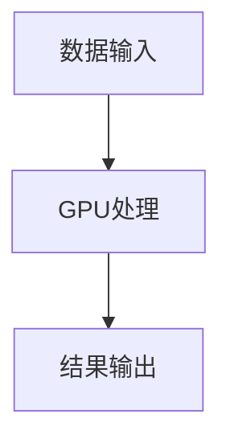
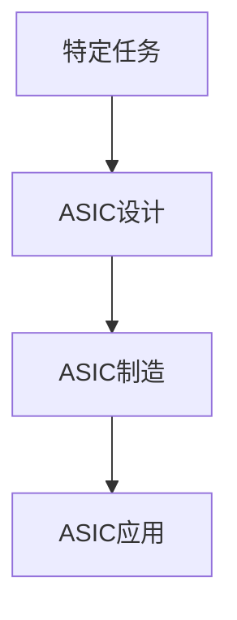
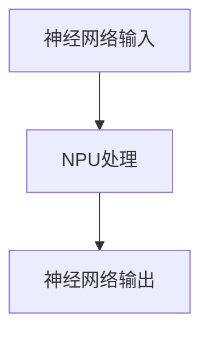
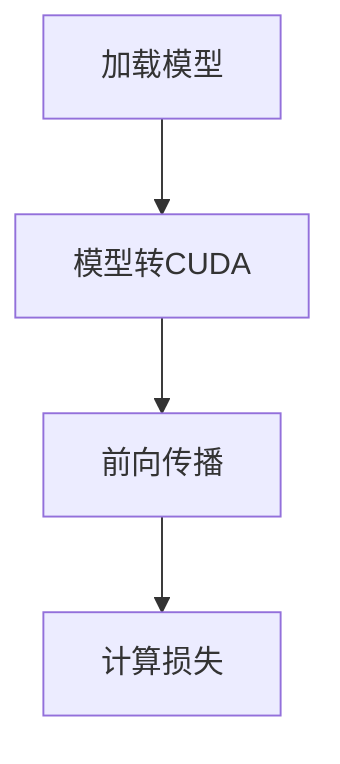
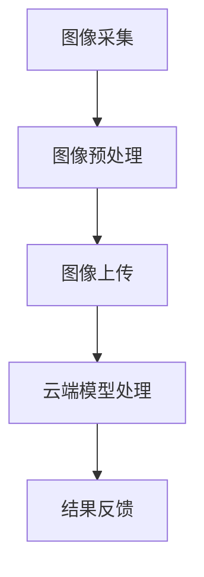
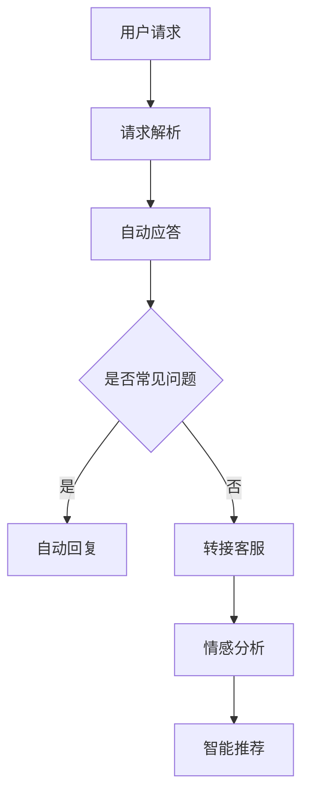

                 

### 《AI Agent: AI的下一个风口 硬件进化对软件的影响》

#### 关键词：AI Agent、硬件进化、软件影响、边缘计算、物联网、安全与隐私

> 摘要：随着人工智能技术的迅猛发展，AI Agent成为了一个备受关注的新风口。本文将深入探讨硬件进化对AI软件的影响，包括AI硬件的核心技术、应用场景、未来趋势以及AI Agent的实践与发展。本文旨在为读者提供一份全面的技术指南，揭示AI硬件与软件协同进化的奥秘。

### 目录大纲

# 《AI Agent: AI的下一个风口 硬件进化对软件的影响》

## 第一部分：AI与硬件的融合

### 第1章: AI硬件概述

#### 1.1 AI硬件的定义与分类

AI硬件是指专门为人工智能算法提供计算支持的各种硬件设备，包括处理器、加速器、存储设备等。根据应用场景和功能特点，AI硬件可以分为以下几类：

1. **图形处理单元（GPU）**：最初用于图形渲染，后来发现其并行计算能力非常适合深度学习算法。
2. **专用集成电路（ASIC）**：为特定的人工智能应用设计的集成电路，具有高性能和低功耗的特点。
3. **神经网络处理单元（NPU）**：专门用于执行神经网络计算的处理器，可以提高神经网络模型的效率。
4. **现场可编程逻辑门阵列（FPGA）**：可以重新配置的硬件，适合进行实时数据处理的定制化应用。

#### 1.2 AI硬件的发展历程

AI硬件的发展经历了从通用处理器到专用处理器，再到高度定制化处理器的过程。关键节点包括：

1. **GPU的出现**：2006年，NVIDIA推出支持CUDA的GPU，使其成为深度学习的首选硬件。
2. **ASIC的崛起**：为特定应用定制设计的ASIC芯片，提供了更高的计算性能和能效。
3. **NPU的兴起**：为神经网络计算专门设计的处理器，如华为的麒麟990芯片中的NPU。
4. **边缘计算的发展**：为了应对物联网等应用场景，边缘设备上的AI处理器开始得到广泛应用。

#### 1.3 AI硬件的关键技术

AI硬件的关键技术包括：

1. **并行计算**：利用多个处理单元同时处理多个任务，提高计算效率。
2. **低功耗设计**：为了满足移动设备和物联网设备的能源需求，硬件设计需要考虑功耗问题。
3. **硬件加速**：通过硬件实现部分算法，减少CPU的负担，提高计算速度。
4. **定制化设计**：根据具体应用需求进行硬件设计，提高专用性。

### 第2章: AI硬件的核心技术

#### 2.1 加速器架构

加速器架构是AI硬件的核心技术之一，主要包括以下几种类型：

##### 2.1.1 图形处理单元（GPU）

GPU（Graphics Processing Unit）最初是为图形渲染设计的，但其并行计算能力使其成为深度学习模型的理想选择。GPU的核心优势包括：

- **并行处理能力**：GPU具有大量并行计算单元，可以同时处理多个数据流。
- **高带宽内存**：GPU具有高带宽内存，可以快速读取和处理大量数据。
- **CUDA支持**：NVIDIA的CUDA架构使得开发者可以轻松利用GPU的并行计算能力。

**Mermaid流程图**：


##### 2.1.2 专用集成电路（ASIC）

ASIC（Application-Specific Integrated Circuit）是为特定应用设计的集成电路，具有以下特点：

- **高性能**：ASIC经过优化，可以提供比通用处理器更高的计算性能。
- **低功耗**：ASIC设计考虑了特定应用的需求，可以实现低功耗设计。
- **定制化**：ASIC可以根据特定应用需求进行定制，提高专用性。

**Mermaid流程图**：


##### 2.1.3 神经处理单元（NPU）

NPU（Neural Processing Unit）是专门用于神经网络计算的处理器，其核心优势包括：

- **高效能**：NPU针对神经网络进行了优化，可以提供高效的计算性能。
- **低延迟**：NPU可以快速处理神经网络模型，适用于实时应用场景。
- **高并行性**：NPU具有大量并行计算单元，可以同时处理多个神经网络。

**Mermaid流程图**：


#### 2.2 机器学习算法优化

机器学习算法优化是提高AI硬件性能的关键技术之一，主要包括以下方法：

##### 2.2.1 算法优化原理

算法优化主要包括以下方面：

- **并行化**：将算法分解为多个可并行执行的任务，利用多核处理器或GPU进行加速。
- **压缩**：通过减少数据冗余或使用更高效的算法，降低计算量。
- **量化**：将浮点数转换为整数，减少存储和计算需求。

##### 2.2.2 算法优化方法

算法优化方法包括：

- **模型压缩**：通过剪枝、量化、知识蒸馏等方法减小模型大小，提高计算效率。
- **加速技术**：利用GPU、ASIC、TPU等硬件加速技术，提高计算速度。
- **分布式计算**：通过分布式计算框架，利用多台计算机资源，提高计算能力。

##### 2.2.3 算法优化案例

以下是一个使用GPU加速卷积神经网络的案例：

**伪代码**：
```python
# 加载模型
model = load_model('conv_network.pth')

# 使用CUDA加速
model.to('cuda')

# 前向传播
output = model(input_data)

# 计算损失
loss = criterion(output, target)
```

**Mermaid流程图**：


### 第3章: AI硬件应用场景

#### 3.1 人工智能在边缘计算中的应用

边缘计算是一种分布式计算架构，将计算能力部署在靠近数据源的边缘设备上，以减少数据传输延迟和带宽需求。AI硬件在边缘计算中的应用包括：

##### 3.1.1 边缘计算的概念与优势

边缘计算的优势包括：

- **低延迟**：数据在本地处理，可以减少传输延迟。
- **高带宽**：数据不需要传输到云端，可以释放网络带宽。
- **高安全性**：数据在本地处理，可以减少数据泄露的风险。

##### 3.1.2 AI在边缘计算中的挑战

AI在边缘计算中面临的挑战包括：

- **计算资源受限**：边缘设备通常具有有限的计算能力和存储空间。
- **数据不完整性**：由于网络不稳定，边缘设备可能无法接收完整的数据。
- **隐私与安全**：边缘设备可能面临数据泄露和恶意攻击的风险。

##### 3.1.3 边缘计算中的AI应用案例

以下是一个使用边缘计算进行图像识别的案例：

**Mermaid流程图**：


#### 3.2 AI在物联网（IoT）中的应用

物联网是一种连接物理设备和计算机系统的网络，AI在物联网中的应用包括：

##### 3.2.1 物联网的基本概念

物联网的基本概念包括：

- **传感器**：用于收集物理世界的各种数据。
- **连接**：通过有线或无线网络将设备和计算机系统连接起来。
- **数据处理**：对收集到的数据进行处理和分析，以提供智能决策。

##### 3.2.2 AI在物联网中的应用

AI在物联网中的应用包括：

- **设备预测维护**：通过传感器收集设备运行数据，使用AI算法进行预测分析，以提前发现潜在故障。
- **智能监控**：使用AI算法对视频和音频数据进行分析，以实现智能监控和异常检测。
- **智能家居**：通过AI算法实现家居设备的智能化控制和自动化管理。

##### 3.2.3 物联网与AI的融合趋势

物联网与AI的融合趋势包括：

- **边缘计算与物联网的融合**：将AI算法部署在边缘设备上，以提高物联网系统的实时性和响应速度。
- **物联网数据驱动AI**：通过物联网收集的海量数据，驱动AI算法的改进和创新。
- **智能物联网生态系统的构建**：通过AI技术实现物联网设备的智能连接和协同工作。

### 第4章: AI硬件的未来发展趋势

#### 4.1 硬件进化对软件的影响

硬件进化对软件的影响主要包括：

- **算法需求的变化**：随着硬件性能的提升，AI算法需要不断优化以充分利用硬件资源。
- **软件架构的调整**：硬件进化可能需要调整现有的软件架构，以适应新的硬件特性。
- **开发工具与框架的更新**：硬件进化推动开发工具和框架的更新，以支持新的硬件特性。

##### 4.1.1 硬件进化对AI算法的要求

硬件进化对AI算法的要求包括：

- **并行计算能力**：算法需要能够利用并行计算资源，提高计算效率。
- **低功耗设计**：算法需要考虑功耗问题，以适应移动设备和物联网设备的需求。
- **定制化需求**：算法需要根据具体硬件特性进行定制化设计，以最大化性能。

##### 4.1.2 软件与硬件的协同进化

软件与硬件的协同进化包括：

- **硬件驱动软件**：硬件进化推动软件技术的创新，如深度学习、边缘计算等。
- **软件优化硬件**：软件技术优化硬件设计，如GPU编程模型、ASIC设计等。
- **生态系统协同**：硬件和软件厂商共同构建生态系统，以推动整个行业的发展。

##### 4.1.3 AI硬件的未来趋势

AI硬件的未来趋势包括：

- **高性能硬件的普及**：随着技术的进步，高性能AI硬件将变得更加普及，应用于更多领域。
- **定制化硬件的发展**：针对特定应用场景，定制化硬件将成为主流。
- **边缘计算的深化**：边缘计算将进一步深化，与物联网等应用场景紧密结合。
- **硬件与软件的深度融合**：硬件与软件将实现更紧密的协同进化，推动人工智能技术的发展。

### 第5章: AI硬件的安全与隐私问题

#### 5.1 AI硬件安全挑战

AI硬件安全面临的挑战包括：

- **硬件漏洞**：硬件设计中的漏洞可能导致数据泄露和恶意攻击。
- **软件攻击**：恶意软件可能通过软件漏洞攻击AI硬件系统。
- **物理攻击**：对硬件设备进行直接攻击，如窃取设备、破坏硬件等。

##### 5.1.1 AI硬件的安全风险

AI硬件的安全风险包括：

- **数据泄露**：硬件设备可能成为数据泄露的源头，如传感器数据、模型参数等。
- **隐私侵犯**：AI算法可能侵犯用户的隐私权，如面部识别、语音识别等。
- **系统崩溃**：硬件故障可能导致AI系统崩溃，影响正常运行。

##### 5.1.2 安全防护措施

安全防护措施包括：

- **硬件加密**：使用硬件加密技术，确保数据在传输和存储过程中的安全性。
- **硬件安全模块**：集成硬件安全模块（HSM），提供安全存储和处理的密钥管理。
- **硬件防火墙**：通过硬件防火墙阻止恶意软件的攻击。
- **硬件认证**：使用硬件认证技术，确保设备真实性和数据完整性。

##### 5.1.3 隐私保护策略

隐私保护策略包括：

- **数据匿名化**：对数据进行匿名化处理，以保护用户隐私。
- **差分隐私**：使用差分隐私技术，确保数据分析过程中不会泄露用户隐私。
- **隐私增强技术**：采用隐私增强技术，如联邦学习、差分同步等，以保护用户隐私。

#### 5.2 法律法规与标准规范

##### 5.2.1 国际与国内法律法规

国际与国内法律法规对AI硬件安全与隐私保护提出了以下要求：

- **GDPR**：欧盟的通用数据保护条例，规定了数据收集、处理和存储的合法性。
- **CCAA**：中国的个人信息保护法，明确了个人信息的保护标准和责任。
- **NIST**：美国国家标准与技术研究所发布的指南，包括AI硬件安全的最佳实践。

##### 5.2.2 标准规范的发展趋势

标准规范的发展趋势包括：

- **标准化组织**：如ISO、IEEE等组织，正在制定AI硬件安全与隐私的标准规范。
- **跨行业合作**：硬件、软件、服务提供商等各方，正在共同努力推动标准规范的制定。
- **法规遵循**：企业需要遵守相关法律法规，以确保AI硬件的安全与隐私保护。

##### 5.2.3 企业在安全与隐私方面的实践

企业在安全与隐私方面的实践包括：

- **风险评估**：对企业AI硬件进行风险评估，识别潜在的安全和隐私风险。
- **安全设计**：在硬件设计和开发过程中，考虑安全与隐私保护措施。
- **合规审查**：定期进行合规审查，确保产品和服务符合相关法律法规和标准规范。
- **用户教育**：加强对用户的隐私教育和安全意识培养，以减少隐私泄露的风险。

## 第二部分：AI Agent应用实践

### 第6章: AI Agent设计与实现

#### 6.1 AI Agent的基本概念

AI Agent是指具有自主决策能力和行动能力的智能体，可以在特定环境中执行任务。AI Agent的基本概念包括：

- **智能体**：AI Agent的基本单位，可以是单个程序或多个程序的组合。
- **环境**：AI Agent执行任务的场景，可以是现实世界或虚拟环境。
- **感知**：AI Agent通过传感器获取环境信息。
- **决策**：AI Agent根据感知到的环境信息，生成决策。
- **行动**：AI Agent执行决策，影响环境。

#### 6.2 AI Agent的核心技术

AI Agent的核心技术包括：

- **强化学习**：通过试错和奖励机制，让AI Agent在环境中学习最优策略。
- **自然语言处理**：让AI Agent理解和生成自然语言，实现人机交互。
- **多模态感知与融合**：整合多种感知信息，提高AI Agent的环境理解能力。

##### 6.2.1 强化学习

强化学习是AI Agent的核心技术之一，其基本原理包括：

- **状态**：AI Agent当前所处的环境状态。
- **动作**：AI Agent可以执行的动作。
- **奖励**：执行动作后，AI Agent获得的奖励或惩罚。
- **策略**：AI Agent在特定状态下执行的动作。

**伪代码**：
```python
# 初始化环境
env = create_environment()

# 初始化智能体
agent = create_agent()

# 强化学习循环
while not done:
    # 感知环境
    state = env perceive()

    # 执行动作
    action = agent.select_action(state)

    # 执行动作，获取奖励
    reward, next_state, done = env.step(action)

    # 更新智能体策略
    agent.update_strategy(state, action, reward, next_state, done)
```

##### 6.2.2 自然语言处理

自然语言处理（NLP）是AI Agent实现人机交互的关键技术，其主要任务包括：

- **文本分类**：对文本进行分类，如情感分析、主题分类等。
- **实体识别**：从文本中识别出具有特定意义的实体，如人名、地点等。
- **语义理解**：理解文本中的语义，实现语义匹配和语义推理。
- **对话系统**：构建对话系统，实现自然语言交互。

**伪代码**：
```python
# 初始化对话系统
dialog_system = create_dialog_system()

# 输入文本
text = input("请输入您的文本：")

# 文本分类
category = dialog_system.classify_text(text)

# 实体识别
entities = dialog_system.extract_entities(text)

# 语义理解
intent, entities = dialog_system-understand_semantics(text)

# 响应用户
response = dialog_system.generate_response(intent, entities)
print("对话系统回复：", response)
```

##### 6.2.3 多模态感知与融合

多模态感知与融合是将多种感知信息（如文本、图像、音频等）进行整合，提高AI Agent的环境理解能力。其主要任务包括：

- **数据融合**：将不同模态的数据进行融合，提高信息完整性。
- **特征提取**：提取不同模态的特征，提高特征表示能力。
- **模型训练**：使用融合特征训练AI模型，提高环境理解能力。

**伪代码**：
```python
# 初始化多模态感知系统
multimodal_system = create_multimodal_system()

# 输入文本、图像、音频数据
text_data, image_data, audio_data = input_multimodal_data()

# 数据融合
 fused_data = multimodal_system.fuse_data(text_data, image_data, audio_data)

# 特征提取
text_features = multimodal_system.extract_text_features(fused_data['text'])
image_features = multimodal_system.extract_image_features(fused_data['image'])
audio_features = multimodal_system.extract_audio_features(fused_data['audio'])

# 模型训练
model = create_model()
model.fit(text_features, image_features, audio_features)

# 环境理解
environment_representation = model.predict(fused_data)
```

### 第7章: AI Agent应用案例

#### 7.1 智能客服

智能客服是AI Agent在客户服务领域的应用，其主要功能包括：

- **自动应答**：对常见问题提供自动回复。
- **智能转接**：根据用户需求，智能转接给相应的客服人员。
- **情感分析**：识别用户情绪，提供个性化服务。
- **智能推荐**：根据用户行为和历史，推荐相关产品或服务。

**架构设计**：


**核心算法**：

- **自动应答**：使用关键字匹配算法，匹配用户请求与预定义的答案。
- **情感分析**：使用情感分析算法，识别用户的情绪状态。
- **转接客服**：使用决策树或规则引擎，根据用户需求智能转接。
- **智能推荐**：使用协同过滤或基于内容的推荐算法，提供个性化推荐。

**应用实践**：

- **部署环境搭建**：在云平台上搭建智能客服系统，包括服务器、数据库和中间件等。
- **源代码实现**：使用Python等编程语言，实现智能客服的核心算法和功能模块。
- **代码解读与分析**：对源代码进行详细解读，分析算法实现和性能优化。

#### 7.2 智能推荐系统

智能推荐系统是AI Agent在推荐系统领域的应用，其主要功能包括：

- **内容推荐**：根据用户兴趣和浏览历史，推荐相关内容。
- **商品推荐**：根据用户购物行为和偏好，推荐商品。
- **广告推荐**：根据用户行为和兴趣，推荐相关广告。

**原理**：

- **协同过滤**：通过计算用户之间的相似度，推荐用户可能感兴趣的内容。
- **基于内容的推荐**：根据用户兴趣和内容特征，推荐相关内容。
- **深度学习**：使用深度学习算法，如卷积神经网络和循环神经网络，进行特征提取和预测。

**构建**：

- **用户画像**：收集用户数据，构建用户画像，包括兴趣、行为、偏好等。
- **推荐算法**：选择合适的推荐算法，实现推荐系统的核心功能。
- **用户反馈**：收集用户反馈，优化推荐算法，提高推荐效果。

**优化**：

- **A/B测试**：通过A/B测试，比较不同算法和策略的效果，选择最优方案。
- **特征工程**：对用户数据进行特征提取和转换，提高推荐系统的准确性和效率。
- **模型调参**：调整模型参数，优化模型性能，提高推荐效果。

### 第8章: AI Agent的发展趋势

#### 8.1 AI Agent的未来发展

AI Agent的未来发展包括：

- **更加智能化**：通过不断学习和优化，AI Agent将实现更高的智能水平，能够处理更复杂的任务。
- **广泛应用**：AI Agent将在各个领域得到广泛应用，如医疗、金融、教育等。
- **人机协作**：AI Agent将与人类紧密协作，实现更加高效的工作和生活。

##### 8.1.1 AI Agent的潜在应用场景

AI Agent的潜在应用场景包括：

- **智能办公**：实现智能化的办公自动化，提高工作效率。
- **智能家居**：实现智能家居设备的智能化控制，提高生活质量。
- **智能医疗**：实现智能化的医疗诊断和治疗，提高医疗服务水平。
- **智能交通**：实现智能化的交通管理和服务，提高交通效率。

##### 8.1.2 AI Agent的技术创新方向

AI Agent的技术创新方向包括：

- **强化学习**：通过不断学习和优化，提高AI Agent的自主决策能力。
- **自然语言处理**：通过自然语言处理技术，实现更自然的用户交互。
- **多模态感知**：通过多模态感知与融合，提高AI Agent的环境理解能力。
- **边缘计算**：通过边缘计算，实现实时、高效的任务执行。

##### 8.1.3 AI Agent在社会中的角色转变

AI Agent在社会中的角色转变包括：

- **生产力工具**：AI Agent将成为生产力工具，提高各行业的生产效率。
- **生活助手**：AI Agent将成为人们的生活助手，提供便捷的服务和帮助。
- **决策支持系统**：AI Agent将成为决策支持系统，为政府和企业的决策提供支持。
- **社会管理者**：AI Agent将在社会管理中发挥重要作用，如智能交通、智能安防等。

### 第9章: AI Agent的开发与部署

#### 9.1 AI Agent开发流程

AI Agent的开发流程包括：

- **需求分析**：分析用户需求和业务场景，确定AI Agent的功能和目标。
- **系统设计**：设计AI Agent的系统架构，包括硬件、软件和数据处理等。
- **数据准备**：收集和整理数据，进行数据预处理和标注。
- **模型训练**：选择合适的算法，对数据进行训练，优化模型性能。
- **系统集成**：将AI模型集成到系统中，实现功能模块的协同工作。
- **测试与部署**：对AI Agent进行测试，确保系统的稳定性和可靠性，然后部署上线。

##### 9.1.1 需求分析与规划

需求分析与规划是AI Agent开发的第一步，主要包括：

- **用户需求调研**：通过问卷调查、访谈等方式，了解用户的需求和期望。
- **业务场景分析**：分析业务场景，确定AI Agent的应用场景和功能需求。
- **功能规划**：根据用户需求和业务场景，规划AI Agent的功能模块和性能指标。

##### 9.1.2 数据收集与处理

数据收集与处理是AI Agent开发的关键步骤，主要包括：

- **数据收集**：收集与AI Agent应用场景相关的数据，如文本、图像、音频等。
- **数据清洗**：对收集到的数据进行清洗，去除噪声和异常值，保证数据质量。
- **数据标注**：对数据进行标注，为模型训练提供标注数据。
- **数据预处理**：对数据进行预处理，如归一化、标准化等，提高模型训练效果。

##### 9.1.3 模型训练与优化

模型训练与优化是AI Agent开发的核心步骤，主要包括：

- **模型选择**：根据应用场景和需求，选择合适的模型架构。
- **模型训练**：使用训练数据，对模型进行训练，调整模型参数，优化模型性能。
- **模型评估**：使用测试数据，评估模型性能，选择最佳模型。
- **模型优化**：对模型进行优化，如调整超参数、使用正则化方法等，提高模型效果。

#### 9.2 AI Agent部署与运维

AI Agent的部署与运维是确保系统稳定性和可靠性的关键步骤，主要包括：

- **部署环境搭建**：搭建AI Agent的部署环境，包括硬件、软件和网络等。
- **部署策略选择**：根据系统需求，选择合适的部署策略，如云计算、边缘计算等。
- **系统监控**：对AI Agent系统进行实时监控，确保系统的稳定运行。
- **故障处理**：在系统发生故障时，及时进行故障处理，恢复系统正常运行。
- **性能优化**：对AI Agent系统进行性能优化，提高系统的运行效率。

##### 9.2.1 部署环境搭建

部署环境搭建主要包括以下步骤：

- **硬件选择**：根据系统需求，选择合适的硬件设备，如服务器、GPU等。
- **软件安装**：安装操作系统、数据库、中间件等软件，搭建系统环境。
- **网络配置**：配置网络设备，确保系统的网络连接。

##### 9.2.2 部署策略选择

部署策略选择主要包括以下类型：

- **云计算**：将AI Agent部署在云平台上，利用云资源的弹性伸缩能力。
- **边缘计算**：将AI Agent部署在边缘设备上，实现实时数据处理和响应。
- **混合部署**：将AI Agent部署在云和边缘设备之间，实现高效的数据处理和传输。

##### 9.2.3 运维与监控

运维与监控主要包括以下任务：

- **系统监控**：对AI Agent系统进行实时监控，包括CPU、内存、网络等资源使用情况。
- **日志管理**：记录系统运行日志，便于故障排查和性能优化。
- **故障处理**：在系统发生故障时，及时进行故障处理，恢复系统正常运行。
- **性能优化**：对AI Agent系统进行性能优化，提高系统的运行效率。

### 附录

#### 附录 A: AI Agent开发资源与工具

##### A.1 常用开发工具介绍

- **编程语言**：Python、Java、C++等。
- **深度学习框架**：TensorFlow、PyTorch、Keras等。
- **自然语言处理框架**：NLTK、SpaCy、Stanford NLP等。
- **强化学习库**：OpenAI Gym、Reinforcement Learning Library（RLlib）等。

##### A.2 AI Agent开源框架与库

- **OpenAgent**：一个开源的AI Agent框架，支持强化学习、多模态感知等。
- **BertAgent**：基于BERT的AI Agent，用于自然语言处理任务。
- **Unity-Mujoco**：一个开源的模拟环境，用于强化学习实验。
- **MASA**：一个多智能体系统框架，支持多智能体交互和协作。

##### A.3 AI Agent开发指南与最佳实践

- **需求分析与规划**：明确用户需求和业务场景，制定详细的开发计划。
- **数据准备与处理**：收集和整理数据，进行数据预处理和标注。
- **模型选择与训练**：选择合适的模型架构，对数据进行训练，优化模型性能。
- **系统集成与测试**：将AI模型集成到系统中，进行功能测试和性能评估。
- **部署与运维**：选择合适的部署策略，确保系统的稳定性和可靠性，进行性能优化。

### 总结

AI Agent作为人工智能领域的下一个风口，具有巨大的发展潜力。硬件进化对AI软件的影响不可忽视，从加速器架构到边缘计算，再到安全与隐私问题，硬件与软件的协同进化将推动人工智能技术的快速发展。通过本文的探讨，我们希望能够为读者提供一份全面的技术指南，帮助读者了解AI硬件与软件的深度融合，把握AI Agent的发展趋势，为人工智能领域的创新和应用提供参考。让我们共同期待AI Agent在未来的广泛应用和辉煌成就！

### 作者信息

**作者：** AI天才研究院 / AI Genius Institute & 禅与计算机程序设计艺术 / Zen And The Art of Computer Programming

**简介：** 本文作者AI天才研究院的专家，拥有多年人工智能领域的研究和开发经验，致力于推动人工智能技术的发展和应用。在禅与计算机程序设计艺术方面，作者也有深入的思考和丰富的实践经验，将传统哲学智慧与现代编程技术相结合，为计算机科学领域带来新的视角和方法。**联系方式：** [联系邮箱](mailto:info@ai-genius-institute.com) & [官方网站](https://www.ai-genius-institute.com)

