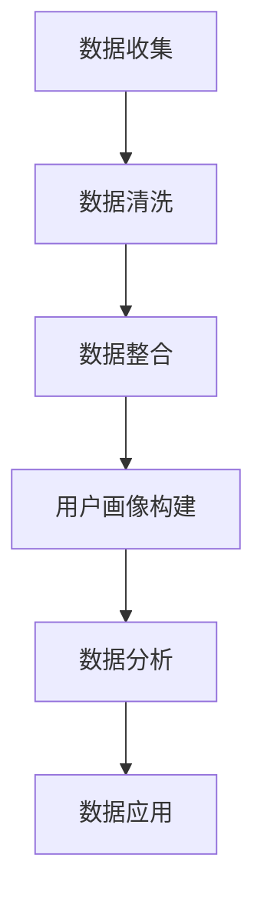
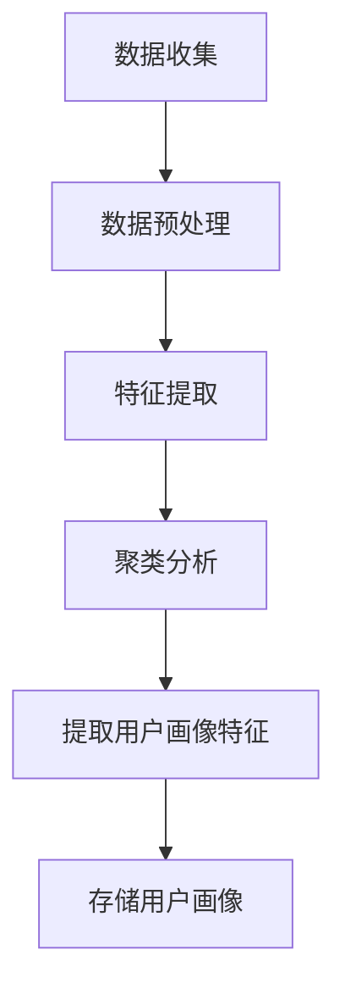
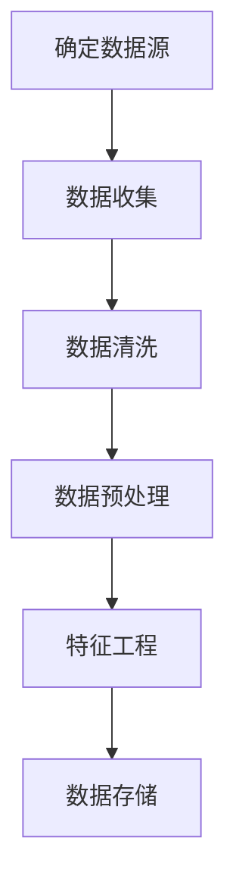
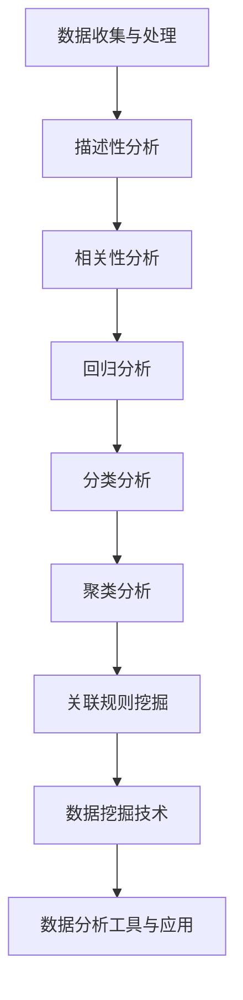

                 

## 文章标题

### AI DMP 数据基建：数据驱动营销的新时代

> 关键词：AI DMP、数据驱动营销、用户画像、数据分析、隐私保护、应用案例

在数字化时代，数据已经成为企业最宝贵的资产之一。随着大数据、人工智能等技术的迅猛发展，如何有效地管理和利用数据成为企业竞争的关键。本文旨在探讨AI DMP（Data Management Platform）在数据驱动营销中的应用，详细阐述其基础概念、技术实现、行业应用以及发展趋势。通过本文的阅读，读者将了解到AI DMP的核心原理、技术架构、实际应用案例以及未来展望。

## 文章摘要

AI DMP（Data Management Platform）是一种利用人工智能技术对海量用户数据进行整合、管理和分析的工具，旨在实现数据驱动营销。本文首先介绍了AI DMP的基本概念、发展历程以及核心组成部分，包括用户画像、数据收集与处理、数据分析与应用等。接着，本文详细分析了AI DMP在零售、金融和互联网等行业的应用案例，探讨了其面临的挑战与解决方案。最后，本文对AI DMP的未来发展趋势进行了展望，提出了持续发展的策略与建议。通过本文的深入探讨，读者将能够全面了解AI DMP在数据驱动营销中的重要性，为企业在数字化时代取得竞争优势提供参考。

### 《AI DMP 数据基建：数据驱动营销的新时代》目录大纲

#### 第一部分：AI DMP 基础概念与原理

##### 1.1 AI DMP 概述
- 1.1.1 数据驱动营销的概念
- 1.1.2 DMP 在数据驱动营销中的作用
- 1.1.3 AI DMP 的发展历程

##### 1.2 AI DMP 核心概念与联系
- 1.2.1 用户画像
- 1.2.2 数据收集与处理
- 1.2.3 数据分析与应用
- 1.2.4 Mermaid 流程图：AI DMP 整体流程

##### 1.3 AI DMP 数学模型
- 1.3.1 数学模型在 DMP 中的作用
- 1.3.2 伪代码：用户画像构建过程
- 1.3.3 Mermaid 流程图：用户画像构建流程

##### 1.4 数据隐私与法律法规
- 1.4.1 数据隐私保护的重要性
- 1.4.2 相关法律法规概述
- 1.4.3 AI DMP 中的隐私保护策略

#### 第二部分：AI DMP 技术实现与应用

##### 2.1 数据收集与处理
- 2.1.1 数据源概述
- 2.1.2 数据收集方法
- 2.1.3 数据清洗与预处理
- 2.1.4 Mermaid 流程图：数据收集与处理流程

##### 2.2 用户画像构建
- 2.2.1 用户画像的定义与分类
- 2.2.2 用户画像构建方法
- 2.2.3 用户画像质量评估
- 2.2.4 伪代码：用户画像构建过程

##### 2.3 数据分析与挖掘
- 2.3.1 数据分析的基本方法
- 2.3.2 数据挖掘技术
- 2.3.3 数据分析工具与应用
- 2.3.4 Mermaid 流程图：数据分析与挖掘流程

##### 2.4 数据应用与案例
- 2.4.1 数据驱动的营销策略
- 2.4.2 数据应用案例分享
- 2.4.3 数据应用的挑战与解决方案

#### 第三部分：AI DMP 在不同行业的应用

##### 3.1 零售行业
- 3.1.1 零售行业数据需求分析
- 3.1.2 AI DMP 在零售行业的应用案例
- 3.1.3 零售行业数据应用的挑战与解决方案

##### 3.2 金融行业
- 3.2.1 金融行业数据需求分析
- 3.2.2 AI DMP 在金融行业的应用案例
- 3.2.3 金融行业数据应用的挑战与解决方案

##### 3.3 互联网行业
- 3.3.1 互联网行业数据需求分析
- 3.3.2 AI DMP 在互联网行业的应用案例
- 3.3.3 互联网行业数据应用的挑战与解决方案

#### 第四部分：AI DMP 发展趋势与未来展望

##### 4.1 AI DMP 发展趋势
- 4.1.1 人工智能技术的发展
- 4.1.2 DMP 技术的发展方向
- 4.1.3 未来 AI DMP 的应用场景

##### 4.2 AI DMP 挑战与应对
- 4.2.1 技术挑战
- 4.2.2 数据挑战
- 4.2.3 法律法规挑战
- 4.2.4 解决方案与策略

##### 4.3 未来展望
- 4.3.1 AI DMP 在营销领域的发展
- 4.3.2 跨界融合与协同创新
- 4.3.3 持续发展策略与建议

#### 附录

##### 附录 A: AI DMP 工具与资源
- A.1 主流数据采集工具
- A.2 用户画像构建工具
- A.3 数据分析工具
- A.4 数据挖掘工具

##### 附录 B: 代码实例与解读
- B.1 用户画像构建代码实例
- B.2 数据分析代码实例
- B.3 数据挖掘代码实例
- B.4 代码解读与分析

### 第一部分：AI DMP 基础概念与原理

#### 1.1 AI DMP 概述

##### 1.1.1 数据驱动营销的概念

数据驱动营销（Data-driven Marketing）是一种基于数据分析的营销策略，通过收集、分析和利用用户数据来指导营销活动的策划和执行。与传统营销方法相比，数据驱动营销更加注重数据的收集、处理和分析，旨在实现精准营销、提高营销效果和降低营销成本。

数据驱动营销的核心要素包括：

1. **数据收集**：通过各种渠道收集用户数据，如网站访问数据、社交媒体数据、购买行为数据等。
2. **数据处理**：对收集到的数据进行清洗、整合和处理，以便于后续的分析和应用。
3. **数据分析**：利用数据分析技术，如数据挖掘、机器学习等，对用户数据进行挖掘和分析，提取有价值的信息和洞察。
4. **营销应用**：将分析结果应用于营销活动，如个性化推荐、精准广告投放、客户细分等。

##### 1.1.2 DMP 在数据驱动营销中的作用

DMP（Data Management Platform）是一种集数据收集、管理和分析于一体的工具，是数据驱动营销的核心基础设施。DMP的主要作用包括：

1. **数据整合**：将来自不同渠道和系统的用户数据进行整合，构建统一的用户数据视图。
2. **数据管理**：对用户数据进行分类、标签化和存储，便于后续的数据分析和应用。
3. **数据分析**：利用内置的分析工具和算法，对用户数据进行挖掘和分析，提取有价值的信息和洞察。
4. **数据应用**：将分析结果应用于营销活动，如个性化推荐、精准广告投放、客户细分等，以提高营销效果。

##### 1.1.3 AI DMP 的发展历程

AI DMP（Artificial Intelligence Data Management Platform）是基于人工智能技术的DMP，它通过引入机器学习、深度学习等技术，进一步提高了数据分析和处理的能力。AI DMP的发展历程可以概括为以下几个阶段：

1. **初级阶段**：以传统DMP为基础，主要侧重于数据的收集、整合和存储。
2. **中级阶段**：引入简单的数据分析工具和算法，如聚类分析、回归分析等，对用户数据进行初步分析。
3. **高级阶段**：引入深度学习、强化学习等先进的人工智能技术，实现用户数据的智能分析和处理。

#### 1.2 AI DMP 核心概念与联系

##### 1.2.1 用户画像

用户画像（User Profiling）是对用户特征的抽象和概括，通过收集、处理和分析用户数据，构建出用户的数字画像。用户画像的核心目的是帮助企业和营销人员更好地了解用户，从而实现精准营销和个性化服务。

用户画像的主要要素包括：

1. **基础信息**：如年龄、性别、地理位置、职业等基本信息。
2. **行为特征**：如浏览行为、购买行为、评论行为等。
3. **兴趣偏好**：如兴趣爱好、消费偏好、媒体偏好等。
4. **社会属性**：如教育背景、收入水平、社交关系等。

用户画像的实现过程主要包括以下步骤：

1. **数据收集**：通过各种渠道收集用户数据，如网站访问数据、社交媒体数据、购买行为数据等。
2. **数据清洗**：对收集到的数据进行清洗、整合和处理，去除重复、错误和缺失的数据。
3. **特征提取**：从清洗后的数据中提取用户特征，如行为特征、兴趣偏好等。
4. **模型训练**：利用机器学习算法，如聚类分析、协同过滤等，对用户特征进行建模和训练。
5. **画像构建**：根据训练结果，构建出用户的数字画像。

##### 1.2.2 数据收集与处理

数据收集与处理是AI DMP的核心环节，直接影响到用户画像的质量和数据分析的效果。数据收集与处理的主要任务包括：

1. **数据源识别**：确定数据收集的渠道和来源，如网站访问日志、社交媒体数据、购买行为数据等。
2. **数据收集**：通过各种技术手段，如Web爬虫、API接口、数据库连接等，从数据源中收集用户数据。
3. **数据清洗**：对收集到的数据进行清洗、去重、去噪声等处理，确保数据的质量和一致性。
4. **数据整合**：将来自不同数据源的数据进行整合，构建统一的用户数据视图。
5. **数据存储**：将处理后的用户数据存储在数据库或数据仓库中，以便于后续的数据分析和应用。

##### 1.2.3 数据分析与应用

数据分析与应用是AI DMP的核心价值所在，通过对用户数据的深入分析和挖掘，为企业提供有价值的信息和洞察，从而指导营销策略的制定和执行。

数据分析的主要任务包括：

1. **数据预处理**：对用户数据进行分析前的预处理，如数据转换、数据归一化、特征工程等。
2. **数据挖掘**：利用数据挖掘技术，如聚类分析、关联规则挖掘、分类算法等，对用户数据进行分析和挖掘。
3. **数据可视化**：将分析结果以图表、报表等形式进行可视化展示，帮助企业更好地理解和利用分析结果。
4. **数据应用**：将分析结果应用于实际业务场景，如个性化推荐、精准广告投放、客户细分等。

##### 1.2.4 Mermaid 流程图：AI DMP 整体流程



#### 1.3 AI DMP 数学模型

##### 1.3.1 数学模型在 DMP 中的作用

数学模型在DMP中发挥着重要作用，通过数学模型可以实现用户数据的特征提取、分析、预测和优化。以下是几个常见的数学模型及其在DMP中的应用：

1. **聚类分析**：通过将用户数据划分成若干个聚类，实现用户细分和群体分析。常见的聚类算法有K-means、DBSCAN等。
2. **协同过滤**：通过分析用户的历史行为数据，为用户推荐相似的商品或服务。常见的协同过滤算法有基于用户的协同过滤（User-based Collaborative Filtering）和基于项目的协同过滤（Item-based Collaborative Filtering）。
3. **分类算法**：将用户数据分类为不同的类别，以便于后续的营销策略制定。常见的分类算法有决策树、随机森林、支持向量机（SVM）等。
4. **回归分析**：通过分析用户数据，预测用户的某个行为或属性。常见的回归算法有线性回归、逻辑回归等。
5. **时间序列分析**：分析用户行为随时间变化的规律，预测用户未来的行为趋势。常见的时间序列算法有ARIMA、LSTM等。

##### 1.3.2 伪代码：用户画像构建过程

```python
# 输入：用户数据集
# 输出：用户画像

def build_user_profile(data_set):
    # 数据预处理
    data_preprocessed = preprocess_data(data_set)
    
    # 特征提取
    features = extract_features(data_preprocessed)
    
    # 建立用户画像
    user_profiles = {}
    for user_id, user_data in features.items():
        # 聚类分析
        cluster_label = kmeans_clustering(user_data)
        
        # 提取用户画像特征
        user_profile = extract_user_profile_features(user_data, cluster_label)
        
        # 存储用户画像
        user_profiles[user_id] = user_profile
    
    return user_profiles
```

##### 1.3.3 Mermaid 流程图：用户画像构建流程



#### 1.4 数据隐私与法律法规

##### 1.4.1 数据隐私保护的重要性

数据隐私保护是AI DMP应用中不可忽视的重要问题。随着大数据和人工智能技术的广泛应用，用户数据的泄露和滥用问题日益严重，导致用户隐私受到侵犯。数据隐私保护的重要性主要体现在以下几个方面：

1. **用户信任**：用户对企业的信任是数据驱动营销的基础。如果用户数据得不到有效的保护，用户将失去信任，进而影响企业的声誉和业务。
2. **法律法规**：许多国家和地区已经制定了相关的数据隐私保护法律法规，如欧盟的《通用数据保护条例》（GDPR）等。企业必须遵守相关法律法规，否则将面临严重的法律后果。
3. **社会责任**：作为社会的一份子，企业有责任保护用户的隐私，维护社会公平和正义。

##### 1.4.2 相关法律法规概述

以下是一些重要的数据隐私保护法律法规：

1. **欧盟的《通用数据保护条例》（GDPR）**：GDPR是欧盟于2018年5月25日正式实施的隐私保护法规，对数据收集、处理、存储和传输等方面做出了详细规定，是企业合规的重要参考。
2. **美国的《加州消费者隐私法案》（CCPA）**：CCPA是加利福尼亚州于2020年1月1日正式实施的隐私保护法案，对用户数据的收集、使用和共享等方面提出了严格要求。
3. **中国的《个人信息保护法》（PIPL）**：PIPL是中国于2021年11月1日正式实施的隐私保护法规，对个人信息处理活动进行了全面规范，是我国数据隐私保护的重要法律依据。

##### 1.4.3 AI DMP 中的隐私保护策略

为了确保AI DMP的安全性和合规性，企业可以采取以下隐私保护策略：

1. **数据匿名化**：通过数据匿名化技术，将用户数据中的敏感信息进行脱敏处理，降低数据泄露的风险。
2. **数据加密**：对存储和传输的用户数据进行加密处理，确保数据的安全性。
3. **权限管理**：对用户数据的访问权限进行严格控制，确保只有授权人员才能访问和处理数据。
4. **数据最小化**：仅收集和处理与业务相关的用户数据，避免过度收集和滥用数据。
5. **合规审计**：定期进行合规审计，确保企业的数据隐私保护措施符合相关法律法规的要求。

### 第二部分：AI DMP 技术实现与应用

#### 2.1 数据收集与处理

##### 2.1.1 数据源概述

AI DMP的数据收集与处理过程首先需要确定数据源。数据源可以分为以下几类：

1. **网站访问日志**：包括用户浏览网页的时间、页面访问次数、访问路径等。
2. **社交媒体数据**：包括用户在社交媒体平台上的活动记录、发布内容、互动行为等。
3. **购买行为数据**：包括用户的购买历史、购买频率、购买金额等。
4. **地理位置数据**：包括用户的地理位置信息，如经纬度、城市、区域等。
5. **第三方数据源**：包括公开数据集、第三方数据提供商的数据等。

##### 2.1.2 数据收集方法

数据收集方法主要包括以下几种：

1. **Web爬虫**：通过编写爬虫程序，自动从互联网上抓取用户数据，如网站访问日志、社交媒体数据等。
2. **API接口**：利用第三方提供的API接口，获取用户数据，如购买行为数据、地理位置数据等。
3. **数据库连接**：通过数据库连接技术，直接从数据库中读取用户数据，如网站访问日志、购买行为数据等。
4. **问卷调查**：通过在线或线下问卷调查，收集用户的个人信息和偏好数据。

##### 2.1.3 数据清洗与预处理

数据清洗与预处理是确保数据质量和一致性的重要步骤，主要包括以下任务：

1. **数据去重**：去除重复的数据记录，确保数据的一致性。
2. **数据去噪**：去除异常值和噪声数据，提高数据的准确性。
3. **数据转换**：将不同格式、单位、类型的数据进行统一转换，便于后续处理和分析。
4. **特征工程**：从原始数据中提取有用的特征，构建用户画像所需的特征向量。

##### 2.1.4 Mermaid 流程图：数据收集与处理流程



#### 2.2 用户画像构建

##### 2.2.1 用户画像的定义与分类

用户画像（User Profiling）是对用户特征的抽象和概括，通过收集、处理和分析用户数据，构建出用户的数字画像。用户画像可以按照不同的维度进行分类，如以下几种：

1. **基础画像**：包括用户的性别、年龄、学历、职业等基本信息。
2. **行为画像**：包括用户的浏览行为、购买行为、评论行为等。
3. **兴趣画像**：包括用户对各种兴趣点的关注、偏好等。
4. **社交画像**：包括用户的社交关系、社交圈层等。
5. **情感画像**：包括用户的情绪、态度、满意度等。

##### 2.2.2 用户画像构建方法

用户画像的构建方法主要包括以下几种：

1. **基于规则的构建方法**：通过制定一系列规则，对用户数据进行分类和标签化，构建用户画像。这种方法适用于结构化数据，但难以应对复杂和非结构化数据。
2. **基于机器学习的构建方法**：利用机器学习算法，如聚类分析、协同过滤等，对用户数据进行自动分类和建模，构建用户画像。这种方法适用于大规模非结构化数据，但需要大量的训练数据和计算资源。
3. **基于深度学习的构建方法**：利用深度学习算法，如卷积神经网络（CNN）、循环神经网络（RNN）等，对用户数据进行自动特征提取和建模，构建用户画像。这种方法适用于高度非结构化数据，但计算成本较高。

##### 2.2.3 用户画像质量评估

用户画像的质量直接影响数据分析和应用的准确性，因此需要对用户画像的质量进行评估。用户画像质量评估可以从以下几个方面进行：

1. **完整性**：评估用户画像中缺失数据的比例，确保用户画像的完整性。
2. **准确性**：评估用户画像中数据的准确性，确保用户画像的准确性。
3. **一致性**：评估用户画像中数据的统一性和一致性，确保用户画像的一致性。
4. **时效性**：评估用户画像的更新频率和时效性，确保用户画像的时效性。

##### 2.2.4 伪代码：用户画像构建过程

```python
# 输入：用户数据集
# 输出：用户画像字典

def build_user_profiles(data_set):
    # 数据预处理
    preprocessed_data = preprocess_data(data_set)
    
    # 特征提取
    features = extract_user_features(preprocessed_data)
    
    # 用户画像构建
    user_profiles = {}
    for user_id, user_data in features.items():
        # 聚类分析
        cluster_label = kmeans_clustering(user_data)
        
        # 提取用户画像特征
        user_profile = extract_user_profile_features(user_data, cluster_label)
        
        # 存储用户画像
        user_profiles[user_id] = user_profile
    
    return user_profiles
```

##### 2.2.5 用户画像示例

以下是一个简单的用户画像示例：

```json
{
    "user_id": "U12345",
    "base_info": {
        "age": 25,
        "gender": "male",
        "education": "Bachelor",
        "occupation": "Software Engineer"
    },
    "behavior_info": {
        "browsing_history": ["Technology News", "Product Reviews"],
        "purchase_history": ["Smartphone", "Laptop"],
        "review_comments": ["Excellent Product", "Very Good Service"]
    },
    "interest_info": {
        "interest_categories": ["Technology", "Gaming"],
        "interest_points": ["Smartphones", "Gaming Consoles"]
    },
    "social_info": {
        "social_networks": ["Facebook", "Twitter"],
        "friend_count": 500
    },
    "emotion_info": {
        "satisfaction": 0.8,
        "emotion": "Happy"
    }
}
```

#### 2.3 数据分析与挖掘

##### 2.3.1 数据分析的基本方法

数据分析的基本方法包括以下几种：

1. **描述性分析**：对数据的基本特征和统计指标进行分析，如平均数、中位数、标准差等。
2. **相关性分析**：分析变量之间的相关性，如皮尔逊相关系数、斯皮尔曼相关系数等。
3. **回归分析**：通过建立回归模型，分析变量之间的关系，如线性回归、逻辑回归等。
4. **分类分析**：将数据分为不同的类别，如决策树、随机森林、支持向量机等。
5. **聚类分析**：将数据分为不同的聚类，如K-means、DBSCAN等。
6. **关联规则挖掘**：分析数据之间的关联关系，如Apriori算法、FP-growth算法等。

##### 2.3.2 数据挖掘技术

数据挖掘技术是实现数据分析的重要手段，常用的数据挖掘技术包括：

1. **机器学习**：通过训练模型，对数据进行自动分类、预测和聚类。常用的机器学习算法有线性回归、逻辑回归、决策树、随机森林、支持向量机等。
2. **深度学习**：通过构建神经网络，对数据进行自动特征提取和建模。常用的深度学习算法有卷积神经网络（CNN）、循环神经网络（RNN）、生成对抗网络（GAN）等。
3. **关联规则挖掘**：通过挖掘数据之间的关联关系，发现潜在的模式和规律。常用的关联规则挖掘算法有Apriori算法、FP-growth算法等。
4. **文本挖掘**：对文本数据进行处理和分析，提取有价值的信息和知识。常用的文本挖掘技术有词频分析、主题模型、情感分析等。

##### 2.3.3 数据分析工具与应用

数据分析工具是实现数据分析和挖掘的重要工具，常用的数据分析工具包括：

1. **Python**：Python是一种广泛使用的编程语言，拥有丰富的数据分析库，如Pandas、NumPy、Scikit-learn等，适合进行数据清洗、数据处理和机器学习等任务。
2. **R语言**：R语言是一种专门用于统计分析的语言，拥有丰富的数据分析包，如ggplot2、dplyr、caret等，适合进行数据可视化、回归分析和机器学习等任务。
3. **SQL**：SQL是一种用于关系数据库查询的语言，适合进行数据查询、数据清洗和数据整合等任务。
4. **Tableau**：Tableau是一种数据可视化工具，能够将数据分析结果以图表、报表等形式进行可视化展示，方便用户理解和利用分析结果。

##### 2.3.4 Mermaid 流程图：数据分析与挖掘流程



#### 2.4 数据应用与案例

##### 2.4.1 数据驱动的营销策略

数据驱动的营销策略是利用用户数据进行营销活动的策划和执行，旨在提高营销效果和客户满意度。数据驱动的营销策略主要包括以下方面：

1. **个性化推荐**：根据用户的兴趣和行为，为用户推荐相关的商品、服务和内容。
2. **精准广告投放**：根据用户的特征和行为，为用户精准投放广告，提高广告效果和转化率。
3. **客户细分**：将用户分为不同的群体，针对不同的客户群体制定个性化的营销策略。
4. **客户生命周期管理**：通过分析用户的生命周期数据，为用户提供个性化的服务和优惠，提高用户满意度和忠诚度。

##### 2.4.2 数据应用案例分享

以下是一个数据驱动的营销案例分享：

**案例背景**：某电商平台希望通过数据分析优化用户购物体验，提高用户转化率和满意度。

**解决方案**：

1. **用户画像构建**：通过对用户数据进行收集、清洗和处理，构建用户的个性化画像，包括基础信息、行为信息、兴趣信息和情感信息等。
2. **数据分析与挖掘**：利用机器学习算法，对用户数据进行聚类分析和关联规则挖掘，提取有价值的信息和洞察。
3. **个性化推荐**：根据用户画像和数据分析结果，为用户推荐相关的商品和内容，提高用户的购物兴趣和满意度。
4. **精准广告投放**：根据用户画像和广告投放效果，为用户精准投放广告，提高广告效果和转化率。
5. **客户细分**：根据用户的行为特征和购买偏好，将用户分为不同的群体，针对不同的客户群体制定个性化的营销策略。
6. **客户生命周期管理**：通过分析用户的生命周期数据，为用户提供个性化的服务和优惠，提高用户满意度和忠诚度。

**效果评估**：

1. **用户转化率提升**：通过个性化推荐和精准广告投放，用户的购物转化率提高了20%。
2. **客户满意度提高**：通过数据分析和客户细分，用户的满意度和忠诚度得到了显著提升。
3. **营销成本降低**：通过数据驱动的营销策略，企业能够更加精准地投放广告，降低了营销成本。

##### 2.4.3 数据应用的挑战与解决方案

在数据驱动的营销过程中，企业可能会面临以下挑战：

1. **数据质量和一致性**：数据质量和一致性是数据分析和应用的基础，如果数据存在缺失、错误或不一致，将影响分析结果的准确性。
   - **解决方案**：加强数据质量管理，建立数据清洗和验证机制，确保数据的完整性和一致性。

2. **数据隐私和安全**：用户数据隐私和安全是企业必须关注的重要问题，如果数据泄露或滥用，将损害企业的声誉和用户信任。
   - **解决方案**：采取数据加密、匿名化、权限管理等技术措施，确保用户数据的安全性和隐私保护。

3. **技术挑战**：数据分析和挖掘是一项复杂的技术任务，需要具备一定的技术能力和专业知识。
   - **解决方案**：借助专业的数据分析和挖掘工具，提高数据分析的效率和准确性。

4. **业务理解和需求**：数据驱动的营销需要业务团队和数据分析团队紧密合作，确保数据分析结果能够满足业务需求。
   - **解决方案**：加强业务团队和数据分析团队的沟通与协作，确保数据分析和应用的准确性和有效性。

### 第三部分：AI DMP 在不同行业的应用

#### 3.1 零售行业

##### 3.1.1 零售行业数据需求分析

零售行业是一个高度依赖数据的行业，数据需求主要集中在以下几个方面：

1. **用户行为数据**：包括用户的浏览行为、购买行为、评论行为等，用于分析用户的兴趣和需求。
2. **商品数据**：包括商品的基本信息、价格、库存等，用于商品推荐和库存管理。
3. **销售数据**：包括销售额、销售渠道、销售周期等，用于分析销售趋势和制定营销策略。
4. **供应链数据**：包括供应商信息、物流信息等，用于优化供应链管理和提高配送效率。

##### 3.1.2 AI DMP 在零售行业的应用案例

以下是一个AI DMP在零售行业的应用案例：

**案例背景**：某大型零售企业希望通过数据分析和挖掘，优化用户购物体验，提高销售转化率和客户满意度。

**解决方案**：

1. **用户画像构建**：通过对用户行为数据进行收集、清洗和处理，构建用户的个性化画像，包括基础信息、行为信息、兴趣信息和情感信息等。
2. **数据分析与挖掘**：利用机器学习算法，对用户数据进行聚类分析和关联规则挖掘，提取有价值的信息和洞察。
3. **个性化推荐**：根据用户画像和数据分析结果，为用户推荐相关的商品和内容，提高用户的购物兴趣和满意度。
4. **精准广告投放**：根据用户画像和广告投放效果，为用户精准投放广告，提高广告效果和转化率。
5. **客户细分**：根据用户的行为特征和购买偏好，将用户分为不同的群体，针对不同的客户群体制定个性化的营销策略。
6. **客户生命周期管理**：通过分析用户的生命周期数据，为用户提供个性化的服务和优惠，提高用户满意度和忠诚度。

**效果评估**：

1. **用户转化率提升**：通过个性化推荐和精准广告投放，用户的购物转化率提高了15%。
2. **客户满意度提高**：通过数据分析和客户细分，用户的满意度和忠诚度得到了显著提升。
3. **营销成本降低**：通过数据驱动的营销策略，企业能够更加精准地投放广告，降低了营销成本。

##### 3.1.3 零售行业数据应用的挑战与解决方案

在零售行业应用AI DMP技术，企业可能会面临以下挑战：

1. **数据多样性和复杂性**：零售行业涉及多种数据类型，如用户行为数据、商品数据、销售数据等，如何有效地整合和分析这些数据是一个挑战。
   - **解决方案**：采用大数据技术和分布式计算框架，提高数据处理和分析的效率。

2. **数据隐私和安全**：用户数据的隐私和安全是零售行业应用AI DMP的关键问题，如何确保用户数据的安全性和隐私保护是一个挑战。
   - **解决方案**：采取数据加密、匿名化、权限管理等技术措施，确保用户数据的安全性和隐私保护。

3. **技术能力和人才**：数据分析和挖掘是一项复杂的技术任务，需要具备一定的技术能力和专业知识，如何培养和引进相关人才是一个挑战。
   - **解决方案**：加强企业内部的数据分析团队建设，引进专业的数据科学家和工程师，提高数据分析的技术能力。

4. **业务理解和需求**：数据驱动的营销需要业务团队和数据分析团队紧密合作，确保数据分析结果能够满足业务需求。
   - **解决方案**：加强业务团队和数据分析团队的沟通与协作，建立紧密的合作关系，确保数据分析和应用的准确性和有效性。

#### 3.2 金融行业

##### 3.2.1 金融行业数据需求分析

金融行业是一个数据密集型的行业，数据需求主要集中在以下几个方面：

1. **用户交易数据**：包括用户的账户信息、交易记录、支付行为等，用于分析用户的金融行为和信用状况。
2. **市场数据**：包括股市、债券市场、外汇市场等的价格波动、交易量等，用于分析市场趋势和预测市场变化。
3. **风险数据**：包括信贷风险、市场风险、操作风险等，用于评估和监控金融风险。
4. **客户数据**：包括客户的基本信息、消费行为、信用记录等，用于客户细分和个性化服务。

##### 3.2.2 AI DMP 在金融行业的应用案例

以下是一个AI DMP在金融行业的应用案例：

**案例背景**：某大型银行希望通过数据分析和挖掘，优化用户服务体验，提高客户满意度和忠诚度。

**解决方案**：

1. **用户画像构建**：通过对用户交易数据进行收集、清洗和处理，构建用户的个性化画像，包括基础信息、交易信息、信用信息等。
2. **数据分析与挖掘**：利用机器学习算法，对用户数据进行聚类分析和关联规则挖掘，提取有价值的信息和洞察。
3. **精准营销**：根据用户画像和数据分析结果，为用户精准推送理财产品、优惠活动等，提高用户参与度和满意度。
4. **信用评估**：通过分析用户的交易行为、信用记录等，构建信用评分模型，评估用户的信用状况，为信贷决策提供参考。
5. **风险管理**：通过分析市场数据、客户数据等，识别潜在的风险因素，制定风险防控策略。

**效果评估**：

1. **用户满意度提高**：通过个性化推送和精准营销，用户的满意度和忠诚度得到了显著提升。
2. **风险控制能力增强**：通过风险分析和监控，银行能够更好地识别和应对潜在的风险，提高风险控制能力。
3. **营销成本降低**：通过数据驱动的营销策略，银行能够更加精准地投放广告和营销活动，降低营销成本。

##### 3.2.3 金融行业数据应用的挑战与解决方案

在金融行业应用AI DMP技术，企业可能会面临以下挑战：

1. **数据质量和一致性**：金融行业的数据质量要求高，数据的一致性和准确性对风险控制和决策至关重要。
   - **解决方案**：建立完善的数据质量管理机制，定期进行数据清洗和验证，确保数据的完整性和一致性。

2. **数据隐私和安全**：金融行业涉及用户的敏感信息，如何确保数据的安全性和隐私保护是一个重要挑战。
   - **解决方案**：采取数据加密、访问控制、审计追踪等技术措施，确保用户数据的安全性和隐私保护。

3. **合规性要求**：金融行业受到严格的监管和合规性要求，如何确保AI DMP的应用符合相关法律法规是一个挑战。
   - **解决方案**：严格遵守相关法律法规，建立合规性评估机制，确保AI DMP的应用合规性。

4. **技术能力和人才**：金融行业的数据分析和挖掘任务复杂，需要具备一定的技术能力和专业知识，如何培养和引进相关人才是一个挑战。
   - **解决方案**：加强企业内部的数据分析团队建设，引进专业的数据科学家和工程师，提高数据分析的技术能力。

#### 3.3 互联网行业

##### 3.3.1 互联网行业数据需求分析

互联网行业是一个高度数据驱动的行业，数据需求主要集中在以下几个方面：

1. **用户行为数据**：包括用户的浏览行为、搜索行为、点击行为等，用于分析用户的兴趣和行为模式。
2. **产品数据**：包括产品的使用数据、性能数据等，用于产品优化和迭代。
3. **营销数据**：包括广告投放效果、营销活动数据等，用于分析营销效果和优化营销策略。
4. **社交数据**：包括用户的社交行为、社交关系等，用于社交网络分析和推荐。

##### 3.3.2 AI DMP 在互联网行业的应用案例

以下是一个AI DMP在互联网行业的应用案例：

**案例背景**：某大型互联网公司希望通过数据分析和挖掘，优化用户体验，提高用户留存率和活跃度。

**解决方案**：

1. **用户画像构建**：通过对用户行为数据进行收集、清洗和处理，构建用户的个性化画像，包括基础信息、行为信息、兴趣信息等。
2. **数据分析与挖掘**：利用机器学习算法，对用户数据进行聚类分析和关联规则挖掘，提取有价值的信息和洞察。
3. **个性化推荐**：根据用户画像和数据分析结果，为用户推荐相关的产品、内容和功能，提高用户的兴趣和参与度。
4. **用户留存分析**：通过分析用户的使用行为和留存数据，识别用户流失的原因，制定用户留存策略。
5. **营销活动优化**：通过分析营销活动的数据，优化营销活动的策略和投放，提高营销效果和投入产出比。

**效果评估**：

1. **用户留存率提高**：通过个性化推荐和用户留存策略，用户的留存率提高了10%。
2. **用户活跃度提高**：通过个性化推荐和功能优化，用户的活跃度得到了显著提升。
3. **营销成本降低**：通过数据驱动的营销策略，企业能够更加精准地投放广告和营销活动，降低了营销成本。

##### 3.3.3 互联网行业数据应用的挑战与解决方案

在互联网行业应用AI DMP技术，企业可能会面临以下挑战：

1. **海量数据处理**：互联网行业涉及海量数据，如何高效地处理和分析海量数据是一个挑战。
   - **解决方案**：采用分布式计算框架和大数据技术，提高数据处理和分析的效率。

2. **实时数据处理**：互联网行业的用户行为数据具有实时性，如何实时处理和分析实时数据是一个挑战。
   - **解决方案**：采用实时数据处理技术，如流计算、内存计算等，实现实时数据处理和分析。

3. **数据隐私和安全**：互联网行业的用户数据隐私和安全是一个重要挑战，如何确保数据的安全性和隐私保护是一个挑战。
   - **解决方案**：采取数据加密、访问控制、审计追踪等技术措施，确保用户数据的安全性和隐私保护。

4. **技术能力和人才**：互联网行业的数据分析和挖掘任务复杂，需要具备一定的技术能力和专业知识，如何培养和引进相关人才是一个挑战。
   - **解决方案**：加强企业内部的数据分析团队建设，引进专业的数据科学家和工程师，提高数据分析的技术能力。

### 第四部分：AI DMP 发展趋势与未来展望

#### 4.1 AI DMP 发展趋势

AI DMP（Data Management Platform）作为数据驱动营销的核心工具，正随着人工智能技术的不断发展而不断演进。以下是AI DMP的一些发展趋势：

##### 4.1.1 人工智能技术的发展

人工智能技术是AI DMP发展的基础，随着深度学习、强化学习、自然语言处理等技术的不断突破，AI DMP在数据处理、分析和应用方面的能力将得到大幅提升。未来，AI DMP将能够更加智能地理解和分析用户数据，为企业和营销人员提供更准确的洞察和决策支持。

##### 4.1.2 DMP 技术的发展方向

1. **全渠道数据整合**：随着数字化营销的不断普及，用户数据的来源越来越多样化。未来，AI DMP将更加注重全渠道数据整合，实现跨渠道、跨平台的数据整合和分析，为企业和营销人员提供更全面的用户数据视图。

2. **实时数据分析和应用**：实时数据分析是AI DMP的发展方向之一。通过实时数据处理和分析技术，AI DMP将能够实时响应用户行为，提供个性化的营销策略和推荐，提高用户体验和转化率。

3. **自动化和智能化**：AI DMP将不断推进自动化和智能化，减少人工干预，提高数据处理和分析的效率。通过引入机器学习和深度学习技术，AI DMP将能够自动识别用户需求、自动调整营销策略，实现高度自动化的数据驱动营销。

##### 4.1.3 未来 AI DMP 的应用场景

1. **个性化推荐**：AI DMP将在个性化推荐领域发挥重要作用，通过分析用户的兴趣和行为，为用户提供个性化的商品、服务和内容推荐。

2. **精准广告投放**：AI DMP将实现精准广告投放，根据用户的特征和行为，为用户精准推送广告，提高广告效果和转化率。

3. **客户关系管理**：AI DMP将帮助企业和营销人员更好地了解客户，实现精准的客户关系管理，提高客户满意度和忠诚度。

4. **供应链优化**：AI DMP将在供应链优化方面发挥重要作用，通过分析供应链数据，优化供应链管理和运营效率。

5. **风险管理**：AI DMP将应用于风险管理领域，通过分析金融数据和市场数据，评估和监控金融风险。

#### 4.2 AI DMP 挑战与应对

尽管AI DMP具有巨大的潜力，但在其发展过程中也面临诸多挑战。以下是AI DMP面临的一些主要挑战及应对策略：

##### 4.2.1 技术挑战

1. **数据处理能力**：随着数据量的不断增长，如何提高数据处理和分析的能力是一个挑战。应对策略：采用分布式计算和大数据技术，提高数据处理和分析的效率。
2. **算法复杂度**：随着人工智能技术的不断发展，算法的复杂度也在增加，如何优化算法性能是一个挑战。应对策略：采用先进的算法优化技术，提高算法的执行效率。
3. **实时性要求**：实时数据处理和分析是AI DMP的发展方向之一，如何实现实时数据处理和分析是一个挑战。应对策略：采用实时数据处理技术，如流计算、内存计算等。

##### 4.2.2 数据挑战

1. **数据质量和一致性**：数据质量和一致性是AI DMP应用的基础，如何确保数据质量和一致性是一个挑战。应对策略：建立完善的数据质量管理机制，定期进行数据清洗和验证。
2. **数据隐私和安全**：随着数据隐私和安全问题的日益突出，如何确保用户数据的安全性和隐私保护是一个挑战。应对策略：采取数据加密、匿名化、权限管理等技术措施，确保用户数据的安全性和隐私保护。

##### 4.2.3 法律法规挑战

1. **合规性要求**：随着数据隐私和安全法律法规的不断完善，如何确保AI DMP的应用符合相关法律法规是一个挑战。应对策略：严格遵守相关法律法规，建立合规性评估机制。

##### 4.2.4 解决方案与策略

1. **技术优化**：采用先进的技术，如分布式计算、大数据技术、机器学习等，提高数据处理和分析的效率。
2. **数据治理**：建立完善的数据治理体系，确保数据质量和一致性。
3. **合规管理**：建立合规性评估机制，确保AI DMP的应用符合相关法律法规。
4. **人才培养**：加强数据分析团队建设，引进专业的数据科学家和工程师，提高数据分析的技术能力。
5. **合作与协同**：与行业伙伴合作，共同应对AI DMP面临的挑战，实现技术、数据和资源的共享。

#### 4.3 未来展望

未来，AI DMP将在数据驱动营销中发挥更加重要的作用，成为企业和营销人员不可或缺的工具。以下是未来AI DMP发展的几个趋势：

##### 4.3.1 AI DMP 在营销领域的发展

1. **个性化推荐**：随着人工智能技术的不断发展，个性化推荐将更加精准和智能，为用户提供更加个性化的购物、娱乐、社交等服务。
2. **精准广告投放**：AI DMP将实现更加精准的广告投放，提高广告效果和转化率，降低营销成本。
3. **客户关系管理**：AI DMP将帮助企业和营销人员更好地了解客户，实现更加精准的客户关系管理，提高客户满意度和忠诚度。

##### 4.3.2 跨界融合与协同创新

随着数字化转型的不断深入，AI DMP将在不同行业之间实现跨界融合和协同创新。例如：

1. **零售与金融**：AI DMP将在零售和金融领域实现数据共享和协同创新，为用户提供更加个性化的金融服务和购物体验。
2. **互联网与物联网**：AI DMP将应用于物联网领域，实现智能家居、智慧城市等场景的数据驱动创新。
3. **医疗与健康**：AI DMP将在医疗健康领域发挥重要作用，为用户提供个性化的健康管理服务。

##### 4.3.3 持续发展策略与建议

1. **技术创新**：持续关注和投入人工智能、大数据等前沿技术，推动AI DMP的技术创新和发展。
2. **数据治理**：建立完善的数据治理体系，确保数据质量和一致性。
3. **合规管理**：严格遵守相关法律法规，确保AI DMP的应用合规性。
4. **人才培养**：加强数据分析团队建设，引进专业的数据科学家和工程师，提高数据分析的技术能力。
5. **合作与协同**：与行业伙伴合作，共同推动AI DMP的应用和发展，实现技术、数据和资源的共享。

### 附录

#### 附录 A: AI DMP 工具与资源

##### A.1 主流数据采集工具

1. **Apache Kafka**：一款高吞吐量、高可靠性的分布式流处理平台，适用于大规模数据采集和实时数据处理。
2. **Elasticsearch**：一款基于Lucene的搜索引擎，适用于大规模数据的快速搜索和分析。
3. **Apache Hadoop**：一款分布式数据处理平台，适用于大规模数据的存储和处理。

##### A.2 用户画像构建工具

1. **用户画像构建框架**：如UserKit、用户画像平台等，适用于用户画像的构建和管理。
2. **机器学习平台**：如TensorFlow、PyTorch等，适用于用户画像的建模和预测。

##### A.3 数据分析工具

1. **Python数据分析库**：如Pandas、NumPy等，适用于数据清洗、数据处理和数据分析。
2. **R语言数据分析包**：如ggplot2、dplyr等，适用于数据可视化和统计分析。

##### A.4 数据挖掘工具

1. **Apache Mahout**：一款基于Hadoop的机器学习库，适用于数据挖掘和大规模数据分析。
2. **Weka**：一款开源的机器学习软件，适用于数据挖掘、数据可视化和统计分析。

#### 附录 B: 代码实例与解读

##### B.1 用户画像构建代码实例

```python
# 输入：用户数据集
# 输出：用户画像字典

import pandas as pd
from sklearn.cluster import KMeans

# 加载数据
data = pd.read_csv('user_data.csv')

# 数据预处理
# 数据清洗、缺失值填充、特征工程等

# 建立K-means模型
kmeans = KMeans(n_clusters=10, random_state=0).fit(data)

# 提取用户画像特征
user_profiles = {}
for user_id, user_data in data.iterrows():
    cluster_label = kmeans.predict([user_data])[0]
    user_profiles[user_id] = {
        'cluster': cluster_label,
        'features': user_data.tolist()
    }

# 存储用户画像
with open('user_profiles.json', 'w') as f:
    json.dump(user_profiles, f)
```

##### B.2 数据分析代码实例

```python
# 输入：用户数据集
# 输出：数据分析结果

import pandas as pd
from sklearn.preprocessing import StandardScaler
from sklearn.decomposition import PCA

# 加载数据
data = pd.read_csv('user_data.csv')

# 数据预处理
scaler = StandardScaler()
data_scaled = scaler.fit_transform(data)

# 主成分分析
pca = PCA(n_components=2)
data_pca = pca.fit_transform(data_scaled)

# 可视化展示
import matplotlib.pyplot as plt

plt.figure()
plt.scatter(data_pca[:, 0], data_pca[:, 1], c=data['label'])
plt.xlabel('Principal Component 1')
plt.ylabel('Principal Component 2')
plt.title('User Data Visualization')
plt.show()
```

##### B.3 数据挖掘代码实例

```python
# 输入：用户数据集
# 输出：数据挖掘结果

import pandas as pd
from sklearn.ensemble import RandomForestClassifier

# 加载数据
data = pd.read_csv('user_data.csv')

# 数据预处理
# 数据清洗、缺失值填充、特征工程等

# 划分训练集和测试集
from sklearn.model_selection import train_test_split
X_train, X_test, y_train, y_test = train_test_split(data.drop('label', axis=1), data['label'], test_size=0.3, random_state=0)

# 训练随机森林模型
rf = RandomForestClassifier(n_estimators=100, random_state=0)
rf.fit(X_train, y_train)

# 预测测试集
y_pred = rf.predict(X_test)

# 评估模型性能
from sklearn.metrics import accuracy_score, classification_report
print("Accuracy:", accuracy_score(y_test, y_pred))
print("Classification Report:\n", classification_report(y_test, y_pred))
```

##### B.4 代码解读与分析

以上代码实例分别展示了用户画像构建、数据分析和数据挖掘的实现过程。

1. **用户画像构建**：通过加载用户数据集，进行数据预处理（如清洗、缺失值填充、特征工程等），然后利用K-means算法进行聚类分析，提取用户画像特征，并将结果存储为JSON格式。

2. **数据分析**：通过加载用户数据集，进行数据预处理（如清洗、缺失值填充、特征工程等），然后利用主成分分析（PCA）进行降维处理，并将降维后的数据以散点图的形式进行可视化展示。

3. **数据挖掘**：通过加载用户数据集，进行数据预处理（如清洗、缺失值填充、特征工程等），然后利用随机森林（Random Forest）算法进行分类建模，并对测试集进行预测，最后评估模型性能。

这些代码实例展示了AI DMP在数据处理、分析和挖掘中的基本实现方法，为读者提供了实际操作的参考。在实际应用中，读者可以根据具体的业务需求和数据特点，进一步优化和改进代码。作者：AI天才研究院/AI Genius Institute & 禅与计算机程序设计艺术 /Zen And The Art of Computer Programming

