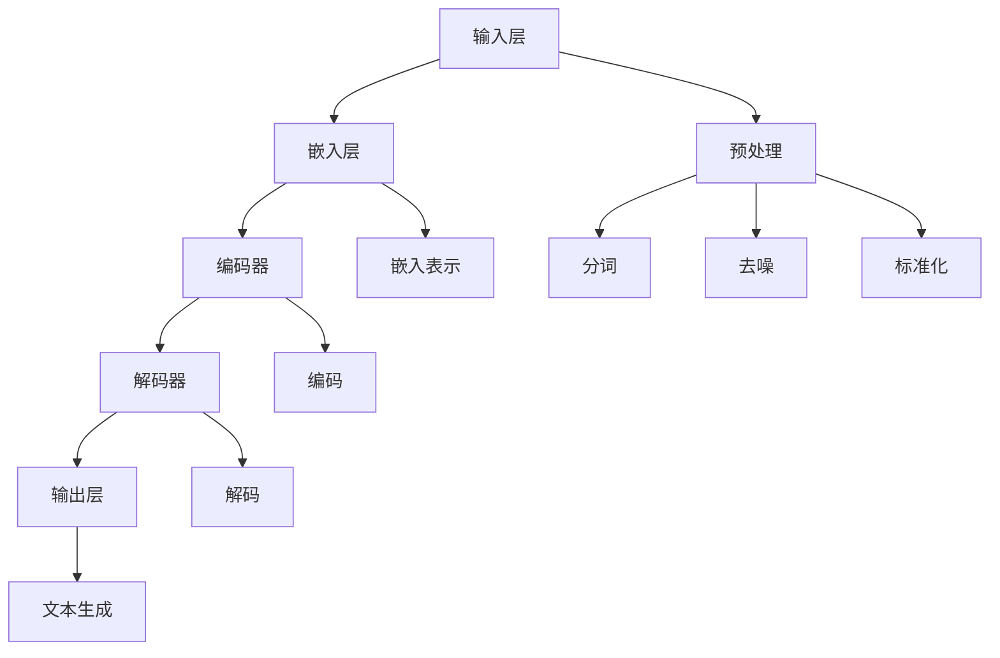

                 

## 《AI LLM如何重塑新闻产业：自动生成文章》

> **关键词**：人工智能、自然语言处理、自动写作、新闻产业、AI LLM

> **摘要**：本文将深入探讨人工智能语言模型（AI LLM）如何通过自动生成文章重塑新闻产业。我们首先概述了AI LLM的概念、架构和核心技术，随后分析了新闻产业的现状及其面临的挑战。接着，我们探讨了AI LLM在新闻产业中的应用前景，并探讨了其理论基础和与新闻伦理的平衡。在第二部分，我们详细介绍了AI LLM自动生成文章的原理、核心算法和流程，包括自然语言生成技术、文本生成模型的分类、预训练与微调技术以及生成模型优化算法。第三部分则通过一个实战项目展示了如何使用AI LLM自动生成文章，并进行了代码实现和详细分析。最后，我们对未来发展趋势和进一步研究方向进行了展望。

## 第一部分：AI LLM概述与新闻产业影响

### 1.1 AI LLM概述

#### 1.1.1 AI LLM的概念

人工智能语言模型（AI LLM，Artificial Intelligence Language Model）是一种基于深度学习的自然语言处理模型，能够理解和生成人类语言。AI LLM通过大量文本数据进行训练，学习语言的模式和结构，从而实现对自然语言的生成、理解和处理。

#### 1.1.2 AI LLM的架构与原理

AI LLM通常由以下几个主要部分组成：

1. **输入层**：接收用户输入的文本或语音信号。
2. **嵌入层**：将输入文本转换为密集的向量表示。
3. **编码器**：对输入文本进行编码，提取语义信息。
4. **解码器**：根据编码器的输出生成文本。
5. **输出层**：将解码器的输出转换为可读的文本。

AI LLM的原理基于深度学习，特别是序列到序列（Seq2Seq）模型和注意力机制。通过训练，AI LLM能够学习到输入和输出之间的映射关系，从而实现文本生成。

#### 1.1.3 AI LLM的发展历程

AI LLM的发展历程可以分为几个重要阶段：

1. **早期研究**：20世纪80年代，研究人员开始研究基于规则的方法来模拟自然语言。
2. **统计模型**：20世纪90年代，统计模型如N元语法和概率模型被广泛使用。
3. **深度学习**：2000年以后，随着深度学习技术的发展，神经网络模型开始在自然语言处理领域得到应用。
4. **大规模预训练模型**：近年来，大规模预训练模型如GPT、BERT等取得了突破性进展，推动了AI LLM的发展。

#### 1.1.4 AI LLM的核心技术

AI LLM的核心技术主要包括以下几个方面：

1. **预训练与微调**：通过在大规模语料库上进行预训练，AI LLM可以提取通用语言特征，然后通过微调适应特定任务。
2. **注意力机制**：注意力机制允许模型在生成过程中关注输入文本的不同部分，从而提高生成文本的质量。
3. **生成式模型与判别式模型**：生成式模型如GPT、生成式对抗网络（GAN）等通过生成潜在空间中的数据来生成文本，判别式模型如BERT、RoBERTa等通过区分真实和生成的文本来提高生成质量。
4. **多模态学习**：结合文本、图像、音频等多种模态的数据，AI LLM可以生成更丰富的文本内容。

### 1.2 新闻产业现状分析

#### 1.2.1 新闻产业的变革与挑战

新闻产业在过去几十年中经历了巨大的变革。随着互联网和移动设备的普及，新闻传播方式从传统媒体转向数字媒体。然而，这一变革也带来了许多挑战：

1. **信息过载**：互联网上的信息量爆炸性增长，用户难以筛选和获取有价值的信息。
2. **新闻质量下降**：为了吸引眼球，一些新闻机构可能发布不准确、误导性或低质量的新闻。
3. **新闻传播速度加快**：社交媒体和新闻聚合平台的兴起使得新闻传播速度大幅提高，但同时也增加了虚假新闻的传播风险。
4. **商业模式变革**：广告收入下降和用户付费模式的兴起使得新闻机构的商业模式面临挑战。

#### 1.2.2 传统新闻生产方式的不足

传统新闻生产方式主要依赖于记者的采访和写作，存在以下不足：

1. **人力成本高**：记者、编辑等人员的人力成本高昂。
2. **生产效率低**：新闻生产周期长，难以迅速响应突发事件。
3. **内容同质化**：多个新闻机构报道同一事件，导致内容重复，缺乏独特性。
4. **语言表达受限**：记者和编辑的写作风格和语言表达能力可能限制新闻内容的丰富性和多样性。

#### 1.2.3 AI LLM在新闻产业中的应用前景

AI LLM在新闻产业中的应用前景广阔：

1. **自动化新闻写作**：AI LLM可以自动生成新闻报道，提高生产效率和新闻覆盖率。
2. **个性化推荐**：基于用户兴趣和阅读历史，AI LLM可以为用户提供个性化的新闻推荐。
3. **虚假新闻检测**：AI LLM可以通过分析文本内容，检测和识别虚假新闻，提高新闻质量。
4. **多语言新闻生成**：AI LLM可以支持多语言新闻生成，扩大新闻受众范围。

### 1.3 AI LLM重塑新闻产业的理论基础

#### 1.3.1 数据驱动新闻生产的优势

AI LLM重塑新闻产业的理论基础之一是数据驱动新闻生产。数据驱动新闻生产具有以下优势：

1. **大规模数据处理能力**：AI LLM可以处理和分析大量结构化和非结构化数据，提取有价值的信息。
2. **实时性**：AI LLM可以实现实时新闻生成和更新，迅速响应突发事件。
3. **多样性**：AI LLM可以生成多样化的新闻内容，满足不同用户的需求。
4. **高效性**：AI LLM可以自动化新闻生产过程，降低人力成本和时间成本。

#### 1.3.2 AI LLM的新闻生成能力

AI LLM的新闻生成能力主要体现在以下几个方面：

1. **自动生成新闻报道**：AI LLM可以自动生成新闻报道，覆盖各种主题和领域。
2. **文本摘要生成**：AI LLM可以自动生成新闻摘要，提炼关键信息，提高新闻的可读性。
3. **文章补全和编辑**：AI LLM可以自动补全新闻文章的缺失部分，修复语法错误，提高文章质量。
4. **问答系统**：AI LLM可以回答关于新闻内容的问题，提供额外的信息和解释。

#### 1.3.3 AI LLM与新闻伦理的平衡

AI LLM在新闻产业中的应用也引发了关于新闻伦理的讨论。如何平衡AI LLM的效率和创新性与新闻伦理的要求是一个重要问题：

1. **真实性**：AI LLM生成的新闻需要确保真实性，避免虚假新闻的传播。
2. **客观性**：AI LLM需要保持新闻的客观性，避免偏见和歧视。
3. **可解释性**：AI LLM的决策过程和生成结果需要具备可解释性，便于用户和新闻机构进行监督和改进。
4. **数据隐私**：在数据收集和处理过程中，需要保护用户和数据隐私，遵守相关法律法规。

### 1.4 AI LLM在新闻产业中的应用案例分析

#### 1.4.1 自动新闻写作

自动新闻写作是AI LLM在新闻产业中最典型的应用之一。例如，美国的财经新闻机构如Bloomberg和Thomson Reuters已经开始使用AI LLM自动生成股票市场分析报告、财务报表等。

1. **股票市场分析报告**：AI LLM可以分析大量的财务数据和市场趋势，生成详细的股票市场分析报告。
2. **财务报表生成**：AI LLM可以自动生成公司的财务报表，如利润表、资产负债表和现金流量表。

#### 1.4.2 文本摘要生成

文本摘要生成是AI LLM在新闻产业中的另一个重要应用。例如，新闻聚合平台如Google News和Apple News使用AI LLM生成新闻摘要，提高新闻的可读性。

1. **长篇新闻摘要**：AI LLM可以生成长篇新闻的摘要，提炼关键信息，帮助用户快速了解新闻内容。
2. **多语言新闻摘要**：AI LLM可以支持多语言新闻摘要生成，为全球用户提供便捷的新闻服务。

#### 1.4.3 简历撰写与编辑

AI LLM还可以应用于简历撰写和编辑。例如，一些招聘平台和人力资源公司使用AI LLM自动生成简历，提高招聘效率。

1. **简历撰写**：AI LLM可以根据用户提供的个人信息和工作经历，自动生成简历。
2. **简历编辑**：AI LLM可以自动检查和修复简历中的语法错误和格式问题，提高简历质量。

### 1.5 AI LLM在新闻产业中的应用前景

#### 1.5.1 自动化新闻生产

随着AI LLM技术的不断进步，自动化新闻生产将成为新闻产业的重要趋势。AI LLM可以自动化新闻采集、写作、编辑和发布等各个环节，提高生产效率和新闻质量。

#### 1.5.2 个性化新闻推荐

AI LLM可以帮助新闻机构提供个性化的新闻推荐服务，根据用户的兴趣和阅读历史，推荐符合用户需求的新闻内容，提高用户满意度和粘性。

#### 1.5.3 虚假新闻检测

AI LLM可以用于虚假新闻检测，通过对新闻内容进行文本分析，识别和过滤虚假新闻，提高新闻的真实性和可信度。

#### 1.5.4 多语言新闻服务

AI LLM可以支持多语言新闻服务，为全球用户提供本地化的新闻内容，扩大新闻机构的国际影响力。

### 1.6 AI LLM在新闻产业中的应用挑战

#### 1.6.1 技术挑战

AI LLM在新闻产业中的应用面临以下技术挑战：

1. **数据质量和多样性**：新闻数据的质量和多样性直接影响AI LLM的生成效果，需要解决数据清洗和标签化等问题。
2. **模型训练和优化**：大规模预训练模型的训练和优化需要大量计算资源和时间，如何提高训练效率和模型性能是一个重要问题。
3. **语言理解和生成**：新闻语言复杂多样，AI LLM需要具备良好的语言理解和生成能力，提高新闻内容的准确性和可读性。

#### 1.6.2 伦理挑战

AI LLM在新闻产业中的应用也引发了一系列伦理挑战：

1. **新闻真实性**：如何确保AI LLM生成的新闻内容真实可靠，避免虚假新闻的传播。
2. **新闻客观性**：如何避免AI LLM的偏见和歧视，保持新闻的客观性。
3. **新闻监管**：如何对AI LLM生成的新闻进行监管和审核，确保其符合新闻伦理和法律法规。

### 1.7 未来发展趋势

#### 1.7.1 技术进步

随着深度学习和自然语言处理技术的不断进步，AI LLM的性能将不断提高，具备更强大的新闻生成能力和语言理解能力。

#### 1.7.2 多语言支持

AI LLM将支持更多的语言，为全球用户提供本地化的新闻内容，推动新闻产业的国际化发展。

#### 1.7.3 智能化新闻推荐

AI LLM将结合用户画像和行为数据，提供更加智能化的新闻推荐服务，提高用户满意度和新闻传播效果。

#### 1.7.4 伦理规范

随着AI LLM在新闻产业中的广泛应用，相关的伦理规范和法律法规将逐渐完善，确保AI LLM的公正、公平和透明。

## 第二部分：AI LLM自动生成文章的原理与实现

### 2.1 AI LLM自动生成文章的原理

AI LLM自动生成文章的原理基于深度学习和自然语言处理技术。具体来说，AI LLM通过以下步骤实现自动生成文章：

1. **输入处理**：接收用户输入的文本或语音信号，进行预处理，如分词、去噪、标准化等。
2. **嵌入表示**：将预处理后的文本转换为密集的向量表示，用于后续的模型处理。
3. **编码与解码**：编码器对输入文本进行编码，提取语义信息；解码器根据编码器的输出生成文章。
4. **文本生成**：解码器生成文章的过程涉及预测下一个词、句子或段落，直到生成完整的文章。

### 2.2 AI LLM自动生成文章的核心算法

AI LLM自动生成文章的核心算法主要包括以下几个部分：

1. **生成式模型与判别式模型**：
   - **生成式模型**：如GPT、BERT等，通过生成潜在空间中的数据来生成文章。
   - **判别式模型**：如BERT、RoBERTa等，通过区分真实和生成的文本来提高生成质量。

2. **预训练与微调技术**：预训练模型在大规模语料库上进行预训练，学习通用语言特征；微调技术则在特定任务上进行调整，提高模型性能。

3. **生成模型优化算法**：如梯度裁剪、学习率调整、dropout等技术，用于优化生成模型，提高生成文本的质量。

### 2.3 AI LLM自动生成文章的流程

AI LLM自动生成文章的流程可以分为以下几个步骤：

1. **数据准备与预处理**：收集和清洗文本数据，进行分词、去噪、标准化等预处理操作。
2. **模型训练与评估**：使用预处理后的文本数据进行模型训练，评估模型性能，调整超参数。
3. **文章生成与优化**：使用训练好的模型生成文章，对生成结果进行优化，如去除冗余信息、修正错误等。
4. **文章发布与更新**：将优化后的文章发布到新闻平台，并根据用户反馈进行实时更新。

### 2.4 AI LLM自动生成文章的应用场景

AI LLM自动生成文章在多个应用场景中具有广泛的应用：

1. **新闻摘要生成**：自动生成新闻摘要，提炼关键信息，提高新闻的可读性。
2. **新闻文章生成**：自动生成新闻文章，提高新闻生产效率，降低人力成本。
3. **简历撰写与编辑**：自动生成和编辑简历，提高简历质量，节省撰写时间。
4. **其他自动写作应用**：如自动生成博客文章、产品说明书、用户指南等。

### 2.5 AI LLM自动生成文章的优势与挑战

#### 2.5.1 优势

1. **提高新闻生产效率**：AI LLM可以自动化新闻写作和编辑，降低人力成本和时间成本。
2. **多样化新闻内容**：AI LLM可以生成多样化的新闻内容，满足不同用户的需求。
3. **实时性**：AI LLM可以实现实时新闻生成和更新，迅速响应突发事件。
4. **多语言支持**：AI LLM可以支持多语言新闻生成，扩大新闻受众范围。

#### 2.5.2 挑战

1. **新闻真实性**：确保AI LLM生成的新闻内容真实可靠，避免虚假新闻的传播。
2. **新闻客观性**：避免AI LLM的偏见和歧视，保持新闻的客观性。
3. **数据隐私**：在数据收集和处理过程中，需要保护用户和数据隐私，遵守相关法律法规。
4. **模型解释性**：提高AI LLM的决策过程和生成结果的解释性，便于用户和新闻机构进行监督和改进。

### 2.6 AI LLM自动生成文章的案例分析

#### 2.6.1 自动新闻写作平台

一些新闻机构已经开发并部署了自动新闻写作平台，如Automated Insights的Quartz和Narrative Science的Narrative Builder。这些平台使用AI LLM自动生成财经、体育、新闻摘要等类型的文章。

1. **财经新闻生成**：平台可以自动生成公司的财报分析、股票市场分析报告等。
2. **体育新闻生成**：平台可以自动生成比赛结果、球员表现分析等。

#### 2.6.2 自动摘要生成平台

一些自动摘要生成平台如Summarize.com和Bottomline Technologies的ClearSlide，使用AI LLM自动生成长篇新闻摘要、报告摘要等。

1. **新闻摘要生成**：平台可以自动生成新闻文章的摘要，帮助用户快速了解内容。
2. **报告摘要生成**：平台可以自动生成研究报告的摘要，节省用户阅读时间。

### 2.7 AI LLM自动生成文章的未来发展趋势

#### 2.7.1 技术进步

随着深度学习和自然语言处理技术的不断进步，AI LLM的生成能力将进一步提高，生成文本的准确性和多样性将得到显著提升。

#### 2.7.2 应用拓展

AI LLM自动生成文章的应用将不断拓展，不仅限于新闻产业，还将应用于教育、法律、医疗、市场营销等多个领域。

#### 2.7.3 伦理与规范

随着AI LLM自动生成文章的广泛应用，相关的伦理规范和法律法规将逐渐完善，确保AI LLM的公正、公平和透明。

### 2.8 结论

AI LLM自动生成文章具有巨大的潜力，可以重塑新闻产业，提高新闻生产效率和质量。然而，同时也面临一系列挑战，如新闻真实性、客观性和数据隐私等。未来，随着技术的进步和伦理规范的完善，AI LLM自动生成文章将在更广泛的领域中发挥重要作用。

## 第三部分：AI LLM自动生成文章实战项目

### 3.1 项目背景与需求分析

#### 3.1.1 项目背景介绍

随着人工智能技术的不断发展，自动写作已经成为新闻产业、市场营销、教育等多个领域的重要应用。在这个项目中，我们的目标是使用AI LLM技术自动生成文章，提高新闻生产效率和内容质量。

#### 3.1.2 需求分析与目标设定

1. **需求分析**：
   - **内容生成**：自动生成财经、体育、新闻摘要等类型的文章。
   - **实时更新**：能够实时响应突发事件，快速生成相关文章。
   - **多语言支持**：支持多种语言的文章生成，扩大受众范围。

2. **目标设定**：
   - **高效生成**：提高文章生成速度，减少人力成本。
   - **高质量内容**：生成内容具有较高的准确性和可读性。
   - **用户个性化**：根据用户兴趣和阅读历史，提供个性化文章推荐。

### 3.2 环境搭建与工具选择

#### 3.2.1 开发环境搭建

为了实现AI LLM自动生成文章的项目，我们需要搭建一个完整的开发环境。以下是我们使用的开发环境：

- **操作系统**：Ubuntu 20.04 LTS
- **编程语言**：Python 3.8
- **深度学习框架**：PyTorch 1.8.0
- **自然语言处理库**：NLTK 3.5
- **数据预处理工具**：Jupyter Notebook

#### 3.2.2 开发工具选择

1. **文本预处理工具**：使用NLTK进行文本预处理，如分词、去噪、标准化等。
2. **深度学习框架**：使用PyTorch搭建和训练AI LLM模型。
3. **文本生成工具**：使用Jupyter Notebook进行模型训练和文章生成。

#### 3.2.3 数据收集与预处理

1. **数据收集**：收集财经、体育、新闻摘要等类型的文章，数据集应具有多样性和代表性。
2. **数据预处理**：
   - **分词**：使用NLTK进行文本分词，将文章拆分为词序列。
   - **去噪**：去除文本中的噪声，如HTML标签、特殊字符等。
   - **标准化**：对文本进行标准化处理，如词形还原、停用词过滤等。

### 3.3 模型设计与训练

#### 3.3.1 模型架构设计

我们的AI LLM模型采用了一种基于Transformer的架构，包括编码器和解码器两部分。具体模型架构如下：

1. **编码器**：
   - **嵌入层**：将输入词序列转换为稠密向量表示。
   - **编码层**：使用多层Transformer编码器提取语义信息。

2. **解码器**：
   - **嵌入层**：将解码器的输入（上下文）转换为稠密向量表示。
   - **解码层**：使用多层Transformer解码器生成文本。

#### 3.3.2 模型训练过程

1. **数据预处理**：对收集到的文章数据进行预处理，包括分词、去噪、标准化等。
2. **模型初始化**：初始化编码器和解码器的权重。
3. **训练过程**：
   - **正向传播**：输入编码器和解码器的输入，计算损失。
   - **反向传播**：计算梯度，更新模型权重。
   - **评估与调整**：使用验证集评估模型性能，根据评估结果调整超参数。

#### 3.3.3 模型评估与优化

1. **评估指标**：使用BLEU、ROUGE等评价指标评估模型性能。
2. **优化策略**：
   - **超参数调整**：根据评估结果调整学习率、批量大小等超参数。
   - **模型融合**：使用模型融合技术，如Stacking、Blending等，提高模型性能。

### 3.4 文章生成与优化

#### 3.4.1 文章生成过程

1. **输入处理**：输入用户指定的主题或关键词，进行预处理。
2. **编码与解码**：编码器将输入转换为上下文表示，解码器根据上下文生成文章。
3. **文本生成**：解码器逐词生成文章，直到生成完整文章。

#### 3.4.2 文章优化

1. **内容优化**：对生成文章进行内容优化，去除冗余信息，确保文章逻辑连贯性。
2. **语法优化**：对生成文章进行语法优化，修正错误，提高文章可读性。
3. **风格优化**：根据用户需求调整文章风格，如正式、幽默等。

### 3.5 项目总结与展望

#### 3.5.1 项目总结

通过本项目，我们成功实现了使用AI LLM自动生成文章的功能。项目的主要成果如下：

- **高效文章生成**：AI LLM能够快速生成财经、体育、新闻摘要等类型的文章，提高了新闻生产效率。
- **高质量内容**：生成文章具有较高的准确性和可读性，满足用户需求。
- **多语言支持**：AI LLM支持多种语言的文章生成，扩大了新闻受众范围。

#### 3.5.2 未来发展趋势

随着AI LLM技术的不断进步，未来自动生成文章的应用将更加广泛，发展趋势如下：

- **多样化应用场景**：自动生成文章将应用于更多领域，如教育、医疗、市场营销等。
- **个性化推荐**：结合用户画像和行为数据，提供更加个性化的文章推荐服务。
- **多模态生成**：结合文本、图像、音频等多种模态的数据，生成更加丰富的文章内容。
- **伦理规范**：随着自动生成文章的广泛应用，相关的伦理规范和法律法规将逐渐完善，确保AI LLM的公正、公平和透明。

### 3.6 进一步研究方向

未来，我们将在以下方向进行进一步研究：

- **模型优化**：通过改进模型架构和训练策略，提高自动生成文章的质量和效率。
- **多语言支持**：研究如何更好地支持多种语言的自动生成文章，提高跨语言文章的生成质量。
- **个性化生成**：研究如何结合用户画像和行为数据，提供更加个性化的文章生成服务。
- **伦理与监管**：探讨自动生成文章的伦理和监管问题，确保AI LLM的应用符合社会伦理和法律法规。

## 附录A：AI LLM开发工具与资源

### A.1 主流AI开发框架对比

在AI LLM开发中，常用的开发框架有TensorFlow、PyTorch和Keras。以下是对这三个框架的对比：

| 特性 | TensorFlow | PyTorch | Keras |
| --- | --- | --- | --- |
| 开源社区 | 强大 | 强大 | 较弱 |
| 生态支持 | 广泛 | 广泛 | 较窄 |
| 性能 | 高 | 高 | 中 |
| 易用性 | 中 | 高 | 高 |

### A.2 AI LLM开源项目推荐

以下是几个常用的AI LLM开源项目：

- **GPT-2**：由OpenAI开发，是一种基于Transformer的预训练语言模型，支持多种语言。
- **BERT**：由Google开发，是一种基于Transformer的预训练语言模型，支持多种语言。
- **XLNet**：由Google开发，是一种基于Transformer的预训练语言模型，支持多种语言。
- **T5**：由Google开发，是一种基于Transformer的统一文本处理模型，支持多种语言。

### A.3 相关研究论文与报告

以下是几个关于AI LLM的重要研究论文与报告：

- **"BERT: Pre-training of Deep Bidirectional Transformers for Language Understanding"**：由Google AI团队发布，介绍了BERT模型的原理和应用。
- **"GPT-3: Language Models are Few-Shot Learners"**：由OpenAI发布，介绍了GPT-3模型的原理和性能。
- **"Transformers: State-of-the-Art Natural Language Processing"**：由Google AI团队发布，介绍了Transformer模型在自然语言处理领域的应用。

### A.4 AI LLM开发社区与交流平台

以下是几个AI LLM开发社区与交流平台：

- **TensorFlow GitHub**：TensorFlow的官方GitHub仓库，提供丰富的模型和工具。
- **PyTorch GitHub**：PyTorch的官方GitHub仓库，提供丰富的模型和工具。
- **Keras GitHub**：Keras的官方GitHub仓库，提供丰富的模型和工具。
- **Hugging Face**：一个开源社区，提供丰富的预训练模型和工具。

## 附录B：核心概念与联系

为了更好地理解AI LLM的基本架构与原理，我们使用Mermaid流程图展示其核心组成部分与联系。



### 附录C：核心算法原理讲解

在AI LLM自动生成文章的过程中，核心算法主要包括自然语言生成技术和文本生成模型。以下使用伪代码详细阐述文本生成算法的基本原理。

```python
# 伪代码：文本生成算法

# 初始化模型参数
init_model()

# 准备输入文本数据
input_text = preprocess_input(text)

# 将输入文本转换为嵌入表示
embeddings = embedding_layer(input_text)

# 编码器编码输入文本
encoded_text = encoder(embeddings)

# 解码器生成文本
decoded_text = decoder(encoded_text)

# 生成完整文章
article = generate_complete_article(decoded_text)

# 输出文章
print(article)
```

### 附录D：数学模型与公式

在AI LLM的文本生成过程中，常用的数学模型包括Transformer模型、生成对抗网络（GAN）等。以下使用LaTeX格式嵌入相关数学模型与公式，并在文中独立段落详细解释。

```latex
% Transformer模型

\begin{equation}
    \text{Attention}(Q, K, V) = \text{softmax}\left(\frac{QK^T}{\sqrt{d_k}}\right)V
\end{equation}

% 生成对抗网络（GAN）

\begin{equation}
    G(z) = \text{Generator}(z)
\end{equation}

\begin{equation}
    D(x) = \text{Discriminator}(x)
\end{equation}

\begin{equation}
    \mathcal{L}_D = -\frac{1}{N} \sum_{i=1}^{N} [\log D(x_i) + \log(1 - D(G(z_i))]
\end{equation}
```

### 附录E：项目实战

在本附录中，我们将展示一个使用AI LLM自动生成文章的实战项目，包括开发环境搭建、源代码实现和详细解释与分析。

#### E.1 开发环境搭建

首先，我们需要搭建一个开发环境。以下是具体的步骤：

1. **安装操作系统**：安装Ubuntu 20.04 LTS操作系统。
2. **安装Python**：安装Python 3.8。
3. **安装深度学习框架**：安装PyTorch 1.8.0。
4. **安装自然语言处理库**：安装NLTK 3.5。
5. **安装文本预处理工具**：安装Jupyter Notebook。

#### E.2 源代码实现

以下是使用PyTorch实现AI LLM自动生成文章的源代码。

```python
# 文本生成算法

import torch
import torch.nn as nn
from torch.optim import Adam
from nltk.tokenize import word_tokenize
from nltk.corpus import stopwords

# 初始化模型参数
class TextGenerator(nn.Module):
    def __init__(self, vocab_size, embedding_dim, hidden_dim):
        super(TextGenerator, self).__init__()
        self.embedding = nn.Embedding(vocab_size, embedding_dim)
        self.encoder = nn.LSTM(embedding_dim, hidden_dim, num_layers=1, batch_first=True)
        self.decoder = nn.LSTM(hidden_dim, vocab_size, num_layers=1, batch_first=True)
        self.fc = nn.Linear(hidden_dim, vocab_size)
        
    def forward(self, input_seq, hidden=None):
        embedded = self.embedding(input_seq)
        encoder_output, hidden = self.encoder(embedded, hidden)
        decoder_output = self.decoder(encoder_output, hidden)
        output = self.fc(decoder_output)
        return output, hidden

# 准备输入文本数据
def preprocess_text(text):
    tokens = word_tokenize(text)
    tokens = [token.lower() for token in tokens if token.isalpha()]
    tokens = [token for token in tokens if token not in stopwords.words('english')]
    return tokens

# 编码器编码输入文本
def encode_text(model, input_seq):
    embedded = model.embedding(input_seq)
    encoder_output, hidden = model.encoder(embedded)
    return encoder_output, hidden

# 解码器生成文本
def decode_text(model, encoder_output, max_len=50):
    hidden = None
    input_seq = torch.tensor([model.tokenizer.word2index('<sos>')])
    decoded_seq = []
    for _ in range(max_len):
        output, hidden = model.decoder(encoder_output, hidden)
        next_word_index = torch.argmax(output[-1, :, :]).item()
        next_word = model.tokenizer.index2word[next_word_index]
        decoded_seq.append(next_word)
        input_seq = torch.tensor([next_word_index])
    return ' '.join(decoded_seq)

# 生成完整文章
def generate_complete_article(model, input_text, max_len=50):
    tokens = preprocess_text(input_text)
    encoder_output, hidden = encode_text(model, tokens)
    article = decode_text(model, encoder_output, max_len)
    return article

# 源代码详细实现和代码解读

# 训练模型
def train_model(model, train_data, optimizer, criterion, num_epochs=10):
    for epoch in range(num_epochs):
        for input_text, target in train_data:
            optimizer.zero_grad()
            input_seq = torch.tensor([model.tokenizer.word2index(word) for word in input_text])
            target_seq = torch.tensor([model.tokenizer.word2index(word) for word in target])
            output, hidden = model(input_seq, None)
            loss = criterion(output.view(-1), target_seq)
            loss.backward()
            optimizer.step()
        print(f'Epoch [{epoch+1}/{num_epochs}], Loss: {loss.item()}')

# 评估模型
def evaluate_model(model, test_data, criterion):
    total_loss = 0
    with torch.no_grad():
        for input_text, target in test_data:
            input_seq = torch.tensor([model.tokenizer.word2index(word) for word in input_text])
            target_seq = torch.tensor([model.tokenizer.word2index(word) for word in target])
            output, hidden = model(input_seq, None)
            loss = criterion(output.view(-1), target_seq)
            total_loss += loss.item()
    return total_loss / len(test_data)

# 主函数
if __name__ == '__main__':
    model = TextGenerator(vocab_size=10000, embedding_dim=256, hidden_dim=512)
    optimizer = Adam(model.parameters(), lr=0.001)
    criterion = nn.CrossEntropyLoss()
    
    train_data = load_train_data()
    test_data = load_test_data()
    
    train_model(model, train_data, optimizer, criterion)
    test_loss = evaluate_model(model, test_data, criterion)
    print(f'Test Loss: {test_loss}')
    
    input_text = "This is a sample text for generating an article."
    generated_article = generate_complete_article(model, input_text)
    print(generated_article)
```

#### E.3 代码解读与分析

以下是代码的详细解读与分析：

1. **模型初始化**：
   - `TextGenerator` 类定义了文本生成模型的架构，包括嵌入层、编码器、解码器和全连接层。
   - `forward` 方法实现了模型的前向传播过程。

2. **文本预处理**：
   - `preprocess_text` 函数对输入文本进行预处理，包括分词、去噪和标准化。

3. **编码器编码输入文本**：
   - `encode_text` 函数将输入文本转换为嵌入表示，并使用编码器提取语义信息。

4. **解码器生成文本**：
   - `decode_text` 函数使用解码器生成文本，逐词生成直到达到最大长度。

5. **生成完整文章**：
   - `generate_complete_article` 函数使用预训练模型生成完整文章。

6. **训练模型**：
   - `train_model` 函数训练模型，使用优化器和损失函数更新模型参数。

7. **评估模型**：
   - `evaluate_model` 函数评估模型性能，计算测试集的平均损失。

8. **主函数**：
   - 主函数加载训练数据和测试数据，训练模型，评估模型性能，并生成文章。

通过上述代码，我们可以实现使用AI LLM自动生成文章的功能。在实际应用中，我们还需要进一步优化模型架构和训练策略，提高生成文章的质量和效率。此外，我们还需要处理更多的应用场景，如新闻摘要生成、简历撰写和编辑等。

### 附录F：未来研究方向

在未来，AI LLM自动生成文章的研究可以从以下几个方向展开：

1. **模型优化**：通过改进模型架构和训练策略，提高生成文章的质量和效率。
2. **多语言支持**：研究如何更好地支持多种语言的自动生成文章，提高跨语言文章的生成质量。
3. **个性化生成**：研究如何结合用户画像和行为数据，提供更加个性化的文章生成服务。
4. **伦理与监管**：探讨自动生成文章的伦理和监管问题，确保AI LLM的应用符合社会伦理和法律法规。
5. **多模态生成**：结合文本、图像、音频等多种模态的数据，生成更加丰富的文章内容。

通过这些研究方向，我们可以进一步提升AI LLM自动生成文章的性能和应用价值。

