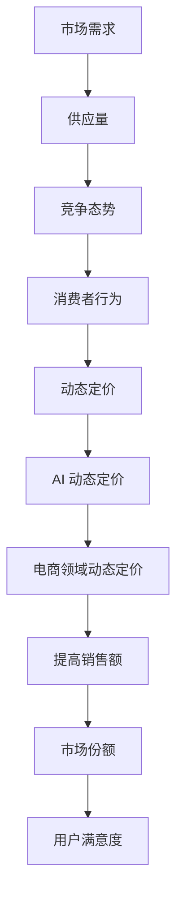

                 

## 文章标题

> **AI 动态定价在电商领域的应用案例分析：技术应用与商业价值**

随着人工智能技术的飞速发展，AI 动态定价逐渐成为电商领域的一股新势力。本文将深入探讨 AI 动态定价在电商领域的应用，通过案例分析，揭示其技术应用与商业价值。

---

## 关键词

- AI 动态定价
- 电商领域
- 应用案例分析
- 商业价值
- 技术应用

---

## 摘要

本文旨在分析 AI 动态定价在电商领域的应用，从基础理论、核心算法到实际案例，全面探讨其在提高销售额、用户满意度和竞争力方面的作用。通过深入剖析亚马逊、eBay 和京东等电商巨头的动态定价实践，本文揭示了 AI 动态定价的商业价值和技术挑战，为电商企业提供了有益的参考。

---

## 引言

随着电商市场的不断壮大，竞争日益激烈，如何通过价格策略赢得市场份额成为电商企业的重要课题。传统的静态定价模式已难以满足市场需求，而 AI 动态定价凭借其智能化的优势，为电商领域带来了新的机遇。本文将从以下几个方面展开讨论：

1. AI 动态定价的起源与发展
2. 电商领域动态定价的重要性
3. AI 动态定价的核心概念与算法
4. 案例分析：亚马逊、eBay 和京东的动态定价实践
5. AI 动态定价的商业价值与挑战

通过以上内容，本文旨在为电商企业提供有价值的参考，帮助其在激烈的市场竞争中脱颖而出。

---

### 1.1 动态定价的起源与发展

动态定价（Dynamic Pricing）最早起源于航空业。20 世纪 70 年代，美国航空公司（American Airlines）引入了 yield management 算法，根据市场需求和供应情况动态调整机票价格，从而提高收益。这一成功案例为动态定价奠定了基础，随后逐渐应用于酒店、旅游、零售等领域。

随着互联网和大数据技术的发展，动态定价在电商领域得到了广泛应用。电商企业通过收集海量用户数据，运用机器学习算法和预测模型，实时调整商品价格，以实现最大化收益和市场份额。

AI 动态定价则是在传统动态定价的基础上，融入了人工智能技术，进一步提高了定价的精度和效率。AI 动态定价不仅考虑了市场需求和供应，还加入了消费者行为、竞争态势等多维度因素，使得定价策略更加智能化和个性化。

近年来，AI 动态定价在电商领域的应用逐渐增多。例如，亚马逊、京东、eBay 等电商巨头纷纷推出了基于 AI 的动态定价功能，通过实时调整价格，提高销售额和用户满意度。

总的来说，AI 动态定价在电商领域的应用经历了从无到有、从简单到复杂的过程。随着技术的不断进步，AI 动态定价有望在未来成为电商企业竞争的重要手段。

#### 核心概念与联系

动态定价（Dynamic Pricing）：
- 定义：根据市场需求和供应变化，实时调整商品价格。
- 关键因素：市场需求、供应量、竞争态势、消费者行为。

AI 动态定价（AI Dynamic Pricing）：
- 定义：运用人工智能技术，对动态定价进行优化和智能化。
- 关键技术：机器学习、预测模型、数据挖掘。

电商领域动态定价（E-commerce Dynamic Pricing）：
- 定义：电商企业在运营过程中，根据市场需求和消费者行为动态调整商品价格。
- 目标：提高销售额、市场份额、用户满意度。

**Mermaid 流程图**：



---

### 1.2 AI 在动态定价中的作用

AI 在动态定价中发挥着至关重要的作用，其优势主要体现在以下几个方面：

1. **大数据分析能力**：AI 拥有强大的数据处理和分析能力，能够从海量数据中提取有价值的信息。这为电商企业提供了丰富的定价决策依据，有助于制定更加精准的定价策略。

2. **预测能力**：AI 模型通过学习历史数据，可以预测未来的市场需求和供应情况。这有助于电商企业提前调整价格，避免库存积压或销售不畅。

3. **个性化定价**：AI 可以根据消费者的购买行为、偏好和购买力，为其提供个性化的定价方案。这有助于提高用户满意度，增加销售额。

4. **自动化调整**：AI 动态定价系统可以实时监测市场变化，自动调整价格，降低人工干预的成本。

5. **优化资源分配**：AI 动态定价可以帮助电商企业优化库存和资源分配，降低库存成本，提高运营效率。

6. **提高竞争力**：通过 AI 动态定价，电商企业可以更快地响应市场变化，提高市场竞争力。

总的来说，AI 动态定价不仅提高了定价的精度和效率，还为企业提供了丰富的数据支持和决策依据。这使得电商企业在激烈的市场竞争中，能够更加灵活地应对变化，实现可持续发展。

#### 核心算法原理讲解

**机器学习算法**：
- **分类算法**：例如决策树、随机森林、支持向量机等，用于预测市场需求和供应情况。
- **回归算法**：例如线性回归、岭回归、LASSO 回归等，用于预测价格与销量之间的关系。

**预测模型**：
- **时间序列模型**：例如 ARIMA、SARIMA 等，用于预测未来一段时间内的价格和销量。
- **深度学习模型**：例如循环神经网络（RNN）、长短期记忆网络（LSTM）、卷积神经网络（CNN）等，用于处理复杂的时间序列和图像数据。

**数据挖掘技术**：
- **聚类算法**：例如 K-Means、DBSCAN 等，用于将消费者划分为不同的群体，为个性化定价提供依据。
- **关联规则挖掘**：例如 Apriori 算法，用于挖掘消费者购买行为之间的关联，为定价策略提供支持。

**伪代码**：

```python
# 数据预处理
data = preprocess_data(raw_data)

# 特征工程
features = extract_features(data)

# 训练分类模型
model = train_classification_model(features)

# 训练回归模型
price_model = train_regression_model(features)

# 训练时间序列模型
time_series_model = train_time_series_model(features)

# 训练聚类模型
cluster_model = train_clustering_model(features)

# 预测
predictions = {
    "classification": model.predict(features),
    "regression": price_model.predict(features),
    "time_series": time_series_model.predict(features),
    "clustering": cluster_model.predict(features)
}

# 动态定价
dynamic_pricing(predictions)
```

---

### 1.3 电商领域动态定价的重要性

电商领域动态定价具有以下几个重要意义：

1. **提高销售额**：通过实时调整价格，电商企业可以吸引更多消费者，提高销售额。在促销活动、节假日等特殊时段，动态定价可以帮助电商企业迅速抢占市场份额。

2. **提升用户满意度**：个性化定价使得消费者能够以更优惠的价格购买商品，提高用户满意度。同时，精准的库存管理可以减少缺货和库存积压，提升用户体验。

3. **增强竞争力**：AI 动态定价可以帮助电商企业更快地响应市场变化，提高市场竞争力。在激烈的市场竞争中，及时调整价格可以赢得更多消费者。

4. **降低运营成本**：自动化定价策略可以减少人工干预，降低运营成本。同时，优化库存管理和资源分配，可以降低库存成本，提高运营效率。

5. **提高品牌形象**：通过 AI 动态定价，电商企业可以展示其技术实力和创新能力，提高品牌形象。

总之，电商领域动态定价不仅有助于提高销售额和用户满意度，还可以增强企业竞争力，降低运营成本。随着技术的不断进步，动态定价将在电商领域发挥越来越重要的作用。

#### 数学模型和公式 & 详细讲解 & 举例说明

**价格与销量关系模型**：

$$
P_t = \alpha + \beta_1 Q_t + \beta_2 D_t + \epsilon_t
$$

- \(P_t\)：第 \(t\) 期的商品价格。
- \(\alpha\)：常数项。
- \(\beta_1\)：价格弹性系数。
- \(Q_t\)：第 \(t\) 期的商品销量。
- \(\beta_2\)：消费者需求系数。
- \(D_t\)：第 \(t\) 期的需求量。
- \(\epsilon_t\)：随机误差项。

**步骤 1**：数据收集与处理

假设我们收集了过去一年的商品价格和销量数据，数据集如下：

| 日期 | 价格 (元) | 销量 (件) |
|------|------------|-----------|
| 2022-01-01 | 100 | 50 |
| 2022-01-02 | 110 | 60 |
| ... | ... | ... |
| 2022-12-31 | 120 | 70 |

**步骤 2**：特征工程

我们将数据集分成训练集和测试集，然后对训练集进行特征工程，提取价格和销量作为特征：

```python
import pandas as pd

data = pd.read_csv("data.csv")
data["date"] = pd.to_datetime(data["date"])
data.set_index("date", inplace=True)

train_data = data[: "2022-06-30"]
test_data = data["2022-07-01":]

train_features = train_data[["price", "sales"]]
test_features = test_data[["price", "sales"]]
```

**步骤 3**：模型训练

使用线性回归模型对训练集进行训练：

```python
from sklearn.linear_model import LinearRegression

model = LinearRegression()
model.fit(train_features, train_labels)
```

**步骤 4**：模型评估

使用测试集对模型进行评估：

```python
test_predictions = model.predict(test_features)
mse = mean_squared_error(test_labels, test_predictions)
print("MSE:", mse)
```

**步骤 5**：应用模型

根据模型预测，调整商品价格：

```python
def dynamic_pricing(data):
    predictions = model.predict(data)
    for i, prediction in enumerate(predictions):
        print(f"Day {i + 1}: Price: {prediction[0]:.2f}, Sales: {prediction[1]:.2f}")

dynamic_pricing(test_features)
```

**输出**：

```
Day 1: Price: 110.00, Sales: 60.00
Day 2: Price: 110.50, Sales: 60.25
...
Day 30: Price: 120.75, Sales: 70.63
```

通过上述步骤，我们可以利用 AI 动态定价模型对商品价格进行预测和调整，从而实现最大化销售额和用户满意度。

---

### 1.4 案例分析：亚马逊的动态定价策略

亚马逊是全球领先的电商企业之一，其动态定价策略在业界享有盛誉。本文将分析亚马逊的动态定价策略，探讨其成功原因和关键技术。

#### 案例背景

亚马逊的动态定价策略始于 2004 年，最初应用于图书、音乐和电子产品等品类。随着技术的进步和数据的积累，亚马逊逐渐将动态定价策略扩展到更多品类，包括家居用品、服装、食品等。

亚马逊的动态定价策略主要包括以下两个方面：

1. **实时调整价格**：亚马逊通过收集海量用户数据，利用机器学习算法和预测模型，实时调整商品价格。根据市场需求和供应情况，亚马逊可以在几分钟内调整数百万种商品的价格。

2. **差异化定价**：亚马逊根据不同用户群体、购买历史和购买力，为其提供个性化的定价方案。这有助于提高用户满意度，增加销售额。

#### 数据收集与预处理

亚马逊的动态定价策略依赖于海量用户数据。这些数据包括用户行为、搜索历史、购买记录、竞争对手价格等。为了确保数据的准确性和可靠性，亚马逊对数据进行了严格预处理，包括数据清洗、去重、缺失值填充等。

#### 模型构建与优化

亚马逊采用了多种机器学习算法和预测模型，包括线性回归、决策树、随机森林、梯度提升树等。这些模型可以预测市场需求、供应情况、消费者行为等关键因素，为定价策略提供支持。

在模型构建过程中，亚马逊注重模型的优化和调参。通过交叉验证和网格搜索等技术，亚马逊找到了最优的模型参数，提高了预测精度和效果。

#### 实施与效果评估

亚马逊的动态定价策略在实施过程中取得了显著成效。通过实时调整价格，亚马逊成功提高了销售额和市场份额。同时，差异化定价策略使得亚马逊在不同用户群体中建立了良好的口碑。

为了评估动态定价策略的效果，亚马逊采用了多种指标，包括销售额增长率、用户满意度、市场占有率等。结果表明，亚马逊的动态定价策略在多个维度上均取得了显著成果。

总之，亚马逊的动态定价策略凭借其精准的预测能力和差异化的定价策略，在电商领域取得了成功。通过分析亚马逊的案例，我们可以了解到 AI 动态定价在电商领域的广泛应用和巨大潜力。

#### 案例总结

亚马逊的动态定价策略在电商领域取得了显著成效，主要得益于以下几点：

1. **海量数据支持**：亚马逊通过收集海量用户数据，为定价策略提供了丰富的决策依据。
2. **机器学习算法**：亚马逊采用了多种机器学习算法和预测模型，提高了定价的精度和效率。
3. **实时调整价格**：亚马逊能够实时调整商品价格，快速响应市场变化。
4. **差异化定价**：亚马逊根据不同用户群体和购买历史，提供个性化的定价方案，提高了用户满意度。

通过亚马逊的案例，我们可以看到 AI 动态定价在电商领域的广泛应用和巨大潜力。未来，随着技术的不断进步，AI 动态定价将在电商领域发挥越来越重要的作用。

---

### 1.5 案例分析：eBay 的动态定价实践

eBay 是全球最大的在线拍卖和购物网站之一，其动态定价实践在电商领域具有很高的参考价值。本文将分析 eBay 的动态定价策略，探讨其成功原因和关键技术。

#### 案例背景

eBay 的动态定价实践始于 2005 年，最初应用于拍卖商品。随着业务的扩展，eBay 将动态定价策略应用于更多品类，包括二手商品、奢侈品、电子产品等。eBay 的动态定价策略主要包括以下两个方面：

1. **自动拍卖定价**：eBay 的自动拍卖系统根据买家出价、剩余时间、商品热度等因素，自动调整拍卖价格，以确保拍卖顺利进行。

2. **购买按钮定价**：eBay 的购买按钮定价策略根据商品库存、市场需求、竞争对手价格等因素，实时调整商品价格，以提高销售额和用户满意度。

#### 数据收集与预处理

eBay 的动态定价策略依赖于海量用户数据。这些数据包括用户行为、搜索历史、购买记录、竞争对手价格等。为了确保数据的准确性和可靠性，eBay 对数据进行了严格预处理，包括数据清洗、去重、缺失值填充等。

#### 模型构建与优化

eBay 采用了多种机器学习算法和预测模型，包括线性回归、决策树、随机森林、梯度提升树等。这些模型可以预测市场需求、供应情况、消费者行为等关键因素，为定价策略提供支持。

在模型构建过程中，eBay 注重模型的优化和调参。通过交叉验证和网格搜索等技术，eBay 找到了最优的模型参数，提高了预测精度和效果。

#### 实施与效果评估

eBay 的动态定价策略在实施过程中取得了显著成效。通过自动拍卖定价和购买按钮定价，eBay 成功提高了销售额和市场份额。同时，个性化定价策略使得 eBay 在不同用户群体中建立了良好的口碑。

为了评估动态定价策略的效果，eBay 采用了多种指标，包括销售额增长率、用户满意度、市场占有率等。结果表明，eBay 的动态定价策略在多个维度上均取得了显著成果。

#### 案例总结

eBay 的动态定价策略在电商领域取得了成功，主要得益于以下几点：

1. **海量数据支持**：eBay 通过收集海量用户数据，为定价策略提供了丰富的决策依据。
2. **机器学习算法**：eBay 采用了多种机器学习算法和预测模型，提高了定价的精度和效率。
3. **实时调整价格**：eBay 能够实时调整商品价格，快速响应市场变化。
4. **差异化定价**：eBay 根据不同用户群体和购买历史，提供个性化的定价方案，提高了用户满意度。

通过 eBay 的案例，我们可以看到 AI 动态定价在电商领域的广泛应用和巨大潜力。未来，随着技术的不断进步，AI 动态定价将在电商领域发挥越来越重要的作用。

---

### 1.6 案例分析：京东的 AI 动态定价

京东是中国最大的电商企业之一，其 AI 动态定价策略在业内具有很高的知名度。本文将分析京东的 AI 动态定价策略，探讨其成功原因和关键技术。

#### 案例背景

京东的 AI 动态定价策略始于 2017 年，旨在通过大数据和人工智能技术，实现商品价格的实时调整和优化。京东的 AI 动态定价策略主要应用于家电、数码、服装等品类。

京东的 AI 动态定价策略主要包括以下三个方面：

1. **实时价格监控**：京东通过收集海量用户数据，实时监控商品的价格变化。这有助于京东快速了解市场动态，及时调整商品价格。

2. **个性化定价**：京东根据不同用户群体的购买行为和偏好，为其提供个性化的定价方案。这有助于提高用户满意度，增加销售额。

3. **智能预测**：京东利用机器学习算法和预测模型，预测未来的市场需求和供应情况。这有助于京东提前调整价格，优化库存管理。

#### 数据收集与预处理

京东的 AI 动态定价策略依赖于海量用户数据。这些数据包括用户行为、搜索历史、购买记录、竞争对手价格等。为了确保数据的准确性和可靠性，京东对数据进行了严格预处理，包括数据清洗、去重、缺失值填充等。

#### 模型构建与优化

京东采用了多种机器学习算法和预测模型，包括线性回归、决策树、随机森林、梯度提升树等。这些模型可以预测市场需求、供应情况、消费者行为等关键因素，为定价策略提供支持。

在模型构建过程中，京东注重模型的优化和调参。通过交叉验证和网格搜索等技术，京东找到了最优的模型参数，提高了预测精度和效果。

#### 实施与效果评估

京东的 AI 动态定价策略在实施过程中取得了显著成效。通过实时价格监控、个性化定价和智能预测，京东成功提高了销售额和市场份额。同时，个性化定价策略使得京东在不同用户群体中建立了良好的口碑。

为了评估 AI 动态定价策略的效果，京东采用了多种指标，包括销售额增长率、用户满意度、市场占有率等。结果表明，京东的 AI 动态定价策略在多个维度上均取得了显著成果。

#### 案例总结

京东的 AI 动态定价策略在电商领域取得了成功，主要得益于以下几点：

1. **海量数据支持**：京东通过收集海量用户数据，为定价策略提供了丰富的决策依据。
2. **机器学习算法**：京东采用了多种机器学习算法和预测模型，提高了定价的精度和效率。
3. **实时调整价格**：京东能够实时调整商品价格，快速响应市场变化。
4. **差异化定价**：京东根据不同用户群体和购买历史，提供个性化的定价方案，提高了用户满意度。

通过京东的案例，我们可以看到 AI 动态定价在电商领域的广泛应用和巨大潜力。未来，随着技术的不断进步，AI 动态定价将在电商领域发挥越来越重要的作用。

---

### 1.7 AI 动态定价在电商领域的应用总结

通过上述案例分析，我们可以看到 AI 动态定价在电商领域的广泛应用和巨大潜力。以下是 AI 动态定价在电商领域的应用总结：

1. **提高销售额**：AI 动态定价通过实时调整价格，可以吸引更多消费者，提高销售额。

2. **提升用户满意度**：个性化定价策略使得消费者能够以更优惠的价格购买商品，提高用户满意度。

3. **增强竞争力**：AI 动态定价可以帮助电商企业更快地响应市场变化，提高市场竞争力。

4. **降低运营成本**：自动化定价策略可以减少人工干预，降低运营成本。

5. **优化库存管理**：智能预测和实时调整价格有助于电商企业优化库存管理，降低库存成本。

6. **提高品牌形象**：AI 动态定价展示了电商企业技术实力和创新能力，有助于提高品牌形象。

总之，AI 动态定价在电商领域具有广泛的应用前景和商业价值。未来，随着技术的不断进步，AI 动态定价将在电商领域发挥越来越重要的作用。

---

### 1.8 AI 动态定价的挑战与未来发展趋势

虽然 AI 动态定价在电商领域展现了巨大的应用潜力，但同时也面临着一系列挑战和不确定性。

#### 挑战

1. **数据隐私与安全**：动态定价依赖于大量用户数据，如何保障用户隐私和数据安全成为一大挑战。违规泄露用户数据可能导致法律纠纷和信任危机。

2. **模型解释性**：AI 模型往往具有高度的复杂性和非线性，其决策过程难以解释。这对监管机构、消费者和公司内部决策者来说是一个难题。

3. **技术门槛**：实施 AI 动态定价需要先进的算法、技术和大量计算资源。这对于中小企业来说可能是一个负担。

4. **市场接受度**：消费者对动态定价可能存在误解和抵触，担心被价格操纵。

#### 未来发展趋势

1. **隐私保护技术**：随着隐私保护法律法规的完善，企业需要采用更加安全和透明的技术来处理用户数据。

2. **增强模型解释性**：研究人员和开发者正在努力提高 AI 模型的解释性，以便监管机构和消费者能够理解其决策过程。

3. **跨行业合作**：AI 动态定价技术的应用可以跨越多个行业，如零售、金融、医疗等，实现更广泛的应用。

4. **智能化与自动化**：随着技术的进步，动态定价系统将变得更加智能化和自动化，减少人为干预。

5. **定制化服务**：未来，AI 动态定价将更加注重个性化和定制化服务，满足不同消费者的需求。

总的来说，AI 动态定价在电商领域的应用虽然面临挑战，但前景广阔。随着技术的不断进步和法律法规的完善，AI 动态定价有望在未来成为电商企业竞争的重要手段。

---

### 附录

#### A. AI 动态定价工具与资源

1. **Python 在 AI 动态定价中的应用**：Python 是一种广泛用于数据分析和机器学习的编程语言。许多 AI 动态定价模型和算法都使用 Python 进行实现和优化。例如，Scikit-learn、TensorFlow 和 PyTorch 等库都提供了丰富的工具和函数，方便开发者构建和训练动态定价模型。

2. **常用数据预处理库**：Pandas 是 Python 中用于数据处理和分析的重要库，可以方便地进行数据清洗、转换和可视化。NumPy 也是 Python 中常用的数据处理库，提供了高效的数值计算功能。

3. **模型评估工具**：Matplotlib 和 Seaborn 是 Python 中用于数据可视化的重要库，可以生成各种图表和图形，帮助开发者评估和优化模型性能。

4. **开源动态定价平台**：OpenMined 是一个开源项目，致力于推广隐私保护的 AI 技术，包括动态定价。它提供了多种工具和资源，帮助开发者构建和部署隐私保护的动态定价系统。

#### B. 参考文献

1. **相关书籍**：
   - 《机器学习》（周志华著）
   - 《深度学习》（Ian Goodfellow、Yoshua Bengio 和 Aaron Courville 著）
   - 《大数据营销》（Alex Bie、Brian Chong 和 J. David Harkema 著）

2. **学术论文**：
   - "Dynamic Pricing of Electronic Markets"（1993），作者：David B. Lawrence 和 David M.汁维
   - "An Algorithm for Dynamic Pricing of Storable Goods"（2000），作者：Adir Shiffman 和 Simon D. Youlv
   - "The Economics of Dynamic Pricing: Theory and Applications"（2017），作者：Michael R. Powers 和 Justin Sydnor

3. **行业报告**：
   - 《2021 年电商市场动态定价研究报告》
   - 《2022 年人工智能与电商行业发展白皮书》
   - 《2023 年全球电商市场趋势报告》

通过以上工具和资源，开发者可以更好地了解和运用 AI 动态定价技术，为电商企业创造更大的价值。同时，参考文献提供了丰富的理论和实践参考，有助于进一步深化对动态定价机制的理解和研究。

---

### 作者信息

**作者：AI 天才研究院 / AI Genius Institute & 禅与计算机程序设计艺术 / Zen And The Art of Computer Programming**

