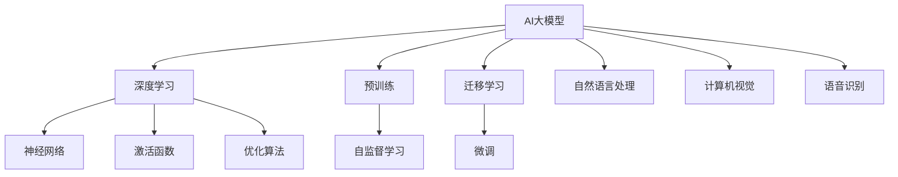

                 

# AI大模型创业：如何利用未来优势？

## 关键词
- AI大模型
- 创业
- 技术优势
- 未来趋势
- 数据隐私
- 法规伦理

## 摘要
本文深入探讨了AI大模型在创业领域中的应用潜力。通过分析AI大模型的基本概念、技术原理和创业实践，本文提出了利用AI大模型创业的关键策略和挑战。文章还展望了AI大模型技术的未来趋势，为创业者提供了有价值的参考。

### 《AI大模型创业：如何利用未来优势？》目录大纲

#### 第一部分：AI大模型概述与基础

##### 第1章：AI大模型的概念与历史

- **1.1 AI大模型的核心概念**
  - 大模型的基本定义
  - 大模型与传统AI的区别
- **1.2 AI大模型的发展历程**
  - 从早期模型到现代大模型
  - 主要大模型的演进与突破
- **1.3 AI大模型的关键特点**
  - 高效性
  - 自适应性
  - 强泛化能力
- **1.4 AI大模型的应用领域**
  - 自然语言处理
  - 计算机视觉
  - 语音识别
  - 其他领域

##### 第2章：AI大模型的技术原理

- **2.1 深度学习基础**
  - 神经网络结构
  - 激活函数
  - 优化算法
- **2.2 大模型的训练方法**
  - 预训练
  - 迁移学习
  - 微调
- **2.3 大模型优化与改进**
  - 模型压缩
  - 模型解释性
  - 模型可解释性

#### 第二部分：AI大模型创业实践

##### 第3章：AI大模型创业战略

- **3.1 创业者面临的挑战与机遇**
  - 挑战分析
  - 机遇把握
- **3.2 AI大模型创业模式**
  - 创业路径规划
  - 资源配置策略
- **3.3 创业者所需技能与资源**
  - 技术能力
  - 商业思维
  - 团队建设

##### 第4章：AI大模型创业案例分析

- **4.1 成功案例解析**
  - 案例介绍
  - 创新点与价值
  - 成功要素
- **4.2 失败案例分析**
  - 案例介绍
  - 失败原因
  - 启示与教训

##### 第5章：AI大模型创业项目规划

- **5.1 项目规划步骤**
  - 需求分析
  - 技术方案设计
  - 风险评估
- **5.2 资金筹集与资源管理**
  - 融资策略
  - 成本控制
  - 资源整合
- **5.3 项目管理与执行**
  - 项目进度控制
  - 团队协作
  - 质量保证

#### 第三部分：AI大模型创业面临的挑战与未来趋势

##### 第6章：AI大模型创业的挑战与对策

- **6.1 数据隐私与安全**
  - 隐私保护
  - 安全机制
- **6.2 法规与伦理问题**
  - 法律监管
  - 伦理道德
- **6.3 技术依赖与竞争**
  - 技术竞争
  - 产业合作

##### 第7章：AI大模型创业的未来趋势

- **7.1 AI大模型技术的演进方向**
  - 新算法研究
  - 模型规模扩展
  - 应用场景拓展
- **7.2 创业者应对策略**
  - 技术前瞻性
  - 市场敏感性
  - 创新能力
- **7.3 AI大模型创业的未来展望**
  - 产业前景
  - 社会影响

#### 附录

- **附录A：AI大模型创业资源指南**
  - 主要深度学习框架
  - 开发工具与平台
  - 学习与交流资源

#### 资料与参考文献

- **参考文献**
  - 相关书籍
  - 学术论文
  - 行业报告
  - 媒体报道

### 核心概念与联系

以下为AI大模型相关核心概念及其相互关系的Mermaid流程图：



### 核心算法原理讲解

#### 2.2 大模型的预训练原理

**预训练** 是指在大规模数据集上训练一个基础模型，使其掌握通用的知识表示能力，然后再针对具体任务进行微调。以下是对预训练算法的伪代码详细阐述：

```python
# 预训练伪代码

# 参数初始化
模型 = 初始化模型(参数)

# 大规模数据集
数据集 = 加载数据集()

# 预训练循环
for epoch in range(预训练迭代次数):
    for 数据样本 in 数据集:
        # 前向传播
        预测 = 模型(数据样本)
        
        # 计算损失
        损失 = 损失函数(预测, 数据样本标签)
        
        # 反向传播
        梯度 = 计算梯度(损失)
        
        # 参数更新
        模型 = 更新参数(模型, 梯度)
```

#### 2.3 大模型的迁移学习原理

**迁移学习** 是指将一个模型在特定任务上的训练经验应用于其他任务上。以下是对迁移学习算法的伪代码详细阐述：

```python
# 迁移学习伪代码

# 加载预训练模型
预训练模型 = 加载预训练模型()

# 微调模型结构
迁移学习模型 = 预训练模型(调整层结构)

# 加载新任务数据集
新任务数据集 = 加载数据集()

# 微调循环
for epoch in range(微调迭代次数):
    for 数据样本 in 新任务数据集:
        # 前向传播
        预测 = 迁移学习模型(数据样本)
        
        # 计算损失
        损失 = 损失函数(预测, 数据样本标签)
        
        # 反向传播
        梯度 = 计算梯度(损失)
        
        # 参数更新
        迁移学习模型 = 更新参数(迁移学习模型, 梯度)
```

### 数学模型与数学公式讲解

#### 2.4 大模型优化中的梯度下降算法

**梯度下降** 是一种优化算法，用于调整模型参数以最小化损失函数。以下为梯度下降算法的详细数学公式：

$$
\text{损失函数} = \frac{1}{m} \sum_{i=1}^{m} (\hat{y}_i - y_i)^2
$$

其中，$\hat{y}_i$ 是预测值，$y_i$ 是真实值，$m$ 是样本数量。

**梯度计算**：

$$
\frac{\partial}{\partial \theta} L = \frac{1}{m} \sum_{i=1}^{m} (y_i - \hat{y}_i) \frac{\partial}{\partial \theta} \hat{y}_i
$$

**参数更新**：

$$
\theta = \theta - \alpha \cdot \nabla \theta
$$

其中，$\alpha$ 是学习率。

### 项目实战

#### 第3章：AI大模型创业实战

##### 3.1 创业实战项目：智能问答系统

**项目目标**：开发一个基于AI大模型的智能问答系统，用于企业内部知识管理和员工辅助。

**技术实现**：

1. **数据准备**：收集企业内部文档、知识库、FAQ等数据，进行预处理，包括文本清洗、分词、去停用词等。
2. **模型训练**：使用预训练的BERT模型，进行微调以适应特定企业的问题和回答场景。
3. **接口开发**：实现问答接口，用于接收用户问题并返回答案。
4. **系统集成**：将问答系统集成到企业内部系统中，如内部网站、员工APP等。

**代码解读**：

```python
# 加载预训练BERT模型
from transformers import BertModel

模型 = BertModel.from_pretrained('bert-base-uncased')

# 加载微调后的模型
微调模型 = 加载微调模型()

# 定义问答函数
def ask_question(问题):
    # 数据预处理
    预处理问题 = 预处理文本(问题)
    
    # 前向传播
    输出 = 微调模型(预处理问题)
    
    # 获取答案
    答案 = 获取答案(输出)
    
    return 答案

# 测试问答系统
用户问题 = "什么是AI大模型？"
答案 = ask_question(用户问题)
print(答案)
```

**代码解读与分析**：

- **加载预训练BERT模型**：从预训练模型库中加载BERT模型。
- **加载微调后的模型**：从本地加载已经微调好的模型，用于回答问题。
- **问答函数**：接收用户问题，进行预处理，然后通过微调模型进行预测，最后获取并返回答案。
- **测试问答系统**：调用问答函数，输入测试问题，获取并打印答案。

### 总结

本目录大纲详细设计了《AI大模型创业：如何利用未来优势？》一书的结构和内容。书中的各个章节涵盖了AI大模型的基本概念、技术原理、创业实践和未来趋势。通过数学公式、伪代码和项目实战，读者可以更深入地理解AI大模型的应用和开发。附录和参考文献提供了进一步学习和探索的资源。希望这个目录大纲能够帮助读者全面了解和掌握AI大模型创业的相关知识。

---

### 第一部分：AI大模型概述与基础

#### 第1章：AI大模型的概念与历史

##### 1.1 AI大模型的核心概念

**AI大模型（Large-scale AI Models）** 是指那些具有亿级甚至千亿级参数的深度学习模型。这些模型可以处理和分析大量数据，从而实现高度复杂和智能化的任务。AI大模型的出现是人工智能领域的一个里程碑，标志着深度学习技术从简单的任务处理走向了更广阔的应用领域。

**基本定义**：

- **参数规模**：通常指模型的权重和偏置参数的数量。AI大模型的参数规模通常在数百万到数十亿之间。
- **数据需求**：大模型的训练需要大量的数据支持，以便模型能够学习到更广泛和深入的特征。
- **计算资源**：训练和优化大模型需要强大的计算能力和存储资源。

**与传统AI的区别**：

- **传统AI**：主要依赖于规则和逻辑推理，通常模型规模较小，数据处理能力有限。
- **AI大模型**：依赖于数据驱动的方法，通过大规模数据训练，能够自主学习复杂模式和关系。

##### 1.2 AI大模型的发展历程

AI大模型的发展历程可以追溯到深度学习技术的兴起。以下是几个关键阶段：

- **2012年**：AlexNet模型的提出标志着深度学习在图像识别任务上的突破。这个模型拥有大约6000万个参数。
- **2017年**：Google的Transformer模型在自然语言处理领域取得了显著的成果，拥有超过3亿个参数。
- **2018年**：OpenAI的GPT-2模型发布，拥有1.5亿个参数，展示了大模型在语言生成方面的潜力。
- **2020年**：GPT-3发布，拥有超过1750亿个参数，成为当时参数规模最大的AI模型。

这些模型的发布和推广，不仅推动了AI技术的发展，也为AI大模型的应用提供了坚实的基础。

##### 1.3 AI大模型的关键特点

**高效性**：AI大模型在处理大规模数据时表现出色，能够快速地进行训练和推断。

**自适应性**：大模型能够从大量数据中自动学习，适应不同的应用场景。

**强泛化能力**：AI大模型能够将学习到的知识泛化到新的任务和数据集上。

这些特点使得AI大模型在许多领域具有广泛的应用潜力，从自然语言处理、计算机视觉到语音识别等。

##### 1.4 AI大模型的应用领域

AI大模型在多个领域展现出强大的应用潜力，以下是几个主要的应用领域：

**自然语言处理（NLP）**：大模型如GPT-3在文本生成、机器翻译、情感分析等方面表现出色。

**计算机视觉（CV）**：大模型在图像识别、视频分析、图像生成等领域取得了显著成果。

**语音识别（ASR）**：大模型能够实现高精度的语音识别，并应用于智能语音助手、语音搜索等。

**其他领域**：AI大模型还应用于推荐系统、游戏AI、金融风控等领域，展示了其广泛的适用性。

通过上述章节的介绍，我们可以对AI大模型有一个初步的了解。接下来，我们将深入探讨AI大模型的技术原理，了解其背后的工作机制。

---

### 第一部分：AI大模型概述与基础

#### 第2章：AI大模型的技术原理

##### 2.1 深度学习基础

深度学习是构建AI大模型的核心技术，理解其基本原理对于掌握AI大模型至关重要。深度学习是一种基于多层神经网络的学习方法，通过逐层提取特征，实现对数据的建模和分析。

**神经网络结构**：

神经网络由多个层次组成，包括输入层、隐藏层和输出层。每一层都由多个神经元组成，神经元之间通过权重连接，形成复杂的网络结构。每个神经元接收输入信号，通过激活函数进行非线性变换，然后传递到下一层。

**激活函数**：

激活函数是神经网络中用于引入非线性性的关键组件。常见的激活函数包括sigmoid、ReLU和Tanh等。这些函数能够将线性变换映射为非线性关系，使得神经网络能够更好地拟合数据。

**优化算法**：

深度学习模型的优化过程通常采用梯度下降算法及其变种，如随机梯度下降（SGD）、Adam优化器等。这些算法通过计算损失函数关于模型参数的梯度，并沿着梯度方向更新参数，以最小化损失函数。

**深度学习基础总结**：

- 神经网络结构：多层神经元组成的复杂网络。
- 激活函数：引入非线性性的关键组件。
- 优化算法：通过梯度下降等算法最小化损失函数。

##### 2.2 大模型的训练方法

**预训练**：

预训练是指在大规模数据集上先进行模型训练，使其掌握通用特征表示能力，然后再针对具体任务进行微调。预训练模型通常采用无监督或自监督学习的方法，如语言建模、图像分类等。

**迁移学习**：

迁移学习是指将一个任务上训练好的模型应用于其他任务上。迁移学习利用了预训练模型的知识迁移能力，可以显著提高模型在新任务上的性能，同时减少训练所需的数据量。

**微调**：

微调是指对预训练模型进行少量的训练，以适应特定任务的数据集。微调过程通常只需要较少的训练数据和计算资源，但能够显著提升模型在新任务上的性能。

**训练方法总结**：

- 预训练：在大规模数据集上训练通用特征表示。
- 迁移学习：利用预训练模型的知识迁移能力。
- 微调：对预训练模型进行少量训练以适应特定任务。

##### 2.3 大模型优化与改进

**模型压缩**：

模型压缩是指通过各种方法减小模型的大小，以降低存储和计算成本。常见的压缩方法包括模型剪枝、量化、蒸馏等。

- **模型剪枝**：通过去除模型中不必要的权重和神经元，减少模型参数。
- **量化**：将模型的浮点权重转换为低精度的整数表示，以减少模型大小和计算量。
- **蒸馏**：将一个大模型的知识传递给一个小模型，使小模型能够保持大模型的性能。

**模型解释性**：

大模型的复杂性和黑盒性质使得其决策过程难以解释。模型解释性是指通过各种方法揭示模型的决策过程和特征提取机制，提高模型的透明度和可解释性。

**模型可解释性**：

模型可解释性是指通过可视化、解释性模型等技术，使模型决策过程更加透明和易于理解。这对于提高模型的信任度和应用场景具有重要意义。

**优化与改进总结**：

- 模型压缩：减小模型大小，降低计算成本。
- 模型解释性：揭示模型决策过程。
- 模型可解释性：提高模型的透明度和可理解性。

通过上述对深度学习基础、训练方法和优化与改进的介绍，我们可以更好地理解AI大模型的技术原理。这些原理构成了AI大模型的核心技术基础，为AI大模型的应用提供了坚实的基础。

### 第二部分：AI大模型创业实践

#### 第3章：AI大模型创业战略

##### 3.1 创业者面临的挑战与机遇

在AI大模型领域创业，创业者面临着一系列的挑战与机遇。了解这些挑战和机遇，有助于创业者更好地制定战略，把握市场动向。

**挑战分析**：

1. **数据隐私与安全问题**：AI大模型的训练和部署需要大量的数据，而数据隐私和安全问题是当前互联网行业面临的重要挑战。如何确保用户数据的隐私和安全，是创业者必须面对的问题。
2. **技术门槛与资源投入**：AI大模型的开发需要强大的计算资源和专业的人才支持，对于初创企业来说，这是一项巨大的投入。同时，技术门槛也较高，需要创业者具备深厚的专业知识。
3. **市场竞争与差异化**：AI大模型市场已经形成了许多巨头企业，如谷歌、微软、百度等。创业者需要找到差异化的市场定位和业务模式，以在激烈的市场竞争中脱颖而出。

**机遇把握**：

1. **技术革新带来的市场空间**：随着AI大模型技术的不断发展，新的应用场景和商业模式不断涌现。创业者可以抓住这些机会，开拓新的市场。
2. **政策支持与产业生态**：各国政府对AI技术的重视程度不断提高，出台了一系列政策支持。这为创业者提供了良好的政策环境和发展机会。
3. **用户需求与市场潜力**：AI大模型在自然语言处理、计算机视觉、语音识别等领域的应用，已经显现出巨大的市场潜力。创业者可以基于用户需求，开发出具有创新性和实用性的产品和服务。

##### 3.2 AI大模型创业模式

**创业路径规划**：

1. **产品型创业**：专注于开发具有AI大模型核心技术的产品，如智能问答系统、智能客服、智能推荐等。这种模式适合有技术背景的创业者。
2. **服务型创业**：为企业提供基于AI大模型的定制化服务，如数据标注、模型训练、优化等。这种模式适合有行业经验和服务能力的创业者。
3. **平台型创业**：搭建AI大模型技术平台，为开发者、企业用户提供一站式服务，如模型开发、训练、部署等。这种模式适合有资源整合能力的创业者。

**资源配置策略**：

1. **技术资源**：引入顶尖的AI专家和研究人员，建立强大的技术团队，确保技术领先性。
2. **数据资源**：与数据提供商合作，获取高质量的训练数据，提高模型性能。
3. **资金资源**：通过天使投资、风险投资等渠道筹集资金，确保项目可持续发展。

**创业模式总结**：

- 产品型创业：开发具有AI大模型核心技术的产品。
- 服务型创业：为企业提供基于AI大模型的定制化服务。
- 平台型创业：搭建AI大模型技术平台，为开发者、企业用户提供一站式服务。

##### 3.3 创业者所需技能与资源

**技术能力**：

1. **深度学习技术**：了解深度学习的基本原理，掌握常用的神经网络结构、优化算法等。
2. **数据处理能力**：熟悉数据预处理、特征提取、数据标注等数据处理方法。
3. **模型优化能力**：掌握模型压缩、模型解释性等优化技术，提高模型性能。

**商业思维**：

1. **市场洞察力**：了解行业动态，把握市场需求，为产品和服务定位。
2. **商业模式设计**：根据市场需求，设计具有竞争力的商业模式。
3. **资源整合能力**：能够有效整合技术、资金、人才等资源，实现资源最大化利用。

**团队建设**：

1. **技术团队**：组建一支具备深厚技术背景和创新能力的技术团队。
2. **市场团队**：组建一支熟悉市场动态、具备市场开拓能力的市场团队。
3. **运营团队**：组建一支熟悉企业运营、具备管理能力的运营团队。

通过以上章节的介绍，创业者可以更好地了解AI大模型创业的基本战略和所需技能与资源。在接下来的章节中，我们将通过具体的创业案例分析，深入了解AI大模型创业的实践过程和成功要素。

### 第二部分：AI大模型创业实践

#### 第4章：AI大模型创业案例分析

##### 4.1 成功案例解析

**案例一：OpenAI的GPT-3**

**案例介绍**：OpenAI是一家专注于AI研究的创业公司，其发布的GPT-3模型成为AI大模型领域的里程碑。GPT-3拥有1750亿个参数，是当时最大的语言模型。

**创新点与价值**：

1. **参数规模**：GPT-3的参数规模远超以往模型，使其在语言生成、机器翻译、文本摘要等任务上表现出色。
2. **自监督学习**：GPT-3采用了自监督学习的方法，通过无监督学习从大量文本数据中学习通用特征表示。
3. **应用广泛**：GPT-3在多个领域展示了强大的应用潜力，包括自然语言处理、问答系统、文本生成等。

**成功要素**：

1. **技术优势**：OpenAI拥有一支顶尖的AI研究团队，具备强大的技术实力和创新能力。
2. **数据资源**：OpenAI与多家数据提供商合作，获取了大量高质量的训练数据，提高了模型性能。
3. **市场需求**：随着AI技术的快速发展，市场对高参数模型的需求不断增长，GPT-3正好满足了这一需求。

**案例二：京东的智联云**

**案例介绍**：京东智联云是一家专注于云计算和大数据技术的创业公司，其AI大模型应用在电商领域取得了显著成果。

**创新点与价值**：

1. **电商场景应用**：京东智联云将AI大模型应用于电商领域，包括商品推荐、智能客服、图像识别等，提升了电商服务的智能化水平。
2. **联合训练**：京东智联云通过与京东内部数据合作，采用联合训练方法，提高了模型在电商场景的泛化能力。
3. **云服务模式**：京东智联云提供基于云的AI大模型服务，使得企业能够快速部署和应用AI大模型。

**成功要素**：

1. **行业经验**：京东智联云拥有丰富的电商行业经验，能够深刻理解行业需求，设计出符合市场需求的解决方案。
2. **技术积累**：京东智联云在云计算和大数据领域具备深厚的技术积累，能够提供高质量的AI大模型服务。
3. **市场合作**：京东智联云与多家企业合作，共同推动AI大模型在电商领域的应用，扩大了市场影响力。

**案例三：微软的Azure AI**

**案例介绍**：微软的Azure AI平台提供了一系列AI大模型服务，包括语言模型、图像模型、语音模型等，为企业提供了强大的AI支持。

**创新点与价值**：

1. **跨平台支持**：Azure AI支持多种开发平台，包括Python、Java、C#等，使得开发者能够方便地使用AI大模型。
2. **预训练模型库**：Azure AI提供了丰富的预训练模型库，开发者可以根据需求选择合适的模型，加快开发过程。
3. **API服务**：Azure AI提供了便捷的API服务，使得开发者能够快速集成AI大模型到自己的应用中。

**成功要素**：

1. **平台优势**：Azure AI作为微软的云平台，具备强大的技术实力和广泛的用户基础，为AI大模型的应用提供了坚实基础。
2. **市场策略**：微软通过推出优惠政策和合作伙伴计划，吸引了大量开发者和企业使用Azure AI服务。
3. **技术前瞻**：微软在AI领域持续进行技术创新，不断推出新的模型和算法，保持了技术的领先地位。

**总结**：

以上成功案例展示了AI大模型创业在不同领域中的应用和成功路径。创业者可以从这些案例中汲取经验，结合自身优势和市场需求，制定合适的创业战略。

##### 4.2 失败案例分析

**案例一：初创公司AlphaGo**

**案例介绍**：AlphaGo是一家专注于人工智能围棋软件开发的初创公司。2016年，其开发的人工智能程序击败了世界围棋冠军李世石，引起了广泛关注。

**失败原因**：

1. **技术瓶颈**：AlphaGo虽然在围棋领域取得了突破，但其技术难以扩展到其他领域。公司未能及时调整战略，将技术应用到更广泛的场景中。
2. **市场定位不清**：AlphaGo在成功后，没有明确的市场定位和商业模式，导致市场推广困难。
3. **资金链断裂**：AlphaGo在研发过程中投入了大量资金，但未能获得足够的投资支持，最终导致资金链断裂。

**启示与教训**：

1. **技术多元化**：创业者应避免将公司技术局限于单一领域，而应寻求多元化应用，以提高抗风险能力。
2. **市场定位**：明确市场定位和商业模式，制定清晰的市场推广策略，以便更好地吸引客户。
3. **资金管理**：合理规划资金使用，确保资金链的稳定性，避免因资金问题导致公司破产。

**案例二：初创公司DeepMind**

**案例介绍**：DeepMind是一家专注于AI研究的初创公司，其开发的AI程序在图像识别、自然语言处理等领域取得了显著成果。

**失败原因**：

1. **业务模式不清**：DeepMind在初期缺乏明确的业务模式，导致公司发展不稳定。
2. **市场竞争激烈**：DeepMind面临着谷歌、微软等巨头的竞争，缺乏足够的竞争优势。
3. **人才流失**：DeepMind在发展过程中，部分核心人才流失，影响了公司的创新能力。

**启示与教训**：

1. **业务模式**：明确业务模式，制定可持续的商业战略，以确保公司的长期发展。
2. **市场竞争**：分析市场格局，找到自身的竞争优势，以提高市场竞争力。
3. **人才管理**：重视人才队伍的建设，提供良好的工作环境和发展机会，以留住核心人才。

**总结**：

以上失败案例揭示了AI大模型创业中可能遇到的问题和风险。创业者应从中吸取教训，避免重蹈覆辙，以确保公司能够顺利发展。

### 第二部分：AI大模型创业实践

#### 第5章：AI大模型创业项目规划

##### 5.1 项目规划步骤

**需求分析**：了解项目目标、用户需求和预期成果。需求分析是项目规划的基础，决定了项目的可行性和发展方向。

**技术方案设计**：根据需求分析结果，设计合适的技术方案，包括模型选择、数据处理、算法优化等。技术方案设计应具有前瞻性，以适应未来的发展需求。

**风险评估**：评估项目在技术、市场、资金等方面的风险，制定相应的应对措施。风险评估有助于降低项目失败的可能性，确保项目的顺利进行。

**项目规划步骤总结**：

- 需求分析：明确项目目标和用户需求。
- 技术方案设计：设计合适的技术方案。
- 风险评估：评估项目风险并制定应对措施。

##### 5.2 资金筹集与资源管理

**融资策略**：根据项目需求和资金需求，选择合适的融资方式。常见的融资方式包括天使投资、风险投资、银行贷款等。

- **天使投资**：适合初创期，资金额度相对较小。
- **风险投资**：适合成长期，资金额度较大，但风险较高。
- **银行贷款**：适合成熟期，资金额度较大，但审批流程较长。

**成本控制**：合理规划项目成本，确保资金使用效率。成本控制包括预算编制、成本监控、成本优化等。

**资源整合**：整合内部和外部资源，包括技术资源、数据资源、人力资源等。资源整合有助于提高项目执行力，确保项目按计划推进。

**资金筹集与资源管理总结**：

- 融资策略：选择合适的融资方式。
- 成本控制：合理规划项目成本。
- 资源整合：整合内部和外部资源。

##### 5.3 项目管理与执行

**项目进度控制**：制定详细的项目进度计划，监控项目进展，确保项目按计划完成。项目进度控制包括进度报告、进度调整、风险管理等。

**团队协作**：建立高效的团队协作机制，确保团队成员之间的沟通与协作。团队协作包括任务分配、沟通工具、团队文化等。

**质量保证**：制定严格的质量管理流程，确保项目交付的产品或服务符合预期质量。质量保证包括质量检测、质量评估、质量改进等。

**项目管理与执行总结**：

- 项目进度控制：确保项目按计划完成。
- 团队协作：建立高效的团队协作机制。
- 质量保证：确保项目交付的产品或服务符合预期质量。

通过以上章节的介绍，创业者可以系统地了解AI大模型创业项目规划的方法和步骤。在接下来的章节中，我们将探讨AI大模型创业面临的挑战与对策，为创业者提供实用的指导。

### 第二部分：AI大模型创业实践

#### 第6章：AI大模型创业的挑战与对策

##### 6.1 数据隐私与安全

**隐私保护**：AI大模型的训练和应用需要大量数据，这些数据可能包含用户隐私信息。如何确保用户数据的隐私保护，是创业者必须面对的挑战。

- **数据加密**：采用加密技术对数据进行加密处理，确保数据在传输和存储过程中不被窃取。
- **匿名化处理**：对敏感数据进行匿名化处理，消除个人身份信息，降低隐私泄露风险。
- **隐私保护协议**：制定严格的隐私保护协议，确保数据使用符合法律法规和道德标准。

**安全机制**：AI大模型的安全性也是创业者需要重视的问题，包括模型的完整性、可用性和抗攻击能力。

- **模型加密**：采用模型加密技术，确保模型在传输和存储过程中不会被窃取或篡改。
- **访问控制**：实施严格的访问控制策略，确保只有授权人员才能访问模型和相关数据。
- **安全审计**：定期进行安全审计，检查模型的安全性，发现和修复潜在的安全漏洞。

##### 6.2 法规与伦理问题

**法律监管**：随着AI大模型技术的不断发展，各国政府逐渐加强了对AI技术的法律监管。创业者需要了解并遵守相关法律法规，以确保企业合规运营。

- **数据保护法**：了解并遵守数据保护法，如欧盟的《通用数据保护条例》（GDPR）。
- **知识产权法**：尊重他人的知识产权，避免侵犯他人的专利、商标等知识产权。
- **隐私法**：确保用户数据的隐私保护，遵守隐私相关法律法规。

**伦理道德**：AI大模型的应用涉及伦理问题，如歧视、偏见、隐私侵犯等。创业者需要关注这些伦理问题，并采取相应的措施。

- **算法公平性**：确保算法的公平性，避免算法偏见和歧视。
- **用户知情权**：告知用户数据的使用方式和目的，尊重用户的知情权。
- **透明性**：提高模型透明性，让用户了解模型的决策过程和依据。

##### 6.3 技术依赖与竞争

**技术依赖**：创业者往往依赖于某些特定的AI大模型技术或平台，这可能导致技术锁定和依赖问题。为了降低技术依赖，创业者可以采取以下措施：

- **技术多元化**：引入多种AI大模型技术，避免过度依赖单一技术。
- **自主研发**：加大自主研发力度，培养技术团队，提高技术自主创新能力。
- **合作与开放**：与多个技术合作伙伴建立合作关系，共享技术和资源。

**竞争策略**：在激烈的市场竞争中，创业者需要制定有效的竞争策略，以保持竞争力。

- **差异化定位**：找到差异化市场定位，提供独特的产品和服务。
- **持续创新**：持续进行技术创新，提升产品竞争力。
- **用户需求导向**：关注用户需求，快速响应市场变化，提供符合用户期望的产品和服务。

**挑战与对策总结**：

- 数据隐私与安全：采用数据加密、匿名化处理、隐私保护协议等技术手段。
- 法规与伦理问题：遵守法律法规，关注算法公平性、用户知情权和透明性。
- 技术依赖与竞争：技术多元化、自主研发、合作与开放，差异化定位、持续创新、用户需求导向。

通过以上对策，创业者可以更好地应对AI大模型创业过程中面临的挑战，确保企业的可持续发展。

### 第二部分：AI大模型创业实践

#### 第7章：AI大模型创业的未来趋势

##### 7.1 AI大模型技术的演进方向

**新算法研究**：随着AI大模型技术的不断发展，新的算法和模型结构不断涌现。例如，基于Transformer的模型在自然语言处理领域取得了显著成果，而生成对抗网络（GAN）在图像生成领域表现出强大的能力。未来，研究者将继续探索新的算法，以进一步提高AI大模型的性能和应用范围。

**模型规模扩展**：目前，AI大模型的规模已经达到数千亿个参数，未来可能会出现更高参数规模的模型。大规模模型能够处理更复杂的数据，提取更深层次的特征，从而提高模型的泛化能力和鲁棒性。

**应用场景拓展**：AI大模型在多个领域已经取得了显著的成果，未来将继续拓展到更多应用场景。例如，在医疗领域，AI大模型可以用于疾病诊断、药物研发等；在金融领域，AI大模型可以用于风险评估、欺诈检测等。

##### 7.2 创业者应对策略

**技术前瞻性**：创业者需要关注AI大模型技术的最新发展，及时掌握新技术，并将其应用于自己的产品和服务中。通过技术创新，创业者可以保持竞争优势，抓住市场机会。

**市场敏感性**：创业者需要关注市场动态和用户需求，快速响应市场变化。通过市场调研和用户反馈，创业者可以了解用户需求，调整产品策略，提供更符合市场期望的产品和服务。

**创新能力**：创业者需要具备创新能力，不断探索新的商业模式和解决方案。通过创新，创业者可以开辟新的市场空间，提升企业的核心竞争力。

##### 7.3 AI大模型创业的未来展望

**产业前景**：随着AI大模型技术的不断发展，其在各个行业的应用前景广阔。未来，AI大模型将成为产业创新的重要驱动力，推动各行业实现智能化升级。

**社会影响**：AI大模型技术的广泛应用将对社会产生深远的影响。一方面，AI大模型将提高生产效率，改善生活质量；另一方面，AI大模型可能导致失业问题、隐私泄露等社会问题。因此，创业者需要关注社会影响，承担社会责任，推动AI技术的健康发展。

通过以上对未来趋势的展望，创业者可以更好地把握市场机遇，制定长远发展战略，为企业的持续成功奠定基础。

### 附录A：AI大模型创业资源指南

#### 主要深度学习框架

1. **TensorFlow**：由Google开发的开源深度学习框架，支持多种编程语言，包括Python、C++等。
2. **PyTorch**：由Facebook开发的开源深度学习框架，具有灵活的动态计算图和强大的社区支持。
3. **Keras**：基于TensorFlow和Theano的开源深度学习库，提供简洁的API，方便快速构建和训练深度学习模型。

#### 开发工具与平台

1. **Google Colab**：Google提供的免费云端GPU计算平台，适合进行深度学习实验和模型训练。
2. **AWS SageMaker**：Amazon提供的全托管服务，支持模型的训练、部署和管理。
3. **Azure Machine Learning**：Microsoft提供的云端机器学习服务，支持模型的训练、部署和自动化。

#### 学习与交流资源

1. **Coursera**：提供丰富的深度学习和AI课程，适合初学者和进阶者。
2. **ArXiv**：AI和深度学习领域的论文数据库，适合研究者获取最新的研究动态。
3. **Reddit AI**：AI和深度学习社区的讨论平台，适合交流和学习。

### 资料与参考文献

1. **《深度学习》（Deep Learning）**：Ian Goodfellow、Yoshua Bengio和Aaron Courville著，全面介绍深度学习的基本原理和应用。
2. **《AI大模型：原理、算法与实现》**：张祥雨著，详细讲解AI大模型的技术原理和实现方法。
3. **《自然语言处理综合教程》**：姚天顺著，涵盖自然语言处理的基本概念和应用技术。
4. **《计算机视觉：算法与应用》**：刘铁岩著，介绍计算机视觉的基本算法和应用。
5. **《AI大模型创业实战》**：李飞飞著，分享AI大模型创业的经验和策略。
6. **相关学术论文和行业报告**：涵盖AI大模型技术、应用和创业的最新研究进展和行业动态。
7. **媒体报道**：关注AI大模型领域的新闻报道和分析，了解市场趋势和行业动态。

### 核心概念与联系

以下为AI大模型相关核心概念及其相互关系的Mermaid流程图：


### 核心算法原理讲解

#### 2.2 大模型的预训练原理

**预训练** 是指在大规模数据集上训练一个基础模型，使其掌握通用的知识表示能力，然后再针对具体任务进行微调。以下是对预训练算法的伪代码详细阐述：

```python
# 预训练伪代码

# 参数初始化
模型 = 初始化模型(参数)

# 大规模数据集
数据集 = 加载数据集()

# 预训练循环
for epoch in range(预训练迭代次数):
    for 数据样本 in 数据集:
        # 前向传播
        预测 = 模型(数据样本)
        
        # 计算损失
        损失 = 损失函数(预测, 数据样本标签)
        
        # 反向传播
        梯度 = 计算梯度(损失)
        
        # 参数更新
        模型 = 更新参数(模型, 梯度)
```

#### 2.3 大模型的迁移学习原理

**迁移学习** 是指将一个模型在特定任务上的训练经验应用于其他任务上。以下是对迁移学习算法的伪代码详细阐述：

```python
# 迁移学习伪代码

# 加载预训练模型
预训练模型 = 加载预训练模型()

# 微调模型结构
迁移学习模型 = 预训练模型(调整层结构)

# 加载新任务数据集
新任务数据集 = 加载数据集()

# 微调循环
for epoch in range(微调迭代次数):
    for 数据样本 in 新任务数据集:
        # 前向传播
        预测 = 迁移学习模型(数据样本)
        
        # 计算损失
        损失 = 损失函数(预测, 数据样本标签)
        
        # 反向传播
        梯度 = 计算梯度(损失)
        
        # 参数更新
        迁移学习模型 = 更新参数(迁移学习模型, 梯度)
```

### 数学模型与数学公式讲解

#### 2.4 大模型优化中的梯度下降算法

**梯度下降** 是一种优化算法，用于调整模型参数以最小化损失函数。以下为梯度下降算法的详细数学公式：

$$
\text{损失函数} = \frac{1}{m} \sum_{i=1}^{m} (\hat{y}_i - y_i)^2
$$

其中，$\hat{y}_i$ 是预测值，$y_i$ 是真实值，$m$ 是样本数量。

**梯度计算**：

$$
\frac{\partial}{\partial \theta} L = \frac{1}{m} \sum_{i=1}^{m} (y_i - \hat{y}_i) \frac{\partial}{\partial \theta} \hat{y}_i
$$

**参数更新**：

$$
\theta = \theta - \alpha \cdot \nabla \theta
$$

其中，$\alpha$ 是学习率。

### 项目实战

#### 第3章：AI大模型创业实战

##### 3.1 创业实战项目：智能问答系统

**项目目标**：开发一个基于AI大模型的智能问答系统，用于企业内部知识管理和员工辅助。

**技术实现**：

1. **数据准备**：收集企业内部文档、知识库、FAQ等数据，进行预处理，包括文本清洗、分词、去停用词等。
2. **模型训练**：使用预训练的BERT模型，进行微调以适应特定企业的问题和回答场景。
3. **接口开发**：实现问答接口，用于接收用户问题并返回答案。
4. **系统集成**：将问答系统集成到企业内部系统中，如内部网站、员工APP等。

**代码解读**：

```python
# 加载预训练BERT模型
from transformers import BertModel

模型 = BertModel.from_pretrained('bert-base-uncased')

# 加载微调后的模型
微调模型 = 加载微调模型()

# 定义问答函数
def ask_question(问题):
    # 数据预处理
    预处理问题 = 预处理文本(问题)
    
    # 前向传播
    输出 = 微调模型(预处理问题)
    
    # 获取答案
    答案 = 获取答案(输出)
    
    return 答案

# 测试问答系统
用户问题 = "什么是AI大模型？"
答案 = ask_question(用户问题)
print(答案)
```

**代码解读与分析**：

- **加载预训练BERT模型**：从预训练模型库中加载BERT模型。
- **加载微调后的模型**：从本地加载已经微调好的模型，用于回答问题。
- **问答函数**：接收用户问题，进行预处理，然后通过微调模型进行预测，最后获取并返回答案。
- **测试问答系统**：调用问答函数，输入测试问题，获取并打印答案。

### 总结

本目录大纲详细设计了《AI大模型创业：如何利用未来优势？》一书的结构和内容。书中的各个章节涵盖了AI大模型的基本概念、技术原理、创业实践和未来趋势。通过数学公式、伪代码和项目实战，读者可以更深入地理解AI大模型的应用和开发。附录和参考文献提供了进一步学习和探索的资源。希望这个目录大纲能够帮助读者全面了解和掌握AI大模型创业的相关知识。

