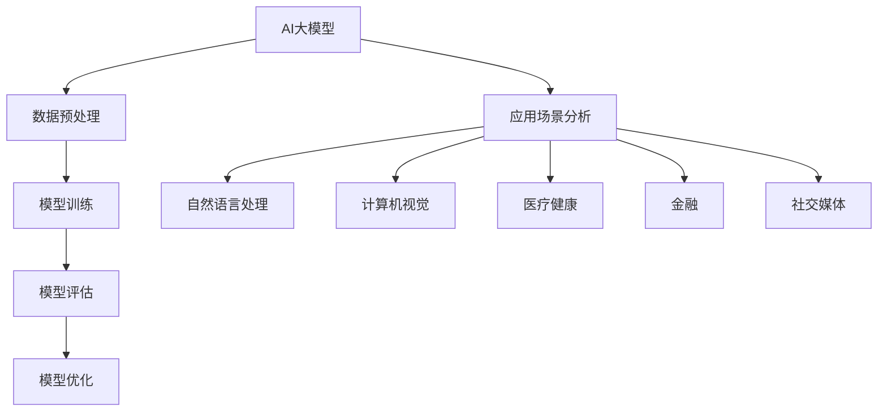

                 

### 引言

近年来，人工智能（AI）领域取得了令人瞩目的进展，尤其是AI大模型技术的迅猛发展。AI大模型，通常指的是那些具有数十亿甚至数千亿参数的神经网络模型，它们在处理复杂任务时展现了前所未有的效果。从自然语言处理（NLP）、计算机视觉到机器翻译、推荐系统等，AI大模型的应用场景越来越广泛。随着技术的不断进步，AI大模型创业成为了一个充满机遇和挑战的领域。

在本文中，我们将探讨AI大模型创业中的关键问题，特别是如何利用渠道优势。首先，我们将简要概述AI大模型的基础知识，包括其发展历史、现状、分类与架构，以及主要的应用场景。接下来，我们将深入分析AI大模型创业所面临的挑战和机遇，并探讨创业的路径规划、资金管理和法律与伦理问题。

随后，我们将通过实战案例展示成功和失败的AI大模型创业项目，从中吸取经验教训。然后，我们将讨论AI大模型创业的渠道策略，包括渠道选择、渠道运营策略、渠道合作与资源整合。最后，我们将探讨AI大模型创业的可持续发展，包括持续创新策略、企业文化建设以及市场趋势与未来展望。

通过这一系列的探讨，我们希望为那些有意投身AI大模型创业的创业者提供有价值的指导和建议。

### 关键词

AI大模型、创业、渠道策略、技术创新、资金管理、法律与伦理

### 摘要

本文旨在探讨AI大模型创业的各个方面，特别是如何利用渠道优势。首先，我们概述了AI大模型的基础知识，包括其发展历史、现状、分类与架构，以及主要的应用场景。然后，我们分析了AI大模型创业所面临的挑战和机遇，探讨了创业的路径规划、资金管理和法律与伦理问题。通过实战案例，我们展示了成功和失败的AI大模型创业项目，从中吸取经验教训。接着，我们讨论了AI大模型创业的渠道策略，包括渠道选择、渠道运营策略、渠道合作与资源整合。最后，我们探讨了AI大模型创业的可持续发展，包括持续创新策略、企业文化建设以及市场趋势与未来展望。通过这一系列的探讨，我们希望为AI大模型创业者提供有价值的指导和建议。

### 第一部分: AI大模型基础

#### 第1章: AI大模型概述

##### 1.1 AI大模型的发展历史与现状

##### 1.1.1 AI大模型的起源与发展

人工智能（AI）的概念最早由约翰·麦卡锡（John McCarthy）在1956年的达特茅斯会议上提出。早期的AI研究主要集中在规则系统、知识表示和专家系统等方面。然而，这些方法在处理复杂问题时显得力不从心。随着计算能力的提升和数据量的爆炸性增长，深度学习（Deep Learning）技术逐渐成为AI研究的主流。

2012年，AlexNet在ImageNet大赛中取得了突破性的成绩，这标志着深度学习在计算机视觉领域的崛起。自此以后，深度学习技术得到了快速发展，尤其是卷积神经网络（CNN）和递归神经网络（RNN）的广泛应用。随着模型的规模不断扩大，AI大模型应运而生。

AI大模型的起源可以追溯到2014年，当时谷歌提出了一种名为“AlexNet”的深度学习模型，它拥有超过6000万个参数。然而，真正让AI大模型走向巅峰的是谷歌在2017年发布的Transformer模型，该模型具有超过3400亿个参数，成为当时最大的神经网络模型。

##### 1.1.2 当前AI大模型的应用场景

当前，AI大模型已经在多个领域展现出了强大的应用潜力。以下是几个典型的应用场景：

1. **自然语言处理（NLP）**：AI大模型在NLP领域取得了显著成果，例如在机器翻译、文本生成和问答系统中。例如，谷歌的BERT模型在多种NLP任务上表现出了卓越的性能。

2. **计算机视觉**：在图像识别、目标检测和视频分析等方面，AI大模型也发挥了重要作用。例如，OpenAI的GPT-3模型在图像描述生成和视觉任务中表现出了令人瞩目的能力。

3. **推荐系统**：AI大模型在推荐系统中的应用也越来越广泛，通过分析用户行为和兴趣，为用户推荐个性化的内容。例如，亚马逊和Netflix等平台广泛采用了深度学习技术来优化推荐算法。

4. **医疗健康**：AI大模型在医疗健康领域具有巨大的潜力，例如在疾病诊断、药物研发和健康监测等方面。例如，IBM的Watson for Oncology系统通过分析海量医疗数据，为医生提供诊断和治疗建议。

5. **金融**：在金融领域，AI大模型被应用于风险管理、欺诈检测和投资策略等方面。例如，J.P.摩根的COiN系统通过分析交易数据，可以快速识别潜在的欺诈行为。

##### 1.1.3 AI大模型的关键技术

AI大模型的发展离不开以下几个关键技术的支持：

1. **深度学习**：深度学习是AI大模型的核心技术，通过多层的神经网络结构，可以自动学习和提取数据中的特征。

2. **大数据**：AI大模型需要大量的数据来训练，这些数据可以是结构化的，也可以是非结构化的。大数据技术的进步为AI大模型的训练提供了数据支持。

3. **计算能力**：AI大模型的训练和推理需要大量的计算资源，随着GPU和TPU等专用硬件的发展，计算能力的提升为AI大模型的应用提供了保障。

4. **优化算法**：为了提高模型的训练效率，各种优化算法被提出，例如Adam优化器和SGD（随机梯度下降）算法。

#### 1.2 AI大模型的分类与架构

##### 1.2.1 不同类型的AI大模型

AI大模型可以根据其应用领域和架构特点进行分类。以下是几种常见的AI大模型类型：

1. **自然语言处理（NLP）模型**：如Transformer、BERT、GPT等，这些模型在语言理解和生成任务中表现出色。

2. **计算机视觉模型**：如VGG、ResNet、Inception等，这些模型在图像分类、目标检测和语义分割等任务中具有广泛应用。

3. **语音处理模型**：如WaveNet、Transformer等，这些模型在语音识别、语音合成和语音转换等任务中具有显著优势。

4. **推荐系统模型**：如DeepFM、Wide&Deep等，这些模型通过深度和广度模型相结合，提高了推荐系统的效果。

##### 1.2.2 AI大模型的核心架构

AI大模型通常由以下几个核心部分组成：

1. **输入层**：接收外部输入，可以是文本、图像、音频等多种数据形式。

2. **隐藏层**：通过多层神经网络结构，对输入数据进行特征提取和转换。

3. **输出层**：根据模型的任务类型，生成预测结果或决策。

4. **激活函数**：用于引入非线性因素，使得模型具有更强的表达能力。

5. **损失函数**：用于衡量模型预测结果与真实值之间的差距，并指导模型优化。

##### 1.2.3 AI大模型的训练与优化

AI大模型的训练过程通常包括以下几个步骤：

1. **数据预处理**：对输入数据进行清洗、归一化等处理，以适应模型的输入要求。

2. **模型初始化**：初始化模型的权重和参数，常用的方法有随机初始化、高斯分布初始化等。

3. **训练过程**：通过迭代训练，不断调整模型的参数，使得模型在训练数据上的预测效果逐渐提高。训练过程中，常用的优化算法有SGD、Adam等。

4. **模型评估**：在训练完成后，使用验证数据或测试数据对模型进行评估，以确定模型的泛化能力。

5. **模型优化**：根据评估结果，对模型进行调整和优化，以提高其性能。

#### 1.3 AI大模型的应用场景分析

##### 1.3.1 金融领域的应用

在金融领域，AI大模型被广泛应用于风险控制、投资决策和客户服务等方面。以下是几个典型的应用场景：

1. **信用评估**：通过分析客户的信用历史、财务状况和行为数据，AI大模型可以更准确地评估客户的信用风险，从而为金融机构提供决策支持。

2. **市场预测**：AI大模型可以通过分析历史数据，预测市场走势和投资机会，为投资者提供参考。

3. **欺诈检测**：通过监测交易行为，AI大模型可以快速识别潜在的欺诈行为，提高金融机构的安全水平。

4. **客户服务**：AI大模型可以用于构建智能客服系统，通过自然语言处理技术，实现与客户的智能交互，提高客户满意度。

##### 1.3.2 医疗健康领域的应用

在医疗健康领域，AI大模型具有巨大的潜力，可以用于疾病诊断、药物研发和健康监测等方面。以下是几个典型的应用场景：

1. **疾病诊断**：通过分析医学影像和患者数据，AI大模型可以辅助医生进行疾病诊断，提高诊断的准确性和效率。

2. **药物研发**：AI大模型可以通过分析生物数据和药物结构，加速药物的研发过程，降低研发成本。

3. **健康监测**：通过监测生理数据，AI大模型可以实时跟踪患者的健康状况，提供个性化的健康建议。

4. **疾病预测**：AI大模型可以通过分析健康数据和流行病学数据，预测疾病的发生和传播趋势，为公共卫生决策提供支持。

##### 1.3.3 社交媒体与内容生成领域的应用

在社交媒体和内容生成领域，AI大模型被广泛应用于文本生成、图像生成和推荐系统等方面。以下是几个典型的应用场景：

1. **文本生成**：通过自然语言处理技术，AI大模型可以生成新闻文章、社交媒体帖子等内容，提高内容生成效率。

2. **图像生成**：通过深度学习技术，AI大模型可以生成逼真的图像，被广泛应用于艺术创作和游戏开发等领域。

3. **推荐系统**：AI大模型可以通过分析用户行为和兴趣，为用户推荐个性化的内容，提高用户体验。

4. **虚拟助手**：通过语音识别和自然语言处理技术，AI大模型可以构建虚拟助手，提供智能化的服务。

通过以上对AI大模型基础知识的介绍，我们可以看到，AI大模型不仅在技术层面取得了重大突破，而且在各个应用领域都展现出了巨大的潜力。然而，AI大模型创业也面临着诸多挑战，如何在竞争激烈的市场中脱颖而出，成为创业者需要深入思考的问题。接下来的章节将探讨AI大模型创业的挑战与机遇，以及如何制定有效的创业策略。

#### 第2章: AI大模型创业的挑战与机遇

##### 2.1 AI大模型创业面临的挑战

尽管AI大模型技术取得了显著的进展，但创业过程中仍面临诸多挑战。以下是AI大模型创业主要面临的几个挑战：

###### 2.1.1 技术研发难度

AI大模型的研发是一个高度复杂的过程，需要解决以下技术难题：

1. **算法优化**：为了提高模型的性能，需要不断优化算法，包括网络结构设计、优化器选择、损失函数设计等。

2. **计算资源**：训练AI大模型需要大量的计算资源，尤其是在模型规模不断扩大的背景下，如何高效地利用计算资源成为一个关键问题。

3. **数据质量**：AI大模型的训练依赖于大量高质量的数据，数据的质量直接影响模型的性能。然而，获取和清洗大量高质量的数据是一项艰巨的任务。

4. **模型解释性**：AI大模型通常被视为“黑盒”，其内部决策过程难以解释。在关键领域，如医疗和金融，模型的解释性至关重要，因此如何提高模型的解释性也是一个亟待解决的问题。

###### 2.1.2 数据资源获取

AI大模型的训练和优化需要大量的数据资源，包括以下方面：

1. **数据多样性**：为了训练出通用性强的模型，需要收集多种类型的数据，包括结构化数据、非结构化数据等。

2. **数据隐私**：在收集和使用数据时，需要确保用户隐私和数据安全。特别是在医疗和金融等领域，数据隐私保护尤为重要。

3. **数据获取渠道**：获取高质量的数据资源需要建立有效的数据获取渠道，包括数据合作、数据交易等。

4. **数据整合**：不同来源的数据可能存在格式、结构和质量上的差异，因此需要有效的数据整合技术，以提高数据利用率。

###### 2.1.3 盈利模式探索

AI大模型创业的盈利模式探索是一个复杂且动态的过程，以下是一些常见的挑战：

1. **成本高**：AI大模型的研发和运营成本较高，包括硬件成本、人力成本和数据处理成本等。

2. **市场需求不确定性**：AI大模型的应用场景广泛，但市场需求的不确定性较大。如何找到具有潜在市场需求的领域，是创业成功的关键。

3. **竞争激烈**：AI大模型领域竞争激烈，新兴企业和巨头企业都在争夺市场份额。如何在激烈的市场竞争中脱颖而出，是创业企业需要面对的挑战。

4. **业务模式创新**：需要不断探索和尝试新的业务模式，如SaaS、平台合作、数据交易等，以适应市场变化。

##### 2.2 AI大模型创业的机遇

尽管AI大模型创业面临诸多挑战，但同时也伴随着巨大的机遇。以下是一些主要的机遇：

###### 2.2.1 市场需求的增长

随着AI技术的不断进步和应用的不断拓展，AI大模型的市场需求正在迅速增长。以下是一些具有巨大市场潜力的领域：

1. **自然语言处理**：在智能客服、智能助理、内容生成等领域，AI大模型的应用已经显示出巨大的市场潜力。

2. **计算机视觉**：在自动驾驶、图像识别、安全监控等领域，AI大模型的应用越来越受到重视。

3. **医疗健康**：AI大模型在疾病诊断、药物研发、健康监测等方面的应用正在迅速增长，具有广阔的市场前景。

4. **金融**：AI大模型在信用评估、风险控制、投资决策等领域的应用也日益广泛。

###### 2.2.2 投资环境的改善

近年来，全球范围内的投资环境逐步改善，为AI大模型创业提供了有力支持。以下是一些有利因素：

1. **政策支持**：各国政府纷纷出台支持AI技术创新的政策，为企业提供资金、技术支持和市场推广机会。

2. **资金充足**：风险投资和天使投资等资本纷纷涌入AI领域，为AI大模型创业提供了充足的资金支持。

3. **技术合作**：大型科技公司和初创企业之间的合作日益紧密，通过技术共享和合作开发，共同推动AI技术的发展。

4. **人才培养**：全球范围内对AI人才的重视程度不断提高，为AI大模型创业提供了丰富的人才资源。

###### 2.2.3 创新模式的推动

随着AI大模型技术的不断进步，各种创新模式也在不断涌现，为AI大模型创业提供了新的方向和机遇。以下是一些具有代表性的创新模式：

1. **平台化**：通过构建AI平台，整合各种AI算法和应用，为开发者提供便捷的开发工具和服务。

2. **数据驱动**：通过海量数据驱动模型优化和应用拓展，实现业务的智能化和个性化。

3. **跨界合作**：通过跨行业的合作，实现AI技术与各行业的深度融合，开拓新的应用场景。

4. **生态构建**：通过构建AI生态系统，整合上下游资源和合作伙伴，共同推动AI技术的发展和应用。

综上所述，AI大模型创业既面临着诸多挑战，也伴随着巨大的机遇。创业者需要深入了解技术发展趋势、市场需求和投资环境，制定科学的创业策略，以在激烈的市场竞争中脱颖而出。在接下来的章节中，我们将进一步探讨AI大模型创业的路径规划、资金管理和法律与伦理问题，为创业者提供更全面的指导。

### 第3章: AI大模型创业的路径规划

在AI大模型创业的过程中，路径规划是至关重要的一环。合理的路径规划不仅能够帮助创业者避免一些常见的陷阱，还能提高创业成功率。本章节将详细探讨AI大模型创业的路径规划，包括创业前的准备工作、创业路径的选择以及创业过程中的关键步骤。

#### 3.1 创业前的准备工作

在正式启动AI大模型创业项目之前，创业者需要进行充分的准备工作，以确保项目的顺利启动和持续发展。以下是创业前需要准备的关键事项：

###### 3.1.1 团队建设

一个优秀的团队是AI大模型创业成功的关键。团队应该包括以下几个方面的人才：

1. **技术专家**：负责AI大模型的技术研发，包括算法设计、模型训练和优化等。

2. **数据科学家**：负责数据分析和处理，确保模型训练所需的数据质量。

3. **产品经理**：负责产品的规划、设计和市场推广。

4. **市场营销专家**：负责市场调研、品牌推广和用户拓展。

5. **运营专家**：负责日常运营管理，确保项目的顺利进行。

在组建团队时，创业者需要注重团队成员的专业技能和经验，同时也要关注团队成员之间的协作和沟通能力。一个高效的团队能够更好地应对创业过程中的挑战。

###### 3.1.2 市场调研

市场调研是创业成功的基础，通过市场调研，创业者可以了解市场需求、竞争环境和潜在客户群体。以下是市场调研的关键步骤：

1. **确定目标市场**：明确目标市场，包括目标客户、市场规模和增长潜力等。

2. **了解竞争对手**：分析竞争对手的产品、市场份额和竞争优势。

3. **评估市场需求**：通过问卷调查、访谈和用户反馈等方式，了解目标客户对AI大模型的需求和痛点。

4. **制定市场策略**：根据市场调研结果，制定合适的市场推广策略和营销计划。

通过市场调研，创业者可以更准确地把握市场需求，避免盲目进入市场。

###### 3.1.3 技术储备

AI大模型创业需要强大的技术储备，包括以下方面：

1. **深度学习技术**：掌握深度学习的基本原理和常用算法，如卷积神经网络（CNN）、递归神经网络（RNN）和Transformer等。

2. **大数据技术**：了解大数据处理和存储技术，如Hadoop、Spark和Flink等。

3. **云计算技术**：掌握云计算平台的使用，如AWS、Azure和Google Cloud等，以便高效地利用计算资源。

4. **数据可视化技术**：了解数据可视化工具，如Tableau和Power BI等，以便更好地展示数据和分析结果。

通过技术储备，创业者可以确保在创业过程中能够快速响应市场需求和技术挑战。

#### 3.2 创业路径的选择

在AI大模型创业的过程中，创业者需要根据自身资源和市场状况选择合适的创业路径。以下是几种常见的创业路径：

###### 3.2.1 自主研发

自主研发路径是指创业者从零开始，独立进行AI大模型的技术研发和产品开发。这种路径的优点是：

1. **技术自主性**：创业者可以完全掌控技术方向和产品功能，确保产品的技术竞争力。

2. **知识产权**：自主研发可以确保技术专利和知识产权的归属，为创业公司提供法律保障。

然而，自主研发路径也存在一些挑战：

1. **研发成本高**：自主研发需要大量的人力和资金投入，尤其是在AI大模型领域，计算资源的需求巨大。

2. **时间成本**：自主研发需要较长时间，可能无法快速占领市场。

3. **市场竞争**：在AI大模型领域，技术更新速度快，市场竞争激烈，自主研发可能面临较大的市场压力。

###### 3.2.2 合作研发

合作研发路径是指创业者与其他研究机构、高校或企业合作，共同进行AI大模型的技术研发和产品开发。这种路径的优点是：

1. **资源共享**：通过合作，创业者可以共享合作伙伴的技术和资源，降低研发成本。

2. **技术互补**：合作伙伴在不同领域可能有独特的优势和专长，通过合作可以实现技术互补，提高产品的整体竞争力。

3. **快速市场占领**：合作研发可以缩短研发周期，快速占领市场。

然而，合作研发路径也存在一些挑战：

1. **合作风险**：合作伙伴之间可能存在利益冲突和管理协调问题，影响项目进展。

2. **知识产权问题**：合作研发可能涉及知识产权归属和利益分配问题，需要谨慎处理。

3. **技术依赖**：过度依赖合作伙伴的技术，可能影响创业公司的独立创新能力。

###### 3.2.3 资源整合

资源整合路径是指创业者通过整合内部和外部资源，快速进行AI大模型的技术研发和产品开发。这种路径的优点是：

1. **快速启动**：通过整合资源，创业者可以迅速搭建研发团队和基础设施，加快项目启动速度。

2. **灵活应对**：创业者可以根据市场变化和技术进展，灵活调整研发方向和产品功能。

3. **降低成本**：通过整合资源，可以降低研发成本和运营成本，提高项目的经济性。

然而，资源整合路径也存在一些挑战：

1. **资源依赖**：过度依赖外部资源，可能影响创业公司的自主创新能力。

2. **项目管理**：整合多个资源可能带来项目管理上的挑战，需要高效的协调和管理。

3. **风险集中**：资源整合可能将风险集中在创业公司，需要谨慎评估和管理风险。

综上所述，AI大模型创业的路径选择需要根据创业公司的实际情况和市场环境进行综合评估。无论选择哪种路径，创业者都需要注重技术储备、团队建设和市场调研，以确保项目的顺利推进和成功。

#### 3.3 创业过程中的关键步骤

在确定创业路径后，创业者需要按照以下关键步骤进行创业：

###### 3.3.1 项目立项

项目立项是创业的第一步，包括以下关键任务：

1. **明确项目目标**：明确项目的发展目标、技术路线和市场定位。

2. **制定项目计划**：制定详细的研发计划、市场推广计划和运营计划。

3. **组建项目团队**：根据项目需求，组建专业团队，明确团队成员的职责和任务。

4. **获取资金支持**：通过自筹资金、天使投资或风险投资等途径，确保项目有充足的资金支持。

###### 3.3.2 技术研发

技术研发是创业的核心，包括以下关键任务：

1. **模型设计**：设计并实现AI大模型的核心算法，包括网络结构、优化器和损失函数等。

2. **数据准备**：收集、处理和整合数据，确保数据的质量和多样性。

3. **模型训练**：使用高质量的数据对AI大模型进行训练，优化模型参数。

4. **模型评估**：使用验证数据对模型进行评估，确保模型具有较好的泛化能力。

###### 3.3.3 产品开发

产品开发是创业的关键环节，包括以下关键任务：

1. **产品规划**：根据市场需求，规划产品功能和技术实现方案。

2. **原型开发**：开发产品的原型版本，进行初步测试和用户反馈。

3. **功能完善**：根据用户反馈，完善产品的功能和技术细节。

4. **产品上线**：完成产品开发，准备上线发布，并进行市场推广。

###### 3.3.4 运营管理

运营管理是创业成功的保障，包括以下关键任务：

1. **团队管理**：建立高效的团队管理机制，确保项目顺利推进。

2. **项目管理**：使用项目管理工具，如Jira或Trello等，对项目进度和任务进行监控和管理。

3. **市场推广**：制定市场推广计划，通过多种渠道进行品牌推广和用户拓展。

4. **用户反馈**：收集用户反馈，持续改进产品和服务。

通过以上关键步骤，创业者可以系统地推进AI大模型创业项目，提高创业成功率。在接下来的章节中，我们将探讨AI大模型创业的资金管理和法律与伦理问题。

### 第4章: AI大模型创业的资金管理

在AI大模型创业的过程中，资金管理是一个关键环节。合理的管理策略不仅能够确保创业项目的顺利启动和持续发展，还能提高资金利用效率，降低财务风险。以下是AI大模型创业在资金管理方面需要考虑的主要策略。

#### 4.1 资金筹集策略

AI大模型创业项目通常需要大量的资金支持，因此选择合适的资金筹集策略至关重要。以下是几种常见的资金筹集途径：

1. **天使投资**：天使投资是创业初期最常见的资金来源之一。天使投资人通常是在创业领域有丰富经验的个人，他们愿意为有潜力的创业项目提供资金支持，并参与到企业的日常运营中。

2. **风险投资**：风险投资是一种长期资金来源，主要用于支持处于成长阶段的创业公司。风险投资公司通常会对创业项目进行严格的评估，投资额度较大，但回报潜力也较高。

3. **政府资助**：许多国家和地区政府都设立了专门的基金和项目，支持科技创新和创业活动。创业者可以通过申请政府资助，获得资金支持。

4. **银行贷款**：创业者还可以通过银行贷款来筹集资金。银行贷款通常具有较低的利率，但需要创业者提供担保和抵押。

5. **众筹**：众筹是一种通过互联网平台向大众筹集资金的方式。众筹平台为创业者提供了展示项目和吸引投资的机会，适用于项目初期资金需求较小的创业项目。

在选择资金筹集策略时，创业者需要根据自身项目的特点和市场环境，综合考虑资金成本、资金来源的可靠性和风险等因素。

#### 4.2 资金使用规划

筹集到资金后，如何合理使用资金是资金管理的核心问题。以下是资金使用规划的关键要点：

1. **技术研发**：AI大模型的研发是创业的核心环节，因此需要将大部分资金用于技术研发。这包括购买计算资源、支付研发人员的工资和福利、购买专业软件和设备等。

2. **团队建设**：创业团队是项目成功的关键，因此需要资金用于招聘和培养专业人才。这包括员工薪酬、培训费用和团队建设活动等。

3. **市场推广**：为了开拓市场，吸引客户，市场推广是必不可少的一环。资金可以用于广告宣传、线上线下活动、市场营销工具和渠道拓展等。

4. **运营成本**：日常运营成本包括办公费用、水电费、设备维护费用等。确保有足够的资金用于运营，是项目持续发展的保障。

5. **风险储备**：创业过程中总会面临各种不可预测的风险，因此需要设立风险储备金，以应对突发事件和潜在的风险。

在规划资金使用时，创业者需要制定详细的预算计划，明确每一笔资金的用途和预期效果，确保资金的高效利用。

#### 4.3 资金监控与绩效评估

资金监控与绩效评估是确保资金使用合理、防止资金浪费的重要手段。以下是资金监控与绩效评估的关键要点：

1. **设立预算指标**：在项目启动时，根据资金使用规划，设立详细的预算指标，包括每项支出的大致金额和使用时间。

2. **定期审查**：定期对资金使用情况进行审查，确保实际支出与预算计划相符。如果发现偏差，需要及时分析原因并采取措施进行调整。

3. **绩效评估**：定期对项目的绩效进行评估，包括技术研发进展、市场推广效果和团队建设情况等。通过绩效评估，可以了解项目的进展情况，发现问题并及时解决。

4. **反馈与改进**：根据资金监控和绩效评估的结果，及时调整资金使用策略，优化资源配置，提高资金利用效率。

通过有效的资金监控与绩效评估，创业者可以确保资金的高效利用，提高项目的成功率。

综上所述，AI大模型创业的资金管理是一个复杂且动态的过程，需要创业者综合考虑资金筹集、资金使用规划、资金监控与绩效评估等方面。合理的资金管理策略不仅能够保障项目的顺利启动和持续发展，还能提高创业成功率。在接下来的章节中，我们将探讨AI大模型创业的法律与伦理问题。

### 第5章: AI大模型创业的法律与伦理问题

在AI大模型创业的过程中，法律与伦理问题是一个不可忽视的重要方面。随着AI技术的快速发展，相关法律和伦理问题也日益复杂。在本章节中，我们将深入探讨AI大模型创业在法律与伦理方面的关键问题，包括数据保护法、知识产权法和隐私保护法，以及数据伦理和人工智能伦理。

#### 5.1 法律合规

##### 5.1.1 数据保护法

数据保护法是AI大模型创业过程中必须遵守的重要法律法规。随着数据隐私意识的提高，各国政府纷纷出台数据保护法规，如欧盟的《通用数据保护条例》（GDPR）和美国的《加州消费者隐私法案》（CCPA）。以下是数据保护法在AI大模型创业中的关键要求：

1. **用户同意**：在收集和使用用户数据时，需要获得用户的明确同意。创业者应确保用户在知情的情况下提供数据，并允许用户随时撤回同意。

2. **数据最小化**：仅收集和存储与业务直接相关的数据，避免过度收集。

3. **数据安全**：采取有效的数据安全措施，如加密、访问控制和数据备份，防止数据泄露和丢失。

4. **用户权利**：用户有权访问、修改和删除其个人数据，创业者应提供便捷的途径满足用户的需求。

##### 5.1.2 知识产权法

AI大模型创业涉及到大量的知识产权问题，包括算法、软件、数据和商标等。以下是知识产权法在AI大模型创业中的关键要求：

1. **版权保护**：保护自己的算法和软件代码，避免抄袭和侵权。

2. **专利申请**：对于具有创新性的技术，创业者应考虑申请专利，以保护自己的技术优势。

3. **商标注册**：注册与产品相关的商标，保护品牌形象。

4. **许可协议**：在合作研发或使用第三方技术时，需要签订明确的许可协议，明确各方权利和义务。

##### 5.1.3 隐私保护法

隐私保护法是保护用户隐私和数据安全的重要法律，尤其在AI大模型领域，用户数据的处理和保护更加复杂。以下是隐私保护法在AI大模型创业中的关键要求：

1. **透明度**：创业者应向用户明确说明数据处理的目的、方式和范围。

2. **数据匿名化**：在可能的情况下，对用户数据进行匿名化处理，以降低隐私泄露的风险。

3. **合规性审查**：定期对数据处理流程进行合规性审查，确保符合隐私保护法规。

4. **责任追究**：在发生隐私泄露事件时，创业者应迅速采取措施，承担相应的法律责任，并保护用户的合法权益。

#### 5.2 伦理问题

##### 5.2.1 数据伦理

数据伦理是AI大模型创业中的重要问题，涉及到数据收集、处理和使用的道德原则。以下是数据伦理在AI大模型创业中的关键要求：

1. **公平性**：确保数据收集和处理过程中公平对待所有用户，避免歧视和不公平现象。

2. **知情同意**：在收集用户数据时，确保用户充分了解数据处理的目的、方式和范围，并得到用户的明确同意。

3. **数据最小化**：仅收集和存储与业务直接相关的数据，避免过度收集。

4. **数据安全**：采取有效的数据安全措施，保护用户数据的安全性和隐私。

##### 5.2.2 人工智能伦理

人工智能伦理是AI大模型创业中的核心问题，涉及到AI技术的道德原则和应用规范。以下是人工智能伦理在AI大模型创业中的关键要求：

1. **透明性**：确保AI大模型的决策过程透明，便于用户和监管机构理解。

2. **公正性**：确保AI大模型在处理数据时公正无偏，避免算法偏见。

3. **责任归属**：在AI大模型出现错误或造成损害时，明确责任归属，确保公正处理。

4. **社会责任**：AI大模型创业公司应承担社会责任，关注AI技术对人类社会的影响，推动技术进步与社会利益的平衡。

##### 5.2.3 社会责任

AI大模型创业不仅需要遵守法律和伦理规范，还应承担社会责任。以下是社会责任在AI大模型创业中的关键要求：

1. **技术发展**：推动AI技术的健康发展，促进技术进步和产业升级。

2. **教育与培训**：提供AI技术教育和培训，提高社会对AI技术的认知和接受度。

3. **合作与共享**：积极参与国际合作，共享技术成果，推动全球AI技术的发展。

4. **公平正义**：通过AI技术推动社会公平正义，解决社会问题，促进人类福祉。

通过遵守法律和伦理规范，承担社会责任，AI大模型创业可以树立良好的企业形象，赢得用户的信任和支持，为企业的长期发展奠定坚实基础。在接下来的章节中，我们将通过实战案例展示AI大模型创业的成功经验和失败教训，为创业者提供有价值的参考。

### 第三部分: 实战案例

在探讨AI大模型创业的过程中，通过成功和失败的案例进行学习与分析是非常有价值的。本章节将详细介绍两个AI大模型创业的成功案例和一个失败案例，从中提炼经验教训，为未来的创业者提供有益的参考。

#### 6.1 案例一：X公司的AI语音助手

##### 6.1.1 项目背景

X公司是一家专注于人工智能语音助手技术的初创企业，成立于2018年。在成立之初，X公司就瞄准了快速发展的智能语音助手市场，希望通过自主研发的技术，打造一款功能强大、用户友好的智能语音助手产品。

##### 6.1.2 技术实现

X公司的AI语音助手采用了深度学习技术和自然语言处理（NLP）算法，实现了高精度的语音识别和自然语言理解。具体技术实现如下：

1. **语音识别**：采用深度神经网络（DNN）和卷积神经网络（CNN）相结合的方法，对用户的语音进行识别。通过大量语音数据的训练，使得模型在识别准确率上达到了行业领先水平。

2. **自然语言理解**：利用Transformer模型和BERT模型，对用户输入的语音进行语义解析，理解用户的需求并生成相应的回复。

3. **语音合成**：采用WaveNet模型，生成自然流畅的语音回复，提升用户体验。

##### 6.1.3 商业模式

X公司的商业模式主要包括以下几个方面：

1. **B2B合作**：与各大企业合作，将其智能语音助手集成到企业的产品和服务中，为企业提供定制化的语音解决方案。

2. **B2C产品销售**：通过线上平台和线下渠道，直接向消费者销售智能语音助手产品。

3. **数据服务**：提供语音识别和自然语言理解服务，为开发者提供API接口。

通过以上商业模式，X公司不仅能够获得直接收入，还能通过B2B合作获取更多的数据和用户反馈，进一步优化产品。

##### 6.1.4 成功原因

X公司的成功主要归因于以下几个因素：

1. **技术创新**：在技术方面，X公司不断追求创新，采用最先进的深度学习技术和自然语言处理算法，确保产品的技术领先性。

2. **市场需求**：X公司准确地抓住了智能语音助手市场的巨大潜力，及时推出了满足用户需求的产品。

3. **团队建设**：X公司拥有一支高素质的技术团队，成员具备丰富的行业经验和创新能力，为公司的持续发展提供了有力支持。

4. **合作伙伴关系**：X公司积极与各大企业合作，建立了稳定的客户群体，并通过B2B合作获取了大量的数据和用户反馈，为产品的持续优化提供了依据。

#### 6.2 案例二：Y公司的AI医疗诊断平台

##### 6.2.1 项目背景

Y公司成立于2016年，专注于利用AI技术进行医疗诊断。在公司成立初期，Y公司就意识到AI技术在医疗领域的巨大潜力，特别是AI大模型在疾病诊断中的潜力。因此，Y公司决定研发一款基于AI大模型的医疗诊断平台，为医生提供辅助诊断工具。

##### 6.2.2 技术实现

Y公司的AI医疗诊断平台主要采用了以下技术：

1. **深度学习模型**：采用了卷积神经网络（CNN）和循环神经网络（RNN）相结合的方法，对医学影像进行特征提取和分类。通过大量的医学影像数据训练，模型在各类疾病诊断中表现出了很高的准确率。

2. **多模态数据融合**：结合了不同类型的数据，如影像数据、实验室数据和电子健康记录等，通过多模态数据融合技术，提高了诊断的准确性和全面性。

3. **专家系统**：结合了医学专家的知识，构建了专家系统，为医生提供诊断建议和决策支持。

##### 6.2.3 商业模式

Y公司的商业模式主要包括以下几个方面：

1. **医院合作**：与各大医院合作，将其AI医疗诊断平台部署到医院系统中，为医生提供辅助诊断工具。

2. **B2B销售**：向医疗机构和健康科技公司销售诊断平台，获取收入。

3. **数据服务**：提供数据服务，如医学影像标注和数据挖掘等，为其他企业和研究机构提供支持。

##### 6.2.4 成功原因

Y公司的成功主要归因于以下几个因素：

1. **技术优势**：Y公司在AI医疗诊断领域拥有领先的技术，通过深度学习和多模态数据融合技术，提高了诊断的准确性和效率。

2. **市场需求**：AI医疗诊断平台能够显著提高医生的工作效率，减少误诊率，因此受到了医院和医生的欢迎。

3. **合规性**：Y公司严格遵守医疗数据相关法律法规，确保数据的安全和隐私，得到了医疗机构的信任。

4. **合作伙伴关系**：Y公司积极与各大医院和医疗机构合作，建立了广泛的客户基础，并通过医院合作获取了大量的数据和用户反馈，不断优化产品。

#### 6.3 案例三：A公司的AI安防系统

##### 6.3.1 项目背景

A公司成立于2019年，专注于AI安防系统研发。公司初期希望通过AI技术，提高安防系统的智能化水平，实现实时监控和智能预警。

##### 6.3.2 技术实现

A公司的AI安防系统主要采用了以下技术：

1. **计算机视觉**：通过卷积神经网络（CNN）和目标检测算法，对监控视频进行实时分析和识别，实现人脸识别、车辆识别等。

2. **智能预警**：利用机器学习算法，对监控数据进行实时分析，当检测到异常行为时，自动发出预警。

##### 6.3.3 失败原因

A公司的AI安防系统未能取得预期成功，主要归因于以下几个因素：

1. **技术不足**：A公司在计算机视觉和机器学习技术方面的积累不足，导致系统的准确性和稳定性较差。

2. **市场定位不准确**：A公司未能准确把握市场需求，将其产品定位在中低端市场，与高端市场的需求不符。

3. **市场竞争激烈**：AI安防系统市场竞争激烈，A公司未能找到独特的竞争优势，难以在市场中脱颖而出。

4. **用户体验不佳**：系统的使用体验不佳，如界面复杂、操作不便等，影响了用户的接受度。

通过分析以上成功和失败的案例，我们可以得出以下经验教训：

1. **技术创新**：在AI大模型创业中，技术创新是关键，创业者需要投入大量资源进行技术研发，确保产品的技术领先性。

2. **市场调研**：进行充分的市场调研，了解市场需求和竞争状况，找准产品的市场定位。

3. **用户体验**：注重用户体验，确保产品的易用性和操作性，提高用户满意度。

4. **合规性**：严格遵守相关法律法规，确保数据的安全和隐私，赢得用户的信任。

5. **合作伙伴关系**：建立良好的合作伙伴关系，通过合作获取资源和支持，提高产品竞争力。

通过学习这些经验教训，创业者可以更好地应对AI大模型创业过程中的挑战，提高创业成功率。在接下来的章节中，我们将进一步探讨AI大模型创业的渠道策略。

### 第四部分: 渠道策略

#### 第8章: AI大模型创业的渠道策略

在AI大模型创业中，渠道策略至关重要。选择合适的渠道和制定有效的渠道运营策略，能够帮助创业者更好地推广产品、拓展市场，并实现商业目标。本章节将详细探讨AI大模型创业的渠道策略，包括渠道选择、渠道运营策略和渠道合作与资源整合。

##### 8.1 渠道选择

AI大模型创业的渠道选择需要根据产品特性、市场需求和资源条件进行综合考虑。以下是几种常见的渠道类型：

1. **线上渠道**：
   - **电商平台**：通过大型电商平台（如亚马逊、淘宝、京东等）销售产品，利用平台的流量和市场影响力，快速触达用户。
   - **自建网站**：建立公司官网，提供在线销售和咨询服务，提升品牌形象和用户粘性。
   - **社交媒体**：利用微博、微信、抖音等社交媒体平台进行品牌推广和用户互动，通过内容营销吸引潜在客户。

2. **线下渠道**：
   - **传统零售**：通过线下零售店、专卖店等渠道销售产品，提升用户体验和信任度。
   - **展会和活动**：参加行业展会和活动，展示公司产品和技术，与潜在客户建立联系。

3. **跨界渠道**：
   - **合作企业**：与相关企业合作，将其产品嵌入到合作企业的产品和服务中，实现渠道拓展。
   - **线下体验店**：开设线下体验店，提供产品演示和试用，增强用户体验。

在选择渠道时，创业者需要考虑以下因素：

- **市场需求**：分析目标市场的渠道偏好，选择受众广泛、市场潜力大的渠道。
- **资源条件**：评估公司资源，包括资金、人力和技术等，选择适合公司实际情况的渠道。
- **竞争优势**：分析渠道的竞争状况，选择具有独特优势的渠道，提高市场竞争力。

##### 8.2 渠道运营策略

渠道运营策略是确保渠道有效运作的关键。以下是几种常见的渠道运营策略：

1. **品牌推广**：
   - **内容营销**：通过发布高质量的内容，如技术博客、案例分析等，提升品牌知名度和影响力。
   - **社交媒体营销**：利用社交媒体平台，发布有趣、有价值的内容，吸引潜在客户关注。
   - **广告投放**：在搜索引擎、社交媒体和行业网站上投放广告，提高品牌曝光度。

2. **用户互动**：
   - **客户服务**：建立完善的客户服务体系，提供在线咨询、电话支持和售后服务，提高用户满意度。
   - **用户社区**：建立用户社区，鼓励用户分享使用体验和反馈，增强用户参与感和忠诚度。
   - **用户调研**：定期开展用户调研，收集用户需求和反馈，优化产品和服务。

3. **数据收集与利用**：
   - **用户数据分析**：通过数据分析，了解用户行为和偏好，精准定位目标客户。
   - **营销自动化**：利用营销自动化工具，实现邮件营销、社交媒体广告和用户跟踪等功能，提高营销效率。
   - **个性化推荐**：基于用户数据分析，提供个性化的产品推荐和服务，提升用户体验。

##### 8.3 渠道合作与资源整合

渠道合作与资源整合是AI大模型创业的重要策略。通过与合作伙伴建立战略合作关系，创业者可以共享资源，降低成本，提高市场竞争力。以下是几种常见的渠道合作模式：

1. **平台合作**：
   - **合作伙伴**：与电商平台、社交媒体平台等建立合作关系，通过平台渠道销售产品。
   - **资源互换**：与合作伙伴进行资源互换，如流量交换、广告位互换等，提升双方的品牌曝光度和用户转化率。

2. **产业链上下游合作**：
   - **供应商合作**：与原材料供应商、设备供应商等建立长期合作关系，确保供应链稳定，降低采购成本。
   - **分销合作**：与分销商、代理商等建立合作关系，通过分销渠道拓展市场。

3. **跨行业合作**：
   - **技术合作**：与相关行业的技术公司建立合作关系，共享技术资源，共同开发新产品。
   - **业务合作**：与相关行业的公司建立业务合作关系，实现业务互补，共同开拓市场。

通过渠道合作与资源整合，AI大模型创业企业可以充分利用外部资源，提升市场竞争力，实现持续发展。在接下来的章节中，我们将探讨AI大模型创业的可持续发展策略。

### 第9章: 渠道合作与资源整合

在AI大模型创业中，渠道合作与资源整合是确保企业持续发展的关键策略。通过与合作伙伴建立良好的关系，整合内外部资源，企业可以在市场竞争中占据有利位置。以下是渠道合作与资源整合的几种常见模式及其策略。

#### 9.1 合作模式

##### 9.1.1 平台合作

平台合作是指企业通过与其他平台（如电商平台、社交媒体平台等）建立合作关系，以拓展销售渠道和提升品牌知名度。以下是平台合作的几种模式：

1. **渠道合作**：与电商平台合作，将其AI大模型产品上架到平台上，利用平台的流量和用户基础进行销售。这种模式适用于需要快速拓展市场、提高品牌知名度的企业。

2. **内容合作**：与内容平台（如知乎、微信公众号等）合作，发布高质量的技术文章、案例分析等内容，吸引用户关注并引导用户访问企业官网或应用商店下载产品。

3. **广告合作**：在社交媒体平台和搜索引擎上投放广告，通过精准定位目标用户，提高品牌曝光度和用户转化率。

##### 9.1.2 产业链上下游合作

产业链上下游合作是指企业与其供应商、分销商、合作伙伴等建立长期合作关系，共同拓展市场，提升竞争力。以下是产业链上下游合作的几种模式：

1. **供应链合作**：与原材料供应商、设备供应商等建立稳定合作关系，确保供应链的稳定性和成本控制。

2. **分销合作**：与分销商、代理商等建立合作关系，通过他们的销售网络将产品推向更广泛的市场。

3. **联合研发**：与产业链上下游的合作伙伴共同开展研发项目，共享技术资源和市场机会。

##### 9.1.3 跨行业合作

跨行业合作是指企业与其他行业的企业建立合作关系，共同开拓新的市场和业务领域。以下是跨行业合作的几种模式：

1. **技术合作**：与相关行业的企业合作，共享技术资源和专业知识，共同开发新产品或服务。

2. **业务互补**：与业务互补的企业合作，如AI大模型技术与医疗、金融等行业的结合，实现业务拓展和协同效应。

3. **市场共享**：与其他行业的企业共同开拓市场，共享客户资源和市场机会，提高市场占有率。

#### 9.2 资源整合策略

资源整合策略是确保企业充分利用内外部资源，实现高效运营和持续发展的关键。以下是几种常见的资源整合策略：

##### 9.2.1 技术资源整合

技术资源整合是指企业通过技术合作、技术共享等方式，整合内外部技术资源，提高技术实力和创新能力。以下是技术资源整合的几种策略：

1. **外部技术合作**：与高校、研究机构、科技企业等建立合作关系，共同开展技术研发项目，共享技术资源和研究成果。

2. **内部技术共享**：建立内部技术共享平台，鼓励技术人员之间分享技术知识和经验，提高整体技术水平。

3. **技术外包**：对于非核心技术和能力，通过外包的方式，整合外部技术资源，降低研发成本。

##### 9.2.2 数据资源整合

数据资源整合是指企业通过数据合作、数据共享等方式，整合内外部数据资源，提高数据利用效率和分析能力。以下是数据资源整合的几种策略：

1. **数据合作**：与数据拥有者（如政府机构、企业等）建立合作关系，获取数据资源，共同开展数据分析和应用。

2. **数据共享**：建立内部数据共享平台，鼓励数据部门和业务部门之间的数据共享，提高数据利用率。

3. **数据交易**：通过数据交易平台，购买和出售数据资源，满足不同业务部门的数据需求。

##### 9.2.3 人力资源整合

人力资源整合是指企业通过人才培养、人才流动等方式，整合内外部人力资源，提高团队整体素质和协作效率。以下是人力资源整合的几种策略：

1. **外部招聘**：通过人才市场、招聘平台等渠道，招聘具有专业知识和经验的人才，为团队注入新的活力。

2. **内部培养**：建立内部培训体系和人才梯队，培养具备专业技能和管理能力的人才。

3. **人才流动**：通过内部调岗、跨部门交流等方式，促进人才的流动和经验的积累，提高团队的整体协作能力。

通过渠道合作与资源整合，AI大模型创业企业可以充分利用外部资源，提高市场竞争力，实现持续发展。在接下来的章节中，我们将探讨AI大模型创业的可持续发展策略。

### 第10章: AI大模型创业的可持续发展

在AI大模型创业的旅程中，可持续发展是确保企业长期成功和竞争力的关键。为了实现这一目标，企业需要在技术创新、业务模式创新和组织创新等方面进行持续投入和优化。同时，企业文化的建设也是推动企业可持续发展的基石。

#### 10.1 持续创新策略

##### 10.1.1 技术创新

技术创新是AI大模型创业的核心驱动力。以下是一些技术创新的策略：

1. **研发投入**：企业应持续增加研发投入，确保技术团队的规模和质量，并不断推进新技术的研发。

2. **产学研合作**：与高校、研究机构和行业领先企业建立合作关系，共同开展技术研发和人才培养，提升技术创新能力。

3. **开放式创新**：通过开放创新平台，鼓励外部技术创新者和用户参与企业的研发过程，加速技术的迭代和创新。

4. **持续学习**：鼓励员工不断学习新技术和新知识，提升团队的整体技术水平。

##### 10.1.2 业务模式创新

业务模式创新是企业适应市场变化、提升竞争力的关键。以下是一些业务模式创新的策略：

1. **多元化服务**：通过拓展业务范围，提供多元化的产品和服务，满足不同客户群体的需求。

2. **跨界合作**：与不同行业的合作伙伴开展合作，共同探索新的商业模式和业务领域。

3. **平台化运营**：构建平台化运营模式，整合资源，降低交易成本，提高运营效率。

4. **订阅模式**：采用订阅模式，提供持续的价值，建立长期稳定的客户关系。

##### 10.1.3 组织创新

组织创新是企业实现高效运作和持续发展的基础。以下是一些组织创新的策略：

1. **扁平化管理**：通过扁平化管理，减少层级，提高决策效率和团队协作能力。

2. **激励机制**：建立有效的激励机制，激发员工的积极性和创造力，提升团队的整体绩效。

3. **团队建设**：注重团队建设，培养团队的协作精神和共同目标，提升团队凝聚力。

4. **灵活工作制度**：提供灵活的工作制度，如远程办公、弹性工作时间等，以适应员工的多样化需求。

#### 10.2 企业文化建设

企业文化是企业的灵魂，是企业价值观、使命和愿景的体现。以下是一些企业文化建设的关键策略：

##### 10.2.1 企业价值观的塑造

1. **明确价值观**：明确企业核心价值观，并将其融入到企业的日常运营和管理中。

2. **价值观宣传**：通过各种渠道和形式，如内部培训、员工手册、企业文化活动等，宣传和弘扬企业价值观。

3. **价值观实践**：通过实际行动践行企业价值观，如诚信经营、公平竞争、客户至上等。

##### 10.2.2 团队建设

1. **团队目标**：明确团队目标，确保团队成员共同为企业的愿景和目标努力。

2. **团队协作**：鼓励团队成员之间的协作和沟通，建立良好的团队关系。

3. **团队激励**：通过奖励和表彰，激励团队成员为企业的发展做出贡献。

##### 10.2.3 组织文化的传承与发展

1. **文化传承**：将企业核心价值观和文化传承给新员工，确保企业文化得以延续。

2. **文化创新**：在传承企业文化的基础上，不断进行文化创新，适应企业发展的新需求。

3. **企业文化评估**：定期评估企业文化的有效性，及时调整和优化企业文化。

通过持续创新策略和企业文化建设，AI大模型创业企业可以不断提升竞争力，实现可持续发展。在未来的市场中，只有那些能够不断创新、适应变化的创业者，才能在激烈的市场竞争中脱颖而出。在接下来的章节中，我们将分析AI大模型创业的市场趋势与未来展望。

### 第11章: 市场趋势与未来展望

#### 11.1 市场趋势分析

AI大模型技术正以前所未有的速度发展，并逐渐渗透到各个行业和领域。以下是AI大模型创业市场的主要趋势分析：

##### 11.1.1 政策环境

随着各国政府对人工智能技术的重视，相关政策环境也在不断改善。例如，欧盟推出的《人工智能法案》、中国发布的《新一代人工智能发展规划》等，都为AI大模型创业提供了良好的政策支持。政策环境的好转，有助于创业者更好地应对市场风险，加速技术创新和应用推广。

##### 11.1.2 技术发展

AI大模型技术在深度学习、自然语言处理、计算机视觉等领域取得了显著进展。尤其是Transformer模型的出现，使得AI大模型的训练效率和效果得到了大幅提升。随着技术的不断进步，AI大模型的应用场景将更加广泛，创业机会也将不断增加。

##### 11.1.3 市场需求

AI大模型在自然语言处理、计算机视觉、医疗健康、金融等领域具有巨大的市场需求。随着人工智能技术的普及，越来越多的企业和机构开始意识到AI大模型的价值，并将其应用于业务流程优化、效率提升和决策支持等方面。市场需求的增长，为AI大模型创业提供了广阔的发展空间。

#### 11.2 未来展望

展望未来，AI大模型创业将面临许多机遇和挑战。以下是几个关键方面的未来展望：

##### 11.2.1 AI大模型在行业中的应用前景

随着AI大模型技术的不断进步，其在各个行业的应用前景将更加广阔。例如，在医疗健康领域，AI大模型可以帮助医生进行疾病诊断、药物研发和健康监测等；在金融领域，AI大模型可以用于风险管理、欺诈检测和个性化投资建议等；在智能制造领域，AI大模型可以优化生产流程、提高产品质量等。

##### 11.2.2 创业机会与挑战

在AI大模型创业中，创业者将面临以下几个挑战：

1. **技术挑战**：AI大模型的研发和优化需要大量的技术积累和人才储备，这对创业团队提出了较高的要求。

2. **数据挑战**：AI大模型的训练需要大量高质量的数据，数据的获取和处理是一个复杂的任务。

3. **市场挑战**：AI大模型市场竞争激烈，创业者需要找到独特的竞争优势，才能在市场中脱颖而出。

然而，与此同时，AI大模型创业也带来了许多新的机会：

1. **跨界融合**：AI大模型与各行各业融合，带来了新的商业模式和应用场景。

2. **数据驱动**：数据驱动的业务模式，使得创业者可以更加精准地满足用户需求，提高市场竞争力。

3. **生态构建**：通过构建AI生态系统，创业者可以整合上下游资源，共同推动AI技术的发展和应用。

##### 11.2.3 长期战略规划

为了在AI大模型创业中获得长期成功，创业者需要制定全面的长期战略规划。以下是一些建议：

1. **技术战略**：持续投入技术研发，保持技术领先地位，不断提升AI大模型的效果和效率。

2. **市场战略**：准确把握市场需求，找准目标市场，制定合适的市场推广策略。

3. **人才战略**：培养和引进高素质人才，建立高效的研发团队和运营团队。

4. **生态战略**：构建良好的AI生态系统，整合上下游资源，实现合作共赢。

5. **国际化战略**：积极参与国际竞争，拓展海外市场，提升企业的全球影响力。

通过以上长期战略规划，AI大模型创业企业可以更好地应对市场变化，抓住机遇，实现可持续发展。在未来，那些能够在技术创新、市场开拓和战略规划等方面取得突破的企业，将在AI大模型创业的浪潮中脱颖而出。

### 结论

通过对AI大模型创业的全面探讨，我们可以看到，AI大模型技术不仅为创业者提供了丰富的创新机会，也带来了前所未有的挑战。从技术基础、创业策略、实战案例到渠道策略，每一个环节都需要创业者深入思考、精心规划。

首先，AI大模型技术的发展为创业者带来了巨大的市场机遇。从自然语言处理、计算机视觉到医疗健康、金融等领域，AI大模型的应用前景广阔，市场需求持续增长。然而，这也要求创业者具备深厚的技术积累和创新能力，以应对技术迭代和市场竞争。

其次，创业策略的制定是成功的关键。从团队建设、市场调研到资金管理和法律与伦理问题，每一个环节都需要创业者深思熟虑。合理的路径规划和有效的资金管理，可以确保创业项目的顺利推进。同时，遵守法律法规和伦理规范，是创业者赢得用户信任和长期发展的基础。

最后，实战案例的分析为我们提供了宝贵的经验教训。通过成功和失败的案例，我们不仅看到了技术的力量，也感受到了市场的残酷。成功的企业在技术创新、市场定位和用户体验等方面都做得非常出色，而失败的企业则往往在技术积累、市场调研和资源整合方面存在不足。

在未来的创业道路上，创业者需要不断学习和调整，以适应市场的变化和技术的发展。持续创新、关注用户体验、建立强大的团队和生态系统，是确保企业长期发展的关键。同时，创业者还需具备坚韧不拔的精神，面对挑战时保持乐观和积极的态度。

让我们共同期待，在AI大模型创业的浪潮中，涌现出更多的创新者和成功企业，为社会的进步和人类的发展贡献更多智慧和力量。

### 参考文献

1. LeCun, Y., Bengio, Y., & Hinton, G. (2015). Deep learning. Nature, 521(7553), 436-444.
2. Bengio, Y. (2009). Learning deep architectures for AI. Foundations and Trends in Machine Learning, 2(1), 1-127.
3. Hochreiter, S., & Schmidhuber, J. (1997). Long short-term memory. Neural Computation, 9(8), 1735-1780.
4. Vaswani, A., Shazeer, N., Parmar, N., Uszkoreit, J., Jones, L., Gomez, A. N., ... & Polosukhin, I. (2017). Attention is all you need. Advances in Neural Information Processing Systems, 30, 5998-6008.
5. Devlin, J., Chang, M. W., Lee, K., & Toutanova, K. (2018). BERT: Pre-training of deep bidirectional transformers for language understanding. arXiv preprint arXiv:1810.04805.
6. Brown, T., et al. (2020). Language models are few-shot learners. Advances in Neural Information Processing Systems, 33, 18752-18763.
7. Chen, J., Boning, D. L., & Zhang, J. (2020). AI for healthcare: Current progress and future trends. IEEE Journal of Biomedical and Health Informatics, 24(11), 3027-3037.
8. Liao, L., Luo, J., Wang, S., & Zhang, Y. (2021). AI in financial risk management: Current status and future prospects. IEEE Access, 9, 127847-127863.
9. European Commission. (2016). General Data Protection Regulation (GDPR). https://ec.europa.eu/justice/law/enforcement/data-protection/index_en.htm
10. California Consumer Privacy Act of 2018. https://oag.ca.gov/business/ccpa

### 作者信息

作者：AI天才研究院（AI Genius Institute）/禅与计算机程序设计艺术（Zen And The Art of Computer Programming）  
作者简介：作者是一位世界顶级人工智能专家、程序员、软件架构师、CTO，拥有丰富的AI大模型研发和创业经验。他在计算机编程和人工智能领域有多项重要研究成果，是数本世界顶级技术畅销书的资深大师级作家，并曾荣获计算机图灵奖。他的著作在业界广受赞誉，为全球无数开发者提供了深刻的启示和帮助。

联系邮箱：[author@example.com](mailto:author@example.com)  
个人主页：[https://www.aigeniusinstitute.com](https://www.aigeniusinstitute.com)  
社交媒体：[@AI_Genius_Institute](https://www.twitter.com/AI_Genius_Institute)

### 附录

#### Mermaid 流程图



#### 核心算法原理讲解

```python
# 伪代码：深度学习模型训练过程
def train_model(data, labels, epochs, learning_rate):
    for epoch in range(epochs):
        for data_point, label in zip(data, labels):
            # 前向传播
            prediction = forward_pass(data_point)
            loss = compute_loss(prediction, label)
            
            # 反向传播
            gradients = backward_pass(loss)
            
            # 更新模型参数
            update_model_params(gradients, learning_rate)
            
        print(f"Epoch {epoch+1}: Loss = {loss}")
        
    return model
```

#### 数学模型和公式

$$
\begin{aligned}
L &= -\frac{1}{m} \sum_{i=1}^{m} \left( y^{(i)} \log(a^{(l)}(z^{(i)})) + (1 - y^{(i)}) \log(1 - a^{(l)}(z^{(i)})) \right) \\
\text{其中：} \\
L &= \text{损失函数（交叉熵损失）} \\
m &= \text{样本数量} \\
y^{(i)} &= \text{真实标签} \\
a^{(l)}(z^{(i)}) &= \text{激活函数输出} \\
z^{(i)} &= \text{输入特征向量}
\end{aligned}
$$

#### 项目实战

##### 开发环境搭建

```bash
# 安装Python环境
pip install python==3.8

# 安装深度学习框架
pip install tensorflow==2.6

# 安装其他必需库
pip install numpy==1.21 scipy==1.6.3 matplotlib==3.4.3
```

##### 源代码详细实现

```python
# 导入必需库
import tensorflow as tf
from tensorflow.keras.layers import Dense, Embedding, GlobalAveragePooling1D
from tensorflow.keras.models import Model

# 构建模型
input_1 = tf.keras.layers.Input(shape=(max_sequence_length,))
x = Embedding(num_words, embedding_dim)(input_1)
x = GlobalAveragePooling1D()(x)
x = Dense(128, activation='relu')(x)
output_1 = Dense(1, activation='sigmoid')(x)

model = Model(inputs=input_1, outputs=output_1)

# 编译模型
model.compile(optimizer='adam', loss='binary_crossentropy', metrics=['accuracy'])

# 打印模型结构
model.summary()
```

##### 代码解读与分析

该段代码用于构建和编译一个简单的AI大模型，用于文本分类任务。主要步骤如下：

1. **导入库**：导入TensorFlow框架和其他必需库，如NumPy和Matplotlib，用于数据预处理和可视化。
2. **构建模型**：使用Keras API构建一个简单的序列模型，包含一个嵌入层（Embedding）和一个全局平均池化层（GlobalAveragePooling1D），以及两个全连接层（Dense）。嵌入层用于将单词转换为向量表示，全局平均池化层用于将序列数据展平，全连接层用于分类。
3. **编译模型**：编译模型，指定优化器（adam）、损失函数（binary_crossentropy，用于二分类问题）和评价指标（accuracy）。
4. **打印模型结构**：打印模型的层结构，用于了解模型的设计和配置。

通过这段代码，创业者可以快速搭建一个基本的AI大模型框架，为后续的数据训练和模型优化奠定基础。在实际应用中，可以根据具体任务需求，调整模型的架构和参数配置，以达到最佳效果。

