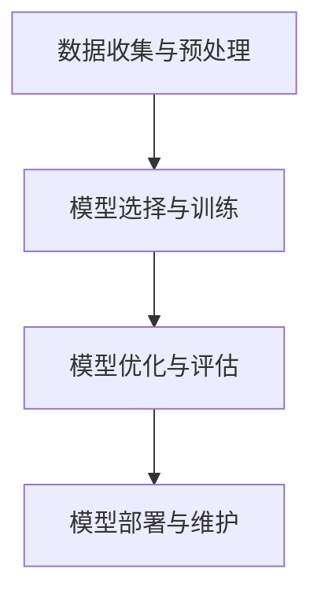
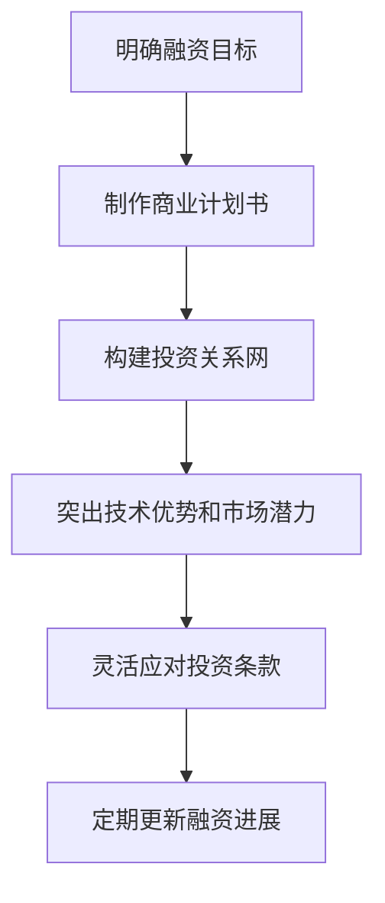
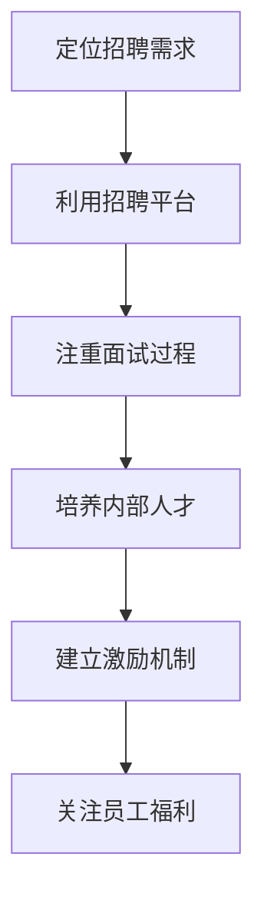

                 

### AI 大模型创业：如何利用用户优势？

#### 关键词：AI 大模型、用户优势、创业、数据驱动、个性化、商业模式

> **摘要**：本文将探讨 AI 大模型创业中的核心问题，即如何充分利用用户优势来推动企业创新和业务增长。我们将从基础理论入手，分析 AI 大模型的核心技术，并逐步深入探讨用户优势的内涵和其在模型构建、优化、应用中的具体应用。在此基础上，我们将结合实际创业案例，分享成功利用用户优势的实践经验和策略，为读者提供切实可行的指导。

在科技迅猛发展的今天，人工智能（AI）已经成为引领行业变革的重要力量。特别是大模型技术的崛起，不仅推动了计算机视觉、自然语言处理等领域的飞速进步，也为各行各业的创新提供了无限可能。然而，AI 大模型的成功不仅仅依赖于强大的计算能力和先进的算法，更需要丰富的数据和用户的积极参与。在这个背景下，如何利用用户优势进行 AI 大模型创业，成为了业界广泛关注的话题。

本文将围绕以下主题展开：

1. **AI 大模型基础知识**：介绍 AI 大模型的基本概念、架构和技术。
2. **用户优势与 AI 大模型**：探讨用户优势在 AI 大模型中的重要性，以及如何利用用户优势构建高性能的 AI 模型。
3. **AI 大模型创业实践**：分析 AI 大模型在不同行业中的应用前景，以及创业中的挑战与应对策略。
4. **创业项目规划**：详细描述创业项目从规划到实施的各个阶段。
5. **创业融资策略与团队建设**：讨论创业过程中如何吸引投资和构建高效团队。
6. **市场推广与风险管理**：分析市场推广策略和创业风险的管理方法。
7. **AI 大模型创业案例研究**：通过具体案例展示如何成功利用用户优势进行 AI 大模型创业。
8. **未来展望与趋势**：展望 AI 大模型创业的未来发展方向。

让我们开始这场深入探讨之旅，揭开 AI 大模型创业的神秘面纱。

### 第一部分：AI 大模型基础知识

#### 第1章：AI 大模型概述

##### 1.1 AI 大模型的概念与定义

AI 大模型，顾名思义，是指那些规模巨大、参数数量庞大的机器学习模型。这些模型通过大规模数据训练，能够自动地从数据中学习复杂的模式，并实现高效的任务执行。相较于传统的机器学习模型，AI 大模型具有以下几个显著特点：

- **规模巨大**：AI 大模型通常包含数十亿到数千亿个参数，这使得它们能够捕捉到更加复杂和细粒度的信息。
- **高度复杂**：由于参数数量庞大，AI 大模型可以处理高维数据，并实现精细化的任务分配。
- **自适应能力强**：通过不断学习和优化，AI 大模型能够适应不同的应用场景和任务需求。
- **数据需求高**：AI 大模型通常需要大量高质量的训练数据，以确保模型的鲁棒性和准确性。

AI 大模型主要分为两大类：自监督学习和迁移学习。

- **自监督学习**：自监督学习是一种无需人工标注数据的学习方式。模型通过利用数据内在的结构信息，如数据分布、重复性等，来自动学习和优化。自监督学习的一个典型例子是BERT（Bidirectional Encoder Representations from Transformers），它通过预训练来学习语言的深层结构。
  
  ```mermaid
  graph TD
  A[自监督学习] --> B{BERT预训练}
  B --> C[学习数据分布]
  C --> D{语言理解能力提升}
  ```

- **迁移学习**：迁移学习是将一个任务中学习到的知识应用于另一个相关任务中。通过迁移学习，可以减少对大量标注数据的依赖，并提高模型在不同领域中的泛化能力。一个著名的迁移学习案例是ImageNet图像分类任务，通过迁移学习，预训练的模型在多个视觉任务中取得了优异的性能。

  ```mermaid
  graph TD
  A[迁移学习] --> B{ImageNet预训练}
  B --> C{多种视觉任务应用}
  C --> D{泛化能力提升}
  ```

##### 1.2 AI 大模型的架构与核心技术

AI 大模型的架构主要包括以下几个关键组成部分：

- **输入层**：输入层负责接收外部数据，如文本、图像、声音等。
- **中间层**：中间层是模型的核心，通过大量的神经网络层进行参数学习和信息提取。
- **输出层**：输出层负责将提取的信息转化为具体的任务输出，如分类标签、翻译结果等。

AI 大模型的训练方法主要分为以下几种：

- **预训练（Pre-training）**：预训练是指在大规模数据集上对模型进行初步训练，以学习通用的特征表示。预训练的目的是为了提高模型的泛化能力。例如，GPT（Generative Pre-trained Transformer）模型通过在大量的文本数据上进行预训练，学习到丰富的语言知识。
  
  ```mermaid
  graph TD
  A[预训练] --> B{GPT模型}
  B --> C[语言理解能力提升]
  ```

- **微调（Fine-tuning）**：微调是指在预训练的基础上，针对具体任务进行进一步训练。通过微调，模型可以针对特定任务进行优化，提高任务性能。例如，在图像分类任务中，可以通过微调预训练的图像识别模型，使其在特定类别上表现更优。
  
  ```mermaid
  graph TD
  A[微调] --> B{图像分类任务}
  B --> C[任务性能提升]
  ```

- **强化学习（Reinforcement Learning）**：强化学习是一种通过试错和反馈进行学习的方法。在 AI 大模型中，强化学习可用于模型的自适应优化和策略学习。例如，在游戏领域，AI 大模型可以通过强化学习实现自我对抗和策略优化，从而提高游戏水平。

  ```mermaid
  graph TD
  A[强化学习] --> B{自我对抗游戏}
  B --> C[策略优化]
  ```

##### 1.3 AI 大模型的评估方法

评估 AI 大模型的效果是衡量模型性能的重要步骤。以下是一些常用的评估方法：

- **准确率（Accuracy）**：准确率是分类模型中最常用的评估指标，表示模型正确分类的样本数占总样本数的比例。尽管准确率简单直观，但它容易受到类别不平衡的影响。

  ```latex
  Accuracy = \frac{TP + TN}{TP + TN + FP + FN}
  ```

- **召回率（Recall）**：召回率表示模型正确识别的正例样本数与实际正例样本数的比例，用于评估模型对正例样本的识别能力。

  ```latex
  Recall = \frac{TP}{TP + FN}
  ```

- **精确率（Precision）**：精确率表示模型正确识别的正例样本数与识别出的正例样本总数（包括正例和负例）的比例，用于评估模型对正例样本的准确识别能力。

  ```latex
  Precision = \frac{TP}{TP + FP}
  ```

- **F1 分数（F1 Score）**：F1 分数是精确率和召回率的调和平均值，用于综合评估模型的性能。

  ```latex
  F1 Score = 2 \times \frac{Precision \times Recall}{Precision + Recall}
  ```

- **ROC 曲线和 AUC 值（ROC Curve and AUC）**：ROC 曲线用于评估模型对正负样本的分类能力，AUC 值表示曲线下的面积，AUC 值越大，模型的分类效果越好。

  ```mermaid
  graph TD
  A[ROC Curve] --> B{AUC Value}
  B --> C{分类能力评估}
  ```

通过上述评估方法，可以全面了解 AI 大模型在不同任务中的表现，为后续优化和改进提供依据。

在接下来的章节中，我们将进一步探讨用户优势在 AI 大模型中的重要性，以及如何利用用户优势构建高性能的 AI 模型。让我们继续保持好奇心，一起探索 AI 大模型创业的无限可能。

### 第二部分：用户优势与 AI 大模型

#### 第2章：用户优势在 AI 大模型中的重要性

##### 2.1 用户优势在 AI 大模型中的重要性

用户优势在 AI 大模型中扮演着至关重要的角色。随着大模型技术的不断进步，如何有效地利用用户数据、交互和反馈，成为决定 AI 模型性能和创业成功的关键因素。用户优势主要体现在以下几个方面：

1. **数据多样性**：用户生成的内容和互动行为提供了丰富多样的数据，这些数据不仅覆盖了各种场景和情境，还反映了用户的个性化需求和行为特征。例如，在社交媒体平台上，用户发布的文字、图片、视频等数据，可以帮助模型更好地理解用户的喜好和兴趣，从而实现个性化的内容推荐。

2. **数据质量**：用户生成的数据通常具有高真实性和高相关性，这些数据可以直接应用于模型的训练和优化。相较于人工标注的数据，用户生成的数据在真实性和多样性上具有明显优势，有助于提高模型的泛化能力和鲁棒性。

3. **互动与反馈**：用户的实时反馈和交互行为，可以用于模型的自适应优化和策略调整。例如，在游戏领域，用户的行为和反馈可以用于调整游戏的难度和玩法，以提高用户体验和留存率。

4. **社区力量**：用户群体的互动和协作，可以形成强大的社区力量，为 AI 模型提供源源不断的数据和创新思路。例如，在开源项目中，用户贡献的代码和测试结果，可以显著提高项目的质量和可靠性。

##### 2.2 如何利用用户优势构建 AI 大模型

为了充分利用用户优势，构建高性能的 AI 大模型，可以从以下几个方面入手：

1. **用户数据的收集与预处理**：首先，需要收集用户生成的大量数据，包括文本、图像、语音等。其次，对数据进行预处理，如去噪、清洗、归一化等，以提高数据的质量和一致性。最后，对数据进行特征提取和编码，以形成适合模型训练的输入格式。

2. **用户交互与反馈机制**：设计有效的用户交互和反馈机制，鼓励用户参与模型训练和优化。例如，可以通过提供个性化推荐、游戏化挑战等方式，激发用户的参与热情。同时，收集用户的反馈和行为数据，用于模型的自适应优化。

3. **用户驱动的模型优化策略**：根据用户的反馈和行为数据，动态调整模型的参数和策略。例如，在图像识别任务中，可以根据用户的标注和反馈，优化模型的分类边界和阈值。此外，还可以利用强化学习等技术，实现模型的自适应学习和优化。

##### 2.2.1 用户数据的收集与预处理

用户数据的收集是构建 AI 大模型的第一步。以下是一个典型的用户数据收集与预处理流程：

1. **数据源选择**：根据应用场景和任务需求，选择合适的用户数据源。例如，在社交媒体平台上，可以选择用户发布的文字、图片、视频等数据。

2. **数据采集**：使用爬虫、API 接口、问卷调查等方式，从数据源中采集用户数据。在数据采集过程中，需要遵守相关法律法规和用户隐私保护要求。

3. **数据清洗**：对采集到的数据进行清洗和预处理，包括去除噪声、去除重复数据、填补缺失值等。例如，对于文本数据，可以使用正则表达式去除 HTML 标签和特殊字符。

4. **数据归一化**：对数据进行归一化处理，以消除不同特征之间的尺度差异。例如，对于图像数据，可以使用归一化操作将像素值缩放到 [0, 1] 的范围。

5. **特征提取**：从预处理后的数据中提取关键特征，形成模型训练的输入格式。例如，对于文本数据，可以使用词袋模型、TF-IDF 等方法提取特征向量。

6. **数据编码**：将提取的特征向量进行编码，以适应深度学习模型的输入要求。例如，可以使用独热编码（One-Hot Encoding）或嵌入编码（Embedding）等方法。

以下是一个简单的伪代码示例，展示了用户数据的收集与预处理过程：

```python
# 假设使用爬虫从网站采集用户数据
import requests
from bs4 import BeautifulSoup

# 采集网页数据
url = "http://example.com"
response = requests.get(url)
html_content = response.text

# 解析网页数据
soup = BeautifulSoup(html_content, 'html.parser')
data = soup.find_all('div', class_='user_content')

# 数据清洗与预处理
cleaned_data = []
for item in data:
    text = item.get_text()
    text = remove_html_tags(text)
    text = remove_special_characters(text)
    cleaned_data.append(text)

# 数据归一化
normalized_data = normalize_data(cleaned_data)

# 特征提取
features = extract_features(normalized_data)

# 数据编码
encoded_data = encode_data(features)
```

通过上述步骤，我们可以获得高质量的用户数据，为后续的模型构建和优化奠定基础。

##### 2.2.2 用户交互与反馈机制

用户交互与反馈机制是充分利用用户优势的关键。以下是一些常见的用户交互与反馈机制：

1. **个性化推荐**：通过分析用户的兴趣和行为，为用户提供个性化的推荐内容。例如，在电商平台上，可以根据用户的浏览历史和购买记录，推荐相关的商品。

2. **游戏化挑战**：通过设计游戏化挑战，鼓励用户积极参与模型训练和优化。例如，在图像识别任务中，可以设计一个“拍照识别”游戏，让用户参与标注和训练。

3. **即时反馈**：在用户完成某个任务后，立即提供反馈，帮助用户了解任务结果和模型表现。例如，在语音识别任务中，可以即时显示识别结果，并提供纠正选项。

4. **社区互动**：通过搭建用户社区，鼓励用户互动和分享经验，形成良好的用户生态系统。例如，在开源项目中，用户可以通过社区反馈和讨论，共同优化项目功能。

以下是一个简单的伪代码示例，展示了用户交互与反馈机制：

```python
# 个性化推荐
def personalized_recommendation(user_profile, item_list):
    recommendations = []
    for item in item_list:
        if is_relevant(item, user_profile):
            recommendations.append(item)
    return recommendations

# 游戏化挑战
def gameified_challenge(user_data, task_list):
    challenge_results = []
    for task in task_list:
        result = user_data.perform_task(task)
        challenge_results.append(result)
    return challenge_results

# 即时反馈
def immediate_feedback(user_result, expected_result):
    if user_result == expected_result:
        print("正确！")
    else:
        print("错误，请重新尝试。")

# 社区互动
def community_interaction(user_posts, community_members):
    for post in user_posts:
        comments = collect_comments(post, community_members)
        print("用户帖子：", post)
        print("评论：", comments)
```

通过设计有效的用户交互与反馈机制，可以激发用户的参与热情，提高模型的训练效果和应用价值。

##### 2.2.3 用户驱动的模型优化策略

用户驱动的模型优化策略是基于用户的反馈和行为数据进行模型调整和优化的方法。以下是一些常见的用户驱动的模型优化策略：

1. **在线学习**：通过在线学习，模型可以实时接收用户的反馈和数据，并不断调整和优化模型参数。例如，在推荐系统中，可以通过在线学习，实时调整推荐算法，提高推荐效果。

2. **强化学习**：通过强化学习，模型可以学习用户的偏好和反馈，并动态调整策略，以实现最优的用户体验。例如，在游戏设计中，可以通过强化学习，动态调整游戏难度和奖励机制。

3. **转移学习**：通过转移学习，模型可以将一个任务中的学习经验应用到另一个相关任务中。例如，在自然语言处理任务中，可以通过转移学习，将通用语言模型的知识应用到特定领域的文本处理任务中。

以下是一个简单的伪代码示例，展示了用户驱动的模型优化策略：

```python
# 在线学习
def online_learning(model, user_data, target_variable):
    for data in user_data:
        model.update_parameters(data, target_variable)
    return model

# 强化学习
def reinforcement_learning(model, environment, reward_function):
    while not environment.is_terminated():
        action = model.select_action()
        reward = reward_function.evaluate_action(action)
        model.update_value_function(action, reward)
    return model

# 转移学习
def transfer_learning(source_model, target_model, source_task, target_task):
    source_experience = source_model.learn_from_experience(source_task)
    target_model.transfer_experience(source_experience, target_task)
    return target_model
```

通过用户驱动的模型优化策略，可以充分利用用户优势，提高模型的性能和应用价值。

在接下来的章节中，我们将继续探讨 AI 大模型创业实践中的具体问题和策略，为创业者在 AI 大模型领域的成功奠定基础。

### 第二部分：AI 大模型创业实践

#### 第3章：AI 大模型创业机会分析

##### 3.1 AI 大模型在不同行业中的应用前景

AI 大模型在各个行业中的应用前景广阔，其强大的数据处理能力和学习能力为传统行业的数字化转型提供了新的可能性。以下是对一些主要行业应用前景的简要分析：

1. **金融行业**：AI 大模型在金融行业中的应用包括风险控制、欺诈检测、信用评估、投资策略优化等。通过分析大量历史数据和实时数据，AI 大模型可以提供更加精准和实时的风险预测，降低金融机构的运营成本和风险。例如，使用 AI 大模型进行贷款审批，可以显著提高审批效率和准确性，降低不良贷款率。

2. **医疗健康**：AI 大模型在医疗健康领域的应用包括疾病诊断、药物研发、个性化医疗等。通过分析患者的病史、基因数据、医学影像等，AI 大模型可以提供更加精准的诊断和治疗方案，提高医疗资源的利用效率。例如，在癌症诊断中，AI 大模型可以通过分析 CT 扫描图像，识别微小的肿瘤病变，提高早期诊断的准确性。

3. **零售行业**：AI 大模型在零售行业中的应用包括商品推荐、库存管理、客户行为分析等。通过分析用户的购买历史、浏览行为等，AI 大模型可以提供个性化的商品推荐，提高用户满意度和购买转化率。例如，在电商平台中，AI 大模型可以根据用户的兴趣和购买行为，推荐相关的商品，提高用户的购物体验。

4. **制造业**：AI 大模型在制造业中的应用包括设备维护、生产优化、供应链管理等。通过实时监控设备状态、分析生产数据，AI 大模型可以预测设备故障、优化生产流程，提高生产效率和产品质量。例如，在工业制造中，AI 大模型可以通过分析传感器数据，预测设备故障，提前进行维护，减少停机时间和生产损失。

5. **教育行业**：AI 大模型在教育行业中的应用包括个性化教学、学习分析、教育资源优化等。通过分析学生的学习行为、考试成绩等，AI 大模型可以提供个性化的学习建议，提高学习效果。例如，在在线教育平台上，AI 大模型可以根据学生的学习进度和薄弱环节，推荐合适的学习资源和练习题。

6. **交通出行**：AI 大模型在交通出行领域中的应用包括路线规划、交通流量预测、智能交通管理等。通过分析交通数据、实时路况等，AI 大模型可以提供更加智能和高效的出行建议，缓解交通拥堵，提高出行效率。例如，在城市交通管理中，AI 大模型可以通过分析实时交通数据，优化交通信号灯的时长和切换，减少交通拥堵。

##### 3.2 AI 大模型创业中的挑战与应对策略

尽管 AI 大模型在各个行业中的应用前景广阔，但在创业过程中仍面临着一系列挑战。以下是一些常见的挑战及其应对策略：

1. **数据获取与隐私保护**：AI 大模型需要大量的高质量数据来训练和优化，但数据的获取往往面临数据源不足、数据质量差、用户隐私保护等问题。应对策略包括：

   - 建立合法的数据采集和共享机制，确保数据的合法性和合规性。
   - 采用数据加密、匿名化等技术，保护用户隐私和数据安全。
   - 与数据提供商合作，获取更多高质量的数据资源。

2. **计算资源需求**：AI 大模型通常需要大量的计算资源进行训练和推理，这对创业公司的计算能力和成本提出了较高要求。应对策略包括：

   - 采用分布式计算和云计算技术，提高计算效率，降低计算成本。
   - 与云服务提供商合作，利用其强大的计算资源，降低自建数据中心的成本。
   - 优化模型结构和算法，减少计算资源的需求。

3. **技术人才短缺**：AI 大模型领域需要大量的技术人才，但人才供给不足，特别是高水平的专业人才。应对策略包括：

   - 与高校和研究机构合作，建立产学研合作机制，培养和引进优秀人才。
   - 提供有竞争力的薪酬和福利待遇，吸引和留住优秀人才。
   - 建立内部培训机制，提升现有员工的专业技能。

4. **商业模式的创新**：AI 大模型创业需要创新商业模式，以实现可持续的商业增长。应对策略包括：

   - 探索多元化的商业模式，如产品销售、服务订阅、广告分成等。
   - 定位细分市场，提供定制化的解决方案，提高客户满意度。
   - 加强品牌建设，提升产品和服务的影响力。

5. **法规与伦理挑战**：AI 大模型的应用涉及伦理和法律问题，如数据滥用、隐私泄露、算法歧视等。应对策略包括：

   - 严格遵守相关法律法规，确保数据的合法合规使用。
   - 建立伦理审查机制，确保 AI 应用符合道德和伦理标准。
   - 加强社会责任感，积极参与行业标准和法规的制定。

通过应对上述挑战，AI 大模型创业公司可以在激烈的市场竞争中脱颖而出，实现可持续发展。在接下来的章节中，我们将深入探讨 AI 大模型创业项目规划，为创业者提供具体的实施指南。

### 第4章：AI 大模型创业项目规划

##### 4.1 创业项目概述

在进入 AI 大模型创业之前，明确项目目标和愿景至关重要。创业项目概述应包括以下几个方面：

- **项目目标**：定义项目的核心目标和愿景，如提高医疗诊断的准确性、优化供应链管理、提供个性化教育服务等。明确目标有助于集中资源和力量，确保项目的方向正确。
- **应用领域**：确定 AI 大模型将应用于哪个行业或领域，如金融、医疗、零售、教育等。不同的领域对模型的要求和应用场景各不相同，需要针对性的技术方案和策略。
- **技术方案**：描述实现项目目标所需的技术方案，包括 AI 大模型的架构、算法、数据处理流程等。详细的技术方案有助于项目团队了解整个项目的实现路径，提高项目的成功率。
- **市场定位**：明确项目的市场定位，如目标客户群体、市场规模、竞争对手等。市场定位有助于项目团队了解市场需求，制定有效的市场推广策略。
- **预期成果**：定义项目的预期成果，如产品发布时间表、业务增长指标、用户反馈等。预期成果有助于项目团队评估项目进展，确保项目按计划进行。

以下是一个简化的创业项目概述示例：

**项目名称**：智能医疗诊断平台

**项目目标**：利用 AI 大模型技术，提高疾病诊断的准确性，为医生和患者提供高效的医疗诊断服务。

**应用领域**：医疗健康

**技术方案**：基于深度学习和转移学习技术，构建一个多模态 AI 大模型，结合医学影像和患者病史数据，实现疾病的自动诊断。

**市场定位**：针对大型医院和诊所，提供高效、精准的医疗诊断服务，提高医疗资源的利用效率。

**预期成果**：在项目实施后的一年内，实现产品的商业化落地，服务超过 100 家医疗机构，诊断准确率达到 95% 以上。

##### 4.2 技术方案设计

技术方案设计是创业项目的核心部分，需要详细规划从数据收集、预处理到模型训练、优化的全过程。以下是一个基于智能医疗诊断平台的技术方案设计：

1. **数据收集与预处理**

   - **数据源**：收集多种类型的数据，包括医学影像（如 CT、MRI）、患者病史（如实验室检查结果、手术记录）和电子病历等。
   - **数据预处理**：对收集到的数据进行清洗、归一化和特征提取。例如，对医学影像数据进行去噪、分割和标注，对电子病历数据进行数据清洗和结构化处理。
   - **数据处理流程**：设计数据处理流程，包括数据采集、预处理、存储和管理。使用分布式数据处理框架（如 Hadoop、Spark）提高数据处理效率。

2. **模型选择与训练**

   - **模型架构**：选择适合医疗诊断任务的 AI 大模型架构，如基于 Transformer 的多模态模型，结合文本、图像和音频数据。
   - **模型训练**：使用大规模医疗数据集对模型进行训练。采用迁移学习技术，利用已有的大规模预训练模型，提高模型训练效率和性能。
   - **训练策略**：设计自适应的模型训练策略，如学习率调整、正则化、Dropout 等，提高模型训练的收敛速度和稳定性。

3. **模型优化与评估**

   - **模型优化**：根据模型训练结果和用户反馈，对模型进行优化和调整。使用强化学习等技术，自适应调整模型参数，提高诊断准确率。
   - **模型评估**：设计多种评估指标（如准确率、召回率、F1 分数等），对模型进行全面的性能评估。通过交叉验证和外部数据集测试，确保模型具有良好的泛化能力。

4. **模型部署与维护**

   - **模型部署**：将训练好的模型部署到生产环境，提供实时诊断服务。采用容器化技术（如 Docker、Kubernetes）实现模型的快速部署和运维。
   - **模型维护**：定期更新模型和数据，适应新的医疗诊断需求。采用在线学习技术，实时接收用户反馈和数据，持续优化模型性能。

以下是一个简化的技术方案设计流程图：



通过详细的技术方案设计，项目团队可以明确实现项目的具体路径和方法，提高项目的可操作性和成功率。

在接下来的章节中，我们将继续探讨 AI 大模型创业过程中的融资策略、团队建设和市场推广，为创业者的成功提供更多实践指导。

### 第5章：AI 大模型创业融资策略

在 AI 大模型创业过程中，融资策略至关重要。合理的融资策略可以帮助企业获取足够的资金，支持技术研发、市场拓展和团队建设，从而提高创业成功的可能性。以下是一些常见的融资渠道和策略：

##### 5.1 常见融资渠道

1. **天使投资**：天使投资是指个人投资者对初创企业的早期投资。天使投资者通常对创业项目具有深厚的行业背景和资源，可以为项目提供资金、经验和人脉支持。在 AI 大模型创业中，天使投资是一种常见的融资方式，特别是在项目早期阶段。

2. **风险投资**：风险投资（Venture Capital，VC）是指专业投资机构对具有高成长潜力的初创企业进行投资。风险投资通常关注技术创新和市场需求，愿意承担较高的风险以获取更高的回报。在 AI 大模型创业中，风险投资是企业获取大规模资金的重要途径。

3. **政府资助**：许多国家和地区都提供了针对科技创新和创业的政府资助项目。这些资助项目包括创业补贴、税收优惠、科研经费等，有助于减轻企业的资金压力。企业可以通过申请政府资助，获得额外的资金支持。

4. **银行贷款**：企业可以通过银行贷款获取资金。银行贷款通常具有较低的利率，但需要满足一定的条件，如良好的信用记录、可靠的担保等。

5. **股权众筹**：股权众筹是指企业通过互联网平台向公众募集资金，投资者购买企业的股份。股权众筹有助于企业快速筹集资金，同时扩大品牌影响力。在 AI 大模型创业中，股权众筹可以作为一种补充融资手段。

##### 5.2 融资策略

1. **明确融资目标**：在融资前，企业需要明确融资目标，包括融资额度、资金用途和预期回报。明确融资目标有助于投资者了解企业的资金需求和未来规划，提高融资成功率。

2. **制作详细的商业计划书**：商业计划书是企业向投资者展示项目价值和前景的重要文件。在商业计划书中，企业应详细阐述项目的市场定位、技术方案、商业模式、团队组成、融资用途和预期收益等。高质量的商业计划书可以提高投资者的信任度和兴趣。

3. **构建投资关系网**：建立良好的投资关系网对于融资成功至关重要。企业可以通过参加行业会议、创业大赛、投资沙龙等活动，结识潜在投资者和风险投资机构。同时，利用现有合作伙伴和行业资源，拓展投资渠道。

4. **突出技术优势和市场潜力**：在融资过程中，企业需要突出自身的技术优势和市场潜力，以吸引投资者的关注。例如，介绍 AI 大模型的技术原理、应用场景和竞争优势，展示项目在技术和市场方面的领先地位。

5. **灵活应对投资条款**：在谈判过程中，企业需要灵活应对投资条款，包括投资额度、股权分配、投资周期等。在确保企业利益的前提下，适当让步和妥协，以提高融资成功率。

6. **定期更新融资进展**：在融资过程中，企业需要定期向投资者更新项目进展和财务状况，保持透明和诚信。及时反馈有助于建立良好的投资者关系，提高后续融资的可能性。

以下是一个简化的融资策略流程图：



通过合理的融资策略，企业可以有效地筹集资金，支持 AI 大模型创业项目的顺利推进。在接下来的章节中，我们将探讨 AI 大模型创业过程中的团队建设问题，为创业者的成功提供更多指导。

### 第6章：AI 大模型创业团队建设

在 AI 大模型创业过程中，团队建设是确保项目成功的关键因素之一。一个高效、专业的团队可以充分发挥每个人的优势，共同应对挑战，推动项目的持续发展。以下是一些关键步骤和策略：

##### 6.1 团队核心成员的角色与职责

一个成功的 AI 大模型创业团队通常包括以下几个核心成员：

1. **创始人**：创始人通常是团队的核心领袖，负责制定项目愿景、战略规划和日常运营。创始人需要具备强烈的创业精神和领导能力，能够激励和凝聚团队成员。

2. **首席技术官（CTO）**：CTO 负责技术方向和研发工作，确保技术方案的可行性和创新性。CTO 通常具备丰富的技术背景和行业经验，能够带领团队解决技术难题。

3. **数据科学家**：数据科学家负责设计、训练和优化 AI 大模型，确保模型的性能和准确性。数据科学家需要具备强大的数据处理能力和算法设计能力。

4. **产品经理**：产品经理负责产品规划、设计和迭代，确保产品满足市场需求和用户期望。产品经理需要与用户紧密沟通，了解用户需求，制定合理的产品路线图。

5. **工程师**：工程师负责实现产品的技术方案，包括数据预处理、模型部署和系统维护。工程师需要具备扎实的技术基础和良好的编码习惯。

6. **市场与销售团队**：市场与销售团队负责推广产品、开拓市场和实现销售目标。市场团队需要制定有效的市场推广策略，销售团队需要建立客户关系，提升销售额。

##### 6.2 招聘与培养优秀人才

招聘和培养优秀人才是团队建设的关键环节。以下是一些策略和建议：

1. **精准定位招聘需求**：在招聘过程中，明确每个职位的具体要求和职责，确保招聘到适合的人才。例如，对于数据科学家，需要考察其数据分析能力、算法设计和项目经验。

2. **利用专业招聘平台**：利用专业招聘平台和社交媒体，发布招聘信息，吸引更多的求职者。例如，LinkedIn、GitHub、Stack Overflow 等平台都有大量的技术人才。

3. **注重面试过程**：面试过程中，除了考察专业技能，还需要关注求职者的团队合作能力、沟通能力和解决问题的能力。可以设置技术挑战、团队合作项目和情景模拟等环节，全面评估求职者的能力。

4. **培养内部人才**：内部培养是提升团队整体素质的重要手段。通过内部培训、项目轮岗和跨部门合作等方式，提升员工的技能和综合素质。

5. **建立激励机制**：建立合理的激励机制，鼓励员工积极参与项目，提高工作效率和创新能力。例如，设立绩效奖金、股权激励等。

6. **关注员工福利**：关注员工福利和工作环境，提高员工满意度和忠诚度。提供灵活的工作时间、完善的福利制度和良好的办公环境，有助于留住优秀人才。

以下是一个简化的团队建设流程图：



通过有效的团队建设，企业可以打造一支高效、专业的团队，为 AI 大模型创业项目的成功奠定坚实基础。在接下来的章节中，我们将探讨如何通过市场推广策略，将 AI 大模型创业项目推向市场，赢得用户和客户的认可。

### 第7章：AI 大模型创业市场推广

市场推广是 AI 大模型创业过程中至关重要的一环，它关系到项目的知名度、用户获取和市场份额。一个成功的市场推广策略能够有效地将产品或服务传达给潜在用户，提高品牌影响力，从而推动业务增长。以下是一些关键策略：

##### 7.1 市场定位与目标用户分析

1. **市场定位**：市场定位是市场推广的基础，需要明确项目的独特价值和目标市场。例如，针对医疗诊断领域的 AI 大模型，可以将市场定位为大型医院和诊所，提供高效、精准的诊断服务。

2. **目标用户分析**：了解目标用户的需求、行为和偏好，有助于制定针对性的市场推广策略。例如，对于医疗诊断领域的用户，可以分析其专业背景、工作经验和需求场景，从而制定更精准的市场推广内容。

   - **用户画像**：通过问卷调查、用户访谈和数据分析等方式，构建目标用户的画像。例如，一个典型的目标用户可能是：具有多年临床经验的内科医生，经常使用医疗诊断工具，对新技术有较高的接受度。

   - **需求分析**：深入了解目标用户的需求，如提高诊断准确性、节省诊断时间、降低医疗成本等。针对这些需求，可以制定相应的市场推广策略。

   - **行为分析**：分析目标用户的行为模式，如使用习惯、消费习惯、社交媒体使用情况等。这些数据有助于制定更有效的市场推广渠道和内容。

##### 7.2 市场推广策略

1. **线上推广**

   - **搜索引擎优化（SEO）**：通过优化网站内容和结构，提高在搜索引擎中的排名，吸引潜在用户访问。例如，针对医疗诊断领域的 AI 大模型，可以优化与关键词相关的页面，提高在 Google 和百度等搜索引擎中的搜索排名。

   - **社交媒体营销**：利用社交媒体平台（如微博、微信公众号、LinkedIn 等），发布有价值的内容，与用户互动，建立品牌知名度。例如，可以发布关于 AI 大模型在医疗诊断领域应用的研究报告、案例分享和用户访谈等内容。

   - **内容营销**：通过博客、电子书、白皮书等高质量内容，提供有价值的信息，吸引潜在用户。例如，可以撰写关于 AI 大模型在医疗诊断中的优势和挑战的文章，分享成功案例和用户反馈。

   - **在线广告**：通过 Google AdWords、百度推广等在线广告平台，针对目标用户进行精准广告投放。例如，可以在搜索结果中投放与医疗诊断相关的广告，提高点击率和转化率。

2. **线下推广**

   - **行业会议和展会**：参加行业会议和展会，与潜在用户和合作伙伴面对面交流，展示产品和服务。例如，可以参加医疗健康行业的国际会议、展览等，展示 AI 大模型在医疗诊断中的应用。

   - **学术合作与交流**：与学术机构和高校建立合作关系，共同进行技术研究和推广。例如，可以与医学院校合作，开展 AI 大模型在疾病诊断中的研究项目，并邀请专家进行讲座和研讨会。

   - **线下活动**：举办线下活动，如技术沙龙、用户交流会、产品发布会等，吸引潜在用户参与。例如，可以邀请行业专家、医疗专业人士和潜在用户参加活动，展示产品和服务，收集用户反馈。

##### 7.2.1 线上推广

1. **搜索引擎优化（SEO）**

   - **关键词优化**：分析目标用户搜索习惯，确定核心关键词，并将其优化到网站内容中。例如，针对医疗诊断领域的 AI 大模型，可以将关键词优化到网站首页、产品介绍页和博客文章中。

   - **内容优化**：创建高质量、与关键词相关的内容，提高网站的权威性和可信度。例如，撰写关于 AI 大模型在医疗诊断中应用的文章，分享成功案例和用户反馈。

   - **链接建设**：通过外部链接（如行业网站、博客、论坛等）提高网站的权重和排名。例如，与其他医疗健康领域的网站建立合作关系，互相链接。

2. **社交媒体营销**

   - **内容策略**：制定社交媒体内容策略，定期发布有价值的内容，吸引粉丝和潜在用户。例如，发布关于 AI 大模型在医疗诊断中的应用案例、研究进展和行业动态。

   - **互动营销**：与粉丝和潜在用户互动，建立良好的品牌形象。例如，回复用户评论和私信，解答用户疑问，提升用户满意度。

   - **社交媒体广告**：利用社交媒体广告平台，针对目标用户进行精准广告投放。例如，在微信朋友圈、微博和 LinkedIn 上投放医疗诊断相关的广告。

3. **内容营销**

   - **博客文章**：创建博客文章，分享关于 AI 大模型在医疗诊断领域的见解、研究和案例。例如，撰写关于如何利用 AI 大模型提高诊断准确率、如何解决医疗资源分配不均等问题。

   - **电子书与白皮书**：制作电子书和白皮书，提供深入的技术分析、市场研究和案例分享。例如，发布关于 AI 大模型在医疗健康领域应用的前景和挑战的报告。

   - **视频内容**：制作视频内容，如产品演示、用户访谈、案例分析等，通过视觉化的方式传达产品价值。例如，制作 AI 大模型在医疗诊断中应用的视频，展示产品如何帮助医生提高诊断准确率。

##### 7.2.2 线下推广

1. **行业会议和展会**

   - **展位宣传**：在行业会议和展会中设立展位，展示产品和服务，发放宣传资料，吸引潜在客户。例如，展示 AI 大模型在医疗诊断中的实际应用，提供现场演示和互动体验。

   - **演讲和研讨会**：邀请行业专家和潜在用户参加演讲和研讨会，分享 AI 大模型在医疗诊断中的应用经验和研究成果。例如，组织一场关于 AI 大模型在医疗诊断中的前沿技术的研讨会，邀请医生、研究人员和行业专家发表演讲。

   - **合作伙伴交流**：与行业合作伙伴进行交流，建立合作关系，共同推广产品和服务。例如，与医疗器械公司合作，共同开发医疗诊断解决方案。

2. **学术合作与交流**

   - **合作研究**：与学术机构和高校合作，共同进行技术研究和项目开发。例如，与医学院校合作，开展关于 AI 大模型在疾病诊断中的应用研究。

   - **学术交流**：邀请学术专家和研究人员参加学术会议和研讨会，分享研究成果和经验。例如，参加医学学术会议，展示 AI 大模型在医疗诊断中的应用案例。

   - **学术合作项目**：建立学术合作项目，共同申请科研经费和项目支持。例如，与高校合作，申请关于 AI 大模型在医疗诊断中的科研项目。

3. **线下活动**

   - **产品发布会**：举办产品发布会，向潜在客户和合作伙伴展示最新产品和服务。例如，发布一款全新的 AI 大模型医疗诊断工具，邀请医生、研究人员和行业专家参加。

   - **用户交流会**：组织用户交流会，与现有用户分享产品更新和成功案例，收集用户反馈和建议。例如，举办一场关于 AI 大模型在医疗诊断中的用户交流会，邀请医生、护士和患者代表参加。

   - **技术沙龙**：举办技术沙龙，邀请行业专家和潜在用户进行技术交流和讨论。例如，组织一场关于 AI 大模型在医疗诊断中的技术沙龙，邀请医生、研究人员和 IT 专家参加。

通过线上线下结合的市场推广策略，AI 大模型创业项目可以有效地提高品牌知名度，吸引潜在用户，实现业务增长。在接下来的章节中，我们将探讨如何管理创业过程中的风险，确保项目的稳定发展。

### 第8章：AI 大模型创业风险管理

在 AI 大模型创业过程中，风险管理至关重要。有效的风险管理可以帮助企业识别潜在风险、制定应对策略，从而确保项目的稳定发展。以下是一些常见风险类型及其管理方法：

##### 8.1 技术风险

技术风险是 AI 大模型创业过程中最常见的一种风险，主要包括以下方面：

1. **技术可行性风险**：AI 大模型项目可能面临技术上的可行性风险，如算法选择不当、数据处理困难等。管理方法：

   - **技术预研**：在项目启动前，进行充分的技术预研，评估技术的可行性和可行性。
   - **技术迭代**：采用敏捷开发方法，快速迭代和优化技术方案，确保技术可行性。

2. **技术更新风险**：AI 领域技术更新速度快，项目可能面临技术过时的风险。管理方法：

   - **持续学习**：鼓励团队成员持续学习最新技术，保持技术竞争力。
   - **开放合作**：与高校、研究机构等合作，共同开展前沿技术研究。

##### 8.2 数据风险

数据风险主要涉及数据质量、数据隐私和数据合规等方面。管理方法：

1. **数据质量管理**：确保数据的质量和准确性，避免数据异常对模型性能的影响。管理方法：

   - **数据清洗**：对数据进行预处理，去除噪声和异常值。
   - **数据验证**：定期验证数据质量，确保数据符合预期。

2. **数据隐私保护**：遵守相关法律法规，保护用户隐私。管理方法：

   - **数据加密**：采用数据加密技术，确保数据在传输和存储过程中的安全性。
   - **隐私政策**：明确告知用户数据的使用目的和范围，获取用户同意。

3. **数据合规性**：确保数据处理和使用的合规性，避免法律风险。管理方法：

   - **合规培训**：对团队成员进行合规培训，提高合规意识。
   - **法律咨询**：聘请专业律师提供法律咨询，确保合规性。

##### 8.3 市场风险

市场风险主要包括市场需求变化、竞争对手行为和行业政策调整等方面。管理方法：

1. **市场需求变化**：及时关注市场需求变化，调整产品策略。管理方法：

   - **市场调研**：定期进行市场调研，了解用户需求和行业趋势。
   - **产品迭代**：快速响应市场需求，持续迭代产品。

2. **竞争对手行为**：分析竞争对手的行为和策略，制定应对策略。管理方法：

   - **竞争分析**：定期分析竞争对手的产品、市场和策略，制定针对性的应对措施。
   - **差异化策略**：突出产品或服务的独特优势，建立品牌差异化。

3. **行业政策调整**：关注行业政策调整，确保业务的合规性和稳定性。管理方法：

   - **政策研究**：关注相关政策动态，了解政策对业务的影响。
   - **合规调整**：根据政策要求，及时调整业务策略和操作流程。

##### 8.4 财务风险

财务风险主要包括资金链断裂、成本超支和收益不达标等方面。管理方法：

1. **资金链管理**：确保充足的资金储备，避免资金链断裂。管理方法：

   - **现金流管理**：制定详细的现金流预算，确保现金流稳定。
   - **多渠道融资**：探索多种融资渠道，确保资金来源多样化。

2. **成本控制**：合理控制成本，避免成本超支。管理方法：

   - **成本分析**：定期进行成本分析，找出成本控制和优化的机会。
   - **预算管理**：制定详细的预算计划，严格控制成本支出。

3. **收益管理**：确保业务收益稳定，实现可持续发展。管理方法：

   - **收益预测**：制定详细的收益预测模型，确保业务收益的稳定性。
   - **业务拓展**：探索新的业务领域和市场，增加业务收入。

通过有效的风险管理，AI 大模型创业企业可以降低风险，确保业务的稳定和可持续发展。在接下来的章节中，我们将通过具体案例研究，展示如何成功利用用户优势进行 AI 大模型创业。

### 第9章：AI 大模型创业案例研究

在 AI 大模型创业领域，有许多成功的案例可以作为参考。这些案例展示了如何通过创新的技术和有效的市场策略，成功利用用户优势实现商业成功。以下是一个具体案例研究，分析了一家成功利用用户优势的 AI 大模型创业公司——OpenAI。

#### 案例研究：OpenAI

**背景**：

OpenAI 是一家总部位于美国的人工智能研究公司，成立于 2015 年，由山姆·柯曼（Sam Altman）、克里斯托弗·李昂纳德（Chris Olah）等人工智能领域专家共同创立。公司致力于通过研究、开发和推广人工智能技术，推动人类社会的进步。

**核心技术**：

OpenAI 的核心技术是大型深度学习模型，特别是生成式预训练 Transformer 模型（GPT）。GPT 模型通过在大规模数据集上进行预训练，学习到语言的深层结构和语义信息，从而在自然语言处理任务中取得了显著的成绩。OpenAI 还开发了分布式训练和推理框架，如GAN（Generative Adversarial Networks），以提高模型训练效率和性能。

**用户优势的利用**：

1. **用户数据的收集与预处理**：

   OpenAI 利用用户生成的大量数据，包括社交媒体文本、新闻文章、书籍等，进行数据收集和预处理。通过对数据进行清洗、去噪和特征提取，OpenAI 获得了高质量的训练数据，为模型的训练提供了丰富的素材。

   ```mermaid
   graph TD
   A[用户数据收集] --> B[数据预处理]
   B --> C[高质量训练数据]
   ```

2. **用户交互与反馈机制**：

   OpenAI 通过提供开放平台和 API 接口，鼓励开发者使用 GPT 模型进行创新和应用。用户在应用过程中提供了宝贵的反馈，包括模型性能评估、错误报告和优化建议。OpenAI 及时收集和分析了这些反馈，用于模型优化和改进。

   ```mermaid
   graph TD
   A[用户交互] --> B[反馈机制]
   B --> C[模型优化]
   ```

3. **用户驱动的模型优化策略**：

   OpenAI 采用用户驱动的模型优化策略，通过在线学习、迁移学习和强化学习等技术，不断调整和优化 GPT 模型。例如，通过分析用户在不同任务中的输入和输出，OpenAI 优化了模型的参数和算法，提高了模型在不同应用场景中的表现。

   ```mermaid
   graph TD
   A[在线学习] --> B[迁移学习]
   B --> C[强化学习]
   ```

**创业成果**：

1. **产品和服务**：

   OpenAI 开发了多个基于 GPT 模型的产品和服务，如自然语言处理 API、聊天机器人、文本生成工具等。这些产品广泛应用于企业、开发者和研究机构，为企业提供了强大的 AI 助手。

   ```mermaid
   graph TD
   A[自然语言处理 API] --> B[聊天机器人]
   B --> C[文本生成工具]
   ```

2. **商业成功**：

   OpenAI 在创业过程中吸引了大量投资者的关注，并获得了巨额融资。公司估值持续攀升，成为人工智能领域的领军企业。此外，OpenAI 的成功案例激励了更多创业者投身于 AI 大模型创业领域。

   ```mermaid
   graph TD
   A[巨额融资] --> B[公司估值攀升]
   B --> C[创业激励]
   ```

通过上述案例，我们可以看到，OpenAI 成功利用用户优势，通过大规模数据收集、用户交互和反馈机制，以及用户驱动的模型优化策略，实现了商业成功。以下是对 OpenAI 案例的总结和启示：

**总结**：

1. **用户数据的收集与预处理**：OpenAI 通过大规模数据收集和高质量数据预处理，为模型训练提供了丰富的素材。
2. **用户交互与反馈机制**：OpenAI 通过开放平台和 API 接口，鼓励用户参与模型训练和优化，提高了模型性能。
3. **用户驱动的模型优化策略**：OpenAI 采用在线学习、迁移学习和强化学习等技术，不断优化模型，实现了商业成功。

**启示**：

1. **充分利用用户数据**：创业者应积极收集和利用用户数据，提高模型性能和应用价值。
2. **建立用户互动机制**：创业者应设计有效的用户交互和反馈机制，鼓励用户参与模型训练和优化。
3. **用户驱动的创新**：创业者应采用用户驱动的创新策略，根据用户需求和反馈，不断调整和优化模型和应用。

通过学习 OpenAI 的成功经验，创业者可以在 AI 大模型创业领域找到更多的发展机会，实现商业成功。

### 第10章：未来展望与趋势

#### 10.1 AI 大模型创业的未来趋势

随着 AI 大模型技术的不断发展和成熟，未来 AI 大模型创业将呈现以下趋势：

1. **跨领域应用**：AI 大模型将在更多领域得到应用，如生物医疗、金融服务、教育、智能制造等。不同领域之间的融合将推动 AI 大模型的创新和进步。
2. **个性化服务**：基于用户数据和个人偏好，AI 大模型将实现更加个性化的服务，满足用户多元化的需求。个性化推荐、个性化医疗、个性化教育等领域将得到快速发展。
3. **自动化与智能化**：AI 大模型将进一步提升自动化和智能化水平，实现更高效的生产、管理和运营。自动化决策、智能诊断、智能交通等领域将得到广泛应用。
4. **边缘计算与云计算结合**：随着 5G 和边缘计算技术的发展，AI 大模型将实现云计算和边缘计算的有机结合，提高数据处理和响应速度，满足实时性和低延迟的需求。

#### 10.2 技术进步对创业机会的影响

技术进步将为 AI 大模型创业带来新的机会和挑战：

1. **算法创新**：随着深度学习、强化学习等算法的不断发展，创业者可以利用这些先进算法，开发出更高效、更智能的 AI 大模型应用。
2. **数据资源**：随着大数据技术和物联网的发展，创业者可以获取更多的数据资源，提高模型训练的质量和效率。
3. **计算能力提升**：随着云计算、分布式计算和边缘计算的发展，创业者可以更高效地利用计算资源，降低计算成本，提高模型性能。
4. **用户体验优化**：随着人工智能技术的发展，创业者可以提供更自然、更智能的用户交互体验，提高用户满意度和粘性。

#### 10.3 用户优势在 AI 大模型中的应用前景

用户优势在 AI 大模型中的应用前景广阔：

1. **个性化推荐**：用户数据将帮助 AI 大模型实现更精准的个性化推荐，提高用户体验和满意度。
2. **智能诊断与预测**：基于用户数据，AI 大模型可以提供更加准确的诊断和预测服务，如医疗诊断、风险预测等。
3. **智能客服与支持**：用户交互数据将用于优化智能客服系统，提高客户服务质量和效率。
4. **内容创作与生成**：用户创作和反馈数据将用于生成个性化内容和创意，如艺术作品、音乐、文学作品等。

### 结论

AI 大模型创业是一个充满机遇和挑战的领域。通过充分利用用户优势，创业者可以构建高性能、个性化的 AI 大模型，推动业务创新和增长。未来，随着技术的不断进步，AI 大模型创业将迎来更多的发展机遇。创业者应密切关注技术动态，积极创新，不断提高模型性能和应用价值，实现商业成功。

### 附录 A：常用工具与资源

- **数据集**：ImageNet、CIFAR-10、Kaggle
- **框架**：TensorFlow、PyTorch、Keras
- **云计算平台**：AWS、Azure、Google Cloud
- **数据预处理工具**：Pandas、NumPy、Scikit-learn
- **文本处理工具**：NLTK、spaCy
- **数据可视化工具**：Matplotlib、Seaborn、Plotly
- **开源库**：TensorFlow Probability、PyTorch Lightning

### 附录 B：AI 大模型创业常用术语解释

- **AI 大模型**：规模巨大、参数数量庞大的机器学习模型。
- **自监督学习**：无需人工标注数据的学习方式，利用数据内在的结构信息来自动学习和优化。
- **迁移学习**：将一个任务中学习到的知识应用于另一个相关任务中。
- **预训练**：在大规模数据集上对模型进行初步训练，以提高模型的泛化能力。
- **微调**：在预训练的基础上，针对具体任务进行进一步训练。
- **强化学习**：通过试错和反馈进行学习的方法。
- **分布式计算**：将计算任务分布到多个计算节点上，提高计算效率。
- **边缘计算**：在靠近数据源的地方进行计算和处理，降低延迟和提高响应速度。

### 附录 C：参考文献与推荐阅读

- Goodfellow, I., Bengio, Y., & Courville, A. (2016). *Deep Learning*. MIT Press.
- LeCun, Y., Bengio, Y., & Hinton, G. (2015). *Deep learning*. Nature, 521(7553), 436-444.
- Russell, S., & Norvig, P. (2020). *Artificial Intelligence: A Modern Approach*. Prentice Hall.
- Simonyan, K., & Zisserman, A. (2014). *Very deep convolutional networks for large-scale image recognition*. arXiv preprint arXiv:1409.1556.
- BERT: Bidirectional Encoder Representations from Transformers (2018). *arXiv preprint 1810.04805*.

---

### 作者

**作者：**AI 天才研究院/AI Genius Institute & 禅与计算机程序设计艺术/Zen And The Art of Computer Programming

---

通过本文的深入探讨，我们不仅了解了 AI 大模型的基础知识和用户优势的重要性，还通过实际的创业案例，展示了如何充分利用用户优势进行 AI 大模型创业。希望这篇文章能够为您的 AI 大模型创业之路提供有价值的参考和启示。在未来的 AI 大模型创业中，让我们继续探索、创新，共同推动人工智能技术的发展和进步。

