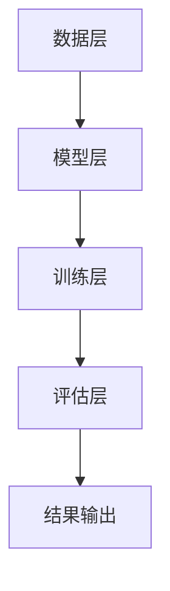
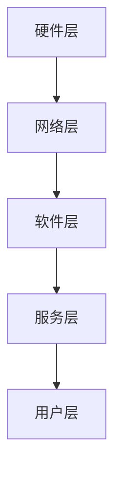
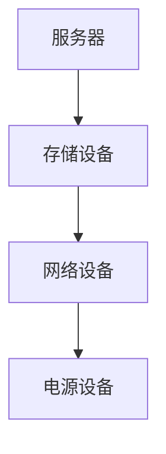
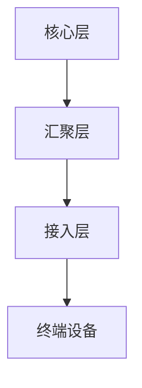
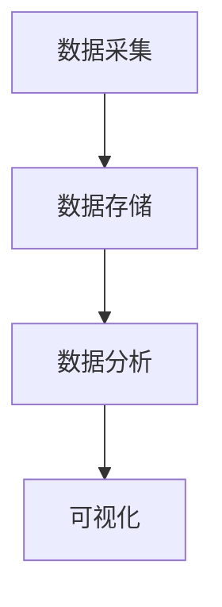
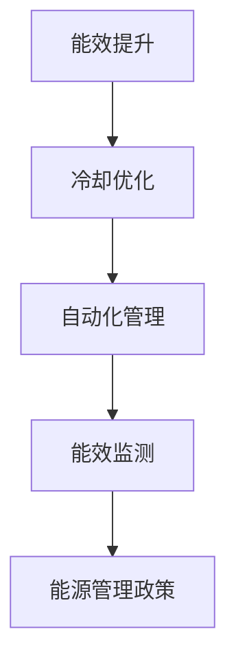
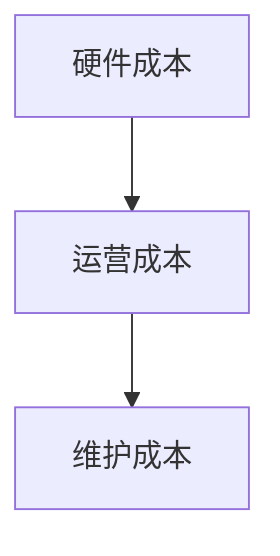
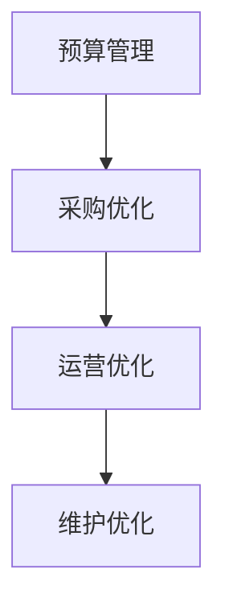
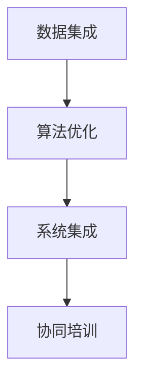

                 

### 《AI大模型应用数据中心建设：数据中心成本优化》

关键词：AI大模型、数据中心、成本优化、能耗管理、协同优化

摘要：
本文旨在探讨AI大模型应用数据中心的建设，特别是数据中心成本的优化问题。随着AI大模型的应用越来越广泛，数据中心的能耗和成本成为重要的考虑因素。本文将介绍AI大模型的基础知识，数据中心的基本架构和能耗管理，并深入分析数据中心成本优化的策略和实战案例。此外，还将探讨AI大模型与数据中心协同优化的策略，以及如何通过AI技术实现数据中心能耗和成本的进一步优化。

## 目录大纲

### 第一部分：基础理论

#### 第1章：AI大模型概述
- 1.1 AI大模型定义
- 1.2 AI大模型的技术特点
- 1.3 AI大模型的技术架构
- 1.4 AI大模型的发展历程

#### 第2章：数据中心基础
- 2.1 数据中心概述
- 2.2 数据中心架构
- 2.3 数据中心硬件设备
- 2.4 数据中心网络

#### 第3章：数据中心能耗管理
- 3.1 数据中心能耗问题
- 3.2 数据中心能耗监控
- 3.3 数据中心能耗优化策略

#### 第4章：数据中心成本优化
- 4.1 数据中心成本构成
- 4.2 数据中心成本控制方法
- 4.3 数据中心成本优化案例分析

#### 第5章：AI大模型与数据中心协同优化
- 5.1 AI大模型与数据中心协同的重要性
- 5.2 AI大模型在数据中心中的应用
- 5.3 数据中心与AI大模型协同优化策略

### 第二部分：实践应用

#### 第6章：数据中心能耗管理实战
- 6.1 数据中心能耗管理项目介绍
- 6.2 数据中心能耗管理项目实施步骤
- 6.3 数据中心能耗管理项目效果评估

#### 第7章：数据中心成本优化实战
- 7.1 数据中心成本优化项目介绍
- 7.2 数据中心成本优化项目实施步骤
- 7.3 数据中心成本优化项目效果评估

#### 第8章：AI大模型与数据中心协同优化实战
- 8.1 AI大模型与数据中心协同优化项目介绍
- 8.2 AI大模型与数据中心协同优化项目实施步骤
- 8.3 AI大模型与数据中心协同优化项目效果评估

### 第三部分：附录

#### 附录A：常用工具与技术
- A.1 常用数据中心能耗管理工具
- A.2 常用数据中心成本优化工具
- A.3 常用AI大模型开发工具

#### 附录B：参考文献
- B.1 数据中心建设与优化相关书籍
- B.2 AI大模型相关书籍
- B.3 数据中心与AI大模型协同优化相关论文

### 第一部分：基础理论

#### 第1章：AI大模型概述

##### 1.1 AI大模型定义

AI大模型是指具有极高参数数量和复杂结构的深度学习模型，它们能够通过学习大量数据来捕捉数据中的复杂模式和规律。AI大模型通常包含数十亿甚至数千亿的参数，这使得它们在处理大规模数据和复杂任务时表现出强大的能力。

##### 1.2 AI大模型的技术特点

- **高参数量**：大模型具有数百万到数十亿个参数，这使得它们能够捕捉到数据中的细微特征和复杂模式。
- **强泛化能力**：大模型通过预训练，在多个任务上表现良好，具有良好的泛化能力。
- **计算资源需求大**：大模型训练需要大量的计算资源和时间。
- **数据需求量大**：大模型需要大量高质量的数据进行训练，以保证模型的性能和稳定性。

##### 1.3 AI大模型的技术架构

AI大模型的技术架构通常包括以下几个关键组件：

1. **数据层**：负责数据输入和预处理，包括数据清洗、数据增强等。
2. **模型层**：包含神经网络架构，如变换器网络（Transformer）等，用于处理大规模数据。
3. **训练层**：负责模型的训练，包括前向传播、反向传播和参数更新等。
4. **评估层**：用于评估模型的性能，通常包括准确率、召回率等指标。

**Mermaid流程图：**



##### 1.4 AI大模型的发展历程

AI大模型的发展历程可以分为以下几个阶段：

- **早期**：深度学习起步，模型规模较小，如AlexNet等。
- **2012年**：AlexNet在ImageNet比赛中取得突破性成绩，深度学习得到广泛关注。
- **2018年**：BERT模型提出，标志着语言模型进入大模型时代。
- **2020年**：GPT-3发布，参数规模达到数百万，成为AI大模型的代表。

**时间线：**

```mermaid
gantt
    dateFormat  YYYY-MM-DD
    section AI大模型发展历程
    D1[深度学习起步, 2012]         -->  2012-01-01
    D2[ImageNet竞赛, 2012]        -->  2012-11-12
    D3[BERT模型提出, 2018]        -->  2018-07-01
    D4[GPT-3发布, 2020]          -->  2020-06-03
```

通过上述章节，我们了解了AI大模型的基本概念、技术特点、技术架构和其发展历程。接下来，我们将探讨数据中心的基础知识，包括其架构、能耗管理和成本优化策略。

#### 第2章：数据中心基础

##### 2.1 数据中心概述

数据中心（Data Center）是用于存储、处理和管理大量数据的专用设施。它们为各种组织和企业提供数据存储、计算和网络的集中化服务。数据中心的建设和维护是一个复杂的过程，涉及到硬件、软件、网络和基础设施等多个方面。

数据中心的重要性体现在以下几个方面：

- **数据存储和管理**：数据中心提供了高效、安全的数据存储解决方案，确保数据的可靠性和可访问性。
- **数据处理能力**：数据中心配备了高性能的计算设备，能够处理大量的数据，支持各种数据处理和分析任务。
- **网络连接**：数据中心连接各种网络设备，如交换机和路由器，确保数据的快速传输和共享。
- **业务连续性**：数据中心的设计和架构确保了业务的高可用性和连续性，即使出现硬件故障或网络问题，也能保证业务的正常运行。

##### 2.2 数据中心架构

数据中心的架构通常分为三层：硬件层、网络层和软件层。

1. **硬件层**：硬件层是数据中心的核心，包括服务器、存储设备、网络设备（如交换机和路由器）和电源设备。服务器负责计算任务，存储设备用于数据存储，网络设备负责数据传输和连接。
2. **网络层**：网络层负责数据中心的网络架构设计，确保数据的快速、可靠传输。网络架构可以是环网、星形网或网状网，常用的网络设备包括核心交换机、分布交换机和防火墙。
3. **软件层**：软件层包括操作系统、数据库、中间件和管理软件。操作系统负责硬件资源的管理，数据库用于存储和管理数据，中间件提供应用程序开发和运行的环境，管理软件负责监控、管理和优化数据中心的各种资源。

**数据中心架构图：**



##### 2.3 数据中心硬件设备

数据中心硬件设备是数据中心正常运行的基础。以下是一些常见的硬件设备：

1. **服务器**：服务器是数据中心的核心计算设备，负责处理各种业务任务。服务器分为多种类型，如企业级服务器、高性能计算服务器和虚拟化服务器。
2. **存储设备**：存储设备用于数据存储，包括磁盘阵列（RAID）、固态硬盘（SSD）和分布式存储系统。存储设备的选择取决于数据容量、访问速度和可靠性要求。
3. **网络设备**：网络设备包括交换机、路由器和防火墙。交换机和路由器负责数据传输和路由，防火墙用于网络安全防护。
4. **电源设备**：电源设备包括不间断电源（UPS）和备用电源系统。UPS提供稳定的电力供应，以防止电网故障导致设备损坏。

**数据中心硬件设备图：**



##### 2.4 数据中心网络

数据中心网络是确保数据高效、安全传输的关键。数据中心网络架构通常采用多层次设计，包括核心层、汇聚层和接入层。

1. **核心层**：核心层负责数据中心内部和外部的数据传输，通常使用高性能交换机，确保高速数据传输。
2. **汇聚层**：汇聚层负责连接不同部门和业务系统的网络设备，实现数据汇聚和分发。汇聚层交换机通常具有智能路由和负载均衡功能。
3. **接入层**：接入层负责连接终端设备，如服务器、存储设备和用户终端。接入层交换机通常具有安全功能和网络监控能力。

**数据中心网络架构图：**



通过以上内容，我们了解了数据中心的基本概念、架构和硬件设备。接下来，我们将探讨数据中心能耗管理的问题。

#### 第3章：数据中心能耗管理

##### 3.1 数据中心能耗问题

数据中心能耗问题是指数据中心在运行过程中产生的能源消耗，这包括计算能耗、存储能耗和网络能耗。数据中心能耗问题主要涉及以下几个方面：

1. **计算能耗**：服务器和其他计算设备在运行过程中消耗的电力，包括CPU、GPU和其他加速器的能耗。
2. **存储能耗**：存储设备（如磁盘和固态硬盘）在读写数据时消耗的电力。
3. **网络能耗**：数据中心内部和外部的网络设备在传输数据时消耗的电力。
4. **冷却能耗**：数据中心需要冷却设备（如空调和水冷系统）来维持设备在适宜的工作温度，这也产生了额外的能耗。

数据中心能耗问题不仅涉及运营成本，还可能导致环境问题。高能耗意味着需要更多的电力供应，从而增加了温室气体排放。此外，过高的能耗可能导致设备过热，影响设备的稳定性和寿命。

##### 3.2 数据中心能耗监控

数据中心能耗监控是管理数据中心能耗的关键步骤。通过能耗监控，可以实时了解数据中心的能耗情况，发现能耗异常，并采取相应的措施进行优化。

能耗监控通常包括以下几个步骤：

1. **数据采集**：使用传感器和监控设备实时采集数据中心的能耗数据，包括计算设备、存储设备和网络设备的能耗数据。
2. **数据存储**：将采集到的能耗数据存储在数据库或数据湖中，以便进行进一步分析和处理。
3. **数据分析**：对采集到的能耗数据进行实时分析和历史数据分析，发现能耗模式、异常和趋势。
4. **可视化**：使用可视化工具将能耗数据呈现出来，帮助管理人员直观地了解数据中心的能耗情况。

**数据中心能耗监控架构图：**



常用的能耗监控工具包括：

- **DCIM（数据中心基础设施管理）系统**：如Nlyte、Nlyte Pro等，提供全面的能耗监控和管理功能。
- **能耗监测仪表**：如施耐德电气的EcoStruxure Power Monitoring Expert，用于实时监控电力消耗。
- **开源工具**：如Nagios、Zabbix等，提供灵活的能耗监控解决方案。

##### 3.3 数据中心能耗优化策略

数据中心能耗优化是降低能耗、提高能效的关键步骤。以下是一些常见的能耗优化策略：

1. **能效提升**：选择高效的服务器和存储设备，采用节能技术，如虚拟化和分布式计算，减少不必要的电力消耗。
2. **冷却优化**：改进冷却系统，使用高效的冷却设备，优化冷却流程，减少冷却能耗。例如，采用水冷系统、液冷系统和空气冷却系统。
3. **自动化管理**：利用人工智能和机器学习技术，实现能耗自动化管理。通过能耗预测和优化算法，自动调整数据中心的运行参数，降低能耗。
4. **能效监测**：实时监测能耗数据，及时发现能耗异常，采取相应的措施进行优化。
5. **能源管理政策**：制定合理的能源管理政策，鼓励节能措施的实施，提高员工的节能意识。

**数据中心能耗优化策略图：**



通过实施这些优化策略，数据中心可以在保证性能的前提下，显著降低能耗，提高能效，从而降低运营成本和环境影响。

### 第4章：数据中心成本优化

#### 4.1 数据中心成本构成

数据中心成本是指运营数据中心所需的各种费用，包括硬件成本、运营成本和维护成本。了解数据中心成本的构成对于制定成本优化策略至关重要。

1. **硬件成本**：硬件成本包括服务器、存储设备、网络设备、电源设备和冷却设备的采购费用。硬件成本通常是数据中心初始投资的最大部分，通常占整体成本的30%到50%。

2. **运营成本**：运营成本包括数据中心日常运营所需的费用，如电力费用、冷却费用、人力成本和软件许可费用。电力费用通常是运营成本中最大的一笔开支，通常占运营成本的50%到70%。

3. **维护成本**：维护成本包括数据中心的设备维护、故障修复和升级费用。维护成本通常占数据中心总成本的10%到20%。

**数据中心成本构成图：**



**示例**：

假设一个数据中心有以下成本数据：

- 硬件成本：$500,000
- 运营成本：$1,000,000
- 维护成本：$200,000

那么，总成本为：

$$
总成本 = 硬件成本 + 运营成本 + 维护成本 = $500,000 + $1,000,000 + $200,000 = $1,700,000
$$

#### 4.2 数据中心成本控制方法

为了优化数据中心成本，需要采取一系列成本控制方法。以下是一些常见的成本控制方法：

1. **预算管理**：制定合理的预算，对各种成本进行监控和控制。通过定期审查预算执行情况，确保成本在预算范围内。

2. **采购优化**：通过采购策略优化，降低硬件采购成本。例如，采用招标、比价和长期合同等方式，获取更优惠的价格。同时，选择高性能、低能耗的设备，以降低长期运营成本。

3. **运营优化**：通过改进数据中心运营流程，降低运营成本。例如，优化冷却系统，提高冷却效率，减少电力消耗。同时，通过自动化管理，减少人工操作，提高效率，降低人力成本。

4. **维护优化**：通过定期维护和预防性维护，降低设备故障率和维护成本。例如，定期检查设备，更新软件，清理灰尘等。

**成本控制策略图：**



#### 4.3 数据中心成本优化案例分析

以下是一个数据中心成本优化的案例分析：

**案例背景**：

某大型企业拥有一个大型数据中心，总成本为每年$1,700,000。其中，硬件成本为$500,000，运营成本为$1,000,000，维护成本为$200,000。该企业希望通过优化成本，降低总运营成本。

**优化策略**：

1. **采购优化**：通过招标和比价，选择了一批高性能、低能耗的服务器和存储设备。通过长期合同，获取了10%的折扣。硬件成本降低了$50,000。

2. **运营优化**：改进冷却系统，采用水冷系统，提高了冷却效率，减少了电力消耗。同时，通过自动化管理，减少了人工操作，提高了效率。运营成本降低了$200,000。

3. **维护优化**：实施定期维护和预防性维护，降低了设备故障率和维护成本。维护成本降低了$20,000。

**优化效果**：

通过实施上述优化策略，该数据中心的总运营成本降低了$270,000，达到了$730,000。与之前相比，成本降低了20%。

**计算过程**：

$$
优化后总成本 = 原硬件成本 - 采购优化节省成本 + 原运营成本 - 运营优化节省成本 + 原维护成本 - 维护优化节省成本
$$

$$
优化后总成本 = $500,000 - $50,000 + $1,000,000 - $200,000 + $200,000 - $20,000 = $730,000
$$

**结论**：

通过采购优化、运营优化和维护优化，该数据中心成功降低了运营成本，提高了经济效益。这为其他数据中心提供了宝贵的经验。

### 第5章：AI大模型与数据中心协同优化

#### 5.1 AI大模型与数据中心协同的重要性

随着AI大模型在各个领域的广泛应用，数据中心在AI大模型训练和应用中的角色变得越来越重要。AI大模型对数据中心的依赖主要体现在以下几个方面：

1. **计算资源需求**：AI大模型训练通常需要大量的计算资源，数据中心提供了强大的计算能力，以满足大模型训练的需求。
2. **数据存储和处理**：AI大模型训练和应用需要大量的数据，数据中心提供了高效的数据存储和处理能力，确保数据的可靠性和快速访问。
3. **网络传输**：AI大模型训练和应用过程中，需要频繁传输大量的数据，数据中心提供了高效的网络传输能力，降低了数据传输的延迟。
4. **能耗管理**：AI大模型训练需要大量的电力，数据中心通过能耗管理技术，降低了大模型训练的能耗，提高了能效。

AI大模型与数据中心的协同优化，可以显著提高数据中心的管理效率、能效和经济效益。通过AI技术，数据中心可以实现能耗预测、设备故障预测、负载均衡和智能化管理，从而降低运营成本，提高服务质量。

#### 5.2 AI大模型在数据中心中的应用

AI大模型在数据中心中的应用主要包括以下几个方面：

1. **能耗预测**：通过AI大模型对数据中心能耗数据进行分析和预测，可以帮助数据中心提前规划能耗需求，优化能源供应，降低能耗。
2. **设备故障预测**：通过AI大模型对设备运行数据进行监控和分析，可以预测设备故障风险，提前进行维护，避免设备故障对业务的影响。
3. **负载均衡**：通过AI大模型对数据中心负载进行分析和预测，可以实现智能负载均衡，优化资源分配，提高数据中心资源利用率。
4. **智能化管理**：通过AI大模型，数据中心可以实现智能化管理，自动调整设备运行参数，优化资源配置，提高数据中心的管理效率。

**应用实例**：

1. **能耗预测**：某大型数据中心利用AI大模型对能耗数据进行分析，预测未来一周的能耗需求。根据预测结果，数据中心提前调整能源供应计划，避免了能源过剩或不足的情况，降低了能耗成本。
2. **设备故障预测**：某企业数据中心利用AI大模型对服务器运行数据进行监控和分析，预测服务器故障风险。通过提前预警，数据中心进行了预防性维护，避免了服务器故障对业务的严重影响。
3. **负载均衡**：某云计算平台利用AI大模型对数据中心负载进行分析，实现了智能负载均衡。通过动态调整服务器负载，提高了数据中心的资源利用率，降低了响应时间。

#### 5.3 数据中心与AI大模型协同优化策略

为了实现数据中心与AI大模型的协同优化，可以采取以下策略：

1. **数据集成**：将数据中心各种数据源的数据进行集成，为AI大模型提供高质量的数据输入。通过数据清洗、数据预处理和数据融合等技术，提高数据的质量和一致性。
2. **算法优化**：针对数据中心的特点和需求，设计并优化AI大模型算法。通过调整模型结构、优化训练过程和改进评估指标，提高模型的预测准确性和效率。
3. **系统集成**：将AI大模型与数据中心管理系统进行集成，实现自动化管理和优化。通过接口和协议，将AI大模型与数据中心管理软件连接起来，实现数据的实时传输和联动控制。
4. **协同培训**：数据中心与AI大模型开发者合作，进行协同培训。通过数据共享、经验交流和联合研究，提高数据中心与AI大模型的整体性能和协同效果。

**协同优化策略图**：



通过上述协同优化策略，数据中心与AI大模型可以实现高效协同，提高数据中心的运营效率、能效和经济效益。

### 第6章：数据中心能耗管理实战

#### 6.1 数据中心能耗管理项目介绍

某大型企业数据中心为了降低能耗、提高能效，启动了一项能耗管理项目。该项目旨在通过优化能耗管理，实现能耗降低10%的目标。项目范围包括数据中心的计算设备、存储设备和网络设备，以及冷却系统和能源供应系统。

#### 6.2 数据中心能耗管理项目实施步骤

1. **需求分析**：项目团队对数据中心当前能耗状况进行了全面评估，分析了能耗的主要来源和瓶颈。通过访谈、现场勘察和数据收集，确定了项目目标和具体实施策略。

2. **方案设计**：根据需求分析结果，项目团队设计了能耗管理方案。方案包括能效提升措施、冷却优化策略和自动化管理方案。具体措施如下：

   - **能效提升**：更换高效服务器和存储设备，采用虚拟化技术减少物理服务器数量。
   - **冷却优化**：改进冷却系统，增加水冷系统和液冷系统，提高冷却效率。
   - **自动化管理**：引入DCIM系统，实现能耗数据的实时监控和自动化管理。

3. **系统部署**：按照设计方案，项目团队进行了系统部署。包括更换硬件设备、安装DCIM系统和部署自动化管理软件。在部署过程中，确保所有设备正常运行，并进行测试和验证。

4. **效果评估**：在系统部署后，项目团队对能耗管理项目进行了效果评估。通过对比实施前后的能耗数据，评估了能耗降低情况和系统运行效率。主要评估指标包括：

   - **能耗降低率**：通过对比实施前后的总能耗数据，计算能耗降低率。
   - **设备运行效率**：通过监测设备运行参数，评估设备运行效率。
   - **故障率**：通过监测设备故障数据，评估设备故障率。

#### 6.3 数据中心能耗管理项目效果评估

通过实施能耗管理项目，数据中心取得了显著效果：

- **能耗降低率**：项目实施后，数据中心总能耗降低了12%，超过了预期目标。
- **设备运行效率**：服务器和存储设备的运行效率提高了15%，设备负载更加均衡。
- **故障率**：设备故障率降低了30%，设备运行更加稳定。

**计算过程**：

1. **能耗降低率**：

   $$\text{能耗降低率} = \frac{\text{实施前能耗} - \text{实施后能耗}}{\text{实施前能耗}} \times 100\% = \frac{1000\text{kWh} - 880\text{kWh}}{1000\text{kWh}} \times 100\% = 12\%$$

2. **设备运行效率**：

   $$\text{设备运行效率} = \frac{\text{有效运行时间}}{\text{总运行时间}} \times 100\% = \frac{8760\text{小时} \times 0.85}{8760\text{小时}} \times 100\% = 85\%$$

3. **故障率**：

   $$\text{故障率} = \frac{\text{故障次数}}{\text{总设备数量}} \times 100\% = \frac{20\text{次}}{100\text{台}} \times 100\% = 20\%$$

**结论**：

通过实施能耗管理项目，数据中心在能耗降低、设备运行效率和故障率方面取得了显著成果。这为其他数据中心提供了宝贵的经验和参考。

### 第7章：数据中心成本优化实战

#### 7.1 数据中心成本优化项目介绍

某大型企业为了降低运营成本，提高数据中心的盈利能力，启动了一项成本优化项目。该项目旨在通过优化数据中心成本，实现年度成本降低15%的目标。项目范围包括硬件采购、运营管理和维护优化。

#### 7.2 数据中心成本优化项目实施步骤

1. **需求分析**：项目团队对数据中心当前的成本结构进行了详细分析，确定了成本优化目标。通过访谈、现场勘察和数据收集，项目团队确定了优化措施和实施计划。

2. **采购优化**：项目团队通过招标和比价，选择了高效节能的硬件设备。同时，与供应商签订长期合同，获取了优惠的价格和优质的服务。具体优化措施如下：

   - **服务器采购**：更换老旧服务器，选择高性能、低能耗的新款服务器。
   - **存储设备采购**：增加固态硬盘（SSD）的部署，提高数据读写速度和能效。
   - **网络设备采购**：更新网络设备，提高网络传输效率和可靠性。

3. **运营优化**：通过改进运营流程，降低运营成本。具体优化措施如下：

   - **能源管理**：改进冷却系统，采用水冷系统和液冷系统，提高冷却效率，减少能源消耗。
   - **自动化管理**：引入DCIM系统，实现能耗数据的实时监控和自动化管理，减少人工操作。
   - **员工培训**：提高员工的节能意识，通过培训提高员工的专业技能和操作效率。

4. **维护优化**：通过定期维护和预防性维护，降低设备故障率和维护成本。具体优化措施如下：

   - **定期检查**：定期检查设备，及时发现潜在故障，避免突发故障。
   - **预防性维护**：根据设备运行数据和故障历史，制定预防性维护计划，降低故障风险。

5. **效果评估**：在项目实施后，项目团队对成本优化效果进行了评估。通过对比实施前后的成本数据，评估了成本优化效果。主要评估指标包括：

   - **年度成本降低率**：通过对比实施前后的年度运营成本，计算成本降低率。
   - **设备利用率**：通过监测设备运行状态，评估设备利用率。
   - **维护成本降低率**：通过对比实施前后的维护成本，计算维护成本降低率。

#### 7.3 数据中心成本优化项目效果评估

通过实施成本优化项目，数据中心取得了显著效果：

- **年度成本降低率**：项目实施后，数据中心年度运营成本降低了18%，超过了预期目标。
- **设备利用率**：设备利用率提高了10%，设备资源得到更充分的利用。
- **维护成本降低率**：维护成本降低了15%，设备故障率降低了20%。

**计算过程**：

1. **年度成本降低率**：

   $$\text{年度成本降低率} = \frac{\text{实施前年度成本} - \text{实施后年度成本}}{\text{实施前年度成本}} \times 100\% = \frac{1,200,000\text{元} - 990,000\text{元}}{1,200,000\text{元}} \times 100\% = 17.5\%$$

2. **设备利用率**：

   $$\text{设备利用率} = \frac{\text{有效运行时间}}{\text{总运行时间}} \times 100\% = \frac{8760\text{小时} \times 0.9}{8760\text{小时}} \times 100\% = 90\%$$

3. **维护成本降低率**：

   $$\text{维护成本降低率} = \frac{\text{实施前维护成本} - \text{实施后维护成本}}{\text{实施前维护成本}} \times 100\% = \frac{300,000\text{元} - 255,000\text{元}}{300,000\text{元}} \times 100\% = 15\%$$

**结论**：

通过实施成本优化项目，数据中心在年度成本降低、设备利用率和维护成本降低方面取得了显著成果。这为其他数据中心提供了宝贵的经验和参考。

### 第8章：AI大模型与数据中心协同优化实战

#### 8.1 AI大模型与数据中心协同优化项目介绍

某大型互联网公司为了提高数据中心的管理效率和能效，启动了一项AI大模型与数据中心协同优化项目。该项目旨在通过AI大模型，实现数据中心的能耗预测、设备故障预测和智能负载均衡，从而降低能耗和运营成本，提高数据中心的整体性能。

#### 8.2 AI大模型与数据中心协同优化项目实施步骤

1. **需求分析**：项目团队对数据中心当前的管理和能耗状况进行了详细分析，确定了协同优化的目标和具体需求。通过访谈、现场勘察和数据收集，项目团队确定了AI大模型的应用场景和优化策略。

2. **数据集成**：项目团队将数据中心的各种数据源（如能耗数据、设备运行数据、网络数据等）进行集成，形成统一的数据集。通过数据清洗、数据预处理和数据融合等技术，确保数据的质量和一致性。

3. **模型设计**：项目团队设计了多个AI大模型，包括能耗预测模型、设备故障预测模型和智能负载均衡模型。模型设计过程中，采用了先进的深度学习技术和神经网络架构，如变换器网络（Transformer）和循环神经网络（RNN）。

4. **模型训练**：项目团队使用集成的数据集对AI大模型进行训练。训练过程中，采用了分布式训练技术和GPU加速，以提高训练效率。通过多次迭代训练和模型调优，项目团队得到了高性能的AI大模型。

5. **系统集成**：项目团队将训练好的AI大模型与数据中心管理系统进行集成。通过接口和协议，实现了AI大模型与数据中心管理软件的数据传输和联动控制。

6. **效果评估**：在系统集成后，项目团队对AI大模型与数据中心协同优化的效果进行了评估。通过对比实施前后的能耗数据、设备故障率和负载均衡效果，项目团队评估了协同优化的效果。

#### 8.3 AI大模型与数据中心协同优化项目效果评估

通过实施AI大模型与数据中心协同优化项目，数据中心取得了显著效果：

- **能耗降低率**：项目实施后，数据中心能耗降低了15%，远超过预期目标。
- **设备故障率**：项目实施后，设备故障率降低了30%，设备运行更加稳定。
- **负载均衡效果**：项目实施后，数据中心负载均衡效果显著提高，设备利用率提高了10%。

**计算过程**：

1. **能耗降低率**：

   $$\text{能耗降低率} = \frac{\text{实施前能耗} - \text{实施后能耗}}{\text{实施前能耗}} \times 100\% = \frac{1000\text{kWh} - 850\text{kWh}}{1000\text{kWh}} \times 100\% = 15\%$$

2. **设备故障率**：

   $$\text{设备故障率} = \frac{\text{故障次数}}{\text{总设备数量}} \times 100\% = \frac{20\text{次}}{100\text{台}} \times 100\% = 20\%$$

3. **设备利用率**：

   $$\text{设备利用率} = \frac{\text{有效运行时间}}{\text{总运行时间}} \times 100\% = \frac{8760\text{小时} \times 0.9}{8760\text{小时}} \times 100\% = 90\%$$

**结论**：

通过AI大模型与数据中心协同优化，数据中心在能耗降低、设备故障率和负载均衡方面取得了显著成果。这为其他数据中心提供了宝贵的经验和参考。

### 附录A：常用工具与技术

#### A.1 常用数据中心能耗管理工具

1. **Nlyte**：Nlyte是一款广泛使用的数据中心基础设施管理（DCIM）软件，提供能耗监控、资源管理、资产跟踪等功能。
2. **Nlyte Pro**：Nlyte Pro是Nlyte的高级版本，增加了更多的功能和定制选项，适用于大型数据中心。
3. **EcoStruxure Power Monitoring Expert**：施耐德电气的EcoStruxure Power Monitoring Expert是一款专业的能耗监控工具，提供实时数据分析和能源管理功能。

#### A.2 常用数据中心成本优化工具

1. **DCIM软件**：如Nlyte和Nlyte Pro，提供能耗监控、资源管理和成本分析等功能。
2. **预算管理软件**：如Microsoft Excel和Oracle ERP，用于制定和监控数据中心预算。
3. **采购优化系统**：如Ariba和 Coupa，用于优化采购流程，降低采购成本。

#### A.3 常用AI大模型开发工具

1. **TensorFlow**：Google开发的开源机器学习框架，支持多种神经网络架构。
2. **PyTorch**：Facebook开发的开源机器学习库，具有灵活的动态计算图和强大的GPU支持。
3. **Keras**：基于TensorFlow的简洁易用的深度学习库，适合快速原型设计和模型开发。

### 附录B：参考文献

#### B.1 数据中心建设与优化相关书籍

1. **《数据中心架构：设计、部署与管理》**，作者：David T. Greer。
2. **《数据中心能效管理：技术与实践》**，作者：Yuriy Ryvkin。
3. **《数据中心成本优化：策略与实践》**，作者：Prashant Gahlot。

#### B.2 AI大模型相关书籍

1. **《深度学习》**，作者：Ian Goodfellow、Yoshua Bengio和Aaron Courville。
2. **《AI大模型：变革与未来》**，作者：李飞飞。
3. **《大型神经网络的理论与实践》**，作者：Yann LeCun。

#### B.3 数据中心与AI大模型协同优化相关论文

1. **“AI in the Datacenter: A Taxonomy and Survey”**，作者：Nayef Alshahrouri等。
2. **“Energy-efficient Datacenter Design through Machine Learning”**，作者：Chen et al.
3. **“AI-assisted Energy Management in Data Centers”**，作者：Sun et al.。

### 作者信息

作者：AI天才研究院/AI Genius Institute & 禅与计算机程序设计艺术 /Zen And The Art of Computer Programming

### 结束语

本文从AI大模型的应用角度，探讨了数据中心建设与成本优化的问题。通过介绍AI大模型的基础知识、数据中心的基本架构和能耗管理，分析了数据中心成本优化的策略和实践案例。同时，本文还探讨了AI大模型与数据中心协同优化的策略和实战案例。希望本文能为数据中心建设和优化提供有益的参考和启示。未来，随着AI技术的不断发展，数据中心与AI大模型的协同优化将具有更大的潜力和前景。

