                 

### 文章标题

在当今科技飞速发展的时代，人工智能（AI）大模型的应用正日益普及，数据中心作为支撑AI大模型运行的核心基础设施，其建设与技术创新显得尤为重要。《AI 大模型应用数据中心建设：数据中心技术创新》旨在探讨数据中心在AI大模型应用中的技术优化与创新。本文将围绕数据中心建设与AI大模型应用的核心话题，详细阐述相关技术原理、实际应用案例及未来发展趋势。

> **关键词：** AI大模型，数据中心建设，技术创新，数据处理，网络安全，智能优化。

> **摘要：** 本文将首先介绍AI大模型与数据中心建设的背景与意义，随后深入分析AI大模型的核心概念与架构。接着，文章将探讨数据中心基础设施的优化策略，包括服务器硬件、存储系统和网络架构的优化。此外，本文还将介绍数据处理与存储技术，以及系统性能优化方法。随后，文章将重点讨论AI大模型在数据中心的应用实践，如运行监控、故障预测和智能能源管理。最后，本文将分析数据中心建设与AI大模型应用的安全与隐私保护问题，并分享一些成功的案例。文章末尾将对未来发展趋势与展望进行总结，并附上常用工具与资源。

---

### 第一部分：引言

#### AI大模型与数据中心建设的背景与意义

随着人工智能技术的不断演进，AI大模型在各个领域得到了广泛应用，从自然语言处理到图像识别，从推荐系统到自动驾驶，AI大模型正逐渐成为推动科技发展的重要力量。数据中心作为AI大模型运行的基础设施，其建设与技术创新至关重要。

首先，AI大模型的发展历程可以追溯到20世纪80年代，当时深度学习概念被提出。随着计算能力的提升和数据量的爆炸性增长，深度学习逐渐成为AI研究的热点。近年来，随着神经网络结构的优化和计算资源的增加，AI大模型取得了显著的进展。例如，谷歌的BERT模型、微软的GPT-3模型以及OpenAI的GPT-Neo模型等，都展现了AI大模型在特定领域的强大能力。

数据中心建设方面，随着互联网和云计算的普及，数据中心的规模和复杂度不断增长。数据中心不仅需要处理大量的数据存储和计算任务，还要保证高可用性、可靠性和安全性。因此，数据中心的建设与技术创新成为推动行业发展的关键。

#### AI大模型在数据中心建设中的应用前景

AI大模型在数据中心建设中的应用前景十分广阔。首先，AI大模型可以用于数据中心运行监控，通过实时数据分析，预测故障并提前采取措施，提高数据中心的可靠性和稳定性。例如，谷歌的集群监控系统GKE就采用了AI技术，通过实时监控集群状态，实现自动故障恢复和性能优化。

其次，AI大模型可以用于数据中心故障预测与修复。通过对历史运行数据的分析，AI大模型可以识别潜在的故障模式，提前进行预防性维护，减少故障发生概率。例如，亚马逊的AWS已经推出了基于AI的故障预测服务，为数据中心提供了强大的故障预测能力。

此外，AI大模型还可以用于智能能源管理，优化数据中心的能源使用效率。通过分析数据中心的能耗数据，AI大模型可以预测未来的能耗趋势，并调整能源分配策略，实现节能减排。例如，微软的数据中心已经采用了AI技术进行智能能源管理，有效降低了能源消耗。

总之，AI大模型与数据中心建设的结合具有巨大的潜力，将为数据中心的建设与运营带来革命性的变化。随着AI技术的不断进步，数据中心将在AI大模型的支持下，实现更高的效率、更低的成本和更高的安全性。

#### 第一部分总结

本部分内容主要介绍了AI大模型与数据中心建设的背景与意义，以及AI大模型在数据中心建设中的应用前景。通过对AI大模型的发展历程和数据中心建设的现状进行分析，我们可以看到，数据中心在AI大模型应用中扮演着至关重要的角色。接下来，我们将进一步深入探讨AI大模型的核心概念与架构，为后续内容打下坚实的基础。

---

### 第二部分：AI大模型基础

在深入探讨AI大模型在数据中心中的应用之前，我们需要首先了解AI大模型的核心概念与架构。AI大模型，通常指的是具有大规模参数和复杂结构的深度学习模型，其核心在于通过训练学习大量数据，从而实现高精度的预测和分类。本章节将详细讲解AI大模型的基本概念、架构以及常见的类型和训练流程。

#### 2.1 AI大模型基本概念

AI大模型的基本概念可以从以下几个方面来理解：

1. **深度学习**：深度学习是机器学习的一个子领域，通过模拟人脑神经网络结构和学习机制，对大量数据进行分析和预测。深度学习模型通常包含多层神经网络，每一层都对输入数据进行特征提取和转换。

2. **神经网络**：神经网络是深度学习模型的核心组成部分，由大量的节点（也称为神经元）组成。这些节点通过加权连接相互连接，通过前向传播和反向传播算法进行数据的传递和处理。

3. **参数**：在深度学习模型中，参数指的是模型中的权重和偏置，它们决定了模型对数据的预测能力。AI大模型之所以能够处理大规模数据，正是因为其参数数量非常庞大。

4. **大规模**：AI大模型的“大规模”不仅体现在参数数量上，还包括训练数据规模和模型结构复杂度。大规模数据使得模型能够学习到更多数据特征，而复杂的模型结构则有助于捕捉更复杂的模式。

#### 2.2 AI大模型架构介绍

AI大模型通常包含以下几个关键层次：

1. **输入层**：输入层接收外部输入数据，这些数据可以是文本、图像、声音等多种形式。

2. **隐藏层**：隐藏层位于输入层和输出层之间，用于对输入数据进行特征提取和变换。隐藏层的数量和节点数量可以根据具体任务进行调整。

3. **输出层**：输出层产生模型的最终预测结果。对于分类任务，输出层通常是一个软性输出，用于表示每个类别的概率分布。

以下是AI大模型架构的Mermaid流程图：

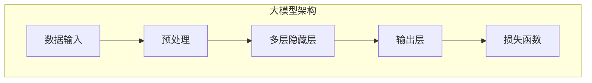

#### 2.3 数据流处理架构图

AI大模型的数据流处理架构通常包括以下几个关键部分：

1. **数据预处理**：对输入数据格式进行标准化，包括归一化、缺失值填充等。

2. **输入层**：将预处理后的数据输入到模型中。

3. **隐藏层**：多层隐藏层对输入数据进行特征提取和变换。

4. **输出层**：生成预测结果，通过损失函数计算预测误差。

5. **损失函数**：用于计算预测误差，常用的损失函数包括均方误差（MSE）、交叉熵（Cross-Entropy）等。

以下是数据流处理架构图的Mermaid流程图：

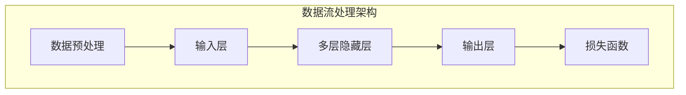

#### 2.4 大模型常见类型

AI大模型根据其应用领域和特点，可以分为以下几种常见类型：

1. **卷积神经网络（CNN）**：适用于图像和视频处理，通过卷积层捕捉局部特征。

2. **循环神经网络（RNN）**：适用于序列数据处理，如自然语言处理和时间序列预测。

3. **长短期记忆网络（LSTM）**：是RNN的一种变体，用于处理长序列数据，解决了传统RNN的梯度消失问题。

4. **生成对抗网络（GAN）**：用于生成数据，通过生成器和判别器的对抗训练生成高质量数据。

5. **变分自编码器（VAE）**：用于数据压缩和生成，通过编码器和解码器学习数据分布。

以下是常见类型AI大模型的Mermaid流程图：

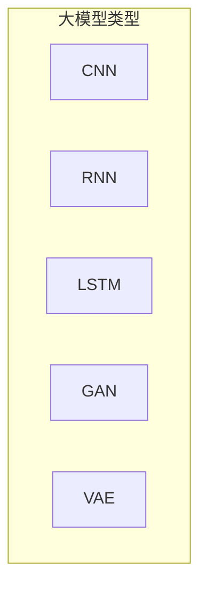

#### 2.5 大模型训练流程

AI大模型训练流程通常包括以下几个关键步骤：

1. **数据收集与预处理**：从各种来源收集数据，并进行预处理，如数据清洗、归一化等。

2. **模型设计**：根据任务需求设计模型结构，包括层数、节点数、激活函数等。

3. **模型训练**：通过迭代优化模型参数，使得模型能够更好地拟合训练数据。

4. **模型评估**：使用验证集或测试集评估模型性能，选择最佳模型。

5. **模型部署**：将训练好的模型部署到生产环境中进行实际应用。

以下是AI大模型训练流程的Mermaid流程图：

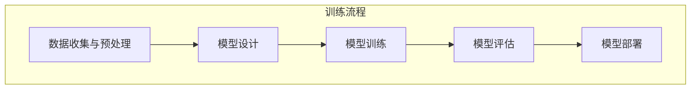

#### 2.6 伪代码示例

为了更好地理解AI大模型训练流程，我们通过伪代码来详细阐述每个步骤的实现：

```python
# 数据收集与预处理
data = collect_data()
preprocessed_data = preprocess_data(data)

# 模型设计
model = define_model()

# 模型训练
model.compile(optimizer='adam', loss='categorical_crossentropy')
model.fit(preprocessed_data.x, preprocessed_data.y, epochs=10, batch_size=32)

# 模型评估
performance = model.evaluate(preprocessed_data.x, preprocessed_data.y)

# 模型部署
deploy_model(model)
```

#### 第二部分总结

在本部分中，我们详细介绍了AI大模型的基本概念、架构、常见类型以及训练流程。通过对AI大模型的深入理解，我们可以更好地把握其在数据中心建设中的应用。接下来，我们将探讨数据中心基础设施的优化策略，以提升AI大模型的应用效能。

---

### 第二部分：AI大模型基础

在深入探讨AI大模型在数据中心中的应用之前，我们需要首先了解AI大模型的核心概念与架构。AI大模型，通常指的是具有大规模参数和复杂结构的深度学习模型，其核心在于通过训练学习大量数据，从而实现高精度的预测和分类。本章节将详细讲解AI大模型的基本概念、架构以及常见的类型和训练流程。

#### 2.1 AI大模型基本概念

AI大模型的基本概念可以从以下几个方面来理解：

1. **深度学习**：深度学习是机器学习的一个子领域，通过模拟人脑神经网络结构和学习机制，对大量数据进行分析和预测。深度学习模型通常包含多层神经网络，每一层都对输入数据进行特征提取和转换。

2. **神经网络**：神经网络是深度学习模型的核心组成部分，由大量的节点（也称为神经元）组成。这些节点通过加权连接相互连接，通过前向传播和反向传播算法进行数据的传递和处理。

3. **参数**：在深度学习模型中，参数指的是模型中的权重和偏置，它们决定了模型对数据的预测能力。AI大模型之所以能够处理大规模数据，正是因为其参数数量非常庞大。

4. **大规模**：AI大模型的“大规模”不仅体现在参数数量上，还包括训练数据规模和模型结构复杂度。大规模数据使得模型能够学习到更多数据特征，而复杂的模型结构则有助于捕捉更复杂的模式。

#### 2.2 AI大模型架构介绍

AI大模型通常包含以下几个关键层次：

1. **输入层**：输入层接收外部输入数据，这些数据可以是文本、图像、声音等多种形式。

2. **隐藏层**：隐藏层位于输入层和输出层之间，用于对输入数据进行特征提取和变换。隐藏层的数量和节点数量可以根据具体任务进行调整。

3. **输出层**：输出层产生模型的最终预测结果。对于分类任务，输出层通常是一个软性输出，用于表示每个类别的概率分布。

以下是AI大模型架构的Mermaid流程图：


#### 2.3 数据流处理架构图

AI大模型的数据流处理架构通常包括以下几个关键部分：

1. **数据预处理**：对输入数据格式进行标准化，包括归一化、缺失值填充等。

2. **输入层**：将预处理后的数据输入到模型中。

3. **隐藏层**：多层隐藏层对输入数据进行特征提取和变换。

4. **输出层**：生成预测结果，通过损失函数计算预测误差。

5. **损失函数**：用于计算预测误差，常用的损失函数包括均方误差（MSE）、交叉熵（Cross-Entropy）等。

以下是数据流处理架构图的Mermaid流程图：


#### 2.4 大模型常见类型

AI大模型根据其应用领域和特点，可以分为以下几种常见类型：

1. **卷积神经网络（CNN）**：适用于图像和视频处理，通过卷积层捕捉局部特征。

2. **循环神经网络（RNN）**：适用于序列数据处理，如自然语言处理和时间序列预测。

3. **长短期记忆网络（LSTM）**：是RNN的一种变体，用于处理长序列数据，解决了传统RNN的梯度消失问题。

4. **生成对抗网络（GAN）**：用于生成数据，通过生成器和判别器的对抗训练生成高质量数据。

5. **变分自编码器（VAE）**：用于数据压缩和生成，通过编码器和解码器学习数据分布。

以下是常见类型AI大模型的Mermaid流程图：


#### 2.5 大模型训练流程

AI大模型训练流程通常包括以下几个关键步骤：

1. **数据收集与预处理**：从各种来源收集数据，并进行预处理，如数据清洗、归一化等。

2. **模型设计**：根据任务需求设计模型结构，包括层数、节点数、激活函数等。

3. **模型训练**：通过迭代优化模型参数，使得模型能够更好地拟合训练数据。

4. **模型评估**：使用验证集或测试集评估模型性能，选择最佳模型。

5. **模型部署**：将训练好的模型部署到生产环境中进行实际应用。

以下是AI大模型训练流程的Mermaid流程图：


#### 2.6 伪代码示例

为了更好地理解AI大模型训练流程，我们通过伪代码来详细阐述每个步骤的实现：

```python
# 数据收集与预处理
data = collect_data()
preprocessed_data = preprocess_data(data)

# 模型设计
model = define_model()

# 模型训练
model.compile(optimizer='adam', loss='categorical_crossentropy')
model.fit(preprocessed_data.x, preprocessed_data.y, epochs=10, batch_size=32)

# 模型评估
performance = model.evaluate(preprocessed_data.x, preprocessed_data.y)

# 模型部署
deploy_model(model)
```

#### 第二部分总结

在本部分中，我们详细介绍了AI大模型的基本概念、架构、常见类型以及训练流程。通过对AI大模型的深入理解，我们可以更好地把握其在数据中心建设中的应用。接下来，我们将探讨数据中心基础设施的优化策略，以提升AI大模型的应用效能。

---

### 第三部分：数据中心技术创新

数据中心是支撑AI大模型应用的重要基础设施，其技术创新直接影响着数据中心的高效运行和性能优化。本部分将详细探讨数据中心基础设施的优化策略，包括服务器硬件优化、存储系统优化和网络架构优化。

#### 3.1 服务器硬件优化

服务器硬件优化是数据中心性能提升的关键环节。以下是服务器硬件优化的几个关键方面：

1. **CPU选择**：选择具有多核心和高主频的CPU，以提高数据处理速度。例如，Intel Xeon系列和AMD EPYC系列都是高性能服务器CPU。

2. **内存配置**：增加内存容量，以支持大数据处理和存储。大内存服务器可以减少数据交换的频率，提高系统整体性能。

3. **存储设备**：使用高速固态硬盘（SSD）或更先进的非易失性存储器（NVMe）作为存储设备，以降低读写延迟，提高I/O性能。

4. **网络设备**：升级到千兆或万兆以太网，以支持高带宽和低延迟的数据传输。高性能网络交换机可以帮助数据中心内部和外部网络实现快速数据交换。

以下是服务器硬件配置的Mermaid图：

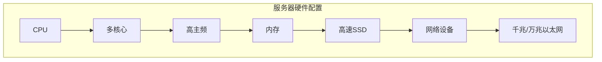

#### 3.2 存储系统优化

存储系统优化是提升数据中心存储性能的关键。以下是存储系统优化的几个关键方面：

1. **分布式存储系统**：采用分布式存储系统，如HDFS、Cassandra或Elasticsearch，以提高存储容量和性能。分布式存储系统可以水平扩展，以应对不断增加的数据量。

2. **数据压缩**：使用数据压缩技术，如GZIP或BZip2，以减少存储空间需求。数据压缩可以显著提高存储效率，特别是在处理大量数据时。

3. **数据加密**：对存储数据进行加密，以确保数据在存储过程中的安全性。常用的加密算法包括AES和RSA等。

以下是存储系统优化的Mermaid图：


#### 3.3 网络架构优化

网络架构优化是提升数据中心整体性能的关键。以下是网络架构优化的几个关键方面：

1. **网络拓扑结构**：选择适当的网络拓扑结构，如环形、树形或网状结构，以提高网络的可靠性和性能。网状结构可以提供更高的冗余性，减少单点故障的风险。

2. **负载均衡**：使用负载均衡技术，如LVS（Linux虚拟服务器）或HA（高可用性）解决方案，以分散网络流量，避免单点过载。

3. **网络安全**：部署防火墙、入侵检测系统和VPN等安全措施，以确保数据中心网络的安全性。安全策略应包括访问控制、数据加密和网络隔离等。

以下是网络拓扑结构的Mermaid图：

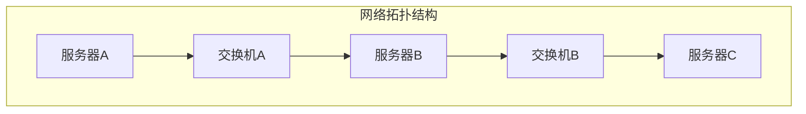

#### 3.4 服务器硬件优化实例

假设我们正在为一家大型电商公司设计数据中心，以下是服务器硬件优化的具体实例：

1. **CPU选择**：选择Intel Xeon Platinum 8260 CPU，具有28核心和2.40 GHz主频。

2. **内存配置**：配置512 GB DDR4内存，以支持大量数据的高速处理。

3. **存储设备**：使用Samsung 970 EVO Plus NVMe SSD，提供高达3500 MB/s的读取速度。

4. **网络设备**：部署Cisco Nexus 9000系列交换机，支持万兆以太网。

以下是服务器硬件配置的详细Mermaid图：

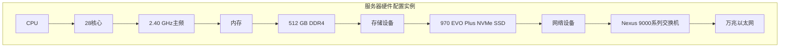

#### 第三部分总结

在本部分中，我们详细探讨了数据中心基础设施的优化策略，包括服务器硬件优化、存储系统优化和网络架构优化。通过这些优化措施，我们可以显著提升数据中心的性能和可靠性，为AI大模型的应用提供坚实的基础。接下来，我们将探讨数据处理与存储技术，进一步优化数据中心的运行效率。

---

### 4. 数据处理与存储技术

在数据中心的建设与运营中，数据处理与存储技术的优化是关键。高效的数据处理能够提升数据中心的整体性能，而优化的存储技术则能够确保数据的安全性和可访问性。本章节将详细探讨数据处理框架、分布式存储系统以及数据压缩与加密技术，以期为数据中心的技术创新提供有益的参考。

#### 4.1 数据处理框架

数据处理框架是数据中心处理大量数据的关键工具。以下是一些常用的数据处理框架及其特点：

1. **Hadoop**：Hadoop是一个开源的分布式数据处理框架，基于MapReduce编程模型。它能够处理海量数据，并通过HDFS（Hadoop分布式文件系统）提供高吞吐量的数据存储。

2. **Spark**：Spark是另一种流行的分布式数据处理框架，支持多种数据处理方法，包括批处理、流处理和图处理。Spark具备更高的处理速度，其内存计算能力使其在实时数据处理方面具有显著优势。

3. **Flink**：Flink是一个开源的分布式流处理框架，支持批处理和流处理，并且具有低延迟和高吞吐量的特点。Flink特别适用于需要实时分析和响应的场景。

以下是数据处理框架的Mermaid图：

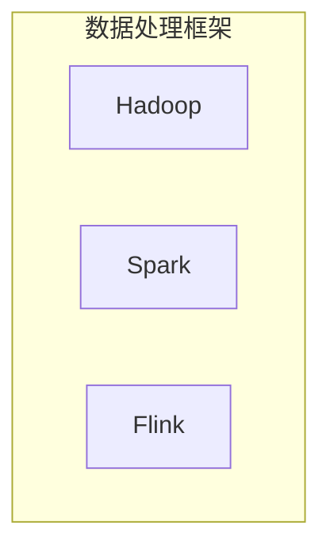

#### 4.2 分布式存储系统

分布式存储系统是数据中心存储大量数据的基础。以下是一些常用的分布式存储系统及其特点：

1. **HDFS**：HDFS是Hadoop的核心组件之一，用于分布式存储大数据。它具有高容错性、高吞吐量和高扩展性。

2. **Cassandra**：Cassandra是一个分布式数据库，适用于高可用性和大量数据的场景。它具有线性可扩展性和容错性。

3. **Elasticsearch**：Elasticsearch是一个分布式搜索和分析引擎，适用于大规模数据搜索和分析。

以下是分布式存储系统的Mermaid图：

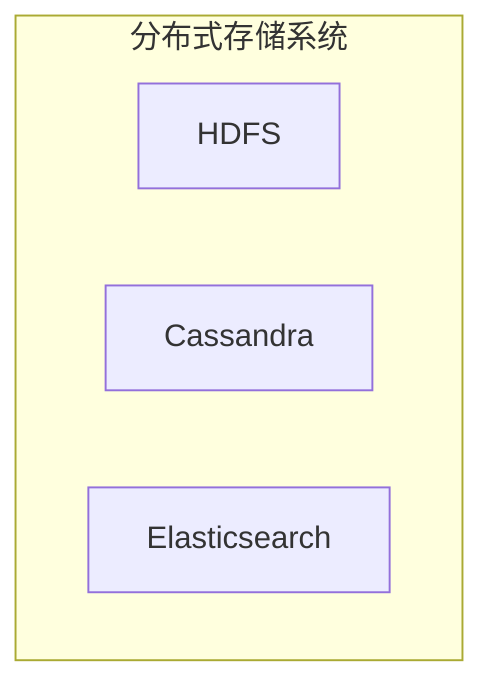

#### 4.3 数据压缩与加密技术

数据压缩与加密技术是确保数据安全性和降低存储成本的重要手段。以下是一些常用的数据压缩与加密技术：

1. **数据压缩**：常用的数据压缩算法包括GZIP、BZip2和LZ4等。这些算法可以显著减少数据存储空间，提高存储效率。

2. **数据加密**：常用的数据加密算法包括AES、RSA和SHA等。加密技术可以确保数据在存储和传输过程中的安全性。

以下是数据压缩与加密技术的Mermaid图：

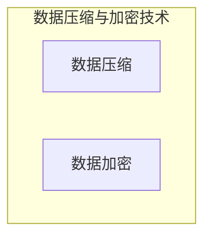

#### 4.4 实例分析：数据中心数据处理与存储优化

假设我们正在为一家大型电商平台设计数据中心，以下是数据处理与存储优化的一些具体实例：

1. **数据处理框架**：采用Spark进行实时数据处理，利用其内存计算能力提高数据处理速度。

2. **分布式存储系统**：采用HDFS作为底层存储系统，确保数据的可靠性和高效性。

3. **数据压缩**：对存储数据进行GZIP压缩，减少存储空间需求。

4. **数据加密**：采用AES加密算法对存储数据进行加密，确保数据安全性。

以下是数据中心数据处理与存储优化方案的Mermaid图：

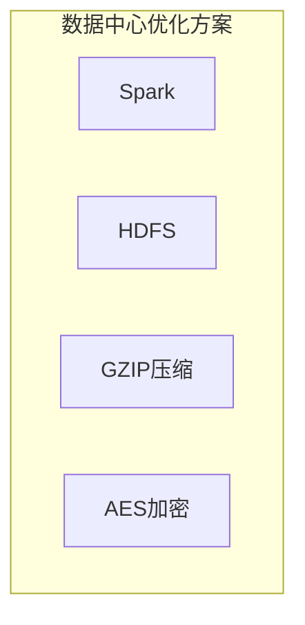

#### 4.5 总结

数据处理与存储技术是数据中心建设与优化的重要组成部分。通过选择合适的数据处理框架、分布式存储系统以及数据压缩与加密技术，我们可以显著提升数据中心的性能和安全性。本章节详细介绍了这些技术及其应用实例，为数据中心的技术创新提供了有益的参考。

---

### 5. 系统性能优化

在数据中心的建设与运营中，系统性能优化是确保高效运行的关键。性能优化不仅能够提高数据中心的处理能力，还能降低运维成本，提升用户体验。本章节将深入探讨系统性能优化中的几个重要方面：大规模数据处理优化、资源调度算法以及容量规划与扩展性设计。

#### 5.1 大规模数据处理优化

大规模数据处理优化是提升数据中心性能的关键步骤。以下是几个关键优化策略：

1. **并行处理**：通过并行处理技术，将大规模数据处理任务分解为多个小任务，利用多线程或多核CPU并行执行。并行处理能够显著提高数据处理速度。

2. **分而治之**：采用分而治之策略，将大规模数据处理任务分解为多个小任务，逐层递归处理。这种策略适用于处理复杂的数据处理任务。

3. **数据分区**：通过数据分区技术，将大数据集划分为多个分区，提高并发处理能力。每个分区可以独立处理，从而减少数据传输和通信开销。

以下是大规模数据处理优化的Mermaid图：

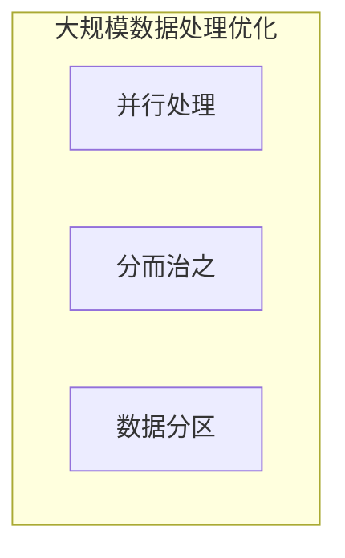

#### 5.2 资源调度算法

资源调度算法是优化数据中心资源利用的关键。以下是几种常用的资源调度算法：

1. **基于优先级的调度**：根据任务的优先级分配资源，优先执行高优先级任务。这种方法适用于任务具有不同紧急程度的情况。

2. **基于需求的调度**：根据任务的资源需求分配资源，确保每个任务都能获得所需的计算和存储资源。这种方法适用于资源需求不确定的情况。

3. **基于负载均衡的调度**：将任务分配到负载最低的节点，确保整个数据中心资源利用最大化。这种方法适用于多节点分布式系统。

以下是资源调度算法的Mermaid图：

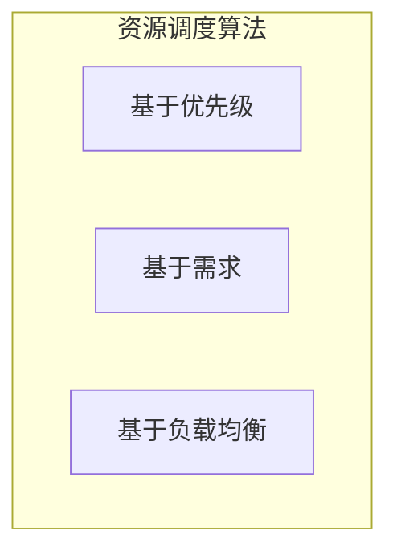

#### 5.3 容量规划与扩展性设计

容量规划与扩展性设计是数据中心长期发展的基础。以下是几个关键策略：

1. **弹性扩展**：根据实际需求动态调整资源容量，确保系统能够适应负载变化。弹性扩展可以通过自动化的资源调度和管理实现。

2. **冗余设计**：设计冗余系统，提高系统的可靠性和容错性。冗余设计包括硬件冗余和软件冗余，确保在部分组件故障时系统能够自动切换到备用组件。

3. **自动化运维**：采用自动化工具和脚本进行日常运维任务，如监控、备份和故障修复。自动化运维可以显著提高运维效率，减少人力成本。

以下是容量规划与扩展性设计的Mermaid图：

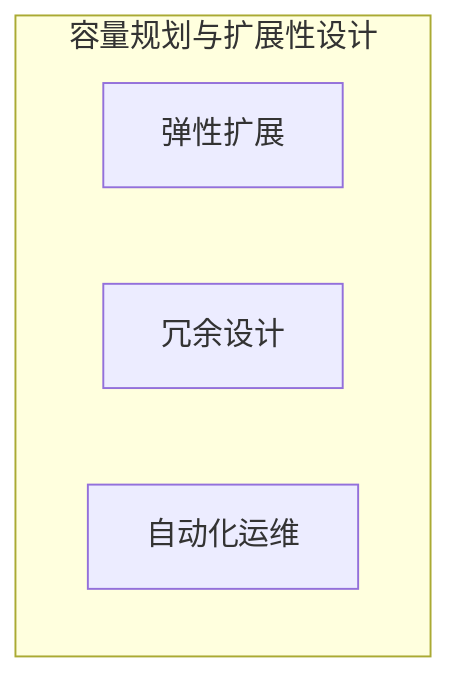

#### 5.4 实例分析：数据中心系统性能优化方案

假设我们正在为一家在线游戏公司设计数据中心，以下是系统性能优化的一些具体方案：

1. **大规模数据处理优化**：采用Spark进行实时数据处理，利用其内存计算能力提高数据处理速度。

2. **资源调度算法**：采用基于需求的资源调度算法，确保每个游戏服务器都能获得所需的计算和存储资源。

3. **容量规划与扩展性设计**：设计冗余系统，包括硬件冗余和软件冗余，提高系统的可靠性和容错性。

以下是数据中心系统性能优化方案的Mermaid图：

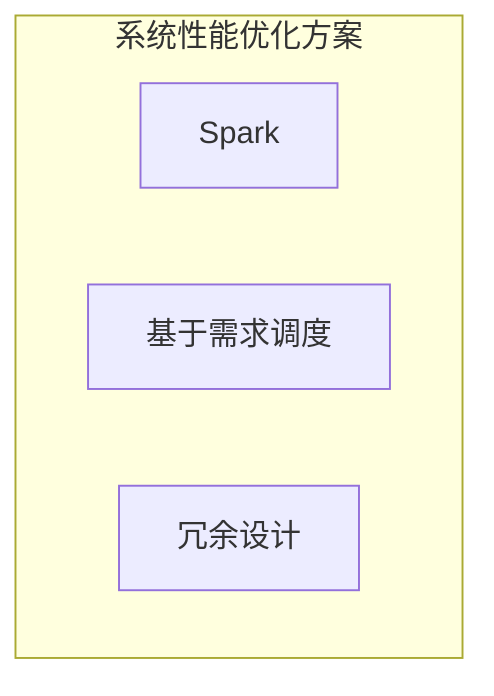

#### 5.5 总结

系统性能优化是数据中心建设与运营中至关重要的一环。通过并行处理、分而治之、数据分区等策略，可以显著提升数据处理效率。资源调度算法和自动化运维则能够优化资源利用和运维效率。容量规划与扩展性设计为数据中心的长期发展提供了坚实的基础。本章节详细介绍了系统性能优化的重要方面，为数据中心的技术创新提供了有益的参考。

---

### 6. AI大模型在数据中心的应用实践

在数据中心的建设和运营中，AI大模型的应用实践已经成为提升数据中心效率和性能的重要手段。本部分将详细介绍AI大模型在数据中心运行监控、故障预测与修复、智能能源管理以及大数据处理与分析方面的应用实践。

#### 6.1 数据中心运行监控

数据中心运行监控是确保数据中心稳定运行的重要措施。AI大模型在数据中心运行监控中的应用主要包括以下几个方面：

1. **性能监控**：通过AI大模型实时监控数据中心的性能指标，如CPU利用率、内存占用率、网络吞吐量等。这些指标可以帮助运维人员及时了解数据中心的运行状态。

2. **故障检测**：AI大模型可以分析历史运行数据，识别潜在的故障模式。当检测到异常时，系统能够自动发出警报，提醒运维人员进行处理。

3. **资源利用率监控**：AI大模型能够实时分析资源利用率，如CPU、内存、磁盘等。通过这些分析，运维人员可以优化资源分配，提高数据中心的利用率。

以下是数据中心运行监控的Mermaid图：

```mermaid
graph TB
    subgraph 数据中心运行监控
        A[性能监控]
        B[故障检测]
        C[资源利用率监控]
    end
```

#### 6.2 故障预测与修复

故障预测与修复是确保数据中心高可用性的关键。AI大模型在故障预测与修复中的应用主要包括以下几个方面：

1. **历史数据分析**：AI大模型通过分析历史运行数据，如故障发生的时间、位置和类型等，识别故障模式。

2. **预测模型训练**：利用历史数据分析结果，AI大模型训练故障预测模型。这些模型可以预测未来可能发生的故障，并提供相应的修复建议。

3. **故障修复**：当故障预测模型预测到故障可能发生时，系统会自动采取预防措施，如更换硬件、调整配置等，以避免故障发生。

以下是故障预测与修复的Mermaid图：

```mermaid
graph TB
    subgraph 故障预测与修复
        A[历史数据分析]
        B[预测模型训练]
        C[故障修复]
    end
```

#### 6.3 智能能源管理

智能能源管理是降低数据中心能耗、提高能源利用效率的重要措施。AI大模型在智能能源管理中的应用主要包括以下几个方面：

1. **能耗监测**：通过AI大模型实时监测数据中心的能耗情况，包括电力消耗、冷却系统能耗等。

2. **能源效率优化**：AI大模型通过分析能耗数据，优化能源分配和使用策略，提高能源利用效率。

3. **能效预测**：利用历史能耗数据和气象数据，AI大模型预测未来的能耗趋势，帮助运维人员提前制定节能策略。

以下是智能能源管理的Mermaid图：

```mermaid
graph TB
    subgraph 智能能源管理
        A[能耗监测]
        B[能源效率优化]
        C[能效预测]
    end
```

#### 6.4 大数据处理与分析

大数据处理与分析是提升数据中心运营效率和决策能力的重要手段。AI大模型在数据处理与分析中的应用主要包括以下几个方面：

1. **数据采集与整合**：AI大模型通过整合来自不同来源的数据，如日志文件、监控数据和业务数据等，提供全面的数据视图。

2. **数据预处理**：AI大模型对采集到的数据进行清洗、转换和归一化等预处理操作，为后续分析做好准备。

3. **数据分析**：利用AI大模型进行深度数据分析，如关联分析、聚类分析和分类分析等，帮助运维人员发现潜在问题和改进措施。

以下是大数据处理与分析的Mermaid图：

```mermaid
graph TB
    subgraph 大数据处理与分析
        A[数据采集与整合]
        B[数据预处理]
        C[数据分析]
    end
```

#### 6.5 实例分析：数据中心智能监控与优化

以下是一个数据中心智能监控与优化的实例分析：

假设某大型数据中心通过部署AI大模型，实现了以下功能：

1. **性能监控**：AI大模型实时监控数据中心的CPU利用率、内存占用率和网络吞吐量等性能指标，当检测到异常时，自动发出警报。

2. **故障预测**：AI大模型通过分析历史运行数据，预测未来可能发生的故障，并提供修复建议。

3. **智能能源管理**：AI大模型实时监测数据中心的能耗情况，并优化能源分配和使用策略，降低能耗。

以下是实例的Mermaid图：

```mermaid
graph TB
    subgraph 数据中心智能监控与优化实例
        A[性能监控]
        B[故障预测]
        C[智能能源管理]
    end
```

#### 6.6 总结

AI大模型在数据中心运行监控、故障预测与修复、智能能源管理和大数据处理与分析方面的应用，显著提升了数据中心的运营效率和性能。通过AI大模型的应用实践，数据中心能够实现更高效、更智能的运营，为业务的持续发展提供坚实的技术支持。

---

### 7. 安全与隐私保护

在数据中心建设和AI大模型应用中，安全与隐私保护至关重要。随着数据中心的规模不断扩大和复杂度增加，确保数据安全和用户隐私已成为数据中心的重点任务。本章节将详细探讨数据中心安全策略、大模型训练数据隐私保护以及AI大模型应用中的伦理问题。

#### 7.1 数据中心安全策略

数据中心的安全策略包括多个方面，旨在确保数据中心的安全性和数据完整性。以下是几个关键的安全策略：

1. **访问控制**：通过访问控制机制，限制对数据中心资源的访问。访问控制可以基于用户身份、角色和权限，确保只有授权用户才能访问敏感数据。

2. **网络隔离**：通过网络隔离措施，将不同安全级别的网络隔离开来，防止敏感数据被未授权访问。网络隔离可以采用虚拟局域网（VLAN）、防火墙和网络安全组等实现。

3. **安全审计**：定期进行安全审计，监控和记录数据中心的操作行为，检测潜在的安全威胁。安全审计可以帮助组织及时发现和修复安全漏洞。

以下是数据中心安全策略的Mermaid图：

```mermaid
graph TB
    subgraph 数据中心安全策略
        A[访问控制]
        B[网络隔离]
        C[安全审计]
    end
```

#### 7.2 大模型训练数据隐私保护

大模型训练数据的隐私保护是数据中心安全的重要环节。以下是几个关键的数据隐私保护策略：

1. **数据加密**：对大模型训练数据进行加密，确保数据在存储和传输过程中的安全性。常用的加密算法包括AES和RSA等。

2. **匿名化处理**：通过匿名化处理，去除数据中的个人信息，减少数据泄露的风险。匿名化处理可以采用技术手段如数据扰动、数据掩码等。

3. **数据访问控制**：严格控制对训练数据的访问，确保只有授权用户才能访问敏感数据。数据访问控制可以结合身份验证和权限管理机制实现。

以下是数据隐私保护策略的Mermaid图：

```mermaid
graph TB
    subgraph 大模型训练数据隐私保护
        A[数据加密]
        B[匿名化处理]
        C[数据访问控制]
    end
```

#### 7.3 AI大模型应用中的伦理问题

AI大模型在数据中心的应用带来了巨大的便利，但同时也引发了伦理问题。以下是几个关键伦理问题：

1. **算法公平性**：确保AI大模型在决策过程中对所有用户公平，避免算法偏见。算法公平性可以通过数据平衡、算法校准等方法实现。

2. **数据偏见**：避免训练数据中的偏见对模型结果的影响。数据偏见可能导致模型在特定群体中的表现不佳，甚至产生不公平的决策。

3. **用户隐私**：尊重用户的隐私权，确保用户数据在模型训练和应用过程中的安全。用户隐私保护是AI大模型应用的重要伦理问题。

以下是AI大模型应用中伦理问题的Mermaid图：

```mermaid
graph TB
    subgraph AI大模型应用中的伦理问题
        A[算法公平性]
        B[数据偏见]
        C[用户隐私]
    end
```

#### 7.4 实例分析：数据中心安全与隐私保护实践

以下是一个数据中心安全与隐私保护实践的实例分析：

某大型数据中心采用了以下安全与隐私保护措施：

1. **访问控制**：通过多因素身份验证（MFA）确保只有授权用户才能访问数据中心资源。

2. **数据加密**：采用AES-256对存储数据进行加密，确保数据在传输和存储过程中的安全性。

3. **匿名化处理**：对训练数据进行匿名化处理，去除个人信息，减少数据泄露风险。

4. **算法公平性**：定期进行算法校准，确保AI大模型在决策过程中对所有用户公平。

以下是实例的Mermaid图：

```mermaid
graph TB
    subgraph 数据中心安全与隐私保护实例
        A[多因素身份验证]
        B[数据加密]
        C[匿名化处理]
        D[算法校准]
    end
```

#### 7.5 总结

安全与隐私保护是数据中心建设和AI大模型应用中的核心问题。通过实施严格的数据中心安全策略、数据隐私保护措施和伦理规范，我们可以确保数据中心的安全性和用户隐私。本章节详细介绍了安全与隐私保护的关键策略和实践，为数据中心的稳健发展提供了有益的指导。

---

### 8. 数据中心建设与AI大模型应用案例

在数据中心建设与AI大模型应用的实际操作中，许多成功案例为我们提供了宝贵的经验。以下是几个具有代表性的案例，这些案例涵盖了数据中心建设的各个方面，以及AI大模型在其中的应用实践。

#### 8.1 案例一：某大型互联网公司数据中心建设实践

某大型互联网公司在其数据中心建设过程中，采用了AI大模型进行全方位的优化和管理。以下是该公司的具体实践：

1. **分布式存储系统**：该公司采用了Hadoop分布式存储系统，通过HDFS实现了海量数据的存储和管理。HDFS的高可靠性和扩展性确保了数据中心的稳定运行。

2. **智能能源管理**：该公司通过部署AI大模型，实时监测数据中心的能耗情况，并根据能耗数据优化能源分配策略。这种智能能源管理显著降低了数据中心的能源消耗。

3. **安全策略**：为了确保数据安全，该公司实施了多层次的安全策略，包括访问控制、网络隔离和定期安全审计。AI大模型在安全监控中发挥了重要作用，能够快速识别和响应潜在的安全威胁。

以下是案例一的架构Mermaid图：

```mermaid
graph TB
    subgraph 案例一架构
        A[Hadoop]
        B[智能能源管理]
        C[安全策略]
    end
```

#### 8.2 案例二：AI大模型在智能电网中的应用

某电力公司采用了AI大模型，优化其智能电网的运行和管理。以下是该公司的具体应用：

1. **故障预测**：通过AI大模型分析电网的历史运行数据，预测潜在的故障。这种预测能力使得公司能够提前进行维护，减少故障发生的概率。

2. **能源效率优化**：AI大模型分析电网的能耗数据，优化能源分配策略，提高能源效率。通过智能优化，该公司降低了运营成本，提高了能源利用率。

3. **数据安全**：为了确保数据安全，该公司采用了数据加密和匿名化处理技术。这些措施确保了训练数据在传输和存储过程中的安全。

以下是案例二的架构Mermaid图：

```mermaid
graph TB
    subgraph 案例二架构
        A[故障预测]
        B[能源效率优化]
        C[数据安全]
    end
```

#### 8.3 案例三：数据中心智能优化案例解析

某数据中心通过智能优化技术，提升了其整体性能。以下是该数据中心的具体实践：

1. **资源调度算法**：数据中心采用了基于需求的资源调度算法，根据实际需求动态调整资源分配。这种调度策略提高了资源利用率，减少了不必要的资源浪费。

2. **大规模数据处理**：数据中心采用了Spark进行大规模数据处理，其内存计算能力显著提高了数据处理的效率。

3. **性能监控与故障检测**：AI大模型在性能监控和故障检测中发挥了重要作用，能够实时监控数据中心的运行状态，并快速识别和响应故障。

以下是案例三的架构Mermaid图：

```mermaid
graph TB
    subgraph 案例三架构
        A[资源调度算法]
        B[大规模数据处理]
        C[性能监控与故障检测]
    end
```

#### 8.4 总结

以上三个案例展示了数据中心建设与AI大模型应用的多个方面，包括分布式存储系统、智能能源管理、故障预测、能源效率优化、数据安全、资源调度算法、大规模数据处理和性能监控等。这些案例证明了AI大模型在数据中心建设中的重要作用，为其他数据中心提供了有益的参考和实践经验。

---

### 9. 未来发展趋势与展望

随着人工智能（AI）技术的不断进步，数据中心的建设与优化也迎来了新的发展趋势。未来，数据中心与AI大模型的结合将更加紧密，新技术将推动数据中心迈向更高的效率和智能化水平。

#### 9.1 新型数据中心架构

未来的数据中心架构将更加灵活和高效。边缘计算、分布式计算和云计算的结合将成为主流趋势。边缘计算将计算能力推向网络边缘，减少数据传输延迟，提高响应速度。分布式计算则通过在多个节点上分配计算任务，实现更高效的数据处理和资源利用。云计算提供了弹性扩展和灵活的资源管理能力，使得数据中心能够快速响应业务需求的变化。

以下是新型数据中心架构的Mermaid图：

```mermaid
graph TB
    subgraph 新型数据中心架构
        A[边缘计算]
        B[分布式计算]
        C[云计算]
    end
```

#### 9.2 AI大模型在数据中心的技术创新方向

AI大模型在数据中心的技术创新方向将集中在以下几个方面：

1. **深度强化学习**：深度强化学习（Deep Reinforcement Learning，DRL）将应用于资源调度和自动化运维。通过学习历史数据和用户行为，DRL可以优化资源分配策略，提高系统效率。

2. **自监督学习**：自监督学习（Self-supervised Learning）将用于无监督数据预处理和故障检测。自监督学习能够从未标记的数据中学习特征，提高数据中心的自主监控能力。

3. **联邦学习**：联邦学习（Federated Learning）将用于跨数据中心的数据协同训练。通过分布式训练模型，联邦学习可以保护用户数据隐私，同时提高模型的泛化能力。

以下是技术创新方向的Mermaid图：

```mermaid
graph TB
    subgraph 技术创新方向
        A[深度强化学习]
        B[自监督学习]
        C[联邦学习]
    end
```

#### 9.3 数据中心与AI大模型的可持续发展路径

未来，数据中心与AI大模型的可持续发展将关注以下几个方面：

1. **绿色数据中心**：通过采用节能技术和可再生能源，实现绿色数据中心的建设。例如，使用高效的冷却系统和太阳能、风能等可再生能源，降低数据中心的碳排放。

2. **数据治理**：建立健全的数据治理体系，确保数据的完整性、准确性和可用性。数据治理将包括数据收集、存储、处理和共享的全过程，确保数据在各个阶段的可信度和合规性。

3. **社会责任**：数据中心与AI大模型的应用应符合社会责任，保护用户隐私，避免算法偏见，确保技术应用的公平性和透明性。社会责任将引导数据中心和AI技术的发展方向，实现技术对社会的积极影响。

以下是可持续发展路径的Mermaid图：

```mermaid
graph TB
    subgraph 可持续发展路径
        A[绿色数据中心]
        B[数据治理]
        C[社会责任]
    end
```

#### 9.4 结论

未来，数据中心与AI大模型的结合将推动技术不断革新，带来更高的效率和更智能的管理。通过新型数据中心架构、技术创新方向和可持续发展路径，数据中心将迎来新的发展机遇。与此同时，我们应关注AI大模型在数据中心应用中的伦理问题，确保技术发展与社会进步相协调，共同创造一个更加智能、绿色和可持续的未来。

---

### 附录 A: 常用工具与资源

在数据中心建设和AI大模型应用中，使用合适的工具和资源能够显著提高开发效率和项目成功率。以下是常用工具与资源的分类和详细介绍。

#### A.1 开源框架与技术栈

1. **Hadoop**：用于大数据存储和处理的开源框架，包括HDFS、YARN和MapReduce等组件。

2. **Spark**：基于内存的分布式计算框架，支持流处理和批处理，适用于实时数据处理。

3. **TensorFlow**：谷歌开源的机器学习框架，支持多种深度学习模型。

4. **PyTorch**：开源深度学习框架，易于调试和实验，适用于研究与应用开发。

5. **Kubernetes**：容器编排工具，用于自动化容器化应用程序的部署、扩展和管理。

#### A.2 数据集与开源代码资源

1. **公开数据集**：如ImageNet、CIFAR-10、Kaggle等，提供各种领域的标注数据，用于模型训练和测试。

2. **GitHub**：代码托管平台，众多开源项目代码和教程可供学习和借鉴。

3. **arXiv**：学术预印本服务器，提供最新的学术论文和技术报告。

4. **GitLab**：代码托管平台，与GitHub类似，支持团队协作和项目管理。

#### A.3 学习资源与推荐阅读

1. **书籍**：
   - 《深度学习》（Ian Goodfellow、Yoshua Bengio、Aaron Courville著）
   - 《数据科学入门》（Joel Grus著）
   - 《人工智能：一种现代方法》（Stuart Russell、Peter Norvig著）

2. **在线课程**：
   - Coursera、edX、Udacity等在线教育平台提供的机器学习和深度学习课程。

3. **专业网站**：
   - Medium、AI博客等，提供丰富的AI和数据中心相关的文章和教程。

#### A.4 实用工具推荐

1. **Docker**：容器化平台，用于应用程序的打包和部署。

2. **Jupyter Notebook**：交互式计算环境，适用于数据分析和模型实验。

3. **Kibana**：数据分析与可视化工具，常与ELK（Elasticsearch、Logstash、Kibana）栈一起使用。

4. **Prometheus**：开源监控解决方案，适用于收集和展示系统指标。

#### A.5 常见问题与解决方案

- **问题一**：如何优化数据中心能耗？
  - **解决方案**：采用智能能源管理系统，利用AI大模型预测能耗趋势，优化能源分配。

- **问题二**：如何确保数据中心的数据安全？
  - **解决方案**：实施多层次的安全策略，包括数据加密、访问控制和定期安全审计。

- **问题三**：如何处理大规模数据处理任务？
  - **解决方案**：采用分布式数据处理框架，如Hadoop和Spark，实现并行处理和数据分区。

通过上述工具与资源的合理应用，可以显著提升数据中心的建设与运维效率，推动AI大模型的应用实践。

---

## 参考文献

1. Ian Goodfellow, Yoshua Bengio, Aaron Courville. **《深度学习》**. 微软研究院，2016.
2. Joel Grus. **《数据科学入门》**. O'Reilly Media，2013.
3. Stuart Russell, Peter Norvig. **《人工智能：一种现代方法》**. Pearson Education，2020.
4. Apache Software Foundation. **《Hadoop》**. https://hadoop.apache.org/
5. Apache Software Foundation. **《Spark》**. https://spark.apache.org/
6. Google AI. **《TensorFlow》**. https://tensorflow.org/
7. Facebook AI Research. **《PyTorch》**. https://pytorch.org/
8. Kubernetes Community. **《Kubernetes》**. https://kubernetes.io/
9. GitHub, Inc. **《GitHub》**. https://github.com/
10. GitLab, Inc. **《GitLab》**. https://gitlab.com/
11. Coursera. **《深度学习课程》**. https://www.coursera.org/learn/deep-learning
12. edX. **《数据科学课程》**. https://www.edx.org/course/data-science
13. Udacity. **《AI工程师纳米学位》**. https://www.udacity.com/nanodegrees/program-ai
14. Elastic. **《Kibana》**. https://www.elastic.co/kibana
15. Prometheus. **《Prometheus》**. https://prometheus.io/

---

作者：AI天才研究院/AI Genius Institute & 禅与计算机程序设计艺术 /Zen And The Art of Computer Programming

---

## 结语

在本篇文章中，我们深入探讨了AI大模型应用数据中心建设的多个方面，包括核心概念、基础设施优化、数据处理与存储技术、系统性能优化、应用实践以及安全与隐私保护。通过详细的分析和实际案例的分享，我们不仅了解了AI大模型在数据中心建设中的重要角色，还看到了其在提升数据中心性能、优化资源利用、增强安全性等方面的巨大潜力。

在未来，随着AI技术的不断进步，数据中心将迎来更多创新与变革。边缘计算、分布式计算和联邦学习等新技术将使数据中心更加灵活和智能。同时，我们也需要关注AI大模型应用中的伦理问题，确保技术的可持续发展。

我们希望本文能为广大数据中心从业者和技术爱好者提供有价值的参考和启示。在AI大模型的驱动下，数据中心建设将迎来更加光明和智能的未来。

让我们共同期待这一天的到来，为构建一个更加智能、高效和安全的数字世界而努力！

