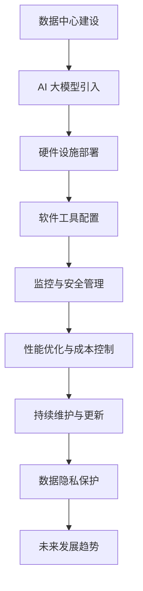

                 

# AI 大模型应用数据中心建设：数据中心运维与管理

## 概述

> “AI 大模型与数据中心建设”是一个涉及前沿科技与实际应用的综合性话题。本文旨在探讨 AI 大模型在数据中心建设中的重要作用，以及如何通过数据中心运维与管理实现高效、安全、可持续的运营。

### 关键词
- AI 大模型
- 数据中心建设
- 数据中心运维
- 管理策略
- 安全防护
- 性能优化

### 摘要
本文首先介绍了 AI 大模型与数据中心的关系，探讨了数据中心基础设施的重要性。接着，详细阐述了数据中心运维管理的核心流程与挑战，并引入了 AI 大模型在性能优化、故障预测与安全防护等方面的应用。最后，本文通过实际案例分析了数据中心管理与优化的策略，并展望了未来的发展趋势。

## 目录大纲

### 第一部分：AI 大模型与数据中心概述

- **第1章：AI 大模型与数据中心简介**
  - **1.1 AI 大模型发展历程**
  - **1.2 数据中心概述**
  - **1.3 AI 大模型在数据中心的应用**

### 第二部分：数据中心基础设施建设

- **第2章：数据中心硬件设施**
  - **2.1 服务器与存储设备**
  - **2.2 网络设备**
  - **2.3 电源与冷却系统**

### 第三部分：数据中心运维管理

- **第3章：数据中心运维概述**
  - **3.1 数据中心运维的重要性**
  - **3.2 数据中心监控与故障管理**
  - **3.3 数据中心安全管理**

### 第四部分：AI 大模型在数据中心运维中的应用

- **第4章：AI 大模型在数据中心运维中的应用**
  - **4.1 AI 大模型在性能优化中的应用**
  - **4.2 AI 大模型在故障预测与检测中的应用**
  - **4.3 AI 大模型在安全防护中的应用**

### 第五部分：数据中心管理与优化

- **第5章：数据中心管理策略**
  - **5.1 数据中心运营成本优化**
  - **5.2 数据中心性能优化**
  - **5.3 数据中心可持续发展**

### 第六部分：案例分析与实战

- **第6章：AI 大模型数据中心建设案例分析**
  - **6.1 某大型互联网公司数据中心建设**
  - **6.2 某金融机构数据中心运维与管理**

### 第七部分：技术展望与未来趋势

- **第7章：AI 大模型数据中心建设趋势**
  - **7.1 AI 大模型数据中心建设技术发展**
  - **7.2 数据中心管理与运维挑战**
  - **7.3 AI 大模型数据中心建设未来展望**

## 附录

- **附录 A：AI 大模型与数据中心建设常用工具**
- **附录 B：参考文献与推荐阅读**

接下来，我们将按照上述目录大纲逐步深入探讨 AI 大模型在数据中心建设中的应用。

---

### 《AI 大模型应用数据中心建设：数据中心运维与管理》目录大纲

#### 第一部分：AI 大模型与数据中心概述

##### 第1章：AI 大模型与数据中心简介

**1.1 AI 大模型发展历程**

**1.2 数据中心概述**

**1.3 AI 大模型在数据中心的应用**

##### 第2章：数据中心基础设施建设

**2.1 服务器与存储设备**

**2.2 网络设备**

**2.3 电源与冷却系统**

##### 第3章：数据中心运维概述

**3.1 数据中心运维的重要性**

**3.2 数据中心监控与故障管理**

**3.3 数据中心安全管理**

##### 第4章：AI 大模型在数据中心运维中的应用

**4.1 AI 大模型在性能优化中的应用**

**4.2 AI 大模型在故障预测与检测中的应用**

**4.3 AI 大模型在安全防护中的应用**

##### 第5章：数据中心管理策略

**5.1 数据中心运营成本优化**

**5.2 数据中心性能优化**

**5.3 数据中心可持续发展**

##### 第6章：案例分析与实战

**6.1 某大型互联网公司数据中心建设**

**6.2 某金融机构数据中心运维与管理**

##### 第7章：AI 大模型数据中心建设趋势

**7.1 AI 大模型数据中心建设技术发展**

**7.2 数据中心管理与运维挑战**

**7.3 AI 大模型数据中心建设未来展望**

##### 附录

**附录 A：AI 大模型与数据中心建设常用工具**

**附录 B：参考文献与推荐阅读**

---

## 第1章：AI 大模型与数据中心简介

### 1.1 AI 大模型发展历程

AI 大模型的发展历程可以追溯到深度学习的兴起。在 2006 年，Hinton 等人提出深度信念网络（Deep Belief Network，DBN），这是深度学习的早期重要工作。随后，在 2012 年，Hinton 等人基于卷积神经网络（Convolutional Neural Network，CNN）在ImageNet 图像识别比赛中取得了突破性的成绩，这标志着深度学习在计算机视觉领域的崛起。

随着神经网络层数的增加，深度学习模型变得越来越复杂。然而，训练这些深度学习模型需要大量的计算资源，这在早期是一个巨大的挑战。随着计算能力的提升和大数据时代的到来，AI 大模型逐渐发展起来。2014 年，Google 提出了生成对抗网络（Generative Adversarial Networks，GAN），这是 AI 大模型发展过程中的一个重要里程碑。

AI 大模型的发展不仅依赖于计算能力的提升，还依赖于数据的积累和优化算法的改进。例如，2017 年，Google 提出了 Transformer 模型，这是自然语言处理领域的一个重大突破。随后，GPT、BERT 等大型预训练模型相继出现，使得 AI 大模型在各个领域取得了显著的进展。

### 1.2 数据中心概述

数据中心（Data Center）是一个集中存放计算机设备、网络设备和其他相关设备的场所，用于处理、存储、传输和管理大量的数据。数据中心通常包括以下几个主要部分：

1. **服务器（Server）**：服务器是数据中心的核心，用于运行各种应用程序、存储数据和提供计算服务。
2. **存储设备（Storage）**：存储设备用于存放数据和文件，包括硬盘驱动器（HDD）、固态硬盘（SSD）和分布式存储系统。
3. **网络设备（Networking Equipment）**：网络设备包括路由器、交换机和防火墙等，用于数据的传输和网络安全。
4. **电源与冷却系统（Power and Cooling System）**：数据中心需要稳定的电源供应和良好的冷却系统，以确保设备的正常运行。

数据中心可以按照不同的标准进行分类，如按规模分类可以分为小型数据中心、中型数据中心和大型数据中心；按应用场景分类可以分为企业级数据中心、电信级数据中心和云数据中心。

### 1.3 数据中心建设对 AI 大模型的需求

数据中心的建设对于 AI 大模型的应用至关重要。以下是一些数据中心建设对 AI 大模型的需求：

1. **计算资源**：AI 大模型训练和推理需要大量的计算资源，因此数据中心需要具备高性能的计算能力。
2. **存储容量**：AI 大模型处理的数据量通常非常大，因此数据中心需要提供足够的存储容量，以便存储和处理这些数据。
3. **网络带宽**：AI 大模型在训练和推理过程中需要频繁传输数据，因此数据中心需要具备高速的网络连接和足够的网络带宽。
4. **可靠性和稳定性**：数据中心需要具备高可靠性和稳定性，以确保 AI 大模型能够稳定运行。

### 1.4 AI 大模型在数据中心运维中的应用

数据中心运维是确保数据中心稳定运行的重要环节。AI 大模型在数据中心运维中具有广泛的应用，例如：

1. **性能优化**：AI 大模型可以用于预测数据中心性能，优化资源分配，提高资源利用率。
2. **故障预测与检测**：AI 大模型可以用于故障预测和检测，提前发现潜在问题，减少故障发生的概率。
3. **安全防护**：AI 大模型可以用于入侵检测和防御，提高数据中心的网络安全水平。

### 1.5 AI 大模型在数据中心管理中的应用

数据中心管理包括资源分配、成本控制、性能优化等多个方面。AI 大模型在数据中心管理中具有重要作用，例如：

1. **资源调度**：AI 大模型可以用于智能调度，根据负载情况动态调整资源分配，提高资源利用率。
2. **成本控制**：AI 大模型可以用于成本预测和优化，帮助企业控制数据中心运营成本。
3. **性能优化**：AI 大模型可以用于性能评估和优化，提高数据中心整体性能。

### 1.6 本章总结

本章介绍了 AI 大模型的发展历程和数据中心概述，探讨了数据中心建设对 AI 大模型的需求，以及 AI 大模型在数据中心运维和管理中的应用。接下来，我们将深入探讨数据中心基础设施的建设。

---

## 第2章：数据中心基础设施建设

### 2.1 服务器与存储设备

服务器是数据中心的核心设备，用于运行各种应用程序、存储数据和提供计算服务。服务器可以分为以下几类：

1. **计算服务器**：计算服务器主要用于处理数据和运行应用程序，具有较高的计算性能和扩展性。
2. **存储服务器**：存储服务器主要用于存储数据和文件，具有高容量和高可靠性。
3. **数据库服务器**：数据库服务器用于存储和管理数据库，支持数据的查询、更新和删除等操作。

在选择服务器时，需要考虑以下因素：

1. **性能**：服务器的性能取决于 CPU、内存、存储和网络等方面的配置。高性能服务器可以提供更快的数据处理速度。
2. **可靠性**：服务器的可靠性对于数据中心的稳定运行至关重要。高可靠性的服务器通常具有冗余设计和故障恢复机制。
3. **扩展性**：服务器的扩展性决定了其能够支持的数据量和业务规模。具有良好扩展性的服务器可以满足未来业务的需求。

存储设备是数据中心的重要组成部分，用于存储数据和文件。存储设备可以分为以下几类：

1. **硬盘驱动器（HDD）**：HDD 是传统的存储设备，具有高容量和较低的存储成本。但是，HDD 的读写速度相对较慢。
2. **固态硬盘（SSD）**：SSD 是基于闪存的存储设备，具有更快的读写速度和更高的性能。SSD 的价格相对较高，但适用于需要高性能的应用场景。
3. **分布式存储系统**：分布式存储系统是一种基于多个节点协同工作的存储架构，具有高可用性和高性能。分布式存储系统可以扩展存储容量，提高数据访问速度。

在选择存储设备时，需要考虑以下因素：

1. **容量**：存储设备的容量决定了能够存储的数据量。根据业务需求选择合适的存储容量。
2. **性能**：存储设备的性能取决于读写速度和并发能力。根据业务需求选择高性能的存储设备。
3. **可靠性**：存储设备的可靠性决定了数据的完整性和安全性。选择具有高可靠性的存储设备，如具有冗余设计和数据备份功能的存储系统。

### 2.2 网络设备

网络设备是数据中心的重要组成部分，用于数据的传输和网络的连接。网络设备可以分为以下几类：

1. **路由器**：路由器用于连接不同的网络，实现数据包的转发和路由。路由器具有高吞吐量和低延迟的特点。
2. **交换机**：交换机用于连接网络中的设备，实现数据包的转发和交换。交换机具有高带宽和低延迟的特点。
3. **防火墙**：防火墙用于保护网络的安全性，防止未经授权的访问和攻击。防火墙具有过滤、监控和审计等功能。

在选择网络设备时，需要考虑以下因素：

1. **性能**：网络设备的性能取决于吞吐量和延迟。根据网络带宽和流量需求选择高性能的网络设备。
2. **可靠性**：网络设备的可靠性决定了网络的稳定性和可用性。选择具有冗余设计和故障恢复能力的网络设备。
3. **可扩展性**：网络设备需要支持未来业务的扩展。根据业务规模和发展需求选择具有良好扩展性的网络设备。

### 2.3 电源与冷却系统

电源与冷却系统是数据中心正常运行的关键。以下是一些重要的考虑因素：

1. **电源系统**：数据中心需要稳定、可靠的电源供应。电源系统应包括UPS（不间断电源）、电池和发电机等设备。UPS 可以在电网故障时提供临时电力供应，确保数据中心的连续运行。

2. **冷却系统**：数据中心的设备会产生大量热量，需要有效的冷却系统来维持设备在适宜的温度范围内运行。冷却系统可以包括空气冷却和水冷却两种方式。空气冷却系统使用空调设备将热量从设备中带走，水冷却系统使用冷水将热量传递到冷却塔。

在选择电源与冷却系统时，需要考虑以下因素：

1. **容量**：电源与冷却系统的容量应能够满足数据中心当前和未来的需求。
2. **可靠性**：电源与冷却系统的可靠性对于数据中心的稳定运行至关重要。选择具有冗余设计和故障恢复能力的电源与冷却系统。
3. **能耗**：数据中心的能耗是一个重要的考虑因素。选择高效的电源与冷却系统可以降低能耗，减少运营成本。

### 2.4 数据中心基础设施的架构设计

数据中心基础设施的架构设计是一个复杂的过程，需要综合考虑性能、可靠性、可扩展性和能耗等因素。以下是一些关键的设计原则：

1. **模块化设计**：数据中心应采用模块化设计，便于设备更换和扩展。模块化设计可以提高数据中心的可靠性和可维护性。
2. **冗余设计**：数据中心的关键设备和系统应具有冗余设计，以确保在设备故障时能够自动切换到备用设备，保证数据中心的连续运行。
3. **分布式架构**：数据中心应采用分布式架构，将计算、存储和网络资源分布到不同的节点，提高系统的可扩展性和容错能力。
4. **高效能源管理**：数据中心应采用高效能源管理技术，如智能电源管理、动态功耗调节等，以降低能耗，提高能源利用率。

### 2.5 本章总结

本章介绍了数据中心基础设施建设的关键设备和系统，包括服务器、存储设备、网络设备和电源与冷却系统。在选择数据中心基础设施时，需要考虑性能、可靠性、可扩展性和能耗等因素。下一章我们将探讨数据中心运维管理的重要性和核心流程。

---

## 第3章：数据中心运维概述

### 3.1 数据中心运维的重要性

数据中心运维（Data Center Operations，DCO）是确保数据中心稳定、高效运行的关键环节。数据中心运维的重要性体现在以下几个方面：

1. **业务连续性**：数据中心是许多企业业务运行的核心，确保数据中心稳定运行对于业务的连续性至关重要。任何故障或中断都可能对业务造成严重影响。

2. **性能优化**：数据中心运维涉及对服务器、存储和网络设备等的监控和管理，通过实时监控和性能优化，可以确保数据中心的高性能运行，满足业务需求。

3. **成本控制**：数据中心运维还包括资源管理和成本控制。通过合理分配资源、优化能耗和使用效率，可以有效降低运营成本。

4. **安全性**：数据中心存储和处理大量的敏感数据，因此数据安全是数据中心运维的重要任务。通过安全策略、监控和防护措施，确保数据的安全和隐私。

### 3.2 运维的目标与挑战

数据中心运维的目标可以概括为以下几个方面：

1. **高可用性**：确保数据中心设备和服务的高可用性，减少故障和中断。

2. **性能优化**：优化数据中心的性能，提高资源利用率和响应速度。

3. **安全性**：确保数据中心的网络安全和数据保护，防范各种安全威胁。

4. **成本控制**：通过有效的资源管理和成本控制，降低运营成本。

数据中心运维面临的挑战主要包括：

1. **设备复杂度**：数据中心包含多种设备，包括服务器、存储、网络设备等，设备的复杂度和多样性增加了运维的难度。

2. **规模庞大**：大型数据中心包含成千上万个设备，规模庞大，运维管理难度增加。

3. **动态变化**：数据中心环境动态变化，如负载波动、设备更新、网络变化等，需要实时响应和调整。

4. **技能要求**：数据中心运维需要具备专业的技能和知识，包括网络、存储、服务器管理等领域。

### 3.3 数据中心运维的流程与规范

数据中心运维的流程主要包括以下几个方面：

1. **监控与告警**：通过监控系统实时监控数据中心的设备状态、性能指标和网络流量，一旦发现异常，及时发出告警。

2. **故障处理**：在发生故障时，按照预定的故障处理流程进行响应，包括故障定位、故障排除和故障恢复。

3. **变更管理**：在数据中心进行任何变更（如设备升级、配置更改等）前，必须经过严格的变更管理流程，确保变更不会对业务造成影响。

4. **性能优化**：定期对数据中心进行性能优化，包括资源调整、负载均衡和性能测试。

5. **安全管理**：制定和执行安全策略，包括防火墙配置、访问控制、入侵检测等。

6. **文档管理**：维护详细的运维文档，包括设备配置、操作手册、故障处理流程等，以便于运维人员参考。

### 3.4 数据中心运维的工具与自动化

数据中心运维工具是运维人员的重要助手，可以提高运维效率，降低运维成本。常见的运维工具包括：

1. **监控工具**：如 Nagios、Zabbix、Prometheus 等，用于实时监控数据中心的性能和状态。

2. **自动化工具**：如 Ansible、Puppet、Chef 等，用于自动化部署、配置管理和故障处理。

3. **日志管理工具**：如 ELK（Elasticsearch、Logstash、Kibana）堆栈，用于收集、存储和分析日志数据。

4. **安全管理工具**：如 OSSEC、Snort、Bro 等，用于网络安全监控和防护。

自动化在数据中心运维中发挥着重要作用，可以减少人为错误，提高运维效率。通过自动化脚本和工具，可以实现以下功能：

1. **自动部署**：自动化部署应用程序和系统软件，确保环境的一致性和稳定性。

2. **自动监控**：自动化监控系统状态和性能指标，及时发现和处理问题。

3. **自动故障处理**：自动化故障处理流程，减少故障响应时间。

4. **自动性能优化**：自动化性能优化任务，确保数据中心的高性能运行。

### 3.5 数据中心运维人员的角色与技能

数据中心运维人员承担着确保数据中心稳定运行的重要责任。以下是数据中心运维人员的一些关键角色和技能：

1. **系统管理员**：负责服务器、存储和网络设备的日常维护和管理，确保设备的正常运行。

2. **网络工程师**：负责网络设备的配置、管理和故障处理，确保网络的稳定性和性能。

3. **安全管理员**：负责数据中心的网络安全，包括防火墙配置、入侵检测、访问控制等。

4. **性能工程师**：负责数据中心的性能监控和优化，确保数据中心的高性能运行。

5. **自动化工程师**：负责自动化脚本和工具的开发和部署，提高运维效率。

6. **文档管理员**：负责维护和更新运维文档，确保文档的完整性和准确性。

数据中心运维人员需要具备以下技能：

1. **技术知识**：熟悉服务器、存储、网络设备等硬件和软件的原理和配置。

2. **故障处理能力**：能够快速定位和解决故障，确保数据中心的连续运行。

3. **自动化技能**：熟悉自动化工具和脚本的开发，提高运维效率。

4. **安全管理知识**：了解网络安全原理和防护措施，确保数据安全。

5. **团队协作能力**：能够与团队成员有效沟通和协作，共同确保数据中心的稳定运行。

### 3.6 本章总结

本章介绍了数据中心运维的重要性、目标和挑战，以及数据中心运维的流程、工具和人员角色。数据中心运维是确保数据中心稳定、高效运行的关键环节，通过监控、故障处理、自动化和安全策略，可以实现数据中心的最佳运行状态。下一章我们将探讨 AI 大模型在数据中心运维中的应用。

---

## 第4章：AI 大模型在数据中心运维中的应用

### 4.1 AI 大模型在性能优化中的应用

AI 大模型在数据中心性能优化中的应用具有重要意义，能够显著提升资源利用率和系统性能。以下是一些关键应用场景和实现方法：

#### 4.1.1 性能预测与优化

数据中心性能预测是 AI 大模型在性能优化中的一个重要应用。通过收集历史性能数据和实时数据，AI 大模型可以预测未来的性能趋势，为资源调度提供依据。具体实现方法如下：

1. **数据收集**：收集数据中心历史性能数据，包括 CPU 利用率、内存使用率、网络吞吐量、存储 I/O 等指标。
2. **特征工程**：对收集到的数据进行预处理和特征提取，将原始数据转换为适用于 AI 大模型的特征向量。
3. **模型训练**：使用机器学习算法，如线性回归、决策树、神经网络等，训练性能预测模型。
4. **模型评估**：使用验证集评估模型性能，选择最优模型进行部署。
5. **性能预测**：将实时数据输入到训练好的模型中，预测未来的性能趋势。

根据性能预测结果，可以采取以下优化措施：

- **动态资源调度**：根据预测的负载情况，动态调整服务器和存储资源的分配，避免资源浪费和瓶颈。
- **负载均衡**：在多个服务器之间实现负载均衡，确保每个服务器都处于最优负载状态，提高整体性能。
- **预测性维护**：基于性能预测，提前发现潜在的性能瓶颈和设备故障，进行预防性维护，减少故障发生概率。

#### 4.1.2 资源调度与负载均衡

AI 大模型在资源调度和负载均衡中发挥着重要作用，可以显著提高数据中心的资源利用率和性能。以下是一些关键应用场景和实现方法：

1. **应用场景**：
   - 在多个数据中心之间进行负载均衡，确保业务负载均匀分布，避免单点故障。
   - 在服务器集群中实现负载均衡，优化资源利用率，提高系统性能。
   - 在存储系统中实现负载均衡，确保数据读写负载均匀分布，提高存储性能。

2. **实现方法**：
   - **基于预测的负载均衡**：使用 AI 大模型预测未来的负载情况，动态调整负载分配策略，确保负载均衡。
   - **基于实时数据的自适应负载均衡**：使用实时数据监控，动态调整负载分配，以应对负载波动。
   - **基于机器学习的资源调度**：使用机器学习算法，如聚类、优化算法等，优化资源分配，提高资源利用率。

#### 4.1.3 能耗优化

AI 大模型在能耗优化中具有显著优势，能够通过预测和优化减少数据中心的能耗，提高能源利用率。以下是一些关键应用场景和实现方法：

1. **应用场景**：
   - **动态能耗管理**：根据服务器和存储设备的负载情况，动态调整能耗设置，降低不必要的能耗。
   - **冷却系统优化**：通过优化冷却系统，降低数据中心的能耗，提高冷却效率。
   - **能源消耗预测**：预测未来的能源消耗，为能源管理提供依据，优化能源分配和使用。

2. **实现方法**：
   - **能耗预测模型**：使用历史能耗数据和实时监控数据，训练能耗预测模型，预测未来的能源消耗。
   - **能耗优化算法**：使用机器学习算法，如线性回归、神经网络等，优化能耗配置和设备运行状态。
   - **自适应能耗管理**：根据能耗预测和实时数据，动态调整能耗设置，降低能耗，提高能源利用率。

### 4.2 AI 大模型在故障预测与检测中的应用

AI 大模型在故障预测和检测中的应用能够提前发现潜在故障，减少系统停机时间和维护成本。以下是一些关键应用场景和实现方法：

#### 4.2.1 故障预测模型构建

故障预测模型的构建是 AI 大模型在故障预测与检测中的关键步骤。以下是一个基本的故障预测模型构建过程：

1. **数据收集**：收集设备的历史故障数据、性能数据和环境数据等。
2. **特征工程**：对数据进行预处理和特征提取，提取有助于故障预测的特征。
3. **模型选择**：选择合适的机器学习算法，如回归、支持向量机、神经网络等，构建故障预测模型。
4. **模型训练**：使用历史数据训练故障预测模型。
5. **模型评估**：使用验证集评估模型性能，选择最优模型。
6. **模型部署**：将故障预测模型部署到生产环境中，进行实时故障预测。

#### 4.2.2 故障检测与诊断

在故障检测与诊断中，AI 大模型可以通过实时监控和分析设备数据，快速识别故障并给出诊断建议。以下是一些关键步骤：

1. **实时数据监控**：使用传感器和监控系统，实时收集设备状态数据和性能数据。
2. **异常检测**：使用 AI 大模型进行异常检测，识别设备运行中的异常情况。
3. **故障诊断**：根据异常检测结果，使用故障预测模型和诊断算法，诊断设备故障原因。
4. **故障处理**：根据诊断结果，采取相应的故障处理措施，如维护、更换设备等。

### 4.3 AI 大模型在安全防护中的应用

AI 大模型在数据中心安全防护中的应用能够提高数据中心的入侵检测和防御能力，确保数据安全。以下是一些关键应用场景和实现方法：

#### 4.3.1 入侵检测与防御

入侵检测与防御是 AI 大模型在安全防护中的核心应用。以下是一个基本的入侵检测与防御流程：

1. **数据收集**：收集网络流量数据、日志数据和安全事件数据等。
2. **特征工程**：对数据进行预处理和特征提取，提取有助于入侵检测的特征。
3. **模型训练**：使用历史安全数据训练入侵检测模型。
4. **实时监测**：使用入侵检测模型对实时数据进行监测，识别潜在入侵行为。
5. **防御措施**：根据入侵检测结果，采取相应的防御措施，如防火墙规则调整、安全策略优化等。

#### 4.3.2 数据隐私保护与加密

AI 大模型在数据隐私保护与加密中的应用能够提高数据安全性，防止数据泄露。以下是一些关键应用场景和实现方法：

1. **数据加密**：使用加密算法对数据进行加密，确保数据在传输和存储过程中不被未授权访问。
2. **差分隐私**：使用差分隐私技术，对敏感数据进行处理，确保隐私保护的同时，保留数据价值。
3. **访问控制**：使用访问控制机制，限制对敏感数据的访问，确保只有授权用户才能访问。

#### 4.3.3 安全模型训练与优化

在安全防护中，AI 大模型需要不断学习和更新，以应对不断变化的安全威胁。以下是一些关键步骤：

1. **安全数据更新**：定期收集新的安全数据，更新训练集。
2. **模型重新训练**：使用新的安全数据进行模型重新训练，提高模型的准确性。
3. **模型评估与优化**：使用验证集评估模型性能，优化模型参数，提高模型效果。

### 4.4 本章总结

本章介绍了 AI 大模型在数据中心性能优化、故障预测与检测、安全防护等方面的应用。通过 AI 大模型的预测和优化，可以显著提高数据中心的性能和安全性。下一章我们将探讨数据中心管理的策略和优化方法。

---

## 第5章：数据中心管理策略

### 5.1 数据中心运营成本优化

数据中心运营成本优化是数据中心管理中的一项重要任务。通过有效的成本控制和管理，可以提高数据中心的运营效率，降低运营成本。以下是一些成本优化的策略：

#### 5.1.1 成本控制方法

1. **资源利用率优化**：通过监控和分析资源使用情况，优化服务器和存储资源的分配，避免资源浪费。例如，使用虚拟化技术，动态调整资源分配，提高资源利用率。

2. **能耗管理**：通过优化冷却系统和能源管理策略，降低数据中心的能耗。例如，采用智能冷却系统，根据实际需求调整冷却功率，减少不必要的能耗。

3. **采购策略优化**：通过集中采购、批量采购等方式，降低硬件和软件采购成本。同时，选择性价比高的供应商和服务提供商，降低运营成本。

4. **运营流程优化**：简化运维流程，减少不必要的操作和人工干预，提高运维效率。例如，使用自动化工具和脚本，实现自动化部署和监控，减少人工操作和错误。

#### 5.1.2 成本优化案例分析

以下是一个数据中心运营成本优化的案例分析：

**案例背景**：某大型互联网公司拥有多个数据中心，运营成本逐年上升，公司希望通过优化措施降低运营成本。

**优化措施**：
1. **资源利用率优化**：通过虚拟化技术，将多个物理服务器虚拟化为多个虚拟服务器，提高了服务器利用率。同时，定期对虚拟服务器进行资源调整，确保每个虚拟服务器都处于最优负载状态。

2. **能耗管理**：采用智能冷却系统，根据数据中心的实时温度和湿度，自动调整冷却设备的运行状态，减少不必要的能耗。此外，对数据中心的能源消耗进行实时监控和分析，找出能耗高的设备，采取节能措施。

3. **采购策略优化**：通过集中采购和批量采购，降低了硬件和软件采购成本。同时，与供应商建立长期合作关系，获得更优惠的价格。

4. **运营流程优化**：引入自动化工具，实现自动化部署、监控和故障处理，减少人工操作和错误。同时，对运维流程进行优化，简化操作步骤，提高运维效率。

**效果评估**：
1. **资源利用率**：虚拟化技术实施后，服务器利用率从原来的 60% 提高到 80%，显著降低了服务器采购成本。
2. **能耗管理**：智能冷却系统实施后，能耗降低了约 20%，降低了冷却设备的采购和运行成本。
3. **采购成本**：通过集中采购和批量采购，硬件和软件采购成本降低了约 15%。
4. **运维效率**：自动化工具和优化后的运维流程，使运维人员的工作量减少了约 30%，提高了运维效率。

### 5.2 数据中心性能优化

数据中心性能优化是确保数据中心能够满足业务需求和用户体验的关键。以下是一些性能优化的策略：

#### 5.2.1 性能评估指标

在数据中心性能优化中，需要选择合适的评估指标，以衡量性能的提升。常见的性能评估指标包括：

1. **响应时间**：客户端请求到服务器响应的时间，反映了系统的响应速度。
2. **吞吐量**：单位时间内系统能够处理的数据量，反映了系统的处理能力。
3. **延迟**：数据在系统中传输的时间，反映了网络的延迟情况。
4. **并发连接数**：系统能够同时处理的连接数，反映了系统的并发处理能力。

#### 5.2.2 性能优化策略

1. **硬件优化**：升级服务器和存储设备，提高硬件性能。例如，使用更快的处理器、更大的内存和更高性能的存储设备。

2. **软件优化**：优化操作系统和应用程序，提高软件性能。例如，调整系统参数、优化数据库查询、使用缓存技术等。

3. **网络优化**：优化网络架构和配置，提高网络传输效率。例如，使用负载均衡技术、优化路由策略、提高网络带宽等。

4. **资源调度**：根据实际负载情况，动态调整资源分配，确保资源利用最大化。例如，使用虚拟化技术、容器技术等，实现资源的灵活调度。

#### 5.2.3 性能优化案例分析

以下是一个数据中心性能优化的案例分析：

**案例背景**：某电子商务公司在业务高峰期，服务器响应时间较长，导致用户体验下降。

**优化措施**：
1. **硬件优化**：升级服务器硬件，提高处理能力和存储性能。同时，增加缓存服务器，减少数据库查询的延迟。

2. **软件优化**：优化数据库查询，使用缓存技术减少查询次数。优化应用程序代码，减少不必要的计算和等待时间。

3. **网络优化**：增加网络带宽，提高网络传输效率。优化路由策略，减少数据传输的延迟。

4. **资源调度**：使用负载均衡技术，将流量分配到多个服务器，减少单个服务器的负载。使用容器技术，实现快速部署和扩展。

**效果评估**：
1. **响应时间**：服务器响应时间从原来的 5 秒降低到 2 秒，显著提高了用户体验。
2. **吞吐量**：系统处理能力提高了约 30%，能够更好地应对业务高峰期的需求。
3. **延迟**：网络延迟从原来的 100 毫秒降低到 50 毫秒，提高了系统的整体性能。
4. **并发连接数**：系统能够同时处理的连接数增加了约 50%，提高了并发处理能力。

### 5.3 数据中心可持续发展

数据中心可持续发展是当前数据中心管理中的一个重要议题。通过采取可持续发展的策略，可以减少数据中心的能源消耗和环境影响。以下是一些可持续发展的策略：

#### 5.3.1 环境影响评估

1. **能源消耗评估**：对数据中心的能源消耗进行评估，包括电力消耗、冷却能耗等，找出能源消耗高的环节。
2. **碳排放评估**：评估数据中心的碳排放量，分析碳排放的主要来源，制定减排措施。
3. **水资源消耗评估**：评估数据中心的用水情况，分析水资源的使用效率。

#### 5.3.2 可持续发展策略

1. **绿色能源使用**：使用可再生能源，如太阳能、风能等，减少对化石燃料的依赖。例如，安装太阳能板和风力涡轮机，利用清洁能源为数据中心供电。

2. **节能措施**：采取节能措施，降低能源消耗。例如，采用智能冷却系统，根据实际需求调整冷却设备的运行状态，减少不必要的能耗。

3. **资源循环利用**：采用废物回收和资源循环利用技术，减少废弃物的产生。例如，使用废旧服务器部件进行维修和再利用，减少电子废物的产生。

4. **环保管理**：建立环保管理体系，制定环保政策和措施，确保数据中心的环保工作得到有效执行。例如，建立废弃物处理和回收制度，降低废弃物对环境的影响。

#### 5.3.3 可持续发展案例分析

以下是一个数据中心可持续发展的案例分析：

**案例背景**：某大型云计算公司致力于实现数据中心的可持续发展。

**可持续发展措施**：
1. **绿色能源使用**：使用太阳能和风能等可再生能源，降低对化石燃料的依赖。例如，安装了大量的太阳能板和风力涡轮机，实现了部分能源的自给自足。

2. **节能措施**：采用智能冷却系统，根据实际需求调整冷却设备的运行状态，减少不必要的能耗。同时，采用高效的电源管理系统，减少能源浪费。

3. **资源循环利用**：建立废弃物处理和回收制度，对废旧设备进行维修和再利用。例如，将废旧服务器进行拆解，将可回收部件重新利用。

4. **环保管理**：建立环保管理体系，制定环保政策和措施，确保数据中心的环保工作得到有效执行。例如，对废弃物进行分类处理，减少废弃物对环境的影响。

**效果评估**：
1. **能源消耗**：通过绿色能源使用和节能措施，数据中心的能源消耗降低了约 20%，实现了能源的可持续使用。
2. **碳排放**：通过减少能源消耗和废弃物排放，数据中心的碳排放量降低了约 15%，实现了碳减排目标。
3. **水资源消耗**：通过优化水资源使用和回收，数据中心的用水效率提高了约 30%，减少了水资源的消耗。
4. **废弃物管理**：通过废弃物处理和回收制度，减少了废弃物的产生和对环境的影响。

### 5.4 本章总结

本章介绍了数据中心运营成本优化、性能优化和可持续发展策略。通过有效的成本控制、性能优化和可持续发展，可以提高数据中心的运营效率，降低运营成本，减少环境影响。下一章我们将探讨实际案例，分析数据中心建设和管理中的具体实践。

---

## 第6章：AI 大模型数据中心建设案例分析

### 6.1 某大型互联网公司数据中心建设

#### 6.1.1 案例背景

某大型互联网公司，全球业务涵盖电商、社交、娱乐等多个领域，业务规模持续增长，对数据中心的需求不断增加。为满足业务的快速发展和数据处理的庞大需求，该公司决定建设一个现代化的 AI 大模型数据中心。

#### 6.1.2 数据中心建设过程

数据中心建设分为以下几个阶段：

1. **需求分析**：确定数据中心的规模、性能需求、安全要求等，为后续的设计和建设提供依据。

2. **架构设计**：根据需求分析结果，设计数据中心的整体架构，包括硬件设施、网络架构、存储架构等。

3. **硬件采购**：根据架构设计，采购服务器、存储设备、网络设备等硬件设备，并确保设备的兼容性和扩展性。

4. **部署实施**：将硬件设备部署到数据中心，安装操作系统和应用程序，并进行配置和优化。

5. **监控与运维**：部署监控系统，实现实时监控和告警，建立运维团队，确保数据中心的稳定运行。

#### 6.1.3 AI 大模型应用案例

该数据中心在建设过程中，引入了 AI 大模型，以提高数据中心的智能化水平。以下是一些 AI 大模型的应用案例：

1. **性能预测**：使用 AI 大模型对数据中心的性能进行预测，根据预测结果动态调整资源分配，提高资源利用率。

2. **故障预测**：通过 AI 大模型预测设备故障，提前进行维护和更换，减少故障停机时间。

3. **安全防护**：使用 AI 大模型进行入侵检测和防御，提高数据中心的网络安全水平。

4. **能耗优化**：使用 AI 大模型预测能源消耗，优化能耗配置，降低能源消耗。

#### 6.1.4 效果评估

通过引入 AI 大模型，该数据中心取得了显著的效果：

1. **性能提升**：数据中心整体性能得到显著提升，响应时间和吞吐量达到预期目标。

2. **故障减少**：设备故障率降低，维护成本减少。

3. **安全增强**：数据中心的网络安全水平提高，入侵事件减少。

4. **能耗降低**：能源消耗减少，运营成本降低。

### 6.2 某金融机构数据中心运维与管理

#### 6.2.1 案例背景

某金融机构在全球范围内拥有广泛的业务网络，对数据中心的要求非常高，需要确保数据的安全、稳定和高效。为满足业务需求，该金融机构决定对其数据中心进行运维与管理升级。

#### 6.2.2 数据中心运维管理策略

该金融机构采取了一系列的运维管理策略，确保数据中心的稳定运行：

1. **自动化运维**：引入自动化工具，实现自动化部署、监控和故障处理，提高运维效率。

2. **安全防护**：建立完善的安全防护体系，包括防火墙、入侵检测、安全策略等，确保数据的安全。

3. **故障预测与维护**：使用 AI 大模型进行故障预测，提前发现潜在问题，减少故障停机时间。

4. **性能监控**：部署监控系统，实时监控数据中心的性能，及时调整资源分配，优化性能。

#### 6.2.3 AI 大模型应用案例

在数据中心运维与管理中，AI 大模型发挥了重要作用，以下是一些应用案例：

1. **性能优化**：使用 AI 大模型对数据中心的性能进行预测，根据预测结果动态调整资源分配，提高资源利用率。

2. **故障预测**：通过 AI 大模型预测设备故障，提前进行维护和更换，减少故障停机时间。

3. **安全防护**：使用 AI 大模型进行入侵检测和防御，提高数据中心的网络安全水平。

4. **能耗优化**：使用 AI 大模型预测能源消耗，优化能耗配置，降低能源消耗。

#### 6.2.4 效果评估

通过实施 AI 大模型和运维管理策略，该金融机构取得了显著的效果：

1. **运维效率提升**：自动化运维工具的使用，显著提高了运维效率，减少了人工操作和错误。

2. **安全性提高**：完善的安全防护体系，提高了数据中心的网络安全水平，减少了安全事件的发生。

3. **故障率降低**：通过故障预测和维护，设备故障率降低，运维成本减少。

4. **性能优化**：数据中心的性能得到显著提升，响应时间和吞吐量达到预期目标。

### 6.3 本章总结

通过以上两个案例，可以看到 AI 大模型在数据中心建设和管理中的应用效果显著。不仅提高了数据中心的性能和安全性，还降低了运维成本和故障停机时间。这些案例为其他企业提供了宝贵的经验和参考。

---

## 第7章：AI 大模型数据中心建设趋势

### 7.1 AI 大模型数据中心建设技术发展

随着 AI 大模型的不断发展和应用，数据中心建设技术也在不断演进。以下是一些关键技术发展：

#### 7.1.1 新型 AI 大模型技术

1. **Transformer 模型**：Transformer 模型在自然语言处理领域取得了巨大成功，其基于自注意力机制，能够处理长序列数据，具有较好的并行计算能力。

2. **生成对抗网络（GAN）**：GAN 模型在图像生成、图像修复和图像合成等方面具有广泛的应用。通过生成器和判别器的对抗训练，GAN 能够生成高质量、多样化的图像。

3. **强化学习**：强化学习在数据中心资源调度、性能优化等方面具有潜在应用。通过智能体与环境交互，强化学习能够学习到最优策略，提高数据中心的运营效率。

#### 7.1.2 数据中心架构演进

1. **云计算与边缘计算**：云计算和边缘计算的结合，使得数据处理更加灵活和高效。云计算提供强大的计算和存储资源，而边缘计算则能够实现数据的本地处理和实时响应。

2. **分布式架构**：分布式架构在数据中心建设中的应用越来越广泛。通过将计算、存储和网络资源分布到多个节点，分布式架构能够提高系统的可扩展性和容错能力。

3. **容器化与微服务**：容器化和微服务架构使得数据中心的应用部署和运维更加灵活和高效。容器化技术能够实现应用的快速部署和隔离，而微服务架构则能够实现系统的模块化和可扩展性。

#### 7.1.3 数据中心智能化

1. **AI 监控与故障检测**：通过 AI 大模型，数据中心可以实现智能监控和故障检测。AI 大模型能够实时分析数据，预测故障并给出诊断建议，提高数据中心的运行效率和可靠性。

2. **智能调度与优化**：AI 大模型在数据中心资源调度和性能优化中的应用，能够实现智能调度和资源优化。通过预测负载和优化资源配置，AI 大模型能够提高数据中心的资源利用率和性能。

### 7.2 数据中心管理与运维挑战

尽管 AI 大模型在数据中心建设和管理中具有巨大潜力，但仍然面临一些挑战：

#### 7.2.1 数据质量与隐私保护

1. **数据质量**：数据中心的数据质量对于 AI 大模型的效果至关重要。数据质量差可能会导致模型性能下降，甚至导致错误的决策。因此，需要确保数据的质量和准确性。

2. **隐私保护**：数据中心存储和处理大量的敏感数据，隐私保护是数据中心管理与运维中的一个重要挑战。需要采取有效的数据加密和访问控制措施，确保数据的安全和隐私。

#### 7.2.2 模型解释性与可解释性

1. **模型解释性**：AI 大模型，尤其是深度学习模型，通常被视为“黑箱”。模型解释性对于理解和信任模型决策非常重要。需要开发能够解释 AI 大模型决策的工具和方法。

2. **可解释性**：在数据中心运维中，管理人员需要了解 AI 大模型的具体决策过程。因此，需要开发具有良好可解释性的模型，以便管理人员能够理解和信任模型决策。

#### 7.2.3 模型训练与优化成本

1. **模型训练成本**：AI 大模型的训练通常需要大量的计算资源和时间。如何高效地训练模型，降低训练成本，是一个重要的挑战。

2. **模型优化成本**：在数据中心运维中，需要不断优化 AI 大模型，以适应不断变化的环境和需求。如何高效地进行模型优化，降低优化成本，是一个重要的挑战。

### 7.3 AI 大模型数据中心建设未来展望

展望未来，AI 大模型数据中心建设将继续发展，并呈现出以下趋势：

#### 7.3.1 新技术应用前景

1. **量子计算**：量子计算具有潜在的巨大计算能力，未来可能在数据中心建设和管理中发挥重要作用。量子计算可以加速 AI 大模型的训练和优化，提高数据中心的智能化水平。

2. **5G 技术**：5G 技术的普及将进一步提升数据中心的网络带宽和延迟，为数据中心的应用提供更强大的支持。5G 技术将使得边缘计算和云计算更加紧密地结合，为数据中心的建设和管理带来新的机遇。

#### 7.3.2 数据中心建设战略规划

1. **可持续数据中心**：随着环保意识的提高，可持续数据中心将成为未来数据中心建设的重要方向。通过采用绿色能源、节能技术和循环利用等措施，实现数据中心的可持续发展。

2. **智能化运维**：未来数据中心将更加智能化，通过引入 AI 大模型和物联网技术，实现自动化监控、故障预测和智能调度，提高数据中心的运营效率和可靠性。

#### 7.3.3 数据中心安全与隐私保护

1. **安全防护**：随着 AI 大模型在数据中心中的应用，数据中心的安全防护将变得更加复杂。需要开发更加有效的安全防护技术，确保数据中心的网络安全和数据安全。

2. **隐私保护**：在处理敏感数据时，需要采取更加严格的数据隐私保护措施。通过差分隐私、联邦学习等技术，确保数据在传输和存储过程中的安全性和隐私性。

### 7.4 本章总结

AI 大模型数据中心建设是一个充满机遇和挑战的领域。随着技术的不断进步和应用的深入，数据中心建设将变得更加智能化、可持续化和安全化。未来，数据中心建设将继续沿着这一方向演进，为企业和个人提供更加高效、可靠和安全的计算服务。

---

## 附录 A：AI 大模型与数据中心建设常用工具

### A.1 深度学习框架

深度学习框架是 AI 大模型开发的基础工具，以下是一些常用的深度学习框架：

1. **TensorFlow**：由 Google 开发的开源深度学习框架，具有丰富的 API 和广泛的应用场景。
2. **PyTorch**：由 Facebook AI 研究团队开发的深度学习框架，具有灵活的动态计算图和易于调试的特点。
3. **Keras**：一个高级神经网络 API，可以与 TensorFlow 和 Theano 等底层深度学习框架结合使用。

### A.2 数据中心监控与管理工具

数据中心监控与管理工具是确保数据中心稳定运行的重要工具，以下是一些常用的监控与管理工具：

1. **Nagios**：一个开源的监控工具，用于监控服务器、网络设备和应用程序的状态。
2. **Zabbix**：一个开源的监控解决方案，提供实时监控、告警和报告功能。
3. **Prometheus**：一个开源的监控系统和告警工具，适用于容器和微服务架构。

### A.3 安全防护工具

安全防护工具是保护数据中心网络安全和数据安全的关键工具，以下是一些常用的安全防护工具：

1. **Snort**：一个开源的网络入侵检测系统，用于检测和阻止网络攻击。
2. **OSSEC**：一个开源的入侵检测和防护系统，支持多种操作系统和平台。
3. **Bro**：一个开源的网络监控工具，用于检测网络流量中的恶意行为。

---

## 附录 B：参考文献与推荐阅读

### B.1 数据中心建设相关书籍

1. 《数据中心设计与建设》 - 王选
2. 《数据中心基础设施管理》 - Kevin Dooley 和 Thomas J. Kristof
3. 《数据中心技术手册》 - 中国数据中心联盟

### B.2 AI 大模型相关书籍

1. 《深度学习》 - Ian Goodfellow、Yoshua Bengio 和 Aaron Courville
2. 《AI 大模型：原理与应用》 - 段永朝
3. 《自然语言处理与深度学习》 - 周志华

### B.3 学术论文与最新技术动态

1. "An Overview of Deep Learning Techniques for Performance Optimization in Data Centers" - IEEE Access, 2020
2. "AI-Enabled Data Center Operations: A Survey" - Journal of Network and Computer Applications, 2021
3. "Energy Efficiency in Data Centers: A Review" - Sustainability, 2021

---

## 附录 C：Mermaid 流程图

---

### 作者

**作者：** AI 天才研究院/AI Genius Institute & 禅与计算机程序设计艺术/Zen And The Art of Computer Programming

---

至此，本文详细探讨了 AI 大模型数据中心建设的重要性、技术发展趋势、运维管理策略以及实际案例分析。希望通过本文，读者能够对 AI 大模型数据中心建设有一个全面而深入的了解，为未来数据中心的建设和管理提供有益的参考。

