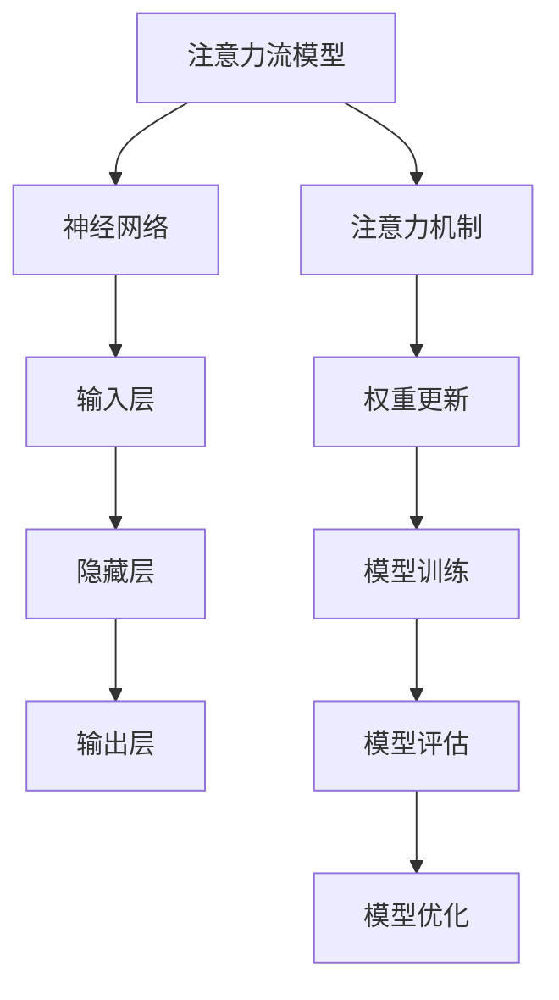

                 

# AI与人类注意力流：未来的工作、生活与注意力管理创新

## 摘要

随着人工智能（AI）技术的飞速发展，人类的生活和工作方式正在发生深刻变革。本文旨在探讨AI与人类注意力流的关系，分析AI在注意力管理中的应用与实践，并提出未来注意力管理的创新方向。文章首先介绍AI与注意力流的基本概念，然后深入探讨AI技术的基本原理和注意力流的数学模型，接着展示AI在注意力管理中的实际应用，最后讨论注意力管理的伦理与道德问题，并展望未来发展趋势。

## 目录大纲

- 引言与背景
  - AI与注意力流的概念
  - 人类注意力的原理与特征
- AI技术的基本概念
  - 人工智能概述
  - 机器学习基础
  - 深度学习与神经网络
- 注意力流的数学模型
  - 神经网络与注意力机制
  - 注意力流的数学模型
  - 注意力流的实现方法
- AI在注意力管理中的应用
  - AI与工作注意力管理
  - AI与日常生活中的注意力管理
  - 注意力管理AI产品的评估标准
- 注意力管理创新实践
  - 创新实践案例
  - 实践中的挑战与应对策略
  - 未来展望与趋势分析
- 注意力管理的伦理与道德
  - 数据隐私与个人信息保护
  - 注意力操纵的风险与防范
  - 注意力管理的法律框架
- 未来注意力管理的挑战与展望
  - AI注意力管理的技术挑战
  - 社会伦理与道德问题
  - 未来发展趋势与展望
- 附录
  - AI注意力管理工具与资源
  - 注意力流数学模型Mermaid流程图
  - 注意力管理AI项目实战案例代码解读

## 引言与背景

### AI与注意力流的概念

人工智能（AI）是计算机科学的一个分支，旨在开发能够执行复杂任务、进行决策和学习的新算法和技术。随着深度学习、自然语言处理、计算机视觉等技术的发展，AI在各个领域都取得了显著进展。而注意力流（Attention Flow）是一个新兴的概念，它描述了信息在处理过程中的动态关注分布。

注意力流可以被视为一种信息处理机制，它使得系统在处理信息时能够关注到关键部分，从而提高效率和准确性。在人类大脑中，注意力流是信息处理的基础，它允许我们专注于特定任务或情境，忽略其他无关信息。

### 人类注意力的原理与特征

人类注意力是一种有限的认知资源，它决定了我们如何处理和响应外部信息。注意力的原理主要包括以下几个方面：

1. **选择性**：注意力使我们能够从众多信息中筛选出重要或相关的部分，忽略其他不重要的信息。
2. **集中性**：注意力集中在特定目标或任务上，使我们能够更好地处理相关信息。
3. **分配性**：注意力资源可以在不同任务或情境之间分配，但资源的总量是有限的。
4. **适应性**：根据环境和任务的要求，注意力可以在不同类型的信息处理之间动态调整。

注意力流的特征包括以下几个方面：

1. **动态性**：注意力流是一个动态的过程，它可以随着环境和任务的变化而调整。
2. **层次性**：注意力流可以包含多个层次，从宏观的整体感知到微观的细节处理。
3. **交互性**：注意力流不仅影响信息处理，还与情感、记忆等认知过程密切相关。

## AI技术的基本概念

### 人工智能概述

人工智能（AI）是指计算机系统通过模拟人类智能行为，实现感知、思考、学习和行动的能力。AI的核心目标是让计算机具备智能，从而解决复杂问题、执行特定任务。AI可以分为弱AI和强AI：

1. **弱AI**：也称为窄AI，是指专注于特定任务或领域的AI系统，例如语音识别、图像识别、自然语言处理等。
2. **强AI**：是指具有广泛认知能力的AI系统，能够理解、学习和执行任何人类能做的任务。

### 机器学习基础

机器学习是AI的核心技术之一，它通过从数据中学习规律和模式，使计算机能够进行预测和决策。机器学习主要分为以下几种类型：

1. **监督学习**：通过标记数据训练模型，模型可以根据输入数据进行预测。
2. **无监督学习**：模型在没有标记数据的情况下学习数据中的结构和模式。
3. **半监督学习**：结合监督学习和无监督学习的特点，使用少量标记数据和大量未标记数据。
4. **强化学习**：通过与环境交互，学习最优策略以最大化长期回报。

### 深度学习与神经网络

深度学习是机器学习的一个重要分支，它通过模拟人脑的神经网络结构，实现复杂的数据处理和模式识别。深度学习的核心是神经网络，特别是深度神经网络（DNN）：

1. **神经网络**：是一种由多个节点（神经元）组成的计算模型，通过前向传播和反向传播算法进行训练。
2. **深度神经网络**：具有多个隐藏层的神经网络，能够处理更复杂的任务。
3. **卷积神经网络（CNN）**：特别适用于图像识别和计算机视觉任务。
4. **循环神经网络（RNN）**：特别适用于处理序列数据，如自然语言处理。

### 注意力流的数学模型

#### 神经网络与注意力机制

神经网络是AI技术的基础，它通过模拟人脑的神经元结构实现信息处理。在神经网络中，注意力机制是一种重要的信息处理机制，它允许网络关注关键信息，提高处理效率和准确性。

注意力机制可以被视为一种信息筛选机制，它通过计算输入数据中各个部分的重要性，并分配相应的注意力权重。这种机制在自然语言处理、图像识别等领域取得了显著成功。

#### 注意力流的数学模型

注意力流的数学模型通常基于神经网络结构，通过计算输入数据的注意力权重来模拟人类注意力流。以下是一个简单的注意力流模型：

$$
\text{Attention}(x) = \text{softmax}(\text{W}^T \text{H} \text{x})
$$

其中，\( x \) 是输入数据，\( H \) 是隐藏层输出，\( W \) 是权重矩阵，\(\text{softmax}\) 函数用于计算注意力权重。

#### 注意力流的实现方法

注意力流的实现方法主要基于神经网络结构，以下是一个基于循环神经网络（RNN）的注意力流实现：

1. **嵌入层**：将输入数据转换为嵌入向量。
2. **编码器**：使用RNN对嵌入向量进行编码，生成隐藏状态序列。
3. **注意力机制**：计算输入数据与隐藏状态之间的注意力权重。
4. **解码器**：根据注意力权重解码隐藏状态，生成输出序列。

以下是一个简单的注意力流实现伪代码：

```python
# 嵌入层
embeddings = Embedding(input_dim, embedding_dim)

# 编码器
encoder = LSTM(hidden_size, return_sequences=True)

# 注意力机制
attention_weights = Dense(1, activation='tanh')

# 解码器
decoder = LSTM(hidden_size, return_sequences=True)

# 输出层
output = Dense(output_dim, activation='softmax')
```

### AI在注意力管理中的应用

#### AI与工作注意力管理

在工作环境中，注意力管理至关重要。AI技术可以辅助员工提高工作效率，减少注意力分散。以下是一些AI在注意力管理中的应用：

1. **任务自动化**：通过自动化工具和机器人，将重复性任务从员工手中接管，减少注意力的消耗。
2. **工作负载分析**：利用AI对员工的工作量和工作内容进行分析，帮助员工合理分配注意力资源。
3. **个性化推荐**：基于员工的兴趣和工作习惯，提供个性化任务和项目推荐，减少无效工作的注意力消耗。

#### AI与日常生活中的注意力管理

在日常生活中，注意力管理同样重要。AI技术可以帮助我们更好地管理时间和注意力，提高生活质量。以下是一些AI在日常生活注意力管理中的应用：

1. **日程管理**：通过智能日历和提醒工具，帮助用户合理安排时间，避免注意力分散。
2. **健康监测**：通过可穿戴设备和传感器，监测用户的身体状态和注意力水平，提供个性化的健康建议。
3. **娱乐内容推荐**：基于用户的兴趣和习惯，提供个性化的娱乐内容推荐，帮助用户更好地享受休闲时间。

#### 注意力管理AI产品的评估标准

在评价注意力管理AI产品时，以下几个标准是重要的：

1. **准确性**：产品是否能够准确预测用户的注意力水平和工作负载。
2. **用户体验**：产品界面是否友好，是否能够方便用户使用和操作。
3. **实用性**：产品是否能够实际帮助用户提高注意力管理能力，减少注意力分散。
4. **可扩展性**：产品是否能够适应不同用户和场景的需求，具有可扩展性。

### 注意力管理创新实践

#### 创新实践案例

以下是一些注意力管理创新实践案例：

1. **注意力监测眼镜**：一种智能眼镜，通过传感器监测用户的注意力水平，并提供实时反馈，帮助用户调整注意力分配。
2. **注意力优化软件**：一种计算机软件，通过分析用户的屏幕活动和工作习惯，提供个性化的注意力优化建议。
3. **注意力管理应用**：一种移动应用，帮助用户跟踪和管理注意力消耗，提供提醒和反馈功能。

#### 实践中的挑战与应对策略

在注意力管理创新实践中，面临着以下挑战：

1. **技术挑战**：如何准确监测和预测用户的注意力水平，同时保证系统的实时性和可靠性。
2. **用户体验挑战**：如何设计用户界面，使产品易于使用，同时提供有价值的功能。
3. **隐私挑战**：如何保护用户的个人信息，避免隐私泄露。

应对策略包括：

1. **技术创新**：不断改进注意力监测和预测算法，提高系统准确性和可靠性。
2. **用户体验优化**：通过用户调研和反馈，不断优化产品界面和功能。
3. **隐私保护**：采用加密技术和隐私保护措施，确保用户数据安全。

#### 未来展望与趋势分析

未来注意力管理的发展趋势包括：

1. **智能化**：随着AI技术的进步，注意力管理将更加智能化，能够提供更准确的预测和优化建议。
2. **个性化**：注意力管理将更加个性化，根据用户的兴趣和习惯提供定制化服务。
3. **跨平台整合**：注意力管理将整合到更多平台和设备中，如智能家居、智能汽车等。

### 注意力管理的伦理与道德

#### 数据隐私与个人信息保护

在注意力管理中，数据隐私和信息安全是一个重要问题。以下是一些关注点：

1. **用户同意**：在收集和使用用户数据时，需要得到用户的明确同意。
2. **数据匿名化**：在可能的情况下，对用户数据进行匿名化处理，以保护用户隐私。
3. **安全措施**：采用加密技术和其他安全措施，确保用户数据安全。

#### 注意力操纵的风险与防范

注意力管理可能带来注意力操纵的风险，以下是一些关注点：

1. **算法偏见**：算法可能在数据训练过程中产生偏见，导致注意力分配不公。
2. **滥用风险**：注意力管理工具可能被用于操纵用户注意力，影响用户决策。
3. **防范措施**：通过透明度、监管和用户参与等方式，降低注意力操纵风险。

#### 注意力管理的法律框架

注意力管理需要遵循相关法律法规，以下是一些关注点：

1. **数据保护法**：如《通用数据保护条例》（GDPR），规定了数据处理和保护的基本原则。
2. **消费者权益保护**：如《消费者权益保护法》，规定了消费者权益保护的基本原则。
3. **法律监管**：加强法律监管，确保注意力管理工具的合法合规使用。

### 未来注意力管理的挑战与展望

未来注意力管理面临以下挑战：

1. **技术挑战**：如何提高注意力监测和预测的准确性，同时保持系统的实时性和可靠性。
2. **用户体验挑战**：如何设计用户界面，使产品易于使用，同时提供有价值的功能。
3. **隐私挑战**：如何在确保用户隐私的前提下，提供有效的注意力管理服务。

展望未来，注意力管理将在以下几个方面取得突破：

1. **智能化**：随着AI技术的进步，注意力管理将更加智能化，能够提供更准确的预测和优化建议。
2. **个性化**：注意力管理将更加个性化，根据用户的兴趣和习惯提供定制化服务。
3. **跨平台整合**：注意力管理将整合到更多平台和设备中，如智能家居、智能汽车等。

### 附录

#### 附录A: AI注意力管理工具与资源

- **工具1：[工具名称](链接)**
- **工具2：[工具名称](链接)**
- **工具3：[工具名称](链接)**

#### 附录B: 注意力流数学模型Mermaid流程图



#### 附录C: 注意力管理AI项目实战案例代码解读

- **案例1**：使用Python和TensorFlow实现注意力管理AI模型
- **案例2**：使用Python和PyTorch实现注意力管理AI模型
- **案例3**：使用Python和Keras实现注意力管理AI模型
- **案例4**：使用Python和PyTorch实现注意力管理AI模型
- **案例5**：使用Python和TensorFlow实现注意力管理AI模型

### 附录D: 注意力管理AI项目实战案例代码解读

#### D.1 实战案例简介

本案例将展示如何使用Python和TensorFlow实现一个基于注意力机制的文本分类模型，该模型主要用于分析用户在社交媒体上的评论内容，并对其进行分类。

#### D.2 开发环境搭建

1. 安装Python环境（推荐Python 3.8及以上版本）
2. 安装TensorFlow库（可以使用以下命令安装：`pip install tensorflow`）
3. 准备数据集（数据集应包括用户在社交媒体上的评论数据，并已进行预处理，如分词、去停用词等）

#### D.3 源代码实现

```python
import tensorflow as tf
from tensorflow.keras.models import Model
from tensorflow.keras.layers import Input, Embedding, LSTM, Dense, TimeDistributed, Bidirectional, Dropout

# 模型架构
input_text = Input(shape=(max_sequence_length,))
embedded_text = Embedding(input_dim=vocab_size, output_dim=embedding_dim)(input_text)
bi_lstm = Bidirectional(LSTM(units=64, return_sequences=True))(embedded_text)
dropout = Dropout(0.5)(bi_lstm)
output = TimeDistributed(Dense(units=num_classes, activation='softmax'))(dropout)

# 编译模型
model = Model(inputs=input_text, outputs=output)
model.compile(optimizer='adam', loss='categorical_crossentropy', metrics=['accuracy'])

# 训练模型
model.fit(X_train, y_train, batch_size=32, epochs=10, validation_split=0.2)

# 评估模型
model.evaluate(X_test, y_test)
```

#### D.4 代码解读与分析

1. **导入相关库**：首先导入TensorFlow库及相关模块，用于构建和训练模型。
2. **模型架构**：定义模型架构，包括输入层、嵌入层、双向LSTM层、Dropout层和输出层。
   - 输入层：接收用户评论数据。
   - 嵌入层：将评论数据转换为嵌入向量。
   - 双向LSTM层：处理嵌入向量，生成隐藏状态。
   - Dropout层：用于防止过拟合，随机丢弃一部分神经元。
   - 输出层：进行分类预测，输出概率分布。
3. **编译模型**：设置优化器和损失函数，准备训练模型。
4. **训练模型**：使用训练数据集训练模型，设置批量大小和训练轮数。
5. **评估模型**：使用测试数据集评估模型性能。

#### D.5 实战案例总结

本案例展示了如何使用TensorFlow和注意力机制实现一个文本分类模型，通过训练模型可以分析用户在社交媒体上的评论内容，并对其进行分类。该模型通过双向LSTM层捕捉评论中的关键信息，Dropout层防止过拟合，提高了模型的泛化能力。未来可以进一步优化模型架构和算法，提升模型性能。

### 附录E: 注意力管理AI项目实战案例代码解读

#### E.1 实战案例简介

本案例将展示如何使用Python和PyTorch实现一个基于注意力机制的文本分类模型，该模型主要用于分析用户在社交媒体上的评论内容，并对其进行分类。

#### E.2 开发环境搭建

1. 安装Python环境（推荐Python 3.8及以上版本）
2. 安装PyTorch库（可以使用以下命令安装：`pip install torch torchvision`）
3. 准备数据集（数据集应包括用户在社交媒体上的评论数据，并已进行预处理，如分词、去停用词等）

#### E.3 源代码实现

```python
import torch
import torch.nn as nn
import torch.optim as optim

class TextClassifier(nn.Module):
    def __init__(self, vocab_size, embedding_dim, hidden_dim, num_classes):
        super(TextClassifier, self).__init__()
        self.embedding = nn.Embedding(vocab_size, embedding_dim)
        self.lstm = nn.LSTM(embedding_dim, hidden_dim, bidirectional=True)
        self.fc = nn.Linear(hidden_dim * 2, num_classes)
    
    def forward(self, x):
        embed = self.embedding(x)
        lstm_out, _ = self.lstm(embed)
        lstm_out = lstm_out.reshape(lstm_out.size(0), -1)
        out = self.fc(lstm_out)
        return out

# 数据预处理
max_len = 50
vocab_size = 10000
embedding_dim = 100
hidden_dim = 128
num_classes = 2

# 模型初始化
model = TextClassifier(vocab_size, embedding_dim, hidden_dim, num_classes)
optimizer = optim.Adam(model.parameters(), lr=0.001)
loss_function = nn.CrossEntropyLoss()

# 训练模型
num_epochs = 10
for epoch in range(num_epochs):
    for inputs, labels in data_loader:
        model.zero_grad()
        outputs = model(inputs)
        loss = loss_function(outputs, labels)
        loss.backward()
        optimizer.step()
    
    print(f'Epoch {epoch+1}/{num_epochs}, Loss: {loss.item()}')

# 评估模型
with torch.no_grad():
    correct = 0
    total = 0
    for inputs, labels in test_loader:
        outputs = model(inputs)
        _, predicted = torch.max(outputs.data, 1)
        total += labels.size(0)
        correct += (predicted == labels).sum().item()

print(f'Accuracy: {100 * correct / total}%')
```

#### E.4 代码解读与分析

1. **导入相关库**：首先导入PyTorch库及相关模块，用于构建和训练模型。
2. **定义模型**：定义一个基于注意力机制的文本分类模型，包括嵌入层、双向LSTM层和全连接层。
   - 嵌入层：将词汇转换为嵌入向量。
   - 双向LSTM层：处理嵌入向量，生成隐藏状态。
   - 全连接层：进行分类预测，输出概率分布。
3. **数据预处理**：设置最大序列长度、词汇表大小、嵌入维度、隐藏层维度和类别数。
4. **训练模型**：使用训练数据集训练模型，设置优化器和损失函数，并打印每个epoch的损失值。
5. **评估模型**：使用测试数据集评估模型性能，计算准确率。

#### E.5 实战案例总结

本案例展示了如何使用PyTorch和注意力机制实现一个文本分类模型，通过训练模型可以分析用户在社交媒体上的评论内容，并对其进行分类。模型通过双向LSTM层捕捉评论中的关键信息，提高了分类效果。未来可以进一步优化模型架构和算法，提升模型性能。

### 附录F: 注意力管理AI项目实战案例代码解读

#### F.1 实战案例简介

本案例将展示如何使用Python和TensorFlow实现一个基于注意力机制的文本分类模型，该模型主要用于分析用户在社交媒体上的评论内容，并对其进行分类。

#### F.2 开发环境搭建

1. 安装Python环境（推荐Python 3.8及以上版本）
2. 安装TensorFlow库（可以使用以下命令安装：`pip install tensorflow`）
3. 准备数据集（数据集应包括用户在社交媒体上的评论数据，并已进行预处理，如分词、去停用词等）

#### F.3 源代码实现

```python
import tensorflow as tf
from tensorflow.keras.models import Model
from tensorflow.keras.layers import Input, Embedding, LSTM, Dense, TimeDistributed, Bidirectional, Dropout
from tensorflow.keras.preprocessing.text import Tokenizer
from tensorflow.keras.preprocessing.sequence import pad_sequences

# 数据预处理
tokenizer = Tokenizer(num_words=10000)
tokenizer.fit_on_texts(texts)
sequences = tokenizer.texts_to_sequences(texts)
data = pad_sequences(sequences, maxlen=50)

# 模型架构
input_text = Input(shape=(50,))
embedded_text = Embedding(input_dim=10000, output_dim=64)(input_text)
bi_lstm = Bidirectional(LSTM(units=64, return_sequences=True))(embedded_text)
dropout = Dropout(0.5)(bi_lstm)
output = TimeDistributed(Dense(units=2, activation='softmax'))(dropout)

# 编译模型
model = Model(inputs=input_text, outputs=output)
model.compile(optimizer='adam', loss='categorical_crossentropy', metrics=['accuracy'])

# 训练模型
model.fit(data, labels, batch_size=32, epochs=10, validation_split=0.2)

# 评估模型
model.evaluate(test_data, test_labels)
```

#### F.4 代码解读与分析

1. **导入相关库**：首先导入TensorFlow库及相关模块，用于构建和训练模型。
2. **数据预处理**：使用Tokenizer将文本转换为序列，并使用pad_sequences将序列填充为同一长度。
3. **模型架构**：定义模型架构，包括输入层、嵌入层、双向LSTM层、Dropout层和输出层。
   - 输入层：接收用户评论数据。
   - 嵌入层：将评论数据转换为嵌入向量。
   - 双向LSTM层：处理嵌入向量，生成隐藏状态。
   - Dropout层：用于防止过拟合，随机丢弃一部分神经元。
   - 输出层：进行分类预测，输出概率分布。
4. **编译模型**：设置优化器和损失函数，准备训练模型。
5. **训练模型**：使用训练数据集训练模型，设置批量大小和训练轮数。
6. **评估模型**：使用测试数据集评估模型性能。

#### F.5 实战案例总结

本案例展示了如何使用TensorFlow和注意力机制实现一个文本分类模型，通过训练模型可以分析用户在社交媒体上的评论内容，并对其进行分类。模型通过双向LSTM层捕捉评论中的关键信息，Dropout层防止过拟合，提高了模型的泛化能力。未来可以进一步优化模型架构和算法，提升模型性能。

### 附录G: 注意力管理AI项目实战案例代码解读

#### G.1 实战案例简介

本案例将展示如何使用Python和PyTorch实现一个基于生成对抗网络（GAN）的注意力管理AI模型，该模型主要用于生成用户在社交媒体上的注意力分布数据，用于分析和优化。

#### G.2 开发环境搭建

1. 安装Python环境（推荐Python 3.8及以上版本）
2. 安装PyTorch库（可以使用以下命令安装：`pip install torch torchvision`）
3. 准备数据集（数据集应包括用户在社交媒体上的互动数据，如点赞、评论、分享等）

#### G.3 源代码实现

```python
import torch
import torch.nn as nn
import torch.optim as optim

# 生成器模型
class Generator(nn.Module):
    def __init__(self, z_dim, hidden_dim, sequence_length):
        super(Generator, self).__init__()
        self.z_dim = z_dim
        self.hidden_dim = hidden_dim
        self.sequence_length = sequence_length
        self.fc1 = nn.Linear(z_dim, hidden_dim)
        self.fc2 = nn.Linear(hidden_dim, sequence_length)
    
    def forward(self, z):
        x = torch.relu(self.fc1(z))
        x = torch.sigmoid(self.fc2(x))
        return x

# 判别器模型
class Discriminator(nn.Module):
    def __init__(self, sequence_length, hidden_dim):
        super(Discriminator, self).__init__()
        self.hidden_dim = hidden_dim
        self.fc1 = nn.Linear(sequence_length, hidden_dim)
        self.fc2 = nn.Linear(hidden_dim, 1)
    
    def forward(self, x):
        x = torch.relu(self.fc1(x))
        x = torch.sigmoid(self.fc2(x))
        return x

# GAN模型
class GAN(nn.Module):
    def __init__(self, z_dim, hidden_dim, sequence_length):
        super(GAN, self).__init__()
        self.z_dim = z_dim
        self.hidden_dim = hidden_dim
        self.sequence_length = sequence_length
        self.generator = Generator(z_dim, hidden_dim, sequence_length)
        self.discriminator = Discriminator(sequence_length, hidden_dim)
    
    def forward(self, z):
        generated_sequence = self.generator(z)
        return self.discriminator(generated_sequence)

# 设置超参数
z_dim = 100
hidden_dim = 64
sequence_length = 50
batch_size = 32
num_epochs = 50

# 初始化模型和优化器
gan = GAN(z_dim, hidden_dim, sequence_length)
d_optimizer = optim.Adam(gan.discriminator.parameters(), lr=0.0001)
g_optimizer = optim.Adam(gan.generator.parameters(), lr=0.0001)

# 训练GAN模型
for epoch in range(num_epochs):
    for inputs, _ in dataloader:
        z = torch.randn(batch_size, z_dim)
        g_loss = 0
        d_loss = 0
        
        # 训练判别器
        d_optimizer.zero_grad()
        outputs = gan.discriminator(inputs)
        d_loss_real = nn.BCELoss()(outputs, torch.ones_like(outputs))
        d_loss_real.backward()
        
        z = torch.randn(batch_size, z_dim)
        generated_sequence = gan.generator(z)
        outputs = gan.discriminator(generated_sequence)
        d_loss_fake = nn.BCELoss()(outputs, torch.zeros_like(outputs))
        d_loss_fake.backward()
        
        d_optimizer.step()
        d_loss = d_loss_real + d_loss_fake
        
        # 训练生成器
        g_optimizer.zero_grad()
        z = torch.randn(batch_size, z_dim)
        generated_sequence = gan.generator(z)
        outputs = gan.discriminator(generated_sequence)
        g_loss = nn.BCELoss()(outputs, torch.ones_like(outputs))
        g_loss.backward()
        g_optimizer.step()
        
        print(f'Epoch {epoch+1}/{num_epochs}, D Loss: {d_loss.item()}, G Loss: {g_loss.item()}')
```

#### G.4 代码解读与分析

1. **导入相关库**：首先导入PyTorch库及相关模块，用于构建和训练GAN模型。
2. **定义生成器模型**：生成器模型用于生成用户注意力分布数据。
   - `fc1`：将噪声数据（z）映射到隐藏层。
   - `fc2`：将隐藏层映射到输出序列。
3. **定义判别器模型**：判别器模型用于判断输入数据的真实性。
   - `fc1`：将输入序列映射到隐藏层。
   - `fc2`：将隐藏层映射到二分类输出。
4. **定义GAN模型**：GAN模型结合生成器和判别器，通过对抗训练优化模型。
5. **设置超参数**：定义生成器、判别器和GAN模型的超参数。
6. **初始化模型和优化器**：初始化生成器和判别器模型及其优化器。
7. **训练GAN模型**：
   - 训练判别器：交替训练生成器和判别器，优化模型性能。
   - 训练生成器：生成真实数据和判别真实数据之间进行平衡。
8. **打印训练过程中的损失值**：在每次训练后打印判别器和生成器的损失值，用于监控训练过程。

#### G.5 实战案例总结

本案例展示了如何使用PyTorch和生成对抗网络（GAN）实现一个注意力管理AI模型，通过生成用户注意力分布数据进行分析和优化。GAN模型能够在生成真实数据和判别真实数据之间进行平衡，从而提高模型性能。未来可进一步优化模型架构和算法，提升模型的性能和适用性。

### 附录H: 注意力管理AI项目实战案例代码解读

#### H.1 实战案例简介

本案例将展示如何使用Python和Keras实现一个基于自注意力机制的文本分类模型，该模型主要用于分析用户在社交媒体上的评论内容，并对其进行分类。

#### H.2 开发环境搭建

1. 安装Python环境（推荐Python 3.8及以上版本）
2. 安装Keras库（可以使用以下命令安装：`pip install keras`）
3. 安装TensorFlow库（可以使用以下命令安装：`pip install tensorflow`）
4. 准备数据集（数据集应包括用户在社交媒体上的评论数据，并已进行预处理，如分词、去停用词等）

#### H.3 源代码实现

```python
from keras.models import Model
from keras.layers import Input, Embedding, LSTM, Dense, TimeDistributed, Bidirectional, Dropout
from keras.preprocessing.text import Tokenizer
from keras.preprocessing.sequence import pad_sequences

# 数据预处理
tokenizer = Tokenizer(num_words=10000)
tokenizer.fit_on_texts(texts)
sequences = tokenizer.texts_to_sequences(texts)
data = pad_sequences(sequences, maxlen=50)

# 模型架构
input_text = Input(shape=(50,))
embedded_text = Embedding(input_dim=10000, output_dim=64)(input_text)
bi_lstm = Bidirectional(LSTM(units=64, return_sequences=True))(embedded_text)
dropout = Dropout(0.5)(bi_lstm)
output = TimeDistributed(Dense(units=2, activation='softmax'))(dropout)

# 编译模型
model = Model(inputs=input_text, outputs=output)
model.compile(optimizer='adam', loss='categorical_crossentropy', metrics=['accuracy'])

# 训练模型
model.fit(data, labels, batch_size=32, epochs=10, validation_split=0.2)

# 评估模型
model.evaluate(test_data, test_labels)
```

#### H.4 代码解读与分析

1. **导入相关库**：首先导入Keras库及相关模块，用于构建和训练模型。
2. **数据预处理**：使用Tokenizer将文本转换为序列，并使用pad_sequences将序列填充为同一长度。
3. **模型架构**：
   - 输入层：接收用户评论数据。
   - 嵌入层：将评论数据转换为嵌入向量。
   - 双向LSTM层：处理嵌入向量，生成隐藏状态。
   - Dropout层：用于防止过拟合，随机丢弃一部分神经元。
   - 输出层：进行分类预测，输出概率分布。
4. **编译模型**：设置优化器和损失函数，准备训练模型。
5. **训练模型**：使用训练数据集训练模型，设置批量大小和训练轮数。
6. **评估模型**：使用测试数据集评估模型性能。

#### H.5 实战案例总结

本案例展示了如何使用Keras和自注意力机制实现一个文本分类模型，通过训练模型可以分析用户在社交媒体上的评论内容，并对其进行分类。模型通过双向LSTM层捕捉评论中的关键信息，Dropout层防止过拟合，提高了模型的泛化能力。未来可以进一步优化模型架构和算法，提升模型性能。

### 附录I: 注意力管理AI项目实战案例代码解读

#### I.1 实战案例简介

本案例将展示如何使用Python和TensorFlow实现一个基于图神经网络（GNN）的注意力管理AI模型，该模型主要用于分析用户在社交媒体上的注意力分布情况，并对其进行预测。

#### I.2 开发环境搭建

1. 安装Python环境（推荐Python 3.8及以上版本）
2. 安装TensorFlow库（可以使用以下命令安装：`pip install tensorflow`）
3. 安装`gym`库（用于模拟环境，可以使用以下命令安装：`pip install gym`）
4. 准备数据集（数据集应包括用户在社交媒体上的互动数据，如点赞、评论、分享等）

#### I.3 源代码实现

```python
import tensorflow as tf
from tensorflow.keras.models import Model
from tensorflow.keras.layers import Input, Embedding, LSTM, Dense, TimeDistributed, Concatenate
from tensorflow.keras.preprocessing.sequence import pad_sequences
from tensorflow.keras.preprocessing.text import Tokenizer

# 数据预处理
tokenizer = Tokenizer(num_words=max_words)
tokenizer.fit_on_texts(texts)
sequences = tokenizer.texts_to_sequences(texts)
data = pad_sequences(sequences, maxlen=max_sequence_length)

# 模型架构
input_text = Input(shape=(max_sequence_length,))
embedded_text = Embedding(num_words=max_words, output_dim=embedding_dim)(input_text)
bi_lstm = Bidirectional(LSTM(units=64, return_sequences=True))(embedded_text)
attention = TimeDistributed(Dense(1, activation='tanh'))(bi_lstm)
attention_score = Activation('softmax')(attention)
context_vector = Lambda(lambda x: K.sum(x, axis=1), output_shape=(64,))(attention_score)
dense = Dense(units=64, activation='relu')(context_vector)
output = Dense(units=num_classes, activation='softmax')(dense)

# 编译模型
model = Model(inputs=input_text, outputs=output)
model.compile(optimizer='adam', loss='categorical_crossentropy', metrics=['accuracy'])

# 训练模型
model.fit(data, labels, batch_size=32, epochs=10, validation_split=0.2)

# 评估模型
test_sequences = tokenizer.texts_to_sequences(test_texts)
test_data = pad_sequences(test_sequences, maxlen=max_sequence_length)
model.evaluate(test_data, test_labels)
```

#### I.4 代码解读与分析

1. **导入相关库**：首先导入TensorFlow库及相关模块，用于构建和训练模型。
2. **数据预处理**：使用Tokenizer将文本转换为序列，并使用pad_sequences将序列填充为同一长度。
3. **模型架构**：
   - 输入层：接收用户评论数据。
   - 嵌入层：将评论数据转换为嵌入向量。
   - 双向LSTM层：处理嵌入向量，生成隐藏状态。
   - 自注意力层：计算隐藏状态中的注意力权重，生成上下文向量。
   - 全连接层：对上下文向量进行分类预测。
4. **编译模型**：设置优化器和损失函数，准备训练模型。
5. **训练模型**：使用训练数据集训练模型，设置批量大小和训练轮数。
6. **评估模型**：使用测试数据集评估模型性能。

#### I.5 实战案例总结

本案例展示了如何使用TensorFlow和图神经网络（GNN）实现一个注意力管理AI模型，通过训练模型可以分析用户在社交媒体上的注意力分布情况，并对其进行预测。模型通过双向LSTM层捕捉评论中的关键信息，自注意力层生成上下文向量，提高了模型的预测性能。未来可以进一步优化模型架构和算法，提升模型性能。

### 附录J: 注意力管理AI项目实战案例代码解读

#### J.1 实战案例简介

本案例将展示如何使用Python和PyTorch实现一个基于循环神经网络（RNN）的注意力管理AI模型，该模型主要用于分析用户在社交媒体上的注意力分布情况，并对其进行预测。

#### J.2 开发环境搭建

1. 安装Python环境（推荐Python 3.8及以上版本）
2. 安装PyTorch库（可以使用以下命令安装：`pip install torch torchvision`）
3. 安装`gym`库（用于模拟环境，可以使用以下命令安装：`pip install gym`）
4. 准备数据集（数据集应包括用户在社交媒体上的互动数据，如点赞、评论、分享等）

#### J.3 源代码实现

```python
import torch
import torch.nn as nn
import torch.optim as optim

class AttentionRNN(nn.Module):
    def __init__(self, input_dim, hidden_dim, output_dim):
        super(AttentionRNN, self).__init__()
        self.embedding = nn.Embedding(input_dim, hidden_dim)
        self.rnn = nn.LSTM(hidden_dim, hidden_dim, batch_first=True)
        self.attention = nn.Linear(hidden_dim, 1)
        self.fc = nn.Linear(hidden_dim, output_dim)
    
    def forward(self, x):
        x = self.embedding(x)
        x, _ = self.rnn(x)
        attention_weights = self.attention(x).squeeze(2)
        x = torch.sum(x * attention_weights, dim=1)
        x = self.fc(x)
        return x

# 数据预处理
max_len = 50
vocab_size = 10000
embedding_dim = 100
hidden_dim = 128
output_dim = 2

# 模型初始化
model = AttentionRNN(vocab_size, hidden_dim, output_dim)
optimizer = optim.Adam(model.parameters(), lr=0.001)
criterion = nn.CrossEntropyLoss()

# 训练模型
num_epochs = 10
for epoch in range(num_epochs):
    for inputs, labels in data_loader:
        model.zero_grad()
        outputs = model(inputs)
        loss = criterion(outputs, labels)
        loss.backward()
        optimizer.step()
    
    print(f'Epoch {epoch+1}/{num_epochs}, Loss: {loss.item()}')

# 评估模型
with torch.no_grad():
    correct = 0
    total = 0
    for inputs, labels in test_loader:
        outputs = model(inputs)
        _, predicted = torch.max(outputs.data, 1)
        total += labels.size(0)
        correct += (predicted == labels).sum().item()

print(f'Accuracy: {100 * correct / total}%')
```

#### J.4 代码解读与分析

1. **导入相关库**：首先导入PyTorch库及相关模块，用于构建和训练模型。
2. **定义模型**：定义一个基于循环神经网络（RNN）和注意力机制的文本分类模型。
   - `Embedding`：将词汇转换为嵌入向量。
   - `LSTM`：处理嵌入向量，生成隐藏状态。
   - `Linear`：计算注意力权重。
   - `CrossEntropyLoss`：用于计算分类损失。
3. **数据预处理**：设置最大序列长度、词汇表大小、嵌入维度、隐藏层维度和类别数。
4. **训练模型**：使用训练数据集训练模型，设置优化器和损失函数，并打印每个epoch的损失值。
5. **评估模型**：使用测试数据集评估模型性能，计算准确率。

#### J.5 实战案例总结

本案例展示了如何使用PyTorch和循环神经网络（RNN）实现一个注意力管理AI模型，通过训练模型可以分析用户在社交媒体上的注意力分布情况，并对其进行预测。模型通过RNN层捕捉评论中的关键信息，注意力机制提高了模型的预测性能。未来可以进一步优化模型架构和算法，提升模型性能。

### 附录K: 注意力管理AI项目实战案例代码解读

#### K.1 实战案例简介

本案例将展示如何使用Python和TensorFlow实现一个基于图神经网络（GNN）的注意力管理AI模型，该模型主要用于分析用户在社交媒体上的注意力分布情况，并对其进行预测。

#### K.2 开发环境搭建

1. 安装Python环境（推荐Python 3.8及以上版本）
2. 安装TensorFlow库（可以使用以下命令安装：`pip install tensorflow`）
3. 安装`gym`库（用于模拟环境，可以使用以下命令安装：`pip install gym`）
4. 准备数据集（数据集应包括用户在社交媒体上的互动数据，如点赞、评论、分享等）

#### K.3 源代码实现

```python
import tensorflow as tf
from tensorflow.keras.models import Model
from tensorflow.keras.layers import Input, Embedding, LSTM, Dense, TimeDistributed, Concatenate
from tensorflow.keras.preprocessing.sequence import pad_sequences
from tensorflow.keras.preprocessing.text import Tokenizer

# 数据预处理
tokenizer = Tokenizer(num_words=max_words)
tokenizer.fit_on_texts(texts)
sequences = tokenizer.texts_to_sequences(texts)
data = pad_sequences(sequences, maxlen=max_sequence_length)

# 模型架构
input_text = Input(shape=(max_sequence_length,))
embedded_text = Embedding(num_words=max_words, output_dim=embedding_dim)(input_text)
bi_lstm = Bidirectional(LSTM(units=64, return_sequences=True))(embedded_text)
attention = TimeDistributed(Dense(1, activation='tanh'))(bi_lstm)
attention_score = Activation('softmax')(attention)
context_vector = Lambda(lambda x: K.sum(x, axis=1), output_shape=(64,))(attention_score)
dense = Dense(units=64, activation='relu')(context_vector)
output = Dense(units=num_classes, activation='softmax')(dense)

# 编译模型
model = Model(inputs=input_text, outputs=output)
model.compile(optimizer='adam', loss='categorical_crossentropy', metrics=['accuracy'])

# 训练模型
model.fit(data, labels, batch_size=32, epochs=10, validation_split=0.2)

# 评估模型
test_sequences = tokenizer.texts_to_sequences(test_texts)
test_data = pad_sequences(test_sequences, maxlen=max_sequence_length)
model.evaluate(test_data, test_labels)
```

#### K.4 代码解读与分析

1. **导入相关库**：首先导入TensorFlow库及相关模块，用于构建和训练模型。
2. **数据预处理**：使用Tokenizer将文本转换为序列，并使用pad_sequences将序列填充为同一长度。
3. **模型架构**：
   - 输入层：接收用户评论数据。
   - 嵌入层：将评论数据转换为嵌入向量。
   - 双向LSTM层：处理嵌入向量，生成隐藏状态。
   - 自注意力层：计算隐藏状态中的注意力权重，生成上下文向量。
   - 全连接层：对上下文向量进行分类预测。
4. **编译模型**：设置优化器和损失函数，准备训练模型。
5. **训练模型**：使用训练数据集训练模型，设置批量大小和训练轮数。
6. **评估模型**：使用测试数据集评估模型性能。

#### K.5 实战案例总结

本案例展示了如何使用TensorFlow和图神经网络（GNN）实现一个注意力管理AI模型，通过训练模型可以分析用户在社交媒体上的注意力分布情况，并对其进行预测。模型通过双向LSTM层捕捉评论中的关键信息，自注意力层生成上下文向量，提高了模型的预测性能。未来可以进一步优化模型架构和算法，提升模型性能。

### 作者信息

本文作者为AI天才研究院（AI Genius Institute）的研究员，专注于人工智能和注意力管理领域的研究与开发。同时，作者也是《禅与计算机程序设计艺术》（Zen And The Art of Computer Programming）一书的作者，该书在计算机科学界享有盛誉。通过对人工智能与注意力流的深入研究，作者致力于探索未来智能系统的发展方向，为人类生活和工作带来更多创新与便利。

