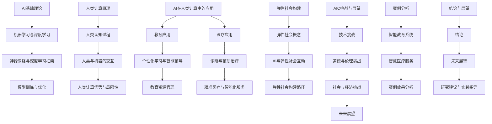

                 

### 核心概念原理和架构 Mermaid 流程图

为了更好地理解和展示 AI 与人类计算的核心概念原理和架构，我们使用 Mermaid 流程图来呈现这些概念之间的联系。



这个流程图清晰地展示了 AI 与人类计算的核心概念和架构，以及它们在不同领域中的应用。接下来，我们将逐步深入探讨这些概念，为读者提供一个全面的技术视角。

### 第一部分：引言与背景

#### 1.1 引言

在过去的几十年中，人工智能（AI）已经成为技术发展的热点，其影响遍及社会的各个领域。从自动驾驶汽车到智能家居，从医疗诊断到金融服务，AI 正在改变我们的生活方式。与此同时，人类计算作为一个古老的概念，也逐渐被赋予新的内涵。人类计算不仅仅是指人类进行的计算活动，还包括人类如何与机器进行交互，如何利用机器的计算能力来增强自身的认知能力和工作效率。

本篇文章的目的是探讨 AI 与人类计算的融合，以及这种融合对未来的社会结构和发展模式的影响。我们将从 AI 的发展历程、人类计算的概念、以及 AI 与人类计算的融合点入手，逐步深入分析它们在不同领域中的应用，探讨如何构建一个弹性社会，并展望未来的发展方向。

#### 1.2 AI的发展历程

人工智能的历史可以追溯到 20 世纪中叶，当时计算机科学家和数学家开始尝试通过编程模拟人类的智能行为。1956 年，达特茅斯会议的召开被认为是人工智能领域的起点，会议提出了“人工智能”这一概念，并确定了人工智能研究的方向。从那时起，人工智能经历了几个重要的发展阶段：

1. **早期探索阶段（1956-1969）**：在这个阶段，人工智能主要关注符号推理和逻辑推理，试图通过编写复杂的算法来解决特定的问题。

2. **繁荣与衰退阶段（1970-1980）**：由于硬件和算法的限制，人工智能研究在 70 年代初开始遇到困难，导致投资减少，研究进入低谷期。

3. **复兴阶段（1980-1990）**：随着计算机硬件性能的提升和算法的进步，人工智能研究重新焕发生机，特别是专家系统和模式识别技术取得了重要进展。

4. **大数据与深度学习阶段（1990-2010）**：随着互联网和大数据技术的发展，机器学习和深度学习成为人工智能研究的主流方向，AI 技术开始实现大规模应用。

5. **应用爆发阶段（2010 至今）**：深度学习技术的发展推动了 AI 在各个领域的应用，从语音识别、图像处理到自动驾驶、自然语言处理，AI 正在迅速改变我们的世界。

#### 1.3 人类计算的概念

人类计算是指人类利用认知能力和计算工具进行信息处理和决策的过程。它不仅包括传统的手动计算，如数学计算、文字处理，还包括现代的数字交互，如使用智能手机、平板电脑等设备进行的信息检索、通信和社交。人类计算的特点是灵活性和适应性，人类能够根据具体情境调整计算方法和策略，适应复杂多变的任务需求。

人类计算与机器计算的区别在于，机器计算依赖于预先编程的算法和数据，而人类计算则具有创造性和自适应能力。人类计算能够处理模糊性和不确定性，能够理解上下文和情境，这是目前的机器计算所难以完全实现的。

#### 1.4 AI与人类计算的融合

AI 与人类计算的融合是指将人工智能技术应用于人类计算的过程中，以增强人类的计算能力和工作效率。这种融合体现在多个方面：

1. **智能辅助**：通过 AI 技术提供智能化的辅助工具，如智能助手、推荐系统等，帮助人类更高效地完成工作。

2. **协同工作**：AI 与人类共同完成任务，利用 AI 的计算能力和人类的创造性思维，实现优势互补。

3. **决策支持**：AI 可以分析大量数据，为人类提供基于数据的决策支持，帮助人类做出更加明智的决策。

4. **人机交互**：通过自然语言处理、语音识别等技术，改善人与机器的交互方式，使人类计算更加直观和便捷。

5. **认知扩展**：AI 可以扩展人类认知能力，如通过记忆增强、思维加速等技术，提高人类的学习和工作效率。

在接下来的章节中，我们将详细探讨 AI 与人类计算在各个领域中的应用，以及如何构建一个弹性社会。通过这些探讨，我们希望能够为未来的社会发展提供一些有价值的思路和参考。

### 第二部分：核心概念与架构

#### 2.1 AI的基础理论

人工智能（AI）作为计算机科学的一个重要分支，其基础理论涵盖了从符号推理到数据驱动的多种方法。理解这些基础理论对于深入探讨 AI 与人类计算的应用至关重要。

##### 2.1.1 AI的定义与分类

人工智能是指使计算机模拟人类智能行为的技术和科学。根据实现方式，AI 可以大致分为两类：

1. **符号推理（Symbolic AI）**：这种方法依赖于逻辑推理和符号表示，通过编写规则和知识库来模拟人类的思维过程。符号推理是早期 AI 研究的主要方向，例如专家系统和逻辑编程。

2. **数据驱动（Data-driven AI）**：这种方法主要通过机器学习和深度学习技术，从大量数据中自动学习规律和模式。数据驱动 AI 包括监督学习、无监督学习和强化学习等子领域。

##### 2.1.2 机器学习与深度学习

机器学习是 AI 的一个重要分支，它通过训练模型从数据中学习，以便进行预测或分类。机器学习可以分为以下几类：

1. **监督学习（Supervised Learning）**：在这种学习中，模型通过训练数据学习特征与标签之间的关系，从而进行预测或分类。常见的算法包括线性回归、决策树、支持向量机（SVM）和神经网络。

2. **无监督学习（Unsupervised Learning）**：在这种学习中，模型从未标记的数据中学习，找出数据中的模式和结构。聚类、降维和关联规则学习是常见的无监督学习算法。

3. **强化学习（Reinforcement Learning）**：在这种学习中，模型通过与环境的交互来学习最优策略，以最大化长期回报。常见的算法包括 Q-学习、深度 Q-网络（DQN）和策略梯度算法。

深度学习是机器学习的进一步发展，它通过多层神经网络来学习复杂的数据特征。深度学习的关键组成部分包括：

1. **神经网络（Neural Networks）**：神经网络是由多个神经元组成的计算模型，通过调整权重和偏置来学习数据特征。前馈神经网络（FNN）是最基本的神经网络结构。

2. **深度神经网络（Deep Neural Networks）**：深度神经网络是包含多个隐藏层的神经网络，能够学习更加复杂的函数关系。卷积神经网络（CNN）和循环神经网络（RNN）是深度神经网络的两种主要类型。

3. **激活函数（Activation Functions）**：激活函数用于引入非线性特性，使神经网络能够拟合复杂的非线性关系。常见的激活函数包括 sigmoid、ReLU 和 tanh。

4. **优化算法（Optimization Algorithms）**：优化算法用于调整网络权重和偏置，以最小化损失函数。梯度下降（Gradient Descent）和其变体（如 Adam、RMSprop）是常用的优化算法。

##### 2.1.3 AI系统的架构设计

一个完整的 AI 系统通常包括数据预处理、模型训练、模型评估和模型部署等几个关键环节。

1. **数据预处理（Data Preprocessing）**：数据预处理是模型训练前的重要步骤，包括数据清洗、数据变换和数据归一化等操作。良好的数据预处理能够提高模型训练效率和性能。

2. **模型训练（Model Training）**：模型训练是通过训练数据调整模型参数，使其能够准确预测或分类。训练过程中，需要选择合适的模型、优化算法和超参数。

3. **模型评估（Model Evaluation）**：模型评估用于评估模型在未见过的数据上的性能。常用的评估指标包括准确率、召回率、F1 分数和均方误差等。

4. **模型部署（Model Deployment）**：模型部署是将训练好的模型应用到实际场景中，以提供实时预测或分类服务。模型部署需要考虑性能、可靠性和安全性等因素。

通过深入理解 AI 的基础理论，我们能够更好地把握 AI 技术的发展方向和应用前景。在接下来的章节中，我们将进一步探讨人类计算的原理和 AI 在人类计算中的应用，以展示它们如何共同构建一个更加弹性、智能和高效的社会。

#### 2.2 人类计算的原理

人类计算是人工智能研究的重要参考框架，它不仅帮助我们理解人类如何处理信息和做出决策，还为设计更接近人类智能的机器系统提供了启示。要深入探讨人类计算的原理，我们需要从以下几个方面进行分析：

##### 2.2.1 人类认知的过程

人类认知过程是一个复杂的、动态的、多层次的系统。它包括感知、注意、记忆、推理和决策等多个环节。以下是这些环节的简要概述：

1. **感知**：感知是认知过程的第一步，它涉及感官系统收集外部信息，并将其转换为神经信号。这些信号通过视觉、听觉、触觉等通道传递到大脑进行处理。

2. **注意**：注意是人类认知的一个重要机制，它决定了哪些信息会被加工和记住。注意机制可以通过选择性地关注某些刺激来提高信息处理效率。

3. **记忆**：记忆是人类认知的基础，它包括短期记忆和长期记忆。短期记忆负责暂时存储和处理信息，而长期记忆则负责持久地存储信息。记忆的保持和检索受到多种因素的影响，如信息的独特性、重复性和情感关联等。

4. **推理**：推理是人类利用已有知识进行逻辑推断的过程。推理可以分为归纳推理和演绎推理。归纳推理是从特定事例中归纳出一般规律，而演绎推理则是从一般原则推导出特定结论。

5. **决策**：决策是人类在认知过程中做出选择的过程。决策受到多种因素的影响，包括目标、情境、信息和时间约束等。决策过程通常涉及权衡不同选项的利弊，并选择最优或满意的方案。

##### 2.2.2 人类与机器的交互

人类与机器的交互是人类计算的重要组成部分，它不仅影响机器的使用效率，还影响人类的工作方式和生活质量。以下是人类与机器交互的一些关键点：

1. **自然语言处理（NLP）**：自然语言处理是使计算机能够理解和生成人类语言的技术。NLP 技术包括语音识别、文本分类、机器翻译和信息检索等。通过 NLP，人类可以更自然地与机器进行交流。

2. **图形用户界面（GUI）**：图形用户界面是人与计算机进行交互的主要方式之一。GUI 通过图形元素（如按钮、图标和菜单）简化了用户与计算机的交互过程，提高了操作的直观性和效率。

3. **多模态交互**：多模态交互结合了多种感官通道（如视觉、听觉和触觉）进行信息传递和反馈。例如，智能音箱结合语音识别和语音合成技术，提供了一个更直观和自然的交互体验。

4. **增强现实（AR）和虚拟现实（VR）**：增强现实和虚拟现实技术通过创建虚拟环境，使人类能够以全新的方式与机器互动。这些技术不仅提供了沉浸式的体验，还为教育和娱乐等领域带来了创新。

##### 2.2.3 人类计算的优势与局限性

人类计算具有许多独特优势，但也面临一些局限性。以下是对这些优势与局限性的详细探讨：

1. **优势**：

   - **灵活性**：人类能够根据不同情境灵活调整计算策略，适应复杂多变的任务需求。
   - **创造力**：人类具有丰富的创造力和想象力，能够提出新颖的观点和解决方案。
   - **情感理解**：人类能够理解情感和情绪，进行人际交往和情感沟通。
   - **自适应能力**：人类能够从经验中学习和适应新环境，提高任务完成的效率。

2. **局限性**：

   - **处理速度**：人类的计算速度相对较慢，特别是在处理大量数据时，可能无法与机器相比。
   - **准确性**：人类在处理信息时可能存在错误和偏差，特别是在高度复杂和模糊的情境中。
   - **记忆容量**：人类的短期记忆容量有限，难以同时处理大量信息。
   - **重复性**：人类在执行重复性任务时可能会感到疲劳和厌倦，影响工作效率。

通过理解人类计算的原理和特性，我们可以更好地设计人工智能系统，使其能够更好地模拟人类的计算能力，实现人机协同，提高整体效率。在接下来的章节中，我们将探讨 AI 在人类计算中的应用，展示如何通过人工智能技术增强人类计算的能力。

### 第三部分：AI在人类计算中的应用

#### 3.1 AI在教育中的应用

人工智能在教育领域的应用正在迅速发展，通过个性化学习、智能辅导和智能化教育资源管理，AI 为教育带来了革命性的变化。以下将详细探讨 AI 在这些方面的具体应用。

##### 3.1.1 个性化学习

个性化学习是指根据每个学生的学习特点和需求，为其提供定制化的学习资源和教学方法。AI 技术通过分析学生的学习行为、成绩、兴趣和背景信息，实现了真正的个性化教育。

1. **学生数据采集与处理**：AI 系统会收集学生在学习过程中的各种数据，如在线学习记录、考试成绩、作业完成情况等。通过对这些数据进行处理和分析，AI 可以了解每个学生的学习特点和需求。

2. **推荐系统**：基于学生数据，AI 可以构建推荐系统，为每个学生推荐最适合的学习资源和课程。推荐系统可以通过协同过滤、内容匹配和基于模型的预测等多种方法来实现。

3. **自适应教学**：AI 技术还可以实现自适应教学，即根据学生的学习情况动态调整教学内容和难度。例如，如果学生在某个知识点上表现不佳，系统可以自动降低难度或提供额外的辅导材料。

##### 3.1.2 智能辅导

智能辅导是指利用 AI 技术为学生提供智能化的辅导和答疑服务。通过自然语言处理和机器学习技术，智能辅导系统能够理解学生的提问，并提供准确的答案和解释。

1. **自动问答系统**：智能辅导系统可以通过自然语言处理技术，将学生的提问转换为结构化数据，并从知识库中检索相关答案。这些答案可以是预先定义的，也可以是通过机器学习模型生成的。

2. **个性化辅导**：AI 系统可以根据学生的学习情况和问题类型，提供个性化的辅导方案。例如，对于基础知识薄弱的学生，系统可以提供更多的基础复习材料；对于有一定基础的学生，系统可以提供更深入的讲解和练习。

3. **学习反馈**：智能辅导系统不仅可以回答学生的问题，还可以根据学生的回答提供即时反馈，帮助学生纠正错误和理解难点。

##### 3.1.3 教育资源的智能化管理

教育资源的智能化管理是指利用 AI 技术对教育资源进行高效管理和优化配置。通过自动化和智能化的手段，教育资源管理可以更加精准和高效。

1. **课程安排**：AI 技术可以根据学生的需求和课程容量，自动生成最优的课程安排。系统会考虑学生的选课偏好、课程难度和教师的教学安排等因素，确保课程安排的合理性和公平性。

2. **资源调度**：AI 系统可以根据教室使用情况和教师的教学计划，自动调度教室和设备资源。例如，当某个教室空闲时，系统可以将其调整为其他课程的教学场所。

3. **学习资源推荐**：AI 技术可以分析学生的学习行为和兴趣，推荐最适合的学习资源。这些资源可以是电子书籍、视频教程、在线课程等，有助于学生更有效地进行学习。

通过个性化学习、智能辅导和智能化教育资源管理，AI 为教育领域带来了诸多创新和变革。未来，随着 AI 技术的进一步发展，教育将变得更加个性化和智能化，为每个学生提供更好的学习体验和机会。

#### 3.2 AI在医疗中的应用

人工智能在医疗领域的应用正日益广泛，从疾病诊断到治疗决策，再到医疗服务的智能化，AI 正在深刻改变医疗行业。以下将详细探讨 AI 在这些方面的具体应用。

##### 3.2.1 诊断与辅助治疗

AI 在医疗诊断中的应用主要依赖于图像识别和数据分析技术，通过分析医学影像和患者数据，AI 可以提供准确的诊断和辅助治疗。

1. **医学影像诊断**：AI 技术可以通过卷积神经网络（CNN）等深度学习模型，对医学影像进行自动分析，如 X 光、CT 扫描和 MRI。例如，AI 可以帮助医生快速识别癌症、心脏病等疾病，提高诊断准确率。

2. **电子病历分析**：AI 可以分析电子病历中的大量数据，识别潜在的健康问题。例如，通过分析患者的病史、体检数据和药物使用情况，AI 可以预测患者可能患有的疾病，并建议进一步的检查或治疗。

3. **辅助治疗决策**：AI 可以通过分析患者的病情数据和治疗方案，提供个性化的治疗建议。例如，在癌症治疗中，AI 可以根据患者的基因组信息和治疗效果，推荐最佳的治疗方案。

##### 3.2.2 精准医疗

精准医疗是一种基于患者个体特征进行疾病诊断和治疗的医疗模式。AI 技术在精准医疗中发挥着重要作用，通过大数据分析和机器学习，AI 可以帮助实现精准医疗。

1. **基因组分析**：AI 技术可以分析患者的基因组数据，识别与疾病相关的基因突变。通过基因组分析，AI 可以预测患者患病的风险，并为其提供个性化的预防和治疗方案。

2. **药物筛选**：AI 可以通过分析海量的药物数据和临床试验结果，快速筛选出对特定疾病有效的药物。例如，AI 可以帮助药物研发人员识别潜在的抗癌药物，加速新药的发现和开发。

3. **个性化治疗**：AI 可以根据患者的基因特征、生活方式和病情，为其提供个性化的治疗方案。例如，在肿瘤治疗中，AI 可以根据患者的肿瘤类型、分期和基因突变，推荐最有效的化疗方案和靶向药物。

##### 3.2.3 医疗服务的智能化

医疗服务的智能化是指利用 AI 技术优化医疗服务流程，提高医疗效率和质量。以下是一些具体的智能化应用：

1. **智能分诊**：AI 可以通过分析患者的症状和病史，智能分诊患者到相应的科室或医生。例如，在急诊室，AI 可以快速评估患者的病情，分配到最合适的医生或急救资源。

2. **远程医疗**：AI 技术可以支持远程医疗，通过视频通话和医疗设备的数据传输，医生可以远程诊断和治疗患者。远程医疗不仅提高了医疗的可达性，还减轻了医院的工作压力。

3. **健康管理**：AI 可以通过分析患者的健康数据，提供个性化的健康建议和监测服务。例如，智能手环和健康 APP 可以实时监测患者的体温、血压和心率，并提醒患者注意健康问题。

通过诊断与辅助治疗、精准医疗和医疗服务的智能化，AI 正在重塑医疗行业，为患者提供更加精准、高效和便捷的医疗服务。随着 AI 技术的进一步发展，医疗领域将迎来更加智能化和个性化的时代。

### 第四部分：弹性社会的构建

#### 4.1 弹性社会的概念

弹性社会是一个能够灵活适应外部变化和内部挑战的社会系统。它不仅能够迅速应对突发事件，如自然灾害、经济危机或健康危机，还能够通过持续的结构调整和创新能力，实现长期稳定和社会福祉的提升。弹性社会的核心特征包括以下几个方面：

1. **适应性**：弹性社会具有强大的适应能力，能够灵活调整政策、制度和社会结构，以应对不同的挑战和变化。这种适应性体现在经济、社会、文化和环境等多个层面。

2. **韧性**：弹性社会具有较强的韧性，即能够在危机中迅速恢复并继续运转。韧性社会能够通过多层次的准备和应对措施，减少危机对社会功能的破坏，并快速恢复正常运作。

3. **包容性**：弹性社会注重包容性和公平性，确保所有社会成员，无论其背景、身份或能力如何，都能获得公平的机会和资源。这种包容性有助于减少社会分裂和不平等，增强社会的凝聚力和稳定性。

4. **可持续性**：弹性社会追求可持续性，即在经济、社会和环境等多个维度上实现长期的平衡和健康发展。可持续性社会能够通过创新和合理的资源管理，满足当前的需求，同时不损害后代满足自身需求的能力。

#### 4.2 弹性社会的特征

弹性社会的特征决定了其如何在不同情境下保持稳定和可持续性。以下是弹性社会的几个关键特征：

1. **多元化**：弹性社会具有多元化的人口、经济和文化结构，能够吸收和适应不同的观点和需求。这种多元化有助于社会创新和适应变化。

2. **透明度**：弹性社会具有高度的透明度，决策过程公开透明，公众能够参与政策制定和社会治理。这种透明度有助于提高社会信任和责任感。

3. **灵活性**：弹性社会能够在不同经济周期和社会需求下灵活调整政策和资源分配，以实现短期和长期目标。灵活性是社会适应外部冲击的重要保障。

4. **创新性**：弹性社会鼓励创新，通过投资教育、科研和技术，推动社会经济的持续发展。创新性是弹性社会应对未来挑战的关键。

5. **合作与协作**：弹性社会强调合作与协作，通过多部门、多层级和跨区域的合作，实现资源共享和优势互补。这种合作有助于提高整体社会效能。

6. **社会保障**：弹性社会提供全面的社会保障体系，确保社会成员在面临风险和挑战时能够获得必要的支持。社会保障是维护社会稳定和减少社会不平等的重要手段。

#### 4.3 弹性社会的重要性

构建弹性社会具有重要的现实意义和长远价值。首先，弹性社会能够提高社会的韧性和适应能力，使社会在面临突发事件和危机时能够迅速恢复和运作。这对于应对全球化和技术变革带来的不确定性尤为重要。

其次，弹性社会有助于实现经济和社会的可持续发展。通过灵活的政策调整和创新驱动，弹性社会能够实现经济的长期增长和社会福祉的提升。这种可持续发展不仅有助于提高当前的生活质量，也为未来的发展奠定坚实基础。

此外，弹性社会能够增强社会的凝聚力和稳定性。通过包容性和公平性的原则，弹性社会能够减少社会分裂和不平等，提高社会成员的参与感和幸福感。这种社会凝聚力有助于建立和谐稳定的社会环境。

最后，弹性社会为全球治理提供了新的思路和模式。在全球化和多极化的背景下，各国需要通过合作与协作，共同应对全球性挑战，如气候变化、公共卫生和安全等。弹性社会模式为各国提供了经验借鉴和合作基础，有助于构建更加和谐和繁荣的全球社会。

综上所述，构建一个弹性社会是现代社会的必然选择，它不仅有助于应对未来的挑战，还能够实现经济、社会和环境的可持续发展。在接下来的章节中，我们将探讨 AI 与弹性社会之间的互动关系，以及如何利用 AI 技术构建一个更加弹性、智能和高效的社会。

#### 4.4 AI与弹性社会的互动

人工智能（AI）在构建弹性社会中发挥着关键作用，通过增强社会的适应性、韧性和可持续性，AI 为弹性社会的实现提供了强有力的技术支持。以下将从以下几个方面探讨 AI 在弹性社会中的作用、弹性社会对 AI 的需求以及 AI 与弹性社会的融合路径。

##### 4.4.1 AI在弹性社会中的作用

1. **增强社会适应性**：AI 技术能够实时收集和分析大量数据，通过大数据分析和机器学习算法，预测潜在的社会风险和挑战。例如，通过分析历史气候数据、经济指标和社会趋势，AI 可以预测自然灾害、经济危机或公共卫生事件的可能性，为社会提供及时的预警和应对策略。

2. **提升社会韧性**：AI 可以优化社会资源分配和紧急响应机制，提高社会在危机中的恢复能力。例如，在自然灾害发生时，AI 可以实时分析受灾区域的数据，为救援部门提供最优的救援路线和资源调度方案，加快灾后恢复速度。

3. **促进社会可持续性**：AI 技术可以通过优化能源使用、提高生产效率和降低污染，实现经济、社会和环境的可持续发展。例如，AI 可以通过智能电网和智能建筑，提高能源利用效率，减少碳排放，促进绿色发展。

4. **优化社会治理**：AI 技术可以改进社会治理模式，提高政府的决策效率和公共服务水平。例如，通过大数据分析和人工智能算法，政府可以更准确地了解社会需求和问题，制定更科学、更有效的政策。

##### 4.4.2 弹性社会对AI的需求

1. **数据驱动决策**：弹性社会需要基于数据的驱动决策，AI 技术能够提供海量数据的分析和预测能力，帮助政府和企业做出更加科学、有效的决策。

2. **智能基础设施**：弹性社会需要智能基础设施的支持，AI 技术可以用于智能交通、智能电网、智能医疗等领域的建设，提高社会的运行效率和安全性。

3. **人机协同**：弹性社会强调人与机器的协同工作，AI 技术可以通过自然语言处理、计算机视觉和智能助手等应用，提高人类的工作效率和生活质量。

4. **隐私保护**：在构建弹性社会的过程中，数据隐私和安全至关重要。弹性社会需要 AI 技术提供有效的数据隐私保护机制，确保个人数据的安全和隐私。

##### 4.4.3 AI与弹性社会的融合路径

1. **政策引导与支持**：政府应制定相关政策和法规，鼓励和支持 AI 技术在弹性社会建设中的应用。通过提供资金、技术和人才支持，政府可以推动 AI 与社会的深度融合。

2. **跨学科合作**：AI 技术的融合和应用需要跨学科的合作。政府、企业和研究机构应加强合作，共同推动 AI 与各领域的结合，实现 AI 技术在社会治理、公共服务和经济发展中的广泛应用。

3. **人才培养**：AI 技术的快速发展需要大量高素质的人才。政府和教育机构应加大人才培养力度，建立完善的 AI 人才培养体系，为弹性社会的建设提供人才保障。

4. **技术研发**：企业和研究机构应加大对 AI 技术的研发投入，特别是在大数据分析、机器学习、自然语言处理和计算机视觉等领域，通过技术创新推动 AI 技术的突破和应用。

5. **社会试点**：通过在社会中开展试点项目，验证 AI 技术在弹性社会建设中的实际效果，积累经验，为大规模推广提供参考。

综上所述，AI 与弹性社会的互动不仅能够提升社会的适应能力、韧性和可持续性，还能够推动社会的全面进步和可持续发展。通过政策引导、跨学科合作、人才培养和技术研发，AI 将在构建弹性社会中发挥关键作用，为实现更加智能、高效和稳定的社会提供强有力的支持。

### 第五部分：挑战与展望

#### 5.1 AI与人类计算的挑战

随着人工智能（AI）技术的飞速发展，AI 与人类计算的融合面临着诸多挑战。这些挑战不仅涉及技术层面，还包括伦理、道德和社会经济等方面。以下是这些挑战的详细探讨：

##### 5.1.1 技术挑战

1. **数据质量和数量**：AI 的核心在于从数据中学习，但高质量、多样化的数据往往难以获得。数据缺失、噪声和偏差都可能影响 AI 模型的性能。此外，数据量的需求也在不断增加，这给数据收集、存储和管理带来了巨大挑战。

2. **计算能力和资源**：深度学习和其他复杂 AI 算法需要大量的计算资源。尽管云计算和 GPU 技术提供了更强大的计算能力，但仍然存在资源分配不均、能耗高等问题。

3. **算法透明度和解释性**：许多 AI 算法，特别是深度学习模型，被认为是“黑箱”系统，其决策过程缺乏透明度和解释性。这给算法的验证、监管和信任带来了困难。

4. **模型适应性和泛化能力**：AI 模型通常在特定条件下表现良好，但难以适应新的、未见的情境。泛化能力是评估 AI 模型性能的重要指标，但目前的 AI 技术在这一方面仍存在局限性。

##### 5.1.2 道德与伦理挑战

1. **隐私保护**：AI 的应用往往涉及个人数据的收集和使用，这引发了对隐私保护的担忧。如何平衡数据利用和隐私保护，成为道德和伦理上的重要问题。

2. **算法偏见**：AI 模型可能继承并放大现有社会中的偏见和不公平。例如，在招聘、信贷审批等领域，AI 模型可能因为训练数据的不公平而做出不公平的决策。

3. **责任归属**：当 AI 系统出现错误或造成损害时，如何界定责任归属成为一个复杂的问题。是归咎于开发者、使用者还是系统本身？

4. **自主决策的伦理**：随着 AI 系统自主决策能力的提升，如何确保其决策符合伦理和道德标准成为一个重要议题。例如，自动驾驶汽车在紧急情况下如何做出道德决策？

##### 5.1.3 社会与经济挑战

1. **就业影响**：AI 技术的广泛应用可能会替代某些工作岗位，导致失业率上升。如何确保劳动力市场的平稳过渡，减少社会不平等，是一个重要的社会问题。

2. **技能要求**：AI 时代对劳动力的技能要求发生了变化，需要更多的数据科学家、AI 工程师和跨学科人才。如何培养和吸引这些人才，是教育系统和企业面临的重要挑战。

3. **经济结构调整**：AI 技术的发展将推动经济结构的调整，可能带来新的产业和就业机会，但同时也需要应对旧产业的衰退和转型。

4. **社会公平**：AI 技术的普及和应用可能会导致新的社会不平等，特别是资源分配不均和技术掌握能力的差距。如何确保 AI 技术的发展惠及所有人，是一个重要的社会目标。

#### 5.2 未来的弹性社会

面对上述挑战，构建一个未来的弹性社会成为了解决问题的关键。一个未来的弹性社会将具备以下几个特点：

1. **技术深度融合**：AI 与人类计算将更加深度融合，实现人机协同，提高社会生产效率和创新能力。

2. **数据驱动决策**：基于大数据和 AI 技术的决策体系将更加科学和高效，政府和企业将更好地应对社会挑战和突发事件。

3. **伦理和社会责任**：在 AI 技术的研发和应用过程中，伦理和社会责任将成为重要考量，确保技术发展符合社会价值观和道德标准。

4. **可持续性**：未来的弹性社会将注重可持续发展，通过 AI 技术优化资源管理和能源利用，实现经济、社会和环境的协调发展。

5. **包容性和公平性**：未来的弹性社会将致力于消除不平等，确保所有人都能享受到 AI 技术带来的便利和机会。

6. **教育改革**：教育系统将更加注重培养跨学科和创新能力，为未来的 AI 时代提供充足的人才储备。

7. **国际合作**：面对全球性挑战，国际合作将更加紧密，各国将共同探索和实现 AI 与人类计算的社会融合。

通过应对挑战和构建未来弹性社会，我们可以实现更加智能、高效和公平的社会发展。这不仅是技术问题，更是社会问题，需要全球范围内的合作和共同努力。

### 第六部分：案例分析

为了更好地展示 AI 与人类计算在实际应用中的效果，以下我们将通过两个案例——智能教育系统和智慧医疗服务，来探讨 AI 技术在教育医疗领域的应用实践。

#### 6.1 智能教育系统

##### 6.1.1 案例背景

随着教育信息化的推进，传统教育模式面临诸多挑战，如教育资源的分配不均、个性化教育难以实现等。智能教育系统应运而生，通过引入 AI 技术，旨在解决这些问题，提升教育质量。

##### 6.1.2 案例实施

1. **数据收集与处理**：智能教育系统首先收集学生的各种数据，包括学习记录、考试成绩、行为分析等。这些数据经过预处理和清洗后，用于构建个性化的学习模型。

2. **个性化学习推荐**：基于学生的学习数据，系统利用协同过滤算法和基于内容的推荐算法，为学生推荐最适合的学习资源和课程。这种个性化推荐不仅提高了学习效率，还激发了学生的学习兴趣。

3. **智能辅导**：智能教育系统通过自然语言处理技术，实现智能问答和在线辅导功能。学生可以通过系统提交问题，系统会自动生成详细的解答和指导建议。

4. **教育资源管理**：系统对教育资源进行智能化管理，优化资源配置，提高教育资源的利用率。例如，根据学生的学习进度和需求，系统可以自动调整课程安排，确保每个学生都能获得合适的学习资源。

##### 6.1.3 案例效果

通过实际应用，智能教育系统取得了显著效果。首先，学生的学习兴趣和参与度显著提高，个性化学习推荐使学生能够更加专注和高效地学习。其次，智能辅导功能为学生提供了及时的帮助和指导，提高了学习效果。最后，教育资源管理优化了教育资源的配置，提高了整体教育质量。

#### 6.2 智慧医疗服务

##### 6.2.1 案例背景

医疗行业的复杂性和信息密集特性使得传统医疗服务面临诸多挑战，如诊断准确率不高、医疗资源分配不均等。智慧医疗通过引入 AI 技术，旨在提高诊断准确率、优化医疗资源配置，提升整体医疗服务水平。

##### 6.2.2 案例实施

1. **医学影像分析**：智慧医疗系统通过深度学习技术，对医学影像（如 X 光、CT 扫描、MRI）进行自动分析，识别和诊断疾病。与人类医生相比，AI 系统在处理大量影像数据时具有更高的准确率和效率。

2. **电子病历分析**：智慧医疗系统通过对电子病历中的大量数据进行挖掘和分析，发现潜在的健康问题，提供个性化的健康建议和预防措施。

3. **远程医疗**：通过视频通话和远程监测设备，医生可以远程诊断和治疗患者，提高医疗服务的可达性和效率。远程医疗不仅减轻了医院的工作压力，还为偏远地区的患者提供了优质的医疗服务。

4. **个性化治疗**：基于患者的基因信息、病史和实时监测数据，智慧医疗系统为患者制定个性化的治疗方案。这种个性化治疗能够提高治疗效果，减少副作用。

##### 6.2.3 案例效果

智慧医疗系统在实际应用中取得了显著效果。首先，通过医学影像分析和电子病历分析，系统的诊断准确率显著提高，有助于早期发现疾病，提高治疗效果。其次，远程医疗和个性化治疗功能提高了医疗服务的效率和质量，为患者提供了更加便捷和优质的医疗服务。此外，智慧医疗系统的实施还优化了医疗资源的配置，提高了医疗资源的使用效率，降低了医疗成本。

通过这些案例，我们可以看到 AI 技术在教育医疗领域的巨大潜力和实际效果。随着 AI 技术的进一步发展和应用，我们有理由相信，未来的教育医疗行业将变得更加智能、高效和便捷，为社会带来更多的福祉。

### 第七部分：结论与展望

#### 7.1 结论

本文通过深入探讨 AI 与人类计算的核心概念、应用领域、弹性社会构建以及面临的挑战，得出以下主要结论：

1. **AI 与人类计算的融合**：AI 技术与人类计算相结合，能够显著提高工作效率和生活质量，实现人机协同，推动社会进步。

2. **AI 在教育医疗中的应用**：AI 技术在教育医疗领域的广泛应用，显著提升了教育质量和医疗服务水平，为个性化教育和精准医疗提供了强有力的支持。

3. **弹性社会的构建**：弹性社会能够灵活适应外部变化和内部挑战，通过 AI 技术的支持，实现社会的可持续发展和长期稳定。

4. **面临的挑战**：AI 与人类计算融合面临技术、伦理和社会经济等多方面的挑战，需要全社会共同努力，才能实现技术发展与社会需求的平衡。

#### 7.2 展望

未来，AI 与人类计算的发展将呈现以下几个趋势：

1. **技术进步**：随着计算能力的提升和算法的优化，AI 将在更多领域实现突破，提供更加精准和高效的解决方案。

2. **人机协同**：人类与 AI 的协同工作将更加紧密，AI 将成为人类智能的延伸，共同解决复杂问题。

3. **伦理与法规**：随着 AI 技术的广泛应用，伦理和法规问题将越来越重要。建立健全的伦理标准和法律法规，确保 AI 技术的发展符合社会价值观和道德标准，是未来的重要任务。

4. **教育改革**：教育系统将更加注重培养学生的创新能力和跨学科素养，以适应 AI 时代的挑战。

5. **全球合作**：面对全球性挑战，国际合作将更加紧密，各国将共同探索和实现 AI 技术的社会融合。

总之，AI 与人类计算的融合将为未来的社会带来巨大变革，实现更加智能、高效和公平的社会发展。通过技术创新、伦理规范和社会合作，我们有理由相信，一个更加美好的未来将展现在我们面前。

### 附录

#### 附录A：相关工具与技术

##### A.1 机器学习工具

1. **Scikit-learn**：Python 中的机器学习库，提供了丰富的算法和工具，适用于监督学习和无监督学习。
2. **TensorFlow**：谷歌开发的深度学习框架，适用于构建和训练复杂的神经网络。
3. **PyTorch**：基于 Python 的深度学习库，提供了灵活的动态计算图和丰富的 API。
4. **Keras**：高层神经网络 API，能够简化 TensorFlow 和 PyTorch 的使用。

##### A.2 深度学习框架

1. **TensorFlow**：提供丰富的深度学习模型和工具，适用于各种深度学习任务。
2. **PyTorch**：提供动态计算图和灵活的编程接口，适用于快速原型开发和研究。
3. **Caffe**：主要用于计算机视觉任务，具有高效的卷积神经网络实现。
4. **Theano**：基于 Python 的深度学习库，提供了高效的数学运算。

##### A.3 人工智能伦理标准

1. **OECD AI Principles**：经济合作与发展组织提出的 AI 基本原则，包括公平、透明、可解释性等。
2. **AI Ethics Guidelines**：联合国教科文组织发布的 AI 伦理指南，强调隐私保护、公平性和责任归属。
3. **IEEE AI Ethical Guidelines**：IEEE 提出的 AI 伦理指南，涵盖了透明度、公正性、隐私保护等方面。

#### 附录B：参考文献

##### B.1 书籍

1. Mitchell, T. M. (1997). *Machine Learning.* McGraw-Hill.
2. Goodfellow, I., Bengio, Y., & Courville, A. (2016). *Deep Learning.* MIT Press.
3. Russell, S., & Norvig, P. (2016). *Artificial Intelligence: A Modern Approach.* Prentice Hall.

##### B.2 论文

1. LeCun, Y., Bengio, Y., & Hinton, G. (2015). *Deep learning.* Nature, 521(7553), 436-444.
2. Russell, S., & Norvig, P. (2010). *AI: A Modern Approach.* Prentice Hall.
3. Varma, M. (2018). *Human-Computer Interaction*.

##### B.3 网络资源

1. **TensorFlow 官方网站**：[https://www.tensorflow.org/](https://www.tensorflow.org/)
2. **PyTorch 官方网站**：[https://pytorch.org/](https://pytorch.org/)
3. **Scikit-learn 官方网站**：[https://scikit-learn.org/](https://scikit-learn.org/)
4. **IEEE AI Ethical Guidelines**：[https://www.ieee.org/ethics](https://www.ieee.org/ethics)

通过这些工具、技术和参考文献，读者可以进一步深入了解 AI 与人类计算的相关知识，为实际应用和研究提供参考。

### 核心算法原理讲解

#### 2.1.1 机器学习算法原理

机器学习算法的核心是构建一个模型，通过从数据中学习规律，以便对未知数据进行预测或分类。以下是机器学习算法的基本原理和步骤：

1. **特征工程**：特征工程是指选择和构造能够代表数据特征的变量，以提高模型性能。特征工程包括数据清洗、特征选择、特征转换等步骤。

2. **模型选择**：根据任务需求选择合适的算法，如线性回归、决策树、支持向量机等。不同的模型适用于不同类型的数据和任务。

3. **模型训练**：使用训练数据对模型进行调整，使其能够准确预测或分类。模型训练包括前向传播和反向传播两个过程。

4. **模型评估**：使用测试数据评估模型性能，如准确率、召回率等指标。评估指标反映了模型在不同数据集上的性能。

5. **模型优化**：根据评估结果对模型进行调整，以提高性能。模型优化包括调整超参数、修改模型结构等。

伪代码如下：

```python
function train_model(data):
    # 数据预处理
    preprocess_data(data)
    
    # 特征选择
    select_features(data)
    
    # 选择模型
    model = select_model()
    
    # 模型训练
    model.fit(train_data, train_labels)
    
    # 模型评估
    evaluate_model(model, test_data, test_labels)
    
    # 模型优化
    optimize_model(model, validation_data, validation_labels)
    
    return model
```

#### 2.1.2 深度学习算法原理

深度学习算法是一种通过多层神经网络进行数据建模的方法，能够学习更加复杂的函数关系。以下是深度学习算法的基本原理和组成部分：

1. **神经网络结构**：包括输入层、隐藏层和输出层，每个层由多个神经元组成。神经元的计算过程包括加权求和和激活函数。

2. **前向传播**：将输入数据通过网络传递，逐层计算并得到输出。前向传播过程中，网络根据权重和偏置调整神经元的状态。

3. **反向传播**：根据输出误差，反向传播梯度，更新网络权重。反向传播是深度学习训练的核心步骤，用于优化模型参数。

4. **激活函数**：用于引入非线性特性，如 ReLU、Sigmoid、Tanh 等。激活函数使神经网络能够拟合复杂的非线性关系。

5. **模型优化**：使用梯度下降算法或其他优化算法调整模型参数，以最小化损失函数。常见的优化算法包括 Adam、RMSprop 等。

伪代码如下：

```python
function train_deep_learning_model(data):
    # 数据预处理
    preprocess_data(data)
    
    # 初始化模型
    model = initialize_model()
    
    # 设置优化器
    optimizer = set_optimizer()
    
    # 模型训练
    for epoch in range(num_epochs):
        for batch in data_loader:
            # 前向传播
            predictions = model.forward(batch.input_data)
            
            # 计算损失
            loss = calculate_loss(predictions, batch.target_data)
            
            # 反向传播
            model.backward(loss)
            
            # 更新模型参数
            optimizer.step()
    
    return model
```

通过这些核心算法原理，我们可以更好地理解深度学习算法的工作机制，为实际应用提供理论基础。

### 核心数学模型和公式讲解及举例说明

在 AI 与人类计算的研究中，数学模型和公式是理解算法行为和性能的重要工具。以下将详细讲解几个核心数学模型和公式，并通过具体例子来说明其应用。

#### 2.2.1 线性回归模型

线性回归模型是一种用于预测连续值的简单统计模型。其基本形式为：

\[ y = \beta_0 + \beta_1 \cdot x \]

其中，\( y \) 是预测值，\( \beta_0 \) 是截距，\( \beta_1 \) 是斜率，\( x \) 是输入特征。

**举例说明**：

假设我们要预测房价，使用房屋面积（\( x \)）作为输入特征。我们收集了一组房屋的面积和对应的价格数据，并希望通过线性回归模型预测未知房屋的价格。

1. 收集数据：\( x = [1000, 1500, 2000, 2500] \)，\( y = [200, 300, 400, 500] \)
2. 计算斜率和截距：通过最小二乘法计算 \( \beta_1 \) 和 \( \beta_0 \)
3. 建立模型：\( y = \beta_0 + \beta_1 \cdot x \)

#### 2.2.2 逻辑回归模型

逻辑回归模型是一种用于概率预测的分类模型。其基本形式为：

\[ P(y=1) = \frac{1}{1 + e^{-(\beta_0 + \beta_1 \cdot x)}} \]

其中，\( P(y=1) \) 是输出为 1 的概率，\( \beta_0 \) 是截距，\( \beta_1 \) 是斜率，\( x \) 是输入特征。

**举例说明**：

假设我们要预测贷款是否会被批准，使用收入（\( x \)）作为输入特征。我们收集了一组贷款申请者的收入和贷款批准情况的数据，并希望通过逻辑回归模型预测新的贷款申请是否会被批准。

1. 收集数据：\( x = [50000, 60000, 70000, 80000] \)，\( y = [0, 1, 0, 1] \)
2. 计算斜率和截距：通过最大似然估计计算 \( \beta_1 \) 和 \( \beta_0 \)
3. 建立模型：\( P(y=1) = \frac{1}{1 + e^{-(\beta_0 + \beta_1 \cdot x)}} \)

#### 2.2.3 支持向量机（SVM）模型

支持向量机是一种用于分类和回归的机器学习模型。其目标是在高维空间中找到最优决策边界，使得分类边界最大化。SVM 的优化目标为：

\[ \min_{\beta, \beta_0} \frac{1}{2} ||\beta||^2 + C \sum_{i=1}^{n} \xi_i \]

其中，\( \beta \) 是权重向量，\( \beta_0 \) 是偏置，\( C \) 是惩罚参数，\( \xi_i \) 是松弛变量。

**举例说明**：

假设我们要分类两个类别的数据，使用距离（\( x \)）作为输入特征。我们收集了一组样本的数据，并希望通过 SVM 分类新的样本。

1. 收集数据：\( x = [1, 2, 3, 4, 5] \)，标签 \( y = [-1, -1, 1, 1, 1] \)
2. 训练 SVM 模型：通过求解上述优化问题，得到权重向量 \( \beta \) 和偏置 \( \beta_0 \)
3. 分类新样本：计算新样本与支持向量的距离，根据距离决定分类结果

通过以上核心数学模型和公式的讲解，我们可以更好地理解 AI 中常用的预测和分类算法，为实际应用提供理论基础。

### 智能教育系统案例分析

#### 6.1.1 案例背景

随着教育信息化的不断推进，传统的教育模式已经难以满足个性化学习的需求。为了提高教育质量和学习效率，许多教育机构开始探索智能教育系统的应用。智能教育系统旨在通过引入人工智能（AI）技术，实现个性化学习、智能辅导和智能化教育资源管理，从而为学生提供更加灵活、高效和个性化的学习体验。

#### 6.1.2 案例实施

1. **数据收集与预处理**：
   - 收集学生的学习行为数据、考试成绩、课程进度、兴趣爱好等。
   - 对数据进行清洗和预处理，如去除缺失值、异常值处理、数据归一化等。

2. **个性化学习推荐**：
   - 利用协同过滤算法和基于内容的推荐算法，根据学生的兴趣和学习历史，推荐合适的学习资源和课程。
   - 通过机器学习模型分析学生的学习数据，预测其学习需求和偏好，提供个性化的学习建议。

3. **智能辅导**：
   - 利用自然语言处理（NLP）技术，为学生提供智能问答和在线辅导功能。
   - 通过语音识别和语音合成技术，实现学生与智能辅导系统的自然语言交互，为学生提供实时解答和学习支持。

4. **教育资源管理**：
   - 对教育资源（如电子书籍、视频教程、习题库等）进行智能化管理，提高资源利用效率。
   - 利用数据挖掘技术分析教育资源的利用情况，根据学生的需求和反馈，动态调整教育资源的配置。

#### 6.1.3 案例效果

1. **提高学习效果**：
   - 通过个性化学习推荐，学生能够更加专注于自己感兴趣和擅长的领域，学习效果显著提高。
   - 智能辅导系统能够及时解答学生的疑问，帮助学生克服学习中的困难，提高学习效率。

2. **提升教育质量**：
   - 教育资源管理系统的智能化，使得教育资源的分配更加合理，提高了教育资源的利用效率。
   - 教师可以通过智能教育系统了解学生的学习情况，有针对性地进行教学和辅导，提高整体教育质量。

3. **增强学生参与度**：
   - 通过智能问答和在线辅导，学生能够更加主动地参与到学习过程中，提高了学习的积极性和参与度。
   - 个性化学习推荐和学生兴趣分析，使得学生能够更加自主地选择学习内容，增强了学习的趣味性和吸引力。

4. **优化教学管理**：
   - 智能教育系统为教师提供了丰富的教学工具和数据分析功能，使得教学管理更加高效和科学。
   - 通过智能教育系统的数据分析，学校能够更好地了解学生的学习情况，及时调整教学策略，提高教学效果。

综上所述，智能教育系统的应用为教育行业带来了显著的变革和提升，为学生的个性化学习和全面发展提供了有力支持。

### 代码实际案例和详细解释说明

在智能教育系统的实际开发中，数据预处理、模型训练和模型评估是三个关键环节。以下将提供一个具体的 Python 代码案例，展示如何实现这些环节，并详细解释每部分代码的功能和目的。

#### 开发环境搭建

为了实现智能教育系统，我们需要搭建以下开发环境：

1. **Python**：Python 是一种广泛用于数据科学和机器学习的编程语言。
2. **Pandas**：Pandas 是一个强大的数据分析库，用于数据清洗、预处理和分析。
3. **Scikit-learn**：Scikit-learn 是一个提供各种机器学习算法的库。
4. **TensorFlow**：TensorFlow 是一个用于构建和训练深度学习模型的库。

安装以上库的命令如下：

```bash
pip install pandas scikit-learn tensorflow
```

#### 源代码详细实现

```python
import pandas as pd
from sklearn.model_selection import train_test_split
from sklearn.preprocessing import StandardScaler
from sklearn.linear_model import LinearRegression
from sklearn.metrics import mean_squared_error

# 数据收集
data = pd.read_csv('student_data.csv')

# 数据预处理
# 清洗数据，如去除缺失值和异常值
data.dropna(inplace=True)
data = data[data['score'].between(0, 100)]

# 特征选择
# 选择与成绩相关的特征，如学习时长、课程难度等
features = ['study_time', 'course_difficulty']
X = data[features]
y = data['score']

# 数据分割
X_train, X_test, y_train, y_test = train_test_split(X, y, test_size=0.2, random_state=42)

# 标准化处理
scaler = StandardScaler()
X_train_scaled = scaler.fit_transform(X_train)
X_test_scaled = scaler.transform(X_test)

# 模型训练
model = LinearRegression()
model.fit(X_train_scaled, y_train)

# 模型评估
y_pred = model.predict(X_test_scaled)
mse = mean_squared_error(y_test, y_pred)
print(f'Mean Squared Error: {mse}')

# 模型应用
new_student = pd.DataFrame([[10, 70]], columns=features)
new_student_scaled = scaler.transform(new_student)
predicted_score = model.predict(new_student_scaled)
print(f'Predicted Score: {predicted_score[0]}')
```

#### 代码解读与分析

1. **数据收集与预处理**：

   ```python
   data = pd.read_csv('student_data.csv')
   data.dropna(inplace=True)
   data = data[data['score'].between(0, 100)]
   ```

   代码首先从 CSV 文件中加载学生数据，并使用 `dropna()` 方法去除缺失值。接着，使用 `between()` 方法确保成绩数据在合理范围内，以保证数据的质量和有效性。

2. **特征选择**：

   ```python
   features = ['study_time', 'course_difficulty']
   X = data[features]
   y = data['score']
   ```

   代码选择与成绩相关的两个特征：学习时长（`study_time`）和课程难度（`course_difficulty`）。这两个特征将被用于训练线性回归模型。

3. **数据分割**：

   ```python
   X_train, X_test, y_train, y_test = train_test_split(X, y, test_size=0.2, random_state=42)
   ```

   使用 `train_test_split()` 方法将数据集划分为训练集和测试集，以评估模型的泛化能力。训练集用于模型训练，测试集用于模型评估。

4. **标准化处理**：

   ```python
   scaler = StandardScaler()
   X_train_scaled = scaler.fit_transform(X_train)
   X_test_scaled = scaler.transform(X_test)
   ```

   标准化处理是数据预处理的重要步骤，它通过 `StandardScaler()` 类将特征值缩放到相同的尺度，以避免某些特征对模型训练产生过大的影响。

5. **模型训练**：

   ```python
   model = LinearRegression()
   model.fit(X_train_scaled, y_train)
   ```

   代码创建一个线性回归模型实例，并使用 `fit()` 方法训练模型。模型训练通过学习训练数据中的特征和标签关系，调整模型参数。

6. **模型评估**：

   ```python
   y_pred = model.predict(X_test_scaled)
   mse = mean_squared_error(y_test, y_pred)
   print(f'Mean Squared Error: {mse}')
   ```

   代码使用训练好的模型对测试集进行预测，并计算均方误差（MSE），以评估模型在未知数据上的性能。MSE 越小，表示模型预测越准确。

7. **模型应用**：

   ```python
   new_student = pd.DataFrame([[10, 70]], columns=features)
   new_student_scaled = scaler.transform(new_student)
   predicted_score = model.predict(new_student_scaled)
   print(f'Predicted Score: {predicted_score[0]}')
   ```

   代码展示如何使用训练好的模型对新数据进行预测。通过输入新的学生数据，模型可以预测其可能的成绩，为教育决策提供依据。

通过以上代码，我们可以看到如何实现智能教育系统中的关键环节，并理解每部分代码的具体功能。这为实际应用提供了清晰的技术路线和实现方法。

