                 

### 第一部分：引言与背景

#### 第1章：AI与公关危机管理概述

在当今信息化时代，人工智能（AI）技术以其强大的计算能力和自主学习能力，正在深刻地改变着各行各业。公共关系（PR）危机管理作为企业面对突发事件和负面舆论时的关键环节，对企业的生存和发展具有重要意义。传统的公关危机管理方法往往依赖于人工经验和简单的危机处理流程，难以在复杂多变的市场环境中迅速响应。因此，将AI技术应用于公关危机管理，通过智能化手段提升危机识别、响应和修复的效率，已成为当前研究的热点。

##### 1.1 AI技术的发展趋势

AI技术经历了从模拟到智能化的演变过程。早期的AI研究主要集中在专家系统和知识表示领域，通过模拟人类专家的推理能力来解决特定领域的问题。随着计算机性能的提升和大数据技术的发展，AI技术逐渐走向智能化。机器学习、深度学习等算法的涌现，使得AI在图像识别、自然语言处理、决策优化等领域取得了显著的突破。

当前，AI技术正朝着以下几个方向发展：

1. **增强学习**：通过不断尝试和反馈，AI代理能够自我改进，提高任务完成的效率。
2. **多模态学习**：结合多种数据源（如文本、图像、语音等），实现更全面的智能理解和应用。
3. **迁移学习**：通过在不同任务间共享知识，提高AI的泛化能力。
4. **联邦学习**：在不共享数据的情况下，通过协同学习提高模型性能。

##### 1.2 公关危机管理的挑战与需求

公关危机管理面临以下几个主要挑战：

1. **危机识别难度大**：突发事件往往具有突发性和不确定性，传统的方法难以及时准确地识别危机。
2. **响应速度要求高**：危机处理需要迅速作出决策并采取行动，延迟可能导致危机的扩大。
3. **舆论控制难度大**：在信息传播迅速的互联网时代，负面舆论可能迅速扩散，对企业的声誉造成严重损害。
4. **危机影响评估复杂**：危机的影响不仅限于企业本身，还可能涉及供应链、合作伙伴等多个方面，评估难度大。

为了应对这些挑战，公关危机管理需要以下几个方面的需求：

1. **实时监测与预警**：利用大数据和AI技术，实现对企业内外部信息的实时监测，及时发现潜在危机。
2. **自动化决策与响应**：通过AI代理实现危机响应的自动化，提高响应速度和准确性。
3. **舆论分析与控制**：利用自然语言处理技术，分析舆论动态，制定有效的舆论控制策略。
4. **全面影响评估与修复**：结合多源数据，进行全面的影响评估，制定针对性的修复策略。

##### 1.3 AI在公关危机管理中的应用前景

将AI技术应用于公关危机管理，具有以下前景：

1. **危机识别与预警**：通过大数据分析，实时监控媒体、社交平台等渠道的信息，快速识别危机事件，并预测危机的潜在影响。
2. **自动化危机响应**：利用自然语言处理和机器学习技术，自动化生成危机响应报告，优化危机应对流程。
3. **舆论分析与控制**：通过分析舆论趋势和用户情感，制定针对性的舆论控制策略，减轻危机对企业声誉的影响。
4. **影响评估与修复**：结合多源数据，全面评估危机影响，制定针对性的修复策略，降低危机对企业的影响。

总之，AI技术在公关危机管理中的应用，将有助于提升危机管理的效率，降低危机带来的负面影响，为企业提供更加智能化的危机应对方案。在接下来的章节中，我们将进一步探讨AI代理在公关危机管理中的具体应用和工作流。

### 第2章：AI人工智能代理基础

#### 2.1 AI代理的定义与特点

AI代理（Artificial Intelligence Agent）是指一种能够模拟人类行为，具备自主决策和行动能力的智能系统。它基于机器学习、自然语言处理、计算机视觉等技术，能够从环境中获取信息，通过自主分析和学习，实现特定的任务目标。AI代理是人工智能领域的一个重要研究方向，其发展旨在实现真正的智能化，使系统能够在复杂多变的环境中自主运行。

AI代理的主要特点包括：

1. **自主性**：AI代理能够在没有外部干预的情况下，根据任务目标和环境信息自主执行任务。
2. **适应性**：通过机器学习，AI代理能够不断学习新知识，适应环境变化，提高任务执行效率。
3. **交互性**：AI代理能够与人类和外部系统进行自然交互，理解自然语言指令，处理多模态数据。
4. **协同性**：多个AI代理可以协同工作，共同完成复杂任务，实现更高效的资源利用。

##### 2.2 AI代理的工作原理

AI代理的工作原理主要包括感知、决策和执行三个核心环节。以下是每个环节的详细解释：

1. **感知（Perception）**：AI代理通过传感器、摄像头、麦克风等设备，从环境中获取视觉、听觉、触觉等信息。这些信息被转化为数字信号，输入到感知模块进行预处理和分析。感知模块负责识别和理解环境中的关键要素，如文本、图像、声音等。

2. **决策（Decision）**：感知模块将处理后的信息传递给决策模块。决策模块基于已有的知识和数据，利用机器学习算法进行分析和推理，生成决策计划。决策过程包括目标设定、策略选择和行动规划等步骤。通过不断学习和优化，决策模块能够提高决策的准确性和效率。

3. **执行（Execution）**：决策模块生成的决策计划被传递到执行模块，由执行模块负责具体的行动执行。执行模块根据环境反馈，调整和优化执行过程，确保任务目标的实现。执行过程可能涉及自然语言生成、图像识别、机器人控制等多种操作。

##### 2.3 AI代理的应用领域

AI代理在各个领域都有广泛的应用，以下是一些典型的应用场景：

1. **智能客服**：通过自然语言处理技术，AI代理能够理解用户的问题，提供快速、准确的回答，提升客户服务体验。

2. **智能推荐系统**：基于用户行为和偏好数据，AI代理能够为用户推荐个性化的产品、内容和广告，提高用户满意度。

3. **智能制造**：AI代理可以监控生产线，实时检测产品质量，优化生产流程，提高生产效率。

4. **智能交通**：通过实时交通数据分析，AI代理能够优化交通信号控制，减少拥堵，提高交通流畅性。

5. **金融风控**：AI代理可以分析海量交易数据，识别异常交易行为，预防金融风险。

6. **医疗诊断**：AI代理可以通过图像识别、文本分析等技术，辅助医生进行疾病诊断，提高诊断准确率。

7. **智能安防**：AI代理可以监控视频和传感器数据，实时检测异常行为，预警潜在的安全威胁。

总之，AI代理作为一种具有自主性、适应性、交互性和协同性的智能系统，正在改变着各行各业的运作方式，提高生产效率和服务质量。在公关危机管理领域，AI代理的应用将为危机识别、响应和修复提供强大的技术支持，提升危机管理的智能化水平。在接下来的章节中，我们将深入探讨AI代理在公关危机管理中的具体应用和工作流。

### 第二部分：AI代理在公关危机管理中的工作流

#### 第3章：公关危机识别与预警

在公关危机管理中，识别和预警是至关重要的一步。通过实时监测和预警机制，企业可以迅速发现潜在危机，提前采取应对措施，减轻危机对企业造成的负面影响。AI代理在危机识别与预警中发挥着重要作用，通过大数据分析和机器学习技术，实现危机的早期发现和预警。

##### 3.1 基于大数据的危机信息收集

大数据技术在危机信息收集方面具有显著优势。企业可以利用大数据平台，实时收集来自多个渠道的信息，如社交媒体、新闻报道、论坛、博客等。以下是一些关键步骤：

1. **数据源选择**：确定关键的数据源，包括社交媒体平台（如微博、微信、Facebook、Twitter等）、新闻网站、论坛、博客等。
2. **数据采集**：利用爬虫、API接口等技术，自动化采集相关信息。
3. **数据预处理**：对采集到的原始数据进行清洗、去重、分类等处理，提高数据质量。

##### 3.2 危机事件的识别与分类

危机事件的识别与分类是预警机制的核心环节。企业需要利用自然语言处理（NLP）技术和机器学习算法，对收集到的信息进行自动分析和分类。以下是一些关键步骤：

1. **文本预处理**：对采集到的文本数据（如新闻报道、社交媒体评论等）进行分词、词性标注、去停用词等预处理操作。
2. **特征提取**：利用词袋模型、TF-IDF、词嵌入等技术，提取文本的特征向量。
3. **分类算法**：使用分类算法（如支持向量机SVM、随机森林、神经网络等）训练分类模型，对文本进行分类，识别危机事件。

以下是一个简化的分类算法流程：

```markdown
# 文本预处理
text = "产品质量问题引发大量用户投诉"
tokenized_text = tokenize(text)
cleaned_text = remove_stopwords(tokenized_text)

# 特征提取
vectorized_text = vectorizer.transform([cleaned_text])

# 训练分类模型
classifier = train_classifier(vectorized_text, labels)

# 分类预测
predicted_class = classifier.predict([vectorized_text])
```

##### 3.3 危机预警机制的构建

构建危机预警机制需要综合考虑危机识别、响应和报告等多个方面。以下是一些关键步骤：

1. **危机识别**：利用分类模型，对实时收集到的信息进行自动分类，识别潜在的危机事件。
2. **实时监控**：建立实时监控机制，对关键信息进行持续监测，及时发现危机事件。
3. **预警报告**：生成预警报告，包括危机事件的概述、影响评估、应对建议等，及时通知相关部门和人员。
4. **应急响应**：根据预警报告，启动应急响应流程，制定和实施应对措施。

以下是一个简化的预警机制流程：

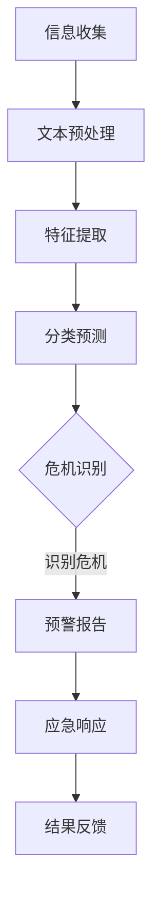

通过基于大数据的危机信息收集、危机事件的识别与分类，以及危机预警机制的构建，AI代理能够在公关危机管理中发挥重要作用，实现危机的早期发现和预警，提高危机管理的效率。

#### 第4章：危机响应与沟通

在公关危机发生后，迅速而有效的响应与沟通是控制危机扩散、减轻负面影响的关键。AI代理在这一过程中提供了自动化、智能化的支持，通过制定响应策略、选择优化沟通渠道，以及利用智能化沟通辅助工具，实现危机管理的效率和效果。

##### 4.1 响应策略制定

危机响应策略的制定是危机管理中的核心环节。AI代理可以通过分析历史危机案例、当前危机的特点以及企业自身的资源和能力，制定出合适的响应策略。以下是危机响应策略制定的关键步骤：

1. **危机评估**：分析危机的性质、规模、影响范围等因素，评估危机的紧急程度和可能造成的损害。
2. **目标设定**：根据危机评估结果，设定危机管理的具体目标，如降低公众负面情绪、恢复品牌形象等。
3. **策略选择**：结合企业的实际情况，选择合适的应对策略，如公开道歉、主动沟通、数据修复等。
4. **方案制定**：制定详细的危机响应方案，包括行动步骤、责任分配、时间节点等。

以下是一个简化的响应策略制定流程：

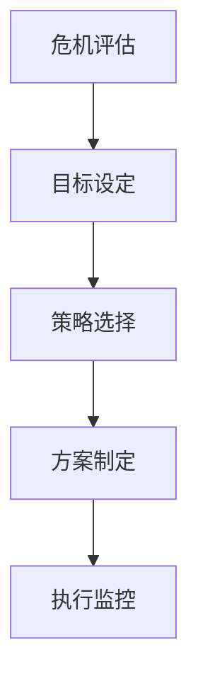

##### 4.2 沟通渠道选择与优化

在危机响应过程中，选择合适的沟通渠道至关重要。AI代理可以根据危机类型、目标受众、传播环境等因素，自动推荐最佳的沟通渠道。以下是一些关键步骤：

1. **渠道评估**：分析各种沟通渠道（如新闻媒体、社交媒体、企业网站、客服热线等）的传播效果和受众覆盖。
2. **受众分析**：根据危机目标受众的特点，选择受众关注度高、影响力大的沟通渠道。
3. **环境适应**：根据当前传播环境的变化，动态调整沟通渠道，确保信息的有效传递。
4. **渠道优化**：利用数据分析和反馈机制，不断优化沟通渠道，提高信息传播的效率和效果。

以下是一个简化的沟通渠道选择与优化流程：

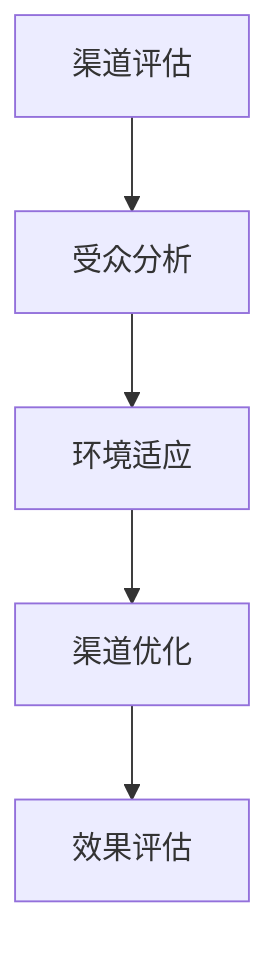

##### 4.3 智能化沟通辅助工具

AI代理可以通过智能化沟通辅助工具，实现危机信息的自动化生成和分发，提高沟通效率。以下是一些常用的智能化沟通辅助工具：

1. **自动生成新闻稿**：AI代理可以基于危机事件的描述和模板，自动生成新闻稿，确保信息的准确性和一致性。
2. **自动化社交媒体发布**：AI代理可以自动发布危机信息到社交媒体平台，利用智能推荐算法提高信息的传播效果。
3. **实时沟通平台**：AI代理可以集成到实时沟通平台（如企业微信、Slack等），实现危机信息的快速传递和讨论。
4. **智能客服系统**：AI代理可以集成到智能客服系统中，回答公众关于危机事件的疑问，减轻人工客服的压力。

以下是一个简化的智能化沟通辅助工具应用流程：

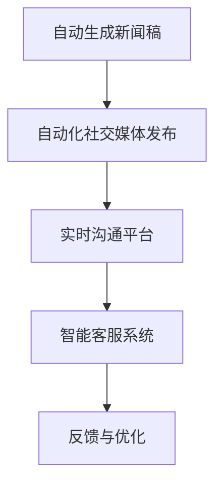

通过制定合理的响应策略、选择优化的沟通渠道，以及利用智能化沟通辅助工具，AI代理能够有效支持公关危机管理，实现快速、准确的信息传递和危机控制。

#### 第5章：危机影响评估与修复

在公关危机得到初步控制后，全面评估危机影响并制定修复策略是关键步骤。AI代理通过数据分析和可视化技术，帮助企业和公关团队深入了解危机的广泛影响，为后续的修复和公关策略提供科学依据。

##### 5.1 影响评估指标体系

建立科学、全面的影响评估指标体系是进行危机影响评估的基础。以下是一些关键的影响评估指标：

1. **公众舆论变化**：通过监测社交媒体、新闻报道等渠道，分析公众对危机事件的关注度和态度变化。常用指标包括负面评论数量、舆论倾向等。
2. **品牌形象受损程度**：评估危机事件对企业品牌形象的负面影响，如品牌知名度下降、消费者信任度降低等。
3. **市场份额波动**：分析危机事件对市场份额的直接影响，如销售额下降、客户流失率上升等。
4. **媒体关注度**：监测媒体对危机事件的报道频次和报道角度，评估危机事件的社会影响力。
5. **财务损失**：评估危机事件带来的直接和间接经济损失，包括诉讼费用、赔偿金、品牌修复费用等。

##### 5.2 数据分析与可视化

AI代理可以利用大数据分析和可视化技术，对影响评估指标进行深度分析，生成直观、易理解的报告。以下是数据分析与可视化的关键步骤：

1. **数据收集**：从多个渠道（如社交媒体、新闻报道、企业内部数据等）收集相关数据，包括文本、图像、表格等形式。
2. **数据预处理**：对收集到的原始数据进行清洗、归一化等预处理操作，确保数据质量。
3. **特征提取**：利用NLP技术提取文本数据的关键特征，如情感倾向、关键词分布等。
4. **数据分析**：利用统计分析和机器学习算法，对预处理后的数据进行深度分析，提取有用的信息。
5. **可视化展示**：使用数据可视化工具（如Tableau、Matplotlib等）生成图表、报表等可视化内容，帮助企业和公关团队直观理解危机影响。

以下是一个简化的数据分析与可视化流程：

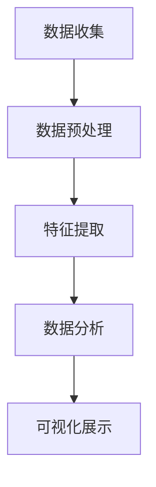

##### 5.3 危机修复与公关策略调整

在全面了解危机影响后，企业需要制定针对性的修复和公关策略，以最小化危机带来的负面影响。以下是危机修复与公关策略调整的关键步骤：

1. **修复方案制定**：根据影响评估结果，制定具体的修复方案，包括品牌重塑、产品改进、客户关怀等。
2. **公关策略调整**：结合修复方案，调整公关策略，如加强正面宣传、开展公关活动、与公众互动等。
3. **实施与监控**：将修复和公关策略落实到实际操作中，并持续监控执行效果，及时调整策略。
4. **反馈与改进**：收集反馈信息，对修复和公关策略进行持续优化，确保危机得到有效解决。

以下是一个简化的危机修复与公关策略调整流程：

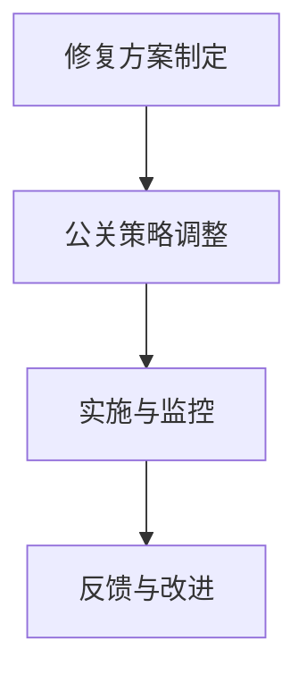

通过全面的数据分析和可视化，AI代理能够帮助企业深入了解危机的广泛影响，制定科学、有效的修复和公关策略，实现危机的彻底解决。这不仅有助于企业恢复品牌形象，还能提升危机管理的智能化水平。

#### 第6章：AI代理在公关危机管理中的应用案例

在本章节中，我们将通过几个具体的案例，深入探讨AI代理在公关危机管理中的实际应用。这些案例将涵盖不同类型的危机，包括产品召回、负面舆情应对和突发公共卫生事件，通过分析每个案例中的具体操作流程和AI代理的应用，展示AI代理在提升公关危机管理效率方面的优势。

##### 6.1 案例一：某企业产品召回危机管理

某知名电子产品企业的一款智能手机在市场上销售后，陆续收到用户关于电池存在安全隐患的投诉。这一危机事件对企业品牌形象和市场份额产生了潜在威胁。企业立即启动了危机应对机制，利用AI代理进行危机管理和处理。

**AI代理应用流程**：

1. **危机识别与预警**：AI代理通过大数据分析，实时监控社交媒体、新闻报道等渠道的信息，发现大量关于产品电池问题的用户投诉。AI代理快速识别这一危机，并生成预警报告。

    ```mermaid
    graph TD
    A[监测信息] --> B[文本预处理]
    B --> C[特征提取]
    C --> D[分类预测]
    D --> E[预警报告]
    ```

2. **响应策略制定**：AI代理根据历史危机案例和当前危机特点，自动生成响应策略，建议企业立即停止销售问题产品，召回相关设备，并向公众发布官方声明。

    ```mermaid
    graph TD
    F[危机评估] --> G[目标设定]
    G --> H[策略选择]
    H --> I[方案制定]
    ```

3. **沟通渠道优化**：AI代理推荐通过社交媒体、企业官网和客服热线等多个渠道，与用户进行沟通，解释产品召回原因，并提供解决方案。AI代理自动生成新闻稿和社交媒体文案，确保信息的一致性和准确性。

    ```mermaid
    graph TD
    J[渠道评估] --> K[受众分析]
    K --> L[渠道优化]
    ```

4. **危机影响评估与修复**：AI代理利用数据分析和可视化技术，评估危机事件对企业品牌形象、市场份额等的影响，生成详细报告。企业根据报告，制定修复策略，如改进产品设计、加强客户关怀等。

    ```mermaid
    graph TD
    M[数据分析] --> N[可视化展示]
    N --> O[修复方案制定]
    ```

通过AI代理的自动化和智能化支持，企业能够在危机发生后迅速响应，有效控制危机扩散，并制定科学的修复策略，最大程度地降低危机带来的负面影响。

##### 6.2 案例二：某品牌负面舆情应对

某知名消费品牌在其新产品发布后，遭遇了社交媒体上的负面舆论。消费者对产品的功能、设计等方面提出了质疑，品牌形象受到严重影响。企业通过AI代理进行了有效的舆情应对。

**AI代理应用流程**：

1. **舆情监测与预警**：AI代理实时监控社交媒体平台，如微博、微信、Twitter等，识别负面评论和话题。AI代理通过自然语言处理技术，分析评论的情感倾向，生成舆情预警。

    ```mermaid
    graph TD
    P[监测信息] --> Q[情感分析]
    Q --> R[预警报告]
    ```

2. **舆论分析**：AI代理对负面舆情进行深度分析，识别出主要问题点和情绪热点。AI代理生成详细报告，为企业提供针对性的应对建议。

    ```mermaid
    graph TD
    S[舆情分析] --> T[问题识别]
    T --> U[报告生成]
    ```

3. **舆论引导**：AI代理帮助企业制定舆论引导策略，通过官方微博、公关活动等方式，积极回应消费者关切，纠正错误信息，缓解负面情绪。

    ```mermaid
    graph TD
    V[舆论引导] --> W[官方回应]
    ```

4. **修复策略调整**：基于舆情分析和反馈，企业调整产品设计和宣传策略，积极改进产品质量，增强消费者信任。

    ```mermaid
    graph TD
    X[修复策略] --> Y[产品改进]
    ```

通过AI代理的智能化分析和决策支持，企业能够迅速识别和处理负面舆情，引导公众舆论向正面方向转变，有效维护品牌形象。

##### 6.3 案例三：某政府机构突发公共卫生事件应对

某政府机构在应对突发公共卫生事件时，通过AI代理实现了高效的信息收集、分析和决策支持，为公众提供了及时、准确的应急信息。

**AI代理应用流程**：

1. **信息收集与监测**：AI代理通过互联网、媒体、社交媒体等多渠道收集疫情相关信息，如病例数量、疑似病例、防控措施等。AI代理利用大数据技术，对实时数据进行分析和处理。

    ```mermaid
    graph TD
    AA[信息收集] --> BB[数据预处理]
    BB --> CC[特征提取]
    ```

2. **疫情预测与预警**：AI代理利用机器学习算法，分析历史疫情数据，预测疫情发展趋势，并生成预警报告。AI代理实时更新疫情数据，为政府决策提供科学依据。

    ```mermaid
    graph TD
    DD[数据分析] --> EE[预测模型]
    EE --> FF[预警报告]
    ```

3. **应急响应与信息发布**：AI代理根据疫情预警报告，协助政府制定应急响应计划，包括隔离措施、医疗资源调配等。AI代理自动生成疫情通报，通过官方网站、社交媒体等渠道发布给公众。

    ```mermaid
    graph TD
    GG[应急响应] --> HH[信息发布]
    ```

4. **舆情分析与公众互动**：AI代理实时监控社交媒体上的舆情动态，分析公众对疫情信息的反应，协助政府及时回应公众关切，增强信息透明度。

    ```mermaid
    graph TD
    II[舆情分析] --> JJ[公众互动]
    ```

通过AI代理的全面支持，政府机构能够高效应对突发公共卫生事件，及时传递准确信息，确保公众的安全和健康。

通过上述案例，我们可以看到AI代理在公关危机管理中的广泛应用。无论是企业产品召回、负面舆情应对，还是政府公共卫生事件管理，AI代理都通过其强大的数据处理和分析能力，实现了危机的迅速识别、科学应对和有效修复。这为提升公关危机管理的效率和效果提供了强有力的技术支持。

#### 第7章：AI代理工作流架构设计

在设计和实现AI代理工作流时，我们需要考虑整个系统的架构，以确保其高效、可靠且易于扩展。本章将介绍AI代理工作流的概念与原理，详细阐述工作流设计的方法和架构，以及工作流管理与优化的策略。

##### 7.1 工作流概念与原理

工作流（Workflow）是指一组相互关联的任务，它们按照特定的顺序执行，以完成一个业务过程。在AI代理工作流中，工作流是指AI代理在执行任务时的一系列步骤和决策过程。工作流的核心目标是实现任务的高效、自动化和智能化。

AI代理工作流的主要组成部分包括：

1. **任务**：工作流中的基本操作单元，如数据采集、文本分析、预测模型训练等。
2. **决策节点**：任务执行过程中的决策点，根据输入条件和预定义规则，选择下一个执行的任务。
3. **数据流**：任务之间的数据传输路径，包括输入数据、输出数据和中间数据。
4. **执行环境**：任务执行的运行环境，包括计算资源、数据存储和通信机制。

工作流的概念可以类比于生产线上的装配线，每个任务代表一个装配步骤，工作流管理系统负责协调和监控整个装配过程。

##### 7.2 工作流设计方法

设计AI代理工作流需要遵循以下步骤：

1. **需求分析**：明确工作流的目标和需求，包括任务类型、任务执行顺序、数据流和决策规则等。
2. **工作流建模**：使用工作流建模工具（如BPMN、UML等）绘制工作流的图形模型，描述任务、决策节点和数据流。
3. **工作流实现**：根据工作流模型，编写具体的实现代码，实现每个任务的执行逻辑和决策逻辑。
4. **系统集成**：将工作流集成到现有的系统中，确保与其他系统模块的协同工作。
5. **测试与优化**：通过模拟和实际运行，测试工作流的有效性和性能，根据反馈进行优化。

以下是一个简化的工作流设计流程：

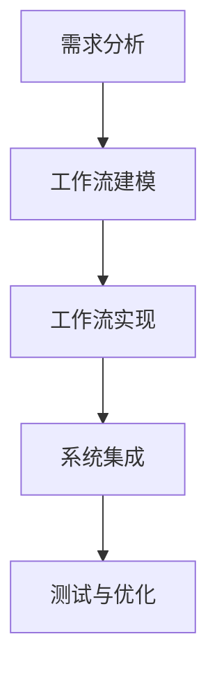

##### 7.3 工作流管理与优化

工作流管理主要包括工作流的执行监控、状态管理、任务调度和性能优化等。以下是一些关键的管理策略：

1. **执行监控**：监控系统工作流的运行状态，记录任务执行的时间、资源消耗和错误信息，确保工作流按照预期运行。
2. **状态管理**：保持工作流的状态信息，包括任务状态、决策条件和数据状态等，以便在任务失败时能够恢复执行。
3. **任务调度**：根据系统资源和任务优先级，合理调度任务执行，确保关键任务优先完成。
4. **性能优化**：通过性能监控和调优，提高工作流系统的响应速度和资源利用率。

以下是一个简化的工作流管理与优化流程：

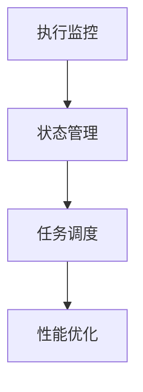

通过科学的工作流设计方法和有效的管理工作流，AI代理工作流能够实现高效、智能化的任务执行，为公关危机管理提供强大的技术支持。在下一章节中，我们将深入探讨AI代理工作流中的关键技术与算法。

#### 第8章：关键技术与算法

在实现AI代理工作流的过程中，选择合适的关键技术及算法至关重要。这些技术包括大数据挖掘与文本分析、机器学习算法以及自然语言处理（NLP）技术。本章将详细介绍这些技术在公关危机管理中的应用，并探讨如何将它们有效地集成到AI代理工作流中。

##### 8.1 大数据挖掘与文本分析

大数据挖掘是指从大量数据中提取有价值信息和知识的过程。在公关危机管理中，大数据挖掘可以帮助企业实时监测舆情，识别潜在的危机事件。以下是一些关键步骤：

1. **数据采集**：从各种渠道（如社交媒体、新闻报道、论坛等）收集大量文本数据。
2. **数据预处理**：对原始文本进行清洗，去除噪声数据和无关信息，如HTML标签、停用词等。
3. **特征提取**：利用词袋模型、TF-IDF等方法，将文本数据转化为可计算的数值特征。
4. **模式识别**：使用聚类、分类等算法，识别文本数据中的潜在模式和趋势。

以下是一个简化的文本分析流程：

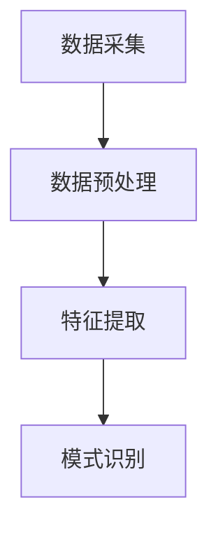

在公关危机管理中，文本分析技术可以用于以下几个方面：

1. **情感分析**：通过分析社交媒体上的用户评论和反馈，了解公众对事件的态度和情感。
2. **关键词提取**：识别文本中的关键信息，如关键词和主题词，帮助理解事件的核心内容。
3. **趋势预测**：通过分析历史数据，预测未来舆论走向，提前采取应对措施。

##### 8.2 机器学习算法

机器学习算法在AI代理工作流中扮演着核心角色，用于危机识别、响应策略制定和影响评估等任务。以下是一些常用的机器学习算法：

1. **分类算法**：如支持向量机（SVM）、随机森林（Random Forest）、神经网络（Neural Networks）等，用于文本分类、情感分析和危机事件识别。
2. **聚类算法**：如K-means、层次聚类等，用于分析舆情趋势，识别相似事件和用户群体。
3. **回归算法**：如线性回归、逻辑回归等，用于预测危机事件的可能影响和制定修复策略。

以下是一个简化的机器学习算法应用流程：

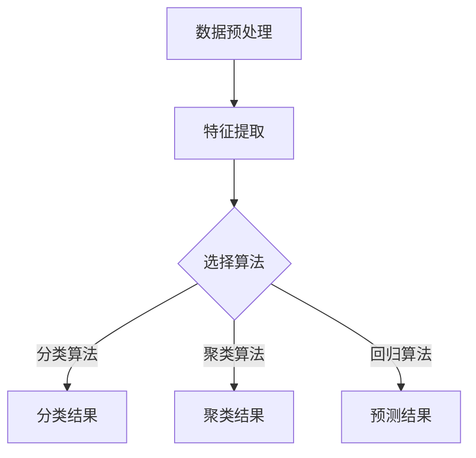

在公关危机管理中，机器学习算法可以用于以下几个方面：

1. **危机事件识别**：通过训练分类模型，自动识别社交媒体上的危机事件。
2. **响应策略制定**：通过分析历史危机数据，预测危机的影响，制定个性化的响应策略。
3. **影响评估**：通过回归分析，评估危机事件对企业品牌形象和市场份额的影响。

##### 8.3 自然语言处理（NLP）技术

自然语言处理（NLP）技术是处理和生成自然语言（如文本和语音）的计算机科学分支。在AI代理工作流中，NLP技术用于危机沟通、文本分析和舆情监控等任务。以下是一些关键的NLP技术：

1. **分词**：将连续的文本划分为词或短语，如“人工智能”划分为“人工智能”和“代理”。
2. **词性标注**：为文本中的每个词标注词性（如名词、动词、形容词等），帮助理解句子的结构。
3. **命名实体识别**：识别文本中的特定实体（如人名、地名、组织名等），如“苹果公司”识别为“组织”实体。
4. **情感分析**：分析文本中的情感倾向（如正面、负面、中性），了解公众的情感态度。

以下是一个简化的NLP技术应用流程：

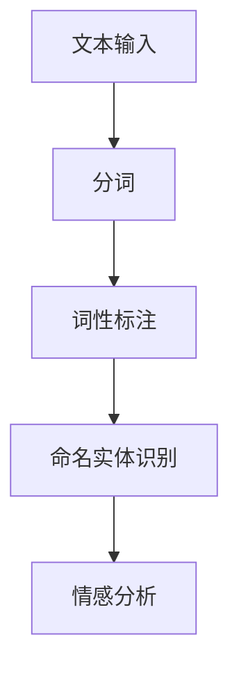

在公关危机管理中，NLP技术可以用于以下几个方面：

1. **危机沟通**：自动生成官方声明、新闻稿和社交媒体回复，确保信息的一致性和准确性。
2. **舆情监控**：实时分析社交媒体上的舆情动态，识别潜在危机事件。
3. **文本分析**：分析媒体报道和用户评论，了解危机事件的影响和公众态度。

通过大数据挖掘与文本分析、机器学习算法和NLP技术的结合，AI代理工作流能够实现高效、智能化的公关危机管理。这些关键技术不仅提高了危机识别和响应的效率，还为企业提供了科学的决策依据，有效提升了危机管理的水平。

#### 第9章：开发环境与工具

为了实现AI代理工作流在公关危机管理中的高效应用，开发和部署合适的开发环境与工具至关重要。本章将介绍如何搭建开发环境、数据处理与存储，以及模型训练与优化。

##### 9.1 开发环境搭建

搭建AI代理的开发环境涉及多个软件和硬件的配置。以下是一些关键步骤：

1. **硬件配置**：选择合适的硬件设备，包括高性能的CPU、GPU、足够的内存和存储空间。GPU对于深度学习模型的训练尤为重要，因为它能够显著加速计算过程。

2. **操作系统**：选择合适的操作系统，如Linux或Windows。Linux系统因其稳定性、安全性和开源特性，常用于深度学习和大数据处理。

3. **集成开发环境（IDE）**：安装集成开发环境，如PyCharm、VSCode等，这些IDE提供了代码编辑、调试和版本控制等功能。

4. **依赖管理**：使用pip等工具安装和管理项目所需的依赖库，如NumPy、Pandas、Scikit-learn、TensorFlow、PyTorch等。

5. **容器化**：考虑使用容器化技术，如Docker，将开发环境打包成可移植的容器，确保在不同的开发和生产环境中一致运行。

以下是一个简化的开发环境搭建流程：

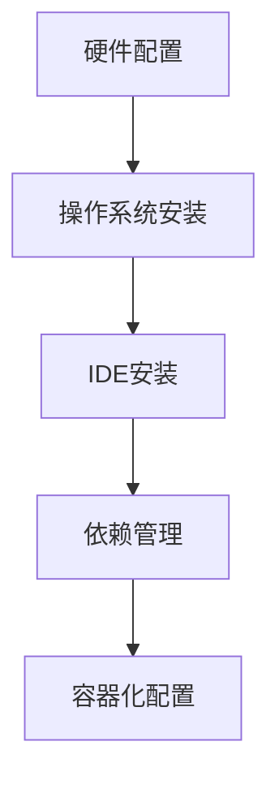

##### 9.2 数据处理与存储

在AI代理开发过程中，数据处理与存储是关键环节。以下是一些关键步骤：

1. **数据收集**：从社交媒体、新闻网站、企业数据库等渠道收集文本、图像、音频等多类型数据。

2. **数据预处理**：对原始数据进行清洗、去噪、去停用词等预处理操作，确保数据质量。

3. **数据存储**：选择合适的数据存储方案，如关系型数据库（如MySQL、PostgreSQL）或分布式文件系统（如HDFS、Amazon S3）。对于大规模数据，分布式存储和计算是必要的。

4. **数据湖**：构建数据湖，存储大量原始数据和预处理数据，以便后续的分析和挖掘。

5. **数据处理框架**：使用数据处理框架，如Apache Spark，进行大规模数据的分布式处理和分析。

以下是一个简化的数据处理与存储流程：

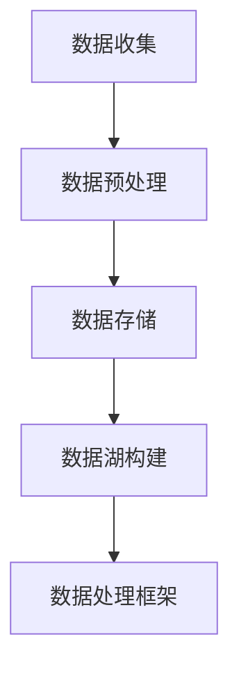

##### 9.3 模型训练与优化

在AI代理的开发过程中，模型训练与优化是提升系统性能的关键步骤。以下是一些关键步骤：

1. **数据集准备**：准备训练数据集和验证数据集，确保数据的多样性和代表性。

2. **模型选择**：选择合适的机器学习模型，如SVM、Random Forest、神经网络等。对于深度学习任务，常用的框架包括TensorFlow和PyTorch。

3. **模型训练**：使用训练数据集，通过反向传播算法进行模型训练。在训练过程中，需要监控模型性能，如准确率、召回率、F1分数等。

4. **模型评估**：使用验证数据集评估模型的性能，并根据评估结果调整模型参数。

5. **模型优化**：通过调整超参数、引入正则化技术、使用增强数据等手段，优化模型性能。

6. **模型部署**：将训练好的模型部署到生产环境中，确保模型能够实时处理输入数据。

以下是一个简化的模型训练与优化流程：

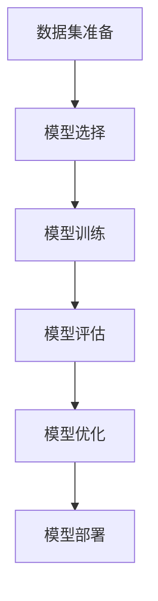

通过科学地搭建开发环境、合理地处理与存储数据，以及有效地训练和优化模型，AI代理能够实现高效、智能的公关危机管理，为企业提供可靠的决策支持。

#### 第10章：未来展望与挑战

随着人工智能技术的不断发展，AI代理在公关危机管理中的应用前景广阔。然而，这一领域仍面临诸多挑战，需要进一步的研究和探索。

##### 10.1 技术发展趋势

AI代理在公关危机管理中的技术发展趋势主要体现在以下几个方面：

1. **增强学习能力**：通过增强学习技术，AI代理能够不断从环境中学习，优化决策过程，提高危机应对的智能化水平。
2. **多模态数据处理**：结合文本、图像、语音等多模态数据，AI代理能够更全面地理解危机事件，提供更准确的预警和应对策略。
3. **联邦学习**：联邦学习技术允许多个代理在不共享数据的情况下协同工作，提高隐私保护和数据安全性。
4. **人机协作**：通过人机协作机制，AI代理能够与人类专家共同决策，提高危机应对的准确性和灵活性。

##### 10.2 应用场景拓展

AI代理在公关危机管理中的应用场景将继续拓展，包括但不限于：

1. **社交媒体监测**：实时监测社交媒体上的舆论动态，快速识别危机事件。
2. **舆情分析**：分析公众对事件的态度和情感，预测舆论走向，制定针对性的舆论引导策略。
3. **自动化决策**：利用机器学习算法，自动化生成危机应对报告和决策方案，提高响应速度和准确性。
4. **跨领域应用**：将AI代理应用到不同行业和领域的危机管理中，如食品安全、环境保护等。

##### 10.3 道德与法律问题

随着AI代理在公关危机管理中的广泛应用，道德与法律问题也日益凸显。以下是一些关键问题：

1. **隐私保护**：AI代理在处理大量个人数据时，需要确保隐私保护，避免数据泄露和滥用。
2. **责任归属**：在AI代理发生错误决策或造成损失时，如何界定责任归属，是法律和道德领域的一大挑战。
3. **透明性与解释性**：确保AI代理的决策过程透明和可解释，增加公众对AI代理的信任。
4. **伦理规范**：建立AI代理的伦理规范，防止AI代理在危机应对中产生负面影响，如舆论操纵等。

总之，AI代理在公关危机管理中的应用前景广阔，但同时也面临诸多挑战。通过不断优化技术、拓展应用场景，并妥善解决道德与法律问题，AI代理将为公关危机管理带来革命性的变革。

#### 第11章：AI代理工作流面临的挑战与对策

在AI代理工作流的应用过程中，面临着一系列挑战，这些挑战不仅涉及技术层面，还包括道德、法律以及人机协作等方面。以下将详细分析这些挑战，并提出相应的对策。

##### 11.1 数据隐私与安全问题

数据隐私和安全问题是AI代理工作流面临的一个重要挑战。AI代理需要处理大量的个人和企业敏感数据，如用户评论、社交媒体信息、财务记录等。这些数据一旦泄露，可能对个人隐私和企业安全造成严重威胁。

**对策**：

1. **数据加密**：在数据传输和存储过程中使用高级加密技术，如AES、RSA等，确保数据的安全性。
2. **隐私保护技术**：采用差分隐私、联邦学习等技术，在保障数据隐私的同时，实现模型训练和数据分析。
3. **访问控制**：实施严格的访问控制机制，确保只有授权用户可以访问敏感数据，防止数据泄露。
4. **安全审计**：定期进行安全审计，检测和修复潜在的安全漏洞，确保系统的安全稳定运行。

##### 11.2 智能化水平的提升

AI代理的智能化水平直接关系到其应对危机的效率和效果。随着公关危机管理环境的变化，AI代理需要具备更高的学习能力、适应性和决策能力。

**对策**：

1. **持续学习**：通过持续学习技术，使AI代理能够从历史数据和实时反馈中不断学习，优化决策模型。
2. **多模态数据处理**：结合文本、图像、语音等多种数据源，提升AI代理的感知能力和理解能力。
3. **迁移学习**：利用迁移学习技术，将已有模型的经验迁移到新的任务中，提高新任务的解决能力。
4. **强化学习**：引入强化学习技术，使AI代理能够在动态环境中通过不断试错和优化，提高决策的准确性。

##### 11.3 人机协作与培训

在AI代理的应用过程中，人类专家和AI代理之间的协作效率和质量是决定危机管理效果的关键。人类专家需要理解和信任AI代理的决策，同时AI代理也需要从人类专家那里获取经验和知识。

**对策**：

1. **人机协作机制**：设计灵活的人机协作机制，使人类专家能够实时介入AI代理的决策过程，提供指导和反馈。
2. **培训与教育**：为人类专家提供AI代理操作和优化的培训，提高其技术水平和操作能力。
3. **透明性设计**：确保AI代理的决策过程透明和可解释，使人类专家能够理解和信任AI代理的决策。
4. **反馈循环**：建立反馈机制，使人类专家能够对AI代理的决策进行评价和优化，不断改进AI代理的性能。

##### 11.4 道德与法律问题

AI代理在公关危机管理中的应用涉及诸多道德和法律问题，如隐私保护、责任归属、透明性等。这些问题的解决直接关系到AI代理的合法性和社会接受度。

**对策**：

1. **伦理规范**：制定AI代理的伦理规范，明确其在公关危机管理中的行为准则，确保其决策符合道德和法律要求。
2. **责任界定**：建立责任归属机制，明确在AI代理发生错误决策或造成损失时，责任如何分配。
3. **透明性与解释性**：确保AI代理的决策过程透明和可解释，增加公众对AI代理的信任。
4. **法律监管**：加强法律监管，确保AI代理的应用符合相关法律法规，防范潜在的伦理和法律风险。

通过针对数据隐私与安全、智能化水平提升、人机协作与培训，以及道德与法律问题等方面的挑战，提出相应的对策，AI代理工作流将能够更好地服务于公关危机管理，提升危机应对的智能化水平。

#### 第12章：结语

在本篇技术博客中，我们系统性地探讨了AI代理工作流在公关危机管理中的应用，从引言到具体案例分析，再到技术实现和未来展望，全面阐述了AI代理在危机识别、预警、响应、影响评估和修复中的关键作用。通过结合大数据、机器学习和自然语言处理等先进技术，AI代理工作流实现了公关危机管理的高效、智能化。

**主要研究成果总结**：

- **危机识别与预警**：利用大数据分析技术，实时监测和预警潜在危机事件，提高危机识别的准确性和速度。
- **响应策略制定**：通过机器学习算法，自动化生成危机响应策略，优化决策过程，提高响应效率。
- **沟通渠道优化**：基于自然语言处理技术，选择和优化沟通渠道，确保信息传递的准确性和及时性。
- **影响评估与修复**：通过数据分析与可视化技术，全面评估危机影响，制定针对性的修复策略，降低危机带来的负面影响。

**研究不足与展望**：

尽管AI代理在公关危机管理中展现出显著优势，但仍然存在以下不足和改进空间：

- **数据隐私与安全问题**：在处理大量敏感数据时，如何确保数据隐私和安全仍是一个重要挑战，需要进一步研究和优化。
- **智能化水平提升**：AI代理的智能化水平尚需提升，以应对更复杂的公关危机场景，实现更精准的决策。
- **人机协作与培训**：如何更好地实现人类专家与AI代理的协作，提高人类专家的培训水平和操作能力，仍需深入研究。

**对公关危机管理的启示**：

AI代理工作流为公关危机管理提供了新的思路和方法，以下是一些关键启示：

- **快速响应**：通过实时监测和预警机制，实现快速危机响应，减轻危机的扩散和影响。
- **精准决策**：利用机器学习和自然语言处理技术，提高危机响应的准确性和决策质量。
- **全面评估**：通过数据分析和可视化技术，全面评估危机影响，制定科学的修复策略。
- **持续改进**：通过不断学习和优化，提高AI代理的性能和智能化水平，持续提升危机管理的效率。

总之，AI代理工作流在公关危机管理中的应用，为企业和组织提供了强有力的技术支持，有助于提升危机管理的智能化水平，实现更高效、更精准的危机应对。未来，随着技术的不断进步和应用场景的拓展，AI代理工作流将在公关危机管理领域发挥更加重要的作用。作者：AI天才研究院/AI Genius Institute & 禅与计算机程序设计艺术 /Zen And The Art of Computer Programming

