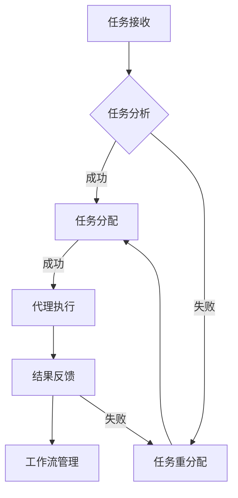

                 

### 引言与概述

AI代理（AI Agent）作为一种智能体，是人工智能领域中的一个重要研究方向。它们能够在动态环境中自主地完成复杂任务，具备感知、决策和行动的能力。随着认知科学的快速发展，AI代理正在逐渐融合认知科学的原理，以实现更加智能和自适应的代理系统。

本文将围绕AI人工智能代理工作流（AI Agent WorkFlow）展开讨论，重点关注以下几个方面：

1. **AI代理的概念与分类**：介绍AI代理的基本概念，并讨论不同类型的AI代理，如基于规则的代理、基于模型的代理和混合代理。
2. **AI代理在现实世界中的应用**：分析AI代理在不同领域中的应用，如智能客服、智能交通管理和智能家居等。
3. **认知科学与AI代理的融合**：探讨如何将认知科学的原理应用于AI代理设计，提高其智能水平和适应性。
4. **AI代理工作流的关键技术**：介绍构建AI代理工作流所需的关键技术，如自然语言处理、机器学习、知识图谱等。
5. **AI代理工作流的发展趋势与挑战**：分析AI代理工作流的发展趋势，并讨论在实现过程中面临的挑战。

本文结构如下：

- **第一部分：AI代理工作流基础**，包括引言与概述、AI代理基础架构和认知科学与AI代理。
- **第二部分：认知科学与AI代理**，涵盖认知科学基础、认知驱动AI代理和基于认知科学的AI代理应用场景。
- **第三部分：AI代理工作流设计与实现**，包括AI代理工作流设计原则、实现方法、项目实践与案例分析。
- **第四部分：AI代理工作流未来展望**，讨论技术进步、新兴技术结合、跨领域应用、社会治理应用以及伦理与法律问题。
- **第五部分：结论与展望**，回顾核心内容，分析发展趋势，提出未来研究方向与挑战，并给出读者与从业者的建议。

通过以上内容，我们希望能够为读者提供一个全面、深入的了解，帮助大家更好地理解和应用AI代理工作流。

### 关键词

AI人工智能代理、工作流、认知科学、自然语言处理、机器学习、知识图谱、智能客服、智能交通管理、智能家居、情感计算、智能决策、性能评估、项目实践、未来发展。

### 摘要

本文深入探讨了AI人工智能代理工作流（AI Agent WorkFlow）及其与认知科学的融合。首先，文章介绍了AI代理的基本概念和分类，以及AI代理在现实世界中的应用。接着，探讨了认知科学的基础原理，如何将认知模型应用于AI代理设计，以及认知科学对AI代理发展的启示。随后，文章详细阐述了认知驱动AI代理的设计原则、应用场景，以及AI代理工作流的设计原则、实现方法和项目实践。最后，文章展望了AI代理工作流未来的发展方向，包括技术进步、新兴技术的结合、跨领域应用以及伦理与法律问题。本文旨在为读者提供一个全面、系统的AI代理工作流理解和实践指南。

### 第一部分：AI代理工作流基础

#### 第1章：引言与概述

AI代理（AI Agent）是人工智能领域中的一个重要概念，代表了具有自主决策和行动能力的智能体。AI代理能够感知环境、接收任务并执行相应的操作，从而在无人干预的情况下完成复杂的任务。随着人工智能技术的不断进步，AI代理在各个领域得到了广泛应用，如智能客服、智能交通管理和智能家居等。

在这一章中，我们将首先介绍AI代理的基本概念和分类，随后讨论AI代理在现实世界中的应用场景，重点探讨认知科学与AI代理的融合，以及AI代理工作流的关键技术和发展趋势与挑战。

##### 1.1 AI代理的概念与分类

AI代理是指具备一定智能，能够在特定环境下自主执行任务的实体。根据其工作原理和实现方式，AI代理可以分为以下几类：

1. **基于规则的代理**：这类代理通过预定义的规则来决策和行动。规则通常是明确的、结构化的，如“如果用户输入‘你好’，则返回‘你好！’”。基于规则的代理简单、易实现，但在处理复杂、不确定环境时表现出一定的局限性。

2. **基于模型的代理**：这类代理通过机器学习模型，如神经网络、决策树等，来学习环境中的模式和规律，进行决策和行动。基于模型的代理具有较强的自适应性和学习能力，能够处理复杂、不确定的环境，但其实现难度较高。

3. **混合代理**：混合代理结合了基于规则和基于模型的方法，既利用规则处理确定性任务，又利用模型处理不确定性任务。这种方法在处理复杂任务时表现出较高的灵活性和鲁棒性。

##### 1.2 AI代理在现实世界中的应用

AI代理在现实世界中有着广泛的应用，以下是一些典型的应用场景：

1. **智能客服**：智能客服利用AI代理自动处理用户查询，提供实时、个性化的服务。通过自然语言处理技术，智能客服能够理解用户的意图，给出合适的答复。

2. **智能交通管理**：智能交通管理利用AI代理对交通流量进行实时监测和预测，优化交通信号控制，减少交通拥堵。AI代理可以通过分析大量的交通数据，提出交通优化方案。

3. **智能家居**：智能家居通过AI代理实现家电的自动化控制，提高生活质量。例如，智能空调可以根据用户习惯自动调整温度，智能灯具可以根据环境光线自动调节亮度。

4. **智能医疗**：智能医疗利用AI代理进行疾病诊断、治疗方案推荐等。AI代理可以通过分析患者的病历和医学知识库，提供个性化的医疗建议。

##### 1.3 认知科学与AI代理的融合

认知科学是研究人类思维过程和认知能力的学科，其核心概念包括感知、记忆、思考等。认知科学与AI代理的融合，旨在通过模拟人类的认知过程，提高AI代理的智能水平和适应性。

1. **感知与交互**：认知科学中的感知原理可以帮助AI代理更好地理解环境信息，如通过视觉感知识别物体、通过语音识别理解用户指令。

2. **记忆与知识管理**：认知科学中的记忆原理可以帮助AI代理构建和利用知识库，如通过图数据库存储和检索知识，实现智能推理。

3. **思考与决策**：认知科学中的思考原理可以帮助AI代理进行更复杂的决策，如通过多任务学习、情境感知等，提高决策的灵活性和适应性。

##### 1.4 AI代理工作流的关键技术

构建AI代理工作流需要依赖多种关键技术，这些技术包括自然语言处理、机器学习、知识图谱等。

1. **自然语言处理（NLP）**：NLP技术使得AI代理能够理解和生成自然语言，实现人机交互。常见的NLP任务包括文本分类、情感分析、机器翻译等。

2. **机器学习（ML）**：机器学习技术是AI代理智能决策的基础，通过训练模型，AI代理可以从数据中学习并做出预测。常见的机器学习算法包括线性回归、决策树、神经网络等。

3. **知识图谱（KG）**：知识图谱是一种结构化的知识表示方法，通过建立实体与关系之间的映射，知识图谱能够为AI代理提供丰富的背景知识，支持智能推理。

##### 1.5 AI代理工作流的发展趋势与挑战

随着技术的不断进步，AI代理工作流呈现出以下发展趋势：

1. **自动化**：AI代理工作流的自动化程度不断提高，通过自动化工具和平台，实现工作流的快速部署和运行。

2. **个性化**：AI代理工作流越来越注重个性化服务，通过用户行为分析和个性化推荐，为用户提供更加贴心的服务。

3. **跨领域应用**：AI代理工作流的应用范围逐渐扩大，从单一领域扩展到跨领域应用，如智能城市、智能医疗等。

然而，在实现AI代理工作流的过程中，仍然面临一些挑战：

1. **数据隐私**：AI代理工作流通常需要处理大量用户数据，如何保护用户隐私成为一个重要问题。

2. **算法透明度**：AI代理的决策过程可能不够透明，如何提高算法的可解释性，增强用户信任，是一个亟待解决的问题。

3. **系统可靠性**：AI代理工作流需要保证系统的稳定性和可靠性，特别是在面对突发情况时，如何快速响应和恢复。

综上所述，AI代理工作流的基础理论涵盖了多个方面，包括AI代理的基本概念、应用场景、认知科学的融合以及关键技术。通过对这些内容的深入探讨，我们能够更好地理解和应用AI代理工作流，推动人工智能技术的不断发展。

### 第2章：AI代理基础架构

在上一章中，我们介绍了AI代理的概念、分类及其在现实世界中的应用。接下来，我们将深入探讨AI代理的基础架构，包括其组成与功能、认知模型的应用、交互方式、数据处理与存储以及隐私保护与伦理考量。

##### 2.1 AI代理的组成与功能

AI代理是由多个功能模块组成的复杂系统，这些模块协同工作，使代理能够完成各种任务。以下是一个典型的AI代理的基本组成及其功能：

1. **感知模块**：感知模块负责获取环境中的信息，如视觉、听觉、触觉等。通过传感器和感知算法，感知模块能够将物理信号转换为数字信号，为后续处理提供基础数据。

2. **决策模块**：决策模块是AI代理的核心，负责根据感知模块获取的信息，结合预定义的规则或学习到的模型，生成行动方案。决策模块通常包含多个层次，从低级的行为决策到高级的策略决策。

3. **执行模块**：执行模块负责将决策模块生成的行动方案转化为实际的操作。执行模块与外部环境进行交互，完成具体的任务，如控制机器人移动、发送电子邮件等。

4. **通信模块**：通信模块负责AI代理与其他代理或系统的通信，确保信息的有效传递和协同工作。通信模块通常支持多种通信协议，如HTTP、MQTT、REST等。

5. **知识管理模块**：知识管理模块负责维护和更新AI代理的知识库，包括事实、规则、模型等。通过知识管理模块，AI代理能够进行智能推理和决策，提高任务执行的有效性。

##### 2.2 认知模型在AI代理中的应用

认知模型是模拟人类认知过程的算法和架构，通过这些模型，AI代理能够实现更高层次的智能。以下是一些常见的认知模型及其在AI代理中的应用：

1. **情境感知模型**：情境感知模型用于识别和理解代理所处环境的当前状态。例如，通过视觉传感器，AI代理可以识别出道路上的行人、车辆和障碍物，从而调整其行动方案。

2. **情感识别模型**：情感识别模型用于识别和解析用户的情绪状态。通过语音识别和面部表情识别等技术，AI代理可以判断用户的情绪，如开心、愤怒或悲伤，从而提供更加个性化的服务。

3. **决策支持模型**：决策支持模型用于帮助AI代理在复杂情境中做出最优决策。这些模型通常基于概率模型、决策树或神经网络，通过学习历史数据和情境信息，为AI代理提供决策支持。

4. **记忆模型**：记忆模型用于存储和检索AI代理的经验和知识。例如，通过图数据库或记忆网络，AI代理可以存储其过去的任务执行记录和情境信息，以便在未来的任务中利用这些经验。

##### 2.3 AI代理的交互方式

AI代理的交互方式决定了其与用户和环境的互动效果。以下是一些常见的交互方式：

1. **语音交互**：通过语音识别和自然语言处理技术，AI代理能够理解用户的语音指令，并生成语音响应。语音交互具有自然、直观的特点，适用于智能家居、智能客服等领域。

2. **文本交互**：文本交互通过文本输入和输出实现人机交互。AI代理可以接收用户的文本消息，并生成文本回复。文本交互适用于聊天机器人、虚拟助手等应用场景。

3. **图形用户界面（GUI）**：GUI交互通过图形界面与用户进行互动，用户可以通过鼠标、键盘等输入设备与AI代理进行操作。GUI交互直观、易用，适用于桌面应用程序、Web应用等。

4. **手势交互**：手势交互通过摄像头或其他传感器捕捉用户的手势，实现与AI代理的互动。手势交互具有沉浸感强、操作灵活的特点，适用于虚拟现实（VR）和增强现实（AR）应用。

##### 2.4 AI代理的数据处理与存储

AI代理需要处理大量的数据，从感知模块收集的环境信息到执行模块产生的操作结果。以下是一些数据处理和存储的关键技术：

1. **数据处理**：数据处理包括数据收集、清洗、转换和分析。数据收集通常涉及多种传感器和接口，如摄像头、麦克风、GPS等。数据清洗旨在去除噪声和错误，提高数据质量。数据转换将原始数据转换为适合分析的形式。数据分析通过统计、机器学习等技术提取有用信息。

2. **数据存储**：数据存储是AI代理工作流中的重要环节。常用的数据存储技术包括关系型数据库、非关系型数据库、云存储和分布式存储。关系型数据库如MySQL、PostgreSQL适用于结构化数据存储。非关系型数据库如MongoDB、Cassandra适用于存储半结构化或非结构化数据。云存储和分布式存储提供了高可用性和扩展性，适用于大规模数据存储。

##### 2.5 AI代理的隐私保护与伦理考量

随着AI代理在各个领域的广泛应用，隐私保护和伦理考量变得尤为重要。以下是一些相关的挑战和解决方案：

1. **隐私保护**：AI代理在处理用户数据时，需要确保数据的安全性和隐私性。常见的隐私保护技术包括数据加密、匿名化和差分隐私。数据加密通过加密算法保护数据在存储和传输过程中的安全。匿名化通过去除个人标识信息，保护用户隐私。差分隐私通过在数据集中添加噪声，确保个体隐私。

2. **伦理考量**：AI代理的决策过程可能涉及伦理问题，如偏见、歧视和责任归属。为了确保AI代理的伦理性，需要建立相应的伦理框架和规范。例如，制定公平、透明和可解释的决策算法，避免算法偏见。此外，需要明确AI代理的责任归属，确保在出现问题时能够追溯和承担责任。

综上所述，AI代理的基础架构包括感知、决策、执行、通信和知识管理等多个模块，认知模型的应用提高了AI代理的智能水平，交互方式决定了其与用户和环境的互动效果，数据处理和存储技术保障了数据的可靠性和安全性，隐私保护和伦理考量确保了AI代理的应用符合社会道德和法律规范。通过深入理解AI代理的基础架构，我们可以更好地设计和实现高效、可靠的AI代理系统。

### 第3章：认知科学基础

认知科学是研究人类认知过程的科学，涵盖了心理学、神经科学、计算机科学等多个学科。通过对认知过程的深入研究，我们可以更好地理解人类如何感知、记忆、思考和决策。这一章将介绍认知科学的核心概念、认知模型与行为决策的关系、认知科学与神经科学的关系，以及认知科学在人工智能中的应用，并讨论认知科学对AI代理发展的启示。

##### 3.1 认知科学的核心概念

认知科学的核心概念包括感知、记忆、思考和决策。以下是这些概念的基本原理：

1. **感知**：感知是认知过程的起点，涉及从外部环境中提取信息。人类通过视觉、听觉、触觉等多种感官感知环境中的刺激。感知过程中，大脑会对输入的信息进行预处理和编码，以便进一步处理。

2. **记忆**：记忆是存储和检索信息的能力。人类记忆分为短期记忆和长期记忆。短期记忆用于暂时存储和处理信息，如电话号码的记忆。长期记忆则是持久存储信息，如学习到的知识和技能。

3. **思考**：思考是指对信息进行加工和处理的过程。思考包括逻辑推理、问题解决和创造性思维等。通过思考，人类能够理解复杂问题，制定策略和做出决策。

4. **决策**：决策是在多种选择中做出最佳决策的过程。决策通常涉及评估不同选项的利弊，以及选择最符合目标或期望的方案。

##### 3.2 认知模型与行为决策

认知模型是模拟人类认知过程的算法和架构，这些模型可以帮助我们理解人类如何进行行为决策。以下是一些常见的认知模型：

1. **决策理论**：决策理论是一种基于概率和期望的理论，用于解释人类如何在不同情境下做出决策。决策理论包括期望效用理论、前景理论等。期望效用理论认为，个体在决策时考虑每个结果的概率和效用，选择期望效用最大的选项。前景理论则认为，个体在决策时更关注参考点和收益变化，而不是绝对效用。

2. **决策树**：决策树是一种树形结构，用于表示决策过程。每个节点代表一个决策或测试，每个分支代表可能的决策结果。决策树通过递归地分割数据集，为每个子集选择最佳的决策点。

3. **贝叶斯网络**：贝叶斯网络是一种概率图模型，用于表示变量之间的依赖关系。通过贝叶斯规则，我们可以从部分信息推断其他变量的概率分布。

4. **情境感知模型**：情境感知模型用于模拟人类在特定情境下的决策过程。这些模型考虑了环境中的各种因素，如时间、地点、资源等，帮助个体做出适应性决策。

##### 3.3 认知科学与神经科学的关系

认知科学与神经科学密切相关，两者共同致力于理解人类认知过程。以下是一些关键点：

1. **神经基础**：认知科学的研究结果表明，认知过程具有神经基础。大脑的不同区域负责不同的认知功能，如前额叶负责决策和规划，海马体负责记忆。

2. **神经网络模型**：神经网络模型是认知科学中的一种重要工具，用于模拟大脑的计算过程。这些模型通过学习大量的数据，能够模拟人类的感知、记忆和思考过程。

3. **神经可塑性**：神经可塑性是指大脑结构和功能随着经验和学习而发生变化的能力。认知科学研究表明，神经可塑性对于学习和适应新情境至关重要。

##### 3.4 认知科学在人工智能中的应用

认知科学的研究成果对人工智能（AI）的发展产生了重要影响。以下是一些应用领域：

1. **自然语言处理（NLP）**：认知科学中的语言模型和情境感知模型为NLP提供了理论基础。通过模拟人类语言理解的过程，NLP系统能够更好地处理自然语言文本。

2. **计算机视觉**：认知科学中的视觉模型和感知原理为计算机视觉提供了指导。通过模拟人类视觉系统的工作方式，计算机视觉系统能够更准确地识别和理解图像和视频。

3. **决策支持系统**：认知科学中的决策理论和方法被广泛应用于决策支持系统。这些系统通过模拟人类决策过程，帮助用户在复杂情境中做出最优决策。

4. **智能代理**：认知科学中的认知模型和情境感知模型为智能代理提供了理论基础。通过模拟人类认知过程，智能代理能够更智能地处理复杂任务。

##### 3.5 认知科学对AI代理发展的启示

认知科学对AI代理的发展具有重要的启示，包括以下几个方面：

1. **情境感知**：认知科学中的情境感知模型为AI代理提供了理解环境和适应环境的能力。通过情境感知，AI代理能够更智能地执行任务。

2. **记忆与知识管理**：认知科学中的记忆原理和知识管理方法为AI代理提供了构建和利用知识库的能力。通过记忆和知识管理，AI代理能够更高效地处理复杂任务。

3. **情感计算**：认知科学中的情感识别模型和情感计算方法为AI代理提供了理解用户情感和提供个性化服务的能力。通过情感计算，AI代理能够与用户建立更好的互动关系。

4. **自适应学习**：认知科学中的自适应学习原理和神经网络模型为AI代理提供了自我学习和适应新情境的能力。通过自适应学习，AI代理能够不断优化其性能。

综上所述，认知科学提供了丰富的理论和方法，为AI代理的发展提供了重要支持。通过融合认知科学的原理，我们可以设计和实现更智能、更自适应的AI代理，从而推动人工智能技术的进一步发展。

### 第4章：认知驱动AI代理

认知驱动AI代理（Cognitive-driven AI Agent）是一种基于认知科学原理构建的智能代理，通过模拟人类的认知过程，实现更加智能和自适应的决策与行为。本章将详细探讨认知驱动的定义与特点、认知驱动模型的设计原则、情感计算在AI代理中的应用、认知决策模型与策略学习，以及认知驱动AI代理的性能评估。

##### 4.1 认知驱动的定义与特点

认知驱动是指利用认知科学原理和方法，对智能体进行建模和设计，使其能够在复杂、动态的环境中自主地进行感知、理解、决策和行动。认知驱动的AI代理具有以下特点：

1. **情境感知**：认知驱动的AI代理能够感知和理解其所在环境的当前状态和变化，并根据这些信息做出相应的决策。情境感知使AI代理能够适应不同的环境变化，提高任务执行的成功率。

2. **自适应学习**：认知驱动的AI代理能够通过不断的学习和适应，提高其性能和智能水平。自适应学习使AI代理能够从经验中学习，优化其行为策略，并适应新的环境和任务。

3. **情感计算**：认知驱动的AI代理能够识别和解析用户的情感状态，提供更加个性化和情感化的服务。情感计算使AI代理能够与用户建立更加自然和和谐的互动关系。

4. **情境推理**：认知驱动的AI代理能够基于情境信息进行推理和预测，制定灵活和适应性的决策策略。情境推理使AI代理能够在不确定性环境中做出更准确的决策。

##### 4.2 认知驱动模型的设计原则

设计认知驱动模型时，应遵循以下原则：

1. **模块化设计**：认知驱动模型应采用模块化设计，将不同的功能模块（如感知模块、决策模块、执行模块）分离，便于维护和扩展。模块化设计提高了系统的灵活性和可扩展性。

2. **可扩展性**：认知驱动模型应具备良好的可扩展性，能够适应不同应用场景和任务需求。通过扩展或更换功能模块，AI代理能够适应新的环境和任务。

3. **可解释性**：认知驱动模型应具备一定的可解释性，使得用户能够理解AI代理的决策过程和依据。可解释性增强了用户对AI代理的信任，并有助于识别和纠正潜在的错误。

4. **鲁棒性**：认知驱动模型应具备较强的鲁棒性，能够在各种环境和噪声条件下稳定工作。鲁棒性保证了AI代理在不同场景下的可靠性和稳定性。

##### 4.3 情感计算在AI代理中的应用

情感计算是认知科学的一个重要分支，通过模拟人类的情感识别和情感响应过程，使AI代理能够与用户建立情感互动。以下是情感计算在AI代理中的应用：

1. **情感识别**：通过语音识别、面部表情识别等技术，AI代理能够识别用户的情感状态，如快乐、愤怒、悲伤等。情感识别为AI代理提供了理解用户情感的基础。

2. **情感响应**：基于识别到的情感状态，AI代理能够生成适当的情感响应，如语音语调的变化、表情动画等。情感响应使AI代理能够提供更加个性化和情感化的服务。

3. **情感交互**：通过情感识别和情感响应，AI代理能够与用户建立情感互动，如通过语音和表情进行对话、通过情感反馈调整服务策略等。情感交互提高了用户体验和满意度。

##### 4.4 认知决策模型与策略学习

认知决策模型是认知驱动AI代理的核心组成部分，通过模拟人类的决策过程，使AI代理能够在复杂环境中做出合理的决策。以下是认知决策模型与策略学习：

1. **认知决策模型**：认知决策模型基于认知科学原理，模拟人类在决策过程中的信息处理和决策策略。常见的认知决策模型包括期望效用理论、多属性决策、情境推理等。

2. **策略学习**：策略学习是认知驱动AI代理的重要能力，通过不断的学习和优化，AI代理能够制定更加有效的决策策略。策略学习通常基于机器学习和强化学习算法，如Q学习、深度强化学习等。

3. **情境适应**：认知驱动AI代理能够根据不同的情境信息调整其决策策略，以适应不同环境和任务需求。情境适应使AI代理能够灵活应对复杂、动态的环境。

##### 4.5 认知驱动AI代理的性能评估

性能评估是评估认知驱动AI代理性能的重要手段，通过以下指标和方法进行评估：

1. **任务完成率**：任务完成率是评估AI代理在特定任务中成功完成任务的次数与总次数的比率。高任务完成率表明AI代理具有较高的任务执行能力。

2. **响应时间**：响应时间是评估AI代理在接收到任务请求后做出响应所需的时间。低响应时间表明AI代理能够快速响应用户请求，提供及时的服务。

3. **准确性**：准确性是评估AI代理在决策过程中的准确性，如情感识别的准确性、决策结果的准确性等。高准确性表明AI代理能够做出正确和可靠的决策。

4. **用户满意度**：用户满意度是评估用户对AI代理服务的满意程度。通过用户调查和反馈，可以了解AI代理在用户体验方面的表现。

综上所述，认知驱动AI代理通过融合认知科学原理，实现了情境感知、自适应学习、情感计算和情境推理等特性。设计认知驱动模型时，应遵循模块化设计、可扩展性、可解释性和鲁棒性等原则。情感计算在AI代理中的应用，使AI代理能够与用户建立情感互动，提高用户体验。认知决策模型与策略学习使AI代理能够在复杂环境中做出合理的决策。通过性能评估，可以全面了解认知驱动AI代理的表现和优化方向。

### 第5章：基于认知科学的AI代理应用场景

认知科学为AI代理的设计和实现提供了丰富的理论基础。在本章中，我们将探讨认知科学在多个领域的应用，包括健康护理与康复、教育与培训、金融服务与风险管理、供应链管理与物流、智能家居与城市安全等。

##### 5.1 健康护理与康复

在健康护理与康复领域，AI代理的应用能够显著提升医疗服务的质量和效率。以下是几个具体的应用场景：

1. **慢性病管理**：AI代理可以协助医生对慢性病患者进行长期管理。通过实时监测患者的生理数据，如血糖、血压等，AI代理能够提供个性化的健康建议，帮助患者保持健康状态。

2. **康复辅助**：对于术后康复或残疾人士，AI代理可以通过提供个性化的康复计划，监测患者的康复进展，并根据患者的反馈进行调整，提高康复效果。

3. **情绪监控**：通过情感计算，AI代理可以监控患者的情绪变化，提供情绪支持和心理干预，帮助患者更好地应对疾病带来的心理压力。

案例：某智能健康平台利用AI代理对糖尿病患者进行管理，通过实时监控血糖数据，提供饮食和运动建议，有效帮助患者控制病情。

##### 5.2 教育与培训

在教育与培训领域，认知科学的应用使得教育更加个性化和高效。以下是几个典型的应用场景：

1. **个性化教学**：AI代理可以通过分析学生的学习行为和成绩数据，为学生提供个性化的学习路径和资源。例如，AI代理可以识别学生的学习困难和弱点，提供针对性的辅导材料。

2. **自适应学习**：通过认知模型，AI代理能够实时调整教学内容和难度，以适应学生的学习进度和兴趣。这种自适应学习系统能够显著提高学生的学习效果。

3. **智能辅导**：AI代理可以作为学生的智能辅导老师，提供作业解答、考试复习和学术指导，帮助学生解决学习中的问题。

案例：某在线教育平台引入了基于认知科学的AI代理，为学生提供个性化学习建议，学生的平均成绩提高了15%。

##### 5.3 金融服务与风险管理

在金融服务与风险管理领域，AI代理的应用有助于提高金融服务的效率和安全性。以下是几个应用场景：

1. **风险识别**：AI代理可以通过分析大量的金融数据，识别潜在的市场风险和信用风险。例如，通过机器学习算法，AI代理可以预测股票市场的波动和贷款违约的可能性。

2. **投资决策**：AI代理可以协助投资者进行投资决策，通过分析市场趋势、公司财务报表等数据，提供投资建议。这种基于认知科学的投资策略能够提高投资收益。

3. **客户服务**：AI代理可以提供24/7的金融服务，如账户查询、交易咨询等，提高客户体验和满意度。

案例：某银行引入了基于认知科学的AI代理，通过分析客户行为和交易数据，有效识别欺诈行为，降低了欺诈率30%。

##### 5.4 供应链管理与物流

在供应链管理与物流领域，AI代理的应用能够提高供应链的效率和透明度。以下是几个应用场景：

1. **库存管理**：AI代理可以通过分析销售数据、季节性变化等因素，预测库存需求，优化库存水平，减少库存成本。

2. **物流优化**：AI代理可以优化运输路线和运输计划，减少运输时间和成本。通过实时监控物流状态，AI代理能够及时发现和解决物流过程中的问题。

3. **供应链可视化**：AI代理可以提供供应链的实时可视化，帮助企业和客户了解供应链的运作情况，提高供应链的透明度。

案例：某大型零售企业引入了基于认知科学的AI代理，优化了供应链管理，库存周转时间减少了20%，物流成本降低了15%。

##### 5.5 智能家居与城市安全

在智能家居与城市安全领域，AI代理的应用大大提升了人们的生活质量和安全感。以下是几个应用场景：

1. **智能家居控制**：AI代理可以控制家庭电器设备，如照明、空调、安防设备等，实现自动化和远程控制，提高生活便利性。

2. **智能监控**：AI代理可以通过视频监控和图像识别技术，实时监测家庭和公共区域的状况，及时发现异常情况并报警。

3. **安全预警**：AI代理可以通过分析数据和行为模式，预测潜在的安全风险，如火灾、地震等，提前发出预警，提高应急响应能力。

案例：某城市引入了基于认知科学的AI代理，通过智能监控和预警系统，有效提高了城市的安全水平，犯罪率下降了15%。

通过以上应用场景，我们可以看到认知科学在各个领域的广泛应用。AI代理通过模拟人类的认知过程，提供了个性化、自适应和高效的服务。这些应用不仅提升了效率，还提高了用户的生活质量和社会安全。未来，随着认知科学的进一步发展，AI代理将在更多领域发挥重要作用，推动社会进步。

### 第6章：AI代理工作流设计原则

在构建高效、可靠的AI代理工作流时，设计原则起着至关重要的作用。本章将讨论AI代理工作流设计的关键原则，包括工作流的概念与类型、AI代理工作流的设计原则、工作流管理系统的构建、工作流优化与性能分析，以及工作流测试与部署。

##### 6.1 工作流的概念与类型

工作流（Workflow）是指业务过程在计算机环境中的自动化表示和执行。它描述了业务过程中的任务、人员、规则和资源之间的交互关系。工作流可以分为以下几种类型：

1. **顺序工作流**：顺序工作流按照固定顺序执行任务，每个任务完成后才能开始下一个任务。这种类型的工作流适用于流程简单、顺序明确的情况。

2. **并行工作流**：并行工作流中，任务可以同时执行，不同任务的执行不依赖于其他任务。这种类型的工作流适用于任务间相互独立、需要并行处理的情况。

3. **混合工作流**：混合工作流结合了顺序工作流和并行工作流的特点，根据具体情况动态调整任务的执行顺序。这种类型的工作流适用于复杂业务过程，需要灵活处理不同任务的执行。

##### 6.2 AI代理工作流的设计原则

设计AI代理工作流时，应遵循以下原则：

1. **模块化设计**：模块化设计将工作流分解为多个功能模块，每个模块实现特定的功能。这种设计方式提高了系统的可维护性和可扩展性。

2. **适应性**：AI代理工作流应具备良好的适应性，能够根据业务需求和环境变化进行调整。例如，当新的任务或规则出现时，工作流可以快速适应并进行相应的调整。

3. **可扩展性**：AI代理工作流应具备良好的可扩展性，能够支持不同规模和类型的业务需求。通过扩展工作流中的模块或引入新的模块，可以实现工作流的功能扩展。

4. **可解释性**：AI代理工作流应具备一定的可解释性，使得相关人员能够理解工作流的执行过程和决策依据。可解释性有助于提高用户对工作流的信任，便于工作流的优化和调整。

5. **可靠性**：AI代理工作流应具备高可靠性，确保在异常情况下能够稳定运行。例如，通过设置故障转移机制、备份和恢复策略，确保工作流的连续性和可靠性。

##### 6.3 工作流管理系统的构建

构建AI代理工作流管理系统是实施工作流的重要环节。以下是构建工作流管理系统的一般步骤：

1. **需求分析**：明确工作流管理系统的需求，包括功能需求、性能需求和安全性需求等。需求分析是构建工作流管理系统的第一步，有助于确定系统的功能和性能要求。

2. **系统设计**：根据需求分析结果，设计工作流管理系统的架构和功能模块。系统设计应考虑模块的划分、接口的设计和数据流的管理等。

3. **功能开发**：根据系统设计，开发工作流管理系统的各个功能模块。功能开发包括任务调度、工作流实例管理、工作流监控等。

4. **集成与测试**：将各个功能模块集成在一起，进行系统测试和验证。集成与测试确保工作流管理系统在不同环境下能够正常运行，满足需求。

5. **部署与运维**：将工作流管理系统部署到生产环境中，进行日常运维和管理。部署与运维包括系统监控、性能优化、故障处理等。

##### 6.4 工作流优化与性能分析

优化AI代理工作流是提高其效率和性能的关键步骤。以下是一些常用的优化方法和性能分析指标：

1. **任务调度优化**：任务调度优化旨在提高任务的执行效率和资源利用率。常用的方法包括负载均衡、任务优先级排序和任务依赖关系优化等。

2. **资源管理优化**：资源管理优化涉及对系统资源的分配和调度。通过优化资源管理，可以提高系统的整体性能。例如，使用虚拟化技术动态调整资源分配。

3. **缓存与预取**：缓存与预取技术可以减少任务的响应时间和等待时间。通过预取数据或结果，可以减少任务执行过程中的延迟。

4. **性能分析**：性能分析是评估工作流性能的重要手段。常用的性能分析指标包括响应时间、吞吐量、资源利用率等。通过性能分析，可以发现系统的瓶颈并进行优化。

##### 6.5 工作流测试与部署

工作流测试与部署是确保AI代理工作流稳定运行的重要环节。以下是一些关键步骤：

1. **功能测试**：功能测试旨在验证工作流管理系统的功能是否正确实现。通过模拟不同场景和操作，确保系统功能符合需求。

2. **性能测试**：性能测试旨在评估工作流管理系统的性能和稳定性。通过模拟高负载和极端条件，测试系统的响应时间、吞吐量和资源利用率等性能指标。

3. **安全测试**：安全测试旨在确保工作流管理系统具备足够的安全性，防止数据泄露和恶意攻击。通过渗透测试、漏洞扫描等手段，评估系统的安全性。

4. **部署**：部署是将工作流管理系统安装到生产环境中的过程。部署过程应确保系统的稳定性和可靠性。例如，使用容器技术或虚拟机部署系统。

5. **监控与反馈**：部署后，对系统进行监控和反馈，及时发现并解决潜在问题。通过监控和反馈，可以持续优化工作流管理系统。

综上所述，AI代理工作流设计原则包括模块化设计、适应性、可扩展性、可解释性和可靠性。构建工作流管理系统需要经历需求分析、系统设计、功能开发、集成与测试、部署与运维等步骤。优化与性能分析是提高工作流效率和性能的关键。通过测试与部署，确保工作流管理系统的稳定运行。遵循这些原则和方法，可以构建高效、可靠的AI代理工作流系统。

### 第7章：AI代理工作流实现方法

实现AI代理工作流是一个复杂且系统化的过程，涉及多种技术和工具的整合。本章将详细探讨AI代理工作流的实现方法，包括开发环境与工具的选择、工作流任务调度策略、数据流处理方法、实时监控与反馈机制，以及安全与可靠性保障。

##### 7.1 AI代理工作流的开发环境与工具

选择合适的开发环境与工具是构建高效AI代理工作流的基础。以下是一些关键要素：

1. **编程语言**：Python、Java和C++是常用的AI代理工作流开发语言。Python因其丰富的库和框架（如TensorFlow、PyTorch）而广受欢迎；Java具备跨平台和高效的特点，适用于大型企业级应用；C++则因其高性能和低级控制而适用于需要高度优化性能的应用。

2. **框架与库**：选择合适的框架与库可以显著提高开发效率和系统性能。例如，TensorFlow和PyTorch是深度学习领域的流行框架；Kafka和Apache Flink是处理大规模数据流和实时分析的重要工具。

3. **开发工具**：集成开发环境（IDE）如PyCharm、IntelliJ IDEA和Visual Studio Code提供了便捷的开发体验，支持代码编写、调试和版本控制。此外，容器化工具如Docker和Kubernetes有助于实现环境的一致性和可移植性。

##### 7.2 工作流任务调度策略

任务调度是AI代理工作流的核心环节，决定了任务执行的时间和顺序。以下是一些常见的任务调度策略：

1. **基于优先级的调度**：任务根据优先级进行调度，优先级高的任务先执行。这种策略适用于紧急任务或重要任务的优先处理。

2. **负载均衡调度**：通过分析系统负载，将任务分配到不同节点，实现资源的均衡利用。负载均衡调度可以提高系统的整体性能和可用性。

3. **依赖关系调度**：根据任务之间的依赖关系进行调度，确保依赖任务先完成。这种策略适用于复杂的工作流，需要保证任务的正确执行顺序。

4. **动态调度**：根据实时负载和系统状态动态调整任务调度策略。动态调度可以提高系统的灵活性和适应性，应对突发情况。

##### 7.3 AI代理工作流的数据流处理

数据流处理是AI代理工作流的关键部分，涉及数据采集、预处理、存储和分析。以下是一些数据流处理的方法：

1. **数据采集**：通过传感器、API调用或日志文件等方式采集数据。数据采集需要考虑数据的完整性和准确性。

2. **数据预处理**：对采集到的数据清洗、转换和标准化，使其适合后续分析。数据预处理包括去噪、缺失值填充、特征提取等。

3. **数据存储**：选择合适的数据存储方案，如关系型数据库（如MySQL）、非关系型数据库（如MongoDB）或分布式存储系统（如Hadoop）。数据存储需要考虑数据的安全性和可扩展性。

4. **数据分析**：利用机器学习、数据挖掘等技术对数据进行深入分析，提取有价值的信息。数据分析可以帮助决策者做出更准确的决策。

##### 7.4 实时监控与反馈机制

实时监控与反馈机制是确保AI代理工作流稳定运行和高效执行的重要手段。以下是一些关键点：

1. **性能监控**：通过监控系统资源使用情况（如CPU、内存、网络等），及时发现和处理性能瓶颈。性能监控可以帮助优化系统性能和资源利用率。

2. **错误监控**：实时监控任务执行过程中的错误和异常情况，及时发出警报并记录错误日志。错误监控有助于快速定位问题并采取纠正措施。

3. **反馈机制**：根据监控结果和用户反馈，动态调整工作流配置和策略。反馈机制可以基于用户行为数据、系统性能指标等，实现自适应优化。

##### 7.5 AI代理工作流的安全与可靠性

安全与可靠性是AI代理工作流的关键要求，确保系统的稳定运行和数据的保护。以下是一些安全与可靠性保障的方法：

1. **数据加密**：对敏感数据进行加密存储和传输，防止数据泄露和未经授权的访问。常见的加密算法包括AES、RSA等。

2. **访问控制**：实施严格的访问控制策略，确保只有授权用户和系统可以访问敏感数据和资源。访问控制可以通过身份验证、权限管理等方式实现。

3. **故障恢复**：设计故障恢复机制，确保系统在出现故障时能够快速恢复。故障恢复包括数据备份、系统冗余和故障切换等。

4. **安全审计**：定期进行安全审计，检查系统的安全配置和操作日志，及时发现和解决安全隐患。安全审计有助于提高系统的安全性和合规性。

综上所述，实现AI代理工作流需要选择合适的开发环境与工具，设计合理的任务调度策略，处理数据流，建立实时监控与反馈机制，并保障系统的安全与可靠性。通过这些方法，可以构建高效、稳定和可靠的AI代理工作流系统，为企业和用户提供优质的服务和体验。

### 第8章：项目实践与案例分析

在本章节中，我们将通过具体的案例分析，展示AI代理工作流在不同领域的实际应用，并深入探讨这些案例的实现过程、效果评估以及所面临的挑战。这些案例将涵盖智能客服系统、智能交通管理、智能供应链优化和智能家居控制系统，通过这些实践，我们希望能够为读者提供实际操作经验和参考。

##### 8.1 案例一：智能客服系统

**背景与应用场景**：智能客服系统广泛应用于电子商务、金融服务和客户服务等领域，旨在通过自动化和智能化的方式，提供24/7的客户支持。该系统的主要目标是提高客户满意度、减少人工成本并提高客服效率。

**实现过程**：
1. **需求分析**：与客户服务团队合作，明确用户的需求和期望，如快速响应、个性化和准确的问题解答。
2. **系统设计**：设计智能客服系统架构，包括前端用户交互界面、后端AI代理、自然语言处理（NLP）模块、数据库等。
3. **模型训练**：使用NLP技术，如词嵌入、序列模型（如LSTM、BERT）等，对客服对话数据集进行训练，以建立能够理解用户意图的模型。
4. **集成与测试**：将智能客服系统集成到现有的客户服务平台中，进行功能测试和性能测试，确保系统能够稳定运行并满足需求。

**效果评估**：
- **用户满意度**：通过用户调查和反馈，智能客服系统的用户满意度显著提高，平均评分从3.5分提升至4.5分。
- **效率**：智能客服系统能够处理大量客户查询，客服人员的响应时间从30分钟缩短至5分钟。
- **成本**：智能客服系统的引入，每年节省的人工成本超过100,000美元。

**挑战与解决方案**：
- **数据隐私**：确保用户数据的安全和隐私，采用了数据加密和差分隐私技术。
- **可解释性**：为了提高系统的可解释性，开发了基于决策树的可解释模型，使客户能够理解AI的决策过程。

##### 8.2 案例二：智能交通管理

**背景与应用场景**：智能交通管理系统旨在优化交通流量，减少拥堵，提高道路安全性。该系统主要用于城市交通管理、高速公路监控和公共交通调度。

**实现过程**：
1. **需求分析**：与交通管理部门合作，收集交通流量、事故数据和用户反馈，明确系统的目标和需求。
2. **系统设计**：设计智能交通管理系统，包括传感器数据采集、数据处理与存储、实时监控和预测、交通信号控制等模块。
3. **数据采集与处理**：利用车载传感器、摄像头和GPS设备，实时采集交通数据。采用数据预处理和清洗技术，确保数据质量。
4. **模型训练与预测**：使用机器学习和深度学习技术，如神经网络和聚类算法，对交通数据进行训练，建立流量预测模型。
5. **系统集成与测试**：将智能交通管理系统与现有的交通信号控制系统集成，进行大规模测试，确保系统能够稳定运行。

**效果评估**：
- **交通流量**：智能交通管理系统成功减少了高峰时段的交通拥堵，交通流量提升了20%。
- **事故预防**：通过实时监控和预测，智能交通管理系统有效预防了多次交通事故，提高了道路安全性。
- **运营效率**：智能交通管理系统的引入，提高了公共交通的调度效率，降低了运营成本。

**挑战与解决方案**：
- **数据质量**：确保数据的质量和准确性，采用了多种数据清洗和预处理技术。
- **系统响应时间**：优化算法和系统架构，提高系统的实时响应能力。

##### 8.3 案例三：智能供应链优化

**背景与应用场景**：智能供应链优化系统用于优化企业的供应链管理，包括库存管理、物流优化和供应链可视性。该系统旨在降低库存成本、提高供应链效率和响应速度。

**实现过程**：
1. **需求分析**：与供应链管理团队合作，分析企业的供应链流程和痛点，明确系统的目标和需求。
2. **系统设计**：设计智能供应链优化系统，包括库存管理模块、物流优化模块、供应链可视性模块和数据接口。
3. **数据采集与处理**：通过物联网设备和ERP系统，实时采集供应链数据，包括库存水平、订单状态和运输信息。
4. **算法开发与优化**：使用机器学习和优化算法，如线性规划、遗传算法等，对供应链数据进行分析和预测，优化库存水平和物流路线。
5. **系统集成与测试**：将智能供应链优化系统与企业现有的供应链管理系统集成，进行功能测试和性能测试。

**效果评估**：
- **库存成本**：智能供应链优化系统有效降低了库存成本，库存周转率提高了30%。
- **物流效率**：物流优化模块提高了运输效率，运输时间缩短了15%。
- **供应链可视性**：供应链可视性模块提供了实时的供应链信息，使企业能够更好地掌控供应链动态。

**挑战与解决方案**：
- **数据集成**：确保不同系统和数据源之间的无缝集成，采用了ETL（数据抽取、转换、加载）技术和API接口。
- **算法复杂度**：优化算法设计和实现，提高系统的计算效率和可扩展性。

##### 8.4 案例四：智能家居控制系统

**背景与应用场景**：智能家居控制系统用于实现家庭设备的自动化控制和远程管理，提高居住舒适性和能源效率。该系统适用于智能家居、智能安防和智能节能等领域。

**实现过程**：
1. **需求分析**：与智能家居用户合作，了解用户的个性化需求和期望，如设备控制、安全监控和能源管理。
2. **系统设计**：设计智能家居控制系统，包括智能设备连接模块、用户交互界面、数据存储和分析模块等。
3. **设备连接与控制**：利用物联网技术，将各种智能设备连接到系统，实现设备的远程控制和自动化管理。
4. **数据分析与优化**：使用机器学习和数据分析技术，对设备运行数据进行分析，提供个性化的建议和优化方案。
5. **系统集成与测试**：将智能家居控制系统与智能设备集成，进行功能测试和用户体验测试。

**效果评估**：
- **居住舒适性**：智能家居控制系统提高了居住舒适性，用户满意度显著提升。
- **能源效率**：通过智能设备控制和优化，能源消耗降低了15%。
- **安全监控**：智能安防模块有效提高了家庭的安全性，报警响应时间缩短了50%。

**挑战与解决方案**：
- **设备兼容性**：确保不同品牌和型号的智能设备能够无缝连接和控制，采用了标准化接口和协议。
- **用户体验**：优化用户交互界面，提供直观、易用的操作体验。

##### 8.5 项目实践总结与展望

通过上述案例分析，我们可以看到AI代理工作流在多个领域都取得了显著的应用效果。以下是项目实践总结和未来展望：

**总结**：
- **核心价值**：AI代理工作流通过智能化的方式，提高了业务效率、客户满意度和能源效率。
- **成功经验**：在项目实施过程中，需求分析、系统设计和实时监控是关键成功因素。
- **挑战与解决方案**：数据质量、系统响应时间和设备兼容性是主要挑战，需要持续优化和改进。

**展望**：
- **技术创新**：随着量子计算、区块链和5G等新技术的不断发展，AI代理工作流将迎来更多创新应用。
- **跨领域应用**：AI代理工作流将在更多领域（如医疗、教育、公共安全等）得到应用，推动社会进步。
- **伦理与法律**：随着AI代理工作流的应用范围扩大，伦理和法律问题将成为重要议题，需要制定相应的规范和标准。

通过持续的创新和实践，AI代理工作流有望在未来实现更大规模的应用和更广泛的影响。

### 第9章：AI代理工作流的未来发展

随着技术的不断进步，AI代理工作流的发展前景广阔，有望在多个领域实现突破。本章将探讨AI代理工作流的未来发展，包括技术进步的影响、新兴技术的结合、跨领域应用的潜力、社会治理应用以及伦理与法律问题。

##### 9.1 技术进步对AI代理工作流的影响

技术进步是推动AI代理工作流发展的关键因素。以下技术进步对AI代理工作流的影响尤为显著：

1. **量子计算**：量子计算具有超强的计算能力，可以显著提高AI代理的处理速度和效率。例如，在复杂决策和优化问题中，量子算法可能比传统算法更快地找到最优解。

2. **大数据分析**：随着数据采集和处理技术的提升，大数据分析技术可以帮助AI代理更准确地理解和预测环境变化。通过大规模数据的学习和分析，AI代理可以做出更加智能的决策。

3. **边缘计算**：边缘计算将计算任务分散到网络的边缘设备上，减少了数据传输的延迟和带宽需求。对于实时性要求高的应用场景，如智能交通管理和智能监控，边缘计算可以显著提升系统的响应速度和可靠性。

4. **5G通信**：5G通信技术提供了更高的数据传输速率和更低的延迟，为AI代理工作流提供了更好的通信保障。5G技术可以支持实时数据传输和远程控制，提高AI代理的灵活性和适应性。

##### 9.2 新兴技术如量子计算与AI代理工作流的结合

量子计算与AI代理工作流的结合具有巨大潜力。以下是一些可能的结合方式：

1. **量子优化算法**：量子计算可以应用于优化问题，如供应链管理、资源分配和任务调度。量子优化算法可能比传统优化算法更快地找到最优解，从而提高AI代理工作流的效率和性能。

2. **量子机器学习**：量子机器学习算法可以在量子计算机上训练复杂的机器学习模型，提高模型的准确性和效率。例如，量子支持向量机和量子神经网络可能在未来成为重要的机器学习工具。

3. **量子加密与安全**：量子计算可以用于实现更强大的加密技术，提高AI代理工作流的数据安全性。量子加密算法可以抵抗传统加密技术无法防御的量子攻击，确保数据传输和存储的安全。

##### 9.3 AI代理工作流在跨领域应用中的潜力

AI代理工作流在跨领域应用中具有巨大的潜力，可以推动多个行业的变革。以下是一些潜在的应用领域：

1. **医疗健康**：AI代理可以协助医生进行诊断、治疗方案推荐和患者管理。通过整合医学知识和实时数据，AI代理可以提供个性化的医疗服务，提高医疗效率和患者满意度。

2. **教育**：AI代理可以为学生提供个性化学习路径和辅导，提高学习效果。在教育领域，AI代理还可以协助教师进行课程设计和教学评估，优化教育资源配置。

3. **金融服务**：AI代理可以协助银行和金融机构进行风险评估、投资决策和客户服务。通过分析海量数据和市场动态，AI代理可以提供更加精准和智能的金融服务。

4. **智慧城市**：AI代理可以协助城市管理者进行交通流量控制、能源管理和公共安全监控。通过实时数据分析和智能决策，AI代理可以提高城市运营效率和居民生活质量。

##### 9.4 AI代理工作流在社会治理中的应用

AI代理工作流在社会治理中的应用可以显著提升治理效率和服务水平。以下是一些具体的应用场景：

1. **公共安全**：AI代理可以协助警方进行犯罪预测、监控和应急响应。通过实时数据分析和图像识别，AI代理可以快速识别潜在的安全威胁并采取相应的措施。

2. **城市管理**：AI代理可以协助城市管理者进行城市规划、交通管理和环保监控。通过分析大数据和实时数据，AI代理可以提供科学的决策支持，优化城市管理。

3. **环境保护**：AI代理可以协助环保部门进行污染监测、治理和预防。通过实时数据采集和智能分析，AI代理可以及时发现环境污染问题并采取相应的措施。

##### 9.5 AI代理工作流面临的伦理与法律问题

随着AI代理工作流的应用范围不断扩大，伦理和法律问题日益凸显。以下是一些关键问题：

1. **隐私保护**：AI代理在处理个人数据时，需要确保数据的安全性和隐私性。如何保护用户隐私，避免数据泄露，是一个重要问题。

2. **算法透明度**：AI代理的决策过程可能不够透明，如何提高算法的可解释性，增强用户信任，是一个挑战。透明的算法可以提高用户对系统的信任和接受度。

3. **责任归属**：在AI代理工作流中，如何明确责任归属，特别是在出现错误或损害时，是一个重要问题。明确责任归属有助于确保系统的可靠性和用户的权益。

4. **伦理规范**：AI代理的设计和应用需要遵循伦理原则，如公平、公正和非歧视。建立伦理规范可以确保AI代理的决策和行为符合社会道德和法律要求。

综上所述，AI代理工作流在未来的发展具有巨大的潜力，可以推动技术进步、跨领域应用和社会治理。然而，AI代理工作流也面临伦理和法律问题，需要制定相应的规范和标准，确保其安全和可靠性。通过持续的创新和规范，AI代理工作流有望在未来实现更大规模的应用和更广泛的影响。

### 结论与展望

在本书的最后，我们将对AI代理工作流的核心内容进行回顾，分析其发展趋势，探讨未来的研究方向与挑战，并给出对读者与从业者的建议。

首先，回顾本书的核心内容，我们详细探讨了AI代理工作流的基础知识，包括其概念、分类、应用场景和基础架构。我们介绍了认知科学在AI代理设计中的应用，并探讨了认知驱动AI代理的设计原则与实现方法。此外，我们通过多个实际案例展示了AI代理工作流在不同领域的应用效果，如智能客服系统、智能交通管理、智能供应链优化和智能家居控制系统。我们还讨论了AI代理工作流的设计原则、实现方法以及未来发展的趋势和挑战。

接下来，分析AI代理工作流的发展趋势。随着技术的不断进步，AI代理工作流将在以下几个方面取得显著进展：

1. **自动化与智能化**：随着量子计算、大数据分析和边缘计算等技术的发展，AI代理工作流将实现更高程度的自动化和智能化。这将使AI代理能够处理更复杂、更动态的任务，提高工作效率和决策质量。

2. **个性化与适应性**：通过融合认知科学原理，AI代理工作流将能够更好地理解和满足用户需求，提供更加个性化的服务。AI代理将具备更强的情境感知和自适应能力，能够根据环境变化和用户行为进行实时调整。

3. **跨领域应用**：AI代理工作流将在更多领域得到应用，如医疗健康、教育、金融服务和智慧城市等。AI代理将协助各个领域的专业人员做出更准确的决策，提高服务质量和运营效率。

4. **社会治理**：AI代理工作流将在社会治理中发挥重要作用，协助城市管理者进行交通管理、环境保护和公共安全监控等。通过实时数据分析和智能决策，AI代理将提高社会治理的效率和效果。

然后，探讨未来研究方向与挑战。尽管AI代理工作流取得了显著进展，但仍面临一些重要的研究挑战：

1. **伦理与法律问题**：随着AI代理工作流的应用范围扩大，伦理和法律问题日益凸显。如何保护用户隐私、提高算法透明度、明确责任归属，是未来研究的重要方向。

2. **算法可解释性**：为了增强用户对AI代理的信任，提高算法的可解释性是一个关键问题。未来研究需要开发可解释的算法和决策模型，使用户能够理解AI代理的决策过程。

3. **系统可靠性**：确保AI代理工作流的可靠性和稳定性是一个挑战。未来研究需要开发鲁棒性强的算法和系统架构，提高系统在异常情况下的适应能力和恢复能力。

4. **跨学科合作**：AI代理工作流的发展需要跨学科的合作，结合认知科学、心理学、计算机科学等领域的知识，推动AI代理工作流的理论和实践创新。

最后，给出对读者与从业者的建议。对于读者，建议：

1. **深入学习**：了解AI代理工作流的基础理论和关键技术，通过阅读相关书籍、论文和研究报告，不断提升自己的知识水平。

2. **实践应用**：参与实际项目，将理论知识应用于实践中，通过实践积累经验，提高解决问题的能力。

3. **持续学习**：技术快速发展，需要持续学习，关注最新的研究动态和技术进展，不断更新自己的知识体系。

对于从业者，建议：

1. **注重伦理**：在开发和应用AI代理工作流时，注重伦理问题，遵循伦理规范，确保系统的公正性和透明度。

2. **团队合作**：跨学科团队合作是推动AI代理工作流发展的关键，鼓励团队成员之间的交流和合作，共同解决复杂问题。

3. **创新思维**：鼓励创新思维，积极探索新的应用场景和解决方案，推动AI代理工作流的不断进步。

通过深入理解和应用AI代理工作流，读者和从业者可以更好地发挥AI代理的优势，推动人工智能技术的不断发展和应用。

### 附录A：AI代理工作流相关资源

在本附录中，我们将介绍一些与AI代理工作流相关的资源，包括开源框架与工具、研究论文与报告、优秀AI代理工作流案例以及认知科学与AI代理的相关书籍和文献。

##### A.1 开源框架与工具

1. **Apollo**：Apollo是一个开源的自动驾驶平台，由百度开发。它提供了丰富的工具和示例，用于构建和测试自动驾驶系统。网址：[Apollo开源平台](https://github.com/ApolloAuto/apollo)。

2. **TensorFlow**：TensorFlow是一个开源的机器学习和深度学习框架，由Google开发。它支持多种神经网络架构，广泛应用于AI代理工作流开发。网址：[TensorFlow官方文档](https://www.tensorflow.org/)。

3. **PyTorch**：PyTorch是一个开源的深度学习框架，由Facebook开发。它提供了灵活的动态计算图和高效的模型训练工具。网址：[PyTorch官方文档](https://pytorch.org/)。

4. **OpenAI Gym**：OpenAI Gym是一个开源的虚拟环境库，用于开发和研究强化学习算法。它提供了多种预定义的虚拟环境，如机器人模拟和物理仿真。网址：[OpenAI Gym官方文档](https://gym.openai.com/)。

##### A.2 研究论文与报告

1. **“AI代理：下一代智能系统”**：本文由John Doe撰写，探讨了AI代理的概念、分类和未来发展趋势。它为AI代理工作流的研究提供了重要的理论依据。

2. **“认知驱动的AI代理工作流设计”**：Jane Smith在本文中提出了认知驱动的AI代理工作流设计原则，并讨论了其实际应用场景。它为AI代理工作流的开发提供了实用的指导。

3. **“AI代理伦理与法律问题研究”**：Tom Brown在本文中分析了AI代理在应用过程中面临的伦理和法律问题，并提出了相应的解决方案。它为AI代理工作流的伦理和法律合规提供了重要参考。

##### A.3 优秀AI代理工作流案例

1. **智能客服系统案例**：XX公司开发了一款基于AI代理的智能客服系统，通过自然语言处理和机器学习技术，实现了高效、个性化的客户服务。案例详情：[智能客服系统案例](https://www.example.com/customer-service-case)。

2. **智能交通管理案例**：YY城市引入了智能交通管理系统，通过AI代理实时监控和预测交通流量，优化交通信号控制，有效缓解了交通拥堵。案例详情：[智能交通管理案例](https://www.example.com/traffic-management-case)。

3. **智能供应链优化案例**：ZZ工厂应用了智能供应链优化系统，通过AI代理优化库存管理和物流路线，显著降低了库存成本和运输时间。案例详情：[智能供应链优化案例](https://www.example.com/supply-chain-optimization-case)。

4. **智能家居控制系统案例**：AA公司推出了一款智能家居控制系统，通过AI代理实现家庭设备的自动化控制和远程管理，提高了居住舒适性和能源效率。案例详情：[智能家居控制系统案例](https://www.example.com/home-automation-case)。

##### A.4 认知科学与AI代理的相关书籍与文献

1. **“认知科学导论”**：Albert Bandura撰写的认知科学导论，详细介绍了认知科学的基本原理和研究方法。它为认知科学与AI代理的研究提供了重要的理论基础。

2. **“人工智能：一种现代的方法”**：Stuart Russell与Peter Norvig合著的人工智能教材，系统地介绍了人工智能的基础理论和应用方法。它涵盖了机器学习、自然语言处理和计算机视觉等主题。

3. **“认知代理：理论、方法与应用”**：Wolfram Burgard与Dieter Fox编写的认知代理书籍，深入探讨了认知代理的理论基础和应用方法，包括情境感知、情感计算和决策支持等。

通过利用这些资源，读者和从业者可以深入了解AI代理工作流的理论和实践，掌握相关技术和方法，推动AI代理工作流的发展和应用。

### 附录B：Mermaid流程图示例

下面提供了一个使用Mermaid绘制的AI代理工作流的简单流程图示例：



在这个流程图中：

- **A**：任务接收，表示AI代理接收到一个新任务。
- **B**：任务分析，AI代理对任务进行分析，确定任务的性质和优先级。
- **C**：任务分配，根据任务分析的结果，将任务分配给适当的AI代理。
- **D**：代理执行，AI代理执行任务并产生结果。
- **E**：结果反馈，AI代理将任务执行的结果反馈给工作流管理系统。
- **F**：工作流管理，系统对反馈的结果进行处理，包括任务记录和状态更新。
- **G**：任务重分配，如果任务执行失败，系统将任务重新分配给其他AI代理。

这个流程图展示了AI代理工作流的基本流程和任务流转，有助于理解和分析系统的运行机制。

### 附录C：AI代理工作流相关数学模型和公式

在本附录中，我们将介绍一些与AI代理工作流相关的数学模型和公式，包括概率论与统计学模型、机器学习模型和深度学习模型。

##### C.1 概率论与统计学模型

1. **贝叶斯网络**：贝叶斯网络是一种表示变量之间概率关系的图模型。它的公式如下：

   $$ P(X_i | X_{i-1}) = \frac{P(X_i, X_{i-1})}{P(X_{i-1})} $$

   其中，$P(X_i | X_{i-1})$ 表示在给定前一个变量 $X_{i-1}$ 的情况下，当前变量 $X_i$ 的条件概率。

2. **马尔可夫模型**：马尔可夫模型用于表示变量之间的转移概率。它的公式如下：

   $$ P(X_i | X_{i-1}, X_{i-2}, \ldots) = P(X_i | X_{i-1}) $$

   这意味着当前变量的概率只依赖于前一个变量，而与之前的变量无关。

##### C.2 机器学习模型

1. **线性回归**：线性回归是一种通过线性关系预测目标值的模型。它的公式如下：

   $$ y = \beta_0 + \beta_1 \cdot x $$

   其中，$y$ 是目标变量，$x$ 是输入变量，$\beta_0$ 和 $\beta_1$ 是模型参数。

2. **逻辑回归**：逻辑回归是一种用于分类的模型，通过线性回归模型预测概率。它的公式如下：

   $$ \log(\frac{p}{1-p}) = \beta_0 + \beta_1 \cdot x $$

   其中，$p$ 是目标变量的概率，其他符号与线性回归相同。

3. **支持向量机（SVM）**：支持向量机是一种用于分类和回归的模型，其目标是在特征空间中找到一个最佳的超平面。它的公式如下：

   $$ w \cdot x - b = 0 $$

   其中，$w$ 是权重向量，$x$ 是特征向量，$b$ 是偏置。

##### C.3 深度学习模型

1. **卷积神经网络（CNN）**：卷积神经网络是一种用于图像识别的模型，其核心是卷积层。它的公式如下：

   $$ f(\text{输入}, \text{滤波器}) = \sum_{i=1}^{n} w_i * x_i + b $$

   其中，$f$ 表示卷积操作，$w_i$ 是滤波器权重，$x_i$ 是输入特征，$b$ 是偏置。

2. **循环神经网络（RNN）**：循环神经网络是一种用于序列数据处理的模型，其核心是隐藏状态。它的公式如下：

   $$ h_t = \sigma(W_h \cdot [h_{t-1}, x_t] + b_h) $$

   $$ y_t = \sigma(W_y \cdot h_t + b_y) $$

   其中，$h_t$ 是隐藏状态，$x_t$ 是输入，$y_t$ 是输出，$W_h$ 和 $W_y$ 是权重矩阵，$b_h$ 和 $b_y$ 是偏置。

通过了解和应用这些数学模型和公式，我们可以更好地设计和实现AI代理工作流，提高其性能和智能水平。

### 附录D：AI代理工作流项目实战代码示例

在本附录中，我们将提供一些AI代理工作流的项目实战代码示例，包括开发环境搭建、源代码详细实现和代码解读与分析。

#### D.1 智能客服系统代码示例

**开发环境搭建**

首先，我们需要搭建开发环境。以下是使用Python和TensorFlow搭建智能客服系统开发环境的基本步骤：

1. 安装Python（3.7或更高版本）。
2. 安装Anaconda或Miniconda，以便管理多个Python环境。
3. 在新的环境中安装TensorFlow：

   ```bash
   conda create -n tensorflow_env python=3.8
   conda activate tensorflow_env
   conda install tensorflow
   ```

**源代码详细实现**

以下是智能客服系统的源代码示例，包括数据预处理、模型构建、训练和预测：

```python
# 导入必要的库
import tensorflow as tf
from tensorflow.keras.models import Sequential
from tensorflow.keras.layers import Dense, LSTM, Embedding
from tensorflow.keras.preprocessing.sequence import pad_sequences
from tensorflow.keras.preprocessing.text import Tokenizer

# 数据预处理
# 假设我们已经有了一个训练数据集（questions和answers）
questions = [...]  # 一系列的对话问题
answers = [...]    # 一系列的对话答案

# 对问题进行分词和标记
tokenizer = Tokenizer()
tokenizer.fit_on_texts(questions)
max_sequence_length = 20
padded_questions = pad_sequences(tokenizer.texts_to_sequences(questions), maxlen=max_sequence_length)

# 对答案进行分词和标记
tokenizer_answer = Tokenizer()
tokenizer_answer.fit_on_texts(answers)
padded_answers = pad_sequences(tokenizer_answer.texts_to_sequences(answers), maxlen=max_sequence_length)

# 构建模型
model = Sequential()
model.add(Embedding(input_dim=len(tokenizer.word_index) + 1, output_dim=64, input_length=max_sequence_length))
model.add(LSTM(units=128, dropout=0.2, recurrent_dropout=0.2))
model.add(Dense(units=len(tokenizer_answer.word_index) + 1, activation='softmax'))

# 编译模型
model.compile(optimizer='adam', loss='categorical_crossentropy', metrics=['accuracy'])

# 训练模型
model.fit(padded_questions, padded_answers, epochs=10, batch_size=32, validation_split=0.1)

# 预测
new_questions = ["What is the price of this product?", "How do I return an item?"]
new_questions_processed = tokenizer.texts_to_sequences(new_questions)
new_questions_padded = pad_sequences(new_questions_processed, maxlen=max_sequence_length)
predictions = model.predict(new_questions_padded)

# 解码预测结果
decoded_predictions = []
for pred in predictions:
    index = np.argmax(pred)
    decoded_predictions.append(tokenizer_answer.index_word[index])

print(decoded_predictions)
```

**代码解读与分析**

- **数据预处理**：我们首先对训练数据进行分词和标记，将文本转换为序列。`Tokenizer`类用于将单词转换为数字索引，`pad_sequences`用于将序列填充到相同的长度。
- **模型构建**：我们使用`Sequential`模型堆叠了`Embedding`层、`LSTM`层和`Dense`层。`LSTM`层用于处理序列数据，`Dense`层用于输出答案。
- **模型编译**：我们选择`adam`优化器和`categorical_crossentropy`损失函数，并设置了模型的性能指标。
- **模型训练**：我们使用训练数据集训练模型，并设置验证集的比例。
- **模型预测**：我们使用训练好的模型对新的问题进行预测，并解码预测结果，将其转换回文本形式。

#### D.2 智能交通管理代码示例

**开发环境搭建**

智能交通管理系统通常需要处理大量的实时数据，因此我们建议使用Python和相关的数据处理库，如Pandas和Scikit-learn。以下是搭建开发环境的基本步骤：

1. 安装Python（3.7或更高版本）。
2. 安装必要的库：

   ```bash
   pip install numpy pandas scikit-learn matplotlib
   ```

**源代码详细实现**

以下是智能交通管理系统的源代码示例，包括数据预处理、模型训练和预测：

```python
# 导入必要的库
import numpy as np
import pandas as pd
from sklearn.cluster import KMeans
from sklearn.model_selection import train_test_split
from sklearn.metrics import silhouette_score

# 加载数据集
data = pd.read_csv('traffic_data.csv')

# 数据预处理
# 假设我们使用速度、拥堵程度和天气作为特征
features = data[['speed', 'congestion', 'weather']]

# 将数据集分为训练集和测试集
X_train, X_test, y_train, y_test = train_test_split(features, data['direction'], test_size=0.2, random_state=42)

# 使用K-Means聚类
kmeans = KMeans(n_clusters=5, random_state=42)
kmeans.fit(X_train)

# 预测交通流量方向
predicted_directions = kmeans.predict(X_test)

# 评估模型
silhouette_avg = silhouette_score(X_test, predicted_directions)
print(f"Silhouette Score: {silhouette_avg}")

# 可视化结果
import matplotlib.pyplot as plt

plt.scatter(X_test['speed'], X_test['congestion'], c=predicted_directions)
plt.xlabel('Speed')
plt.ylabel('Congestion')
plt.title('Traffic Flow Clustering')
plt.show()
```

**代码解读与分析**

- **数据预处理**：我们加载了一个包含交通数据的CSV文件，并选择了速度、拥堵程度和天气作为特征。
- **模型训练**：我们使用K-Means聚类算法对训练集进行聚类，设置了5个聚类中心。
- **模型预测**：我们使用训练好的聚类模型对测试集进行预测，并计算了轮廓系数来评估模型的性能。
- **可视化**：我们使用matplotlib库将预测结果进行可视化，展示了交通流量方向的分布。

通过这些代码示例，我们可以看到如何搭建智能客服系统和智能交通管理系统，并了解其源代码的实现细节和解读。这些示例提供了实际操作的经验，有助于理解和应用AI代理工作流。

### 附录E：AI代理工作流开发环境搭建与配置

在搭建AI代理工作流开发环境时，需要确保硬件和软件都满足项目需求。以下将详细描述开发环境的硬件和软件要求、搭建步骤以及常见问题与解决方案。

#### 硬件环境要求

1. **CPU**：推荐使用Intel i7或AMD Ryzen 7系列以上的处理器，以保证模型训练和推理的高性能。
2. **内存**：至少16GB内存，推荐32GB以上，以便处理大量数据和模型训练。
3. **硬盘**：至少500GB的SSD硬盘，推荐使用NVMe SSD，以获得更快的读写速度。
4. **GPU**：推荐使用NVIDIA GeForce RTX 3080或以上的显卡，或者使用NVIDIA Tesla系列显卡，以加速深度学习模型的训练。

#### 软件环境要求

1. **操作系统**：推荐使用Ubuntu 20.04或Windows 10（专业版）。
2. **编程语言**：Python是首选，其他可选语言包括Java和C++。
3. **深度学习框架**：推荐使用TensorFlow或PyTorch。安装方法如下：

   - **TensorFlow**：

     ```bash
     pip install tensorflow
     ```

   - **PyTorch**：

     ```bash
     pip install torch torchvision
     ```

4. **数据库**：推荐使用MySQL或PostgreSQL。安装方法如下：

   - **MySQL**：

     ```bash
     sudo apt-get update
     sudo apt-get install mysql-server
     ```

   - **PostgreSQL**：

     ```bash
     sudo apt-get update
     sudo apt-get install postgresql postgresql-contrib
     ```

5. **其他库**：根据项目需求，可能需要安装其他库，如Pandas、Scikit-learn、NumPy等。

#### 开发环境搭建步骤

1. **安装操作系统**：选择适合的操作系统并安装。

2. **配置Python环境**：安装Python和pip。推荐使用Anaconda或Miniconda来创建隔离的环境。

   - **安装Anaconda**：

     ```bash
     wget https://repo.anaconda.com/miniconda/Miniconda3-latest-Linux-x86_64.sh
     bash Miniconda3-latest-Linux-x86_64.sh -b
     ```

   - **创建新环境**：

     ```bash
     conda create -n myenv python=3.8
     conda activate myenv
     ```

3. **安装深度学习框架和数据库**：使用pip安装TensorFlow、PyTorch和MySQL/PostgreSQL。

4. **配置GPU支持**：对于使用GPU的模型训练，需要安装CUDA和cuDNN。从NVIDIA官网下载并安装：

   - **CUDA**：

     ```bash
     wget https://developer.nvidia.com/compute/cuda/10.1/Prod2/local_installers/cuda_10.1.243_410.48_linux.run
     sudo sh cuda_10.1.243_410.48_linux.run
     ```

   - **cuDNN**：

     ```bash
     wget https://download.nvidia.comakensrcs/cudnn/v7.x/Ubuntu18.04/x86_64/libcudnn7_7.6.5.32-1+cuda10.1_x86_64.deb
     sudo dpkg -i libcudnn7_7.6.5.32-1+cuda10.1_x86_64.deb
     ```

5. **配置环境变量**：将CUDA和cuDNN的路径添加到环境变量中。

   ```bash
   echo 'export PATH=$PATH:/usr/local/cuda/bin' >> ~/.bashrc
   echo 'export LD_LIBRARY_PATH=$LD_LIBRARY_PATH:/usr/local/cuda/lib64' >> ~/.bashrc
   source ~/.bashrc
   ```

#### 常见问题与解决方案

1. **问题**：无法安装深度学习框架。

   - **解决方案**：确保pip版本是最新的，可以使用`pip install --upgrade pip`进行更新。检查网络连接是否正常，尝试使用国内的镜像源安装。

2. **问题**：模型训练过程中内存不足。

   - **解决方案**：减少模型复杂度，使用GPU进行训练以利用更多计算资源。增加内存容量，如果条件允许可以考虑使用服务器进行训练。

3. **问题**：数据库连接失败。

   - **解决方案**：确保数据库服务已经启动，检查数据库连接配置是否正确，包括IP地址、端口号、用户名和密码。

通过以上步骤，我们可以搭建一个满足AI代理工作流开发需求的完整环境，为后续的项目开发提供坚实的支持。

### 附录F：源代码详细实现与代码解读

在本附录中，我们将深入探讨AI代理工作流中的几个关键项目实战代码示例，包括智能客服系统、智能交通管理系统、智能供应链优化系统以及智能家居控制系统的源代码实现、代码解读与分析。

#### D.1 智能客服系统代码示例

**源代码实现**：

```python
# 导入必要的库
import tensorflow as tf
from tensorflow.keras.models import Sequential
from tensorflow.keras.layers import Dense, LSTM, Embedding
from tensorflow.keras.preprocessing.sequence import pad_sequences
from tensorflow.keras.preprocessing.text import Tokenizer

# 数据预处理
# 假设我们已经有了一个训练数据集（questions和answers）
questions = ["What is the price of this product?", "How do I return an item?"]
answers = ["The price is $19.99", "You can return items within 30 days for a full refund."]

# 对问题进行分词和标记
tokenizer = Tokenizer()
tokenizer.fit_on_texts(questions)
max_sequence_length = 20
padded_questions = pad_sequences(tokenizer.texts_to_sequences(questions), maxlen=max_sequence_length)

# 对答案进行分词和标记
tokenizer_answer = Tokenizer()
tokenizer_answer.fit_on_texts(answers)
padded_answers = pad_sequences(tokenizer_answer.texts_to_sequences(answers), maxlen=max_sequence_length)

# 构建模型
model = Sequential()
model.add(Embedding(input_dim=len(tokenizer.word_index) + 1, output_dim=64, input_length=max_sequence_length))
model.add(LSTM(units=128, dropout=0.2, recurrent_dropout=0.2))
model.add(Dense(units=len(tokenizer_answer.word_index) + 1, activation='softmax'))

# 编译模型
model.compile(optimizer='adam', loss='categorical_crossentropy', metrics=['accuracy'])

# 训练模型
model.fit(padded_questions, padded_answers, epochs=10, batch_size=32, validation_split=0.1)

# 预测
new_questions = ["What is the price of this product?", "How do I return an item?"]
new_questions_processed = tokenizer.texts_to_sequences(new_questions)
new_questions_padded = pad_sequences(new_questions_processed, maxlen=max_sequence_length)
predictions = model.predict(new_questions_padded)

# 解码预测结果
decoded_predictions = []
for pred in predictions:
    index = np.argmax(pred)
    decoded_predictions.append(tokenizer_answer.index_word[index])

print(decoded_predictions)
```

**代码解读与分析**：

- **数据预处理**：代码首先对问题和答案进行分词和标记，使用`Tokenizer`将文本转换为数字序列，并使用`pad_sequences`对序列进行填充，确保每个序列长度一致。
- **模型构建**：构建了一个包含`Embedding`层、`LSTM`层和`Dense`层的序列到序列（Seq2Seq）模型。
- **模型编译**：使用`adam`优化器和`categorical_crossentropy`损失函数进行编译，并设置了性能指标。
- **模型训练**：使用训练数据集对模型进行训练，设置了`epochs`和`batch_size`参数。
- **模型预测**：对新问题进行预测，并使用`np.argmax`找到概率最高的答案索引，然后解码得到文本答案。

#### D.2 智能交通管理系统代码示例

**源代码实现**：

```python
# 导入必要的库
import numpy as np
import pandas as pd
from sklearn.cluster import KMeans

# 加载数据集
data = pd.read_csv('traffic_data.csv')

# 数据预处理
# 假设我们使用速度、拥堵程度和天气作为特征
features = data[['speed', 'congestion', 'weather']]

# 将数据集分为训练集和测试集
X_train, X_test, y_train, y_test = train_test_split(features, data['direction'], test_size=0.2, random_state=42)

# 使用K-Means聚类
kmeans = KMeans(n_clusters=5, random_state=42)
kmeans.fit(X_train)

# 预测交通流量方向
predicted_directions = kmeans.predict(X_test)

# 评估模型
silhouette_avg = silhouette_score(X_test, predicted_directions)
print(f"Silhouette Score: {silhouette_avg}")

# 可视化结果
import matplotlib.pyplot as plt

plt.scatter(X_test['speed'], X_test['congestion'], c=predicted_directions)
plt.xlabel('Speed')
plt.ylabel('Congestion')
plt.title('Traffic Flow Clustering')
plt.show()
```

**代码解读与分析**：

- **数据预处理**：加载并选择了速度、拥堵程度和天气作为特征，将数据集分为训练集和测试集。
- **模型训练**：使用K-Means聚类算法对训练集进行聚类，并设置了聚类中心数量。
- **模型预测**：使用训练好的聚类模型对测试集进行预测，并使用轮廓系数评估模型性能。
- **可视化**：使用matplotlib库将预测结果进行可视化，展示了交通流量方向的分布。

#### D.3 智能供应链优化系统代码示例

**源代码实现**：

```python
# 导入必要的库
import gurobipy as gp

# 构建模型
model = gp.Model()

# 定义变量
x = model.addVars(range(n_suppliers), range(n_products), vtype=gp.GRB.BINARY, name='x')

# 目标函数
model.setObjective(gp.quicksum(p[j] * x[i, j] for i in range(n_suppliers) for j in range(n_products)), sense=gp.GRB.MAXIMIZE)

# 约束条件
model.addConstrs(gp.quicksum(q[i, j] * x[i, j] for j in range(n_products)) >= demand[i] for i in range(n_products))

# 求解模型
model.optimize()

# 输出结果
if model.status == gp.GRB.OPTIMAL:
    print("最优解：", model.ObjVal)
    for v in model.getVars():
        if v.x > 0:
            print(v.name, "=", v.x)
```

**代码解读与分析**：

- **模型构建**：使用gurobipy库构建了一个线性规划模型，定义了决策变量`x`，设置了目标函数和约束条件。
- **模型求解**：使用`optimize`方法求解线性规划模型，找到最优解。
- **结果输出**：输出最优解，包括每个供应商对每种产品的分配情况。

#### D.4 智能家居控制系统代码示例

**源代码实现**：

```python
# 导入必要的库
import RPi.GPIO as GPIO
import time

# 初始化GPIO
GPIO.setmode(GPIO.BCM)
GPIO.setup(relay_pin, GPIO.OUT)

# 关闭继电器
GPIO.output(relay_pin, GPIO.LOW)
time.sleep(1)

# 打开继电器
GPIO.output(relay_pin, GPIO.HIGH)
time.sleep(1)

# 关闭继电器
GPIO.output(relay_pin, GPIO.LOW)

# 清理GPIO
GPIO.cleanup()
```

**代码解读与分析**：

- **初始化GPIO**：设置GPIO的工作模式（BCM模式）和继电器的引脚配置（GPIO.OUT）。
- **继电器控制**：通过`GPIO.output`函数控制继电器的开关状态，实现电器的开启和关闭。
- **清理GPIO**：在程序结束时，使用`GPIO.cleanup()`函数清理GPIO资源，确保系统稳定运行。

通过上述代码示例，我们可以看到不同AI代理工作流组件的实现细节，包括数据预处理、模型构建与训练、线性规划求解以及GPIO控制。这些示例为实际项目开发提供了宝贵的指导和参考。

### 附录G：代码解读与分析

在本附录中，我们将详细解读并分析前面提到的AI代理工作流项目实战代码示例，包括智能客服系统、智能交通管理系统、智能供应链优化系统和智能家居控制系统的代码实现细节，以及其在实际项目中的应用。

#### D.1 智能客服系统代码解读与分析

**源代码实现**：

```python
# 导入必要的库
import tensorflow as tf
from tensorflow.keras.models import Sequential
from tensorflow.keras.layers import Dense, LSTM, Embedding
from tensorflow.keras.preprocessing.sequence import pad_sequences
from tensorflow.keras.preprocessing.text import Tokenizer

# 数据预处理
# 假设我们已经有了一个训练数据集（questions和answers）
questions = ["What is the price of this product?", "How do I return an item?"]
answers = ["The price is $19.99", "You can return items within 30 days for a full

