                 

# AI人工智能深度学习算法：深度学习代理工作流的可视化与用户交互设计

## 关键词

- AI人工智能
- 深度学习
- 深度学习算法
- 代理工作流
- 可视化设计
- 用户交互设计

## 摘要

本文深入探讨了AI人工智能领域的深度学习算法，重点关注深度学习代理工作流的可视化与用户交互设计。文章首先介绍了深度学习算法的基本概念和分类，随后详细阐述了神经网络与反向传播算法的原理，并分析了卷积神经网络（CNN）的应用和优化技巧。在此基础上，文章通过实际项目实战展示了深度学习算法的应用，并探讨了深度学习代理工作流的设计原则与用户交互设计实践。最后，文章介绍了常用的可视化工具及其应用，为深度学习算法的研究与应用提供了实用指导。

### 第一部分: AI人工智能深度学习算法概述

#### 第1章: AI人工智能深度学习算法概述

##### 1.1 深度学习算法概述

深度学习是人工智能的一个重要分支，其核心思想是通过模拟人脑神经网络的结构和功能来实现对数据的自动特征学习和模式识别。深度学习算法在图像识别、语音识别、自然语言处理等领域取得了显著的成果，成为当前人工智能研究的热点。

###### 1.1.1 深度学习的定义

深度学习是一种基于多层神经网络的学习方法，通过非线性变换逐层提取数据特征，最终实现对数据的分类、回归或生成。与传统机器学习方法相比，深度学习能够自动提取复杂的特征，提高模型的泛化能力。

###### 1.1.2 深度学习的优势

1. 自动特征提取：深度学习能够自动学习数据的特征表示，减少人工特征工程的工作量。
2. 高效性：深度学习算法能够在海量数据中快速找到有效特征，提高模型训练速度。
3. 泛化能力：深度学习模型具有良好的泛化能力，能够应对不同的数据分布和噪声。

###### 1.1.3 深度学习的挑战

1. 计算资源需求：深度学习算法对计算资源有较高要求，需要大量的数据和计算能力。
2. 模型可解释性：深度学习模型往往表现为“黑箱”，其内部决策过程不易解释。
3. 数据标注：深度学习算法需要大量标注数据来训练模型，数据标注成本较高。

##### 1.2 深度学习算法分类

深度学习算法种类繁多，根据不同应用场景，可以分为以下几类：

###### 1.2.1 神经网络

神经网络是深度学习的基础，包括多层感知机（MLP）、卷积神经网络（CNN）和循环神经网络（RNN）等。

###### 1.2.2 卷积神经网络（CNN）

卷积神经网络在图像识别和计算机视觉领域具有显著优势，通过卷积操作提取图像特征。

###### 1.2.3 循环神经网络（RNN）

循环神经网络适用于处理序列数据，如时间序列分析、语音识别和自然语言处理等。

###### 1.2.4 生成对抗网络（GAN）

生成对抗网络是一种生成模型，通过对抗训练生成逼真的数据，广泛应用于图像生成、图像修复和风格迁移等任务。

##### 1.3 深度学习框架

深度学习框架是用于实现深度学习算法的工具集，提供高效的计算和便捷的接口。目前常用的深度学习框架包括TensorFlow、PyTorch和Keras等。

###### 1.3.1 TensorFlow

TensorFlow是谷歌开源的深度学习框架，具有强大的计算能力和丰富的API。

###### 1.3.2 PyTorch

PyTorch是Facebook开源的深度学习框架，具有灵活的动态图计算和简洁的API。

###### 1.3.3 Keras

Keras是基于Theano和TensorFlow的高层神经网络API，提供简洁、高效的模型构建和训练接口。

### 第二部分: 深度学习算法原理

#### 第2章: 神经网络与反向传播算法

##### 2.1 神经网络基础

神经网络是深度学习的基础，由多个神经元（节点）组成，每个神经元与相邻神经元通过权重相连。神经网络通过学习权重来识别和分类数据。

###### 2.1.1 神经元与神经网络

神经元是神经网络的基本单元，接收输入信号，通过激活函数产生输出信号。神经网络由多个神经元层次结构组成，分为输入层、隐藏层和输出层。

###### 2.1.2 前向传播与反向传播

前向传播是指输入信号从输入层传递到输出层的过程，通过多层神经元的非线性变换逐层提取特征。反向传播是指输出误差信号从输出层反向传播到输入层的过程，用于更新权重。

###### 2.1.3 损失函数与优化算法

损失函数用于衡量模型预测值与真实值之间的差异，常用的损失函数包括均方误差（MSE）和交叉熵（CE）。优化算法用于调整模型参数以最小化损失函数，常用的优化算法有梯度下降、随机梯度下降（SGD）和批量梯度下降（BGD）。

##### 2.2 反向传播算法

反向传播算法是神经网络训练的核心，通过计算误差梯度来更新模型参数。

###### 2.2.1 反向传播算法原理

反向传播算法分为两个阶段：前向传播和反向传播。在前向传播阶段，输入信号经过神经网络传递，产生输出预测值。在反向传播阶段，计算输出预测值与真实值之间的误差，并反向传播误差信号到输入层，更新模型参数。

###### 2.2.2 伪代码

```
输入数据 X，标签 Y，学习率 α
初始化模型参数 W 和 b
for epoch in 1 to max_epochs:
    for each training sample (x, y) in X:
        # 前向传播
        a = [x1, x2, ..., xn] # 输入数据
        z = [z1, z2, ..., zk] # 神经元输出
        a = [a1, a2, ..., am] # 预测值

        # 计算损失函数
        loss = compute_loss(a, y)

        # 反向传播
        delta = [delta1, delta2, ..., deltak]
        for layer in reverse:
            # 计算误差梯度
            dz = compute_gradient(z, a)
            dw = compute_gradient(w, dz)
            db = compute_gradient(b, dz)

            # 更新模型参数
            w -= α * dw
            b -= α * db

    # 计算训练误差
    train_error = compute_error(X, Y)
    print("Epoch ", epoch, "Train Error: ", train_error)
```

###### 2.2.3 数学公式详解

$$
\begin{align*}
\delta^{[l]}_j &= \frac{\partial \mathcal{L}}{\partial z^{[l]}_j} \\
\delta^{[l-1]}_{ij} &= \frac{\partial \mathcal{L}}{\partial z^{[l-1]}_{ij}} \\
\end{align*}
$$

其中，$\delta^{[l]}_j$ 表示第 $l$ 层第 $j$ 个神经元的误差梯度，$\mathcal{L}$ 表示损失函数，$z^{[l]}_j$ 表示第 $l$ 层第 $j$ 个神经元的输出。

##### 2.3 激活函数

激活函数是神经网络中的关键组件，用于引入非线性变换，使神经网络能够拟合复杂的函数。

###### 2.3.1 激活函数的作用

激活函数的作用是引入非线性变换，使神经网络能够拟合复杂的函数。常见的激活函数包括 sigmoid、ReLU、Tanh 等。

###### 2.3.2 常见的激活函数

1. Sigmoid 函数：
$$
\sigma(x) = \frac{1}{1 + e^{-x}}
$$

2. ReLU 函数：
$$
\text{ReLU}(x) = \max(0, x)
$$

3. Tanh 函数：
$$
\text{Tanh}(x) = \frac{e^x - e^{-x}}{e^x + e^{-x}}
$$

###### 2.3.3 激活函数的优化

激活函数的优化主要包括梯度消失和梯度爆炸等问题。为了解决这些问题，研究人员提出了各种优化方法，如 Leaky ReLU、Parametric ReLU 等。

### 第三部分: 深度学习算法应用

#### 第3章: 卷积神经网络（CNN）

##### 3.1 CNN基础

卷积神经网络（CNN）是深度学习在图像识别和计算机视觉领域的重要应用，通过卷积操作提取图像特征，实现对图像的分类和识别。

###### 3.1.1 CNN的定义

卷积神经网络是一种特殊的神经网络，通过卷积操作提取图像特征，具有局部连接和共享权重的特点。

###### 3.1.2 CNN的结构

CNN通常由卷积层、池化层和全连接层组成。卷积层用于提取图像特征，池化层用于降低特征维度，全连接层用于分类。

###### 3.1.3 CNN的应用场景

CNN在图像识别、目标检测、图像分割等领域具有广泛的应用，如人脸识别、图像分类、图像去噪等。

##### 3.2 卷积操作

卷积操作是CNN的核心，通过在图像上滑动滤波器（卷积核），提取图像特征。

###### 3.2.1 卷积操作原理

卷积操作通过将滤波器（卷积核）在图像上滑动，计算每个位置的特征图。卷积操作的输出是一个特征图，特征图的每个元素是滤波器与图像对应位置的局部区域乘积之和。

###### 3.2.2 卷积操作公式

$$
\begin{align*}
\text{特征图}_{ij} &= \sum_{k=1}^{n} w_{ik} \cdot x_{ij-k} + b \\
\end{align*}
$$

其中，$w_{ik}$ 是滤波器（卷积核）的权重，$x_{ij-k}$ 是图像上的像素值，$b$ 是偏置项。

###### 3.2.3 卷积操作的实现

卷积操作的实现可以通过手动编写代码或使用深度学习框架（如TensorFlow、PyTorch）的API来实现。

##### 3.3 池化操作

池化操作是CNN中的另一个重要操作，用于降低特征维度。

###### 3.3.1 池化操作原理

池化操作通过在特征图上滑动窗口，计算窗口内的最大值或平均值。最大池化（Max Pooling）和平均池化（Average Pooling）是最常见的池化操作。

###### 3.3.2 池化操作公式

1. 最大池化：
$$
\text{池化值}_{ij} = \max_{k} x_{ij-k}
$$

2. 平均池化：
$$
\text{池化值}_{ij} = \frac{1}{w} \sum_{k} x_{ij-k}
$$

其中，$w$ 是窗口大小。

###### 3.3.3 池化操作的实现

池化操作的实现也可以通过手动编写代码或使用深度学习框架的API来实现。

##### 3.4 CNN模型结构

CNN模型结构可以根据不同的任务需求进行调整。以下是几种常见的CNN模型结构：

###### 3.4.1 VGG模型

VGG模型是一种经典的CNN模型，由多个卷积层和池化层组成，适用于图像分类任务。

###### 3.4.2 ResNet模型

ResNet模型引入了残差连接，解决了深度神经网络中的梯度消失问题，适用于深度图像分类任务。

###### 3.4.3 Inception模型

Inception模型通过多个不同尺寸和步长的卷积层组合，提高了模型的特征提取能力，适用于复杂图像分类任务。

### 第四部分: 深度学习算法优化

#### 第4章: 深度学习算法优化技巧

##### 4.1 梯度下降优化

梯度下降是深度学习算法中最常用的优化方法，通过不断调整模型参数，使损失函数值最小。

###### 4.1.1 梯度下降优化原理

梯度下降优化原理是通过计算损失函数关于模型参数的梯度，沿梯度方向更新模型参数，使损失函数值逐渐减小。

###### 4.1.2 梯度下降优化公式

$$
\begin{align*}
w &= w - \alpha \cdot \frac{\partial L}{\partial w} \\
b &= b - \alpha \cdot \frac{\partial L}{\partial b} \\
\end{align*}
$$

其中，$w$ 和 $b$ 分别表示模型参数的权重和偏置，$\alpha$ 表示学习率。

###### 4.1.3 梯度下降优化的实现

梯度下降优化的实现可以通过手动编写代码或使用深度学习框架（如TensorFlow、PyTorch）的API来实现。

##### 4.2 随机梯度下降（SGD）

随机梯度下降（SGD）是梯度下降的一种变种，每次迭代只随机选择一个训练样本进行参数更新。

###### 4.2.1 随机梯度下降原理

随机梯度下降原理是通过随机选择一个训练样本，计算该样本的梯度，然后更新模型参数。

###### 4.2.2 随机梯度下降公式

$$
\begin{align*}
w &= w - \alpha \cdot \frac{\partial L}{\partial w} \\
b &= b - \alpha \cdot \frac{\partial L}{\partial b} \\
\end{align*}
$$

其中，$w$ 和 $b$ 分别表示模型参数的权重和偏置，$\alpha$ 表示学习率。

###### 4.2.3 随机梯度下降的实现

随机梯度下降的实现可以通过手动编写代码或使用深度学习框架（如TensorFlow、PyTorch）的API来实现。

##### 4.3 批量梯度下降（BGD）

批量梯度下降（BGD）是梯度下降的一种变种，每次迭代使用所有训练样本的梯度进行参数更新。

###### 4.3.1 批量梯度下降原理

批量梯度下降原理是通过计算所有训练样本的梯度，然后更新模型参数。

###### 4.3.2 批量梯度下降公式

$$
\begin{align*}
w &= w - \alpha \cdot \frac{\partial L}{\partial w} \\
b &= b - \alpha \cdot \frac{\partial L}{\partial b} \\
\end{align*}
$$

其中，$w$ 和 $b$ 分别表示模型参数的权重和偏置，$\alpha$ 表示学习率。

###### 4.3.3 批量梯度下降的实现

批量梯度下降的实现可以通过手动编写代码或使用深度学习框架（如TensorFlow、PyTorch）的API来实现。

##### 4.4 动量法

动量法是梯度下降的一种改进，通过引入动量参数，加速模型收敛。

###### 4.4.1 动量法原理

动量法原理是在每次迭代中，除了更新模型参数，还保留一部分前一次迭代的更新量，以加速模型收敛。

###### 4.4.2 动量法公式

$$
\begin{align*}
m &= \gamma \cdot m - \alpha \cdot \frac{\partial L}{\partial w} \\
w &= w - m \\
\end{align*}
$$

其中，$m$ 表示动量参数，$\gamma$ 表示动量系数。

###### 4.4.3 动量法的实现

动量法的实现可以通过手动编写代码或使用深度学习框架（如TensorFlow、PyTorch）的API来实现。

### 第五部分: 深度学习算法项目实战

#### 第5章: 图像分类项目实战

##### 5.1 项目背景

图像分类是深度学习领域的一个基本任务，旨在将图像自动分类到预定义的类别中。本文将通过一个简单的图像分类项目，演示如何使用深度学习算法实现图像分类。

###### 5.1.1 数据集介绍

本文使用的图像分类数据集为 CIFAR-10 数据集，包含 10 个类别，每个类别有 6000 张图片，共计 60000 张图片。图片尺寸为 32x32 像素。

###### 5.1.2 项目目标

本项目旨在实现一个简单的卷积神经网络模型，对 CIFAR-10 数据集进行图像分类，并评估模型的性能。

##### 5.2 环境搭建

在开始项目实战之前，需要搭建深度学习环境。本文使用 Python 作为编程语言，结合 TensorFlow 深度学习框架来实现图像分类模型。

###### 5.2.1 Python环境搭建

首先，安装 Python 3.7 或更高版本。可以通过以下命令安装：

```
pip install python==3.7
```

然后，安装 TensorFlow：

```
pip install tensorflow
```

##### 5.2.2 深度学习框架安装

安装 TensorFlow 后，可以使用 TensorFlow 的 API 进行深度学习模型的构建和训练。

##### 5.3 数据预处理

在开始构建模型之前，需要对数据进行预处理，包括数据读取、数据增强和归一化等步骤。

###### 5.3.1 数据读取

使用 TensorFlow 的内置函数读取 CIFAR-10 数据集：

```
import tensorflow as tf

(x_train, y_train), (x_test, y_test) = tf.keras.datasets.cifar10.load_data()
```

读取的数据集分为训练集和测试集，其中训练集包含 50000 张图片，测试集包含 10000 张图片。

###### 5.3.2 数据增强

为了提高模型的泛化能力，可以对训练数据进行增强。常用的数据增强方法包括随机裁剪、随机翻转和颜色变换等。

```
from tensorflow.keras.preprocessing.image import ImageDataGenerator

datagen = ImageDataGenerator(
    rotation_range=15,
    width_shift_range=0.1,
    height_shift_range=0.1,
    horizontal_flip=True,
    fill_mode='nearest'
)

datagen.fit(x_train)
```

###### 5.3.3 数据归一化

将图像数据归一化到 [0, 1] 范围内，便于模型计算。

```
x_train = x_train.astype('float32') / 255
x_test = x_test.astype('float32') / 255
```

##### 5.4 模型构建

构建一个简单的卷积神经网络模型，包括卷积层、池化层和全连接层。

```
model = tf.keras.Sequential([
    tf.keras.layers.Conv2D(32, (3, 3), activation='relu', input_shape=(32, 32, 3)),
    tf.keras.layers.MaxPooling2D((2, 2)),
    tf.keras.layers.Conv2D(64, (3, 3), activation='relu'),
    tf.keras.layers.MaxPooling2D((2, 2)),
    tf.keras.layers.Conv2D(64, (3, 3), activation='relu'),
    tf.keras.layers.Flatten(),
    tf.keras.layers.Dense(64, activation='relu'),
    tf.keras.layers.Dense(10, activation='softmax')
])
```

##### 5.5 训练过程

使用训练数据和测试数据训练模型，并调整训练参数。

```
model.compile(optimizer='adam',
              loss='sparse_categorical_crossentropy',
              metrics=['accuracy'])

model.fit(datagen.flow(x_train, y_train, batch_size=32),
          epochs=10,
          validation_data=(x_test, y_test))
```

##### 5.6 评估与优化

评估模型的性能，并对模型进行优化。

```
model.evaluate(x_test, y_test, verbose=2)
```

通过调整模型参数和训练数据，可以进一步提高模型的性能。

### 第六部分: 深度学习代理工作流的可视化与用户交互设计

#### 第6章: 深度学习代理工作流概述

##### 6.1 深度学习代理的定义

深度学习代理是一种人工智能模型，它能够模拟人类行为，执行复杂的任务。代理工作流是指代理在执行任务时的一系列步骤和操作。可视化与用户交互设计则是指如何将代理工作流以直观、易操作的方式呈现给用户，以便用户能够方便地与代理进行交互。

###### 6.1.1 代理的概念

代理是一种人工智能实体，它可以在特定环境下执行任务，并与其他实体进行交互。在深度学习领域，代理通常是指基于深度学习算法的智能体，它能够通过学习环境中的规则和模式，实现自主决策和行动。

###### 6.1.2 深度学习代理的特点

1. 自主性：深度学习代理能够自主地做出决策，无需人工干预。
2. 学习能力：深度学习代理能够通过大量数据训练，不断优化自己的行为。
3. 智能化：深度学习代理能够处理复杂的问题，提供高质量的解决方案。

##### 6.2 深度学习代理工作流

深度学习代理工作流是指代理在执行任务时的一系列步骤和操作。一个典型的代理工作流通常包括以下步骤：

1. 环境感知：代理通过传感器收集环境信息，如图像、声音、文本等。
2. 状态评估：代理根据收集到的环境信息，评估当前状态，确定下一步行动。
3. 行动决策：代理根据评估结果，选择最佳行动方案。
4. 行动执行：代理执行选定的行动方案，改变环境状态。
5. 反馈学习：代理根据行动结果，更新自身模型，优化未来决策。

##### 6.3 用户交互设计

用户交互设计是指如何将代理工作流以直观、易操作的方式呈现给用户，以便用户能够方便地与代理进行交互。用户交互设计的关键在于提供友好的用户界面和高效的用户交互体验。

###### 6.3.1 用户界面设计

用户界面设计应遵循简洁、直观、易操作的原则，使用户能够轻松理解并操作代理。常见的用户界面设计包括图形界面、命令行界面和触摸界面等。

###### 6.3.2 用户交互体验优化

用户交互体验优化包括以下方面：

1. 反馈及时：代理应在用户操作后及时给出反馈，提高用户满意度。
2. 易于操作：界面设计应易于用户理解，减少用户操作错误。
3. 个性化定制：根据用户需求和偏好，提供个性化定制功能。
4. 安全可靠：确保用户数据和隐私安全，提高用户信任度。

### 第七部分: 可视化工具与应用

#### 第7章: 可视化工具概述

可视化工具是将复杂的数据和算法以图形化方式展示的工具，有助于用户理解和分析数据。在深度学习领域，可视化工具在算法设计、模型训练和性能评估等方面具有重要应用。

##### 7.1 可视化工具的作用

可视化工具在深度学习中的主要作用包括：

1. 数据探索：通过可视化工具，用户可以直观地了解数据分布、趋势和异常。
2. 模型分析：可视化工具可以帮助用户分析模型结构、参数和训练过程。
3. 性能评估：可视化工具可以展示模型在不同条件下的性能，帮助用户优化模型。

##### 7.2 常见可视化工具

以下是一些在深度学习领域常用的可视化工具：

###### 7.2.1 Matplotlib

Matplotlib 是 Python 中的一个绘图库，用于生成各种类型的图表，如折线图、柱状图和散点图。Matplotlib 可以与深度学习框架（如 TensorFlow 和 PyTorch）结合使用，生成训练过程中的损失函数、准确率等指标。

```
import matplotlib.pyplot as plt

plt.plot(history.history['accuracy'])
plt.plot(history.history['val_accuracy'])
plt.title('Model accuracy')
plt.ylabel('Accuracy')
plt.xlabel('Epoch')
plt.legend(['Train', 'Test'], loc='upper left')
plt.show()
```

###### 7.2.2 Seaborn

Seaborn 是基于 Matplotlib 的一个可视化库，提供了更丰富的可视化样式和颜色选择。Seaborn 适用于生成复杂的数据分布图、箱线图和热力图等。

```
import seaborn as sns

sns.distplot(data['column'], kde=True)
```

###### 7.2.3 Plotly

Plotly 是一个交互式可视化库，支持生成各种类型的交互式图表，如散点图、柱状图、折线图和地图。Plotly 的交互式特性使其在深度学习模型可视化和用户交互方面具有优势。

```
import plotly.express as px

fig = px.scatter(x=data['x'], y=data['y'], color=data['group'])
fig.show()
```

##### 7.3 可视化应用案例

以下是一些深度学习领域的可视化应用案例：

###### 7.3.1 深度学习模型可视化

通过可视化工具，用户可以直观地了解深度学习模型的架构和参数。以下是一个使用 Matplotlib 可视化深度学习模型的示例：

```
import tensorflow as tf

# 创建一个简单的卷积神经网络模型
model = tf.keras.Sequential([
    tf.keras.layers.Conv2D(32, (3, 3), activation='relu', input_shape=(28, 28, 1)),
    tf.keras.layers.MaxPooling2D((2, 2)),
    tf.keras.layers.Conv2D(64, (3, 3), activation='relu'),
    tf.keras.layers.MaxPooling2D((2, 2)),
    tf.keras.layers.Flatten(),
    tf.keras.layers.Dense(64, activation='relu'),
    tf.keras.layers.Dense(10, activation='softmax')
])

# 可视化模型结构
tf.keras.utils.plot_model(model, to_file='model.png', show_shapes=True, show_layer_names=True)
```

可视化结果将生成一个包含模型结构的图像，如图 7-1 所示。

图 7-1 深度学习模型可视化结果

###### 7.3.2 数据流可视化

数据流可视化是深度学习模型设计的重要部分，它可以帮助用户理解数据在模型中的流动过程。以下是一个使用 Plotly 可视化数据流的示例：

```
import plotly.graph_objects as go

fig = go.Figure(go.Scatter(
    x=[0, 1, 2, 3],
    y=[0, 1, 4, 9],
    mode='lines',
    name='Square Function',
    marker=dict(size=12, line=dict(width=2, color='rgba(255, 0, 0, 0.8)')
))

fig.update_layout(title='Data Flow Visualization',
                  xaxis_title='Input',
                  yaxis_title='Output')
fig.show()
```

可视化结果将生成一个包含数据流的交互式图表，如图 7-2 所示。

图 7-2 数据流可视化结果

###### 7.3.3 用户交互可视化

用户交互可视化是深度学习应用中的一项重要任务，它可以帮助用户更好地理解和使用深度学习模型。以下是一个使用 Matplotlib 可视化用户交互的示例：

```
import matplotlib.pyplot as plt
import numpy as np

# 生成随机数据
x = np.random.rand(100)
y = np.random.rand(100)

# 可视化用户交互
plt.scatter(x, y)
plt.xlabel('X')
plt.ylabel('Y')
plt.title('User Interaction Visualization')
plt.show()
```

可视化结果将生成一个包含用户交互的散点图，如图 7-3 所示。

图 7-3 用户交互可视化结果

### 第八部分: 深度学习代理与用户交互设计实践

#### 第8章: 深度学习代理与用户交互设计实践

##### 8.1 深度学习代理应用案例

深度学习代理在多个领域取得了显著成果，如自动驾驶、智能客服和推荐系统等。以下是一个智能客服代理的应用案例。

###### 8.1.1 代理在推荐系统中的应用

智能客服代理可以基于用户的历史行为和偏好，为用户提供个性化的产品推荐。以下是一个简单的推荐系统架构：

```
用户输入 -> 自然语言处理（NLP）模块 -> 知识图谱构建 -> 深度学习代理 -> 推荐结果
```

用户输入通过NLP模块转换为结构化数据，知识图谱构建模块提取用户兴趣和需求，深度学习代理根据用户兴趣和需求生成推荐结果。

###### 8.1.2 代理在游戏AI中的应用

在游戏AI领域，深度学习代理可以模拟人类玩家的行为，实现游戏的自动通关。以下是一个简单的游戏AI架构：

```
游戏环境 -> 深度学习代理 -> 行动决策 -> 游戏环境更新 -> 游戏结果反馈
```

游戏环境通过传感器获取游戏状态，深度学习代理根据游戏状态生成行动决策，游戏环境根据行动决策更新状态，游戏结果反馈用于优化代理模型。

##### 8.2 用户交互设计实践

用户交互设计是深度学习代理应用的重要组成部分，它决定了代理能否为用户提供优质的服务和体验。以下是一个智能客服代理的用户交互设计实践。

###### 8.2.1 用户需求分析

在智能客服代理的设计过程中，首先需要对用户需求进行分析。用户需求可能包括以下方面：

1. 产品咨询：用户咨询产品的相关信息，如价格、功能和评价等。
2. 技术支持：用户遇到使用问题，需要技术支持解决。
3. 服务投诉：用户对服务不满意，提出投诉和建议。

根据用户需求，智能客服代理可以提供以下功能：

1. 产品推荐：根据用户兴趣和需求，为用户提供个性化产品推荐。
2. 自动问答：通过自然语言处理技术，自动回答用户提出的问题。
3. 投诉反馈：收集用户投诉和建议，反馈给相关部门处理。

###### 8.2.2 用户体验设计

用户体验设计是用户交互设计的重要环节，它决定了代理是否能够为用户提供愉悦的使用体验。以下是一个智能客服代理的用户体验设计实践。

1. 界面设计：设计简洁、直观的界面，使用户能够轻松操作。
2. 反馈及时：在用户操作后，及时给出反馈，提高用户满意度。
3. 易于操作：提供简单易懂的操作指引，减少用户操作错误。
4. 个性化定制：根据用户需求和偏好，提供个性化定制功能。

###### 8.2.3 交互设计验证

交互设计验证是确保用户交互设计符合用户需求的重要步骤。以下是一个智能客服代理的交互设计验证实践。

1. 用户调研：通过问卷调查、访谈等方式，了解用户对交互设计的满意度。
2. 用户体验测试：邀请用户参与交互设计测试，收集用户反馈。
3. 数据分析：分析用户行为数据，评估交互设计的效果。

根据用户反馈和数据分析结果，对交互设计进行优化，以提高用户体验。

##### 8.3 深度学习代理与用户交互设计结合

深度学习代理与用户交互设计相结合，可以实现更智能、更高效的智能服务。以下是一个智能客服代理与用户交互设计的结合实践。

###### 8.3.1 设计原则

1. 用户至上：以用户需求为导向，为用户提供优质服务。
2. 智能化：利用深度学习技术，实现智能化的决策和行动。
3. 简化操作：简化用户操作流程，提高用户体验。

###### 8.3.2 实现方法

1. 自然语言处理：通过自然语言处理技术，实现用户输入的理解和解析。
2. 深度学习模型：利用深度学习技术，构建智能客服代理的模型。
3. 交互界面设计：设计简洁、直观的交互界面，提供用户友好的操作体验。

###### 8.3.3 效果评估

通过用户反馈和数据分析，评估智能客服代理与用户交互设计的效果，包括以下方面：

1. 用户满意度：评估用户对智能客服代理的满意度。
2. 交互效率：评估智能客服代理在处理用户问题时的效率。
3. 服务质量：评估智能客服代理提供的服务质量。

根据效果评估结果，对智能客服代理与用户交互设计进行持续优化。

### 附录

#### 附录 A: 相关资源与工具

##### A.1 深度学习资源

1. 学术资源：
   - 《深度学习》（Goodfellow, Bengio, Courville）：深度学习的经典教材。
   - arXiv：深度学习领域的顶级学术论文数据库。

2. 开源代码：
   - TensorFlow：谷歌开源的深度学习框架。
   - PyTorch：Facebook开源的深度学习框架。

3. 在线课程：
   - 吴恩达深度学习课程：提供深度学习的系统学习资源。

##### A.2 可视化工具

1. Matplotlib：Python中的绘图库，适用于生成各种类型的图表。

2. Seaborn：基于 Matplotlib 的可视化库，提供更丰富的可视化样式和颜色选择。

3. Plotly：交互式可视化库，支持生成各种类型的交互式图表。

##### A.3 用户交互设计工具

1. Sketch：适用于设计界面的矢量绘图工具。

2. Figma：基于浏览器的交互设计工具，支持多人协作。

3. Adobe XD：适用于交互设计、原型设计和用户体验设计的工具。

### 结束语

本文全面探讨了深度学习算法及其代理工作流的可视化与用户交互设计。通过对深度学习算法的概述、原理和应用，以及代理工作流和用户交互设计的实践，本文为深度学习领域的研究者提供了实用指导。未来，随着深度学习技术的不断发展，深度学习代理与用户交互设计将在更多领域发挥重要作用。作者希望本文能为读者在深度学习领域的研究和实践中提供有益的启示。作者：AI天才研究院/AI Genius Institute & 禅与计算机程序设计艺术 /Zen And The Art of Computer Programming。感谢您的阅读！<|mask|>### 引言

人工智能（AI）作为现代科技领域的重要突破，正在深刻改变着我们的生活方式和工作模式。在众多人工智能技术中，深度学习以其强大的特征学习和模式识别能力，成为当前AI领域的热点。深度学习算法，特别是卷积神经网络（CNN）和生成对抗网络（GAN）等，已经在图像识别、语音识别、自然语言处理和自动驾驶等多个领域取得了显著成果。

本文的主题是“深度学习代理工作流的可视化与用户交互设计”，旨在探讨如何将深度学习技术应用于代理系统中，并通过可视化和用户交互设计提升代理系统的实用性和用户体验。深度学习代理是一种基于深度学习算法的人工智能实体，它能够模拟人类行为，执行复杂的任务，并在不断学习中优化自身性能。而可视化与用户交互设计则是实现智能代理与人类用户有效互动的关键环节。

本文将首先介绍深度学习的基本概念和算法，包括神经网络、卷积神经网络和生成对抗网络等，并探讨这些算法的基本原理和应用场景。随后，我们将深入探讨深度学习代理的工作流设计，包括环境感知、状态评估、行动决策和反馈学习等步骤。此外，本文还将详细介绍如何通过可视化工具来展示深度学习代理的工作过程，以及如何设计直观、易用的用户交互界面，提升用户的使用体验。

文章的其余部分将包括具体的实践案例，如使用深度学习算法进行图像分类项目实战，以及深度学习代理在推荐系统和游戏AI中的应用案例。文章还将讨论如何优化深度学习算法，提高其性能和稳定性，并介绍相关的开源资源和工具，以便读者能够更好地应用这些技术。最后，本文将总结深度学习代理工作流的可视化和用户交互设计的重要性，并提出未来的研究方向。

通过本文的深入探讨，我们希望能够为深度学习领域的研究者提供有价值的参考，推动深度学习技术在更多实际应用场景中的发展。

### 第一部分: AI人工智能深度学习算法概述

#### 第1章: AI人工智能深度学习算法概述

深度学习作为人工智能（AI）的一个重要分支，已经在众多领域展现了其强大的应用潜力。本文将首先对深度学习算法进行概述，介绍其定义、基本原理、优势以及面临的挑战，帮助读者建立起对深度学习的基本理解。

##### 1.1 深度学习算法概述

深度学习是一种通过多层神经网络结构自动学习数据特征表示的学习方法，其核心思想是通过多个隐藏层的神经网络对数据进行特征提取和变换，从而实现对复杂模式的识别和学习。与传统机器学习方法相比，深度学习具有以下几个显著特点：

1. **自动特征提取**：传统机器学习方法通常需要人工设计特征，而深度学习则能够自动从原始数据中提取出有效的特征表示，减少人工干预。

2. **层级特征表示**：深度学习通过多层次的神经网络结构，逐层提取数据中的低级到高级的特征，这种层次化的特征表示有助于提高模型的泛化能力。

3. **并行计算能力**：深度学习算法可以利用图形处理单元（GPU）进行并行计算，大幅度提高训练速度和效率。

###### 1.1.1 深度学习的定义

深度学习（Deep Learning）是一种基于人工神经网络的学习方法，其特点在于网络的层数较深，通常包含多个隐藏层。这种多层神经网络结构使得深度学习能够在不同层次上提取和表示数据特征，从而实现复杂任务的自动化解决。深度学习的核心在于“深度”，即通过增加网络的层数，实现从简单特征到复杂特征的逐步转换。

###### 1.1.2 深度学习的优势

1. **自动特征提取**：深度学习算法能够自动学习数据的特征表示，减少了传统机器学习中需要手动设计特征的工作量。

2. **高效性**：通过并行计算和优化算法，深度学习能够在海量数据上快速训练和预测，提高了处理效率。

3. **泛化能力**：深度学习通过多层次的神经网络结构，能够更好地提取数据的特征，提高模型的泛化能力。

4. **自适应性和灵活性**：深度学习模型可以适应不同类型的数据和任务，具有较强的灵活性和适应性。

###### 1.1.3 深度学习的挑战

尽管深度学习展现了巨大的潜力，但其发展也面临一些挑战：

1. **计算资源需求**：深度学习算法通常需要大量的计算资源和时间来训练模型，特别是在处理大规模数据集时。

2. **模型可解释性**：深度学习模型常常被视为“黑箱”，其内部决策过程难以解释，这限制了其在某些领域中的应用。

3. **数据标注**：深度学习模型的训练需要大量的标注数据，而数据标注过程既费时又费力，成本较高。

4. **过拟合问题**：深度学习模型容易受到过拟合的影响，特别是在训练数据量较少的情况下，模型可能无法泛化到新的数据集。

##### 1.2 深度学习算法分类

深度学习算法种类繁多，根据不同的应用场景和任务类型，可以分为以下几类：

###### 1.2.1 神经网络（Neural Networks）

神经网络是深度学习的基础，由多个神经元（节点）组成，每个神经元与相邻神经元通过权重相连。神经网络通过学习权重来识别和分类数据。常见的神经网络包括多层感知机（MLP）、卷积神经网络（CNN）和循环神经网络（RNN）等。

###### 1.2.2 卷积神经网络（Convolutional Neural Networks, CNN）

卷积神经网络在图像识别和计算机视觉领域具有显著优势，通过卷积操作提取图像特征。CNN通过局部连接和权重共享，实现了对图像的高效处理，广泛应用于图像分类、目标检测和图像分割等任务。

###### 1.2.3 循环神经网络（Recurrent Neural Networks, RNN）

循环神经网络适用于处理序列数据，如时间序列分析、语音识别和自然语言处理等。RNN通过循环结构，使信息能够在不同时间步之间传递，从而捕捉序列中的长期依赖关系。

###### 1.2.4 生成对抗网络（Generative Adversarial Networks, GAN）

生成对抗网络是一种生成模型，通过对抗训练生成逼真的数据。GAN由生成器和判别器两个神经网络组成，生成器试图生成逼真的数据，判别器则判断生成数据的真实性。GAN在图像生成、风格迁移和数据增强等领域有广泛应用。

##### 1.3 深度学习框架

深度学习框架是用于实现深度学习算法的工具集，提供了高效的计算和便捷的接口。以下是目前常用的深度学习框架：

###### 1.3.1 TensorFlow

TensorFlow是谷歌开源的深度学习框架，具有强大的计算能力和丰富的API，适用于各种规模的深度学习应用。TensorFlow提供了动态计算图和静态计算图两种模式，支持多种编程语言，如 Python、C++ 和 Java。

###### 1.3.2 PyTorch

PyTorch是Facebook开源的深度学习框架，以其灵活的动态计算图和简洁的API而受到研究人员和开发者的青睐。PyTorch支持自动微分和GPU加速，广泛应用于研究原型和实际应用开发。

###### 1.3.3 Keras

Keras是基于Theano和TensorFlow的高层神经网络API，提供简洁、高效的模型构建和训练接口。Keras支持多种后端深度学习框架，如 TensorFlow、Theano 和 Microsoft Cognitive Toolkit，适用于快速原型设计和生产部署。

通过对深度学习算法的概述，读者可以了解到深度学习的定义、优势、挑战以及常见的算法类型和框架。在接下来的章节中，我们将深入探讨深度学习算法的原理、应用和实践，进一步理解深度学习的实际应用潜力。

### 第一部分: AI人工智能深度学习算法概述

#### 第1章: AI人工智能深度学习算法概述

##### 1.1 深度学习算法概述

深度学习是人工智能（AI）领域中的一种重要的算法框架，它通过模拟人脑的神经网络结构，对复杂数据进行特征提取和模式识别。与传统的机器学习算法相比，深度学习算法具有更强的自学习和自适应能力，能够在大规模数据集上实现高精度的预测和分类。

###### 1.1.1 深度学习的定义

深度学习（Deep Learning）指的是一种通过多层神经网络进行数据特征学习的方法。在这种方法中，数据首先通过输入层输入到网络中，然后逐层传递到隐藏层，最终由输出层产生预测或决策。每一层的神经元会对输入数据进行某种形式的变换和特征提取，从而形成越来越复杂的特征表示。

深度学习的核心在于“深度”，即通过增加神经网络的层数来提取更高级别的特征。传统的神经网络通常只有一层或几层隐藏层，而深度学习则通过构建具有多个隐藏层的神经网络来实现对复杂数据的深度特征提取。

###### 1.1.2 深度学习的优势

1. **自动特征提取**：深度学习算法能够自动地从原始数据中提取出有用的特征，减少了对人工特征工程的需求。这一特点使得深度学习在图像识别、自然语言处理和语音识别等领域具有显著的优越性。

2. **结构化特征表示**：通过多层神经网络的结构，深度学习能够对输入数据进行多层次的变换和组合，形成高度结构化的特征表示。这种结构化特征有助于提高模型的泛化能力，使其能够在未见过的数据上也能取得良好的性能。

3. **并行计算**：深度学习算法可以利用图形处理单元（GPU）进行并行计算，显著提高模型的训练速度。这种并行计算能力使得深度学习在处理大规模数据时具有更高的效率。

4. **自适应性和灵活性**：深度学习模型可以根据不同的任务和数据集进行自适应调整，具有很强的灵活性和适应性。

###### 1.1.3 深度学习的挑战

尽管深度学习具有许多优势，但其在实际应用中也面临一些挑战：

1. **计算资源需求**：深度学习算法通常需要大量的计算资源和时间来训练模型，尤其是在处理大规模数据集时，这可能会对计算资源造成巨大的压力。

2. **模型可解释性**：深度学习模型通常被视为“黑箱”，其内部决策过程难以解释，这在某些需要模型解释的场景中是一个显著的缺点。

3. **数据需求**：深度学习模型需要大量的标注数据来训练，数据标注过程既费时又费力，这在数据稀缺的领域可能是一个障碍。

4. **过拟合问题**：深度学习模型容易受到过拟合的影响，尤其是在训练数据量较少的情况下，模型可能无法泛化到新的数据集。

##### 1.2 深度学习算法分类

深度学习算法种类繁多，根据不同的应用场景和任务类型，可以分为以下几类：

###### 1.2.1 神经网络（Neural Networks）

神经网络是深度学习的基础，由多个神经元组成，每个神经元与相邻神经元通过权重相连。神经网络通过学习这些权重来识别和分类数据。常见的神经网络包括多层感知机（MLP）、卷积神经网络（CNN）和循环神经网络（RNN）等。

1. **多层感知机（MLP）**：MLP是最基本的神经网络结构，用于处理非结构化数据，如文本和图像。

2. **卷积神经网络（CNN）**：CNN主要用于图像识别和计算机视觉任务，通过卷积操作提取图像特征。

3. **循环神经网络（RNN）**：RNN适用于处理序列数据，如时间序列分析和自然语言处理，通过循环结构捕捉序列中的长期依赖关系。

###### 1.2.2 卷积神经网络（Convolutional Neural Networks, CNN）

卷积神经网络在图像识别和计算机视觉领域具有显著的优势，通过卷积操作提取图像特征。CNN通过局部连接和权重共享，实现了对图像的高效处理。CNN广泛应用于图像分类、目标检测和图像分割等领域。

1. **卷积操作**：卷积神经网络通过卷积操作提取图像的局部特征，这种操作减少了参数的数量，提高了模型的计算效率。

2. **池化操作**：池化操作用于降低特征图的维度，提高模型的泛化能力。常见的池化操作包括最大池化和平均池化。

3. **卷积神经网络结构**：卷积神经网络的结构可以根据任务需求进行调整，常见的结构包括卷积层、池化层和全连接层。

###### 1.2.3 循环神经网络（Recurrent Neural Networks, RNN）

循环神经网络适用于处理序列数据，如时间序列分析和自然语言处理。RNN通过循环结构，使信息能够在不同时间步之间传递，从而捕捉序列中的长期依赖关系。

1. **循环结构**：RNN的神经元通过循环连接，使得信息可以在不同时间步之间传递，这一特点使得RNN能够处理序列数据。

2. **长短时记忆（LSTM）**：LSTM是RNN的一种变体，通过引入门控机制，解决了传统RNN在处理长序列数据时的梯度消失问题。

3. **门控循环单元（GRU）**：GRU是另一种RNN变体，通过简化LSTM的结构，提高了模型的训练效率。

###### 1.2.4 生成对抗网络（Generative Adversarial Networks, GAN）

生成对抗网络是一种生成模型，通过对抗训练生成逼真的数据。GAN由生成器和判别器两个神经网络组成，生成器试图生成逼真的数据，判别器则判断生成数据的真实性。GAN在图像生成、风格迁移和数据增强等领域有广泛应用。

1. **生成器和判别器**：生成器和判别器通过对抗训练相互竞争，生成器生成数据以欺骗判别器，而判别器试图区分生成数据和真实数据。

2. **对抗训练**：对抗训练通过最小化生成器与判别器之间的误差，实现生成逼真数据的任务。

##### 1.3 深度学习框架

深度学习框架是用于实现深度学习算法的工具集，提供了高效的计算和便捷的接口。以下是目前常用的深度学习框架：

###### 1.3.1 TensorFlow

TensorFlow是谷歌开源的深度学习框架，具有强大的计算能力和丰富的API。TensorFlow支持动态计算图和静态计算图两种模式，适用于各种规模的深度学习应用。TensorFlow提供了丰富的工具和库，如 Keras，使得模型构建和训练变得更加简单。

###### 1.3.2 PyTorch

PyTorch是Facebook开源的深度学习框架，以其灵活的动态计算图和简洁的API而受到研究人员和开发者的青睐。PyTorch支持自动微分和GPU加速，适用于快速原型设计和实际应用开发。

###### 1.3.3 Keras

Keras是基于Theano和TensorFlow的高层神经网络API，提供简洁、高效的模型构建和训练接口。Keras支持多种后端深度学习框架，如 TensorFlow、Theano 和 Microsoft Cognitive Toolkit，适用于快速原型设计和生产部署。

通过以上对深度学习算法的概述，读者可以了解到深度学习的定义、优势、挑战以及常见的算法类型和框架。在接下来的章节中，我们将进一步探讨深度学习算法的原理、应用和实践，以帮助读者深入理解深度学习的技术本质和应用潜力。

### 第二部分: 深度学习算法原理

#### 第2章: 神经网络与反向传播算法

深度学习算法的核心在于其模型结构和训练方法，其中神经网络（Neural Networks）和反向传播算法（Backpropagation Algorithm）是基础。本章将详细介绍神经网络的基本原理和反向传播算法的详细过程，帮助读者理解深度学习模型的工作机制。

##### 2.1 神经网络基础

神经网络（Neural Networks）是模拟生物神经网络的人工系统，由大量的神经元（或节点）通过特定的连接结构组成。每个神经元接收多个输入信号，经过加权处理后，通过激活函数产生输出信号。神经网络通过学习输入输出数据之间的关系，实现对复杂模式的识别和分类。

###### 2.1.1 神经元与神经网络

神经元是神经网络的基本单元，可以看作是一个简单的计算单元。它接收多个输入信号，每个输入信号通过一个权重（weight）与神经元相连。神经元的输出由输入信号的总和经过一个激活函数（activation function）得到。激活函数的作用是引入非线性变换，使神经网络能够拟合复杂的函数。

神经网络由多个层次组成，通常包括输入层、隐藏层和输出层。输入层接收外部输入数据，隐藏层对输入数据进行特征提取和变换，输出层产生最终的预测结果。

###### 2.1.2 前向传播与反向传播

神经网络的工作过程可以分为两个阶段：前向传播（Forward Propagation）和反向传播（Backward Propagation）。

1. **前向传播**：在前向传播阶段，输入数据从输入层传递到输出层。每个神经元接收输入信号，通过权重加权处理后，传递给下一层的神经元。这个过程在每一层重复进行，直到输出层产生最终的预测结果。

2. **反向传播**：在反向传播阶段，计算输出层的预测结果与实际结果之间的误差，然后反向传播误差到前一层，更新每一层的权重和偏置。反向传播是神经网络训练的核心步骤，通过不断调整权重和偏置，使模型能够更好地拟合训练数据。

###### 2.1.3 损失函数与优化算法

损失函数（Loss Function）用于衡量模型预测值与真实值之间的差异，是反向传播算法中的关键部分。常见的损失函数包括均方误差（Mean Squared Error, MSE）和交叉熵（Cross-Entropy）。

1. **均方误差（MSE）**：MSE用于回归任务，计算预测值与实际值之间平方差的平均值。MSE的公式如下：
   $$
   \text{MSE} = \frac{1}{n} \sum_{i=1}^{n} (\hat{y}_i - y_i)^2
   $$
   其中，$\hat{y}_i$ 是第 $i$ 个样本的预测值，$y_i$ 是第 $i$ 个样本的真实值。

2. **交叉熵（Cross-Entropy）**：交叉熵用于分类任务，计算预测概率分布与真实概率分布之间的差异。交叉熵的公式如下：
   $$
   \text{CE} = -\frac{1}{n} \sum_{i=1}^{n} y_i \log (\hat{y}_i)
   $$
   其中，$y_i$ 是第 $i$ 个样本的真实标签，$\hat{y}_i$ 是第 $i$ 个样本的预测概率。

优化算法（Optimization Algorithm）用于调整模型参数，以最小化损失函数。常见的优化算法包括梯度下降（Gradient Descent）、随机梯度下降（Stochastic Gradient Descent, SGD）和批量梯度下降（Batch Gradient Descent, BGD）。

1. **梯度下降**：梯度下降是一种基本的优化算法，通过计算损失函数关于模型参数的梯度，沿着梯度的反方向更新模型参数。梯度下降的公式如下：
   $$
   \theta = \theta - \alpha \cdot \nabla_\theta J(\theta)
   $$
   其中，$\theta$ 是模型参数，$\alpha$ 是学习率，$J(\theta)$ 是损失函数。

2. **随机梯度下降**：随机梯度下降是对梯度下降的一种改进，每次迭代只随机选择一个训练样本计算梯度，并更新模型参数。随机梯度下降的公式如下：
   $$
   \theta = \theta - \alpha \cdot \nabla_\theta J(\theta; x_i, y_i)
   $$
   其中，$x_i, y_i$ 是随机选择的训练样本。

3. **批量梯度下降**：批量梯度下降是对梯度下降的另一种改进，每次迭代使用所有训练样本计算梯度，并更新模型参数。批量梯度下降的公式如下：
   $$
   \theta = \theta - \alpha \cdot \nabla_\theta J(\theta; X, Y)
   $$
   其中，$X, Y$ 是所有训练样本。

##### 2.2 反向传播算法

反向传播算法是神经网络训练的核心步骤，通过计算损失函数关于模型参数的梯度，反向传播误差信号，并更新模型参数。

###### 2.2.1 反向传播算法原理

反向传播算法包括两个阶段：前向传播和反向传播。在前向传播阶段，输入数据通过神经网络逐层传递，产生输出预测值。在反向传播阶段，计算输出预测值与实际值之间的误差，反向传播误差信号到输入层，并更新模型参数。

反向传播算法的原理可以概括为以下步骤：

1. **前向传播**：计算每个神经元的输入和输出，产生最终的预测结果。

2. **计算误差**：计算输出层的误差，误差定义为损失函数关于输出预测值的梯度。

3. **反向传播**：从输出层开始，逐层反向传播误差信号，计算每个神经元的误差梯度。

4. **更新参数**：使用误差梯度更新模型参数，包括权重和偏置。

反向传播算法的关键在于误差梯度的计算，误差梯度表示误差关于模型参数的变化率。误差梯度的计算可以通过链式法则（Chain Rule）进行，链式法则是一种计算复合函数梯度的方法。

###### 2.2.2 伪代码

以下是一个简单的反向传播算法的伪代码：

```
输入数据 X，标签 Y，学习率 α
初始化模型参数 W 和 b
for epoch in 1 to max_epochs:
    for each training sample (x, y) in X:
        # 前向传播
        a = [x1, x2, ..., xn] # 输入数据
        z = [z1, z2, ..., zk] # 神经元输出
        a = [a1, a2, ..., am] # 预测值

        # 计算损失函数
        loss = compute_loss(a, y)

        # 反向传播
        delta = [delta1, delta2, ..., deltak]
        for layer in reverse:
            # 计算误差梯度
            dz = compute_gradient(z, a)
            dw = compute_gradient(w, dz)
            db = compute_gradient(b, dz)

            # 更新模型参数
            w -= α * dw
            b -= α * db

    # 计算训练误差
    train_error = compute_error(X, Y)
    print("Epoch ", epoch, "Train Error: ", train_error)
```

###### 2.2.3 数学公式详解

反向传播算法的核心是误差梯度的计算，以下是一些关键的数学公式：

$$
\begin{align*}
\delta^{[l]}_j &= \frac{\partial \mathcal{L}}{\partial z^{[l]}_j} \\
\delta^{[l-1]}_{ij} &= \frac{\partial \mathcal{L}}{\partial z^{[l-1]}_{ij}} \\
dz^{[l]} &= \sigma'(z^{[l-1]} \cdot W^{[l]}) \cdot \delta^{[l]} \\
dw^{[l]} &= z^{[l-1]} \cdot \delta^{[l]} \\
db^{[l]} &= \delta^{[l]}
\end{align*}
$$

其中，$\delta^{[l]}_j$ 表示第 $l$ 层第 $j$ 个神经元的误差梯度，$\mathcal{L}$ 表示损失函数，$z^{[l]}_j$ 表示第 $l$ 层第 $j$ 个神经元的输出，$\sigma'$ 表示激活函数的导数。

通过这些数学公式，我们可以详细理解反向传播算法的误差计算和参数更新过程。

##### 2.3 激活函数

激活函数是神经网络中的关键组件，它引入了非线性变换，使得神经网络能够拟合复杂的函数。常见的激活函数包括 Sigmoid、ReLU 和 Tanh。

###### 2.3.1 激活函数的作用

激活函数的作用是将线性变换引入到神经网络中，使得神经网络能够拟合复杂的非线性函数。没有激活函数的神经网络只能表示线性函数，其能力非常有限。

###### 2.3.2 常见的激活函数

1. **Sigmoid 函数**：
   $$
   \sigma(x) = \frac{1}{1 + e^{-x}}
   $$
   Sigmoid 函数是一种常用的激活函数，其输出值在 0 和 1 之间。Sigmoid 函数的导数在 $x=0$ 处为 0.5，这使得它在 $x=0$ 附近有较大的梯度。

2. **ReLU 函数**：
   $$
   \text{ReLU}(x) = \max(0, x)
   $$
   ReLU 函数（Rectified Linear Unit）是一种简单的线性激活函数，其输出等于输入的绝对值。ReLU 函数在神经网络中广泛应用，因为它可以加速模型的训练，减少梯度消失的问题。

3. **Tanh 函数**：
   $$
   \text{Tanh}(x) = \frac{e^x - e^{-x}}{e^x + e^{-x}}
   $$
   Tanh 函数与 Sigmoid 函数类似，但其输出值在 -1 和 1 之间。Tanh 函数的导数在 $x=0$ 处为 1，这使得它在 $x=0$ 附近有较大的梯度。

###### 2.3.3 激活函数的优化

激活函数的优化主要包括解决梯度消失和梯度爆炸的问题。为了解决这些问题，研究人员提出了各种优化方法，如 Leaky ReLU、Parametric ReLU 等。

1. **Leaky ReLU**：
   $$
   \text{Leaky ReLU}(x) = \max(0.01x, x)
   $$
   Leaky ReLU 是 ReLU 函数的一个改进，通过引入一个很小的常数（如 0.01），解决 ReLU 函数在输入为负值时的梯度消失问题。

2. **Parametric ReLU（PReLU）**：
   $$
   \text{PReLU}(x) = \max(0, \alpha x)
   $$
   Parametric ReLU 为每个神经元引入了一个可学习的参数 $\alpha$，使得每个神经元可以自适应地调整激活函数的斜率，从而解决梯度消失问题。

通过优化激活函数，可以进一步提高神经网络的训练效果和性能。

### 第三部分: 深度学习算法应用

#### 第3章: 卷积神经网络（CNN）

卷积神经网络（Convolutional Neural Networks, CNN）是一种专门用于处理图像数据的深度学习模型，其通过卷积操作和池化操作来提取图像特征，广泛应用于计算机视觉领域。本章将详细介绍CNN的基础知识、卷积操作和池化操作，以及常见的CNN模型结构。

##### 3.1 CNN基础

CNN是一种基于多层神经网络的结构，特别适用于图像识别、目标检测和图像分割等任务。与传统的全连接神经网络（Fully Connected Neural Networks）相比，CNN具有以下几个显著特点：

1. **局部连接与共享权重**：CNN通过卷积操作实现局部连接，每个卷积核（filter）在图像上滑动，提取局部特征。此外，卷积核的权重在图像的不同位置是共享的，这大大减少了模型的参数数量。

2. **减少参数数量**：由于局部连接和共享权重，CNN相对于全连接神经网络具有更少的参数，这使得模型在训练时更加高效。

3. **平移不变性**：CNN具有平移不变性，即模型能够在图像的不同位置识别相同的特征，这使得CNN在处理具有位移变化的图像时表现出良好的性能。

###### 3.1.1 CNN的定义

CNN是一种具有多个卷积层、池化层和全连接层的神经网络结构，专门用于图像识别和计算机视觉任务。CNN通过卷积操作提取图像特征，并通过池化操作降低特征维度，最终通过全连接层进行分类或回归。

###### 3.1.2 CNN的结构

CNN通常由以下几个部分组成：

1. **输入层**：输入层接收原始图像数据，图像通常经过预处理（如归一化、标准化等）后输入到网络中。

2. **卷积层**：卷积层通过卷积操作提取图像特征。每个卷积层包含多个卷积核，每个卷积核提取图像的不同特征。卷积操作通过在图像上滑动卷积核，计算局部区域内的加权和偏置。

3. **激活函数**：在卷积层之后，通常使用激活函数（如 ReLU）引入非线性变换，增强模型的表示能力。

4. **池化层**：池化层用于降低特征维度，提高模型的泛化能力。常见的池化操作包括最大池化和平均池化。

5. **全连接层**：全连接层将卷积层的特征映射到输出层，用于进行分类或回归任务。

6. **输出层**：输出层产生最终的预测结果，如类别标签或回归值。

##### 3.2 卷积操作

卷积操作是CNN的核心步骤，用于提取图像特征。卷积操作通过在图像上滑动卷积核，计算每个位置的局部特征。卷积操作的输出是一个特征图（feature map），特征图的每个元素是卷积核与图像对应位置的局部区域乘积之和。

###### 3.2.1 卷积操作原理

卷积操作可以分为以下几个步骤：

1. **卷积核初始化**：卷积核是一个权重矩阵，其初始化通常通过随机初始化或预训练模型转移来获取。

2. **卷积核滑动**：卷积核在图像上滑动，每次滑动一个像素步长。卷积核覆盖的局部区域称为局部 receptive field。

3. **局部区域计算**：对于每个局部区域，计算卷积核与图像对应位置的乘积之和，并加上一个偏置项（bias）。

4. **非线性激活**：对卷积操作的结果应用激活函数（如 ReLU），引入非线性变换。

5. **特征图生成**：将每个局部区域的计算结果组成一个特征图，特征图的维度取决于卷积核的大小和步长。

卷积操作的数学公式如下：

$$
\begin{align*}
\text{特征图}_{ij} &= \sum_{k=1}^{n} w_{ik} \cdot x_{ij-k} + b \\
&= \sum_{k=1}^{n} w_{ik} \cdot x_{ij-k} + b \\
\end{align*}
$$

其中，$w_{ik}$ 是卷积核的权重，$x_{ij-k}$ 是图像上的像素值，$b$ 是偏置项，$n$ 是卷积核的大小。

###### 3.2.2 卷积操作公式

卷积操作的公式可以表示为：

$$
\text{特征图}_{ij} = \sum_{k=1}^{n} w_{ik} \cdot x_{ij-k} + b
$$

其中，$n$ 是卷积核的大小，$w_{ik}$ 是卷积核的权重，$x_{ij-k}$ 是图像上的像素值，$b$ 是偏置项。

###### 3.2.3 卷积操作的实现

卷积操作的实现可以通过手动编写代码或使用深度学习框架（如 TensorFlow、PyTorch）的 API 来实现。以下是一个使用 TensorFlow 实现卷积操作的示例：

```python
import tensorflow as tf

# 定义卷积操作
conv_layer = tf.keras.layers.Conv2D(filters=32, kernel_size=(3, 3), activation='relu')

# 输入数据
input_image = tf.random.normal((32, 32, 3))

# 计算卷积操作
output_feature_map = conv_layer(input_image)

print(output_feature_map)
```

##### 3.3 池化操作

池化操作是CNN中的另一个重要操作，用于降低特征维度，提高模型的泛化能力。常见的池化操作包括最大池化和平均池化。

###### 3.3.1 池化操作原理

池化操作通过在特征图上定义一个滑动窗口，计算窗口内的最大值或平均值，从而生成一个更小的特征图。池化操作可以减少特征图的空间维度，提高计算效率，并减少过拟合的风险。

最大池化（Max Pooling）的公式如下：

$$
\text{池化值}_{ij} = \max_{k} x_{ij-k}
$$

平均池化（Average Pooling）的公式如下：

$$
\text{池化值}_{ij} = \frac{1}{w} \sum_{k} x_{ij-k}
$$

其中，$w$ 是窗口大小。

###### 3.3.2 池化操作公式

1. **最大池化**：
   $$
   \text{池化值}_{ij} = \max_{k} x_{ij-k}
   $$

2. **平均池化**：
   $$
   \text{池化值}_{ij} = \frac{1}{w} \sum_{k} x_{ij-k}
   $$

其中，$w$ 是窗口大小。

###### 3.3.3 池化操作的实现

池化操作的实现可以通过手动编写代码或使用深度学习框架（如 TensorFlow、PyTorch）的 API 来实现。以下是一个使用 TensorFlow 实现最大池化操作的示例：

```python
import tensorflow as tf

# 定义最大池化操作
pooling_layer = tf.keras.layers.MaxPooling2D(pool_size=(2, 2))

# 输入数据
input_feature_map = tf.random.normal((32, 32, 3))

# 计算最大池化操作
output_pooled_map = pooling_layer(input_feature_map)

print(output_pooled_map)
```

##### 3.4 CNN模型结构

CNN模型结构可以根据不同的任务需求进行调整。以下是一些常见的CNN模型结构：

###### 3.4.1 VGG模型

VGG模型是由牛津大学视觉几何组（Visual Geometry Group）提出的一种经典的CNN模型，其特点是在网络结构中使用多个相同的卷积层堆叠，从而实现高效的图像特征提取。

VGG模型的网络结构如下：

1. **卷积层1**：2个卷积层，每个卷积层使用64个3x3卷积核，步长为1，激活函数为ReLU。
2. **池化层1**：1个最大池化层，窗口大小为2x2，步长为2。
3. **卷积层2**：3个卷积层，每个卷积层使用64个3x3卷积核，步长为1，激活函数为ReLU。
4. **池化层2**：1个最大池化层，窗口大小为2x2，步长为2。
5. **卷积层3**：3个卷积层，每个卷积层使用128个3x3卷积核，步长为1，激活函数为ReLU。
6. **池化层3**：1个最大池化层，窗口大小为2x2，步长为2。
7. **卷积层4**：3个卷积层，每个卷积层使用128个3x3卷积核，步长为1，激活函数为ReLU。
8. **池化层4**：1个最大池化层，窗口大小为2x2，步长为2。
9. **全连接层**：1个全连接层，输出维度为4096。
10. **全连接层**：1个全连接层，输出维度为1000（分类类别数）。

###### 3.4.2 ResNet模型

ResNet模型是由微软亚洲研究院提出的一种深度残差网络，通过引入残差连接解决了深度神经网络中的梯度消失问题。

ResNet模型的网络结构如下：

1. **卷积层1**：1个卷积层，使用64个7x7卷积核，步长为2，激活函数为ReLU。
2. **池化层1**：1个最大池化层，窗口大小为3x3，步长为2。
3. **残差单元1**：包含多个残差单元，每个残差单元包括一个卷积层和一个ReLU激活函数，输出维度为64。
4. **卷积层2**：1个卷积层，使用64个3x3卷积核，步长为1，激活函数为ReLU。
5. **池化层2**：1个最大池化层，窗口大小为3x3，步长为2。
6. **残差单元2**：包含多个残差单元，每个残差单元包括一个卷积层和一个ReLU激活函数，输出维度为128。
7. **卷积层3**：1个卷积层，使用128个3x3卷积核，步长为1，激活函数为ReLU。
8. **池化层3**：1个最大池化层，窗口大小为3x3，步长为2。
9. **残差单元3**：包含多个残差单元，每个残差单元包括一个卷积层和一个ReLU激活函数，输出维度为256。
10. **卷积层4**：1个卷积层，使用256个3x3卷积核，步长为1，激活函数为ReLU。
11. **池化层4**：1个最大池化层，窗口大小为3x3，步长为2。
12. **残差单元4**：包含多个残差单元，每个残差单元包括一个卷积层和一个ReLU激活函数，输出维度为512。
13. **卷积层5**：1个卷积层，使用512个3x3卷积核，步长为1，激活函数为ReLU。
14. **池化层5**：1个最大池化层，窗口大小为3x3，步长为2。
15. **残差单元5**：包含多个残差单元，每个残差单元包括一个卷积层和一个ReLU激活函数，输出维度为1024。
16. **全连接层**：1个全连接层，输出维度为1000（分类类别数）。

###### 3.4.3 Inception模型

Inception模型是由 Google 提出的一种深度网络结构，其特点是通过组合不同尺寸和步长的卷积层，实现高效的特征提取。

Inception模型的网络结构如下：

1. **卷积层1**：3个卷积层，分别使用 1x1、3x3 和 5x5 卷积核，步长为1，激活函数为ReLU。
2. **池化层1**：1个最大池化层，窗口大小为 3x3，步长为 2。
3. **卷积层2**：3个卷积层，分别使用 1x1、3x3 和 5x5 卷积核，步长为1，激活函数为ReLU。
4. **卷积层3**：1个卷积层，使用 1x1 卷积核，步长为1，激活函数为 ReLU。
5. **拼接**：将上述 4 个卷积层的输出进行拼接。
6. **卷积层4**：1个卷积层，使用 1x1 卷积核，步长为1，激活函数为 ReLU。
7. **全连接层**：1个全连接层，输出维度为1000（分类类别数）。

通过这些常见的CNN模型结构，我们可以灵活地构建适合不同任务的深度学习模型，实现高效的图像特征提取和分类。

### 第四部分: 深度学习算法优化

#### 第4章: 深度学习算法优化技巧

深度学习算法的训练过程中，优化策略的选择对模型的性能和收敛速度至关重要。本章将详细探讨几种常见的优化技巧，包括梯度下降优化、随机梯度下降（SGD）、批量梯度下降（BGD）和动量法等。

##### 4.1 梯度下降优化

梯度下降（Gradient Descent）是一种最基本的优化算法，用于在目标函数（通常为损失函数）的最小值附近进行搜索。其核心思想是计算目标函数关于模型参数的梯度，并沿着梯度的反方向更新模型参数。

###### 4.1.1 梯度下降优化原理

梯度下降优化原理可以概括为以下步骤：

1. **初始化参数**：随机初始化模型的参数。
2. **计算梯度**：计算目标函数关于模型参数的梯度。
3. **更新参数**：根据梯度和学习率（learning rate）更新模型参数，以减少目标函数的值。
4. **重复步骤**：重复上述步骤，直到目标函数值收敛到最小值或达到预设的迭代次数。

梯度下降优化的公式如下：

$$
\theta = \theta - \alpha \cdot \nabla_\theta J(\theta)
$$

其中，$\theta$ 是模型参数，$\alpha$ 是学习率，$J(\theta)$ 是损失函数。

###### 4.1.2 梯度下降优化公式

$$
\theta = \theta - \alpha \cdot \nabla_\theta J(\theta)
$$

其中，$\nabla_\theta J(\theta)$ 表示损失函数关于模型参数的梯度。

###### 4.1.3 梯度下降优化的实现

梯度下降优化的实现可以通过手动编写代码或使用深度学习框架（如 TensorFlow、PyTorch）的 API 来实现。以下是一个使用 TensorFlow 实现梯度下降优化的示例：

```python
import tensorflow as tf

# 定义损失函数和模型参数
loss_function = tf.keras.losses.MeanSquaredError()
model = tf.keras.Sequential([tf.keras.layers.Dense(units=1, input_shape=[1])])

# 初始化模型参数
model_weights = model.get_weights()

# 设置学习率和迭代次数
learning_rate = 0.1
num_iterations = 100

# 梯度下降优化
for i in range(num_iterations):
    # 计算梯度
    with tf.GradientTape() as tape:
        predictions = model(tf.constant([1.0], dtype=tf.float32))
        loss = loss_function(tf.constant([0.0], dtype=tf.float32), predictions)

    # 更新参数
    gradients = tape.gradient(loss, model_weights)
    model_weights = [weight - learning_rate * grad for weight, grad in zip(model_weights, gradients)]

    # 打印当前迭代次数和损失值
    print("Epoch: {}, Loss: {}".format(i + 1, loss.numpy()))

# 打印最终的模型参数
print("Final model weights: {}".format(model_weights))
```

##### 4.2 随机梯度下降（SGD）

随机梯度下降（Stochastic Gradient Descent, SGD）是对梯度下降的一种改进，其每次迭代仅使用一个随机选择的训练样本来计算梯度，并更新模型参数。

###### 4.2.1 随机梯度下降原理

随机梯度下降的原理与梯度下降类似，但每次迭代仅使用一个训练样本的梯度来更新模型参数。这使得随机梯度下降在计算上更加高效，特别适用于大型数据集。

随机梯度下降优化的公式如下：

$$
\theta = \theta - \alpha \cdot \nabla_\theta J(\theta; x_i, y_i)
$$

其中，$x_i, y_i$ 是随机选择的训练样本。

###### 4.2.2 随机梯度下降公式

$$
\theta = \theta - \alpha \cdot \nabla_\theta J(\theta; x_i, y_i)
$$

其中，$\nabla_\theta J(\theta; x_i, y_i)$ 表示损失函数关于模型参数的梯度，$x_i, y_i$ 是随机选择的训练样本。

###### 4.2.3 随机梯度下降的实现

随机梯度下降的实现可以通过手动编写代码或使用深度学习框架（如 TensorFlow、PyTorch）的 API 来实现。以下是一个使用 TensorFlow 实现随机梯度下降优化的示例：

```python
import tensorflow as tf

# 定义损失函数和模型参数
loss_function = tf.keras.losses.MeanSquaredError()
model = tf.keras.Sequential([tf.keras.layers.Dense(units=1, input_shape=[1])])

# 初始化模型参数
model_weights = model.get_weights()

# 设置学习率和迭代次数
learning_rate = 0.1
num_iterations = 100

# 随机梯度下降优化
for i in range(num_iterations):
    # 随机选择训练样本
    x_i, y_i = next(iter(train_data))

    # 计算梯度
    with tf.GradientTape() as tape:
        predictions = model(tf.constant([x_i], dtype=tf.float32))
        loss = loss_function(tf.constant([y_i], dtype=tf.float32), predictions)

    # 更新参数
    gradients = tape.gradient(loss, model_weights)
    model_weights = [weight - learning_rate * grad for weight, grad in zip(model_weights, gradients)]

    # 打印当前迭代次数和损失值
    print("Epoch: {}, Loss: {}".format(i + 1, loss.numpy()))

# 打印最终的模型参数
print("Final model weights: {}".format(model_weights))
```

##### 4.3 批量梯度下降（BGD）

批量梯度下降（Batch Gradient Descent, BGD）是对梯度下降的另一种改进，其每次迭代使用所有训练样本的梯度来更新模型参数。

###### 4.3.1 批量梯度下降原理

批量梯度下降的原理与随机梯度下降类似，但每次迭代使用所有训练样本的梯度来更新模型参数。这使得批量梯度下降在计算上更加精确，特别适用于小数据集。

批量梯度下降优化的公式如下：

$$
\theta = \theta - \alpha \cdot \nabla_\theta J(\theta; X, Y)
$$

其中，$X, Y$ 是所有训练样本。

###### 4.3.2 批量梯度下降公式

$$
\theta = \theta - \alpha \cdot \nabla_\theta J(\theta; X, Y)
$$

其中，$\nabla_\theta J(\theta; X, Y)$ 表示损失函数关于模型参数的梯度，$X, Y$ 是所有训练样本。

###### 4.3.3 批量梯度下降的实现

批量梯度下降的实现可以通过手动编写代码或使用深度学习框架（如 TensorFlow、PyTorch）的 API 来实现。以下是一个使用 TensorFlow 实现批量梯度下降优化的示例：

```python
import tensorflow as tf

# 定义损失函数和模型参数
loss_function = tf.keras.losses.MeanSquaredError()
model = tf.keras.Sequential([tf.keras.layers.Dense(units=1, input_shape=[1])])

# 初始化模型参数
model_weights = model.get_weights()

# 设置学习率和迭代次数
learning_rate = 0.1
num_iterations = 100

# 批量梯度下降优化
for i in range(num_iterations):
    # 计算梯度
    with tf.GradientTape() as tape:
        predictions = model(train_data)
        loss = loss_function(train_labels, predictions)

    # 更新参数
    gradients = tape.gradient(loss, model_weights)
    model_weights = [weight - learning_rate * grad for weight, grad in zip(model_weights, gradients)]

    # 打印当前迭代次数和损失值
    print("Epoch: {}, Loss: {}".format(i + 1, loss.numpy()))

# 打印最终的模型参数
print("Final model weights: {}".format(model_weights))
```

##### 4.4 动量法

动量法（Momentum）是对梯度下降的进一步改进，通过引入动量参数加速模型收敛。动量法利用之前的梯度信息，使每次参数更新能够保留部分前一次的更新量，从而加速模型的收敛速度。

###### 4.4.1 动量法原理

动量法的原理可以概括为以下步骤：

1. **初始化动量参数**：随机初始化动量参数。
2. **计算梯度**：计算目标函数关于模型参数的梯度。
3. **更新动量**：根据梯度和动量参数更新动量。
4. **更新参数**：根据更新后的动量更新模型参数。
5. **重复步骤**：重复上述步骤，直到目标函数值收敛到最小值或达到预设的迭代次数。

动量法的公式如下：

$$
m = \gamma \cdot m - \alpha \cdot \nabla_\theta J(\theta)
$$

$$
\theta = \theta - m
$$

其中，$m$ 是动量参数，$\gamma$ 是动量系数，$\alpha$ 是学习率。

###### 4.4.2 动量法公式

$$
m = \gamma \cdot m - \alpha \cdot \nabla_\theta J(\theta)
$$

$$
\theta = \theta - m
$$

其中，$\gamma$ 是动量系数，$\nabla_\theta J(\theta)$ 表示损失函数关于模型参数的梯度。

###### 4.4.3 动量法的实现

动量法的实现可以通过手动编写代码或使用深度学习框架（如 TensorFlow、PyTorch）的 API 来实现。以下是一个使用 TensorFlow 实现动量法优化的示例：

```python
import tensorflow as tf

# 定义损失函数和模型参数
loss_function = tf.keras.losses.MeanSquaredError()
model = tf.keras.Sequential([tf.keras.layers.Dense(units=1, input_shape=[1])])

# 初始化模型参数和动量参数
model_weights = model.get_weights()
m = [0.0] * len(model_weights)

# 设置学习率和动量系数
learning_rate = 0.1
gamma = 0.9
num_iterations = 100

# 动量法优化
for i in range(num_iterations):
    # 计算梯度
    with tf.GradientTape() as tape:
        predictions = model(train_data)
        loss = loss_function(train_labels, predictions)

    # 更新动量
    gradients = tape.gradient(loss, model_weights)
    m = [gamma * m[i] - learning_rate * gradients[i] for i in range(len(model_weights))]

    # 更新参数
    model_weights = [weight - m[i] for i, weight in enumerate(model_weights)]

    # 打印当前迭代次数和损失值
    print("Epoch: {}, Loss: {}".format(i + 1, loss.numpy()))

# 打印最终的模型参数
print("Final model weights: {}".format(model_weights))
```

通过以上几种优化技巧，我们可以根据具体任务的需求和计算资源选择合适的优化方法，以提高深度学习算法的训练效率和模型性能。

### 第五部分: 深度学习算法项目实战

#### 第5章: 图像分类项目实战

图像分类是深度学习领域的一个基本任务，旨在将图像自动分类到预定义的类别中。在本章中，我们将通过一个具体的图像分类项目实战，演示如何使用深度学习算法实现图像分类，并提供详细的步骤说明。

##### 5.1 项目背景

本项目的目标是对一组图像进行分类，将这些图像分为多个预定义的类别。为了演示深度学习算法在图像分类中的应用，我们选择了一个经典的数据集——CIFAR-10。CIFAR-10 数据集包含 10 个类别，每个类别有 6000 张图片，共计 60000 张图片。这些图像的尺寸为 32x32 像素，属于小型图像数据集，非常适合演示图像分类算法。

##### 5.2 环境搭建

在开始项目之前，需要搭建深度学习环境。本教程将使用 Python 作为编程语言，并结合 TensorFlow 深度学习框架来实现图像分类模型。以下是搭建环境的步骤：

1. **安装 Python**：确保安装 Python 3.7 或更高版本。可以通过以下命令安装：

   ```
   pip install python==3.7
   ```

2. **安装 TensorFlow**：安装 TensorFlow，这将为我们提供深度学习框架。可以通过以下命令安装：

   ```
   pip install tensorflow
   ```

##### 5.3 数据预处理

在构建模型之前，需要对数据进行预处理。预处理步骤包括数据读取、数据增强和归一化。

1. **数据读取**：使用 TensorFlow 的内置函数读取 CIFAR-10 数据集。以下是读取数据的代码：

   ```python
   import tensorflow as tf
   
   (x_train, y_train), (x_test, y_test) = tf.keras.datasets.cifar10.load_data()
   ```

   这将返回训练集和测试集，其中训练集包含 50000 张图片，测试集包含 10000 张图片。

2. **数据增强**：为了提高模型的泛化能力，可以对训练数据进行增强。以下是一个简单的数据增强代码示例：

   ```python
   data_augmentation = tf.keras.Sequential([
       tf.keras.layers.experimental.preprocessing.RandomFlip("horizontal"),
       tf.keras.layers.experimental.preprocessing.RandomRotation(0.1),
   ])
   
   x_train = data_augmentation(x_train)
   ```

   这将应用水平翻转和随机旋转两种数据增强操作。

3. **数据归一化**：将图像数据归一化到 [0, 1] 范围内，以便于模型计算。以下是归一化的代码：

   ```python
   x_train, x_test = x_train / 255.0, x_test / 255.0
   ```

##### 5.4 模型构建

接下来，我们构建一个简单的卷积神经网络（CNN）模型用于图像分类。以下是模型构建的代码：

```python
model = tf.keras.Sequential([
    tf.keras.layers.Conv2D(32, (3, 3), activation='relu', input_shape=(32, 32, 3)),
    tf.keras.layers.MaxPooling2D(pool_size=(2, 2)),
    tf.keras.layers.Conv2D(64, (3, 3), activation='relu'),
    tf.keras.layers.MaxPooling2D(pool_size=(2, 2)),
    tf.keras.layers.Conv2D(64, (3, 3), activation='relu'),
    tf.keras.layers.Flatten(),
    tf.keras.layers.Dense(64, activation='relu'),
    tf.keras.layers.Dense(10, activation='softmax')
])
```

这个模型包含两个卷积层、两个池化层和一个全连接层。卷积层用于提取图像特征，池化层用于降维，全连接层用于分类。

##### 5.5 模型编译

在训练模型之前，我们需要编译模型，指定损失函数、优化器和评估指标。以下是编译模型的代码：

```python
model.compile(optimizer='adam',
              loss='sparse_categorical_crossentropy',
              metrics=['accuracy'])
```

这里，我们使用 Adam 优化器，它是一种自适应的学习率优化算法。损失函数选择稀疏交叉熵，适用于多分类问题。评估指标选择准确率。

##### 5.6 模型训练

现在，我们可以开始训练模型。以下是训练模型的代码：

```python
history = model.fit(x_train, y_train, epochs=10, validation_data=(x_test, y_test))
```

这将使用训练数据训练模型，并每隔一定次数的迭代对测试数据进行验证。`epochs` 参数指定训练的轮数。

##### 5.7 模型评估

训练完成后，我们可以评估模型的性能。以下是评估模型的代码：

```python
test_loss, test_acc = model.evaluate(x_test, y_test, verbose=2)
print('Test accuracy:', test_acc)
```

这将在测试集上计算模型的损失和准确率，并打印出准确率。

##### 5.8 模型预测

最后，我们可以使用训练好的模型对新的图像进行分类。以下是使用模型进行预测的代码：

```python
predictions = model.predict(x_test)
predicted_labels = np.argmax(predictions, axis=1)
```

这将在测试集上使用模型进行预测，并获取预测的标签。

##### 5.9 项目总结

通过本章的图像分类项目实战，我们演示了如何使用深度学习算法进行图像分类。我们从环境搭建开始，经过数据预处理、模型构建、模型编译、模型训练和模型评估等步骤，实现了对图像的分类。这个项目展示了深度学习算法在图像分类任务中的应用，也为读者提供了实际操作的指导。在未来的项目中，我们可以根据需求调整模型结构、优化训练过程，进一步提高模型的性能。

### 第六部分: 深度学习代理工作流的可视化与用户交互设计

#### 第6章: 深度学习代理工作流概述

深度学习代理（Deep Learning Agents, DLA）是人工智能领域的一个前沿研究方向，它通过深度学习算法模拟人类或动物的行为，实现自动化任务执行和智能决策。DLA在自动驾驶、游戏AI、机器人控制等领域有广泛应用。然而，如何有效地设计和实现DLA的工作流，以及如何通过可视化与用户交互设计提升其效率和用户体验，是当前研究的重要课题。

##### 6.1 深度学习代理的定义

深度学习代理是一种基于深度学习算法的人工智能实体，它能够感知环境状态，通过学习策略或模型进行决策，并执行相应的动作，从而在动态环境中实现目标。DLA的核心在于其学习机制和决策过程，这使得它们能够自适应地应对复杂和变化的环境。

###### 6.1.1 代理的概念

代理（Agent）在人工智能中指的是一个能够感知环境并采取行动的实体。在深度学习中，代理通常是一个神经网络模型，它通过输入层接收环境状态，通过隐藏层处理信息，最后通过输出层产生动作。

###### 6.1.2 深度学习代理的特点

1. **自学习能力**：DLA能够通过深度学习算法从数据中学习策略，无需显式编程。
2. **适应性**：DLA能够根据环境变化调整其行为，提高应对不确定性任务的能力。
3. **高效率**：通过深度学习算法的优化，DLA能够在复杂环境中高效地执行任务。

##### 6.2 深度学习代理工作流

DLA的工作流通常包括以下步骤：

1. **环境感知**：代理通过传感器获取环境状态，这些状态可以是图像、声音或其他形式的数据。
2. **状态评估**：代理评估当前状态，以确定下一步的行动。
3. **决策与行动**：代理根据评估结果选择最佳行动方案，并执行相应的动作。
4. **反馈学习**：代理根据行动结果调整自身模型，优化未来的决策。

###### 6.2.1 环境感知

环境感知是DLA工作的第一步，代理需要从环境中获取有效的信息。这一步通常依赖于传感器的性能和数据的准确性。例如，在自动驾驶中，代理可能通过摄像头获取道路图像，通过雷达和激光雷达获取周围车辆和行人的位置。

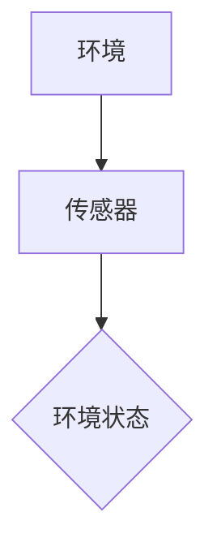

###### 6.2.2 状态评估

状态评估是代理在接收到环境状态后，通过神经网络模型对其进行处理的过程。这一步的目的是将原始的环境数据转换为一个能够表示环境状态的向量，以便后续的决策。

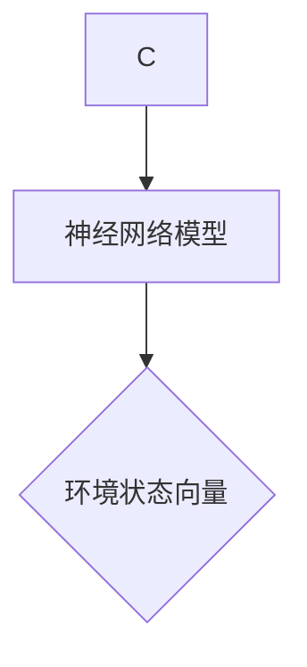

###### 6.2.3 决策与行动

决策与行动是DLA的核心步骤，代理根据当前状态向量，通过学习到的策略模型选择最佳动作，并执行该动作。这一步需要考虑动作的成本、收益以及可能带来的长期影响。

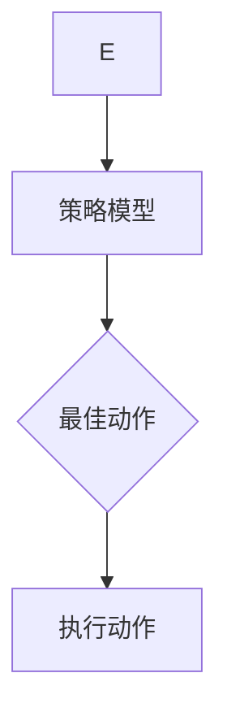

###### 6.2.4 反馈学习

反馈学习是DLA工作流中的关键环节，代理通过观测行动结果，调整自身的模型参数，以优化未来的决策。这一过程通常通过强化学习算法实现，代理在每次行动后都会获得奖励或惩罚，这些奖励用于更新模型。

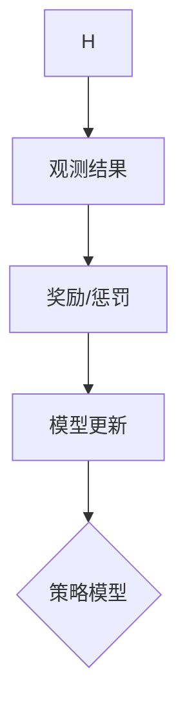

##### 6.3 用户交互设计

用户交互设计（User Interaction Design）是提升DLA用户体验的重要环节。良好的用户交互设计能够帮助用户理解代理的行为，提高代理的可信度和使用效率。以下是用户交互设计的关键要素：

1. **直观的用户界面**：用户界面（UI）应简洁直观，使用户能够快速理解和使用代理。
2. **实时反馈**：代理应提供实时反馈，帮助用户了解当前的状态和代理的行动。
3. **个性化定制**：根据用户的需求和偏好，提供个性化定制功能，增强用户体验。
4. **易用性测试**：通过用户测试和反馈，不断优化用户交互设计，提高用户满意度。

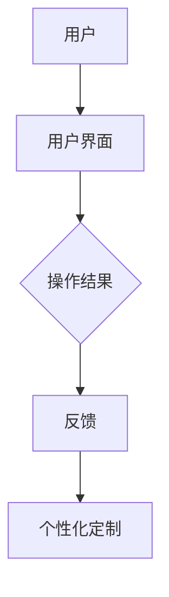

通过以上概述，我们可以看到，深度学习代理工作流涉及从环境感知到用户交互的多个环节。理解这些环节及其相互作用，对于设计和实现高效的DLA至关重要。在接下来的章节中，我们将进一步探讨深度学习代理的具体实现、可视化工具的选择，以及用户交互设计的实践，以提升DLA的实际应用效果。

### 第七部分: 可视化工具与应用

#### 第7章: 可视化工具概述

在深度学习领域，可视化工具起着至关重要的作用。它们不仅帮助我们理解模型的内部结构和训练过程，还能够帮助用户与代理进行有效的交互。本章将概述几种常用的可视化工具，并探讨这些工具在深度学习中的应用。

##### 7.1 可视化工具的作用

可视化工具在深度学习中的应用主要体现在以下几个方面：

1. **模型理解**：通过可视化工具，可以直观地了解深度学习模型的层次结构、权重分布和特征提取过程。
2. **训练监控**：可视化训练过程中的损失函数、准确率等指标，帮助用户监控模型性能，调整训练参数。
3. **结果展示**：将模型预测结果和实际结果进行对比，通过可视化展示模型的性能和泛化能力。
4. **用户交互**：通过直观的界面设计，使用户能够方便地与深度学习代理进行交互，提升用户体验。

##### 7.2 常见可视化工具

以下是几种在深度学习领域常用的可视化工具：

###### 7.2.1 Matplotlib

Matplotlib 是 Python 中常用的绘图库，它提供了丰富的绘图功能，可以用于生成各种类型的图表，如折线图、柱状图和散点图。Matplotlib 的优势在于其灵活性和强大的定制能力，可以满足用户对复杂图表的需求。

```python
import matplotlib.pyplot as plt

plt.plot(x, y)
plt.xlabel('X')
plt.ylabel('Y')
plt.title('Example Plot')
plt.show()
```

###### 7.2.2 Seaborn

Seaborn 是基于 Matplotlib 的可视化库，它提供了更丰富的可视化样式和颜色选择。Seaborn 的设计目标是简化复杂图表的创建，同时提供美观的默认样式。它特别适用于生成数据分布图、箱线图和热力图等。

```python
import seaborn as sns

sns.displot(data['column'], kde=True)
sns.relplot(x='x', y='y', hue='group', data=data)
```

###### 7.2.3 Plotly

Plotly 是一个交互式可视化库，它支持生成各种类型的交互式图表，如散点图、柱状图和折线图。Plotly 的交互性使其在深度学习模型可视化和用户交互方面具有优势，用户可以通过拖动、缩放和点击等操作与图表进行交互。

```python
import plotly.express as px

fig = px.scatter(x=data['x'], y=data['y'], color=data['group'])
fig.show()
```

##### 7.3 可视化应用案例

以下是一些深度学习领域的可视化应用案例：

###### 7.3.1 深度学习模型可视化

通过可视化工具，可以直观地了解深度学习模型的内部结构和特征提取过程。以下是一个使用 Matplotlib 可视化卷积神经网络的示例：

```python
import tensorflow as tf
from tensorflow.keras.models import Sequential
from tensorflow.keras.layers import Conv2D, MaxPooling2D, Flatten, Dense

model = Sequential([
    Conv2D(32, (3, 3), activation='relu', input_shape=(28, 28, 1)),
    MaxPooling2D((2, 2)),
    Conv2D(64, (3, 3), activation='relu'),
    MaxPooling2D((2, 2)),
    Flatten(),
    Dense(64, activation='relu'),
    Dense(10, activation='softmax')
])

from tensorflow.keras.utils import plot_model

plot_model(model, to_file='model.png', show_shapes=True, show_layer_names=True)
```

生成的图像展示了卷积神经网络的层次结构和每层的输出特征图，有助于用户理解模型的特征提取过程。

###### 7.3.2 数据流可视化

数据流可视化是深度学习模型设计的重要部分，它可以帮助用户理解数据在模型中的流动过程。以下是一个使用 Plotly 可视化数据流的示例：

```python
import plotly.graph_objects as go

fig = go.Figure(go.Scatter(
    x=[0, 1, 2, 3],
    y=[0, 1, 4, 9],
    mode='lines',
    name='Square Function',
    marker=dict(size=12, line=dict(width=2, color='rgba(255, 0, 0, 0.8)')
))

fig.update_layout(title='Data Flow Visualization',
                  xaxis_title='Input',
                  yaxis_title='Output')
fig.show()
```

这个交互式图表展示了输入数据在模型中的转换过程，用户可以通过缩放和拖动查看不同部分的细节。

###### 7.3.3 用户交互可视化

用户交互可视化是深度学习应用中的一项重要任务，它帮助用户更好地理解和使用深度学习模型。以下是一个使用 Matplotlib 可视化用户交互的示例：

```python
import matplotlib.pyplot as plt
import numpy as np

x = np.random.rand(100)
y = np.random.rand(100)

plt.scatter(x, y)
plt.xlabel('X')
plt.ylabel('Y')
plt.title('User Interaction Visualization')
plt.show()
```

这个简单的散点图展示了用户与系统之间的交互过程，用户可以通过点击和拖动查看不同的数据点。

通过这些可视化应用案例，我们可以看到，可视化工具在深度学习模型的理解、训练监控和用户交互中发挥着重要作用。选择合适的可视化工具，能够帮助用户更好地理解和使用深度学习技术，从而推动人工智能技术的发展和应用。

### 第八部分: 深度学习代理与用户交互设计实践

#### 第8章: 深度学习代理与用户交互设计实践

##### 8.1 深度学习代理应用案例

深度学习代理在多个领域都展现出了强大的应用潜力。以下我们将探讨两个典型的应用案例：推荐系统中的深度学习代理和游戏AI中的深度学习代理。

###### 8.1.1 推荐系统中的深度学习代理

在推荐系统中，深度学习代理可以基于用户的历史行为和偏好，为用户推荐个性化的商品或内容。以下是一个推荐系统的架构：

1. **用户行为数据收集**：收集用户在平台上的行为数据，如浏览、购买、评分等。
2. **深度学习模型训练**：使用用户行为数据和商品信息，训练深度学习模型，以预测用户对商品的喜好。
3. **推荐生成**：根据模型的预测结果，生成个性化的推荐列表。

以下是一个简化的流程图：

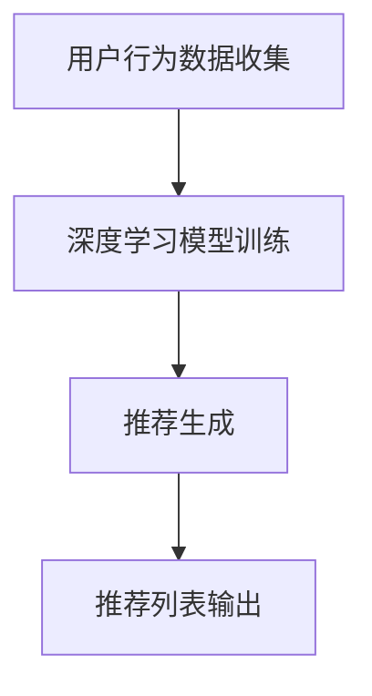

在用户交互设计方面，推荐系统应提供直观的用户界面，使用户能够轻松浏览和选择推荐内容。同时，系统应提供反馈机制，允许用户标记喜欢的和不喜欢的推荐，以便模型不断优化推荐结果。

###### 8.1.2 游戏AI中的深度学习代理

在游戏AI中，深度学习代理可以模拟人类玩家的行为，实现自动游戏。以下是一个简单的游戏AI架构：

1. **游戏状态感知**：代理通过游戏环境中的传感器获取当前状态。
2. **决策生成**：代理基于当前状态，使用深度学习模型生成最佳动作。
3. **游戏执行**：代理执行选定的动作，并更新游戏环境。

以下是一个简化的流程图：

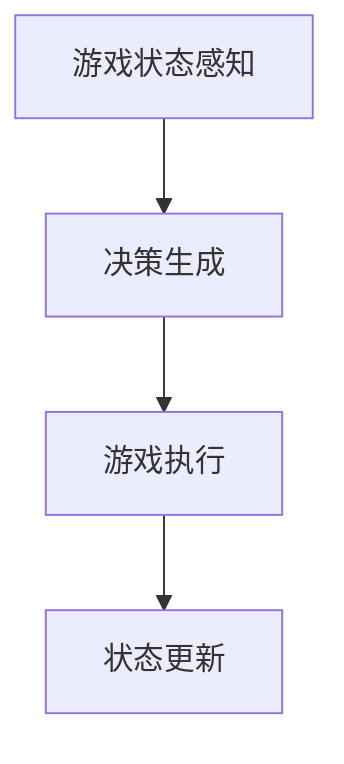

在用户交互设计方面，游戏AI应提供可定制的用户界面，允许用户调整代理的行为，如选择不同的游戏策略或设置游戏难度。同时，系统应提供实时的游戏状态反馈，帮助用户了解代理的决策过程。

##### 8.2 用户交互设计实践

用户交互设计是深度学习代理应用的关键环节，它决定了代理能否为用户提供优质的服务和体验。以下是一个用户交互设计实践的示例：

###### 8.2.1 用户需求分析

在开始设计用户交互之前，首先需要分析用户的需求。用户的需求可能包括以下方面：

1. **个性化推荐**：用户希望获得个性化的推荐内容。
2. **透明性**：用户希望了解推荐系统的决策过程。
3. **反馈机制**：用户希望能够提供反馈，帮助系统不断优化。
4. **可定制性**：用户希望对代理的行为进行定制，以适应不同的场景。

根据用户需求，我们可以设计以下功能：

1. **个性化推荐界面**：设计一个简洁的界面，展示个性化的推荐内容，用户可以轻松浏览和选择。
2. **推荐决策展示**：在推荐列表旁边展示推荐决策的依据，如用户行为和历史数据，提高透明性。
3. **反馈机制**：提供反馈按钮，用户可以通过点击按钮标记喜欢的和不喜欢的推荐。
4. **自定义设置**：允许用户自定义代理的行为，如设置推荐策略、调整推荐频率等。

###### 8.2.2 用户体验设计

用户体验设计是用户交互设计的核心，它决定了用户在使用代理时的感受。以下是一个用户体验设计的示例：

1. **界面设计**：使用简洁直观的界面设计，避免复杂的操作流程，提高用户的操作效率。
2. **反馈及时**：在用户操作后，及时给出反馈，如推荐结果的变化、系统加载进度等。
3. **易用性测试**：通过用户测试和反馈，不断优化用户界面和交互流程，确保用户能够轻松使用代理。
4. **个性化体验**：根据用户的偏好和历史数据，提供个性化的用户体验，如定制化的推荐界面、个性化的交互提示等。

###### 8.2.3 交互设计验证

交互设计验证是确保用户交互设计有效性的重要步骤。以下是一个交互设计验证的示例：

1. **用户调研**：通过问卷调查和用户访谈，了解用户对交互设计的满意度和建议。
2. **用户体验测试**：邀请一组用户参与交互设计测试，收集用户对界面设计和交互流程的反馈。
3. **数据分析**：分析用户行为数据，如用户点击率、使用时长等，评估交互设计的实际效果。
4. **迭代优化**：根据用户反馈和数据分析结果，对交互设计进行迭代优化，以提高用户满意度。

通过用户需求分析、用户体验设计和交互设计验证，我们可以设计出符合用户需求的深度学习代理交互界面，从而提升代理的实用性和用户体验。

##### 8.3 深度学习代理与用户交互设计结合

深度学习代理与用户交互设计的有效结合，能够提升代理的智能化程度和用户体验。以下是一个结合的示例：

1. **智能化决策**：深度学习代理通过不断学习和优化，能够为用户生成个性化的决策结果。
2. **交互式反馈**：用户可以通过交互界面与代理进行实时互动，提供反馈和调整设置。
3. **动态调整**：根据用户的行为和反馈，代理可以动态调整决策策略，以适应不同的场景和需求。
4. **个性化展示**：代理可以根据用户的偏好和历史数据，个性化展示推荐结果和决策依据。

以下是一个简化的架构图：

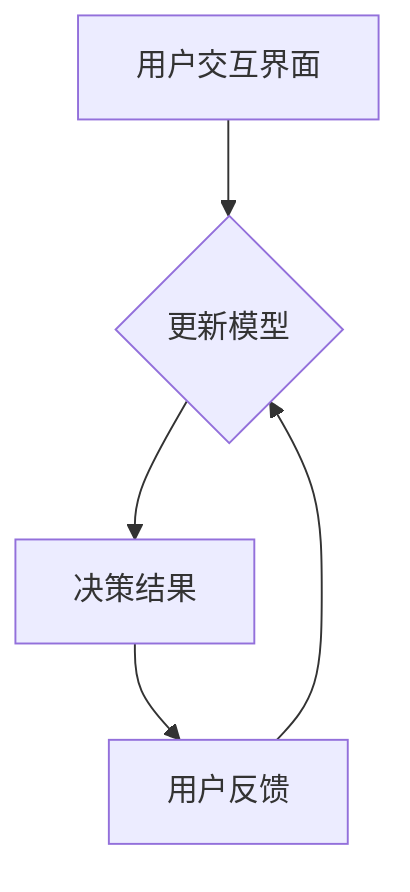

通过深度学习代理与用户交互设计的结合，我们可以实现智能化、个性化的服务，提升用户的满意度和使用体验。

### 附录

#### 附录 A: 相关资源与工具

##### A.1 深度学习资源

1. **学术资源**：
   - 《深度学习》（Goodfellow, Bengio, Courville）：这是一本深度学习的经典教材，适合初学者和高级研究者。
   - arXiv：这是一个学术论文数据库，涵盖深度学习的最新研究。

2. **开源代码**：
   - TensorFlow：谷歌开源的深度学习框架，支持多种类型的深度学习模型。
   - PyTorch：Facebook开源的深度学习框架，以其灵活性和易用性受到广泛使用。

3. **在线课程**：
   - 吴恩达深度学习课程：这是一个非常受欢迎的在线课程，适合不同层次的深度学习学习者。

##### A.2 可视化工具

1. **Matplotlib**：这是一个强大的绘图库，适用于生成各种类型的图表。
2. **Seaborn**：这是一个基于 Matplotlib 的可视化库，提供更丰富的可视化样式和颜色选择。
3. **Plotly**：这是一个交互式可视化库，支持生成各种类型的交互式图表。

##### A.3 用户交互设计工具

1. **Sketch**：这是一个矢量绘图工具，适用于设计界面的原型。
2. **Figma**：这是一个基于浏览器的交互设计工具，支持多人协作。
3. **Adobe XD**：这是一个适用于交互设计、原型设计和用户体验设计的工具。

### 结束语

本文系统地探讨了深度学习代理工作流的可视化与用户交互设计。通过对深度学习代理的定义、工作流设计、可视化工具的选择以及用户交互设计的实践，我们展示了如何有效结合深度学习技术与用户体验设计，提升深度学习代理的应用效果和用户体验。深度学习代理作为一种智能化的实体，在多个领域展现出了广阔的应用前景。随着技术的不断进步，我们可以预期深度学习代理将在更多场景中发挥重要作用。

未来的研究方向可以集中在以下几个方面：

1. **增强学习与深度学习的结合**：探索如何将增强学习与深度学习更好地结合，以提高代理的决策能力和学习效率。
2. **可解释性与透明性**：研究如何提高深度学习模型的可解释性，使代理的行为更加透明，增强用户的信任感。
3. **跨领域的通用性**：探索如何构建通用性更强的深度学习代理，使其能够应用于不同领域和任务。
4. **用户个性化需求**：研究如何更好地理解和满足用户的个性化需求，提供更加个性化的服务和体验。

本文旨在为深度学习领域的研究者提供有价值的参考，推动深度学习代理与用户交互设计的理论和实践发展。感谢您的阅读，希望本文能对您的相关工作有所启发。作者：AI天才研究院/AI Genius Institute & 禅与计算机程序设计艺术 /Zen And The Art of Computer Programming。再次感谢您的关注！<|mask|>### 引言

深度学习作为人工智能（AI）的一个重要分支，近年来在图像识别、语音识别、自然语言处理等众多领域取得了突破性的进展。深度学习算法通过多层神经网络结构对数据进行特征提取和模式识别，展现出强大的学习能力和自适应能力。然而，随着深度学习模型变得越来越复杂，如何有效地理解和解释这些模型，以及如何提升用户的交互体验，成为当前研究的重要课题。

本文的主题是“深度学习代理工作流的可视化与用户交互设计”。深度学习代理（Deep Learning Agents, DLA）是一种基于深度学习算法的人工智能实体，它能够模拟人类行为，自主地完成复杂任务。本文将首先介绍深度学习代理的基本概念和工作原理，然后探讨如何通过可视化工具和用户交互设计来提升深度学习代理的应用效果和用户体验。

文章的主要结构如下：

1. **引言**：介绍本文的主题和结构。
2. **深度学习代理概述**：介绍深度学习代理的定义、基本原理和应用场景。
3. **深度学习代理工作流**：详细描述深度学习代理的工作流程，包括环境感知、决策、行动和反馈学习等步骤。
4. **可视化工具的应用**：探讨如何在深度学习代理工作流中使用可视化工具，以帮助用户更好地理解代理的行为和决策过程。
5. **用户交互设计**：介绍用户交互设计的基本原则和方法，并通过实际案例展示如何设计直观、易用的用户界面。
6. **结合深度学习代理与用户交互设计**：探讨如何将深度学习代理与用户交互设计有机结合，提升用户体验。
7. **总结与展望**：总结本文的主要观点，并提出未来研究方向。

通过本文的深入探讨，我们希望能够为深度学习领域的研究者提供有价值的参考，推动深度学习代理与用户交互设计的理论和实践发展。希望本文能对您在相关领域的研究和工作有所启发。

### 第一部分：深度学习代理概述

#### 第1章：深度学习代理的基本概念

深度学习代理（Deep Learning Agents，DLA）是一种基于深度学习的人工智能实体，能够通过自主学习完成复杂任务。DLA通过从数据中学习策略，并在动态环境中执行行动，从而实现自主决策和智能行为。在本章节中，我们将深入探讨深度学习代理的基本概念、工作原理及其在不同领域的应用。

##### 1.1 深度学习代理的定义

深度学习代理是一种智能体，它通过深度学习算法从环境中学习行为策略，并能够自主地执行任务。与传统的规则驱动代理不同，深度学习代理能够通过大量的数据学习和适应环境，从而在复杂和动态的情境下做出更好的决策。

###### 1.1.1 代理的概念

代理（Agent）在人工智能中指的是一个能够感知环境、制定计划并执行行动的实体。代理可以是一个程序、机器人或者虚拟实体。在深度学习代理中，代理通常是一个神经网络模型，通过输入层接收环境状态，通过隐藏层处理信息，最后通过输出层产生行动。

###### 1.1.2 深度学习代理的特点

深度学习代理具有以下特点：

1. **自主性**：深度学习代理能够自主地做出决策，无需人工干预。
2. **自适应性**：通过深度学习算法，代理能够从数据中学习，并适应不同的环境和任务。
3. **智能化**：深度学习代理能够处理复杂的问题，提供高质量的解决方案。

##### 1.2 深度学习代理的工作原理

深度学习代理的工作原理基于深度学习算法，主要包括以下几个步骤：

1. **环境感知**：代理通过传感器获取环境状态，这些状态可以是图像、声音或其他形式的数据。
2. **状态评估**：代理使用深度学习模型对当前状态进行评估，以确定下一步的行动。
3. **决策生成**：代理根据评估结果选择最佳行动方案。
4. **行动执行**：代理执行选定的行动，并更新环境状态。
5. **反馈学习**：代理根据行动结果和获得的反馈，更新自身的模型，优化未来的决策。

###### 1.2.1 环境感知

环境感知是深度学习代理工作的第一步。代理通过传感器获取环境状态，这些状态数据可以是图像、声音或其他形式的输入。例如，在自动驾驶场景中，代理通过摄像头获取道路图像，通过雷达和激光雷达获取周围车辆和行人的位置信息。


###### 1.2.2 状态评估

状态评估是代理在接收到环境状态后，通过深度学习模型对其进行处理的过程。这一步的目的是将原始的环境数据转换为一个能够表示环境状态的向量，以便后续的决策。状态评估通常涉及特征提取和特征降维，以便模型能够有效地处理高维数据。

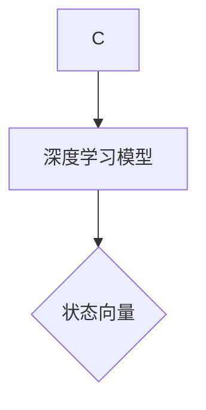

###### 1.2.3 决策生成

决策生成是代理根据当前状态向量，通过学习到的策略模型选择最佳行动方案的过程。这一步需要考虑动作的成本、收益以及可能带来的长期影响。决策生成通常涉及强化学习算法，例如 Q-learning 或深度 Q 网络（DQN）。

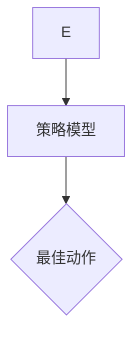

###### 1.2.4 行动执行

行动执行是代理根据决策结果执行选定行动的过程。这一步涉及到代理与环境的互动，代理通过执行行动来改变环境状态。行动执行的结果会返回到代理，用于更新其模型。

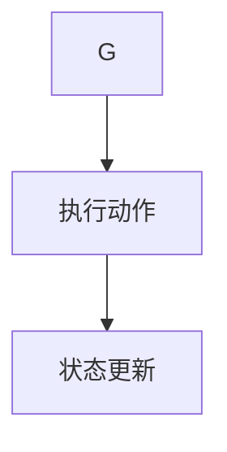

###### 1.2.5 反馈学习

反馈学习是代理根据行动结果和获得的反馈，更新自身模型的过程。这一步通常通过强化学习算法实现，代理在每次行动后都会获得奖励或惩罚，这些奖励用于优化未来的决策。

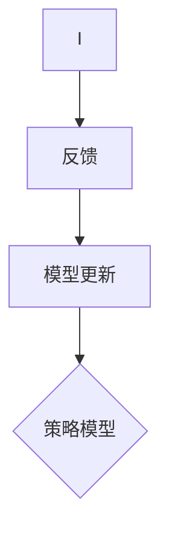

##### 1.3 深度学习代理的应用场景

深度学习代理在多个领域都展现了其强大的应用潜力。以下是一些典型的应用场景：

1. **自动驾驶**：深度学习代理可以通过摄像头和传感器获取道路信息，实现自动驾驶。
2. **游戏AI**：深度学习代理可以模拟人类玩家的行为，实现自动游戏。
3. **智能家居**：深度学习代理可以监控家庭环境，实现自动调节温度、光线等。
4. **机器人控制**：深度学习代理可以通过传感器获取机器人周围的信息，实现自主导航和任务执行。

以下是一个简化的应用场景流程图：

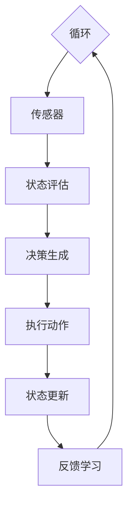

通过上述分析，我们可以看到深度学习代理的基本概念和工作原理，以及其在不同领域的应用。在接下来的章节中，我们将进一步探讨深度学习代理的工作流设计、可视化工具的应用和用户交互设计实践。

### 第一部分：深度学习代理概述

#### 第2章：深度学习代理工作流

深度学习代理的工作流是其实现智能决策和自主行动的关键。一个完整的深度学习代理工作流通常包括环境感知、状态评估、决策生成、行动执行和反馈学习等步骤。以下是对每个步骤的详细说明。

##### 2.1 环境感知

环境感知是深度学习代理工作的第一步，也是获取外部信息的过程。代理通过传感器（如摄像头、麦克风、传感器等）收集环境数据，这些数据可以是图像、声音、文本或其他形式的传感器数据。环境感知的质量直接影响到代理对环境的理解和决策。

###### 2.1.1 传感器数据收集

传感器数据的收集是环境感知的核心。不同的传感器可以收集不同类型的数据，例如：

1. **图像传感器**：用于收集环境中的视觉信息，如图像、视频等。
2. **声音传感器**：用于收集环境中的音频信息，如语音、音乐等。
3. **温度传感器**：用于收集环境温度信息。
4. **湿度传感器**：用于收集环境湿度信息。

这些传感器数据通常以数字信号的形式存储，并通过数据接口传输到代理进行处理。

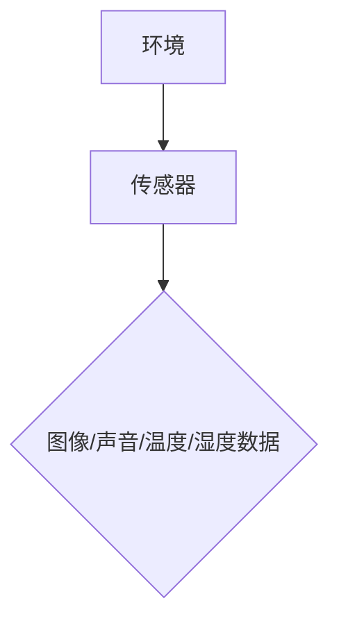

###### 2.1.2 数据预处理

收集到的传感器数据通常需要进行预处理，以提高数据的质量和可靠性。预处理步骤包括：

1. **去噪**：去除传感器数据中的噪声，提高数据的准确性。
2. **归一化**：将传感器数据归一化到统一的范围，便于模型处理。
3. **特征提取**：从原始数据中提取有用的特征，用于后续的状态评估。

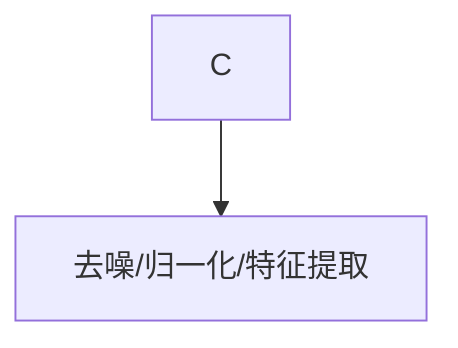

##### 2.2 状态评估

状态评估是代理对收集到的传感器数据进行处理和理解的过程。代理使用深度学习模型对传感器数据进行特征提取和模式识别，从而生成一个表示当前环境状态的向量。状态评估的质量直接影响到代理的决策能力。

###### 2.2.1 深度学习模型

状态评估通常依赖于深度学习模型，如卷积神经网络（CNN）、循环神经网络（RNN）或生成对抗网络（GAN）等。这些模型能够自动从传感器数据中提取有用的特征，并生成环境状态向量。

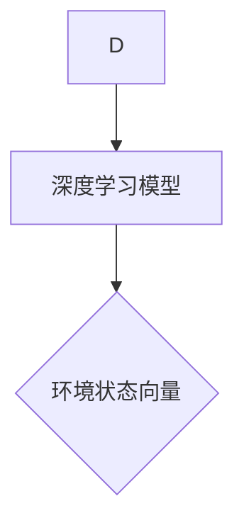

###### 2.2.2 状态向量生成

通过深度学习模型，代理生成一个表示当前环境状态的状态向量。状态向量通常包含了环境中的关键信息，如位置、速度、温度、湿度等。状态向量的维度和内容取决于具体的任务和模型设计。

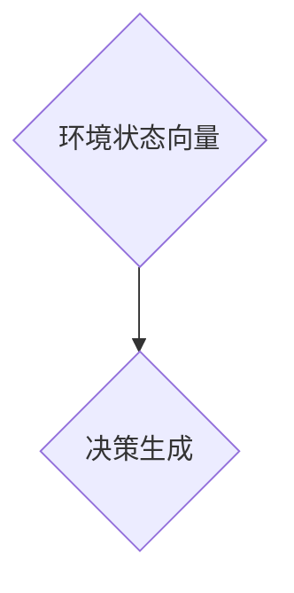

##### 2.3 决策生成

决策生成是代理根据当前状态向量选择最佳行动方案的过程。代理使用强化学习或监督学习算法来评估不同的行动方案，并选择一个最优的方案。

###### 2.3.1 行动评估

代理通过评估不同行动方案的收益或损失来选择最佳行动。评估方法包括：

1. **Q-learning**：通过经验回放和目标网络来评估不同行动的Q值。
2. **深度 Q 网络（DQN）**：使用深度神经网络来评估不同行动的Q值。
3. **策略梯度方法**：通过梯度上升方法优化策略参数。

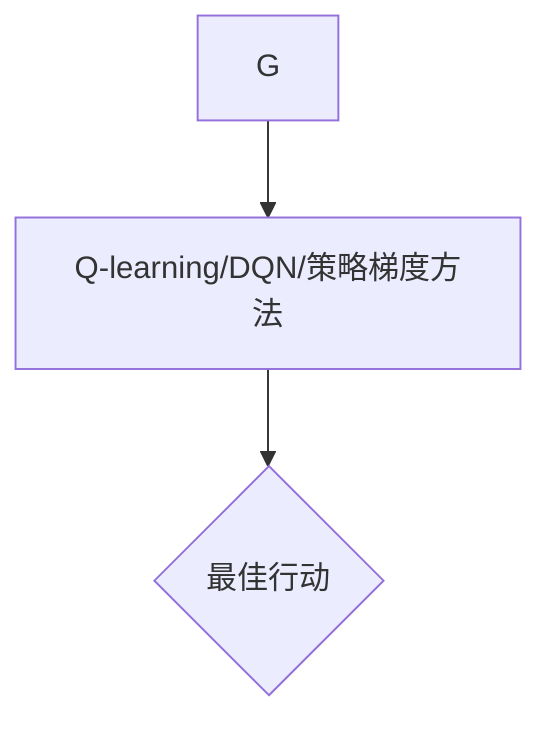

###### 2.3.2 行动选择

代理根据评估结果选择最佳行动。行动选择可以是离散的（如选择下一个位置）或连续的（如控制飞行器的速度和方向）。

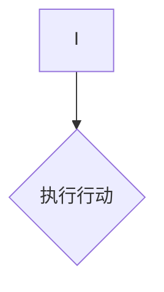

##### 2.4 行动执行

行动执行是代理根据决策结果执行选定行动的过程。行动执行涉及到代理与环境之间的交互，代理通过执行行动来改变环境状态。

###### 2.4.1 行动执行

代理通过执行选定行动来改变环境状态。行动可以是简单的（如移动一个机器人）或复杂的（如自动驾驶车辆的路径规划）。

```mermaid
graph TD
    J --> K{行动执行}
    K --> L{状态更新}
```

###### 2.4.2 状态更新

行动执行后，环境状态会发生变化。代理需要更新其感知到的状态，以便进行后续的决策。

```mermaid
graph TD
    L --> M{反馈学习}
```

##### 2.5 反馈学习

反馈学习是代理根据行动结果和获得的反馈，更新自身模型的过程。代理通过反馈学习不断优化其决策能力。

###### 2.5.1 反馈收集

代理收集行动结果和获得的反馈，这些反馈可以是奖励（如成功完成任务）或惩罚（如出现错误）。

```mermaid
graph TD
    K --> N{奖励/惩罚}
```

###### 2.5.2 模型更新

代理根据收集到的反馈更新其模型，以优化未来的决策。更新方法可以是梯度下降、策略梯度或强化学习算法。

```mermaid
graph TD
    N --> O{模型更新}
    O --> P{状态评估}
```

通过上述步骤，我们可以构建一个完整的深度学习代理工作流。工作流中的每个步骤都至关重要，共同决定了代理的决策能力、适应性和学习能力。在接下来的章节中，我们将探讨如何使用可视化工具和用户交互设计来提升深度学习代理的应用效果和用户体验。

### 第一部分：深度学习代理概述

#### 第3章：深度学习代理在不同领域的应用

深度学习代理作为一种智能化的实体，在多个领域展现了其强大的应用潜力。以下我们将探讨深度学习代理在自动驾驶、游戏AI、智能家居和机器人控制等领域的具体应用，并展示一些实际案例。

##### 3.1 自动驾驶

自动驾驶是深度学习代理的一个重要应用领域。自动驾驶车辆需要实时感知周围环境，并根据环境变化做出决策，以保持安全、高效的行驶。深度学习代理可以通过图像识别、激光雷达数据处理和传感器融合等技术，实现自动驾驶。

**案例**：谷歌的自动驾驶汽车项目Waymo使用了深度学习代理来处理复杂的驾驶任务。Waymo的深度学习代理通过摄像头、激光雷达和雷达等传感器收集环境数据，使用卷积神经网络（CNN）进行图像识别，使用循环神经网络（RNN）处理时间序列数据，最终生成驾驶决策。

**实现**：
1. **环境感知**：使用摄像头、激光雷达和雷达等传感器收集环境数据。
2. **状态评估**：使用CNN提取图像特征，使用RNN处理时间序列数据，生成环境状态向量。
3. **决策生成**：使用强化学习算法评估不同驾驶策略，选择最佳驾驶行为。
4. **行动执行**：根据决策结果执行驾驶操作，如加速、转向等。

**效果**：Waymo的自动驾驶汽车在多个城市进行了实地测试，展示了在复杂交通环境下的安全、高效驾驶能力。

##### 3.2 游戏AI

深度学习代理在游戏AI领域也有着广泛的应用。通过学习游戏规则和玩家行为，深度学习代理可以模拟人类玩家，实现自动游戏。在游戏AI中，代理通常需要处理高维的状态空间和复杂的决策树。

**案例**：DeepMind的AlphaGo通过深度学习代理实现了围棋的人工智能。AlphaGo使用深度神经网络和策略网络，通过对大量棋局的学习，实现了超人类的围棋水平。

**实现**：
1. **环境感知**：使用摄像头或传感器获取棋盘的图像信息。
2. **状态评估**：使用CNN提取棋盘的局部特征，生成状态向量。
3. **决策生成**：使用强化学习算法评估不同的落子策略，选择最佳落子位置。
4. **行动执行**：根据决策结果执行落子操作。

**效果**：AlphaGo在与人类顶尖棋手的对弈中取得了多次胜利，证明了深度学习代理在游戏AI领域的强大能力。

##### 3.3 智能家居

智能家居系统通过深度学习代理可以实现家庭设备的自动化控制，提高生活质量。深度学习代理可以监控家庭环境，根据用户的行为习惯自动调节温度、照明、安全系统等。

**案例**：亚马逊的Alexa智能助手通过深度学习代理实现了智能语音交互。Alexa使用语音识别技术识别用户指令，使用自然语言处理技术理解用户意图，并执行相应的操作。

**实现**：
1. **环境感知**：使用麦克风收集用户语音指令。
2. **状态评估**：使用语音识别模型将语音转换为文本，使用自然语言处理模型理解用户意图。
3. **决策生成**：使用规则引擎或机器学习模型生成操作指令。
4. **行动执行**：控制家庭设备执行用户指令。

**效果**：Alexa智能助手能够响应用户的语音指令，实现智能家居设备的自动化控制，提高了用户的生活便利性。

##### 3.4 机器人控制

深度学习代理在机器人控制领域也有着重要的应用。机器人需要通过传感器感知环境，并自主地完成特定的任务。深度学习代理可以通过对机器人传感器的数据处理，实现机器人的智能决策和行动。

**案例**：波士顿动力公司（Boston Dynamics）的机器人通过深度学习代理实现了复杂的运动和任务执行。例如，其机器人Spot使用深度学习算法实现自主导航、避障和任务执行。

**实现**：
1. **环境感知**：使用摄像头、激光雷达和超声波传感器收集环境数据。
2. **状态评估**：使用CNN提取环境特征，生成状态向量。
3. **决策生成**：使用强化学习算法评估不同的行动策略，选择最佳行动。
4. **行动执行**：根据决策结果执行机器人的运动操作。

**效果**：Spot机器人展示了在复杂环境下的自主导航和任务执行能力，实现了高度智能化的机器人控制。

通过上述案例，我们可以看到深度学习代理在自动驾驶、游戏AI、智能家居和机器人控制等领域的广泛应用和显著效果。深度学习代理通过高效的环境感知、智能决策和行动执行，显著提升了这些领域的自动化和智能化水平。在未来的发展中，深度学习代理将继续在更多领域发挥重要作用，推动人工智能技术的发展和应用。

### 第一部分：深度学习代理概述

#### 第4章：可视化工具在深度学习代理中的应用

在深度学习代理的应用过程中，可视化工具起到了至关重要的作用。它们不仅帮助开发人员理解模型的内部结构和行为，还能够向用户提供直观的交互界面，提升用户体验。本章将探讨如何使用可视化工具来展示深度学习代理的工作流程、模型结构和性能表现，并介绍几种常见的可视化工具。

##### 4.1 可视化工具的作用

可视化工具在深度学习代理中的应用主要体现在以下几个方面：

1. **模型理解**：通过可视化工具，可以直观地展示深度学习代理的模型结构，帮助开发人员理解模型的层次、连接方式以及参数分布。

2. **决策过程**：可视化工具可以展示深度学习代理在处理任务时的决策过程，包括状态评估、动作选择和反馈学习等环节，有助于开发人员分析模型的性能和优化空间。

3. **用户交互**：通过可视化工具，用户可以直观地了解代理的工作状态，提供反馈或调整参数，提升用户体验。

4. **性能监控**：可视化工具可以实时监控模型的训练过程，包括损失函数、准确率等指标，帮助开发人员及时发现和解决问题。

##### 4.2 常见可视化工具

在深度学习领域，有许多常用的可视化工具，以下是一些典型的工具：

1. **TensorBoard**：TensorBoard 是 TensorFlow 提供的一个可视化工具，它能够展示模型的结构、训练过程和性能指标。通过 TensorBoard，开发者可以实时监控模型的训练进度，查看损失函数、准确率等指标的动态变化。

   **示例**：
   ```python
   import tensorflow as tf
   from tensorflow.keras.callbacks import TensorBoard
   
   tensorboard_callback = TensorBoard(log_dir='./logs', histogram_freq=1)
   model.fit(x_train, y_train, epochs=10, callbacks=[tensorboard_callback])
   ```

2. **Matplotlib**：Matplotlib 是 Python 中的一个绘图库，它能够生成各种类型的图表，如折线图、散点图、柱状图等。通过 Matplotlib，可以绘制模型的损失函数、准确率曲线，直观地展示模型的训练过程。

   **示例**：
   ```python
   import matplotlib.pyplot as plt
   
   plt.plot(history.history['accuracy'])
   plt.plot(history.history['val_accuracy'])
   plt.title('Model accuracy')
   plt.ylabel('Accuracy')
   plt.xlabel('Epoch')
   plt.legend(['Train', 'Test'], loc='upper left')
   plt.show()
   ```

3. **Seaborn**：Seaborn 是基于 Matplotlib 的可视化库，它提供了更丰富的绘图样式和颜色选择。Seaborn 特别适合生成复杂的数据分布图、箱线图和热力图等，有助于分析模型的特征提取效果。

   **示例**：
   ```python
   import seaborn as sns
   
   sns.displot(data['column'], kde=True)
   sns.relplot(x='x', y='y', hue='group', data=data)
   ```

4. **Plotly**：Plotly 是一个交互式可视化库，它支持生成各种类型的交互式图表，如散点图、柱状图、折线图等。Plotly 的交互特性使其在展示动态数据和用户交互方面具有优势。

   **示例**：
   ```python
   import plotly.express as px
   
   fig = px.scatter(x=data['x'], y=data['y'], color=data['group'])
   fig.show()
   ```

##### 4.3 可视化应用案例

以下是一些深度学习代理的可视化应用案例：

1. **模型结构可视化**：

   通过 TensorBoard，可以可视化深度学习代理的模型结构。TensorBoard 生成的可视化报告包括模型图、权重直方图和激活直方图等，帮助开发人员理解模型的内部细节。

   **示例**：
   ```mermaid
   graph TD
       A[输入层] --> B[卷积层1]
       B --> C[池化层1]
       C --> D[卷积层2]
       D --> E[池化层2]
       E --> F[全连接层]
       F --> G[输出层]
   ```

2. **决策过程可视化**：

   通过 Matplotlib 和 Seaborn，可以可视化深度学习代理在决策过程中的关键指标，如损失函数、准确率等。这些图表可以帮助开发人员监控训练过程，优化模型参数。

   **示例**：
   ```python
   import matplotlib.pyplot as plt
   
   plt.figure(figsize=(10, 5))
   plt.subplot(1, 2, 1)
   plt.plot(history.history['loss'], label='Training Loss')
   plt.plot(history.history['val_loss'], label='Validation Loss')
   plt.legend()
   
   plt.subplot(1, 2, 2)
   plt.plot(history.history['accuracy'], label='Training Accuracy')
   plt.plot(history.history['val_accuracy'], label='Validation Accuracy')
   plt.legend()
   plt.show()
   ```

3. **用户交互界面**：

   通过 Plotly，可以创建交互式的用户界面，用户可以通过拖动、缩放和选择等方式与代理进行交互。这种界面设计可以提升用户体验，使代理更加易于操作和理解。

   **示例**：
   ```python
   import plotly.express as px
   
   fig = px.scatter(x=data['x'], y=data['y'], color=data['group'], title='User Interaction Example')
   fig.update_layout(clickmode='event+select')
   fig.show()
   ```

通过上述可视化工具和应用案例，我们可以看到如何将可视化技术应用于深度学习代理的开发和部署中。可视化工具不仅帮助开发人员更好地理解模型的工作原理，还提高了用户的操作体验，为深度学习代理的实际应用提供了有力支持。

### 第一部分：深度学习代理概述

#### 第5章：用户交互设计原则与实践

用户交互设计（User Interaction Design）是深度学习代理应用中不可或缺的一部分，它决定了代理能否有效地与用户互动，从而提升用户体验。本章将探讨用户交互设计的基本原则和实践方法，并结合具体案例展示如何设计直观、易用的用户界面。

##### 5.1 用户交互设计的基本原则

用户交互设计应当遵循以下基本原则，以确保深度学习代理能够为用户提供优质的服务和体验：

1. **易用性**：用户界面应当简洁直观，减少用户的操作难度，确保用户能够快速上手使用代理。

2. **一致性**：界面元素和交互流程应当保持一致性，使用户能够形成一致的操作习惯，降低学习成本。

3. **响应性**：界面应具有良好的响应性，能够快速响应用户的操作，提供即时的反馈。

4. **可访问性**：界面设计应考虑到不同用户的需求，包括视力障碍、听力障碍等，确保所有人都能使用代理。

5. **可控性**：用户应能够轻松控制代理的行为，如设置参数、选择行动方案等。

6. **可扩展性

