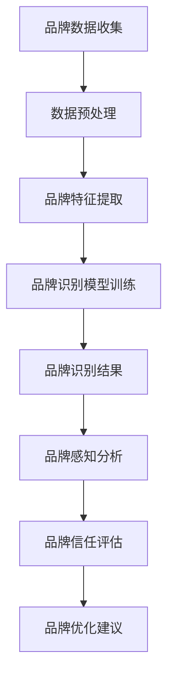

                 

### 第一部分：品牌塑造的基础理论

品牌塑造是一个复杂且持续的过程，涉及多个层面和策略。在这篇文章中，我们将首先探讨品牌塑造的基础理论，并逐步介绍AI在品牌塑造中的应用。

#### 第1章：AI与品牌塑造概述

##### 1.1 AI在品牌塑造中的作用

AI（人工智能）作为一种先进的技术，正在深刻改变各个行业的运作方式。在品牌塑造领域，AI发挥着至关重要的作用。首先，AI可以帮助企业更好地理解消费者行为，从而进行精准的市场细分和定位。例如，通过机器学习算法，企业可以分析海量数据，发现消费者的购买模式和偏好，进而调整品牌策略。

此外，AI在品牌传播、危机管理和个性化营销等方面也有广泛应用。例如，通过自然语言处理（NLP）技术，企业可以实现智能客服，提供即时、个性化的服务。此外，AI还可以用于预测市场趋势，帮助品牌提前布局，抢占市场先机。

##### 1.2 品牌塑造的基本原理

品牌塑造的基本原理包括品牌定位、品牌价值塑造、品牌传播和品牌管理。品牌定位是指确定品牌在消费者心目中的位置，从而区别于竞争对手。品牌价值塑造则是通过一系列策略，提升品牌在消费者心中的地位。品牌传播则是通过各种渠道，将品牌信息传递给消费者。最后，品牌管理是确保品牌一致性，维护品牌形象的过程。

##### 1.3 AI在品牌塑造中的应用场景

AI在品牌塑造中的应用场景非常广泛。例如，在市场细分方面，AI可以通过大数据分析，帮助企业发现潜在客户，并制定有针对性的营销策略。在品牌传播方面，AI可以自动化内容生成，提高传播效率。在危机管理方面，AI可以实时监测网络舆情，快速响应危机。在个性化营销方面，AI可以根据消费者的行为和偏好，提供个性化的产品推荐和服务。

#### 第2章：AI品牌塑造的核心概念与架构

##### 2.1 AI品牌识别系统

AI品牌识别系统是品牌塑造的核心，它包括品牌识别、品牌感知和品牌信任。品牌识别是指通过AI技术，识别出品牌的关键特征和独特价值。品牌感知是指消费者对品牌的感知和体验。品牌信任是指消费者对品牌的信任程度。

##### 2.2 AI品牌感知与体验

AI品牌感知与体验是指通过AI技术，提升消费者对品牌的感知和体验。例如，通过人脸识别技术，企业可以提供个性化服务，提高消费者的满意度。通过自然语言处理技术，企业可以实现智能客服，提供即时、个性化的服务。

##### 2.3 AI品牌价值塑造

AI品牌价值塑造是指通过AI技术，提升品牌在消费者心中的价值。例如，通过大数据分析，企业可以了解消费者的需求和偏好，从而提供更符合消费者期望的产品和服务。通过机器学习算法，企业可以预测市场趋势，提前布局，抢占市场先机。

#### 第3章：AI品牌架构与数据管理

##### 3.1 AI品牌架构设计原则

AI品牌架构设计原则包括数据驱动、灵活性、可扩展性和安全性。数据驱动是指品牌架构应以数据为核心，利用数据驱动决策。灵活性是指品牌架构应能够适应市场变化，快速调整。可扩展性是指品牌架构应能够支持业务的快速增长。安全性是指品牌架构应确保数据的安全性和隐私性。

##### 3.2 数据驱动品牌决策

数据驱动品牌决策是指通过数据分析和预测，制定品牌策略。例如，通过大数据分析，企业可以了解市场趋势和消费者需求，从而调整品牌策略。通过机器学习算法，企业可以预测市场变化，提前布局。

##### 3.3 数据隐私与品牌信任

数据隐私与品牌信任密切相关。如果企业不能保障数据隐私，消费者将失去对品牌的信任。因此，企业应采取严格的数据保护措施，确保消费者数据的安全性和隐私性。此外，企业还应积极与消费者沟通，增强消费者对品牌的信任。

#### 第4章：AI驱动品牌传播策略

##### 4.1 社交媒体与AI品牌传播

社交媒体是品牌传播的重要渠道。通过AI技术，企业可以自动化内容生成，提高传播效率。例如，通过自然语言处理技术，企业可以生成符合消费者兴趣的内容。通过推荐系统，企业可以将品牌信息推送给目标消费者。

##### 4.2 内容营销与AI品牌塑造

内容营销是品牌塑造的重要手段。通过AI技术，企业可以个性化内容，提高用户参与度。例如，通过机器学习算法，企业可以分析用户的浏览历史和偏好，生成个性化内容。

##### 4.3 搜索引擎优化与AI品牌营销

搜索引擎优化（SEO）是品牌营销的关键。通过AI技术，企业可以自动化SEO策略，提高搜索引擎排名。例如，通过自然语言处理技术，企业可以生成高质量的SEO内容。

#### 第5章：AI在品牌危机管理中的应用

##### 5.1 AI监测与预警系统

AI监测与预警系统可以帮助企业实时监测网络舆情，及时发现潜在危机。通过机器学习算法，企业可以分析舆情数据，预测危机趋势，提前预警。

##### 5.2 AI快速响应策略

AI快速响应策略是指通过AI技术，快速制定和实施危机应对策略。例如，通过自然语言处理技术，企业可以快速生成危机回应文本。

##### 5.3 AI危机恢复计划

AI危机恢复计划是指通过AI技术，帮助品牌迅速恢复声誉。例如，通过大数据分析，企业可以了解消费者对品牌的看法，制定针对性的恢复策略。

### 总结

品牌塑造是一个复杂且持续的过程，涉及多个层面和策略。AI的引入为品牌塑造带来了新的机遇和挑战。通过合理运用AI技术，企业可以实现更精准的品牌定位、更高效的传播和更有效的危机管理，从而提升品牌价值，实现持续发展。

### 1.1 AI在品牌塑造中的作用

人工智能（AI）在品牌塑造中扮演着至关重要的角色。首先，AI技术可以深度分析海量数据，帮助品牌理解消费者的行为模式、偏好和需求。这种数据驱动的洞察力不仅能够提高市场细分的准确性，还能为企业提供有针对性的品牌策略。

例如，通过机器学习算法，企业可以对消费者的浏览历史、购买记录和社交媒体互动进行分析。这些分析结果可以帮助品牌识别出潜在的客户群体，并针对这些群体制定个性化的营销活动。此外，AI还能够预测市场趋势，帮助企业提前布局，抢占市场先机。

其次，AI在品牌传播中也发挥着重要作用。利用自然语言处理（NLP）和自动化内容生成技术，企业可以大规模生产高质量的内容，快速响应市场变化。例如，AI可以自动生成社交媒体帖子、博客文章和广告文案，确保内容与品牌定位和目标受众的高度匹配。

此外，AI在危机管理方面也有独特的优势。通过实时监测网络舆情和社交媒体互动，AI可以快速识别潜在的品牌危机，并生成相应的预警报告。这样，企业可以迅速采取行动，减轻危机影响。

总的来说，AI在品牌塑造中的作用主要体现在以下几个方面：

1. **市场细分与定位**：通过分析消费者数据，AI可以帮助企业更准确地定位目标市场，制定有针对性的品牌策略。
2. **个性化营销**：AI可以根据消费者的偏好和需求，提供个性化的产品推荐和服务，提高客户满意度。
3. **内容生成与传播**：AI能够自动化内容生成，提高品牌传播的效率，确保内容的质量和一致性。
4. **危机管理**：AI可以实时监测网络舆情，快速识别和响应品牌危机，减轻危机影响。

### 1.2 品牌塑造的基本原理

品牌塑造是一个系统性工程，其基本原理包括品牌定位、品牌价值塑造、品牌传播和品牌管理。理解这些原理对于成功实施品牌战略至关重要。

**品牌定位**是品牌塑造的起点，它涉及到确定品牌在消费者心目中的独特位置。品牌定位需要明确品牌的核心价值和差异化特点，从而在竞争激烈的市场中脱颖而出。有效的品牌定位可以帮助企业吸引目标客户，并建立强有力的品牌认知。

**品牌价值塑造**是指通过一系列策略和活动，提升品牌在消费者心目中的价值。这包括品牌故事、品牌视觉设计、品牌文化和品牌体验等方面。品牌价值塑造的目的是让消费者感受到品牌的独特魅力和长期承诺，从而增强品牌忠诚度。

**品牌传播**是品牌信息传递给消费者的过程。品牌传播包括广告、公关、社交媒体、内容营销等多种手段。通过有效的品牌传播，企业可以扩大品牌影响力，提高市场认知度。

**品牌管理**是确保品牌一致性、维护品牌形象的过程。品牌管理需要制定明确的品牌标准，监督品牌执行的各个环节，确保品牌在不同渠道和市场中保持一致。

### 1.3 AI在品牌塑造中的应用场景

AI在品牌塑造中的应用场景非常广泛，以下是几个关键的应用领域：

**市场细分与定位**：AI可以通过分析消费者行为数据，识别出潜在的目标市场。例如，通过机器学习算法，企业可以分析消费者的购买历史、社交媒体互动和搜索引擎查询，从而发现消费者的兴趣和需求。这些洞察力可以帮助企业更精准地定位目标市场，制定有效的品牌策略。

**个性化营销**：AI可以帮助企业实现个性化营销，提高客户满意度。例如，通过推荐系统，AI可以根据消费者的购买记录和行为偏好，提供个性化的产品推荐。此外，AI还可以自动化内容生成，根据消费者的兴趣和行为生成个性化的营销信息。

**内容营销与品牌传播**：AI在内容营销和品牌传播中发挥着重要作用。通过自然语言处理技术，AI可以生成高质量的内容，如博客文章、社交媒体帖子、广告文案等。此外，AI还可以自动化内容分发，根据目标受众的偏好和习惯，选择最佳的传播渠道。

**危机管理**：AI在品牌危机管理中具有强大的预警和响应能力。通过实时监测网络舆情和社交媒体互动，AI可以快速识别潜在的品牌危机，并生成预警报告。此外，AI还可以自动化生成危机响应文本，帮助企业迅速制定和实施应对策略。

**数据分析和决策**：AI可以帮助品牌进行数据分析和决策。通过大数据分析，企业可以了解市场趋势、消费者行为和竞争对手动态。这些数据可以为品牌提供宝贵的决策支持，帮助品牌制定更有效的战略。

总的来说，AI在品牌塑造中的应用场景非常广泛，它可以帮助企业更精准地定位目标市场、实现个性化营销、提高品牌传播效率、管理品牌危机和做出更明智的决策。

### 2.1 AI品牌识别系统

AI品牌识别系统是品牌塑造的核心组件，它通过一系列技术手段，帮助品牌在市场中建立独特的识别和认知。一个有效的AI品牌识别系统通常包括三个关键部分：品牌识别、品牌感知和品牌信任。

**品牌识别**是指通过AI技术，识别出品牌的关键特征和独特价值。这涉及到品牌名称、标志、口号、视觉设计和品牌声音等多个方面。通过机器学习和自然语言处理技术，AI可以分析大量的品牌数据和消费者反馈，识别出品牌的独特元素和核心竞争力。

**品牌感知**是指消费者对品牌的感知和体验。AI品牌识别系统可以通过情感分析技术，分析消费者在社交媒体、评论和调查问卷中的反馈，了解消费者对品牌的情感反应和整体感知。这些感知数据可以帮助品牌优化品牌体验，提高消费者满意度。

**品牌信任**是指消费者对品牌的信任程度。AI品牌识别系统可以通过信任评分模型，结合消费者行为数据、品牌历史表现和市场反馈，评估品牌在消费者心中的信任度。这一评估结果可以帮助品牌识别出信任风险，并采取相应的措施提升品牌信任。

为了更清晰地展示AI品牌识别系统的架构，我们可以使用Mermaid流程图来描述其关键组件和流程：

在上述流程图中，品牌数据收集是整个系统的起点，通过数据预处理和品牌特征提取，为品牌识别模型提供高质量的数据输入。品牌识别模型训练是基于这些数据进行模型构建和优化，最终输出品牌识别结果。品牌感知分析和品牌信任评估则是通过对消费者反馈和品牌行为进行分析，为品牌优化提供数据支持。最终，品牌优化建议帮助品牌根据识别和分析结果，进行策略调整和品牌升级。

通过这种系统化的方法，AI品牌识别系统不仅能够帮助品牌在市场中建立独特的识别，还能通过持续的数据分析和优化，提升品牌在消费者心中的认知和信任度。

### 2.2 AI品牌感知与体验

AI品牌感知与体验是品牌塑造过程中至关重要的一环，它涉及到如何通过AI技术提升消费者对品牌的感知和整体体验。为了实现这一目标，AI品牌感知与体验主要依赖于以下几个关键技术和策略：

**个性化服务**：个性化服务是提升消费者品牌体验的重要手段。通过AI技术，企业可以分析消费者的行为数据，包括浏览历史、购买记录和社交媒体互动，从而为消费者提供个性化的产品推荐和服务。例如，利用机器学习算法，电商平台可以实时分析消费者的浏览行为，生成个性化的购物建议，提高用户满意度和转化率。

**情感分析**：情感分析技术可以帮助品牌了解消费者对其产品和服务的情感反应。通过自然语言处理（NLP）技术，AI可以分析社交媒体评论、客户反馈和调查问卷，识别消费者的情感状态。这些情感数据对于品牌优化产品设计和改进客户体验至关重要。例如，品牌可以通过分析负面情感评论，及时发现产品问题并迅速采取措施，提高客户满意度。

**实时互动**：实时互动是增强消费者品牌体验的有效方式。AI驱动的聊天机器人和虚拟客服可以帮助品牌提供即时、个性化的客户服务。这些智能系统可以处理大量的客户咨询，并根据客户的具体需求提供个性化的解决方案，从而提高客户满意度。例如，通过自然语言处理和语音识别技术，品牌可以构建智能客服系统，实现24/7全天候客户服务。

**用户体验优化**：用户体验优化是提升品牌感知的核心策略。AI技术可以帮助品牌分析用户在网站、应用或其他数字渠道的交互数据，识别用户体验中的痛点和改进机会。例如，通过A/B测试和用户行为分析，品牌可以优化网站布局、导航流程和交互设计，提高用户的访问体验。

**反馈机制**：建立有效的反馈机制是持续优化品牌体验的重要手段。AI技术可以自动化收集和分析消费者反馈，为品牌提供宝贵的改进建议。例如，通过在线调查和反馈表单，品牌可以收集用户的意见和建议，并通过AI分析这些数据，发现改进的机会。

**情感引导**：情感引导是通过设计品牌体验，引导消费者产生积极情感的方法。AI技术可以分析消费者的行为和情感数据，设计出能够激发消费者情感共鸣的品牌体验。例如，品牌可以通过情感化的内容营销和互动活动，增强消费者对品牌的情感连接，提高品牌忠诚度。

通过上述技术和策略，AI品牌感知与体验可以帮助品牌提升消费者的整体感知和满意度，从而在竞争激烈的市场中脱颖而出。个性化服务、情感分析、实时互动和用户体验优化等AI应用，不仅能够提升消费者的品牌体验，还能为品牌提供宝贵的洞察和改进方向，助力品牌持续成长。

### 2.3 AI品牌价值塑造

AI品牌价值塑造是品牌战略的重要组成部分，它通过数据分析和智能算法，帮助品牌提升在消费者心中的价值。在数字化时代，消费者行为数据变得愈发重要，而AI技术则为这些数据提供了深层次的洞察和分析能力，从而实现品牌价值的提升。

**大数据分析**是AI品牌价值塑造的基础。通过收集和分析消费者在互联网上的行为数据，如浏览记录、购买历史、社交媒体互动等，企业可以深入了解消费者的需求和偏好。例如，通过机器学习算法，品牌可以识别出消费者的特定购买模式，从而提供更精准的产品推荐和营销活动。

**智能算法**在品牌价值塑造中发挥着关键作用。通过这些算法，品牌可以优化产品推荐、个性化营销和用户体验。例如，协同过滤算法可以帮助品牌识别出消费者的相似偏好，从而生成个性化的推荐列表。此外，强化学习算法可以动态调整营销策略，提高营销活动的效果。

**消费者洞察**是AI品牌价值塑造的重要输出。通过AI技术，品牌可以生成详细的消费者画像，包括年龄、性别、地理位置、兴趣爱好等多个维度。这些洞察不仅有助于品牌更好地理解消费者，还能为产品开发、市场细分和营销策略提供有力支持。

**个性化定制**是提升品牌价值的重要手段。AI技术可以帮助品牌实现产品的个性化定制，满足消费者的独特需求。例如，通过3D打印技术和AI算法，品牌可以为消费者定制个性化的产品，从而提高消费者的满意度和忠诚度。

**情感连接**是品牌价值塑造的关键。通过情感分析技术，品牌可以了解消费者的情感状态，从而设计出更具情感共鸣的品牌体验。例如，通过情感化的广告内容和互动活动，品牌可以与消费者建立更深刻的情感联系，提高品牌忠诚度。

**案例分析**可以帮助我们更好地理解AI品牌价值塑造的实际应用。以某时尚品牌为例，该品牌通过AI技术分析了消费者的购物数据，发现了一组特定的消费者群体，他们对时尚潮流的敏感度较高。基于这一洞察，品牌推出了定制化时尚课程和时尚顾问服务，不仅满足了这些消费者的需求，还显著提升了品牌的差异化价值。

另一个案例是某在线教育平台，通过AI技术分析了学生的学习数据，识别出学习效果较好的教学方法。基于这些数据，平台调整了教学内容和教学方法，提高了学生的学习体验和效果，从而增强了品牌价值。

通过大数据分析、智能算法、消费者洞察、个性化定制和情感连接等手段，AI品牌价值塑造不仅能够提升品牌在消费者心中的价值，还能为品牌提供持续的创新动力和竞争优势。这些案例表明，AI技术在品牌价值塑造中的应用，不仅能够实现短期效益，更能为品牌的长期发展奠定坚实基础。

### 3.1 AI品牌架构设计原则

AI品牌架构设计是品牌塑造过程中的关键环节，其核心在于构建一个灵活、可扩展且安全的系统，以支持品牌在不同市场和渠道中的统一性和一致性。以下是一些关键的AI品牌架构设计原则：

**数据驱动**：数据驱动是AI品牌架构设计的核心原则之一。品牌架构应以数据为核心，通过收集、处理和分析大量消费者行为数据，为企业提供决策依据。数据驱动的设计意味着品牌需要建立强大的数据基础设施，确保数据的实时性和准确性，以便快速响应市场变化。

**灵活性**：品牌架构设计应具备高度的灵活性，以适应市场环境的快速变化。灵活性体现在品牌架构能够快速调整和优化，以适应不同的市场细分和消费者需求。通过模块化和微服务架构，品牌可以灵活地添加或移除功能模块，从而实现快速部署和迭代。

**可扩展性**：可扩展性是品牌架构设计的重要原则。随着业务的增长和市场的扩展，品牌架构应能够无缝扩展，支持更高的数据量和更复杂的计算需求。采用分布式计算和云计算技术，品牌可以实现弹性扩展，确保系统在高并发和大数据处理场景下仍能稳定运行。

**安全性**：安全性是品牌架构设计的首要考虑因素。品牌架构应确保数据的安全性和隐私性，防止数据泄露和未经授权的访问。通过采用加密技术、访问控制和多因素身份验证等安全措施，品牌可以保障数据的安全性和合规性。

**用户中心**：用户中心是品牌架构设计的基本原则之一。品牌架构应围绕用户的体验和需求进行设计，确保品牌在不同渠道和设备上提供一致的用户体验。通过用户画像和行为分析，品牌可以个性化用户互动，提高用户满意度和忠诚度。

**可追踪性**：可追踪性是品牌架构设计的重要原则。品牌需要能够实时监控和追踪品牌表现，包括品牌知名度、用户反馈和营销效果等。通过引入可追踪的数据指标和报告系统，品牌可以及时调整策略，优化品牌表现。

**协作性**：品牌架构设计应支持跨部门和跨渠道的协作。通过建立统一的平台和数据共享机制，品牌可以促进不同部门和团队之间的协作，提高工作效率和决策质量。

**可持续性**：可持续性是品牌架构设计的长期目标。品牌架构应考虑到未来的发展，支持技术的更新和升级，确保品牌能够长期稳定地发展。通过采用开放标准和模块化设计，品牌可以灵活应对技术变革，保持竞争力。

通过遵循上述设计原则，品牌可以构建一个高效、灵活和安全的AI品牌架构，从而实现品牌的持续增长和竞争优势。数据驱动、灵活性、可扩展性、安全性、用户中心、可追踪性、协作性和可持续性，这八个原则共同构成了一个全面而系统的AI品牌架构设计框架。

### 3.2 数据驱动品牌决策

在当今的商业环境中，数据已成为品牌决策的重要驱动力。通过数据分析和机器学习算法，企业能够从海量数据中提取有价值的信息，为品牌决策提供科学的依据。数据驱动品牌决策的过程主要包括以下几个关键步骤：

**数据收集**是数据驱动品牌决策的第一步。品牌需要收集各种类型的数据，包括消费者行为数据、市场趋势数据、竞争对手数据等。这些数据可以通过在线调查、社交媒体分析、销售数据记录等多种渠道获取。例如，通过分析消费者的购买历史和偏好，品牌可以更好地了解消费者的需求，从而制定更有效的营销策略。

**数据清洗**是数据驱动品牌决策的必要环节。原始数据通常包含噪声和不准确的信息，通过数据清洗，品牌可以去除重复数据、缺失值和异常值，确保数据的质量和准确性。数据清洗的过程包括数据去重、数据填充和数据格式化等操作。清洗后的数据将为后续的分析提供可靠的基础。

**数据分析**是对清洗后的数据进行分析，提取有价值的信息。数据分析可以采用多种方法，包括描述性统计分析、回归分析、聚类分析和时间序列分析等。通过这些分析方法，品牌可以发现数据中的隐藏模式和趋势，从而为决策提供支持。例如，通过回归分析，品牌可以预测销售趋势，优化库存管理。

**数据可视化**是将数据分析结果以直观的方式展示出来，帮助品牌更好地理解和解释数据。数据可视化工具，如图表、仪表板和地图等，可以帮助品牌直观地展示分析结果，发现关键洞察。例如，通过柱状图和折线图，品牌可以直观地了解不同时间段的销售表现，及时调整营销策略。

**机器学习**是数据驱动品牌决策的先进手段。通过机器学习算法，品牌可以从大量数据中自动提取模式，预测未来趋势。常见的机器学习算法包括线性回归、决策树、随机森林和神经网络等。例如，通过机器学习算法，品牌可以预测消费者的购买行为，从而优化库存管理和营销策略。

**模型评估**是确保数据驱动品牌决策有效性的关键步骤。品牌需要评估机器学习模型的准确性和鲁棒性，通过交叉验证和A/B测试等方法，验证模型的性能。如果模型表现不佳，品牌需要重新调整模型参数或选择更合适的算法。

**决策制定**是基于数据分析结果和模型预测，制定具体的品牌决策。这些决策可能包括产品定价、市场推广、产品定位等。例如，通过分析消费者数据，品牌可以确定目标市场，调整产品策略，以更好地满足消费者的需求。

**决策执行与监控**是将决策付诸实践，并通过实时监控和反馈机制，评估决策的效果。品牌需要建立有效的决策执行机制，确保决策能够迅速落地。同时，通过持续监控和反馈，品牌可以及时调整策略，优化决策效果。

通过数据驱动品牌决策，企业可以实现更加科学和精准的决策过程，提高品牌竞争力。数据收集、数据清洗、数据分析、数据可视化、机器学习和模型评估等步骤共同构成了数据驱动品牌决策的完整流程。这一流程不仅有助于品牌更好地理解市场和消费者，还能为品牌提供持续的创新动力和竞争优势。

### 3.3 数据隐私与品牌信任

在数据驱动品牌决策的时代，数据隐私与品牌信任之间的关系变得尤为重要。消费者对个人数据的保护意识日益增强，企业如果无法保障数据隐私，将可能失去消费者的信任，进而影响品牌的声誉和业务发展。

**数据隐私**是指保护个人数据不被未经授权的访问、使用或泄露。在品牌塑造中，数据隐私涉及对消费者数据的收集、存储、处理和传输的全过程。为了保障数据隐私，企业需要采取一系列措施：

1. **数据加密**：对敏感数据进行加密处理，确保数据在传输和存储过程中不被窃取或篡改。常用的加密算法包括对称加密和非对称加密。
2. **访问控制**：通过访问控制机制，限制对敏感数据的访问权限，确保只有授权人员才能访问和处理数据。
3. **匿名化处理**：对收集到的数据进行匿名化处理，去除个人标识信息，以降低数据泄露的风险。
4. **数据备份和恢复**：定期进行数据备份，确保在数据丢失或损坏时能够迅速恢复。
5. **隐私政策**：明确告知消费者数据收集的目的、范围和使用方式，获得消费者的明确同意。

**品牌信任**是消费者对品牌的信任程度，它是品牌价值的重要组成部分。数据隐私与品牌信任密切相关，如果企业不能保障数据隐私，消费者将失去对品牌的信任。以下是保障品牌信任的一些策略：

1. **透明度**：企业应保持数据处理的透明度，向消费者公开数据收集、存储和处理的方式，增加消费者对品牌的信任。
2. **用户控制权**：消费者应有权控制自己的数据，包括数据的访问、修改和删除。企业应提供简单易用的隐私设置，让消费者能够方便地管理自己的数据。
3. **合规性**：企业需要遵循相关数据隐私法律法规，如《通用数据保护条例》（GDPR）和《加州消费者隐私法案》（CCPA）等。合规性不仅有助于保护消费者权益，还能提升品牌在市场中的信誉。
4. **信任标志**：企业可以通过获得隐私认证或使用信任标志，向消费者展示其对数据隐私的承诺和保障。例如，ISO/IEC 27001认证就是一项国际上认可的信息安全管理体系认证。
5. **危机管理**：当数据泄露事件发生时，企业应迅速采取行动，通知受影响的消费者，并采取措施防止进一步泄露。同时，企业需要公开透明的沟通，积极解决消费者的担忧，恢复品牌信任。

通过以上策略，企业可以保障数据隐私，增强品牌信任。这不仅有助于提升消费者的满意度和忠诚度，还能为品牌在竞争激烈的市场中赢得更多的机会。

### 4.1 社交媒体与AI品牌传播

社交媒体已成为品牌传播的重要渠道，其开放、互动和实时性的特点，使得品牌能够直接与消费者沟通，提升品牌影响力和认知度。AI技术的引入进一步提升了社交媒体品牌传播的效率和效果。以下是AI在社交媒体品牌传播中的应用及其优势：

**自动化内容生成**：通过自然语言处理（NLP）和自动化写作技术，AI可以快速生成大量高质量的社交媒体内容，如博客文章、推文和广告文案。这种自动化内容生成不仅提高了内容生产的效率，还能确保内容的一致性和准确性。

**个性化推荐**：AI可以根据消费者的兴趣和行为数据，提供个性化的内容推荐。例如，社交媒体平台可以利用机器学习算法，分析用户的浏览历史和互动行为，推荐符合用户兴趣的品牌内容，从而提高内容的点击率和参与度。

**实时监测与回应**：AI技术可以实时监测社交媒体上的品牌提及和用户反馈，快速识别潜在的品牌危机和负面舆情。通过自动化响应系统，品牌可以迅速采取行动，回应消费者的问题和投诉，维护品牌形象。

**情感分析**：AI可以通过情感分析技术，分析用户对品牌内容的情感反应。这些情感数据可以帮助品牌了解消费者的情绪状态，优化内容策略，提高用户满意度。

**广告优化**：AI可以帮助品牌优化广告投放策略，提高广告效果。通过分析广告投放数据，AI可以动态调整广告内容、投放时间和目标受众，从而提高广告的点击率和转化率。

**社交图谱分析**：AI可以通过分析社交媒体的社交图谱，识别品牌的核心影响者和潜在用户群体。品牌可以利用这些洞察，制定针对性的营销策略，扩大品牌影响力。

总之，AI在社交媒体品牌传播中的应用，不仅提升了内容生产的效率和效果，还增强了品牌与消费者之间的互动，提高了品牌的影响力和认知度。通过自动化内容生成、个性化推荐、实时监测与回应、情感分析、广告优化和社交图谱分析等AI技术，品牌可以更精准地传递信息，与消费者建立更深层次的情感连接，从而在竞争激烈的市场中脱颖而出。

### 4.2 内容营销与AI品牌塑造

内容营销是品牌塑造的重要策略，通过创造和分发有价值的内容，品牌可以吸引目标受众，建立品牌认知和忠诚度。AI技术的引入，使内容营销更加智能化和高效化。以下是AI在内容营销中的应用及其对品牌塑造的影响：

**个性化内容生成**：AI技术可以自动生成个性化内容，满足不同受众的需求。通过自然语言处理（NLP）和机器学习算法，AI可以分析受众的行为数据，生成个性化的文章、视频、社交媒体帖子和电子邮件等。这种个性化内容不仅提高了用户的参与度，还增强了品牌与消费者之间的互动。

**自动化内容优化**：AI可以帮助品牌自动化内容优化，提高内容的质量和效果。例如，通过自然语言处理技术，AI可以分析用户对内容的反馈，优化标题、摘要和关键词，提高内容的点击率和转化率。此外，AI还可以自动调整内容发布的时间，确保在最佳时间点传达给目标受众。

**智能推荐系统**：AI技术可以实现智能推荐系统，根据受众的浏览历史、兴趣和行为，推荐相关的内容。这种个性化推荐不仅提高了内容的可见度，还增强了用户的粘性，提高了品牌的认知度和忠诚度。

**内容分析**：AI可以帮助品牌分析内容的表现，识别哪些内容最有效，哪些内容需要改进。通过分析用户的行为数据，如点击率、分享次数和评论数量，AI可以提供详细的报告，帮助品牌制定更有效的内容策略。

**情感分析**：AI可以通过情感分析技术，分析用户对品牌内容的情感反应。这些情感数据可以帮助品牌了解用户的需求和偏好，优化内容创作和传播策略，提高用户满意度和忠诚度。

**内容分发**：AI技术可以自动化内容分发，通过分析不同渠道的受众特征和传播效果，AI可以优化内容在不同平台和渠道的发布策略，确保内容能够精准地触达目标受众。

总之，AI在内容营销中的应用，使品牌能够更智能、更高效地创造和分发内容。通过个性化内容生成、自动化内容优化、智能推荐系统、内容分析、情感分析和内容分发等AI技术，品牌可以更好地满足受众的需求，建立强大的品牌影响力，提升品牌忠诚度。AI技术不仅提高了内容营销的效率，还为品牌塑造提供了新的机遇和策略。

### 4.3 搜索引擎优化与AI品牌营销

搜索引擎优化（SEO）是提升品牌在线可见度和吸引目标受众的重要手段。AI技术的引入，使SEO策略更加智能化和精准化，从而提高品牌营销效果。以下是AI在搜索引擎优化和品牌营销中的应用及其优势：

**关键词优化**：AI可以帮助品牌识别和选择最相关、最有价值的关键词。通过自然语言处理和机器学习算法，AI可以分析用户的搜索意图和习惯，推荐最佳关键词组合，提高搜索引擎排名。

**内容优化**：AI技术可以自动化内容生成和优化，确保内容与关键词紧密相关，并满足用户的搜索需求。通过分析用户行为数据和搜索引擎的反馈，AI可以实时调整内容结构、标题和描述，提高内容的搜索匹配度和用户体验。

**自动化SEO策略**：AI可以帮助品牌自动化执行SEO策略，包括内容发布、链接建设和搜索引擎提交等。通过自动化工具，品牌可以更高效地管理SEO任务，节省时间和资源。

**数据分析和报告**：AI技术可以实时监控和分析SEO效果，生成详细的报告。这些报告包括关键词排名、点击率、转化率等关键指标，帮助品牌评估SEO策略的效果，并做出相应的调整。

**用户行为预测**：AI可以分析用户在搜索引擎上的行为数据，预测用户的搜索意图和路径。这些预测结果可以帮助品牌优化网站结构、页面设计和用户体验，提高用户留存和转化率。

**竞争分析**：AI技术可以自动化分析竞争对手的SEO策略，识别竞争对手的关键词和内容策略。通过对比分析，品牌可以找到优化机会，制定更具竞争力的SEO策略。

**个性化搜索体验**：AI可以帮助品牌提供个性化的搜索体验，根据用户的兴趣和行为，推荐相关的搜索结果和内容。这种个性化搜索不仅提高了用户的满意度，还能增强品牌的用户粘性。

总之，AI技术在搜索引擎优化和品牌营销中的应用，使品牌能够更精准、更高效地执行SEO策略。通过关键词优化、内容优化、自动化SEO策略、数据分析和报告、用户行为预测、竞争分析和个性化搜索体验等AI技术，品牌可以提升在线可见度，吸引更多目标受众，从而实现更高的品牌影响力和市场竞争力。

### 5.1 AI监测与预警系统

在品牌管理中，AI监测与预警系统扮演着至关重要的角色。这一系统通过实时监测网络舆情和社交媒体互动，帮助企业及时发现潜在的品牌危机，从而采取有效的应对措施，避免品牌声誉受损。

**AI监测系统的架构**：

AI监测与预警系统通常包括以下几个关键组件：

1. **数据收集模块**：负责从各种来源（如社交媒体、新闻网站、论坛、博客等）收集与品牌相关的数据。
2. **数据预处理模块**：对收集到的原始数据进行分析和清洗，去除噪声和不相关的信息，确保数据的质量和准确性。
3. **分析引擎模块**：利用自然语言处理（NLP）和机器学习算法，对预处理后的数据进行分析，识别出潜在的品牌危机信号。
4. **预警机制模块**：当分析引擎检测到负面信息或潜在危机时，自动生成预警报告，并通过邮件、短信或其他方式通知相关管理人员。
5. **决策支持模块**：为品牌管理团队提供危机应对策略和建议，帮助他们制定和实施危机管理计划。

**关键步骤和流程**：

1. **数据收集**：系统从社交媒体平台、新闻网站和其他渠道收集与品牌相关的信息，包括用户评论、新闻报道、论坛讨论等。
2. **数据预处理**：对收集到的数据进行分析和清洗，去除重复、无关的信息，提取出关键信息。
3. **情感分析**：利用NLP技术，对预处理后的数据进行分析，识别出用户的情感倾向和潜在危机。
4. **趋势分析**：通过分析情感数据和趋势，系统可以预测潜在危机的发展方向和影响范围。
5. **预警生成**：当分析结果显示潜在危机时，系统会自动生成预警报告，并通知相关管理人员。
6. **决策支持**：系统为品牌管理团队提供危机应对策略和建议，帮助他们制定和实施危机管理计划。

**技术实现**：

以下是AI监测与预警系统的技术实现：

1. **数据收集**：使用API接口或网络爬虫技术，从社交媒体平台和新闻网站等渠道收集数据。
2. **数据预处理**：使用自然语言处理（NLP）技术，对数据进行分词、词性标注、去除停用词等处理。
3. **情感分析**：使用文本分类和情感分析算法，对预处理后的数据进行分析，识别出负面情感和潜在危机。
4. **趋势分析**：使用时间序列分析和机器学习算法，预测潜在危机的发展方向和影响范围。
5. **预警生成**：使用报告生成工具，将分析结果和预警信息转化为可视化报告，并通过邮件、短信等方式通知相关人员。
6. **决策支持**：使用数据可视化和推荐系统技术，为品牌管理团队提供危机应对策略和建议。

**案例分析**：

以某知名品牌为例，该品牌通过AI监测与预警系统，成功监测到一次潜在的品牌危机。一次，该品牌的一款新产品上市后，一些消费者在社交媒体上反映产品存在质量问题。AI监测系统迅速识别到这一负面信息，并生成预警报告，通知品牌管理团队。品牌团队立即采取措施，召回相关产品并进行质量检测，同时通过官方渠道发布声明，解释情况并承诺改进。通过快速响应和有效应对，品牌成功避免了危机的进一步扩大，维护了品牌声誉。

通过AI监测与预警系统，品牌可以实时监测网络舆情，快速识别潜在危机，采取有效措施，避免品牌声誉受损。这一系统的技术实现和成功案例，为品牌管理提供了有力的支持。

### 5.2 AI快速响应策略

在品牌管理中，快速响应策略是应对品牌危机的关键。AI技术为快速响应提供了强大的支持，通过自动化和智能化的手段，品牌可以迅速识别危机、制定策略并采取行动，最大限度地减少危机带来的负面影响。

**AI快速响应策略的核心组成部分**：

1. **实时监测与识别**：AI系统可以实时监测社交媒体、新闻网站、论坛等渠道，识别与品牌相关的负面信息。通过自然语言处理（NLP）和机器学习算法，AI能够快速分析信息内容，识别潜在危机。
2. **预警系统**：当AI监测系统发现负面信息时，会自动生成预警报告，并通过邮件、短信等方式通知品牌管理团队。预警系统可以设置多种阈值和规则，确保在危机初期就得到及时识别。
3. **智能决策支持**：AI系统可以根据预警信息和历史案例，提供智能化的危机应对策略。这些策略包括公开声明、客户沟通、产品召回等，帮助品牌管理团队迅速做出决策。
4. **自动化响应**：AI技术可以实现自动化响应，例如自动生成声明、自动回复客户咨询等。自动化响应不仅提高了响应速度，还能确保信息的统一性和专业性。
5. **数据分析与优化**：AI系统会持续分析危机处理的效果，并根据反馈进行优化。通过不断调整和优化策略，品牌可以逐步提高快速响应的能力和效果。

**关键步骤与流程**：

1. **实时监测**：AI系统持续监控网络渠道，识别负面信息。
2. **预警生成**：AI系统自动生成预警报告，通知品牌管理团队。
3. **智能决策**：AI系统根据预警信息和历史案例，提供智能化的危机应对策略。
4. **自动化响应**：AI系统自动执行危机响应任务，如发布声明、回复客户咨询等。
5. **效果评估与优化**：AI系统分析危机处理效果，不断优化策略。

**技术实现**：

以下是AI快速响应策略的技术实现：

1. **实时监测**：使用API接口和爬虫技术，实时收集社交媒体和新闻网站等信息。
2. **预警生成**：使用NLP和机器学习算法，分析信息内容，生成预警报告。
3. **智能决策**：使用数据分析和机器学习算法，根据历史案例生成危机应对策略。
4. **自动化响应**：使用自动化工具和API接口，自动执行响应任务。
5. **效果评估与优化**：使用数据分析和反馈机制，持续优化策略。

**案例分析**：

以某知名科技品牌为例，该品牌在一次产品召回事件中，通过AI快速响应策略成功化解了危机。在一次产品测试中，发现存在安全隐患，AI监测系统迅速识别到这一问题，并生成预警报告。品牌管理团队根据AI提供的智能决策，立即发布声明，详细解释问题并承诺解决。同时，AI系统自动化处理客户咨询，提供解决方案，有效安抚了消费者情绪。通过快速响应和透明沟通，品牌成功避免了危机的进一步扩大，维护了品牌声誉。

通过AI快速响应策略，品牌可以迅速识别和应对品牌危机，最大限度地减少负面影响，提升品牌信誉和消费者满意度。

### 5.3 AI危机恢复计划

在品牌管理中，当危机发生时，快速响应只是第一步，如何有效地恢复品牌声誉和消费者信任是品牌管理者面临的更大挑战。AI技术在这一过程中发挥着关键作用，通过数据分析和智能策略，帮助品牌制定和实施危机恢复计划。

**AI危机恢复计划的核心组成部分**：

1. **消费者行为分析**：通过AI技术，品牌可以深入分析消费者的行为和反馈，了解消费者对危机的反应。这包括消费者的投诉、评论、评分以及社交媒体上的讨论。通过情感分析和行为分析，品牌可以评估消费者情绪，识别出影响品牌声誉的主要问题。

2. **数据驱动的恢复策略**：基于消费者行为分析的结果，AI可以帮助品牌制定数据驱动的恢复策略。这包括改进产品和服务、优化客户体验、加强品牌沟通等。AI可以根据历史数据和趋势，提供个性化的恢复建议，确保策略的有效性。

3. **危机恢复评估**：AI技术可以实时监控品牌恢复计划的执行效果，通过数据分析评估恢复策略的成效。这包括监测品牌在社交媒体、搜索引擎和新闻报道中的表现，评估消费者对品牌恢复措施的反馈。通过持续的数据监控，品牌可以及时调整恢复策略。

4. **自适应调整**：AI系统可以根据实时数据，自适应调整恢复策略。当某些措施未能达到预期效果时，AI可以迅速识别问题，提供新的解决方案，帮助品牌快速响应变化。

**关键步骤与流程**：

1. **初始评估**：通过AI技术，对危机的严重性和影响范围进行初始评估，确定恢复的重点和优先级。
2. **消费者行为分析**：收集并分析消费者行为数据，识别出消费者对危机的主要关切。
3. **制定恢复策略**：基于消费者行为分析结果，制定数据驱动的恢复策略，包括产品改进、客户关怀、品牌传播等。
4. **执行恢复计划**：按照恢复策略执行具体行动，如产品召回、客户补偿、品牌沟通等。
5. **效果监控与评估**：通过AI技术，实时监控恢复计划的效果，评估恢复策略的成效。
6. **自适应调整**：根据效果评估结果，调整恢复策略，确保策略的有效性和适应性。

**技术实现**：

以下是AI危机恢复计划的技术实现：

1. **初始评估**：使用自然语言处理（NLP）和数据分析技术，评估危机的严重性和影响范围。
2. **消费者行为分析**：使用机器学习和情感分析技术，分析消费者的反馈和评论。
3. **恢复策略制定**：基于数据分析结果，使用数据驱动的方法制定恢复策略。
4. **执行恢复计划**：使用自动化工具和API接口，执行具体的恢复行动。
5. **效果监控与评估**：使用实时数据监控技术和数据分析，评估恢复计划的效果。
6. **自适应调整**：使用机器学习和优化算法，自适应调整恢复策略。

**案例分析**：

以某知名汽车品牌为例，该品牌在一次产品召回事件中，通过AI危机恢复计划成功恢复了品牌声誉。在事件初期，AI系统通过分析社交媒体和新闻报道，迅速识别出消费者对产品安全性的担忧。品牌管理团队根据AI提供的数据分析结果，制定了详细的恢复策略，包括产品召回、客户补偿和公开声明等。同时，AI系统实时监控品牌恢复计划的执行效果，并根据消费者反馈和舆情变化，及时调整策略。通过数据驱动的恢复措施，品牌成功恢复了消费者信任，品牌声誉逐渐恢复。

通过AI危机恢复计划，品牌可以更加科学和高效地应对危机，最大限度地减少负面影响，恢复品牌声誉和消费者信任。

### 总结

品牌塑造是一个复杂且持续的过程，涉及多个层面和策略。在这一部分中，我们探讨了AI在品牌塑造中的应用，从品牌识别、感知与体验，到价值塑造、架构设计、数据管理和危机管理，AI为品牌塑造提供了强大的技术支持。AI不仅提高了品牌定位的准确性、个性化营销的效率、内容传播的效果，还增强了品牌危机管理的响应速度和恢复能力。

通过本文的详细分析，我们可以得出以下几点结论：

1. **AI在品牌识别中的作用**：AI可以帮助品牌识别出独特的品牌特征和核心价值，从而建立品牌识别系统，提升品牌在消费者心中的独特性。

2. **AI品牌感知与体验的优化**：通过个性化服务和情感分析，AI能够提升消费者对品牌的感知和整体体验，增强品牌与消费者之间的情感连接。

3. **AI品牌价值塑造的重要性**：AI通过大数据分析和智能算法，帮助品牌提升在消费者心中的价值，实现更精准的市场细分和营销策略。

4. **AI品牌架构的设计原则**：数据驱动、灵活性、可扩展性、安全性是AI品牌架构设计的关键原则，确保品牌能够在多变的市场环境中持续发展。

5. **数据隐私与品牌信任的关系**：保障数据隐私是维护品牌信任的基础，AI技术为品牌提供了强大的数据保护手段，增强消费者对品牌的信任。

6. **AI在品牌传播策略中的应用**：通过社交媒体、内容营销和搜索引擎优化，AI技术提高了品牌传播的效率和效果，增强品牌影响力。

7. **AI在品牌危机管理中的优势**：AI监测与预警系统、快速响应策略和危机恢复计划，使品牌能够更迅速、更有效地应对危机，维护品牌声誉。

总之，AI技术为品牌塑造提供了全新的机遇和工具，通过合理运用AI技术，品牌可以实现更精准的市场定位、更高效的传播和更有效的危机管理，从而提升品牌价值，实现持续发展。

### 第6章：AI创业公司的品牌定位

在竞争激烈的市场环境中，品牌定位是创业公司成功的关键。一个清晰的、有差异化的品牌定位可以帮助创业公司吸引目标客户，建立竞争优势。AI技术在品牌定位中发挥着重要作用，通过数据分析和智能算法，创业公司可以更精准地识别目标市场，制定有效的品牌战略。

#### 6.1 创业公司品牌定位的重要性

品牌定位不仅是品牌战略的核心，也是创业公司成功的关键。一个明确的品牌定位可以帮助公司：

- **吸引目标客户**：通过明确品牌价值主张和差异化特点，创业公司可以吸引那些与品牌定位相符合的客户，提高客户转化率。
- **建立竞争优势**：清晰的品牌定位可以使创业公司在市场中脱颖而出，与竞争对手形成差异，从而在消费者心中建立独特的品牌形象。
- **提高品牌知名度**：有效的品牌定位有助于提高品牌的市场认知度，增强品牌影响力，吸引更多潜在客户。
- **优化资源分配**：明确的品牌定位可以帮助创业公司更合理地分配资源，专注于品牌核心价值和目标市场，提高运营效率。

#### 6.2 创业公司品牌定位的方法

品牌定位需要系统的方法和步骤，以下是创业公司品牌定位的几个关键方法：

1. **市场分析**：创业公司需要深入分析市场环境，了解行业趋势、竞争对手和目标客户的需求。通过市场分析，公司可以识别出潜在的市场机会和挑战。

2. **目标市场识别**：基于市场分析结果，创业公司需要明确目标市场，确定品牌的主要受众群体。识别目标市场有助于公司制定有针对性的品牌战略。

3. **品牌价值主张**：品牌价值主张是品牌定位的核心，它描述了品牌能够为消费者提供的独特价值。创业公司需要明确品牌的核心价值，使其在消费者心中具有明显的差异化。

4. **差异化特点**：创业公司需要识别出与竞争对手不同的差异化特点，从而在市场中建立独特的品牌形象。这可以通过技术创新、产品特性、服务质量等方面来实现。

5. **品牌沟通**：品牌定位需要通过一致的沟通策略传递给目标受众。创业公司需要设计符合品牌定位的视觉和语言元素，确保品牌信息的一致性和传达效果。

#### 6.3 成功案例分析

以下是一些成功的AI创业公司品牌定位案例：

1. **案例一：OpenAI**

OpenAI是一家专注于人工智能研究与应用的创业公司。其品牌定位是成为“最优秀的AI研究团队”，致力于推动AI技术的发展和普及。通过这一明确的品牌定位，OpenAI成功吸引了大量顶级AI专家和投资者，并在AI领域建立了强大的影响力。

2. **案例二：Doordash**

Doordash是一家提供外卖服务的创业公司。其品牌定位是“让世界更便捷”，通过智能调度系统和高效的配送服务，Doordash为消费者提供了快速、方便的外卖体验。这一品牌定位帮助Doordash在激烈的市场竞争中脱颖而出，成为外卖服务市场的领导者。

3. **案例三：Coursera**

Coursera是一家在线教育平台，其品牌定位是“全球学习的家”。通过提供高质量的在线课程和灵活的学习方式，Coursera为全球学习者提供了丰富的学习资源。这一品牌定位使Coursera在在线教育市场中建立了强大的品牌认知度和用户忠诚度。

通过这些成功案例，我们可以看到，明确的品牌定位是创业公司成功的重要因素。通过深入分析市场环境、识别目标市场、明确品牌价值主张和差异化特点，创业公司可以制定有效的品牌战略，赢得市场竞争力。

### 6.1 创业公司品牌定位的重要性

品牌定位在创业公司的成功中扮演着至关重要的角色。一个清晰的、有差异化的品牌定位不仅是吸引目标客户的关键，也是建立竞争优势的重要手段。以下是品牌定位对创业公司的重要性的详细探讨：

1. **吸引目标客户**：品牌定位有助于创业公司吸引与其品牌价值主张相符合的目标客户。通过明确品牌的核心价值、特点和优势，创业公司可以传递出清晰的品牌形象，使潜在客户更容易识别和选择。例如，如果创业公司的品牌定位是提供高品质的有机食品，那么目标客户群体将是注重健康和环保的消费者。通过精准的品牌定位，公司可以集中资源和服务于这些目标客户，提高客户转化率。

2. **建立竞争优势**：在竞争激烈的市场环境中，一个有差异化的品牌定位可以帮助创业公司脱颖而出。通过识别出与竞争对手不同的特点，如技术创新、独特产品或卓越服务，创业公司可以在消费者心中建立独特的品牌形象。这种差异化不仅有助于在市场中获得竞争优势，还能提高品牌认知度和忠诚度。例如，如果创业公司的品牌定位是提供定制化解决方案，那么在市场上将很难找到直接的竞争对手，从而建立起强大的竞争优势。

3. **提高品牌知名度**：有效的品牌定位有助于提升品牌在市场中的知名度。通过一致的沟通策略和传播渠道，创业公司可以将品牌信息传递给更广泛的受众，增加品牌曝光率。这不仅可以吸引更多的潜在客户，还能提高品牌的市场影响力。例如，通过在社交媒体上发布有针对性的内容和广告，创业公司可以迅速扩大品牌知名度，吸引更多的关注。

4. **优化资源分配**：明确的品牌定位可以帮助创业公司更合理地分配资源。品牌定位不仅决定了公司的核心价值和市场策略，还指导了资源投入的方向。通过聚焦品牌定位，创业公司可以更有效地利用资源，避免资源的浪费，提高运营效率。例如，如果品牌定位是提供高端定制服务，那么公司可以将资源主要投入到产品研发和客户服务上，确保品牌价值得到充分体现。

5. **提高品牌忠诚度**：品牌定位有助于建立品牌与消费者之间的情感连接，提高品牌忠诚度。当消费者感受到品牌的价值和独特性时，他们更有可能成为品牌的忠实粉丝。通过持续传递品牌定位，创业公司可以培养消费者的品牌忠诚度，从而在竞争中获得稳定的客户基础。

总之，品牌定位是创业公司成功的关键因素。通过吸引目标客户、建立竞争优势、提高品牌知名度、优化资源分配和提高品牌忠诚度，明确的品牌定位有助于创业公司在市场中脱颖而出，实现持续发展。

#### 6.2 创业公司品牌定位的方法

品牌定位是一个系统性的过程，需要通过多种方法和策略来确保品牌在消费者心中建立清晰、独特的形象。以下是一些关键方法，用于帮助创业公司进行品牌定位：

1. **市场分析**：市场分析是品牌定位的第一步，通过深入了解市场环境和竞争对手，创业公司可以识别出潜在的市场机会和挑战。具体步骤包括：

   - **行业趋势分析**：了解当前行业的发展趋势，如新兴技术、市场增长率、消费者需求变化等。
   - **竞争对手分析**：研究主要竞争对手的品牌定位、产品和服务、市场份额等，识别出自身的差异化点。
   - **消费者分析**：了解目标消费者的行为模式、需求和偏好，识别出与品牌定位相符合的受众群体。

2. **目标市场识别**：在市场分析的基础上，创业公司需要明确目标市场，即品牌的主要受众群体。这可以通过以下步骤实现：

   - **定义目标市场**：基于市场分析和消费者分析，明确品牌的定位和目标市场，如年龄、性别、地理位置、收入水平、兴趣爱好等。
   - **细分市场**：将目标市场进一步细分，识别出具有相似需求和行为的子市场，为每个子市场制定相应的品牌策略。

3. **品牌价值主张**：品牌价值主张是品牌定位的核心，它描述了品牌能够为消费者提供的独特价值。一个清晰的品牌价值主张可以帮助品牌在市场中建立独特的竞争优势。制定品牌价值主张的方法包括：

   - **提炼核心价值**：从品牌定位中提炼出最核心的、能够吸引目标消费者的价值点。
   - **差异化定位**：识别出与竞争对手不同的差异化点，确保品牌在消费者心中具有明显的差异化。

4. **差异化特点**：差异化特点是指品牌与竞争对手不同的独特特性，可以帮助品牌在市场中建立独特的形象。差异化特点可以通过以下几个方面来确定：

   - **产品特性**：通过独特的产品特性，如技术创新、品质保证等，建立品牌差异化。
   - **服务优势**：通过卓越的客户服务、快速响应等，提升品牌差异化。
   - **品牌文化**：通过品牌文化、品牌故事等，传递品牌独特的价值观和理念。

5. **品牌沟通**：品牌定位需要通过一致的沟通策略传递给目标受众。创业公司需要设计符合品牌定位的视觉和语言元素，确保品牌信息的一致性和传达效果。品牌沟通的方法包括：

   - **视觉设计**：通过品牌标志、色彩、字体等视觉元素，传递品牌定位和品牌形象。
   - **语言风格**：通过品牌口号、文案、广告语等语言元素，传达品牌的核心价值和差异化特点。
   - **传播渠道**：选择适合品牌定位的传播渠道，如社交媒体、广告、公关活动等，确保品牌信息能够有效触达目标受众。

通过上述方法，创业公司可以制定一个清晰、有差异化的品牌定位，吸引目标客户，建立竞争优势，提高品牌知名度，从而在市场中取得成功。

#### 6.3 成功案例分析

在AI创业公司中，品牌定位的成功案例不胜枚举。以下我们将详细分析几个具有代表性的AI创业公司，探讨它们如何通过精准的品牌定位在激烈的市场竞争中脱颖而出。

**案例一：OpenAI**

**品牌定位**：作为全球领先的AI研究机构，OpenAI的品牌定位是“推动人类与AI的共同进步”。其核心价值观是开放性、科学性和可及性。

**定位策略**：
1. **开放性**：OpenAI致力于开放AI的研究成果和技术，通过发布开源代码、论文和API接口，吸引全球AI研究者参与。
2. **科学性**：OpenAI注重科学研究的严谨性和创新性，其研究成果在学术界和工业界都享有高度声誉。
3. **可及性**：OpenAI致力于让AI技术惠及广大用户，通过免费资源和教育项目，推广AI技术的普及和应用。

**成功因素**：OpenAI通过其清晰的品牌定位，成功吸引了大量顶尖AI人才和科研资源，成为AI领域的标杆企业。

**案例二：DeepMind**

**品牌定位**：DeepMind的品牌定位是“探索AI的极限，创造有益于人类的AI技术”。其核心价值观是科学性、创新性和社会责任感。

**定位策略**：
1. **科学性**：DeepMind通过严谨的科学研究和实验，不断推动AI技术的发展和突破。
2. **创新性**：DeepMind在AI技术的研究和应用上勇于创新，如其在AlphaGo项目中取得的突破性成果。
3. **社会责任感**：DeepMind关注AI技术对社会的影响，积极参与AI伦理和隐私保护的讨论，推动AI技术的可持续发展。

**成功因素**：DeepMind通过其独特的品牌定位，赢得了全球范围内的高度认可，不仅吸引了顶尖人才，还在学术界和工业界建立了强大的影响力。

**案例三：Doordash**

**品牌定位**：Doordash的品牌定位是“让世界更便捷”。其核心价值观是便捷性、速度和可靠性。

**定位策略**：
1. **便捷性**：Doordash通过智能调度系统和高效的配送网络，提供便捷的外卖服务，满足消费者的即时需求。
2. **速度**：Doordash承诺快速送达，通过实时监控和优化配送流程，确保订单及时完成。
3. **可靠性**：Doordash注重服务的可靠性，通过严格的质量控制和客户反馈机制，确保消费者体验。

**成功因素**：Doordash通过其清晰的品牌定位，迅速占领外卖市场，成为全球领先的本地配送平台。

**案例四：Coursera**

**品牌定位**：Coursera的品牌定位是“全球学习的家”。其核心价值观是教育普及、学习自由和质量保障。

**定位策略**：
1. **教育普及**：Coursera通过提供免费和付费课程，打破教育资源的地域和财力限制，让更多人有机会接受高质量的教育。
2. **学习自由**：Coursera提供灵活的学习方式，包括在线课程、实践项目和证书认证，满足不同学习需求。
3. **质量保障**：Coursera与全球知名大学和机构合作，确保课程内容和教学质量的权威性。

**成功因素**：Coursera通过其独特的品牌定位，成功吸引了全球数百万学习者，成为在线教育领域的领导者。

通过以上成功案例，我们可以看到，AI创业公司的品牌定位不仅需要清晰明确，还需要与企业的核心价值观和目标市场紧密相关。通过精准的定位策略，AI创业公司能够在激烈的市场竞争中脱颖而出，赢得广泛的认可和成功。

### 6.3 成功案例分析

在本章节中，我们将深入探讨几个成功的AI创业公司的品牌定位策略，分析它们如何通过精准的定位在竞争激烈的市场中脱颖而出，并最终取得显著成功。

#### **案例一：OpenAI**

**品牌定位**：OpenAI将自己定位为“推动人类与AI共同进步”的领先机构。

**定位策略**：
1. **开放性**：OpenAI致力于开放其研究成果和技术，通过发布开源代码、论文和API接口，吸引全球的AI研究人员和开发者。
2. **科学性**：强调其研究的严谨性和科学性，确保在AI领域的权威性和领先地位。
3. **可及性**：提供免费资源和教育项目，使AI技术更易于获取和应用。

**成功因素**：
- **开放性**：通过开放技术，OpenAI吸引了全球最优秀的AI人才和研究人员，建立了强大的研究网络。
- **科学性**：严谨的科学研究和创新成果使OpenAI在学术界和工业界都获得了高度认可。
- **可及性**：通过提供免费资源和教育项目，OpenAI成功推广了AI技术的普及和应用。

**品牌策略**：
- **合作与共享**：与全球顶尖大学和机构合作，共同推动AI技术的发展和应用。
- **透明与开放**：定期发布研究进展和技术成果，保持与公众的透明沟通。
- **教育推广**：通过在线课程和讲座，普及AI知识，培养下一代AI人才。

#### **案例二：DeepMind**

**品牌定位**：DeepMind的品牌定位是“探索AI的极限，创造有益于人类的AI技术”。

**定位策略**：
1. **科学性**：专注于严谨的科学研究和实验，不断推动AI技术的发展。
2. **创新性**：在AI领域勇于创新，如其在AlphaGo项目中取得的突破性成果。
3. **社会责任感**：关注AI技术对社会的影响，积极参与AI伦理和隐私保护的讨论。

**成功因素**：
- **科学性**：通过严谨的科学研究和创新，DeepMind在AI领域取得了许多里程碑式的成果。
- **创新性**：DeepMind在AI技术上的创新，如AlphaGo项目，使其在学术界和工业界都获得了巨大声誉。
- **社会责任感**：DeepMind积极参与AI伦理和隐私保护讨论，增强了公众对其技术的信任。

**品牌策略**：
- **科研创新**：持续投入研发，推动AI技术的边界。
- **伦理规范**：制定严格的AI伦理规范，确保AI技术对社会有益。
- **国际合作**：与全球顶尖科研机构合作，共同推动AI技术的发展。

#### **案例三：Doordash**

**品牌定位**：Doordash的品牌定位是“让世界更便捷”。

**定位策略**：
1. **便捷性**：通过智能调度系统和高效的配送网络，提供便捷的外卖服务。
2. **速度**：承诺快速送达，通过实时监控和优化配送流程，确保订单及时完成。
3. **可靠性**：通过严格的质量控制和客户反馈机制，确保消费者体验。

**成功因素**：
- **便捷性**：Doordash的便捷服务满足了消费者对即时、便捷生活的需求。
- **速度**：快速配送提高了消费者的满意度，增强了品牌忠诚度。
- **可靠性**：通过严格的质量控制和客户反馈机制，Doordash确保了服务的一致性和可靠性。

**品牌策略**：
- **技术优化**：持续优化配送流程和智能调度系统，提高服务效率。
- **用户体验**：通过不断改进客户服务，提升消费者的整体体验。
- **合作伙伴关系**：与本地商家和配送员建立紧密的合作关系，确保服务质量和效率。

#### **案例四：Coursera**

**品牌定位**：Coursera的品牌定位是“全球学习的家”。

**定位策略**：
1. **教育普及**：通过提供免费和付费课程，打破教育资源的地域和财力限制。
2. **学习自由**：提供灵活的学习方式，满足不同学习需求。
3. **质量保障**：与全球知名大学和机构合作，确保课程内容和教学质量的权威性。

**成功因素**：
- **教育普及**：Coursera让全球学习者有机会接受高质量的教育，提高了品牌影响力。
- **学习自由**：灵活的学习方式满足了不同学习者的需求，增强了用户粘性。
- **质量保障**：与全球知名大学和机构的合作，确保了课程质量和教学效果。

**品牌策略**：
- **课程多样化**：提供丰富的课程资源，满足不同学习者的需求。
- **学习体验优化**：通过技术手段，提升在线学习体验，增强用户满意度。
- **合作拓展**：与更多知名大学和机构合作，扩大教育资源的覆盖范围。

通过以上成功案例分析，我们可以看到，AI创业公司的品牌定位不仅需要清晰明确，还需要与企业的核心价值观和目标市场紧密相关。通过精准的定位策略，这些公司能够在激烈的市场竞争中脱颖而出，赢得广泛的认可和成功。

### 第7章：AI创业公司的品牌建设策略

品牌建设是一个持续的过程，它涉及到品牌核心价值的确定、品牌视觉设计与体验的优化，以及品牌传播与推广策略的制定。对于AI创业公司而言，品牌建设不仅有助于提升市场竞争力，还能增强消费者对品牌的信任和忠诚度。本章将详细探讨AI创业公司在品牌建设方面的策略。

#### 7.1 品牌核心价值确立

品牌核心价值是品牌建设的基石，它决定了品牌在消费者心目中的形象和地位。AI创业公司需要明确其品牌核心价值，以指导品牌建设和市场推广活动。以下步骤可以帮助AI创业公司确立品牌核心价值：

1. **品牌使命和愿景**：明确品牌存在的使命和愿景，这是品牌核心价值的起点。品牌使命通常回答“我们为什么要存在”，而品牌愿景则回答“我们希望成为什么样的公司”。例如，AI创业公司的使命可能是“通过AI技术改善人们的生活”，愿景则是“成为全球领先的AI解决方案提供商”。

2. **核心价值观**：确定品牌的核心价值观，这些价值观应反映公司的企业文化、目标和承诺。例如，“创新、诚信、客户至上”可能是AI创业公司的核心价值观。

3. **目标受众分析**：了解目标受众的需求和期望，确保品牌核心价值与目标受众的情感和理性需求相契合。通过市场调研和用户反馈，AI创业公司可以深入了解目标受众的偏好和期望，从而确定品牌核心价值。

4. **差异化优势**：识别与竞争对手不同的差异化优势，并将这些优势融入品牌核心价值。例如，如果AI创业公司的产品在数据安全方面具有显著优势，那么“数据安全”可以作为品牌核心价值的一部分。

#### 7.2 品牌视觉设计与体验

品牌视觉设计是品牌形象的重要组成部分，它通过视觉元素传递品牌的核心价值。以下策略可以帮助AI创业公司在品牌视觉设计方面取得成功：

1. **品牌标志设计**：品牌标志是品牌视觉设计的核心，它应该简洁、独特且易于识别。AI创业公司可以通过设计比赛、委托专业设计师或使用设计工具来创建一个符合品牌核心价值的标志。

2. **色彩选择**：色彩在品牌视觉设计中起着关键作用，它应该与品牌情感和核心价值相一致。例如，蓝色通常代表信任和技术，适合AI创业公司使用。

3. **字体设计**：字体不仅影响品牌视觉的统一性，还影响品牌传达的信息。选择易于阅读且与品牌形象相符的字体，可以增强品牌识别度。

4. **用户体验设计**：在数字产品和服务中，用户体验设计（UX）是品牌视觉设计的一部分。AI创业公司应确保其产品界面简洁、直观且与品牌视觉设计保持一致，以提升用户满意度。

#### 7.3 品牌传播与推广策略

品牌传播与推广是品牌建设的关键环节，它涉及如何将品牌信息传递给目标受众。以下策略可以帮助AI创业公司在品牌传播与推广方面取得成功：

1. **内容营销**：通过创作和分享有价值的内容，AI创业公司可以吸引目标受众，提高品牌知名度。内容可以包括博客文章、白皮书、案例分析等，这些内容应围绕品牌核心价值和目标受众的兴趣点。

2. **社交媒体营销**：社交媒体平台是品牌传播的重要渠道。AI创业公司可以通过定期发布更新、参与话题讨论、分享行业洞察等方式，与目标受众建立互动关系。

3. **搜索引擎优化（SEO）**：通过SEO策略，AI创业公司可以提高其在搜索引擎中的排名，从而吸引更多潜在客户。这包括优化网站内容、关键词研究和链接建设等。

4. **广告营销**：通过在线广告、社交媒体广告和电子邮件营销等渠道，AI创业公司可以针对性地推广其产品和服务，提高品牌曝光率。

5. **公关活动**：公关活动可以帮助AI创业公司在媒体和公众中建立良好的品牌形象。这包括发布新闻稿、组织发布会、参与行业会议等。

6. **合作伙伴关系**：与相关行业的企业建立合作伙伴关系，可以帮助AI创业公司扩大影响力，提高品牌知名度。例如，与知名大学、研究机构或行业协会合作，共同推广AI技术。

通过确立品牌核心价值、优化品牌视觉设计、制定有效的品牌传播与推广策略，AI创业公司可以建立强大的品牌，吸引目标受众，提升市场竞争力和品牌忠诚度。

#### 7.1 品牌核心价值确立

品牌核心价值是品牌建设的基石，它决定了品牌在消费者心目中的形象和地位。对于AI创业公司而言，确立清晰、明确的品牌核心价值尤为重要。以下是确立品牌核心价值的几个关键步骤：

1. **明确品牌使命和愿景**：品牌使命通常回答“我们为什么要存在”，而品牌愿景则回答“我们希望成为什么样的公司”。AI创业公司的品牌使命和愿景应强调其对技术的创新、对社会的贡献以及对用户价值的重视。例如，一个AI创业公司的使命可能是“通过AI技术推动医疗行业的进步，改善患者的生活质量”，愿景则是“成为全球领先的AI医疗解决方案提供商”。

2. **挖掘核心价值观**：核心价值观是品牌长期坚守的原则和信仰，它反映了公司的企业文化、目标和承诺。对于AI创业公司，核心价值观可能包括“创新、诚信、用户至上、可持续性、社会责任感”等。这些价值观应与公司的业务和技术方向紧密相关，并能够为用户和社会带来积极影响。

3. **目标受众分析**：了解目标受众的需求和期望是确立品牌核心价值的关键。通过市场调研、用户访谈和数据分析，AI创业公司可以深入了解目标受众的偏好和期望，从而确保品牌核心价值与目标受众的情感和理性需求相契合。例如，如果目标受众对数据隐私和安全非常关注，那么“数据隐私保护”和“安全性”可能成为品牌核心价值的一部分。

4. **差异化优势**：识别与竞争对手不同的差异化优势，并将这些优势融入品牌核心价值。AI创业公司可以通过技术、服务、产品特性等方面的差异化，确立独特的品牌核心价值。例如，如果一个AI创业公司在数据分析和预测方面具有显著优势，那么“高效的数据分析”和“精准的预测能力”可以成为品牌核心价值的重要部分。

5. **品牌文化融合**：品牌核心价值应与公司的文化、价值观和员工行为相一致。通过内部沟通和培训，确保所有员工都深刻理解并践行品牌核心价值，从而在内外部传递一致的品牌形象。

6. **持续优化和调整**：品牌核心价值不是一成不变的，随着市场和公司的发展，品牌核心价值可能需要调整和优化。AI创业公司应定期审视品牌核心价值的适用性和有效性，确保其能够持续反映公司的使命和愿景，并与目标受众的需求保持一致。

通过以上步骤，AI创业公司可以确立清晰、明确的品牌核心价值，从而在竞争激烈的市场中树立独特的品牌形象，吸引目标受众，增强品牌忠诚度。

#### 7.2 品牌视觉设计与体验

品牌视觉设计与体验是品牌建设的重要组成部分，它通过视觉元素传递品牌的核心价值和独特个性。对于AI创业公司而言，优秀的品牌视觉设计和良好的用户体验能够增强品牌吸引力和用户忠诚度。以下是AI创业公司在品牌视觉设计与体验方面可以采取的策略：

**1. 品牌标志设计**

品牌标志是品牌视觉设计的核心，它需要在简洁性和独特性之间找到平衡。AI创业公司应确保品牌标志易于识别、记忆和传播，同时能够体现公司的技术特点和品牌理念。以下是一些设计建议：

- **简洁性**：标志应简洁明了，避免过多复杂的元素和细节，以便在各种应用场景下都能保持清晰可辨。
- **独特性**：标志应具有独特的设计，以在众多品牌中脱颖而出，展示公司的个性化和创新精神。
- **适应性**：标志设计应具有高度的适应性，能够在不同的尺寸和媒介上保持一致性，如网站、名片、广告等。

**2. 色彩选择**

色彩在品牌视觉设计中起着关键作用，它能够传达品牌情感和价值观。以下是一些建议：

- **品牌色彩**：选择与品牌核心价值和情感相符的色彩。例如，蓝色通常代表信任和技术，适合AI创业公司使用。
- **色彩搭配**：确保色彩搭配和谐、易于识别，避免使用过多的颜色，以免分散视觉注意力。
- **色彩一致性**：在品牌的所有视觉元素中保持色彩的一致性，增强品牌识别度。

**3. 字体设计**

字体不仅影响品牌视觉的统一性，还影响品牌传达的信息。以下是一些设计建议：

- **易读性**：选择清晰易读的字体，确保在各种尺寸和媒介上都能保持良好的可读性。
- **风格一致性**：在品牌的所有视觉元素中保持字体风格的统一，如标题、正文和辅助文本应使用一致的字体。
- **品牌特性**：选择具有品牌特性的字体，以传达品牌个性和价值观。

**4. 用户界面设计**

在数字产品和服务中，用户界面设计（UI）是品牌视觉设计的一部分。以下是一些设计策略：

- **简洁直观**：界面设计应简洁直观，减少用户的操作难度，提升用户体验。
- **一致性**：保持界面元素的一致性，包括按钮、图标、颜色和布局，使用户在使用过程中感到舒适。
- **响应式设计**：确保界面在多种设备上都能提供良好的用户体验，包括桌面、移动设备和平板电脑。

**5. 交互设计**

交互设计（UX）关注用户在品牌产品或服务中的互动体验。以下是一些交互设计策略：

- **用户为中心**：设计应始终以用户需求为中心，确保用户能够轻松、愉快地使用品牌产品或服务。
- **清晰反馈**：为用户的操作提供清晰的反馈，如按钮点击、错误提示等，提升用户满意度。
- **个性化体验**：通过数据分析，提供个性化的交互体验，如根据用户偏好调整界面和功能。

通过优秀的品牌视觉设计与良好的用户体验，AI创业公司能够提升品牌吸引力，增强用户忠诚度，从而在竞争激烈的市场中脱颖而出。

#### 7.3 品牌传播与推广策略

品牌传播与推广是品牌建设的关键环节，它涉及到如何将品牌信息传递给目标受众，提高品牌知名度和影响力。以下是AI创业公司在品牌传播与推广方面可以采取的策略：

**1. 内容营销**

内容营销是通过创作和分享有价值的内容来吸引目标受众的一种策略。AI创业公司可以采用以下方法：

- **博客文章**：定期发布技术博客、行业洞察和案例研究，展示公司的专业能力和行业影响力。
- **白皮书和报告**：发布详尽的白皮书和行业报告，分享公司的研究成果和市场分析，提高品牌的专业形象。
- **案例分析**：通过具体的案例分析，展示公司产品的实际应用效果和用户价值，增强品牌可信度。

**2. 社交媒体营销**

社交媒体平台是品牌传播的重要渠道。AI创业公司可以通过以下方式利用社交媒体：

- **定期更新**：在社交媒体上定期发布更新，分享公司动态、技术进展和行业信息，保持与目标受众的互动。
- **参与话题讨论**：参与与公司相关的热门话题讨论，提升品牌曝光率和参与度。
- **互动活动**：举办线上互动活动，如问答、抽奖和投票，吸引更多用户参与，增强品牌影响力。

**3. 搜索引擎优化（SEO）**

SEO是提高品牌在搜索引擎中排名的重要策略。AI创业公司可以采用以下方法：

- **关键词优化**：分析目标受众的搜索习惯，选择合适的关键词进行优化，提高品牌在搜索引擎中的可见性。
- **内容优化**：确保网站内容丰富、有价值，并围绕关键词进行优化，提高搜索引擎友好性。
- **链接建设**：通过外部链接建设，提高网站权威性和搜索引擎排名。

**4. 广告营销**

广告营销是快速提升品牌知名度和曝光率的有效手段。AI创业公司可以采用以下广告形式：

- **搜索引擎广告**：通过Google AdWords等平台，投放搜索引擎广告，吸引潜在客户访问网站。
- **社交媒体广告**：在社交媒体平台上投放广告，精准定位目标受众，提高广告效果。
- **展示广告**：在相关网站和平台上投放展示广告，提升品牌曝光率。

**5. 公关活动**

公关活动可以帮助品牌在媒体和公众中建立良好的声誉。AI创业公司可以采用以下公关策略：

- **新闻稿发布**：定期发布新闻稿，介绍公司动态、新产品发布和技术突破，吸引媒体报道。
- **媒体采访**：邀请媒体进行采访，展示公司的专业能力和技术实力，提高品牌知名度。
- **行业会议**：参加行业会议和展会，展示公司产品和服务，拓展市场合作机会。

**6. 合作伙伴关系**

与相关行业的企业建立合作伙伴关系，可以扩大品牌影响力。AI创业公司可以采取以下合作策略：

- **技术合作**：与知名企业和研究机构合作，共同开发新技术或解决方案，提升品牌技术实力。
- **市场合作**：与销售渠道和分销商合作，扩大产品销售范围，提高市场份额。
- **品牌推广**：与合作伙伴共同推广品牌，利用对方的资源和影响力，提升品牌知名度。

通过上述品牌传播与推广策略，AI创业公司可以有效地提高品牌知名度和影响力，吸引更多目标受众，实现持续增长。

### 7.4 品牌延伸与拓展策略

在品牌建设过程中，品牌延伸与拓展是品牌增长和多元化的重要手段。AI创业公司可以通过品牌延伸策略，将品牌的核心价值扩展到新的产品或服务领域，从而扩大市场份额，提高品牌影响力。以下是AI创业公司在品牌延伸与拓展方面可以采取的策略：

**1. 产品线延伸**

产品线延伸是指通过增加新产品或服务，扩展品牌的产品线。AI创业公司可以通过以下策略进行产品线延伸：

- **相关产品扩展**：在品牌核心产品的基础上，开发与现有产品相关的衍生产品或服务。例如，如果AI创业公司的核心产品是AI数据分析工具，可以进一步开发数据可视化工具或数据分析报告服务。
- **多样化产品组合**：通过引入多样化的产品组合，满足不同细分市场的需求。例如，可以推出针对中小企业和大型企业的定制化解决方案，提供更广泛的产品选择。
- **技术创新**：利用技术创新，推出具有竞争力的新产品或服务。例如，通过引入最新的AI算法或技术，开发具有前瞻性的产品，提升品牌的技术领先地位。

**2. 跨界合作**

跨界合作是品牌延伸和拓展的有效途径，通过与不同行业的企业合作，AI创业公司可以进入新的市场领域。以下是一些跨界合作策略：

- **行业合作**：与相关行业的领先企业合作，共同开发跨行业解决方案。例如，与医疗行业合作，开发AI医疗诊断系统。
- **品牌联动**：与其他品牌进行品牌联动活动，通过跨界合作提升品牌知名度。例如，与知名科技品牌合作，共同举办AI技术应用展会或论坛。
- **资源共享**：通过资源共享，提高品牌合作效益。例如，与物流企业合作，利用对方的物流网络，提升产品的配送速度和服务质量。

**3. 市场拓展**

市场拓展是通过进入新的市场或区域，扩大品牌的覆盖范围。以下是一些市场拓展策略：

- **区域市场扩展**：通过进入新的区域市场，扩大品牌的地理覆盖范围。例如，可以将业务拓展到其他国家和地区，通过本地化策略适应不同市场的需求。
- **国际市场进入**：通过国际市场进入策略，进入全球市场。例如，可以通过参加国际展会、建立海外分支机构或与当地企业合作，打开国际市场。
- **多渠道拓展**：通过多渠道策略，扩大品牌的销售渠道。例如，除了线上销售，还可以开设线下体验店或与大型零售商合作，拓展线下销售渠道。

**4. 品牌生态建设**

品牌生态建设是指通过构建品牌生态系统，促进品牌与消费者、合作伙伴和其他利益相关者之间的互动和合作。以下是一些品牌生态建设策略：

- **平台化**：通过构建开放的平台，吸引第三方开发者、合作伙伴和用户参与，共同构建品牌生态系统。例如，可以开发AI开发平台，鼓励开发者创建和应用AI解决方案。
- **社区建设**：建立品牌社区，促进用户之间的互动和交流，增强用户忠诚度。例如，可以通过在线论坛、社交媒体群组或线下活动，建立品牌社区。
- **合作伙伴关系**：与战略合作伙伴建立紧密的合作关系，共同构建品牌生态系统。例如，可以与科技公司、高校和研究机构合作，共同推动AI技术的发展和应用。

通过产品线延伸、跨界合作、市场拓展和品牌生态建设等策略，AI创业公司可以实现品牌的延伸与拓展，提高市场份额和品牌影响力，实现持续增长。

### 7.5 品牌忠诚度管理

品牌忠诚度是品牌建设和成功的关键因素之一。对于AI创业公司来说，维持并提升品牌忠诚度不仅能够确保现有客户的持续支持，还能通过口碑传播吸引新客户。以下是AI创业公司在品牌忠诚度管理方面可以采取的策略：

**1. 个性化体验**

通过个性化体验，AI创业公司可以增强客户对品牌的情感连接。以下是一些个性化体验的策略：

- **个性化推荐**：利用AI技术，根据客户的购买历史和偏好，提供个性化的产品推荐。例如，电子商务平台可以基于用户的行为数据，推荐相关的产品和服务。
- **定制化服务**：为客户提供定制化的解决方案，满足其独特的需求。例如，企业服务公司可以为客户提供定制化的AI解决方案，以满足其特定的业务需求。
- **个性化沟通**：通过个性化的邮件、短信或社交媒体消息，与客户建立更紧密的互动关系。例如，客户服务团队可以根据客户的反馈和行为，提供针对性的建议和解决方案。

**2. 积分和奖励计划**

积分和奖励计划是一种有效的激励客户忠诚度的手段。以下是一些积分和奖励计划的策略：

- **会员积分**：为忠诚客户提供积分，积分可以用于兑换奖品、折扣或免费服务。例如，会员每消费一定金额，就可以获得相应的积分，积分可以在下一次购买时抵扣。
- **等级制度**：根据客户的消费行为和忠诚度，设置不同的会员等级，享受不同的优惠和特权。例如，黄金会员可以享受更多的折扣、优先服务和生日礼物。
- **奖励机制**：通过奖励机制，激励客户持续购买和使用品牌产品或服务。例如，客户可以通过参加品牌活动或推荐新客户，获得额外的积分或奖励。

**3. 优质的客户服务**

优质的客户服务是提高品牌忠诚度的关键。以下是一些优质客户服务的策略：

- **快速响应**：建立快速响应机制，确保客户的问题和需求能够得到及时解决。例如，客户可以通过在线聊天、电话或电子邮件与客服团队联系，获得即时支持。
- **个性化支持**：提供个性化的客户支持，根据客户的具体情况和需求，提供针对性的解决方案。例如，客户服务团队可以通过电话或视频会议，为客户提供详细的咨询和建议。
- **情感连接**：在服务过程中，与客户建立情感连接，增强客户对品牌的信任和忠诚度。例如，客服代表可以通过积极的态度、亲切的语气和专业的建议，与客户建立良好的关系。

**4. 持续的互动和反馈**

通过持续的互动和反馈，AI创业公司可以更好地了解客户需求，不断改进产品和服务，从而提高品牌忠诚度。以下是一些互动和反馈的策略：

- **定期调查**：定期进行客户满意度调查，了解客户的反馈和需求，发现改进机会。例如，通过在线问卷、电话调查或面对面访谈，收集客户的意见和建议。
- **社交媒体互动**：通过社交媒体平台，与客户保持互动，及时回应客户的反馈和问题。例如，品牌可以在社交媒体上发布互动内容，如问答、投票和抽奖，增强与客户的互动。
- **反馈机制**：建立反馈机制，鼓励客户提供真实的反馈和建议。例如，品牌可以在网站或应用中设置反馈按钮，方便客户提交反馈，并根据反馈进行调整和优化。

通过个性化体验、积分和奖励计划、优质的客户服务以及持续的互动和反馈，AI创业公司可以有效地提升品牌忠诚度，建立强大的客户基础，实现长期成功。

### 7.6 品牌资产评估与优化

品牌资产评估与优化是品牌管理的重要环节，它有助于企业了解品牌的实际价值，制定有效的品牌策略。以下是一些关键步骤和方法，用于评估和优化AI创业公司的品牌资产：

**1. 品牌资产评估**

品牌资产评估涉及对品牌价值、品牌知名度、品牌忠诚度、品牌联想等多个维度的评估。以下是一些常用的评估方法：

- **财务评估**：通过财务指标，如品牌带来的收入、利润和市场份额，评估品牌的经济价值。这可以通过计算品牌贡献率、品牌价值折现等方式实现。
- **市场调研**：通过市场调研，收集消费者对品牌的认知和评价，评估品牌的市场影响力。调研方法包括问卷调查、深度访谈和焦点小组讨论等。
- **品牌知名度评估**：通过调查消费者对品牌的了解程度，评估品牌的知名度。常见的方法包括品牌识别测试、品牌知名度测试等。
- **品牌忠诚度评估**：通过分析消费者对品牌的忠诚度，如重复购买率、推荐意愿等，评估品牌的忠诚度。常用的方法包括品牌忠诚度量表、重复购买率分析等。

**2. 品牌资产优化策略**

基于品牌资产评估的结果，AI创业公司可以制定相应的品牌优化策略，提升品牌价值。以下是一些优化策略：

- **品牌差异化**：通过明确品牌的独特价值主张和差异化特点，提升品牌在市场中的竞争力。例如，可以通过技术创新、独特的产品特性或卓越的客户服务，建立品牌差异化。
- **品牌延伸**：通过品牌延伸策略，将品牌的价值扩展到新的产品或服务领域，扩大品牌的市场覆盖范围。例如，可以推出与现有产品相关的衍生产品或服务，或通过跨界合作进入新的市场。
- **品牌沟通优化**：通过优化品牌沟通策略，确保品牌信息一致性和传递效果。例如，可以通过调整品牌口号、视觉设计、广告文案等，提升品牌形象和认知度。
- **品牌体验优化**：通过改善品牌体验，提升消费者的满意度和忠诚度。例如，可以优化产品和服务质量，提供个性化的客户服务，增强品牌与消费者的情感连接。
- **品牌生态系统建设**：通过构建品牌生态系统，促进品牌与消费者、合作伙伴和其他利益相关者之间的互动和合作。例如，可以通过开发开放平台、建立品牌社区或与合作伙伴共同推出创新产品，增强品牌生态系统。

通过品牌资产评估和优化，AI创业公司可以更好地了解品牌的实际价值，制定有效的品牌策略，提升品牌竞争力，实现长期发展。

### 7.7 品牌升级策略

品牌升级是AI创业公司在市场竞争中持续保持竞争优势的关键策略。随着市场和技术的不断变化，品牌需要不断调整和优化，以适应新的市场环境和消费者需求。以下是AI创业公司在品牌升级方面可以采取的策略：

**1. 跟进市场趋势**

品牌升级的首要步骤是了解当前的市场趋势和消费者行为。通过市场调研、数据分析和技术跟踪，AI创业公司可以识别出新兴的市场机会和潜在风险。以下是一些具体方法：

- **数据分析**：利用大数据技术，分析市场趋势和消费者行为，了解市场需求和消费者偏好。
- **趋势报告**：定期阅读行业报告和分析文章，了解最新的市场趋势和技术动态。
- **消费者洞察**：通过用户调研、问卷调查和社交媒体分析，深入了解消费者对品牌的看法和需求。

**2. 技术创新**

技术创新是品牌升级的核心，它能够提升品牌的核心竞争力和市场吸引力。以下是一些技术创新的策略：

- **产品创新**：不断研发和引入新的产品或服务，满足消费者的多样化需求。例如，通过引入先进的AI算法或技术，开发具有前瞻性的产品。
- **服务创新**：优化客户服务流程，提供更高效、更个性化的服务体验。例如，通过AI客服系统，提供24/7的智能客服服务。
- **商业模式创新**：探索新的商业模式，如共享经济、订阅制等，提升品牌的灵活性和市场竞争力。

**3. 品牌重塑**

品牌重塑是通过重新定位、重新设计品牌形象和重新沟通品牌信息，使品牌在市场中焕发新的活力。以下是一些品牌重塑的策略：

- **品牌定位调整**：根据市场变化和消费者需求，重新确定品牌的定位和价值主张，确保品牌与市场环境保持一致。
- **品牌视觉设计更新**：重新设计品牌标志、视觉元素和广告素材，使其更加现代化和具有吸引力。
- **品牌传播策略调整**：优化品牌传播渠道和策略，确保品牌信息能够有效触达目标受众。例如，通过社交媒体营销、内容营销和公关活动等，提升品牌知名度。

**4. 品牌生态系统建设**

品牌生态系统建设是品牌升级的重要组成部分，它能够增强品牌的综合实力和市场竞争力。以下是一些品牌生态系统建设的策略：

- **开放平台**：通过建立开放平台，吸引第三方开发者、合作伙伴和用户参与，共同构建品牌生态系统。例如，可以开放API接口，鼓励开发者创建应用或服务。
- **品牌社区**：建立品牌社区，促进用户之间的互动和交流，增强品牌与消费者的情感连接。例如，可以通过在线论坛、社交媒体群组和线下活动，建立品牌社区。
- **战略合作**：与行业领先企业、科研机构或行业协会建立战略合作，共同推动品牌生态系统的建设和发展。

通过跟进市场趋势、技术创新、品牌重塑和品牌生态系统建设，AI创业公司可以有效地提升品牌竞争力，实现品牌的持续升级和长期发展。

### 第8章：AI创业公司的品牌延伸与拓展

品牌延伸与拓展是AI创业公司实现市场扩展和业务增长的重要策略。通过将品牌的核心价值扩展到新的产品或服务领域，公司不仅能够扩大市场份额，还能提高品牌影响力。以下是AI创业公司在品牌延伸与拓展方面的策略和步骤。

#### 8.1 品牌延伸策略

品牌延伸策略是指将现有品牌的核心价值应用到新的产品或服务领域。以下是几种常见的品牌延伸策略：

**1. 产品线延伸**

产品线延伸是指增加与现有产品相关的新产品或服务，以满足更多消费者的需求。例如，如果AI创业公司的核心产品是智能助手，可以进一步开发智能硬件产品，如智能音箱、智能手表等。

**2. 多品牌策略**

多品牌策略是指创建新的品牌来进入不同的市场或细分市场。例如，如果AI创业公司的主要产品是面向企业的，可以创建一个新的品牌，专注于面向消费者的AI应用。

**3. 联合品牌**

联合品牌是指与其他品牌合作，共同开发和推广新产品或服务。例如，AI创业公司可以与一家知名的科技公司合作，共同推出一款基于AI的智能驾驶解决方案。

**4. 品牌并购**

品牌并购是指通过收购其他品牌，快速进入新的市场或获得新的技术资源。例如，AI创业公司可以通过并购一家专注于AI医疗诊断的初创公司，迅速进入医疗领域。

#### 8.2 跨界合作与品牌拓展

跨界合作是品牌延伸和拓展的有效途径，通过与不同行业的企业合作，AI创业公司可以进入新的市场领域。以下是几种跨界合作策略：

**1. 行业合作**

行业合作是指与同行业的其他企业合作，共同开发新产品或服务。例如，AI创业公司可以与另一家AI公司合作，共同开发一款智能化的供应链管理系统。

**2. 品牌联动**

品牌联动是指与其他品牌共同举办活动或推广，共同提升品牌影响力。例如，AI创业公司可以与一家时尚品牌合作，共同举办一场智能时尚秀，展示AI技术在时尚领域的应用。

**3. 技术合作**

技术合作是指与科研机构或大学合作，共同推动AI技术的发展和应用。例如，AI创业公司可以与一家高校合作，建立联合实验室，共同研究AI技术在医疗领域的应用。

**4. 市场合作**

市场合作是指与销售渠道和分销商合作，共同推广新产品或服务。例如，AI创业公司可以与一家电商巨头合作，将其产品通过电商平台销售给更广泛的消费者。

#### 8.3 品牌生态建设

品牌生态建设是通过构建品牌生态系统，促进品牌与消费者、合作伙伴和其他利益相关者之间的互动和合作。以下是几种品牌生态建设策略：

**1. 平台化**

平台化是指建立开放的平台，吸引第三方开发者、合作伙伴和用户参与，共同构建品牌生态系统。例如，AI创业公司可以创建一个开放的AI开发平台，鼓励开发者创建和应用AI解决方案。

**2. 社区建设**

社区建设是指建立品牌社区，促进用户之间的互动和交流，增强用户忠诚度。例如，AI创业公司可以通过在线论坛、社交媒体群组或线下活动，建立品牌社区。

**3. 合作伙伴关系**

合作伙伴关系是指与战略合作伙伴建立紧密的合作关系，共同构建品牌生态系统。例如，AI创业公司可以与科技公司、高校和研究机构合作，共同推动AI技术的发展和应用。

通过品牌延伸、跨界合作和品牌生态建设，AI创业公司可以有效地实现品牌拓展，提升市场份额和品牌影响力。

### 8.1 品牌延伸策略

品牌延伸策略是AI创业公司实现业务增长和市场份额扩展的重要手段。通过将品牌的核心价值应用到新的产品或服务领域，公司不仅可以吸引更多消费者，还能增强品牌的市场竞争力和认知度。以下是AI创业公司在品牌延伸策略中可以采取的几种关键方法：

**1. 产品线延伸**

产品线延伸是指在公司核心产品的基础上，推出相关的新产品或服务，以扩大品牌的应用范围。这种方法可以帮助公司更好地满足消费者的多样化需求，增加市场份额。例如：

- **功能扩展**：如果公司核心产品是一款AI数据分析工具，可以进一步开发数据可视化工具或数据分析报告服务，为用户提供更全面的解决方案。
- **产品系列**：推出不同型号或版本的AI产品，满足不同用户群体的需求。例如，可以推出面向小型企业和大型企业的定制化AI解决方案。

**2. 多品牌策略**

多品牌策略是指创建新的品牌来进入不同的市场或细分市场。这种方法可以降低品牌延伸的风险，同时为公司带来新的增长点。以下是一些具体方法：

- **独立品牌**：创建一个全新的品牌，专门针对不同的市场需求或消费者群体。例如，如果公司主要服务于企业市场，可以创建一个面向个人用户的AI应用品牌。
- **子品牌**：在核心品牌下创建子品牌，用于推出特定类型的产品或服务。例如，如果公司核心产品是AI医疗诊断系统，可以创建一个子品牌，专注于癌症筛查或心脏病诊断。

**3. 联合品牌**

联合品牌是指与一家或多家其他品牌合作，共同推出新产品或服务。这种方法可以借助合作伙伴的品牌影响力，快速扩大市场份额。以下是一些具体方法：

- **品牌合作**：与一家知名品牌合作，共同开发一款结合双方优势的新产品。例如，一家AI创业公司可以与一家智能家居品牌合作，推出一款集AI和智能家居功能于一体的智能设备。
- **品牌联名**：与一家品牌联名，共同推出限量版产品或服务。例如，一家AI创业公司可以与一家时尚品牌联名，推出一款结合时尚与AI技术的智能手表。

**4. 品牌并购**

品牌并购是指通过收购其他品牌，快速进入新的市场或获得新的技术资源。这种方法可以帮助公司迅速扩大业务规模，提高市场竞争力。以下是一些具体方法：

- **垂直整合**：收购一家在产业链上下游具有优势的品牌，实现垂直整合，提高供应链效率和市场份额。例如，一家AI创业公司可以收购一家AI硬件制造商，实现软硬件一体化。
- **水平扩展**：收购一家在相同市场或细分市场中具有优势的品牌，实现水平扩展，扩大市场份额。例如，一家AI创业公司可以收购一家专注于AI医疗诊断的初创公司，迅速进入医疗领域。

通过以上品牌延伸策略，AI创业公司可以实现业务的快速增长和市场份额的扩大，同时增强品牌的影响力和市场竞争力。

### 8.2 跨界合作与品牌拓展

在当今竞争激烈的市场环境中，跨界合作成为AI创业公司实现品牌拓展和业务增长的关键策略。通过与其他行业的企业合作，AI创业公司不仅可以拓展新的市场领域，还能借助合作伙伴的资源和技术优势，提升品牌的综合竞争力。以下是一些跨界合作的策略和案例：

**1. 行业合作**

行业合作是指与同一行业的其他企业合作，共同开发新产品或服务。这种合作方式可以帮助公司迅速提升技术实力和市场影响力。

- **案例**：某AI创业公司与另一家AI创业公司合作，共同开发一款智能物流系统。通过整合双方的算法和硬件技术，这款系统在提升物流效率、降低成本方面取得了显著效果，迅速在市场上赢得了大量客户。

**2. 品牌联动**

品牌联动是指与其他品牌共同举办活动或推广，共同提升品牌知名度和影响力。

- **案例**：某AI创业公司与一家知名运动品牌合作，共同推出一款智能运动装备。这款装备结合了AI运动监测技术和运动品牌的时尚设计，不仅吸引了大量消费者，还提升了两个品牌的市场影响力。

**3. 技术合作**

技术合作是指与科研机构、高校或企业合作，共同推动技术创新和应用。

- **案例**：某AI创业公司与中国某知名高校合作，建立了联合实验室，专注于AI技术在医疗领域的应用研究。通过这一合作，公司不仅获得了先进的科研资源，还加速了新技术在实际中的应用。

**4. 市场合作**

市场合作是指与销售渠道、分销商或电商平台合作，共同推广新产品或服务。

- **案例**：某AI创业公司与一家大型电商平台合作，在平台上推出一系列AI智能硬件。通过电商平台的广泛渠道和强大的销售网络，这些产品迅速在市场上获得了广泛认可，实现了快速销售。

通过跨界合作，AI创业公司可以借助合作伙伴的资源、技术和市场优势，快速实现品牌拓展和业务增长。以上案例表明，跨界合作不仅有助于提升品牌影响力，还能为公司的长期发展带来新的机遇。

### 8.3 品牌生态建设

品牌生态建设是AI创业公司实现可持续发展和长期增长的关键战略。通过构建一个强大的品牌生态系统，公司可以促进与消费者、合作伙伴和其他利益相关者的互动，提升品牌的整体竞争力。以下是品牌生态建设的关键策略：

**1. 平台化**

平台化是品牌生态建设的基础，通过建立一个开放的平台，公司可以吸引第三方开发者、合作伙伴和用户参与，共同构建一个多样化的生态系统。

- **案例**：某AI创业公司开发了一个AI开发平台，为开发者提供丰富的API接口和工具包，鼓励他们创建和应用AI解决方案。这一平台不仅提升了公司的技术实力，还吸引了大量开发者参与，形成了强大的社区。

**2. 社区建设**

社区建设是品牌生态建设的重要组成部分，通过建立品牌社区，公司可以促进用户之间的互动和交流，增强用户忠诚度。

- **案例**：某AI创业公司建立了多个品牌社区，包括在线论坛、社交媒体群组和线下活动。这些社区不仅提供了用户交流的平台，还帮助公司收集用户反馈，优化产品和服务。

**3. 合作伙伴关系**

与战略合作伙伴建立紧密的合作关系，是品牌生态建设的关键。通过合作，公司可以整合各方资源，共同推动品牌的发展。

- **案例**：某AI创业公司与多家知名科技公司合作，共同开发了一系列跨行业解决方案。这些合作不仅提升了公司的技术实力，还扩大了品牌的影响力。

**4. 开放标准**

采用开放标准，可以确保品牌生态系统中的各方能够无缝协作，提高整体效率。

- **案例**：某AI创业公司制定了多个开放标准，如数据接口标准、API规范等。这些标准帮助合作伙伴轻松接入公司平台，实现了生态系统的互联互通。

通过平台化、社区建设、合作伙伴关系和开放标准等策略，AI创业公司可以构建一个强大的品牌生态系统，促进品牌的可持续发展。

### 第9章：AI创业公司的品牌维护与升级

在AI创业公司的品牌建设过程中，品牌维护与升级是确保品牌持续发展和市场竞争力的重要环节。品牌维护不仅仅是对现有品牌形象的维护，还包括对品牌策略、用户体验和员工文化的持续优化。以下是AI创业公司在品牌维护与升级方面可以采取的策略：

#### 9.1 品牌忠诚度管理

品牌忠诚度管理是品牌维护的核心，它涉及到如何通过持续的服务、产品创新和个性化体验，提升客户的满意度和忠诚度。

**1. 个性化服务**：

- **定制化体验**：通过分析客户的数据，提供个性化的产品推荐和服务。例如，利用机器学习算法，根据客户的购买历史和偏好，提供定制化的产品和服务。
- **个性化沟通**：利用AI技术，通过电子邮件、短信或社交媒体，提供个性化的沟通体验。例如，根据客户的行为和反馈，定制个性化的营销信息和优惠。

**2. 积分和奖励计划**：

- **会员积分**：建立会员积分制度，鼓励客户持续购买和使用品牌产品或服务。例如，客户每消费一定金额，就可以获得相应的积分，积分可以用于兑换奖品或享受折扣。
- **等级制度**：根据客户的消费行为和忠诚度，设置不同的会员等级，提供不同的优惠和特权。例如，黄金会员可以享受更多折扣、优先服务和生日礼物。

**3. 优质客户服务**：

- **快速响应**：建立快速响应机制，确保客户的问题和需求能够得到及时解决。例如，通过AI客服系统，提供24/7的智能客服服务。
- **个性化支持**：提供个性化的客户支持，根据客户的具体情况和需求，提供针对性的解决方案。例如，通过电话或视频会议，为客户提供详细的咨询和建议。

#### 9.2 品牌资产评估与优化

品牌资产评估与优化是确保品牌持续发展的关键步骤。通过定期评估品牌资产，AI创业公司可以了解品牌的实际价值，识别潜在的风险和机会，并制定相应的优化策略。

**1. 定期评估**：

- **财务评估**：通过财务指标，如品牌带来的收入、利润和市场份额，评估品牌的经济价值。
- **市场调研**：通过市场调研，收集消费者对品牌的认知和评价，评估品牌的市场影响力。
- **品牌知名度评估**：通过调查消费者对品牌的了解程度，评估品牌的知名度。
- **品牌忠诚度评估**：通过分析消费者对品牌的忠诚度，如重复购买率、推荐意愿等，评估品牌的忠诚度。

**2. 优化策略**：

- **品牌差异化**：通过明确品牌的独特价值主张和差异化特点，提升品牌在市场中的竞争力。
- **品牌延伸**：通过品牌延伸策略，将品牌的核心价值扩展到新的产品或服务领域，扩大品牌的市场覆盖范围。
- **品牌沟通优化**：通过优化品牌沟通策略，确保品牌信息一致性和传递效果。例如，通过调整品牌口号、视觉设计、广告文案等。

#### 9.3 品牌升级策略

品牌升级策略是确保AI创业公司在快速变化的市场环境中保持竞争力和市场吸引力的重要手段。品牌升级不仅包括对品牌形象和产品的更新，还包括对商业模式、技术和文化的持续创新。

**1. 跟进市场趋势**：

- **数据分析**：通过数据分析，了解市场的最新趋势和消费者行为的变化，及时调整品牌策略。
- **趋势报告**：定期阅读行业报告和分析文章，了解最新的市场趋势和技术动态。

**2. 技术创新**：

- **产品创新**：不断研发和引入新的产品或服务，满足消费者的多样化需求。
- **服务创新**：优化客户服务流程，提供更高效、更个性化的服务体验。
- **商业模式创新**：探索新的商业模式，如共享经济、订阅制等，提升品牌的灵活性和市场竞争力。

**3. 品牌重塑**：

- **品牌定位调整**：根据市场变化和消费者需求，重新确定品牌的定位和价值主张，确保品牌与市场环境保持一致。
- **品牌视觉设计更新**：重新设计品牌标志、视觉元素和广告素材，使其更加现代化和具有吸引力。
- **品牌传播策略调整**：优化品牌传播渠道和策略，确保品牌信息能够有效触达目标受众。

通过品牌忠诚度管理、品牌资产评估与优化以及品牌升级策略，AI创业公司可以确保品牌在市场中保持活力和竞争力，实现持续发展。

### 9.1 品牌忠诚度管理

品牌忠诚度管理是确保AI创业公司能够持续吸引和保留客户的关键。通过一系列策略，公司可以增强客户的满意度和忠诚度，从而促进长期增长和品牌价值。以下是品牌忠诚度管理的主要策略：

**1. 个性化体验**

个性化体验是提升客户忠诚度的重要手段。通过分析客户的数据，AI创业公司可以提供定制化的产品推荐和服务。例如，利用机器学习算法，公司可以根据客户的购买历史和偏好，推荐相关的产品和服务。此外，通过个性化沟通，公司可以通过电子邮件、短信或社交媒体，提供个性化的营销信息和优惠，增强客户的参与感和归属感。

**2. 积分和奖励计划**

积分和奖励计划是一种有效的激励客户忠诚度的手段。通过建立会员积分制度，AI创业公司可以鼓励客户持续购买和使用品牌产品或服务。例如，客户每消费一定金额，就可以获得相应的积分，这些积分可以用于兑换奖品或享受折扣。此外，通过设置不同的会员等级，公司可以根据客户的消费行为和忠诚度，提供不同的优惠和特权，如高级会员的专属折扣、优先服务和生日礼物。

**3. 优质客户服务**

优质客户服务是提升品牌忠诚度的重要因素。通过建立快速响应机制，AI创业公司可以确保客户的问题和需求能够得到及时解决。例如，通过AI客服系统，公司可以提供24/7的智能客服服务，快速响应客户的咨询和投诉。此外，提供个性化的客户支持，根据客户的具体情况和需求，提供针对性的解决方案，可以增强客户的满意度和忠诚度。例如，通过电话或视频会议，客户提供详细的咨询和建议。

**4. 客户反馈机制**

建立有效的客户反馈机制，是了解客户需求和优化产品服务的重要手段。AI创业公司可以通过定期调查、用户调研和社交媒体互动，收集客户的意见和建议。通过分析这些反馈，公司可以识别出改进的机会，并及时调整产品和服务策略。此外，公开透明地回应客户反馈，可以增强客户对品牌的信任和忠诚度。

**5. 品牌社区建设**

品牌社区建设是一种增强客户忠诚度的有效方式。通过建立品牌社区，AI创业公司可以促进客户之间的互动和交流，增强品牌与客户的情感连接。社区可以包括在线论坛、社交媒体群组和线下活动。这些社区不仅提供了一个交流平台，还可以帮助公司收集用户反馈，优化产品和服务。此外，通过定期举办活动，如问答、抽奖和主题讨论，公司可以增强客户的参与感和归属感。

通过以上品牌忠诚度管理策略，AI创业公司可以提升客户的满意度和忠诚度，建立强大的客户基础，实现长期增长和品牌价值的提升。

### 9.2 品牌资产评估与优化

品牌资产评估与优化是AI创业公司确保品牌持续发展和市场竞争力的关键步骤。通过定期评估品牌资产，公司可以了解品牌的实际价值，识别潜在的风险和机会，并制定相应的优化策略。

**1. 定期评估**

定期评估品牌资产是了解品牌健康状况的重要手段。AI创业公司可以通过以下方式进行定期评估：

- **财务评估**：通过财务指标，如品牌带来的收入、利润和市场份额，评估品牌的经济价值。这可以通过计算品牌贡献率、品牌价值折现等方式实现。
- **市场调研**：通过市场调研，收集消费者对品牌的认知和评价，评估品牌的市场影响力。调研方法包括问卷调查、深度访谈和焦点小组讨论等。
- **品牌知名度评估**：通过调查消费者对品牌的了解程度，评估品牌的知名度。常见的方法包括品牌识别测试、品牌知名度测试等。
- **品牌忠诚度评估**：通过分析消费者对品牌的忠诚度，如重复购买率、推荐意愿等，评估品牌的忠诚度。常用的方法包括品牌忠诚度量表、重复购买率分析等。

**2. 优化策略**

基于品牌资产评估的结果，AI创业公司可以制定相应的品牌优化策略，提升品牌价值。以下是一些优化策略：

- **品牌差异化**：通过明确品牌的独特价值主张和差异化特点，提升品牌在市场中的竞争力。例如，通过技术创新、独特的产品特性或卓越的客户服务，建立品牌差异化。
- **品牌延伸**：通过品牌延伸策略，将品牌的核心价值扩展到新的产品或服务领域，扩大品牌的市场覆盖范围。例如，可以推出与现有产品相关的衍生产品或服务，或通过跨界合作进入新的市场。
- **品牌沟通优化**：通过优化品牌沟通策略，确保品牌信息一致性和传递效果。例如，可以通过调整品牌口号、视觉设计、广告文案等，提升品牌形象和认知度。
- **品牌体验优化**：通过改善品牌体验，提升消费者的满意度和忠诚度。例如，可以优化产品和服务质量，提供个性化的客户服务，增强品牌与消费者的情感连接。
- **品牌生态系统建设**：通过构建品牌生态系统，促进品牌与消费者、合作伙伴和其他利益相关者之间的互动和合作。例如，可以通过开发开放平台、建立品牌社区或与合作伙伴共同推出创新产品，增强品牌生态系统。

通过定期评估和优化品牌资产，AI创业公司可以确保品牌在市场中保持活力和竞争力，实现持续发展。

### 9.3 品牌升级策略

品牌升级策略是AI创业公司确保在快速变化的市场环境中保持竞争力和市场吸引力的重要手段。品牌升级不仅包括对品牌形象和产品的更新，还包括对商业模式、技术和文化的持续创新。以下是AI创业公司在品牌升级方面可以采取的策略：

**1. 跟进市场趋势**

跟进市场趋势是品牌升级的第一步。AI创业公司应通过市场调研、数据分析和技术跟踪，了解最新的市场动态和消费者需求。以下是一些具体方法：

- **数据分析**：利用大数据技术，分析市场趋势和消费者行为，识别出潜在的机会和挑战。
- **趋势报告**：定期阅读行业报告和分析文章，了解最新的市场趋势和技术动态。
- **消费者洞察**：通过用户调研、问卷调查和社交媒体分析，深入了解消费者对品牌的看法和需求。

**2. 技术创新**

技术创新是品牌升级的核心。通过持续的技术创新，AI创业公司可以提升产品的竞争力，满足消费者的多样化需求。以下是一些技术创新的策略：

- **产品创新**：不断研发和引入新的产品或服务，满足消费者的多样化需求。例如，通过引入最新的AI算法或技术，开发具有前瞻性的产品。
- **服务创新**：优化客户服务流程，提供更高效、更个性化的服务体验。例如，通过AI客服系统，提供24/7的智能客服服务。
- **商业模式创新**：探索新的商业模式，如共享经济、订阅制等，提升品牌的灵活性和市场竞争力。

**3. 品牌重塑**

品牌重塑是通过重新定位、重新设计品牌形象和重新沟通品牌信息，使品牌在市场中焕发新的活力。以下是一些品牌重塑的策略：

- **品牌定位调整**：根据市场变化和消费者需求，重新确定品牌的定位和价值主张，确保品牌与市场环境保持一致。
- **品牌视觉设计更新**：重新设计品牌标志、视觉元素和广告素材，使其更加现代化和具有吸引力。
- **品牌传播策略调整**：优化品牌传播渠道和策略，确保品牌信息能够有效触达目标受众。例如，通过社交媒体营销、内容营销和公关活动等，提升品牌知名度。

**4. 品牌生态系统建设**

品牌生态系统建设是通过构建品牌生态系统，促进品牌与消费者、合作伙伴和其他利益相关者之间的互动和合作。以下是一些品牌生态系统建设的策略：

- **平台化**：通过建立开放的平台，吸引第三方开发者、合作伙伴和用户参与，共同构建品牌生态系统。例如，可以创建一个AI开发平台，鼓励开发者创建和应用AI解决方案。
- **社区建设**：建立品牌社区，促进用户之间的互动和交流，增强用户忠诚度。例如，通过在线论坛、社交媒体群组或线下活动，建立品牌社区。
- **合作伙伴关系**：与战略合作伙伴建立紧密的合作关系，共同构建品牌生态系统。例如，与科技公司、高校和研究机构合作，共同推动AI技术的发展和应用。

通过跟进市场趋势、技术创新、品牌重塑和品牌生态系统建设，AI创业公司可以确保品牌在市场中保持活力和竞争力，实现持续发展。

### 10.1 成功AI创业公司的品牌塑造案例分析

在本章节中，我们将深入分析几个成功的AI创业公司，探讨它们如何通过有效的品牌塑造策略在市场中取得显著成功。这些案例不仅展示了成功品牌的塑造过程，还为其他AI创业公司提供了宝贵的借鉴。

#### **案例一：OpenAI**

**品牌定位**：OpenAI将自己定位为“推动人类与AI共同进步”的领先机构。

**品牌塑造策略**：
1. **开放性**：OpenAI通过开放其研究成果和技术，吸引了全球顶尖的AI人才和研究人员，建立了强大的研究网络。
2. **科学性**：OpenAI专注于严谨的科学研究和创新，其研究成果在学术界和工业界都获得了高度认可。
3. **社会责任感**：OpenAI关注AI技术对社会的影响，积极参与AI伦理和隐私保护的讨论，增强了公众对其技术的信任。

**成功因素**：
- **开放性**：通过开放技术，OpenAI成功吸引了大量顶尖AI人才和资源，提升了品牌影响力。
- **科学性**：严谨的科学研究和创新成果，使OpenAI在AI领域建立了权威地位。
- **社会责任感**：OpenAI积极承担社会责任，增强了公众对其技术的信任。

**启示**：AI创业公司应注重开放性、科学性和社会责任感，通过透明和负责任的科研活动，提升品牌形象和市场认可度。

#### **案例二：DeepMind**

**品牌定位**：DeepMind的品牌定位是“探索AI的极限，创造有益于人类的AI技术”。

**品牌塑造策略**：
1. **科学性**：DeepMind通过严谨的科学研究和实验，不断推动AI技术的发展。
2. **创新性**：DeepMind在AI技术上的创新，如AlphaGo项目，使其在学术界和工业界都获得了巨大声誉。
3. **社会责任感**：DeepMind关注AI技术对社会的影响，积极参与AI伦理和隐私保护的讨论。

**成功因素**：
- **科学性**：通过严谨的科学研究和创新，DeepMind在AI领域取得了许多突破性成果。
- **创新性**：DeepMind在AI技术上的创新，如AlphaGo项目，使其在学术界和工业界都获得了巨大声誉。
- **社会责任感**：DeepMind积极承担社会责任，增强了公众对其技术的信任。

**启示**：AI创业公司应注重科学研究、创新性和社会责任感，通过不断的创新和社会贡献，提升品牌影响力和市场认可度。

#### **案例三：Doordash**

**品牌定位**：Doordash的品牌定位是“让世界更便捷”。

**品牌塑造策略**：
1. **便捷性**：Doordash通过智能调度系统和高效的配送网络，提供了便捷的外卖服务，满足了消费者的即时需求。
2. **速度**：Doordash承诺快速送达，通过实时监控和优化配送流程，确保订单及时完成。
3. **可靠性**：Doordash通过严格的质量控制和客户反馈机制，确保了服务的一致性和可靠性。

**成功因素**：
- **便捷性**：Doordash的便捷服务满足了消费者对即时、便捷生活的需求。
- **速度**：快速配送提高了消费者的满意度，增强了品牌忠诚度。
- **可靠性**：通过严格的质量控制和客户反馈机制，Doordash确保了服务的一致性和可靠性。

**启示**：AI创业公司应注重用户体验，通过提供便捷、快速和可靠的服务，提升品牌满意度和市场竞争力。

#### **案例四：Coursera**

**品牌定位**：Coursera的品牌定位是“全球学习的家”。

**品牌塑造策略**：
1. **教育普及**：Coursera通过提供免费和付费课程，打破了教育资源的地域和财力限制。
2. **学习自由**：Coursera提供灵活的学习方式，满足不同学习者的需求。
3. **质量保障**：Coursera与全球知名大学和机构合作，确保课程内容和教学质量的权威性。

**成功因素**：
- **教育普及**：Coursera让全球学习者有机会接受高质量的教育，提高了品牌影响力。
- **学习自由**：灵活的学习方式满足了不同学习者的需求，增强了用户粘性。
- **质量保障**：与全球知名大学和机构的合作，确保了课程质量和教学效果。

**启示**：AI创业公司应注重教育普及、学习自由和质量保障，通过提供优质的教育资源和服务，提升品牌价值和市场竞争力。

通过以上成功案例分析，我们可以看到，成功的AI创业公司往往注重开放性、科学性、社会责任感、便捷性、速度、可靠性、教育普及、学习自由和质量保障。这些成功的经验为其他AI创业公司提供了宝贵的借鉴，帮助他们制定和实施有效的品牌塑造策略。

### 10.2 成功AI创业公司的品牌塑造策略解读

在分析上述成功AI创业公司的品牌塑造策略时，我们可以总结出几个关键成功因素，这些因素不仅帮助他们建立了强大的品牌形象，还在激烈的市场竞争中脱颖而出。以下是对这些品牌塑造策略的详细解读：

**1. 开放性**

开放性是OpenAI和DeepMind品牌塑造的核心策略之一。这两个公司通过开放其研究成果和技术，吸引了全球顶尖的AI人才和研究人员。OpenAI的CEO Sam Altman明确表示，公司的目标是“通过开放和合作，实现AI的更大价值”。DeepMind则通过开源其研究成果和代码，推动了全球范围内的AI研究合作。这种开放性不仅提升了品牌的声誉，还增强了品牌的影响力。

**成功因素**：
- **人才吸引**：开放性吸引了大量顶尖的AI研究人员和开发者，为公司的创新和发展提供了强大的支持。
- **合作网络**：通过开放合作，公司建立了广泛的科研网络，促进了技术创新和知识共享。
- **品牌认知**：开放性使品牌在学术界和工业界建立了权威地位，增强了公众对品牌的信任。

**2. 科学性**

科学性是DeepMind和OpenAI品牌塑造的重要策略。这两个公司都致力于通过严谨的科学研究和实验，推动AI技术的进步。DeepMind在其AlphaGo项目中，通过深度学习和强化学习技术，实现了前所未有的围棋成就。OpenAI则通过一系列实验和研究，证明了AI技术在各个领域的潜力。科学性使这两个公司在AI领域建立了权威地位，吸引了大量关注和投资。

**成功因素**：
- **技术创新**：科学性促进了公司的技术创新，使其在AI领域保持了领先地位。
- **学术认可**：科学性使公司的研究成果在学术界获得了广泛认可，提升了品牌的学术影响力。
- **品牌信任**：科学性增强了公众对品牌的信任，使其在市场上建立了良好的声誉。

**3. 社会责任感**

社会责任感是OpenAI和DeepMind品牌塑造的重要维度。这两个公司都关注AI技术对社会的影响，并积极参与AI伦理和隐私保护的讨论。OpenAI成立了“AI研究安全倡议”，致力于确保AI技术对社会有益。DeepMind则在其网站上公开了其AI研究伦理准则，强调了数据隐私和安全的重要性。这种社会责任感不仅提升了品牌的声誉，还增强了公众对品牌的信任。

**成功因素**：
- **品牌信任**：社会责任感增强了公众对品牌的信任，使其在市场中建立了良好的声誉。
- **公众认可**：社会责任感使品牌在公众中建立了积极的形象，提高了品牌影响力。
- **可持续发展**：通过积极承担社会责任，公司为可持续发展做出了贡献，提升了品牌的长期价值。

**4. 便捷性**

便捷性是Doordash品牌塑造的关键策略。Doordash通过智能调度系统和高效的配送网络，为消费者提供了便捷的外卖服务。公司使用AI技术优化配送路线和订单处理流程，确保快速、可靠的送达。这种便捷性使Doordash在竞争激烈的外卖市场中脱颖而出，吸引了大量用户。

**成功因素**：
- **用户体验**：便捷性提升了用户满意度，增强了品牌忠诚度。
- **效率提升**：AI技术优化了配送流程，提高了运营效率，降低了成本。
- **市场竞争力**：通过提供便捷服务，Doordash在市场上建立了强大的竞争力。

**5. 教育普及**

教育普及是Coursera品牌塑造的核心策略。Coursera通过提供免费和付费课程，打破了教育资源的地域和财力限制，让全球学习者有机会接受高质量的教育。公司与全球知名大学和机构合作，确保课程内容和教学质量的权威性。这种教育普及策略使Coursera在全球范围内建立了强大的品牌影响力。

**成功因素**：
- **市场扩展**：教育普及策略帮助Coursera拓展了全球市场，吸引了大量学习者。
- **用户粘性**：高质量的教育资源增强了用户粘性，提高了用户留存率。
- **品牌认知**：教育普及策略提升了品牌的认知度，增强了市场竞争力。

通过上述成功因素的解读，我们可以看到，成功的AI创业公司通过开放性、科学性、社会责任感、便捷性和教育普及等策略，建立了强大的品牌形象和市场竞争力。这些策略不仅帮助它们在市场中脱颖而出，还为其他AI创业公司提供了宝贵的借鉴。

### 10.3 案例启示与借鉴

通过分析上述成功AI创业公司的品牌塑造案例，我们可以提炼出若干关键启示，这些启示对于其他AI创业公司的品牌塑造具有很高的借鉴价值。

**1. 注重开放与合作**

OpenAI和DeepMind的成功表明，开放性和合作精神是品牌塑造的重要基石。AI创业公司应积极开放技术成果，与全球研究人员和开发者合作，共同推动AI技术的发展。通过建立广泛的合作网络，公司可以吸引顶尖人才，提高创新能力和市场竞争力。

**2. 重视科学性**

科学性是DeepMind和OpenAI品牌塑造的核心。AI创业公司应致力于通过严谨的科学研究和实验，推动技术的进步。这不仅有助于提升品牌在学术界和工业界的声誉，还能增强消费者对品牌的信任。此外，通过透明的研究过程和公开的研究成果，公司可以建立强大的品牌影响力。

**3. 积极承担社会责任**

社会责任感是品牌塑造的关键维度。AI创业公司应关注AI技术对社会的影响，并积极参与AI伦理和隐私保护的讨论。通过制定和遵守AI伦理准则，公司可以增强公众对品牌的信任，提升品牌形象。此外，通过开展社会公益活动，公司可以增强品牌的社会责任感和公众认可度。

**4. 提供便捷的服务**

便捷性是Doordash品牌塑造的成功关键。AI创业公司应利用AI技术优化产品和服务，提升用户体验。通过提供快速、高效和可靠的服务，公司可以满足消费者的即时需求，增强用户满意度和忠诚度。此外，通过持续改进和优化服务流程，公司可以保持市场竞争力。

**5. 推广教育普及**

Coursera的成功表明，教育普及是品牌塑造的有效策略。AI创业公司可以通过提供高质量的教育资源，打破教育资源的地域和财力限制，吸引全球学习者。这不仅有助于提升品牌影响力，还能增强品牌在市场中的竞争力。通过持续的教育普及，公司可以培养新一代的AI人才，为行业的发展做出贡献。

**6. 保持灵活与创新**

灵活性和创新是AI创业公司品牌塑造的持续动力。公司应不断关注市场变化和消费者需求，保持灵活性，快速调整品牌战略。同时，通过持续的技术创新，公司可以推出具有前瞻性的产品和服务，满足消费者的多样化需求，保持品牌的竞争力。

通过借鉴这些成功案例，AI创业公司可以制定和实施有效的品牌塑造策略，提升品牌影响力，实现持续增长。

### 11.1 品牌塑造的常见困境

在品牌塑造过程中，AI创业公司可能会遇到一系列的困境，这些困境不仅会影响品牌的发展，还可能对公司的整体战略产生负面影响。以下是一些常见的困境及其原因和影响：

**1. 市场定位模糊**

市场定位模糊是指品牌在目标市场中的位置不明确，缺乏清晰的差异化特点。这种情况可能导致品牌难以吸引目标客户，无法在激烈的市场竞争中脱颖而出。原因可能包括品牌战略制定不明确、市场调研不足或竞争对手过于强大。这种困境会导致品牌知名度和市场份额的下降。

**2. 品牌形象不一致**

品牌形象不一致是指品牌在不同渠道和媒介上的表现不一致，导致消费者对品牌的认知混乱。这种情况可能由内部沟通不畅、品牌管理不善或营销策略执行不力引起。品牌形象不一致会削弱品牌的统一性和识别度，影响消费者的信任和忠诚度。

**3. 消费者信任度低**

消费者信任度低是指品牌在消费者心目中的信任度不高，消费者对其产品或服务的可靠性、品质和承诺持怀疑态度。这种情况可能由产品或服务质量问题、负面舆论或危机处理不当引起。消费者信任度低会导致客户流失，影响品牌的长期发展。

**4. 竞争对手强大**

竞争对手强大是指品牌在市场中面临强大的竞争对手，难以在市场份额和品牌认知度方面取得优势。这种情况可能由市场进入门槛低、竞争激烈或品牌创新不足引起。竞争对手强大可能导致品牌在市场份额和品牌影响力方面不断被侵蚀。

**5. 品牌传播效果不佳**

品牌传播效果不佳是指品牌在传播策略上的投入未能达到预期效果，品牌信息未能有效触达目标受众。这种情况可能由传播策略不当、目标受众分析不足或传播渠道选择不当引起。品牌传播效果不佳会降低品牌知名度和影响力，影响品牌的长期发展。

**6. 内部管理问题**

内部管理问题是指品牌在内部管理方面存在缺陷，如组织结构不合理、流程管理不畅或员工素质不高。这种情况可能导致品牌战略执行不力、资源浪费和效率低下。内部管理问题会影响品牌的整体运营和品牌形象的维护。

**7. 市场变化适应慢**

市场变化适应慢是指品牌在面对市场变化时反应迟缓，无法迅速调整战略和运营。这种情况可能由市场洞察力不足、决策过程缓慢或组织适应性差引起。市场变化适应慢会导致品牌在市场机会和威胁面前错失良机，影响品牌的竞争力和市场份额。

通过识别和解决这些品牌塑造的常见困境，AI创业公司可以更好地制定和实施品牌战略，提升品牌竞争力，实现持续发展。

### 11.2 困境分析与应对策略

在品牌塑造过程中，AI创业公司可能会面临多种困境，这些困境不仅影响品牌的发展，还可能对公司的整体战略产生负面影响。以下是对这些困境的深入分析以及相应的应对策略：

**1. 市场定位模糊**

**困境原因**：市场定位模糊可能源于品牌战略不明确、市场调研不足或竞争对手强大。

**应对策略**：
- **明确品牌定位**：进行深入的市场调研，分析目标市场的需求、竞争环境和潜在机会，明确品牌的核心价值和差异化特点。
- **差异化策略**：通过产品创新、服务优化或独特体验，打造与竞争对手不同的品牌形象。
- **持续优化**：定期回顾和调整品牌定位，确保品牌战略与市场环境保持一致。

**2. 品牌形象不一致**

**困境原因**：品牌形象不一致可能由内部沟通不畅、品牌管理不善或营销策略执行不力引起。

**应对策略**：
- **统一品牌标准**：制定明确的品牌标准，包括视觉设计、语言风格和传播渠道，确保品牌在不同渠道上保持一致性。
- **内部培训**：对员工进行品牌培训和宣传，确保他们了解并遵循品牌标准。
- **监控与反馈**：建立品牌监控机制，定期检查品牌形象的统一性，收集用户反馈，及时调整和优化。

**3. 消费者信任度低**

**困境原因**：消费者信任度低可能由产品或服务质量问题、负面舆论或危机处理不当引起。

**应对策略**：
- **提升产品质量**：严格控制产品质量，确保产品和服务达到高标准，增强消费者信心。
- **积极应对负面舆论**：建立有效的危机管理机制，及时回应负面舆论，公开透明地处理问题，修复品牌形象。
- **建立信任机制**：通过客户反馈、第三方认证和透明沟通，建立信任机制，增强消费者对品牌的信任。

**4. 竞争对手强大**

**困境原因**：竞争对手强大可能由市场进入门槛低、竞争激烈或品牌创新不足引起。

**应对策略**：
- **差异化竞争**：通过技术创新、独特服务和个性化体验，打造与竞争对手不同的品牌优势。
- **市场细分**：针对不同细分市场，制定有针对性的品牌策略，满足不同消费者的需求。
- **持续创新**：保持品牌的创新活力，通过不断推出新产品和服务，保持市场竞争力。

**5. 品牌传播效果不佳**

**困境原因**：品牌传播效果不佳可能由传播策略不当、目标受众分析不足或传播渠道选择不当引起。

**应对策略**：
- **精准定位受众**：通过市场调研和数据分析，精准识别目标受众，制定有针对性的传播策略。
- **多样化传播渠道**：结合线上和线下渠道，选择最适合品牌的传播方式，提高传播效果。
- **内容优化**：创作高质量、有价值的内容，确保品牌信息能够有效触达目标受众。

**6. 内部管理问题**

**困境原因**：内部管理问题可能由组织结构不合理、流程管理不畅或员工素质不高引起。

**应对策略**：
- **优化组织结构**：根据品牌战略和市场需求，调整组织结构，确保各部门协调一致，提高运营效率。
- **流程优化**：简化流程，消除冗余环节，提高工作流程的透明度和效率。
- **员工培训**：提供全面的培训和发展机会，提升员工的专业技能和品牌意识，确保员工能够胜任其岗位。

**7. 市场变化适应慢**

**困境原因**：市场变化适应慢可能由市场洞察力不足、决策过程缓慢或组织适应性差引起。

**应对策略**：
- **加强市场洞察**：通过持续的市场调研和数据分析，保持对市场变化的敏感度，及时捕捉市场机会和威胁。
- **快速决策**：简化决策过程，建立快速响应机制，确保能够迅速应对市场变化。
- **增强组织适应性**：鼓励创新和变革，培养组织适应市场变化的能力，确保品牌能够在快速变化的市场中保持竞争力。

通过上述应对策略，AI创业公司可以有效地解决品牌塑造过程中遇到的困境，提升品牌竞争力，实现持续发展。

### 11.3 案例分析与策略调整

在本章节中，我们将通过分析AI创业公司的品牌塑造案例，探讨如何在实际操作中应对品牌塑造的困境，并进行有效的策略调整。

**案例一：D-ID**

**困境**：D-ID是一家提供AI人脸识别解决方案的创业公司。在品牌塑造初期，D-ID遇到了市场定位模糊的问题，导致品牌在市场中缺乏辨识度。

**分析**：D-ID在品牌塑造初期未能明确其目标市场和应用场景，导致品牌信息混乱。此外，竞争对手强大，市场上的AI人脸识别解决方案众多，D-ID的品牌难以脱颖而出。

**策略调整**：
1. **明确市场定位**：D-ID重新进行市场调研，明确了其目标市场为公共安全和智能安防领域。通过专注于特定应用场景，D-ID成功提升了品牌在目标市场的辨识度。
2. **差异化策略**：D-ID通过技术创新，提升了其人脸识别算法的准确性和效率，形成了与竞争对手的差异。这一差异化策略帮助D-ID在市场中建立了独特的品牌形象。
3. **加强品牌传播**：D-ID通过参与行业展会、发布技术白皮书和案例研究，提升了品牌知名度，吸引了更多的潜在客户。

**结果**：通过上述策略调整，D-ID成功解决了市场定位模糊的问题，品牌知名度和市场份额显著提升。

**案例二：DeepMind**

**困境**：DeepMind在品牌塑造过程中面临消费者信任度低的问题。由于AI技术的复杂性，消费者对DeepMind的技术和研究成果持怀疑态度。

**分析**：消费者对AI技术的认知不足，以及对AI潜在风险的担忧，导致了DeepMind在品牌塑造中的信任度问题。

**策略调整**：
1. **增强透明度**：DeepMind通过公开其AI研究过程和结果，增加了透明度，使消费者能够更好地了解其技术的应用和优势。
2. **社会责任感**：DeepMind积极承担社会责任，参与AI伦理和隐私保护的讨论，提升了公众对其技术的信任。
3. **用户教育和沟通**：DeepMind通过举办在线研讨会、发布科普文章和教程，帮助消费者了解AI技术的基本原理和应用，增强了消费者对品牌的信任。

**结果**：通过透明沟通和社会责任感，DeepMind成功提升了消费者信任度，品牌形象得到了显著改善。

**案例三：Meena**

**困境**：Meena是一家提供智能客服解决方案的创业公司。在品牌塑造过程中，Meena面临品牌传播效果不佳的问题，品牌信息未能有效触达目标受众。

**分析**：Meena在品牌传播策略上存在不足，未针对目标受众制定精准的传播策略，同时传播渠道选择不当，导致品牌信息传播效果不佳。

**策略调整**：
1. **精准定位受众**：Meena通过市场调研和数据分析，精准识别了其目标受众，制定了有针对性的品牌传播策略。
2. **多样化传播渠道**：Meena结合线上和线下渠道，选择了适合品牌特点的传播方式，如社交媒体营销、内容营销和公关活动，提高了品牌传播效果。
3. **优化内容质量**：Meena提升了其品牌传播内容的质量，创作了有价值、有吸引力的内容，确保品牌信息能够有效触达目标受众。

**结果**：通过精准定位、多样化传播渠道和优化内容质量，Meena成功提升了品牌传播效果，品牌知名度和市场份额显著提升。

通过以上案例分析，我们可以看到，AI创业公司可以通过明确市场定位、差异化策略、透明沟通、社会责任感、精准定位受众、多样化传播渠道和优化内容质量等策略，有效应对品牌塑造过程中的困境，并进行有效的策略调整。这些策略不仅帮助公司解决了具体问题，还提升了品牌竞争力，实现了持续发展。

### 附录A：AI品牌塑造工具与应用指南

在AI品牌塑造过程中，使用适当的工具可以显著提升品牌管理和传播的效果。以下是一些常用的AI品牌塑造工具及其应用指南：

#### **A.1 AI品牌分析工具**

**1. Google Analytics**

**应用指南**：Google Analytics是一款强大的数据分析工具，可以帮助品牌分析网站流量、用户行为和转化率。品牌可以使用Google Analytics追踪用户在网站上的互动，了解哪些内容最受欢迎，从而优化品牌传播策略。

**2. Brandwatch**

**应用指南**：Brandwatch是一款社交媒体分析工具，可以帮助品牌监测社交媒体上的品牌提及和用户反馈。通过分析这些数据，品牌可以了解消费者的情感倾向，识别潜在的危机，并制定相应的品牌策略。

**3. Mixpanel**

**应用指南**：Mixpanel是一款用户行为分析工具，可以帮助品牌深入了解用户行为，如用户注册、登录和使用频率等。通过分析用户行为，品牌可以优化用户体验，提高用户留存率和忠诚度。

#### **A.2 AI品牌传播工具**

**1. Hootsuite**

**应用指南**：Hootsuite是一款社交媒体管理工具，品牌可以通过Hootsuite统一管理多个社交媒体账号，制定和执行社交媒体营销策略。使用Hootsuite，品牌可以批量发布内容、监测品牌提及和与用户互动。

**2. ContentBot**

**应用指南**：ContentBot是一款基于AI的内容生成工具，可以帮助品牌自动化内容创作。品牌可以通过输入关键词和主题，ContentBot将生成高质量的博客文章、推文和广告文案，节省时间和资源。

**3. LinkedIn Ads**

**应用指南**：LinkedIn Ads是LinkedIn提供的广告服务，品牌可以通过LinkedIn Ads定向推广其产品和品牌信息。LinkedIn Ads允许品牌根据职业、地理位置、公司规模等精确定位目标受众，提高广告效果。

#### **A.3 AI品牌监测工具**

**1. BrandMonitor**

**应用指南**：BrandMonitor是一款品牌监测工具，可以帮助品牌实时监测网络上的品牌提及和负面评论。品牌可以设置关键词警报，一旦发现负面信息，BrandMonitor会立即通知品牌管理人员，以便及时采取应对措施。

**2. Brandwatch Monitor**

**应用指南**：Brandwatch Monitor与Brandwatch类似，是一款社交媒体监测工具，可以帮助品牌追踪社交媒体上的品牌提及和用户反馈。通过Brandwatch Monitor，品牌可以深入了解消费者对其产品和品牌的看法，及时调整品牌策略。

**3. SEMrush**

**应用指南**：SEMrush是一款搜索引擎优化（SEO）工具，可以帮助品牌监测其网站在搜索引擎中的排名和关键字表现。品牌可以使用SEMrush优化其SEO策略，提高网站在搜索引擎中的可见性和流量。

通过合理运用这些AI品牌塑造工具，品牌可以更有效地分析数据、传播信息和监测品牌表现，从而提升品牌管理效率和市场竞争能力。

### 附录B：AI品牌塑造相关资源推荐

在品牌塑造过程中，获取优质的资源对于提高品牌管理的效率和效果至关重要。以下是一些建议的资源，包括相关书籍、学术论文和在线课程，供AI创业公司和品牌专业人士参考：

#### **B.1 相关书籍推荐**

**1. 《AI营销：如何利用人工智能实现精准营销》**

- 作者：Alexander J. Field
- 简介：本书深入探讨了AI在营销中的应用，包括数据驱动策略、个性化营销和自动化内容生成等，适合品牌营销人员了解AI营销的最新趋势。

**2. 《智能品牌：如何利用人工智能提升品牌价值》**

- 作者：David P. Reibstein and Christian Terwiesch
- 简介：这本书详细介绍了AI技术在品牌建设中的应用，包括如何通过AI优化品牌定位、提升用户体验和增强消费者忠诚度。

**3. 《数据驱动品牌：如何利用大数据提升品牌竞争力》**

- 作者：Joe Pierris
- 简介：本书介绍了如何通过大数据分析提升品牌管理效率，包括消费者行为分析、市场趋势预测和品牌绩效评估等。

#### **B.2 学术论文推荐**

**1. “AI in Marketing: A Comprehensive Review”**

- 作者：Michel Wedel and Subramaniam Rangaswamy
- 简介：这篇综述文章全面探讨了AI在市场营销中的应用，包括数据挖掘、客户细分、个性化营销等。

**2. “The Impact of Artificial Intelligence on Brand Management”**

- 作者：Ranjay Gulati and Clay Christensen
- 简介：这篇文章分析了AI对品牌管理的影响，包括如何利用AI技术提升品牌定位、增强品牌传播效果和优化用户体验。

**3. “AI-Driven Branding: A Theoretical Framework”**

- 作者：Ashutosh Upadhyay and Sherry Turkle
- 简介：这篇文章提出了AI驱动的品牌构建理论框架，探讨了如何通过AI实现品牌差异化、建立品牌信任和提升品牌忠诚度。

#### **B.3 在线课程与培训资源**

**1. Coursera上的“AI for Business”课程**

- 简介：这是一个由密歇根大学提供的在线课程，涵盖了AI在商业中的应用，包括数据挖掘、机器学习和深度学习等。

**2. edX上的“Data-Driven Marketing”课程**

- 简介：这是一个由哈佛大学和MIT合作的在线课程，专注于数据驱动营销策略，包括消费者行为分析、市场细分和个性化营销。

**3. Udacity上的“AI Marketing Nanodegree”**

- 简介：这是一个专注于AI在营销领域应用的认证项目，涵盖了AI算法、数据分析、客户细分和品牌管理等内容。

通过阅读这些书籍、学术论文和参与在线课程，品牌专业人士和AI创业公司可以深入了解AI品牌塑造的理论和实践，从而提升品牌管理的效率和效果。

