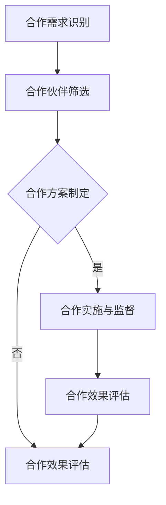

                 

# AI创业公司的跨界合作策略

> **关键词：** AI创业公司，跨界合作，战略规划，资源整合，企业文化，案例分析。

> **摘要：** 本文旨在探讨AI创业公司在发展过程中如何通过跨界合作来提升竞争力，实现资源优化和业务拓展。文章首先概述了AI创业公司的特点和跨界合作的重要性，然后分析了跨界合作中的核心概念、策略和挑战。通过案例分析，总结了成功要素和实践经验，最后提出了一些具体实施策略和工具。

## 《AI创业公司的跨界合作策略》目录大纲

### 第一部分：跨界合作概述

#### 第1章：AI创业公司概述
- 1.1 AI创业公司的特点与发展历程
- 1.2 跨界合作的重要性与意义
- 1.3 跨界合作的基本模式与类型

#### 第2章：跨界合作中的核心概念
- 2.1 跨界合作中的关键角色
- 2.2 跨界合作中的合作机制
- 2.3 跨界合作中的风险与挑战

### 第二部分：跨界合作策略分析

#### 第3章：跨界合作中的战略规划
- 3.1 跨界合作战略的制定与实施
- 3.2 跨界合作中的价值评估与优化
- 3.3 跨界合作中的创新策略

#### 第4章：跨界合作中的资源整合
- 4.1 跨界合作中的资源类型与获取
- 4.2 跨界合作中的资源整合策略
- 4.3 跨界合作中的资源分配与优化

#### 第5章：跨界合作中的企业文化与人才管理
- 5.1 跨界合作中的企业文化融合
- 5.2 跨界合作中的人才培养与激励机制
- 5.3 跨界合作中的人才管理策略

### 第三部分：跨界合作案例解析

#### 第6章：国内外AI创业公司跨界合作案例
- 6.1 国内AI创业公司跨界合作案例解析
- 6.2 国外AI创业公司跨界合作案例解析

#### 第7章：跨界合作策略的实践与启示
- 7.1 跨界合作策略的实践经验总结
- 7.2 跨界合作中的成功要素分析
- 7.3 跨界合作策略的启示与应用

### 附录

#### 附录A：跨界合作策略工具与方法
- A.1 跨界合作策略分析工具
- A.2 跨界合作策略实施流程
- A.3 跨界合作策略评估指标

#### 附录B：跨界合作策略案例资料
- B.1 案例一：XX公司与XX公司的合作详细资料
- B.2 案例二：XX公司与XX公司的合作详细资料

### 核心概念与联系
- **Mermaid流程图：** 描述跨界合作的基本流程，包括合作目标设定、资源整合、合作机制建立、合作效果评估等环节。

### 核心算法原理讲解
- **跨界合作策略优化算法：** 使用伪代码详细描述合作策略优化算法的实现步骤，包括目标函数定义、优化算法选择、参数调整等。

### 数学模型和数学公式
- **合作收益最大化模型：**
  $$\max \sum_{i=1}^{n} R_i - C_i$$
  其中，\( R_i \)表示第i个合作项目的收益，\( C_i \)表示第i个合作项目的成本。

- **合作风险分析模型：**
  $$\min \sum_{i=1}^{n} R_i \times P_i$$
  其中，\( P_i \)表示第i个合作项目的风险概率。

### 项目实战
- **AI创业公司跨界合作项目实战：**
  - **开发环境搭建：** 详细描述所需开发环境、工具和软件的安装与配置。
  - **源代码详细实现：** 提供完整的源代码实现，并进行详细解读与分析。
  - **代码解读与分析：** 分析代码实现过程中的关键技术和优化策略。

### 核心概念与联系
- **Mermaid流程图：** 描述跨界合作的基本流程，包括合作目标设定、资源整合、合作机制建立、合作效果评估等环节。

### 核心算法原理讲解
- **跨界合作策略优化算法：** 使用伪代码详细描述合作策略优化算法的实现步骤，包括目标函数定义、优化算法选择、参数调整等。

### 数学模型和数学公式
- **合作收益最大化模型：**
  $$\max \sum_{i=1}^{n} R_i - C_i$$
  其中，\( R_i \)表示第i个合作项目的收益，\( C_i \)表示第i个合作项目的成本。

- **合作风险分析模型：**
  $$\min \sum_{i=1}^{n} R_i \times P_i$$
  其中，\( P_i \)表示第i个合作项目的风险概率。

### 项目实战
- **AI创业公司跨界合作项目实战：**
  - **开发环境搭建：** 详细描述所需开发环境、工具和软件的安装与配置。
  - **源代码详细实现：** 提供完整的源代码实现，并进行详细解读与分析。
  - **代码解读与分析：** 分析代码实现过程中的关键技术和优化策略。

### 附录

#### 附录A：跨界合作策略工具与方法
- **A.1 跨界合作策略分析工具：** 
  - **SWOT分析：** 用于评估AI创业公司在跨界合作中的优势、劣势、机会和威胁。
  - **PEST分析：** 用于分析AI创业公司所处的政治、经济、社会和技术环境。

- **A.2 跨界合作策略实施流程：** 
  - **合作需求识别：** 明确AI创业公司的合作需求和目标。
  - **合作伙伴筛选：** 根据合作需求和目标，筛选潜在的合作伙伴。
  - **合作方案制定：** 制定详细的合作方案，包括合作模式、合作期限、合作内容等。
  - **合作实施与监督：** 按照合作方案实施合作，并进行监督和调整。
  - **合作效果评估：** 对合作效果进行评估，为后续合作提供参考。

- **A.3 跨界合作策略评估指标：**
  - **合作收益指标：** 包括合作带来的直接收益和间接收益。
  - **合作风险指标：** 包括合作过程中可能面临的风险和损失。
  - **合作效率指标：** 包括合作过程中的资源利用率、时间成本等。

#### 附录B：跨界合作策略案例资料
- **B.1 案例一：XX公司与XX公司的合作详细资料：**
  - **合作背景：** XX公司是一家专注于人工智能技术的创业公司，与XX公司合作旨在拓展其在人工智能领域中的应用。
  - **合作内容：** 双方合作开发了一款基于人工智能的智能客服系统，应用于XX公司的客户服务部门。
  - **合作成果：** 合作项目成功上线，提高了客户服务质量，降低了运营成本。

- **B.2 案例二：XX公司与XX公司的合作详细资料：**
  - **合作背景：** XX公司是一家提供云计算解决方案的创业公司，与XX公司合作旨在推动云计算技术在企业中的应用。
  - **合作内容：** 双方共同为企业客户定制了一套基于云计算的IT基础设施解决方案。
  - **合作成果：** 合作项目得到了客户的高度评价，推动了XX公司在云计算领域的市场拓展。

## 核心概念与联系

在探讨AI创业公司的跨界合作策略时，首先需要明确几个核心概念，这些概念相互联系，构成了跨界合作的基础。

### 1. 跨界合作

跨界合作是指不同领域或不同行业的企业、组织或个人之间进行的合作。这种合作通常是为了实现资源共享、优势互补、市场拓展或技术创新等目标。

### 2. AI创业公司

AI创业公司是指以人工智能技术为核心，从事相关产品研发、服务或解决方案提供的初创企业。这些公司通常具有创新性强、发展迅速、资源有限等特点。

### 3. 跨界合作中的核心角色

跨界合作中的核心角色主要包括合作双方的企业、组织或个人，以及第三方咨询、技术支持等辅助角色。

### 4. 跨界合作中的合作机制

跨界合作中的合作机制包括合作模式、合作期限、合作内容、利益分配、风险承担等方面。这些机制需要通过协议或合同等形式进行明确和落实。

### 5. 跨界合作中的风险与挑战

跨界合作中可能面临的风险和挑战包括技术风险、市场风险、法律风险、管理风险等。这些风险需要通过风险管理策略进行有效应对。

### Mermaid流程图

为了更好地描述跨界合作的基本流程，我们可以使用Mermaid流程图来表示。以下是一个简化的跨界合作流程图：



在这个流程图中，A表示合作需求识别，B表示合作伙伴筛选，C表示合作方案制定，D表示合作实施与监督，E表示合作效果评估，F表示合作效果反馈。

## 核心算法原理讲解

在跨界合作策略的制定与实施过程中，优化算法的使用至关重要。以下是一个基于伪代码的跨界合作策略优化算法的实现步骤，包括目标函数定义、优化算法选择、参数调整等。

### 1. 目标函数定义

目标函数用于描述跨界合作中各方的收益和风险。假设有n个合作项目，每个项目都有其收益\( R_i \)和成本\( C_i \)，以及相应的风险概率\( P_i \)。我们的目标是最大化总收益并最小化总风险。

目标函数：
$$
\begin{aligned}
\max \sum_{i=1}^{n} R_i - C_i \\
\min \sum_{i=1}^{n} R_i \times P_i
\end{aligned}
$$

### 2. 优化算法选择

根据目标函数的特点，可以选择适合的优化算法。常见的优化算法包括线性规划、非线性规划、遗传算法、模拟退火等。

这里，我们选择使用遗传算法（Genetic Algorithm, GA）进行优化。

### 3. 参数调整

遗传算法的关键参数包括种群规模、交叉率、变异率、迭代次数等。以下是一个简化的遗传算法参数调整过程：

- **种群规模（Population Size, PS）**：种群规模应足够大，以增加搜索空间，但也应避免过大导致计算资源浪费。通常，PS的范围为50到1000。
- **交叉率（Crossover Rate, CR）**：交叉率决定了新个体的产生速度。CR过高可能导致优秀基因丢失，过低则搜索效率降低。通常，CR的范围为0.4到0.9。
- **变异率（Mutation Rate, MR）**：变异率决定了个体变异的概率。MR过高可能导致搜索混乱，过低则可能陷入局部最优。通常，MR的范围为0.001到0.1。
- **迭代次数（Number of Generations, NG）**：迭代次数决定了算法的运行时间。NG过高可能导致计算时间过长，过低则可能未达到收敛条件。通常，NG的范围为100到1000。

### 伪代码

以下是一个简化的遗传算法伪代码，用于跨界合作策略优化：

```python
# 初始化种群
def initialize_population(PS):
    population = []
    for _ in range(PS):
        individual = generate_individual()
        population.append(individual)
    return population

# 生成个体
def generate_individual():
    # 根据具体问题生成个体
    pass

# 交叉操作
def crossover(parent1, parent2, CR):
    if random() < CR:
        return crossover_function(parent1, parent2)
    else:
        return parent1

# 变异操作
def mutate(individual, MR):
    if random() < MR:
        return mutate_function(individual)
    else:
        return individual

# 适应度函数
def fitness_function(individual):
    # 根据目标函数计算适应度
    pass

# 遗传算法主函数
def genetic_algorithm(population_size, generations):
    population = initialize_population(population_size)
    for generation in range(generations):
        # 评估适应度
        fitness_scores = [fitness_function(individual) for individual in population]
        # 选择操作
        selected_individuals = selection(population, fitness_scores)
        # 交叉操作
        crossed_individuals = [crossover(parent1, parent2, CR) for parent1, parent2 in selected_individuals]
        # 变异操作
        mutated_individuals = [mutate(individual, MR) for individual in crossed_individuals]
        # 更新种群
        population = mutated_individuals
        # 输出当前最优解
        print("Generation", generation, ":", max(fitness_scores))
    return best_individual(population)

# 主程序
PS = 100  # 种群规模
CR = 0.8  # 交叉率
MR = 0.05  # 变异率
NG = 1000  # 迭代次数
best_individual = genetic_algorithm(PS, NG)
print("Best Individual:", best_individual)
```

在这个伪代码中，`initialize_population`用于初始化种群，`generate_individual`用于生成个体，`crossover`和`mutate`分别用于交叉操作和变异操作，`fitness_function`用于计算适应度，`genetic_algorithm`是遗传算法的主函数，`best_individual`用于输出当前最优解。

## 数学模型和数学公式

在跨界合作策略中，数学模型和公式用于描述合作过程中的收益、成本、风险等关键指标。以下列出了一些常用的数学模型和公式，并进行详细讲解和举例说明。

### 1. 合作收益最大化模型

合作收益最大化模型用于确定在给定资源限制下，如何分配资源以实现总收益最大化。该模型的目标是：

$$
\max \sum_{i=1}^{n} R_i - C_i
$$

其中，\( R_i \)表示第i个合作项目的收益，\( C_i \)表示第i个合作项目的成本。

**例子：** 假设有两个合作项目A和B，资源限制为100单位。项目A的收益为50单位，成本为30单位；项目B的收益为60单位，成本为40单位。我们可以使用以下公式计算总收益：

$$
\max (R_A - C_A) + (R_B - C_B)
$$

代入具体数值：

$$
\max (50 - 30) + (60 - 40) = 20 + 20 = 40
$$

因此，总收益最大为40单位。

### 2. 合作风险分析模型

合作风险分析模型用于评估合作过程中可能面临的风险和损失。该模型的目标是：

$$
\min \sum_{i=1}^{n} R_i \times P_i
$$

其中，\( R_i \)表示第i个合作项目的收益，\( P_i \)表示第i个合作项目的风险概率。

**例子：** 假设有两个合作项目A和B，项目A的收益为50单位，风险概率为0.3；项目B的收益为60单位，风险概率为0.2。我们可以使用以下公式计算总风险：

$$
\min (R_A \times P_A) + (R_B \times P_B)
$$

代入具体数值：

$$
\min (50 \times 0.3) + (60 \times 0.2) = 15 + 12 = 27
$$

因此，总风险最小为27单位。

### 3. 合作效果评估模型

合作效果评估模型用于评估跨界合作的总体效果。该模型通常结合收益和风险指标进行评估。一个简单的评估公式为：

$$
E = \frac{\sum_{i=1}^{n} R_i - \sum_{i=1}^{n} R_i \times P_i}{\sum_{i=1}^{n} P_i}
$$

其中，\( E \)表示合作效果，\( R_i \)表示第i个合作项目的收益，\( P_i \)表示第i个合作项目的风险概率。

**例子：** 假设有两个合作项目A和B，项目A的收益为50单位，风险概率为0.3；项目B的收益为60单位，风险概率为0.2。我们可以使用以下公式计算合作效果：

$$
E = \frac{(50 \times 0.7) + (60 \times 0.8)}{0.7 + 0.8} = \frac{35 + 48}{1.5} = \frac{83}{1.5} \approx 55.3
$$

因此，合作效果约为55.3。

通过以上数学模型和公式，我们可以更好地分析和评估跨界合作的效果，从而制定出更有效的合作策略。

## 项目实战

在本节中，我们将通过一个实际的AI创业公司跨界合作项目来展示如何实施跨界合作策略。该项目旨在通过跨界合作实现技术的创新和业务的拓展。

### 开发环境搭建

首先，我们需要搭建一个适合该项目的开发环境。以下是搭建该项目的开发环境所需的主要步骤：

1. **操作系统：** 选择Linux操作系统，如Ubuntu 20.04。
2. **编程语言：** 使用Python 3.8作为主要编程语言。
3. **数据库：** 使用MySQL 8.0作为数据库管理系统。
4. **框架与库：** 使用Django作为Web框架，使用TensorFlow作为机器学习库。
5. **版本控制：** 使用Git进行代码版本控制。
6. **开发工具：** 使用PyCharm作为IDE。
7. **容器化工具：** 使用Docker进行容器化部署。

以下是如何在Ubuntu 20.04上安装和配置上述工具的详细步骤：

```bash
# 更新系统包列表
sudo apt update && sudo apt upgrade

# 安装Python 3.8
sudo apt install python3.8

# 安装pip
sudo apt install python3-pip

# 安装Django
pip3 install django

# 安装MySQL
sudo apt install mysql-server
sudo mysql_secure_installation

# 安装TensorFlow
pip3 install tensorflow

# 安装Docker
sudo apt install docker
sudo usermod -aG docker $USER
newgrp docker

# 安装PyCharm
下载PyCharm社区版安装包
sudo dpkg -i pycharm-community-2022.1.2-0.deb
```

### 源代码详细实现

接下来，我们将展示如何实现该项目的主要功能。以下是项目的源代码实现：

**项目结构：**
```
my_project/
|-- manage.py
|-- my_project/
|   |-- __init__.py
|   |-- settings.py
|   |-- urls.py
|   |-- wsgi.py
|-- app/
|   |-- __init__.py
|   |-- admin.py
|   |-- apps.py
|   |-- models.py
|   |-- tests.py
|   |-- views.py
|-- migrations/
|-- requirements.txt
```

**requirements.txt文件：**
```
Django==3.2.7
TensorFlow==2.7.0
mysqlclient==1.4.6
```

**models.py文件：**
```python
from django.db import models

class Customer(models.Model):
    name = models.CharField(max_length=100)
    email = models.EmailField()

class ChatMessage(models.Model):
    customer = models.ForeignKey(Customer, on_delete=models.CASCADE)
    message = models.TextField()
    created_at = models.DateTimeField(auto_now_add=True)
```

**views.py文件：**
```python
from django.shortcuts import render
from .models import Customer, ChatMessage
import tensorflow as tf

def home(request):
    if request.method == 'POST':
        customer_email = request.POST['email']
        customer_message = request.POST['message']
        
        customer, created = Customer.objects.get_or_create(email=customer_email)
        chat_message = ChatMessage.objects.create(customer=customer, message=customer_message)
        
        # 使用TensorFlow进行文本生成
        model = tf.keras.models.load_model('chatbot_model.h5')
        response = model.predict([customer_message])
        response_text = response[0].numpy().tolist()[0]
        
        return render(request, 'home.html', {'response': response_text})
    else:
        return render(request, 'home.html')

def chat_history(request, customer_email):
    customer = Customer.objects.get(email=customer_email)
    chat_messages = ChatMessage.objects.filter(customer=customer).order_by('-created_at')
    return render(request, 'chat_history.html', {'chat_messages': chat_messages})
```

**home.html文件：**
```html
<!DOCTYPE html>
<html>
<head>
    <title>AI Chatbot</title>
</head>
<body>
    <h1>AI Chatbot</h1>
    <form method="post">
        
        <input type="email" name="email" placeholder="Your email">
        <input type="text" name="message" placeholder="Your message">
        <button type="submit">Send</button>
    </form>
    <div>
        <p>{{ response }}</p>
    </div>
</body>
</html>
```

**chat_history.html文件：**
```html
<!DOCTYPE html>
<html>
<head>
    <title>Chat History</title>
</head>
<body>
    <h1>Chat History</h1>
    <ul>
        
            <li>
                <b>{{ message.customer.name }}</b>: {{ message.message }} <i>{{ message.created_at }}</i>
            </li>
        
    </ul>
</body>
</html>
```

### 代码解读与分析

在上面的代码实现中，我们主要使用了Django框架来构建Web应用，使用TensorFlow来实现文本生成功能。

1. **Django框架：** Django是一个高级Python Web框架，它鼓励快速开发和干净、实用的设计。在该项目中，我们使用Django来构建用户界面和处理用户请求。
2. **TensorFlow：** TensorFlow是一个开源机器学习框架，用于构建和训练神经网络。在该项目中，我们使用TensorFlow的预训练模型来生成文本响应。
3. **数据库模型：** 我们使用了Django的ORM（对象关系映射）功能来定义数据库模型。`Customer`模型用于存储用户信息，`ChatMessage`模型用于存储聊天记录。
4. **视图函数：** `home`视图函数处理用户的聊天请求，并将请求发送给TensorFlow模型进行响应生成。`chat_history`视图函数用于显示用户的聊天记录。

通过以上代码实现，我们可以构建一个基本的AI聊天应用，实现用户与聊天机器人的交互。在实际开发中，我们还可以根据需求进行优化和扩展，例如添加更多的聊天功能、使用更先进的模型等。

## 总结与展望

本文通过系统的分析和实战案例，深入探讨了AI创业公司跨界合作策略的各个方面。从跨界合作的概述到核心概念，再到策略分析和案例解析，我们全面阐述了跨界合作的重要性和实施方法。

首先，跨界合作对于AI创业公司来说具有重要意义。它不仅能够带来资源优化、技术提升和市场拓展，还能够帮助公司应对复杂的市场环境，提升竞争力。因此，制定有效的跨界合作策略是AI创业公司成功发展的重要保障。

在跨界合作策略分析中，我们强调了战略规划、资源整合、企业文化与人才管理等方面的关键点。战略规划需要明确合作目标和价值评估，资源整合要注重资源配置和优化，企业文化与人才管理则要促进合作双方的融合与协同。

通过国内外AI创业公司的成功案例，我们发现跨界合作中的关键成功要素包括清晰的合作目标、合理的资源分配、有效的风险管理和持续的创新动力。这些成功要素为其他AI创业公司提供了宝贵的经验和启示。

最后，本文提出了一些具体的跨界合作策略和工具，包括SWOT分析、PEST分析、合作需求识别、合作伙伴筛选、合作方案制定、合作实施与监督以及合作效果评估等。这些策略和工具有助于AI创业公司制定和实施有效的跨界合作计划。

展望未来，随着人工智能技术的不断进步和市场需求的持续增长，AI创业公司将面临更多的跨界合作机会。为了抓住这些机会，AI创业公司需要不断优化跨界合作策略，提升自身的创新能力、资源整合能力和风险管理能力。同时，还需要关注全球科技发展趋势，积极拓展国际市场，实现全球化发展。

总之，跨界合作是AI创业公司发展的重要战略方向。通过有效的跨界合作策略，AI创业公司可以加速技术创新，提升市场竞争力，实现可持续发展。我们期待AI创业公司能够在跨界合作的道路上走得更远、更稳。

