                 

# 《AI创业竞争加剧，差异化发展成制胜法宝》

> 关键词：AI创业、竞争加剧、差异化发展、技术创新、商业模式创新、营销与品牌建设

> 摘要：随着人工智能技术的迅猛发展，AI创业领域竞争日益激烈。如何在众多竞争对手中脱颖而出，差异化发展成为关键。本文将详细分析AI创业的现状与挑战，探讨差异化发展的策略，并通过实战案例提供成功与失败的启示，为AI创业者提供宝贵的经验和方向。

## 目录大纲

### 第一部分：AI创业环境分析

#### 第1章：AI创业现状与挑战
- 1.1 AI创业的兴起与现状
- 1.2 AI创业面临的主要挑战
- 1.3 竞争加剧下的差异化发展

#### 第2章：AI核心技术基础
- 2.1 AI核心概念与架构
- 2.2 主要AI算法原理
- 2.3 AI技术应用场景

### 第二部分：差异化发展策略

#### 第3章：市场需求分析
- 3.1 市场需求变化趋势
- 3.2 创业公司如何找到市场需求
- 3.3 市场细分策略

#### 第4章：产品差异化策略
- 4.1 产品定位与目标用户
- 4.2 产品差异化优势
- 4.3 产品差异化案例解析

#### 第5章：技术创新与研发
- 5.1 创新技术的重要性
- 5.2 技术研发流程与策略
- 5.3 技术创新案例解析

#### 第6章：商业模式创新
- 6.1 商业模式创新的重要性
- 6.2 常见的商业模式创新方法
- 6.3 商业模式创新案例解析

#### 第7章：营销与品牌建设
- 7.1 创业公司营销策略
- 7.2 品牌建设与品牌传播
- 7.3 营销与品牌建设案例解析

### 第三部分：实战案例分析

#### 第8章：成功AI创业案例分析
- 8.1 案例背景与简介
- 8.2 创业公司的发展历程
- 8.3 成功经验与启示

#### 第9章：失败AI创业案例分析
- 9.1 案例背景与简介
- 9.2 失败原因分析
- 9.3 失败教训与启示

### 第四部分：未来发展展望

#### 第10章：AI创业未来发展趋势
- 10.1 AI技术的发展趋势
- 10.2 创业环境的变化
- 10.3 AI创业的机遇与挑战

### 附录

#### 附录A：AI创业资源与工具汇总
- A.1 开发工具与框架
- A.2 数据集与开源代码
- A.3 行业报告与政策动态

#### 附录B：AI创业核心概念与联系
- B.1 AI核心概念Mermaid流程图

#### 附录C：AI核心算法原理讲解
- C.1 伪代码详细阐述

#### 附录D：数学模型与公式详细讲解
- D.1 LaTeX数学公式与举例

---

本文将带领读者逐步深入探讨AI创业领域，通过分析现状与挑战、提出差异化发展策略、分享成功与失败的实战案例，以及展望未来发展趋势，帮助AI创业者抓住机遇，在激烈的竞争中找到制胜之路。

## 第一部分：AI创业环境分析

### 第1章：AI创业现状与挑战

#### 1.1 AI创业的兴起与现状

人工智能（AI）作为当前科技领域的热门方向，吸引了大量创业者的关注和投入。近年来，AI技术的不断突破和应用领域的扩展，使得AI创业成为了一个充满机会的领域。根据统计数据显示，全球AI创业公司数量在过去五年内呈现爆发式增长，投资总额也达到了前所未有的高度。

AI创业的兴起不仅体现在数量上的增长，更表现在应用场景的广泛覆盖。从智能助手、自动驾驶、智能家居到医疗健康、金融科技、工业自动化等领域，AI技术的应用正在不断改变我们的生活和工作方式。许多创业者看到了这一趋势，纷纷投身于AI创业的大潮中，希望通过创新的技术和解决方案抓住市场机遇。

#### 1.2 AI创业面临的主要挑战

尽管AI创业领域充满了机遇，但同时也面临着诸多挑战。以下是AI创业过程中常见的一些挑战：

**技术门槛高**：AI技术涉及到深度学习、神经网络、自然语言处理等多个领域，技术门槛较高。创业者不仅需要具备扎实的技术基础，还需要不断跟进最新的研究进展和技术动态。

**数据需求大**：AI技术的发展离不开大量高质量的数据。数据的获取、处理、清洗等工作都是创业过程中需要克服的难题。尤其是在某些垂直领域，数据获取的难度更大，创业者需要寻找合适的数据来源或构建自己的数据集。

**市场竞争激烈**：随着AI创业的兴起，市场上的竞争也日益激烈。许多创业公司面临着来自巨头公司的竞争压力，如何在市场中脱颖而出成为了一个重要课题。

**资金和资源限制**：AI创业通常需要大量的资金投入来支持技术研发和市场推广。对于初创公司来说，资金和资源的限制常常成为发展的瓶颈。如何有效地利用有限的资源，实现快速发展，是创业者需要考虑的问题。

**人才短缺**：AI领域的快速发展导致了对专业人才的巨大需求。然而，优秀的人才相对稀缺，创业者需要投入更多的时间和精力来吸引和留住人才。

#### 1.3 竞争加剧下的差异化发展

在AI创业竞争日益加剧的背景下，如何实现差异化发展成为创业者需要重点思考的问题。差异化发展不仅可以帮助创业公司在激烈的市场竞争中脱颖而出，还可以为公司的长期发展提供保障。

**技术创新**：技术创新是差异化发展的重要手段。通过在技术上的不断创新和突破，创业公司可以提供更具竞争力的产品和服务，赢得用户的认可和市场的青睐。例如，在自动驾驶领域，一些创业公司通过研发新型传感器和算法，实现了更高的自动驾驶精度和安全性。

**市场需求定位**：准确的市场需求定位可以帮助创业公司找到自己的独特价值点。通过深入分析市场需求，创业者可以发现尚未被满足的用户需求，从而提供定制化的解决方案。例如，在医疗健康领域，一些创业公司针对特定病种或患者群体，开发出了专业的诊断和治疗工具。

**商业模式创新**：商业模式的创新可以为创业公司带来新的增长点和盈利模式。通过重新定义产品、服务或市场，创业公司可以创造出独特的商业价值。例如，在金融科技领域，一些创业公司通过搭建智能投顾平台，为用户提供个性化的投资建议和风险管理服务。

**品牌建设**：品牌建设是差异化发展的重要组成部分。通过有效的品牌传播和营销策略，创业公司可以树立品牌形象，增强用户信任和忠诚度。例如，在智能家居领域，一些创业公司通过打造高品质、高性能的智能设备，赢得了用户的口碑和市场份额。

总之，在AI创业竞争加剧的背景下，差异化发展成为创业公司制胜的关键。通过技术创新、市场需求定位、商业模式创新和品牌建设等多方面的努力，创业公司可以在激烈的市场竞争中找到自己的独特优势，实现可持续发展。

### 第2章：AI核心技术基础

#### 2.1 AI核心概念与架构

人工智能（AI）是计算机科学的一个分支，旨在使计算机系统具有智能行为，能够模拟、延伸和扩展人类智能。AI系统通常由以下几个核心概念组成：

**算法**：算法是AI系统的核心，用于指导计算机执行特定的任务。常见的AI算法包括监督学习、无监督学习、强化学习等。监督学习依赖于已知标记的数据集，通过学习输入和输出之间的映射关系进行预测；无监督学习不依赖于标记数据，旨在发现数据中的模式和结构；强化学习通过不断试错和奖励机制来优化决策过程。

**神经网络**：神经网络是模拟人脑神经元连接结构的计算模型，具有处理复杂数据的能力。深度神经网络（DNN）是神经网络的一种扩展，能够处理大量数据并提取深层次的特性。卷积神经网络（CNN）和循环神经网络（RNN）是DNN的变体，分别用于处理图像和序列数据。

**自然语言处理（NLP）**：NLP是AI领域的一个子领域，旨在使计算机理解和处理人类语言。NLP技术包括词向量表示、句法分析、语义理解、机器翻译等。词向量表示方法，如Word2Vec和BERT，可以将单词映射为高维向量，以实现语义理解。

**计算机视觉**：计算机视觉是AI系统通过摄像头或其他传感器获取图像和视频，并进行分析和理解的能力。图像识别、目标检测和图像分割是计算机视觉的主要任务。卷积神经网络（CNN）是计算机视觉领域的重要工具。

**机器学习平台**：机器学习平台是用于构建、训练和部署AI模型的环境。常见的机器学习平台包括TensorFlow、PyTorch、Keras等，它们提供了丰富的工具和库，简化了模型开发和部署的过程。

#### 2.2 主要AI算法原理

以下是几个主要的AI算法及其原理：

**监督学习（Supervised Learning）**：
监督学习是AI中最基本的一种学习方式，它依赖于已知标记的数据集。监督学习的目标是构建一个模型，使其能够对新的输入数据进行预测。

1. **线性回归（Linear Regression）**：线性回归是一种简单的监督学习算法，用于预测连续值输出。其原理是通过最小化输入和输出之间的误差平方和，找到一个线性函数来表示输入和输出之间的关系。

   $$y = w_0 + w_1 \cdot x$$
   
   其中，$y$ 是输出，$x$ 是输入，$w_0$ 和 $w_1$ 是模型的权重。

2. **逻辑回归（Logistic Regression）**：逻辑回归是一种用于分类问题的监督学习算法。它通过求解逻辑函数来预测概率，从而判断输入数据属于哪个类别。

   $$P(y=1) = \frac{1}{1 + e^{-z}}$$
   
   其中，$z = w_0 + w_1 \cdot x$ 是输入数据的线性组合，$e$ 是自然对数的底。

**无监督学习（Unsupervised Learning）**：
无监督学习不依赖于标记数据，旨在发现数据中的模式和结构。

1. **K-均值聚类（K-Means Clustering）**：K-均值聚类是一种基于距离的聚类算法。它将数据分为K个簇，每个簇由其质心代表。算法的目标是最小化簇内数据点之间的距离。

   $$\text{Objective Function} = \sum_{i=1}^K \sum_{x \in S_i} ||x - \mu_i||^2$$
   
   其中，$S_i$ 是第$i$个簇，$\mu_i$ 是簇的质心。

2. **主成分分析（Principal Component Analysis, PCA）**：PCA是一种降维技术，通过将数据投影到新的正交坐标系中，提取主要的特征分量，从而降低数据维度。

   $$X' = PC$$
   
   其中，$X$ 是原始数据，$P$ 是特征向量矩阵，$C$ 是特征值矩阵。

**强化学习（Reinforcement Learning）**：
强化学习是通过与环境互动，逐步学习最优策略的算法。它的核心是奖励机制，通过奖励和惩罚来指导决策过程。

1. **Q-学习（Q-Learning）**：Q-学习是一种基于值函数的强化学习算法。它通过更新Q值来指导决策，Q值表示在当前状态下采取某一动作的预期收益。

   $$Q(s, a) \leftarrow Q(s, a) + \alpha [r + \gamma \max_{a'} Q(s', a') - Q(s, a)]$$
   
   其中，$s$ 是状态，$a$ 是动作，$r$ 是即时奖励，$\gamma$ 是折扣因子。

2. **深度强化学习（Deep Reinforcement Learning）**：深度强化学习结合了深度神经网络和强化学习的优势，用于解决复杂环境中的决策问题。

   $$Q(s, a) \leftarrow Q(s, a) + \alpha [r + \gamma \max_{a'} \hat{Q}(s', a')] - Q(s, a)$$
   
   其中，$\hat{Q}$ 是神经网络预测的Q值。

通过了解这些主要AI算法的原理，创业者可以更好地选择合适的技术方案，实现AI创业目标。

#### 2.3 AI技术应用场景

AI技术的广泛应用使得它几乎渗透到了各行各业，以下是一些典型的AI技术应用场景：

**医疗健康**：
- **疾病诊断**：利用深度学习算法分析医学影像，如X光、CT和MRI，以辅助医生进行疾病诊断。
- **药物研发**：通过AI技术加速药物筛选和设计，提高新药研发的效率和成功率。

**金融科技**：
- **风险控制**：利用机器学习算法进行信贷风险评估，降低金融机构的风险。
- **智能投顾**：通过AI技术为用户提供个性化的投资建议，提高投资回报率。

**工业自动化**：
- **生产优化**：利用计算机视觉和机器学习技术实现生产过程的自动化和智能化。
- **设备维护**：通过预测性维护，减少设备故障率和停机时间，提高生产效率。

**智能交通**：
- **自动驾驶**：利用深度学习和传感器技术实现车辆的自动驾驶，提高交通安全和效率。
- **智能交通管理**：通过AI技术优化交通信号控制和路线规划，减少交通拥堵。

**智能家居**：
- **智能设备控制**：通过语音识别和自然语言处理技术实现家居设备的智能控制。
- **能源管理**：利用机器学习算法优化家居能源使用，降低能源消耗。

通过了解AI技术在各个领域的应用场景，创业者可以更好地把握市场需求，实现AI技术的商业化应用。

### 第二部分：差异化发展策略

#### 第3章：市场需求分析

市场需求分析是AI创业公司成功的关键之一。在竞争激烈的AI创业环境中，准确的市场需求分析可以帮助公司找到独特的价值点，从而在市场中脱颖而出。以下将详细讨论市场需求分析的关键要素和方法。

#### 3.1 市场需求变化趋势

随着科技的不断进步和社会的快速发展，市场需求也在不断变化。以下是几个值得关注的市场需求变化趋势：

**数字化转型加速**：在全球范围内，企业正在加速数字化转型，以提升运营效率、降低成本和改善客户体验。这为AI技术在企业应用提供了广阔的市场空间。例如，在制造业中，智能工厂和工业4.0概念的兴起，推动了生产自动化和智能化的需求。

**个性化服务需求增加**：消费者对于个性化服务的需求日益增长，他们期望能够获得定制化的产品和服务。AI技术在个性化推荐、智能客服和智能营销等方面的应用，可以满足这一需求，从而提高客户满意度和忠诚度。

**数据安全和隐私保护**：随着数据泄露事件频发，消费者和企业对于数据安全和隐私保护的重视程度不断提高。AI技术在数据安全监测、隐私保护算法和加密技术等方面的应用，可以为企业提供解决方案，满足市场需求。

**可持续发展和社会责任**：可持续发展和社会责任成为企业战略的重要组成部分。AI技术在节能减排、资源优化和环境监测等方面的应用，可以帮助企业实现可持续发展目标，满足市场需求。

**新兴行业崛起**：一些新兴行业，如物联网、区块链和元宇宙等，正在迅速崛起，为AI技术提供了新的应用场景和市场需求。创业公司可以关注这些新兴行业，寻找新的商业机会。

#### 3.2 创业公司如何找到市场需求

为了找到市场需求，创业公司可以采取以下几种方法：

**市场调研**：通过市场调研，了解目标市场的现状、需求和趋势。市场调研可以采用定量和定性两种方法，例如问卷调查、深度访谈和焦点小组讨论等。

**用户访谈**：直接与潜在用户进行访谈，了解他们的需求和痛点。用户访谈可以帮助公司发现市场机会，制定针对性的产品和服务策略。

**竞争对手分析**：分析竞争对手的产品和服务，了解他们的优势、劣势和市场策略。通过对比分析，可以发现市场需求中的空白点，从而找到差异化发展的机会。

**技术创新趋势**：关注AI技术的最新研究进展和趋势，了解哪些技术可能在未来成为市场需求的热点。例如，深度学习、强化学习和计算机视觉等技术在各个领域的应用前景广阔。

**行业报告**：阅读和分析行业报告，了解行业的发展动态和市场趋势。行业报告通常由专业的市场研究机构发布，具有很高的可信度和参考价值。

#### 3.3 市场细分策略

在找到市场需求后，创业公司需要进一步进行市场细分，以便更好地满足不同用户群体的需求。以下是一些市场细分策略：

**地理位置细分**：根据用户的地理位置，将市场分为不同的区域，例如城市、农村或特定地区。这种细分策略可以帮助公司针对不同地区制定差异化的营销策略。

**人口统计细分**：根据用户的人口统计特征，如年龄、性别、收入和教育程度等，将市场划分为不同的群体。这种细分策略可以帮助公司更好地了解目标用户的需求和偏好，提供更个性化的产品和服务。

**行为细分**：根据用户的行为特征，如购买习惯、使用场景和忠诚度等，将市场划分为不同的群体。这种细分策略可以帮助公司发现潜在客户，并制定针对性的营销策略。

**需求细分**：根据用户的需求类型，如基本需求、特定需求和高端需求等，将市场划分为不同的群体。这种细分策略可以帮助公司提供多样化的产品和服务，满足不同用户的需求。

**利益细分**：根据用户追求的利益点，如性价比、品牌价值或技术优势等，将市场划分为不同的群体。这种细分策略可以帮助公司打造独特的价值主张，吸引特定用户群体。

通过市场需求分析、用户访谈和竞争对手分析，创业公司可以找到市场需求，并通过市场细分策略更好地满足不同用户群体的需求。这种差异化发展的策略将有助于创业公司在激烈的市场竞争中脱颖而出，实现可持续发展。

#### 第4章：产品差异化策略

在竞争激烈的AI创业环境中，产品差异化策略是创业公司成功的关键之一。通过提供独特的价值主张，创业公司可以吸引目标用户，建立品牌忠诚度，从而在市场中脱颖而出。以下是几个关键要素和方法，帮助创业公司制定有效的产品差异化策略。

#### 4.1 产品定位与目标用户

**产品定位**：产品定位是差异化策略的基础，它决定了创业公司如何在市场中定位自己的产品。产品定位需要明确以下几个方面：

- **目标市场**：确定目标市场是创业公司首先要解决的问题。目标市场可以是一个特定的行业、地区或用户群体。通过聚焦于特定市场，创业公司可以更精准地满足用户需求，提高市场竞争力。
- **用户需求**：深入了解目标用户的需求，是产品定位的关键。创业公司需要通过市场调研、用户访谈和数据分析等方式，了解用户的具体需求、痛点和使用场景。只有准确把握用户需求，才能提供真正有价值的产品。
- **竞争优势**：分析竞争对手的产品和服务，了解他们的优势和劣势。创业公司可以通过提供独特的功能、更好的用户体验或更低的成本等，打造自己的竞争优势。

**目标用户**：明确目标用户是产品差异化策略的核心。创业公司需要确定目标用户群体的特征，包括年龄、性别、职业、收入水平、使用习惯等。了解目标用户的需求和偏好，可以帮助创业公司提供更符合用户期望的产品和服务。

#### 4.2 产品差异化优势

产品差异化优势是指创业公司通过提供独特的价值主张，使产品在市场上具有明显的竞争力。以下是几种常见的差异化优势：

**技术创新**：技术创新是产品差异化的重要手段。通过在技术上的不断突破，创业公司可以提供具有独特功能或更高性能的产品。例如，在自动驾驶领域，一些创业公司通过研发新型传感器和算法，实现了更高的自动驾驶精度和安全性。

**用户体验**：用户体验是用户选择产品的重要因素。创业公司可以通过优化产品设计、提升界面友好性和提供个性化的服务，提升用户体验。例如，在智能家居领域，一些创业公司通过提供简洁美观的智能设备界面和智能语音助手，赢得了用户的喜爱。

**定制化服务**：定制化服务可以满足用户个性化的需求，提高用户满意度。创业公司可以通过提供灵活的定制选项、个性化的推荐和专属的客服服务，满足不同用户的需求。例如，在金融科技领域，一些创业公司通过为用户提供个性化的投资建议和风险管理服务，赢得了客户的信任。

**品牌价值**：品牌价值是产品差异化的重要组成部分。通过建立强大的品牌形象和品牌信誉，创业公司可以提升产品的市场竞争力。创业公司可以通过有效的品牌传播、优质的客户服务和持续的创新，建立品牌忠诚度。例如，在医疗健康领域，一些创业公司通过提供高品质、高性能的医疗设备和专业的服务，树立了良好的品牌形象。

**成本优势**：在某些情况下，成本优势也是产品差异化的重要策略。通过优化供应链、降低生产成本或提供更实惠的价格，创业公司可以吸引价格敏感的用户。例如，在消费电子领域，一些创业公司通过采用低成本的材料和简化产品设计，提供了具有竞争力的价格。

#### 4.3 产品差异化案例解析

**案例1：特斯拉（Tesla）**  
特斯拉作为电动汽车和能源存储技术领域的领先者，通过技术创新和用户体验差异化了其产品。特斯拉在电动汽车技术上的不断突破，如自主研发的电池技术和自动驾驶系统，使产品在性能和安全性上具有明显的优势。同时，特斯拉的智能充电网络和个性化驾驶体验，提升了用户体验。特斯拉的品牌价值也通过其环保理念和高品质的产品形象得以强化。

**案例2：Airbnb**  
Airbnb通过提供个性化的住宿体验差异化了其产品。Airbnb允许用户通过平台预订全球各地的独特住宿，满足了用户对于个性化、独特住宿体验的需求。此外，Airbnb通过智能推荐和用户评价系统，提升了用户体验。Airbnb的品牌价值也通过其社区文化、用户友好性和优质的客户服务得以提升。

**案例3：滴滴出行（Didi Chuxing）**  
滴滴出行通过用户体验和定制化服务差异化了其产品。滴滴出行通过提供实时路线规划、智能匹配司机、安全支付和便捷的客服服务，提升了用户体验。滴滴出行还通过推出不同的出行服务，如快车、专车、豪华车和出租车，满足不同用户的需求。滴滴出行的品牌价值也通过其技术优势、规模效应和优质的客户服务得以强化。

通过以上案例，我们可以看到，产品差异化策略对于创业公司的成功至关重要。创业公司需要通过技术创新、用户体验、定制化服务和品牌价值等多方面的努力，打造独特的价值主张，从而在激烈的市场竞争中脱颖而出。

#### 第5章：技术创新与研发

技术创新是AI创业公司实现差异化发展的核心驱动力。在竞争激烈的AI创业环境中，只有通过持续的技术创新，创业公司才能保持竞争优势，赢得市场和用户的认可。以下将探讨技术创新的重要性、技术研发流程与策略，并结合实际案例进行详细解析。

#### 5.1 创新技术的重要性

**提高产品竞争力**：技术创新可以使创业公司的产品在功能、性能和用户体验上具有明显优势，从而提高产品的市场竞争力。例如，在自动驾驶领域，一些创业公司通过自主研发的新型传感器和算法，实现了更高的自动驾驶精度和安全性，使其产品在市场上脱颖而出。

**拓展市场空间**：技术创新可以拓展AI技术的应用场景，开辟新的市场空间。例如，在医疗健康领域，AI技术在疾病诊断、药物研发和个性化治疗等方面的应用，为医疗行业带来了全新的解决方案，开辟了广阔的市场空间。

**建立品牌影响力**：技术创新可以提升创业公司的品牌影响力，增强市场竞争力。通过持续的技术创新，创业公司可以树立技术创新者的形象，赢得用户的信任和认可，从而建立强大的品牌影响力。

**保持竞争优势**：在快速发展的AI领域，技术创新是创业公司保持竞争优势的关键。只有通过不断的技术创新，创业公司才能跟上技术发展趋势，适应市场需求的变化，保持竞争优势。

#### 5.2 技术研发流程与策略

**需求分析**：技术研发的第一步是需求分析。创业公司需要深入了解用户需求和市场趋势，明确技术方向和目标。通过需求分析，创业公司可以确定需要解决的核心问题和关键技术，为技术研发提供明确的指导。

**技术创新方案设计**：在明确需求后，创业公司需要设计技术创新方案。这包括确定技术路线、技术架构和技术实现方法。技术创新方案的设计需要综合考虑技术可行性、成本效益和市场前景等因素。

**技术研发与实验**：在技术创新方案确定后，创业公司开始进行技术研发与实验。这一阶段包括算法开发、系统设计、代码实现和实验验证等。技术研发与实验需要团队合作，不断迭代和优化，以确保技术创新的实现和效果。

**测试与验证**：技术研发完成后，创业公司需要对技术进行测试与验证。测试与验证包括功能测试、性能测试和安全性测试等。通过测试与验证，创业公司可以确保技术的稳定性和可靠性，为产品的上市做好准备。

**产品化与商业化**：在测试与验证通过后，创业公司可以将技术创新应用到产品中，实现产品化与商业化。这一阶段包括产品设计、制造、测试和销售等。产品化与商业化的成功是技术创新的最终目标，也是创业公司实现盈利和市场扩张的重要手段。

#### 5.3 技术创新案例解析

**案例1：谷歌（Google）**  
谷歌作为全球领先的科技公司，其成功很大程度上归功于持续的技术创新。谷歌在搜索引擎、云计算、人工智能和自动驾驶等领域都取得了重大突破。以下是几个具体的创新案例：

- **搜索引擎**：谷歌通过自主研发的PageRank算法，实现了更准确的网页排名和搜索结果，为用户提供了更好的搜索体验。
- **自动驾驶**：谷歌的Waymo项目通过研发先进的自动驾驶技术，实现了高精度、高安全性的自动驾驶车辆，引领了全球自动驾驶技术的发展。
- **人工智能**：谷歌的TensorFlow开源框架，为全球开发者提供了强大的AI工具和平台，推动了AI技术的广泛应用和发展。

**案例2：特斯拉（Tesla）**  
特斯拉在电动汽车和能源存储技术领域的成功，离不开其持续的技术创新。以下是几个具体的创新案例：

- **电池技术**：特斯拉自主研发的电池技术和能源管理系统，使其电动汽车在续航里程和充电效率上具有明显优势。
- **自动驾驶**：特斯拉的Autopilot自动驾驶系统，通过自主研发的传感器、算法和计算机视觉技术，实现了自动驾驶功能，提高了驾驶安全性和舒适性。
- **能源存储**：特斯拉的Powerwall储能系统，为家庭和商业用户提供了高效、环保的能源存储解决方案。

**案例3：阿里巴巴（Alibaba）**  
阿里巴巴在电子商务、云计算和人工智能等领域取得了显著成就，其技术创新是关键驱动力。以下是几个具体的创新案例：

- **电子商务**：阿里巴巴通过自主研发的电子商务平台，如淘宝和天猫，实现了在线购物、支付和物流的全面集成，改变了人们的购物习惯。
- **云计算**：阿里巴巴的阿里云，通过自主研发的云计算技术，为全球企业提供强大的计算和存储能力，推动了云计算技术的发展和应用。
- **人工智能**：阿里巴巴通过自主研发的AI算法和平台，如阿里云ET和淘宝推荐系统，实现了智能客服、智能推荐和智能风控等功能，提高了用户体验和业务效率。

通过以上案例，我们可以看到，技术创新对于AI创业公司的重要性。创业公司需要通过持续的技术创新，不断提高产品的竞争力，拓展市场空间，建立品牌影响力，保持竞争优势。在技术研发过程中，创业公司需要明确需求、设计创新方案、进行技术研发与实验、测试与验证，最终实现产品化与商业化。通过技术创新，创业公司可以在激烈的市场竞争中脱颖而出，实现可持续发展。

#### 第6章：商业模式创新

在竞争激烈的AI创业环境中，商业模式创新是创业公司实现差异化发展和可持续增长的关键策略之一。通过重新定义产品、服务或市场，创业公司可以创造出独特的商业价值，从而在市场中脱颖而出。以下将详细探讨商业模式创新的重要性、常见方法及其应用。

#### 6.1 商业模式创新的重要性

**提高竞争力**：商业模式创新可以帮助创业公司提高竞争力，通过优化资源配置、降低成本、提高效率等方式，实现盈利能力和市场占有率的提升。

**创造新市场**：商业模式创新可以创造新的市场机会，开拓未被满足的用户需求，从而开辟新的市场空间。

**增强用户黏性**：创新的商业模式可以提供更优质的产品和服务，提升用户体验和用户满意度，从而增强用户黏性，提高客户忠诚度。

**提升品牌价值**：通过创新的商业模式，创业公司可以树立独特的品牌形象，提升品牌价值和市场影响力。

**适应市场变化**：商业模式创新可以帮助创业公司快速适应市场变化，抓住新的商业机会，避免市场饱和和竞争压力。

#### 6.2 常见的商业模式创新方法

**平台化模式**：平台化模式通过搭建开放的平台，连接供需双方，实现资源的高效配置和共享。例如，阿里巴巴的淘宝和天猫平台，通过连接消费者和商家，实现了电子商务的繁荣。

**订阅制模式**：订阅制模式通过提供持续的订阅服务，实现收入的稳定增长。例如，Netflix的订阅视频服务，通过订阅制模式吸引了大量用户，实现了持续盈利。

**共享经济模式**：共享经济模式通过共享闲置资源，实现资源的高效利用和成本降低。例如，Airbnb和Uber的共享住宿和共享出行服务，通过共享经济模式改变了人们的消费方式。

**社区化模式**：社区化模式通过建立社区，增强用户互动和黏性。例如，小米的米粉社区，通过社区化模式增强了用户对品牌的忠诚度。

**循环经济模式**：循环经济模式通过资源的回收再利用，实现可持续发展。例如，戴尔的回收计划，通过循环经济模式实现了资源的可持续利用。

**开放创新模式**：开放创新模式通过开放合作，引入外部创新资源，推动技术创新和业务增长。例如，谷歌的安卓操作系统，通过开放创新模式，吸引了全球开发者的参与，实现了快速发展和市场扩展。

#### 6.3 商业模式创新案例解析

**案例1：亚马逊（Amazon）**  
亚马逊作为全球领先的电子商务公司，其商业模式创新是公司成功的关键之一。以下是几个具体的创新案例：

- **亚马逊Prime**：亚马逊通过推出订阅服务Prime，为用户提供免费的两天配送和音乐、视频等增值服务。Prime会员制的推出，不仅提高了用户的消费频率和满意度，还实现了收入的稳定增长。
- **亚马逊AWS**：亚马逊的云计算服务AWS，通过平台化模式，为全球企业提供强大的计算和存储能力。AWS的成功，为亚马逊开辟了新的市场空间，实现了业务多元化和盈利能力的提升。
- **亚马逊Kindle**：亚马逊通过推出电子书阅读器Kindle，改变了人们的阅读习惯，为用户提供了便捷的电子书阅读体验。Kindle的成功，为亚马逊在数字阅读市场建立了强大的品牌影响力。

**案例2：特斯拉（Tesla）**  
特斯拉在电动汽车和能源存储技术领域的商业模式创新，是其成功的重要驱动力。以下是几个具体的创新案例：

- **特斯拉充电网络**：特斯拉通过构建全球充电网络，为用户提供便捷的充电服务，解决了电动汽车的续航焦虑。特斯拉充电网络的推出，不仅提升了用户体验，还推动了电动汽车市场的快速发展。
- **特斯拉能源存储产品**：特斯拉的Powerwall和Powerpack等能源存储产品，通过共享经济模式，为家庭和商业用户提供了高效的能源存储解决方案。特斯拉能源存储产品的推出，不仅实现了可持续发展，还为公司开辟了新的盈利渠道。
- **特斯拉订阅服务**：特斯拉通过推出订阅服务，为用户提供车辆的灵活租赁和升级服务。特斯拉订阅服务的推出，不仅提高了用户的消费体验，还增强了用户对品牌的黏性。

**案例3：Airbnb**  
Airbnb作为全球领先的共享住宿平台，其商业模式创新是其成功的重要保障。以下是几个具体的创新案例：

- **Airbnb Plus**：Airbnb通过推出Airbnb Plus服务，为用户提供高品质的住宿体验。Airbnb Plus服务的推出，不仅提升了用户体验，还提高了平台的整体品牌价值。
- **Airbnb Experience**：Airbnb通过推出Airbnb Experience服务，为用户提供本地化的活动体验。Airbnb Experience服务的推出，不仅丰富了平台的内容，还为用户提供了更多元化的旅行体验。
- **Airbnb Host**：Airbnb通过推出Airbnb Host培训计划，为房东提供专业化的培训和支持，提升住宿质量。Airbnb Host培训计划的推出，不仅提高了平台的整体服务质量，还增强了房东对平台的黏性。

通过以上案例，我们可以看到，商业模式创新对于AI创业公司的成功至关重要。创业公司需要通过不断探索和创新，找到适合自己的商业模式，从而在激烈的市场竞争中脱颖而出。无论是平台化模式、订阅制模式、共享经济模式，还是社区化模式、循环经济模式、开放创新模式，创业公司都可以通过创新的商业模式，实现差异化发展，创造独特的商业价值。

#### 第7章：营销与品牌建设

在竞争激烈的AI创业环境中，有效的营销策略和品牌建设是创业公司成功的关键因素。通过精准的营销策略和有力的品牌传播，创业公司可以吸引潜在用户，提高市场认知度，从而在激烈的市场竞争中脱颖而出。以下将探讨创业公司营销策略、品牌建设与品牌传播，并结合实际案例进行详细解析。

#### 7.1 创业公司营销策略

**内容营销**：内容营销是通过创造和分享有价值的内容，吸引潜在用户，建立品牌信任和忠诚度。创业公司可以通过撰写技术博客、发布行业报告、制作视频教程等方式，提供有价值的信息，吸引目标用户。例如，谷歌通过发布技术博客和公开课，吸引了大量开发者和企业客户，提升了品牌影响力。

**社交媒体营销**：社交媒体营销是通过社交媒体平台，如微博、微信、Twitter等，与用户进行互动和传播。创业公司可以利用社交媒体平台的广泛覆盖和互动性，提高品牌知名度，吸引潜在用户。例如，小米通过微博和微信等社交媒体平台，与用户进行互动，发布新品信息，提升了品牌形象和用户黏性。

**广告营销**：广告营销是通过在线广告、电视广告、户外广告等渠道，进行品牌推广和产品宣传。创业公司可以利用精准的广告投放，针对目标用户进行广告投放，提高广告效果。例如，Facebook通过在线广告，吸引了大量用户和广告主，实现了盈利能力的提升。

**公关营销**：公关营销是通过媒体曝光、行业活动、公关事件等，提高品牌知名度和美誉度。创业公司可以通过发布新闻稿、参加行业会议、举办发布会等方式，提高品牌曝光度和影响力。例如，特斯拉通过媒体曝光和行业活动，提升了品牌知名度和美誉度。

**口碑营销**：口碑营销是通过用户口碑和推荐，提高品牌信任度和忠诚度。创业公司可以通过提供优质的产品和服务，赢得用户的满意和信任，从而通过用户推荐吸引更多新用户。例如，苹果通过用户口碑和推荐，建立了强大的品牌忠诚度，保持了较高的市场份额。

#### 7.2 品牌建设与品牌传播

**品牌定位**：品牌定位是品牌建设的基础，它决定了创业公司在市场中的形象和地位。创业公司需要明确品牌的核心价值、目标用户和独特卖点，从而在市场中树立独特的品牌形象。例如，特斯拉通过强调环保、科技和性能，建立了高端品牌的形象。

**品牌视觉设计**：品牌视觉设计是品牌建设的重要组成部分，它包括品牌标志、色彩搭配、字体设计等。创业公司需要设计独特、美观、易于识别的视觉元素，提高品牌识别度。例如，苹果的品牌标志简洁大方，色彩搭配和谐，使得品牌形象深入人心。

**品牌故事**：品牌故事是品牌传播的重要手段，它通过讲述品牌的历史、使命和价值观，增强用户对品牌的认同感。创业公司可以通过故事化传播，讲述品牌的成长历程和成功经验，提高品牌的感染力和影响力。例如，微软通过讲述其技术创新和使命，建立了强大的品牌故事，吸引了大量用户和合作伙伴。

**品牌活动**：品牌活动是品牌传播的重要途径，它包括发布会、行业会议、线下活动等。创业公司可以通过举办各类品牌活动，与用户进行互动和沟通，提高品牌知名度和美誉度。例如，特斯拉通过举办全球发布会和线下活动，提升了品牌知名度和用户参与度。

**合作伙伴关系**：合作伙伴关系是品牌传播的重要手段，通过与其他品牌和机构合作，创业公司可以扩大品牌影响力。创业公司可以与行业领导者、知名企业、大学和研究机构等建立合作关系，共同推动行业发展，提高品牌形象。例如，谷歌通过与全球顶级大学和研究机构合作，推动了人工智能技术的发展，提升了品牌影响力。

#### 7.3 营销与品牌建设案例解析

**案例1：谷歌（Google）**  
谷歌作为全球领先的科技公司，其成功的营销与品牌建设策略是其核心竞争力之一。以下是几个具体的营销与品牌建设案例：

- **谷歌搜索**：谷歌通过提供强大的搜索引擎功能，吸引了大量用户，建立了强大的品牌影响力。谷歌通过不断优化搜索算法，提高搜索结果的准确性和相关性，赢得了用户的信任和认可。
- **谷歌广告**：谷歌通过推出广告服务，为广告主提供了精准的广告投放渠道，实现了盈利能力的提升。谷歌广告的成功，为谷歌带来了可观的收入，巩固了其在全球广告市场的领导地位。
- **谷歌品牌传播**：谷歌通过举办各类品牌活动和公关事件，提高了品牌知名度和美誉度。例如，谷歌举办的全球开发者大会（Google I/O），吸引了全球开发者和媒体的关注，提升了品牌影响力。

**案例2：特斯拉（Tesla）**  
特斯拉作为电动汽车和能源存储技术的领导者，其成功的营销与品牌建设策略是其成功的关键之一。以下是几个具体的营销与品牌建设案例：

- **特斯拉品牌形象**：特斯拉通过强调环保、科技和性能，建立了高端品牌的形象。特斯拉的车型设计简洁大气，色彩搭配和谐，品牌视觉设计独特，吸引了大量高端用户。
- **特斯拉品牌传播**：特斯拉通过社交媒体、媒体曝光和品牌活动等手段，提高了品牌知名度和美誉度。特斯拉在全球范围内举办的发布会和线下活动，吸引了大量媒体和用户关注，提升了品牌影响力。
- **特斯拉用户口碑**：特斯拉通过提供优质的产品和服务，赢得了用户的满意和信任。特斯拉的用户口碑和推荐，为品牌传播和销售提供了有力支持。

**案例3：小米（Xiaomi）**  
小米作为全球领先的科技公司，其成功的营销与品牌建设策略为其快速发展奠定了基础。以下是几个具体的营销与品牌建设案例：

- **小米品牌定位**：小米通过强调性价比、创新和用户参与，建立了年轻、时尚、高性价比的品牌形象。小米的品牌定位吸引了大量年轻用户和性价比追求者，提升了品牌市场份额。
- **小米内容营销**：小米通过撰写技术博客、发布行业报告和制作视频教程，提供了有价值的内容，吸引了大量用户。小米的内容营销策略提高了品牌知名度和用户黏性。
- **小米社交媒体营销**：小米通过微博、微信、抖音等社交媒体平台，与用户进行互动和传播。小米的社交媒体营销策略提高了品牌知名度和用户参与度。

通过以上案例，我们可以看到，营销与品牌建设在AI创业公司成功中的重要作用。创业公司需要通过内容营销、社交媒体营销、广告营销、公关营销和口碑营销等多方面的努力，提高品牌知名度和美誉度。同时，创业公司还需要通过品牌定位、品牌视觉设计、品牌故事和品牌活动等手段，树立独特的品牌形象，赢得用户的信任和认可。通过有效的营销与品牌建设策略，创业公司可以在激烈的市场竞争中脱颖而出，实现可持续发展。

#### 第8章：成功AI创业案例分析

在AI创业领域，有许多公司通过独特的创新和卓越的商业策略取得了显著的成功。以下我们将分析几个成功AI创业公司的案例，探讨其发展历程、核心策略和成功经验，为其他创业者提供宝贵的启示。

#### 8.1 案例背景与简介

**案例1：谷歌（Google）**  
谷歌成立于1998年，是一家全球领先的科技公司，以搜索引擎和广告业务起家，逐渐扩展到云计算、人工智能、自动驾驶等多个领域。谷歌的成功离不开其持续的技术创新和卓越的商业策略。

**案例2：特斯拉（Tesla）**  
特斯拉成立于2003年，是一家专注于电动汽车和能源存储技术的公司。特斯拉通过其独特的品牌形象、创新的产品和卓越的技术，成为了电动汽车领域的领导者。

**案例3：Airbnb**  
Airbnb成立于2008年，是一家共享住宿平台，通过连接房东和租客，为用户提供多样化的住宿选择。Airbnb的成功在于其创新的商业模式和强大的社区建设。

#### 8.2 创业公司的发展历程

**谷歌（Google）**  
- **1998年**：谷歌由拉里·佩奇和谢尔盖·布林共同创立，最初是一个基于PageRank算法的搜索引擎。
- **2001年**：谷歌推出了广告系统AdWords，实现了盈利，奠定了公司发展的基础。
- **2004年**：谷歌上市，股票代码为GOOGL，成为全球最具有价值的科技公司之一。
- **2006年**：谷歌收购了YouTube，进入了视频分享领域。
- **2009年**：谷歌推出了云计算平台Google Cloud，开始在云计算市场占据重要地位。
- **2015年**：谷歌完成了对人工智能公司DeepMind的收购，标志着谷歌在人工智能领域的战略布局。
- **2020年**：谷歌发布了自动驾驶汽车项目Waymo，标志着其在自动驾驶技术上的重大进展。

**特斯拉（Tesla）**  
- **2008年**：特斯拉推出第一款电动汽车Roadster，开启了电动汽车市场。
- **2010年**：特斯拉在纳斯达克上市，股票代码为TSLA。
- **2012年**：特斯拉推出Model S，成为电动汽车市场的标杆。
- **2016年**：特斯拉推出了无人驾驶全自动驾驶系统Autopilot，引领了自动驾驶技术的发展。
- **2019年**：特斯拉完成了对太阳能公司SolarCity的收购，扩展了其能源存储业务。
- **2020年**：特斯拉推出了Model Y，进一步扩大了电动汽车的市场份额。

**Airbnb**  
- **2008年**：Airbnb由布莱恩·切斯基、乔·杰比亚和内森·布莱卡查克共同创立。
- **2010年**：Airbnb完成了首次融资，开始了快速扩张。
- **2011年**：Airbnb推出了“Airbnb Plus”服务，提升了住宿质量，增强了用户信任。
- **2012年**：Airbnb推出了“Experience”服务，为用户提供本地化的活动体验。
- **2018年**：Airbnb在纳斯达克上市，股票代码为ABNB。
- **2020年**：Airbnb推出了“Host”培训计划，为房东提供专业化的培训和支持。

#### 8.3 成功经验与启示

**技术创新**：谷歌、特斯拉和Airbnb的成功离不开其持续的技术创新。谷歌通过在搜索引擎、云计算、人工智能等领域的持续突破，保持了技术领先地位。特斯拉通过研发高性能电动汽车和自动驾驶技术，引领了电动汽车市场的发展。Airbnb通过创新的共享住宿模式和本地化活动体验，提升了用户满意度。

**商业模式创新**：谷歌通过广告业务实现了盈利模式的创新，为后续发展奠定了基础。特斯拉通过直销模式，提高了销售效率和用户体验。Airbnb通过平台化模式，连接房东和租客，实现了资源的最大化利用。

**品牌建设**：谷歌通过强大的品牌影响力和用户信任，建立了强大的品牌形象。特斯拉通过环保、科技和性能的品牌定位，吸引了大量高端用户。Airbnb通过社区建设，提升了用户参与度和忠诚度。

**用户导向**：谷歌、特斯拉和Airbnb都非常注重用户需求，通过提供优质的产品和服务，赢得了用户的信任和忠诚。

**团队协作**：谷歌、特斯拉和Airbnb的成功离不开其强大的团队协作能力。公司内部的跨部门合作和外部合作伙伴的协同创新，为公司的快速发展提供了强大支持。

通过以上成功经验，其他AI创业公司可以借鉴以下启示：

- **坚持技术创新**：持续的技术创新是保持竞争优势的关键。
- **找准市场需求**：准确的市场需求定位是成功的基础。
- **创新商业模式**：创新的商业模式可以为公司带来新的增长点和盈利模式。
- **品牌建设**：强大的品牌形象和用户信任是成功的重要因素。
- **用户导向**：以用户需求为中心，提供优质的产品和服务。
- **团队协作**：强大的团队协作能力是公司发展的保障。

通过借鉴这些成功经验，其他AI创业公司可以在激烈的竞争中找到自己的独特优势，实现可持续发展。

### 第9章：失败AI创业案例分析

在AI创业领域，尽管有许多公司取得了辉煌的成就，但也不乏失败案例。这些失败案例为我们提供了宝贵的教训，有助于其他创业者避免走弯路。以下我们将分析几个典型的AI创业失败案例，探讨其失败原因，并提出相应的教训与启示。

#### 9.1 案例背景与简介

**案例1：MindMeld（被收购后解散）**  
MindMeld是一家专注于自然语言处理和智能客服技术的公司。公司在2012年成立，曾获得多家风险投资机构的支持，但最终在2016年被收购后解散。

**案例2：Nervana（被英特尔收购后停止运营）**  
Nervana成立于2014年，专注于深度学习和人工智能硬件的研发。公司在2016年被英特尔收购，但在随后几年因战略调整和市场变化，最终停止了运营。

**案例3：DeepStack（资金短缺）**  
DeepStack是一家专注于游戏和决策智能的公司，开发了具有自主学习和决策能力的AI系统。尽管公司在技术研发上取得了一些突破，但最终因资金短缺而关闭。

**案例4：London已久的Self-Driving Car Company（运营困难）**  
这家公司成立于2014年，旨在开发自动驾驶技术。尽管获得了巨额投资，但由于技术难题、运营困难和管理问题，最终在2020年解散。

#### 9.2 失败原因分析

**技术创新不足**：许多AI创业公司因技术创新不足而失败。例如，MindMeld和Nervana在技术研发上未能持续突破，导致产品竞争力不足，最终被竞争对手超越。

**市场定位不准确**：部分公司由于市场定位不准确，未能准确把握市场需求，导致产品无法满足用户需求。例如，DeepStack虽然技术研发上有一定突破，但市场接受度较低，未能找到合适的应用场景。

**资金管理不当**：资金管理不当是导致AI创业公司失败的重要原因之一。例如，Nervana在收购后因资金短缺而停止运营，DeepStack因资金不足而关闭。

**战略调整不及时**：一些公司因战略调整不及时，未能应对市场变化和技术发展。例如，伦敦的Self-Driving Car Company因技术难题和运营困难，未能及时调整战略，最终解散。

**团队协作问题**：团队协作问题也是导致创业失败的原因之一。部分公司在团队管理、沟通和协作方面存在不足，导致项目进展缓慢，影响公司发展。

#### 9.3 失败教训与启示

**持续技术创新**：创业公司应重视技术创新，持续投入研发，保持技术竞争力。通过技术创新，提高产品性能和用户体验，赢得市场和用户认可。

**准确市场定位**：创业公司需要准确把握市场需求，找准应用场景，提供满足用户需求的产品和服务。通过市场调研和用户反馈，及时调整产品方向，确保产品与市场的匹配。

**合理资金管理**：创业公司应制定合理的资金使用计划，避免资金浪费和过度依赖融资。通过有效的资金管理，确保公司的可持续发展。

**及时战略调整**：创业公司应密切关注市场变化和技术发展，及时调整战略。在面临挑战和问题时，要敢于做出调整，确保公司能够适应市场变化。

**强化团队协作**：创业公司应注重团队建设和协作，提高团队沟通和协作效率。通过有效的团队管理，确保项目顺利推进，提高公司整体竞争力。

**充分市场准备**：在进入市场前，创业公司应充分准备，包括产品测试、市场推广和品牌建设等。通过充分准备，降低市场风险，提高市场竞争力。

通过分析AI创业领域的失败案例，我们可以得出以下教训和启示：持续技术创新、准确市场定位、合理资金管理、及时战略调整和强化团队协作，这些是AI创业公司成功的关键因素。创业者应从中汲取经验，避免走弯路，提高创业成功率。

### 第四部分：未来发展展望

#### 第10章：AI创业未来发展趋势

随着人工智能技术的不断突破和应用场景的扩展，AI创业领域正迎来前所未有的发展机遇。以下将从AI技术的发展趋势、创业环境的变化以及AI创业的机遇与挑战三个方面，探讨AI创业的未来发展趋势。

#### 10.1 AI技术的发展趋势

**深度学习与神经网络**：深度学习作为AI的核心技术之一，将继续引领AI技术的发展。随着神经网络结构的不断优化和计算能力的提升，深度学习算法在图像识别、自然语言处理和计算机视觉等领域的应用将更加广泛和深入。

**强化学习与自主决策**：强化学习在游戏、机器人控制、自动驾驶等领域的应用逐渐成熟，未来将进一步提升AI系统的自主决策能力。通过不断试错和优化，强化学习算法可以帮助AI系统在复杂环境中实现更加智能的决策。

**生成对抗网络（GAN）**：生成对抗网络在图像生成、数据增强和虚拟现实等领域展现出巨大潜力。未来，GAN将进一步优化，提升生成质量和效率，为AI创业提供更多创新机会。

**多模态人工智能**：多模态人工智能结合了语音、图像、文本等多种数据源，可以实现更全面、更精准的智能感知和决策。随着多模态数据处理技术的进步，未来多模态人工智能将在智能家居、医疗健康、工业自动化等领域得到广泛应用。

**边缘计算与云计算**：边缘计算和云计算的融合发展，将推动AI计算资源的优化配置和效率提升。边缘计算可以将计算任务分散到网络边缘，降低延迟、减少带宽占用，提高AI系统的实时性和可靠性。

**量子计算与AI融合**：量子计算作为下一代计算技术，具有巨大的计算潜力。未来，量子计算与AI的融合将推动AI系统在处理复杂问题和大数据分析方面实现突破性进展。

#### 10.2 创业环境的变化

**政策支持与监管**：各国政府纷纷出台政策，支持人工智能研究和产业发展。同时，随着AI技术的应用日益广泛，相关监管政策也在逐步完善，以保障数据安全、隐私保护和公平竞争。

**资本市场的变化**：随着AI技术的成熟和市场的扩大，资本市场对AI创业公司的关注度不断提升。然而，投资风险也在增加，创业公司需要具备更强的技术实力和市场洞察力，才能获得资本市场的青睐。

**市场竞争加剧**：AI创业领域的竞争日益激烈，创业公司需要在技术创新、产品差异化和商业模式创新等方面具备明显优势，才能在激烈的市场竞争中脱颖而出。

**人才争夺**：AI技术的高门槛和快速迭代，使得人才成为创业公司的核心资源。未来，创业公司需要在人才培养、引进和留住人才方面下更大功夫，以保持技术领先地位。

#### 10.3 AI创业的机遇与挑战

**机遇**：
- **技术创新空间巨大**：随着AI技术的不断发展，创业公司可以在多个领域进行技术创新，实现突破性进展。
- **市场需求持续增长**：AI技术在医疗健康、金融科技、智能制造、智能交通等领域的应用前景广阔，市场需求持续增长，为创业公司提供了广阔的市场空间。
- **资本支持**：资本市场对AI创业公司的支持力度不断加大，为创业公司提供了充足的资金支持，有助于快速成长。
- **政策红利**：各国政府纷纷出台支持AI产业发展的政策，为创业公司提供了良好的发展环境。

**挑战**：
- **技术门槛高**：AI技术涉及多个学科，技术门槛较高，创业公司需要具备强大的技术实力和研发能力。
- **市场竞争激烈**：AI创业领域竞争激烈，创业公司需要在技术创新、产品差异化和商业模式创新等方面具备明显优势。
- **数据隐私与安全**：AI技术的发展带来了数据隐私和安全问题，创业公司需要确保数据安全和用户隐私。
- **人才短缺**：AI领域的快速发展导致了对专业人才的巨大需求，创业公司需要投入更多时间和精力来吸引和留住人才。

总之，AI创业领域在未来将继续保持高速发展，同时面临诸多机遇与挑战。创业公司需要紧跟技术发展趋势，抓住市场机遇，同时应对各种挑战，才能在激烈的市场竞争中脱颖而出。

### 附录A：AI创业资源与工具汇总

#### A.1 开发工具与框架

**TensorFlow**  
TensorFlow是由谷歌开发的开源机器学习框架，支持多种编程语言，适用于构建和训练各种深度学习模型。官网：[TensorFlow官网](https://www.tensorflow.org/)

**PyTorch**  
PyTorch是由Facebook AI研究院开发的开源深度学习框架，以灵活性和易用性著称。官网：[PyTorch官网](https://pytorch.org/)

**Keras**  
Keras是一个高层次的神经网络API，能够在TensorFlow和Theano上运行，简化了深度学习模型的构建过程。官网：[Keras官网](https://keras.io/)

**Scikit-learn**  
Scikit-learn是一个开源的机器学习库，提供了各种常用的机器学习算法和工具，适用于数据分析和预测任务。官网：[Scikit-learn官网](https://scikit-learn.org/)

#### A.2 数据集与开源代码

**ImageNet**  
ImageNet是一个大规模的视觉识别数据库，包含超过1400万个标注图像，广泛用于图像识别和分类研究。官网：[ImageNet官网](http://www.image-net.org/)

**COCO数据集**  
COCO数据集（Common Objects in Context）是一个用于目标检测和分割的基准数据集，包含大量标注数据，适用于计算机视觉研究。官网：[COCO数据集官网](http://cocodataset.org/)

**OpenImages**  
OpenImages是一个大规模的图像标注数据集，涵盖多种视觉任务，适用于图像识别、目标检测、实例分割等研究。官网：[OpenImages官网](https://openimages.github.io/)

**GitHub**  
GitHub是全球最大的代码托管平台，提供了丰富的开源代码和项目，创业者可以在GitHub上找到各种机器学习和人工智能相关的代码和项目。官网：[GitHub官网](https://github.com/)

#### A.3 行业报告与政策动态

**麦肯锡全球研究所**  
麦肯锡全球研究所发布了多份关于人工智能的报告，分析了AI对全球经济发展的影响以及企业在AI应用中的实践。官网：[麦肯锡全球研究所官网](https://www.mckinsey.com/featured-insights/artificial-intelligence)

**国际数据公司（IDC）**  
国际数据公司发布了全球人工智能市场报告，分析了人工智能技术的市场趋势、投资规模和应用场景。官网：[国际数据公司（IDC）官网](https://www.idc.com/)

**中国人工智能发展报告**  
中国人工智能发展报告由清华大学中国人工智能研究院发布，分析了我国人工智能技术发展现状、应用场景和产业政策。官网：[中国人工智能发展报告官网](https://ai.tsinghua.edu.cn/)

**欧盟人工智能联盟**  
欧盟人工智能联盟发布了多份关于人工智能的政策文件，提出了欧盟在人工智能领域的战略目标和政策框架。官网：[欧盟人工智能联盟官网](https://www.ai-alliance.eu/)

通过以上资源与工具的汇总，创业者可以更好地了解AI领域的最新动态和趋势，获取相关的数据集和开源代码，为创业项目提供技术支持和参考。

### 附录B：AI创业核心概念与联系

为了帮助读者更好地理解AI创业的核心概念及其联系，我们使用Mermaid流程图来展示AI创业的主要组成部分及其相互关系。以下是一个简化的Mermaid流程图：

```mermaid
graph TD
    A[AI技术] --> B[市场需求]
    A --> C[技术创新]
    A --> D[商业模式]
    A --> E[营销与品牌建设]
    B --> F[用户需求分析]
    B --> G[市场趋势分析]
    C --> H[算法研究]
    C --> I[技术研发]
    C --> J[技术验证]
    D --> K[产品定位]
    D --> L[盈利模式]
    D --> M[市场策略]
    E --> N[内容营销]
    E --> O[社交媒体营销]
    E --> P[品牌传播]
    F --> Q[用户访谈]
    F --> R[数据分析]
    G --> S[行业报告]
    G --> T[竞争对手分析]
    H --> U[深度学习]
    H --> V[自然语言处理]
    H --> W[计算机视觉]
    I --> X[开发环境搭建]
    I --> Y[代码实现]
    I --> Z[测试与优化]
    J --> AA[功能测试]
    J --> BB[性能测试]
    J --> CC[安全测试]
    K --> DD[目标用户分析]
    K --> EE[竞争分析]
    L --> FF[成本效益分析]
    L --> GG[风险管理]
    M --> HH[渠道策略]
    M --> II[定价策略]
    N --> JJ[博客内容]
    N --> KK[视频教程]
    O --> LL[社交媒体互动]
    O --> MM[广告投放]
    P --> QQ[公关活动]
    P --> RR[品牌故事]
    U --> SS[神经网络架构]
    U --> TT[训练算法]
    V --> UU[词向量表示]
    V --> WW[语法分析]
    V --> XX[语义理解]
    W --> YY[图像识别]
    W --> ZZ[目标检测]
    W --> AAA[图像分割]
    X --> BBB[开发框架]
    X --> CCC[开发工具]
    X --> DDD[代码管理工具]
    Y --> EEE[编程语言]
    Y --> FFF[编程规范]
    Y --> GGG[代码注释]
    Z --> HHH[单元测试]
    Z --> III[集成测试]
    Z --> JJJ[系统测试]
    AA --> KKK[功能覆盖率]
    BB --> LLL[性能指标]
    CC --> MMM[安全漏洞]
    DD --> NNN[用户满意度]
    EE --> OOO[竞争压力]
    FF --> PPP[成本效益比]
    GG --> QQ[风险概率]
    HH --> RRR[市场反馈]
    II --> SSS[客户需求]
    JJ --> TTT[内容质量]
    KK --> UUU[社交媒体互动效果]
    LL --> VVV[广告效果]
    MM --> WWW[广告投放成本]
    NN --> XXX[公关效果]
    NN --> YYY[媒体曝光]
    NN --> ZZZ[用户参与度]
    RR --> AAAA[品牌形象]
    RR --> BBBB[用户信任]
    RR --> CCC[口碑传播]
    SS --> DDDD[神经网络架构设计]
    SS --> EEEE[神经网络训练]
    TT --> FFF[损失函数]
    TT --> GGG[优化算法]
    UU --> HHH[词嵌入技术]
    UU --> IIII[语义关系]
    UU --> JJJJ[词向量表示方法]
    VV --> KKKK[句法解析]
    VV --> LLLL[语义分析]
    VV --> MMMM[文本分类]
    WW --> NNNN[文本生成]
    WW --> OOOO[情感分析]
    WW --> PPPP[实体识别]
    YY --> QQQQ[图像分类]
    YY --> RRRR[目标定位]
    YY --> SSSS[图像分割]
    ZZ --> TTTT[边缘检测]
    ZZ --> UUUU[图像修复]
    AAA --> VVVV[测试覆盖率]
    BBB --> WWWW[性能基准]
    CCC --> XXXX[安全漏洞修复]
    DDD --> YYYY[代码质量]
    EEE --> ZZZZ[编程效率]
    FFF --> AAAA[代码可读性]
    GGG --> BBBB[代码维护性]
    HHH --> CCC[测试结果]
    III --> DDD[集成度]
    JJJ --> EEE[系统稳定性]
    KKK --> FFF[功能完备性]
    LLL --> GGG[性能优化]
    MMM --> HHH[风险控制]
    NNN --> IIII[用户反馈]
    OOO --> JJJJ[市场反馈]
    PPP --> KKKK[竞争分析]
    PPP --> LLLL[合作伙伴关系]
    PPP --> MMMM[政策支持]
    PPP --> NNNN[行业趋势]
    PPP --> OOOO[技术发展方向]
    PPP --> PPPP[风险投资]
    QQQ --> RRRR[品牌价值]
    QQQ --> SSSS[品牌认知度]
    QQQ --> TTTT[市场份额]
    RRR --> UUUU[品牌忠诚度]
    RRR --> VVVV[用户满意度]
    RRR --> WWWW[品牌美誉度]
    RRR --> XXXX[用户口碑]
    RRR --> YYYY[品牌传播效果]
    SSS --> ZZZZ[市场需求匹配]
    SSS --> AAAA[商业目标实现]
    TTT --> BBBB[营销效果]
    UUU --> CCC[技术突破]
    VVV --> DDD[技术应用场景]
    WWW --> EEE[市场机会]
    XXX --> FFF[用户需求满足度]
    XXX --> GGG[用户体验]
    XXX --> HHH[产品满意度]
    XXX --> IIII[用户留存率]
    XXX --> JJJJ[用户转化率]
    XXX --> KKKK[用户活跃度]
    XXX --> LLLL[用户流失率]
```



通过上述Mermaid流程图，我们可以清晰地看到AI创业的核心概念及其相互关系。从市场需求分析到技术创新、商业模式创新和营销与品牌建设，各个环节紧密相连，共同支撑着创业公司的成功。这个流程图不仅为创业者提供了清晰的指导，也为团队协作和项目规划提供了有力支持。

### 附录C：AI核心算法原理讲解

为了更好地理解AI的核心算法，我们将使用伪代码来详细阐述几个关键算法的原理。以下是常见算法的伪代码示例。

#### 线性回归（Linear Regression）

线性回归是一种简单的监督学习算法，用于预测连续值输出。

```python
# 线性回归伪代码
def linear_regression(X, y):
    # X: 输入特征矩阵，y: 输出向量
    # 计算X的转置
    X_transpose = transpose(X)
    # 计算X的转置乘以X
    XTX = matrix_multiply(X_transpose, X)
    # 计算X的转置乘以y
    Xty = matrix_multiply(X_transpose, y)
    # 求解最小二乘法，计算模型参数
    theta = matrix_multiply(inverse(XTX), Xty)
    # 预测输出
    predictions = matrix_multiply(X, theta)
    return predictions
```

#### 逻辑回归（Logistic Regression）

逻辑回归是一种用于分类问题的监督学习算法。

```python
# 逻辑回归伪代码
def logistic_regression(X, y):
    # X: 输入特征矩阵，y: 输出向量（0或1）
    # 定义学习率、迭代次数和阈值
    learning_rate = 0.01
    num_iterations = 1000
    threshold = 0.5
    # 初始化参数
    theta = initialize_theta(X.shape[1])
    # 迭代优化参数
    for i in range(num_iterations):
        hypothesis = logistic_hypothesis(X, theta)
        gradients = compute_gradients(X, y, hypothesis)
        theta = theta - learning_rate * gradients
    # 预测输出
    predictions = predict(hypothesis, threshold)
    return predictions
```

#### K-均值聚类（K-Means Clustering）

K-均值聚类是一种无监督学习算法，用于将数据点划分为K个簇。

```python
# K-均值聚类伪代码
def k_means(X, K):
    # X: 数据集，K: 簇的数量
    # 随机初始化K个簇的中心点
    centroids = initialize_centroids(X, K)
    while not converged:
        # 计算每个数据点到簇中心的距离，分配数据点
        assignments = assign_points_to_clusters(X, centroids)
        # 更新簇中心
        new_centroids = update_centroids(X, assignments, K)
        # 检查收敛条件
        if check_convergence(centroids, new_centroids):
            break
        centroids = new_centroids
    return assignments, centroids
```

#### 主成分分析（PCA）

主成分分析是一种降维技术，通过提取主要特征分量来简化数据。

```python
# PCA伪代码
def pca(X, num_components):
    # X: 数据集，num_components: 降维后的维度
    # 计算协方差矩阵
    covariance_matrix = compute_covariance_matrix(X)
    # 计算协方差矩阵的特征值和特征向量
    eigenvalues, eigenvectors = eig(covariance_matrix)
    # 对特征向量进行降序排序
    sorted_eigenvectors = sort_eigenvectors_by_eigenvalues(eigenvalues, eigenvectors)
    # 选择前num_components个特征向量
    principal_components = sorted_eigenvectors[:num_components]
    # 将数据投影到新的特征空间
    projected_data = project_data(X, principal_components)
    return projected_data
```

通过以上伪代码，我们可以清晰地理解这些算法的基本原理和实现步骤。这些算法是AI领域的基础工具，掌握它们对于AI创业者和开发者来说至关重要。

### 附录D：数学模型与公式详细讲解

在人工智能领域，数学模型和公式是理解和实现算法的关键。以下将详细介绍几个核心数学模型和公式，并使用LaTeX格式进行展示。

#### 线性回归模型

线性回归是一种常见的预测模型，用于建立输入和输出之间的线性关系。其数学模型如下：

\[ y = \theta_0 + \theta_1 \cdot x \]

其中，\( y \) 是输出变量，\( x \) 是输入变量，\( \theta_0 \) 和 \( \theta_1 \) 是模型参数。

#### 逻辑回归模型

逻辑回归是一种用于二分类问题的模型，其输出是一个概率值。逻辑回归的数学模型如下：

\[ P(y=1) = \frac{1}{1 + e^{-z}} \]

其中，\( z = \theta_0 + \theta_1 \cdot x \) 是输入数据的线性组合，\( e \) 是自然对数的底，\( \theta_0 \) 和 \( \theta_1 \) 是模型参数。

#### 神经网络激活函数

神经网络中的激活函数用于引入非线性特性。常见的激活函数包括：

1. **Sigmoid函数**：

\[ f(x) = \frac{1}{1 + e^{-x}} \]

2. **ReLU函数**：

\[ f(x) = \max(0, x) \]

3. **Tanh函数**：

\[ f(x) = \frac{e^x - e^{-x}}{e^x + e^{-x}} \]

#### 主成分分析（PCA）

主成分分析是一种降维技术，通过提取主要特征分量来简化数据。其数学模型如下：

\[ X' = PC \]

其中，\( X \) 是原始数据矩阵，\( P \) 是特征向量矩阵，\( C \) 是特征值矩阵。

#### 卷积神经网络（CNN）

卷积神经网络是用于图像识别和处理的常见神经网络架构。其核心操作包括卷积、池化和反向传播。以下是一个卷积操作的数学模型：

\[ (f \circ g)(x) = f(g(x)) \]

其中，\( f \) 是卷积核，\( g(x) \) 是输入数据。

#### 贝叶斯优化

贝叶斯优化是一种用于超参数调优的数学模型。其核心思想是基于历史数据，通过贝叶斯推理来选择下一步的优化方向。以下是一个简单的贝叶斯优化模型：

\[ p(\theta | D) = \frac{p(D | \theta) \cdot p(\theta)}{p(D)} \]

其中，\( \theta \) 是超参数，\( D \) 是历史数据，\( p(\theta | D) \) 是后验概率，\( p(D | \theta) \) 是似然函数，\( p(\theta) \) 是先验概率。

通过以上数学模型和公式的详细讲解，我们可以更好地理解人工智能算法的基本原理和实现步骤。掌握这些数学工具对于AI创业者和开发者来说至关重要。

### 作者信息

**作者：AI天才研究院/AI Genius Institute & 禅与计算机程序设计艺术 /Zen And The Art of Computer Programming**

