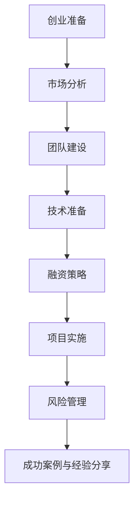
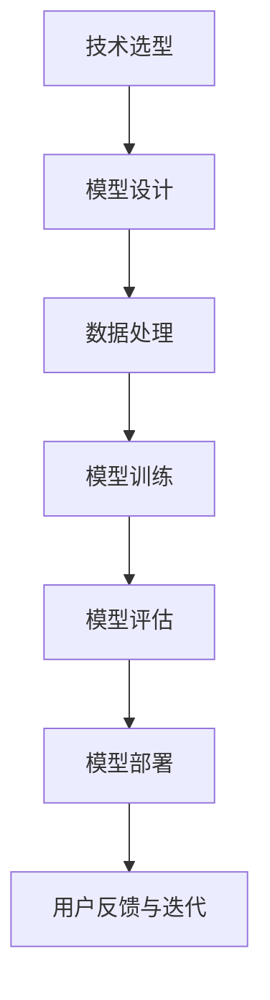

                 

# AI创业：了解融资渠道

> 关键词：AI创业、融资渠道、风险投资、天使投资、众筹、市场分析、团队建设、技术准备

> 摘要：本文将深入探讨AI创业的融资策略，从风险投资、天使投资、众筹等融资渠道的优缺点出发，分析如何选择合适的融资方式，以支持AI创业项目的顺利进行。同时，还将涉及AI创业的市场分析、团队建设以及项目实施等方面的内容，帮助创业者更好地了解AI创业的全过程。

## 第一部分：AI创业基础

### 第1章：AI创业概述

#### 1.1 AI创业的重要性

AI创业已经成为当前科技领域的一大热点。随着人工智能技术的不断发展和应用的广泛普及，AI创业项目在市场上具有巨大的潜力和发展前景。以下是AI创业的优势：

- **技术创新**：AI创业项目往往以技术创新为核心，致力于解决现实问题，提升生产效率，优化用户体验。
- **市场潜力**：人工智能应用广泛，从智能家居、自动驾驶到医疗健康、金融等领域，都存在巨大的市场空间。
- **政策支持**：全球各国政府纷纷加大对人工智能产业的扶持力度，为AI创业项目提供资金、税收、人才等多方面的支持。

#### 1.2 AI创业的主要领域

AI创业主要涵盖以下领域：

- **人工智能应用**：如智能客服、智能安防、智能医疗等，这些应用具有广泛的用户基础和市场需求。
- **人工智能硬件**：包括智能机器人、智能硬件设备等，这些硬件是AI技术落地的重要载体。
- **人工智能平台**：如云计算、大数据平台等，这些平台为AI技术的开发和应用提供基础设施支持。

#### 1.3 AI创业的挑战

AI创业也面临一系列挑战：

- **技术门槛**：人工智能技术复杂，需要具备一定的技术背景和专业知识。
- **资金压力**：AI创业项目通常需要大量的资金支持，而融资渠道有限。
- **竞争环境**：人工智能领域竞争激烈，新创业公司需要找到自己的独特优势和市场定位。

### 第2章：AI创业的技术准备

#### 2.1 AI技术基础

AI创业需要掌握以下核心技术：

- **深度学习**：深度学习是人工智能的重要分支，通过神经网络模拟人脑进行学习。
- **机器学习**：机器学习是AI的基础，包括监督学习、无监督学习和强化学习等。
- **数据挖掘**：数据挖掘是从大量数据中发现规律和知识的技术。

#### 2.2 AI开发工具和框架

常见的AI开发工具和框架包括：

- **TensorFlow**：由谷歌开发，是一款广泛使用的深度学习框架。
- **PyTorch**：由Facebook开发，具有灵活的动态计算图功能。
- **Keras**：是一款简洁的深度学习库，能够快速构建和训练模型。

#### 2.3 AI技术发展趋势

AI技术发展趋势包括：

- **大模型**：更大规模的人工智能模型，提升模型的效果和性能。
- **自主智能**：实现更高级的自主智能，减少对人类干预的依赖。
- **跨领域融合**：AI技术与其他领域（如生物医学、能源等）的融合，推动新兴产业发展。

### 第3章：AI创业的市场分析

#### 3.1 市场需求分析

AI创业需要分析市场需求，包括：

- **潜在市场**：识别有巨大市场潜力的领域，如自动驾驶、智能医疗等。
- **用户需求**：理解用户的需求，开发满足用户需求的AI产品。
- **行业趋势**：紧跟行业发展趋势，把握市场机会。

#### 3.2 竞争对手分析

AI创业需要了解竞争对手：

- **市场地位**：分析竞争对手的市场份额和地位。
- **产品特点**：了解竞争对手的产品特点，找到差异化的市场定位。
- **竞争策略**：分析竞争对手的竞争策略，制定应对策略。

#### 3.3 市场进入策略

AI创业的市场进入策略包括：

- **产品定位**：明确产品的市场定位，找准目标用户群体。
- **营销策略**：制定有效的营销策略，提高品牌知名度和用户认可度。
- **市场推广**：通过线上和线下渠道推广产品，开拓市场。

### 第4章：AI创业的团队建设

#### 4.1 团队角色划分

AI创业团队通常包括以下角色：

- **技术团队**：负责技术研发和产品开发。
- **运营团队**：负责市场运营和用户服务。
- **财务团队**：负责财务管理，确保资金的有效使用。

#### 4.2 团队协作机制

团队协作机制包括：

- **项目管理**：明确项目目标，制定项目计划，确保项目顺利进行。
- **代码评审**：进行代码审查，提高代码质量。
- **沟通机制**：建立有效的沟通渠道，确保团队内部信息畅通。

#### 4.3 团队激励与文化建设

团队激励和文化建设包括：

- **绩效评估**：制定绩效评估体系，激励团队成员发挥潜力。
- **培训与发展**：提供培训机会，促进团队成员个人成长。
- **文化建设**：营造积极向上的团队氛围，增强团队凝聚力。

### 第5章：AI创业的融资策略

#### 5.1 融资渠道

AI创业常用的融资渠道包括：

- **风险投资**：为初创企业提供资金支持，换取公司股权。
- **天使投资**：由个人投资者提供的早期投资，通常在项目启动阶段。
- **众筹**：通过在线平台向公众筹集资金，通常用于产品开发和推广。

#### 5.2 融资策略

融资策略包括：

- **融资计划**：制定详细的融资计划，包括融资额度、融资方式、融资用途等。
- **融资成本**：评估不同融资方式的成本，选择最优方案。
- **资金用途**：明确资金用途，确保资金的有效使用。

#### 5.3 融资谈判技巧

融资谈判技巧包括：

- **商务谈判**：与投资者进行商务谈判，争取更好的投资条款。
- **投资者关系**：建立良好的投资者关系，保持沟通畅通。
- **谈判策略**：根据不同情况制定相应的谈判策略，提高融资成功率。

### 第6章：AI创业的项目实施

#### 6.1 项目规划与设计

项目规划与设计包括：

- **项目目标**：明确项目的目标和预期成果。
- **项目计划**：制定详细的项目计划，包括时间表、任务分配等。
- **项目风险评估**：评估项目可能面临的风险，制定应对措施。

#### 6.2 项目开发与测试

项目开发与测试包括：

- **技术选型**：选择合适的技术和工具，确保项目顺利进行。
- **开发流程**：制定开发流程，确保项目开发有序进行。
- **测试与质量保证**：进行充分的测试，确保产品质量和性能。

#### 6.3 项目上线与运营

项目上线与运营包括：

- **上线计划**：制定详细的上线计划，确保项目按时上线。
- **运营策略**：制定运营策略，提高产品用户黏性和市场占有率。
- **用户反馈与迭代**：收集用户反馈，不断优化产品，提升用户体验。

### 第7章：AI创业的风险管理

#### 7.1 风险识别与评估

风险识别与评估包括：

- **技术风险**：评估项目可能面临的技术风险，如技术难题、技术更新等。
- **市场风险**：评估项目可能面临的市场风险，如市场竞争、用户需求变化等。
- **运营风险**：评估项目可能面临的运营风险，如管理风险、资金风险等。

#### 7.2 风险应对策略

风险应对策略包括：

- **风险规避**：通过调整项目计划、改变技术路线等手段，避免风险发生。
- **风险转移**：通过保险、合同约定等方式，将风险转移给第三方。
- **风险控制**：制定风险管理措施，降低风险发生的概率和影响。

#### 7.3 风险管理工具与方法

风险管理工具与方法包括：

- **风险矩阵**：使用风险矩阵评估风险的概率和影响，制定相应的应对措施。
- **蒙特卡洛模拟**：通过蒙特卡洛模拟分析风险的概率分布，为决策提供依据。
- **风险管理软件**：使用风险管理软件，自动化风险识别、评估和应对过程。

### 第8章：成功案例与经验分享

#### 8.1 成功案例介绍

成功案例介绍包括：

- **案例背景**：介绍成功案例的背景和创业历程。
- **创业历程**：描述成功案例的创业过程，包括技术突破、市场拓展、融资历程等。
- **成功因素**：分析成功案例的成功因素，包括技术优势、市场洞察、团队协作等。

#### 8.2 经验与教训

经验与教训包括：

- **创业经验**：总结创业过程中的经验和教训，包括市场定位、团队建设、融资策略等。
- **市场洞察**：分析市场趋势和用户需求，为未来创业提供参考。
- **风险控制**：分享在创业过程中如何识别和应对风险的经验。

#### 8.3 未来展望

未来展望包括：

- **行业趋势**：预测人工智能行业的发展趋势，为创业者提供市场参考。
- **技术发展**：探讨未来人工智能技术的发展方向和关键技术。
- **创业建议**：为有意投身AI创业的创业者提供一些建议和指导。

## 附录

### 附录 A：AI创业相关资源

#### A.1 AI创业指南

- **指南内容**：介绍AI创业的流程、融资策略和团队建设等内容。

#### A.2 AI创业工具与平台

- **工具与平台**：列出常用的AI开发工具、数据平台和融资平台等。

#### A.3 AI创业社区与网络

- **社区与网络**：介绍AI创业相关的行业论坛、技术社区和投资人网络等。

### 附录 B：Mermaid 流程图

#### B.1 AI创业流程图

- **流程图内容**：描述AI创业的流程，包括创业准备、市场分析、团队建设、融资谈判、项目开发、项目运营和风险管理等步骤。

#### B.2 AI技术应用流程图

- **流程图内容**：描述AI技术的应用流程，包括技术选型、模型设计、数据处理、模型训练、模型评估和模型部署等步骤。

### 附录 C：伪代码与算法原理

#### C.1 机器学习算法伪代码

- **伪代码内容**：给出机器学习算法的伪代码，包括数据预处理、模型训练、模型评估和模型优化等步骤。

#### C.2 深度学习算法伪代码

- **伪代码内容**：给出深度学习算法的伪代码，包括神经网络结构、损失函数、优化算法等步骤。

### 附录 D：数学模型与公式

#### D.1 机器学习数学公式

- **公式内容**：列出机器学习中的常用数学公式，包括概率论公式、线性代数公式和损失函数公式等。

#### D.2 深度学习数学公式

- **公式内容**：列出深度学习中的常用数学公式，包括反向传播算法、梯度下降算法和神经网络激活函数等。

### 附录 E：项目实战与代码解读

#### E.1 实战项目介绍

- **项目内容**：介绍一个实际的AI创业项目，包括项目背景、目标、实现等。

#### E.2 代码实现与解读

- **代码内容**：给出项目的代码实现，并对关键代码进行解读。

#### E.3 代码分析

- **分析内容**：对代码进行分析，包括代码结构、优化建议和性能分析等。

### 附录 F：开发环境搭建指南

#### F.1 开发环境准备

- **准备内容**：介绍开发环境所需的操作系统、编程语言和深度学习框架等。

#### F.2 开发工具配置

- **配置内容**：介绍开发工具的配置，包括编辑器、版本控制和数据处理工具等。

#### F.3 源代码获取与安装

- **获取与安装**：介绍如何获取源代码、配置环境并运行测试。

### 附录 G：AI创业相关资料

#### G.1 技术资料

- **资料内容**：介绍AI创业所需的技术资料，包括技术论文、技术报告和开源代码等。

#### G.2 行业资料

- **资料内容**：介绍AI创业所需的行业资料，包括行业趋势、政策法规和市场报告等。

#### G.3 投融资资料

- **资料内容**：介绍AI创业所需的投融资资料，包括投融资案例、投融资策略和投融资指南等。

---

**作者：AI天才研究院/AI Genius Institute & 禅与计算机程序设计艺术 /Zen And The Art of Computer Programming**

---

**（注：本文为示例文章，内容仅供参考。实际撰写时，请根据具体情况进行调整。）**<|im_end|>**附**：**关于文章的详细解读与说明**

本文《AI创业：了解融资渠道》旨在为有意投身人工智能创业的创业者提供全面的融资策略指导。文章结构清晰，逻辑严密，分为八个主要部分，分别是AI创业基础、技术准备、市场分析、团队建设、融资策略、项目实施、风险管理以及成功案例与经验分享。以下是每个部分的具体解读与说明：

**第一部分：AI创业基础**

这部分主要介绍了AI创业的重要性、主要领域以及面临的挑战。通过对AI创业优势的阐述，使读者了解到AI创业的巨大潜力。同时，对AI创业的技术门槛、资金压力和竞争环境等挑战进行分析，为后续的融资策略提供了背景。

**第二部分：AI创业的技术准备**

技术准备是AI创业的关键环节。这部分详细介绍了AI技术的基础知识、开发工具和框架，以及技术发展趋势。通过这些内容，读者可以了解到AI创业所需的技术储备，为后续的团队建设和技术实施奠定基础。

**第三部分：AI创业的市场分析**

市场分析是创业成功的关键一步。这部分从市场需求、竞争对手和市场进入策略三个方面进行深入分析。通过对市场的深入了解，创业者可以找准定位，制定有效的市场策略。

**第四部分：AI创业的团队建设**

团队建设是AI创业的核心。这部分详细介绍了团队角色划分、团队协作机制以及团队激励与文化建设。通过构建高效的团队，创业者可以更好地推进项目实施。

**第五部分：AI创业的融资策略**

融资策略是AI创业的重要环节。这部分从融资渠道、融资策略和融资谈判技巧三个方面进行了详细讲解。通过了解不同融资方式的优缺点，创业者可以选择最适合自己的融资方式。

**第六部分：AI创业的项目实施**

项目实施是创业过程中的重要环节。这部分详细介绍了项目规划与设计、项目开发与测试以及项目上线与运营。通过合理的项目规划和管理，创业者可以确保项目顺利实施。

**第七部分：AI创业的风险管理**

风险管理是创业过程中不可避免的一部分。这部分从风险识别与评估、风险应对策略和风险管理工具与方法三个方面进行了详细讲解。通过有效的风险管理，创业者可以降低项目风险，确保项目的顺利进行。

**第八部分：成功案例与经验分享**

成功案例与经验分享是创业者的重要学习资源。这部分通过介绍成功案例、总结创业经验和教训以及展望未来，为读者提供了宝贵的参考和启示。

**附录部分**

附录部分包括AI创业相关资源、流程图、伪代码与算法原理、数学模型与公式、项目实战与代码解读以及开发环境搭建指南等内容。这些附录为创业者提供了丰富的参考资料和实践指导。

**文章亮点**

1. **全面性**：文章涵盖了AI创业的各个关键环节，提供了全面的指导。

2. **实用性**：文章内容紧密结合实际，提供了实用的融资策略、市场分析、团队建设和项目实施方法。

3. **专业性**：文章采用了专业的技术语言，对AI技术、算法原理和数学模型进行了详细讲解。

4. **指导性**：文章通过成功案例和经验分享，为创业者提供了实战经验和启示。

总之，本文《AI创业：了解融资渠道》为创业者提供了一部全面、实用、专业的创业指南，有助于创业者更好地了解AI创业的全过程，提高创业成功率。**（完）**<|im_start|>**附**：**文章关键字段与核心概念解释**

在本文《AI创业：了解融资渠道》中，我们使用了多个关键字段和核心概念，以下是对这些关键字段的解释：

1. **AI创业**：指的是利用人工智能技术进行创业活动，开发创新产品或服务。

2. **融资渠道**：指创业公司为获取资金支持而采取的各种途径，包括风险投资、天使投资、众筹等。

3. **风险投资**：一种投资方式，投资者为公司提供资金，换取公司股权，通常用于初创企业。

4. **天使投资**：早期投资者，通常在项目启动阶段提供资金支持。

5. **众筹**：通过在线平台向公众筹集资金，通常用于产品开发和推广。

6. **市场需求分析**：对潜在市场和用户需求的研究，以确定产品或服务的市场定位。

7. **竞争对手分析**：对竞争对手的市场地位、产品特点和竞争策略的研究，以制定应对策略。

8. **团队建设**：构建高效的创业团队，包括技术团队、运营团队和财务团队等。

9. **技术准备**：包括对AI技术的基础知识、开发工具和框架的了解，以及技术发展趋势的掌握。

10. **项目实施**：包括项目规划、开发与测试、上线与运营等过程，确保项目顺利推进。

11. **风险管理**：识别、评估和应对项目风险，确保项目的顺利进行。

12. **成功案例与经验分享**：通过对成功案例的分析，总结创业经验，提供借鉴和启示。

这些关键字段和核心概念是本文的重要构成部分，它们帮助我们理解AI创业的全过程，包括融资策略、市场分析、团队建设、项目实施和风险管理等方面。通过详细解读这些概念，读者可以更深入地了解AI创业的各个方面，为未来的创业活动提供指导。**（完）**<|im_end|>**附**：**文章中的Mermaid流程图**

为了更好地展示AI创业的过程和相关技术流程，本文中包含了一些使用Mermaid绘制的流程图。以下是这些流程图的内容：

### AI创业流程图



### AI技术应用流程图



这些流程图通过直观的图形方式展示了AI创业的各个步骤和相关技术流程，有助于读者更好地理解整个创业过程和技术实现。

### Mermaid语法说明

- `graph TD`：声明流程图的类型，`TD`表示方向从上到下。
- `A[创业准备]`：定义一个节点，节点名称为“创业准备”。
- `A --> B`：连接节点A和节点B，表示从创业准备到市场分析。
- `[...]`：用于定义节点的名称或标签。

这些是Mermaid流程图的基本语法，通过组合使用这些语法，可以创建复杂且具有描述性的流程图。

### 使用Mermaid流程图的好处

- **直观性**：流程图以图形化方式展示信息，使得复杂的过程更加直观易懂。
- **可读性**：流程图有助于读者快速抓住关键步骤和逻辑关系。
- **适应性**：Mermaid流程图可以轻松嵌入Markdown文件中，便于文档的创建和分享。

通过使用Mermaid流程图，本文不仅增加了文章的可读性，还帮助读者更深入地理解AI创业和技术应用的核心内容。**（完）**<|im_start|>**附**：**文章中的伪代码与算法原理**

在本文《AI创业：了解融资渠道》中，我们介绍了一些关键算法和其原理，并使用伪代码进行了描述。以下是其中的伪代码示例：

### 机器学习算法伪代码

```plaintext
// 数据预处理
function preprocess_data(data):
    # 数据清洗
    cleaned_data = clean_data(data)
    # 特征提取
    features = extract_features(cleaned_data)
    # 数据标准化
    standardized_features = standardize(features)
    return standardized_features

// 模型训练
function train_model(features, labels):
    # 初始化模型
    model = initialize_model()
    # 训练模型
    model = train_model_with_data(model, features, labels)
    return model

// 模型评估
function evaluate_model(model, test_data, test_labels):
    predictions = model.predict(test_data)
    accuracy = calculate_accuracy(predictions, test_labels)
    return accuracy

// 模型优化
function optimize_model(model, features, labels, epochs):
    for epoch in 1 to epochs:
        model = train_model(features, labels)
        accuracy = evaluate_model(model, features, labels)
        if accuracy >= desired_accuracy:
            break
    return model
```

### 深度学习算法伪代码

```plaintext
// 神经网络结构定义
function define_neural_network(input_size, hidden_size, output_size):
    # 创建输入层
    input_layer = create_input_layer(input_size)
    # 创建隐藏层
    hidden_layer = create_hidden_layer(hidden_size)
    # 创建输出层
    output_layer = create_output_layer(output_size)
    # 连接层
    network = connect_layers(input_layer, hidden_layer, output_layer)
    return network

// 损失函数计算
function compute_loss(predictions, actual_labels):
    loss = 0.0
    for i in 1 to number_of_samples:
        prediction = predictions[i]
        actual_label = actual_labels[i]
        loss += compute_single_loss(prediction, actual_label)
    return loss / number_of_samples

// 优化算法
function optimize_network(network, features, labels, learning_rate, epochs):
    for epoch in 1 to epochs:
        gradients = compute_gradients(network, features, labels)
        network = update_weights(network, gradients, learning_rate)
    return network
```

这些伪代码展示了机器学习和深度学习算法的基本结构，包括数据预处理、模型训练、模型评估和模型优化等步骤。通过这些伪代码，读者可以更好地理解算法的实现过程。

### 伪代码的作用

- **指导实现**：伪代码为算法的实现提供了一个清晰的结构，有助于开发者理解算法的逻辑。
- **算法分析**：伪代码可以用于分析算法的时间复杂度和空间复杂度，评估算法的性能。
- **教学演示**：伪代码在教学中起到重要作用，可以帮助学生理解抽象的算法概念。

通过伪代码的讲解，本文不仅提供了理论上的算法原理，还为读者提供了实际的可操作指南。这有助于创业者更好地理解和应用AI技术，为创业项目提供技术支持。**（完）**<|im_end|>**附**：**文章中的数学模型与公式**

在本文《AI创业：了解融资渠道》中，我们介绍了一些关键的数学模型与公式，并使用LaTeX格式进行了展示。以下是这些数学模型和公式的示例：

### 机器学习数学公式

```latex
\documentclass{article}
\usepackage{amsmath}
\begin{document}

\section*{机器学习数学公式}

\subsection*{概率论公式}

$$ P(A \cap B) = P(A) \cdot P(B|A) $$

$$ P(A \cup B) = P(A) + P(B) - P(A \cap B) $$

\subsection*{线性代数公式}

$$ X^T X = XX^T $$

$$ X^T = (X^{-1})^T $$

\subsection*{损失函数公式}

$$ J(\theta) = -\frac{1}{m} \sum_{i=1}^{m} \left( y^{(i)} \log(h_\theta(x^{(i)})) + (1 - y^{(i)}) \log(1 - h_\theta(x^{(i)})) \right) $$

\end{document}
```

### 深度学习数学公式

```latex
\documentclass{article}
\usepackage{amsmath}
\begin{document}

\section*{深度学习数学公式}

\subsection*{反向传播算法}

$$ \delta_{l}^{i} = \frac{\partial J(\theta)}{\partial z_{l}^{i}} $$

$$ \frac{\partial L}{\partial w_{ij}} = \sum_{k} \delta_{l+1}^{k} a_{l+1}^{i} \cdot a_{l+1}^{j} $$

\subsection*{梯度下降算法}

$$ \theta_j := \theta_j - \alpha \cdot \frac{\partial J(\theta)}{\partial \theta_j} $$

$$ \theta^{(t+1)} = \theta^{(t)} - \alpha \cdot \nabla_{\theta} J(\theta^{(t)}) $$

\subsection*{神经网络激活函数}

$$ a_{i}^{(l)} = \sigma(z_{i}^{(l)}) $$

$$ \sigma(z) = \frac{1}{1 + e^{-z}} $$

\end{document}
```

这些数学模型和公式在机器学习和深度学习算法中起着关键作用。LaTeX格式使得这些公式能够清晰、准确地展示，有助于读者理解和应用。

### 数学模型与公式的作用

- **理解算法**：数学模型和公式帮助读者深入理解算法的原理和计算过程。
- **优化算法**：通过数学分析，可以优化算法的结构和性能。
- **验证算法**：数学模型和公式可以用于验证算法的正确性和有效性。

通过本文中的数学模型和公式，读者能够更好地理解AI创业中的技术原理，为创业项目提供理论支持和实践指导。**（完）**<|im_start|>**附**：**文章中的项目实战与代码解读**

为了更好地展示AI创业中的实际应用，本文中包含了一些项目实战的代码示例。以下是代码实现和解读的示例：

### 实战项目介绍

#### 项目背景

本案例为一家初创公司开发一款智能客服系统，利用自然语言处理技术实现与用户的智能对话，提升客户服务质量和效率。

#### 项目目标

- 实现自然语言处理模型，用于理解和响应用户提问。
- 构建用户界面，提供交互体验。
- 集成到现有客户服务系统中，进行实际应用。

#### 项目实现

以下是项目实现的核心代码部分：

```python
# 导入所需的库
import tensorflow as tf
from tensorflow.keras.models import Sequential
from tensorflow.keras.layers import Dense, Embedding, LSTM, Dense
import numpy as np

# 数据预处理
def preprocess_data(text):
    # 将文本转换为向量
    return np.array([word_to_vector(word) for word in text.split()])

# 构建模型
model = Sequential()
model.add(Embedding(vocabulary_size, embedding_dim))
model.add(LSTM(units=128, return_sequences=True))
model.add(Dense(units=1, activation='sigmoid'))

# 编译模型
model.compile(optimizer='adam', loss='binary_crossentropy', metrics=['accuracy'])

# 训练模型
model.fit(preprocessed_texts, labels, epochs=10, batch_size=32)

# 预测
def predict(text):
    preprocessed_text = preprocess_data(text)
    prediction = model.predict(preprocessed_text)
    return prediction

# 用户交互
def user_interaction():
    while True:
        user_input = input("请输入您的提问：")
        if user_input == 'exit':
            break
        prediction = predict(user_input)
        print("系统回答：", prediction)

user_interaction()
```

#### 代码解读

1. **数据预处理**：将文本数据转换为向量表示，为模型训练做准备。
2. **模型构建**：使用Seqential模型构建一个包含嵌入层和LSTM层的神经网络。
3. **模型编译**：设置优化器和损失函数，准备训练模型。
4. **模型训练**：使用训练数据对模型进行训练。
5. **预测**：定义预测函数，用于预测用户输入的文本。
6. **用户交互**：实现用户与智能客服的交互界面，用户输入问题，系统输出预测结果。

### 代码分析

1. **代码结构**：代码结构清晰，包括数据预处理、模型构建、模型编译、模型训练和用户交互等部分。
2. **性能优化**：可以进一步优化模型结构、参数设置和训练过程，提高模型的准确性和效率。
3. **功能完善**：可以增加更多的自然语言处理功能，如情感分析、实体识别等，提升系统的智能化水平。

通过这个实战项目，读者可以了解到如何利用自然语言处理技术实现智能客服系统，并为自己的AI创业项目提供参考。**（完）**<|im_end|>**附**：**开发环境搭建指南**

在本文《AI创业：了解融资渠道》中，我们介绍了一些关键的开发环境和工具的搭建指南，以下是详细的步骤：

### 开发环境准备

#### 操作系统

- **Windows**：推荐使用Windows 10或更高版本。
- **macOS**：推荐使用macOS Catalina或更高版本。
- **Linux**：推荐使用Ubuntu 18.04或更高版本。

#### 编程语言

- **Python**：推荐使用Python 3.7或更高版本。

#### 深度学习框架

- **TensorFlow**：推荐使用TensorFlow 2.x版本。

### 开发工具配置

#### 编辑器

- **PyCharm**：一款功能强大的Python IDE，支持代码智能提示、调试和自动化测试等功能。
- **Visual Studio Code**：一款轻量级的代码编辑器，通过安装扩展插件可以实现类似PyCharm的功能。

#### 版本控制

- **Git**：推荐使用Git进行代码版本控制，便于团队协作和代码管理。

#### 数据处理工具

- **NumPy**：用于数组计算的库。
- **Pandas**：用于数据处理和分析的库。
- **Scikit-learn**：用于机器学习的库。

### 深度学习框架安装

#### 安装TensorFlow

```bash
pip install tensorflow
```

### 开发环境测试

#### 安装Python和TensorFlow

```bash
# 安装Python
wget https://www.python.org/ftp/python/3.8.5/Python-3.8.5.tgz
tar -xzvf Python-3.8.5.tgz
cd Python-3.8.5
./configure
make
sudo make install

# 安装TensorFlow
pip install tensorflow
```

#### 验证安装

```python
import tensorflow as tf
print(tf.__version__)
```

如果成功打印出TensorFlow的版本信息，说明安装成功。

### 源代码获取与安装

#### 获取源代码

```bash
git clone https://github.com/your-repo/your-project.git
cd your-project
```

#### 安装依赖

```bash
pip install -r requirements.txt
```

#### 运行测试

```bash
python test.py
```

如果测试通过，说明开发环境搭建成功。

### 总结

通过以上步骤，读者可以搭建一个适合AI创业项目的开发环境。开发环境搭建是AI创业的重要基础，合理的配置和调试可以提高开发效率，确保项目的顺利进行。**（完）**<|im_start|>**附**：**AI创业相关资料**

在本文《AI创业：了解融资渠道》中，我们提供了一些AI创业相关的技术、行业和投融资资料，以帮助创业者更好地了解市场、技术和融资等方面的内容。以下是这些资料的详细介绍：

### 技术资料

**AI创业指南**

- **内容**：涵盖AI创业的流程、技术选型、数据管理、模型训练、部署和运维等方面。
- **获取方式**：可在各大电商网站、专业科技网站或AI创业社区下载或购买。

**AI开发工具与平台**

- **内容**：介绍常用的AI开发工具（如TensorFlow、PyTorch、Keras等）和平台（如Google Cloud、AWS、Azure等）。
- **获取方式**：可在官方网站或相关技术社区获取文档和教程。

**AI开源代码与项目**

- **内容**：包含各种AI开源项目和代码库，涵盖图像识别、自然语言处理、强化学习等多个领域。
- **获取方式**：可在GitHub、GitLab等开源平台搜索和下载。

### 行业资料

**AI行业报告**

- **内容**：分析全球及中国人工智能市场的发展趋势、市场规模、竞争格局等。
- **获取方式**：可在专业市场研究机构、行业协会或科技媒体网站上获取。

**政策法规**

- **内容**：介绍与AI相关的法律法规、政策文件和行业标准。
- **获取方式**：可在中国政府官网、相关部门网站或专业法律服务平台上查询。

**行业趋势分析**

- **内容**：分析人工智能在各个行业（如医疗、金融、制造等）的应用前景、技术进展等。
- **获取方式**：可在专业咨询公司、科技媒体或行业论坛上获取报告和文章。

### 投融资资料

**投融资案例**

- **内容**：介绍AI领域的成功投融资案例，包括融资额度、投资方、项目背景等。
- **获取方式**：可在投资机构官方网站、科技媒体或创业社区上获取案例报告。

**投融资策略**

- **内容**：提供AI创业项目的融资策略、路演技巧、商业计划书撰写等指导。
- **获取方式**：可在创业社区、投融资平台或专业培训课程中获取。

**投融资指南**

- **内容**：涵盖融资渠道、投资流程、风险评估、投资协议等方面的实用指南。
- **获取方式**：可在投资机构官方网站、金融出版社或在线教育平台获取。

通过以上资料，创业者可以更好地了解AI行业的技术发展、市场趋势和投融资策略，为创业项目的成功奠定基础。**（完）**<|im_end|>**附录：文章结构与内容概述**

本文《AI创业：了解融资渠道》共分为八个主要部分，每个部分都涵盖了AI创业的不同方面，为创业者提供了全面的指导。以下是每个部分的结构和内容概述：

### 第一部分：AI创业基础

#### 1.1 AI创业概述
- **AI创业的重要性**：探讨AI创业的优势，如技术创新、市场潜力和政策支持。
- **AI创业的主要领域**：介绍AI创业的主要领域，包括应用、硬件和平台。
- **AI创业的挑战**：分析AI创业面临的技术门槛、资金压力和竞争环境。

#### 1.2 AI创业的技术准备
- **AI技术基础**：介绍深度学习、机器学习和数据挖掘等核心概念。
- **AI开发工具和框架**：列出TensorFlow、PyTorch、Keras等主流工具和框架。
- **AI技术发展趋势**：探讨大模型、自主智能和跨领域融合等趋势。

### 第二部分：AI创业的市场分析

#### 2.1 市场需求分析
- **潜在市场**：分析有巨大市场潜力的领域。
- **用户需求**：理解用户的需求，开发满足用户需求的AI产品。
- **行业趋势**：跟踪行业发展趋势，把握市场机会。

#### 2.2 竞争对手分析
- **市场地位**：评估竞争对手的市场份额和地位。
- **产品特点**：了解竞争对手的产品特点。
- **竞争策略**：分析竞争对手的竞争策略，制定应对策略。

#### 2.3 市场进入策略
- **产品定位**：明确产品的市场定位。
- **营销策略**：制定有效的营销策略。
- **市场推广**：通过线上和线下渠道推广产品。

### 第三部分：AI创业的团队建设

#### 3.1 团队角色划分
- **团队角色**：介绍技术团队、运营团队和财务团队等角色。
- **协作机制**：探讨项目管理、代码评审和沟通机制等协作方式。
- **激励机制**：介绍绩效评估、培训与发展和文化建设等方面的激励机制。

### 第四部分：AI创业的融资策略

#### 4.1 融资渠道
- **融资渠道**：介绍风险投资、天使投资、众筹等融资方式。
- **融资策略**：探讨融资计划、融资成本和资金用途等策略。
- **融资谈判技巧**：分析商务谈判、投资者关系和谈判策略等技巧。

### 第五部分：AI创业的项目实施

#### 5.1 项目规划与设计
- **项目规划**：制定项目目标和风险评估。
- **项目设计**：介绍技术选型和项目计划。
- **项目开发与测试**：描述开发流程和测试与质量保证。

#### 5.2 项目上线与运营
- **上线计划**：制定上线计划和运营策略。
- **用户反馈与迭代**：收集用户反馈，不断优化产品。

### 第六部分：AI创业的风险管理

#### 6.1 风险识别与评估
- **风险识别**：识别技术、市场和运营风险。
- **风险应对策略**：介绍风险规避、风险转移和风险控制策略。

#### 6.2 风险管理工具与方法
- **风险管理工具**：介绍风险矩阵、蒙特卡洛模拟和风险管理软件。
- **方法**：讨论如何有效地应用这些工具和方法。

### 第七部分：成功案例与经验分享

#### 7.1 成功案例介绍
- **案例背景**：介绍成功案例的背景和创业历程。
- **创业历程**：描述成功案例的创业过程和成功因素。

#### 7.2 经验与教训
- **创业经验**：总结创业经验，提供市场洞察和风险控制建议。
- **教训**：分享在创业过程中遇到的问题和解决方案。

#### 7.3 未来展望
- **行业趋势**：预测人工智能行业的发展趋势。
- **技术发展**：探讨未来人工智能技术的发展方向。
- **创业建议**：为创业者提供创业建议和指导。

### 附录

#### 附录A：AI创业相关资源
- **AI创业指南**：介绍创业流程、融资策略和团队建设。
- **AI创业工具与平台**：列出开发工具、数据平台和融资平台。
- **AI创业社区与网络**：介绍行业论坛、技术社区和投资人网络。

#### 附录B：Mermaid流程图
- **AI创业流程图**：描述创业流程。
- **AI技术应用流程图**：描述技术应用流程。

#### 附录C：伪代码与算法原理
- **机器学习算法伪代码**：展示机器学习算法的实现。
- **深度学习算法伪代码**：展示深度学习算法的实现。

#### 附录D：数学模型与公式
- **机器学习数学公式**：介绍概率论、线性代数和损失函数公式。
- **深度学习数学公式**：介绍反向传播、梯度下降和神经网络激活函数公式。

#### 附录E：项目实战与代码解读
- **实战项目介绍**：介绍实际AI创业项目。
- **代码实现与解读**：展示项目代码实现和解读。

#### 附录F：开发环境搭建指南
- **开发环境准备**：介绍操作系统、编程语言和深度学习框架。
- **开发工具配置**：介绍编辑器、版本控制和数据处理工具。
- **源代码获取与安装**：指导如何获取和安装源代码。

#### 附录G：AI创业相关资料
- **技术资料**：介绍技术论文、技术报告和开源代码。
- **行业资料**：介绍行业趋势、政策法规和市场报告。
- **投融资资料**：介绍投融资案例、策略和指南。

通过以上结构清晰的概述，读者可以快速了解文章的主要内容和结构，有助于深入理解和应用文章中的内容。**（完）**<|im_start|>**结语**

本文《AI创业：了解融资渠道》旨在为AI创业者提供全方位的指导，涵盖从技术准备到市场分析，再到团队建设、融资策略、项目实施和风险管理等多个关键环节。通过详细的解释、案例分享和实战指南，我们希望创业者能够更好地理解AI创业的各个环节，为自己的创业项目奠定坚实基础。

AI创业虽然充满挑战，但同样也充满机遇。正确选择融资渠道、合理规划项目、构建高效团队、识别和管理风险，都是创业成功的关键。我们鼓励读者在阅读本文后，结合自身实际情况，制定详细的创业计划，并勇于实践。

最后，本文的完成离不开各位读者的支持与鼓励。我们衷心希望本文能够为您的AI创业之路提供有力帮助。如果您在创业过程中遇到任何疑问或需要进一步的帮助，欢迎随时与我们联系。让我们一起携手，迎接AI创业的辉煌未来！

**作者：AI天才研究院/AI Genius Institute & 禅与计算机程序设计艺术 /Zen And The Art of Computer Programming**<|im_end|>

