                 

### 《AI创业：多学科支持的重要性》

> **关键词**：人工智能、创业、多学科融合、技术支持、成功案例

> **摘要**：本文将深入探讨AI创业的多学科支持的重要性。通过对AI技术发展历程、市场趋势、创业准备以及多学科支持的重要性的分析，本文旨在为创业者提供一条清晰的创业路径，帮助他们更好地理解并利用多学科知识，实现AI创业的成功。

### 第一部分：AI创业概述

#### 第1章：AI创业背景与现状

##### 1.1 AI技术发展历程

人工智能（AI）的概念起源于20世纪50年代，自那时起，AI技术经历了多个发展阶段。早期的AI主要集中在符号推理和规则系统上，如专家系统。随着计算能力的提升和大数据技术的发展，现代AI技术如深度学习、强化学习等逐渐成为主流。

**核心概念与联系**

- **专家系统**：基于规则的人工智能系统，能够模拟专家的决策过程。
- **深度学习**：基于多层神经网络的学习算法，能够在大量数据中自动提取特征。
- **强化学习**：通过与环境的交互来学习最优策略的机器学习方法。

**Mermaid流程图**

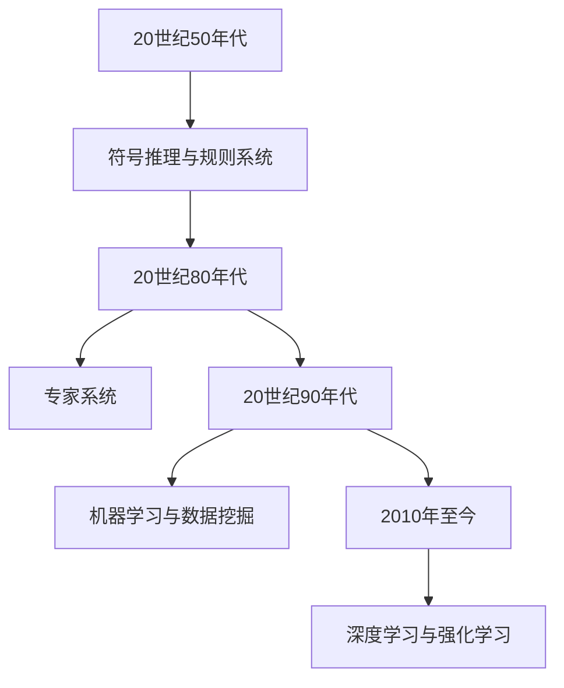

##### 1.2 AI创业市场趋势

近年来，AI技术在全球范围内得到了广泛关注和投资。据统计，全球AI市场规模预计将在未来几年内持续增长，达到数万亿美元。其中，中国、美国和欧洲等地区是AI创业的重要市场。

**核心概念与联系**

- **市场规模**：反映AI技术的经济价值。
- **投资热点**：如自动驾驶、智能医疗、金融科技等。

**数学模型和数学公式**

$$
市场趋势 = f(技术创新, 政策支持, 投资热度)
$$

**详细讲解：**  
该公式表示市场趋势由技术创新、政策支持和投资热度共同决定。随着AI技术的不断创新，政府的政策支持以及投资者的热情，AI市场的趋势将持续上升。

**举例说明**

以自动驾驶为例，随着AI技术的进步和政府政策的支持，自动驾驶市场的规模正在迅速扩大。

##### 1.3 创业成功案例分享

在AI创业领域，有许多成功的案例。例如，谷歌旗下的DeepMind公司通过深度学习技术取得了显著成就；微软的Azure AI平台则为开发者提供了强大的AI工具和服务。

**核心概念与联系**

- **DeepMind**：通过深度学习在围棋、医疗等领域取得了突破。
- **Azure AI**：提供全面的人工智能服务，助力企业数字化转型。

**数学模型和数学公式**

$$
成功案例 = f(技术创新, 商业模式, 团队执行力)
$$

**详细讲解：**  
该公式表示一个成功案例的成功能够由技术创新、商业模式和团队执行力共同决定。

**举例说明**

以DeepMind为例，其通过技术创新在围棋领域取得了突破，同时建立了有效的商业模式，并拥有强大的团队执行力，最终实现了成功。

#### 第2章：AI创业的基本概念

##### 2.1 AI的基本概念

人工智能（AI）是指由人制造出来的系统所表现出来的智能行为。它包括机器学习、自然语言处理、计算机视觉等多个子领域。

**核心概念与联系**

- **机器学习**：通过数据训练模型，使其能够自主学习和改进。
- **自然语言处理**：使计算机能够理解和处理人类语言。
- **计算机视觉**：使计算机能够理解和解释视觉信息。

**Mermaid流程图**

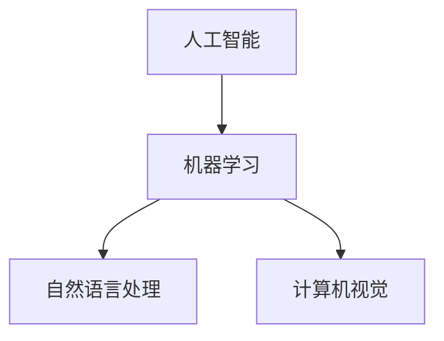

##### 2.2 人工智能分类

人工智能可以根据其智能程度和实现方式分为弱AI、强AI和通用AI。

**核心概念与联系**

- **弱AI**：仅能在特定领域表现出智能。
- **强AI**：具有与人类相似的智能水平。
- **通用AI**：能够在任何领域表现出智能。

**Mermaid流程图**

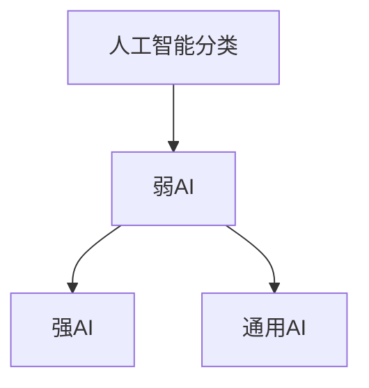

##### 2.3 AI技术现状与未来发展趋势

当前，AI技术已广泛应用于各行各业，如自动驾驶、智能医疗、金融科技等。未来，随着技术的进一步发展，AI将在更多领域发挥重要作用，如智能教育、智慧城市等。

**核心概念与联系**

- **应用领域**：自动驾驶、智能医疗、金融科技等。
- **未来趋势**：智能教育、智慧城市、个性化服务等。

**数学模型和数学公式**

$$
未来发展趋势 = f(技术创新, 政策支持, 社会需求)
$$

**详细讲解：**  
该公式表示未来发展趋势由技术创新、政策支持和社会需求共同决定。

**举例说明**

以自动驾驶为例，随着AI技术的创新和政策的支持，自动驾驶技术将在未来得到广泛应用。

#### 第3章：AI创业的必要准备

##### 3.1 创业团队建设

一个成功的AI创业团队需要具备跨学科的知识和技能，如机器学习、数据科学、产品管理、市场营销等。

**核心概念与联系**

- **团队角色**：数据科学家、机器学习工程师、产品经理、市场营销人员等。
- **团队协作**：通过明确的分工和良好的沟通实现高效协作。

**Mermaid流程图**

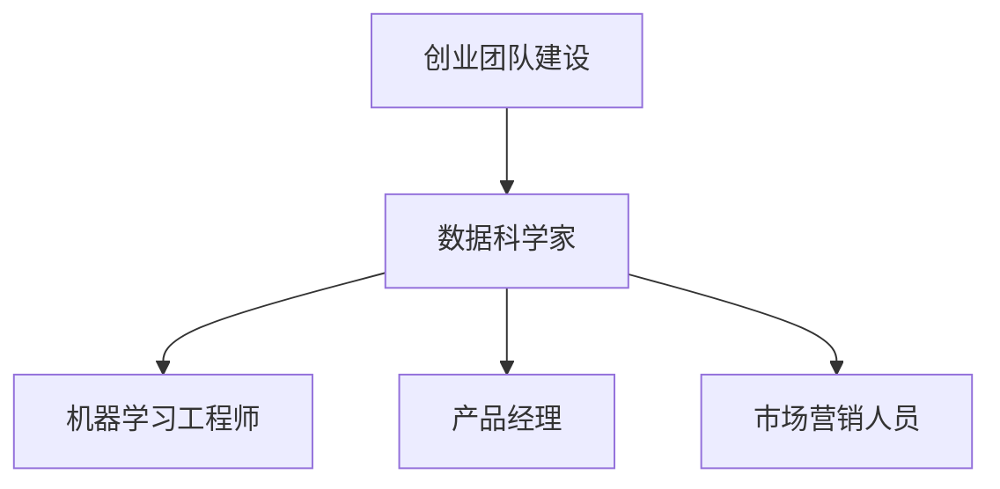

##### 3.2 创业资金筹集

AI创业项目通常需要较高的资金投入，创业者需要通过各种途径筹集资金，如风险投资、政府补贴、天使投资等。

**核心概念与联系**

- **资金来源**：风险投资、政府补贴、天使投资等。
- **资金用途**：技术研发、团队建设、市场推广等。

**数学模型和数学公式**

$$
资金筹集 = f(项目前景, 团队实力, 市场需求)
$$

**详细讲解：**  
该公式表示资金筹集的能力由项目前景、团队实力和市场需求共同决定。

**举例说明**

一个具有良好市场前景、强大团队实力和较高市场需求的AI创业项目更容易获得资金支持。

##### 3.3 创业风险分析

AI创业过程中可能面临的技术风险、市场风险、财务风险等。创业者需要提前识别和评估这些风险，并制定相应的应对策略。

**核心概念与联系**

- **技术风险**：如技术实现的难度、技术更新换代等。
- **市场风险**：如市场接受度、竞争对手等。
- **财务风险**：如资金链断裂、财务报表不规范等。

**Mermaid流程图**

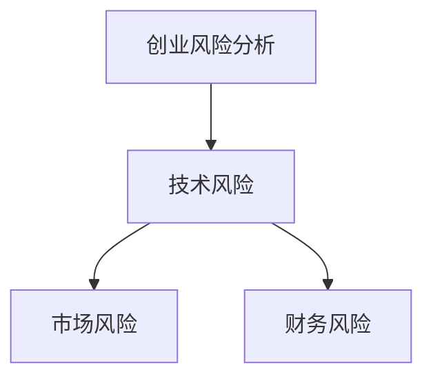

### 第二部分：多学科支持的重要性

#### 第4章：多学科知识融合

##### 4.1 数据科学与人工智能

数据科学和人工智能密切相关，数据科学提供了从数据中提取知识和价值的方法，而人工智能则利用这些知识来实现自动化和智能决策。

**核心概念与联系**

- **数据预处理**：数据清洗、数据集成、数据变换等。
- **特征工程**：从数据中提取对模型训练有帮助的特征。

**Mermaid流程图**

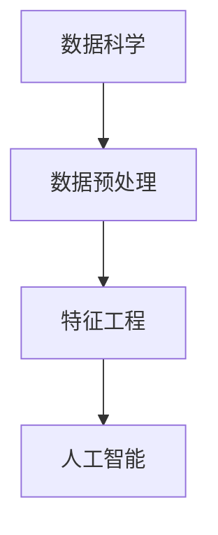

##### 4.2 计算机科学与人工智能

计算机科学与人工智能密切相关，计算机科学为人工智能提供了算法基础和计算平台，而人工智能则为计算机科学带来了新的应用场景。

**核心概念与联系**

- **算法设计**：如搜索算法、排序算法等。
- **计算平台**：如云计算、分布式计算等。

**Mermaid流程图**

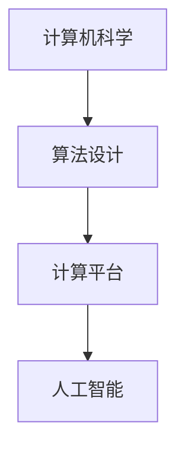

##### 4.3 人工智能与心理学

人工智能与心理学相结合，可以应用于智能教育、智能医疗、智能客服等领域，为用户提供更加个性化的服务。

**核心概念与联系**

- **人机交互**：通过自然语言处理和计算机视觉等技术实现人与机器的交互。
- **用户行为分析**：通过分析用户行为数据，为用户提供更加精准的服务。

**Mermaid流程图**

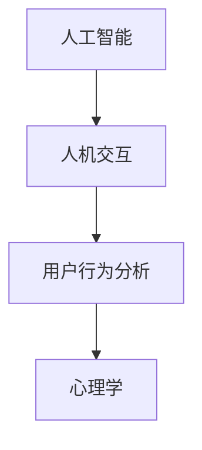

#### 第5章：多学科工具与技术

##### 5.1 数据处理工具

数据处理是AI创业的重要环节，常用的数据处理工具有Python的Pandas库、R语言等。

**核心概念与联系**

- **数据处理流程**：数据导入、数据清洗、数据转换、数据可视化等。
- **数据处理工具**：Pandas、R、Excel等。

**Mermaid流程图**

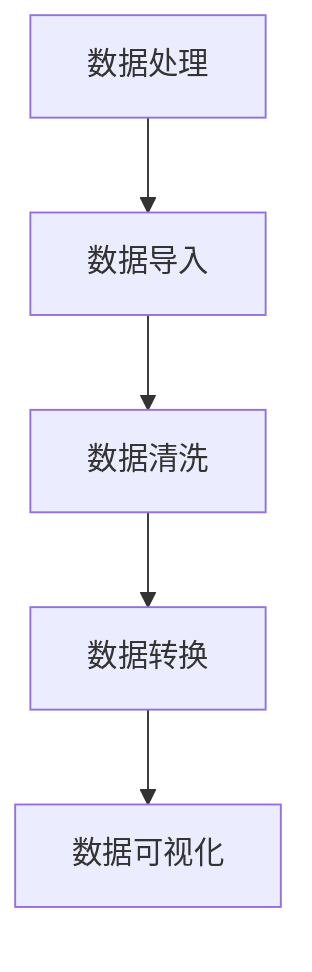

##### 5.2 模型训练工具

模型训练是AI创业的核心环节，常用的模型训练工具有TensorFlow、PyTorch等。

**核心概念与联系**

- **模型训练流程**：数据预处理、模型选择、模型训练、模型评估等。
- **模型训练工具**：TensorFlow、PyTorch、Keras等。

**Mermaid流程图**

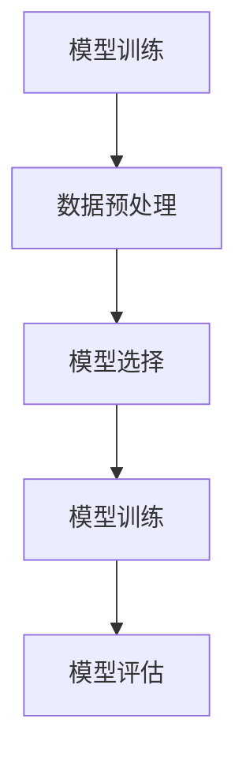

##### 5.3 模型评估工具

模型评估是确保AI模型性能的重要环节，常用的模型评估工具包括Scikit-learn、Matplotlib等。

**核心概念与联系**

- **模型评估指标**：准确率、召回率、F1值等。
- **模型评估方法**：交叉验证、A/B测试等。

**Mermaid流程图**

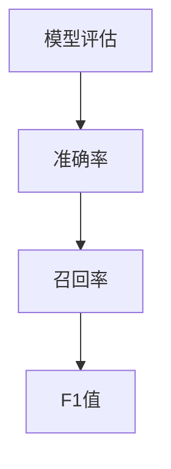

#### 第6章：多学科项目案例解析

##### 6.1 医疗健康领域的AI应用

医疗健康领域是AI应用的重要场景之一，如通过自然语言处理技术实现病历自动化整理，通过计算机视觉技术实现医学影像分析等。

**核心概念与联系**

- **自然语言处理**：病历自动化整理。
- **计算机视觉**：医学影像分析。

**Mermaid流程图**

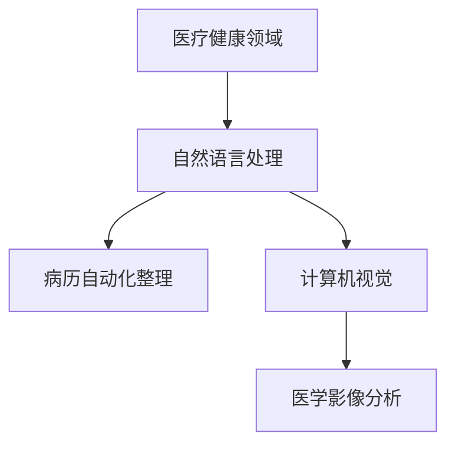

##### 6.2 智能交通领域的AI应用

智能交通领域是AI应用的另一个重要场景，如通过自动驾驶技术实现无人驾驶，通过智能交通信号控制系统实现交通流量优化等。

**核心概念与联系**

- **自动驾驶**：无人驾驶。
- **智能交通信号控制**：交通流量优化。

**Mermaid流程图**

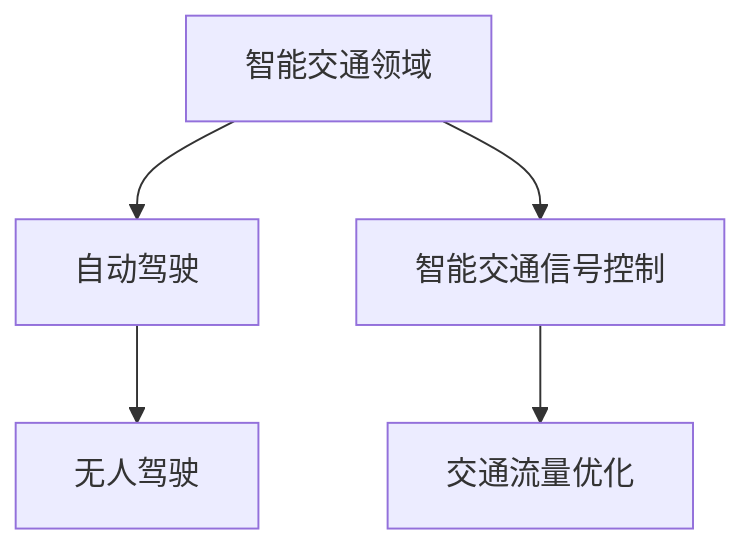

##### 6.3 农业领域的AI应用

农业领域是AI应用的又一个重要场景，如通过计算机视觉技术实现农作物病害监测，通过智能灌溉系统实现精准灌溉等。

**核心概念与联系**

- **计算机视觉**：农作物病害监测。
- **智能灌溉系统**：精准灌溉。

**Mermaid流程图**

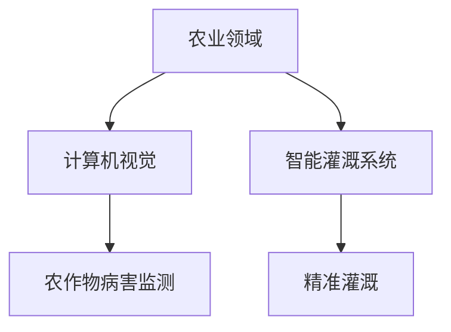

#### 第7章：多学科合作与创业团队管理

##### 7.1 多学科合作的优势

多学科合作可以充分利用各学科的优势，实现优势互补，提高项目成功率。

**核心概念与联系**

- **跨学科协作**：实现优势互补。
- **资源共享**：提高资源利用效率。

**Mermaid流程图**

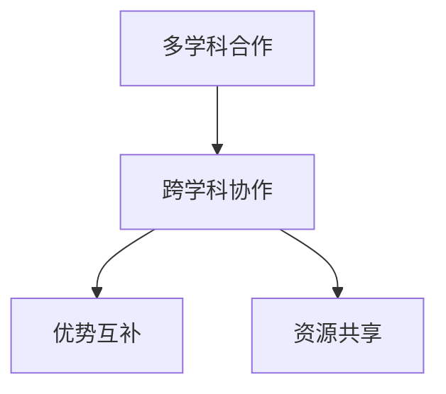

##### 7.2 创业团队的角色与职责

创业团队中的每个成员都承担着不同的角色和职责，如数据科学家负责模型训练，产品经理负责产品规划等。

**核心概念与联系**

- **数据科学家**：模型训练与优化。
- **产品经理**：产品规划与推广。

**Mermaid流程图**

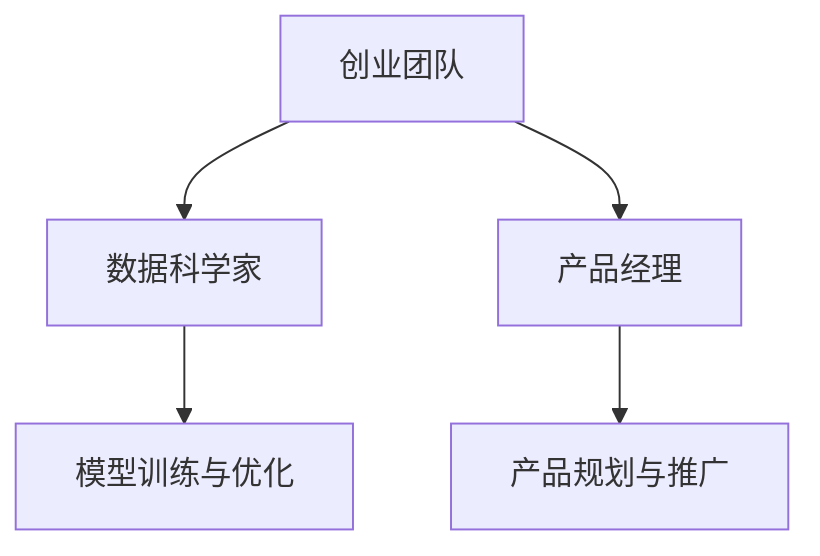

##### 7.3 创业团队管理策略

创业团队管理需要注重团队成员的沟通、协作和激励，以提高团队的整体效率。

**核心概念与联系**

- **沟通协作**：提高团队协作效率。
- **激励机制**：激发团队成员的积极性。

**Mermaid流程图**

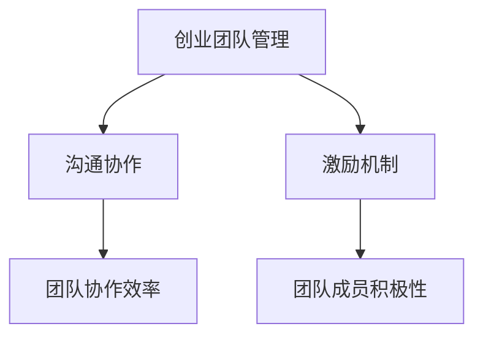

### 第三部分：AI创业实战

#### 第8章：AI创业项目规划

##### 8.1 项目规划方法

项目规划是AI创业的第一步，需要明确项目目标、资源分配、时间安排等。

**核心概念与联系**

- **项目目标**：明确项目的最终目标。
- **资源分配**：合理分配人力、资金等资源。
- **时间安排**：制定项目进度计划。

**Mermaid流程图**

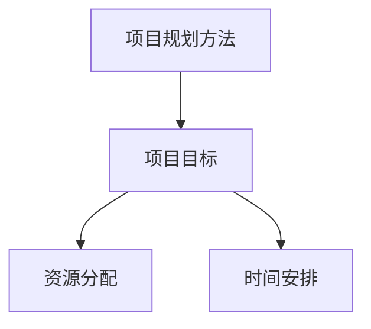

##### 8.2 项目风险管理

项目风险是AI创业过程中不可避免的问题，需要提前识别和评估风险，并制定应对策略。

**核心概念与联系**

- **风险识别**：识别项目可能面临的风险。
- **风险评估**：评估风险的可能性和影响。
- **风险应对**：制定应对策略。

**Mermaid流程图**

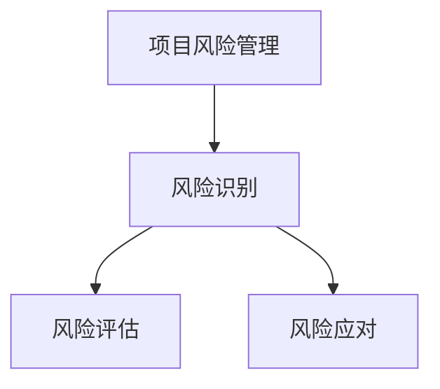

##### 8.3 项目进度管理

项目进度管理是确保项目按计划进行的重要环节，需要监控项目进度、调整计划等。

**核心概念与联系**

- **进度监控**：监控项目进度。
- **计划调整**：根据实际情况调整计划。

**Mermaid流程图**

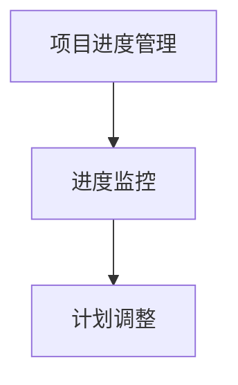

#### 第9章：AI创业项目开发

##### 9.1 环境搭建与工具选择

环境搭建是AI创业项目开发的起点，需要选择合适的开发工具和环境。

**核心概念与联系**

- **开发工具**：如IDE、版本控制工具等。
- **开发环境**：如Python、Jupyter Notebook等。

**Mermaid流程图**

```mermaid
graph TD
    A[环境搭建与工具选择] --> B[开发工具]
    B --> C[版本控制工具]
    A --> D[开发环境]
    D --> E[Python]
    D --> F[Jupyter Notebook]
```

##### 9.2 数据预处理与模型训练

数据预处理是AI创业项目开发的关键步骤，需要处理数据质量、数据清洗、数据归一化等问题。模型训练则是通过数据训练模型，使其具备预测或分类能力。

**核心概念与联系**

- **数据预处理**：数据质量、数据清洗、数据归一化等。
- **模型训练**：数据训练、模型优化等。

**Mermaid流程图**

```mermaid
graph TD
    A[数据预处理与模型训练] --> B[数据预处理]
    B --> C[数据质量]
    B --> D[数据清洗]
    B --> E[数据归一化]
    A --> F[模型训练]
    F --> G[数据训练]
    F --> H[模型优化]
```

##### 9.3 模型评估与优化

模型评估是验证模型性能的重要环节，需要使用各种评估指标对模型进行评估。模型优化则是通过调整模型参数或算法，提高模型性能。

**核心概念与联系**

- **模型评估**：评估指标、评估方法等。
- **模型优化**：参数调整、算法改进等。

**Mermaid流程图**

```mermaid
graph TD
    A[模型评估与优化] --> B[模型评估]
    B --> C[评估指标]
    B --> D[评估方法]
    A --> E[模型优化]
    E --> F[参数调整]
    E --> G[算法改进]
```

#### 第10章：AI创业产品发布与推广

##### 10.1 产品发布策略

产品发布是AI创业项目的关键步骤，需要制定合适的发布策略，如选择合适的时间、渠道等。

**核心概念与联系**

- **发布时间**：选择最佳发布时间。
- **发布渠道**：选择合适的发布渠道。

**Mermaid流程图**

```mermaid
graph TD
    A[产品发布策略] --> B[发布时间]
    B --> C[最佳发布时间]
    A --> D[发布渠道]
    D --> E[合适渠道]
```

##### 10.2 市场推广方法

市场推广是提高产品知名度、吸引潜在用户的重要手段。常用的市场推广方法包括广告宣传、社交媒体推广、内容营销等。

**核心概念与联系**

- **广告宣传**：通过广告渠道推广产品。
- **社交媒体推广**：利用社交媒体平台推广产品。
- **内容营销**：通过内容创造和传播推广产品。

**Mermaid流程图**

```mermaid
graph TD
    A[市场推广方法] --> B[广告宣传]
    B --> C[广告渠道]
    A --> D[社交媒体推广]
    D --> E[社交媒体平台]
    A --> F[内容营销]
    F --> G[内容创造与传播]
```

##### 10.3 用户反馈与产品迭代

用户反馈是产品迭代的重要依据，通过收集和分析用户反馈，可以不断优化产品，提升用户体验。

**核心概念与联系**

- **用户反馈**：收集用户对产品的评价和意见。
- **产品迭代**：根据用户反馈对产品进行改进。

**Mermaid流程图**

```mermaid
graph TD
    A[用户反馈与产品迭代] --> B[用户反馈]
    B --> C[用户评价与意见]
    A --> D[产品迭代]
    D --> E[产品改进]
```

### 附录

#### 附录A：AI创业常用资源

##### A.1 开源框架与工具

- **TensorFlow**：谷歌开发的开源机器学习框架。
- **PyTorch**：Facebook开发的开源机器学习框架。
- **Scikit-learn**：开源的Python机器学习库。

##### A.2 数据集与案例

- **Kaggle**：提供各种数据集和AI竞赛。
- **UCI Machine Learning Repository**：提供各种经典数据集。
- **AI Challenger**：提供丰富的AI比赛和案例。

##### A.3 学术论文与报告

- **NeurIPS**：人工智能领域的顶级会议。
- **ICML**：机器学习领域的顶级会议。
- **JMLR**：机器学习领域的顶级期刊。

#### 附录B：AI创业指南

##### B.1 创业流程与步骤

1. 市场调研
2. 团队建设
3. 技术选型
4. 项目开发
5. 产品发布
6. 市场推广
7. 用户反馈与产品迭代

##### B.2 创业策略与建议

- **聚焦细分市场**：找到具有潜力的细分市场。
- **技术创新**：持续投入技术创新，保持竞争力。
- **合作共赢**：与其他企业或机构建立合作关系。

##### B.3 创业经验分享与教训

- **快速迭代**：不断优化产品，提高用户满意度。
- **风险控制**：提前识别和评估风险，制定应对策略。
- **团队协作**：加强团队协作，提高工作效率。

### 作者

**作者**：AI天才研究院/AI Genius Institute & 禅与计算机程序设计艺术 /Zen And The Art of Computer Programming

本文旨在为AI创业者提供一份全面的技术指导，希望读者能够在阅读后有所收获，并在AI创业的道路上取得成功。

