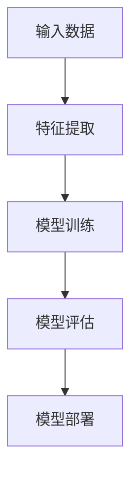

                 

### 文章标题

**《AI创业：设计推广策略》**

在当今技术迅猛发展的时代，人工智能（AI）已经成为各行各业转型升级的核心驱动力。随着AI技术的不断成熟和应用领域的拓展，越来越多的创业者和投资者开始关注并投身于AI创业的浪潮中。本文将围绕AI创业的主题，系统地探讨如何设计有效的推广策略，助力AI企业快速成长。

### 文章关键词

- **AI创业**
- **推广策略**
- **市场定位**
- **品牌建设**
- **内容营销**
- **数据驱动**

### 文章摘要

本文旨在为AI创业者提供一套全面的推广策略框架，帮助他们在竞争激烈的市场中脱颖而出。首先，我们将回顾AI创业的背景和前景，分析其优势与挑战。随后，本文将深入探讨AI产品的设计、开发、性能优化等核心环节。在此基础上，本文将重点介绍如何进行AI产品的市场定位与品牌建设，以及实施有效的营销策略。此外，本文还将分享AI创业团队管理的最佳实践，并通过对成功案例的分析，为读者提供有价值的启示和建议。最后，我们将探讨AI创业的未来发展趋势，为创业者们指明方向。

# 《AI创业：设计推广策略》目录大纲

## 第一部分：AI创业基础

### 第1章：AI创业概述

#### 1.1 AI创业的历史背景
在20世纪50年代，人工智能（AI）的概念首次被提出。此后，AI技术经历了数十年的理论探索和实验验证。进入21世纪，随着计算能力的提升和大数据的普及，AI技术逐渐从实验室走向实际应用，开启了AI创业的新纪元。

#### 1.2 AI创业的优势与挑战
AI创业具有以下优势：技术革新潜力巨大，市场空间广阔，投资回报率高。然而，AI创业也面临诸多挑战，如技术门槛高、数据隐私问题、市场竞争激烈等。

#### 1.3 AI创业的分类与方向
AI创业可以分为三大类：基于算法创新的公司，如机器学习和深度学习服务提供商；基于应用场景的公司，如智能机器人、自动驾驶等；以及基于数据资源的企业，如数据挖掘和数据分析公司。AI创业方向包括但不限于医疗健康、金融、交通、教育等领域。

## 第二部分：AI产品设计与开发

### 第2章：AI产品设计与开发流程

#### 2.1 需求分析与市场调研
在AI产品开发之前，需求分析和市场调研是至关重要的一步。创业者需要深入了解市场需求，确定产品的核心功能和目标用户。

#### 2.2 AI算法模型选择与设计
选择合适的AI算法模型是AI产品开发的关键。常见的AI算法模型包括机器学习、深度学习和强化学习。创业者需要根据业务需求和数据特点选择合适的模型，并设计算法架构。

#### 2.3 AI产品原型设计与开发
在确定算法模型后，创业者可以开始进行产品原型设计。产品原型设计包括界面设计、用户体验和功能模块等。原型设计完成后，进入开发阶段，实现产品的核心功能和功能模块。

### 第3章：AI算法模型原理与实现

#### 3.1 机器学习基础算法
机器学习是AI的核心技术之一。基础算法包括线性回归、逻辑回归、支持向量机等。创业者需要了解这些算法的原理和实现方法，以便在产品开发中进行应用。

#### 3.2 深度学习算法原理
深度学习是当前AI领域的重要研究方向。主要算法包括卷积神经网络（CNN）、循环神经网络（RNN）和生成对抗网络（GAN）等。创业者需要掌握深度学习算法的基本原理，以便进行高级应用。

#### 3.3 强化学习算法应用
强化学习是一种通过奖励机制进行决策的AI算法。主要应用领域包括游戏、自动驾驶和推荐系统等。创业者需要了解强化学习算法的基本原理和应用场景。

### 第4章：AI产品性能优化

#### 5.1 数据预处理与清洗
数据预处理与清洗是AI产品性能优化的关键步骤。创业者需要了解如何处理缺失数据、异常数据和噪声数据，以提高模型的鲁棒性和准确性。

#### 5.2 模型调优与超参数选择
模型调优与超参数选择是提高AI产品性能的重要手段。创业者需要了解如何选择合适的超参数，并通过交叉验证等方法进行模型调优。

#### 5.3 模型性能评估与优化策略
创业者需要了解如何评估AI产品的性能，并采取相应的优化策略，如正则化、降维、特征工程等。通过持续的性能优化，提高产品的市场竞争力和用户体验。

## 第三部分：AI创业推广策略

### 第6章：AI产品市场定位与品牌建设

#### 6.1 市场定位策略
市场定位是AI产品推广的重要一步。创业者需要根据产品的特点和目标市场，制定合适的市场定位策略，明确产品的差异化竞争优势。

#### 6.2 品牌建设与传播
品牌建设是AI产品长期发展的重要基石。创业者需要通过一系列的品牌建设活动，提升产品的品牌知名度和美誉度。包括品牌名称、标志设计、宣传口号等。

#### 6.3 社交媒体推广策略
社交媒体是AI产品推广的重要渠道。创业者需要利用社交媒体平台，开展有针对性的推广活动，吸引潜在用户并提升产品的市场影响力。

### 第7章：AI产品营销策略

#### 7.1 营销目标与策略制定
制定明确的营销目标是AI产品推广的基础。创业者需要根据市场定位和品牌建设，制定符合实际的营销目标，并制定相应的营销策略。

#### 7.2 内容营销与用户参与
内容营销是AI产品推广的重要手段。创业者需要通过高质量的内容，吸引潜在用户并提高用户参与度。包括博客文章、视频、社交媒体分享等。

#### 7.3 数据驱动的营销优化
数据驱动是现代营销的核心。创业者需要利用数据分析工具，对营销活动进行实时监测和优化，提高营销效果和投资回报率。

### 第8章：AI创业团队管理

#### 8.1 团队管理挑战与应对
AI创业团队面临诸多管理挑战，如团队协作、项目管理、进度跟踪等。创业者需要了解这些挑战，并采取有效的应对策略。

#### 8.2 项目管理与进度跟踪
有效的项目管理和进度跟踪是确保AI产品按时交付的关键。创业者需要掌握项目管理工具和方法，确保项目进度和质量。

#### 8.3 团队沟通与协作工具
团队沟通与协作是团队高效运作的重要保障。创业者需要选择合适的团队沟通与协作工具，提高团队协作效率和项目成功率。

## 第四部分：AI创业成功案例与启示

### 第9章：成功AI创业案例分析

#### 9.1 AI创业公司的成功要素
通过对成功AI创业公司的分析，我们可以总结出成功要素，如技术创新、市场定位、团队建设等。

#### 9.2 AI创业公司的成长路径
成功AI创业公司通常经历从初创到成长、成熟的过程。创业者可以借鉴这些成长路径，制定适合自己的发展策略。

#### 9.3 AI创业公司的可持续发展策略
可持续发展是AI创业公司长期发展的关键。创业者需要关注技术创新、市场拓展、人才培养等方面，确保企业的可持续发展。

### 第10章：AI创业的启示与建议

#### 10.1 AI创业的误区与风险
创业者需要避免AI创业的常见误区，如盲目跟风、忽视市场需求等。同时，要充分认识AI创业的风险，并采取有效的风险控制措施。

#### 10.2 创新与创业的结合
创新是AI创业的核心驱动力。创业者需要将创新与创业相结合，不断探索新的应用场景和技术解决方案。

#### 10.3 AI创业的未来发展趋势
随着AI技术的不断进步，AI创业将迎来更多的发展机遇。创业者需要关注AI技术的最新动态，把握未来发展趋势，提前布局。

## 附录

### 附录A：AI创业工具与资源

#### A.1 AI开发工具推荐
创业者需要掌握一系列AI开发工具，如Python、TensorFlow、PyTorch等。这些工具可以帮助创业者快速搭建AI模型并进行实验。

#### A.2 数据集与API资源
丰富的数据集和API资源是AI创业的重要基础。创业者可以通过在线平台和开源项目获取高质量的数据集和API接口。

#### A.3 AI创业社区与论坛
AI创业社区和论坛是创业者交流学习的平台。创业者可以通过这些平台获取行业动态、技术分享和资源推荐。

## 第1章：AI创业背景与前景

#### 1.1 AI技术的发展历程

人工智能（AI）的概念最早可以追溯到20世纪50年代，当时计算机科学家艾伦·图灵（Alan Turing）提出了图灵测试，旨在评估机器是否能够表现出与人类相似的智能行为。此后，AI技术经历了多个发展阶段，从符号主义、连接主义到统计学习，再到当前的深度学习和强化学习，AI技术的应用范围越来越广泛。

在早期，AI研究主要集中在规则系统和符号逻辑上。这一阶段的代表是专家系统（Expert Systems），它们通过定义一系列规则来模拟人类专家的决策过程。然而，这种基于知识的方法在处理复杂问题时表现出明显的局限性。

随着计算能力的提升和大数据的普及，AI技术进入了连接主义阶段。这一阶段的代表是人工神经网络（Artificial Neural Networks），通过模拟人脑的神经元连接，实现数据的自动学习和特征提取。1997年，IBM的深蓝（Deep Blue）击败了国际象棋世界冠军加里·卡斯帕罗夫（Garry Kasparov），标志着AI技术取得了重要突破。

21世纪初，随着计算能力的进一步提升和深度学习算法的提出，AI技术进入了深度学习阶段。深度学习通过多层神经网络进行特征学习和模式识别，显著提高了图像识别、语音识别和自然语言处理等领域的性能。2012年，Google的神经机器翻译系统（Neural Machine Translation）在机器翻译任务中取得了显著优势，标志着深度学习在自然语言处理领域的应用取得了重大突破。

近年来，强化学习（Reinforcement Learning）作为AI领域的重要研究方向，取得了显著进展。强化学习通过智能体与环境的交互，不断学习并优化决策策略，已在游戏、自动驾驶和机器人等领域得到了广泛应用。

#### 1.2 AI创业的优势与挑战

AI创业具有以下几个显著优势：

1. **技术革新潜力巨大**：AI技术具有广泛的应用前景，从医疗健康、金融、交通、教育到制造业、农业等多个领域，AI技术的应用能够带来深刻的变革。

2. **市场空间广阔**：随着全球数字化进程的加速，企业对于AI技术的需求日益增加。AI创业企业有机会在庞大的市场中占据一席之地。

3. **投资回报率高**：AI创业项目通常具有较高的投资回报率。一些成功的AI创业公司，如Google、Amazon和Facebook等，已经成为全球科技巨头。

然而，AI创业也面临着一系列挑战：

1. **技术门槛高**：AI技术涉及大量的算法、数据结构和机器学习模型，对于创业者的技术能力和经验要求较高。

2. **数据隐私问题**：AI应用需要大量用户数据，如何保护用户隐私是AI创业公司必须面对的问题。

3. **市场竞争激烈**：随着越来越多的企业进入AI领域，市场竞争日益激烈，创业者需要不断创新，才能在市场中脱颖而出。

#### 1.3 AI创业的分类与方向

AI创业可以根据技术方向和应用场景进行分类，以下是几种常见的AI创业类型：

1. **基于算法创新的公司**：这类公司专注于机器学习、深度学习、强化学习等算法的创新，提供高性能的AI模型和解决方案。如提供机器学习服务的企业、深度学习算法研发公司等。

2. **基于应用场景的公司**：这类公司围绕特定的应用场景，如智能机器人、自动驾驶、智能安防等，开发具体的AI产品。例如，专注于智能机器人的研发公司、自动驾驶技术提供商等。

3. **基于数据资源的企业**：这类公司利用大量数据资源，进行数据挖掘、分析和处理，提供数据驱动的决策支持。如数据挖掘公司、大数据分析企业等。

AI创业的方向非常广泛，包括但不限于医疗健康、金融、交通、教育、制造业、农业等领域。以下是对这些领域的简要介绍：

1. **医疗健康**：AI在医疗健康领域的应用前景广阔，包括疾病诊断、药物研发、手术规划、患者管理等方面。AI创业公司可以专注于医学图像分析、疾病预测、个性化治疗等方向。

2. **金融**：AI技术在金融领域具有广泛的应用，如智能投顾、风险控制、信用评估、欺诈检测等。金融AI创业公司可以围绕算法模型、数据分析和决策支持系统展开。

3. **交通**：自动驾驶、智能交通管理、无人机物流等是交通领域的AI应用热点。交通AI创业公司可以专注于自动驾驶算法、车联网技术、智能交通系统等方向。

4. **教育**：AI技术在教育领域的应用包括在线教育、智能辅导、学习分析等。教育AI创业公司可以提供个性化学习平台、智能辅导系统、学习数据分析工具等。

5. **制造业**：AI技术在制造业中的应用包括生产优化、质量检测、设备维护等。制造业AI创业公司可以专注于智能生产系统、机器视觉检测、预测性维护等方向。

6. **农业**：AI技术在农业领域的应用包括精准农业、作物监测、病虫害防治等。农业AI创业公司可以提供农业数据分析和处理平台、智能监测设备、病虫害防治系统等。

总之，AI创业具有巨大的发展潜力和广阔的市场空间。创业者需要根据自身的技术优势和市场定位，选择合适的应用领域，不断探索创新，实现企业的快速发展。

## 第2章：AI创业生态系统

### 2.1 AI创业公司的发展阶段

AI创业公司的发展阶段可以分为初创期、成长期、成熟期和扩展期。每个阶段都有其独特的特点和挑战，以下是对这些阶段的详细描述：

#### 初创期

初创期是AI创业公司的起步阶段，这一阶段的主要目标是组建团队、确定发展方向和验证技术原型。在这一阶段，创业者需要解决以下关键问题：

1. **团队建设**：初创期需要找到志同道合的团队成员，包括技术专家、产品经理、市场营销人员等。团队成员的能力和协作效率对于公司的成功至关重要。

2. **技术原型**：验证技术原型是初创期的核心任务。创业者需要开发出能够展示技术价值的原型，吸引潜在投资者和合作伙伴。

3. **市场调研**：进行市场调研，了解目标市场的需求、竞争态势和潜在客户。这有助于创业者确定产品的市场定位和商业模式。

4. **资金筹集**：初创期通常需要外部资金支持。创业者可以通过天使投资、风险投资、政府资助等途径筹集资金，为后续发展奠定基础。

#### 成长期

成长期是AI创业公司发展的关键阶段，这一阶段的主要目标是扩大市场份额、增加收入和提升品牌知名度。以下是成长期需要关注的关键问题：

1. **产品开发**：在成长期，创业者需要持续进行产品开发，增加产品的功能和性能，以满足市场需求。

2. **市场拓展**：通过市场拓展，将产品推广到新的地区和行业。创业者需要制定有针对性的市场策略，提高产品的市场占有率。

3. **资金筹集**：在成长期，创业者可能需要多次筹集资金，以支持公司的快速扩张。这通常需要更加完善的商业计划和市场表现数据。

4. **团队扩张**：随着公司的增长，需要招聘更多的员工，包括技术、销售、市场、运营等各个方面的人才。

#### 成熟期

成熟期是AI创业公司稳定发展的阶段，这一阶段的主要目标是实现规模化盈利、持续创新和提升企业的核心竞争力。以下是成熟期需要关注的关键问题：

1. **盈利模式**：建立稳定的盈利模式，确保公司能够持续盈利。这通常包括提高产品的销售量、降低成本和提升服务价值。

2. **品牌建设**：通过一系列的品牌建设和市场营销活动，提升公司的品牌知名度和美誉度。

3. **技术创新**：持续进行技术创新，保持产品的前沿性，以应对激烈的市场竞争。

4. **市场占有率**：巩固和提升公司的市场占有率，确保在竞争中的优势地位。

#### 扩展期

扩展期是AI创业公司进一步扩张和多元化的阶段，这一阶段的主要目标是实现业务扩展、国际化发展和并购整合。以下是扩展期需要关注的关键问题：

1. **业务扩展**：通过并购、合作和内部扩张，将业务拓展到新的领域和市场。

2. **国际化发展**：通过进入国际市场，提升公司的全球影响力。这需要了解不同国家和地区的市场特点、法规和文化。

3. **并购整合**：通过并购其他公司，整合资源，实现业务的快速扩张。

4. **风险控制**：在扩展期，公司面临的风险相对较高，需要建立有效的风险控制机制，确保业务的稳定发展。

### 2.2 AI创业公司的融资策略

融资是AI创业公司发展的重要环节，以下是一些常见的融资策略和途径：

1. **天使投资**：天使投资是创业公司早期的资金来源，通常由个人投资者提供。天使投资的特点是投资额度较小，但可以提供宝贵的创业经验和资源。

2. **风险投资**：风险投资是创业公司在中后期的主要融资途径。风险投资机构通常投资额度较大，且具备丰富的行业经验和资源网络。

3. **政府资助**：许多国家和地区政府都提供了针对科技创业公司的资助计划，包括资金支持、税收优惠和科技创新基金等。

4. **银行贷款**：银行贷款是一种较为传统的融资方式，适用于资金需求较大的项目。但银行贷款通常对创业公司的信用记录和还款能力有较高要求。

5. **股权众筹**：股权众筹是一种通过互联网平台向公众筹集资金的方式。这种方式可以迅速筹集大量资金，但也会稀释创始人的股权。

6. **债务融资**：债务融资包括企业债券、可转换债券等。债务融资的特点是偿还压力较大，但创业者无需放弃股权。

7. **风险投资合伙人**：与风险投资合伙人合作，可以借助他们的经验和资源，提高公司的融资效率和成功率。

### 2.3 AI创业公司的团队建设

团队建设是AI创业公司成功的关键因素之一。以下是一些团队建设的最佳实践：

1. **明确团队目标**：确保团队成员都清楚公司的目标和愿景，这样可以增强团队的凝聚力和工作效率。

2. **多样化的技能组合**：组建一个具有多样化技能和背景的团队，可以确保公司在不同领域都有强大的竞争力。

3. **有效的沟通机制**：建立开放的沟通机制，鼓励团队成员之间的交流和合作，提高团队的协作效率。

4. **定期培训和知识分享**：为团队成员提供定期的培训和学习机会，确保团队始终掌握最新的技术和管理知识。

5. **激励机制**：建立合理的激励机制，包括薪酬、福利和股权激励等，激励团队成员为实现公司目标而努力。

6. **团队文化建设**：打造积极向上的团队文化，鼓励创新、包容和合作，提升团队的整体凝聚力。

7. **员工福利**：提供良好的工作环境和员工福利，包括健康保险、休假制度、培训机会等，以提高员工的工作满意度和忠诚度。

8. **员工反馈机制**：建立员工反馈机制，鼓励员工提出意见和建议，及时解决团队中的问题和矛盾。

通过以上团队建设实践，AI创业公司可以打造一个高效、团结、富有创新力的团队，为公司的快速发展提供坚实的保障。

## 第3章：AI产品设计与开发流程

### 3.1 需求分析与市场调研

在AI产品的设计与开发过程中，需求分析是关键的第一步。它涉及对用户需求、市场趋势和竞争环境进行深入调研，以确保产品能够满足市场需求并具有竞争力。

#### 用户需求分析

用户需求分析的核心是理解目标用户的需求、痛点和期望。以下是进行用户需求分析的方法：

1. **问卷调查**：通过设计问卷，收集大量用户的反馈，了解他们的使用习惯、偏好和痛点。

2. **用户访谈**：与目标用户进行一对一访谈，深入了解他们的需求和使用场景。

3. **用户行为分析**：通过分析用户的行为数据，如点击率、浏览路径、操作时长等，识别用户的行为模式。

4. **焦点小组**：组织一组用户，进行集中讨论，收集他们对产品的意见和建议。

#### 市场趋势分析

市场趋势分析旨在了解当前市场的发展动态和未来趋势，为产品设计和开发提供方向。以下是一些市场趋势分析的方法：

1. **行业报告**：查阅相关行业报告，了解市场增长率、市场份额、技术发展现状等。

2. **竞争对手分析**：研究竞争对手的产品、市场策略和用户反馈，识别市场机会和风险。

3. **技术动态**：关注AI领域的最新研究进展和技术创新，预测未来技术趋势。

4. **用户调研**：通过用户调研，了解用户对现有产品的看法，识别市场的潜在需求和趋势。

#### 竞争环境分析

竞争环境分析是确保产品在市场上具有竞争力的重要环节。以下是一些竞争环境分析的方法：

1. **SWOT分析**：对自身产品的优势（Strengths）、劣势（Weaknesses）、机会（Opportunities）和威胁（Threats）进行综合分析。

2. **五力模型**：利用五力模型（供应商、买家、潜在竞争者、替代品和行业竞争者）分析市场竞争格局。

3. **市场份额**：通过市场调研，了解公司在目标市场中的市场份额和排名。

4. **用户反馈**：通过用户反馈，识别产品的优点和不足，与竞争对手进行对比。

通过以上需求分析、市场趋势分析和竞争环境分析，创业者可以明确产品的核心功能和目标用户，为后续的产品设计和开发提供坚实基础。

### 3.2 AI算法模型选择与设计

在AI产品的设计与开发过程中，选择合适的算法模型是至关重要的一步。以下是如何选择和设计AI算法模型的详细说明：

#### 1. 确定应用场景

首先，创业者需要明确产品的应用场景和目标任务。不同的应用场景和任务可能需要不同的算法模型。例如：

- **图像识别**：适用于卷积神经网络（CNN）
- **自然语言处理**：适用于循环神经网络（RNN）或Transformer模型
- **推荐系统**：适用于协同过滤或基于模型的推荐算法

#### 2. 数据特点分析

了解数据的特点对于选择合适的算法模型也非常重要。以下是一些关键的数据特点：

- **数据量**：大量数据可能更适合使用深度学习算法，而小数据集可能更适合传统的机器学习算法。
- **数据分布**：数据分布对于算法的性能有很大影响。例如，数据分布不均衡可能需要使用重采样技术或调整模型结构。
- **数据类型**：数据类型（如文本、图像、时间序列等）会影响算法的选择。例如，文本数据通常使用词嵌入和RNN处理，图像数据则使用CNN处理。

#### 3. 算法性能评估

在选择算法模型时，需要考虑其性能和效率。以下是一些常用的算法性能评估指标：

- **准确率（Accuracy）**：衡量模型预测正确的比例。
- **召回率（Recall）**：衡量模型能够召回真实正例的比例。
- **精确率（Precision）**：衡量模型预测为正例的样本中实际为正例的比例。
- **F1分数（F1 Score）**：综合考虑精确率和召回率的综合指标。

#### 4. 算法模型设计

在确定了应用场景、数据特点和性能指标后，创业者可以开始设计AI算法模型。以下是一些常见的AI算法模型设计方法：

- **单层神经网络**：适用于简单的数据处理任务。
- **多层神经网络**：适用于复杂的数据处理任务，如图像识别和自然语言处理。
- **卷积神经网络（CNN）**：适用于图像和视频处理任务。
- **循环神经网络（RNN）**：适用于序列数据处理任务，如文本和语音识别。
- **生成对抗网络（GAN）**：适用于生成复杂数据，如图像和音频。
- **强化学习模型**：适用于决策和优化任务，如游戏和自动驾驶。

在设计算法模型时，创业者还需要考虑以下因素：

- **模型结构**：确定网络层数、神经元数量和连接方式。
- **激活函数**：选择合适的激活函数，如ReLU、Sigmoid、Tanh等。
- **优化器**：选择合适的优化算法，如梯度下降、Adam等。
- **损失函数**：选择合适的损失函数，以衡量模型预测与实际值之间的差距。

通过以上步骤，创业者可以设计和实现一个适合特定应用场景的AI算法模型，为AI产品的成功开发奠定基础。

### 3.3 AI产品原型设计与开发

在完成需求分析和算法模型设计后，AI产品原型的设计与开发是产品开发过程中的关键环节。以下是如何进行AI产品原型设计与开发的详细步骤：

#### 1. 产品设计

产品设计的核心是确定产品的功能和用户界面。以下是一些产品设计的关键步骤：

- **功能规划**：根据需求分析的结果，列出产品的核心功能。这些功能应该满足用户的基本需求和痛点。
- **用户界面设计**：设计直观、易用的用户界面。用户界面应该清晰、简洁，以提高用户体验。
- **交互设计**：设计产品的交互流程，确保用户能够轻松地完成操作。

#### 2. 原型开发

原型开发是创建产品功能模型的过程。以下是一些原型开发的步骤：

- **低 fidelity原型**：使用简单的工具（如纸笔、原型设计软件等）创建初步的原型。这一阶段的重点是验证核心功能。
- **高 fidelity原型**：在初步原型的基础上，创建更详细的原型，包括视觉效果和交互细节。这一阶段的重点是提升用户体验。
- **用户测试**：进行用户测试，收集用户的反馈，以改进产品原型。

#### 3. 技术实现

技术实现是将原型转化为可运行产品的过程。以下是一些技术实现的步骤：

- **后端开发**：实现产品后端功能，如数据处理、算法运算和数据库管理等。常用的技术包括Python、Java、Node.js等。
- **前端开发**：实现用户界面和交互功能，如HTML、CSS、JavaScript等。常用的框架包括React、Vue.js、Angular等。
- **算法实现**：根据算法模型的设计，实现AI算法的功能。常用的库和框架包括TensorFlow、PyTorch、Scikit-learn等。

#### 4. 测试与优化

测试与优化是确保产品质量和性能的重要环节。以下是一些测试与优化的步骤：

- **功能测试**：验证产品的功能是否符合设计要求。常用的方法包括黑盒测试、白盒测试等。
- **性能测试**：评估产品的性能指标，如响应时间、吞吐量、并发处理能力等。常用的工具包括JMeter、LoadRunner等。
- **用户体验测试**：评估产品的用户体验，包括易用性、界面设计、交互流程等。常用的方法包括用户访谈、问卷调查、A/B测试等。
- **优化**：根据测试结果，对产品进行优化，包括算法调优、代码优化、界面优化等。

通过以上步骤，创业者可以设计和开发出一个功能完善、性能优秀的AI产品原型，为后续的产品发布和推广奠定基础。

### 3.4 AI产品原型测试与反馈

在完成AI产品原型的设计与开发后，测试与反馈是确保产品质量和用户满意度的重要环节。以下是如何进行AI产品原型测试与反馈的详细步骤：

#### 1. 功能测试

功能测试是验证产品功能是否符合设计要求的关键步骤。以下是一些功能测试的方法：

- **黑盒测试**：从用户的角度出发，测试产品的功能是否正常运行。例如，输入特定的数据，检查输出结果是否正确。
- **白盒测试**：测试产品的内部逻辑和代码结构，确保代码的健壮性和可维护性。例如，检查算法模型的运算过程是否符合预期。
- **自动化测试**：使用自动化测试工具，如Selenium、JUnit等，对产品功能进行自动化测试，提高测试效率和覆盖范围。

#### 2. 性能测试

性能测试是评估产品性能指标，如响应时间、吞吐量、并发处理能力等。以下是一些性能测试的方法：

- **负载测试**：模拟高负载环境，测试产品在高并发情况下的性能。常用的工具包括JMeter、LoadRunner等。
- **压力测试**：模拟极端负载情况，测试产品的稳定性和可靠性。例如，测试产品在处理大量数据时的表现。
- **基准测试**：使用标准测试数据，对产品的性能进行定量评估。例如，比较不同算法模型的计算速度和准确率。

#### 3. 用户反馈

用户反馈是改进产品的重要依据。以下是一些收集用户反馈的方法：

- **用户访谈**：与目标用户进行一对一访谈，深入了解他们的使用体验和建议。可以采用面对面访谈或远程视频会议。
- **问卷调查**：设计问卷调查，收集大量用户的反馈。可以通过在线平台或电子邮件发送问卷。
- **用户行为分析**：分析用户在产品上的行为数据，如点击率、操作路径、反馈信息等。可以借助数据分析工具进行行为分析。
- **用户测试**：组织用户进行测试，观察他们在实际操作中的表现，并收集他们的反馈。可以通过现场测试或远程测试进行。

#### 4. 反馈处理

在收集到用户反馈后，需要对其进行处理和改进。以下是一些反馈处理的步骤：

- **分类整理**：将用户反馈进行分类整理，识别出高频问题和用户关注点。
- **优先级排序**：根据反馈的重要性和紧急程度，对反馈进行优先级排序。对于高频问题和严重问题，应优先处理。
- **解决方案制定**：针对反馈问题，制定相应的解决方案。可以包括功能优化、界面调整、算法改进等。
- **实施与验证**：实施解决方案，并在实际环境中进行验证。确保问题得到有效解决，并提高产品的质量和用户满意度。

通过以上步骤，创业者可以不断优化AI产品原型，提高产品的质量和用户满意度，为后续的产品发布和推广奠定基础。

### 3.5 AI产品原型设计与开发的常见挑战与解决方案

在AI产品原型设计与开发过程中，创业者常常会遇到各种挑战。以下是一些常见的挑战以及相应的解决方案：

#### 挑战1：技术复杂性

**问题**：AI技术的复杂性导致设计和开发过程中遇到很多技术难题，如算法选择、模型优化等。

**解决方案**：

1. **团队建设**：组建一支经验丰富的AI团队，包括机器学习专家、数据科学家、软件工程师等。
2. **技术调研**：在项目初期进行充分的技术调研，了解最新的技术动态和解决方案。
3. **模块化设计**：将复杂的任务分解为多个模块，逐步实现和优化。

#### 挑战2：数据不足

**问题**：AI项目往往依赖于大量数据，但数据获取和标注成本较高。

**解决方案**：

1. **公开数据集**：利用公开的数据集进行初步模型训练。
2. **数据挖掘**：从已有数据中挖掘有价值的信息，用于模型训练。
3. **数据共享**：与其他企业和研究机构合作，共享数据资源。

#### 挑战3：模型过拟合

**问题**：模型训练过程中，数据不足或数据分布不均可能导致模型过拟合。

**解决方案**：

1. **正则化**：使用正则化方法，如L1、L2正则化，防止模型过拟合。
2. **交叉验证**：使用交叉验证方法，评估模型的泛化能力。
3. **数据增强**：通过数据增强方法，如图像旋转、缩放等，增加数据的多样性。

#### 挑战4：性能优化

**问题**：AI产品在实际应用中，性能可能无法满足用户需求。

**解决方案**：

1. **模型调优**：通过调整模型参数、优化算法结构等方法，提高模型性能。
2. **分布式计算**：使用分布式计算框架，如TensorFlow、PyTorch等，提高训练和推理效率。
3. **硬件加速**：使用GPU、TPU等硬件加速器，提高计算性能。

#### 挑战5：用户反馈不足

**问题**：缺乏有效的用户反馈，导致产品无法满足用户需求。

**解决方案**：

1. **用户测试**：在产品开发过程中，定期进行用户测试，收集用户反馈。
2. **A/B测试**：通过A/B测试，比较不同设计的用户体验和性能。
3. **用户调研**：定期进行用户调研，了解用户的期望和需求。

通过以上解决方案，创业者可以应对AI产品原型设计与开发中的常见挑战，提高产品的质量和市场竞争力。

### 3.6 AI产品原型设计与开发的最佳实践

在AI产品原型设计与开发过程中，遵循最佳实践可以提高开发效率、降低风险，并最终提高产品的成功几率。以下是一些AI产品原型设计与开发的最佳实践：

#### 1. 需求驱动

始终以用户需求为中心，确保产品功能和设计满足用户实际需求。通过用户调研、需求分析等方法，全面了解用户需求和痛点，确保产品的实用性和市场竞争力。

#### 2. 快速迭代

采用敏捷开发方法，进行快速迭代。通过持续交付、频繁的用户测试和反馈，及时调整产品设计和功能，确保产品始终保持市场竞争力。

#### 3. 模块化设计

采用模块化设计方法，将复杂系统分解为多个模块，每个模块独立开发和测试。这不仅提高了开发效率，还有助于后续的维护和扩展。

#### 4. 数据驱动

利用数据驱动的方法进行产品设计和优化。通过数据分析和挖掘，了解用户行为和偏好，优化产品功能和用户体验。

#### 5. 性能优化

关注产品性能优化，确保产品在多种环境下的稳定性和高效性。通过性能测试、调优和硬件加速等技术手段，提高产品的性能和用户体验。

#### 6. 安全性保障

确保产品的安全性，包括数据安全、网络安全和用户隐私保护。采用加密技术、安全协议和安全测试等方法，确保产品安全可靠。

#### 7. 团队协作

建立高效的团队协作机制，确保团队成员之间的沟通和协作。通过定期的会议、文档共享和代码审查等方法，提高团队协作效率。

通过遵循以上最佳实践，创业者可以有效地设计和开发出高质量的AI产品原型，提高产品的市场竞争力。

## 第4章：AI算法模型原理与实现

### 4.1 机器学习基础算法

机器学习（Machine Learning，ML）是人工智能（AI）的核心技术之一，它使计算机系统能够从数据中自动学习，并做出决策或预测。以下是一些常用的机器学习基础算法及其原理：

#### 1. 线性回归

线性回归（Linear Regression）是一种用于预测数值型变量的机器学习算法。其基本原理是通过找到数据点与拟合直线之间的关系，从而预测新的数据点的值。

- **公式**：\( y = \beta_0 + \beta_1 \cdot x + \epsilon \)
- **实现**：使用梯度下降算法优化参数 \(\beta_0\) 和 \(\beta_1\)，使得拟合直线的均方误差最小。

#### 2. 逻辑回归

逻辑回归（Logistic Regression）是一种用于分类问题的机器学习算法，主要用于二分类问题。其基本原理是通过逻辑函数（Sigmoid函数）将线性模型映射到概率空间。

- **公式**：\( \pi(x) = \frac{1}{1 + e^{-(\beta_0 + \beta_1 \cdot x)}} \)
- **实现**：同样使用梯度下降算法优化参数 \(\beta_0\) 和 \(\beta_1\)，使得交叉熵损失函数最小。

#### 3. 支持向量机

支持向量机（Support Vector Machine，SVM）是一种用于分类和回归的机器学习算法。其基本原理是找到最优超平面，将数据点分隔成不同的类别。

- **公式**：\( \omega \cdot x + b \geq 1 \) （分类）或 \( \omega \cdot x + b = 0 \) （回归）
- **实现**：使用拉格朗日乘子法求解优化问题，计算支持向量和权重。

#### 4. 决策树

决策树（Decision Tree）是一种用于分类和回归的机器学习算法。其基本原理是通过一系列的判断条件，将数据点逐步划分到不同的类别或数值。

- **公式**：递归划分数据点，根据信息增益或基尼系数选择最优划分条件。
- **实现**：通过递归构建决策树，并在叶子节点处做出预测。

#### 5. 集成学习方法

集成学习方法（Ensemble Learning）通过结合多个基础模型来提高预测性能。以下是一些常用的集成学习方法：

- **Bagging**：通过随机生成多个基础模型，并将它们的预测结果进行平均或投票。
- **Boosting**：通过迭代训练基础模型，并调整每个模型的权重，使预测更加准确。

### 4.2 深度学习算法原理

深度学习（Deep Learning，DL）是机器学习的一个分支，它通过多层神经网络进行特征学习和模式识别。以下是一些常用的深度学习算法及其原理：

#### 1. 卷积神经网络（CNN）

卷积神经网络（Convolutional Neural Network，CNN）是一种用于处理图像和视频数据的深度学习算法。其基本原理是通过卷积操作提取图像的特征。

- **公式**：\( \text{conv}(x) = \sigma(\text{relu}(\text{W} \odot x + b)) \)
- **实现**：使用卷积层、池化层和全连接层构建CNN模型，通过反向传播算法训练模型参数。

#### 2. 循环神经网络（RNN）

循环神经网络（Recurrent Neural Network，RNN）是一种用于处理序列数据的深度学习算法。其基本原理是通过循环结构保持历史信息。

- **公式**：\( h_t = \sigma(\text{W} \cdot [h_{t-1}, x_t] + b) \)
- **实现**：使用RNN单元或其变体（如LSTM、GRU）构建序列模型，通过反向传播算法训练模型参数。

#### 3. Transformer模型

Transformer模型是一种用于自然语言处理和序列建模的深度学习算法。其基本原理是通过自注意力机制（Self-Attention）处理序列信息。

- **公式**：\( \text{Attention}(Q, K, V) = \text{softmax}\left(\frac{QK^T}{\sqrt{d_k}}\right)V \)
- **实现**：使用编码器-解码器结构构建Transformer模型，通过训练大规模语料库生成高质量的自然语言处理模型。

### 4.3 强化学习算法应用

强化学习（Reinforcement Learning，RL）是一种通过试错方法进行决策优化的机器学习算法。其基本原理是智能体通过与环境的交互，学习最优的策略。

- **公式**：\( Q(s, a) = r + \gamma \max_{a'} Q(s', a') \)
- **实现**：使用值函数方法（如Q-Learning）或策略梯度方法（如Policy Gradient）训练强化学习模型，使智能体在环境中做出最优决策。

#### 1. Q-Learning

Q-Learning是一种值函数方法，通过迭代更新Q值，使智能体学习到最优策略。

- **伪代码**：
```python
Initialize Q(s, a)
for each episode:
    s <- environment.reset()
    while not done:
        a <- policy(s)
        s' <- environment.step(a)
        reward <- environment.reward(s', a)
        Q(s, a) <- Q(s, a) + alpha * (reward + gamma * max(Q(s', a')) - Q(s, a))
        s <- s'
```

#### 2. Policy Gradient

Policy Gradient是一种策略梯度方法，通过直接优化策略来学习最优决策。

- **伪代码**：
```python
Initialize policy parameters
for each episode:
    s <- environment.reset()
    while not done:
        a <- policy(s)
        s' <- environment.step(a)
        reward <- environment.reward(s', a)
        gradients <- policy.gradients(s, a, reward)
        policy.update(gradients)
        s <- s'
```

通过以上算法原理和实现方法，创业者可以设计和实现各种AI产品，满足不同应用场景的需求。

### 4.4 Mermaid流程图：AI算法模型架构展示

以下是一个使用Mermaid绘制的AI算法模型架构流程图，展示了从输入数据到模型训练和评估的全过程：



### 4.5 数学模型与数学公式

在AI算法模型设计和实现过程中，理解并应用数学模型和公式是非常重要的。以下是一些常见的数学模型和公式的讲解：

#### 1. 线性回归模型

线性回归是一种简单的预测模型，其数学公式为：

\[ y = \beta_0 + \beta_1 \cdot x + \epsilon \]

其中，\( y \) 是预测值，\( x \) 是输入值，\( \beta_0 \) 和 \( \beta_1 \) 是模型参数，\( \epsilon \) 是误差项。

#### 2. 逻辑回归模型

逻辑回归是一种分类模型，其数学公式为：

\[ \pi(x) = \frac{1}{1 + e^{-(\beta_0 + \beta_1 \cdot x)}} \]

其中，\( \pi(x) \) 是预测的概率，\( x \) 是输入值，\( \beta_0 \) 和 \( \beta_1 \) 是模型参数。

#### 3. 激活函数

激活函数用于引入非线性因素，常见的激活函数有：

- **Sigmoid函数**：

\[ \sigma(x) = \frac{1}{1 + e^{-x}} \]

- **ReLU函数**：

\[ \sigma(x) = \max(0, x) \]

#### 4. 损失函数

损失函数用于评估模型预测值与真实值之间的差异，常见的损失函数有：

- **均方误差（MSE）**：

\[ \mathcal{L}(\theta) = \frac{1}{2} \sum_{i=1}^{n} (y_i - \hat{y}_i)^2 \]

- **交叉熵损失（Cross-Entropy）**：

\[ \mathcal{L}(\theta) = -\sum_{i=1}^{n} y_i \log(\hat{y}_i) \]

#### 5. 梯度下降算法

梯度下降算法用于优化模型参数，其基本公式为：

\[ \theta_j := \theta_j - \alpha \cdot \frac{\partial \mathcal{L}}{\partial \theta_j} \]

其中，\( \theta_j \) 是模型参数，\( \alpha \) 是学习率，\( \frac{\partial \mathcal{L}}{\partial \theta_j} \) 是损失函数对参数 \( \theta_j \) 的梯度。

通过以上数学模型和公式的讲解，创业者可以更好地理解和应用AI算法模型，实现高效的算法设计和实现。

### 4.6 伪代码示例：模型训练与优化

以下是一个使用伪代码描述的模型训练与优化过程的示例：

```python
# 初始化模型参数
Initialize model parameters

# 模型训练
for epoch in range(number_of_epochs):
    for each data point in training data:
        # 前向传播
        predictions = model.forward(data_point)
        
        # 计算损失
        loss = calculate_loss(predictions, true_values)
        
        # 反向传播
        gradients = model.backward(loss)
        
        # 更新模型参数
        model.update_parameters(gradients, learning_rate)

# 模型优化
best_loss = infinity
best_model = None

for each parameter in parameter space:
    # 设置模型参数
    model.set_params(current_parameter)
    
    # 评估模型性能
    current_loss = evaluate_model(model, validation_data)
    
    # 更

