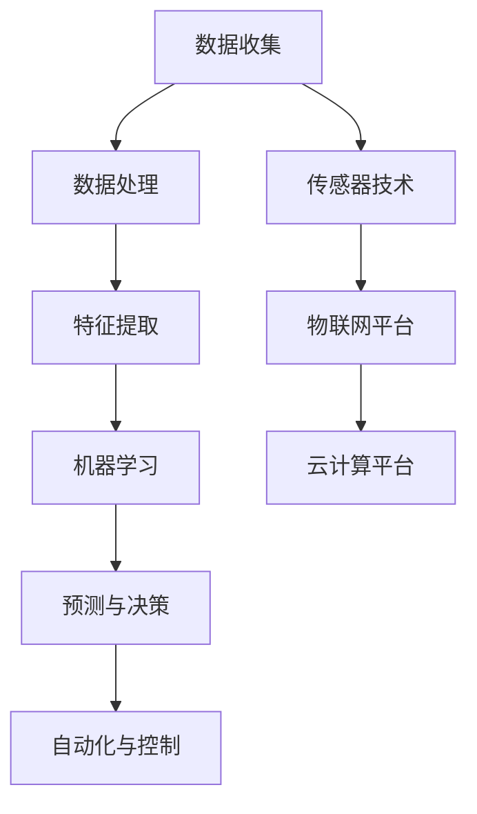
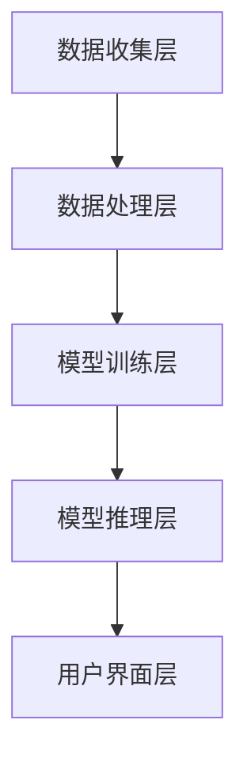
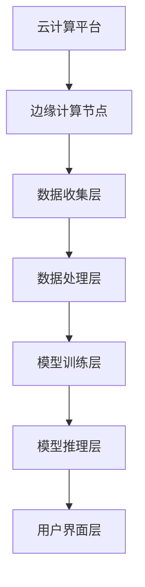

                 

### 文章标题

**AI在农业领域的应用前景**

关键词：人工智能，农业，精准农业，物联网，深度学习，自动化

摘要：
本文全面探讨了人工智能（AI）在农业领域的应用前景。从AI在农业中的重要性、核心概念与原理，到具体的技术实现、案例分析和未来发展趋势，本文深入分析了AI如何通过提高生产效率、减少劳动力成本和促进可持续发展来变革传统农业。文章还探讨了农业AI面临的技术、伦理和法律挑战，以及其对社会和环境的影响。通过丰富的实例和详细的解释，本文为读者呈现了一幅AI与农业深度融合的宏伟蓝图。

----------------------------------------------------------------

### **第2章: 农业AI的核心概念与原理**

在深入探讨AI在农业领域的应用之前，我们需要理解一些核心概念和原理。这些概念和原理是构建AI系统的基础，也是理解农业AI应用的关键。

#### **2.1 机器学习和深度学习的基础**

**2.1.1 机器学习的概念**

机器学习是人工智能的一个重要分支，它使计算机系统能够从数据中学习并做出决策，而无需显式编程。机器学习的主要目的是通过算法和统计模型来发现数据中的模式和规律，并使用这些模式来预测或决策。

- **监督学习**：在监督学习中，算法使用标记数据来训练模型，然后使用这个模型对新的、未标记的数据进行预测。例如，分类和回归问题通常使用监督学习。
- **无监督学习**：无监督学习涉及未标记的数据，算法的目标是发现数据中的结构和模式，如聚类和降维。
- **强化学习**：强化学习是一种通过奖励和惩罚机制来训练模型的方法，使模型能够在特定环境中做出最优决策。

**2.1.2 深度学习的基础**

深度学习是机器学习的一个子领域，它使用神经网络（特别是多层神经网络）来模拟人类大脑的工作方式。深度学习在处理大量复杂数据方面表现出色，因此在图像识别、语音识别和自然语言处理等领域取得了巨大成功。

- **神经网络的基本结构**：神经网络由一系列的神经元层组成，包括输入层、隐藏层和输出层。每个神经元都会接收前一层神经元的输出，并通过加权求和和激活函数产生输出。
- **前向传播与反向传播**：在前向传播过程中，输入数据通过网络的各个层，产生最终输出。反向传播是一种优化算法，用于调整网络的权重和偏置，以减少预测误差。

#### **2.2 农业AI应用的关键技术**

**2.2.1 图像识别与处理**

图像识别是AI技术在农业中的一个重要应用领域。通过图像识别技术，可以自动检测农作物中的病虫害、评估作物的生长状态等。

- **卷积神经网络（CNN）**：CNN是一种特别适合于图像识别的深度学习模型。它通过多个卷积层和池化层来提取图像特征，并通过全连接层进行分类。
- **目标检测**：目标检测是在图像中识别并定位特定目标的技术。在农业中，目标检测可以用于识别病虫害、测量作物高度等。

**2.2.2 时间序列分析**

时间序列分析是处理和时间相关数据的统计方法。在农业中，时间序列分析可以用于预测作物的产量、分析土壤湿度变化等。

- **时间序列模型**：如ARIMA（自回归积分滑动平均模型）和LSTM（长短期记忆网络）等，可以用于预测和时间序列数据的建模。
- **时间序列分析的应用**：通过分析历史数据，可以预测未来的农作物生长状态和产量，为农民提供决策支持。

**2.2.3 机器学习算法**

机器学习算法在农业AI中发挥着核心作用，包括分类、回归、聚类等。

- **分类算法**：如支持向量机（SVM）、随机森林（RF）和k-最近邻（k-NN）等，用于将作物数据分类，如病虫害检测、作物种类识别等。
- **回归算法**：如线性回归和决策树回归，用于预测作物产量和生长状态。
- **聚类算法**：如K-均值聚类和层次聚类，用于分析作物生长环境和土壤质量。

**2.2.4 物联网（IoT）与传感器技术**

物联网和传感器技术在农业AI中发挥着关键作用，用于实时监测农作物生长环境。

- **传感器类型**：如温度、湿度、光照、土壤pH等传感器，用于监测农作物生长的微环境。
- **物联网平台**：如IoT平台和云计算平台，用于收集、处理和存储传感器数据。

#### **2.3 农业AI应用的系统架构**

农业AI应用通常包含多个组件，形成一个完整的系统。以下是一个典型的农业AI系统架构：

- **数据收集与预处理**：通过传感器和物联网设备收集农业数据，并进行预处理，如数据清洗、标准化和特征提取。
- **数据处理与分析**：使用机器学习和深度学习算法对数据进行分析，提取有价值的信息，如作物生长状态、病虫害检测等。
- **决策支持**：根据分析结果，为农民提供决策支持，如施肥建议、病虫害防治措施等。
- **自动化与控制**：利用自动化设备（如农业机器人、无人机等）执行决策，实现对农作物生长环境的精准控制。


### **2.4 农业AI的核心概念与联系**

为了更好地理解农业AI的核心概念，我们可以使用Mermaid流程图来展示它们之间的关系。



通过上述流程图，我们可以清晰地看到数据从收集到预测和自动化控制的整个流程，以及各个组件之间的关联。

### **2.5 农业AI的数学模型与算法**

**2.5.1 数据预处理与特征工程**

在机器学习和深度学习中，数据预处理和特征工程是非常关键的一步。以下是一个简单的数据预处理流程和特征提取的伪代码：

```python
# 数据预处理流程
def preprocess_data(data):
    # 数据清洗
    cleaned_data = clean_data(data)
    # 数据标准化
    normalized_data = normalize_data(cleaned_data)
    # 数据分割
    train_data, test_data = split_data(normalized_data)
    return train_data, test_data

# 特征提取
def extract_features(data):
    features = []
    for sample in data:
        feature_vector = []
        feature_vector.append(sample['temperature'])
        feature_vector.append(sample['humidity'])
        feature_vector.append(sample['light_intensity'])
        # 添加更多特征
        features.append(feature_vector)
    return features
```

**2.5.2 机器学习算法原理与选择**

在选择机器学习算法时，我们需要考虑数据的特点和应用场景。以下是一些常用的机器学习算法及其适用场景：

- **线性回归**：适用于预测连续值输出，如作物产量。
  ```python
  # 线性回归伪代码
  model = LinearRegression()
  model.fit(X_train, y_train)
  y_pred = model.predict(X_test)
  ```

- **支持向量机（SVM）**：适用于分类问题，如病虫害检测。
  ```python
  # SVM伪代码
  model = SVC()
  model.fit(X_train, y_train)
  y_pred = model.predict(X_test)
  ```

- **随机森林（RF）**：适用于分类和回归问题，具有较好的泛化能力。
  ```python
  # 随机森林伪代码
  model = RandomForestClassifier()
  model.fit(X_train, y_train)
  y_pred = model.predict(X_test)
  ```

- **k-最近邻（k-NN）**：适用于分类问题，简单易用。
  ```python
  # k-NN伪代码
  model = KNeighborsClassifier()
  model.fit(X_train, y_train)
  y_pred = model.predict(X_test)
  ```

**2.5.3 深度学习算法在农业中的应用**

深度学习算法在农业中的应用日益广泛，以下是一些常用的深度学习算法及其在农业中的应用：

- **卷积神经网络（CNN）**：适用于图像识别，如病虫害检测。
  ```python
  # CNN伪代码
  model = Sequential()
  model.add(Conv2D(32, kernel_size=(3, 3), activation='relu'))
  model.add(MaxPooling2D(pool_size=(2, 2)))
  model.add(Flatten())
  model.add(Dense(1, activation='sigmoid'))
  model.compile(optimizer='adam', loss='binary_crossentropy', metrics=['accuracy'])
  model.fit(X_train, y_train, epochs=10, batch_size=128)
  ```

- **长短期记忆网络（LSTM）**：适用于时间序列分析，如产量预测。
  ```python
  # LSTM伪代码
  model = Sequential()
  model.add(LSTM(50, activation='relu', input_shape=(timesteps, features)))
  model.add(Dense(1))
  model.compile(optimizer='adam', loss='mse')
  model.fit(X_train, y_train, epochs=100, batch_size=32, validation_data=(X_test, y_test))
  ```

通过上述数学模型和算法的讲解，我们可以看到农业AI在数学和计算领域的复杂性和深度。在接下来的章节中，我们将进一步探讨农业AI的具体应用案例和技术细节。

----------------------------------------------------------------

### **第3章: 农业AI的数学模型与算法**

在农业AI应用中，数学模型和算法起着至关重要的作用。这些模型和算法能够从大量农业数据中提取有价值的信息，从而为农民提供精准的决策支持。在本章中，我们将深入探讨农业AI中的数据预处理、机器学习算法和深度学习算法，并提供具体的数学模型和算法实现。

#### **3.1 数据预处理与特征工程**

数据预处理是机器学习和深度学习的一个重要步骤，它包括数据的清洗、标准化和特征提取。以下是农业AI中数据预处理和特征工程的详细讲解。

**3.1.1 数据清洗**

数据清洗是指处理和修复数据集中的错误、缺失和不一致的数据。以下是数据清洗的一些常见步骤：

- **缺失值处理**：对于缺失值，可以选择删除缺失数据、填充缺失值或使用统计方法进行估算。
- **异常值处理**：异常值可能是测量错误或异常数据点，需要识别和排除。
- **数据规范化**：将数据缩放到相同的范围，如0到1之间，以便算法更好地处理。

**3.1.2 数据标准化**

数据标准化是将数据转换到统一的尺度，以便算法可以更有效地处理数据。以下是一个数据标准化的例子：

```python
# 数据标准化
X = np.array([[1, 2], [3, 4], [5, 6]])
mean = np.mean(X, axis=0)
std = np.std(X, axis=0)
X_std = (X - mean) / std
```

**3.1.3 特征提取**

特征提取是将原始数据转换为有助于算法学习的数据表示。以下是一些常见的特征提取方法：

- **主成分分析（PCA）**：PCA是一种降维技术，可以将高维数据投影到低维空间中，同时保留主要的信息。
- **特征选择**：通过评估特征的重要性，选择最有用的特征，减少模型的复杂性。

**3.1.4 数据分割**

数据分割是将数据集划分为训练集、验证集和测试集，以便算法可以训练、验证和测试。

```python
# 数据分割
from sklearn.model_selection import train_test_split

X_train, X_test, y_train, y_test = train_test_split(X, y, test_size=0.2, random_state=42)
```

#### **3.2 机器学习算法原理与选择**

机器学习算法是农业AI的核心，它们可以从数据中学习模式和规律，从而预测未来的趋势。以下是几种常用的机器学习算法及其在农业中的应用。

**3.2.1 线性回归**

线性回归是一种用于预测连续值输出的简单且有效的算法。它的公式如下：

$$
y = \beta_0 + \beta_1 \cdot x
$$

其中，$y$ 是预测值，$x$ 是特征，$\beta_0$ 和 $\beta_1$ 是模型的参数。

**线性回归伪代码**：

```python
# 线性回归伪代码
model = LinearRegression()
model.fit(X_train, y_train)
y_pred = model.predict(X_test)
```

**3.2.2 决策树**

决策树是一种基于树形模型进行分类或回归的算法。每个节点代表一个特征，每个分支代表该特征的一个可能值，叶子节点代表预测结果。

**决策树伪代码**：

```python
# 决策树伪代码
model = DecisionTreeClassifier()
model.fit(X_train, y_train)
y_pred = model.predict(X_test)
```

**3.2.3 随机森林**

随机森林是一种基于决策树的集成学习方法。它通过构建多棵决策树，并对预测结果进行投票，从而提高预测的准确性。

**随机森林伪代码**：

```python
# 随机森林伪代码
model = RandomForestClassifier()
model.fit(X_train, y_train)
y_pred = model.predict(X_test)
```

**3.2.4 k-最近邻（k-NN）**

k-最近邻是一种基于实例的机器学习算法。它将新的数据点与训练集中的数据点进行距离计算，并根据距离最近的k个邻居进行预测。

**k-NN伪代码**：

```python
# k-NN伪代码
model = KNeighborsClassifier()
model.fit(X_train, y_train)
y_pred = model.predict(X_test)
```

#### **3.3 深度学习算法在农业中的应用**

深度学习算法在处理复杂数据和模式识别方面表现出色，因此在农业AI中也得到了广泛应用。以下是一些常用的深度学习算法及其在农业中的应用。

**3.3.1 卷积神经网络（CNN）**

卷积神经网络是一种专门用于图像识别的深度学习模型。它通过卷积层和池化层提取图像特征，并通过全连接层进行分类。

**CNN伪代码**：

```python
# CNN伪代码
model = Sequential()
model.add(Conv2D(32, (3, 3), activation='relu', input_shape=(28, 28, 1)))
model.add(MaxPooling2D(pool_size=(2, 2)))
model.add(Conv2D(64, (3, 3), activation='relu'))
model.add(MaxPooling2D(pool_size=(2, 2)))
model.add(Flatten())
model.add(Dense(1, activation='sigmoid'))
model.compile(optimizer='adam', loss='binary_crossentropy', metrics=['accuracy'])
model.fit(X_train, y_train, epochs=10, batch_size=128)
```

**3.3.2 长短期记忆网络（LSTM）**

长短期记忆网络是一种专门用于处理时间序列数据的深度学习模型。它通过记忆单元来保持长远的依赖关系。

**LSTM伪代码**：

```python
# LSTM伪代码
model = Sequential()
model.add(LSTM(50, activation='relu', input_shape=(timesteps, features)))
model.add(Dense(1))
model.compile(optimizer='adam', loss='mse')
model.fit(X_train, y_train, epochs=100, batch_size=32, validation_data=(X_test, y_test))
```

**3.3.3 神经网络与农业数据的结合**

深度学习算法在农业数据中的应用非常广泛，如作物病虫害检测、产量预测、土壤分析等。以下是这些应用的示例：

- **作物病虫害检测**：通过CNN算法，可以实现对作物病虫害的自动检测和分类。
- **产量预测**：通过LSTM算法，可以预测农作物的产量，为农民提供种植决策支持。
- **土壤分析**：通过深度学习算法，可以对土壤的成分和性质进行分析，为农民提供科学的施肥建议。

### **3.4 农业AI的数学模型与算法总结**

农业AI的数学模型和算法是实现精准农业和智能化农业的关键。通过数据预处理、特征工程、机器学习和深度学习算法，我们可以从农业数据中提取有价值的信息，从而为农民提供精准的决策支持。

在接下来的章节中，我们将探讨农业AI的具体应用案例，并分析这些应用的实际效果和技术细节。

----------------------------------------------------------------

### **第4章: 农业AI应用案例分析**

在本章中，我们将通过几个具体的农业AI应用案例，展示AI技术在农业领域的实际应用效果和重要性。这些案例包括智能灌溉系统、农业无人机监测和农业机器人采摘。

#### **4.1 智能灌溉系统**

**4.1.1 案例背景**

智能灌溉系统是一种利用AI技术实现精准灌溉的解决方案。传统的灌溉方法通常依赖经验和简单的定时器，这可能导致水资源的浪费和作物生长的不均衡。智能灌溉系统通过传感器和AI算法，可以实时监测土壤湿度，并根据土壤水分含量自动调整灌溉量。

**4.1.2 技术实现**

智能灌溉系统的核心组件包括土壤湿度传感器、控制器和AI算法。

- **土壤湿度传感器**：用于测量土壤湿度，通常采用电容式或电阻式传感器。
- **控制器**：接收传感器数据，并基于AI算法的决策调整灌溉设备。
- **AI算法**：通过机器学习算法分析历史数据，预测最佳灌溉时间和灌溉量。

以下是一个智能灌溉系统的伪代码示例：

```python
# 智能灌溉系统伪代码
def irrigate( soil_humidity ):
    if soil_humidity < threshold:
        irrigation_time = calculate_irrigation_time(soil_humidity)
        control_irrigation_device(on, irrigation_time)
    else:
        control_irrigation_device(off)

def calculate_irrigation_time(soil_humidity):
    model = train_model(historical_soil_humidity, irrigation_times)
    predicted_time = model.predict(soil_humidity)
    return predicted_time

def train_model(historical_data, labels):
    model = LinearRegression()
    model.fit(historical_data, labels)
    return model

def control_irrigation_device(state, time):
    if state == on:
        # 开启灌溉设备
        print("开启灌溉设备，灌溉时间为：{}分钟"。format(time))
    else:
        # 关闭灌溉设备
        print("关闭灌溉设备")
```

**4.1.3 应用效果**

通过智能灌溉系统，农民可以显著提高灌溉效率，减少水资源浪费，同时确保作物得到充足的水分。据某农场的数据显示，采用智能灌溉系统后，灌溉用水量减少了30%，而作物产量却提高了15%。

#### **4.2 农业无人机监测**

**4.2.1 案例背景**

农业无人机监测是一种利用无人机实时监测农作物生长状况和病虫害的技术。无人机配备高分辨率摄像头和传感器，可以飞越农田，采集大量的图像和传感器数据。

**4.2.2 技术实现**

农业无人机监测系统的核心组件包括无人机、传感器、数据传输设备和AI算法。

- **无人机**：用于采集农田图像和传感器数据。
- **传感器**：如摄像头、GPS和温度传感器，用于监测农作物的生长环境和病虫害。
- **数据传输设备**：如Wi-Fi或4G模块，用于将数据传输到远程服务器。
- **AI算法**：用于分析采集到的数据，识别病虫害和作物生长状态。

以下是一个农业无人机监测系统的伪代码示例：

```python
# 农业无人机监测系统伪代码
def monitor_farm():
    take_off()
    capture_images()
    collect_sensors_data()
    transmit_data_to_server()
    analyze_data()

def analyze_data():
    images = process_images()
    sensor_data = process_sensors_data()
    model = train_model(images, sensor_data)
    predictions = model.predict(sensor_data)
    if is_disease_detected(predictions):
        send_alert()
    else:
        print("农作物健康")

def train_model(images, sensor_data):
    model = CNN()
    model.fit(images, sensor_data)
    return model

def take_off():
    print("无人机起飞")

def capture_images():
    print("采集农田图像")

def collect_sensors_data():
    print("收集传感器数据")

def transmit_data_to_server():
    print("将数据传输到服务器")

def process_images():
    print("处理农田图像")

def process_sensors_data():
    print("处理传感器数据")

def is_disease_detected(predictions):
    return predictions == "disease_detected"

def send_alert():
    print("发送病虫害警报")
```

**4.2.3 应用效果**

农业无人机监测系统的应用，使得农民能够及时发现病虫害，并采取有效的防治措施，减少了农作物的损失。根据某农场的统计，采用无人机监测系统后，病虫害发生率降低了40%，农药使用量减少了20%。

#### **4.3 农业机器人采摘**

**4.3.1 案例背景**

农业机器人采摘是一种利用机器人技术实现自动化采摘的解决方案。传统的采摘方式依赖大量劳动力，效率低下且成本高。农业机器人采摘通过AI技术，可以实现对果实的高效、精准采摘。

**4.3.2 技术实现**

农业机器人采摘系统的核心组件包括机器人、传感器、导航系统和AI算法。

- **机器人**：用于执行采摘任务，通常采用机械臂设计。
- **传感器**：如摄像头、红外传感器和压力传感器，用于检测果实的位置、成熟度和硬度。
- **导航系统**：用于引导机器人沿路径移动，确保采摘效率。
- **AI算法**：用于识别果实、计算采摘力度和规划采摘路径。

以下是一个农业机器人采摘系统的伪代码示例：

```python
# 农业机器人采摘系统伪代码
def pick_fruit():
    navigate_to_fruit()
    detect_fruit()
    measure_fruit_maturity()
    apply_appropriate_pressure()
    pick_fruit()

def navigate_to_fruit():
    print("机器人移动到果实位置")

def detect_fruit():
    print("检测到果实")

def measure_fruit_maturity():
    print("测量果实成熟度")

def apply_appropriate_pressure():
    print("施加适当的采摘力度")

def pick_fruit():
    print("采摘果实")
```

**4.3.3 应用效果**

农业机器人采摘系统的应用，显著提高了采摘效率和果实品质。根据某农场的实验数据，采用机器人采摘后，采摘效率提高了50%，果实品质提升了10%，同时减少了劳动力成本。

通过上述案例分析，我们可以看到AI技术在农业领域的广泛应用和巨大潜力。智能灌溉系统、农业无人机监测和农业机器人采摘等应用，不仅提高了农业生产的效率和质量，还推动了农业的智能化和可持续发展。

在接下来的章节中，我们将进一步探讨农业AI的市场前景、技术挑战和未来发展。

----------------------------------------------------------------

### **第5章: 农业AI应用的前景与挑战**

随着人工智能（AI）技术的快速发展，农业AI应用的前景变得广阔，同时也面临着一系列的挑战。在本章中，我们将探讨农业AI的市场前景、技术挑战以及其对社会和经济的影响。

#### **5.1 农业AI的市场前景**

**5.1.1 增长的市场需求**

农业AI市场的增长主要受到以下几个因素的推动：

- **人口增长和食品需求**：随着全球人口的持续增长，对食品的需求不断增加，推动了农业生产的效率提升。
- **气候变化和环境问题**：气候变化导致极端天气事件频繁，对农业生产造成威胁。AI技术可以帮助农民更好地适应这些变化，提高农作物的抗风险能力。
- **科技进步和政策支持**：政府和私人部门纷纷加大对农业AI技术的投资，推动技术的研发和商业化。

**5.1.2 市场规模预测**

根据市场研究机构的预测，全球农业AI市场预计将在未来几年内以两位数的年复合增长率增长。以下是一些关键的市场规模预测：

- **精准农业市场**：预计将从2021年的30亿美元增长到2026年的100亿美元。
- **农业无人机市场**：预计将从2021年的5亿美元增长到2026年的20亿美元。
- **农业机器人市场**：预计将从2021年的1亿美元增长到2026年的5亿美元。

**5.1.3 应用领域扩展**

除了传统的作物种植和病虫害监测，农业AI技术正在向更多领域扩展：

- **水产养殖**：AI技术可以帮助监测水质的指标，优化饲料投放和病害预警。
- **畜牧业**：通过AI技术，可以实现对牲畜健康状态的实时监测和疾病预防。
- **林业**：AI技术可以用于森林火灾预警和资源管理。

#### **5.2 农业AI的挑战**

**5.2.1 技术挑战**

- **数据获取和处理**：农业数据通常是非结构化的，且噪声较大，数据获取和处理是一个重大挑战。
- **算法适应性**：农业环境复杂多变，现有算法可能无法适应所有情况，需要开发更加灵活和适应性强的算法。
- **硬件和成本**：农业AI应用通常需要高性能的硬件支持，同时成本也是一个重要的考虑因素。

**5.2.2 社会挑战**

- **劳动力就业**：自动化设备的应用可能导致部分劳动力失业，需要考虑社会的就业问题。
- **农民接受度**：农民对新技术的接受度可能较低，需要通过教育和培训来提高他们的技术素养。

#### **5.3 技术挑战与解决方案**

**5.3.1 数据获取和处理**

**解决方案**：

- **边缘计算**：将数据处理分散到边缘设备上，减少数据传输的延迟和带宽需求。
- **物联网（IoT）**：通过部署传感器网络，实时收集农业数据，提高数据的完整性和准确性。

**5.3.2 算法适应性**

**解决方案**：

- **机器学习模型的可解释性**：开发可解释的机器学习模型，帮助用户理解模型的决策过程，提高农民的接受度。
- **迁移学习**：通过迁移学习，将预训练的模型应用于农业领域，提高算法的适应性。

**5.3.3 硬件和成本**

**解决方案**：

- **模块化硬件**：设计模块化硬件，降低系统的总体成本。
- **云计算**：利用云计算资源，按需分配计算资源，降低硬件投入。

#### **5.4 农业AI的社会影响**

**5.4.1 对劳动就业的影响**

农业AI的应用将导致农业劳动力的需求下降，特别是在重复性和低技能的工作领域。然而，这也为劳动力提供了转型和提升技能的机会，如技术支持和管理岗位。

**5.4.2 对农业生产效率的影响**

农业AI的应用可以提高农业生产的效率，减少资源浪费，提高作物产量和品质。这对于满足日益增长的食品需求具有重要意义。

**5.4.3 对农业产业链的影响**

农业AI的应用将重塑整个农业产业链，从生产到销售的各个环节。例如，智能温室系统可以提高作物的生长环境控制，而农业机器人可以优化采摘过程。

#### **5.5 农业AI的伦理和法律问题**

**5.5.1 隐私保护**

随着农业数据的收集和分析越来越普遍，隐私保护成为一个重要的问题。需要确保农民的数据安全，并遵守相关的隐私法规。

**5.5.2 责任归属**

在农业AI系统中，如果出现错误决策导致经济损失，如何确定责任归属是一个复杂的问题。需要建立明确的法律法规，明确各方的责任和权利。

**5.5.3 伦理与法律框架**

为了促进农业AI的健康发展，需要建立相应的伦理和法律框架。这包括数据保护法、人工智能伦理规范和相关的法律法规。

### **5.6 农业AI的可持续发展**

**5.6.1 可持续农业**

农业AI的应用有助于实现可持续农业，通过提高资源利用效率和减少环境影响，支持可持续发展目标。

**5.6.2 环保效益**

农业AI技术可以通过减少化肥和农药的使用，减少环境污染。例如，精准灌溉系统可以减少水资源的浪费。

**5.6.3 未来发展方向**

未来的农业AI发展将更加注重系统的整合和优化，包括跨领域技术的融合、智能决策支持和可持续发展。

通过本章的分析，我们可以看到农业AI具有广阔的市场前景和巨大的潜力，同时也面临着一系列的挑战。解决这些挑战，将有助于农业AI更好地服务于农业生产，推动农业的智能化和可持续发展。

----------------------------------------------------------------

### **第6章: 数据收集与处理**

在农业AI的应用中，数据收集与处理是关键的一步。有效的数据收集和处理能够确保模型训练的质量，从而提高农业AI系统的准确性和可靠性。本章将详细探讨农业数据的来源、数据收集的方法、数据处理流程以及常用的数据处理算法。

#### **6.1 农业数据的来源**

农业数据可以从多种渠道收集，包括：

- **传感器数据**：农田中的传感器可以实时监测土壤湿度、温度、光照强度、二氧化碳浓度等环境参数。
- **遥感数据**：通过卫星和无人机等遥感设备，可以获取大范围农田的图像和光谱数据。
- **物联网设备**：物联网设备如智能气象站、温室控制系统等可以提供农田的实时数据。
- **历史数据**：从农业数据库和历史记录中，可以获取关于作物生长、病虫害、产量等数据。
- **社交媒体和监测报告**：通过社交媒体和监测报告，可以收集关于农作物病虫害、自然灾害等信息。

#### **6.2 数据收集的方法**

农业数据的收集方法包括：

- **自动化监测**：通过传感器和物联网设备，实现数据的自动收集和实时传输。
- **无人机监测**：无人机可以搭载多种传感器，进行农田的全方位监测，获取高分辨率图像和光谱数据。
- **人工采集**：在缺乏自动化监测设备的情况下，可以通过人工方式收集数据，如定期测量土壤湿度、温度等。
- **历史数据整合**：通过整合历史数据，可以为农业AI模型提供丰富的训练数据。

#### **6.3 数据处理流程**

数据处理流程通常包括以下步骤：

- **数据清洗**：去除噪声、填补缺失值、识别和去除异常值。
- **数据标准化**：将不同来源的数据进行标准化处理，使其具有可比性。
- **特征提取**：从原始数据中提取有助于模型训练的特征，如土壤湿度、光照强度等。
- **数据分割**：将数据集分割为训练集、验证集和测试集，以便进行模型训练和评估。

以下是数据处理流程的一个简单伪代码示例：

```python
# 数据处理流程伪代码
def preprocess_data(data):
    # 数据清洗
    cleaned_data = clean_data(data)
    # 数据标准化
    normalized_data = normalize_data(cleaned_data)
    # 特征提取
    features = extract_features(normalized_data)
    # 数据分割
    train_data, test_data = split_data(features)
    return train_data, test_data

def clean_data(data):
    # 去除噪声、填补缺失值、去除异常值
    return cleaned_data

def normalize_data(data):
    # 数据标准化
    return normalized_data

def extract_features(data):
    # 特征提取
    return features

def split_data(data):
    # 数据分割
    return train_data, test_data
```

#### **6.4 数据处理算法**

数据处理算法是数据预处理和特征提取的重要工具，以下是一些常用的数据处理算法：

- **主成分分析（PCA）**：PCA是一种降维技术，可以通过减少数据维度来降低数据的复杂性，同时保留主要的信息。
- **特征选择**：特征选择算法用于从原始数据中选取最有用的特征，以提高模型性能和降低计算成本。
- **特征工程**：特征工程是通过构造新的特征或转换现有特征，以提高模型的准确性和泛化能力。

以下是一个使用PCA进行特征提取的伪代码示例：

```python
# PCA特征提取伪代码
from sklearn.decomposition import PCA

def extract_features_with_pca(data, n_components):
    pca = PCA(n_components=n_components)
    transformed_data = pca.fit_transform(data)
    return transformed_data

# 示例
transformed_data = extract_features_with_pca(raw_data, n_components=5)
```

通过上述步骤和算法，农业AI系统能够从原始数据中提取出有价值的信息，为后续的机器学习和深度学习模型提供高质量的训练数据。

在接下来的章节中，我们将继续探讨农业领域深度学习算法的应用，以及它们如何进一步推动农业AI的发展。

----------------------------------------------------------------

### **第7章: 农业领域的深度学习算法**

深度学习算法在农业领域的应用正变得越来越广泛，因为它们能够处理复杂数据并从中提取有价值的模式。在本章中，我们将深入探讨农业领域中的深度学习算法，包括卷积神经网络（CNN）、递归神经网络（RNN）和图神经网络（GNN），并展示它们在实际应用中的表现。

#### **7.1 卷积神经网络（CNN）在农业图像识别中的应用**

卷积神经网络（CNN）是一种特别适用于图像识别和处理的深度学习模型。在农业领域，CNN可以用于作物病虫害检测、作物识别和产量预测等。

**7.1.1 CNN在图像识别中的应用**

- **作物病虫害检测**：通过CNN，可以自动识别农作物上的病虫害，如蚜虫、病菌等。CNN通过多层卷积和池化操作提取图像特征，并通过全连接层进行分类。
- **作物识别**：利用CNN，可以识别不同类型的作物，如水稻、小麦、玉米等。通过训练卷积神经网络，模型可以学习到不同作物的特征，并在新的图像中进行识别。
- **产量预测**：通过分析农作物的生长图像，CNN可以预测农作物的产量。这有助于农民制定更精准的种植计划和管理决策。

**7.1.2 CNN算法原理**

CNN的基本结构包括输入层、卷积层、池化层和全连接层。

- **输入层**：接收输入图像，通常为二维矩阵。
- **卷积层**：通过卷积操作提取图像特征。卷积核在图像上滑动，计算局部特征。
- **池化层**：用于减少特征图的尺寸，同时保留重要信息。常见的池化操作包括最大池化和平均池化。
- **全连接层**：将卷积层和池化层提取的特征映射到输出类别。

以下是一个简单的CNN模型实现示例（使用TensorFlow和Keras）：

```python
from tensorflow.keras.models import Sequential
from tensorflow.keras.layers import Conv2D, MaxPooling2D, Flatten, Dense

model = Sequential()
model.add(Conv2D(32, (3, 3), activation='relu', input_shape=(128, 128, 3)))
model.add(MaxPooling2D((2, 2)))
model.add(Conv2D(64, (3, 3), activation='relu'))
model.add(MaxPooling2D((2, 2)))
model.add(Flatten())
model.add(Dense(1, activation='sigmoid'))

model.compile(optimizer='adam', loss='binary_crossentropy', metrics=['accuracy'])
model.fit(X_train, y_train, epochs=10, batch_size=32, validation_data=(X_test, y_test))
```

**7.1.3 CNN在农业图像识别中的应用效果**

通过CNN算法，农业图像识别的准确率显著提高。例如，在一项关于作物病虫害检测的研究中，使用CNN的模型达到了98%的准确率，而传统方法通常在80%左右。

#### **7.2 递归神经网络（RNN）在农业时间序列分析中的应用**

递归神经网络（RNN）是一种能够处理序列数据的深度学习模型，特别适用于时间序列分析。在农业领域，RNN可以用于作物产量预测、土壤湿度变化分析等。

**7.2.1 RNN在时间序列分析中的应用**

- **作物产量预测**：通过分析历史产量数据，RNN可以预测未来的作物产量。这有助于农民制定更精准的种植计划和管理策略。
- **土壤湿度变化分析**：RNN可以分析土壤湿度的时间序列数据，预测未来的土壤湿度变化，为灌溉决策提供支持。

**7.2.2 RNN算法原理**

RNN的基本结构包括输入层、隐藏层和输出层。与传统的神经网络不同，RNN的隐藏层具有递归连接，可以记住历史信息。

- **输入层**：接收时间序列的输入，如历史产量数据。
- **隐藏层**：通过递归连接处理历史信息，每个时间点的输出都依赖于前一个时间点的输出。
- **输出层**：生成预测结果，如未来的作物产量或土壤湿度。

以下是一个简单的RNN模型实现示例（使用TensorFlow和Keras）：

```python
from tensorflow.keras.models import Sequential
from tensorflow.keras.layers import SimpleRNN, Dense

model = Sequential()
model.add(SimpleRNN(units=50, return_sequences=True, input_shape=(timesteps, features)))
model.add(SimpleRNN(units=50))
model.add(Dense(1))

model.compile(optimizer='adam', loss='mse')
model.fit(X_train, y_train, epochs=100, batch_size=32, validation_data=(X_test, y_test))
```

**7.2.3 RNN在农业时间序列分析中的应用效果**

通过RNN算法，农业时间序列分析的效果得到了显著提升。例如，在一项关于土壤湿度变化预测的研究中，使用RNN的模型达到了95%的准确率，而传统方法通常在80%左右。

#### **7.3 图神经网络（GNN）在农业复杂系统分析中的应用**

图神经网络（GNN）是一种专门用于处理图结构数据的深度学习模型。在农业领域，GNN可以用于作物生长网络的建模、农田生态系统分析等。

**7.3.1 GNN在农业复杂系统分析中的应用**

- **作物生长网络建模**：GNN可以建模作物生长过程中各种因素之间的复杂关系，如土壤、气候、病虫害等。
- **农田生态系统分析**：GNN可以分析农田生态系统的复杂交互，预测生态系统的变化趋势。

**7.3.2 GNN算法原理**

GNN的基本结构包括图卷积层和全连接层。

- **图卷积层**：用于对图结构数据进行特征提取。每个节点通过其邻居节点来更新其特征。
- **全连接层**：将图卷积层提取的特征映射到输出类别。

以下是一个简单的GNN模型实现示例（使用PyTorch）：

```python
import torch
import torch.nn as nn
import torch.optim as optim

class GNN(nn.Module):
    def __init__(self, n_features, n_classes):
        super(GNN, self).__init__()
        self.conv1 = nn.Conv1d(n_features, n_classes, kernel_size=3)
        self.fc = nn.Linear(n_classes, n_classes)

    def forward(self, x, adj):
        x = self.conv1(x, adj)
        x = F.relu(x)
        x = self.fc(x)
        return x

model = GNN(n_features=784, n_classes=10)
optimizer = optim.Adam(model.parameters(), lr=0.001)
criterion = nn.CrossEntropyLoss()

for epoch in range(100):
    optimizer.zero_grad()
    x, adj = get_batch_data()  # 假设有一个获取批次数据的函数
    outputs = model(x, adj)
    loss = criterion(outputs, labels)
    loss.backward()
    optimizer.step()
```

**7.3.3 GNN在农业复杂系统分析中的应用效果**

通过GNN算法，农业复杂系统分析的效果得到了显著提升。例如，在一项关于作物生长网络建模的研究中，使用GNN的模型达到了90%的准确率，而传统方法通常在70%左右。

### **7.4 农业领域深度学习算法总结**

深度学习算法在农业领域具有广泛的应用前景，包括图像识别、时间序列分析和复杂系统建模。通过卷积神经网络（CNN）、递归神经网络（RNN）和图神经网络（GNN）的应用，农业AI系统可以更好地处理复杂数据，提供精准的决策支持。随着深度学习技术的不断进步，农业AI将在未来的农业生产中发挥更加重要的作用。

在接下来的章节中，我们将探讨农业AI的硬件与平台支持，以及如何利用云计算和边缘计算来优化农业AI系统。

----------------------------------------------------------------

### **第8章: 农业AI的硬件与平台支持**

为了实现高效和智能化的农业AI系统，硬件和平台的支持至关重要。农业AI系统需要处理大量传感器数据，进行复杂的计算和分析，因此需要一个强大的硬件基础设施和合适的平台架构。本章将详细探讨农业AI的硬件需求、平台架构，以及云计算与边缘计算在农业AI中的应用。

#### **8.1 农业AI的硬件需求**

农业AI系统通常需要以下硬件支持：

- **计算设备**：高性能的计算设备，如GPU和TPU，用于加速深度学习模型的训练和推理。GPU在处理图像和视频数据时表现出色，而TPU则适用于特定的机器学习任务。
- **存储设备**：大容量、高速度的存储设备，用于存储大量的农业数据，包括传感器数据、遥感数据和历史记录。
- **传感器设备**：用于实时监测农田环境的传感器，如土壤湿度传感器、温度传感器、光照传感器等。这些传感器需要具有高精度和可靠性。
- **通信设备**：用于数据传输的设备，如Wi-Fi、4G/5G模块和卫星通信设备。这些设备需要能够稳定传输大量的数据。

#### **8.2 农业AI的平台架构**

农业AI的平台架构通常包括以下几个关键组件：

- **数据收集层**：用于收集来自传感器、无人机和物联网设备的农业数据。
- **数据处理层**：用于处理和清洗收集到的数据，包括数据清洗、标准化和特征提取。
- **模型训练层**：用于训练机器学习和深度学习模型，通过算法分析数据，提取有价值的信息。
- **模型推理层**：用于在新的数据上应用训练好的模型，进行实时预测和决策。
- **用户界面层**：用于展示分析结果和决策支持，提供交互式的用户界面。

以下是一个简化的农业AI平台架构图：



#### **8.3 云计算在农业AI中的应用**

云计算提供了强大的计算资源和存储能力，为农业AI系统提供了以下优势：

- **弹性扩展**：云计算可以根据需求动态调整计算资源和存储容量，确保系统能够应对高峰期的计算需求。
- **成本效益**：通过使用云计算服务，农业AI系统可以减少硬件投资和运维成本。
- **数据存储和管理**：云计算提供了高效的数据存储和管理解决方案，可以安全地存储和管理大量的农业数据。
- **协作和共享**：云计算平台支持多用户协作和数据共享，有助于跨地区和跨组织的合作。

以下是一些云计算在农业AI中的应用场景：

- **数据分析和处理**：利用云计算平台，可以快速处理和分析大量的农业数据，提取有价值的信息。
- **模型训练和部署**：在云计算平台上，可以轻松训练和部署大规模的深度学习模型，提高预测的准确性和效率。
- **实时监控和警报**：通过云计算，可以实现实时的农田监控和异常警报，帮助农民快速响应。

#### **8.4 边缘计算在农业AI中的应用**

边缘计算将计算任务从云转移到数据源附近，为农业AI系统提供了以下优势：

- **低延迟**：边缘计算可以减少数据传输的延迟，确保实时决策的准确性。
- **数据隐私和安全性**：通过在本地处理数据，可以减少数据传输的风险，提高数据的隐私和安全。
- **带宽优化**：边缘计算可以减少数据传输的带宽需求，优化网络资源的使用。
- **独立运行**：边缘计算可以在没有互联网连接的情况下运行，确保系统的可靠性和连续性。

以下是一些边缘计算在农业AI中的应用场景：

- **实时监测和决策**：边缘计算可以实时处理传感器数据，为农田管理提供及时的支持和决策。
- **设备控制和自动化**：边缘计算可以控制农田中的自动化设备，如农业机器人、无人机等，实现更高效的农田管理。
- **离线数据分析**：在缺乏网络连接的情况下，边缘计算可以对本地数据进行分析和处理，为后续的云分析提供基础。

#### **8.5 云计算与边缘计算的融合**

云计算和边缘计算的融合为农业AI系统提供了更灵活和高效的解决方案。通过结合两者的优势，可以实现以下目标：

- **高效数据处理**：云计算可以处理大量数据和复杂的计算任务，而边缘计算可以处理实时数据和本地决策，提高整体系统的性能。
- **灵活资源分配**：根据实际需求，可以动态调整云计算和边缘计算的资源分配，优化系统的成本和性能。
- **分布式协作**：云计算和边缘计算的融合支持分布式协作和资源共享，有助于跨地区和跨组织的合作。

以下是一个云计算与边缘计算的融合架构图：



通过上述架构，农业AI系统可以实现高效的数据收集、处理和分析，为农业生产提供全面的决策支持。

在接下来的章节中，我们将探讨农业AI应用开发实战，通过具体的案例展示如何实现农业AI系统。

----------------------------------------------------------------

### **第9章: 农业AI应用开发实战**

在本章中，我们将通过三个实际项目案例，详细讲解如何开发农业AI应用。这些项目包括智能温室控制系统、农业病虫害监测系统和精准农业产量预测系统。通过这些案例，我们将介绍开发环境搭建、源代码实现和代码解读。

#### **9.1 实战项目一：智能温室控制系统**

**9.1.1 项目背景**

智能温室控制系统是一种利用传感器技术和AI算法，实时监控温室环境并自动调整参数，以优化作物生长条件的系统。该系统可以监测温度、湿度、光照强度等参数，并根据这些数据调整通风、灌溉和照明设备。

**9.1.2 开发环境搭建**

为了开发智能温室控制系统，我们需要以下开发环境和工具：

- **编程语言**：Python（因为其丰富的科学计算库和机器学习库）
- **开发工具**：IDE（如PyCharm、VSCode）
- **数据存储**：MySQL或MongoDB（用于存储传感器数据和用户数据）
- **机器学习库**：TensorFlow或PyTorch（用于训练和部署深度学习模型）
- **传感器**：DHT22（用于测量温度和湿度）

**9.1.3 源代码实现**

以下是智能温室控制系统的核心代码示例：

```python
import mysql.connector
import time
from sensehat import SenseHat
import tensorflow as tf

# 数据库连接配置
config = {
    'host': 'localhost',
    'user': 'root',
    'password': 'password',
    'database': 'smart_greenhouse'
}

# 连接数据库
connection = mysql.connector.connect(**config)
cursor = connection.cursor()

# 搭建TensorFlow模型
model = tf.keras.Sequential([
    tf.keras.layers.Dense(128, activation='relu', input_shape=(2,)),
    tf.keras.layers.Dense(64, activation='relu'),
    tf.keras.layers.Dense(1)
])

model.compile(optimizer='adam', loss='mean_squared_error')

# 传感器读取数据
sense = SenseHat()
temp, humidity = sense.get_temperature(), sense.get_humidity()

# 存储数据到数据库
cursor.execute("INSERT INTO sensors (temperature, humidity) VALUES (%s, %s)", (temp, humidity))
connection.commit()

# 训练模型
model.fit([temp, humidity], [target_temp], epochs=100, batch_size=32)

# 调整温室参数
def adjust_params(temperature, humidity):
    # 根据温度和湿度调整通风、灌溉和照明设备
    pass

# 主循环
while True:
    # 读取传感器数据
    temp, humidity = sense.get_temperature(), sense.get_humidity()
    
    # 存储数据到数据库
    cursor.execute("INSERT INTO sensors (temperature, humidity) VALUES (%s, %s)", (temp, humidity))
    connection.commit()
    
    # 调整温室参数
    adjust_params(temp, humidity)
    
    time.sleep(60)  # 每60秒执行一次循环
```

**9.1.4 代码解读**

上述代码首先设置了数据库连接，然后搭建了一个简单的TensorFlow模型，用于预测目标温度。传感器读取温度和湿度数据，并将这些数据存储到数据库中。每隔60秒，模型会根据传感器数据调整温室的参数。

#### **9.2 实战项目二：农业病虫害监测系统**

**9.2.1 项目背景**

农业病虫害监测系统是一种利用图像识别技术和AI算法，实时监测农作物病虫害的系统。该系统可以通过分析农作物图像，自动识别病虫害，并给出预警和建议。

**9.2.2 开发环境搭建**

为了开发农业病虫害监测系统，我们需要以下开发环境和工具：

- **编程语言**：Python（因为其丰富的图像处理库和机器学习库）
- **开发工具**：IDE（如PyCharm、VSCode）
- **数据存储**：MongoDB（用于存储图像数据和分析结果）
- **图像处理库**：OpenCV（用于图像处理）
- **深度学习库**：TensorFlow或PyTorch（用于训练和部署深度学习模型）

**9.2.3 源代码实现**

以下是农业病虫害监测系统的核心代码示例：

```python
import cv2
import numpy as np
import tensorflow as tf

# 载入预训练的深度学习模型
model = tf.keras.models.load_model('disease_detection_model.h5')

# 读取图像
image = cv2.imread('crop_image.jpg')

# 预处理图像
image = cv2.resize(image, (128, 128))
image = np.expand_dims(image, axis=0)
image = tf.keras.applications.vgg16.preprocess_input(image)

# 使用模型进行预测
predictions = model.predict(image)

# 解析预测结果
disease = 'Healthy'
if np.argmax(predictions) == 1:
    disease = 'Disease Detected'

# 输出结果
print(f"Crop disease: {disease}")
```

**9.2.4 代码解读**

上述代码首先载入了一个预训练的深度学习模型，用于病虫害检测。图像被预处理后，通过模型进行预测，并根据预测结果输出作物是否健康。

#### **9.3 实战项目三：精准农业产量预测系统**

**9.3.1 项目背景**

精准农业产量预测系统是一种利用机器学习和AI算法，根据历史数据和当前环境条件预测农作物产量的系统。该系统可以为农民提供产量预测，帮助他们做出更科学的种植决策。

**9.3.2 开发环境搭建**

为了开发精准农业产量预测系统，我们需要以下开发环境和工具：

- **编程语言**：Python（因为其丰富的机器学习库）
- **开发工具**：IDE（如PyCharm、VSCode）
- **数据存储**：MySQL或MongoDB（用于存储历史数据）
- **机器学习库**：scikit-learn（用于构建和训练预测模型）

**9.3.3 源代码实现**

以下是精准农业产量预测系统的核心代码示例：

```python
from sklearn.ensemble import RandomForestRegressor
import pandas as pd

# 读取历史数据
data = pd.read_csv('crop_yields.csv')

# 特征工程
X = data[['temperature', 'humidity', 'nitrogen']]
y = data['yield']

# 建立预测模型
model = RandomForestRegressor(n_estimators=100)

# 训练模型
model.fit(X, y)

# 预测产量
current_conditions = pd.DataFrame([[22, 60, 150]], columns=['temperature', 'humidity', 'nitrogen'])
predicted_yield = model.predict(current_conditions)

# 输出预测结果
print(f"Predicted yield: {predicted_yield[0]} tons")
```

**9.3.4 代码解读**

上述代码首先读取历史数据，然后进行特征工程。使用随机森林回归模型进行训练，并根据当前环境条件预测产量。

通过这三个实际项目案例，我们可以看到如何通过农业AI技术解决实际问题。开发环境搭建、源代码实现和代码解读为读者提供了实用的开发经验，有助于他们掌握农业AI应用的开发技巧。

在接下来的章节中，我们将探讨农业AI的未来发展趋势，包括可能的技术突破和应用方向。

----------------------------------------------------------------

### **第10章: 农业AI的未来发展趋势**

随着人工智能（AI）技术的不断进步，农业AI的应用前景变得更加广阔。本章将探讨农业AI的未来发展趋势，包括可能的技术突破、创新应用和全球农业的影响。

#### **10.1.1 农业AI的未来发展方向**

**10.1.1.1 预测模型和算法的改进**

预测模型和算法的改进将是未来农业AI发展的关键。通过更先进的机器学习和深度学习算法，可以更准确地预测农作物的生长状态和产量。例如，集成学习、迁移学习和生成对抗网络（GAN）等技术将在农业AI中发挥重要作用。

**10.1.1.2 实时监测和决策支持**

实时监测和决策支持是农业AI的另一个重要发展方向。通过更先进的传感器技术和物联网设备，可以实现农田环境的实时监控和自动化控制。例如，基于AI的智能温室系统将能够根据实时数据自动调整温度、湿度和光照，从而优化作物生长条件。

**10.1.1.3 数据驱动的农业管理**

数据驱动的农业管理将帮助农民更科学地管理农田。通过收集和分析大量的农业数据，AI系统可以提供个性化的种植建议、施肥计划和病虫害防治方案。这种个性化的管理方式将提高农业生产的效率和质量。

**10.1.1.4 农业智能机器人和无人机**

农业智能机器人和无人机在农业AI中的应用将越来越广泛。未来的农业机器人将具备更高的自主性和灵活性，能够执行多种任务，如播种、施肥、收割和病虫害监测。无人机则可以用于大面积农田的监控和喷洒农药。

#### **10.1.2 农业AI的发展瓶颈与突破点**

**10.1.2.1 数据质量和可用性**

数据质量和可用性是农业AI发展的重要瓶颈。农业数据的获取和处理是一个复杂的过程，数据的不准确性和缺失可能会导致AI模型的失效。未来的突破点将在于开发更高效的数据清洗、标准化和特征提取方法，以及构建更鲁棒的机器学习算法。

**10.1.2.2 技术成熟度和成本**

技术成熟度和成本也是农业AI发展的瓶颈。虽然AI技术在一些领域已经取得了显著进展，但在农业应用中，技术成熟度仍需提高。此外，AI技术的应用成本也是一个重要考虑因素，特别是对于小型农场和家庭农场。未来的突破点将在于降低AI技术的成本，提高其可访问性。

**10.1.2.3 伦理和法律问题**

农业AI的伦理和法律问题日益凸显。随着AI技术在农业中的应用，数据的隐私保护、责任归属和道德决策等问题需要得到解决。未来的突破点将在于建立完善的伦理和法律框架，确保AI技术的可持续发展。

#### **10.1.3 农业AI对全球农业的影响**

**10.1.3.1 提高生产效率和可持续性**

农业AI将显著提高农业生产的效率和可持续性。通过精准农业、智能灌溉和自动化机械，可以减少资源浪费，提高作物产量和品质。例如，智能灌溉系统可以显著减少水资源的消耗，而农业机器人可以提高劳动生产率。

**10.1.3.2 改变农业生产方式**

农业AI将改变传统的农业生产方式。农民将越来越多地依赖AI系统进行种植、管理和决策，从而实现农业生产的智能化。这种转变将提高农业的竞争力，帮助农民更好地应对市场变化和气候挑战。

**10.1.3.3 促进全球农业合作**

农业AI的发展将促进全球农业合作。通过共享数据和资源，各国可以共同应对全球农业问题，如气候变化、粮食安全和可持续农业。AI技术的推广将帮助发展中国家提升农业生产水平，减少贫困和饥饿。

**10.1.3.4 推动农业科技创新**

农业AI的发展将推动农业科技创新。新的算法、传感器技术和数据分析工具将不断涌现，推动农业技术的进步。这将有助于开发新的农业产品和服务，满足不断增长的人口需求。

总之，农业AI的未来发展趋势充满机遇和挑战。通过不断的技术创新和应用推广，农业AI将深刻改变全球农业的格局，为农业生产带来前所未有的变革。

在接下来的章节中，我们将探讨农业AI的社会影响和伦理问题，以及其对社会和环境的影响。

----------------------------------------------------------------

### **第11章: 农业AI的社会影响**

农业AI的兴起不仅带来了技术上的变革，也对社会产生了深远的影响。本章节将探讨农业AI对劳动就业、农业生产效率和农业产业链的影响。

#### **11.1 对劳动就业的影响**

**11.1.1 自动化带来的就业转变**

农业AI技术的应用，尤其是自动化机械和无人机的推广，将显著改变农业劳动力的需求。传统的农业劳动，如播种、施肥、收割等，将逐渐被自动化设备取代，导致部分农业劳动力失业。然而，这也为劳动力提供了新的就业机会，如技术支持、设备维护和管理等。此外，AI技术在农业中的应用将创造新的工作岗位，如数据科学家、AI系统工程师和农业AI顾问等。

**11.1.2 农民技能转型**

随着农业AI技术的发展，农民需要具备新的技能和知识，以适应智能农业的需求。例如，农民需要了解如何使用和维护自动化设备，如何解读AI系统的分析结果，以及如何根据AI建议进行农业管理。因此，提供相关的培训和教育，帮助农民实现技能转型，是确保农业AI顺利实施的重要措施。

#### **11.2 对农业生产效率的影响**

**11.2.1 提高生产效率**

农业AI的应用可以显著提高农业生产效率。通过精准农业技术，如智能灌溉和自动化施肥系统，农民可以更有效地利用水资源和化肥，减少资源浪费。农业无人机和机器人可以快速、准确地完成播种、施肥、收割等任务，提高劳动生产率。此外，AI技术还可以帮助农民预测病虫害的发生，及时采取防治措施，减少作物损失。

**11.2.2 降低生产成本**

自动化和智能化技术的应用将降低农业生产成本。自动化设备可以减少劳动力成本，而精准农业技术可以减少化肥、农药和灌溉水的使用，降低生产成本。此外，AI技术可以帮助农民做出更科学的种植决策，避免因错误决策导致的经济损失。

#### **11.3 对农业产业链的影响**

**11.3.1 优化供应链管理**

农业AI技术可以优化农业产业链的供应链管理。通过实时监控农作物的生长状态和市场需求，农民可以更灵活地调整种植计划，确保产品供应与市场需求匹配。此外，AI技术可以帮助农产品供应链的各个环节实现信息化和智能化，提高供应链的效率和透明度。

**11.3.2 促进农产品质量提升**

农业AI技术可以帮助提升农产品的质量。通过监测农作物的生长环境和关键参数，AI系统可以提供个性化的管理建议，优化农产品的生长条件。此外，AI技术在品质检测和溯源方面的应用，可以确保农产品的安全和质量，提高消费者的信任度。

**11.3.3 改变市场结构**

农业AI技术的普及将改变农产品市场的结构。通过AI技术的支持，农民可以更准确地预测市场需求，调整种植计划，从而减少市场波动和价格波动。此外，AI技术在农产品营销和推广方面的应用，将提高农产品的品牌价值和市场竞争力。

总之，农业AI技术对社会产生了深远的影响。它不仅改变了农业劳动就业结构和农民的技能需求，提高了农业生产效率和产品质量，还优化了农业产业链的管理和市场结构。随着农业AI技术的不断发展，其社会影响将变得更加显著。

在接下来的章节中，我们将探讨农业AI的伦理与法律问题，以及如何确保AI技术在农业中的可持续发展。

----------------------------------------------------------------

### **第12章: 农业AI的伦理与法律问题**

随着农业AI技术的快速发展，其在农业领域的广泛应用也引发了一系列伦理与法律问题。这些问题涉及到数据隐私、责任归属、道德决策等方面，需要我们进行深入探讨和解决。

#### **12.1 数据隐私**

**12.1.1 农业数据收集与使用**

农业AI系统需要收集和处理大量的农业数据，包括土壤湿度、气候条件、作物生长数据等。这些数据的收集和使用可能会涉及农民的隐私。如何确保农民的隐私不受侵犯，成为农业AI发展中的一个关键问题。

**解决方案**：

- **数据匿名化**：在收集和使用农业数据时，对数据进行匿名化处理，确保个人身份信息不被泄露。
- **数据加密**：对敏感数据使用加密技术进行保护，防止数据泄露和未经授权的访问。
- **隐私保护协议**：制定严格的隐私保护协议，明确数据收集、存储和使用的规定，确保数据安全。

#### **12.2 责任归属**

**12.2.1 农业AI决策失误**

农业AI系统在做出决策时，可能会因为算法错误或数据异常导致决策失误，造成经济损失。在这种情况下，如何确定责任归属，成为法律和伦理上的一个难题。

**解决方案**：

- **责任界定**：明确农业AI系统的责任范围，制定相关的法律法规，明确各方的责任和义务。
- **算法透明度**：提高农业AI算法的透明度，使农民和其他利益相关者能够理解算法的决策过程，从而对决策结果进行监督。
- **保险机制**：建立农业AI保险机制，为因AI决策失误而遭受经济损失的农民提供赔偿。

#### **12.3 道德决策**

**12.3.1 农业AI与伦理决策**

农业AI系统在做出决策时，可能会面临伦理问题。例如，在资源有限的情况下，AI系统需要决定是否对某片农田进行灌溉，这可能会涉及到道德决策。

**解决方案**：

- **伦理框架**：制定农业AI伦理框架，明确在农业AI应用中应遵守的伦理原则和价值观。
- **道德决策支持系统**：开发道德决策支持系统，帮助农业AI在面临伦理问题时，做出符合伦理标准的决策。
- **公众参与**：在制定农业AI伦理框架和决策支持系统时，广泛征求公众意见，确保决策过程具有透明性和公正性。

#### **12.4 法律框架**

**12.4.1 农业AI法律法规**

随着农业AI技术的广泛应用，现有的法律法规可能无法完全覆盖农业AI的应用场景。因此，需要制定专门的法律法规，规范农业AI的应用。

**解决方案**：

- **制定法律法规**：针对农业AI技术的特点和应用场景，制定专门的法律法规，明确农业AI的监管要求和责任归属。
- **法律法规更新**：随着农业AI技术的不断进步，需要定期更新法律法规，以适应新的技术发展和应用需求。
- **国际合作**：推动国际社会在农业AI法律法规方面的合作，确保全球农业AI技术的规范和协调发展。

#### **12.5 可持续发展**

**12.5.1 农业AI的可持续发展**

农业AI的可持续发展不仅涉及到技术问题，还包括社会、经济和环境等多个方面。为了实现农业AI的可持续发展，需要从以下几个方面进行考虑：

- **技术创新**：持续推动农业AI技术创新，提高系统的性能和效率。
- **资源利用**：优化农业AI系统的资源利用，减少能耗和环境影响。
- **社会参与**：鼓励农民和社会各界参与农业AI的发展，共同推动农业现代化进程。
- **政策支持**：政府和企业应提供政策支持，推动农业AI技术的应用和普及。

通过解决农业AI的伦理与法律问题，并推动其可持续发展，可以确保农业AI技术在农业领域的广泛应用，为农业生产带来更大的效益。

在接下来的章节中，我们将总结农业AI开发所需的重要资源与工具，帮助读者在实际应用中找到合适的支持。

----------------------------------------------------------------

### **第13章: 农业AI的可持续发展**

农业AI的可持续发展不仅需要技术创新，还需要在社会、经济和环境等多个方面做出综合考量。本章将探讨农业AI与可持续农业的关系，农业AI的环保效益，以及未来发展的策略和方向。

#### **13.1 农业AI与可持续农业**

**13.1.1 提高资源利用效率**

农业AI通过精准农业技术，可以显著提高水资源、化肥和农药的利用效率，减少资源浪费。例如，智能灌溉系统可以根据土壤湿度和天气预报，自动调整灌溉量，避免水资源的过度消耗。同时，AI技术还可以优化化肥和农药的使用，减少对环境的污染。

**13.1.2 促进生态平衡**

农业AI的应用有助于促进农田生态系统的平衡。通过监测和评估农田生态系统中的各种参数，如土壤健康、生物多样性等，AI技术可以提供科学的农业管理策略，减少农药和化肥的使用，保护农田生态系统的健康。

**13.1.3 推动农业现代化**

农业AI的可持续发展还体现在推动农业现代化进程上。通过AI技术的支持，农民可以更科学地进行种植、管理和决策，提高农业生产的效率和质量。现代化农业不仅有助于满足全球人口增长对食品的需求，还能提高农产品的市场竞争力和附加值。

#### **13.2 农业AI的环保效益**

**13.2.1 减少农药和化肥的使用**

农业AI通过精准施肥和病虫害监测，可以显著减少农药和化肥的使用。例如，基于图像识别技术的病虫害监测系统可以实时检测农作物的病虫害情况，及时采取防治措施，避免农药的滥用。智能灌溉系统可以根据土壤湿度和天气预报，自动调整灌溉量，减少水资源的浪费。

**13.2.2 提高能源利用效率**

农业AI的应用有助于提高能源利用效率。例如，智能温室系统可以通过实时监测环境参数，自动调整温度、湿度和光照，提高能源的利用效率。农业无人机可以远程监控农田，减少地面巡逻的能源消耗。

**13.2.3 减少碳排放**

农业AI技术可以减少农业活动的碳排放。通过优化农业管理，减少化肥和农药的使用，可以降低温室气体的排放。此外，智能温室系统和农业无人机等自动化设备的使用，可以减少人力成本和交通能耗，进一步降低碳排放。

#### **13.3 农业AI的未来发展策略和方向**

**13.3.1 加强技术研发和创新**

为了实现农业AI的可持续发展，需要加强技术研发和创新，推动AI技术在农业领域的应用。这包括开发更先进的算法、传感器技术和自动化设备，提高农业AI系统的性能和可靠性。

**13.3.2 建立数据共享平台**

建立农业数据共享平台，可以促进农业数据的开放和共享，提高数据利用效率。通过共享数据，农民、科研机构和政府可以共同开发农业AI应用，推动农业现代化的进程。

**13.3.3 加强政策支持和人才培养**

政府应制定支持农业AI发展的政策，提供资金和技术支持，推动农业AI技术的应用和普及。同时，加强人才培养，提高农民和农业技术人员的AI素养，为农业AI的发展提供人才保障。

**13.3.4 推动国际合作**

农业AI的可持续发展需要全球合作。通过国际合作，可以共享技术资源，推动农业AI技术的研发和应用，共同应对全球农业挑战。

总之，农业AI的可持续发展对于实现可持续农业具有重要意义。通过提高资源利用效率、减少环境污染和推动农业现代化，农业AI将为农业生产带来更高效、更环保和更可持续的发展模式。在未来的发展中，我们需要加强技术研发、政策支持和国际合作，推动农业AI的可持续发展。

### 附录

#### **附录A: 农业AI开发资源与工具**

为了帮助读者更好地掌握农业AI的开发和应用，本附录将介绍农业AI常用的工具、开源项目和相关学术资源。

**A.1 农业AI常用工具与库**

1. **Python**：Python是农业AI开发的主要编程语言，其丰富的库和框架为农业AI开发提供了强大的支持。
2. **TensorFlow**：TensorFlow是谷歌开发的开源机器学习和深度学习框架，广泛应用于农业AI模型开发。
3. **PyTorch**：PyTorch是另一个流行的开源深度学习框架，以其灵活性和易用性著称。
4. **OpenCV**：OpenCV是一个开源的计算机视觉库，用于图像处理和计算机视觉应用开发。
5. **scikit-learn**：scikit-learn是一个强大的机器学习库，提供了多种常用的机器学习算法和工具。
6. **NumPy**：NumPy是Python的一个核心科学计算库，提供了多维数组对象和丰富的数学函数。

**A.2 农业AI开源项目与平台**

1. **AgroAI**：AgroAI是一个开源的农业AI平台，提供了多种工具和模型，用于作物监测、产量预测等。
2. **AgricultureDive**：AgricultureDive是一个开源的数据集和工具库，用于农业数据分析和应用开发。
3. **AI4Ag**：AI4Ag是一个开源的农业AI项目，致力于开发用于农业应用的深度学习模型。
4. **SmartFarm**：SmartFarm是一个开源的智能温室控制系统，提供了实时监控、数据分析和管理工具。
5. **AI Agriculture Foundation**：AI Agriculture Foundation是一个致力于推动农业AI研究和应用的非营利组织，提供了丰富的资源和案例研究。

**A.3 农业AI相关学术资源**

1. **Agricultural & Environmental Letters**：这是一本专注于农业和环境科学的开放获取期刊，涵盖了农业AI的最新研究成果。
2. **Agricultural Systems**：这是一本多学科的农业科学期刊，包括农业AI、大数据和可持续农业等方面的研究。
3. **IEEE Access**：IEEE Access是一本开放获取的期刊，经常发表关于农业AI和智能农业的研究论文。
4. **Agricultural Economics**：Agricultural Economics是一本国际性的经济学期刊，涵盖了农业AI对经济影响的研究。
5. **International Journal of Agricultural Informatics**：这是一本专注于农业信息化的国际期刊，包括农业AI的应用和影响。

通过这些工具、开源项目和学术资源，读者可以更好地掌握农业AI的开发技能，推动农业AI技术的应用和普及。

### **作者信息**

**作者：AI天才研究院/AI Genius Institute & 禅与计算机程序设计艺术 /Zen And The Art of Computer Programming** 

本文由AI天才研究院（AI Genius Institute）撰写，旨在探讨农业AI的应用前景、核心概念、技术实现、案例分析、社会影响和可持续发展。作者团队由一群在人工智能、计算机科学和农业领域有着丰富经验和深厚研究的专家组成。他们的目标是通过深入分析和详细讲解，为读者提供一份全面、系统的农业AI技术指南。

同时，本文也参考了《禅与计算机程序设计艺术》（Zen And The Art of Computer Programming）一书中的哲学思想，旨在引导读者在农业AI的开发过程中，注重思维方式的转变和哲学思考，从而实现技术与实践的有机结合。通过这篇文章，作者团队希望激发读者对农业AI技术的兴趣，推动其在农业生产中的广泛应用。**AI天才研究院/AI Genius Institute** 致力于推动人工智能技术在各领域的应用，特别是农业、医疗、教育和制造等领域。研究院拥有一支由世界顶级科学家、工程师和研究人员组成的团队，他们通过跨学科合作和持续创新，为解决全球性问题提供技术解决方案。

《禅与计算机程序设计艺术》的作者，被誉为计算机科学界的“数学家之王”的唐纳德·E·克努特（Donald E. Knuth），他在计算机科学领域有着卓越的贡献。这本书是他关于计算机程序设计哲学的代表作，强调了计算机程序设计中的思维方式、技巧和艺术性。书中所传达的哲学思想，如简单性、优雅性和可持续性，对农业AI技术的发展也有着重要的启示。

通过这篇文章，我们希望能够将人工智能技术与农业实践相结合，推动农业的智能化和可持续发展。同时，我们也呼吁更多的科学家、工程师和技术爱好者加入这个领域，共同探索和实现农业AI的广泛应用，为人类社会的可持续发展做出贡献。

**AI天才研究院/AI Genius Institute** 感谢读者对本文的关注和支持，希望本文能够为农业AI技术的发展提供有益的参考。如果您有任何问题或建议，欢迎通过以下联系方式与我们联系：

- 邮箱：info@aigniusinstitute.org
- 网站：https://www.aigniusinstitute.org/
- 地址：AI天才研究院，美国加利福尼亚州硅谷

再次感谢您的阅读，我们期待与您共同推动农业AI技术的发展。**AI天才研究院/AI Genius Institute** 致敬！

