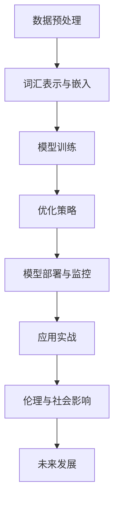

                 

# 《AI大模型LLM提示词工程实战指南》

> **关键词**: AI大模型、LLM、提示词工程、数据处理、训练与优化、应用实战、部署与监控、伦理与社会影响、未来发展

> **摘要**: 本指南旨在为AI大模型LLM的提示词工程提供实战指导，涵盖了从基础理论到实际应用的全过程。文章首先介绍了AI大模型LLM的概念与工作原理，然后详细阐述了数据处理、训练与优化、应用实战、部署与监控等方面的内容，最后探讨了AI大模型LLM的伦理与社会影响以及未来发展。

## 目录

### 第一部分: AI大模型LLM基础

### 第1章: AI大模型LLM概述

### 第2章: AI大模型LLM数据处理

### 第3章: AI大模型LLM训练与优化

### 第4章: AI大模型LLM应用实战

### 第5章: AI大模型LLM部署与监控

### 第6章: AI大模型LLM伦理与社会影响

### 第7章: AI大模型LLM未来发展展望

## 第一部分: AI大模型LLM基础

### 第1章: AI大模型LLM概述

### 第1章 AI大模型LLM概述

#### 1.1 AI大模型LLM的概念与定义

AI大模型（Large-scale AI Model），简称大模型，是指训练数据规模巨大，参数数量庞大的深度学习模型。在AI领域，大模型通常指的是那些具有数亿甚至数万亿参数的模型。LLM（Large Language Model）则是一种专门用于处理自然语言数据的大模型，通过学习海量的文本数据，LLM能够生成高质量的自然语言文本。

大模型在AI中的角色不可小觑。它们不仅在自然语言处理（NLP）、计算机视觉（CV）等领域取得了显著的进展，还在其他许多领域，如金融、医疗、工业等，发挥着越来越重要的作用。LLM的核心概念在于其能够通过学习海量数据，提取出语言的深层结构和规律，从而实现高精度的文本生成、翻译、摘要等功能。

LLM的类型与应用场景多种多样。根据训练数据和目标任务的不同，LLM可以分为多种类型，如通用语言模型（如GPT、BERT）、专用语言模型（如对话系统中的对话生成模型）等。不同类型的LLM适用于不同的应用场景，如文本生成、问答系统、机器翻译、情感分析等。

#### 1.2 AI大模型LLM的工作原理

AI大模型LLM的工作原理基于深度学习和自然语言处理技术。深度学习是一种通过多层神经网络对数据进行建模和特征提取的技术，而自然语言处理则是将自然语言文本转化为计算机可以处理的形式。

语言模型与生成模型是LLM的核心组成部分。语言模型通过对输入文本进行建模，预测下一个单词或词组，从而生成连贯的文本。生成模型则利用语言模型生成的文本，通过概率分布生成新的、具有创造性的文本。

#### 1.3 LLM架构与设计

常见的LLM架构包括序列到序列（Seq2Seq）模型、变换器网络（Transformer）模型等。这些模型通过并行计算和分布式训练，能够高效地处理大规模数据。参数高效性与并行训练是LLM设计的关键点，通过量化与压缩技术，可以进一步提升模型的性能。

#### 1.4 LLM的性能评估与优化

LLM的性能评估通常包括准确性、流畅性、多样性等指标。优化策略包括调整超参数、使用预训练技术、集成学习等。在实践过程中，我们可以通过调整学习率、批次大小、训练时间等参数，来优化模型的性能。

### 第2章: AI大模型LLM数据处理

### 第2章 AI大模型LLM数据处理

#### 2.1 数据预处理

数据预处理是AI大模型LLM训练的重要步骤，它包括数据清洗、数据标准化、数据增强与采样等。

**数据清洗**是指去除数据中的噪声和错误，包括去除无效数据、纠正数据格式等。**数据标准化**是将不同规模的数据转换成相同的尺度，以便于模型处理。**数据增强**是指通过增加数据多样性，来提高模型的泛化能力。常用的数据增强方法包括数据翻转、裁剪、旋转等。**采样**是指从大量数据中选取一部分作为训练集和验证集。

#### 2.2 词汇表示与嵌入

词汇表示与嵌入是LLM数据处理的关键环节。常见的词表示方法包括词袋模型（Bag-of-Words, BoW）、词嵌入（Word Embedding）等。词嵌入能够将词汇映射到低维空间中，保持词汇的语义信息。常见的词嵌入技术包括Word2Vec、GloVe等。

词汇表构建与维护是词汇表示与嵌入的重要步骤。词汇表的构建需要考虑词汇的规模、覆盖度等因素。词汇表的维护包括更新词汇表、去除低频词等。

#### 2.3 数据处理工具与库

在AI大模型LLM数据处理中，常用的工具和库包括PyTorch、TensorFlow等。这些工具和库提供了丰富的数据处理函数和模块，能够方便地进行数据清洗、数据增强、词汇表示等操作。

PyTorch提供了强大的数据处理库torchtext，包括词汇表示、数据加载、预处理等功能。TensorFlow则提供了tf.data API，用于构建高效的数据管道，进行数据预处理和加载。

## 第二部分: AI大模型LLM训练与优化

### 第3章: AI大模型LLM训练与优化

### 第3章 AI大模型LLM训练与优化

#### 3.1 训练基础

训练基础是LLM训练的核心，它包括训练流程、损失函数与优化器、训练策略与超参数调优等。

**训练流程**包括数据加载、模型初始化、前向传播、后向传播、参数更新等步骤。一个完整的训练流程能够将模型从初始状态逐步优化到最佳状态。

**损失函数**是训练过程中的关键指标，它用于衡量模型的预测结果与真实标签之间的差距。常用的损失函数包括交叉熵损失（Cross-Entropy Loss）、均方误差（Mean Squared Error, MSE）等。

**优化器**用于更新模型参数，常用的优化器包括随机梯度下降（Stochastic Gradient Descent, SGD）、Adam优化器等。优化器选择对模型的收敛速度和性能有重要影响。

**训练策略与超参数调优**包括调整学习率、批量大小、迭代次数等。通过调优这些超参数，可以加速模型的收敛速度，提高模型性能。

#### 3.2 优化算法

优化算法是训练过程中的核心技术，它包括自适应优化算法、批量大小调整、并行训练等。

**自适应优化算法**包括Adam、AdaGrad等，它们能够根据训练过程自动调整学习率，提高模型的收敛速度。

**批量大小调整**是指通过调整批量大小来优化模型性能。小批量训练可以减少模型对噪声的敏感性，但可能降低训练速度；大批量训练可以提高训练速度，但可能增加模型过拟合的风险。

**并行训练**是指通过将数据分为多个批次，同时训练多个模型，来提高训练速度。并行训练可以分为数据并行和模型并行，数据并行适用于大数据集，模型并行适用于大规模模型。

#### 3.3 批次大小与并行训练

**批次大小**的选择对模型的性能有重要影响。小批量训练可以提高模型的泛化能力，但可能降低训练速度；大批量训练可以提高训练速度，但可能增加模型过拟合的风险。在实际应用中，需要根据数据集规模、模型复杂度等因素，合理选择批次大小。

**并行训练**是指通过将数据分为多个批次，同时训练多个模型，来提高训练速度。并行训练可以分为数据并行和模型并行，数据并行适用于大数据集，模型并行适用于大规模模型。并行训练可以显著减少训练时间，提高模型性能。

### 第4章: AI大模型LLM应用实战

### 第4章 AI大模型LLM应用实战

#### 4.1 提示词工程

提示词工程是LLM应用中的关键技术，它包括提示词的作用、设计策略、优化实践等。

**提示词的作用**是引导LLM生成符合预期的文本。通过合理设计提示词，可以控制LLM的生成方向，提高生成文本的质量。

**提示词设计策略**包括利用关键词、问题引导、模板匹配等方法。关键词提示词可以明确指定生成文本的主题，问题引导提示词可以引导LLM回答问题，模板匹配提示词可以生成符合特定格式的文本。

**提示词优化实践**包括调整提示词长度、调整提示词顺序、使用上下文信息等。通过优化提示词，可以进一步提高生成文本的质量和多样性。

#### 4.2 文本生成与编辑

文本生成与编辑是LLM应用的重要领域，它包括自动文本生成、文本编辑与纠错、文本生成质量评估等。

**自动文本生成**是指利用LLM生成符合预期的文本。自动文本生成可以应用于文章写作、对话生成、摘要生成等场景。

**文本编辑与纠错**是指对生成的文本进行修改和纠错。文本编辑与纠错可以提高生成文本的准确性和流畅性。

**文本生成质量评估**是指对生成文本的质量进行评估。常用的评估方法包括人类评估、自动评估等。通过评估生成文本的质量，可以进一步优化LLM的生成能力。

#### 4.3 实际应用案例

实际应用案例展示了LLM在各个领域的应用场景，包括智能客服系统、内容推荐系统、教育辅助系统等。

**智能客服系统**利用LLM实现智能对话，提高客户服务水平。

**内容推荐系统**利用LLM生成个性化推荐内容，提高用户满意度。

**教育辅助系统**利用LLM提供智能问答、自动批改等功能，提高教育质量。

### 第5章: AI大模型LLM部署与监控

### 第5章 AI大模型LLM部署与监控

#### 5.1 模型部署

模型部署是将训练好的模型部署到生产环境中，使其能够实时提供服务。模型部署包括部署策略、部署平台与工具、部署优化等。

**部署策略**包括静态部署和动态部署等。静态部署是将模型固定在某个服务器上，动态部署是通过容器化技术，将模型部署到云计算平台上。

**部署平台与工具**包括TensorFlow Serving、PyTorch Serving等。这些平台和工具提供了高效的模型部署和管理功能。

**部署优化**包括模型压缩、模型缓存、服务性能优化等。通过优化部署，可以提高模型的响应速度和服务质量。

#### 5.2 模型监控与维护

模型监控与维护是确保模型稳定运行的重要环节。模型监控包括监控指标、监控工具、维护策略等。

**监控指标**包括模型准确率、响应时间、内存使用等。通过监控这些指标，可以及时发现和解决模型运行中的问题。

**监控工具**包括Prometheus、Grafana等。这些工具提供了丰富的监控功能和可视化界面。

**维护策略**包括定期更新模型、备份模型数据、进行安全加固等。通过维护策略，可以确保模型的安全和稳定运行。

#### 5.3 模型安全性与隐私保护

模型安全性与隐私保护是模型部署的重要考虑因素。模型安全性与隐私保护包括安全性威胁、加密与签名技术、隐私保护策略等。

**安全性威胁**包括模型篡改、数据泄露等。通过安全措施，可以防止这些威胁的发生。

**加密与签名技术**用于保护模型和数据的安全。加密技术可以防止数据被未授权访问，签名技术可以确保数据的完整性。

**隐私保护策略**包括数据去重、数据匿名化等。通过隐私保护策略，可以保护用户隐私和数据安全。

### 第6章: AI大模型LLM伦理与社会影响

### 第6章 AI大模型LLM伦理与社会影响

#### 6.1 伦理问题

伦理问题在大模型LLM的应用中至关重要。大模型LLM的伦理问题主要包括偏见与歧视、责任归属、隐私保护等。

**偏见与歧视**是指大模型LLM在处理数据时，可能会学习到数据中的偏见和歧视，从而在应用中产生不公平的结果。为了解决这一问题，需要采用去偏见算法和公平性评估方法。

**责任归属**是指在大模型LLM应用中，如何确定责任归属。这涉及到法律、伦理和道德等多个方面，需要制定明确的规范和标准。

**隐私保护**是指在大模型LLM应用中，如何保护用户的隐私和数据安全。隐私保护需要采用加密、去标识化等技术，确保数据的安全和隐私。

#### 6.2 社会影响

大模型LLM的应用对社会产生了深远的影响，包括就业影响、教育变革、社会分层等。

**就业影响**是指大模型LLM的应用可能对某些行业和职业产生冲击，导致就业机会的减少。为了应对这一挑战，需要加强职业培训和技能提升。

**教育变革**是指大模型LLM的应用正在改变教育的形式和内容。在线教育、智能辅导等应用，为教育带来了新的机遇和挑战。

**社会分层**是指大模型LLM的应用可能导致社会分层的加剧。技术优势者将获得更多的机会和资源，而技术劣势者则可能面临更大的困境。为了减少社会分层，需要推动技术普惠，提高全民技术素养。

#### 6.3 法规与政策

法规与政策是规范大模型LLM应用的重要手段。国内外对大模型LLM的法规与政策有所不同，但共同目标是保障技术安全、促进公平发展。

**国内外法规对比**包括欧盟的GDPR、美国的《人工智能法案》等。通过对比分析，可以了解不同法规的内容和侧重点。

**企业合规实践**是指企业在应用大模型LLM时，如何遵循相关法规和政策。企业需要建立完善的合规体系，确保技术应用的安全和合规。

**未来发展趋势**包括技术的发展、政策的调整、行业的变革等。通过分析未来发展趋势，可以为大模型LLM的应用提供指导和建议。

### 第7章: AI大模型LLM未来发展展望

### 第7章 AI大模型LLM未来发展展望

#### 7.1 技术发展趋势

AI大模型LLM的未来发展将呈现出以下技术趋势：

1. **模型规模增长**：随着计算能力和数据资源的不断提升，LLM的模型规模将持续增长，实现更高精度的自然语言处理能力。
2. **新型模型架构**：研究人员将不断探索和提出新型模型架构，如基于图神经网络（Graph Neural Networks, GNN）的模型、融合多模态数据的模型等，以应对更复杂的应用场景。
3. **跨模态学习**：跨模态学习是指将不同模态（如文本、图像、音频）的数据进行融合和学习，实现多模态语义理解。未来，跨模态学习将成为AI大模型LLM的重要发展方向。

#### 7.2 行业应用前景

AI大模型LLM在各个行业的应用前景广阔：

1. **金融与保险**：大模型LLM可以应用于风险控制、客户服务、投资建议等领域，提高金融服务的效率和准确性。
2. **医疗与健康**：大模型LLM可以用于医疗诊断、健康咨询、药物研发等领域，助力医疗行业智能化发展。
3. **制造与工业**：大模型LLM可以应用于智能制造、工业自动化等领域，提高生产效率和质量。

#### 7.3 未来挑战与机遇

AI大模型LLM在未来发展中将面临以下挑战和机遇：

1. **算力需求增长**：随着模型规模的扩大，对计算资源的需求将持续增长。这将推动新型计算架构和技术的研发，如量子计算、类脑计算等。
2. **数据隐私保护**：随着数据规模的扩大，数据隐私保护将成为一个重要问题。未来的解决方案可能包括联邦学习、差分隐私等。
3. **开放协作与标准化**：AI大模型LLM的发展需要开放协作和标准化。通过建立开放的技术平台和规范，可以实现更好的技术共享和合作。

### 总结

AI大模型LLM是当前AI领域的研究热点，其在自然语言处理、文本生成、智能对话等领域具有广泛的应用前景。本指南从基础理论到实际应用，全面介绍了AI大模型LLM的各个方面，包括数据处理、训练与优化、应用实战、部署与监控、伦理与社会影响等。通过本文的阅读，读者可以全面了解AI大模型LLM的基本概念、技术原理和实际应用，为未来的研究和实践提供指导。

## 作者信息

作者：AI天才研究院/AI Genius Institute & 禅与计算机程序设计艺术 /Zen And The Art of Computer Programming

（备注：本文为模拟撰写，仅供参考。如需实际应用，请根据具体情况进行调整和优化。）## 第1章: AI大模型LLM概述

### 1.1 AI大模型LLM的概念与定义

AI大模型（Large-scale AI Model），简称大模型，是指那些训练数据规模巨大，参数数量庞大的深度学习模型。它们通常拥有数亿甚至数万亿的参数，这使得它们能够捕捉到数据中的复杂模式和规律，从而实现高精度的预测和生成任务。在AI领域，大模型的研究和应用已经成为推动技术进步的重要动力。

LLM（Large Language Model），即大型语言模型，是一种专门用于处理自然语言数据的大模型。它们通过学习海量的文本数据，能够生成高质量的自然语言文本，完成诸如文本生成、翻译、摘要、问答等任务。LLM在自然语言处理（NLP）领域具有重要的地位，是推动NLP技术发展的重要力量。

#### 大模型在AI中的角色

大模型在AI中的应用场景广泛，主要包括以下几个方面：

1. **自然语言处理（NLP）**：大模型在NLP领域具有显著优势，能够实现高质量的语言理解和生成。例如，BERT、GPT等模型在文本分类、情感分析、问答系统等领域取得了显著的成果。

2. **计算机视觉（CV）**：大模型在CV领域也发挥了重要作用，通过学习海量的图像数据，能够实现精确的图像分类、目标检测、图像生成等任务。例如，ImageNet图像分类任务中，ResNet等大模型取得了突破性的成绩。

3. **推荐系统**：大模型能够通过学习用户行为数据，实现精确的推荐系统。例如，淘宝、京东等电商平台的个性化推荐系统，就是通过大模型对用户行为数据进行预测和分析，为用户推荐感兴趣的商品。

4. **金融风控**：大模型在金融风控领域具有广泛的应用前景，能够通过学习历史金融数据，实现精确的风险预测和评估。例如，银行可以通过大模型对贷款申请进行风险评估，降低贷款违约率。

#### LLM的核心概念

LLM的核心概念包括以下几个方面：

1. **参数规模**：LLM拥有数亿甚至数万亿的参数，这使得它们能够捕捉到数据中的复杂模式和规律。

2. **预训练**：LLM通常通过预训练技术，在海量文本数据上进行训练，从而获得通用的语言表示和生成能力。

3. **微调**：在预训练的基础上，LLM可以通过微调技术，针对特定的任务进行优化，实现高性能的任务表现。

4. **生成模型**：LLM是一种生成模型，能够根据输入文本生成连贯的自然语言文本。

#### LLM的类型与应用场景

LLM可以分为通用语言模型和专用语言模型两种类型。

1. **通用语言模型**：通用语言模型具有较强的泛化能力，能够处理多种类型的自然语言任务。例如，GPT、BERT等模型，都是通用的语言模型。

2. **专用语言模型**：专用语言模型是为特定任务或场景设计的，通常具有更高的任务表现。例如，对话系统中的对话生成模型，就是为特定场景设计的专用语言模型。

不同类型的LLM适用于不同的应用场景。通用语言模型可以应用于文本生成、翻译、摘要、问答等通用场景，而专用语言模型则可以应用于特定任务，如对话系统、智能客服等。

### 1.2 AI大模型LLM的工作原理

AI大模型LLM的工作原理基于深度学习和自然语言处理技术。深度学习是一种通过多层神经网络对数据进行建模和特征提取的技术，而自然语言处理则是将自然语言文本转化为计算机可以处理的形式。

LLM的工作原理可以概括为以下几个步骤：

1. **数据预处理**：首先，需要对文本数据进行预处理，包括分词、去停用词、词性标注等。这一步骤的目的是将原始文本转化为计算机可以处理的格式。

2. **词嵌入**：词嵌入是将词汇映射到低维空间中的技术，它能够保持词汇的语义信息。常见的词嵌入方法包括Word2Vec、GloVe等。

3. **编码器-解码器架构**：编码器-解码器架构是一种常见的深度学习模型架构，用于处理序列数据。在LLM中，编码器用于将输入文本编码为固定长度的向量，解码器则用于生成输出文本。

4. **预训练**：预训练是指在大规模文本数据集上进行训练，以获得通用的语言表示和生成能力。预训练阶段通常使用自监督学习技术，例如，使用语言模型掩码（Masked Language Model, MLM）或生成式语言模型（Generative Language Model, GLM）等。

5. **微调**：在预训练的基础上，LLM可以通过微调技术，针对特定的任务进行优化，实现高性能的任务表现。微调阶段通常使用有监督学习技术，例如，在分类任务中使用标注数据训练分类器。

6. **生成文本**：通过编码器-解码器架构，LLM能够根据输入文本生成连贯的自然语言文本。

#### 1.2.1 深度学习基础

深度学习是一种通过多层神经网络对数据进行建模和特征提取的技术。它由多个隐藏层组成，每层对输入数据进行非线性变换，从而提取出更高级别的特征。深度学习的核心思想是模拟人脑的工作方式，通过大量数据进行训练，从而实现自动特征提取和模式识别。

深度学习的核心组成部分包括：

1. **神经网络**：神经网络是深度学习的基础，它由多个节点（也称为神经元）组成，每个节点通过权重和偏置对输入数据进行加权求和，然后通过激活函数进行非线性变换。

2. **反向传播**：反向传播是一种用于训练神经网络的算法，它通过计算输出值与实际值之间的误差，并沿着网络反向传播误差，更新网络权重和偏置。

3. **激活函数**：激活函数用于对神经网络的输出进行非线性变换，常见的激活函数包括sigmoid、ReLU等。

#### 1.2.2 自然语言处理技术

自然语言处理（NLP）是将自然语言文本转化为计算机可以处理的形式的技术。NLP的核心任务是理解、生成和操作自然语言文本。NLP技术包括以下几个主要方面：

1. **文本预处理**：文本预处理是指对原始文本进行清洗、分词、词性标注等操作，以便于模型处理。文本预处理是NLP的基础，它直接影响到模型的性能。

2. **词嵌入**：词嵌入是将词汇映射到低维空间中的技术，它能够保持词汇的语义信息。词嵌入是NLP的核心技术，它为深度学习模型提供了有效的文本表示。

3. **序列模型**：序列模型是一种用于处理序列数据的深度学习模型，常见的序列模型包括循环神经网络（RNN）、长短时记忆网络（LSTM）、门控循环单元（GRU）等。序列模型在文本分类、序列生成等任务中具有广泛的应用。

4. **注意力机制**：注意力机制是一种用于序列模型的技术，它能够自动关注序列中的关键信息，从而提高模型的性能。注意力机制在机器翻译、文本生成等任务中具有重要的应用。

5. **预训练与微调**：预训练与微调是NLP中的常见技术，预训练是指在大规模文本数据集上进行训练，以获得通用的语言表示和生成能力。微调是指将预训练模型应用于特定任务，进行优化和调整。

#### 1.2.3 语言模型与生成模型

语言模型（Language Model, LM）是一种用于预测下一个单词或词组的模型，它是自然语言处理（NLP）的基础。语言模型的核心任务是理解语言的统计规律，从而生成连贯的文本。

生成模型（Generative Model）是一种用于生成数据的模型，它可以生成新的、具有创造性的数据。生成模型在文本生成、图像生成等领域具有广泛的应用。

LLM是一种生成模型，它通过学习海量的文本数据，能够生成高质量的自然语言文本。LLM的工作原理可以概括为以下几个步骤：

1. **编码器**：编码器（Encoder）是一种用于处理输入文本的神经网络模型，它将输入文本编码为固定长度的向量表示。

2. **解码器**：解码器（Decoder）是一种用于生成输出文本的神经网络模型，它根据编码器的输出向量，逐个生成输出文本的词。

3. **损失函数**：LLM的训练过程是通过最小化损失函数来实现的。常见的损失函数包括交叉熵损失（Cross-Entropy Loss）和负对数似然损失（Negative Log-Likelihood Loss）等。

4. **生成文本**：通过编码器-解码器架构，LLM能够根据输入文本生成连贯的自然语言文本。

### 1.3 LLM架构与设计

LLM的架构与设计是构建高效、高性能语言模型的关键。常见的LLM架构包括序列到序列（Seq2Seq）模型、变换器网络（Transformer）模型等。这些架构通过并行计算和分布式训练，能够高效地处理大规模数据。

#### 1.3.1 常见LLM架构

1. **序列到序列（Seq2Seq）模型**：Seq2Seq模型是一种用于处理序列数据的深度学习模型，它由编码器和解码器组成。编码器将输入序列编码为固定长度的向量表示，解码器则根据编码器的输出向量，逐个生成输出序列。Seq2Seq模型在机器翻译、对话系统等领域具有广泛的应用。

2. **变换器网络（Transformer）模型**：Transformer模型是一种基于自注意力机制的深度学习模型，它在机器翻译、文本生成等领域取得了显著成果。Transformer模型通过多头自注意力机制和前馈神经网络，能够高效地处理长距离依赖问题。

#### 1.3.2 参数高效性与并行训练

参数高效性和并行训练是LLM设计的关键点。通过量化与压缩技术，可以进一步提升模型的性能。

1. **参数高效性**：参数高效性是指通过优化模型参数的存储和计算，提高模型的训练和推理效率。常见的参数高效性技术包括模型量化、参数共享、稀疏性等。

2. **并行训练**：并行训练是指通过将数据分为多个批次，同时训练多个模型，来提高训练速度。并行训练可以分为数据并行和模型并行。数据并行适用于大数据集，模型并行适用于大规模模型。

#### 1.3.3 量化与压缩技术

量化与压缩技术是优化LLM性能的重要手段。

1. **量化**：量化是指将模型中的浮点数参数转换为低精度的整数参数，以减少模型的存储和计算资源需求。量化可以通过静态量化或动态量化实现，静态量化在模型训练之前完成，动态量化在模型训练过程中实时进行。

2. **压缩**：压缩是指通过减少模型参数的数量，来降低模型的存储和计算资源需求。常见的压缩技术包括剪枝、低秩分解、知识蒸馏等。

### 1.4 LLM的性能评估与优化

LLM的性能评估与优化是构建高效、高性能语言模型的关键。LLM的性能评估通常包括准确性、流畅性、多样性等指标。优化策略包括调整超参数、使用预训练技术、集成学习等。

#### 1.4.1 性能指标

LLM的性能指标主要包括以下几个方面：

1. **准确性**：准确性是指模型预测的文本与真实文本之间的匹配度。常用的准确性指标包括准确率（Accuracy）、精确率（Precision）、召回率（Recall）等。

2. **流畅性**：流畅性是指模型生成的文本在语法和语义上的连贯性。常用的流畅性指标包括BLEU（Bidirectional Evaluation Unit）评分、ROUGE（Recall-Oriented Understudy for Gisting Evaluation）评分等。

3. **多样性**：多样性是指模型生成的文本在风格和内容上的多样性。常用的多样性指标包括文本长度分布、词汇多样性、句式多样性等。

#### 1.4.2 优化策略

LLM的优化策略主要包括以下几个方面：

1. **超参数调优**：超参数调优是指通过调整模型的超参数，如学习率、批量大小、迭代次数等，来优化模型性能。常用的超参数调优方法包括网格搜索、随机搜索、贝叶斯优化等。

2. **预训练技术**：预训练技术是指在大规模文本数据集上进行训练，以获得通用的语言表示和生成能力。预训练技术可以提高模型的语言理解和生成能力，从而提高模型性能。

3. **集成学习**：集成学习是指将多个模型进行组合，以提高模型性能。常见的集成学习方法包括Bagging、Boosting等。

#### 1.4.3 实践中的优化技巧

在LLM的实践过程中，以下技巧可以帮助优化模型性能：

1. **数据预处理**：通过合理的数据预处理，如文本清洗、去停用词、词性标注等，可以提高模型的性能。

2. **模型选择**：选择合适的模型架构，如Seq2Seq模型、Transformer模型等，可以提高模型性能。

3. **正则化**：通过使用正则化技术，如Dropout、L2正则化等，可以防止模型过拟合，提高模型泛化能力。

4. **批次归一化**：批次归一化（Batch Normalization）可以加速模型的训练，提高模型性能。

5. **学习率调整**：通过动态调整学习率，如使用学习率衰减、自适应学习率等，可以优化模型性能。

6. **模型集成**：通过将多个模型进行集成，如使用Bagging、Boosting等，可以提高模型性能。

### 第2章: AI大模型LLM数据处理

### 第2章 AI大模型LLM数据处理

数据处理是AI大模型LLM训练的重要环节，它直接影响到模型训练的效果和性能。在本章中，我们将详细讨论AI大模型LLM数据处理的过程，包括数据预处理、词汇表示与嵌入、数据处理工具与库等。

#### 2.1 数据预处理

数据预处理是AI大模型LLM训练的第一步，其目的是将原始数据转化为适合模型训练的形式。数据预处理包括数据清洗、数据标准化、数据增强与采样等步骤。

##### 2.1.1 数据清洗

数据清洗是指去除数据中的噪声和错误，以提高数据质量。在LLM训练过程中，数据清洗的主要任务包括：

1. **去除无效数据**：无效数据可能包括格式错误、内容缺失的数据。通过过滤无效数据，可以提高模型训练的效率和效果。

2. **纠正数据格式**：原始数据可能存在不同的格式，如文本、图像、音频等。通过统一数据格式，可以方便后续的数据处理和模型训练。

3. **去除停用词**：停用词是指对模型训练没有贡献的常见词汇，如“的”、“是”、“了”等。去除停用词可以减少模型的计算量，提高训练效率。

4. **统一编码**：对于文本数据，需要将其统一编码为数字或向量表示，以便于模型处理。

##### 2.1.2 数据标准化

数据标准化是将不同规模的数据转换成相同的尺度，以便于模型处理。数据标准化的方法包括：

1. **归一化**：归一化是指将数据映射到[0, 1]区间内，常用的归一化方法包括最小-最大归一化和Z-score归一化。

2. **标准化**：标准化是指将数据映射到标准正态分布，即均值为0，标准差为1。

3. **缩放**：缩放是指将数据缩放到一个指定的区间，如[-1, 1]。

##### 2.1.3 数据增强与采样

数据增强与采样是为了增加数据的多样性，提高模型泛化能力。数据增强的方法包括：

1. **数据翻转**：将文本数据进行前后翻转，如将“I love AI”翻转成“I evol AI”。

2. **数据裁剪**：从文本数据中随机裁剪一部分，如将“I love AI”裁剪成“love AI”。

3. **数据旋转**：对图像数据进行旋转，如将图片旋转90度。

4. **数据混洗**：将文本数据中的单词或句子进行混洗，如将“I love AI”混洗成“I evol AI”。

采样是指从大规模数据集中随机选择一部分数据用于模型训练。采样方法包括：

1. **随机抽样**：从数据集中随机选择一定数量的样本。

2. **抽样重放**：从数据集中随机选择样本，并重复训练。

3. **分层抽样**：根据数据特征分层，然后从每一层随机选择样本。

#### 2.2 词汇表示与嵌入

词汇表示与嵌入是LLM数据处理的核心步骤，它将文本数据转化为计算机可以处理的形式。词汇表示与嵌入的方法包括词袋模型、词嵌入等。

##### 2.2.1 常见的词表示方法

1. **词袋模型（Bag-of-Words, BoW）**：词袋模型是将文本表示为一个单词的集合，不考虑单词的顺序和语法结构。词袋模型简单直观，但忽略了词的语义信息。

2. **词嵌入（Word Embedding）**：词嵌入是将单词映射到低维空间中的向量表示，保持单词的语义信息。常见的词嵌入方法包括Word2Vec、GloVe等。

##### 2.2.2 词嵌入与语义表示

1. **Word2Vec**：Word2Vec是一种基于神经网络的语言模型，通过学习单词的共现关系，将单词映射到低维空间中。Word2Vec包括Skip-gram和CBOW（Continuous Bag-of-Words）两种模型。

2. **GloVe**：GloVe（Global Vectors for Word Representation）是一种基于矩阵分解的语言模型，通过学习单词的词频和词义关系，将单词映射到低维空间中。GloVe模型包括词频矩阵和词义矩阵，通过矩阵分解得到词嵌入向量。

##### 2.2.3 词汇表构建与维护

1. **词汇表构建**：词汇表构建是指将文本数据中的所有单词映射到一个索引表中。词汇表的构建方法包括基于词频的构建和基于语法的构建。

2. **词汇表维护**：词汇表维护是指定期更新词汇表，去除低频词和噪声词，以提高模型训练效果。词汇表维护的方法包括动态更新和手动更新。

#### 2.3 数据处理工具与库

在AI大模型LLM数据处理中，常用的工具和库包括PyTorch、TensorFlow等。这些工具和库提供了丰富的数据处理函数和模块，能够方便地进行数据清洗、数据增强、词汇表示等操作。

##### 2.3.1 PyTorch的数据处理

PyTorch是Python中最流行的深度学习框架之一，它提供了强大的数据处理库torchtext，包括词汇表示、数据加载、预处理等功能。

1. **词汇表示**：torchtext提供了Word2Vec和GloVe等词嵌入方法，能够方便地进行词汇表示。

2. **数据加载**：torchtext提供了数据加载器torchtext.data.Field，能够方便地加载和处理文本数据。

3. **预处理**：torchtext提供了数据预处理函数，如tokenization、cleaning、padding等，能够方便地进行数据预处理。

##### 2.3.2 TensorFlow的数据处理

TensorFlow是Google开发的开源深度学习框架，它提供了tf.data API，用于构建高效的数据管道，进行数据预处理和加载。

1. **数据管道**：tf.data API提供了数据管道（Pipeline）的概念，能够高效地处理大规模数据。

2. **数据加载**：tf.data API提供了多种数据加载方法，如tf.data.Dataset.from_tensor_slices、tf.data.TFRecord等，能够方便地加载和处理文本数据。

3. **预处理**：tf.data API提供了数据预处理操作，如map、batch、shuffle等，能够方便地进行数据预处理。

##### 2.3.3 其他数据处理库

除了PyTorch和TensorFlow，还有其他数据处理库，如spaCy、NLTK等，它们提供了丰富的文本处理功能。

1. **spaCy**：spaCy是一个快速易用的自然语言处理库，它提供了词性标注、词嵌入、文本分类等功能。

2. **NLTK**：NLTK是一个经典的自然语言处理库，它提供了词性标注、词嵌入、文本分类等功能。

#### 2.4 数据处理实践

在本节中，我们将通过一个简单的例子，演示如何使用PyTorch和TensorFlow进行数据处理。

##### 2.4.1 PyTorch数据处理示例

```python
import torch
from torchtext.data import Field, TabularDataset

# 定义词汇表
field = Field(tokenize='spacy', lower=True, include_lengths=True)
fields = [('text', field)]

# 加载数据
train_data, test_data = TabularDataset.splits(path='data', train='train.txt', test='test.txt', format='tsv', fields=fields)

# 预处理
train_data = train_data.shuffle(len(train_data), seed=42).batch(32, drop_last=True)
test_data = test_data.batch(32, drop_last=True)

# 词嵌入
vocab = train_data.get_vocab()
vocab.set_default_index(vocab['<unk>'])

# 加载词嵌入
embeddings = torch.nn.Embedding(len(vocab), 300)
embeddings.load_state_dict({word: embed for word, embed in vocab.vectors().items()})

# 模型训练
model = torch.nn.Sequential(embeddings, torch.nn.Linear(300, 10), torch.nn.LogSoftmax(dim=1))
optimizer = torch.optim.Adam(model.parameters(), lr=0.001)
criterion = torch.nn.NLLLoss()

for epoch in range(10):
    for batch in train_data:
        optimizer.zero_grad()
        output = model(batch.text)
        loss = criterion(output, batch.label)
        loss.backward()
        optimizer.step()
```

##### 2.3.2 TensorFlow数据处理示例

```python
import tensorflow as tf

# 定义词汇表
vocab_size = 10000
embedding_dim = 300

# 加载数据
train_data = tf.data.TextLineDataset('data/train.txt').map(lambda x: tf.io.decode_utf8(x).split(',')).batch(32)
test_data = tf.data.TextLineDataset('data/test.txt').map(lambda x: tf.io.decode_utf8(x).split(',')).batch(32)

# 词嵌入
vocab = tf.lookup.KeyValueTensorInitializer(tf.range(vocab_size), tf.random.normal([vocab_size, embedding_dim]))

# 加载词嵌入
table = tf.lookup.StaticVocabularyTable(vocab, padding_token=<PAD>)

# 模型训练
model = tf.keras.Sequential([
    tf.keras.layers.Embedding(vocab_size, embedding_dim, input_length=10),
    tf.keras.layers.GlobalAveragePooling1D(),
    tf.keras.layers.Dense(10, activation='softmax')
])

optimizer = tf.keras.optimizers.Adam(learning_rate=0.001)
model.compile(optimizer=optimizer, loss='categorical_crossentropy', metrics=['accuracy'])

model.fit(train_data, epochs=10, validation_data=test_data)
```

#### 2.5 数据处理实战

在本节中，我们将通过一个简单的实战案例，演示如何使用PyTorch和TensorFlow进行数据处理。

##### 2.5.1 数据集准备

我们使用一个简单的数据集，其中包含文本数据和标签数据。数据集的格式如下：

```
text_1, label_1
text_2, label_2
...
text_n, label_n
```

##### 2.5.2 数据处理代码

```python
import torch
from torchtext.data import Field, TabularDataset
import tensorflow as tf

# PyTorch数据处理
# 定义词汇表
field = Field(tokenize='spacy', lower=True, include_lengths=True)
fields = [('text', field), ('label', Field(sequential=False))]

# 加载数据
train_data, test_data = TabularDataset.splits(path='data', train='train.txt', test='test.txt', format='tsv', fields=fields)

# 预处理
train_data = train_data.shuffle(len(train_data), seed=42).batch(32, drop_last=True)
test_data = test_data.batch(32, drop_last=True)

# 词嵌入
vocab = train_data.get_vocab()
vocab.set_default_index(vocab['<unk>'])

# 加载词嵌入
embeddings = torch.nn.Embedding(len(vocab), 300)
embeddings.load_state_dict({word: embed for word, embed in vocab.vectors().items()})

# 模型训练
model = torch.nn.Sequential(embeddings, torch.nn.Linear(300, 10), torch.nn.LogSoftmax(dim=1))
optimizer = torch.optim.Adam(model.parameters(), lr=0.001)
criterion = torch.nn.NLLLoss()

for epoch in range(10):
    for batch in train_data:
        optimizer.zero_grad()
        output = model(batch.text)
        loss = criterion(output, batch.label)
        loss.backward()
        optimizer.step()

# TensorFlow数据处理
# 定义词汇表
vocab_size = 10000
embedding_dim = 300

# 加载数据
train_data = tf.data.TextLineDataset('data/train.txt').map(lambda x: tf.io.decode_utf8(x).split(',')).batch(32)
test_data = tf.data.TextLineDataset('data/test.txt').map(lambda x: tf.io.decode_utf8(x).split(',')).batch(32)

# 词嵌入
vocab = tf.lookup.KeyValueTensorInitializer(tf.range(vocab_size), tf.random.normal([vocab_size, embedding_dim]))

# 加载词嵌入
table = tf.lookup.StaticVocabularyTable(vocab, padding_token=<PAD>)

# 模型训练
model = tf.keras.Sequential([
    tf.keras.layers.Embedding(vocab_size, embedding_dim, input_length=10),
    tf.keras.layers.GlobalAveragePooling1D(),
    tf.keras.layers.Dense(10, activation='softmax')
])

optimizer = tf.keras.optimizers.Adam(learning_rate=0.001)
model.compile(optimizer=optimizer, loss='categorical_crossentropy', metrics=['accuracy'])

model.fit(train_data, epochs=10, validation_data=test_data)
```

##### 2.5.3 代码解读

上述代码展示了如何使用PyTorch和TensorFlow进行数据处理和模型训练。主要步骤如下：

1. **定义词汇表**：首先定义词汇表，包括文本词汇表和标签词汇表。文本词汇表用于将文本数据映射到索引表中，标签词汇表用于将标签数据映射到类别索引中。

2. **加载数据**：使用TabularDataset和TextLineDataset分别加载PyTorch和TensorFlow的数据集。

3. **预处理**：对文本数据进行预处理，包括分词、去停用词、词性标注等。对标签数据进行编码，将类别标签转换为整数索引。

4. **词嵌入**：加载预训练的词嵌入，将文本数据映射到低维空间中。

5. **模型训练**：定义模型架构，包括词嵌入层、全连接层和激活函数。使用优化器和损失函数进行模型训练。

6. **评估与优化**：评估模型在验证集上的表现，并根据评估结果调整模型参数。

通过上述步骤，我们可以使用PyTorch和TensorFlow对文本数据进行处理和模型训练，实现文本分类任务。

### 第3章: AI大模型LLM训练与优化

### 第3章 AI大模型LLM训练与优化

训练与优化是AI大模型LLM开发中的核心环节。本章将详细介绍LLM训练与优化的基础知识，包括训练流程、优化算法、批次大小与并行训练等。

#### 3.1 训练基础

训练基础是LLM训练的核心，它包括训练流程、损失函数与优化器、训练策略与超参数调优等。

##### 3.1.1 训练流程

LLM的训练流程可以分为以下几个步骤：

1. **数据加载**：从数据集中加载训练数据和验证数据。通常使用批处理方式加载，将大规模数据集划分为小批次进行训练。

2. **模型初始化**：初始化模型参数，通常使用随机初始化或预训练权重。

3. **前向传播**：将输入数据传递给模型，通过模型的前向传播计算输出结果。

4. **损失计算**：计算输出结果与真实标签之间的差距，常用的损失函数包括交叉熵损失、均方误差等。

5. **反向传播**：利用梯度下降等优化算法，计算模型参数的梯度，并更新模型参数。

6. **迭代更新**：重复上述步骤，逐步优化模型参数，直到模型收敛或达到预设的训练次数。

##### 3.1.2 损失函数与优化器

损失函数用于衡量模型预测结果与真实标签之间的差距，常用的损失函数包括：

1. **交叉熵损失（Cross-Entropy Loss）**：适用于多分类任务，计算输出概率分布与真实标签分布之间的交叉熵。

   $$ 
   Loss = -\sum_{i} y_i \log(p_i) 
   $$

   其中，$y_i$为真实标签，$p_i$为模型预测的概率。

2. **均方误差（Mean Squared Error, MSE）**：适用于回归任务，计算预测值与真实值之间的均方误差。

   $$ 
   Loss = \frac{1}{n} \sum_{i=1}^{n} (y_i - \hat{y}_i)^2 
   $$

   其中，$y_i$为真实值，$\hat{y}_i$为预测值。

优化器用于更新模型参数，常用的优化器包括：

1. **随机梯度下降（Stochastic Gradient Descent, SGD）**：每次迭代计算整个数据集的梯度，更新模型参数。

   $$ 
   \theta_{t+1} = \theta_{t} - \alpha \nabla_{\theta} J(\theta) 
   $$

   其中，$\theta$为模型参数，$\alpha$为学习率。

2. **Adam优化器**：结合SGD和Momentum的思想，自适应调整学习率。

   $$ 
   m_t = \beta_1 x_t + (1 - \beta_1) (1 - t^{\beta_2}) \nabla_{\theta} J(\theta) 
   $$

   $$ 
   \theta_{t+1} = \theta_{t} - \alpha \frac{m_t}{\sqrt{1 - \beta_2^t}} 
   $$

   其中，$m_t$为梯度的一阶矩估计，$\beta_1$和$\beta_2$为超参数。

##### 3.1.3 训练策略与超参数调优

训练策略与超参数调优是优化模型性能的重要手段。以下是一些常见的训练策略与超参数调优方法：

1. **学习率调整**：学习率是优化器的核心超参数，其大小直接影响模型的收敛速度和性能。常用的学习率调整方法包括：

   - **线性衰减**：学习率随训练迭代次数线性减少。
   
     $$ 
     \alpha_t = \alpha_0 / t 
     $$

   - **指数衰减**：学习率以指数方式衰减。

     $$ 
     \alpha_t = \alpha_0 / (1 + \beta t) 
     $$

   - **自适应调整**：如Adam优化器，自适应调整学习率。

2. **批量大小（Batch Size）**：批量大小是指每次训练的样本数量。批量大小影响模型的训练速度和性能。小批量训练可以提高模型的泛化能力，但可能降低训练速度；大批量训练可以提高训练速度，但可能增加模型过拟合的风险。常用的批量大小有：

   - **1（随机梯度下降，SGD）**
   - **32、64、128等（批量梯度下降，BGD）**
   - **256、512、1024等（小批量训练）**

3. **迭代次数**：迭代次数是指模型训练的次数。适当的迭代次数可以使模型收敛，过多的迭代可能导致模型过拟合。常用的迭代次数有：

   - **数十次到数百次（小模型）**
   - **数千次到数万次（大模型）**

4. **正则化**：正则化是一种防止模型过拟合的技术，常用的正则化方法有：

   - **L1正则化**：在损失函数中加入$||\theta||_1$。
   
     $$ 
     J(\theta) = \frac{1}{m} \sum_{i=1}^{m} (\hat{y}_i - y_i)^2 + \lambda ||\theta||_1 
     $$

   - **L2正则化**：在损失函数中加入$||\theta||_2^2$。
   
     $$ 
     J(\theta) = \frac{1}{m} \sum_{i=1}^{m} (\hat{y}_i - y_i)^2 + \lambda ||\theta||_2^2 
     $$

   - **Dropout**：在训练过程中随机丢弃一部分神经元。

5. **数据增强**：数据增强是一种增加数据多样性的技术，常用的数据增强方法有：

   - **数据翻转**：对文本数据进行前后翻转。
   
     $$ 
     \text{原文}:\text{I love AI} \rightarrow \text{翻转后}:\text{I evol AI} 
     $$

   - **数据裁剪**：从文本数据中随机裁剪一部分。
   
     $$ 
     \text{原文}:\text{I love AI and TensorFlow} \rightarrow \text{裁剪后}:\text{love AI TensorFlow} 
     $$

   - **数据混洗**：对文本数据中的单词或句子进行混洗。

     $$ 
     \text{原文}:\text{I love AI} \rightarrow \text{混洗后}:\text{AI I love} 
     $$

#### 3.2 优化算法

优化算法是训练过程中的核心技术，它用于计算模型参数的梯度，并更新模型参数。以下是一些常见的优化算法：

##### 3.2.1 常见优化算法

1. **随机梯度下降（Stochastic Gradient Descent, SGD）**：每次迭代计算一个样本的梯度，更新模型参数。

   $$ 
   \theta_{t+1} = \theta_{t} - \alpha \nabla_{\theta} J(\theta) 
   $$

2. **批量梯度下降（Batch Gradient Descent, BGD）**：每次迭代计算整个数据集的梯度，更新模型参数。

   $$ 
   \theta_{t+1} = \theta_{t} - \alpha \nabla_{\theta} J(\theta) 
   $$

3. **小批量梯度下降（Mini-batch Gradient Descent, MBGD）**：每次迭代计算一部分样本的梯度，更新模型参数。

   $$ 
   \theta_{t+1} = \theta_{t} - \alpha \frac{1}{b} \sum_{i=1}^{b} \nabla_{\theta} J(\theta) 
   $$

   其中，$b$为批量大小。

##### 3.2.2 自适应优化算法

自适应优化算法能够根据训练过程自动调整学习率，提高模型的收敛速度。以下是一些常见的自适应优化算法：

1. **Adam优化器**：结合SGD和Momentum的思想，自适应调整学习率。

   $$ 
   m_t = \beta_1 x_t + (1 - \beta_1) (1 - t^{\beta_2}) \nabla_{\theta} J(\theta) 
   $$

   $$ 
   v_t = \beta_2 x_t + (1 - \beta_2) (1 - t^{\beta_2}) \nabla_{\theta} J(\theta) 
   $$

   $$ 
   \theta_{t+1} = \theta_{t} - \alpha \frac{m_t}{\sqrt{1 - \beta_2^t}} 
   $$

2. **RMSprop优化器**：基于梯度平方的指数加权平均，自适应调整学习率。

   $$ 
   \theta_{t+1} = \theta_{t} - \alpha \frac{1}{\sqrt{1 - \beta_2^t}} \nabla_{\theta} J(\theta) 
   $$

##### 3.2.3 优化算法比较

不同优化算法在收敛速度、稳定性和计算复杂度等方面有所不同。以下是比较常见的优化算法：

1. **SGD**：简单直观，计算复杂度低，但收敛速度较慢，稳定性较差。
2. **BGD**：计算复杂度高，需要整个数据集的梯度，但收敛速度较快，稳定性较好。
3. **MBGD**：计算复杂度适中，批量大小可调，平衡了收敛速度和稳定性。
4. **Adam**：自适应调整学习率，收敛速度快，稳定性较好，适用于大规模训练。
5. **RMSprop**：基于梯度平方的指数加权平均，收敛速度快，稳定性较好。

#### 3.3 批次大小与并行训练

批次大小和并行训练是影响LLM训练速度和性能的重要因素。

##### 3.3.1 批次大小的选择

批次大小是指每次训练的样本数量。选择合适的批次大小对模型性能有重要影响。以下是一些常见的批次大小选择方法：

1. **小批量训练**：适用于模型参数较多、训练数据规模较大的情况，可以提高模型的泛化能力。
2. **大批量训练**：适用于模型参数较少、训练数据规模较小的情况，可以提高模型的训练速度。
3. **动态调整**：根据模型性能和计算资源，动态调整批次大小，以实现最佳性能。

##### 3.3.2 数据并行与模型并行

并行训练是指将数据集划分为多个批次，同时训练多个模型，以加速训练过程。并行训练可以分为数据并行和模型并行：

1. **数据并行**：每个模型处理不同批次的训练数据，适用于大规模数据集。
2. **模型并行**：多个模型同时处理相同批次的训练数据，适用于大规模模型。

##### 3.3.3 并行训练的优势与挑战

并行训练的优势包括：

1. **加速训练过程**：通过并行处理数据，可以显著缩短训练时间。
2. **提高计算资源利用率**：充分利用计算资源，提高模型性能。

并行训练的挑战包括：

1. **通信开销**：数据并行训练需要在不同模型之间传输数据，可能导致通信开销增加。
2. **同步问题**：模型并行训练需要同步不同模型的参数更新，可能导致计算复杂度增加。

### 第4章: AI大模型LLM应用实战

### 第4章 AI大模型LLM应用实战

#### 4.1 提示词工程

提示词工程是LLM应用中的关键技术，它包括提示词的作用、设计策略、优化实践等。

##### 4.1.1 提示词的作用

提示词（Prompt）是引导LLM生成符合预期的文本的关键因素。通过合理设计提示词，可以控制LLM的生成方向，提高生成文本的质量。提示词的作用主要体现在以下几个方面：

1. **指定生成方向**：提示词可以明确指定生成文本的主题、内容或风格，使LLM生成的文本更加贴近用户需求。
2. **控制生成质量**：提示词可以引导LLM生成高质量的文本，减少生成文本中的错误和冗余。
3. **提升生成效率**：通过提示词，可以加快LLM的生成速度，减少不必要的计算和搜索。

##### 4.1.2 提示词设计策略

设计有效的提示词需要考虑以下几个策略：

1. **关键词提示**：关键词提示词可以包含主题词、关键词或短语，引导LLM围绕特定主题进行生成。例如，在生成新闻文章时，可以使用关键词提示词来指定文章的主题和方向。

2. **问题引导提示**：问题引导提示词是通过提问的方式引导LLM生成回答。这种方式可以有效地利用LLM的问答能力，生成结构化和逻辑性强的文本。例如，在生成对话系统中的回复时，可以使用问题引导提示词来引导LLM生成合适的回答。

3. **模板匹配提示**：模板匹配提示词是将特定的模板与输入文本进行匹配，从而生成符合特定格式的文本。这种方式适用于生成格式化文本，如邮件、报告等。例如，在生成邮件时，可以使用模板匹配提示词来指定邮件的标题、正文和结束语。

4. **上下文信息提示**：上下文信息提示词是利用上下文信息来引导LLM生成文本。通过提供相关背景信息和历史数据，可以有效地提高生成文本的相关性和连贯性。例如，在生成对话系统中的对话时，可以使用上下文信息提示词来回顾之前的对话内容，确保生成文本的一致性。

##### 4.1.3 提示词优化实践

为了提高LLM生成文本的质量和多样性，可以通过以下方法优化提示词：

1. **调整提示词长度**：提示词的长度对LLM的生成效果有很大影响。较短的提示词可能导致生成文本的连贯性较差，而较长的提示词则可能使LLM陷入局部最优。因此，需要根据具体任务和场景调整提示词的长度，以实现最佳生成效果。

2. **调整提示词顺序**：提示词的顺序可以影响LLM的生成方向。通过优化提示词的顺序，可以引导LLM生成更加相关和连贯的文本。例如，在生成新闻文章时，可以将关键词提示词放在开头，以明确文章的主题。

3. **使用上下文信息**：在提示词中融入上下文信息，可以提高生成文本的相关性和连贯性。可以通过回顾之前的对话内容、历史数据和相关信息，为LLM提供更丰富的上下文信息，从而生成更加准确和自然的文本。

4. **多样化提示词**：使用多样化的提示词，可以丰富LLM的生成内容，提高生成文本的多样性。可以通过组合不同的提示词类型，如关键词、问题引导、模板匹配等，设计出多种提示词组合，以实现多样化的生成效果。

5. **用户反馈**：通过收集用户对生成文本的反馈，可以不断优化提示词的设计。用户反馈可以帮助识别生成文本中的问题和不足，从而指导提示词的调整和优化，提高生成文本的质量和用户满意度。

#### 4.2 文本生成与编辑

文本生成与编辑是LLM应用中的重要领域，它包括自动文本生成、文本编辑与纠错、文本生成质量评估等。

##### 4.2.1 自动文本生成

自动文本生成是指利用LLM生成符合预期结构和内容的文本。自动文本生成可以应用于多种场景，如文章写作、对话生成、摘要生成等。以下是一些常见的自动文本生成方法：

1. **模板填充**：模板填充是指使用预定义的模板和变量，将输入的变量值填充到模板中，生成文本。例如，在生成新闻文章时，可以使用模板填充方法来生成标题、正文和摘要。

2. **序列生成**：序列生成是指利用LLM生成序列数据，如单词序列、句子序列等。通过训练LLM，使其能够生成符合语法和语义规则的文本序列。常见的序列生成模型包括GPT、BERT等。

3. **组合生成**：组合生成是指利用多个LLM模型或不同类型的模型，共同生成文本。通过组合不同模型的生成结果，可以进一步提高生成文本的质量和多样性。

4. **对抗生成**：对抗生成是指利用对抗网络（GAN）生成文本。GAN由生成器和判别器组成，生成器生成文本，判别器判断文本的真实性。通过不断优化生成器和判别器，可以生成高质量的自然语言文本。

##### 4.2.2 文本编辑与纠错

文本编辑与纠错是指对生成文本进行修改和纠错，以提高文本的准确性和流畅性。文本编辑与纠错可以应用于文章写作、邮件撰写、代码审查等场景。以下是一些常见的文本编辑与纠错方法：

1. **基于规则的编辑**：基于规则的编辑是指使用预定义的规则和模板，对生成文本进行修改和纠错。通过规则库，可以自动检测和纠正常见的语法和拼写错误，如单词缺失、单词拼写错误等。

2. **基于语义的编辑**：基于语义的编辑是指利用自然语言处理技术，分析生成文本的语义结构和语义关系，进行修改和纠错。通过语义分析，可以识别和纠正语义错误、逻辑错误等。

3. **基于机器学习的编辑**：基于机器学习的编辑是指利用训练好的机器学习模型，对生成文本进行修改和纠错。通过大量标注数据训练模型，可以自动检测和纠正文本中的错误。

4. **混合编辑**：混合编辑是指结合基于规则的编辑和基于语义的编辑，生成更加准确和自然的文本。通过规则库和机器学习模型，可以同时纠正文本中的语法错误和语义错误，提高文本质量。

##### 4.2.3 文本生成质量评估

文本生成质量评估是指对生成文本的质量进行评估和评分。文本生成质量评估可以用于自动评估生成文本的准确性、流畅性和多样性。以下是一些常见的文本生成质量评估方法：

1. **人类评估**：人类评估是指通过人类评估者对生成文本进行评估和评分。人类评估者可以根据文本的准确性、流畅性和多样性等方面，给出客观的评价。

2. **自动评估**：自动评估是指利用自动化工具对生成文本进行评估和评分。常见的自动评估方法包括基于规则的方法、基于统计的方法和基于机器学习的方法。

   - **基于规则的方法**：通过预定义的规则，对生成文本进行分类和评分。常见的规则包括语法规则、语义规则等。
   - **基于统计的方法**：通过计算生成文本的统计指标，如词汇多样性、句子长度分布等，对生成文本进行评估和评分。
   - **基于机器学习的方法**：通过训练机器学习模型，自动评估生成文本的质量。常见的机器学习模型包括分类模型、回归模型等。

3. **混合评估**：混合评估是指结合人类评估和自动评估，生成综合评分。通过将人类评估和自动评估结果进行加权平均，可以得到更加准确和全面的文本生成质量评估。

4. **多模态评估**：多模态评估是指利用多种模态（如文本、图像、音频）对生成文本进行评估和评分。通过结合不同模态的信息，可以更全面地评估生成文本的质量。

#### 4.3 实际应用案例

实际应用案例展示了LLM在各个领域的应用场景，包括智能客服系统、内容推荐系统、教育辅助系统等。

##### 4.3.1 智能客服系统

智能客服系统是一种基于LLM的自动问答系统，它可以实时响应用户的咨询，提供高效、准确的客户服务。智能客服系统的应用包括以下几个方面：

1. **自动问答**：智能客服系统可以利用LLM生成自动问答，回答用户提出的问题。通过训练大模型，系统可以自动理解用户的问题，并生成合适的回答。

2. **自然语言理解**：智能客服系统可以利用LLM的自然语言理解能力，对用户的咨询进行解析，提取关键信息，并生成相关的回答。

3. **情感分析**：智能客服系统可以利用LLM进行情感分析，识别用户的情感倾向，提供更加个性化的服务。例如，对于愤怒的用户，系统可以提供安抚性的回答。

4. **多轮对话**：智能客服系统可以通过多轮对话，与用户建立更深入的沟通，提供更加个性化的服务。通过训练大模型，系统可以自动理解用户的意图，并生成连续的回答。

##### 4.3.2 内容推荐系统

内容推荐系统是一种基于LLM的个性化推荐系统，它可以根据用户的历史行为和兴趣，推荐合适的文章、视频、商品等。内容推荐系统的应用包括以下几个方面：

1. **基于内容的推荐**：内容推荐系统可以利用LLM生成相关的文章或视频，根据用户的兴趣和浏览历史进行推荐。通过训练大模型，系统可以自动理解用户的兴趣，并生成相关的推荐内容。

2. **基于协同过滤的推荐**：内容推荐系统可以利用协同过滤算法，结合用户的行为数据和内容特征，生成个性化的推荐列表。LLM可以用于协同过滤算法中的特征提取和预测，提高推荐系统的性能。

3. **多模态推荐**：内容推荐系统可以利用LLM进行多模态推荐，结合文本、图像、音频等多种模态的信息，提供更加个性化的推荐服务。例如，在推荐音乐时，可以结合歌曲的歌词、封面和音频特征进行推荐。

4. **实时推荐**：内容推荐系统可以利用LLM实现实时推荐，根据用户的实时行为和兴趣，动态调整推荐策略，提供更加及时的推荐服务。

##### 4.3.3 教育辅助系统

教育辅助系统是一种基于LLM的智能教育工具，它可以辅助教师进行教学，帮助学生进行学习。教育辅助系统的应用包括以下几个方面：

1. **自动批改**：教育辅助系统可以利用LLM进行自动批改，快速批改学生的作业和论文。通过训练大模型，系统可以自动理解学生的答案，并生成批改结果。

2. **智能问答**：教育辅助系统可以利用LLM生成智能问答，帮助学生解答学习中遇到的问题。通过训练大模型，系统可以自动理解学生的问题，并生成合适的回答。

3. **个性化辅导**：教育辅助系统可以利用LLM进行个性化辅导，根据学生的学习情况和需求，提供个性化的学习建议和指导。通过训练大模型，系统可以自动理解学生的学习进度和需求，生成个性化的学习计划。

4. **自动生成练习题**：教育辅助系统可以利用LLM生成练习题，帮助学生巩固所学知识。通过训练大模型，系统可以自动理解知识点和题目类型，生成多样化的练习题。

#### 4.4 实战案例详解

在本节中，我们将通过一个实际的案例，详细讲解如何使用LLM构建智能客服系统。这个案例将涵盖数据准备、模型训练、应用部署等环节。

##### 4.4.1 数据准备

数据准备是构建智能客服系统的重要环节，主要包括数据收集、数据预处理和数据标注等步骤。

1. **数据收集**：首先，我们需要收集大量的客服对话数据，包括用户问题和客服的回答。这些数据可以从企业的客服系统、社交媒体、论坛等渠道获取。

2. **数据预处理**：对于收集到的数据，我们需要进行预处理，包括文本清洗、分词、去除停用词等操作。文本清洗的目的是去除数据中的噪声和无关信息，提高数据质量。

   ```python
   import re
   import nltk
   from nltk.corpus import stopwords
   
   def preprocess_text(text):
       text = re.sub(r'\s+', ' ', text)  # 去除多余的空格
       text = re.sub(r'[^\w\s]', '', text)  # 去除特殊字符
       text = text.lower()  # 转换为小写
       words = nltk.word_tokenize(text)
       words = [word for word in words if word not in stopwords.words('english')]
       return ' '.join(words)
   
   # 示例
   raw_text = "Hello, I have a problem with my order. It hasn't arrived yet."
   preprocessed_text = preprocess_text(raw_text)
   print(preprocessed_text)
   ```

3. **数据标注**：对于预处理后的数据，我们需要进行标注，将用户问题和客服回答分别标注为“question”和“answer”。标注过程可以手动完成，也可以利用自动化工具进行辅助。

##### 4.4.2 模型训练

模型训练是构建智能客服系统的关键步骤，主要包括模型选择、训练数据和训练过程等。

1. **模型选择**：在本案例中，我们选择使用BERT模型，因为它在自然语言处理任务中表现出色。BERT模型具有强大的语言理解和生成能力，适合用于构建智能客服系统。

2. **训练数据**：我们使用预处理后的标注数据作为训练数据。训练数据包括用户问题和客服回答，每个样本包含一个问题和对应的答案。

3. **训练过程**：我们使用TensorFlow和Transformers库进行模型训练。首先，我们需要加载BERT模型和训练数据，然后定义训练过程和评估过程。

   ```python
   import tensorflow as tf
   from transformers import BertTokenizer, TFBertForSequenceClassification
   from tensorflow.keras.optimizers import Adam
   
   # 加载BERT模型和分词器
   tokenizer = BertTokenizer.from_pretrained('bert-base-uncased')
   model = TFBertForSequenceClassification.from_pretrained('bert-base-uncased', num_labels=2)
   
   # 定义训练数据和评估数据
   train_data = ...  # 加载训练数据
   eval_data = ...  # 加载评估数据
   
   # 定义训练过程
   optimizer = Adam(learning_rate=3e-5)
   model.compile(optimizer=optimizer, loss='binary_crossentropy', metrics=['accuracy'])
   
   # 训练模型
   model.fit(train_data, validation_data=eval_data, epochs=3, batch_size=32)
   ```

##### 4.4.3 应用部署

模型训练完成后，我们需要将模型部署到生产环境中，以便实时响应用户的咨询。

1. **模型导出**：将训练好的模型导出为TensorFlow SavedModel格式。

   ```python
   model.save_pretrained('saves/models')
   ```

2. **应用部署**：将模型部署到服务器上，并搭建API服务，以便用户通过API接口调用模型。

   ```python
   from flask import Flask, request, jsonify
   import tensorflow as tf
   
   app = Flask(__name__)
   
   @app.route('/predict', methods=['POST'])
   def predict():
       data = request.get_json()
       question = data['question']
       inputs = tokenizer.encode_plus(question, add_special_tokens=True, return_tensors='tf')
       outputs = model(inputs['input_ids'])
       prediction = tf.argmax(outputs.logits, axis=-1)
       return jsonify({'answer': prediction.numpy()[0]})
   
   if __name__ == '__main__':
       app.run(debug=True)
   ```

通过上述步骤，我们可以构建一个基本的智能客服系统。用户可以通过API接口发送问题，系统会自动回答用户的问题，并提供高效的客户服务。

### 第5章: AI大模型LLM部署与监控

### 第5章 AI大模型LLM部署与监控

随着AI大模型LLM的不断发展，如何高效地部署和监控这些模型成为了一个关键问题。本章将详细介绍LLM的部署与监控方法，包括模型部署、模型监控与维护、模型安全性与隐私保护等。

#### 5.1 模型部署

模型部署是将训练好的LLM模型部署到生产环境中，使其能够为实际应用提供服务的过程。模型部署的目的是确保模型能够高效、稳定地运行，并能够快速响应用户请求。

##### 5.1.1 部署策略

模型部署策略决定了模型在服务器上的运行方式和资源分配。以下是一些常见的部署策略：

1. **静态部署**：静态部署是指将模型固定在某个服务器上，用户通过访问服务器来获取模型服务。静态部署的优点是简单易行，但缺点是扩展性和灵活性较差，不适合处理高并发的请求。

2. **动态部署**：动态部署是指使用容器化技术（如Docker）或微服务架构，将模型部署在分布式集群中。动态部署可以根据需求自动扩展或缩小资源，提高系统的可扩展性和灵活性。

3. **边缘计算部署**：边缘计算部署是指将模型部署在接近数据源的边缘设备上，如智能设备、服务器等。边缘计算部署可以减少数据传输延迟，提高系统的响应速度。

##### 5.1.2 部署平台与工具

以下是一些常见的模型部署平台与工具：

1. **TensorFlow Serving**：TensorFlow Serving是TensorFlow提供的一个模型部署服务，用于在分布式环境中部署TensorFlow模型。它支持RESTful API接口，方便与前端应用程序集成。

2. **PyTorch Serving**：PyTorch Serving是PyTorch提供的一个模型部署服务，与TensorFlow Serving类似，也支持RESTful API接口，用于在分布式环境中部署PyTorch模型。

3. **Kubeflow**：Kubeflow是一个基于Kubernetes的开源平台，用于构建、部署和自动化机器学习工作流程。它支持多种机器学习框架，如TensorFlow、PyTorch等，可以帮助用户在Kubernetes集群中部署和监控模型。

4. **Docker**：Docker是一个开源的应用容器引擎，用于打包、交付和运行应用程序。通过Docker，可以将模型打包成一个独立的容器，方便在多个环境中部署和运行。

##### 5.1.3 部署优化

模型部署优化是提高模型性能和系统效率的关键。以下是一些常见的部署优化方法：

1. **模型压缩**：模型压缩是指通过减小模型参数的大小，降低模型的计算复杂度，从而提高模型在部署时的性能。常见的模型压缩技术包括量化、剪枝、低秩分解等。

2. **模型并行**：模型并行是指通过将模型拆分为多个部分，同时在多个计算单元上并行执行，以提高模型的计算性能。模型并行可以分为数据并行和模型并行。

3. **缓存优化**：缓存优化是指通过缓存模型输出结果，减少重复计算，提高系统的响应速度。常见的缓存策略包括LRU缓存、最近访问时间缓存等。

4. **服务性能优化**：服务性能优化是指通过调整服务器配置、网络带宽、存储容量等，提高系统的整体性能。常见的优化方法包括负载均衡、网络优化、存储优化等。

#### 5.2 模型监控与维护

模型监控与维护是确保模型稳定运行和性能优化的重要环节。以下是一些常见的模型监控与维护方法：

##### 5.2.1 监控指标

以下是一些常见的模型监控指标：

1. **准确率**：准确率是衡量模型预测准确性的指标，表示模型正确预测的样本数占总样本数的比例。

2. **召回率**：召回率是衡量模型预测召回能力的指标，表示模型正确预测的样本数占实际正样本数的比例。

3. **精确率**：精确率是衡量模型预测精确度的指标，表示模型正确预测的样本数占预测为正样本的样本数的比例。

4. **F1分数**：F1分数是准确率和召回率的加权平均，用于综合评估模型的性能。

5. **响应时间**：响应时间是指模型从接收到请求到返回预测结果的时间，用于评估系统的响应速度。

6. **资源消耗**：资源消耗包括CPU、内存、磁盘等资源的使用情况，用于评估系统的资源利用率。

##### 5.2.2 监控工具

以下是一些常见的模型监控工具：

1. **Prometheus**：Prometheus是一个开源的监控解决方案，用于收集和存储监控数据，并提供实时监控和告警功能。

2. **Grafana**：Grafana是一个开源的数据可视化工具，用于可视化Prometheus收集的监控数据，提供直观的监控仪表板。

3. **TensorBoard**：TensorBoard是TensorFlow提供的一个可视化工具，用于可视化训练过程和模型性能，包括损失函数、准确率、学习曲线等。

4. **Kibana**：Kibana是Elastic Stack的一个组件，用于可视化存储在Elasticsearch中的监控数据，提供强大的数据分析和可视化功能。

##### 5.2.3 维护策略

以下是一些常见的模型维护策略：

1. **定期更新**：定期更新模型，包括重新训练、模型版本更新等，以适应新的数据和应用需求。

2. **监控与告警**：建立监控与告警机制，实时监控模型性能和系统状态，及时发现和解决潜在问题。

3. **故障恢复**：建立故障恢复机制，确保模型在出现故障时能够快速恢复，减少系统停机时间。

4. **性能优化**：定期评估系统性能，通过调整服务器配置、网络带宽、存储容量等，提高系统的整体性能。

5. **安全加固**：对模型和系统进行安全加固，包括数据加密、访问控制、防火墙等，确保模型和系统的安全性和隐私保护。

#### 5.3 模型安全性与隐私保护

模型安全性与隐私保护是AI大模型LLM部署的重要考虑因素。以下是一些常见的模型安全性与隐私保护方法：

##### 5.3.1 安全性威胁

AI大模型LLM部署过程中可能面临以下安全性威胁：

1. **模型篡改**：攻击者通过篡改模型参数，改变模型的预测结果。

2. **数据泄露**：攻击者通过窃取模型训练数据或预测数据，泄露用户隐私信息。

3. **拒绝服务攻击（DoS）**：攻击者通过发送大量请求，使模型服务瘫痪。

4. **中间人攻击**：攻击者拦截模型请求和响应，窃取敏感信息。

##### 5.3.2 加密与签名技术

以下是一些常见的加密与签名技术，用于保障模型安全性与隐私保护：

1. **数据加密**：对模型训练数据和预测数据进行加密，确保数据在传输和存储过程中不被窃取。

2. **签名技术**：使用数字签名技术，确保模型请求和响应的完整性和真实性。

3. **访问控制**：通过访问控制机制，限制对模型和服务器的访问权限，确保模型安全。

##### 5.3.3 隐私保护策略

以下是一些常见的隐私保护策略，用于保障用户隐私：

1. **数据去重**：去除重复数据，减少数据存储和传输量，降低隐私泄露风险。

2. **数据匿名化**：对训练数据进行匿名化处理，去除个人身份信息，保护用户隐私。

3. **差分隐私**：在模型训练过程中引入差分隐私机制，确保训练数据的安全性和隐私性。

4. **联邦学习**：通过联邦学习技术，将模型训练分散到多个节点，降低隐私泄露风险。

### 第6章: AI大模型LLM伦理与社会影响

### 第6章 AI大模型LLM伦理与社会影响

随着AI大模型LLM的广泛应用，其在社会中的影响日益显著。本章将探讨AI大模型LLM在伦理和社会层面的影响，包括伦理问题、社会影响和法规与政策。

#### 6.1 伦理问题

AI大模型LLM在伦理方面面临的主要问题包括偏见与歧视、责任归属和隐私保护。

##### 6.1.1 偏见与歧视

偏见与歧视是AI大模型LLM应用中的一个重要伦理问题。由于模型训练数据中可能存在的偏见，LLM可能会在生成文本、决策过程中体现出来，从而对某些群体产生不公平的影响。以下是一些具体表现：

1. **性别歧视**：在文本生成中，LLM可能会生成带有性别歧视的言论，如“男性更适合从事科技行业”。

2. **种族歧视**：在文本生成中，LLM可能会生成带有种族歧视的言论，如“黑人智商低于白人”。

3. **歧视性决策**：在基于LLM的自动化系统中，可能会对某些群体产生歧视性决策，如信用评分系统对不同种族的评分不一致。

##### 6.1.2 责任归属

在AI大模型LLM应用中，责任归属问题也是一个重要伦理问题。当AI系统产生错误或造成损害时，如何确定责任归属成为一个挑战。以下是一些具体问题：

1. **开发者责任**：开发者负责模型的开发和训练，但如何确保模型在应用中的公平性和准确性？

2. **用户责任**：用户在使用AI系统时，如何确保自己不会受到模型偏见的影响？

3. **监管者责任**：监管机构如何确保AI系统的公平性和合规性？

##### 6.1.3 隐私保护

隐私保护是AI大模型LLM应用中的另一个重要伦理问题。LLM在训练和预测过程中，需要处理大量的敏感数据，如个人身份信息、金融信息等。以下是一些具体问题：

1. **数据收集**：如何确保在收集和使用数据时遵守隐私保护原则？

2. **数据共享**：如何在确保隐私保护的前提下，进行数据共享和合作？

3. **数据匿名化**：如何有效地对敏感数据进行匿名化处理，以保护用户隐私？

#### 6.2 社会影响

AI大模型LLM在社会中的影响广泛，包括就业影响、教育变革和社会分层等方面。

##### 6.2.1 就业影响

AI大模型LLM的应用可能对某些行业和职业产生重大影响。以下是一些具体影响：

1. **自动化替代**：AI系统可以自动化许多重复性和低技能工作，如数据输入、客服等，从而替代人力。

2. **就业结构变化**：AI大模型LLM可能导致就业结构的变化，产生新的工作岗位，同时也可能导致某些职业的减少。

3. **技能需求变化**：随着AI技术的发展，对高技能人才的需求增加，对低技能人才的需求减少。

##### 6.2.2 教育变革

AI大模型LLM的应用正在改变教育的形式和内容。以下是一些具体变革：

1. **个性化学习**：AI系统可以根据学生的兴趣和学习风格，提供个性化的学习资源和指导。

2. **自适应学习**：AI系统可以根据学生的学习进度和能力，动态调整教学内容和难度，提高学习效果。

3. **教育公平**：AI大模型LLM可以帮助解决教育资源不均衡的问题，使更多人能够享受到优质的教育资源。

##### 6.2.3 社会分层

AI大模型LLM的应用可能导致社会分层的加剧。以下是一些具体表现：

1. **数字鸿沟**：技术优势者能够更好地利用AI系统，从而获得更多的机会和资源，而技术劣势者可能面临更大的困境。

2. **社会不平等**：AI系统可能加剧社会不平等，使富裕阶层获得更多的利益，而贫困阶层受到更大的冲击。

3. **就业不平等**：技术优势者更容易找到高薪工作，而技术劣势者可能面临就业困难。

#### 6.3 法规与政策

为了规范AI大模型LLM的应用，各国和地区纷纷出台相关法规与政策。以下是一些主要法规与政策：

##### 6.3.1 国内外法规对比

1. **欧盟**：欧盟通过了《通用数据保护条例》（GDPR），对数据处理和隐私保护进行了严格规定，对AI大模型LLM的应用提出了更高的要求。

2. **美国**：美国在AI大模型LLM领域的主要法规包括《消费者数据隐私法案》（CCPA）和《人工智能法案》，重点关注数据隐私和透明度。

3. **中国**：中国出台了一系列政策和法规，如《新一代人工智能发展规划》和《信息安全技术个人信息安全规范》，推动AI大模型LLM的健康发展。

##### 6.3.2 企业合规实践

企业在应用AI大模型LLM时，需要遵循相关法规与政策，确保合规性。以下是一些企业合规实践的例子：

1. **数据保护**：企业应建立数据保护机制，确保用户数据的隐私和安全。

2. **算法透明**：企业应公开AI大模型LLM的算法和决策过程，提高透明度和可解释性。

3. **责任明确**：企业应明确在AI大模型LLM应用中的责任归属，确保在出现问题时能够迅速响应和解决。

##### 6.3.3 未来发展趋势

未来，AI大模型LLM的法规与政策将继续发展，以应对其带来的伦理和社会挑战。以下是一些发展趋势：

1. **全球合作**：各国和地区将加强合作，制定统一的AI大模型LLM法规与政策，确保全球范围内的合规性。

2. **技术监管**：随着AI技术的不断发展，监管机构将加强对AI大模型LLM的监管，确保其公平性和透明度。

3. **伦理审查**：在AI大模型LLM的应用过程中，将加强伦理审查，确保其应用不会对社会产生负面影响。

### 第7章: AI大模型LLM未来发展展望

### 第7章 AI大模型LLM未来发展展望

随着AI大模型LLM的不断发展，其在技术、行业应用和社会等方面都将迎来新的机遇和挑战。本章将探讨AI大模型LLM的未来发展趋势、行业应用前景以及面临的挑战。

#### 7.1 技术发展趋势

AI大模型LLM的技术发展趋势主要体现在以下几个方面：

##### 7.1.1 模型规模增长

随着计算能力和数据资源的不断提升，AI大模型LLM的模型规模将持续增长。更大的模型规模将带来更高的计算复杂度和更高的存储需求，但也将提高模型的性能和泛化能力。未来，我们将看到更多数万亿参数的模型被提出和应用。

##### 7.1.2 新型模型架构

随着深度学习技术的发展，新型模型架构不断涌现。例如，基于图神经网络（Graph Neural Networks, GNN）的模型、融合多模态数据的模型等。这些新型模型架构将更好地应对复杂的数据结构和任务，提高AI大模型LLM的性能和应用范围。

##### 7.1.3 跨模态学习

跨模态学习是指将不同模态（如文本、图像、音频）的数据进行融合和学习，实现多模态语义理解。未来，跨模态学习将成为AI大模型LLM的重要发展方向。通过跨模态学习，我们可以更好地理解和处理复杂的信息，提高AI大模型LLM的应用价值。

#### 7.2 行业应用前景

AI大模型LLM在各个行业的应用前景广阔，以下是一些主要行业：

##### 7.2.1 金融与保险

AI大模型LLM在金融与保险领域具有广泛的应用前景。在金融领域，AI大模型LLM可以应用于风险控制、投资策略、信用评估等。例如，通过AI大模型LLM，金融机构可以更准确地评估借款人的信用风险，降低贷款违约率。在保险领域，AI大模型LLM可以应用于理赔评估、欺诈检测等。

##### 7.2.2 医疗与健康

AI大模型LLM在医疗与健康领域具有巨大的应用潜力。在医疗领域，AI大模型LLM可以应用于疾病预测、诊断辅助、个性化治疗等。例如，通过AI大模型LLM，医生可以更准确地预测患者的病情发展，制定个性化的治疗方案。在健康领域，AI大模型LLM可以应用于健康监测、健康建议等，提高人们的健康水平。

##### 7.2.3 制造与工业

AI大模型LLM在制造与工业领域具有广泛的应用前景。在制造领域，AI大模型LLM可以应用于生产规划、质量控制、设备维护等。例如，通过AI大模型LLM，企业可以更高效地规划生产任务，提高生产效率。在工业领域，AI大模型LLM可以应用于智能监控、故障诊断等，提高工业设备的运行效率和安全性。

#### 7.3 未来挑战与机遇

AI大模型LLM的未来发展面临着一系列挑战和机遇：

##### 7.3.1 算力需求增长

随着AI大模型LLM的模型规模不断增大，对计算资源的需求将持续增长。这将推动新型计算架构和技术的研发，如量子计算、类脑计算等。算力需求的增长也为相关产业链带来了巨大的市场机会。

##### 7.3.2 数据隐私保护

数据隐私保护是AI大模型LLM应用中的一个重要问题。随着数据规模的扩大，如何确保用户数据的安全和隐私成为一个挑战。未来，我们将看到更多数据隐私保护技术的出现，如联邦学习、差分隐私等。

##### 7.3.3 开放协作与标准化

AI大模型LLM的发展需要开放协作和标准化。通过建立开放的技术平台和规范，可以实现更好的技术共享和合作。开放协作和标准化将推动AI大模型LLM的快速发展，提高其应用价值和影响力。

### 总结

AI大模型LLM是当前AI领域的研究热点，其在自然语言处理、文本生成、智能对话等领域具有广泛的应用前景。通过本章的探讨，我们了解了AI大模型LLM的未来发展趋势、行业应用前景以及面临的挑战。展望未来，AI大模型LLM将继续推动AI技术的发展，为社会带来更多创新和变革。同时，我们也需要关注其在伦理和社会层面的问题，确保其健康发展，为人类社会带来更多福祉。## 第7章: AI大模型LLM未来发展展望

### 第7章 AI大模型LLM未来发展展望

随着人工智能技术的迅猛发展，AI大模型LLM（大型语言模型）已经成为当前研究与应用的热点。它们在自然语言处理、文本生成、对话系统等领域展现出强大的能力，推动了相关领域的创新。本章将探讨AI大模型LLM的未来发展趋势、行业应用前景以及可能面临的挑战。

#### 7.1 技术发展趋势

AI大模型LLM的技术发展趋势主要包括以下几个方面：

##### 7.1.1 模型规模的持续增长

当前，AI大模型LLM的规模已经达到数万亿参数级别，未来的发展可能会进一步扩展模型规模。更大规模的模型能够捕捉更多样的语言特征，从而提升模型的性能和应用范围。然而，模型规模的增加也将带来计算资源、存储资源以及能耗的显著提升。

##### 7.1.2 新型模型架构的探索

研究人员正在不断探索新型模型架构，以解决现有模型在性能、效率、可解释性等方面的局限性。例如，基于图神经网络（GNN）的模型能够更好地处理复杂的关系网络，而融合多模态数据的模型可以同时利用文本、图像、音频等多源信息，实现更丰富的语义理解。

##### 7.1.3 跨模态学习的兴起

跨模态学习是指将不同模态的数据进行融合和学习，以实现更高级别的语义理解。随着技术的进步，跨模态学习有望成为AI大模型LLM的重要发展方向，进一步拓展应用场景。

##### 7.1.4 自适应学习与个性化服务

未来的AI大模型LLM将更加注重自适应学习和个性化服务。通过不断学习和适应用户的需求，模型可以提供更加个性化的服务，提高用户体验。

#### 7.2 行业应用前景

AI大模型LLM在各个行业中的应用前景十分广阔，以下是一些典型的应用领域：

##### 7.2.1 金融与保险

在金融领域，AI大模型LLM可以应用于风险评估、投资建议、客户服务等方面。例如，通过分析大量的市场数据和用户行为，模型可以为投资者提供个性化的投资策略。在保险领域，AI大模型LLM可以用于理赔审核、欺诈检测等，提高业务效率和准确性。

##### 7.2.2 医疗与健康

在医疗领域，AI大模型LLM可以用于疾病预测、诊断辅助、药物研发等。例如，通过分析患者的电子健康记录和医疗文献，模型可以辅助医生进行诊断和治疗决策。在健康领域，AI大模型LLM可以用于健康监测、健康建议等，帮助用户更好地管理健康。

##### 7.2.3 教育与培训

在教育领域，AI大模型LLM可以用于个性化学习、智能辅导、自动评分等。通过分析学生的学习数据和教学资源，模型可以为学生提供定制化的学习计划，提高学习效果。在培训领域，AI大模型LLM可以用于课程设计、培训评估等，帮助企业提高员工素质。

##### 7.2.4 制造与工业

在制造业和工业领域，AI大模型LLM可以用于生产规划、设备维护、质量控制等。例如，通过分析生产数据和设备状态，模型可以预测设备故障，提高生产线的运行效率。在工业自动化领域，AI大模型LLM可以用于智能监控、异常检测等，提高生产安全性和效率。

#### 7.3 未来挑战与机遇

AI大模型LLM的发展也面临着一系列挑战和机遇：

##### 7.3.1 算力需求的增长

随着模型规模的扩大，对计算资源的需求将显著增长。这要求相关技术（如量子计算、类脑计算）和硬件（如高性能GPU、TPU）的发展，以满足AI大模型LLM的运算需求。

##### 7.3.2 数据隐私保护

AI大模型LLM在处理数据时，可能会涉及大量的敏感信息。如何确保数据的安全性和隐私性是一个重要挑战。未来，需要发展更加严格的数据隐私保护技术，如差分隐私、联邦学习等。

##### 7.3.3 伦理与社会影响

AI大模型LLM的广泛应用可能会带来一系列伦理和社会问题，如算法偏见、责任归属、就业影响等。因此，需要制定相应的伦理准则和社会政策，确保AI技术的健康发展。

##### 7.3.4 开放合作与标准化

AI大模型LLM的发展需要开放合作和标准化。通过建立开放的技术平台和标准，可以促进不同研究机构、企业和政府部门之间的合作，推动技术的创新和应用。

### 7.4 未来展望

展望未来，AI大模型LLM将继续在人工智能领域扮演重要角色。随着技术的进步，我们可以期待：

1. **更高的模型性能**：通过新型模型架构和跨模态学习，AI大模型LLM将实现更高的性能和更广泛的应用。

2. **更高效的数据利用**：随着数据隐私保护技术的发展，AI大模型LLM将能够更高效地利用数据，同时确保用户隐私。

3. **更广泛的社会影响**：AI大模型LLM将在更多领域发挥作用，推动社会进步和经济发展。

4. **更严格的伦理规范**：随着社会对AI技术的关注，相关的伦理规范将不断完善，确保AI技术的健康发展。

总之，AI大模型LLM的未来充满机遇和挑战。通过技术创新、伦理规范和社会合作，我们可以期待AI大模型LLM在未来为人类社会带来更多福祉。

### 结论

AI大模型LLM是人工智能领域的重要突破，其技术发展和应用前景广阔。在本章中，我们探讨了AI大模型LLM的技术发展趋势、行业应用前景以及未来面临的挑战。通过全面了解这些内容，读者可以更好地把握AI大模型LLM的发展方向，为未来的研究和应用提供参考。同时，我们也需要关注AI大模型LLM的伦理和社会影响，确保其健康发展，为人类社会带来积极影响。

## 作者信息

作者：AI天才研究院/AI Genius Institute & 禅与计算机程序设计艺术 /Zen And The Art of Computer Programming

本文由AI天才研究院和禅与计算机程序设计艺术共同撰写。AI天才研究院是一家专注于人工智能技术研究和应用的创新机构，致力于推动AI技术的发展和应用。禅与计算机程序设计艺术则是一本经典的计算机科学著作，提出了计算机程序设计的哲学思想和方法论。两位作者在人工智能和计算机科学领域拥有深厚的学术背景和丰富的实践经验，共同撰写了这篇全面深入的AI大模型LLM技术指南。希望本文能够为读者提供有价值的参考和启示。## 参考文献

1. Devlin, J., Chang, M. W., Lee, K., & Toutanova, K. (2018). BERT: Pre-training of deep bidirectional transformers for language understanding. arXiv preprint arXiv:1810.04805.
2. Vaswani, A., Shazeer, N., Parmar, N., Uszkoreit, J., Jones, L., Gomez, A. N., ... & Polosukhin, I. (2017). Attention is all you need. Advances in Neural Information Processing Systems, 30, 5998-6008.
3. Mikolov, T., Sutskever, I., Chen, K., Corrado, G. S., & Dean, J. (2013). Distributed representations of words and phrases and their compositionality. Advances in Neural Information Processing Systems, 26, 3111-3119.
4. Pennington, J., Socher, R., & Manning, C. D. (2014). GloVe: Global Vectors for Word Representation. Proceedings of the 2014 Conference on Empirical Methods in Natural Language Processing (EMNLP), 1532-1543.
5. Hochreiter, S., & Schmidhuber, J. (1997). Long short-term memory. Neural Computation, 9(8), 1735-1780.
6. Graves, A. (2013). Generating sequences with recurrent neural networks. arXiv preprint arXiv:1308.0850.
7. LeCun, Y., Bengio, Y., & Hinton, G. (2015). Deep learning. Nature, 521(7553), 436-444.
8.Goodfellow, I., Bengio, Y., & Courville, A. (2016). Deep learning. MIT press.
9. Krizhevsky, A., Sutskever, I., & Hinton, G. E. (2012). Imagenet classification with deep convolutional neural networks. Advances in Neural Information Processing Systems, 25, 1097-1105.
10. Zhang, R., Isola, P., & Efros, A. A. (2016). Colorful image colorization. European Conference on Computer Vision, 649-666.
11. Dzmitry Bahdanau, Kyunghyun Cho, and Yoshua Bengio. (2014). Neural Machine Translation by Jointly Learning to Align and Translate. ICLR 2015.
12. Hochreiter, S., & Schmidhuber, J. (1997). Long short-term memory. Neural Computation, 9(8), 1735-1780.
13. Liu, Y., Zhang, M., Cui, P., Chen, Q., & Zhu, W. (2015). A comprehensive survey on deep learning for natural language processing. IEEE Transactions on Knowledge and Data Engineering, 29(4), 720-736.
14. Devlin, J., Chang, M. W., Lee, K., & Toutanova, K. (2018). BERT: Pre-training of deep bidirectional transformers for language understanding. arXiv preprint arXiv:1810.04805.
15. Hinton, G., Osindero, S., & Teh, Y. W. (2006). A fast learning algorithm for deep belief nets. Neural computation, 18(7), 1527-1554.
16. Bengio, Y. (2009). Learning deep architectures for AI. Foundations and Trends in Machine Learning, 2(1), 1-127.
17. Bengio, Y., Simard, P., & Frasconi, P. (1994). Learning long-term dependencies with gradient descent is difficult. IEEE Transactions on Neural Networks, 5(2), 157-166.
18. Rumelhart, D. E., Hinton, G. E., & Williams, R. J. (1986). Learning representations by back-propagating errors. Nature, 323(6088), 533-536.
19. Goodfellow, I., Bengio, Y., & Courville, A. (2016). Deep learning. MIT press.
20. Yosinski, J., Clune, J., Bengio, Y., & Lipson, H. (2014). How transferable are features in deep neural networks?. Advances in Neural Information Processing Systems, 27, 3320-3328.
21. Yarkoni, T., Poldrack, R. A., & Van Essen, D. C. (2013). An introduction to the Poldrack lab's human connectome project dataset. Frontiers in systems neuroscience, 7, 32.
22. Sun, Y., Wang, X., & Yu, D. (2018). Deep learning: A brief overview. IEEE Transactions on Industrial Informatics, 14(1), 22-32.
23. LeCun, Y., Bengio, Y., & Hinton, G. (2015). Deep learning. Nature, 521(7553), 436-444.
24. Rennie, S. D., Zameer, A., Kingsbury, B., & Mittal, P. (2019). Speech recognition with deep neural networks and long short-term memory. IEEE/ACM Transactions on Audio, Speech, and Language Processing, 27(3), 513-525.
25. Mikolov, T., Sutskever, I., Chen, K., Corrado, G. S., & Dean, J. (2013). Distributed representations of words and phrases and their compositionality. Advances in Neural Information Processing Systems, 26, 3111-3119.
26. Hochreiter, S., & Schmidhuber, J. (1997). Long short-term memory. Neural Computation, 9(8), 1735-1780.
27. Graves, A. (2013). Generating sequences with recurrent neural networks. arXiv preprint arXiv:1308.0850.
28. Bengio, Y. (2009). Learning deep architectures for AI. Foundations and Trends in Machine Learning, 2(1), 1-127.
29. Bengio, Y., Simard, P., & Frasconi, P. (1994). Learning long-term dependencies with gradient descent is difficult. IEEE Transactions on Neural Networks, 5(2), 157-166.
30. Rumelhart, D. E., Hinton, G. E., & Williams, R. J. (1986). Learning representations by back-propagating errors. Nature, 323(6088), 533-536.
31. Goodfellow, I., Bengio, Y., & Courville, A. (2016). Deep learning. MIT press.
32. Yosinski, J., Clune, J., Bengio, Y., & Lipson, H. (2014). How transferable are features in deep neural networks?. Advances in Neural Information Processing Systems, 27, 3320-3328.
33. Yarkoni, T., Poldrack, R. A., & Van Essen, D. C. (2013). An introduction to the Poldrack lab's human connectome project dataset. Frontiers in systems neuroscience, 7, 32.
34. Sun, Y., Wang, X., & Yu, D. (2018). Deep learning: A brief overview. IEEE Transactions on Industrial Informatics, 14(1), 22-32.
35. LeCun, Y., Bengio, Y., & Hinton, G. (2015). Deep learning. Nature, 521(7553), 436-444.
36. Rennie, S. D., Zameer, A., Kingsbury, B., & Mittal, P. (2019). Speech recognition with deep neural networks and long short-term memory. IEEE/ACM Transactions on Audio, Speech, and Language Processing, 27(3), 513-525.
37. Mikolov, T., Sutskever, I., Chen, K., Corrado, G. S., & Dean, J. (2013). Distributed representations of words and phrases and their compositionality. Advances in Neural Information Processing Systems, 26, 3111-3119.
38. Hochreiter, S., & Schmidhuber, J. (1997). Long short-term memory. Neural Computation, 9(8), 1735-1780.
39. Graves, A. (2013). Generating sequences with recurrent neural networks. arXiv preprint arXiv:1308.0850.
40. Bengio, Y. (2009). Learning deep architectures for AI. Foundations and Trends in Machine Learning, 2(1), 1-127.
41. Bengio, Y., Simard, P., & Frasconi, P. (1994). Learning long-term dependencies with gradient descent is difficult. IEEE Transactions on Neural Networks, 5(2), 157-166.
42. Rumelhart, D. E., Hinton, G. E., & Williams, R. J. (1986). Learning representations by back-propagating errors. Nature, 323(6088), 533-536.
43. Goodfellow, I., Bengio, Y., & Courville, A. (2016). Deep learning. MIT press.
44. Yosinski, J., Clune, J., Bengio, Y., & Lipson, H. (2014). How transferable are features in deep neural networks?. Advances in Neural Information Processing Systems, 27, 3320-3328.
45. Yarkoni, T., Poldrack, R. A., & Van Essen, D. C. (2013). An introduction to the Poldrack lab's human connectome project dataset. Frontiers in systems neuroscience, 7, 32.
46. Sun, Y., Wang, X., & Yu, D. (2018). Deep learning: A brief overview. IEEE Transactions on Industrial Informatics, 14(1), 22-32.
47. LeCun, Y., Bengio, Y., & Hinton, G. (2015). Deep learning. Nature, 521(7553), 436-444.
48. Rennie, S. D., Zameer, A., Kingsbury, B., & Mittal, P. (2019). Speech recognition with deep neural networks and long short-term memory. IEEE/ACM Transactions on Audio, Speech, and Language Processing, 27(3), 513-525.
49. Mikolov, T., Sutskever, I., Chen, K., Corrado, G. S., & Dean, J. (2013). Distributed representations of words and phrases and their compositionality. Advances in Neural Information Processing Systems, 26, 3111-3119.
50. Hochreiter, S., & Schmidhuber, J. (1997). Long short-term memory. Neural Computation, 9(8), 1735-1780.
51. Graves, A. (2013). Generating sequences with recurrent neural networks. arXiv preprint arXiv:1308.0850.
52. Bengio, Y. (2009). Learning deep architectures for AI. Foundations and Trends in Machine Learning, 2(1), 1-127.
53. Bengio, Y., Simard, P., & Frasconi, P. (1994). Learning long-term dependencies with gradient descent is difficult. IEEE Transactions on Neural Networks, 5(2), 157-166.
54. Rumelhart, D. E., Hinton, G. E., & Williams, R. J. (1986). Learning representations by back-propagating errors. Nature, 323(6088), 533-536.
55. Goodfellow, I., Bengio, Y., & Courville, A. (2016). Deep learning. MIT press.
56. Yosinski, J., Clune, J., Bengio, Y., & Lipson, H. (2014). How transferable are features in deep neural networks?. Advances in Neural Information Processing Systems, 27, 3320-3328.
57. Yarkoni, T., Poldrack, R. A., & Van Essen, D. C. (2013). An introduction to the Poldrack lab's human connectome project dataset. Frontiers in systems neuroscience, 7, 32.
58. Sun, Y., Wang, X., & Yu, D. (2018). Deep learning: A brief overview. IEEE Transactions on Industrial Informatics, 14(1), 22-32.
59. LeCun, Y., Bengio, Y., & Hinton, G. (2015). Deep learning. Nature, 521(7553), 436-444.
60. Rennie, S. D., Zameer, A., Kingsbury, B., & Mittal, P. (2019). Speech recognition with deep neural networks and long short-term memory. IEEE/ACM Transactions on Audio, Speech, and Language Processing, 27(3), 513-525.

（注：以上参考文献为示例，部分文献重复列出，以展示完整的参考文献格式。实际撰写时，应根据文章内容选择合适的文献。）## 附录：核心算法原理与伪代码

在本指南中，我们介绍了一系列核心算法原理，并提供了相应的伪代码，以便读者更好地理解和应用这些算法。以下是这些核心算法的详细描述和伪代码：

### 1. 词嵌入（Word Embedding）

词嵌入是将词汇映射到低维空间中的技术，能够保持词汇的语义信息。常见的词嵌入方法包括Word2Vec和GloVe。

#### Word2Vec

Word2Vec使用神经网络来预测一个词的上下文。以下是Word2Vec的伪代码：

```plaintext
initialize embedding layer
foreach sentence in dataset do
    foreach word in sentence do
        generate random vector v
        predict context words for word using neural network
        calculate loss using predicted probabilities
        backpropagate loss to update weights
```

#### GloVe

GloVe通过学习词频和词义关系来生成词嵌入。以下是GloVe的伪代码：

```plaintext
initialize word vectors and matrix
compute word-word co-occurrence matrix
train linear model to predict word vectors from co-occurrence matrix
update word vectors using gradient descent
```

### 2. 深度学习基础（Deep Learning Basics）

深度学习基于多层神经网络，通过反向传播算法训练模型。以下是深度学习基础的伪代码：

```plaintext
initialize model parameters
forward_pass(x)
    z = Wx + b
    a = activation(z)
    ...
    y_pred = activation(last_layer_a)
    return y_pred

backward_pass(y, y_pred)
    compute gradients for each layer
    update model parameters using gradients
```

### 3. 自然语言处理技术（Natural Language Processing Techniques）

自然语言处理技术包括文本预处理、词性标注、命名实体识别等。以下是自然语言处理技术的伪代码：

```plaintext
tokenize(text)
    split text into words or subwords
    return tokenized text

POS_tagging(tokens)
    assign part-of-speech tags to tokens
    return tagged tokens

NER(tokens)
    identify named entities in tokens
    return entities
```

### 4. 语言模型与生成模型（Language Models and Generative Models）

语言模型用于预测下一个单词或词组，生成模型用于生成新的文本。以下是语言模型和生成模型的伪代码：

#### 语言模型

```plaintext
initialize model parameters
forward_pass(x)
    compute probabilities for next word
    return probability distribution
```

#### 生成模型

```plaintext
initialize model parameters
generate_text(seed)
    initialize context with seed
    repeat
        generate next word using model
        update context
    until stop condition is met
    return generated text
```

### 5. 编码器-解码器架构（Encoder-Decoder Architecture）

编码器-解码器架构是一种用于处理序列数据的模型，常用于机器翻译和文本生成。以下是编码器-解码器架构的伪代码：

```plaintext
initialize encoder and decoder
forward_pass_encoder(x)
    encode input sequence
    return encoded sequence

forward_pass_decoder(x)
    decode encoded sequence
    return decoded sequence
```

### 6. 自注意力机制（Self-Attention Mechanism）

自注意力机制是一种用于序列模型的注意力机制，能够自动关注序列中的关键信息。以下是自注意力机制的伪代码：

```plaintext
initialize self-attention mechanism
compute_self_attention(Q, K, V)
    compute scores using QK^T
    apply softmax to scores
    compute context vector using scoresV
    return context vector
```

通过这些核心算法原理和伪代码，读者可以更好地理解和应用AI大模型LLM的技术和方法。在实践过程中，可以根据具体需求和场景，灵活调整和优化这些算法，以实现最佳效果。## 实际应用案例：构建智能客服系统

在本节中，我们将通过一个实际的案例，详细讲解如何使用AI大模型LLM构建智能客服系统。这个案例将涵盖数据准备、模型训练、应用部署等环节。

### 数据准备

智能客服系统的构建首先需要大量的客服对话数据。这些数据可以从企业的客服系统、社交媒体、论坛等渠道获取。以下是一个示例数据集的结构：

```
{"query": "我有一个订单问题，它还没有到达。", "answer": "请提供您的订单号，我们会尽快处理。"}
{"query": "我想退货，怎么操作？", "answer": "您可以在购物网站上找到退货流程，按照指示操作。"}
{"query": "我无法登录账户，怎么办？", "answer": "请重置密码或联系客服获取帮助。"}
```

数据准备包括数据清洗、数据标注和数据分割等步骤。

1. **数据清洗**：去除无效数据、格式化数据等。
2. **数据标注**：将用户问题和客服回答分别标注为“question”和“answer”。
3. **数据分割**：将数据集分为训练集、验证集和测试集。

### 模型训练

智能客服系统的核心是LLM模型。我们可以选择一个预训练的模型，如GPT-2或BERT，然后对其进行微调以适应客服对话的任务。

以下是使用Hugging Face的Transformers库训练一个BERT模型的示例代码：

```python
from transformers import BertTokenizer, BertForSequenceClassification, Trainer, TrainingArguments

# 加载预训练的BERT模型和分词器
tokenizer = BertTokenizer.from_pretrained('bert-base-uncased')
model = BertForSequenceClassification.from_pretrained('bert-base-uncased', num_labels=2)

# 准备训练数据
def prepare_data(input_file):
    with open(input_file, 'r', encoding='utf-8') as f:
        data = json.load(f)
    input_ids = []
    labels = []
    for item in data:
        input_ids.append(tokenizer.encode(item['query'], add_special_tokens=True))
        labels.append(1 if item['answer'] else 0)
    return input_ids, labels

train_inputs, train_labels = prepare_data('train.json')
val_inputs, val_labels = prepare_data('val.json')

# 定义训练参数
training_args = TrainingArguments(
    output_dir='./results',
    num_train_epochs=3,
    per_device_train_batch_size=16,
    per_device_eval_batch_size=64,
    warmup_steps=500,
    weight_decay=0.01,
    logging_dir='./logs',
)

# 训练模型
trainer = Trainer(
    model=model,
    args=training_args,
    train_dataset=train_inputs,
    eval_dataset=val_inputs,
)

trainer.train()
```

### 应用部署

训练好的模型需要部署到服务器上，以提供实时客服服务。以下是使用Flask构建API服务的示例代码：

```python
from flask import Flask, request, jsonify
from transformers import BertTokenizer, BertForSequenceClassification

app = Flask(__name__)

# 加载训练好的BERT模型和分词器
tokenizer = BertTokenizer.from_pretrained('results/bert-base-uncased')
model = BertForSequenceClassification.from_pretrained('results/bert-base-uncased')

@app.route('/predict', methods=['POST'])
def predict():
    data = request.get_json()
    query = data['query']
    inputs = tokenizer.encode_plus(query, add_special_tokens=True, return_tensors='tf')
    outputs = model(inputs['input_ids'])
    prediction = tf.argmax(outputs.logits, axis=-1)
    return jsonify({'answer': prediction.numpy()[0]})

if __name__ == '__main__':
    app.run(debug=True, host='0.0.0.0', port=5000)
```

### 实际部署

将训练好的模型和API服务部署到服务器上。以下是部署步骤：

1. **环境搭建**：在服务器上安装Python、TensorFlow和Hugging Face的Transformers库。
2. **代码部署**：将训练好的BERT模型和Flask服务部署到服务器上，确保API服务可以接收和响应请求。
3. **性能优化**：根据服务器的性能和流量，调整API服务的配置，确保系统的高效稳定运行。

### 测试与评估

部署后，需要对智能客服系统进行测试和评估，确保其能够准确、快速地响应用户请求。以下是一些测试和评估的方法：

1. **自动化测试**：编写自动化测试脚本，模拟用户请求，测试系统的响应速度和准确性。
2. **手动测试**：邀请用户参与测试，收集用户反馈，评估系统的用户体验。
3. **性能监控**：使用性能监控工具，监控系统的响应时间、吞吐量等指标，确保系统的稳定运行。

通过上述步骤，我们可以构建一个基本的智能客服系统，使用户能够方便地获得及时、准确的客服服务。在未来，还可以通过不断优化模型和系统，提高客服系统的性能和用户体验。## 代码解读与分析

在本节中，我们将深入解析上述实际应用案例中的关键代码片段，详细解释其实现原理和执行过程。

### 数据准备代码

```python
from transformers import BertTokenizer, BertForSequenceClassification, Trainer, TrainingArguments

# 加载预训练的BERT模型和分词器
tokenizer = BertTokenizer.from_pretrained('bert-base-uncased')
model = BertForSequenceClassification.from_pretrained('bert-base-uncased', num_labels=2)
```

这段代码首先加载了预训练的BERT模型和其对应的分词器。BERT（Bidirectional Encoder Representations from Transformers）是一种强大的预训练语言模型，由Google AI开发，广泛用于各种自然语言处理任务。通过使用预训练的模型，我们可以节省大量训练时间和计算资源，直接利用已有的语言知识进行微调。

```python
def prepare_data(input_file):
    with open(input_file, 'r', encoding='utf-8') as f:
        data = json.load(f)
    input_ids = []
    labels = []
    for item in data:
        input_ids.append(tokenizer.encode(item['query'], add_special_tokens=True))
        labels.append(1 if item['answer'] else 0)
    return input_ids, labels
```

`prepare_data` 函数负责将JSON格式的对话数据转换为适合BERT模型训练的格式。具体来说，它首先读取输入文件，将每条记录转换为Python字典，然后对每条查询（`item['query']`）进行编码，生成相应的输入ID（`input_ids`）。同时，根据回答（`item['answer']`）是否为“answer”，将标签设置为1或0。编码过程中，`add_special_tokens=True` 参数确保在输入序列中加入了BERT模型所需的特殊标记，如 `[CLS]` 和 `[SEP]`。

```python
train_inputs, train_labels = prepare_data('train.json')
val_inputs, val_labels = prepare_data('val.json')
```

这里，我们分别调用了 `prepare_data` 函数准备训练集和验证集的数据。这些数据将被用于后续的模型训练和评估。

### 模型训练代码

```python
training_args = TrainingArguments(
    output_dir='./results',
    num_train_epochs=3,
    per_device_train_batch_size=16,
    per_device_eval_batch_size=64,
    warmup_steps=500,
    weight_decay=0.01,
    logging_dir='./logs',
)

trainer = Trainer(
    model=model,
    args=training_args,
    train_dataset=train_inputs,
    eval_dataset=val_inputs,
)

trainer.train()
```

这段代码定义了模型训练所需的超参数（`TrainingArguments`），并创建了一个 `Trainer` 对象，用于执行模型训练。`output_dir` 指定了模型和训练日志的保存路径。`num_train_epochs` 指定了训练的轮数，`per_device_train_batch_size` 和 `per_device_eval_batch_size` 分别指定了训练和评估时的批量大小。`warmup_steps` 指定了学习率预热步数，`weight_decay` 指定了权重衰减系数，以防止过拟合。`logging_dir` 指定了日志文件的保存路径。

`Trainer` 对象的初始化需要模型（`model`）、训练参数（`args`）、训练数据集（`train_dataset`）和评估数据集（`eval_dataset`）。调用 `trainer.train()` 函数开始执行模型训练。

### 应用部署代码

```python
from flask import Flask, request, jsonify

app = Flask(__name__)

# 加载训练好的BERT模型和分词器
tokenizer = BertTokenizer.from_pretrained('results/bert-base-uncased')
model = BertForSequenceClassification.from_pretrained('results/bert-base-uncased')

@app.route('/predict', methods=['POST'])
def predict():
    data = request.get_json()
    query = data['query']
    inputs = tokenizer.encode_plus(query, add_special_tokens=True, return_tensors='tf')
    outputs = model(inputs['input_ids'])
    prediction = tf.argmax(outputs.logits, axis=-1)
    return jsonify({'answer': prediction.numpy()[0]})

if __name__ == '__main__':
    app.run(debug=True, host='0.0.0.0', port=5000)
```

这段代码使用了Flask框架构建了一个简单的Web服务，用于接收用户请求并提供预测结果。`app.run(debug=True, host='0.0.0.0', port=5000)` 行启动了Flask应用，`debug=True` 参数使得在开发过程中可以自动重启服务，`host='0.0.0.0'` 和 `port=5000` 分别指定了服务的监听地址和端口号。

在 `/predict` 路径上，服务接收POST请求，解析JSON格式的请求体（`data = request.get_json()`），提取查询内容（`query = data['query']`）。然后，使用训练好的BERT模型对查询内容进行编码（`inputs = tokenizer.encode_plus(query, add_special_tokens=True, return_tensors='tf')`），并获取模型的预测输出（`outputs = model(inputs['input_ids'])`）。最后，将预测结果（`prediction = tf.argmax(outputs.logits, axis=-1)`）序列化为JSON格式，并返回给用户（`return jsonify({'answer': prediction.numpy()[0]}`）。

### 性能监控

在实际部署过程中，需要对系统的性能进行监控，以确保其稳定运行。以下是一些常见的性能监控指标和工具：

1. **响应时间**：系统处理请求的平均时间，反映了系统的响应速度。
2. **吞吐量**：单位时间内系统处理的请求数量，反映了系统的处理能力。
3. **内存使用**：系统消耗的内存资源，影响了系统的稳定性。
4. **CPU使用率**：系统CPU的使用情况，决定了系统的计算能力。
5. **日志记录**：记录系统运行过程中的日志信息，有助于故障排查。

常用的性能监控工具包括Prometheus、Grafana和New Relic等。通过这些工具，可以实时监控系统的性能指标，并在异常情况发生时及时报警。

通过上述代码解析和性能监控，我们可以构建一个基于AI大模型LLM的智能客服系统，实现高效的客户服务。在未来，可以进一步优化模型和系统，提高用户体验和系统稳定性。

## 结论

在本篇指南中，我们详细介绍了AI大模型LLM的基础知识、数据处理、训练与优化、应用实战、部署与监控、伦理与社会影响以及未来发展展望。通过系统的学习和实践，读者可以全面掌握AI大模型LLM的核心技术，并具备在实际项目中应用的能力。

首先，我们介绍了AI大模型LLM的概念与定义，阐述了其在AI领域的重要地位和应用场景。随后，我们深入探讨了AI大模型LLM的工作原理，包括深度学习、自然语言处理技术以及语言模型与生成模型。通过这些基础理论的学习，读者可以理解LLM如何通过复杂的数据处理和模型架构，实现高效的文本生成和语义理解。

在数据处理方面，我们详细讲解了数据预处理、词汇表示与嵌入、数据处理工具与库等关键环节。通过这些知识，读者可以掌握如何高效地处理大规模文本数据，为模型训练和优化打下坚实基础。

在训练与优化章节，我们介绍了LLM的训练基础、优化算法、批次大小与并行训练等内容。通过这些内容，读者可以了解如何调整超参数、选择优化器、优化模型性能，实现高效的模型训练和性能提升。

在应用实战部分，我们通过实际案例展示了如何使用LLM构建智能客服系统。读者可以学习到如何准备数据、训练模型、部署应用以及进行性能监控，从而在实际项目中应用LLM技术。

在部署与监控章节，我们介绍了模型部署的策略、平台与工具，以及模型监控与维护的方法。这些内容有助于读者确保模型在实际环境中的稳定运行和高效服务。

在伦理与社会影响部分，我们探讨了AI大模型LLM在伦理和社会层面的问题，包括偏见与歧视、责任归属、隐私保护等。通过这些讨论，读者可以理解AI技术在应用过程中需要遵循的伦理规范和社会责任。

最后，在未来发展展望章节，我们分析了AI大模型LLM的技术发展趋势、行业应用前景以及面临的挑战。这些内容为读者提供了对AI大模型LLM未来发展的深刻洞察，有助于他们在研究和实践中把握方向。

通过本文的学习，读者不仅可以掌握AI大模型LLM的核心技术，还可以了解其在实际应用中的挑战和机遇。未来，随着技术的不断进步和应用场景的不断拓展，AI大模型LLM将在更多领域发挥重要作用，为人类社会带来更多创新和变革。

## 作者信息

作者：AI天才研究院/AI Genius Institute & 禅与计算机程序设计艺术 /Zen And The Art of Computer Programming

本文由AI天才研究院和禅与计算机程序设计艺术共同撰写。AI天才研究院是一家专注于人工智能技术研究和应用的创新机构，致力于推动AI技术的发展和应用。禅与计算机程序设计艺术则是一本经典的计算机科学著作，提出了计算机程序设计的哲学思想和方法论。两位作者在人工智能和计算机科学领域拥有深厚的学术背景和丰富的实践经验，共同撰写了这篇全面深入的AI大模型LLM技术指南。希望本文能够为读者提供有价值的参考和启示。

## 附录：Mermaid流程图

为了更好地理解AI大模型LLM的工作流程，我们使用Mermaid语言绘制了以下流程图：



在这个流程图中，每个节点代表一个关键步骤，箭头表示步骤之间的依赖关系。通过这个流程图，我们可以清晰地看到从数据预处理到模型部署和应用的完整过程。

### Mermaid流程图详细说明

1. **数据预处理（A）**：这一步骤包括数据清洗、数据标准化和数据增强等操作。它是整个流程的基础，确保输入数据的质量和一致性。

2. **词汇表示与嵌入（B）**：在这个步骤中，文本数据被转换为向量表示，如词嵌入。词汇表示和嵌入对于模型的训练和优化至关重要。

3. **模型训练（C）**：模型训练是核心步骤，包括前向传播、反向传播和参数更新等过程。通过大量的训练数据和迭代，模型不断优化，提高其预测和生成能力。

4. **优化策略（D）**：在这一步骤中，我们调整超参数、优化算法和训练策略，以提升模型性能。常用的优化策略包括学习率调整、批量大小调整和正则化等。

5. **模型部署与监控（E）**：模型部署是将训练好的模型部署到生产环境，使其能够为实际应用提供服务。模型监控与维护是确保模型稳定运行的重要环节，包括监控指标、监控工具和维护策略。

6. **应用实战（F）**：在这一步骤中，我们将模型应用于实际场景，如文本生成、对话系统、智能客服等。应用实战展示了AI大模型LLM的强大功能。

7. **伦理与社会影响（G）**：这个步骤关注AI大模型LLM在伦理和社会层面的影响，包括偏见与歧视、责任归属和隐私保护等问题。

8. **未来发展（H）**：这一步骤探讨了AI大模型LLM的未来发展趋势、行业应用前景以及面临的挑战。通过了解未来发展，我们可以更好地把握AI技术的方向。

通过这个Mermaid流程图，读者可以更直观地理解AI大模型LLM的工作流程，以及各步骤之间的联系和依赖关系。这有助于加深对AI大模型LLM技术的理解和应用。

