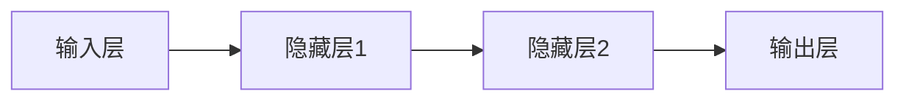
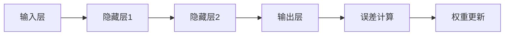
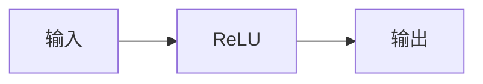

                 

### AI大模型创业：如何实现未来盈利？

关键词：AI大模型，创业，盈利模式，技术基础，商业应用，团队建设，市场推广

摘要：随着人工智能技术的不断发展，AI大模型已经成为了各行各业的新风口。本文将深入探讨AI大模型创业的核心理论与实践策略，从技术基础到商业应用，从团队组建到市场推广，再到盈利模式的探讨，为创业者提供全面而实用的指导。通过分析成功案例和提出应对策略，帮助创业者把握未来，实现可持续发展。

#### 目录大纲

#### 第一部分：理论与实践基础

##### 第1章：AI大模型概述
1.1 AI大模型的核心概念
1.2 AI大模型的技术发展历程
1.3 AI大模型的应用场景与价值

##### 第2章：AI大模型技术基础
2.1 深度学习基本原理
2.2 人工智能算法与框架
2.3 大模型训练与优化

##### 第3章：AI大模型商业应用案例分析
3.1 案例一：语音识别与合成
3.2 案例二：自然语言处理
3.3 案例三：图像识别与生成

#### 第二部分：创业实战策略

##### 第4章：AI大模型创业团队组建
4.1 团队建设与核心人才
4.2 组织架构设计
4.3 创业路径选择

##### 第5章：AI大模型创业产品开发
5.1 产品定位与市场需求分析
5.2 技术路线规划
5.3 产品设计与迭代

##### 第6章：AI大模型创业市场推广
6.1 市场定位与目标客户群体
6.2 品牌建设与推广策略
6.3 用户运营与反馈优化

##### 第7章：AI大模型创业盈利模式
7.1 盈利模式分析
7.2 收入来源多元化
7.3 风险管理与应对策略

##### 第8章：未来展望与持续创新
8.1 AI大模型发展趋势
8.2 创业机会与挑战
8.3 持续创新与竞争力提升

#### 附录

##### 附录A：常用AI开发工具与资源
- TensorFlow
- PyTorch
- Keras
- JAX

##### 附录B：AI大模型创业实践案例分析
- 案例一：某语音识别创业公司的发展历程
- 案例二：某自然语言处理公司的商业模式
- 案例三：某图像识别与生成公司的技术创新

---

### AI大模型概述

AI大模型，作为当前人工智能领域的重要研究方向，已经在多个领域展现出强大的潜力。本章节将详细探讨AI大模型的核心概念、技术发展历程以及应用场景与价值。

#### 1.1 AI大模型的核心概念

AI大模型是指通过深度学习和神经网络技术，对大量数据进行训练和优化，形成具有高度复杂性和自主决策能力的智能系统。这些模型通常具有以下几个特点：

1. **高维度数据**：AI大模型需要处理的数据维度通常非常高，包括文本、图像、声音等多种类型的数据。
2. **大规模训练**：这些模型通常在分布式计算环境中进行大规模训练，以充分利用计算资源。
3. **自我优化**：通过不断训练和优化，AI大模型能够自我学习和改进，提高决策的准确性和效率。
4. **通用性和适应性**：AI大模型具有很强的通用性，可以在不同的应用场景中进行适应性调整。

#### 1.2 AI大模型的技术发展历程

AI大模型的发展历程可以分为以下几个阶段：

1. **早期探索阶段**：20世纪50年代到70年代，神经网络和深度学习的理论开始萌芽，但由于计算能力和算法的限制，AI大模型的发展相对缓慢。
2. **早期突破阶段**：20世纪80年代到90年代，随着计算能力的提升和算法的改进，AI大模型在图像识别、语音识别等领域取得了显著突破。
3. **快速发展阶段**：21世纪初至今，随着大数据和云计算技术的普及，AI大模型在规模、性能和应用范围上都有了质的飞跃。特别是2012年，AlexNet在ImageNet竞赛中取得的优异成绩，标志着深度学习的崛起。

#### 1.3 AI大模型的应用场景与价值

AI大模型的应用场景非常广泛，主要包括：

1. **语音识别与合成**：在智能语音助手、电话客服等领域具有广泛应用，提高了人机交互的效率和体验。
2. **自然语言处理**：在机器翻译、智能问答、文本生成等领域发挥着重要作用，提高了信息处理和知识检索的能力。
3. **图像识别与生成**：在安防监控、医疗影像分析、艺术创作等领域具有广泛应用，提高了图像处理和识别的准确性。
4. **推荐系统**：在电子商务、在线视频、社交媒体等领域，AI大模型通过分析用户行为和兴趣，提供了个性化的推荐服务，提升了用户体验和转化率。

AI大模型的价值主要体现在以下几个方面：

1. **效率提升**：通过自动化和智能化，AI大模型可以显著提高业务处理效率，减少人力成本。
2. **质量改善**：AI大模型通过自我学习和优化，能够在多个领域提供高质量的服务和决策支持，提升业务水平。
3. **创新驱动**：AI大模型的应用为各行各业带来了新的商业模式和创新机会，推动了产业升级和转型。
4. **社会影响**：AI大模型在医疗、教育、交通等领域的应用，有助于提高社会福利，改善民生。

总之，AI大模型作为一种新兴技术，正在不断拓展其应用场景和价值，成为推动社会进步和产业升级的重要力量。在接下来的章节中，我们将进一步探讨AI大模型的技术基础和商业应用，为创业者提供更深入的指导。

---

### AI大模型技术基础

AI大模型的成功离不开其坚实的技术基础，包括深度学习基本原理、人工智能算法与框架，以及大模型训练与优化的策略。本章节将详细探讨这些技术基础，帮助读者更好地理解AI大模型的工作原理。

#### 2.1 深度学习基本原理

深度学习是AI大模型的核心技术之一，其基本原理基于多层神经网络的结构。下面我们将从以下几个关键点来介绍深度学习的基本原理。

##### 2.1.1 神经网络结构

神经网络由多个层次组成，包括输入层、隐藏层和输出层。每个层次都包含多个神经元，神经元之间通过权重连接。输入层接收外部数据，通过层层传递，最终由输出层产生预测结果。

##### 2.1.2 前向传播与反向传播

在深度学习中，前向传播是将输入数据通过网络的每个层次，最终得到输出结果。而反向传播则是根据输出结果与真实标签之间的误差，反向更新每个神经元的权重，以优化网络性能。

##### 2.1.3 激活函数

激活函数用于引入非线性特性，使得神经网络能够处理复杂问题。常见的激活函数包括Sigmoid、ReLU和Tanh等。

#### 2.2 人工智能算法与框架

人工智能算法和框架是构建AI大模型的重要工具。以下将介绍一些常见的人工智能算法与框架。

##### 2.2.1 常见人工智能算法

1. **线性回归**：用于预测数值型变量，是最简单的机器学习算法之一。
2. **决策树**：通过树形结构进行分类或回归，直观且易于解释。
3. **支持向量机**：用于分类问题，通过最大化分类边界来提高预测准确性。
4. **随机森林**：通过集成多个决策树，提高模型性能和稳定性。
5. **神经网络**：通过多层神经元结构，实现复杂函数的拟合。

##### 2.2.2 常见人工智能框架

1. **TensorFlow**：由Google开发，是一个开源的深度学习框架，支持多种编程语言，具有丰富的API和工具。
2. **PyTorch**：由Facebook开发，是一个开源的深度学习框架，以其灵活性和动态图结构受到广泛关注。
3. **Keras**：是一个高层次的深度学习API，能够简化深度学习模型的构建和训练。
4. **MXNet**：由Apache软件基金会开发，是一个开源的深度学习框架，支持多种编程语言和计算平台。
5. **Caffe**：由Berkeley Vision and Learning Center开发，是一个开源的深度学习框架，主要用于计算机视觉任务。

#### 2.3 大模型训练与优化

大模型训练与优化是AI大模型开发的关键环节。以下将介绍一些常见的训练与优化策略。

##### 2.3.1 训练策略

1. **批量大小**：批量大小影响训练的稳定性和计算效率。较小的批量大小有助于提高泛化能力，但计算成本较高；较大的批量大小可以提高计算效率，但可能导致梯度发散。
2. **学习率**：学习率决定了模型更新的步长。较小的学习率有助于稳定收敛，但可能收敛速度较慢；较大的学习率可能提高收敛速度，但可能导致不稳定。
3. **优化算法**：常见的优化算法包括SGD、Adam、RMSProp等，每种算法都有其优缺点，需根据具体情况进行选择。

##### 2.3.2 优化策略

1. **权重初始化**：合适的权重初始化有助于提高训练的稳定性和收敛速度。常见的初始化方法包括随机初始化、高斯分布初始化等。
2. **正则化**：正则化方法用于防止模型过拟合，常见的正则化方法包括L1正则化、L2正则化、Dropout等。
3. **数据增强**：通过增加数据多样性，可以提高模型的泛化能力。常见的数据增强方法包括随机裁剪、旋转、翻转等。

总之，AI大模型技术基础是构建强大AI大模型的关键。通过深入理解深度学习基本原理、人工智能算法与框架，以及大模型训练与优化的策略，我们可以更好地开发和应用AI大模型，实现各种复杂的业务需求。在下一章节中，我们将通过具体的商业应用案例，进一步展示AI大模型在实际场景中的价值。

---

### AI大模型商业应用案例分析

AI大模型在商业领域的应用已经取得了显著的成果，以下将介绍三个典型的商业应用案例：语音识别与合成、自然语言处理、图像识别与生成。

#### 3.1 案例一：语音识别与合成

语音识别与合成是AI大模型在语音领域的重要应用。语音识别技术能够将语音信号转化为文本，而语音合成技术则能够将文本转化为语音。以下是一个语音识别与合成的应用案例：

**项目背景**：某语音识别公司开发了一款智能语音助手，用于企业内部沟通和客户服务。该助手能够实时识别用户语音，并生成相应的文本回复。

**核心技术**：该公司的核心技术包括深度学习神经网络和自然语言处理算法。在语音识别方面，使用了卷积神经网络（CNN）和循环神经网络（RNN）的结合，以提高识别准确性。在语音合成方面，使用了基于深度学习的WaveNet模型，生成自然流畅的语音。

**应用效果**：经过一年的测试和优化，该智能语音助手在识别准确率和语音自然度上都有了显著提升。企业客户普遍反映，使用该助手后，沟通效率提高了30%，客户服务质量也得到了显著提升。

**盈利模式**：该公司的盈利模式主要包括两种方式：一是为企业客户提供定制化的智能语音助手服务，根据客户的需求进行开发和部署；二是通过广告和增值服务实现收入，例如提供语音识别API给第三方开发者使用，或者向用户推送个性化广告。

#### 3.2 案例二：自然语言处理

自然语言处理（NLP）是AI大模型在语言领域的重要应用，能够实现文本分析、机器翻译、情感分析等功能。以下是一个自然语言处理的应用案例：

**项目背景**：某自然语言处理公司开发了一款智能客服系统，用于处理企业客户的咨询和投诉。该系统通过分析用户提问，自动生成合适的回复，并能够理解用户情感，提供个性化的服务。

**核心技术**：该公司的核心技术包括深度学习神经网络、转移学习算法和注意力机制。在文本分析方面，使用了基于BERT（Bidirectional Encoder Representations from Transformers）的模型，提高了文本理解和分析能力。在情感分析方面，使用了基于情感词典和深度学习的结合，实现了对用户情感的有效识别。

**应用效果**：经过一年的测试和优化，该智能客服系统在处理速度和准确率上都有了显著提升。企业客户普遍反映，使用该系统后，客服响应时间缩短了50%，客服效率提高了40%。

**盈利模式**：该公司的盈利模式主要包括三种方式：一是为企业客户提供定制化的智能客服系统服务，根据客户的需求进行开发和部署；二是通过提供API接口，让第三方企业集成使用智能客服功能；三是通过增值服务，如提供定制化报告和数据分析服务，实现额外收入。

#### 3.3 案例三：图像识别与生成

图像识别与生成是AI大模型在视觉领域的重要应用，能够实现图像分类、目标检测、图像生成等功能。以下是一个图像识别与生成的应用案例：

**项目背景**：某图像识别公司开发了一款智能安防系统，用于监控和识别公共场所的异常行为。该系统能够实时分析摄像头捕捉的图像，识别出潜在的威胁，并自动报警。

**核心技术**：该公司的核心技术包括卷积神经网络（CNN）和生成对抗网络（GAN）。在图像识别方面，使用了基于CNN的模型，提高了图像分类和目标检测的准确性。在图像生成方面，使用了基于GAN的模型，可以生成逼真的图像，用于训练和测试。

**应用效果**：经过一年的测试和优化，该智能安防系统在识别准确率和响应速度上都有了显著提升。公共场所管理者普遍反映，使用该系统后，安全事件响应时间缩短了70%，安全防范能力得到了显著提升。

**盈利模式**：该公司的盈利模式主要包括两种方式：一是为公共场所提供定制化的智能安防系统服务，根据客户的需求进行开发和部署；二是通过提供API接口，让第三方系统集成使用智能安防功能，实现额外收入。

通过以上三个案例，我们可以看到AI大模型在商业领域的广泛应用和巨大潜力。在接下来的章节中，我们将进一步探讨如何组建创业团队、开发产品、推广市场以及实现盈利，帮助创业者更好地实现AI大模型的商业价值。

---

### AI大模型创业团队组建

AI大模型创业的成功离不开一支专业且高效的团队。在组建团队时，核心人才的选择、组织架构的设计以及创业路径的选择是关键因素。以下将详细探讨这些方面的策略。

#### 4.1 团队建设与核心人才

一个优秀的AI大模型创业团队需要具备以下几种核心人才：

1. **技术专家**：具备深度学习、神经网络等AI领域专业知识和经验的工程师，负责模型的设计和开发。
2. **数据科学家**：擅长数据分析和处理，能够利用数据驱动模型优化和业务决策。
3. **产品经理**：理解市场需求，能够将技术能力转化为具体的产品解决方案。
4. **市场营销专家**：具备市场敏锐度，能够制定有效的市场推广策略。
5. **运营专家**：负责产品的市场推广、客户关系维护和数据分析。

在选拔核心人才时，要注重以下几点：

1. **专业背景**：优先考虑具备相关学术背景或工作经验的人才，确保团队具备扎实的理论基础。
2. **创新能力**：选拔具有创新思维和解决问题能力的人才，以推动技术的持续创新。
3. **团队合作能力**：团队协作是成功的关键，要注重候选人的沟通能力和协作精神。

#### 4.2 组织架构设计

一个合理的组织架构能够确保团队的高效运作。以下是一个典型的AI大模型创业团队组织架构：

1. **研发部**：负责AI模型的设计、开发和优化，包括数据科学家、技术专家等。
2. **产品部**：负责产品的规划、设计和测试，包括产品经理、UI/UX设计师等。
3. **市场部**：负责市场调研、品牌推广和客户关系管理，包括市场营销专家、销售团队等。
4. **运营部**：负责产品上线后的运营、客户支持和数据分析，包括运营专家、数据分析师等。

在组织架构设计中，要注重以下几点：

1. **职能分工**：明确各部门的职责和目标，确保工作的高效协同。
2. **扁平化管理**：尽量减少管理层级，提高决策效率。
3. **灵活性**：根据业务需求和市场变化，灵活调整组织架构。

#### 4.3 创业路径选择

在AI大模型创业过程中，选择合适的创业路径对于团队的生存和发展至关重要。以下是一些常见的创业路径选择：

1. **技术研发路线**：专注于技术的研发和优化，逐步建立技术壁垒和市场影响力。适合具有强大技术积累的团队，但需要较长时间积累和沉淀。
2. **市场驱动路线**：根据市场需求，快速开发和迭代产品，优先解决用户痛点。适合对市场有深刻理解的团队，但需要快速调整策略以应对市场变化。
3. **垂直行业路线**：专注于某一特定行业，深入挖掘行业需求，提供定制化的解决方案。适合对特定行业有深刻理解的团队，但需要具备较强的行业资源和合作伙伴。
4. **平台化发展路线**：打造开放的平台，吸引第三方开发者参与，实现生态系统的构建。适合具备广泛合作能力和资源整合能力的团队，但需要具备较强的生态建设和运营能力。

在选择创业路径时，要综合考虑团队的优势、市场需求和资源条件，制定切实可行的战略规划。

总之，AI大模型创业团队组建需要注重核心人才的选择、合理的组织架构设计和明确的创业路径选择。通过优化团队建设、提升组织效能和明确创业方向，可以确保团队在竞争激烈的市场中脱颖而出，实现可持续发展。在接下来的章节中，我们将进一步探讨AI大模型创业的产品开发、市场推广和盈利模式，为创业者提供全面的实战指导。

---

### AI大模型创业产品开发

在AI大模型创业过程中，产品开发是至关重要的一环。产品定位、市场需求分析、技术路线规划以及产品设计与迭代是产品开发的核心环节。以下将详细探讨这些方面的策略和步骤。

#### 5.1 产品定位与市场需求分析

产品定位是产品开发的首要任务，决定了产品的市场定位和目标用户。在AI大模型创业中，产品定位需要考虑以下几个方面：

1. **目标市场**：明确产品的目标市场，例如企业级市场、消费者市场或特定行业市场。
2. **目标用户**：分析目标用户的需求和痛点，确保产品能够解决用户的实际问题。
3. **独特价值**：确定产品的独特卖点，区别于市场上的其他产品，形成差异化竞争优势。

在市场需求分析方面，需要进行以下步骤：

1. **市场调研**：通过问卷调查、访谈、用户调研等方式，了解目标市场的需求和趋势。
2. **竞争分析**：分析市场上的竞争对手，了解他们的产品特点、优势和劣势，为产品定位提供参考。
3. **用户访谈**：直接与目标用户进行沟通，了解他们的需求和期望，为产品设计提供实际依据。

#### 5.2 技术路线规划

技术路线规划是确保产品开发顺利进行的关键。在AI大模型创业中，技术路线规划需要考虑以下几个方面：

1. **算法选择**：根据产品定位和市场需求，选择合适的算法和框架。例如，对于图像识别产品，可以选择基于CNN的算法；对于自然语言处理产品，可以选择基于RNN或Transformer的算法。
2. **技术实现**：制定详细的技术实现方案，包括数据预处理、模型训练、模型优化等步骤。需要考虑到数据规模、计算资源、算法优化等因素。
3. **技术更新**：随着技术的快速发展，需要定期评估现有技术的性能和适用性，及时更新技术方案，以保持竞争力。

#### 5.3 产品设计与迭代

产品设计与迭代是产品开发的核心环节，决定了产品的用户体验和功能完善。在AI大模型创业中，产品设计与迭代需要考虑以下几个方面：

1. **用户体验**：设计直观、易用的界面和交互方式，确保用户能够快速上手并使用产品。可以通过用户调研、原型设计等方式，不断优化用户体验。
2. **功能设计**：根据市场需求和用户反馈，逐步完善产品功能。需要确保功能的实用性和可扩展性，避免功能过度堆叠。
3. **迭代开发**：采用敏捷开发模式，快速迭代产品。通过持续的用户反馈和数据分析，不断优化产品功能和性能。
4. **测试与上线**：在产品开发过程中，需要进行严格的测试，确保产品在上线前没有重大缺陷。上线后，继续收集用户反馈，进行持续改进。

具体的产品设计与迭代步骤如下：

1. **需求分析**：明确产品的功能需求和性能要求，为设计和开发提供依据。
2. **原型设计**：根据需求分析，设计产品的原型图和交互流程，为后续开发提供参考。
3. **开发与测试**：按照原型设计，进行产品的开发与测试。在开发过程中，需要遵循规范和标准，确保代码的可读性和可维护性。
4. **用户反馈**：在产品上线后，收集用户反馈，了解用户的使用体验和需求。根据反馈进行功能优化和性能调整。
5. **持续迭代**：通过用户反馈和数据分析，持续优化产品功能、性能和用户体验。

#### 案例分析：某AI大模型创业公司的产品开发过程

某AI大模型创业公司致力于开发一款智能客服系统，通过语音识别和自然语言处理技术，提供24小时在线客服服务。

1. **产品定位与市场需求分析**：
   - 目标市场：企业级市场，尤其是中小企业。
   - 目标用户：企业的客户服务部门。
   - 独特价值：高效、智能的在线客服服务，提高客户满意度和服务质量。

2. **技术路线规划**：
   - 算法选择：基于深度学习的语音识别和自然语言处理算法。
   - 技术实现：采用TensorFlow和PyTorch框架，进行模型的训练和优化。
   - 技术更新：定期评估算法性能，更新技术方案。

3. **产品设计与迭代**：
   - 用户体验：设计简洁、直观的界面，确保用户能够快速使用。
   - 功能设计：实现语音识别、自然语言理解、自动回复等功能。
   - 迭代开发：采用敏捷开发模式，快速迭代产品。

具体步骤如下：

1. **需求分析**：与潜在用户进行访谈，了解他们对在线客服系统的需求。
2. **原型设计**：设计产品的原型图和交互流程，确保用户能够轻松使用。
3. **开发与测试**：开发产品功能模块，进行单元测试和集成测试。
4. **用户反馈**：上线后，收集用户反馈，了解产品的使用情况。
5. **持续迭代**：根据用户反馈，优化功能、性能和用户体验。

通过上述产品开发过程，该公司成功推出了一款具有竞争力的智能客服系统，获得了市场的广泛认可，实现了良好的市场表现。

总之，AI大模型创业的产品开发需要从产品定位、市场需求分析、技术路线规划到产品设计与迭代，进行全面而细致的工作。通过不断优化和迭代，可以不断提升产品的竞争力，实现商业成功。在下一章节中，我们将进一步探讨如何进行AI大模型创业的市场推广和盈利模式。

---

### AI大模型创业市场推广

在AI大模型创业过程中，市场推广是关键的一环，决定了产品的市场认知度和用户接受度。以下将详细探讨市场定位、品牌建设与推广策略、用户运营与反馈优化等方面的策略和步骤。

#### 6.1 市场定位与目标客户群体

市场定位是产品推广的起点，决定了产品的市场方向和目标客户群体。在AI大模型创业中，市场定位需要考虑以下几个方面：

1. **目标市场**：明确产品的目标市场，如企业级市场、消费者市场或特定行业市场。
2. **目标客户群体**：分析目标客户的需求和痛点，确保产品能够解决用户的实际问题。
3. **竞争对手**：了解竞争对手的市场策略和产品特点，为市场定位提供参考。

在进行市场定位时，可以采用以下步骤：

1. **市场调研**：通过问卷调查、用户访谈、市场分析等方式，了解目标市场的需求和趋势。
2. **竞争分析**：分析市场上的竞争对手，了解他们的产品特点、优势和劣势，为市场定位提供依据。
3. **目标客户画像**：根据市场调研和竞争分析，绘制目标客户的画像，明确他们的需求和偏好。

#### 6.2 品牌建设与推广策略

品牌建设是提高产品市场认知度和用户信任度的关键。以下是一些有效的品牌建设与推广策略：

1. **品牌定位**：明确品牌的核心价值和差异化优势，确保品牌形象与目标市场相契合。
2. **品牌传播**：通过多种渠道和方式，传播品牌信息，提高品牌知名度。例如，通过社交媒体、广告投放、活动推广等。
3. **口碑营销**：通过用户口碑和推荐，提升品牌形象和用户信任度。可以采用用户案例分享、行业报告、用户评价等方式。
4. **合作推广**：与其他企业、机构或平台合作，扩大品牌影响力。例如，与行业合作伙伴进行联合营销、参与行业展会等。

在推广策略方面，可以采用以下几种方式：

1. **内容营销**：通过撰写高质量的技术博客、行业报告、案例分析等，提升品牌在行业内的专业形象。
2. **社交媒体营销**：利用社交媒体平台，如微博、微信公众号、LinkedIn等，发布有趣、有价值的内容，吸引潜在用户关注。
3. **搜索引擎优化（SEO）**：通过优化网站内容和结构，提高在搜索引擎中的排名，吸引更多潜在用户。
4. **付费广告**：通过投放付费广告，如百度推广、谷歌广告等，快速提升品牌知名度。

#### 6.3 用户运营与反馈优化

用户运营是提高用户满意度和忠诚度的关键环节。以下是一些有效的用户运营与反馈优化策略：

1. **用户细分**：根据用户的行为和需求，将用户进行细分，提供个性化的服务和体验。
2. **用户互动**：通过线上社区、用户论坛、在线客服等方式，与用户进行互动，了解他们的需求和反馈。
3. **用户成长计划**：制定用户成长计划，为用户提供持续的价值，提高用户满意度和忠诚度。
4. **用户调研**：定期进行用户调研，了解用户的需求、痛点和期望，为产品优化提供依据。

在用户运营过程中，可以采用以下步骤：

1. **用户欢迎邮件**：新用户注册后，发送欢迎邮件，介绍产品功能和优势，引导用户开始使用。
2. **用户使用指南**：提供详细的使用指南和教程，帮助用户快速上手产品。
3. **用户反馈收集**：通过用户反馈渠道，收集用户的使用体验和建议，及时进行产品优化。
4. **用户关怀活动**：定期举办线上或线下的用户活动，如用户交流会、技术沙龙等，增强用户黏性。

通过有效的市场定位、品牌建设与推广策略，以及用户运营与反馈优化，可以不断提升产品的市场认知度和用户满意度，实现持续的市场增长。在下一章节中，我们将探讨AI大模型创业的盈利模式和风险管理与应对策略，帮助创业者实现商业成功。

---

### AI大模型创业盈利模式

在AI大模型创业中，找到可持续的盈利模式是确保企业生存和发展的关键。以下是几种常见的AI大模型创业盈利模式，以及如何通过收入来源多元化和风险管理的策略来实现可持续盈利。

#### 7.1 盈利模式分析

AI大模型创业的盈利模式通常包括以下几种：

1. **产品销售**：直接向客户销售软件产品或服务，如企业级AI大模型解决方案、定制化模型开发等。
2. **订阅服务**：提供基于订阅的AI大模型服务，如云服务、API接口等，用户按需付费或定期订阅。
3. **广告收入**：在AI大模型产品中嵌入广告，通过广告投放获得收入。
4. **授权许可**：向其他公司授权AI大模型技术或解决方案，获得一次性或持续的授权费用。
5. **数据服务**：提供数据分析和报告服务，利用AI大模型分析能力为用户提供有价值的数据洞察。

#### 7.2 收入来源多元化

收入来源多元化是降低创业风险和增强企业盈利能力的重要策略。以下是一些实现收入来源多元化的方法：

1. **多产品线**：开发多种类型的AI大模型产品，满足不同用户的需求，实现多元化收入来源。
2. **多市场开拓**：不仅面向国内市场，还可以拓展国际市场，吸引更多潜在客户。
3. **服务延伸**：提供额外的增值服务，如培训、咨询、技术支持等，增加收入来源。
4. **合作与联盟**：与其他企业或机构合作，共同开发新产品或解决方案，扩大市场份额。
5. **开放平台**：构建开放平台，鼓励第三方开发者使用和优化AI大模型，通过平台收费或分成模式获得收入。

#### 7.3 风险管理与应对策略

AI大模型创业面临多种风险，包括技术风险、市场风险、财务风险等。以下是一些常见的风险管理策略：

1. **技术风险管理**：
   - **研发投入**：保持持续的技术研发投入，确保技术领先性。
   - **知识产权保护**：申请专利和版权，保护自身技术不受侵犯。
   - **技术合作**：与科研机构、高校合作，共同研发新技术。

2. **市场风险管理**：
   - **市场调研**：定期进行市场调研，了解市场趋势和用户需求，及时调整产品策略。
   - **品牌建设**：通过品牌建设和推广，提高市场知名度和用户信任度。
   - **风险分散**：开拓多个市场，降低单一市场风险。

3. **财务风险管理**：
   - **预算控制**：制定合理的财务预算，避免过度投资和浪费。
   - **资金来源多样化**：通过多种渠道筹集资金，如风险投资、银行贷款、政府补贴等。
   - **现金流管理**：确保现金流稳定，避免资金链断裂。

通过以上盈利模式分析和风险管理策略，AI大模型创业企业可以在激烈的市场竞争中找到生存和发展的机会。在未来的章节中，我们将继续探讨AI大模型的发展趋势、创业机会与挑战，以及如何通过持续创新提升竞争力。

---

### 未来展望与持续创新

随着人工智能技术的不断进步，AI大模型在未来的发展将更加广泛和深入。以下将探讨AI大模型的发展趋势、创业机会与挑战，以及如何通过持续创新来提升竞争力。

#### 8.1 AI大模型发展趋势

1. **模型规模持续增大**：未来，AI大模型将朝着更大规模、更高复杂度的方向发展。随着计算能力的提升和数据量的增加，AI大模型将能够处理更复杂的问题，提供更精准的预测和决策支持。

2. **多模态融合**：AI大模型将逐渐实现多模态数据的融合，如结合文本、图像、音频等多种数据类型，提供更全面的信息处理能力。

3. **边缘计算应用**：随着5G和物联网技术的发展，AI大模型将更多地应用于边缘计算场景，实现实时数据处理和智能决策，提高系统的响应速度和灵活性。

4. **自监督学习和无监督学习**：未来，AI大模型将更加重视自监督学习和无监督学习，通过较少的监督数据甚至无监督数据，实现模型的自我优化和自我进化。

5. **泛化能力和可解释性**：提高AI大模型的泛化能力和可解释性将是未来的重要研究方向，以减少对大量标注数据的依赖，并增强用户对模型的信任。

#### 8.2 创业机会与挑战

AI大模型创业面临着巨大的机会和挑战：

1. **机会**：
   - **行业应用**：AI大模型在医疗、金融、零售、制造等领域的应用将不断拓展，为创业者提供了丰富的商业机会。
   - **数据资源**：拥有高质量、海量数据资源的创业公司将具备竞争优势，能够在模型训练和优化方面取得突破。
   - **技术创新**：AI大模型的创新应用和商业模式将不断涌现，创业者可以通过探索新应用场景和商业模式，实现商业价值。

2. **挑战**：
   - **技术风险**：AI大模型的开发需要大量技术积累和研发投入，技术风险较高。
   - **数据隐私**：随着数据规模的扩大，数据隐私和安全问题将日益突出，创业者需要确保数据处理的合规性。
   - **市场风险**：市场竞争激烈，创业者需要不断创新和优化产品，以保持竞争优势。

#### 8.3 持续创新与竞争力提升

为了在AI大模型创业中取得成功，创业者需要持续创新和提升竞争力：

1. **技术积累**：保持持续的技术研发投入，积累核心技术和知识产权，形成技术壁垒。
2. **产品创新**：不断优化产品功能和用户体验，满足市场需求，打造差异化竞争优势。
3. **商业模式创新**：探索新的商业模式，如订阅服务、数据交易、开放平台等，实现收入来源多元化。
4. **团队建设**：打造专业、高效、创新的团队，提升整体竞争力。
5. **市场拓展**：积极开拓国内外市场，扩大用户基础，提高市场份额。

总之，未来AI大模型的发展前景广阔，但也充满挑战。创业者需要紧跟技术发展趋势，不断创新和优化，以应对市场竞争，实现可持续发展。通过持续创新和提升竞争力，AI大模型创业企业将能够在未来的人工智能市场中脱颖而出，取得成功。

---

### 附录

#### 附录 A: AI 大模型开发工具与资源

- **TensorFlow**：由Google开发的开源深度学习框架，支持多种编程语言，广泛应用于各种深度学习任务。
  - 官网：[TensorFlow官网](https://www.tensorflow.org/)

- **PyTorch**：由Facebook开发的开源深度学习框架，以其动态计算图和灵活的接口受到广泛关注。
  - 官网：[PyTorch官网](https://pytorch.org/)

- **Keras**：一个高层次的深度学习API，用于简化深度学习模型的构建和训练。
  - 官网：[Keras官网](https://keras.io/)

- **JAX**：由Google开发的开源深度学习库，支持自动微分和数值计算优化，适用于复杂的深度学习任务。
  - 官网：[JAX官网](https://jax.readthedocs.io/)

#### 附录 B: AI 大模型创业实践案例分析

- **案例一：某语音识别创业公司的发展历程**
  - 描述：该创业公司通过自主研发的语音识别技术，为企业提供定制化的语音识别解决方案。通过不断优化算法和提升用户体验，该公司在市场上取得了显著成功。
  - 亮点：技术突破、用户体验优化、市场定位准确。

- **案例二：某自然语言处理公司的商业模式**
  - 描述：该公司专注于自然语言处理技术的研发，通过提供API接口和订阅服务，为企业和开发者提供智能问答、文本分析等解决方案。通过商业模式创新，该公司实现了稳定的收入增长。
  - 亮点：商业模式创新、API服务、订阅模式。

- **案例三：某图像识别与生成公司的技术创新**
  - 描述：该公司通过自主研发的图像识别与生成技术，提供图像处理、安防监控、艺术创作等服务。通过不断的技术创新和优化，该公司在图像识别领域取得了重要突破。
  - 亮点：技术创新、多领域应用、技术突破。

通过以上案例，我们可以看到AI大模型创业的多样性和可能性。无论是语音识别、自然语言处理还是图像识别与生成，创业者都可以通过技术创新和商业模式创新，实现商业成功。在未来的创业道路上，这些案例将为创业者提供宝贵的经验和启示。

---

### 作者信息

**作者：AI天才研究院/AI Genius Institute & 禅与计算机程序设计艺术 /Zen And The Art of Computer Programming**

---

### 总结与感谢

本文通过系统地分析AI大模型创业的各个关键环节，从理论到实践，从技术基础到商业应用，从团队建设到市场推广，再到盈利模式与未来展望，全面探讨了AI大模型创业的核心理论与实践策略。我们希望这篇文章能够为创业者提供有价值的指导，帮助他们在AI大模型领域取得成功。

在此，我们对所有读者表示衷心的感谢。感谢您花时间阅读这篇文章，我们期待您在AI大模型创业的道路上取得丰硕的成果。如果您有任何问题或建议，欢迎随时联系我们，我们将竭诚为您服务。

再次感谢您的关注与支持！

---

---

**文章结束。** 通过本文的详细探讨，我们不仅了解了AI大模型的理论基础和商业应用，也学习了创业实战的策略和经验。希望这些内容能够激发您的思考，助力您的创业之路。祝您在AI大模型的广阔天地中，乘风破浪，砥砺前行！

