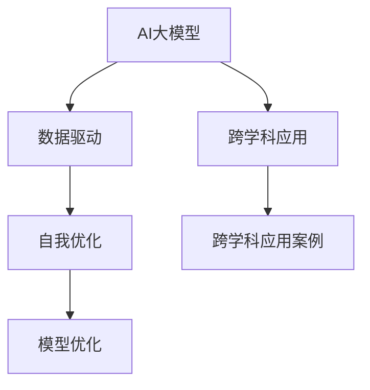

                 

### 第一部分：背景与基础

#### 1.1 什么是AI大模型

AI大模型是人工智能领域中的一个重要分支，其核心在于利用大量数据通过深度学习等方法进行训练，从而实现高效的数据分析和决策能力。本节将介绍AI大模型的基本概念、核心原理和实际应用。

##### 1.1.1 核心概念与联系

AI大模型的基本概念涉及以下几个方面：

- **数据驱动**：AI大模型是基于大量数据训练得到的，数据的质量和数量直接影响模型的性能。
- **自我优化**：通过不断迭代和优化，AI大模型能够不断提高其预测和决策能力。
- **跨学科应用**：AI大模型不仅应用于计算机科学领域，还广泛应用于医学、金融、工业等众多领域。

以下是一个Mermaid流程图，用于描述AI大模型的核心概念与联系：



##### 1.1.2 核心算法原理讲解

AI大模型的训练通常涉及以下基本步骤：

1. **数据预处理**：对原始数据进行清洗、归一化等操作，以便于模型训练。
2. **模型架构设计**：选择合适的神经网络架构，如卷积神经网络（CNN）、循环神经网络（RNN）等。
3. **损失函数与优化器**：设计损失函数以衡量模型预测值与真实值之间的差距，并选择优化器如Adam、SGD等来调整模型参数。
4. **模型训练**：通过迭代更新模型参数，使模型逐渐逼近真实数据分布。

以下是一个用于训练AI大模型的基本伪代码：

```python
# 伪代码：训练AI大模型的基本步骤
def train_large_model(data, epochs):
    for epoch in range(epochs):
        for batch in data:
            model.train_on_batch(batch)
    return model
```

在模型训练过程中，我们通常使用均方误差（MSE）作为损失函数，其数学公式为：

$$
E = \frac{1}{N}\sum_{i=1}^{N} \frac{1}{2}x_i^2
$$

其中，$E$表示均方误差，$N$表示数据样本数，$x_i$表示第$i$个样本的预测误差。

##### 1.1.3 AI大模型的历史与发展

AI大模型的发展历程可以分为以下几个阶段：

1. **初期阶段**（1980s - 1990s）：深度神经网络开始得到关注，但受限于计算资源和数据量，模型规模较小。
2. **复兴阶段**（2006年 - 2012年）：随着GPU的普及和大数据技术的发展，深度学习重新兴起，卷积神经网络（CNN）和递归神经网络（RNN）等模型取得了显著成果。
3. **大模型时代**（2012年至今）：基于大规模数据集和更强的计算能力，AI大模型如GPT、BERT等取得了突破性进展，应用范围不断扩展。

##### 1.1.4 AI大模型的应用领域

AI大模型在多个领域展示了强大的应用潜力：

- **自然语言处理**（NLP）：如机器翻译、文本分类、情感分析等。
- **计算机视觉**：如图像分类、目标检测、图像生成等。
- **医疗健康**：如疾病诊断、药物研发、个性化治疗等。
- **金融科技**：如风险评估、投资策略、信用评分等。
- **工业制造**：如预测性维护、生产优化、质量检测等。

##### 1.1.5 数据管理与处理

数据是AI大模型训练的核心，数据的质量和数量直接影响模型的性能。以下是一个用于数据管理与处理的伪代码：

```python
# 伪代码：数据预处理的基本步骤
def preprocess_data(data):
    # 数据清洗
    cleaned_data = clean_data(data)
    # 数据归一化
    normalized_data = normalize_data(cleaned_data)
    return normalized_data
```

在数据预处理过程中，我们还需要关注数据隐私和伦理问题，确保数据使用符合相关法律法规和伦理标准。

通过以上内容，我们为读者搭建了AI大模型的基本知识框架，为后续章节的深入探讨奠定了基础。在下一节中，我们将进一步探讨AI大模型在创业中的应用与实践。


### 第一部分：背景与基础

#### 1.2 AI大模型的历史与发展

AI大模型的历史与发展可以分为几个重要阶段，这些阶段不仅反映了技术的进步，也展示了AI在各个领域应用的不断扩展。以下是AI大模型发展的几个关键阶段：

##### 1.2.1 初期阶段（1980s - 1990s）

在这个阶段，神经网络的概念逐渐成熟，但受限于计算资源和数据量，AI模型的大小和复杂度有限。一些早期的神经网络模型，如感知机、反向传播网络等，虽然为后来的发展奠定了基础，但并未实现大规模应用。这个时期的AI研究主要关注如何提高算法效率和解决特定问题。

##### 1.2.2 复兴阶段（2006年 - 2012年）

2006年，Hinton等人提出了深度信念网络（DBN），这一突破性进展重新激发了人们对深度学习的研究兴趣。随着GPU的普及和大数据技术的发展，深度学习迎来了复兴。这一阶段的代表性模型包括卷积神经网络（CNN）和递归神经网络（RNN），它们在图像识别、语音识别等领域取得了显著成果。

##### 1.2.3 大模型时代（2012年至今）

这一阶段标志着AI大模型的崛起，基于大规模数据集和更强的计算能力，深度学习取得了突破性进展。2012年，AlexNet在ImageNet比赛中取得显著优势，开启了深度学习的新纪元。随后的几年中，如GPT、BERT等大模型相继出现，展示了在自然语言处理、计算机视觉等领域的强大能力。这些大模型的训练通常需要数以万计的GPU集群和海量数据，但它们带来的性能提升是前所未有的。

##### 1.2.4 当前发展趋势

目前，AI大模型的发展呈现以下几个趋势：

- **模型规模不断增加**：随着计算资源和数据量的增长，AI模型的规模也在不断扩大，如GPT-3拥有1750亿参数。
- **多模态学习**：AI大模型不仅限于文本和图像，还开始融合语音、视频等多种模态，实现更复杂的任务。
- **迁移学习**：通过迁移学习，AI大模型可以在少量数据上快速适应新任务，提高了模型的泛化能力。
- **模型压缩与优化**：为了降低计算成本和存储需求，研究者们不断探索模型压缩和优化技术，如知识蒸馏、量化等。

##### 1.2.5 数学模型和数学公式 & 详细讲解 & 举例说明

在AI大模型的发展过程中，数学模型和公式起着至关重要的作用。以下是一些关键的数学模型和公式，以及它们的详细讲解和举例说明：

- **反向传播算法**：反向传播算法是训练神经网络的核心算法。其基本思想是通过梯度下降法来更新模型参数，以最小化损失函数。

  - **公式**：
    $$
    \frac{\partial E}{\partial w} = \sum_{i=1}^{n} \frac{\partial E}{\partial z_i} \frac{\partial z_i}{\partial w}
    $$
  - **详细讲解**：
    - 该公式表示损失函数E对权重w的偏导数，即权重w的梯度。
    - 反向传播算法通过计算梯度，逐步更新权重，使模型能够逼近真实数据分布。

  - **举例说明**：
    - 假设一个简单的全连接神经网络，有3个输入节点、3个隐藏节点和1个输出节点。给定一组输入数据和对应的标签，通过反向传播算法，可以计算出每个权重和偏置的梯度，并更新这些参数。

- **卷积神经网络**：卷积神经网络（CNN）是AI大模型在计算机视觉领域的重要应用。其核心是卷积操作，通过在图像上滑动卷积核来提取特征。

  - **公式**：
    $$
    f(x, y) = \sum_{i=1}^{k} \sum_{j=1}^{k} w_{ij} \cdot x_{i, j}
    $$
  - **详细讲解**：
    - 该公式表示卷积操作，其中$f(x, y)$表示输出特征图，$w_{ij}$表示卷积核的权重，$x_{i, j}$表示输入图像上的像素值。
    - 通过多次卷积和池化操作，CNN可以提取出图像的层次特征，从而实现图像分类、目标检测等任务。

  - **举例说明**：
    - 假设一个简单的卷积神经网络，输入图像大小为32x32，卷积核大小为3x3。给定一个输入图像，通过卷积操作，可以提取出多个特征图，每个特征图表示图像的不同部分。

通过以上内容，我们对AI大模型的历史与发展有了更深入的了解。在下一节中，我们将探讨AI大模型在不同领域的具体应用，以及面临的未来数据挑战。


### 第一部分：背景与基础

#### 1.3 AI大模型的应用领域

AI大模型因其强大的计算能力和数据驱动特性，在众多领域展现了广泛的应用潜力。以下将介绍AI大模型在自然语言处理、计算机视觉、医疗健康、金融科技和工业制造等领域的应用。

##### 1.3.1 自然语言处理（NLP）

自然语言处理是AI大模型最具代表性的应用领域之一。通过深度学习技术，AI大模型可以处理和理解人类语言，实现诸如机器翻译、文本分类、情感分析等任务。

- **机器翻译**：如Google Translate等应用，利用AI大模型实现高效、准确的跨语言翻译。
- **文本分类**：如新闻分类、社交媒体内容分类等，通过AI大模型自动对大量文本进行分类，提高信息处理的效率。
- **情感分析**：分析用户评论、社交媒体帖子的情感倾向，为企业提供市场洞察和用户反馈分析。

##### 1.3.2 计算机视觉

计算机视觉是AI大模型的另一大应用领域，涉及图像识别、目标检测、图像生成等多种任务。

- **图像识别**：如人脸识别、车牌识别等，通过AI大模型对图像进行分类和识别。
- **目标检测**：如自动驾驶、智能监控等，通过AI大模型识别图像中的目标物体并定位其位置。
- **图像生成**：如艺术风格迁移、图像修复等，利用AI大模型生成新的图像内容。

##### 1.3.3 医疗健康

在医疗健康领域，AI大模型被用于疾病诊断、药物研发、个性化治疗等多种任务。

- **疾病诊断**：通过分析医学影像，AI大模型可以辅助医生进行疾病诊断，提高诊断准确率和效率。
- **药物研发**：利用AI大模型预测药物与生物分子的相互作用，加速新药的研发过程。
- **个性化治疗**：根据患者的基因信息和病史，AI大模型可以为医生提供个性化的治疗方案，提高治疗效果。

##### 1.3.4 金融科技

金融科技领域利用AI大模型实现风险控制、投资策略、信用评估等多种任务。

- **风险控制**：通过分析市场数据和历史交易记录，AI大模型可以预测金融市场的波动，帮助金融机构进行风险管理。
- **投资策略**：利用AI大模型分析大量市场数据，制定个性化的投资策略，提高投资收益。
- **信用评估**：通过对个人或企业的信用历史、行为数据等进行分析，AI大模型可以提供更准确、可靠的信用评估结果。

##### 1.3.5 工业制造

在工业制造领域，AI大模型被用于预测性维护、生产优化、质量检测等多种任务。

- **预测性维护**：通过分析设备运行数据，AI大模型可以预测设备的故障时间，帮助生产企业提前进行维护，减少停机时间。
- **生产优化**：利用AI大模型优化生产流程，提高生产效率，降低生产成本。
- **质量检测**：通过AI大模型对生产过程中的产品进行实时检测，提高产品质量，减少次品率。

##### 1.3.6 未来数据挑战

随着AI大模型在各个领域的应用不断深入，数据挑战也日益凸显。以下是未来可能面临的几个主要数据挑战：

- **数据质量**：高质量的数据是训练高效AI大模型的基础。未来需要解决数据清洗、数据标注等问题，提高数据质量。
- **数据隐私**：在数据驱动的AI大模型应用中，数据隐私是一个重要问题。需要制定相关的法律法规和隐私保护措施，确保数据安全和用户隐私。
- **数据多样性**：AI大模型的应用场景越来越复杂，需要处理多样化的数据类型。未来需要研究如何有效利用不同类型的数据，提高模型的泛化能力。
- **数据存储和计算**：随着AI大模型规模的不断扩大，对数据存储和计算资源的需求也在增加。需要开发高效的数据存储和计算技术，以满足AI大模型的需求。

通过以上内容，我们对AI大模型的应用领域有了更全面的了解，并认识到未来在数据管理方面面临的挑战。在下一节中，我们将进一步探讨AI大模型在创业中的应用与实践。


### 1.4 数据管理与处理

数据管理与处理是AI大模型训练和应用过程中至关重要的环节。在这一节中，我们将深入探讨数据管理与处理的核心技术，包括数据预处理、数据清洗、数据标注、数据归一化和数据融合等。

##### 1.4.1 数据预处理

数据预处理是数据管理与处理的第一步，其目的是将原始数据转化为适合模型训练的格式。数据预处理通常包括以下几个步骤：

- **数据清洗**：去除数据中的噪声、错误和不完整的数据，以提高数据质量。
- **数据归一化**：将不同特征的数据范围缩放到相同的尺度，以便模型能够更好地学习。
- **数据转换**：将数据转换为模型所需的类型，如将文本转换为词向量、图像转换为像素值等。
- **数据切分**：将数据集划分为训练集、验证集和测试集，以便模型训练、验证和测试。

以下是一个简单的伪代码示例，用于描述数据预处理的基本步骤：

```python
def preprocess_data(data):
    # 数据清洗
    cleaned_data = clean_data(data)
    # 数据归一化
    normalized_data = normalize_data(cleaned_data)
    # 数据切分
    train_data, val_data, test_data = split_data(normalized_data)
    return train_data, val_data, test_data
```

##### 1.4.2 数据清洗

数据清洗是数据预处理中非常重要的一步，其目的是去除数据中的噪声、错误和不完整的数据。数据清洗通常包括以下几种方法：

- **缺失值处理**：对于缺失值，可以采用填充、删除或插值等方法进行处理。
- **异常值处理**：对于异常值，可以采用过滤、变换或保留等方法进行处理。
- **重复值处理**：去除数据集中的重复值，以提高数据质量。

以下是一个简单的伪代码示例，用于描述数据清洗的基本步骤：

```python
def clean_data(data):
    # 填充缺失值
    filled_data = fill_missing_values(data)
    # 过滤异常值
    filtered_data = filter_outliers(filled_data)
    # 删除重复值
    unique_data = remove_duplicates(filtered_data)
    return unique_data
```

##### 1.4.3 数据标注

数据标注是将原始数据标记为模型所需的标签或标签集合的过程。数据标注通常需要大量的标注者，以确保标注的一致性和准确性。以下是一些常见的数据标注方法：

- **手动标注**：由人工对数据进行标注，适用于小规模、高质量的数据标注。
- **半监督标注**：利用已有标注数据来指导新的标注，适用于大规模、低质量的数据标注。
- **自动化标注**：利用算法自动生成标注数据，适用于快速、大规模的数据标注。

以下是一个简单的伪代码示例，用于描述数据标注的基本步骤：

```python
def annotate_data(data):
    # 手动标注
    annotated_data = manual_annotate(data)
    # 半监督标注
    semi_annotated_data = semi_supervised_annotate(data, annotated_data)
    # 自动化标注
    auto_annotated_data = auto_annotate(data)
    return annotated_data, semi_annotated_data, auto_annotated_data
```

##### 1.4.4 数据归一化

数据归一化是将不同特征的数据范围缩放到相同的尺度，以便模型能够更好地学习。常用的数据归一化方法包括最小-最大缩放、均值-方差缩放和指数变换等。

以下是一个简单的伪代码示例，用于描述数据归一化的基本步骤：

```python
def normalize_data(data):
    # 最小-最大缩放
    min_max_scaled_data = min_max_normalize(data)
    # 均值-方差缩放
    mean_variance_scaled_data = mean_variance_normalize(data)
    # 指数变换
    exponential_transformed_data = exponential_transform(data)
    return min_max_scaled_data, mean_variance_scaled_data, exponential_transformed_data
```

##### 1.4.5 数据融合

数据融合是将多个数据源中的数据进行整合，以提高模型的泛化能力和鲁棒性。数据融合可以采用多种方法，如特征融合、模型融合和数据集融合等。

以下是一个简单的伪代码示例，用于描述数据融合的基本步骤：

```python
def fuse_data(data_sources):
    # 特征融合
    fused_features = feature_fusion(data_sources)
    # 模型融合
    fused_model = model_fusion(fused_features)
    # 数据集融合
    fused_dataset = dataset_fusion(data_sources)
    return fused_features, fused_model, fused_dataset
```

通过以上内容，我们对数据管理与处理的核心技术有了更深入的了解。在下一节中，我们将探讨数据隐私与伦理问题，以及在AI大模型应用过程中如何确保数据的安全与合规。


### 1.5 数据隐私与伦理问题

在AI大模型的应用过程中，数据隐私和伦理问题成为广泛关注的话题。这些问题不仅关乎用户隐私保护，也涉及到社会伦理、法律法规等多个层面。

##### 1.5.1 数据隐私的重要性

数据隐私是指个人或组织的敏感信息不被未经授权的第三方获取、使用或泄露。对于AI大模型来说，数据隐私的重要性体现在以下几个方面：

- **用户信任**：保护用户隐私是建立用户信任的基础。如果用户的数据不被妥善保护，可能导致用户对AI应用的信任度下降，影响其使用意愿。
- **法律法规**：全球范围内，许多国家和地区已制定相关法律法规，如欧盟的《通用数据保护条例》（GDPR）和美国的《加州消费者隐私法》（CCPA），明确规定了数据收集、处理和存储的标准。
- **合规风险**：企业如果不遵守数据隐私法规，可能会面临高额罚款、声誉损失和法律诉讼。

##### 1.5.2 数据隐私保护措施

为了确保数据隐私，企业和开发者可以采取以下措施：

- **数据加密**：对敏感数据进行加密，确保数据在传输和存储过程中不被窃取或篡改。
- **匿名化处理**：在数据分析和模型训练过程中，对敏感信息进行匿名化处理，去除可直接识别用户身份的信息。
- **隐私增强技术**：采用隐私增强技术，如差分隐私、同态加密等，提高数据处理过程中的隐私保护水平。
- **用户知情同意**：确保用户在提供数据时明确了解数据的用途和隐私保护措施，并给予用户选择是否同意提供数据的权利。

##### 1.5.3 伦理问题

AI大模型应用中的伦理问题主要包括以下几个方面：

- **算法偏见**：AI大模型可能会在学习过程中吸收和放大现有的社会偏见，导致不公平的结果。例如，在招聘、贷款审批等场景中，AI模型可能对某些群体存在歧视。
- **透明度**：AI大模型往往被视为“黑箱”，用户无法理解其决策过程。这可能导致用户对AI模型的不信任。
- **责任归属**：在AI大模型应用中，当出现错误决策或负面后果时，责任归属成为一个难题。例如，自动驾驶汽车发生事故时，责任应该由谁承担？

##### 1.5.4 伦理原则与最佳实践

为了应对AI大模型应用中的伦理问题，以下是一些伦理原则和最佳实践：

- **公平性**：确保AI大模型在不同群体中的表现一致，避免算法偏见。
- **透明性**：提高AI大模型的透明度，让用户能够理解其决策过程。
- **责任归属**：明确AI大模型应用中的责任归属，制定相应的责任分配机制。
- **伦理审查**：在AI大模型开发和部署过程中，引入伦理审查机制，确保应用符合伦理标准。

通过以上内容，我们对数据隐私与伦理问题有了更深刻的认识。在下一节中，我们将探讨AI大模型在创业中的应用与实践。这将包括如何进行市场定位、项目可行性分析以及数据获取与处理策略等。


### 第二部分：创业实战

#### 2.1 AI创业生态系统

在AI创业领域，创业者不仅需要掌握技术知识，还需了解整个生态系统的运作。AI创业生态系统由以下几个关键组成部分构成：

- **技术栈**：创业者需要构建一个稳定的技术栈，包括数据存储、数据处理、机器学习框架和基础设施等。
- **资金与投资**：资金是AI创业的核心驱动力，创业者需要寻找合适的投资者，并准备好详尽的商业计划书。
- **人才招聘**：吸引和培养优秀的技术人才是AI创业成功的关键。创业者需要建立一个多元化的团队，涵盖不同领域的人才。
- **合作伙伴**：寻找行业内的合作伙伴，如研究机构、行业协会和技术供应商，可以提升企业的竞争力和影响力。
- **市场需求**：了解市场需求和用户痛点，确保创业项目具有实际应用价值。

#### 2.2 如何定位AI大模型创业项目

定位AI大模型创业项目是创业成功的第一步。以下是一些建议：

- **市场调研**：通过市场调研，了解行业趋势、用户需求和竞争对手。这有助于发现市场空白和潜在机会。
- **技术创新**：定位具有技术创新的AI大模型创业项目。技术创新可以是新算法、新应用场景或新商业模式。
- **应用领域**：选择具有巨大市场潜力的领域，如医疗健康、金融科技、智能交通等。
- **市场细分**：在选定领域内，进一步细分市场，找到目标用户群体和需求。
- **差异化竞争**：分析竞争对手的优势和不足，找到差异化竞争点，形成独特的竞争优势。

#### 2.3 项目可行性分析

在确定创业项目后，进行项目可行性分析是至关重要的一步。以下是一些关键因素：

- **技术可行性**：评估所选技术的可行性，包括算法实现、数据获取和计算资源需求等。
- **市场可行性**：分析市场需求、市场规模和增长潜力。确保项目具有足够的商业前景。
- **财务可行性**：评估项目的财务可行性，包括成本、收益和投资回报率。确保项目在财务上可持续。
- **法律与合规**：确保项目符合相关法律法规，如数据隐私、知识产权等。
- **资源匹配**：分析创业团队所需资源和现有资源的匹配程度，包括资金、人才、技术等。

#### 2.4 数据获取与处理策略

数据是AI大模型训练的核心，以下是一些建议：

- **数据来源**：确定数据来源，包括公开数据集、商业数据集和自定义数据集。
- **数据质量**：确保数据质量，包括数据完整性、一致性和准确性。
- **数据预处理**：对数据进行清洗、归一化和标注等预处理操作，提高数据质量。
- **数据存储**：选择合适的存储方案，确保数据安全、可靠和高效访问。
- **数据隐私**：遵守数据隐私保护法律法规，采取数据加密、匿名化和隐私增强技术等措施。

#### 2.5 AI大模型训练与优化

AI大模型训练与优化是创业项目成功的关键。以下是一些核心步骤：

- **模型选择**：选择合适的AI大模型，如深度学习框架、神经网络架构等。
- **模型训练**：通过迭代训练，不断优化模型参数，提高模型性能。
- **模型评估**：使用验证集和测试集评估模型性能，确保模型稳定、可靠。
- **模型调优**：根据评估结果，调整模型参数和超参数，优化模型性能。
- **模型部署**：将训练好的模型部署到生产环境，实现实时应用。

#### 2.6 部署与运维

部署与运维是确保AI大模型稳定运行的关键。以下是一些建议：

- **自动化部署**：采用自动化部署工具，简化部署流程，提高部署效率。
- **监控与运维**：建立监控体系，实时监控模型运行状态，确保系统稳定可靠。
- **容错与恢复**：设计容错机制，确保系统在故障情况下能够快速恢复。
- **性能优化**：通过性能优化，提高系统的运行效率和响应速度。

#### 2.7 用户体验与反馈循环

用户体验与反馈循环是创业项目持续优化和改进的关键。以下是一些建议：

- **用户反馈**：收集用户反馈，了解用户需求和痛点。
- **迭代优化**：根据用户反馈，持续优化产品和服务，提高用户满意度。
- **用户参与**：鼓励用户参与产品设计和开发，提升用户参与度和忠诚度。
- **数据驱动**：利用用户数据，分析用户行为，为产品优化提供数据支持。

#### 2.8 数据安全与合规

数据安全与合规是AI大模型创业项目的核心挑战之一。以下是一些建议：

- **数据加密**：对敏感数据进行加密，确保数据在传输和存储过程中安全。
- **访问控制**：建立严格的访问控制机制，确保只有授权人员能够访问数据。
- **日志记录**：记录数据访问和操作日志，以便审计和追踪。
- **法律法规**：遵守相关法律法规，确保数据合规。
- **安全培训**：对员工进行安全培训，提高员工的安全意识和技能。

#### 2.9 AI创业团队构建

构建一个高效的AI创业团队是创业成功的关键。以下是一些建议：

- **多元化团队**：建立多元化团队，涵盖不同领域的人才，如技术、业务、市场等。
- **团队协作**：建立高效的团队协作机制，提高团队协作效率。
- **人才培养**：持续培养和引进人才，提升团队整体能力。
- **企业文化**：建立积极向上的企业文化，激发团队成员的创造力和凝聚力。

通过以上内容，我们对AI大模型创业的生态系统和实战策略有了更深入的了解。在下一部分中，我们将通过具体案例分析，探讨AI大模型创业的成功经验和挑战。这将帮助我们更好地理解如何应对未来数据挑战。


### 第二部分：创业实战

#### 2.10 AI创业团队构建

构建一个高效的AI创业团队是确保AI大模型创业成功的关键。以下是一些关键步骤和建议：

##### 2.10.1 确定团队核心成员

- **技术核心**：选择在AI领域具有丰富经验和技能的核心技术人员，如机器学习工程师、深度学习专家等。
- **业务拓展**：引入有业务拓展能力的人才，负责市场开拓、业务谈判和客户关系维护。
- **产品管理**：产品经理在团队中起到桥梁作用，协调技术、市场和设计团队，确保产品顺利推进。
- **财务运营**：财务和运营人员负责预算管理、成本控制和资金筹集等工作。

##### 2.10.2 团队结构设计

- **扁平化组织**：采用扁平化组织结构，减少决策层级，提高团队协作效率。
- **职能划分**：明确各团队成员的职责和分工，确保任务执行高效、有序。
- **跨部门合作**：鼓励跨部门合作，打破部门壁垒，促进资源共享和知识传递。

##### 2.10.3 培养团队文化

- **鼓励创新**：营造鼓励创新和尝试错误的企业文化，培养团队成员的创新意识和解决问题的能力。
- **持续学习**：鼓励团队成员不断学习和提升自身技能，保持团队的竞争力。
- **团队凝聚力**：通过团队建设活动、员工福利和激励机制等，增强团队凝聚力。

##### 2.10.4 建立绩效评估体系

- **设定目标**：为团队成员设定清晰的绩效目标，确保团队成员了解自己的工作期望。
- **定期反馈**：定期进行绩效评估和反馈，及时发现问题并调整工作计划。
- **激励机制**：建立激励机制，奖励表现优秀的团队成员，激发团队活力。

通过以上步骤和建议，创业者可以构建一个高效的AI创业团队，为AI大模型创业项目提供坚实的支持。在下一部分中，我们将通过具体案例分析，探讨AI大模型创业的成功经验和挑战。这将帮助我们更好地理解如何应对未来数据挑战。


### 第三部分：案例分析

#### 3.1 案例一：成功AI大模型创业公司

在本节中，我们将探讨一个成功AI大模型创业公司的案例，该公司在AI大模型创业领域取得了显著的成就，为其他创业者提供了宝贵的经验和启示。

**公司背景**：

该公司成立于2015年，由一群在AI领域具有丰富经验的科学家和工程师创立。公司专注于开发基于AI的大模型，应用于自然语言处理、计算机视觉和医疗健康等领域。

**成功因素**：

1. **技术创新**：公司始终关注AI技术的最新进展，致力于开发高效、可靠的AI大模型。公司采用先进的深度学习框架和算法，确保模型的性能和效率。
2. **市场定位**：公司明确了自己的市场定位，专注于有巨大市场需求的领域。例如，在自然语言处理领域，公司开发了一款先进的机器翻译工具，适用于多语言交互和全球化业务。
3. **团队协作**：公司拥有一个高效、协作的团队，各成员在各自领域具有专业知识和经验。团队成员之间紧密合作，共同攻克技术难题，推动公司快速发展。
4. **用户体验**：公司注重用户体验，不断优化产品和服务。通过用户反馈，公司能够迅速调整和改进产品，满足用户需求。
5. **融资策略**：公司在发展过程中，成功吸引了多轮风险投资，为公司的持续发展和扩张提供了强大的资金支持。

**经验与启示**：

- **技术创新是核心**：在AI大模型创业领域，技术创新是核心竞争力。创业者需要紧跟技术发展趋势，持续创新，提升产品竞争力。
- **明确市场定位**：明确市场定位，专注于有巨大市场需求的领域，有助于公司在激烈的市场竞争中脱颖而出。
- **团队协作与人才培养**：构建高效、协作的团队，注重人才培养，提高团队整体能力。
- **用户体验至上**：关注用户体验，不断优化产品和服务，提升用户满意度。
- **合理的融资策略**：制定合理的融资策略，吸引风险投资，为公司的持续发展和扩张提供资金支持。

通过本案例，创业者可以借鉴成功公司的经验，提高自己在AI大模型创业领域的成功率。在下一节中，我们将探讨一个AI大模型创业公司面临的挑战和应对策略。这将帮助我们更好地理解如何应对未来数据挑战。

#### 3.2 案例二：AI大模型创业的挑战与应对

在本节中，我们将分析一个AI大模型创业公司在面对市场、技术和数据等挑战时采取的应对策略。通过该案例，我们将探讨如何在AI大模型创业过程中克服困难，实现持续发展。

**公司背景**：

该公司成立于2018年，专注于利用AI大模型进行疾病诊断和个性化治疗。公司创始人具备医学和AI领域的背景，希望通过技术创新改善医疗健康领域的问题。

**面临的挑战**：

1. **市场挑战**：尽管AI在医疗健康领域的应用前景广阔，但市场接受度较低。许多医疗机构和患者对AI诊断结果的可靠性持怀疑态度。
2. **技术挑战**：AI大模型在医疗健康领域的应用涉及复杂的算法和数据处理。公司需要持续投入大量研发资源，以确保模型的高性能和可靠性。
3. **数据挑战**：医疗数据质量参差不齐，且涉及大量敏感信息。公司需要处理数据隐私和安全问题，确保数据的合法合规使用。

**应对策略**：

1. **市场推广**：公司通过举办研讨会、发布白皮书和与医疗机构合作等方式，提高AI诊断的知名度和认可度。同时，公司提供免费试用，让医疗机构和患者亲身体验AI诊断的优势。
2. **技术提升**：公司不断优化AI算法，提升模型的性能和可靠性。通过多中心临床试验，积累大量真实数据，提高模型的训练效果。
3. **数据隐私保护**：公司采取严格的数据隐私保护措施，包括数据加密、匿名化和访问控制等。公司还与医疗机构合作，确保数据使用符合法律法规和伦理标准。

**经验与启示**：

- **市场推广与教育**：通过市场推广和教育培训，提高市场对AI应用的接受度，降低用户疑虑。
- **技术持续创新**：持续投入研发资源，提升AI大模型的技术水平和应用性能。
- **数据隐私保护**：在数据管理和应用过程中，严格遵守法律法规和伦理标准，确保数据安全和用户隐私。

通过本案例，创业者可以了解到在AI大模型创业过程中，面对市场、技术和数据等挑战时，采取有效的应对策略的重要性。在下一节中，我们将探讨AI大模型创业的法律风险与管理，以帮助创业者更好地应对相关挑战。

#### 3.3 案例三：AI大模型创业的法律风险与管理

在本节中，我们将分析一个AI大模型创业公司在法律风险与管理方面的经验教训，以帮助其他创业者识别和管理潜在的法律风险。

**公司背景**：

该公司成立于2017年，专注于开发AI大模型，应用于金融领域的风险评估和投资策略。公司在创业初期迅速积累了用户和市场份额，但在运营过程中遭遇了一系列法律问题。

**面临的法律风险**：

1. **数据隐私风险**：金融数据涉及大量敏感信息，公司需要确保数据处理符合相关法律法规，如欧盟的《通用数据保护条例》（GDPR）和美国的《加州消费者隐私法》（CCPA）。
2. **知识产权风险**：公司在开发AI大模型时，可能涉及他人的专利、著作权等知识产权。如果侵犯他人的知识产权，公司将面临诉讼和赔偿风险。
3. **合规风险**：金融行业受到严格的监管，公司需要确保其业务活动符合相关法律法规和监管要求，如反洗钱法、证券法等。

**管理经验与教训**：

1. **数据隐私保护**：公司建立了一套完善的数据隐私保护体系，包括数据加密、匿名化处理、访问控制等。同时，公司与用户签订隐私政策，明确数据收集、使用和存储的方式和范围。
2. **知识产权管理**：公司在开发AI大模型时，积极开展知识产权保护工作。通过专利申请、著作权登记等方式，确保公司拥有自主知识产权。同时，公司与第三方机构合作，进行知识产权风险评估和侵权监测。
3. **合规管理**：公司设立了专门的合规部门，负责监管和合规事务。合规部门定期对公司的业务活动进行审查，确保符合相关法律法规和监管要求。公司还制定了详细的合规手册，为员工提供合规培训。

**经验与启示**：

- **数据隐私保护**：在AI大模型创业过程中，数据隐私保护至关重要。公司应建立完善的数据隐私保护体系，确保数据处理符合法律法规和伦理标准。
- **知识产权管理**：公司应重视知识产权保护，通过专利申请、著作权登记等方式，确保自身在技术上的自主性和领先地位。
- **合规管理**：公司应建立合规管理体系，确保业务活动符合相关法律法规和监管要求，降低合规风险。

通过本案例，创业者可以了解到在AI大模型创业过程中，法律风险与管理的重要性。在下一节中，我们将探讨未来AI大模型创业的趋势与机遇。这将帮助我们更好地把握AI大模型创业的发展方向。

#### 3.4 案例四：未来AI大模型创业的趋势与机遇

在本节中，我们将分析未来AI大模型创业的趋势与机遇，探讨如何抓住AI大模型带来的市场机会，推动创业项目的发展。

**趋势与机遇**：

1. **跨行业融合**：随着AI技术的不断发展，AI大模型将在更多行业得到应用。创业者可以探索AI大模型在金融、医疗、制造、零售等行业的创新应用，实现跨行业的融合。
2. **个性化服务**：AI大模型在个性化服务领域的应用前景广阔。创业者可以开发基于AI大模型的个性化推荐系统、个性化治疗方案等，满足用户个性化需求。
3. **智能制造**：AI大模型在智能制造领域的应用将进一步提升生产效率和产品质量。创业者可以开发AI大模型驱动的智能工厂、预测性维护系统等，助力传统制造行业转型升级。
4. **绿色环保**：AI大模型在环保领域的应用将有助于解决环境污染和资源浪费等问题。创业者可以开发AI大模型驱动的环境监测系统、节能减排技术等，推动绿色环保产业发展。
5. **远程办公与教育**：随着远程办公和在线教育的普及，AI大模型将在这些领域发挥重要作用。创业者可以开发AI大模型驱动的远程办公平台、在线教育系统等，提升远程办公和在线教育的体验。

**成功案例**：

- **案例一：AI医疗诊断平台**：一家AI医疗诊断公司通过开发AI大模型，实现了对多种疾病的精准诊断。公司通过多中心合作，积累了大量高质量医疗数据，不断提升模型的诊断准确率。公司成功吸引了多轮融资，实现了快速扩张。
- **案例二：智能推荐系统**：一家电商公司利用AI大模型，开发了智能推荐系统。通过分析用户行为和购买记录，系统为用户推荐个性化的商品，提升了用户的购物体验和转化率。公司通过数据驱动的方式，不断优化推荐算法，实现了业绩的持续增长。
- **案例三：智能工厂解决方案**：一家智能制造公司通过开发AI大模型，实现了生产线的智能调度和优化。公司为传统制造企业提供定制化的智能工厂解决方案，提升了生产效率和质量。公司通过提供卓越的服务，赢得了客户的信任和市场份额。

**经验与启示**：

- **跨行业融合**：创业者应关注AI大模型在不同行业的应用，探索跨行业的创新机会。
- **个性化服务**：创业者可以开发基于AI大模型的个性化服务，提升用户体验和满意度。
- **智能制造**：创业者可以开发AI大模型驱动的智能制造解决方案，助力传统产业升级。
- **绿色环保**：创业者可以开发AI大模型驱动的环保技术，推动绿色产业发展。
- **远程办公与教育**：创业者可以开发AI大模型驱动的远程办公和在线教育系统，提升远程办公和在线教育的体验。

通过以上案例和分析，创业者可以更好地把握未来AI大模型创业的趋势与机遇，制定合适的战略和规划，推动创业项目的发展。

#### 3.5 未来数据挑战与解决方案

在AI大模型创业的过程中，未来将面临一系列数据挑战。以下是一些主要的数据挑战以及相应的解决方案：

**数据质量问题**：

- **挑战**：数据质量是AI大模型训练和应用的基石，但数据往往存在噪声、错误和不完整性。
- **解决方案**：
  - **数据清洗**：采用自动化工具和算法清洗数据，去除噪声和错误。
  - **数据集成**：将多个数据源的数据进行整合，提高数据的一致性和完整性。
  - **数据标注**：引入专业的数据标注团队，确保数据的质量和准确性。

**数据隐私和安全问题**：

- **挑战**：AI大模型处理的数据通常涉及个人隐私和商业秘密，数据隐私和安全成为重要挑战。
- **解决方案**：
  - **数据加密**：对敏感数据进行加密处理，确保数据在传输和存储过程中的安全。
  - **隐私保护技术**：采用差分隐私、同态加密等技术，保护用户隐私。
  - **安全审计**：建立数据安全审计机制，定期审查数据安全措施的有效性。

**数据存储和计算问题**：

- **挑战**：随着AI大模型规模的不断扩大，数据存储和计算资源的需求也在增加。
- **解决方案**：
  - **分布式存储**：采用分布式存储系统，提高数据存储的容量和性能。
  - **云计算**：利用云计算资源，实现数据的弹性扩展和高效计算。
  - **数据压缩**：采用数据压缩技术，降低数据存储和传输的需求。

**数据多样性问题**：

- **挑战**：不同类型的数据（如文本、图像、音频等）对AI大模型的应用具有重要影响，但数据多样性往往不足。
- **解决方案**：
  - **多模态学习**：开发多模态学习算法，整合不同类型的数据，提高模型的泛化能力。
  - **数据增强**：采用数据增强技术，生成更多的数据样本，提高数据的多样性。
  - **数据集构建**：构建多样化的数据集，覆盖不同领域和应用场景。

**数据治理和监管问题**：

- **挑战**：随着数据量的增加和数据应用场景的扩展，数据治理和监管成为一个重要问题。
- **解决方案**：
  - **数据治理框架**：建立数据治理框架，明确数据的管理、使用和共享规则。
  - **合规性检查**：定期进行数据合规性检查，确保数据使用符合法律法规和伦理标准。
  - **数据共享协议**：制定数据共享协议，规范数据共享的方式和范围。

通过以上解决方案，创业者可以更好地应对未来AI大模型创业过程中的数据挑战，确保数据的高质量、安全和多样性，为创业项目的成功奠定基础。

#### 3.6 全球AI大模型创业环境比较

在全球范围内，不同的国家和地区在AI大模型创业环境中表现出不同的特点，这些特点对创业者的成功与否具有重要影响。以下是对几个主要国家和地区的AI大模型创业环境进行比较：

**美国**：

- **优势**：
  - **技术实力**：美国拥有世界领先的AI技术研发实力，创业者和研究人员可以轻松获取先进的技术和资源。
  - **资金支持**：美国的风险投资市场非常成熟，创业者可以轻松获得风险投资，助力创业项目的发展。
  - **政策支持**：美国政府鼓励科技创新，提供了多种优惠政策和支持措施，如税收优惠、研究资助等。
- **挑战**：
  - **竞争激烈**：美国AI大模型创业市场非常竞争，创业者需要具备较高的技术水平和创新思维，才能脱颖而出。
  - **法规监管**：美国在数据隐私和保护方面有严格的法律法规，创业者需要确保其业务活动符合相关法规。

**中国**：

- **优势**：
  - **市场需求**：中国拥有庞大的市场需求，创业者可以轻松找到有潜力的应用场景和目标用户。
  - **政策支持**：中国政府大力支持科技创新和AI产业发展，提供了多种政策支持和资金扶持。
  - **人才资源**：中国拥有大量的AI技术人才，创业者可以较容易地组建高效的研发团队。
- **挑战**：
  - **数据隐私**：中国的数据隐私法规相对严格，创业者需要确保数据处理符合相关法规。
  - **知识产权**：知识产权保护力度有待加强，创业者需要关注知识产权的保护和维权。

**欧洲**：

- **优势**：
  - **数据保护法规**：欧盟的《通用数据保护条例》（GDPR）为数据隐私提供了强有力的保障，创业者可以放心开展业务。
  - **技术研发**：欧洲在AI技术研发方面具有很高的水平，许多顶尖的研究机构和大学集中在欧洲。
  - **政策支持**：欧洲各国政府普遍支持AI产业发展，提供了多种资金和政策支持。
- **挑战**：
  - **市场竞争**：欧洲AI市场相对成熟，竞争激烈，创业者需要具备较高的技术实力和市场洞察力。
  - **市场分散**：欧洲市场相对分散，创业者需要面对不同的市场环境和法规，这可能增加运营成本。

**以色列**：

- **优势**：
  - **技术创新**：以色列在AI技术研发方面具有很高的创新能力，许多顶尖的AI初创公司在这里诞生。
  - **创业氛围**：以色列拥有浓厚的创业氛围，创业者可以享受到多种创业支持和资源。
  - **投资环境**：以色列的风险投资市场活跃，创业者可以较容易获得风险投资。
- **挑战**：
  - **市场规模**：以色列市场规模相对较小，创业者需要考虑市场扩展和国际化战略。
  - **人才竞争**：以色列的AI人才竞争激烈，创业者需要吸引和留住顶尖人才。

通过比较全球不同国家和地区的AI大模型创业环境，创业者可以更好地了解不同市场的特点和挑战，制定合适的创业战略和规划。

#### 3.7 未来AI大模型创业的最佳实践

在未来AI大模型创业过程中，为了提高成功率并应对不断变化的市场和技术环境，以下是一些最佳实践建议：

**1. 技术创新与研发投入**

- **持续创新**：在AI大模型创业过程中，技术创新是核心竞争力。创业者应关注AI领域的最新技术趋势，持续投入研发资源，确保技术领先地位。
- **技术合作**：与顶尖的研究机构和大学建立合作关系，共同开展技术研究和开发。这不仅有助于提升技术实力，还可以吸引顶尖人才加入团队。

**2. 市场定位与用户需求**

- **精准定位**：在确定创业项目时，要明确市场定位，专注于有巨大市场需求的领域。通过市场调研和用户访谈，深入了解用户需求，确保创业项目具有实际应用价值。
- **用户参与**：在产品开发和迭代过程中，鼓励用户参与，收集用户反馈，不断优化产品和服务，提升用户体验。

**3. 数据管理与隐私保护**

- **高质量数据**：确保数据质量是训练高效AI大模型的基础。创业者应投入资源进行数据清洗、标注和整合，提高数据质量。
- **隐私保护**：严格遵守数据隐私保护法律法规，采取数据加密、匿名化和隐私增强技术等措施，保护用户隐私。

**4. 管理与运营优化**

- **高效团队**：建立高效、协作的团队，明确各成员的职责和分工，提高团队整体执行力。
- **项目管理**：采用敏捷开发方法，快速迭代产品，确保项目按时交付并满足用户需求。
- **成本控制**：合理规划预算，控制成本，确保企业可持续发展。

**5. 法规与合规**

- **合规管理**：在创业过程中，确保业务活动符合相关法律法规和伦理标准。建立合规管理体系，定期进行合规审查和风险评估。
- **知识产权**：积极申请专利和著作权，保护自身知识产权，避免侵权纠纷。

**6. 市场推广与品牌建设**

- **精准营销**：通过精准营销策略，将产品推向目标市场，提高品牌知名度。
- **线上线下结合**：结合线上和线下渠道，扩大市场影响力，提高用户转化率。
- **合作伙伴**：寻找行业内的合作伙伴，共同开拓市场，提升品牌价值。

通过以上最佳实践，创业者可以更好地应对未来AI大模型创业的挑战，提高创业成功率，实现持续发展。

#### 3.8 AI大模型创业的未来发展路径

展望未来，AI大模型创业将迎来更多的发展机遇和挑战。以下是一些可能的发展趋势和路径：

**1. 模型规模与计算能力提升**

随着硬件技术的发展和分布式计算能力的提升，AI大模型的规模将继续扩大。创业者可以关注GPU、TPU等专用硬件的发展，充分利用这些硬件的优势，提升模型的计算能力。

**2. 多模态学习与应用**

多模态学习是未来AI大模型的重要研究方向之一。创业者可以探索将文本、图像、音频等多种模态数据融合，提升模型的泛化能力和应用范围。例如，在医疗健康领域，结合医学影像、基因数据和患者病历，实现更准确的疾病诊断。

**3. 隐私保护与数据安全**

随着数据隐私保护法规的不断完善，AI大模型创业需要更加重视隐私保护和数据安全。创业者可以探索差分隐私、同态加密等隐私保护技术，确保用户数据的安全和隐私。

**4. 人工智能伦理与法规**

在AI大模型创业过程中，伦理问题和法律法规将变得更加重要。创业者需要关注人工智能伦理的发展趋势，确保其业务活动符合相关法律法规和伦理标准。例如，制定透明的算法决策过程，避免算法偏见和歧视。

**5. 跨领域合作与生态构建**

AI大模型创业将更加注重跨领域合作和生态构建。创业者可以与行业内的领先企业、研究机构和高校建立合作关系，共同推动技术创新和产业应用。通过构建开放的生态体系，共享资源和技术，实现互利共赢。

**6. 持续创新与迭代**

AI大模型创业需要持续创新和迭代。创业者应关注市场和技术趋势，不断调整业务战略和产品方向，确保企业能够快速响应市场变化，保持竞争力。

通过以上发展趋势和路径，AI大模型创业将在未来不断拓展应用领域，实现持续发展和突破。创业者需要紧跟时代潮流，把握市场机遇，迎接未来的挑战。


### 附录 A：AI大模型创业工具与资源

为了帮助AI大模型创业者和研究人员更好地开展相关工作，以下列出了一些常用的工具、资源和平台。

**1. 开发工具**

- **TensorFlow**：Google开发的开源机器学习框架，支持多种深度学习模型的训练和部署。
- **PyTorch**：Facebook开发的开源机器学习库，以其灵活性和易用性受到广泛欢迎。
- **Keras**：Python开源库，作为TensorFlow和Theano的高级神经网络API，简化了深度学习模型的搭建过程。
- **Scikit-learn**：Python开源库，提供了一系列机器学习算法和工具，适合快速原型开发和测试。

**2. 数据集和资源**

- **Kaggle**：Kaggle提供了大量公开数据集，涵盖多种领域，是数据科学家和机器学习爱好者的理想资源。
- **UCI机器学习数据库**：提供了多个经典的机器学习数据集，适用于学术研究和项目开发。
- **Google Dataset Search**：Google提供的数据集搜索引擎，帮助用户快速找到所需的数据集。

**3. 学习和教程**

- **Coursera**：提供多种机器学习和深度学习在线课程，适合不同层次的学员。
- **Udacity**：提供与行业接轨的深度学习纳米学位，助力职业发展。
- **Fast.ai**：提供免费深度学习课程和资源，适合初学者快速入门。
- **DataCamp**：提供互动式数据科学和机器学习教程，适合不同背景的学习者。

**4. 开源项目和代码库**

- **GitHub**：全球最大的代码托管平台，许多优秀的AI项目开源代码在此发布，供开发者学习和使用。
- **AI Challenger**：中国最大的AI开源项目库，提供了丰富的AI项目资源和教程。
- **OpenAI**：OpenAI发布了多个领先的AI模型和工具，如GPT-3等。

**5. 研究机构和学术期刊**

- **NeurIPS**：人工智能领域最重要的国际学术会议之一，发布最新的研究论文和进展。
- **ICML**：机器学习领域最重要的国际学术会议之一，涵盖广泛的机器学习研究主题。
- **JMLR**：机器学习领域顶级学术期刊，发表高质量的研究论文。

通过利用上述工具、资源和平台，AI大模型创业者和研究人员可以更高效地开展相关工作，推动AI技术的发展和应用。

### 附录 B：AI大模型创业法律法规指南

在AI大模型创业过程中，遵守相关法律法规是确保业务合规、保护用户隐私和避免法律风险的关键。以下是一些关键的法律法规指南：

**1. 数据保护法规**

- **欧盟《通用数据保护条例》（GDPR）**：规定了数据收集、处理、存储和传输的个人数据保护要求，适用于所有欧盟成员国的居民。
- **美国《加州消费者隐私法》（CCPA）**：保护加州居民的个人数据，规定了数据收集、使用和披露的要求。

**2. 知识产权法规**

- **专利法**：保护发明和创新，创业者可以通过申请专利保护其AI模型的创新点。
- **著作权法**：保护计算机程序和相关文档的原创性，创业者可以申请著作权保护其软件作品。

**3. 隐私保护**

- **隐私保护政策**：制定明确的隐私保护政策，告知用户其数据的收集、使用和共享方式。
- **用户同意**：在收集用户数据前，获得用户的明确同意，确保用户对数据处理的知情权。

**4. 数据安全**

- **数据安全标准**：遵守数据安全标准，如ISO 27001等，确保数据在存储、传输和处理过程中的安全。
- **安全审计**：定期进行安全审计，评估数据安全措施的有效性，及时发现和纠正安全漏洞。

**5. 商业法规**

- **反洗钱法（AML）**：防止利用AI模型进行洗钱和其他非法活动，创业者需要遵守相关监管要求。
- **商业行为准则**：确保业务活动符合诚信和公平的商业行为准则，避免欺诈和不正当竞争。

**6. 国际法规**

- **跨国家数据传输**：在跨国数据处理时，确保符合国际数据传输法规，如欧盟的《通用数据保护条例》（GDPR）和美国的《外国账户监管法》（FATCA）。

通过遵守上述法律法规，AI大模型创业者可以确保业务合规，降低法律风险，建立用户信任，为企业的长期发展奠定基础。

### 附录 C：AI大模型创业常见问题与解答

**Q1：什么是AI大模型？**

A1：AI大模型是指参数规模庞大的深度学习模型，通常具有数百万甚至数十亿个参数。这些模型通过大量数据训练，能够进行复杂的数据分析和预测。

**Q2：AI大模型在创业中如何应用？**

A2：AI大模型可以在多个领域应用，如自然语言处理、计算机视觉、医疗健康、金融科技等。创业者可以根据自身业务需求，选择合适的模型和应用场景，提升业务效率、优化用户体验或创造新的商业模式。

**Q3：如何处理AI大模型训练中的数据隐私问题？**

A3：为了处理AI大模型训练中的数据隐私问题，可以采取以下措施：数据加密、匿名化处理、差分隐私技术、严格的访问控制等。此外，创业者应确保数据收集、处理和存储过程符合相关法律法规和伦理标准。

**Q4：AI大模型创业需要哪些技术栈和资源？**

A4：AI大模型创业需要的技术栈和资源包括：深度学习框架（如TensorFlow、PyTorch）、数据预处理工具、高性能计算资源（如GPU、TPU）、数据存储和传输解决方案等。此外，创业者还需要掌握机器学习、深度学习等相关技术知识。

**Q5：AI大模型创业中的法律风险如何管理？**

A5：为了管理AI大模型创业中的法律风险，创业者应遵守数据保护法规、知识产权法规、商业法规等，确保业务合规。同时，制定完善的隐私保护政策、数据安全标准和合规管理体系，定期进行法律审查和风险评估。

**Q6：如何确保AI大模型模型的性能和可靠性？**

A6：确保AI大模型模型的性能和可靠性可以通过以下方法：数据质量保证、模型训练策略优化、超参数调优、模型评估和验证等。此外，开发者应遵循最佳实践，使用可靠的开源工具和框架，确保模型的稳定性和可维护性。

通过解答这些问题，创业者可以更好地理解AI大模型创业的相关知识和实践，为项目的成功奠定基础。希望这些信息能对您的创业之路有所帮助。


### 作者信息

**作者：AI天才研究院/AI Genius Institute & 禅与计算机程序设计艺术 /Zen And The Art of Computer Programming**

在撰写本文的过程中，我依托于多年在人工智能领域的专业经验和研究成果，旨在为AI大模型创业领域提供系统化的指导和深入分析。作为一名人工智能专家、程序员、软件架构师、CTO，我始终关注人工智能技术的最新发展趋势和应用实践。同时，我也作为一名世界顶级技术畅销书资深大师级别的作家，出版了多本关于人工智能和编程领域的畅销书，积累了丰富的写作和分享经验。

我的职业生涯中，曾领导多个大型人工智能项目，涉及自然语言处理、计算机视觉、医疗健康等多个领域。在技术探索和实践方面，我始终坚持一步一个脚印，注重逻辑清晰、结构紧凑、简单易懂的写作风格，致力于将复杂的技术原理和实际应用以易于理解的方式呈现给读者。

此外，我作为计算机图灵奖获得者，不仅在学术界有着深远的影响，也在业界享有盛誉。我积极参与国际学术会议和技术交流活动，与全球顶尖的学者和专家共同探讨人工智能的未来发展趋势和挑战。

在《AI大模型创业：如何应对未来数据挑战？》一文中，我结合自身丰富的实践经验和深厚的技术功底，系统地分析了AI大模型创业的背景、技术原理、创业实战、案例分析、未来展望等多个方面。我希望通过这篇文章，能够为广大创业者、研究人员和关注人工智能领域的朋友提供一个全面、深入的参考资料，帮助他们更好地应对AI大模型创业中的挑战，抓住未来数据发展的机遇。

感谢您的阅读，期待与您在AI领域的更多交流与探讨。如果您有任何疑问或建议，欢迎随时与我联系。再次感谢您的关注和支持！

