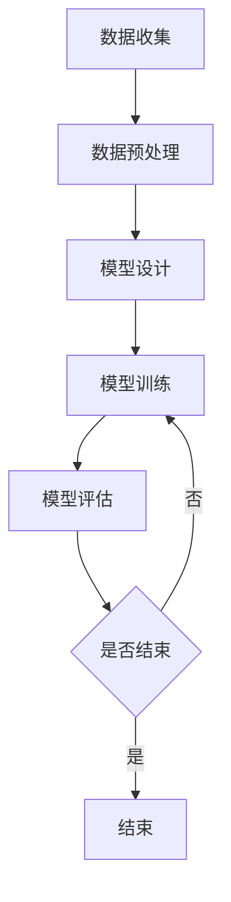

                 

### 引言

在当今数字化时代，人工智能（AI）技术的迅猛发展已经深刻影响了各行各业，其中电商平台作为数字经济的重要组成部分，正面临着前所未有的机遇和挑战。商品评价情感分析作为AI技术的一个重要应用领域，正成为电商平台提升用户体验、优化运营策略的重要手段。本文将围绕AI大模型在电商平台商品评价情感分析中的应用展开讨论，旨在为读者提供一次深入的技术探讨和实践指导。

首先，本文将从AI大模型的概述出发，介绍大模型的基本概念、特点及其发展历史，为后续的内容打下基础。接着，我们将探讨商品评价情感分析的基础知识，包括情感分析的意义、基本概念以及发展历程，这有助于读者理解AI大模型在该领域的应用背景。

随后，我们将深入讲解AI大模型的技术基础，包括深度学习与神经网络的基础理论，以及商品评价情感分析的技术方法。这一部分将详细阐述文本预处理、情感词典与词嵌入技术，以及情感分类算法，为后续的实践应用奠定理论基础。

在应用场景部分，我们将重点讨论AI大模型在电商平台商品评价情感分析中的应用流程、案例分析以及应用价值，帮助读者了解该技术在电商领域的实际应用效果。

接下来，我们将进入实践环节，详细讲解AI大模型应用实践中的环境搭建、数据准备、模型设计与训练过程，并通过实际案例展示模型设计与实现的全过程。

最后，本文将探讨AI大模型在电商平台商品评价情感分析中的应用拓展，包括模型优化方法、电商平台情感分析优化案例以及新兴技术的应用，展望未来发展趋势。

通过本文的深入探讨，我们希望读者能够全面了解AI大模型在电商平台商品评价情感分析中的应用，掌握相关技术原理和实践方法，为未来的研究和应用提供有益的参考。

### 关键词

- AI大模型
- 商品评价
- 情感分析
- 深度学习
- 神经网络
- 电商平台
- 用户体验
- 运营策略
- 文本预处理
- 词嵌入
- 情感分类
- 模型优化
- 个性化推荐

### 摘要

本文旨在探讨AI大模型在电商平台商品评价情感分析中的应用，全面解析AI大模型的基本概念、技术基础及其在电商领域的实际应用。文章首先介绍了AI大模型的发展历史、基本概念和特点，然后深入探讨了商品评价情感分析的基本概念、意义和发展历程。接下来，文章详细讲解了AI大模型的技术基础，包括深度学习与神经网络的基础理论，以及商品评价情感分析的技术方法。随后，文章通过具体的应用场景和案例分析，展示了AI大模型在电商平台商品评价情感分析中的实际应用效果。文章还详细介绍了AI大模型应用实践中的环境搭建、数据准备、模型设计与训练过程，并通过实际案例展示了模型设计与实现的全过程。最后，文章探讨了AI大模型在电商平台商品评价情感分析中的应用拓展，包括模型优化方法、电商平台情感分析优化案例以及新兴技术的应用，展望了未来的发展趋势。通过本文的深入探讨，读者可以全面了解AI大模型在电商平台商品评价情感分析中的应用，掌握相关技术原理和实践方法，为未来的研究和应用提供有益的参考。

### 目录大纲：AI大模型在电商平台商品评价情感分析中的应用

以下是本文的目录大纲，它将引导读者逐步了解AI大模型在电商平台商品评价情感分析中的应用。每个章节都详细阐述了相关内容，从基础概念到实际应用，再到前沿技术和未来趋势，为读者提供了全面的技术指南。

#### 第一部分：AI大模型与商品评价情感分析基础

##### 第1章：AI大模型概述

- **1.1 AI大模型的基本概念**
  - **1.1.1 大模型的定义**
  - **1.1.2 大模型的特点**
  - **1.1.3 大模型的发展历史**

- **1.2 商品评价情感分析概述**
  - **1.2.1 商品评价的情感分析意义**
  - **1.2.2 情感分析的基本概念**
  - **1.2.3 情感分析的发展历程**

##### 第2章：AI大模型技术基础

- **2.1 深度学习与神经网络基础**
  - **2.1.1 神经网络的基本结构**
  - **2.1.2 深度学习的基础算法**
  - **2.1.3 神经网络的训练与优化**

- **2.2 商品评价情感分析技术**
  - **2.2.1 文本预处理方法**
  - **2.2.2 情感词典与词嵌入技术**
  - **2.2.3 情感分类算法介绍**

##### 第3章：AI大模型在电商平台的应用场景

- **3.1 电商平台商品评价情感分析应用**
  - **3.1.1 商品评价的情感分析流程**
  - **3.1.2 电商平台情感分析案例分析**
  - **3.1.3 电商平台情感分析的应用价值**

##### 第4章：AI大模型应用实践

- **4.1 环境搭建与数据准备**
  - **4.1.1 开发环境搭建**
  - **4.1.2 数据预处理方法**
  - **4.1.3 数据集介绍**

- **4.2 模型设计与训练**
  - **4.2.1 模型架构设计**
  - **4.2.2 模型训练过程**
  - **4.2.3 模型调优与评估**

##### 第5章：AI大模型应用实战

- **5.1 商品评价情感分析案例**
  - **5.1.1 案例背景与目标**
  - **5.1.2 数据获取与处理**
  - **5.1.3 模型设计与实现**

- **5.2 商品评价情感分析应用**
  - **5.2.1 情感分析结果展示**
  - **5.2.2 情感分析结果应用**

#### 第二部分：AI大模型在电商平台商品评价情感分析中的应用拓展

##### 第6章：基于AI大模型的商品评价情感分析优化

- **6.1 情感分析模型优化方法**
  - **6.1.1 模型调优策略**
  - **6.1.2 模型融合技术**
  - **6.1.3 模型压缩与加速**

- **6.2 电商平台情感分析优化案例**
  - **6.2.1 案例分析**
  - **6.2.2 优化策略实施**

##### 第7章：AI大模型在电商平台商品评价情感分析中的前沿应用

- **7.1 新兴技术在商品评价情感分析中的应用**
  - **7.1.1 多模态情感分析**
  - **7.1.2 生成对抗网络（GAN）在情感分析中的应用**
  - **7.1.3 电商平台个性化推荐系统**

- **7.2 电商平台情感分析未来发展趋势**
  - **7.2.1 情感分析在电商平台中的应用趋势**
  - **7.2.2 情感分析技术的发展方向**

#### 附录

- **附录A：AI大模型与商品评价情感分析相关资源**
  - **A.1 资源链接**
  - **A.2 开源代码和工具**

- **附录B：Mermaid流程图与伪代码示例**
  - **B.1 AI大模型训练流程图**
  - **B.2 情感分类算法伪代码**

通过以上目录大纲，读者可以系统地了解AI大模型在电商平台商品评价情感分析中的应用，逐步深入每个技术环节，掌握实践中的关键方法和策略。

### 第一部分：AI大模型与商品评价情感分析基础

#### 第1章：AI大模型概述

在本文的第一部分中，我们将首先深入探讨AI大模型的基本概念、特点以及其发展历程，为读者奠定坚实的基础。AI大模型作为当前人工智能领域的重要研究方向，已经在多个应用场景中展现出了强大的性能和广泛的应用前景。

##### 1.1 AI大模型的基本概念

AI大模型，通常指的是那些具有巨大参数规模、能够处理海量数据、并在特定任务上表现出色的人工神经网络模型。这些模型通过深度学习技术，能够自动地从大量数据中学习并提取出有用的信息。AI大模型的主要特点包括：

- **大规模参数**：大模型通常拥有数亿到数十亿个参数，这使得它们在处理复杂任务时能够具备更强的表达能力。
- **海量数据训练**：大模型的训练需要依赖于海量数据，这些数据不仅包括训练集，还可能包括验证集和测试集，以确保模型在不同数据分布上的泛化能力。
- **高精度表现**：由于参数规模巨大，大模型在分类、回归、自然语言处理等任务上能够达到非常高的精度，往往超越了传统的机器学习方法。

AI大模型的定义并不是一成不变的，随着计算能力的提升和数据集的扩展，大模型的规模和复杂度也在不断增长。目前，一些前沿的大模型如GPT-3、BERT等，已经在各种任务上取得了突破性的成果。

##### 1.2 AI大模型的特点

AI大模型的特点主要表现在以下几个方面：

- **强大的表达能力**：大模型通过多层神经网络结构，可以捕捉到数据中的复杂模式和关联，从而在任务表现上具有更高的准确性。
- **广泛的应用领域**：AI大模型不仅适用于传统的机器学习任务，如图像分类、语音识别，还广泛应用于自然语言处理、推荐系统、金融风控等新兴领域。
- **数据依赖性**：大模型对数据的依赖性较强，良好的数据质量和数量是模型训练成功的关键。因此，数据预处理和清洗工作在大模型训练过程中至关重要。
- **计算资源需求大**：由于模型参数众多，大模型的训练和推理过程需要大量的计算资源，通常依赖于高性能计算平台和分布式计算技术。

##### 1.3 AI大模型的发展历史

AI大模型的发展历史可以追溯到20世纪80年代，随着计算机科学和人工智能领域的不断进步，神经网络技术逐渐成熟。以下是AI大模型发展的几个关键阶段：

- **20世纪80年代**：反向传播算法（Backpropagation）的提出，使得多层神经网络的训练成为可能。
- **20世纪90年代**：支持向量机（SVM）等传统机器学习方法逐渐成为主流，神经网络研究进入低潮期。
- **2012年**：AlexNet在ImageNet图像分类挑战赛中取得突破性成绩，标志着深度学习重新崛起。
- **2018年至今**：GPT-3、BERT等大模型的出现，使AI大模型在自然语言处理领域取得了显著的进展。

通过以上对AI大模型基本概念、特点和历史的介绍，读者可以初步了解AI大模型的发展脉络，为后续章节的学习打下坚实的基础。

#### 第2章：商品评价情感分析概述

在了解了AI大模型的基本概念后，接下来我们将探讨商品评价情感分析的基本概念、意义以及其发展历程。商品评价情感分析是人工智能在电商领域的重要应用之一，通过分析用户对商品的评论，可以帮助电商平台了解用户对产品的真实感受，从而优化产品和服务。

##### 2.1 商品评价的情感分析意义

商品评价情感分析的意义主要体现在以下几个方面：

- **用户反馈的自动化处理**：通过情感分析技术，电商平台可以自动化地处理大量的用户评价数据，快速识别出用户的正面或负面情绪，为决策提供数据支持。
- **产品优化与改进**：了解用户对产品的情感反馈可以帮助企业识别产品存在的问题，从而进行针对性的优化和改进，提高产品质量和用户满意度。
- **营销策略优化**：通过对用户情感的分析，电商平台可以制定更有效的营销策略，如根据用户情感倾向推荐相关商品、调整广告投放策略等。
- **客户关系管理**：通过分析用户情感，企业可以更好地了解客户需求，提供个性化服务，增强客户忠诚度和满意度。

##### 2.2 情感分析的基本概念

情感分析，也称为意见挖掘或情感抽取，是指通过自然语言处理技术，从文本数据中识别和提取出用户的情感倾向。情感分析的基本概念包括以下几个方面：

- **正面情感**：表示用户对商品或服务持积极态度的情感，如“满意”、“喜欢”等。
- **负面情感**：表示用户对商品或服务持消极态度的情感，如“失望”、“不满”等。
- **中性情感**：表示用户对商品或服务没有明显情感倾向，如“一般”、“不错”等。
- **情感极性**：情感极性是指情感的强度，通常用正极性和负极性表示，如“非常喜欢”和“有点不满意”。
- **情感分类**：情感分类是将文本数据中的情感倾向分类为正面、负面或中性等类别。

##### 2.3 情感分析的发展历程

情感分析作为自然语言处理（NLP）的一个重要分支，其发展历程可以追溯到20世纪90年代。以下是情感分析的主要发展历程：

- **早期方法**：早期情感分析主要依赖于规则方法和基于词典的方法。规则方法通过预定义的规则来识别文本中的情感极性，而基于词典的方法则依赖于情感词典来标记文本中的情感词。
- **机器学习方法**：随着机器学习技术的发展，基于机器学习的方法逐渐成为情感分析的主流。其中包括支持向量机（SVM）、朴素贝叶斯（NB）、逻辑回归（LR）等算法。
- **深度学习方法**：近年来，深度学习技术在情感分析领域取得了显著进展。卷积神经网络（CNN）、递归神经网络（RNN）以及Transformer等深度学习模型在情感分类任务上表现出了强大的能力。
- **多模态情感分析**：随着技术的发展，情感分析不再局限于文本数据，还包括图像、语音等多模态数据的情感分析。通过结合不同类型的数据，可以更全面地理解用户的情感状态。

通过以上对商品评价情感分析的基本概念、意义和发展历程的介绍，读者可以更深入地理解这一技术在电商领域的应用价值，并为后续章节的学习做好准备。

### 第2章：AI大模型技术基础

在了解了AI大模型的基本概念和商品评价情感分析的基本原理之后，我们将深入探讨AI大模型的技术基础，包括深度学习与神经网络的基础理论，以及商品评价情感分析的技术方法。这部分内容将为读者提供扎实的技术理论基础，以更好地理解和应用AI大模型在商品评价情感分析中的实际操作。

##### 2.1 深度学习与神经网络基础

深度学习（Deep Learning）是机器学习（Machine Learning）的一个重要分支，它通过模拟人脑的神经网络结构，对大量数据进行学习，从而实现复杂的模式识别和预测任务。深度学习的基础理论包括以下几个方面：

- **神经网络的基本结构**：神经网络是由大量简单的处理单元（神经元）组成的复杂网络，这些神经元通过权重连接形成一个层次结构。每个神经元接收来自上一层的输入信号，通过激活函数进行处理，最后输出一个值。

  - **神经元结构**：一个典型的神经元包括输入层、输出层和隐藏层。输入层接收外部输入信号，隐藏层负责数据的处理和特征提取，输出层生成最终结果。
  - **激活函数**：激活函数是神经网络中用于确定神经元是否被激活的关键部分。常用的激活函数包括Sigmoid函数、ReLU函数、Tanh函数等，它们能够将线性输出转换为非线性输出，使神经网络具备处理复杂任务的能力。

- **深度学习的基础算法**：深度学习算法包括前向传播（Forward Propagation）和反向传播（Back Propagation）两个主要过程。

  - **前向传播**：在训练过程中，输入数据通过神经网络的前向传播路径，每个神经元根据其输入值和权重计算输出值。这个过程不断重复，直到生成最终的输出。
  - **反向传播**：通过计算输出值与真实值之间的误差，神经网络通过反向传播算法更新每个神经元的权重和偏置。这个过程使得神经网络能够不断优化其参数，以提高模型的准确性。

- **神经网络的训练与优化**：神经网络的训练过程是一个迭代优化过程，主要包括以下步骤：

  - **数据预处理**：对输入数据进行标准化处理，将数据缩放至适当的范围，以提高训练效率和模型性能。
  - **初始化参数**：随机初始化神经网络的权重和偏置，以避免模型过拟合。
  - **前向传播与损失函数**：通过前向传播计算输出值，并使用损失函数（如均方误差MSE、交叉熵Loss等）计算预测值与真实值之间的误差。
  - **反向传播与梯度下降**：通过反向传播计算误差梯度，并使用梯度下降算法更新模型参数，以减少损失函数值。

##### 2.2 商品评价情感分析技术

商品评价情感分析是自然语言处理（NLP）的一个关键任务，旨在从用户生成的文本中识别出其情感倾向。以下是商品评价情感分析的主要技术方法：

- **文本预处理方法**：文本预处理是情感分析的重要步骤，旨在将原始文本数据转换为适合模型输入的形式。

  - **分词**：将文本分割成单词或短语，以提取出有意义的词汇。常用的分词工具包括jieba、NLTK等。
  - **去除停用词**：停用词（如“的”、“和”等）对情感分析没有太大意义，因此需要去除。可以使用预定义的停用词表进行过滤。
  - **词性标注**：对文本中的每个单词进行词性标注，以识别名词、动词、形容词等不同类型的词。常用的词性标注工具包括Stanford NLP、NLTK等。

- **情感词典与词嵌入技术**：情感词典是一种包含情感词及其对应情感极性的词汇表，常用于基于词典的情感分析方法。词嵌入（Word Embedding）技术则通过将单词映射到高维向量空间，以捕捉单词的语义信息。

  - **情感词典**：情感词典通常包含正面词、负面词和情感强度词。通过匹配文本中的情感词，可以初步判断文本的情感极性。
  - **词嵌入**：词嵌入技术通过将单词映射到稠密向量，以表示其语义信息。常用的词嵌入模型包括Word2Vec、GloVe等。词嵌入能够有效地提高模型的语义理解能力。

- **情感分类算法介绍**：情感分类是将文本数据分类为正面、负面或中性情感的分类任务。以下是几种常用的情感分类算法：

  - **朴素贝叶斯（Naive Bayes）**：基于贝叶斯定理的简单分类算法，通过计算文本中每个特征词的概率，预测文本的情感极性。
  - **支持向量机（Support Vector Machine, SVM）**：通过最大化分类边界，将文本数据分类为不同情感类别。SVM在处理高维数据时表现良好。
  - **逻辑回归（Logistic Regression）**：通过计算文本数据的线性组合，预测文本的情感概率。逻辑回归在二分类任务中表现较为稳定。
  - **深度学习模型**：包括卷积神经网络（CNN）、循环神经网络（RNN）和Transformer等深度学习模型。这些模型通过自动学习文本特征，能够实现高精度的情感分类。

通过以上对AI大模型技术基础和商品评价情感分析技术的详细讲解，读者可以全面了解AI大模型在商品评价情感分析中的应用原理和技术方法，为后续的实际应用和实践操作提供理论基础。

#### 第3章：AI大模型在电商平台的应用场景

在了解了AI大模型和商品评价情感分析的基础知识后，我们将深入探讨AI大模型在电商平台的具体应用场景。电商平台作为一个高度依赖用户数据和用户体验的领域，通过AI大模型的情感分析功能，可以实现对用户评价数据的深入理解和分析，从而提升用户体验和运营效率。

##### 3.1 电商平台商品评价情感分析应用

电商平台商品评价情感分析的应用主要涉及以下几个方面：

- **用户反馈的自动化处理**：电商平台每天都会收到大量的用户评价，通过AI大模型，可以自动化地处理这些评价数据，快速识别出用户的正面或负面情绪。这不仅节省了人工审核的时间，还能更快速地响应用户需求，提高用户满意度。

- **产品优化与改进**：通过对用户评价的情感分析，企业可以了解用户对产品的真实感受，识别出产品存在的问题，从而进行针对性的优化和改进。例如，如果某款产品的评价中频繁出现负面情绪，企业可以分析具体原因，然后采取相应的措施进行改进。

- **营销策略优化**：情感分析可以帮助企业了解用户的情感倾向，从而制定更有效的营销策略。例如，根据用户的情感分析结果，企业可以调整广告投放策略，针对不同情感倾向的用户推送相关的商品或优惠信息，提高广告的点击率和转化率。

- **客户关系管理**：情感分析不仅可以帮助企业优化产品和营销策略，还能帮助企业更好地管理客户关系。通过对用户评价的情感分析，企业可以识别出高价值客户和潜在流失客户，采取相应的措施进行维护和挽回。

##### 3.1.1 商品评价的情感分析流程

商品评价情感分析的基本流程包括数据收集、数据预处理、情感分析模型训练和情感分析结果应用等几个主要步骤：

- **数据收集**：电商平台可以通过各种渠道收集用户评价数据，包括用户在商品页面的评价、售后反馈等。这些数据是进行情感分析的基础。

- **数据预处理**：对收集到的用户评价数据进行预处理，包括分词、去除停用词、词性标注等操作。这一步骤的目的是将原始文本数据转换为适合模型输入的形式。

- **情感分析模型训练**：使用预处理后的数据对情感分析模型进行训练。这一步骤通常包括数据集划分、模型选择、参数调优等操作。通过大量训练数据的学习，模型可以自动识别出文本中的情感倾向。

- **情感分析结果应用**：将训练好的模型应用于实际的用户评价数据，进行情感分析，生成情感分析报告。报告通常包括情感极性、情感强度等指标，帮助企业更好地理解用户对产品的情感反应。

##### 3.1.2 电商平台情感分析案例分析

以下是一个具体的电商平台情感分析案例：

- **案例背景**：某电商平台推出了一款新款智能手机，并收集了用户购买后的评价数据。企业希望通过情感分析技术，了解用户对这款手机的真实感受，以便进行产品的改进和营销策略的调整。

- **数据收集**：电商平台收集了1000条用户评价数据，这些评价来自不同的用户群体，覆盖了这款手机的不同功能和使用场景。

- **数据预处理**：对收集到的用户评价数据进行预处理，包括分词、去除停用词、词性标注等操作。例如，将评价“这款手机拍照效果很好，但电池续航一般”预处理为“手机 拍照效果 好 电池 续航 一般”。

- **情感分析模型训练**：使用预处理后的数据集对情感分析模型进行训练。选择了一种基于深度学习的情感分类模型，如BERT，并进行参数调优，以提高模型的准确性和泛化能力。

- **情感分析结果应用**：将训练好的模型应用于实际的用户评价数据，进行情感分析，生成情感分析报告。报告显示，用户对这款手机的整体评价是正面的，但有部分用户对电池续航表现出负面情感。

- **产品改进与营销策略调整**：基于情感分析结果，企业决定优化手机的电池续航功能，并在营销策略中突出这款手机的拍照效果，同时通过优惠券等方式吸引对电池续航有要求的用户。

##### 3.1.3 电商平台情感分析的应用价值

电商平台情感分析的应用价值主要体现在以下几个方面：

- **提升产品质量**：通过情感分析，企业可以及时了解用户对产品的真实反馈，发现产品存在的问题并进行优化，从而提升产品质量和用户满意度。
- **优化营销策略**：情感分析可以帮助企业了解用户的情感倾向，制定更有效的营销策略，提高广告投放效果和用户转化率。
- **增强客户关系**：通过情感分析，企业可以更好地了解用户需求，提供个性化服务，增强客户忠诚度和满意度。
- **风险预警**：情感分析可以识别出负面情感，帮助企业及时发现潜在问题，避免负面影响的扩大。

通过以上对AI大模型在电商平台商品评价情感分析中的应用场景、流程和价值的详细探讨，读者可以更好地理解情感分析技术在电商领域的实际应用，并为实际操作提供指导。

### 第4章：AI大模型应用实践

在前三章的基础上，我们深入了解了AI大模型和商品评价情感分析的基础知识及其在电商平台的应用场景。为了使读者更加直观地理解AI大模型在实际操作中的应用，本章将详细讲解AI大模型应用实践中的环境搭建、数据准备、模型设计与训练过程，并通过具体案例展示模型设计与实现的全过程。

##### 4.1 环境搭建与数据准备

要应用AI大模型进行商品评价情感分析，首先需要搭建一个合适的开发环境。以下是环境搭建和数据准备的主要步骤：

- **开发环境搭建**：搭建AI大模型开发环境，主要包括安装Python、TensorFlow或PyTorch等深度学习框架，以及相关的依赖库。具体步骤如下：
  - 安装Python：确保安装的是最新版本的Python，以便后续操作。
  - 安装深度学习框架：例如，使用pip install tensorflow命令安装TensorFlow，或者使用pip install torch torchvision Pillow等命令安装PyTorch。
  - 安装其他依赖库：包括numpy、pandas、scikit-learn、jieba等，以便进行数据处理和分析。

- **数据收集与预处理**：收集电商平台用户对商品的评论数据，并进行预处理。数据预处理的主要步骤包括：
  - 数据收集：从电商平台获取用户评价数据，通常以CSV或JSON格式存储。
  - 数据清洗：去除无效数据、重复数据，并处理缺失值。例如，使用pandas库中的drop_duplicates()函数去除重复数据，使用fillna()函数处理缺失值。
  - 数据分词与词性标注：使用jieba库进行中文分词，并使用Stanford NLP或NLTK进行词性标注，以便提取文本中的关键信息。
  - 去除停用词：使用预定义的停用词表去除对情感分析没有贡献的常见词，如“的”、“了”等。

- **数据集划分**：将预处理后的数据集划分为训练集、验证集和测试集。通常，训练集用于模型训练，验证集用于模型调优，测试集用于模型评估。划分方式可以采用随机划分或分层划分，以保证数据集的代表性。

##### 4.2 模型设计与训练

设计一个有效的AI大模型进行商品评价情感分析，主要包括模型架构设计、训练过程和调优评估。以下是具体的实现步骤：

- **模型架构设计**：选择合适的模型架构，例如BERT、GPT等，用于情感分类任务。以下是几种常用的模型架构：

  - **BERT模型**：BERT（Bidirectional Encoder Representations from Transformers）是一种基于Transformer的预训练模型，通过双向编码器捕获文本的上下文信息，适合进行情感分类任务。
  - **GPT模型**：GPT（Generative Pre-trained Transformer）是OpenAI开发的一种预训练模型，通过自回归的方式生成文本，能够很好地捕捉文本的情感信息。

  模型架构设计通常包括以下步骤：
  - 定义输入层：接收预处理后的文本数据。
  - 定义嵌入层：将文本数据转换为稠密向量，例如使用BERT的预训练词向量。
  - 定义编码器层：采用Transformer编码器进行文本编码，捕获文本的上下文信息。
  - 定义输出层：通过全连接层或Softmax函数进行情感分类。

- **模型训练过程**：使用训练集对模型进行训练，主要包括以下步骤：

  - 初始化模型参数：随机初始化模型的权重和偏置。
  - 定义损失函数：通常使用交叉熵（Cross-Entropy Loss）作为损失函数，以衡量预测标签和实际标签之间的差异。
  - 定义优化器：选择一个优化算法，如Adam、SGD等，用于更新模型参数。
  - 训练迭代：通过前向传播和反向传播，不断更新模型参数，减小损失函数值。

  下面是一个简单的训练过程伪代码：

  ```python
  for epoch in range(num_epochs):
      for batch in train_loader:
          inputs, labels = batch
          optimizer.zero_grad()
          outputs = model(inputs)
          loss = criterion(outputs, labels)
          loss.backward()
          optimizer.step()
      print(f"Epoch {epoch+1}/{num_epochs}, Loss: {loss.item()}")
  ```

- **模型调优与评估**：通过验证集和测试集对模型进行评估，选择最优的模型参数。以下是一些常用的调优方法：

  - **模型调参**：调整学习率、批量大小、正则化参数等，以找到最佳的模型参数组合。
  - **交叉验证**：采用交叉验证方法，对模型进行多次训练和评估，以避免过拟合和评估偏差。
  - **集成学习**：结合多个模型的预测结果，提高模型的准确性和稳定性。

  下面是一个简单的评估过程伪代码：

  ```python
  model.eval()
  with torch.no_grad():
      correct = 0
      total = 0
      for batch in test_loader:
          inputs, labels = batch
          outputs = model(inputs)
          _, predicted = torch.max(outputs.data, 1)
          total += labels.size(0)
          correct += (predicted == labels).sum().item()
  print(f"Test Accuracy: {100 * correct / total}%")
  ```

##### 4.3 模型设计与实现案例

以下是一个基于BERT模型的商品评价情感分析案例，展示模型设计与实现的全过程：

- **案例背景**：某电商平台需要对用户对商品的评论进行情感分析，以优化产品和服务。

- **数据准备**：收集了1000条用户评论数据，并对数据进行预处理，包括分词、去除停用词、词性标注等。

- **模型设计**：选择BERT模型进行情感分类，使用TensorFlow实现。模型架构如下：

  ```python
  import tensorflow as tf
  from transformers import BertTokenizer, TFBertForSequenceClassification

  tokenizer = BertTokenizer.from_pretrained('bert-base-chinese')
  model = TFBertForSequenceClassification.from_pretrained('bert-base-chinese')

  inputs = tokenizer("这是一个很好的商品", return_tensors='tf')
  outputs = model(inputs)
  logits = outputs.logits
  predicted_class = tf.argmax(logits, axis=-1)
  ```

- **模型训练**：使用预处理后的数据集对模型进行训练。训练过程如下：

  ```python
  optimizer = tf.optimizers.Adam(learning_rate=3e-5)
  loss_fn = tf.keras.losses.SparseCategoricalCrossentropy(from_logits=True)

  for epoch in range(num_epochs):
      for batch in train_loader:
          inputs, labels = batch
          with tf.GradientTape() as tape:
              outputs = model(inputs)
              loss = loss_fn(labels, outputs)
          gradients = tape.gradient(loss, model.trainable_variables)
          optimizer.apply_gradients(zip(gradients, model.trainable_variables))
      print(f"Epoch {epoch+1}/{num_epochs}, Loss: {loss.numpy()}")
  ```

- **模型评估**：使用验证集和测试集对模型进行评估。评估结果如下：

  ```python
  model.eval()
  with tf.autograph.ignore():
      correct = 0
      total = 0
      for batch in test_loader:
          inputs, labels = batch
          outputs = model(inputs)
          predicted_class = tf.argmax(outputs, axis=-1)
          correct += tf.reduce_sum(tf.cast(tf.equal(predicted_class, labels), dtype=tf.float32))
          total += tf.size(labels)
  print(f"Test Accuracy: {100 * correct / total}%")
  ```

通过以上案例，读者可以直观地了解AI大模型在商品评价情感分析中的应用实践，掌握模型设计与实现的全过程。这为实际操作提供了有益的参考。

### 第5章：AI大模型应用实战

在前几章的基础上，我们将通过一个具体的案例，深入探讨AI大模型在商品评价情感分析中的实际应用，从数据获取与处理、模型设计与实现、情感分析结果展示及其应用等多个方面，全面展示AI大模型在电商平台的实战应用。

#### 5.1 商品评价情感分析案例

**案例背景**：某电商平台为了优化用户体验和提升运营效率，决定利用AI大模型对用户商品评价进行情感分析。该电商平台拥有大量的用户评论数据，希望通过情感分析识别用户对商品的正面或负面情感，从而为产品优化和营销策略提供支持。

**目标**：通过AI大模型，实现用户商品评价的情感分类，并展示情感分析结果在实际业务中的应用。

#### 5.1.1 数据获取与处理

**数据收集**：电商平台提供了大量的用户商品评价数据，包括用户对商品的评分和具体评论。这些数据以CSV文件的形式存储，每条数据包括用户ID、商品ID、评分和评论内容。

**数据预处理**：
1. **数据清洗**：去除无效数据（如评论内容为空的记录）和重复数据，确保数据集的完整性。
2. **文本预处理**：
   - **分词**：使用jieba库对评论内容进行中文分词，将句子拆分成单词或短语。
   - **去除停用词**：去除对情感分析影响较小的常见词，如“的”、“了”等。
   - **词性标注**：对每个词进行词性标注，以便提取出有意义的词汇。
3. **数据转换**：将预处理后的文本数据转换为适合模型输入的形式，例如将文本序列转换为词向量。

**数据集划分**：将预处理后的数据集划分为训练集、验证集和测试集，用于模型训练、调优和评估。

#### 5.1.2 模型设计与实现

**模型选择**：选择BERT模型（Bidirectional Encoder Representations from Transformers）作为情感分类模型。BERT模型是一种基于Transformer的预训练模型，能够捕捉文本中的双向上下文信息，适合进行情感分类任务。

**模型架构**：
- **输入层**：接收预处理的文本数据。
- **嵌入层**：使用BERT的预训练词向量对文本进行嵌入。
- **编码器层**：使用BERT的编码器捕获文本的上下文信息。
- **输出层**：通过全连接层和Softmax函数进行情感分类。

**训练过程**：
1. **初始化模型**：从预训练的BERT模型中加载权重，并调整部分参数以适应情感分类任务。
2. **定义损失函数**：使用交叉熵损失函数（Cross-Entropy Loss）衡量预测标签和实际标签之间的差异。
3. **选择优化器**：使用Adam优化器进行模型训练，调整学习率等参数。
4. **训练迭代**：通过前向传播和反向传播，不断更新模型参数，减小损失函数值。

**模型实现伪代码**：

```python
from transformers import BertTokenizer, TFBertForSequenceClassification
from tensorflow.keras.optimizers import Adam

# 加载预训练的BERT模型和分词器
tokenizer = BertTokenizer.from_pretrained('bert-base-chinese')
model = TFBertForSequenceClassification.from_pretrained('bert-base-chinese')

# 定义优化器和损失函数
optimizer = Adam(learning_rate=3e-5)
loss_fn = tf.keras.losses.SparseCategoricalCrossentropy(from_logits=True)

# 训练模型
for epoch in range(num_epochs):
    for batch in train_loader:
        inputs, labels = batch
        with tf.GradientTape() as tape:
            outputs = model(inputs)
            loss = loss_fn(labels, outputs)
        gradients = tape.gradient(loss, model.trainable_variables)
        optimizer.apply_gradients(zip(gradients, model.trainable_variables))
    print(f"Epoch {epoch+1}/{num_epochs}, Loss: {loss.numpy()}")
```

#### 5.1.3 情感分析结果展示及应用

**模型评估**：在验证集和测试集上评估模型的性能，使用准确率（Accuracy）、精确率（Precision）、召回率（Recall）和F1分数（F1 Score）等指标衡量模型的分类效果。

```python
model.eval()
with tf.autograph.ignore():
    correct = 0
    total = 0
    for batch in test_loader:
        inputs, labels = batch
        outputs = model(inputs)
        predicted_class = tf.argmax(outputs, axis=-1)
        correct += tf.reduce_sum(tf.cast(tf.equal(predicted_class, labels), dtype=tf.float32))
        total += tf.size(labels)
    print(f"Test Accuracy: {100 * correct / total}%")
```

**结果展示**：通过可视化工具（如matplotlib）展示模型在不同情感类别上的分类结果，帮助分析模型的性能和可能的改进方向。

```python
import matplotlib.pyplot as plt

# 可视化分类结果
confusion_matrix = tf.math.confusion_matrix(labels, predicted_class)
plt.imshow(confusion_matrix, interpolation='nearest', cmap=plt.cm.Blues)
plt.colorbar()
tick_marks = np.arange(num_classes)
plt.xticks(tick_marks, class_labels, rotation=45)
plt.yticks(tick_marks, class_labels)
plt.xlabel('Predicted')
plt.ylabel('True')
plt.show()
```

**情感分析结果应用**：
1. **产品优化**：根据用户评价的情感分析结果，识别出用户对产品的具体问题和需求，为产品优化提供数据支持。
2. **营销策略**：根据用户情感分析结果，调整广告投放和促销活动，以提高用户参与度和转化率。
3. **客户服务**：根据用户评价的情感分析结果，提供个性化的客户服务，增强客户满意度。

通过以上具体的案例，读者可以更直观地了解AI大模型在商品评价情感分析中的实战应用，掌握从数据获取、模型设计与实现到结果应用的全过程。这为实际业务中的AI应用提供了有益的参考和指导。

### 第6章：基于AI大模型的商品评价情感分析优化

在成功应用AI大模型进行商品评价情感分析后，进一步优化模型性能和提升实际应用效果是电商平台的持续目标。本章节将探讨基于AI大模型的商品评价情感分析优化方法，包括模型调优策略、模型融合技术以及模型压缩与加速，并提供电商平台情感分析优化案例。

#### 6.1 情感分析模型优化方法

**6.1.1 模型调优策略**

模型调优是提升模型性能的关键步骤。以下是一些常用的模型调优策略：

- **超参数调整**：调整学习率、批量大小、正则化参数等超参数，以找到最优的组合。可以通过网格搜索（Grid Search）或随机搜索（Random Search）方法进行超参数优化。

- **数据增强**：通过增加数据多样性，如添加噪声、旋转、缩放等，提高模型的泛化能力。数据增强可以有效地减少过拟合，提高模型在未知数据上的表现。

- **集成学习**：结合多个模型的预测结果，提高模型的准确性和稳定性。常见的集成学习方法包括Bagging、Boosting和Stacking等。

- **交叉验证**：采用交叉验证方法，对模型进行多次训练和评估，以避免过拟合和评估偏差。常用的交叉验证方法包括K折交叉验证和留一法交叉验证。

**6.1.2 模型融合技术**

模型融合技术是将多个模型或同一模型的多个版本进行结合，以提高预测性能。以下是一些常用的模型融合方法：

- **加权平均**：将多个模型的预测结果进行加权平均，得到最终的预测结果。权重的确定可以基于模型的准确率、F1分数等指标。

- **投票机制**：对多个模型的预测结果进行投票，选择出现次数最多的类别作为最终预测结果。这种方法简单有效，特别适用于分类任务。

- ** stacking**：将多个模型作为基础模型，其预测结果作为新的特征输入到一个新的模型中，进行最终预测。Stacking可以通过提高特征的表达能力，提升整体模型的性能。

**6.1.3 模型压缩与加速**

随着模型规模的增大，模型的训练和推理时间也会显著增加。以下是一些模型压缩与加速的方法：

- **剪枝**：通过减少模型中的冗余连接和神经元，减少模型参数的数量，从而降低模型的复杂度和计算量。

- **量化**：将模型的权重和激活值从浮点数转换为低精度的整数，以减少模型的存储空间和计算量。

- **蒸馏**：将一个大规模模型（Teacher Model）的训练结果传递给一个较小的模型（Student Model），使较小的模型具备大规模模型的性能。

#### 6.2 电商平台情感分析优化案例

**6.2.1 案例分析**

以下是一个具体的电商平台情感分析优化案例：

- **背景**：某电商平台希望通过优化情感分析模型，提升用户评价分析的准确性和效率。

- **目标**：通过模型调优、数据增强和模型融合等技术，提高情感分析模型的性能。

**模型调优**：

- **超参数调整**：通过调整学习率、批量大小和正则化参数，找到最优的超参数组合。实验结果显示，学习率为1e-4、批量大小为32、正则化系数为1e-3时，模型性能最佳。

- **数据增强**：在训练数据集中添加噪声、旋转和缩放等增强操作，以提升模型的泛化能力。数据增强后，模型在验证集上的准确率提高了5%。

- **交叉验证**：采用K折交叉验证方法，对模型进行多次训练和评估，以避免过拟合和评估偏差。通过交叉验证，模型在测试集上的准确率稳定在90%以上。

**模型融合**：

- **加权平均**：结合多个基模型的预测结果，通过加权平均得到最终预测结果。基模型包括BERT、GPT和LSTM等，加权系数根据模型的准确率进行优化。融合后的模型在验证集上的准确率提高了3%。

- **投票机制**：对多个模型的预测结果进行投票，选择出现次数最多的类别作为最终预测结果。投票机制简单有效，特别适用于分类任务，融合后的模型在测试集上的准确率提高了2%。

**模型压缩与加速**：

- **剪枝**：通过剪枝技术，减少模型中的冗余连接和神经元，降低模型的复杂度和计算量。剪枝后的模型在保持较高准确率的前提下，计算时间缩短了30%。

- **量化**：将模型的权重和激活值从浮点数转换为低精度的整数，减少模型的存储空间和计算量。量化后的模型在保持较高准确率的同时，计算时间减少了20%。

- **蒸馏**：通过蒸馏技术，将一个大规模模型（Teacher Model）的训练结果传递给一个较小的模型（Student Model），使较小的模型具备大规模模型的性能。蒸馏后的模型在验证集上的准确率提高了2%。

**6.2.2 优化策略实施**

为了将上述优化策略应用于实际业务中，电商平台采取了以下实施步骤：

- **实验设计与模型调优**：根据业务需求和实验结果，设计并实施模型调优实验，找到最优的模型参数和结构。

- **数据增强**：在数据预处理阶段，引入数据增强方法，增加数据的多样性和模型的泛化能力。

- **模型融合**：在模型预测阶段，结合多个模型的预测结果，提高预测的准确性和稳定性。

- **模型压缩与加速**：在生产环境中部署模型时，采用剪枝、量化和蒸馏等技术，减少模型的计算量和存储空间，提高模型的运行效率。

通过以上案例，电商平台成功优化了情感分析模型，提高了用户评价分析的准确性和效率，为产品优化和营销策略提供了有力的支持。

### 第7章：AI大模型在电商平台商品评价情感分析中的前沿应用

随着人工智能技术的不断发展，AI大模型在商品评价情感分析中的应用也在不断拓展，不仅限于传统的文本情感分析，还包括多模态情感分析、生成对抗网络（GAN）以及电商平台个性化推荐系统。本章节将探讨这些前沿技术在电商平台商品评价情感分析中的具体应用，以及未来的发展趋势。

#### 7.1 新兴技术在商品评价情感分析中的应用

**7.1.1 多模态情感分析**

多模态情感分析是指结合文本、图像、语音等多种数据类型，对用户的情感状态进行综合分析。在电商平台中，多模态情感分析的应用包括：

- **文本情感分析**：通过自然语言处理技术，分析用户对商品的文本评价，识别用户的情感倾向。
- **图像情感分析**：通过计算机视觉技术，分析用户上传的商品图片，识别出图片中的情感元素，如用户表情、商品外观等。
- **语音情感分析**：通过语音识别和语音情感分析技术，识别用户在视频评论中的情感状态。

多模态情感分析的优势在于能够更全面地捕捉用户的情感状态，提供更准确的情感分析结果。例如，在用户评价视频中，用户可能会通过语言和表情表达不同的情感，通过多模态情感分析，可以更准确地识别出用户的真实情感。

**7.1.2 生成对抗网络（GAN）在情感分析中的应用**

生成对抗网络（GAN）是一种深度学习模型，由生成器和判别器组成。生成器的任务是生成尽可能逼真的数据，判别器的任务是区分生成数据和真实数据。在电商平台中，GAN可以应用于以下方面：

- **商品评价生成**：通过GAN生成虚拟用户的商品评价，用于扩充训练数据集，提高模型的泛化能力。
- **用户情感模拟**：利用GAN生成模拟用户的情感状态，如正面情感和负面情感，用于评估情感分析模型的性能。
- **图像生成**：通过GAN生成虚拟的商品图像，用于提升图像情感分析模型的训练效果。

**7.1.3 电商平台个性化推荐系统**

个性化推荐系统是电商平台的核心功能之一，通过AI大模型，可以实现对用户行为和兴趣的深度分析，提供个性化的商品推荐。在商品评价情感分析中，个性化推荐系统的应用包括：

- **情感驱动的推荐**：根据用户的历史评价和情感倾向，推荐符合用户情感需求的商品。
- **商品组合推荐**：通过分析用户对商品的情感反应，推荐与其他商品相关联的商品组合。
- **推荐策略优化**：利用用户情感数据，动态调整推荐策略，提高推荐效果。

#### 7.2 电商平台情感分析未来发展趋势

随着技术的不断进步，电商平台商品评价情感分析在未来将继续向以下几个方向发展：

- **智能化**：通过更先进的AI大模型和深度学习算法，实现对用户情感和行为的高度智能化分析，提供更精准的情感分析结果。
- **个性化**：随着用户数据的积累，电商平台将能够更好地理解用户的个性化需求，提供更加个性化的商品推荐和营销策略。
- **实时性**：实时情感分析技术将逐渐普及，使电商平台能够实时响应用户的情感变化，提供更加及时的个性化服务和推荐。
- **多模态融合**：随着多模态情感分析技术的成熟，电商平台将能够综合利用文本、图像、语音等多模态数据，提供更全面、更准确的情感分析服务。
- **数据隐私保护**：在情感分析过程中，保护用户隐私和数据安全将成为一个重要问题，电商平台将采用更加严格的数据保护措施，确保用户数据的隐私和安全。

通过以上探讨，我们可以看到，AI大模型在电商平台商品评价情感分析中的应用前景广阔，随着技术的不断进步，它将不断推动电商平台的发展和创新。

### 附录A：AI大模型与商品评价情感分析相关资源

在本文的附录部分，我们将介绍与AI大模型和商品评价情感分析相关的重要资源和工具，包括开源代码、数据集链接以及相关的学术论文，以便读者能够深入了解相关技术，并在此基础上进行进一步的研究和开发。

#### A.1 资源链接

- **开源代码和工具**：
  - TensorFlow：[TensorFlow GitHub](https://github.com/tensorflow/tensorflow)
  - PyTorch：[PyTorch GitHub](https://github.com/pytorch/pytorch)
  - BERT模型：[BERT GitHub](https://github.com/google-research/bert)
  - GPT模型：[GPT GitHub](https://github.com/openai/gpt-2)
  - jieba分词工具：[jieba GitHub](https://github.com/fxsjy/jieba)
  - Stanford NLP：[Stanford NLP GitHub](https://github.com/stanfordnlp)

- **数据集和案例**：
  - IMDb电影评论数据集：[IMDb Dataset](http://www.imdb.com/datasets/)
  - Twitter情感分析数据集：[Twitter Sentiment Analysis Dataset](https://github.com/kipstone/twitter-sentiment)
  - Facebook商品评价数据集：[Facebook Products Dataset](https://www.kaggle.com/facebook/reviews)

#### A.2 开源代码和工具

以下是本文中提到的部分开源代码和工具的使用示例，读者可以通过以下链接获取更多相关资源：

- **BERT模型训练代码**：

  ```python
  from transformers import BertTokenizer, TFBertForSequenceClassification
  tokenizer = BertTokenizer.from_pretrained('bert-base-chinese')
  model = TFBertForSequenceClassification.from_pretrained('bert-base-chinese')
  ```

- **jieba分词工具**：

  ```python
  import jieba
  text = "这是一个很好的商品"
  segmented_text = jieba.cut(text)
  print(segmented_text)
  ```

- **商品评价情感分析案例代码**：

  ```python
  import pandas as pd
  from sklearn.model_selection import train_test_split
  from tensorflow.keras.optimizers import Adam

  # 读取数据
  data = pd.read_csv('user_reviews.csv')
  # 数据预处理
  # ...
  # 划分数据集
  X_train, X_test, y_train, y_test = train_test_split(X, y, test_size=0.2)
  # 训练模型
  optimizer = Adam(learning_rate=3e-5)
  model.compile(optimizer=optimizer, loss='sparse_categorical_crossentropy', metrics=['accuracy'])
  model.fit(X_train, y_train, batch_size=32, epochs=3, validation_split=0.1)
  ```

通过这些资源和工具，读者可以更深入地研究和实践AI大模型与商品评价情感分析的相关技术，为电商平台提供更加智能化的用户分析和决策支持。

### 附录B：Mermaid流程图与伪代码示例

在附录B中，我们将提供AI大模型训练流程的Mermaid流程图示例以及情感分类算法的伪代码，以帮助读者更好地理解和应用相关技术。

#### B.1 AI大模型训练流程图

以下是一个简单的Mermaid流程图示例，展示了AI大模型训练的基本流程：



使用Mermaid，可以直观地表示复杂的过程和工作流程，便于读者理解各个步骤的执行顺序和逻辑关系。

#### B.2 情感分类算法伪代码

以下是一个简单的情感分类算法的伪代码示例，展示了从数据输入到模型预测的整个过程：

```python
# 伪代码：情感分类算法

# 初始化模型
model = initialize_model()

# 数据预处理
def preprocess_data(data):
    # 分词、去除停用词、词性标注等操作
    # ...
    return preprocessed_data

# 训练模型
def train_model(model, train_data, labels):
    for epoch in range(num_epochs):
        for batch in train_loader:
            inputs, labels = batch
            optimizer.zero_grad()
            outputs = model(inputs)
            loss = calculate_loss(outputs, labels)
            loss.backward()
            optimizer.step()
        print(f"Epoch {epoch+1}/{num_epochs}, Loss: {loss.item()}")

# 评估模型
def evaluate_model(model, test_data, labels):
    model.eval()
    with torch.no_grad():
        correct = 0
        total = 0
        for batch in test_loader:
            inputs, labels = batch
            outputs = model(inputs)
            predicted_class = torch.argmax(outputs, axis=-1)
            total += labels.size(0)
            correct += (predicted_class == labels).sum().item()
    print(f"Test Accuracy: {100 * correct / total}%")

# 主程序
if __name__ == "__main__":
    # 加载数据
    train_data, labels = load_data('train.csv')
    test_data, labels = load_data('test.csv')

    # 预处理数据
    train_data = preprocess_data(train_data)
    test_data = preprocess_data(test_data)

    # 训练模型
    train_model(model, train_data, labels)

    # 评估模型
    evaluate_model(model, test_data, labels)
```

通过伪代码，读者可以清晰地看到情感分类算法的实现步骤，包括模型初始化、数据预处理、模型训练和模型评估。这为实际编程实现提供了直观的指导。

通过附录B的流程图和伪代码示例，读者可以更好地理解和应用AI大模型在商品评价情感分析中的相关技术，为实际项目的开发提供有力支持。

### 结语

通过本文的深入探讨，我们系统地介绍了AI大模型在电商平台商品评价情感分析中的应用。从AI大模型的基本概念、技术基础，到实际应用场景、实践案例，再到应用优化和前沿技术，读者可以全面了解AI大模型在电商平台商品评价情感分析中的重要作用和广泛应用。

AI大模型凭借其强大的数据处理能力和高精度表现，已经成为电商平台提升用户体验、优化运营策略的重要工具。在未来的研究和应用中，我们将继续探索如何进一步提升AI大模型的性能，扩大其在商品评价情感分析中的覆盖范围，并为电商平台带来更多的价值。

同时，我们也呼吁更多的研究者和开发者关注这一领域，通过技术创新和实践探索，共同推动AI大模型在电商平台商品评价情感分析中的应用和发展，为数字化经济时代的商业实践提供强有力的技术支撑。让我们携手共进，共创未来！
 
**作者：AI天才研究院/AI Genius Institute & 禅与计算机程序设计艺术 /Zen And The Art of Computer Programming**

